# Flink项目

## 今日课程内容介绍

* Metabase可视化
* 性能优化（不仅仅是FlinkSQL）
  * 配置参数优化
  * 反压（背压）
  * 数据倾斜
  * KafkaSource优化
  * FlinkSQL优化
* DataX、Canal、面试题等
* FFA（Flink Forward Asia 2022年）

## Metabase可视化

### Metabase简介

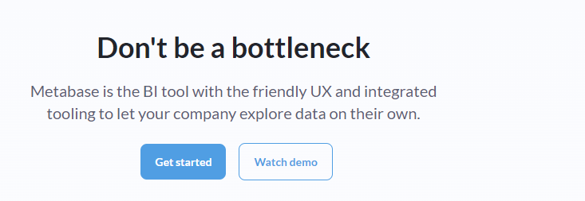

Metabase是一个BI工具，提供了友好的用户体验，可以采用自己的方式实现公司的数据可视化。

在Apache下，大数据领域可以用来做可视化的软件有Superset。除此之外，还有一些别的商业公司开源的可视化工具，比如：Metabase。

### 下载、安装

点击：Get Started。

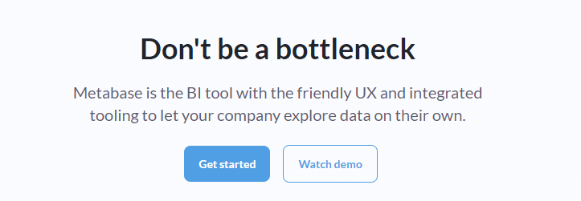

跳转到如下页面，点击下面的`Look for the free...`，表示使用Metabase的开源免费版本。

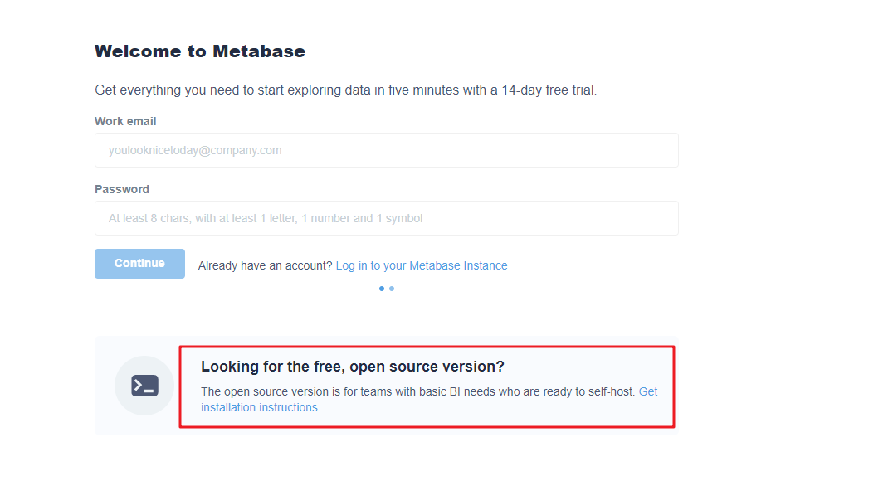

跳转到如下页面，

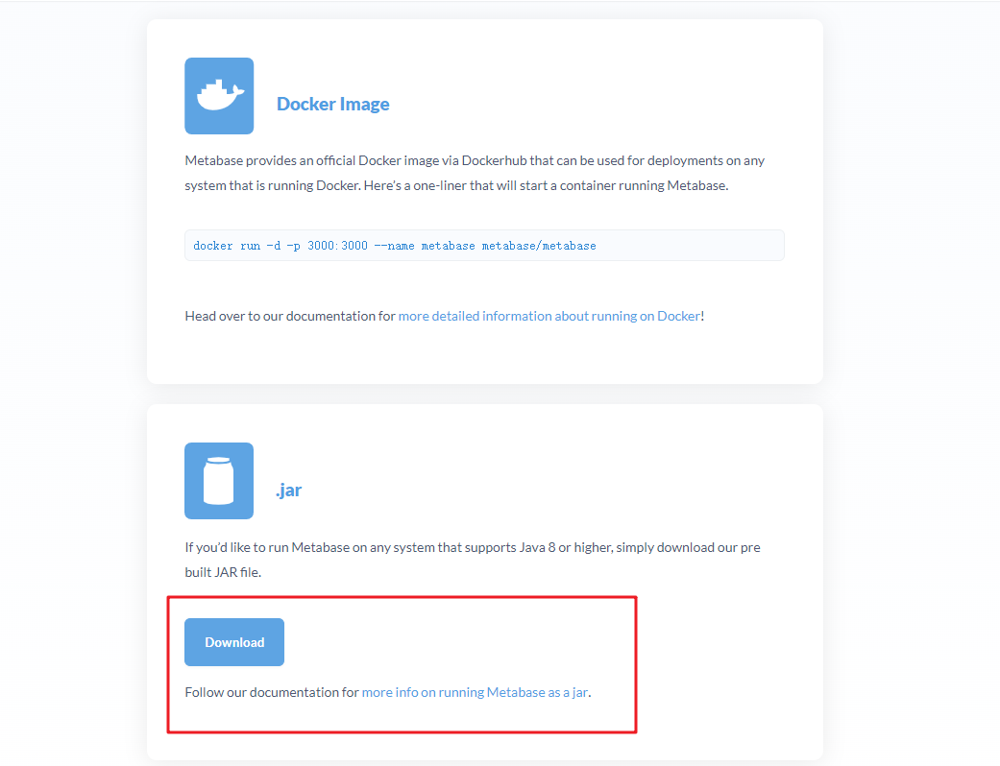

点击`Download`下载，或者点击下面的链接。

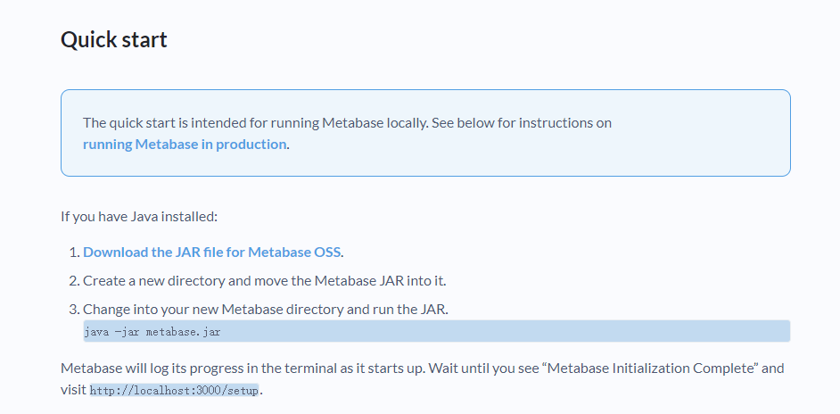

上面就是Metabase的快速入门步骤。

### 初次使用

#### 启动Metabase

~~~shell
java -jar metabase.jar
~~~

#### 初次配置

在浏览器输入：

~~~shell
http://node1:3000
~~~

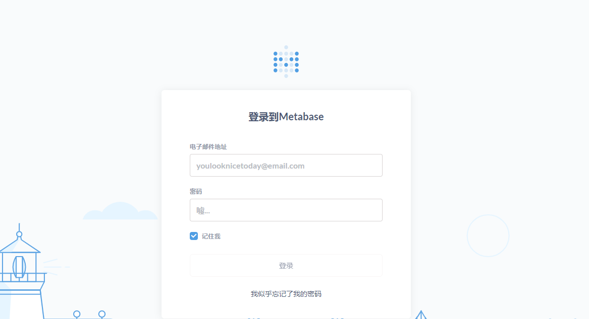

第一次进来，需要配置用户名、邮箱、密码、语言、数据库等信息。

也可以先登录进来，再设置数据库的信息。

点击左下角`管理员设置`

接下来，点击`添加数据库`

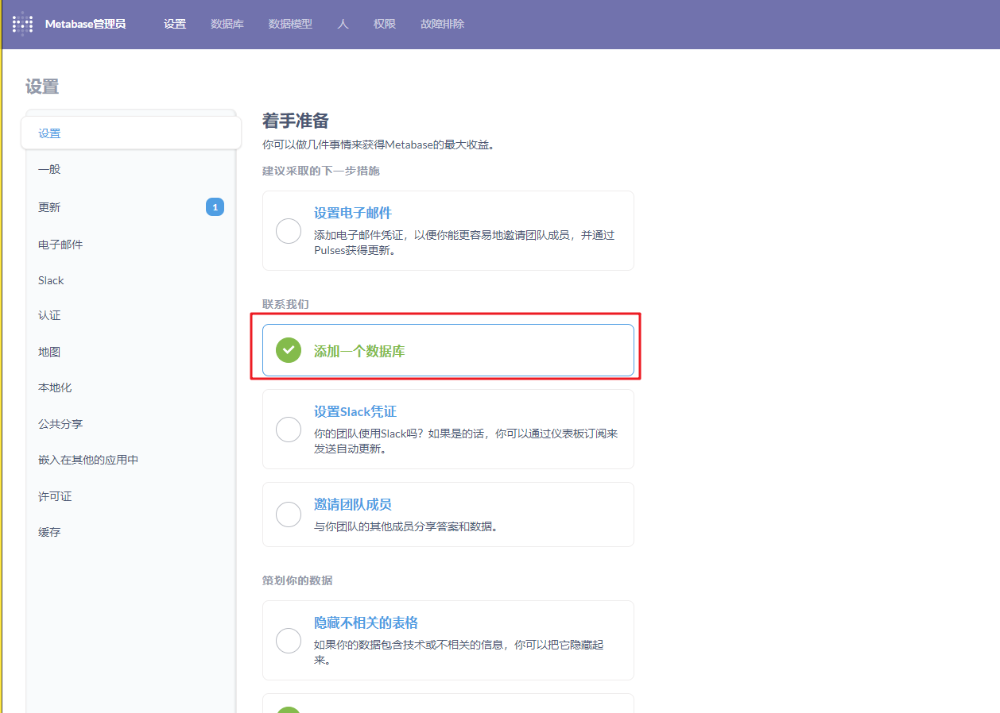

配置完之后，保存即可。

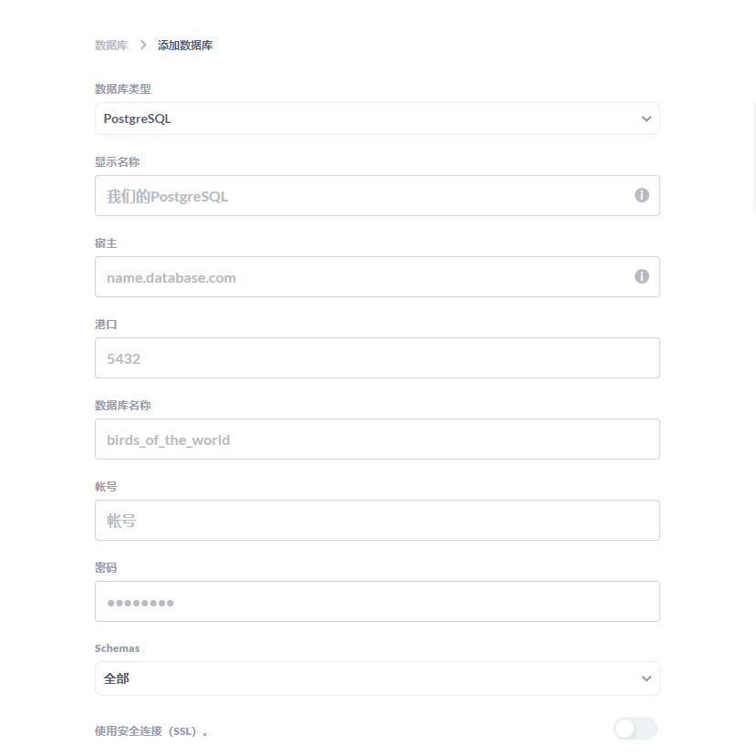

#### 使用

Metabase的使用分为两步：

* 创建SQL查询
* 创建仪表板

##### 创建SQL查询

点击右上角的	`新的`-> `SQL查询`，如下图。

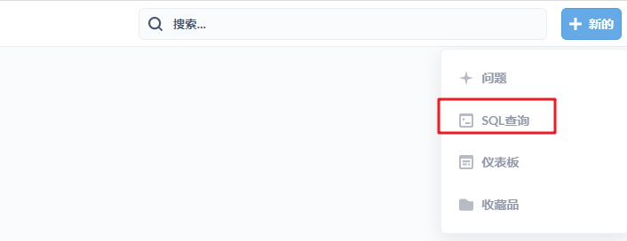

输入SQL即可。

##### 创建仪表板

点击右上角的`新的`->`仪表板`，如下图。

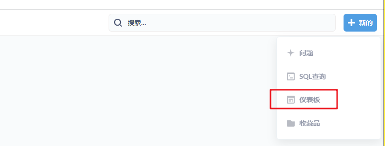

仪表板就是用来做可视化的，把前面创建的SQL查询看板添加到仪表板中即可。

### 注意事项

Metabase版本和JDK有关联。Java1.8最高只能运行0.43.x的版本。再往上的版本需要Java1.11或1.17才行。

## 性能优化

### Flink on Yarn三种模式

* session模式（会话模式）

~~~shell
#1.启动session（会话）集群
$FLINK_HOME/bin/yarn-session.sh

#2.提交Flink任务
flink run -p 3 examples/batch/WordCount.jar
~~~

* per-job（Job分离）

~~~shell
flink run -m yarn-cluster -p 3 examples/batch/WordCount.jar
~~~

* application（应用）

~~~shell
flink run-application -t yarn-application -p 3 examples/batch/WordCount.jar
~~~

### Flink并行度

并行度的设置，在Flink中支持四种方式

* 配置文件（默认）
* 任务提交（推荐）
* 全局代码层面（env.setParallelism(1)）
* 算子层面（map().setParallelism(2)）

### Flink 内存模型

#### 内存模型概述

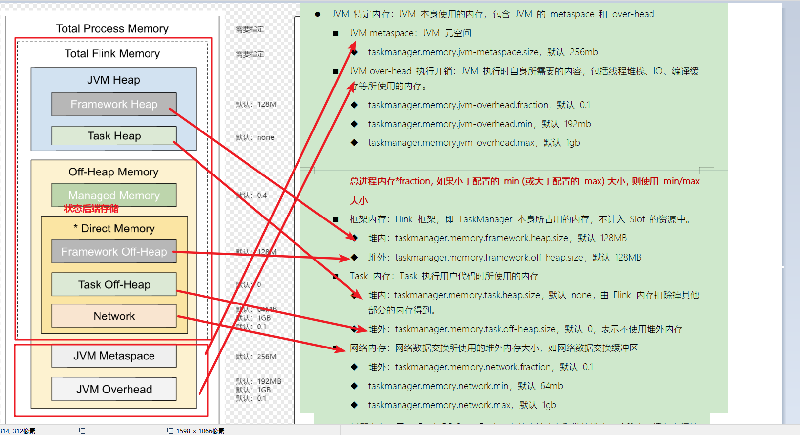

具体的内存划分

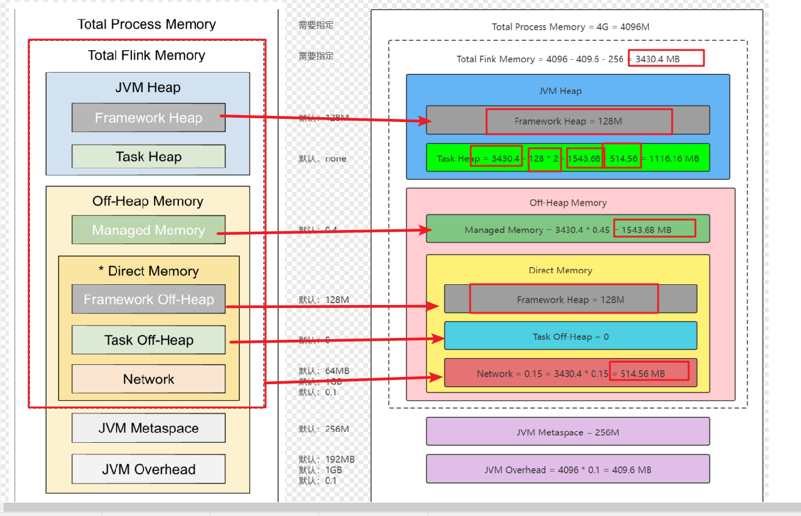

#### 并行度设置

* Source端

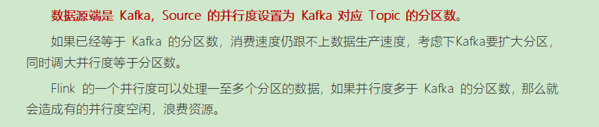

* Transformation

~~~shell
keyBy之前
一般不会做太多的操作，可以和Source端保持一致。

keyBy之后
根据情况而定，如果数据量大，则可以调大，如果数据量小，则可以相应调小。
~~~

* Sink端

根据Sink端的情况来评估。如果是Sink到Kafka，则和Kafka的Topic分区数保持一致。

#### Flink的状态后端

Flink的状态后端有三种，分别是：

* MemoryStateBackend（内存状态）

* FsStateBackend（文件系统状态后端，以HDFS为例）

* RockDBStateBackend（RocksDB是一个本地的文件数据库，适合超大状态，增量状态）

#### Checkpoint设置

Checkpoint的时间设置为分钟级别即可。不要太短，也不要太长。

### 反压

#### 反压介绍

反压，也叫背压，英文BackPressure。

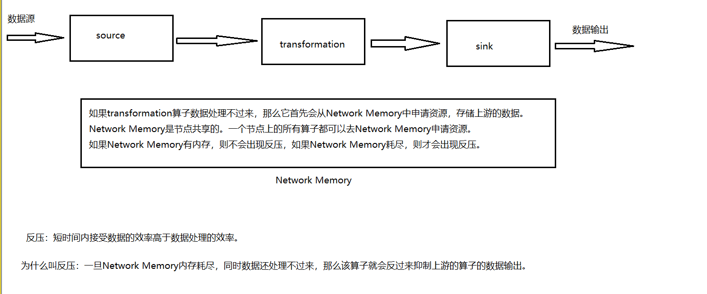

#### 反压的判定

我们可以通过8081 WebUI的方式来判断是否出现了反压。

8081 WebUI通过算子的颜色来区别。

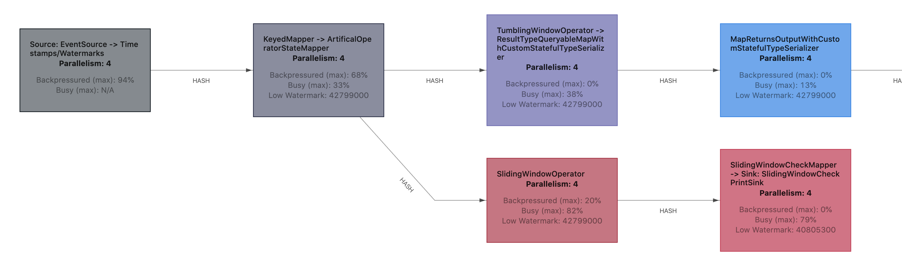

算子的颜色有三种：

* 蓝色，表示空闲，数据能处理过来
* 红色，表示算子比较忙碌，在处理数据中
* 黑色，表示算子出现了反压

反压的三种状态：

OK：【0,10】

LOW：（10,50】

HIGH：（50,100】

在8081 WebUI中，BackPressure页面会实时监测，刷新，所以不建议长期开着BackPressure。看一眼即可。

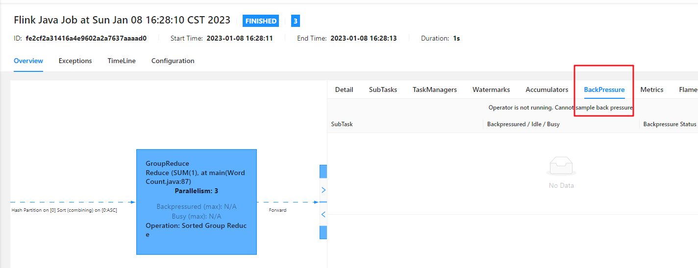

#### 反压处理

反压，是一种天然的状态。一般的反压都不需要处理。只有持续不断地（频繁出现）出现反压才需要处理。

总而言之，如果出现，基本上就是资源问题了。

可以通过调大并行度或者添加扶我起来解决。

软件再如何调优都比不上硬件的加速。

### 数据倾斜

#### 如何判断数据倾斜

可以通过WebUI SubTask中数据接收的大小来判断。

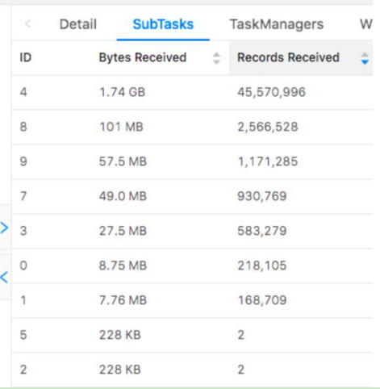

#### 处理

keyBy之前，可能是数据本身出现了倾斜，可以通过rebalance算子等让数据均衡。

keyBy之后，可以通过LocalByKey的思想，类似于hive中的map端预聚合的方式。这个在FlinkSQL优化中详细介绍。

### KafkaSource调优

#### 动态分区调整

~~~shell
‘scan.topic-partition-discovery.interval’=’5000’
~~~

#### 多分区下空闲等待

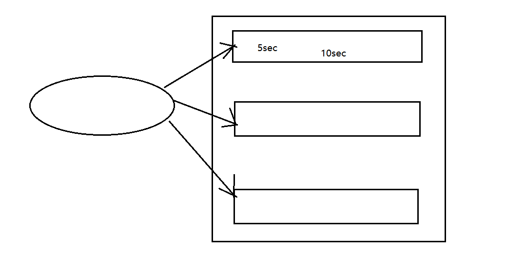

SQL的设置如下：

~~~shell
# 默认值：0 ms
# 值类型：Duration
# 流批任务：流任务
# 用处：如果此参数设置为 60 s，当 Source 算子在 60 s 内未收到任何元素时，这个 Source 将被标记为临时空闲，此时下游任务就不依赖此 Source 的 Watermark 来推进整体的 Watermark 了。
# 默认值为 0 时，代表未启用检测源空闲。
table.exec.source.idle-timeout: 0 ms
~~~

### FlinkSQL调优

#### MiniBatch微批

~~~shell
# 默认值：false
# 值类型：Boolean
# 流批任务：流任务支持
# 用处：MiniBatch 优化是一种专门针对 unbounded 流任务的优化（即非窗口类应用），其机制是在 `允许的延迟时间间隔内` 以及 `达到最大缓冲记录数` 时触发以减少 `状态访问` 的优化，从而节约处理时间。下面两个参数一个代表 `允许的延迟时间间隔`，另一个代表 `达到最大缓冲记录数`。
table.exec.mini-batch.enabled: false

# 默认值：0 ms
# 值类型：Duration
# 流批任务：流任务支持
# 用处：此参数设置为多少就代表 MiniBatch 机制最大允许的延迟时间。注意这个参数要配合 `table.exec.mini-batch.enabled` 为 true 时使用，而且必须大于 0 ms
table.exec.mini-batch.allow-latency: 0 ms

# 默认值：-1
# 值类型：Long
# 流批任务：流任务支持
# 用处：此参数设置为多少就代表 MiniBatch 机制最大缓冲记录数。注意这个参数要配合 `table.exec.mini-batch.enabled` 为 true 时使用，而且必须大于 0
table.exec.mini-batch.size: -1
~~~

#### 两阶段聚合

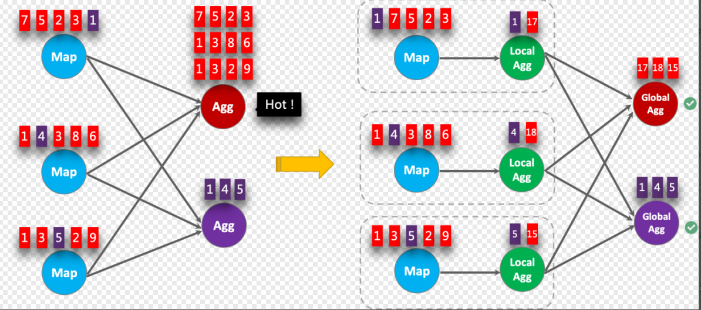

~~~shell
#  默认值：AUTO
#  值类型：String
#  流批任务：流、批任务都支持
#  用处：聚合阶段的策略。和 MapReduce 的 Combiner 功能类似，可以在数据 shuffle 前做一些提前的聚合，可以选择以下三种方式
#  TWO_PHASE：强制使用具有 localAggregate 和 globalAggregate 的两阶段聚合。请注意，如果聚合函数不支持优化为两个阶段，Flink 仍将使用单阶段聚合。
#  两阶段优化在计算 count，sum 时很有用，但是在计算 count distinct 时需要注意，key 的稀疏程度，如果 key 不稀疏，那么很可能两阶段优化的效果会适得其反
#  ONE_PHASE：强制使用只有 CompleteGlobalAggregate 的一个阶段聚合。
#  AUTO：聚合阶段没有特殊的执行器。选择 TWO_PHASE 或者 ONE_PHASE 取决于优化器的成本。
#  
#  注意！！！：此优化在窗口聚合中会自动生效，但是在 unbounded agg 中需要与 minibatch 参数相结合使用才会生效
table.optimizer.agg-phase-strategy: TWO_PHASE
~~~

#### split分桶

~~~shell
#  默认值：false
#  值类型：Boolean
#  流批任务：流任务
#  用处：避免 group by 计算 count distinct\sum distinct 数据时的 group by 的 key 较少导致的数据倾斜，比如 group by 中一个 key 的 distinct 要去重 500w 数据，而另一个 key 只需要去重 3 个 key，那么就需要先需要按照 distinct 的 key 进行分桶。将此参数设置为 true 之后，下面的 table.optimizer.distinct-agg.split.bucket-num 可以用于决定分桶数是多少
table.optimizer.distinct-agg.split.enabled: false

#  默认值：1024
#  值类型：Integer
#  流批任务：流任务
#  用处：避免 group by 计算 count distinct 数据时的 group by 较少导致的数据倾斜。加了此参数之后，会先根据 group by key 结合 hash_code（distinct_key）进行分桶，然后再自动进行合桶。
table.optimizer.distinct-agg.split.bucket-num: 1024
~~~

#### filter过滤优化

filter过滤，优化点在状态上，用传统方式，会产生多个不同的状态。

采用filter的方式，只会有一个状态，可以节省资源。

~~~sql
--传统写法
SELECT
 day,
 COUNT(DISTINCT user_id) AS total_uv,
 COUNT(DISTINCT CASE WHEN flag IN ('android', 'iphone') THEN user_id ELSE NULL END) AS app_uv,
 COUNT(DISTINCT CASE WHEN flag IN ('wap', 'other') THEN user_id ELSE NULL END) AS web_uv
FROM T
GROUP BY day

--filter写法
SELECT
 day,
 COUNT(DISTINCT user_id) AS total_uv,
 COUNT(DISTINCT user_id) FILTER (WHERE flag IN ('android', 'iphone')) AS app_uv,
 COUNT(DISTINCT user_id) FILTER (WHERE flag IN ('web', 'other')) AS web_uv
FROM T
GROUP BY day
~~~

#### 高效去重优化

采用row_number的方式去替换distinct的方式。

~~~sql
--保留首行
SELECT * 
FROM ( 
	 SELECT *, 
	 ROW_NUMBER() OVER (PARTITION BY b ORDER BY proctime) as rowNum 
	 FROM T 
) 
WHERE rowNum = 1; 

--保留末行
SELECT * 
FROM ( 
 SELECT *, 
 ROW_NUMBER() OVER (PARTITION BY b, d ORDER BY rowtime DESC) as 
rowNum 
 FROM T 
) 
WHERE rowNum = 1; 
~~~

## Canal、DataX、面试题

### DataX

DataX 是阿里云 [DataWorks数据集成](https://www.aliyun.com/product/bigdata/ide) 的开源版本，在阿里巴巴集团内被广泛使用的离线数据同步工具/平台。DataX 实现了包括 MySQL、Oracle、OceanBase、SqlServer、Postgre、HDFS、Hive、ADS、HBase、TableStore(OTS)、MaxCompute(ODPS)、Hologres、DRDS 等各种异构数据源之间高效的数据同步功能。

它只能做全量数据同步。用于离线同步。

https://github.com/alibaba/DataX

### Canal

https://github.com/alibaba/canal

**canal [kə'næl]**，译意为水道/管道/沟渠，主要用途是基于 MySQL 数据库增量日志解析，提供增量数据订阅和消费

早期阿里巴巴因为杭州和美国双机房部署，存在跨机房同步的业务需求，实现方式主要是基于业务 trigger 获取增量变更。从 2010 年开始，业务逐步尝试数据库日志解析获取增量变更进行同步，由此衍生出了大量的数据库增量订阅和消费业务。

专门用来做增量同步的，实时同步。

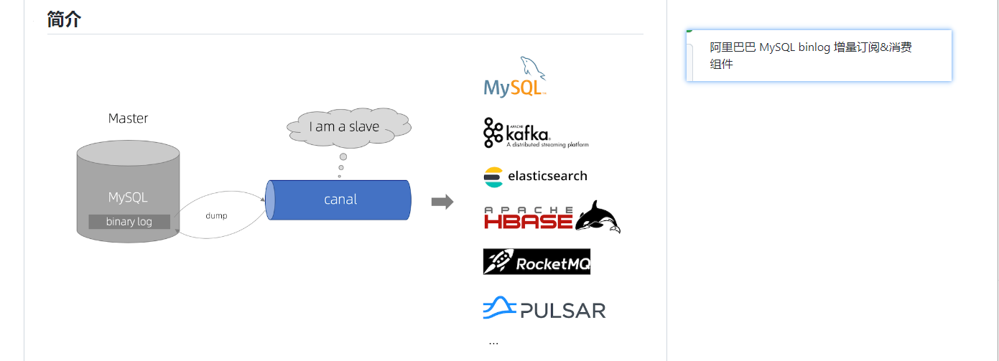

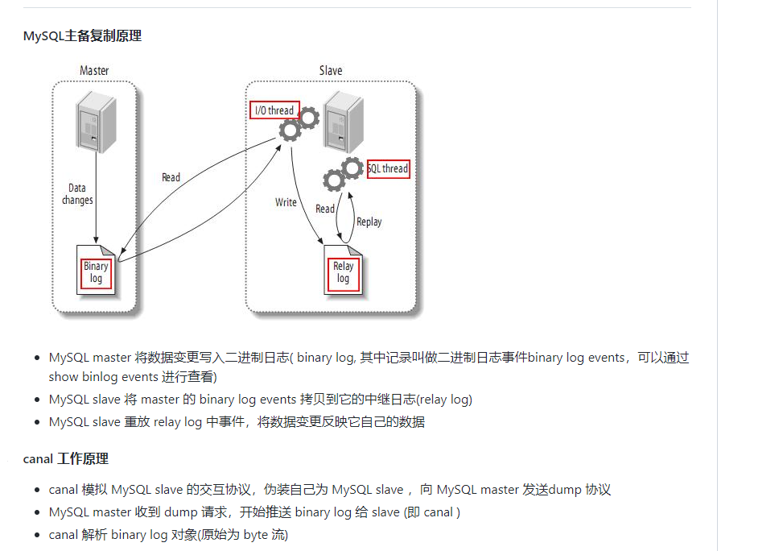

官网Demo：

~~~shell
#1.快速入门
https://github.com/alibaba/canal/wiki/QuickStart

#2.Java Demo
https://github.com/alibaba/canal/wiki/ClientExample
~~~

### FlinkCDC官网概述

https://ververica.github.io/flink-cdc-connectors/

CDC是一种思想（抽象），FlinkCDC 是CDC的实现。

除了FlinkCDC，还有别的CDC，比如说：sqoop、Canal、DataX、Kettle、OGG等。

### 数据湖

#### 什么是数据湖

* 满足原始数据的海量存储
* 支持不同的计算引擎来计算

数据湖也是一个抽象的概念。具体的实现数据湖思想的框架有：

* Delta Lake

* Iceberg
* Hudi

## FFA（Flink Forward Asia）

资料同步到百度网盘群里。

