# 博学谷大数据平台_项目介绍

## 课程目标

-   了解在线教育行业背景
-   了解传统大数据技术架构
-   了解博学谷大数据的项目背景
-   掌握博学谷大数据项目架构
-   掌握博学谷大数据项目技术选型
-   掌握博学谷大数据项目技术亮点
-   了解博学谷大数据项目看板划分
-   能够熟练使用Vmware虚拟机环境

## 行业背景

### 知识点01：【了解】在线教育行业背景

随着信息化技术在教育领域中的作用日益提升，财政部对教育领域信息技术的建设投入也不断提升。2021年中国教育信息化的教育财政投入超4000亿元。在国家政策支持、互联网繁荣发展，国民受教育意愿提升以及2020年在疫情推动下，在线教育需求激增，在线教育用户规模的快速增长。

在线教育即e-Learning，或称远程教育、在线学习，现行概念中一般指的是一种基于网络的学习行为，与网络培训概念相似。

随着信息技术迅速发展，特别是从互联网到移动互联网，创造了跨时空的生活、工作和学习方式，使知识获取的方式发生了根本变化。教与学可以不受时间、空间和地点条件的限制，知识获取渠道灵活与多样化。

在线教育的兴起是互联网等新一代信息技术在教育领域不断渗透的结果.审视在线教育的发展历程,我们可发现在线教育在萌芽、探索、快速成长和初步成熟四个阶段经历。随着信息化技术在教育领域中的作用日益提升，财政部对教育领域信息技术的建设投入也不断提升。2021年中国教育信息化的教育财政投入超4000亿元。

**2012-2021年中国教育信息化的教育财政投入：**

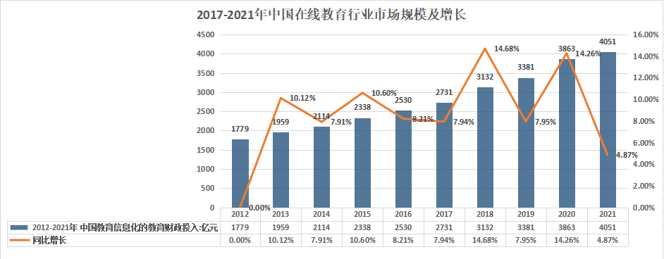

如上图，在国家政策支持、互联网繁荣发展，国民受教育意愿提升以及2020年在疫情推动下，在线教育需求激增，在线教育用户规模的快速增长。2020年中国在线教育行业用户规模达到3.42亿人，同比增长27.13%；2021年中国在线教育行业用户规模2.98亿人，较2020年有所下降。

**2017-2021年中国在线教育行业用户规模及增长：**

随着互联网的迅猛发展,在线教育行业也在逐步壮大，市场规模也明显上升。2020年中国在线教育市场规模增长至4328亿元，同比增长24.79%；2021年在线教育市场规模约3220亿元，同比下滑25.61%。

**2017-2021年中国在线教育行业市场规模及增长：**

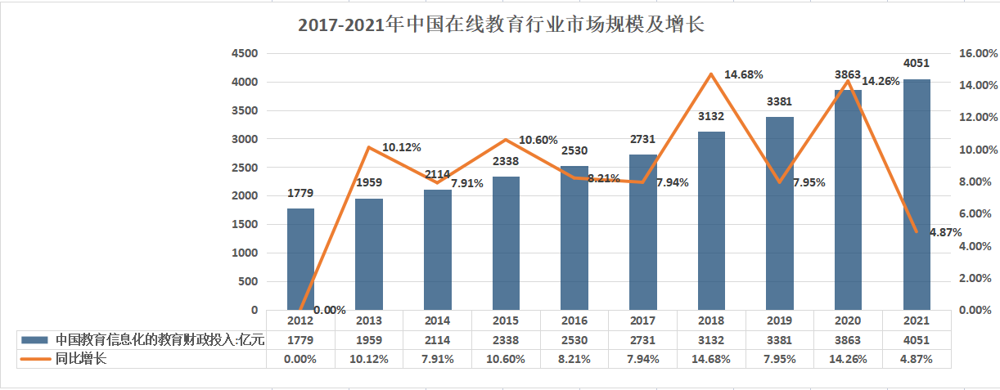

“双减”新规下融资迅速缩水。2020年中国在线教育行业融资事件111起，同比增长27.93%；2021年，为响应国家大力发展素质教育的部署和决心，作业帮等众多教育科技公司、互联网公司均率先进行了探索，推出了各自的素质教育业务，2021年中国在线教育行业融资事件127起，较2020年增长16起。

**2017-2021年中国在线教育行业融资事件及增长：**

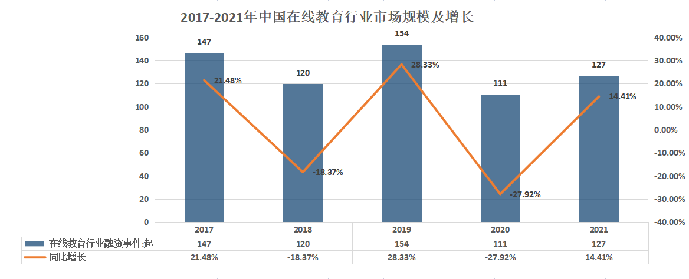

### 知识点02：【了解】在线职业教育发展趋势分析

在线教育行业主要上市公司：目前国内在线教育行业的上市公司主要有[豆神教育](https://stock.qianzhan.com/hs/zhengquan_300010.SZ.html)(300010)、学大教育(000526)、开元教育(300338)、中公教育(002607)、传智教育(003032)、行动教育(605098)、昂立教育(600661)等。

**在线教育加速渗透，用户习惯养成进行时:**

依据CNNNIC数据，2020年，我国在线教育用户规模达3.42亿，较2020年3月减少8125万，占网民整体的34.6%;手机在线教育用户规模达3.41亿，较2020年3月减少7950万，占手机网民的34.6%。下半年，随着疫情防控取得积极进展，大中小学基本都恢复了正常的教学秩序，在线教育用户规模进一步回落，但较疫情之前(2019年6月)仍增长了1.09亿，行业发展态势良好。

2021年上半年，由于K12市场的政策趋严，高等教育市场因疫情影响业务受到影响，如留学课程等，市场整体稍有降温，在线教育用户规模为3.25亿人，同比下降5567万人。但整体来看，随着VR、AI、5G、物联网等相关技术的更新，以及在线教育用户的时间逐渐碎片化，我国线上渗透率将逐步提升。

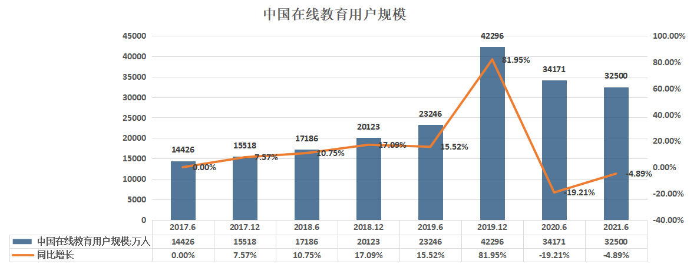

**资本青睐，职业在线教育融资压力较小**

随着“双减”政策的发布，在基础教育阶段的在线教育企业受到重创，资本将眼光放到职业教育赛道。2021年，我国在线教育行业职业教育融资金额61.93亿元排名第一，其次为steam教育33.68亿元、教育服务商9.45亿元。目前，我国职业教育的融资压力相对较小。

**人才供需矛盾突出,催化职业在线教育发展**

从供给方面来看，2016-2020年，我国普通本科以及专科毕业生总人数呈上升趋势。从学科来看，我国在工学、管理学、财经商贸大类、医药卫生大类的人才供给相对充足，而在教育学、法学、农学、交通运输大类、IT互联网中高端行业 等人才相对匮乏。

据中国人力资源与社会保障部资料，从供给总量来看，就业市场需求大于供给，2018年市场需求人数较去年增加10万人，同比增长2.4%，求职人数减少6.9万人，同比下降2%。从变化趋势来看，职位空缺与求职者数量之比呈上升趋势，从2013年的1.1增长至2018年的1.27，表明我国劳动力市场需求与供给不匹配程度明显上升。见图1.7

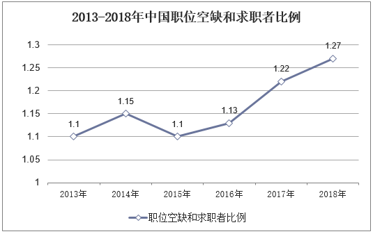

而在人才需求方面，依据我国发布的《制造业人才发展规划指南》，预计到2025年，我国在**新一代信息技术产业**的人才缺口达到950万人，2020年我国专科电子信息大类的毕业生人数仅为46.7万人。

总结人才的供需情况来看，我国目前的人才供需的结构性矛盾较为突出，衍生催化职业在线教育的扩大。一方面，毕业生择业专业对口的几率较小，需要拓展其他领域的技能或者证书，来进一步拓展职业维度;另一方面，择业期的竞争压力加大，除了相关专业技能，其他办公软实力亦是用人单位横向对比“择优录取”的考量因素。

**IT应用类市场规模较大，“技术蓝领”短缺,行业保持增长**

随着我国就业竞争压力将不断增大，就业形势仍存在不确定因素。就业压力的增大，促使人们寻求职业培训课程服务，通过接受职培提升自我，缓解就业压力带来的焦虑。

数据显示，2016年至今中国职业培训机构总量呈上升趋势，截至2021年5月底，存续职业培训机构数量达164678家。从新增机构数量来看，2017年以后，中国每年新增职业培训机构数量有所下降，但仍保持年注册量达1.5万家以上。艾媒咨询分析师认为，中国职业培训需求推动了培训机构快速增长，特别是随着职业技能细分垂直发展，更多垂直领域培训机构诞生。但值得注意的是，当前中国职业培训市场集中度不高。见图1.8: 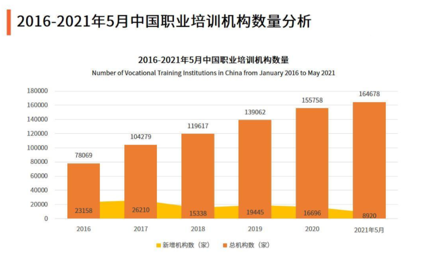

随着我国教育体制的深入改革，职业教育的发展受到社会关注。“十三五”以来，党中央高度重视职业教育，进一步明确了职业教育的功能和作用，推动职业教育进入高质量发展的新阶段。除此之外，中国经济的发展已经步入转型阶段，对人才的需求也发生变化，职业发展教育行业前途光明。

自2012年起，我国IT应用类职业技能培训市场规模不断扩大，2019年，在三大热门行业中，IT应用类市场规模最大，为302.4亿元。三个行业均保持增长态势，预计到2021年，IT应用类执业技能培训市场规模达386.9亿元，财会类执业技能培训市场规模达273.9亿元，在线执业资格考试培训市场规模达140.1亿元。见图1.9

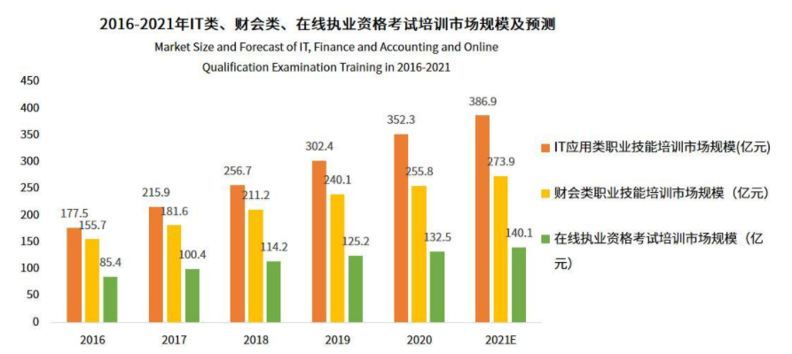

目前，中国技能劳动者已超过2亿人，高技能人才超过5000万人。尽管如此，当前中国结构性就业矛盾依旧突出，中国技能劳动者占就业人口总量的比重仅为26%，高技能人才占技能人才总量的比重为28%，与发达国家相比仍然存在较大差距，需要加快培养高素质劳动者和技术技能人才。

**IT培训市场潜力巨大**

随着国内互联网经济的兴起，自2010年以来程序员在国内就业市场上的待遇也在水涨船高，外卖、网约车、旅游平台、电商等多种多样的新业态的产生催生了大量的IT从业人员需求。而在互联网经济的红利下国内的互联网企业和企业员工的收入增长速度处于全行业领先地位，根据工信部的统计，2012-2021年间国内IT行业的整体收入规模从24794亿元上涨到94994亿元，行业收入的平均增速保持在两位数以上。大量的资本涌入互联网市场给IT从业者带来巨额收入的同时也吸引越来越多的人学习计算机技术，高校计算机专业的分数线每年都在上涨，同时也利好IT职业教育培训行业的发展。见图1.10

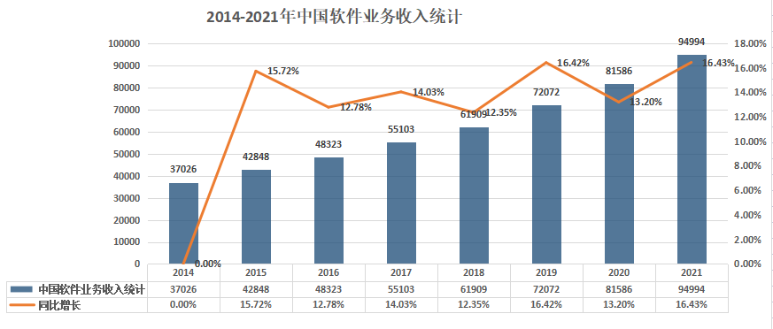

互联网企业员工入行平均收入远超其他行业已经不再是什么秘密，据报道美团在2020年招收的大学应届生的年薪达到30万以上，尽管互联网经济目前正在由增量时代向存量时代转变，但是显而易见的是互联网人才的增速还无法完全满足行业对于IT技术人才的需求,而且互联网行业平均薪资稳居各行业第二。相比于行业收入而言IT行业从业人数的增长要温和许多，2012-2021年间国内IT从业人数从418万增长到731万(见图1.11)，2015年以来每年平均增长速度基本稳定在5%左右。从业人员数量增速略低，主要原因在于随着行业内企业整合及内部管理完善，企业效率进一步提升，公司对从业人员的素质要求进一步提高。特别是各大互联网公司由单纯的对IT人员的数量需求变成对高素质、高技术、高创新性人才的需求。在这个背景之下，优质的IT培训教育将在一定程度缓解高端IT人才供给不足的问题。 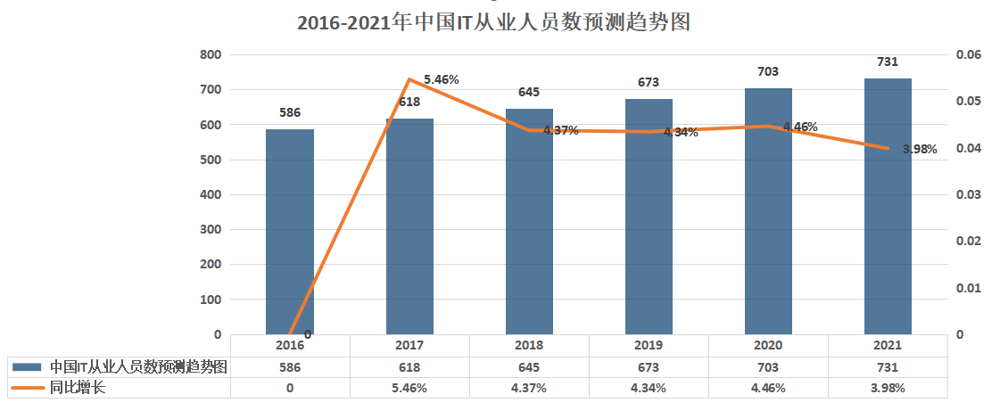

在竞争激烈的环境下，人们开始有意识地提高自己的核心竞争力，在空闲时间还报名各种课程进行学习，在线教育行业应运而生，实现人们足不出户也能学习的想法。随着互联网热潮不断翻滚，对IT人才的需求也随之增加，在高薪的吸引之下越来越多的人涌向这个行业。在线教育机构把目光瞄向了IT行业，推出了“IT教育”，足不出户就能学习先进的IT技术。

### 知识点03：【了解】在线职业教育行业发展的痛点

受互联网+概念的催化，教育市场发展火热，越来越多的教育机构和平台不断涌现，包括有线上学习和线下培训，少儿教育和职业教育等，那些注重用户服务、教育质量的平台会最终胜出。目前的企业痛点：

-   数据量大，现有MySQL业务数据库直接读取模式不能满足业务统计性能、效率需要。
-   系统多、数据分散，缺少从营销、咨询、报名、教学等等完整业务环节的数据贯通。
-   统计分析难度高、工作量大。缺少元数据、数据集合的规范存储，业务部门有数据分析角度需求时，需要程序员、DBA 突击查数据、做报表，尤其年底各个部门排队等 DBA协助出数据。

如何提高用户服务水平，提高教育质量是每个机构都面临的问题。信息的共享和利用不充分，就导致尽管公司多年的信息化应用积累了大量的数据，但信息孤岛的壁垒一直没有打破，对这些数据无法进一步的挖掘、分析、加工、整理，不能给学校教育、教学、研发、总务等各方面管理决策提供科学、有效的数据支撑。

## 传统方案

### 知识点04：【掌握】传统数据集成方案的痛点

大数据技术的应用可以从海量的用户行为数据中进行挖掘分析，根据分析结果优化平台的服务质量，最终满足用户的需求。大数据分析平台就是将大数据技术应用于教育培训领域，为企业经营提供数据支撑：

-   建立集团数据仓库，统一集团数据中心，把分散的业务数据进行预先处理和存储。
-   根据业务分析需要，从海量的用户行为数据中进行挖掘分析，定制多维的数据集合，形成数据集市，供各个场景主题使用。
-   前端业务数据展示选择和控制，选取合适的前端数据统计、分析结果展示工具。

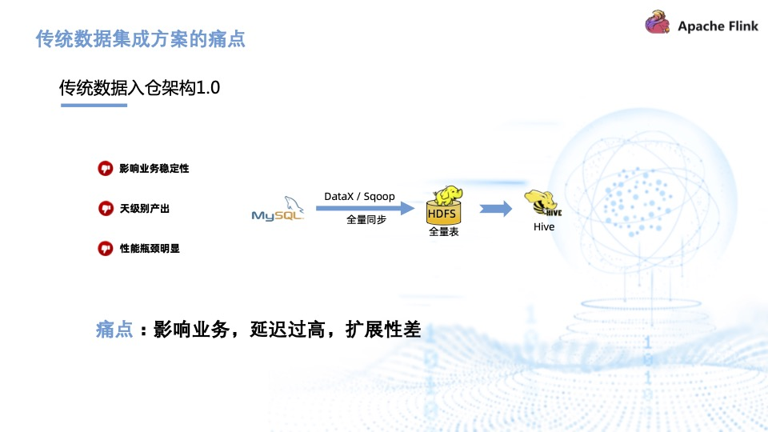

上图为传统数据入仓架构 1.0，主要使用 DataX 或 Sqoop 全量同步到 HDFS，再围绕 Hive 做数仓。

此方案存在诸多缺陷：容易影响业务稳定性，因为每天都需要从业务表里查询数据；天级别的产出导致时效性差，延迟高；如果将调度间隔调成几分钟一次，则会对源库造成非常大的压力；扩展性差，业务规模扩大后极易出现性能瓶颈。

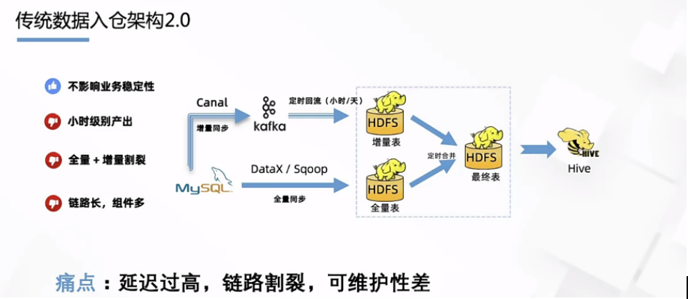

上图为传统数据入仓 2.0 架构。分为实时和离线两条链路，实时链路做增量同步，比如通过 Canal 同步到 Kafka 后再做实时回流；全量同步一般只做一次，与每天的增量在 HDFS 上做定时合并，最后导入到 Hive 数仓里。

此方式只做一次全量同步，因此基本不影响业务稳定性，但是增量同步有定时回流，一般只能保持在小时和天级别，因此它的时效性也比较低。同时，全量与增量两条链路是割裂的，意味着链路多，需要维护的组件也多，系统的可维护性会比较差。

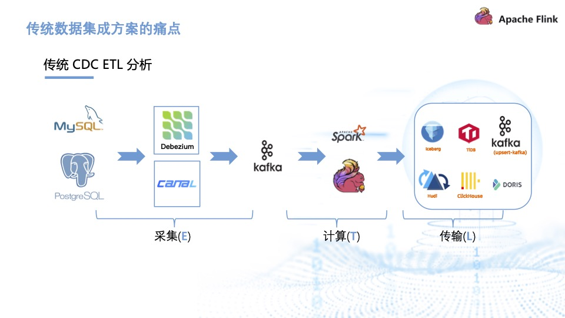

上图为传统 CDC ETL 分析架构。通过 Debezium、Canal 等工具采集 CDC 数据后，写入消息队列，再使用计算引擎做计算清洗，最终传输到下游存储，完成实时数仓、数据湖的构建。

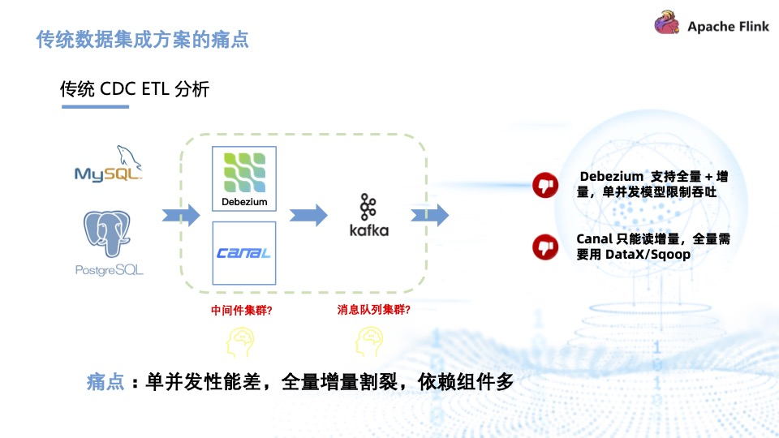

传统 CDC ETL 分析里引入了很多组件比如 Debezium、Canal，都需要部署和维护， Kafka 消息队列集群也需要维护。Debezium 的缺陷在于它虽然支持全量加增量，但它的单并发模型无法很好地应对海量数据场景。而 Canal 只能读增量，需要 DataX 与 Sqoop 配合才能读取全量，相当于需要两条链路，需要维护的组件也增加。因此，传统 CDC ETL 分析的痛点是单并发性能差，全量增量割裂，依赖的组件较多。

## 博学谷大数据平台简介

### 知识点05：【了解】项目背景

博学谷于2016年7月正式成立。依托传智教育16年IT教育沉淀，以就业课为核心，采用个性化、随到随学的自适应学习模式，为学员提供零基础入门、技能提升及职业生涯规划为一体的IT在线学习服务。专注整合优势IT教学资源，打造更适合在线学习的优质教学产品和服务。

**博学谷核心优势**

1.  全链路就业课程 随时随地在线学

    博学谷就业班课程已经形成互联网全链路人才培养闭环：包括产品经理、设计、前端、后台、运维、运营等16门系统完整的就业课程。无须离职离校，足不出户在线学习享受名师授课，单课时不超过20分钟，碎片化学习更方便。

2.  紧跟市场人才需求 课程性价比更高

    依托教研团队研发优势，课程保持每年1-2次大版本更新，若干次小版本迭代更新，保障课程技术前沿、涵盖内容更广、课程深度够深。课程内容设计采用企业真实项目，快速解决工作中问题，确保学员学完后能够胜任岗位要求。

3.  一线IT师资团队 4V1陪伴式学习

    集团1100余名老师联袂教学，授课讲师均来自企业一线，很多曾在BAT、华为等知名IT企业担任CTO及项目经理；此外技术导师为你答疑解惑、班主任老师全程带班督导、就业指导老师带你进入职场、心理老师为你排忧解难，4V1陪伴式学习更暖心。

4.  个性化学习方案 全方位学习保障

    入学之初，博学谷老师会根据学员初步测评结果，针对性的制定个性化学习方案。因材施教，把握学习节奏，保障学员更快速、更有效的完成整个学习过程。智能化在线学习系统、完善的在线答疑服务系统、阶段性测评考核全方位保障学习效果。

5.  全面有效就业服务 无忧售后更放心

    1V1深度定制学员职业发展路线，基于学员反馈、调研提供全面有效的就业服务。一对一修改简历、模拟面试、根据学习情况推荐就业机会、试用期辅导快速稳定就业，打破学员就业困境，快速实现高薪就业。

随着近几年博学谷在线教育的迅速发展，平台累计了大量数据亟需处理。博学谷数据实时处理系统，主要用于实时统计分析博学谷多年的信息化应用积累的大量学员信息，订单数据，线索数据，营销数据，实现平台信息的共享和充分利用，采用实时流分析，更低的延时，对这些数据进一步的挖掘、分析、加工、整理，给学校教育、教学、研发、总务等各方面管理决策提供科学、有效的数据支撑。

### 知识点06：【理解】项目解决方案

#### 博学谷大数据平台1.0版本技术架构简要分析

见博学谷大数据平台架构1.0

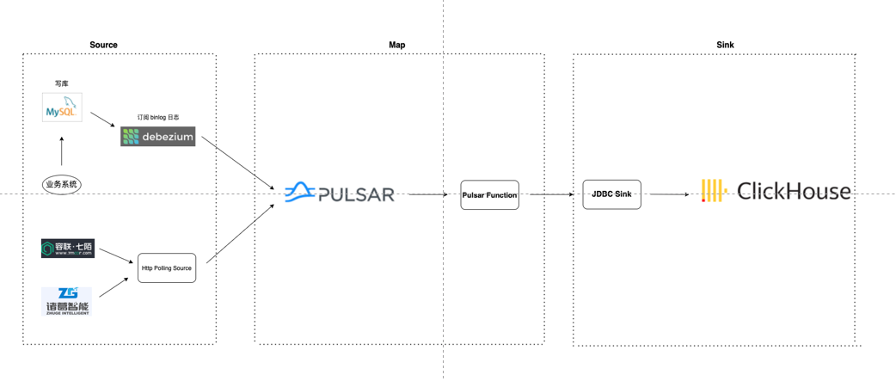

**架构 : Debezium 1.8 + Pulsar 2.7.0 + Clickhouse 21.9.4**

**数据处理流程分析：**

-   **数据源**

Mysql的数据使用Debezium工具单机同步至Pulsar。

七陌及诸葛智能的数据采用Http的方式同步至Pulsar。

-   **数据处理**

中间无处理，数据最终在Clickhouse中进行处理。

-   **数据存储**

Clickhouse直接消费Pulsar的数据，写入到Clickhouse中，Clickhouse存储原始数据。

**现有架构存在的问题主要如下：**

1.  对于Mysql数据源采用的是Debezium工具，该工具仅能单机部署，只能单并发读取Binlog日志，且全量同步不支持断点续传，传输能力较差，每次服务器重启会对Mysql数据进行全量同步，相当耗时，且生态扩展性不好。
2.  Pulsar作为消息传输系统不建议持久化存储数据，因此数据的持久化存储到了Clickhouse中，因此导致Clickhouse存储的是大量明细数据，会导致Clickhouse变得臃肿。
3.  Pulsar与Clickhouse之间缺少数据的处理过程，如果遇到复杂的业务逻辑，比如数据的拉宽、清洗、转换，该架构是无法胜任的。
4.  Clickhouse单表查询性能强劲，但join性能相对较差，而1.0架构的查询Join操作也是在Clickhouse中进行。Clickhouse运维成本高，扩展性较差，各个节点一致性要求高，语法非标准SQL增加使用成本。
5.  缺乏数仓分层的概念和支撑，如果后期随着业务的发展，指标的计算可能会比较复杂，因此引入数仓分层是非常有必要的。

#### 博学谷大数据平台2.0版本逻辑架构

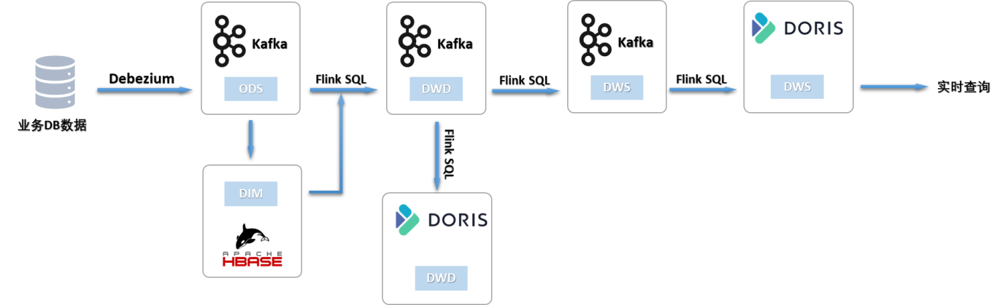

初步设想是将MySQL数据通过Debezium进入到Kafka。但是存储在Kafka的数据有失效时间，不会存太久的历史数据，这样就必须把维度表持久化到HBase中。并且该架构单并发性能差，依赖组件多，链路长，维护工作量庞大，对系统资源的消耗极大。

我们整体的目标规划是替代kafka，把Hudi作为中间存储，将数仓建设在Hudi之上，并以Flink 作为流批一体计算引擎。

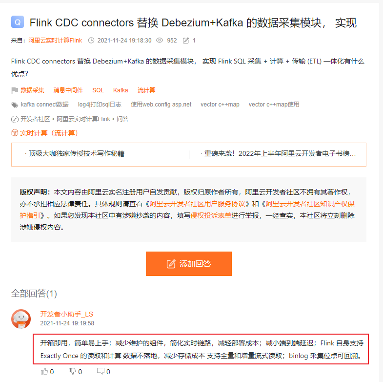

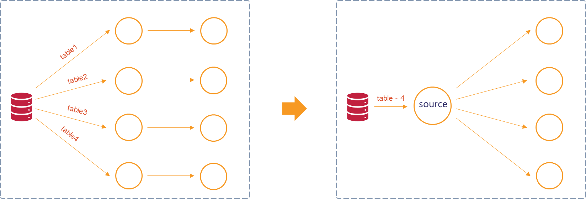

最终，我们决定直接通过Flink CDC千表入湖，替换Debezium、kafka组件采集数据，采用Flink sql实时处理，在Hudi中做数仓分层，替代在kafka中做分层处理。并且在该项目中，我们采用Dinky将多表的source进行了合并，实现千表入湖，source的合并也可以避免多个任务通过Flink CDC接MySQL表以及Binlog，对MySQL库的性能造成影响。

**最终我们采用的架构2.0如下图**：

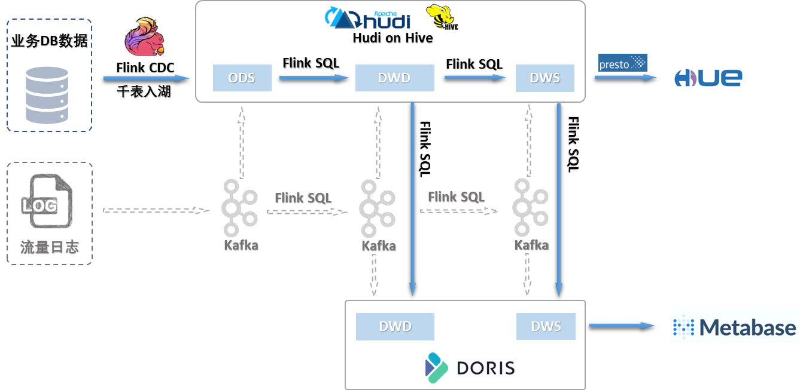

**架构 : Mysql 5.7 + Flink CDC 2.2 + Hadoop 3.3.0 + Hive 3.1.2 + Flink 1.14.5 + Hudi 0.11.1 + Doris 1.1.0 + Dinky 0.6.6 + Presto 0.261 + Hue 4.1.0**

-   **数据源**

Mysql业务数据库

-   **数据采集**

使用Flink CDC 2.2作为同步工具,将Mysql数据多并发实时采集传输至存储端

-   **数据存储**

使用Hudi存储数据，使用Doris存储DWD层与DWS数据做查询分析

-   **数据计算**

实时计算:使用Flink/Flink SQL进行实时数据处理

使用Persto灵活用于离线数据分析

-   **数据分析**

使用Doris灵活用于自定义数据分析

-   **大数据平台应用**

实时场景:实时报表,业务监控,动态展示大屏

**这样做的好处有：**

-   Kafka不再担任实时数据仓库存储的中间存储介质，而Hudi存储在HDFS上，可以存储海量数据集；
-   实时数据仓库中间层可以使用 OLAP 分析引擎查询中间结果数据；
-   真正意义上的准实时，数据 T+1 延迟的问题得到解决；
-   读时 Schema 不再需要严格定义 Schema 类型，支持 schema evolution；
-   支持主键索引，数据查询效率数倍增加，并且支持 ACID 语义，保证数据不重复不丢失；
-   Hudi 具有 Timeline 的功能，可以更多存储数据中间的状态数据，数据完备性更强。

#### 博学谷大数据平台2.0版本数据流转

数据流转如下图

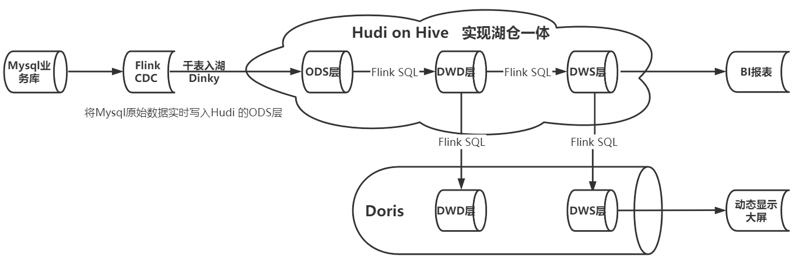

-   业务数据主要放在业务数据库Mysql两个数据库**bxg**库和**crm**库中。
-   Flink CDC通过读取Mysql数据库的Binlog日志(Mysql的Binlog日志完整记录了数据库中的变更，可以把Binlog文件当作流的数据源)，实时捕获数据变更,将原始数据通过Dinky千表入湖,同步到Hudi的ODS层，并使用Hudi on Hive 会将ODS层元数据信息自动同步到Hive中，便于管理。
-   使用Flink SQL将Hudi的ODS层数据拉宽写入到Hudi的DWD层 ，DWD层通过join和轻度聚合进入DWS层，DWS层可直接用于BI报表。
-   使用Flink SQL将Hudi的DWD和DWS层数据同步到Doris的DWD和DWS层。
-   最终动态显示大屏连接到Doris的DWS层指标数据，将指标动态显示到大屏上。

#### 未来展望

由于在Hive中查询较慢，故在当前的架构中，我们在Doris中也保存了一份数据便于业务查询。但是这导致Doris和Hudi没有很好的融合，数据冗余存储，所以目前相当于还是两套架构。

在后续Doris即将发布的1.2版本支持数据湖联邦查询，即可以通过外表的方式联邦分析位于Hudi中的数据，在避免数据拷贝的前提下，查询性能大幅提升。我们可以升级为如下架构，Metabase和Hue直接接入Doris进行可视化展示。可以很好的解决了我们现有架构的一些问题。

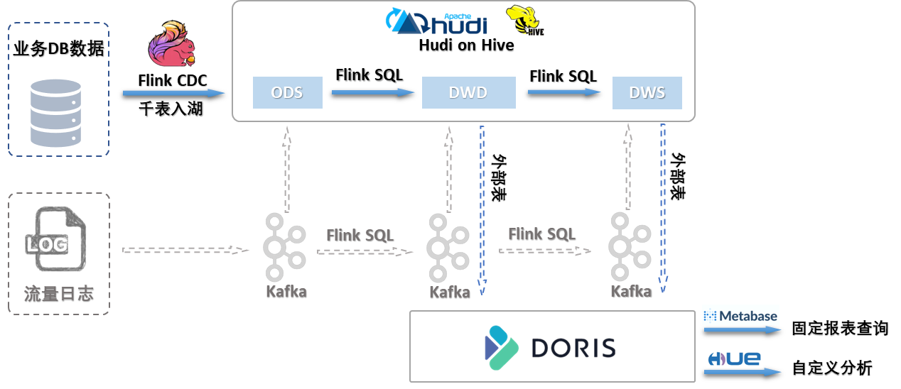

### 知识点07：【理解】项目的技术选型

#### 流式处理平台

**采用Flink CDC作为同步工具**

-   **为什么选用Flink CDC 2.2?**

2.0架构选用了Flink CDC 2.2作为同步工具，相比较 Debezium，Flink CDC底层封装了Debezium，Flink CDC 2.2解决了Debezium的痛点(详见后续CDC讲解):

1.  并发读取，全量数据的读取性能可以水平扩展。
2.  全程无锁，不对线上业务产生锁的风险。
3.  断点续传，支持全量阶段的 Checkpoint。
-   **对比全量+增量同步的能力:**

Debezium仅支持单机部署，Flink CDC 2.2支持分布式架构，多并发能力大大提升作业速度。支持断点续传，无需再为每次服务器重启的全量同步耽误大量时间担忧。

-   **在数据转换 / 数据清洗能力上:**

在Flink CDC上操作相当简单，可以通过Flink SQL去操作数据，Debezium等则需要通过脚本或者模板去做，所以用户的使用门槛会比较高。

-   **在生态方面，对下游的一些数据库或者数据源的支持:**

Flink CDC下游有丰富的Connector，也支持各种自定义Connector。其架构分布式架构不单纯体现在数据读取能力的水平扩展上，更重要的是在大数据场景下分布式系统接入能力。例如Flink CDC的数据入湖或者入仓的时候，下游通常是分布式的系统，如Hive、HDFS、Iceberg、Hudi等，那么从对接入分布式系统能力上看，Flink CDC的架构能够很好地接入此类系统。

-   **配合Dinky实现千表入湖和千表入仓**

在Flink CDC进行多表入Hudi和Doris，使用了Dinky作为实时计算平台，可实现千表入仓入湖。Dinky定义了CDCSOURCE整库同步的语法，该语法和CDAS作用相似，可以直接自动构建一个整库入仓入湖的实时任务，并且对Source进行了合并，不会产生额外的Mysql及网络压力，支持对任意Sink的同步，如Kafka、Doris、Hudi、Jdbc 。

#### 分布式计算平台

**分布式计算采用Flink SQL**

-   **为什么采用Flink SQL?**
1.  Flink 具备统一的框架处理有界和无界两种数据流的能力
2.  部署灵活，Flink 底层支持多种资源调度器，包括Yarn、Kubernetes 等。Flink 自身带的Standalone的调度器，在部署上也十分灵活。
3.  极高的可伸缩性，可伸缩性对于分布式系统十分重要，阿里巴巴双11大屏采用Flink 处理海量数据，使用过程中测得Flink 峰值可达17亿条/秒。
4.  极致的流式处理性能。Flink 相对于Storm 最大的特点是将状态语义完全抽象到框架中，支持本地状态读取，避免了大量网络IO，可以极大提升状态存取的性能。
5.  Flink 是目前开源社区中唯一一套集高吞吐、低延迟、高性能于一身的分布式流式数据处理框架。
6.  基于轻量级分布式快照(Snapshot/Checkpoints)的容错机制
7.  支持SavePoint保存点，Flink 通过SavePoints 技术将任务执行的快照保存在存储介质上，当任务重启的时候，可以从事先保存的 SavePoints 恢复原有的计算状态，使得任务继续按照停机之前的状态运行。
8.  Flink SQL开发大大降低了开发难度,易于开发和维护

#### 海量数据存储

**使用Hudi 存储原始数据,使用Doris存储实时宽表和聚合数据。**

-   **为什么选用Hudi?**

数据湖是一个集中式数据存储库，用来存储大量的原始数据，使用平面架构来存储数据。湖仓一体（LakeHouse）是新出现的一种数据架构，它同时吸收了数据仓库和数据湖的优势。直接在用于数据湖的低成本存储上实现与数据仓库中类似的数据结构和数据管理功能。  
 目前市面上流行的三大开源数据湖方案分别为：Delta Lake、Apache Iceberg和Apache Hudi。与其它两种方案相比，Hudi最大的特点是：

1.  Update/Delete记录，Hudi使用细粒度的文件/记录级别索引来支持Update/Delete记录，同时还提供写操作的事务保证。查询会处理最后一个提交的快照，并基于此输出结果。
2.  变更流，Hudi对获取数据变更提供了一流的支持：可以从给定的时间点获取给定表中已Updated/Inserted/Deleted的所有记录的增量流，并解锁新的查询姿势（类别）。
-   **为什么选用Doris**

**相比较于Clickhouse，Doris优势:**

1.  SQL的标准兼容好，使用成本低，是一个强一致性元数据的系统，导数功能较为完备。
    1.  大宽表和多表查询速度都很快，具备CBO优化器，可以很好应对复杂查询，支持高并发查询。
    2.  弹性伸缩能力要好，支持在线扩缩容，运维成本低。

**相较于Doris，Clickhouse则需要做较多工作：**

1.  ZooKeeper存在性能瓶颈导致集群规模不能特别大。
2.  基本无法做到弹性伸缩，纯手工扩缩容工作量巨大且容易出错。
3.  故障节点的容忍度较低，出现一个节点故障会引发某些操作失败。
4.  导数需要外部保证数据不重不丢，导数失败需要删了重导。
5.  元数据需要自己保证各个节点一致性，偶发性的不一致情况较多。
6.  分布式表和本地表有两套表结构，较多用户难以理解。
7.  多表Join SQL需要改写和优化，方言较多几乎是不兼容其他引擎的SQL。

总体上说，新框架2.0，解决了1.0框架的痛点问题，且实时性更佳,更好的满足业务需求。

在该架构方案的基础上可以继续实现用户画像、智能推荐、数据挖掘等等，非常容易扩展且不需要修改整体架构，因此具有高度的灵活和可扩展性。

### 知识点08：【掌握】框架软件版本

| **软件**  | **版本**  |
|-----------|-----------|
| Mysql     | 5.7       |
| Java      | 1.8.0_241 |
| Hadoop    | 3.3.0     |
| Zookeeper | 3.4.6     |
| Hive      | 3.1.2     |
| Flink     | 1.14.5    |
| Hudi      | 0.11.1    |
| Doris     | 1.1.0     |
| Dinky     | 0.6.6     |
| Flink CDC | 2.2.0     |
| Presto    | 0.261     |
| Hue       | 4.1.0     |

### 知识点09：【掌握】非功能描述

#### 框架版本选型

-   Apache：运维麻烦，组件间兼容性需要自己调研。（一般大厂使用，技术实力雄厚，有专业的运维人员）
-   CDH：国内使用最多的版本，但CM不开源，但其实对中、小公司使用来说没有影响（建议使用）
-   HDP：开源，可以进行二次开发，但是没有CDH稳定，国内使用较少

#### 服务器选型

服务器使用物理机还是云主机？

-   机器成本考虑：
    -   物理机：以128G内存，20核物理CPU，40线程，8THDD和2TSSD硬盘，单台报价4W出头，需考虑托管服务器费用。一般物理机寿命5年左右
    -   云主机，以阿里云为例，差不多相同配置，每年5W
-   运维成本考虑：
    -   物理机：需要有专业的运维人员
    -   云主机：很多运维工作都由阿里云已经完成，运维相对较轻松

#### 集群规模

-   如何确认集群规模？（假设：每台服务器8T磁盘，128G内存）
    -   每天数据量：100万\*100条=10000万条
    -   半年内不扩容服务器来算：100G\*180天=约18T
    -   保存3副本：18T\*3=54T
    -   预留20%-30%Buf=54T/0.7=77T
    -   因此：约8T\*10台服务器
-   如果考虑数仓分层？
    -   服务器将近在扩容1-2倍

**结论**

集群资源如下图所示

| **资源类型** | **资源大小** | **描述**                                                                          |
|--------------|--------------|-----------------------------------------------------------------------------------|
| CPU          | 32核         | CPU是计算机的大脑，是衡量服务器性能的首要指标                                     |
| 内存         | 128G         | Spark计算非常的耗内存，因此使用128G内存的服务器，如果有钱可以提供更大的内存服务器 |
| 硬盘         | 10T          | 数据存储的地方，因此数据量越大，硬盘的容量必然更高                                |

#### 人员配置参考

-   开发人员：6个人
-   职责划分：
    -   前端（JavaWeb+前端=2个人）
    -   大数据开发（3个人）
    -   运维（1个人）

#### 开发周期

-   六个月左右
-   阶段划分：
    -   需求调研、评审（4周）
    -   设计架构（1周）
    -   编码、集成（12周）
    -   测试（2周）
    -   上线部署，试运行，调优（3周）

### 知识点10： 【掌握】技术亮点

-   使用Flink CDC实现业务数据库Mysql的实时采集,支持多并发读取数据源, 大幅提高同步读取的速度。
-   使用Flink CDC全量读取阶段全程无锁并支持checkpoint,避免锁库风险，同时支持数据断点续传。针对大数据量的全量同步，避免失败造成全量重新同步。
-   使用 Flink CDC 去替换传统采集组件和消息队列，简化分析链路，降低维护成本,同时更少的组件也意味着数据时效性能够进一步提高。
-   Flink CDC社区22年4月总结用户用了 Flink CDC 后，遇到的第一个痛点就是需要将 MySQL 的 DDL 手工映射成 Flink 的 DDL。手工映射表结构是比较繁琐的，尤其是当表和字段数非常多的时候,手工映射也容易出错。本项目中解决了该问题,实现了自动帮助用户自动去映射表结构。
-   本项目解决了Flink CDC整库入湖的挑战。用户主要使用SQL，这就需要为每个表的数据同步链路定义一个 INSERT INTO 语句。假如用户的 MySQL 实例中甚至有上千张的业务表，用户就要写上千个 INSERT INTO 语句。每一个INSERT INTO 任务都会创建至少一个数据库连接，读取一次 Binlog 数据。千表入湖的话就需要上千个连接，上千次的 Binlog 重复读取。这就会对 MySQL 和网络造成很大的压力。本项目通过使用Dinky与Flink CDC结合解决了整库同步,千表入湖、千表入仓对Mysql造成压力的问题。
-   基于Hudi数据湖,使用Hudi on Hive实现湖仓一体，流批一体，基于Hudi on Hive可实现湖上建仓，实现离线数仓开发。
-   使用Flink SQL对数据进行ETL,大大降低了实时数仓的开发难度。
-   使用Doris作为存储平台，同时 Doris拥有强大的查询性能

### 知识点11： 【了解】测试服务器资源规划

因服务器资源有限，考虑到大部分学员电脑性能配置不高，该项目采用**三台服务器**进行演示学习，服务器配置如下：

| **用途**     | **主机名**      | **操作系统/版本** | **IP**         | **内存** | **硬盘** |
|--------------|-----------------|-------------------|----------------|----------|----------|
| 大数据服务器 | node1.itcast.cn | CentOS 7.7.1908   | 192.168.88.161 | 8GB      | 100G     |
| 大数据服务器 | node2.itcast.cn | CentOS 7.7.1908   | 192.168.88.162 | 5GB      | 40G      |
| 大数据服务器 | node3.itcast.cn | CentOS 7.7.1908   | 192.168.88.163 | 4GB      | 40G      |

使用到的**软件**信息：

| 服务器    | node1.itcast.cn | node2.itcast.cn | node3.itcast.cn |
|-----------|-----------------|-----------------|-----------------|
| Mysql     | 5.7             | --              | --              |
| Java      | 1.8.0_241       | 1.8.0_241       | 1.8.0_241       |
| Hadoop    | 3.3.0           | 3.3.0           | 3.3.0           |
| Zookeeper | 3.4.6           | 3.4.6           | 3.4.6           |
| Hive      | 3.1.2           | --              | --              |
| Flink     | 1.14.5          | 1.14.5          | 1.14.5          |
| Hudi      | 0.11.1          | 0.11.1          | 0.11.1          |
| Doris     | 1.1.0           | 1.1.0           | 1.1.0           |
| Dinky     | 0.6.6           | --              | --              |
| Presto    | 0.261           | --              | --              |
| Hue       | 4.1.0           |                 |                 |

### 知识点12： 【掌握】博学谷大数据平台需求分析

#### 新媒体短视频课程报名分析看板

**看板用途：**根据年度各月业绩营收情况，对比分析各年业绩表现和月度趋势，基本把握利润情况。原始数据来源于业务系统的Mysql数据库。

##### 短视频掘金流量训练营2021.10.11的营收分析

- 说明：了解年度各月业绩营收情况，对比分析各年业绩表现和月度趋势，基本把握利润情况。

- 展示：柱状图、折线图

- 指标：成交量、成交额、成交均价

- 维度：时间

- 粒度：天

- 涉及库：bxg

- 涉及表：bxg.oe_stu_course、bxg.oe_stu_course_order、bxg.oe_order

##### 短视频掘金流量训练营-vip陪跑2021.10.11的营收分析

- 说明：了解年度各月业绩营收情况，对比分析各年业绩表现和月度趋势，基本把握利润情况。

- 展示：柱状图、折线图

- 指标：成交量、成交额、成交均价

- 维度：时间

- 粒度：天

- 涉及库：bxg

- 涉及表：bxg.oe_stu_course、bxg.oe_stu_course_order、bxg.oe_order

##### 短视频掘金流量训练营2021.10.25的营收分析

- 说明：了解年度各月业绩营收情况，对比分析各年业绩表现和月度趋势，基本把握利润情况。

- 展示：柱状图、折线图

- 指标：成交量、成交额、成交均价

- 维度：时间

- 粒度：天

- 涉及库：bxg

- 涉及表：bxg.oe_stu_course、bxg.oe_stu_course_order、bxg.oe_order

##### 短视频掘金流量训练营-vip陪跑2021.10.25的营收分析

- 说明：了解年度各月业绩营收情况，对比分析各年业绩表现和月度趋势，基本把握利润情况。

- 展示：柱状图、折线图

- 指标：成交量、成交额、成交均价

- 维度：时间

- 粒度：天

- 涉及库：bxg

- 涉及表：bxg.oe_stu_course、bxg.oe_stu_course_order、bxg.oe_order

##### 短视频掘金流量训练营2021.11.08的营收分析

- 说明：了解年度各月业绩营收情况，对比分析各年业绩表现和月度趋势，基本把握利润情况。

- 展示：柱状图、折线图

- 指标：成交量、成交额、成交均价

- 维度：时间

- 粒度：天

- 涉及库：bxg

- 涉及表：bxg.oe_stu_course、bxg.oe_stu_course_order、bxg.oe_order

##### 短视频掘金流量训练营-vip陪跑2021.11.08的营收分析

- 说明：了解年度各月业绩营收情况，对比分析各年业绩表现和月度趋势，基本把握利润情况。

- 展示：柱状图、折线图

- 指标：成交量、成交额、成交均价

- 维度：时间

- 粒度：天

- 涉及库：bxg

- 涉及表：bxg.oe_stu_course、bxg.oe_stu_course_order、bxg.oe_order

##### 短视频掘金流量训练营2021.11.22的营收分析

- 说明：了解年度各月业绩营收情况，对比分析各年业绩表现和月度趋势，基本把握利润情况。

- 展示：柱状图、折线图

- 指标：成交量、成交额、成交均价

- 维度：时间

- 粒度：天

- 涉及库：bxg

- 涉及表：bxg.oe_stu_course、bxg.oe_stu_course_order、bxg.oe_order

##### 短视频掘金流量训练营-vip陪跑2021.11.22的营收分析

- 说明：了解年度各月业绩营收情况，对比分析各年业绩表现和月度趋势，基本把握利润情况。

- 展示：柱状图、折线图

- 指标：成交量、成交额、成交均价

- 维度：时间

- 粒度：天

- 涉及库：bxg

- 涉及表：bxg.oe_stu_course、bxg.oe_stu_course_order、bxg.oe_order

##### 短视频掘金流量训练营2021.12.06的营收分析

- 说明：了解年度各月业绩营收情况，对比分析各年业绩表现和月度趋势，基本把握利润情况。

- 展示：柱状图、折线图

- 指标：成交量、成交额、成交均价

- 维度：时间

- 粒度：天

- 涉及库：bxg

- 涉及表：bxg.oe_stu_course、bxg.oe_stu_course_order、bxg.oe_order

##### 短视频掘金流量训练营-vip陪跑2021.12.06的营收分析

- 说明：了解年度各月业绩营收情况，对比分析各年业绩表现和月度趋势，基本把握利润情况。

- 展示：柱状图、折线图

- 指标：成交量、成交额、成交均价

- 维度：时间

- 粒度：天

- 涉及库：bxg

- 涉及表：bxg.oe_stu_course、bxg.oe_stu_course_order、bxg.oe_order

##### 短视频掘金流量训练营2021.12.20的营收分析

- 说明：了解年度各月业绩营收情况，对比分析各年业绩表现和月度趋势，基本把握利润情况。

- 展示：柱状图、折线图

- 指标：成交量、成交额、成交均价

- 维度：时间

- 粒度：天

- 涉及库：bxg

- 涉及表：bxg.oe_stu_course、bxg.oe_stu_course_order、bxg.oe_order

##### 短视频掘金流量训练营-vip陪跑2021.12.20的营收分析

- 说明：了解年度各月业绩营收情况，对比分析各年业绩表现和月度趋势，基本把握利润情况。

- 展示：柱状图、折线图

- 指标：成交量、成交额、成交均价

- 维度：时间

- 粒度：天

- 涉及库：bxg

- 涉及表：bxg.oe_stu_course、bxg.oe_stu_course_order、bxg.oe_order

##### 短视频掘金流量训练营2022.01.17的营收分析

- 说明：了解年度各月业绩营收情况，对比分析各年业绩表现和月度趋势，基本把握利润情况。

- 展示：柱状图、折线图

- 指标：成交量、成交额、成交均价

- 维度：时间

- 粒度：天

- 涉及库：bxg

- 涉及表：bxg.oe_stu_course、bxg.oe_stu_course_order、bxg.oe_order

##### 短视频掘金流量训练营-vip陪跑2022.01.17的营收分析

- 说明：了解年度各月业绩营收情况，对比分析各年业绩表现和月度趋势，基本把握利润情况。

- 展示：柱状图、折线图

- 指标：成交量、成交额、成交均价

- 维度：时间

- 粒度：天

- 涉及库：bxg

- 涉及表：bxg.oe_stu_course、bxg.oe_stu_course_order、bxg.oe_order

##### 短视频掘金流量训练营的整体营收分析

- 说明：了解年度各课程营收情况，对比分析各年业绩表现和课程趋势，基本把握利润情况。

- 展示：柱状图

- 指标：成交量、成交额、成交均价

- 维度：课程

- 粒度：课程

- 涉及库：bxg

- 涉及表：bxg.oe_course、bxg.oe_stu_course、bxg.oe_stu_course_order、bxg.oe_order

##### 短视频掘流量训练营-vip陪跑的整体营收分析

- 说明：了解年度各课程营收情况，对比分析各年业绩表现和课程趋势，基本把握利润情况。

- 展示：柱状图

- 指标：成交量、成交额、成交均价

- 维度：课程

- 粒度：课程

- 涉及库：bxg

- 涉及表：bxg.oe_course、bxg.oe_stu_course、bxg.oe_stu_course_order、bxg.oe_order

#### 营收业绩整体情况看板

**看板用途：**了解年度各月业绩营收情况，对比分析各年业绩表现和月度趋势，基本把握利润情况。原始数据来源于业务系统的Mysql数据库。

##### 年度营收额(全款)

- 说明：了解年度业绩营收情况，对比分析各年业绩表现，基本把握利润情况。

- 展示：柱状图、折线图

- 指标：营收额

- 维度：时间

- 粒度：年

- 涉及库：bxg

- 涉及表：bxg.oe_order、bxg.oe_order_detail、bxg.oe_course

##### 年度营收额(进班)

- 说明：了解年度业绩营收情况，对比分析各年业绩表现，基本把握利润情况

- 展示：柱状图、折线图

- 指标：营收额

- 维度：时间

- 粒度：年

- 涉及库：bxg

- 涉及表：bxg.oe_order、bxg.oe_stu_course_order、bxg.oe_stu_course

##### 博学谷全部课程营收额分析

- 说明：了解年度各月业绩营收情况，对比分析各年业绩表现和月度趋势，基本把握利润情况。

- 展示：柱状图、折线图

- 指标：营收额

- 维度：时间

- 粒度：月

- 涉及库：bxg

- 涉及表：bxg.oe_order、bxg.oe_order_detail、bxg.oe_course

##### 博学谷职业课营收额分析

- 说明：了解年度各月业绩营收情况，对比分析各年业绩表现和月度趋势，基本把握利润情况。

- 展示：柱状图、折线图

- 指标：营收额

- 维度：时间

- 粒度：月

- 涉及库：bxg

- 涉及表：bxg.oe_order、bxg.oe_stu_course_order、bxg.oe_stu_course、bxg.oe_course

##### 博学谷其他课营收额分析

- 说明：了解年度各月业绩营收情况，对比分析各年业绩表现和月度趋势，基本把握利润情况。

- 展示：柱状图、折线图

- 指标：营收额

- 维度：时间

- 粒度：月

- 涉及库：bxg

- 涉及表：bxg.oe_order、bxg.oe_stu_course_order、bxg.oe_stu_course、bxg.oe_course

##### 职业大课营收额分析-全款

- 说明：了解年度各月业绩营收情况，对比分析各年业绩表现和月度趋势，基本把握利润情况。

- 展示：柱状图、折线图

- 指标：营收额

- 维度：时间

- 粒度：月

- 涉及库：bxg

- 涉及表：bxg.oe_order、bxg.oe_stu_course_order、bxg.oe_stu_course、bxg.oe_course

##### 职业大课订单量分析-全款

- 说明：了解年度各月业绩营收情况，对比分析各年业绩表现和月度趋势，基本把握利润情况。

- 展示：柱状图、折线图

- 指标：订单量

- 维度：时间

- 粒度：月

- 涉及库：bxg

- 涉及表：bxg.oe_order、bxg.oe_stu_course_order、bxg.oe_stu_course、bxg.oe_course

##### 职业大课营收额分析-进班

- 说明：了解年度各月业绩营收情况，对比分析各年业绩表现和月度趋势，基本把握利润情况。

- 展示：柱状图、折线图

- 指标：营收额

- 维度：时间

- 粒度：月

- 涉及库：bxg

- 涉及表：bxg.oe_order、bxg.oe_stu_course_order、bxg.oe_stu_course、bxg.oe_course

##### 职业大课订单量分析-进班

- 说明：了解年度各月业绩营收情况，对比分析各年业绩表现和月度趋势，基本把握利润情况。

- 展示：柱状图、折线图

- 指标：订单量

- 维度：时间

- 粒度：月

- 涉及库：bxg

- 涉及表：bxg.oe_order、bxg.oe_stu_course_order、bxg.oe_stu_course、bxg.oe_course

#### 回车课堂关键环节分析看板

**看板用途：**回车课堂用户注册、报名、学习、完课以及转化分析。原始数据来源于业务系统的Mysql数据库。

##### 总注册用户数

- 说明：回车课堂用户注册总量

- 展示：--

- 指标：回车课堂用户注册总量

- 维度：--

- 涉及库：bxg

- 涉及表：bxg. oe_user

##### 近90天注册用户数

- 说明：近90天注册用户数

- 展示： 柱状图、折线图

- 指标：回车课堂用户注册用户数

- 维度：天

- 粒度：天

- 涉及库：bxg

- 涉及表：bxg. oe_user

##### 近90天报名用户数

- 说明：近90天报名用户数

- 展示： 柱状图、折线图

- 指标：回车课堂用户报名用户数

- 维度：天

- 粒度：天

- 涉及库：bxg

- 涉及表：bxg. oe_user、bxg. oe_stu_course、bxg. oe_programming_course

##### 近90天学习用户数

- 说明：近90天用户学习情况分析

- 展示： 柱状图、折线图

- 指标：回车课堂用户报名用户数

- 维度：天

- 粒度：天

- 涉及库：bxg

- 涉及表：bxg. oe_user、bxg. oe_stu_course、bxg. oe_programming_course、bxg. oe_stu_programming_learning_history

##### 用户报名情况分析

- 说明：用户报名用户数

- 展示： 柱状图、折线图

- 指标：回车课堂用户报名用户数

- 维度：月

- 粒度：天

- 涉及库：bxg

- 涉及表：bxg. oe_user、bxg. oe_stu_course、bxg. oe_programming_course

##### 用户学习情况分析

- 说明：用户学习情况分析

- 展示： 柱状图、折线图

- 指标：回车课堂用户报名用户数

- 维度：月

- 粒度：天

- 涉及库：bxg

- 涉及表：bxg. oe_user、bxg. oe_stu_course、bxg. oe_programming_course、bxg. oe_stu_programming_learning_history

##### 用户完课情况分析

- 说明：用户完课情况分析

- 展示： 柱状图、折线图

- 指标：用户完课情况数

- 维度：月

- 粒度：天

- 涉及库：bxg

- 涉及表：bxg. oe_user、bxg. oe_stu_course、bxg. oe_programming_course

##### 用户注册报名转化分析

- 说明：用户注册报名转化分析

- 展示： 柱状图、折线图

- 指标：用户完课情况数

- 维度：月

- 粒度：天

- 涉及库：bxg

- 涉及表：bxg. oe_user、bxg. oe_stu_course、bxg. oe_programming_course

#### 营收结构与订单分析看板

##### 2020-2022年各课程类型的全款订单量

- 说明：分析各课程品类对营收的贡献，以找到并发挥主力课程的优势。

- 展示：柱状图

- 指标：全款量

- 维度：时间、课程类型

- 粒度：月

- 涉及库：bxg

- 涉及表：bxg.oe_order、bxg.oe_stu_course_order、bxg.oe_stu_course、bxg.oe_course、bxg.oe_test_course、oe_order_transfer_apply

##### 2020-2022年各课程类型的全款金额

- 说明：分析各课程品类对营收的贡献，以找到并发挥主力课程的优势。

- 展示：柱状图

- 指标：全款金额

- 维度：时间、课程类型

- 粒度：月

- 涉及库：bxg

- 涉及表：bxg.oe_order、bxg.oe_stu_course_order、bxg.oe_stu_course、bxg.oe_course、bxg.oe_test_course、oe_order_transfer_apply

##### 2022年职业课各课程的全款订单量详情表

- 说明：分析各课程品类对营收的贡献，以找到并发挥主力课程的优势。

- 展示：柱状图

- 指标：全款量

- 维度：时间、课程

- 粒度：月

- 涉及库：bxg

- 涉及表：bxg.oe_order、bxg.oe_stu_course_order、bxg.oe_stu_course、bxg.oe_course、bxg.oe_test_course、oe_order_transfer_apply

##### 在线就业班成交均价分析

- 说明：把握课程的成交均价，以稳定整体课程价格。

- 展示：柱状图

- 指标：成交均价

- 维度：时间

- 粒度：月

- 涉及库：bxg

- 涉及表：bxg.oe_order、bxg.oe_stu_course_order、bxg.oe_stu_course、bxg.oe_course、bxg.oe_test_course、oe_order_transfer_apply

##### 年度会员成交均价分析

- 说明：把握课程的成交均价，以稳定整体课程价格。

- 展示：柱状图

- 指标：成交均价

- 维度：时间

- 粒度：月

- 涉及库：bxg

- 涉及表：bxg.oe_order、bxg.oe_stu_course_order、bxg.oe_stu_course、bxg.oe_course、bxg.oe_test_course、oe_order_transfer_apply

##### 2022年职业课各课程成交均价详情表

- 说明：把握课程的成交均价，以稳定整体课程价格。

- 展示：柱状图

- 指标：成交均价

- 维度：时间、课程

- 粒度：月

- 涉及库：bxg

- 涉及表：bxg.oe_order、bxg.oe_stu_course_order、bxg.oe_stu_course、bxg.oe_course、bxg.oe_test_course、oe_order_transfer_apply

#### 退费分析看板

**看板用途：**根据年度各月退费情况，对比分析不同课程类型、不同退费、不同时期等条件下月度退费量和退费金额趋势，用于退费原因分析。原始数据来源于业务系统的Mysql数据库。

##### 博学谷全部课程退费量和退费金额分析

- 说明：统计近三年博学谷全部课程退费量和退费金额。

- 展现：柱状图、折线图

- 指标：课程退费量和退费金额

- 维度：月 、年

- 粒度：天

- 涉及库:bxg

- 涉及表:bxg. oe_order_refund、bxg. oe_order

##### 全部课程不同退费类型的退费量分析

- 说明：统计近两年博学谷全部课程不同退费类型的退费量。

- 展现：柱状图、折线图

- 指标：全部课程不同退费类型的退费量

- 维度：月 、年

- 粒度：天

- 涉及库:bxg

- 涉及表:bxg. oe_order_refund、bxg. oe_order

##### 博学谷全部课程退费量和退费金额分析

- 说明：统计近两年全部课程不同退费类型的退费金额分析。

- 展现：柱状图、折线图

- 指标：全部课程不同退费类型的退费金额

- 维度：月 、年

- 粒度：天

- 涉及库:bxg

- 涉及表:bxg. oe_order_refund、bxg. oe_order

##### 不同时期的全部课程问题退费量分析

- 说明：统计近两年不同时期的全部课程问题退费量分析。

- 展现：柱状图、折线图

- 指标：不同时期的全部课程问题退费量

- 维度：月 、年

- 粒度：天

- 涉及库:bxg

- 涉及表:bxg. oe_order_refund、bxg. oe_order、bxg. oe_stu_course_order、bxg. oe_stu_course、bxg. oe_order_refund_apply

##### 不同时期的全部课程问题退费金额分析

- 说明：统计近两年不同时期的全部课程问题退费金额分析。

- 展现：柱状图、折线图

- 指标：不同时期的全部课程问题退费金额

- 维度：月 、年

- 粒度：天

- 涉及库:bxg

- 涉及表:bxg. oe_order_refund、bxg. oe_order、bxg. oe_stu_course_order、bxg. oe_stu_course、bxg. oe_order_refund_apply

##### 进班后的职业课各类型的问题退费量分析

- 说明：统计近两年进班后的职业课各类型的问题退费量分析。

- 展现：柱状图、折线图

- 指标：进班后的职业课各类型的问题退费量

- 维度：月 、年、职业课各类型

- 粒度：天

- 涉及库:bxg

- 涉及表:bxg. oe_order_refund、bxg. oe_order、bxg. oe_stu_course_order、bxg. oe_stu_course、bxg. oe_course

##### 进班后的职业课各类型的问题退费金额分析

- 说明：统计近两年进班后的职业课各类型的问题退费量分析。

- 展现：柱状图、折线图

- 指标：进班后的职业课各类型的问题退费金额

- 维度：月 、年、职业课各类型

- 粒度：天

- 涉及库:bxg

- 涉及表:bxg. oe_order_refund、bxg. oe_order、bxg. oe_stu_course_order、bxg. oe_stu_course、bxg. oe_course

##### 2021年全部课程进班后的问题退费量详情表

- 说明： 2021年全部课程进班后的问题退费量详情表。

- 展现：柱状图、折线图

- 指标：全部课程进班后的问题退费量

- 维度：月 、年、职业课各类型

- 粒度：天

- 涉及库:bxg

- 涉及表:bxg. oe_order_refund、bxg. oe_order、bxg. oe_stu_course_order、bxg. oe_stu_course、bxg. oe_course

##### 2021年全部课程的转线下退费量详情表

- 说明：2021年全部课程的转线下退费量详情表 。

- 展现：柱状图、折线图

- 指标：全部课程的转线下退费量

- 维度：月 、年、职业课各类型

- 粒度：天

- 涉及库:bxg

- 涉及表:bxg. oe_order_refund、bxg. oe_order、bxg. oe_stu_course_order、bxg. oe_stu_course、bxg. oe_course

##### 博学谷全部课程退费量和退费金额分析

- 说明：2021年全部课程的转线下退费金额详情表。

- 展现：柱状图、折线图

- 指标：全部课程的转线下退费金额

- 维度：月 、年、职业课各类型

- 粒度：天

- 涉及库:bxg

- 涉及表:bxg. oe_order_refund、bxg. oe_order、bxg. oe_stu_course_order、bxg. oe_stu_course、bxg. oe_course

##### 2021年全部课程的线上互转量详情表

- 说明：2021年全部课程的转线下退费金额详情表。

- 展现：柱状图、折线图

- 指标：全部课程的线上互转量

- 维度：月 、年、职业课各类型

- 粒度：天

- 涉及库:bxg

- 涉及表:bxg. oe_order_refund、bxg. oe_order、bxg. oe_stu_course_order、bxg. oe_stu_course、bxg. oe_course

**注:更多看板信息详见附件:《博学谷数字化平台现有指标分析》文档**

## 常见面试题

**一、项目架构是什么，好处有哪些？**

**架构 :** Mysql 5.7 + Flink CDC 2.2 + Hadoop 3.3.0 + Hive 3.1.2 + Flink 1.14.5 + Hudi 0.11.1 + Doris 1.1.0 + Dinky 0.6.6 + Metabase0.43.7

数据源：Mysql业务数据库
数据采集：使用FlinkCDC2.2作为同步工具,将Mysql数据多并发实时采集传输至存储端
数据存储：使用Hudi存储Mysql原始数据,使用Doris存储宽表数据做查询分析
数据计算：使用Flink/Flink SQL进行实时数据处理
数据分析：使用Doris灵活用于自定义数据分析
大数据平台应用：实时报表,业务监控,动态展示大屏

**好处：**

- Kafka不再担任实时数据仓库存储的中间存储介质，而 Hudi 存储在 HDFS 上，可以存储海量数据集；
- 实时数据仓库中间层可以使用 OLAP 分析引擎查询中间结果数据；
- 真正意义上的准实时，数据 T+1 延迟的问题得到解决；
- 读时 Schema 不再需要严格定义 Schema 类型，支持 schema evolution；
- 支持主键索引，数据查询效率数倍增加，并且支持 ACID 语义，保证数据不重复不丢失；
- Hudi 具有 Timeline 的功能，可以更多存储数据中间的状态数据，数据完备性更强。

**二、项目的亮点是什么？**

- 使用Flink CDC实现业务数据库Mysql的实时采集,支持多并发读取数据源, 大幅提高同步读取的速度。
- 使用Flink CDC全量读取阶段全程无锁并支持checkpoint,避免锁库风险，同时支持数据断点续传。针对大数据量的全量同步，避免失败造成全量重新同步。
- 使用 Flink CDC 去替换传统采集组件和消息队列，简化分析链路，降低维护成本,同时更少的组件也意味着数据时效性能够进一步提高。
- Flink CDC社区22年4月总结用户用了 Flink CDC 后，遇到的第一个痛点就是需要将 MySQL 的 DDL 手工映射成 Flink 的 DDL。手工映射表结构是比较繁琐的，尤其是当表和字段数非常多的时候,手工映射也容易出错。本项目中解决了该问题,实现了自动帮助用户自动去映射表结构。
- 本项目解决了Flink CDC整库入湖的挑战。用户主要使用SQL，这就需要为每个表的数据同步链路定义一个 INSERT INTO 语句。假如用户的 MySQL 实例中甚至有上千张的业务表，用户就要写上千个 INSERT INTO 语句。每一个INSERT INTO 任务都会创建至少一个数据库连接，读取一次 Binlog 数据。千表入湖的话就需要上千个连接，上千次的 Binlog 重复读取。这就会对 MySQL 和网络造成很大的压力。本项目通过使用Dinky与Flink CDC结合解决了整库同步,千表入湖、千表入仓对Mysql造成压力的问题。
- 基于Hudi数据湖,使用Hudi on Hive实现湖仓一体，流批一体，基于Hudi on Hive可实现湖上建仓，实现离线数仓开发。
- 使用Flink SQL对数据进行ETL,大大降低了实时数仓的开发难度。
- 使用Doris作为存储平台，同时 Doris拥有强大的查询性能。

**三、项目的数据流向是怎么样的？**

1. 业务数据主要放在业务数据库Mysql两个数据库**bxg**库和**crm**库中。
2. Flink CDC通过读取Mysql数据库的Binlog日志(Mysql的Binlog日志完整记录了数据库中的变更，可以把Binlog文件当作流的数据源)，实时捕获数据变更,将原始数据通过Dinky千表入湖,同步到Hudi的ODS层，并使用Hudi on Hive 会将ODS层元数据信息自动同步到Hive中，便于管理。
3. 使用Flink SQL将Hudi的ODS层数据拉宽写入到Hudi的DWD层 ，DWD层通过join和轻度聚合进入DWS层，DWS层可直接用于BI报表。
4. 使用Flink SQL将Hudi的DWD和DWS层数据同步到Doris的DWD和DWS层。
5. 最终动态显示大屏连接到Doris的DWS层指标数据，将指标动态显示到大屏上。

**四、你们项目有多少人？**

- 开发人员：6个人
- 职责划分：	
  - 前端（JavaWeb+前端=2个人）
  - 大数据开发（3个人）
  - 运维（1个人）

**五、你们项目周期有多久？**

- 开发周期：六个月左右

- 阶段划分：

  - 需求调研、评审（4周）

  - 设计架构（1周）
  - 编码、集成（12周）
  - 测试（2周）
  - 上线部署，试运行，调优（3周）

**六、原有架构存在哪些问题？**

- 对于Mysql数据源采用的是Debezium工具，该工具仅能单机部署，只能单并发读取Binlog日志，且全量同步不支持断点续传，传输能力较差，每次服务器重启会对Mysql数据进行全量同步，相当耗时，且生态扩展性不好。
- Pulsar作为消息传输系统不建议持久化存储数据，因此数据的持久化存储到了Clickhouse中，因此导致Clickhouse存储的是大量明细数据，会导致Clickhouse变得臃肿。
- Pulsar与Clickhouse之间缺少数据的处理过程，如果遇到复杂的业务逻辑，比如数据的拉宽、清洗、转换，该架构是无法胜任的。
- Clickhouse单表查询性能强劲，但join性能相对较差，而原架构的查询Join操作也是在Clickhouse中进行。Clickhouse运维成本高，扩展性较差，各个节点一致性要求高，语法非标准SQL增加使用成本。
- 缺乏数仓分层的概念和支撑，如果后期随着业务的发展，指标的计算可能会比较复杂，因此引入数仓分层是非常有必要的。

**七、为什么使用flinksql？**

- Flink 具备统一的框架处理有界和无界两种数据流的能力
- 部署灵活，Flink 底层支持多种资源调度器，包括Yarn、Kubernetes 等。Flink 自身带的Standalone的调度器，在部署上也十分灵活。
- 极高的可伸缩性，可伸缩性对于分布式系统十分重要，阿里巴巴双11大屏采用Flink 处理海量数据，使用过程中测得Flink 峰值可达17亿条/秒。
- 极致的流式处理性能。Flink 相对于Storm 最大的特点是将状态语义完全抽象到框架中，支持本地状态读取，避免了大量网络IO，可以极大提升状态存取的性能。
- Flink 是目前开源社区中唯一一套集高吞吐、低延迟、高性能于一身的分布式流式数据处理框架。
- 基于轻量级分布式快照(Snapshot/Checkpoints)的容错机制
- 支持SavePoint保存点，Flink 通过SavePoints 技术将任务执行的快照保存在存储介质上，当任务重启的时候，可以从事先保存的 SavePoints 恢复原有的计算状态，使得任务继续按照停机之前的状态运行。
- Flink SQL开发大大降低了开发难度,易于开发和维护

**八、你在项目中负责哪些业务指标？涉及表有哪些，字段哪些？**

（结合项目自行挑选几个即可）

