# 博学谷大数据平台_Flink集成Hive

## 学习目标

-   掌握 Flink 集成 Hive基本方式、操作步骤、案例练习
-   熟悉Hive Catalog与Hive Dialect 原理与使用
-   掌握 Flink 读写 Hive 操作
-   掌握 Hive 维表 Join
-   了解 Flink upsert-kafka连接器使用
-   熟练使用虚拟机完成案例练习

## Flink集成Hive

使用**Hive构建数据仓库**已经成为了比较普遍的一种解决方案。目前，一些比较常见的大数据处理引擎，都无一例外兼容Hive。Flink从 **1.9** 开始支持集成 **Hive**，不过 1.9 版本为 **beta版**，**不推荐在生产环境中使用**。在Flink 1.10 版本中，标志着对 Blink 的整合宣告完成，**对Hive的集成也达到了生产级别的要求**。值得注意的是，不同版本的Flink对于Hive的集成有所差异。

### 知识点01： 【理解】Flink集成Hive的基本方式

Flink 与 Hive 的集成主要体现在以下两个方面:

-   持久化元数据

Flink利用Hive的MetaStore作为持久化的Catalog，我们可通过HiveCatalog将不同会话中的 Flink元数据存储到Hive Metastore 中。

例如，我们可以使用HiveCatalog将其 Kafka的数据源表存储在 Hive Metastore 中，这样该表的元数据信息会被持久化到Hive的MetaStore对应的元数据库中，在后续的SQL查询中，我们可以重复使用它们。

-   利用 Flink 来读写 Hive 的表

Flink打通了与Hive的集成，如同使用SparkSQL或者Impala操作Hive中的数据一样，我们可以使用Flink直接读写Hive中的表。

HiveCatalog的设计提供了与 Hive 良好的兼容性，用户可以”开箱即用”的访问其已有的 Hive表。不需要修改现有的 Hive Metastore，也不需要更改表的数据位置或分区。

**官网地址：**<https://ci.apache.org/projects/flink/flink-docs-release-1.14/zh/docs/connectors/table/hive/overview/>

### 知识点02：【实现】Flink集成Hive的步骤

#### Flink支持的Hive版本

| **Hive大版本号** | **Hive小版本号**                                |
|------------------|-------------------------------------------------|
| 1.0              | 1.0.0、1.0.1                                    |
| 1.1              | 1.1.0、1.1.1                                    |
| 1.2              | 1.2.0、1.2.1、1.2.2                             |
| 2.0              | 2.0.0、2.0.1                                    |
| 2.1              | 2.1.0、2.1.1                                    |
| 2.2              | 2.2.0                                           |
| 2.3              | 2.3.0、2.3.1、2.3.2、2.3.3、2.3.4、2.3.5、2.3.6 |
| 3.1              | 3.1.0、3.1.1、3.1.2                             |

值得注意的是，对于不同的Hive版本，可能在功能方面有所差异，这些差异取决于你使用的Hive版本，而不取决于Flink，一些版本的功能差异如下：

-   Hive 内置函数在使用 Hive-1.2.0 及更高版本时支持。
-   列约束，也就是 PRIMARY KEY 和 NOT NULL，在使用 Hive-3.1.0 及更高版本时支持。
-   更改表的统计信息，在使用 Hive-1.2.0 及更高版本时支持。
-   DATE列统计信息，在使用 Hive-1.2.0 及更高版时支持。
-   使用 Hive-2.0.x 版本时不支持写入 ORC 表。

#### 依赖项

要与 Hive 集成，您需要在 Flink 下的/lib/目录中添加一些额外的依赖包， 以便通过 Table API 或 SQL Client 与 Hive 进行交互。 或者，您可以将这些依赖项放在专用文件夹中，并分别使用 Table API 程序或 SQL Client 的-C或-l选项将它们添加到 classpath 中。

Apache Hive 是基于 Hadoop 之上构建的, 首先您需要 Hadoop 的依赖，请参考 Providing Hadoop classes:

| vim /etc/profile                             |
|----------------------------------------------|
| export HADOOP_CLASSPATH=\`hadoop classpath\` |

有两种添加 Hive 依赖项的方法：

-   第一种是使用 Flink 提供的 Hive Jar包。可以根据使用的 Metastore 的版本来选择对应的 Hive jar。
-   第二个方式是分别添加每个所需的 jar 包。如果您使用的 Hive 版本尚未在此处列出，则第二种方法会更适合。

> 建议优先使用 Flink 提供的 Hive jar 包。仅在 Flink 提供的 Hive jar 不满足需求时，再考虑使用分开添加 jar 包的方式。 
>

**使用 Flink 提供的 Hive jar**

下面列举了可用的jar包及其适用的Hive版本，我们可以根据使用的Hive版本，下载对应的jar包即可。比如本文使用的Hive版本为Hive3.1.2，所以只需要下载flink-sql-connector-hive-3.1.2即可，并将其放置在Flink安装目录的lib文件夹下。

Flink1.14.5集成Hive只需要添加如下三个jar包，以Hive3.12为例，分别为：

-   **flink-sql-connector-hive-3.1.2_2.12-1.14.5.0.jar** [**Download**](https://mvnrepository.com/artifact/org.apache.flink/flink-sql-connector-hive-3.1.2_2.12/1.14.5)
-   **flink-connector-hive_2.12-1.14.5.jar (2.12为scala版本)** [**Download**](https://repo1.maven.org/maven2/org/apache/flink/flink-connector-hive_2.12/1.14.5/)
-   **hive-exec-3.1.2.jar** （存在于Hive安装路径下的lib文件夹）

#### Flink SQL-Cli集成Hive

将上面的三个jar包添加至Flink的lib目录下之后，就可以使用Flink操作Hive的数据表了。以Flink SQL-Cli为例：

-   **配置sql-conf.sql**

创建**sql-conf.sql**文件，该文件是**Flink SQL Cli**启动时使用的配置文件，将该文件放到Flink安装目录**flink/conf/**下，具体的配置如下，主要是配置catalog：

```shell
cd /export/server/flink
vim ./conf/sql-conf.sql
```

```sql
CREATE CATALOG myhive WITH (
'type'='hive',
'hive-conf-dir'='/export/server/hive/conf',
'hive-version'='3.1.2',
'hadoop-conf-dir'='/export/server/hadoop/etc/hadoop/'
);
USE CATALOG myhive;
```

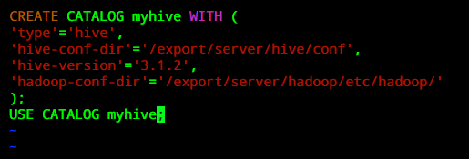

除了上面的一些配置参数，Flink还提供了下面的一些其他配置参数：

| **参数**         | **必选** | **默认值** | **类型** | **描述**                                                                                                                                                                                                                  |
|------------------|----------|------------|----------|---------------------------------------------------------------------------------------------------------------------------------------------------------------------------------------------------------------------------|
| type             | 是       | (无)       | String   | Catalog 的类型。 创建 HiveCatalog 时，该参数必须设置为'hive'。                                                                                                                                                            |
| name             | 是       | (无)       | String   | Catalog 的名字。仅在使用 YAML file 时需要指定。                                                                                                                                                                           |
| hive-conf-dir    | 否       | (无)       | String   | 指向包含 hive-site.xml 目录的 URI。 该 URI 必须是 Hadoop 文件系统所支持的类型。 如果指定一个相对 URI，即不包含 scheme，则默认为本地文件系统。如果该参数没有指定，我们会在 class path 下查找hive-site.xml。                |
| default-database | 否       | default    | String   | 当一个catalog被设为当前catalog时，所使用的默认当前database。                                                                                                                                                              |
| hive-version     | 否       | (无)       | String   | HiveCatalog 能够自动检测使用的 Hive 版本。我们建议不要手动设置 Hive 版本，除非自动检测机制失败。                                                                                                                          |
| hadoop-conf-dir  | 否       | (无)       | String   | Hadoop 配置文件目录的路径。目前仅支持本地文件系统路径。我们推荐使用 HADOOP_CONF_DIR 环境变量来指定 Hadoop 配置。因此仅在环境变量不满足您的需求时再考虑使用该参数，例如当您希望为每个 HiveCatalog 单独设置 Hadoop 配置时。 |

## 什么是Hive Catalog

我们知道，Hive使用Hive Metastore(HMS)存储元数据信息，使用关系型数据库来持久化存储这些信息。所以，Flink集成Hive需要打通Hive的metastore，去管理Flink的元数据，这就是Hive Catalog的功能。

Hive Catalog的主要作用是使用Hive MetaStore去管理Flink的元数据。Hive Catalog可以将元数据进行持久化，这样后续的操作就可以反复使用这些表的元数据，而不用每次使用时都要重新注册。如果不去持久化catalog，那么在每个session中取处理数据，都要去重复地创建元数据对象，这样是非常耗时的。

### 知识点03： 【理解】如何使用Hive Catalog

HiveCatalog是开箱即用的，所以，一旦配置好Flink与Hive集成，就可以使用HiveCatalog。比如，我们通过FlinkSQL 的DDL语句创建一张kafka的数据源表，立刻就能查看该表的元数据信息。

HiveCatalog可以处理两种类型的表：一种是Hive兼容的表，另一种是普通表(generic table)。其中Hive兼容表是以兼容Hive的方式来存储的，所以，对于Hive兼容表而言，我们既可以使用Flink去操作该表，又可以使用Hive去操作该表。

普通表是对Flink而言的，当使用HiveCatalog创建一张普通表，仅仅是使用Hive MetaStore将其元数据进行了持久化，所以可以通过Hive查看这些表的元数据信息(通过DESCRIBE FORMATTED命令)，但是不能通过Hive去处理这些表，因为语法不兼容。

建议切换到Hive方言创建Hive兼容的表，如果使用默认的方言（Flink SQL）创建Hive兼容的表，需要在表属性中设置**'connector'='hive'**，反之使用Hive方言则不需要设置。

### 知识点04： 【实现】Flink SQL-Cli中使用Hive Catalog

#### 准备工作

-   首先开启Hive的 metastore

```
nohup hive --service metastore 2\>&1 \> /tmp/hive-metastore.log & 
```

> **注意**：在启动之前，确保Hive的 metastore 已经开启了，否则会报 Failed to create Hive Metastore client异常。 

-   将**flink-sql-connector-kafka_2.12.jar**包放至/export/server/flink/lib目录下（后续创建kafka的数据源表需要用到）

#### 操作演示

-   启动hiveFlinkSQL Cli，命令如下：

```shell
/export/server/flink/bin/sql-client.sh embedded -i /export/server/flink/conf/sql-conf.sql
```

-   接下来，我们可以查看注册的 catalog

```
show catalogs;
```

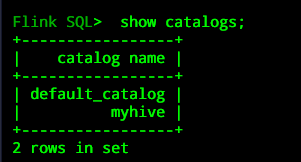

-   使用注册的 myhive catalog

```sql
use catalog myhive;
```


-   **查看flink sql中数据库**

```sql
show databases;
```

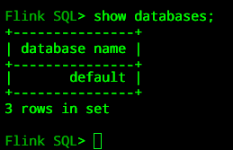

-   **切换hive-cli**
-   **hive中创建数据库：flink_demo**

```sql
create database flink_demo;
use flink_demo;
```

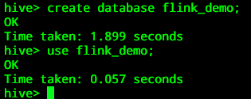

-   **hive中创建表：users**

```sql
CREATE TABLE IF NOT EXISTS `flink_demo.users`(
    `id` int, 
    `name` string
)ROW FORMAT DELIMITED
FIELDS TERMINATED BY '\t'
LINES TERMINATED BY '\n'
STORED AS TEXTFILE;
```

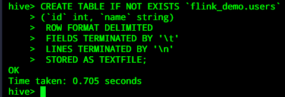

-   **使用注册在Hive中查询该表：**

```sql
show tables;
```

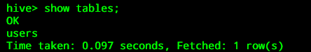

```sql
select * from users;（现在是一个空表）
```

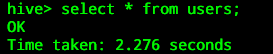

-   **回到flink-sql-client，我们查看库查看表**

```
show databases;
```

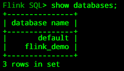

```
USE flink_demo;
```


```
show tables;
```

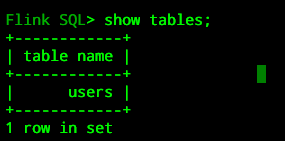

**我们可以看到，flink sql-client中已经同步过来hive中的表了，那我们接下来在flink sql-client对hive表进行操作。**

-   **采用Flink SQL 向Hive表users中插入一条数据：**

```sql
INSERT INTO users SELECT 1,'zhangsan';
```

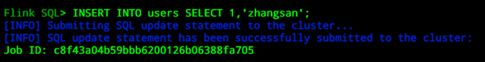

-   **再次使用Hive客户端去查询该表的数据，会发现写入了一条数据。**

```sql
select * from users;
```


-   **接下来，我们再在FlinkSQL Cli中创建一张kafka的数据源表：**

```sql
CREATE TABLE mykafka (
    name String,
    age Int
) WITH (
'connector' = 'kafka',
'topic' = 'test',
'properties.bootstrap.servers' = 'node1.itcast.cn:9092',
'properties.group.id' = 'testGroup',
'scan.startup.mode' = 'earliest-offset',
'format' = 'csv'
);
```

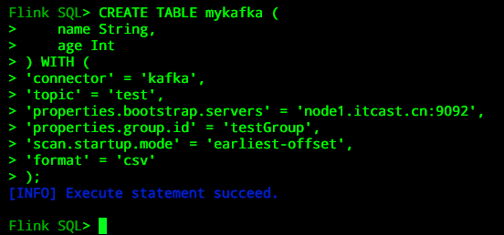

-   **通过 Hive Cli 验证表对 Hive 也可见：**

```sql
show tables;
```

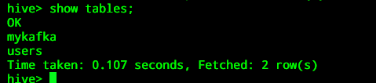

-   **查看表结构**

```sql
DESCRIBE mykafka;
```

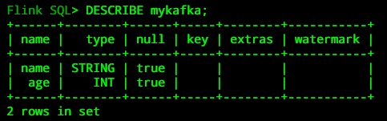

-   **可以在Hive的客户端中执行下面命令查看刚刚在Flink SQLCli中创建的表**

```sql
desc formatted mykafka;
```

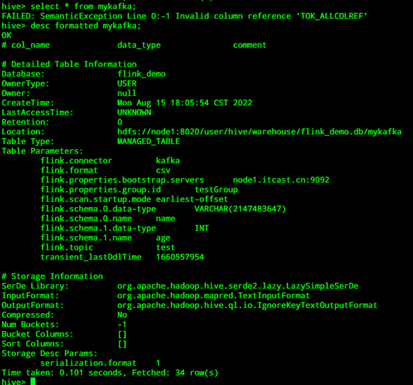

> 注意：在Flink中创建一张表，会把该表的元数据信息持久化到Hive的metastore中，我们可以在Hive的metastore中查看该表的元数据信息 

-   **进入Hive的元数据信息库，本文使用的是MySQL。执行下面的命令：**

```
use hive3;
```

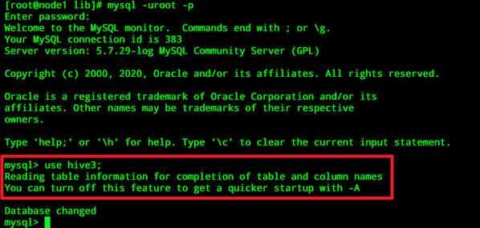

```sql
SELECT 
   a.tbl_id,                                  -- 表id
   from_unixtime(create_time) AS create_time, -- 创建时间
   a.db_id,                                   -- 数据库id
   b.name                     AS db_name,     -- 数据库名称
   a.tbl_name                                 -- 表名称
FROM TBLS AS a
LEFT JOIN DBS AS b ON a.db_id = b.db_id
WHERE a.tbl_name = "mykafka";
```

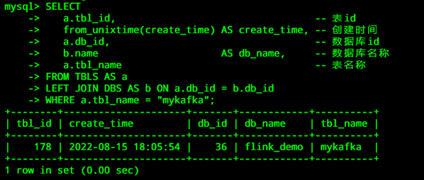

-   **创建Kafka话题并产生消息**

启动kafka集群

```shell
cd /export/server/kafka_2.12-2.4.1/
nohup bin/kafka-server-start.sh config/server.properties 2>&1 &
```

创建topic

```
bin/kafka-topics.sh --create \
--zookeeper node1:2181 \
--replication-factor 1 \
--partitions 1 \
--topic test
```

(如果删除topic)

```
bin/kafka-topics.sh --delete --zookeeper node1:2181 \
--topic test
```

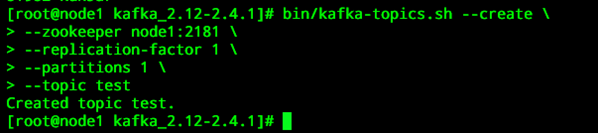

启动kafka生产者

```shell
bin/kafka-console-producer.sh --broker-list node1.itcast.cn:9092 --topic test
```

往test topic中插入一批测试数据

```
tom,15
john,21
kitty,30
amy,24
kaiky,18
```

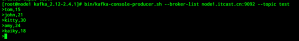

-   **在Flink SQL-CLI运行一个简单的选择查询：**

```sql
select * from mykafka;
```

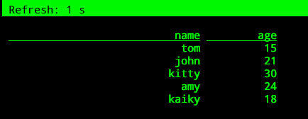

-   **在hive中查询mykafka表数据，是无法查询的：**

```sql
select * from mykafka;
```

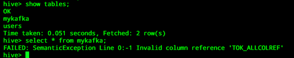

**对于Hive兼容的表，需要注意数据类型，具体的数据类型对应关系以及注意点如下：**

| **Flink Data Type** | **Hive Data Type** |
| ------------------- | ------------------ |
| **CHAR(p)**         | **CHAR(p)**        |
| **VARCHAR(p)**      | **VARCHAR(p)**     |
| **STRING**          | **STRING**         |
| **BOOLEAN**         | **BOOLEAN**        |
| **TINYINT**         | **TINYINT**        |
| **SMALLINT**        | **SMALLINT**       |
| **INT**             | **INT**            |
| **BIGINT**          | **LONG**           |
| **FLOAT**           | **FLOAT**          |
| **DOUBLE**          | **DOUBLE**         |
| **DECIMAL(p, s)**   | **DECIMAL(p, s)**  |
| **DATE**            | **DATE**           |
| **TIMESTAMP(9)**    | **TIMESTAMP**      |
| **BYTES**           | **BINARY**         |
| **ARRAY**           | **LIST**           |
| **MAP\<K, V\>**     | **MAP\<K, V\>**    |
| **ROW**             | **STRUCT**         |

**注意**：

> Hive CHAR(p) 类型的最大长度为255
>
> Hive VARCHAR(p)类型的最大长度为65535
>
> Hive MAP类型的key仅支持基本类型，而Flink’s MAP 类型的key执行任意类型
>
> Hive不支持联合数据类型，比如STRUCT
>
> Hive’s TIMESTAMP 的精度是 9 ， Hive UDFs函数只能处理 precision <= 9的 TIMESTAMP 值
>
> Hive不支持Flink提供的TIMESTAMP_WITH_TIME_ZONE, TIMESTAMP_WITH_LOCAL_TIME_ZONE, 及MULTISET类型
>
> FlinkINTERVAL 类型与 Hive INTERVAL 类型不一样

## **什么是Hive Dialect**

上面介绍了普通表和Hive兼容表，那么我们该如何使用Hive的语法进行建表呢？这个时候就需要使用Hive Dialect。

从 1.11.0 开始，在使用Hive方言时，Flink允许用户用Hive语法来编写SQL语句。通过提供与 Hive 语法的兼容性，我们旨在改善与 Hive 的互操作性，并减少用户需要在 Flink 和 Hive 之间切换来执行不同语句的情况。

### 知识点05： 【理解】**如何使用Hive Dialect**

Flink 目前支持两种 SQL 方言: default 和 hive。你需要先切换到 Hive 方言，然后才能使用 Hive 语法编写。下面介绍如何使用 SQL 客户端和 Table API 设置方言。 还要注意，你可以为执行的每个语句动态切换方言。无需重新启动会话即可使用其他方言。

### 知识点06： 【实现】**在SQL Cli中使用Hive Dialect**

#### **准备工作**

使用hive dialect只需要配置一个参数即可，该参数名称为：table.sql-dialect。如果我们需要在SQL Cli中进行切换hive dialect，可以使用如下命令：

使用hive dialect

```sql
set table.sql-dialect=hive; 
```


使用default dialect

```sql
set table.sql-dialect= default;
```

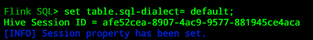

> 注意：一旦切换到了hive dialect，就只能使用Hive的语法建表，如果尝试使用Flink的语法建表，则会报错。 

#### **操作演示**

-   **进入flink sql-client命令行：**

```sql
set sql-client.execution.result-mode = tableau;
set table.sql-dialect=hive; 
```

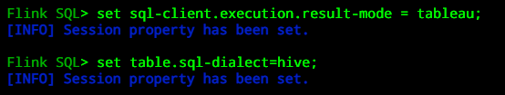

-   **创建表**

```sql
create table tbl (key int,value string);
```

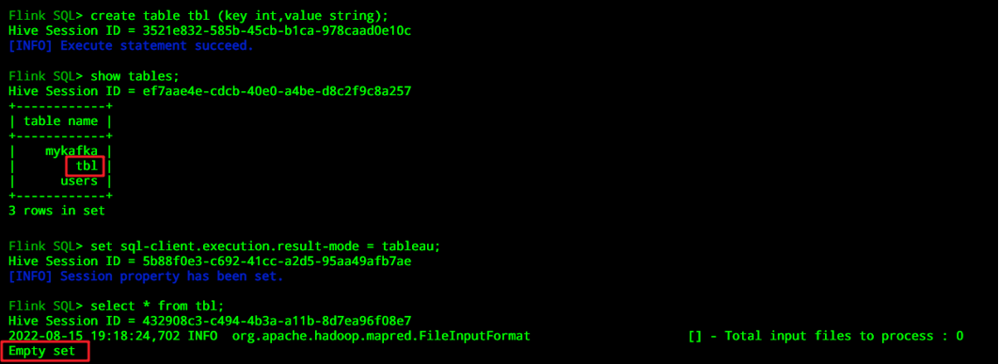

```sql
insert into table tbl values (5,'e'),(1,'a'),(1,'a'),(3,'c'),(2,'b'),(3,'c'),(3,'c'),(4,'d');
```

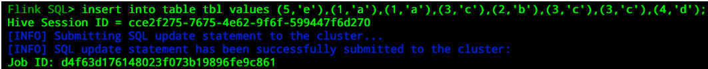

```sql
select * from tbl;
```

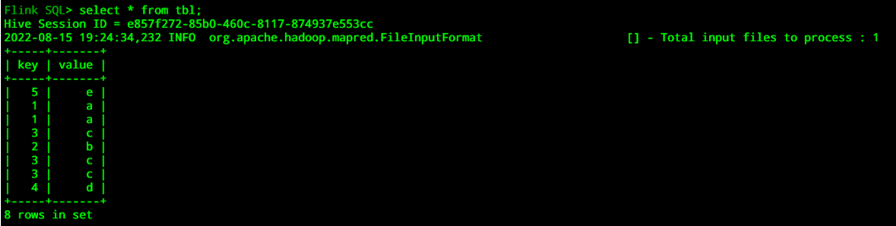

**我们也可以在Hive的Cli中去操作该表：**

-   **查询表**

```sql
select * from tbl;
```

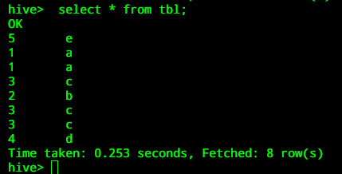

> 注意：一旦开启了Hive dialect，我们就可以按照Hive的操作方式在Flink中去处理Hive的数据了，具体的操作与Hive一致，本文不再赘述。

## **Flink读写Hive**

### 知识点07：【掌握】**Flink写入Hive表**

Flink支持以批处理(Batch)和流处理(Streaming)的方式写入Hive表。当以批处理的方式写入Hive表时，只有当写入作业结束时，才可以看到写入的数据。

#### **批处理模式写入**

-   **批处理的方式写入支持append模式和overwrite模式。**

采用flink default方言

```
set table.sql-dialect= default;
```

使用批处理模式

```
set execution.type = batch;
set execution.runtime-mode = batch;
```

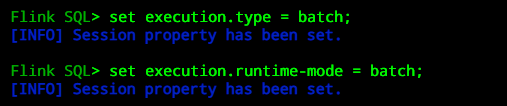

append 追加数据

```sql
INSERT INTO users SELECT 2,'tom';
```

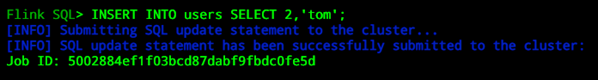

```sql
select * from users;
```

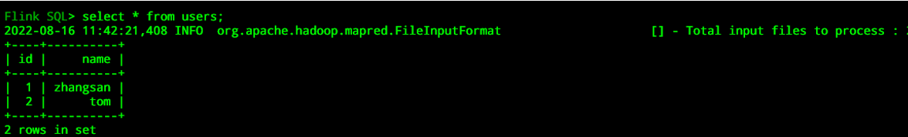

overwrite 覆盖数据

```sql
INSERT OVERWRITE users SELECT 2,'jack';
```

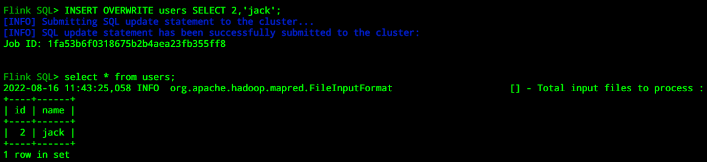

-   **数据也可以插入到特定的分区中**

创建hive表

方法一：在hive客户端创建（我们采用这种方式）

```sql
CREATE TABLE IF NOT EXISTS `flink_demo.myparttable`(
    `id` int,
    `name` string
) PARTITIONED BY(my_type string, my_date date)
ROW FORMAT DELIMITED
FIELDS TERMINATED BY '\t'
LINES TERMINATED BY '\n'
STORED AS TEXTFILE;
```

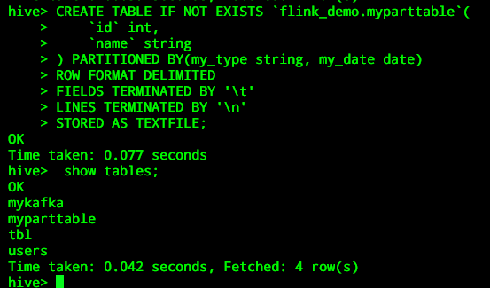

采用flink-sql-cli创建hive分区

```sql
-- 切换hive方言
set table.sql-dialect = default;
-- 在flink sql-cli中建表
CREATE TABLE IF NOT EXISTS `flink_demo.myparttable`(
    `id` int,
    `name` string
) PARTITIONED BY(my_type string, my_date date)
ROW FORMAT DELIMITED
FIELDS TERMINATED BY '\t'
LINES TERMINATED BY '\n'
STORED AS TEXTFILE;
```

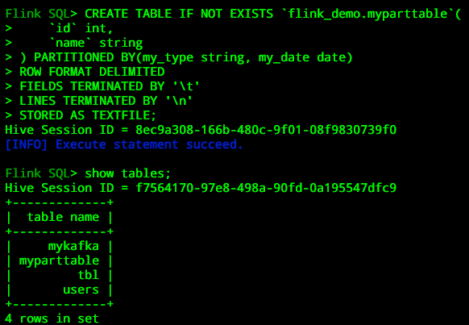

采用flink sql-cli插入静态分区

```sql
INSERT INTO myparttable PARTITION (my_type='type_1', my_date='2019-08-08') SELECT 3,'Tom';
```

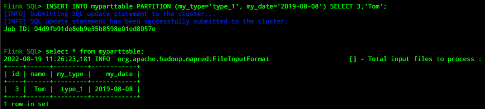

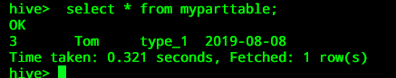

在hive中开启动态分区

```sql
set hive.exec.dynamic.partition=true;  --  开启动态分区，默认是false
set hive.exec.dynamic.partition.mode=nonstrict; -- 开启允许所有分区都是动态的，否则必须要有静态分区才能使用。
```

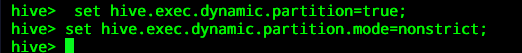

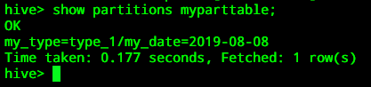

采用flink sql-cli插入动态分区

```sql
INSERT OVERWRITE myparttable SELECT 4, 'Tom', 'type_1', cast('2019-08-08' as date);
```

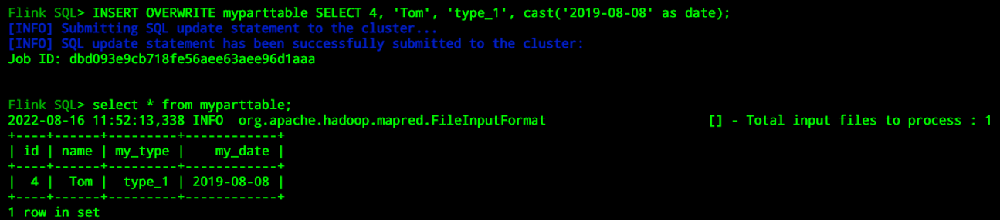

```sql
INSERT OVERWRITE myparttable SELECT 4, 'Tom', 'type_2', cast('2019-08-08' as date);
```

采用flink sql-cli插入动静混合分区

```sql
INSERT OVERWRITE myparttable PARTITION (my_type='type_1') SELECT 25, 'Tom', cast('2019-08-08' as date);
```

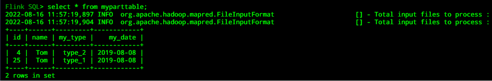

#### **流处理模式写入**

##### **操作演示**

-   **使用流处理模式**

```sql
set execution.type = streaming;
set execution.runtime-mode = streaming;
```

-   **流式写入Hive表，不支持Insert overwrite方式，否则报如下错误：**

**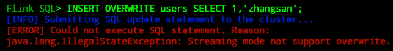**

**下面的示例是将kafka的数据流式写入Hive的分区表：**

-   **创建一张Hive分区表**

使用Hive方言

```sql
SET table.sql-dialect=hive;
CREATE TABLE stream_kafka_hive_tbl (
   `user_name` string, -- 用户
   `value` double, -- 值
   `ts` string -- 行为发生的时间
) PARTITIONED BY (dt STRING,hr STRING,mi STRING)
STORED AS parquet
TBLPROPERTIES (
    'partition.time-extractor.timestamp-pattern'='$dt $hr:$mi:00',
    'sink.partition-commit.trigger'='partition-time',
    'sink.partition-commit.delay'='0S',
    'sink.partition-commit.policy.kind'='metastore,success-file'
);
```

-   **创建一张kafka数据源表**

使用默认SQL方言

```
SET table.sql-dialect=default; 
create table stream_kafka(
     `user_name` string,
     `value` double,
     `ts` string,
     `proctime` as proctime(), -- 通过计算列产生一个处理时间列
     `eventTime` as to_timestamp(from_unixtime(unix_timestamp(ts,'yyyy-MM-dd HH:mm:ss'),'yyyy-MM-dd HH:mm:ss')) ,-- 事件时间
     watermark for eventTime as eventTime - interval '5' second   -- 定义watermark
)with(
    'connector' = 'kafka', -- 使用 kafka connector
    'topic' = 'stream_kafka', -- kafka主题
    'scan.startup.mode' = 'earliest-offset', -- 偏移量
    'properties.group.id' = 'group1', -- 消费者组
    'properties.bootstrap.servers' = 'node1:9092',
    'format' = 'json', -- 数据源格式为json
    'json.fail-on-missing-field' = 'true',
    'json.ignore-parse-errors' = 'false'
);
```

-   **创建Kafka话题并产生消息**

启动kafka集群

```shell
cd /export/server/kafka_2.12-2.4.1/
nohup bin/kafka-server-start.sh config/server.properties 2>&1 &
```

创建topic

```
bin/kafka-topics.sh --create \
--zookeeper node1:2181 \
--replication-factor 1 \
--partitions 1 \
--topic stream_kafka
```

(如果删除topic)

```
bin/kafka-topics.sh --delete --zookeeper node1:2181 \
--topic stream_kafka
```

启动kafka生产者

```shell
bin/kafka-console-producer.sh --broker-list node1.itcast.cn:9092 --topic stream_kafka
```

往stream_kafka topic中插入一批测试数据

```
{"user_name":"zhangsan","value": 1.0,"ts":"2021-07-17 10:00:01"}
{"user_name":"zhangsan","value": 1.0,"ts":"2021-07-17 10:00:02"}
{"user_name":"zhangsan","value": 1.0,"ts":"2021-07-17 10:00:03"}
{"user_name":"zhangsan","value": 1.0,"ts":"2021-07-17 10:00:04"}
{"user_name":"zhangsan","value": 1.0,"ts":"2021-07-17 10:00:05"}
{"user_name":"zhangsan","value": 1.0,"ts":"2021-07-17 10:00:06"}
{"user_name":"zhangsan","value": 1.0,"ts":"2021-07-17 10:00:07"}
{"user_name":"zhangsan","value": 1.0,"ts":"2021-07-17 10:00:08"}
{"user_name":"zhangsan","value": 1.0,"ts":"2021-07-17 10:00:09"}
{"user_name":"zhangsan","value": 1.0,"ts":"2021-07-17 10:00:10"}
```

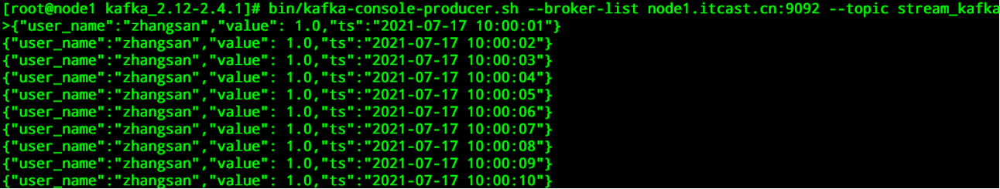

-   **执行流式写入Hive表**

```sql
INSERT INTO stream_kafka_hive_tbl
SELECT `user_name`, 
       `value`, `ts`, 
       from_unixtime(unix_timestamp(`ts`,'yyyy-MM-dd HH:mm:ss'),'yyyy-MM-dd'),
       from_unixtime(unix_timestamp(`ts`,'yyyy-MM-dd HH:mm:ss'),'HH'),
       from_unixtime(unix_timestamp(`ts`,'yyyy-MM-dd HH:mm:ss'),'mm') 
from stream_kafka;
```

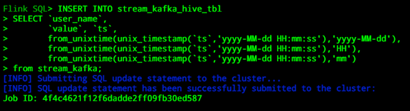

```
select * from stream_kafka_hive_tbl;
```

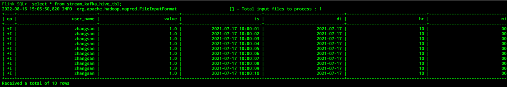

##### **关于Hive表的一些属性说明**

###### **partition.time-extractor.timestamp-pattern**

-   **默认值：(none)**

    **解释：分区时间抽取器，与 DDL 中的分区字段保持一致,如果是按天分区，则可以是\$dt，如果是按年(year)月(month)日(day)时(hour)进行分区，则该属性值为：\$year-\$month-\$day \$hour:00:00，如果是按天时进行分区，则该属性值为：\$day \$hour:00:00。**

###### **sink.partition-commit.trigger**

-   **process-time：不需要时间提取器和水位线，当当前时间大于分区创建时间 + sink.partition-commit.delay 中定义的时间，提交分区；**
-   **partition-time：需要 Source 表中定义 watermark，当 watermark \> 提取到的分区时间 +sink.partition-commit.delay 中定义的时间，提交分区；**
-   **默认值：process-time**

    **解释：分区触发器类型，可选 process-time 或partition-time。**

###### **sink.partition-commit.delay**

-   **默认值：0S**

    **解释：分区提交的延时时间，如果是按天分区，则该属性的值为：1d，如果是按小时分区，则该属性值为1h。**

###### **sink.partition-commit.policy.kind**

-   **metastore：添加分区的元数据信息，仅Hive表支持该值配置。**
-   **success-file：在表的存储路径下添加一个_SUCCESS文件。**
-   **默认值：(none)**

    **解释：提交分区的策略，用于通知下游的应用该分区已经完成了写入，也就是说该分区的。数据可以被访问读取。可选的值如下：可以同时配置上面的两个值，比如metastore,success-file。**

### 知识点08： 【掌握】**Flink读取Hive表**

**Flink支持以批处理(Batch)和流处理(Streaming)的方式读取Hive中的表。批处理的方式与Hive的本身查询类似，即只在提交查询的时刻查询一次Hive表。流处理的方式将会持续地监控Hive表，并且会增量地提取新的数据。默认情况下，Flink是以批处理的方式读取Hive表。**

**关于流式读取Hive表，Flink既支持分区表又支持非分区表。对于分区表而言，Flink将会监控新产生的分区数据，并以增量的方式读取这些数据。对于非分区表，Flink会监控Hive表存储路径文件夹里面的新文件，并以增量的方式读取新的数据。**

**Flink读取Hive表可以配置一下参数：**

-   **streaming-source.enable**
    -   **默认值：false**
    -   **解释：是否开启流式读取 Hive 表，默认不开启。**
-   **streaming-source.partition.include**
    -   **默认值：all**
    -   **解释：配置读取Hive的分区，包括两种方式：all和latest。all意味着读取所有分区的数据，latest表示只读取最新的分区数据。值得注意的是，latest方式只能用于开启了流式读取Hive表，并用于维表JOIN的场景。**
-   **streaming-source.monitor-interval**
    -   **默认值：None**
    -   **解释：持续监控Hive表分区或者文件的时间间隔。值得注意的是，当以流的方式读取Hive表时，该参数的默认值是1m，即1分钟。当temporal join时，默认的值是60m，即1小时。另外，该参数配置不宜过短 ，最短是1 个小时，因为目前的实现是每个 task 都会查询 metastore，高频的查可能会对metastore 产生过大的压力。**
-   **streaming-source.partition-order**
    -   **默认值：partition-name**
    -   **解释：streaming source的分区顺序。默认的是partition-name，表示使用默认分区名称顺序加载最新分区，也是推荐使用的方式。除此之外还有两种方式，分别为：create-time和partition-time。其中create-time表示使用分区文件创建时间顺序。partition-time表示使用分区时间顺序。指的注意的是，对于非分区表，该参数的默认值为：create-time。**
-   **streaming-source.consume-start-offset**
    -   **默认值：None**
    -   **解释：流式读取Hive表的起始偏移量。**
-   **partition.time-extractor.kind**
    -   **默认值：default**
    -   **分区时间提取器类型。用于从分区中提取时间，支持default和自定义。如果使用default，则需要通过参数partition.time-extractor.timestamp-pattern配置时间戳提取的正则表达式。**
-   **在 SQL Client 中需要显示地开启 SQL Hint 功能:**

```
Flink SQL> set table.dynamic-table-options.enabled= true;  
```


使用SQLHint流式查询Hive表:

```sql
SELECT * FROM stream_kafka_hive_tbl /*+ OPTIONS('streaming-source.enable'='true', 'streaming-source.consume-start-offset'='2021-01-03') */;
```

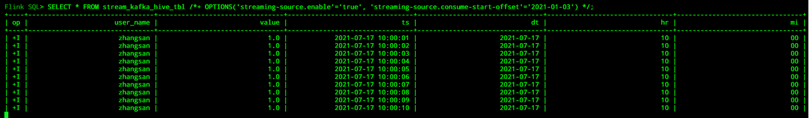

## **Hive维表JOIN**

Flink 1.12 支持了 Hive 最新的分区作为时态表的功能，可以通过 SQL 的方式直接关联 Hive 分区表的最新分区，并且会自动监听最新的 Hive 分区，当监控到新的分区后，会自动地做维表数据的全量替换。

Flink支持的是processing-time的temporal join，也就是说总是与最新版本的时态表进行JOIN。另外，Flink既支持非分区表的temporal join，又支持分区表的temporal join。对于分区表而言，Flink会监听Hive表的最新分区数据。值得注意的是，Flink尚不支持 event-time temporal join。

### **知识点09：【理解】Temporal Join最新分区**

对于一张随着时间变化的Hive分区表，Flink可以读取该表的数据作为一个无界流。如果Hive分区表的每个分区都包含全量的数据，那么每个分区将做为一个时态表的版本数据，即将最新的分区数据作为一个全量维表数据。值得注意的是，该功能特点仅支持Flink的streaming模式。

> 注意：使用 Hive 最新分区作为 Tempmoral table 之前，需要设置必要的两个参数： 'streaming-source.enable' = 'true',  'streaming-source.partition.include' = 'latest' 
>

除此之外还有一些其他的参数，关于参数的解释见上面的分析。我们在使用Hive维表的时候，既可以在创建Hive表时指定具体的参数，也可以使用SQL Hint的方式动态指定参数。

一个Hive维表的创建模板如下：

```sql
-- 使用Hive的sql方言
SET table.sql-dialect=hive;
CREATE TABLE dimension_table (
    product_id STRING,
    product_name STRING,
    unit_price DECIMAL(10, 4),
    pv_count BIGINT,
    like_count BIGINT,
    comment_count BIGINT,
    update_time TIMESTAMP(3),
    update_user STRING,
    ...
) PARTITIONED BY (pt_year STRING, pt_month STRING, pt_day STRING)
TBLPROPERTIES (
    -- 方式1：按照分区名排序来识别最新分区(推荐使用该种方式)
    'streaming-source.enable' = 'true', -- 开启Streaming source
    'streaming-source.partition.include' = 'latest',-- 选择最新分区
    'streaming-source.monitor-interval' = '12 h',-- 每12小时加载一次最新分区数据
    'streaming-source.partition-order' = 'partition-name',  -- 按照分区名排序

    -- 方式2:分区文件的创建时间排序来识别最新分区
    'streaming-source.enable' = 'true',
    'streaming-source.partition.include' = 'latest',
    'streaming-source.partition-order' = 'create-time',-- 分区文件的创建时间排序
    'streaming-source.monitor-interval' = '12 h'

    -- 方式3:按照分区时间排序来识别最新分区
    'streaming-source.enable' = 'true',
    'streaming-source.partition.include' = 'latest',
    'streaming-source.monitor-interval' = '12 h',
    'streaming-source.partition-order' = 'partition-time', -- 按照分区时间排序
    'partition.time-extractor.kind' = 'default',
    'partition.time-extractor.timestamp-pattern' = '$pt_year-$pt_month-$pt_day 00:00:00'
    );
```

有了上面的Hive维表，我们就可以使用该维表与Kafka的实时流数据进行JOIN，得到相应的宽表数据:

```sql
-- 使用default sql方言
SET table.sql-dialect=default;
-- kafka实时流数据表
CREATE TABLE orders_table (
    order_id STRING,
    order_amount DOUBLE,
    product_id STRING,
    log_ts TIMESTAMP(3),
    proctime as PROCTIME()
) WITH (...);

-- 将流表与hive最新分区数据关联 
SELECT *
FROM orders_table AS orders
JOIN dimension_table FOR SYSTEM_TIME AS OF orders.proctime AS dim
ON orders.product_id = dim.product_id;
```

除了在定义Hive维表时指定相关的参数，我们还可以通过SQL Hint的方式动态指定相关的参数，具体方式如下：

```sql
SELECT *
FROM orders_table AS orders
JOIN dimension_table
/*+ OPTIONS('streaming-source.enable'='true',
    'streaming-source.partition.include' = 'latest',
    'streaming-source.monitor-interval' = '1 h',
    'streaming-source.partition-order' = 'partition-name') */
FOR SYSTEM_TIME AS OF orders.proctime AS dim -- 时态表(维表)
ON orders.product_id = dim.product_id;
```

### **知识点10：【理解】Temporal Join最新表**

对于Hive的非分区表，当使用temporal join时，整个Hive表会被缓存到Slot内存中，然后根据流中的数据对应的key与其进行匹配。使用最新的Hive表进行temporal join不需要进行额外的配置，我们只需要配置一个Hive表缓存的TTL时间，该时间的作用是：当缓存过期时，就会重新扫描Hive表并加载最新的数据。

-   lookup.join.cache.ttl
    -   默认值：60min
    -   解释：表示缓存时间。由于 Hive 维表会把维表所有数据缓存在 TM 的内存中，当维表数据量很大时，很容易造成 OOM。当然TTL的时间也不能太短，因为会频繁地加载数据，从而影响性能。

> 注意：
> 当使用此种方式时，Hive表必须是有界的lookup表，即非Streaming Source的时态表，换句话说，该表的属性streaming-source.enable = false。
> 如果要使用Streaming Source的时态表，记得配置streaming-source.monitor-interval的值，即数据更新的时间间隔。

-   Hive维表数据使用批处理的方式创建模板（按天装载）

```sql
SET table.sql-dialect=hive;
CREATE TABLE dimension_table (
    product_id STRING,
    product_name STRING,
    unit_price DECIMAL(10, 4),
    pv_count BIGINT,
    like_count BIGINT,
    comment_count BIGINT,
    update_time TIMESTAMP(3),
    update_user STRING,
    ...
) TBLPROPERTIES (
    'streaming-source.enable' = 'false', -- 关闭streaming source
    'streaming-source.partition.include' = 'all',  -- 读取所有数据
    'lookup.join.cache.ttl' = '12 h'
    );

-- kafka事实表
SET table.sql-dialect=default;
CREATE TABLE orders_table (
    order_id STRING,
    order_amount DOUBLE,
    product_id STRING,
    log_ts TIMESTAMP(3),
    proctime as PROCTIME()
) WITH (...);

-- Hive维表join，Flink会加载该维表的所有数据到内存中
SELECT *
FROM orders_table AS orders
JOIN dimension_table FOR SYSTEM_TIME AS OF orders.proctime AS dim
ON orders.product_id = dim.product_id;
```

> **注意**：
>
> - 每一个子任务都需要缓存一份维表的全量数据，一定要确保TM的task Slot大小能够容纳维表的数据量；
> - 推荐将**streaming-source.monitor-interval和lookup.join.cache.ttl**的值设为一个较大的数，因为频繁的更新和加载数据会影响性能。
> - 当缓存的维表数据需要重新刷新时，目前的做法是将整个表进行加载，因此不能够将新数据与旧数据区分开来。

### 知识点11：【实现】**Hive维表JOIN示例**

假设维表的数据是通过批处理的方式(比如每天)装载至Hive中，而Kafka中的事实流数据需要与该维表进行JOIN，从而构建一个宽表数据，这个时候就可以使用Hive的维表JOIN。

-   **创建一张kafka数据源表,实时流**

```
SET table.sql-dialect=default;
CREATE TABLE fact_user_behavior (
    `user_id` BIGINT, -- 用户id
    `item_id` BIGINT, -- 商品id
    `ts` STRING, -- 用户行为发生的时间戳
    `proctime` AS PROCTIME(), -- 通过计算列产生一个处理时间列
    `eventTime` AS TO_TIMESTAMP(FROM_UNIXTIME(unix_timestamp(ts,'yyyy-MM-dd HH:mm:ss'), 'yyyy-MM-dd HH:mm:ss')), -- 事件时间
    WATERMARK FOR eventTime AS eventTime - INTERVAL '5' SECOND  -- 定义watermark
) WITH ( 
    'connector' = 'kafka', -- 使用 kafka connector
    'topic' = 'user_behaviors', -- kafka主题
    'scan.startup.mode' = 'earliest-offset', -- 偏移量
    'properties.group.id' = 'group1', -- 消费者组
    'properties.bootstrap.servers' = 'node1:9092', 
    'format' = 'json', -- 数据源格式为json
    'json.fail-on-missing-field' = 'true',
    'json.ignore-parse-errors' = 'false'
);
```

插入数据

```shell
-- 创建topic
cd /export/server/kafka_2.12-2.4.1/
bin/kafka-topics.sh --create \
--zookeeper node1:2181 \
--replication-factor 1 \
--partitions 1 \
--topic user_behaviors


-- 启动kafka生产者
bin/kafka-console-producer.sh --broker-list node1:9092 --topic user_behaviors


-- 测试数据
{"user_id":1,"item_id":1,"ts":"2021-07-17 10:00:01"}
{"user_id":2,"item_id":1,"ts":"2021-07-17 10:00:02"}
{"user_id":3,"item_id":1,"ts":"2021-07-17 10:00:03"}
{"user_id":4,"item_id":2,"ts":"2021-07-17 10:00:04"}
{"user_id":5,"item_id":2,"ts":"2021-07-17 10:00:05"}
{"user_id":6,"item_id":2,"ts":"2021-07-17 10:00:06"}
{"user_id":7,"item_id":3,"ts":"2021-07-17 10:00:07"}
{"user_id":8,"item_id":3,"ts":"2021-07-17 10:00:08"}
{"user_id":9,"item_id":3,"ts":"2021-07-17 10:00:09"}
{"user_id":10,"item_id":4,"ts":"2021-07-17 10:00:10"}
```

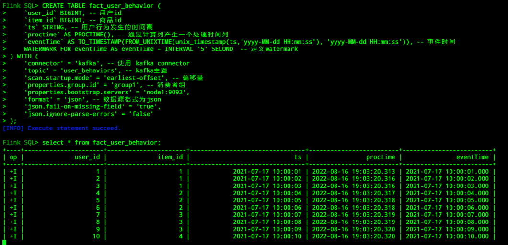

-   **创建一张Hive维表**

```sql
SET table.sql-dialect=hive;
CREATE TABLE dim_item (
    item_id BIGINT,
    item_name STRING,
    unit_price DECIMAL(10, 4)
) PARTITIONED BY (dt STRING) 
TBLPROPERTIES (
    'streaming-source.enable' = 'true',
    'streaming-source.partition.include' = 'latest',
    'streaming-source.monitor-interval' = '12 h',
    'streaming-source.partition-order' = 'partition-name'
);
```

插入数据

```sql
-- 设置批处理
SET execution.runtime-mode = batch;
SET execution.type=batch;

-- 插入数据
INSERT INTO dim_item PARTITION (dt='2019-08-08') select 1,'蜡笔小新',80;
INSERT INTO dim_item PARTITION (dt='2019-08-08') select 2,'猫和老鼠',60;
INSERT INTO dim_item PARTITION (dt='2019-08-08') select 3,'游戏王',40;
INSERT INTO dim_item PARTITION (dt='2019-08-08') select 4,'葫芦娃',100;
```

-   **关联Hive维表的最新数据**

```sql
-- 设置流处理模式
SET execution.runtime-mode = streaming;
SET execution.type = streaming;
-- 设置默认SQL方言
SET table.sql-dialect = default;
SELECT
    fact.item_id,
    dim.item_name,
    count(*) AS cnt
FROM fact_user_behavior AS fact
LEFT JOIN dim_item FOR SYSTEM_TIME AS OF fact.proctime AS dim
ON fact.item_id = dim.item_id
GROUP BY fact.item_id,dim.item_name;
```

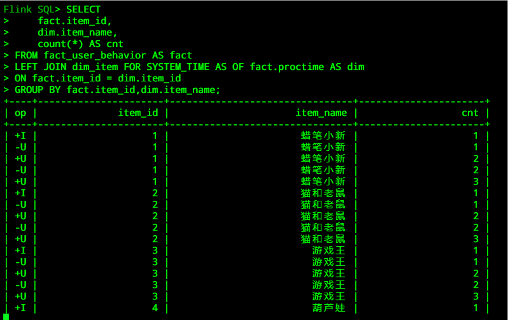

-   **使用SQL Hint方式，关联非分区的Hive维表：**

```sql
set table.dynamic-table-options.enabled= true;
SELECT
    fact.item_id,
    dim.item_name,
    count(*) AS cnt
FROM fact_user_behavior AS fact
LEFT JOIN dim_item
/*+ OPTIONS('streaming-source.enable'='false',             
    'streaming-source.partition.include' = 'all',
    'lookup.join.cache.ttl' = '12 h') */
    FOR SYSTEM_TIME AS OF fact.proctime AS dim
ON fact.item_id = dim.item_id
GROUP BY fact.item_id,dim.item_name;
```

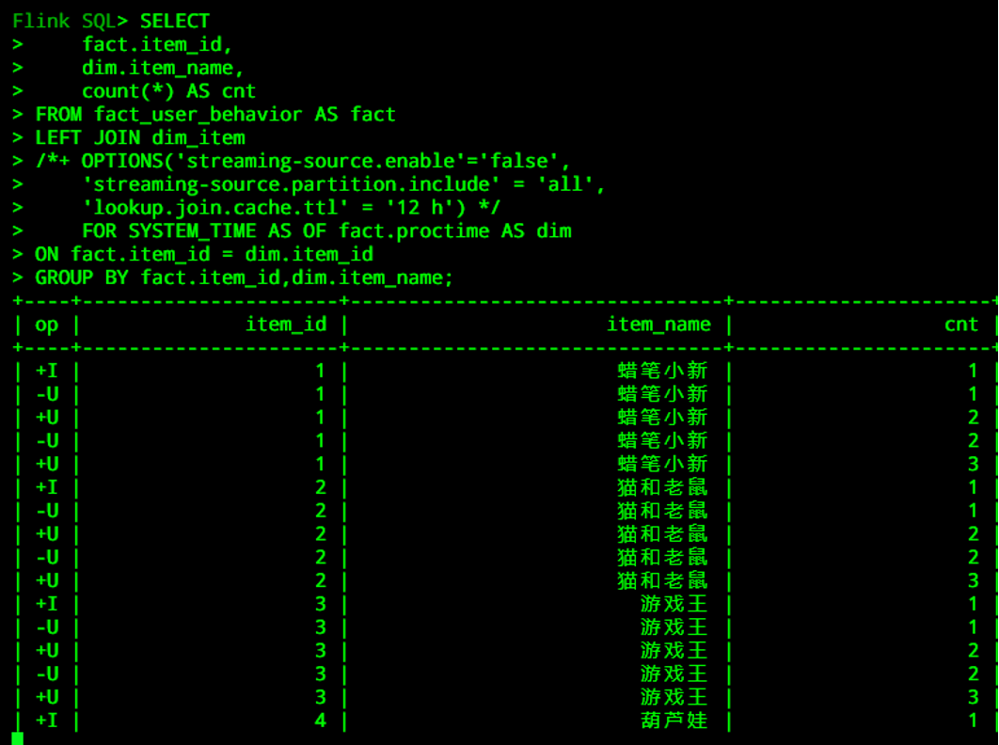

## 常见面试题

**一、Flink 与 Hive 的集成主要体现在哪些方面?**

- 持久化元数据
  - Flink利用Hive的MetaStore作为持久化的Catalog，我们可通过HiveCatalog将不同会话中的 Flink元数据存储到Hive Metastore 中。
  - 例如，我们可以使用HiveCatalog将其 Kafka的数据源表存储在 Hive Metastore 中，这样该表的元数据信息会被持久化到Hive的MetaStore对应的元数据库中，在后续的SQL查询中，我们可以重复使用它们。
- 利用 Flink 来读写 Hive 的表
  - Flink打通了与Hive的集成，如同使用SparkSQL或者Impala操作Hive中的数据一样，我们可以使用Flink直接读写Hive中的表。
  - HiveCatalog的设计提供了与 Hive 良好的兼容性，用户可以”开箱即用”的访问其已有的 Hive表。不需要修改现有的 Hive Metastore，也不需要更改表的数据位置或分区。

**二、Flink写入Hive有哪些方式？**

- Flink支持以批处理(Batch)和流处理(Streaming)的方式写入Hive表。
  当以批处理的方式写入Hive表时，只有当写入作业结束时，才可以看到写入的数据。批处理的方式写入支持append模式和overwrite模式。流式写入Hive表，不支持Insert overwrite方式。

**三、Flink如何读取Hive表?**

- Flink支持以批处理(Batch)和流处理(Streaming)的方式读取Hive中的表。
  - 批处理的方式与Hive的本身查询类似，即只在提交查询的时刻查询一次Hive表。
  - 流处理的方式将会持续地监控Hive表，并且会增量地提取新的数据。默认情况下，Flink是以批处理的方式读取Hive表。
- 关于流式读取Hive表，Flink既支持分区表又支持非分区表。对于分区表而言，Flink将会监控新产生的分区数据，并以增量的方式读取这些数据。对于非分区表，Flink会监控Hive表存储路径文件夹里面的新文件，并以增量的方式读取新的数据。  

**四、 什么是Hive Catalog？**

- Hive使用Hive Metastore(HMS)存储元数据信息，使用关系型数据库来持久化存储这些信息。所以，Flink集成Hive需要打通Hive的metastore，去管理Flink的元数据，这就是Hive Catalog的功能。
- Hive Catalog的主要作用是使用Hive MetaStore去管理Flink的元数据。Hive Catalog可以将元数据进行持久化，这样后续的操作就可以反复使用这些表的元数据，而不用每次使用时都要重新注册。如果不去持久化catalog，那么在每个session中取处理数据，都要去重复地创建元数据对象，这样是非常耗时的。

**五、如何使用Hive Catalog？**

- HiveCatalog是开箱即用的，所以，一旦配置好Flink与Hive集成，就可以使用HiveCatalog。比如，我们通过FlinkSQL 的DDL语句创建一张kafka的数据源表，立刻就能查看该表的元数据信息。
- HiveCatalog可以处理两种类型的表：一种是Hive兼容的表，另一种是普通表(generic table)。其中Hive兼容表是以兼容Hive的方式来存储的，所以，对于Hive兼容表而言，我们既可以使用Flink去操作该表，又可以使用Hive去操作该表。
- 普通表是对Flink而言的，当使用HiveCatalog创建一张普通表，仅仅是使用Hive MetaStore将其元数据进行了持久化，所以可以通过Hive查看这些表的元数据信息(通过DESCRIBE FORMATTED命令)，但是不能通过Hive去处理这些表，因为语法不兼容。