# 博学谷大数据平台_Flink CDC

## 学习目标

- 了解 CDC 的原理
- 了解常见的开源 CDC 方案
- 了解 Flink CDC 的原理
- 掌握 Flink CDC 的功能特性和核心特性
- 了解 Flink CDC 支持的数据源与对应的 Flink 的版本
- 掌握 Flink CDC 对比数据入仓优势
- 掌握 Flink CDC 的应用场景
- 熟练使用虚拟机完成案例练习

## CDC 概述

### 知识点01： 【理解】什么是CDC？

CDC 的全称是 Change Data Capture ，在广义的概念上，只要是能捕获数据变更的技术，我们都可以称之为 CDC 。目前通常描述的 CDC 技术主要面向数据库的变更，是一种用于捕获数据库中数据变更的技术。

CDC 技术的应用场景非常广泛：

1. 数据同步：用于数据备份，容灾；
2. 数据分发：一个数据源分发给多个下游系统；
3. 数据采集：面向数据仓库 / 数据湖的 ETL 数据集成，是非常重要的数据源。

### 知识点02： 【了解】CDC的实现机制

CDC 的技术方案非常多，目前业界主流的实现机制可以分为两种：

**1) 基于主动查询的 CDC：**

用户通常会在数据源表的某个字段中，保存上次更新的时间戳或版本号等信息，然后下游通过不断的查询和与上次的记录做对比，来确定数据是否有变动，是否需要同步。特点：

- 离线调度查询作业，批处理。把一张表同步到其他系统，每次通过查询去获取表中最新的数据;
- 无法保障数据一致性，查的过程中有可能数据已经发生了多次变更；
- 持续的频繁查询对数据库的压力较大。
- 不保障实时性，基于离线调度存在天然的延迟。

**2) 基于事件接收CDC：**

可以通过触发器（Trigger）或者日志（例如 Transaction log、Binary log、Write-ahead log 等）来实现。当数据源表发生变动时，会通过附加在表上的触发器或者 binlog 等途径，将操作记录下来。下游可以通过数据库底层的协议，订阅并消费这些事件，然后对数据库变动记录做重放，从而实现同步。

- 实时消费日志，流处理，例如 MySQL 的 binlog 日志完整记录了数据库中的变更，可以把 binlog 文件当作流的数据源；
- 保障数据一致性，因为 binlog 文件包含了所有历史变更明细；
- 保障实时性，因为类似 binlog 的日志文件是可以流式消费的，提供的是实时数据。

综合来看，事件接收模式整体在实时性、吞吐量方面占优，如果数据源是 MySQL、PostgreSQL、MongoDB 等常见的数据库实现，建议使用 Debezium来实现变更数据的捕获。如果使用的只有 MySQL，则还可以用 Canal。

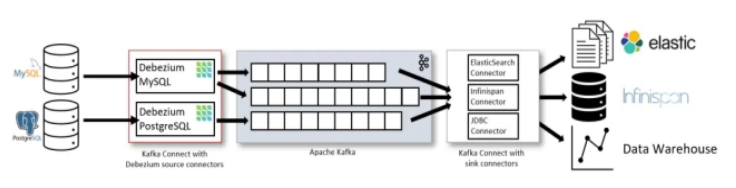

### 知识点03： 【理解】常见的开源CDC方案

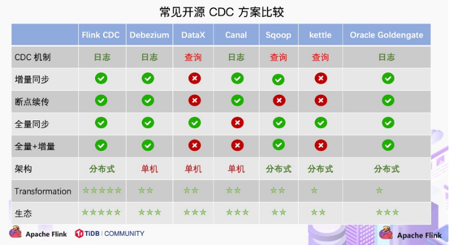

1. 对比全量同步能力:

   - 基于查询或者日志的 CDC 方案基本都支持，除了 Canal(仅支持增量)。
   - 对比全量 + 增量同步的能力，只有 Flink CDC、Debezium、Oracle Goldengate 支持较好。

2. 对比增量同步能力:

   - 基于日志的方式，可以很好的做到增量同步；
   - 而基于查询的方式是很难做到增量同步的。

3. 从架构角度去看：

   - 该表将架构分为单机和分布式，这里的分布式架构不单纯体现在数据读取能力的水平扩展上，更重要的是在大数据场景下分布式系统接入能力。例如 Flink CDC 的数据入湖或者入仓的时候，下游通常是分布式的系统，如 Hive、HDFS、Iceberg、Hudi 等，那么从对接入分布式系统能力上看，Flink CDC 的架构能够很好地接入此类系统。

4. 在数据转换 / 数据清洗能力上：

   当数据进入到 CDC 工具的时候是否能较方便的对数据做一些过滤或者清洗，甚至聚合。

   - 在 Flink CDC 上操作相当简单，可以通过 Flink SQL 去操作这些数据；
   - DataX、Debezium 等则需要通过脚本或者模板去做，所以用户的使用门槛会比较高。

5. 在生态扩展方面:

   - 这里指的是下游的一些数据库或者数据源的支持。Flink CDC 下游有丰富的 Connector，例如写入到 TiDB、MySQL、Pg、HBase、Kafka、ClickHouse 等常见的一些系统，也支持各种自定义 connector。

## Flink CDC项目

### 知识点04： 【了解】**Dynamic Table & ChangeLog Stream**

大家都知道 Flink 有两个基础概念：Dynamic Table 和 Changelog Stream。

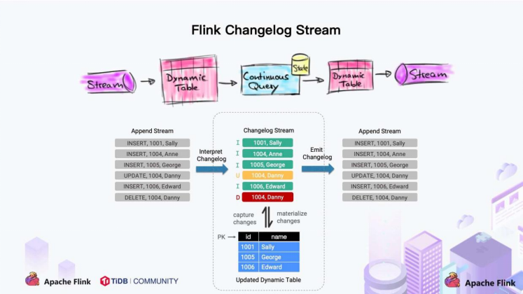

Dynamic Table 就是 Flink SQL 定义的动态表，动态表和流的概念是对等的。参照上图，流可以转换成动态表，动态表也可以转换成流。

在 Flink SQL中，数据在从一个算子流向另外一个算子时都是以 Changelog Stream 的形式，任意时刻的 Changelog Stream 可以翻译为一个表，也可以翻译为一个流。

参照MySQL 中的表和 binlog 日志，就会发现：MySQL 数据库的一张表所有的变更都记录在 binlog 日志中，如果一直对表进行更新，binlog 日志流也一直会追加，数据库中的表就相当于 binlog 日志流在某个时刻点物化的结果；日志流就是将表的变更数据持续捕获的结果。这说明 Flink SQL 的 Dynamic Table 是可以非常自然地表示一张不断变化的 MySQL 数据库表。

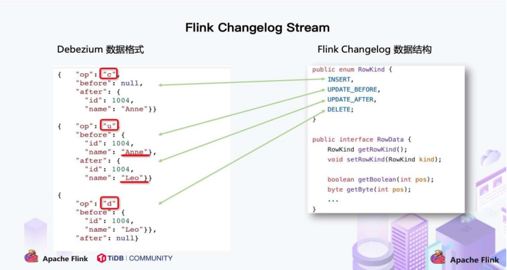 

在此基础上，官方调研了一些 CDC 技术，最终选择了 Debezium 作为 Flink CDC 的底层采集工具。Debezium 支持全量同步，也支持增量同步，也支持全量 + 增量的同步，非常灵活，同时基于日志的 CDC 技术使得提供 Exactly-Once 成为可能。

将 Flink SQL 的内部数据结构 RowData 和 Debezium 的数据结构进行对比，可发现两者是非常相似:

- 每条 RowData 都有一个元数据 RowKind，包括 4 种类型， 分别是插入 (INSERT)、更新前镜像 (UPDATE_BEFORE)、更新后镜像 (UPDATE_AFTER)、删除 (DELETE)，这四种类型和数据库里面的 binlog 概念保持一致。
- Debezium 的数据结构，也有一个类似的元数据 op 字段， op 字段的取值也有四种，分别是 c、u、d、r，各自对应 create、update、delete、read。对于代表更新操作的 u，其数据部分同时包含了前镜像 (before) 和后镜像 (after)。

通过对比两种数据结构，Flink 和 Debezium 两者的底层数据是可以非常方便地对接起来的， Flink 做 CDC 从技术上是非常合适的。

### 知识点05： 【了解】传统CDC ETL分析

我们来看下传统 CDC 的 ETL 分析链路，如下图所示：

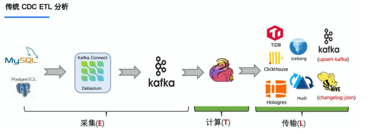 

传统的基于 CDC 的 ETL 分析中，数据采集工具是必须的，国外用户常用 **Debezium**，国内用户常用阿里开源的 **Canal**，采集工具负责采集数据库的增量数据，一些采集工具也支持全量数据同步。采集到的数据一般输出到消息中间件**如 Kafka**，然后 Flink 计算引擎再去消费数据并写入到目的端，目的端可以是各种数据库、数据仓库、数据湖和消息队列。

> 注意：Flink 提供了 changelog-json format，可以将 changelog 数据写入离线数仓（如 Hive）； 对于消息队列（如 Kafka），Flink 支持将 changelog 通过 upsert-kafka connector 直接写入 Kafka 的 compacted topic

官方一直在思考是否可以使用 **Flink CDC** 去替换上图中虚线框内的采集组件和消息队列，从而简化分析链路，降低维护成本。同时更少的组件也意味着数据时效性能够进一步提高。答案是可以的，于是就有了我们基于 Flink CDC 的 ETL 分析流程。

### 知识点06： 【理解】基于 Flink CDC 的 ETL 分析

在使用了 Flink CDC 之后，除了组件更少，维护更方便外，另一个优势是通过 Flink SQL 极大地降低了用户使用门槛，可以看下面的例子：

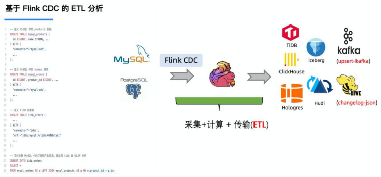 

该例子是通过 Flink CDC 去同步数据库数据并写入到 TiDB，用户直接使用 Flink SQL 创建了产品和订单的 MySQL-CDC 表，然后对数据流进行 JOIN 加工，加工后直接写入到下游数据库。通过一个 Flink SQL 作业就完成了 CDC 的数据分析、加工和同步。 

大家会发现这是一个纯 SQL 作业，这**意味着只要会 SQL 的业务线同学都可以完成此类工作**。与此同时，用户**也可以利用 Flink SQL 提供的丰富语法进行数据清洗、分析和聚合**。此外，利用 Flink SQL 双流 JOIN、维表 JOIN、UDTF 语法可以非常容易地完成数据打宽，以及各种业务逻辑加工。

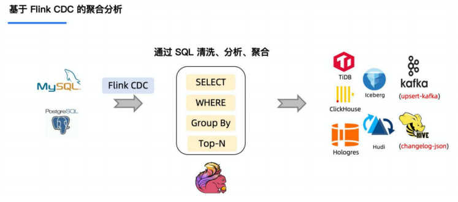 

而对于其他 CDC 工具（如 Debezium）来说，进行数据的清洗过滤都是非常困难的，更无法支持复杂的聚合和关联了。

### 知识点07： 【了解】Flink CDC项目发展历史

2020 年 7 月由云邪提交了第一个 commit，这是基于个人兴趣孵化的项目；

- 2020 年 7 中旬支持了 MySQL-CDC；
- 2020 年 7 月末支持了 Postgres-CDC；
- 2022年7月，该项目在 GitHub 上的 star 数已经超过2700个。

### 知识点08： 【理解】什么是Flink CDC

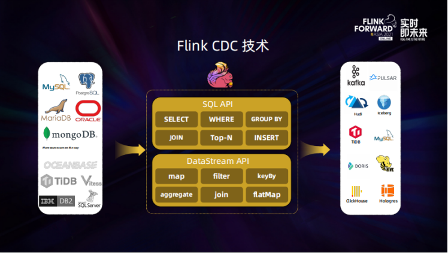

Flink CDC 基于数据库日志的 Change Data Caputre 技术，实现了全量和增量的一体化读取能力，并借助 Flink 优秀的管道能力和丰富的上下游生态，支持捕获多种数据库的变更，并将这些变更实时同步到下游存储。

目前，Flink CDC 的上游已经支持了 MySQL、MariaDB、PG、Oracle、MongoDB 等丰富的数据源，对 Oceanbase、TiDB、SQLServer 等数据库的支持也已经在社区的规划中。

Flink CDC 的下游则更加丰富，支持写入 Kafka、Pulsar 消息队列，也支持写入 Hudi、Iceberg 等数据湖，还支持写入各种数据仓库。

同时，通过 Flink SQL 原生支持的 Changelog 机制，可以让 CDC 数据的加工变得非常简单。用户可以通过 SQL 便能实现数据库全量和增量数据的清洗、打宽、聚合等操作，极大地降低了用户门槛。 此外， Flink DataStream API 支持用户编写代码实现自定义逻辑，给用户提供了深度定制业务的自由度。

### 知识点09： 【掌握】Flink CDC的功能特性

1. 支持数据库级别的快照，读取全量数据，2.0版本可以支持不加锁的方式读取
2. 支持 binlog，捕获增量数据
3. Exactly-Once
4. 支持 Flink DataStream API，不需要额外部署 Debezium 和 Kafka即可在一个 Flink 作业中完成变更数据的捕获和计算
5. 支持 Flink Table/SQL API，可使用 SQL DDL 来创建 CDC Source 表，并对表中的数据进行查询。

### 知识点10： 【掌握】Flink CDC技术的核心


Flink CDC 技术的核心是支持将表中的全量数据和增量数据做实时一致性的同步与加工，让用户可以方便地获每张表的实时一致性快照。比如一张表中有历史的全量业务数据，也有增量的业务数据在源源不断写入，更新。Flink CDC 会实时抓取增量的更新记录，实时提供与数据库中一致性的快照，如果是更新记录，会更新已有数据。如果是插入记录，则会追加到已有数据，整个过程中，Flink CDC 提供了一致性保障，即不重不丢。

### 知识点11： 【了解】**flink-cdc-connectors** **组件**

Flink社区开发了 flink-cdc-connectors 组件，这是一个可以直接从 MySQL、PostgreSQL 等数据库直接读取全量数据和增量变更数据的 source 组件，目前也已开源。

我们先从之前的数据架构来看CDC的内容

**支持的数据源 ：**

| **Connector**                                                | **Database**                                                 | **Driver**              |
| ------------------------------------------------------------ | ------------------------------------------------------------ | ----------------------- |
| [mongodb-cdc](https://ververica.github.io/flink-cdc-connectors/master/content/connectors/mongodb-cdc.html) | [MongoDB](https://www.mongodb.com/): 3.6, 4.x, 5.0           | MongoDB Driver: 4.3.1   |
| [mysql-cdc](https://ververica.github.io/flink-cdc-connectors/master/content/connectors/mysql-cdc.html) | [MySQL:](https://dev.mysql.com/doc) 5.6, 5.7, 8.0.x[RDS MySQL](https://www.aliyun.com/product/rds/mysql): 5.6, 5.7, 8.0.x[PolarDB MySQL](https://www.aliyun.com/product/polardb): 5.6, 5.7, 8.0.x[Aurora MySQL](https://aws.amazon.com/cn/rds/aurora): 5.6, 5.7, 8.0.x[MariaDB](https://mariadb.org/): 10.x[PolarDB X](https://github.com/ApsaraDB/galaxysql): 2.0.1 | JDBC Driver: 8.0.27     |
| [oceanbase-cdc](https://ververica.github.io/flink-cdc-connectors/master/content/connectors/oceanbase-cdc.html) | [OceanBase CE](https://open.oceanbase.com/): 3.1.x           | JDBC Driver: 5.7.4x     |
| [oracle-cdc](https://ververica.github.io/flink-cdc-connectors/master/content/connectors/oracle-cdc.html) | [Oracle](https://www.oracle.com/index.html): 11, 12, 19      | Oracle Driver: 19.3.0.0 |
| [postgresql-cdc](https://ververica.github.io/flink-cdc-connectors/master/content/connectors/postgres-cdc.html) | [PostgreSQL](https://www.postgresql.org/): 9.6, 10, 11, 12   | JDBC Driver: 42.2.12    |
| [sqlserver-cdc](https://ververica.github.io/flink-cdc-connectors/master/content/connectors/sqlserver-cdc.html) | [Sqlserver](https://www.microsoft.com/sql-server): 2012, 2014, 2016, 2017, 2019 | JDBC Driver: 7.2.2.jre8 |
| [tidb-cdc](https://ververica.github.io/flink-cdc-connectors/master/content/connectors/tidb-cdc.html) | [TiDB](https://www.pingcap.com/): 5.1.x, 5.2.x, 5.3.x, 5.4.x, 6.0.0 | JDBC Driver: 8.0.27     |

### 知识点12： 【了解】**与 Flink 版本的对应关系**

| **Flink CDC 版本** | **Flink 版本**  |
| ------------------ | --------------- |
| 1.0.0              | 1.11.*          |
| 1.1.0              | 1.11.*          |
| 1.2.0              | 1.12.*          |
| 1.3.0              | 1.12.*          |
| 1.4.0              | 1.13.*          |
| 2.0.*              | 1.13.*          |
| 2.1.*              | 1.13.*          |
| 2.2.*              | 1.13.* , 1.14.* |

## Flink CDC 源码编译

### 知识点13： 【实现】源码编译过程

#### **什么时候需要源码编译**

一般来说，源码编译是不需要的，用户可以直接在 Flink CDC 官网下载官方编译好的二进制包或者在 pom.xml 文件中添加相关依赖即可。

以下几种情况需要进行源码编译：

- 用户对 Flink CDC 源码进行了修改
- Flink CDC 某依赖项的版本与运行环境不一致
- 官方未提供最新版本 Flink CDC 二进制安装包

比如，官方最新的 Flink CDC 二进制安装包是2.2版本的，而源代码已经到2.3版本了，如果想要使用2.3版本的 Flink CDC， 那么就需要自行编译了。

下面将介绍 **Flink CDC 2.2** 版本的编译。

####  下载源码

+ 在Linux上是有yum安装Git，非常简单，只需要一行命令

**yum -y install git**

输出结果:

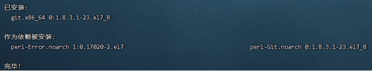 

+ 输入 git --version查看Git是否安装完成以及查看其版本号

**git --version**

输出结果:


+ 下载flink cdc源码

**$ git clone https://gitee.com/zoomake/flink-cdc-connectors-master.git**

输出结果:

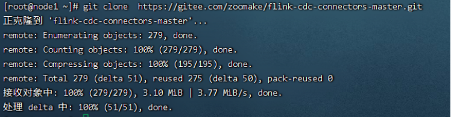 

#### 修改 pom.xml

在 pom.xml 中找到这一项：**flink.version**。修改 flink 版本号为：

<flink.version>1.14.5</flink.version>

#### 编译

```shell
cd /root/flink-cdc-connectors

mvn clean package -DskipTests
```

如果 maven 下载速度慢，可以在 pom.xml 文件加入这一段

```shell
<repositories>
        <repository>
            <id>tbds</id>
            <url>https://maven.aliyun.com/repository/public</url>
            <snapshots>
                <enabled>true</enabled>
                <updatePolicy>always</updatePolicy>
            </snapshots>
            <releases>
                <enabled>true</enabled>
                <updatePolicy>always</updatePolicy>
            </releases>
        </repository>
</repositories>
```

## Flink CDC练习案例

### 知识点14： 【实现】Flink CDC练习案例

+ Mysqld准备工作,在**node1**下开启binlog日志,操作步骤如下:

1）登录mysql之后使用下面的命令查看是否开启binlog,代码如下:

`show variables like '%log_bin%'；`

输出结果如图：

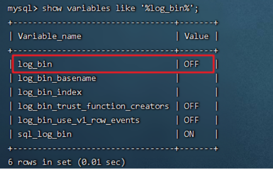

2) 编辑配置文件:

```shell
vi /etc/my.cnf
在[mysqld]下面假如如下代码:
server_id=1
log_bin = mysql-bin
binlog_format = ROW
expire_logs_days = 30
```

3) 重启mysql服务

```
systemctl restart mysqld
```

4) 进入mysql使用1)中的命令验证结果如图:

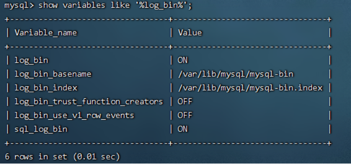 

5) 准备测试数据,执行如下代码:

```sql
Drop database if exists test;
Create database test character set utf8;
Use test;
--建表语句：
-- 建表
-- 学生表
CREATE TABLE `Student`(
      `s_id` VARCHAR(20),
      `s_name` VARCHAR(20) NOT NULL DEFAULT '',
      `s_birth` VARCHAR(20) NOT NULL DEFAULT '',
      `s_sex` VARCHAR(10) NOT NULL DEFAULT '',
      PRIMARY KEY(`s_id`)
);
-- 成绩表
CREATE TABLE `Score`(
    `s_id` VARCHAR(20),
    `c_id` VARCHAR(20),
    `s_score` INT(3),
    PRIMARY KEY(`s_id`,`c_id`)
);
-- 插入学生表测试数据
insert into Student values('01' , '赵雷' , '1990-01-01' , '男');
insert into Student values('02' , '钱电' , '1990-12-21' , '男');
insert into Student values('03' , '孙风' , '1990-05-20' , '男');
insert into Student values('04' , '李云' , '1990-08-06' , '男');
insert into Student values('05' , '周梅' , '1991-12-01' , '女');
insert into Student values('06' , '吴兰' , '1992-03-01' , '女');
insert into Student values('07' , '郑竹' , '1989-07-01' , '女');
insert into Student values('08' , '王菊' , '1990-01-20' , '女');
-- 成绩表测试数据
insert into Score values('01' , '01' , 80);
insert into Score values('01' , '02' , 90);
insert into Score values('01' , '03' , 99);
insert into Score values('02' , '01' , 70);
insert into Score values('02' , '02' , 60);
insert into Score values('02' , '03' , 80);
insert into Score values('03' , '01' , 80);
insert into Score values('03' , '02' , 80);
insert into Score values('03' , '03' , 80);
insert into Score values('04' , '01' , 50);
insert into Score values('04' , '02' , 30);
insert into Score values('04' , '03' , 20);
insert into Score values('05' , '01' , 76);
insert into Score values('05' , '02' , 87);
insert into Score values('06' , '01' , 31);
insert into Score values('06' , '03' , 34);
insert into Score values('07' , '02' , 89);
insert into Score values('07' , '03' , 98);
```

+ 向3台的Flink的lib目标下添加jar包(参见项目附近flink-lib的jar包目录)

1) 将涉及Flink CDC的相关jar包（**flink-sql-connector-mysql-cdc-2.2.1.jar**、commons-cli-1.4、flink-sql-parquet_2.12-1.14.5.jar）放到Flink的lib目录下，具体使用到jar包见下图: 

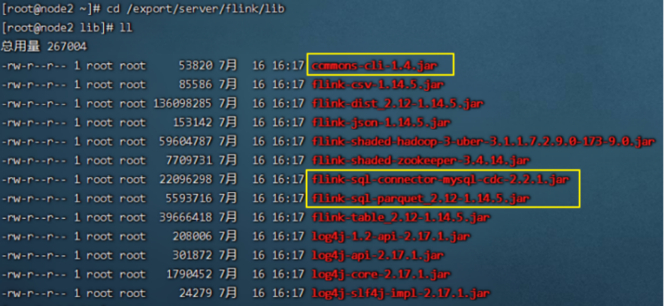 

2) 启动FlinkSQL-Client：进入目录cd /export/server/flink/   启动客户端bin/sql-client.sh

3) 设置表格模式（table mode），在内存中实体化结果，并将结果用规则的分页表格可视化展示出来。执行如下命令启用：

```sql
SET sql-client.execution.result-mode = tableau;
```

4) 在FlinkSQL-Client,执行创建表 mysql_cdc_to_test_Student,代码：

```sql
CREATE TABLE if not exists mysql_cdc_to_test_Student (
     s_id     STRING,
     s_name   STRING,
     s_birth  STRING,
     s_sex    STRING,
     PRIMARY KEY (`s_id`) NOT ENFORCED
) WITH (
    'connector'= 'mysql-cdc',
    'hostname'= '192.168.88.161',
    'port'= '3306',
    'username'= 'root',
    'password'='123456',
    'server-time-zone'= 'Asia/Shanghai',
    'debezium.snapshot.mode'='initial',
    'database-name'= 'test',
    'table-name'= 'Student'
);
```

5) 查询数据，实时同步mysql的对应表的数据：

```sql
select * from mysql_cdc_to_test_Student;
```

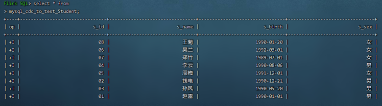 

6) 在mysql的test数据库对Student表的数据，分别增删改，会观察到FlinkSQL-Client数据的实时变动: 

Student表增加一行数据,在FlinkSQL-Client会看到迅速更新1条数据：

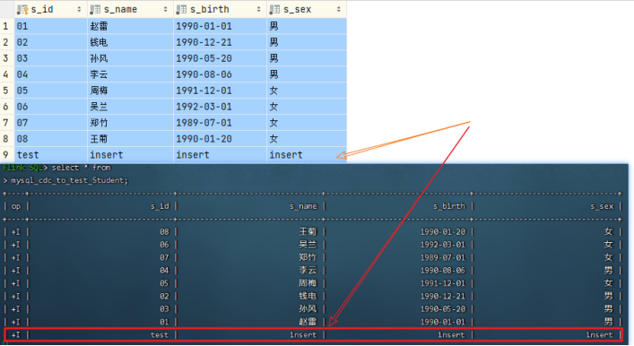 

Student表修改刚刚增加一行数据,在FlinkSQL-Client会看到迅速更新2条数据:

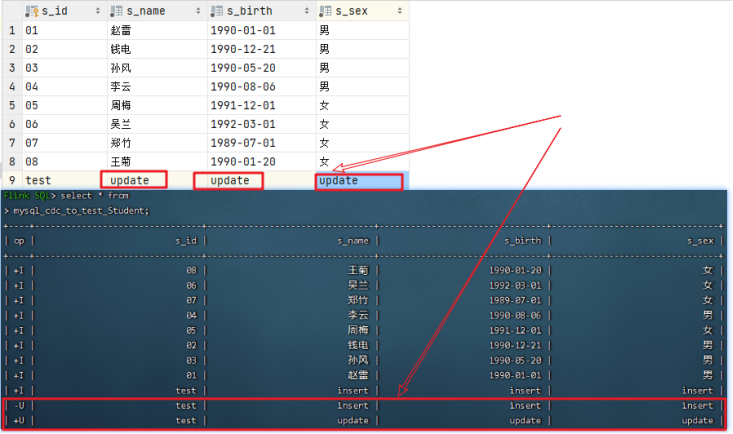 

Student表删除最后一行数据,在FlinkSQL-Client会看到迅速更新1条数据:

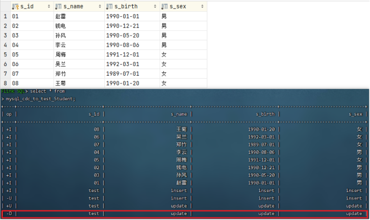 

7) 查询同时存在" 01 "课程和" 02 "课程的学生信息

先创建mysql_cdc_to_test_Score表如下：

```sql
CREATE TABLE if not exists mysql_cdc_to_test_Score (
   `s_id`   STRING,
   `c_id`   STRING,
   `s_score` INT,
   PRIMARY KEY (`s_id`) NOT ENFORCED
) WITH (
    'connector'= 'mysql-cdc',
    'hostname'= '192.168.88.161',
    'port'= '3306',
    'username'= 'root',
    'password'='123456',
    'server-time-zone'= 'Asia/Shanghai',
    'debezium.snapshot.mode'='initial',
    'database-name'= 'test',
    'table-name'= 'Score'
);
```

8) 计算结果（Flink SQL）:

```sql
SELECT s.*
FROM (
         SELECT *
         FROM mysql_cdc_to_test_Score
         WHERE c_id = '01'
     ) AS t1
         INNER JOIN (SELECT *
                     FROM mysql_cdc_to_test_Score
                     WHERE c_id = '02') AS t2
                    ON t1.s_id = t2.s_id
         INNER JOIN mysql_cdc_to_test_Student AS s
                    ON t1.s_id = s.s_id;

```

查询结果见图：

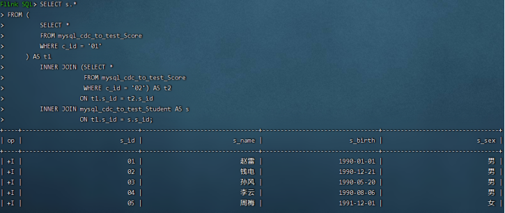

尝试自行修改Mysql test数据库中的Score表或Student表的数据，会在FlinkSQL-Client观察到查询结果的动态变化。

## **Flink CDC MySQL Connector 常用参数表**

### 知识点15： 【理解】Flink CDC MySQL Connector 常用参数表

| **参数名**                           | **必填** | **默认值** | **类型** | **参数描述**                                                 |
| ------------------------------------ | -------- | ---------- | -------- | ------------------------------------------------------------ |
| connector                            | 是       | 无         | String   | 指定connector，这里填 mysql-cdc                              |
| hostname                             | 是       | 无         | String   | MySql server 的主机名或者 IP 地址                            |
| username                             | 是       | 无         | String   | 连接 MySQL 数据库的用户名                                    |
| password                             | 是       | 无         | String   | 连接 MySQL 数据库的密码                                      |
| database-name                        | 是       | 无         | String   | 需要监控的数据库名,支持正则表达式                            |
| table-name                           | 是       | 无         | String   | 需要监控的表名,支持正则表达式                                |
| port                                 | 是       | 3306       | Integer  | MySQL 服务的端口号                                           |
| server-id                            | 否       | 无         | Integer  | 当开启scan.incremental.snapshot.enabled时，建议指定server-id;server-id 可以是单个值，如5400; 也可以提供数值范围，如5400-5408 |
| scan.incremental.snapshot.enabled    | 否       | true       | Boolean  | 增量快照是读取表快照的新机制；和旧的快照读相比有以下优点：1. 并行读取 2. 支持checkpoint 3. 不需要锁表；当需要并行读取时，server-id需要设置数值范围，如5400-5408 |
| scan.incremental.snapshot.chunk.size | 否       | 8096       | Integer  | 表快照的块大小                                               |
| scan.snapshot.fetch.size             | 否       | 1024       | Integer  | 每次读表接受的最大值                                         |
| scan.startup.mode                    | 否       | initial    | String   | MySQL CDC 启动模式，有效值：initial 和 latest-offset         |
| connect.timeout                      | 否       | 30s        | Duration | connector 连接 MySQL 服务的最长等待超时时间                  |
| connect.max-retries                  | 否       | 3          | Integer  | connector 创建 MySQL 连接的重试次数                          |
| connection.pool.size                 | 否       | 20         | Integer  | 连接池的大小                                                 |

## **Flink CDC MySQL Connector 启动模式**

Flink CDC MySQL Connector 可通过参数 scan.startup.mode 配置启动模式。启动模式有两种：initial 和 latest-offset

### 知识点16： 【理解】两种启动模式及各自使用场景

#### initial

initial: 在首次启动时，对数据库的表执行初始快照，快照数据读取完成后继续读取 binlog 数据。这个模式可以得到历史到现在的所有数据。initial 是默认的启动模式。

#### latest-offset

latest-offset: 首次启动时不执行快照，只读取 binlog 的最新数据。

#### 使用场景

如果需要读取全量的数据，包括历史数据和 binlog 数据则选用 initial 模式。
如果只需要最新的 binlog 数据，则选用 latest-offset。

## **Flink CDC 2.0 详解** 

### 知识点17： 【了解】Flink CDC**1.X** **痛点**

MySQL CDC 是 Flink CDC 中使用最多也是最重要的 Connector，本文下述章节描述 Flink CDC Connector 均为 MySQL CDC Connector。 

随着 Flink CDC 项目的发展，很快就有用户在生产环境落地了，但是同时也收到了很多用户的痛点和在社区的反馈，主要归纳为三个： 

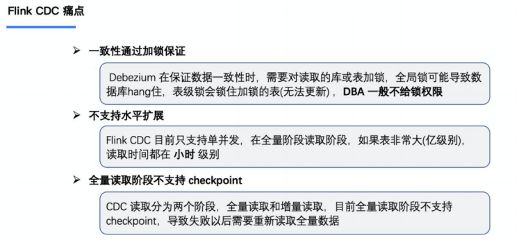

- 1) 全量 + 增量读取的过程需要保证所有数据的一致性，因此需要通过全局锁保证，但是加锁容易对在线业务造成影响，且 DBA 一般不给锁权限。 
- 2) 不支持水平扩展，因为 Flink CDC 底层是基于 Debezium，其架构是单节点，所以 Flink CDC 的数据源只支持单并发。在全量阶段读取阶段，如果表非常大 (亿级别)，读取时间在小时甚至天 级别，用户无法通过增加资源去提升作业速度。 
- 3) 全量读取阶段不支持 checkpoint：CDC 读取分为两个阶段，全量读取和增量读取，目前全量读取阶段是不支持 checkpoint 的，因此会存在一个问题：当我们同步全量数据时，假设需要 5 个小时，当我们同步了 4 小时的时候作业失败，这时候就需要重新开始，再读取 5 个小时。

### 知识点18： 【理解】Debezium锁分析

Flink CDC 底层封装了 Debezium， Debezium 同步一张表分为两个阶段：

1. 全量阶段：查询当前表中所有记录； 
2. 增量阶段：从 binlog 消费变更数据。

大部分用户使用的场景都是全量 + 增量同步，加锁是发生在全量阶段，目的是为了确定全量阶段的初始位点，保证增量 + 全量实现一条不多，一条不少，从而保证数据一致性。从下图中我们可以分析全局锁和表锁的一些加锁流程，左边红色线条是锁的生命周期，右边是 MySQL 开启可重复读事务的生命周期。

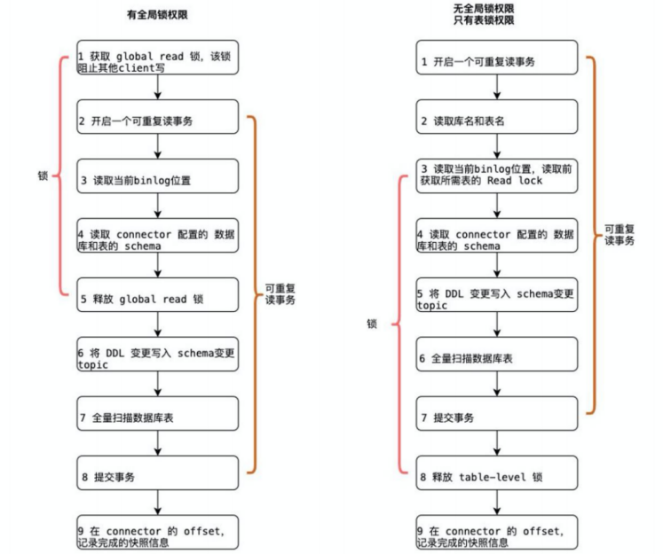 

以全局锁为例，首先是获取一个锁，然后再去开启可重复读的事务。这里加锁范围是读取binlog 的当前位点和当前表的 schema。这样做的目的是保证 binlog 的起始位置和读取到的当前chema 是可以对应上的，因为表的 schema 是会改变的，比如删除列或者增加列。在读取这两个信息后，SnapshotReader 会在可重复读事务里读取全量数据，在全量数据读取完成后，会启动binlogReader从读取的 binlog 起始位置开始增量读取，从而保证全量数据 + 增量数据的无缝衔接。

表锁是全局锁的退化版，因为全局锁的权限会比较高，因此在某些场景，用户可能没有全局锁的权限，但是有表锁的权限。不过表锁的加锁时间会更长，因为表锁有个特征：锁提前释放了可重复读的事务默认会提交，所以锁需要等到全量数据读完后才能释放。 

经过上面分析，接下来看看这些锁到底会造成怎样严重的后果： 

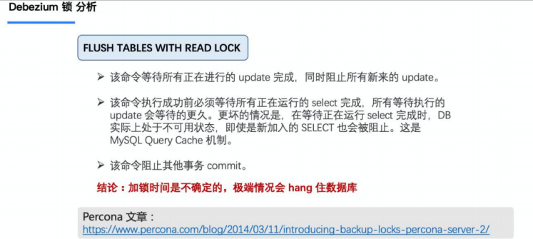 

Flink CDC 1.x 可以不加锁，能够满足大部分场景，但牺牲了一定的数据准确性。Flink CDC 1.x 默认加全局锁，虽然能保证数据一致性，但存在上述数据库无响应(hang住)故障的风险。

随着 Flink CDC 项目的发展，得到了很多用户在社区的反馈，主要归纳为三个:

1. 全量 + 增量读取的过程需要保证所有数据的一致性，因此需要通过加锁保证，但是加锁在数据库层面上是一个十分高危的操作。底层 Debezium 在保证数据一致性时，需要对读取的库或表加锁，全局锁可能导致数据库锁住，表级锁会锁住表的读，DBA 一般不给锁权限。
2. 不支持水平扩展，因为 Flink CDC 1.0 底层是基于 Debezium，架构是单节点，所以Flink CDC 1.0只支持单并发。在全量阶段读取阶段，如果表非常大 (亿级别)，读取时间在小时甚至天级别，用户不能通过增加资源去提升作业速度。
3. 全量读取阶段不支持 checkpoint：CDC 读取分为两个阶段，全量读取和增量读取，目前全量读取阶段是不支持 checkpoint 的，因此会存在一个问题：当我们同步全量数据时，假设需要 5 个小时，当我们同步了 4 小时的时候作业失败，这时候就需要重新开始，再读取 5 个小时。

### 知识点19： 【理解】Flink CDC 2.X 设计目标 (以 MySQL 为例)

通过上面的分析，可以知道 2.0 的设计方案核心要解决上述的三个问题，即支持无锁读取、水平扩展、checkpoint。

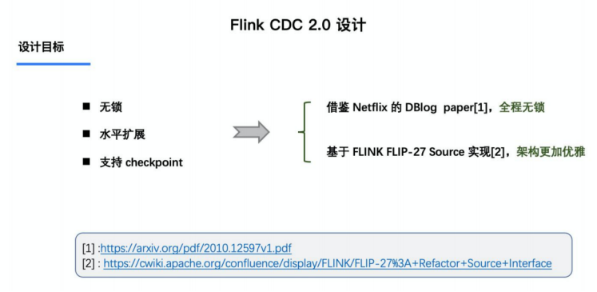 

借鉴了 Netflix 的 DBlog 这篇论文的设计思想，其中描述的无锁算法如下图所示： 

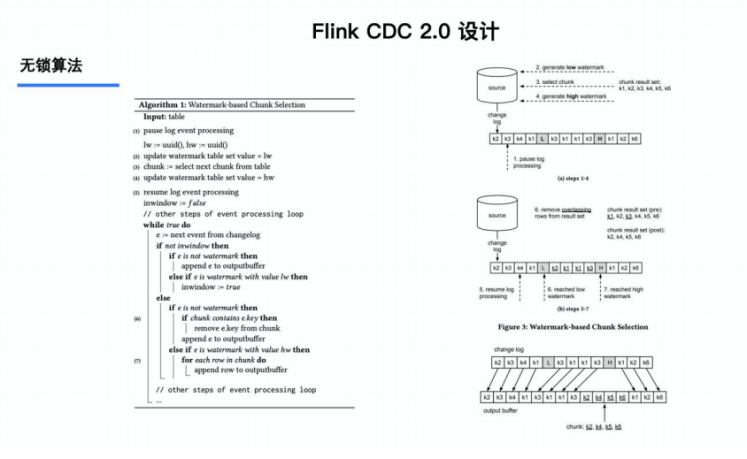 

- 左边是 Chunk 的切分算法描述，Chunk 的切分算法其实和很多数据库的分库分表原理类似，通过表的主键对表中的数据进行分片。假设每个 Chunk 的步长为 10，按照这个规则进行切分，只需要把这些 Chunk 的区间做成左开右闭或者左闭右开的区间，保证衔接后的区间能够等于表的主键区间即可。 
- 右边是每个 Chunk 的无锁读算法描述，该算法的核心思想是在划分了 Chunk 后，对于每个 Chunk 的全量读取和增量读取，在不用锁的条件下完成一致性的合并。

### 知识点20： 【理解】Flink CDC 2.X 设计实现

#### 整体概览

在对于**有主键的表**做初始化模式，整体的流程主要分为 5 个阶段：

1. Chunk 切分；
2. Chunk 分配； （**实现并行读取数据&CheckPoint**）
3. Chunk 读取； （**实现无锁读取**）
4. Chunk 汇报；
5. Chunk 分配。

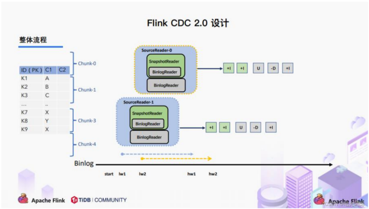

#### Chunk 切分

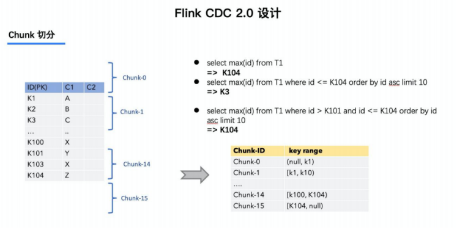

因为每个 chunk 只负责自己主键范围内的数据，不难推导，只要能够保证每个 Chunk 读取的一致性，就能保证整张表读取的一致性，这便是无锁算法的基本原理。 

Netflix 的 DBLog 论文中 Chunk 读取算法是通过在数据库中维护一张信号表，再通过信号表在binlog 文件中打点，记录每个 chunk 读取前的 Low Position (低位点) 和读取结束之后 High Position (高位点) ，在低位点和高位点之间去查询该 Chunk 的全量数据。在读取出这一部分 Chunk的数据之后，再将这 2 个位点之间的 binlog 增量数据合并到 chunk 所属的全量数据，从而得到高位点时刻，该 chunk 对应的全量数据。 

#### Chunk 读取

Flink CDC 结合自身的情况，在 Chunk 读取算法上做了去信号表的改进，不需要侵入业务去额外维护信号表，直接通过读取 binlog 位点替代在 binlog 中做标记的功能，整体的 chunk 读算法描述如下图所示：

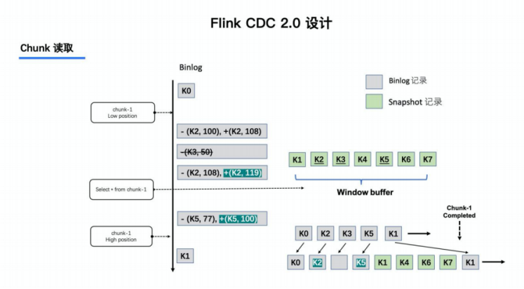

比如正在读取 Chunk-1，Chunk 的区间是 [K1, K10]，首先直接将该区间内的数据select出来并把它存在 buffer 中，在 select 之前记录 binlog 的当前位点 (低位点)，select 完成后再次记录binlog 的当前位点 (高位点)。然后开始消费从低位点到高位点的 binlog，并合并到 buffer 中。

1. 图中的 -(k2,100) 和 +(k2,108) 记录表示这条数据的值从 100 更新到 108； 
2. 第二条记录是删除 k3； 
3. 第三条记录是更新 k2 为 119； 
4. 第四条记录是 k5 的数据由原来的 77 变更为 100。 
5. 观察图片中右下角最终的输出，会发现在消费该 chunk 的 binlog 时，出现的 key 是 k2、k3、k5，我们前往 buffer 将这些 key 做标记。 
6. 对于 k1、k4、k6、k7 来说，在高位点读取完毕之后，这些记录没有变化过，所以这些数据是可以直接输出的； 
7. 对于改变过的数据，则需要将增量的数据合并到全量的数据中，只保留合并后的最终数据。例如， k2 最终的结果是 119 ，那么只需要输出 +(k2,119)，而不需要中间发生过改变的数据。

通过这种方式，Chunk 最终的输出就是该 chunk 区间在高位点对应的一致性快照数据。 

上图描述的是单个 Chunk 的一致性读，但是如果有多个表分了很多不同的 Chunk，且这些 

Chunk 分发到了不同的 task 中，那么如何分发 Chunk 并保证全局一致性读呢？ 

这个就是基于 FLIP-27 来优雅地实现的，通过下图可以看到有 SourceEnumerator 的组件，这个组件主要用于 Chunk 的划分，划分好的 Chunk 会提供给下游的 SourceReader 去读取，通过把chunk 分发给不同的 SourceReader 便实现了并发读取 Snapshot Chunk 的过程，同时基于 FLIP-27 我们能较为方便地做到 chunk 粒度的 checkpoint。 

**总结**：读取可以分为 5 个阶段：

- 1) SourceReader 读取表数据之前先记录当前的 Binlog 位置信息记为低位点；
- 2) SourceReader 将自身区间内的数据查询出来并放置在 buffer 中；
- 3) 查询完成之后记录当前的 Binlog 位置信息记为高位点；
- 4) 在增量部分消费从低位点到高位点的 Binlog；
- 5) 根据主键，对 buffer 中的数据进行修正并输出。

通过以上5个阶段可以保证每个Chunk最终的输出就是在高位点时该Chunk中最新的数据，但是目前只是做到了保证单个 Chunk 中的数据一致性。

#### Chunk分配

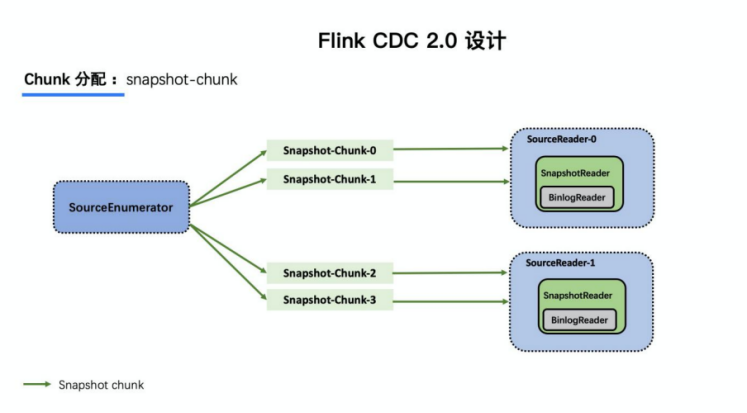

当 Snapshot Chunk 读取完成之后，需要有一个汇报的流程，如下图中橘色的汇报信息，将 

Snapshot Chunk 完成信息汇报给 SourceEnumerator。

#### Chunk汇报

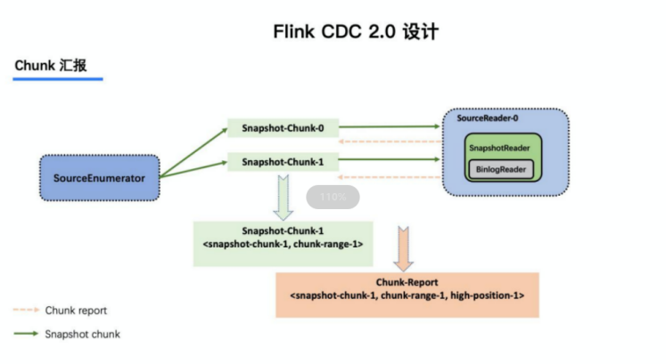

汇报的主要目的是为了后续分发 binlog chunk (如下图)。因为 Flink CDC 支持全量 + 增量同步， 所以当所有 Snapshot Chunk 读取完成之后，还需要消费增量的 binlog，这是通过下发一个binlog chunk 给任意一个 Source Reader 进行单并发读取实现的。

#### Chunk分配

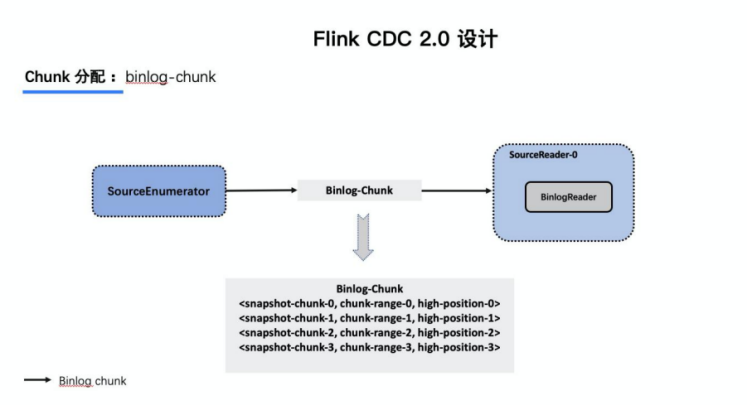

对于大部分用户来讲，其实无需过于关注如何无锁算法和分片的细节，了解整体的流程就好。

整体流程可以概括为，首先通过主键对表进行 Snapshot Chunk 划分，再将 Snapshot Chunk 分发给多个 SourceReader，每个 Snapshot Chunk 读取时通过算法实现无锁条件下的一致性读， SourceReader 读取时支持 chunk 粒度的 checkpoint，在所有 Snapshot Chunk 读取完成后， 下发一个 binlog chunk 进行增量部分的 binlog 读取，这便是 Flink CDC 2.0 的整体流程，如下图所示： 

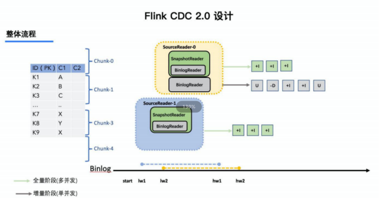

Flink CDC 是一个完全开源的项目，项目所有设计和源码目前都已贡献到开源社区，Flink CDC 2.0 也已经正式发布，此次的核心改进和提升包括： 

MySQL CDC 2.0，核心 feature 包括:

- 并发读取，全量数据的读取性能可以水平扩展； 
- 全程无锁，不对线上业务产生锁的风险； 
- 断点续传，支持全量阶段的 checkpoint。 

搭建文档网站，文档支持多版本查看，支持关键词搜索。 

## 官方测试效果

用 TPC-DS 数据集中的 customer 表进行了测试，Flink 版本是 1.13.1，customer 表的数据量是 6500 万条，Source 并发为 8，全量读取阶段：Flink CDC 2.0 用时 13 分钟；Flink CDC 1.4 用时 89 分钟；读取性能提升 6.8 倍。

## 附录

1. Flink-CDC 项目地址： https://github.com/ververica/flink-cdc-connectors 
2. Flink-CDC 文档网站： https://ververica.github.io/flink-cdc-connectors/master/ 
3. Percona - MySQL 全局锁时间分析：https://www.percona.com/blog/2014/03/11/introducing-backup-locks-percona-server-2/ 
4. DBLog - 无锁算法论文： https://arxiv.org/pdf/2010.12597v1.pdf 
5. Flink FLIP-27 设计文档： https://cwiki.apache.org/confluence/display/FLINK/FLIP-27%3A+Refactor+Source+Interface

## 常见面试题

**1、Flink Dynamic Table & ChangeLog Stream了解吗？**

Dynamic Table 就是 Flink SQL 定义的动态表，动态表和流的概念是对等的。流可以转换成动态表，动态表也可以转换成流。

在 Flink SQL中，数据在从一个算子流向另外一个算子时都是以 Changelog Stream 的形式，任意时刻的 Changelog Stream 可以翻译为一个表，也可以翻译为一个流。

**2、mysql 表与binlog的关系是什么？**

MySQL 数据库的一张表所有的变更都记录在 binlog 日志中，如果一直对表进行更新，binlog 日志流也一直会追加，数据库中的表就相当于 binlog 日志流在某个时刻点物化的结果；日志流就是将表的变更数据持续捕获的结果。

这说明 Flink SQL 的 Dynamic Table 是可以非常自然地表示一张不断变化的 MySQL 数据库表。

**3、flink cdc 底层的采集工具是哪个？**

选择 Debezium 作为 Flink CDC 的底层采集工具，原因是 debezium 支持全量同步，也支持增量同步，同时也支持全量 + 增量的同步，非常灵活，同时基于日志的 CDC 技术使得提供 Exactly-Once 成为可能。

**4、flink sql 与 debezium 的数据结构有哪些相似性？**

通过对 Flink SQL 的内部数据结构 RowData 和 Debezium 的数据结构进行对比，可以发现两者非常相似。

- 每条 RowData 都有一个元数据 RowKind，包括 4 种类型， 分别是插入 (INSERT)、更新前镜像 (UPDATE_BEFORE)、更新后镜像 (UPDATE_AFTER)、删除 (DELETE)，这四种类型和数据库里面的 binlog 概念保持一致。
- Debezium 的数据结构，也有一个类似的元数据 op 字段， op 字段的取值也有四种，分别是 c、u、d、r，各自对应 create、update、delete、read。对于代表更新操作的 u，其数据部分同时包含了前镜像 (before) 和后镜像 (after)。

两者相似性很高，所以采用 debezium 作为底层采集工具。

**5、flink cdc 1.x 有哪些痛点？**

1. 一致性加锁的痛点

   由于 flink cdc 底层选用 debezium 作为采集工具，在 flink cdc 1.x 全量 + 增量读取的版本设计中，Debezium 为保证数据一致性，通过对读取的数据库或者表进行加锁，但是 加锁 在数据库层面上是一个十分高危的操作。全局锁可能导致数据库锁住，表级锁会锁住表的读，DBA 一般不给锁权限。

2. 不支持水平扩展的痛点

   因为 Flink CDC 底层是基于 Debezium，Debezium 架构是单节点，所以 Flink CDC 1.x 只支持单并发。

   在全量读取阶段，如果表非常大 (亿级别)，读取时间在小时甚至天级别，用户不能通过增加资源去提升作业速度。

3. 全量读取阶段不支持 checkpoint

   Flink CDC 读取分为两个阶段，全量读取和增量读取，目前全量读取阶段是不支持 checkpoint 的;

   因此会存在一个问题：当我们同步全量数据时，假设需要 5 个小时，当我们同步了 4 小时的时候作业失败，这时候就需要重新开始，再读取 5 个小时。


**6、flink cdc 1.x 的加锁发生在哪个阶段？**

加锁是发生在全量阶段。

Flink CDC 底层使用 Debezium 同步一张表时分为两个阶段：

+ 全量阶段：查询当前表中所有记录；
+ 增量阶段：从 binlog 消费变更数据。

大部分用户使用的场景都是全量 + 增量同步，加锁是发生在全量阶段，目的是为了确定全量阶段的初始位点，保证增量 + 全量实现一条不多，一条不少，从而保证数据一致性。

**7、Netflix 的 DBLog paper 核心设计描述一下?**

在 Netflix 的 DBLog 论文中，

Chunk 读取算法是通过在 DB 维护一张信号表，再通过信号表在 binlog 文件中打点，记录每个 chunk 读取前的 Low Position (低位点) 和读取结束之后 High Position (高位点) ，在低位点和高位点之间去查询该 Chunk 的全量数据。在读取出这一部分 Chunk 的数据之后，再将这 2 个位点之间的 binlog 增量数据合并到 chunk 所属的全量数据，从而得到高位点时刻该 chunk 对应的全量数据。

**8、Flink cdc 2.x是如何设计的无锁算法？**

Flink CDC 2.x 结合自身的情况，在 Chunk 读取算法上做了去信号表的改进，不需要额外维护信号表，通过直接读取 binlog 位点替代在 binlog 中做标记的功能，整体的 chunk 读算法描述如下图所示：

单个 Chunk 的一致性读:

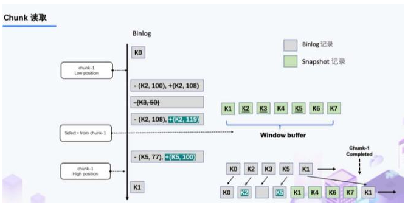

1. 记录当前 binlog 位置为 LOWoffset
2. 通过执行语句读取并缓存快照 chunk 记录 SELECT * FROM MyTable WHERE id > chunk_low AND id <= chunk_high
3. 记录当前 binlog 位置作为 HIGH 偏移量
4. 从 LOWoffset 到 HIGHoffset 读取属于 snapshot chunk 的 binlog 记录
5. 将读取到的 binlog 记录 Upsert 到缓冲的 chunk 记录中，将 buffer 中的所有记录作为 snapshot chunk 的最终输出（都作为 INSERT 记录）发出。
6. HIGH 在 single binlog reader 中继续读取并发出属于 offset 之后的 chunk 的binlog 记录。