博学谷大数据平台\_Hudi
======================

课程目标
--------

-   了解常见的数据湖框架、hudi的发展背景、hudi的基本介绍

-   熟悉hudi的简单使用

-   了解hudi的数据管理

-   理解hudi的核心概念

数据湖简介
----------

### 知识点01：【了解】什么是数据湖

#### 数据仓库

-   数据仓库（英语：DataWarehouse，简称数仓、DW），**是一个用于存储、分析、报告的数据系统**。

-   数据仓库的目的是构建面向分析的集成化数据环境，分析结果为企业提供决策支持（Decision
    Support）。

-   数据仓库的特点是本身不产生数据，也不最终消费数据。

-   每个企业根据自己的业务需求可以分成不同的层次。但是最基础的分层思想，理论上分为三个层：操作型数据层（ODS）、数据仓库层（DW）和数据应用层（DA）。

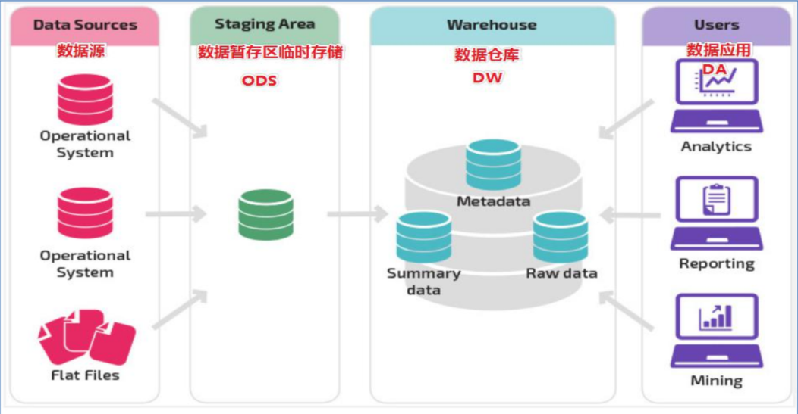

#### 数据湖

-   数据湖（Data Lake）和数据库、数据仓库一样，都是数据存储的设计模式，现在企业的数据仓库都会通过**分层的方式**将数据存储在文件夹、文件中。

-   数据湖是一个**集中式**数据存储库，用来存储**大量的原始数据**，使用**平面架构**来存储数据。

-   定义：一个以原始格式（通常是对象块或文件）存储数据的系统或存储库，通常是所有企业数据的单一存储。

-   数据湖可以包括来自关系数据库的结构化数据（行和列）、半结构化数据（CSV、日志、XML、JSON）、非结构化数据（电子邮件、文档、pdf）和二进制数据（图像、音频、视频）。


-   数据湖越来越多的用于描述任何的大型数据池，数据都是以原始数据方式存储，知道需要查询应用数据的时候才会开始分析数据需求和应用架构。

-   数据湖中数据，用于报告、可视化、高级分析和机器学习等任务。

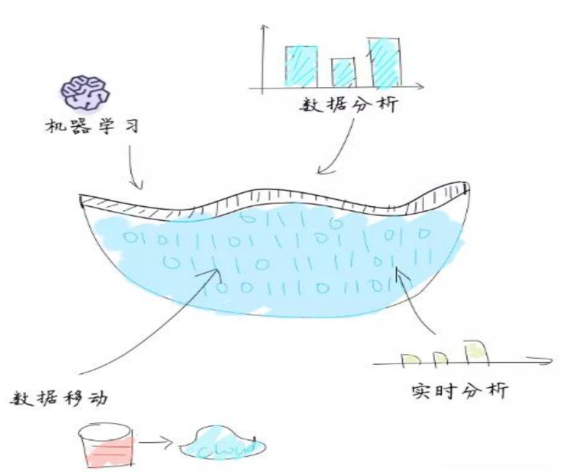

#### 数据仓库 VS 数据湖

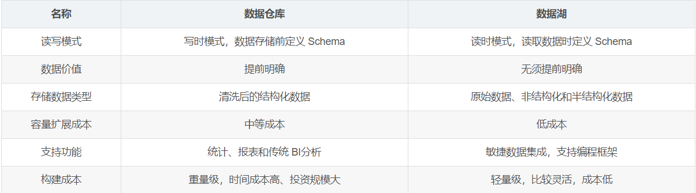

数据仓库与数据湖主要的区别在于如下两点：

-   存储数据类型

数据仓库是存储数据，进行建模，存储的是结构化数据；数据湖以其本源格式保存大量原始数据，包括结构化的、半结构化的和非结构化的数据，主要是由原始的、混乱的、非结构化的数据组成。在需要数据之前，没有定义数据结构和需求。

-   数据处理模式

在我们可以加载到数据仓库中的数据，我们首先需要定义好它，这叫做写时模式（Schema-On-Write）。而对于数据湖，您只需加载原始数据，然后，当您准备使用数据时，就给它一个定义，这叫做读时模式（Schema-On-Read）。这是两种截然不同的数据处理方法。因为数据湖是在数据使用时再定义模型结构，因此提高了数据模型定义的灵活性，可满足更多不同上层业务的高效率分析诉求。

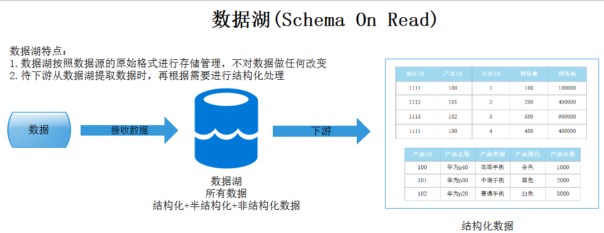

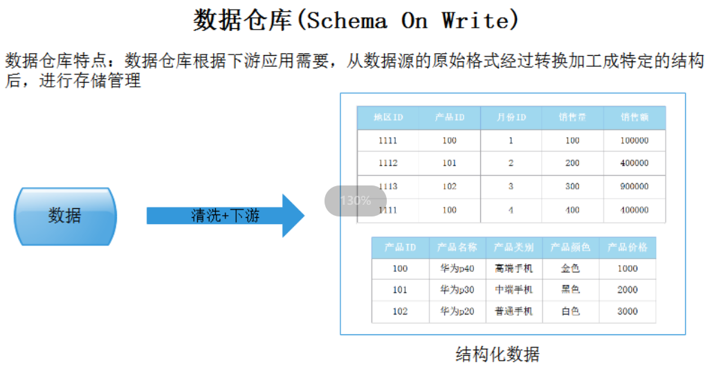

> **数据湖并不能替代数据仓库**，数据仓库在高效的报表和可视化分析中仍有优势


#### 湖仓一体（LakeHouse）

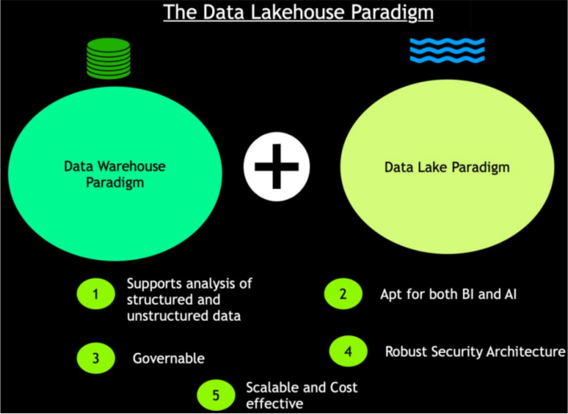

-   湖仓一体（LakeHouse）：是新出现的一种数据架构，它同时吸收了数据仓库和数据湖的优势，数据分析师和数据科学家可以在同一个数据存储中对数据进行操作，同时它也能为公司进行数据治理带来更多的便利性。

-   LakeHouse使用新的系统设计：直接在用于数据湖的**低成本存储上**实现与数据仓库中类似的**数据结构和数据管理功能**。

-   湖仓一体（LakeHouse）：是一种结合数据湖和数据仓库优势的新范式，从根本上简化企业数据基础架构，并且有望在机器学习已渗透到每个行业的时代加速创新。

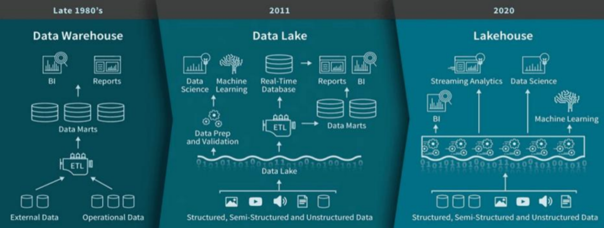

#### 小结

-   数据湖技术本质上：实现全量数据单一存储的高级架构，可以存储任意规模、任意类型、需求各种速度的数据。无需任何预处理，消除数据采集和存储的复杂性，加速应用数据。

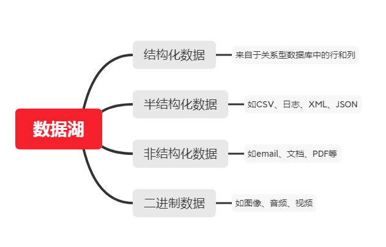

### 知识点02：【了解】数据湖框架

目前市面上流行的三大开源数据湖方案分别为：Delta Lake、Apache Iceberg和Apache
Hudi。

| Delta Lake     | DataBricks公司推出的一种数据湖方案                                    | <https://delta.io/>           |
|----------------|-----------------------------------------------------------------------|-------------------------------|
| Apache Iceberg | **以类似于SQL的形式高性能的处理大型的开放式表**                       | <https://iceberg.apache.org/> |
| Apache Hudi    | **Hadoop Upserts and Incrementals，管理大型分析数据集在HDFS上的存储** | <https://hudi.apache.org/>    |

#### Delta Lake

-   流批一体的Data Lake存储层，支持 **update/delete/merge**。

-   由于出自Databricks，Spark的所有数据写入方式，包括基于dataframe的批式、流式，以及SQL的Insert、Insert
    Overwrite等都是支持的（开源的SQL写暂不支持，EMR做了支持）。

-   在数据写入方面，Delta与Spark是强绑定的，在查询方面，开源Delta目前支持Spark、Presto、Flink。但是，Spark是不可或缺的，因为delta
    log的处理需要用到Spark。这意味着如果要用其他引擎查询Delta，查询时还要跑一个Spark作业。

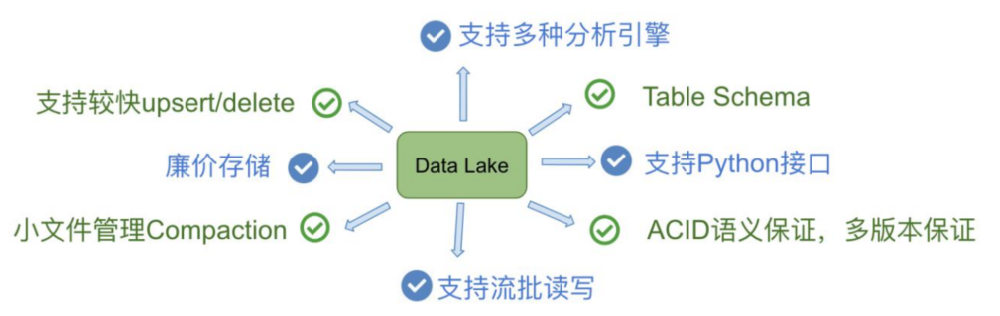

#### Apache Iceberg

-   由Netflix开发开源的，其于2018年11月16日进入Apache孵化器，是Netflix公司数据仓库基础。

-   用于**跟踪超大规模表的新格式**，是专门为对象存储（如S3）而设计的。

-   一种可伸缩的表存储格式，允许在一个文件里面修改或者过滤数据，多个文件也支持，内置了许多最佳实践。

-   在查询方面，Iceberg支持Spark、Presto提供了建表的API，用户可以使用该API指定表名、
    schema、partition信息等，然后在Hive catalog中完成建表。

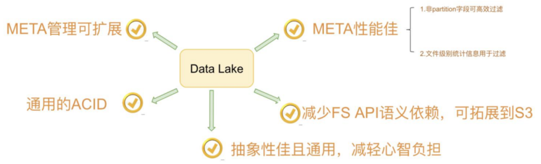

#### Apache Hudi

-   Apache Hudi：提供的fast upsert/delete以及compaction等功能，管理存储在HDFS上数据，设计目标正如其名，Hadoop Upserts Deletes and Incrementals（原为Hadoop Upserts anD Incrementals）。

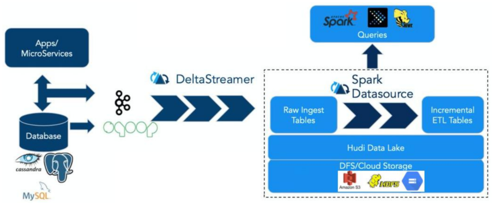

-   强调其主要支持Upserts、Deletes和Incrementa数据处理。


#### 三种框架的对比

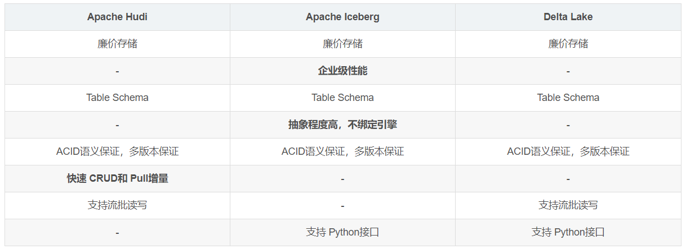

### 知识点03：【掌握】Apache Hudi 基本介绍

#### Hudi 是什么

Hudi（Hadoop Upserts Deletes and Incrementals缩写）：**用于管理分布式文件系统DFS上大型分析数据集存储**。一言以蔽之，Hudi是一种针**对分析型业务的、扫描优化的数据存储抽象**，它能够使DFS数据集在分钟级的时延内支持变更，也支持下游系统对这个数据集的增量处理。

#### Hudi 功能

-   Hudi是在大数据存储上的一个数据集，**可以将Change Logs通过upsert的方式合并进Hudi**；

-   Hudi对上可以暴露成一个**普通Hive**或**Spark表**，通过API或命令行可以获取到增量修改的信息，继续供下游消费；

-   Hudi保管**修改历史，可以做时间旅行或回退**；

-   Hudi内部有**主键到文件级的索引**，默认是**记录到文件的布隆过滤器**；

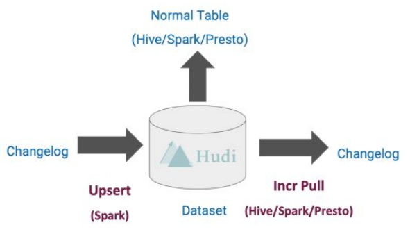

#### Hudi 特性

Apache Hudi使得用户能在Hadoop兼容的存储之上存储大量数据，同时它还提供两种原语，不仅可以**批处理**，还可以在数据湖上进行**流处理**。

-   Update/Delete记录：Hudi使用细粒度的文件/记录级别索引来支持Update/Delete记录，同时还提供写操作的事务保证。查询会处理最后一个提交的快照，并基于此输出结果。

-   变更流：Hudi对获取数据变更提供了一流的支持，可以从给定的时间点获取给定表中已updated/inserted/deleted的所有记录的增量流，并解锁新的查询类别。

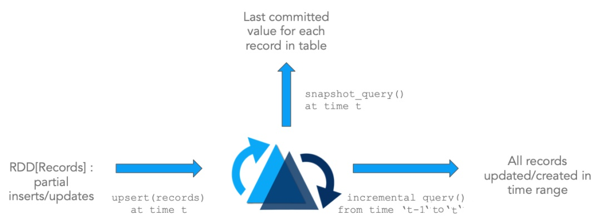

#### Hudi 基础架构

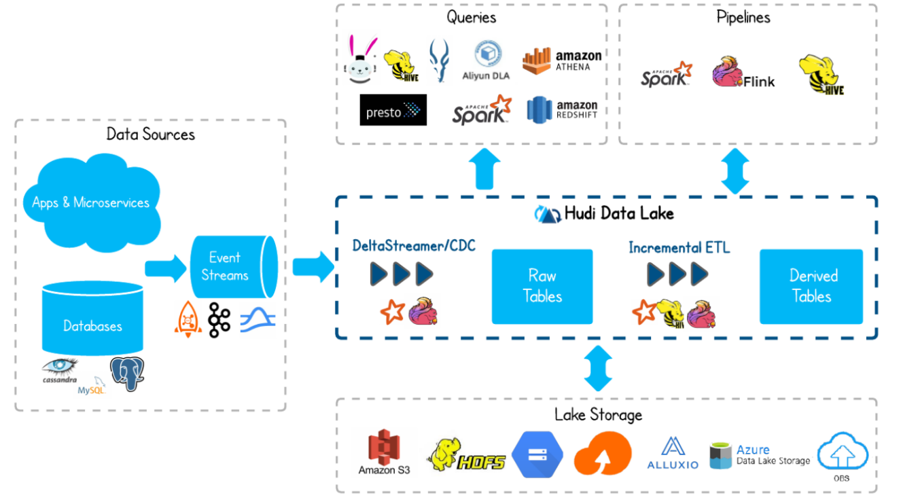

-   通过DeltaStreammer、Flink、Spark等工具，将数据摄取到数据湖存储，可使用HDFS作为数据湖的数据存储；

-   基于HDFS可以构建Hudi的数据湖；

-   Hudi提供统一的访问Spark数据源和Flink数据源；

-   外部通过不同引擎， 如：Spark、Flink、Presto、Hive、Impala、Aliyun DLA、AWS Redshit访问接口；

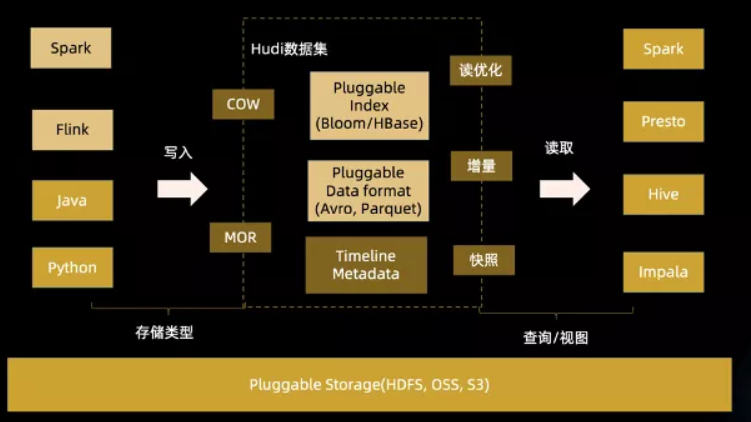

#### Hudi 的应用

国内很多大公司，都在使用Hudi，构建数据湖，并且与大数据仓库整合，搭建湖仓一体化平台。


阿里云基于Hudi构建Lakehouse实践，B站分享链接：

<https://www.bilibili.com/video/BV19M4y1V7S6>

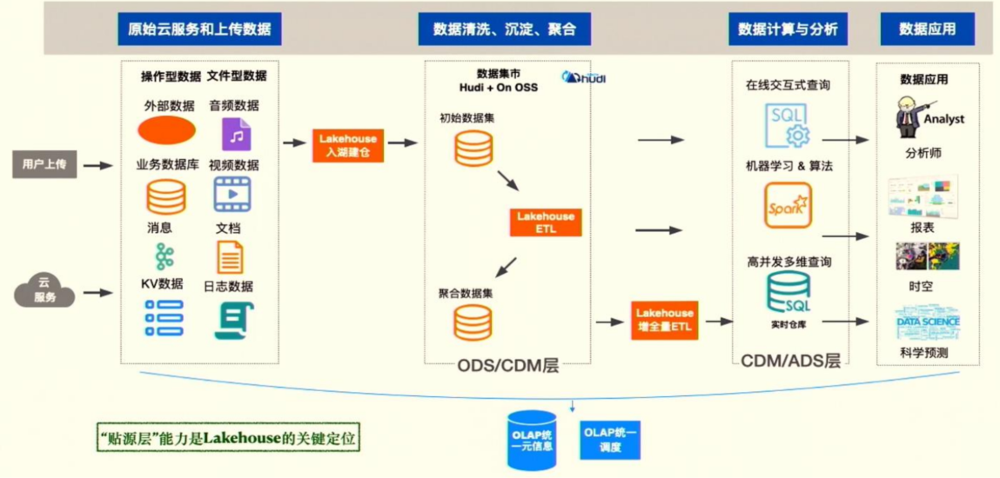

### 知识点04：【了解】Apache Hudi 快速发展

#### Hudi 诞生

-   Apache Hudi由Uber开发并开源，该项目在2016年开始开发，并于2017年开源，2019年1月进入
    Apache 孵化器，且2020年6月成为Apache顶级项目，目前最新版本：**0.12.0**版本。

-   Hudi一开始支持Spark进行数据摄入（**批量Batch和流式Streaming**），从0.7.0版本开始，逐渐与Flink整合，主要在于Flink SQL整合，还支持Flink SQL CDC。

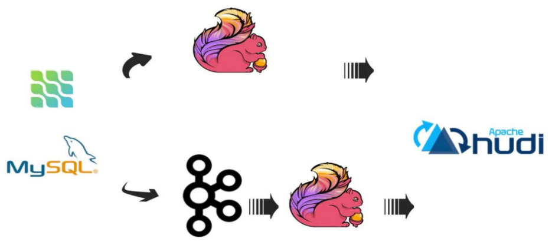

#### Hudi 发展历史

-   2015年：发表了增量处理的核心思想/原则（O'reilly文章）

-   2016年：由Uber创建并为所有数据库/关键业务提供支持

-   2017年：由Uber开源，并支撑100PB数据湖

-   2018年：吸引大量使用者，并因云计算普及

-   2019年：成为ASF孵化项目，并增加更多平台组件

-   2020年：毕业成为Apache顶级项目，社区、下载量、采用率增长超过10倍

-   2021年：支持Uber 500PB 数据湖，SQL DML、Flink集成、索引、元服务器、缓存

-   2022年：引入多模式索引，异步索引器，DataHub元同步，Flink集成改进等。

#### 新架构：湖仓一体

-   Hudi对于Flink友好支持以后，可以使用Flink + Hudi构建**实时湖仓一体**架构，数据的时效性可以到分钟级，能很好的满足业务准实时数仓的需求。

-   通过湖仓一体、流批一体，准实时场景下做到了：**数据同源、同计算引擎、同存储、同计算口径**。

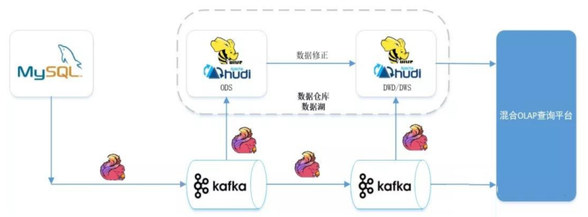

Hudi 快速体验使用
-----------------

### 知识点05：【实现】Hudi的编译

#### Maven 的安装

**下载maven包**

- 地址：<https://archive.apache.org/dist/maven/maven-3/3.8.5/binaries/>

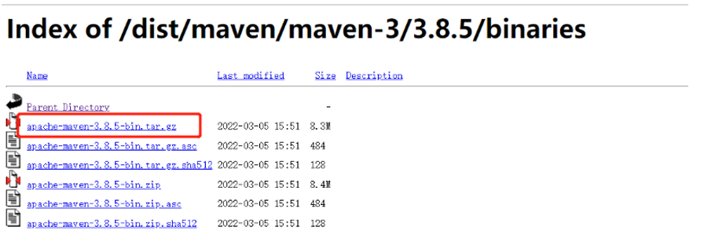

- 下载完成后，上传到 /export/server下（第一台虚拟机），解压到当前目录下： 

```shell
tar zxvf ./apache-maven-3.8.5-bin.tar.gz
```


**添加maven环境变量**

```shell
vim  /etc/profile
添加如下内容：
MAVEN_HOME=/export/server/apache-maven-3.8.5
export MAVEN_HOME
export PATH=${PATH}:${MAVEN_HOME}/bin
保存退出。
刷新环境变量：source /etc/profile
查看maven信息：mvn -v
```

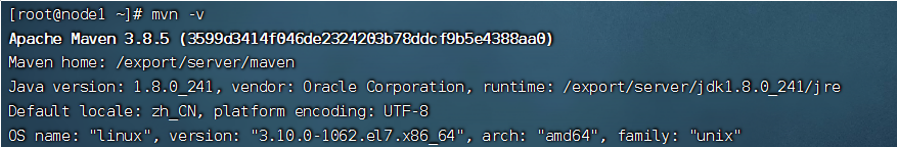

**添加maven镜像**

```
cd  /export/server/apache-maven-3.8.5
```

- 修改**conf/settings.xml**文件内容：

将下面内容删掉:

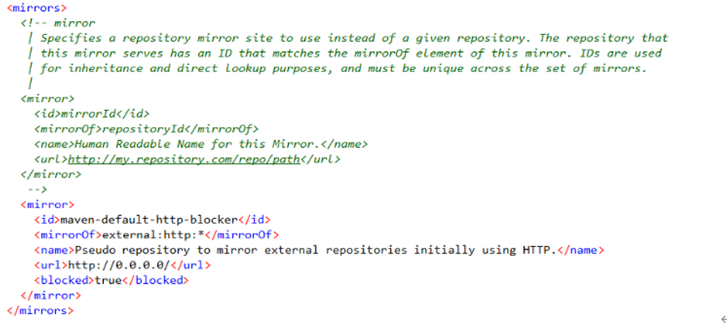 

替换为:

```shell
<mirrors>
    <!-- mirror
     | Specifies a repository mirror site to use instead of a given repository. The repository that
     | this mirror serves has an ID that matches the mirrorOf element of this mirror. IDs are used
     | for inheritance and direct lookup purposes, and must be unique across the set of mirrors.
     |
    <mirror>
      <id>mirrorId</id>
      <mirrorOf>repositoryId</mirrorOf>
      <name>Human Readable Name for this Mirror.</name>
      <url>http://my.repository.com/repo/path</url>
    </mirror>
     -->
   <!-- <mirror>
      <id>maven-default-http-blocker</id>
      <mirrorOf>external:http:*</mirrorOf>
      <name>Pseudo repository to mirror external repositories initially using HTTP.</name>
      <url>http://0.0.0.0/</url>
      <blocked>true</blocked>
    </mirror> -->
    <mirror>
	<id>alimaven</id>
	<name>aliyun maven</name>
	<url>http://maven.aliyun.com/nexus/content/groups/public/</url>
	<mirrorOf>central</mirrorOf>
	</mirror>
	<mirror>
		<id>aliyunmaven</id>
		<mirrorOf>*</mirrorOf>
		<name>阿里云spring插件仓库</name>
		<url>https://maven.aliyun.com/repository/spring-plugin</url>
	</mirror>
	<mirror> 
		<id>repo2</id> 
		<name>Mirror from Maven Repo2</name> 
		<url>https://repo.spring.io/plugins-release/</url> 
		<mirrorOf>central</mirrorOf> 
	</mirror>
	<mirror>
		<id>UK</id>
		<name>UK Central</name>
		<url>http://uk.maven.org/maven2</url>
		<mirrorOf>central</mirrorOf>
	</mirror>
	<mirror>
		<id>sonatype</id>
		<name>sonatype Central</name>
		<url>http://repository.sonatype.org/content/groups/public/</url>
		<mirrorOf>central</mirrorOf>
	</mirror>
	<mirror>
		<id>jboss-public-repository-group</id>
		<name>JBoss Public Repository Group</name>
		<url>http://repository.jboss.org/nexus/content/groups/public</url>
		<mirrorOf>central</mirrorOf>
	</mirror>
	<mirror>
		<id>CN</id>
		<name>OSChina Central</name>
		<url>http://maven.oschina.net/content/groups/public/</url>
		<mirrorOf>central</mirrorOf>
	</mirror>
	<mirror>
		<id>google-maven-central</id>
		<name>GCS Maven Central mirror Asia Pacific</name>
		<url>https://maven-central-asia.storage-download.googleapis.com/maven2/</url>
		<mirrorOf>central</mirrorOf>
	</mirror>
    <mirror>
		<id>confluent</id>
		<name>confluent maven</name>
		<url>http://packages.confluent.io/maven/</url>
		<mirrorOf>confluent</mirrorOf>
	</mirror>
  </mirrors>
```

保存退出。

#### **Hudi 的编译**

**下载hudi源码**

- 地址：<https://www.apache.org/dyn/closer.lua/hudi/0.11.1/hudi-0.11.1.src.tgz>

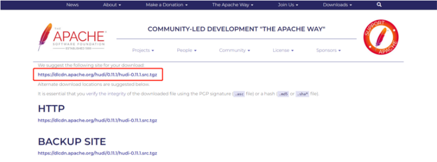 

- 将hudi压缩包上传到 /export/software目录下（第一台虚拟机），解压到/export/software目录:  

```
tar zxvf /export/software/hudi-0.11.1.src.tgz -C /export/software
```

**修改pom.xml文件**

```
cd /export/software/hudi-0.11.1
```

- 修改pom.xml文件内容，修改flink、hadoop、hive、scala版本，改为如下所示：

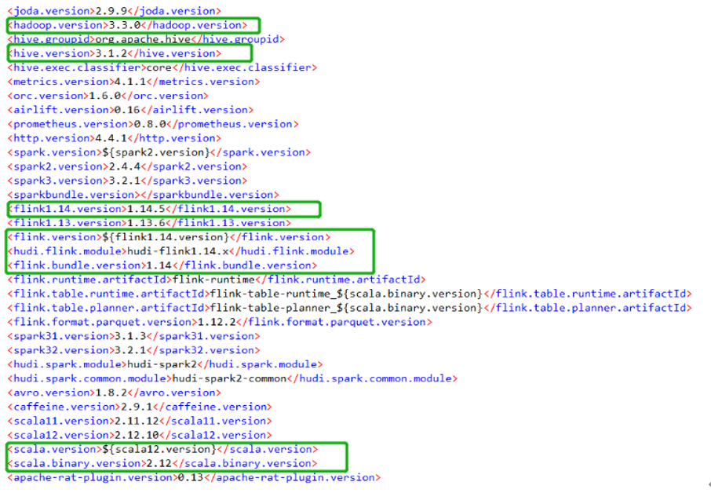 

- 保存退出。

**修改源码**

```shell
cd  /export/software/hudi-0.11.1/hudi-common/src/main/java/org/apache/hudi/common/table/log/block  
```

- 修改HoodieParquetDataBlock.java文件,如下图

 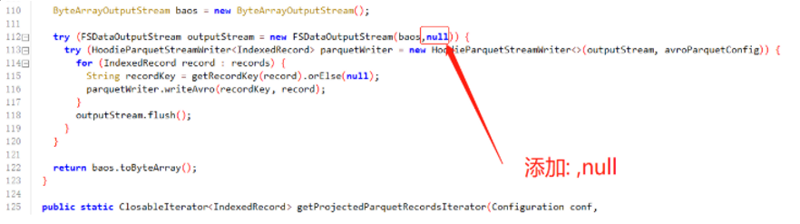

- 保存退出。

```
cd /export/software/hudi-0.11.1/hudi-client/hudi-flink-client
```

- 修改pom.xml文件，将图示灰色内容注释掉或者删掉。

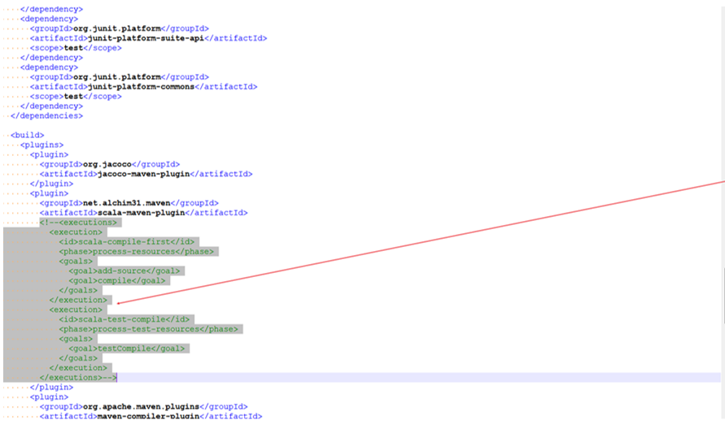 

- 保存退出。

**执行编译**

```shell
cd /export/software/hudi-0.11.1
mvn clean package -DskipTests -Dspark3 -Dscala-2.12
```

- 等待几分钟，编译完成。

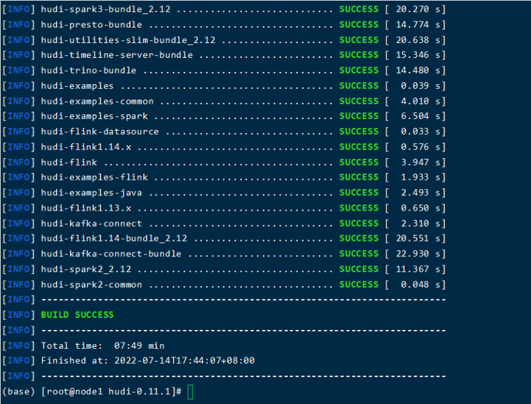 

- 验证是否编译成功

```
cd /export/software/hudi-0.11.1
./hudi-cli/hudi-cli.sh
```

如下图，表示编译成功。Ctrl+c退出。

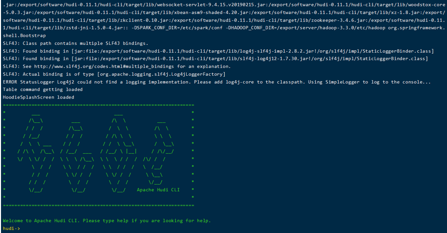

### 知识点06：【实现】Hudi快速体验使用

#### 启动服务

**启动HFDFS**

- 启动HDFS集群，node1执行: 

```
/export/server/hadoop/sbin/start-dfs.sh
```


**启动Flink**

- 将 **hive-exec-3.1.2.jar**包放入到flink安装目录的lib下：/export/server/flink/lib（三台都要放）
- Flink集成hudi，本质就是为flink添加hudi依赖包：

从编译的hudi目录下**/export/software/hudi-0.11.1/packaging/hudi-flink-bundle/target/**将 **hudi-flink1.14-bundle_2.12-0.11.1.jar**，放入flink安装目录的lib下即可：**/export/server/flink/lib**（**如果有多台都要放**）

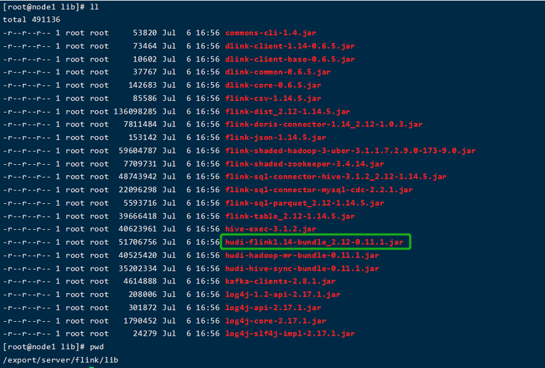

- 启动standalone集群服务,node1执行:

```
/export/server/flink/bin/start-cluster.sh
```

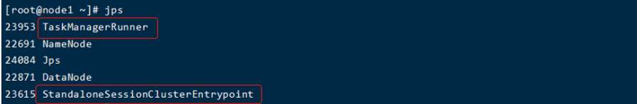

**启动Flink SQL Cli**

- 启动Flink SQL Cli命令行，node1执行:

```
/export/server/flink/bin/sql-client.sh embedded shell
```

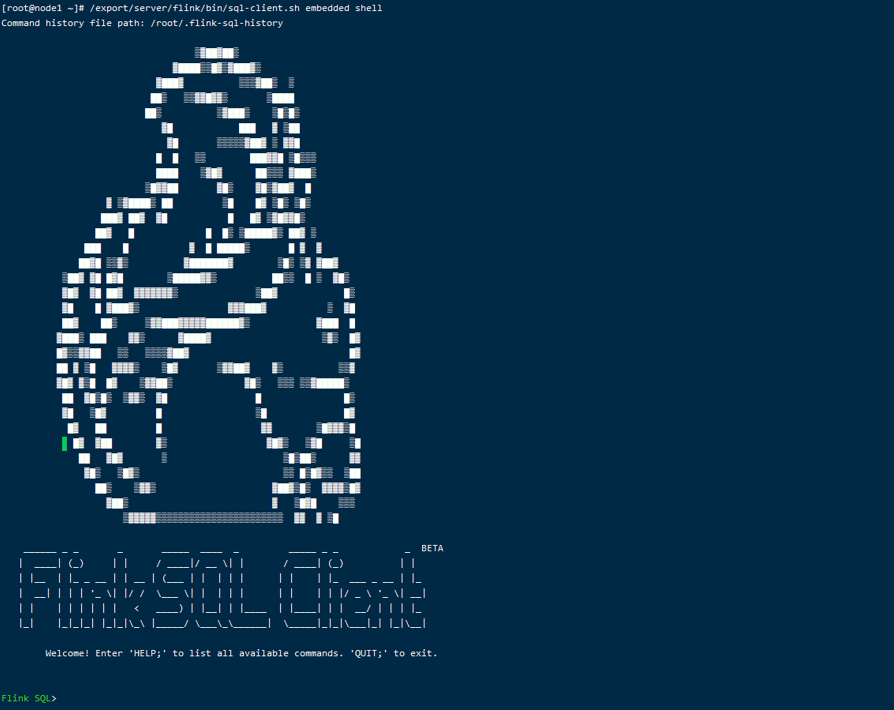

- 在SQL Cli设置分析结果展示模式为tableau模式:

```
set sql-client.execution.result-mode = tableau;
```


#### 插入数据

- 创建t1表，在SQL Cli执行：

```sql
CREATE TABLE t1(
  uuid VARCHAR(20) PRIMARY KEY NOT ENFORCED,
  name VARCHAR(10),
  age INT,
  ts TIMESTAMP(3),
  `partition` VARCHAR(20)
)
PARTITIONED BY (`partition`)
WITH (
  'connector' = 'hudi',  -- 连接器指定hudi
  'path' = 'hdfs://node1:8020/hudi/t1',  -- 数据存储地址
  'table.type' = 'MERGE_ON_READ' -- 表类型，默认COPY_ON_WRITE,可选MERGE_ON_READ
);
```

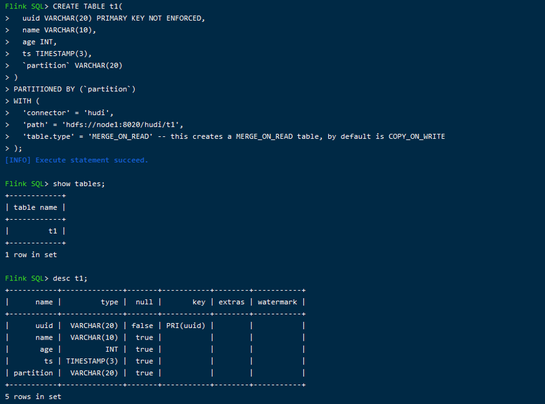

- 使用values插入数据，执行：

```sql
INSERT INTO t1 VALUES
  ('id1','Danny',23,TIMESTAMP '1970-01-01 00:00:01','par1'),
  ('id2','Stephen',33,TIMESTAMP '1970-01-01 00:00:02','par1'),
  ('id3','Julian',53,TIMESTAMP '1970-01-01 00:00:03','par2'),
  ('id4','Fabian',31,TIMESTAMP '1970-01-01 00:00:04','par2'),
  ('id5','Sophia',18,TIMESTAMP '1970-01-01 00:00:05','par3'),
  ('id6','Emma',20,TIMESTAMP '1970-01-01 00:00:06','par3'),
  ('id7','Bob',44,TIMESTAMP '1970-01-01 00:00:07','par4'),
  ('id8','Han',56,TIMESTAMP '1970-01-01 00:00:08','par4');
```


#### 查询数据

- 查看hdfs文件系统，hudi文件夹下生成名为t1的文件夹。地址：

<http://node1:9870/explorer.html#/hudi> (注意对应的域名解析为**node1**)

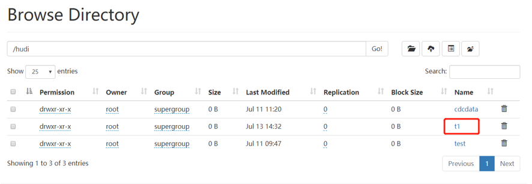

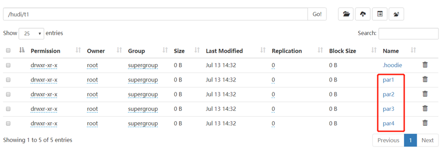

在SQL Cli查看表内容：

```sql
select * from t1;
```

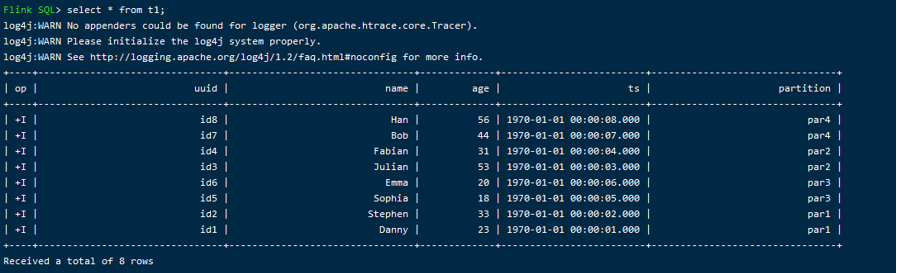

#### 更新数据

- 更新主键为id1的数据内容，执行：

```sql
insert into t1 values
  ('id1','Danny',27,TIMESTAMP '1970-01-01 00:00:01','par1');
```


- 查询

```sql
select * from t1;
```

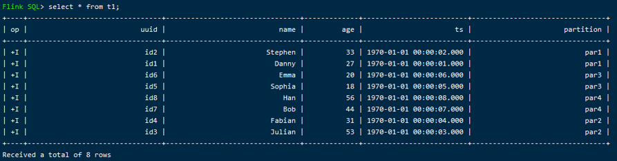

#### 流式查询

- 流式查询（Streaming Query）需要设置**read.streaming.enabled = true**。再设置**read.start-commit**，如果想消费所有数据，设置值为earliest。

使用参数如下：

| **参数名称**                   | **是否必填** | **默认值**        | **备注**                                                     |
| ------------------------------ | ------------ | ----------------- | ------------------------------------------------------------ |
| read.streaming.enabled         | false        | false             | 设置为true，开启stream query                                 |
| read.start-commit              | false        | the latest commit | Instant time的格式为:’yyyyMMddHHmmss’                        |
| read.streaming_skip_compaction | false        | false             | 是否不消费compaction commit，消费compaction commit会出现重复数据 |
| clean.retain_commits           | false        | 10                | 当开启change log mode，保留的最大commit数量。如果checkpoint interval为5分钟，则保留50分钟的change log |

> 注意：如果开启read.streaming.skip_compaction，但stream reader的速度比clean.retain_commits慢，可能会造成数据丢失

- 在SQL Cli依次执行：

```sql
CREATE TABLE t2(
  uuid VARCHAR(20) PRIMARY KEY NOT ENFORCED,
  name VARCHAR(10),
  age INT,
  ts TIMESTAMP(3),
  `partition` VARCHAR(20)
)
PARTITIONED BY (`partition`)
WITH (
  'connector' = 'hudi',   -- 连接器指定为hudi
  'path' = 'hdfs://node1:8020/hudi/t2',  -- 数据存储地址
  'table.type' = 'MERGE_ON_READ',  -- 表类型，默认COPY_ON_WRITE,可选MERGE_ON_READ
  'read.streaming.enabled' = 'true',  -- 默认值false，设置为true，开启stream query
  'read.start-commit' = '20210316134557', -- start-commit之前提交的数据不显示，默认值the latest commit，instant time的格式为：‘yyyyMMddHHmmss’ 
  'read.streaming.check-interval' = '4'  -- 检查间隔，默认60s
);

INSERT INTO t2 VALUES
  ('id1','Danny',23,TIMESTAMP '1970-01-01 00:00:01','par1'),
  ('id2','Stephen',33,TIMESTAMP '1970-01-01 00:00:02','par1'),
  ('id3','Julian',53,TIMESTAMP '1970-01-01 00:00:03','par2'),
  ('id4','Fabian',31,TIMESTAMP '1970-01-01 00:00:04','par2'),
  ('id5','Sophia',18,TIMESTAMP '1970-01-01 00:00:05','par3'),
  ('id6','Emma',20,TIMESTAMP '1970-01-01 00:00:06','par3'),
  ('id7','Bob',44,TIMESTAMP '1970-01-01 00:00:07','par4'),
  ('id8','Han',56,TIMESTAMP '1970-01-01 00:00:08','par4');
  
select * from t2;
```

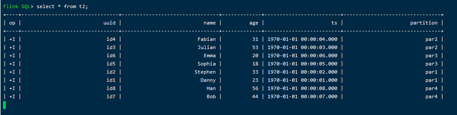

- Flink8081界面可以看到正在运行的任务，地址：<http://node1:8081/#/overview>

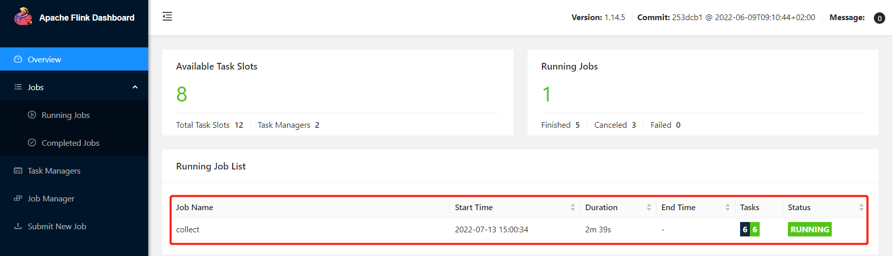

- 此时是流式查询，按ctrl+c退出，任务结束。

Apache Hudi 核心概念剖析
------------------------

### 知识点07：【理解】基本概念

#### 总述

Hudi提供了Hudi表的概念，这些表支持CRUD（增删改查）操作，可以利用现有的大数据集群比如HDFS做数据文件存储，然后使用SparkSQL或Hive等分析引擎进行数据分析查询。

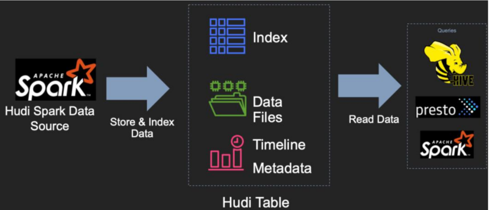

-   Hudi表的三个主要组件：

    -   有序的时间轴元数据，类似于数据库事务日志。

    -   分层布局的数据文件：实际写入表中的数据；

    -   索引（多种实现方式）：映射包含指定记录的数据集。

#### 时间轴Timeline

Hudi把随着时间流逝，对表的一系列CRUD（增删改查）操作叫做Timeline，Timeline中某一次的操作，叫做Instant。Hudi的核心就是在所有的表中维护了一个包含在不同的即时（**Instant**）时间对数据集操作（**比如新增、修改或删除**）的时间轴（**Timeline**）。

在每一次对Hudi表的数据集操作时都会在该表的Timeline上生成一个Instant，从而可以实现在仅查询某个时间点之后成功提交的数据，或是仅查询某个时间点之前的数据，有效避免了扫描更大时间范围的数据。

同时，可以高效地只查询更改前的文件（**如在某个Instant提交了更改操作后，仅query某个时间点之前的数据，则仍可以query修改前的数据**）。

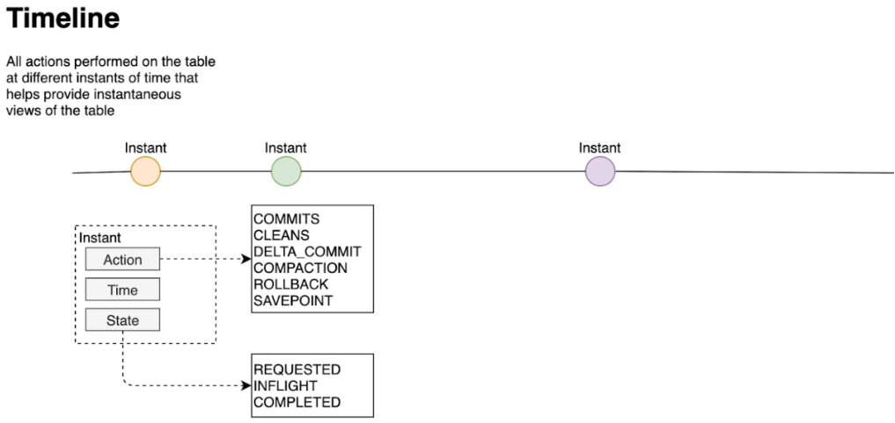

Timeline是Hudi用来管理提交（commit）的抽象，每个commit都绑定一个固定时间戳，分散到时间线上。在Timeline上，每个commit被抽象为一个HoodieInstant，一个instant记录了一次提交
(commit) 的行为（action）、时间戳（time）、和状态（state）。

-   Hudi Instant由以下组件组成：

    -   Instant Action:
        指的是对Hudi表执行的操作类型，目前包括COMMITS、CLEANS、DELTA\_COMMIT、COMPACTION、ROLLBACK、SAVEPOINT这6种操作类型。

        -   Commits：表示一批记录原子性的写入到一张表中。

        -   Cleans:清除表中不再需要的旧版本文件。

        -   Delta\_commit:增量提交指的是将一批记录原子地写入MergeOnRead类型表，其中一些/所有数据都可以写入增量日志。

        -   Compaction：将行式文件转化为列式文件。

        -   Rollback:Commits或者Delta\_commit执行不成功时回滚数据，删除期间产生的任意文件。

        -   Savepoint:将文件组标记为“saved”,cleans执行时不会删除对应的数据。

    -   Instant Time：本次操作发生的时间，通常是时间戳（例如：20190117010349），它按照动作开始时间的顺序单调递增；

    -   Instant State：表示在指定的时间点（Instant Time）对Hudi表执行操作（Instant Action）后，表所处的状态，目前包括REQUESTED（已调度但未初始化）、INFLIGHT（当前正在执行）、COMPLETED（操作执行完成）这3种状态。

-   Hudi中的每个操作都是原子性的，Hudi保证了在时间轴上操作的原子性和基于Instant时间轴的一致性;

下面结合官网中给出的例子理解下Timeline，例子场景是，在10:00\~10:20之间，要对一个Hudi表执行Upsert操作，操作的频率大约是5分钟执行一次,每次操作执行完成，会看到对应这个Hudi表的Timeline上，有一系列的Commit元数据生成。当满足一定条件时，会在指定的时刻对这些COMMIT进行CLEANS和COMPACTION操作，这两个操作都是在后台完成，其中在10:05之后执行了一次CLEANS操作，10:10之后执行了一次COMPACTION操作。

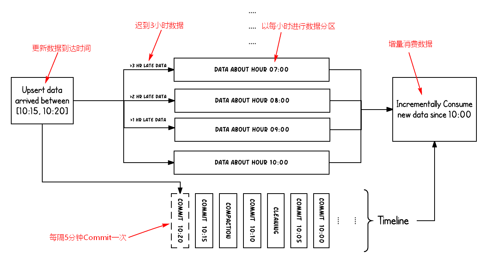

我们看到，从数据生成到最终到达Hudi系统，可能存在延迟，如上图数据大约在07:00、08:00、09:00时生成，数据到达大约延迟了分别3、2、1小时多，最终生成COMMIT的时间才是Upsert的时间。通过使用Timeline来管理，当增量查询10:00之后的最新数据时，可以非常高效的找到10:00之后发生过更新的文件，而不必根据延迟时间再去扫描更早时间的文件，比如这里，就不需要扫描7:00、8:00或9:00这些时刻对应的文件（Buckets）。

时间轴（Timeline）的实现类（位于hudi-common-xx.jar中）,时间轴相关的实现类位于
org.apache.hudi.common.table.timeline 包下：

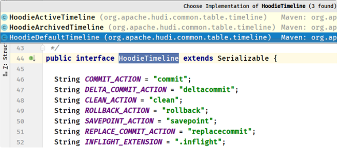

#### Metadata Table元数据表

Hudi元数据表可以显著提高查询的读/写性能，元数据表的主要目的是消除对“列表文件”操作的需求。以时间轴（Timeline）的形式将数据集上的各项操作元数据维护起来，以支持数据集的瞬态视图，这部分元数据存储于根目录下的元数据目录。

一共有三种类型的元数据：

-   Commits：一个单独的commit包含对数据集上一批数据的一次写入操作的相关信息。我们用单调递增的时间戳来标识commits，标定的是一次写入操作的开始。

-   Cleans：用于清除数据集中不再被查询所用到的旧文件的后台活动。

-   Compactions：用于协调Hudi内部的数据结构差异的后台活动。例如，将更新操作由基于行存的日志文件归集到列存数据上。

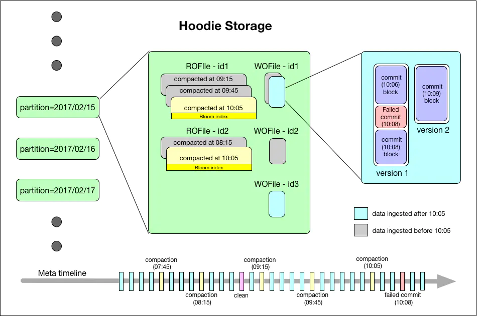

#### 文件管理

Hudi表的数据文件，可以使用操作系统的文件系统存储，也可以使用HDFS这种分布式的文件系统存储。为了后续分析性能和数据的可靠性，**一般使用HDFS进行存储**。

Hudi为了实现数据的CRUD（增删改查），需要能够唯一标识一条记录，Hudi将把数据集中的**唯一字段(record
key ) +数据所在分区(partitionPath) 联合起来当做数据的唯一键**。其数据集的组织**目录结构与Hive表示非常相似，一份数据集对应着一个根目录**。数据集被打散为多个分区，分区字段以文件夹形式存在，该文件夹包含该分区的所有文件。在根目录下，每个分区都有唯一的分区路径，每个分区目录下有多个文件。

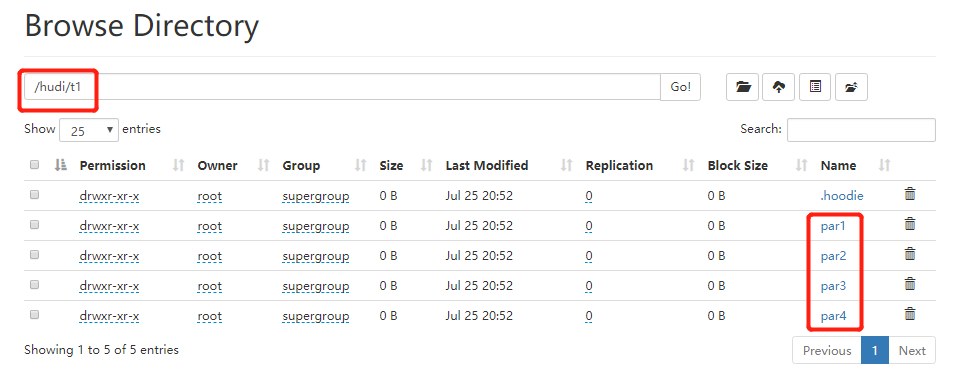

以HDFS存储来看，一个Hudi表的存储文件分为.hoodie文件与数据文件两类。

-   .hoodie 文件：由于CRUD（增删改查）的零散性，每一次的操作都会生成一个文件，这些小文件越来越多后，会严重影响HDFS的性能，Hudi设计了一套文件**合并机制**。.hoodie文件夹中存放了对应的文件合并操作相关的日志文件。

-   par1、par2等相关的路径是实际的数据文件，按分区存储，par1、par2等即分区名。

##### .hoodie文件

.hoodie文件夹中存放对应Instant State操作的状态记录如下：

> Instant State操作的状态：发起(REQUESTED)，进行中(INFLIGHT)，还是已完成(COMPLETED) 
>


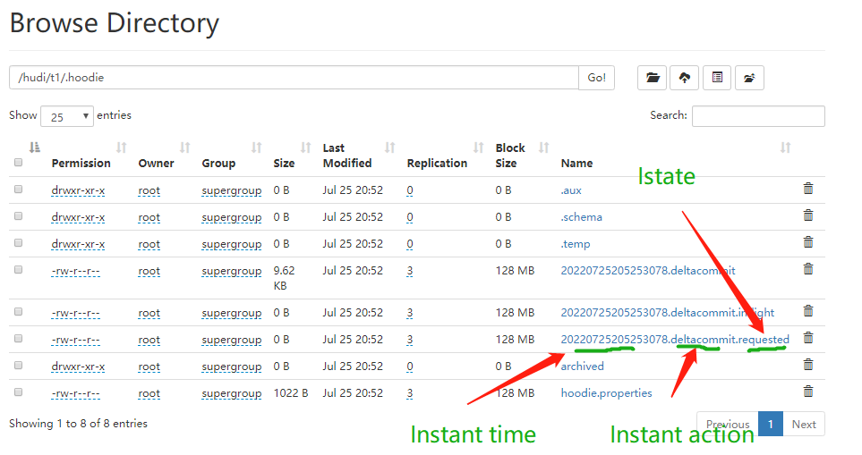

##### 数据文件

每个目录下面会存在属于该分区的多个文件，类似Hive表，每个Hudi表分区通过一个分区路径（partitionpath）来唯一标识。

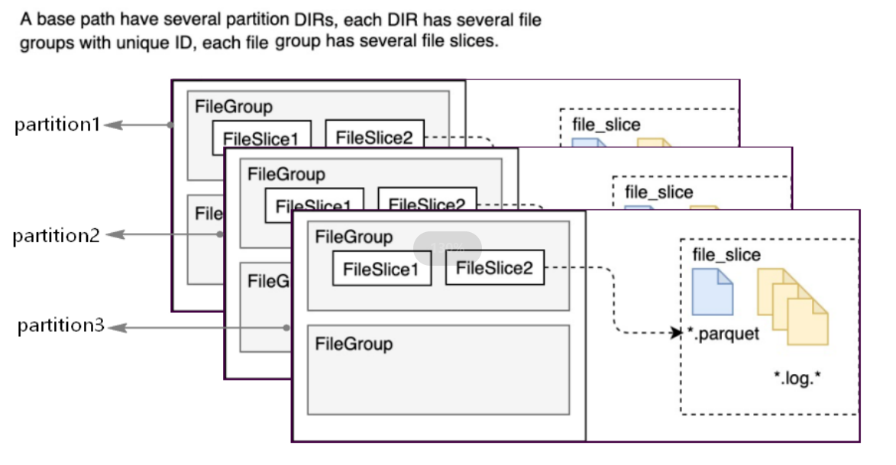

在每个分区下面，通过文件分组（file groups）的方式来组织，每个分组对应一个唯一的文件ID。每个文件分组中包含多个文件分片（file slices）(一个新的 base commit time 对应一个新的文件分片，实际就是一个新的数据版本），每个文件分片包含一个Base文件（\*.parquet），这个文件是在执行COMMIT/COMPACTION操作的时候生成的，同时还生成了几个日志文件（\*.log.\*），日志文件中包含了从该Base文件生成以后执行的插入/更新操作。

-   Hudi的base file (parquet文件) 在footer的meta记录了record key组成的BloomFilter，用于在file based index的实现中实现高效率的key contains检测。

-   Hudi的log（avro文件）是自己编码的，通过积攒数据buffer以LogBlock为单位写出，每个LogBlock
    包含magic number、size、content、footer等信息，用于数据读、校验和过滤。

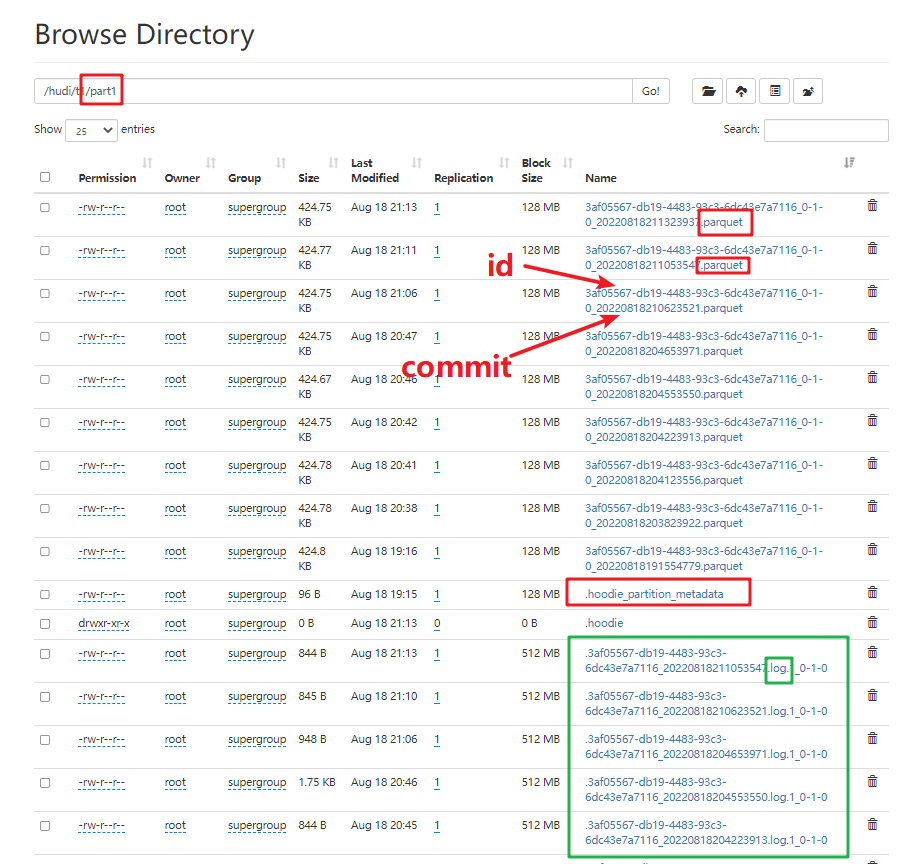

#### Index 索引

##### 基本介绍

Hudi通过索引机制将给定的hoodie键（**RecordKey**记录键**+PartitionPath**分区路径）一致地映射到文件id，从而提供高效的upsert。记录键和文件id之间的这种映射，一旦记录的第一个版本被写入文件，就永远不会改变。简而言之，映射文件组包含一组记录的所有版本。

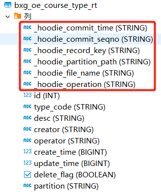

对于Copy-On-Write表，可以实现快速upsert/delete操作，避免需要连接整个数据集以确定要重写哪些文件。对于Merge-On-Read表，这种设计允许Hudi绑定任何给定基本文件需要合并的记录数量。具体来说，给定的基本文件只需要针对作为该基本文件一部分的记录的更新进行合并。相反，没有索引组件的设计最终必须将所有基本文件与所有传入的更新/删除记录合并：

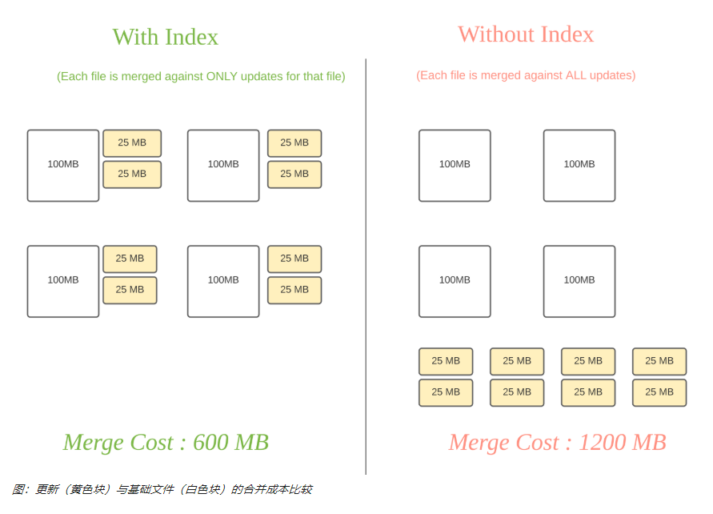

##### 索引类型

1）目前，hudi支持以下索引选项,可以使用hoodie.index.type选择这些选项。

-   Bloom Index（**默认**）：使用由记录键构建的Bloom过滤器，还可以选择使用记录键范围修改候选文件。

-   简单索引：针对从存储表中提取的键执行传入更新/删除记录的精益连接。

-   HBase索引：管理外部 Apache HBase 表中的索引映射。

-   自带实现：可以扩展此公共API以实现自定义索引。

Bloom Index和简单索引都有全局选项：**hoodie.index.type=GLOBAL\_BLOOM**和**hoodie.index.type=GLOBAL\_SIMPLE**。HBase索引本质上是一个全局索引。

2）全局索引和非全局索引之间的区别：

-   全局索引：**全局索引在表的所有分区中强制执行键的唯一性**，即保证表中对于给定的记录键只存在一条记录。全局索引提供了更强的保证，但更新/删除成本随着表的大小而增长，所以更适合小表。

-   非全局索引：**仅在表的某一个分区内强制要求键保持唯一**，它依赖于写入器在更新/删除期间为给定的记录键提供相同的一致分区路径。但因为索引查找操作可以很好地随写入量而扩展，所以也可以提供更好的性能。

#### 小结

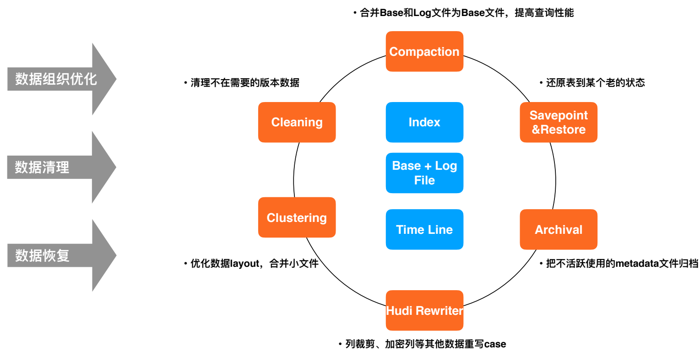

### 知识点08：【掌握】表的存储类型

#### 总述

Hudi表类型定义了如何在DFS上对数据进行索引和布局，以及如何在此类组织之上实现上述基元和时间轴活动，即如何写入数据。反过来，定义如何向查询公开基础数据即为如何读取数据。

| 表类型                       | 支持的查询类型                                                                                         |
|------------------------------|--------------------------------------------------------------------------------------------------------|
| 写入时复制 （Copy On Write） | 快照查询（Snapshot Queries）+ 增量查询（Incremental Queries）                                          |
| 读取时合并 （Merge On Read） | 快照查询（Snapshot Queries）+ 增量查询（Incremental Queries）+ 读取优化查询（Read Opitimized Queries） |

#### 数据计算模型

Hudi是Uber主导开发的开源数据湖框架，所以大部分的出发点都来源于Uber自身场景，比如司机数据和乘客数据通过订单Id来做Join等。在Hudi过去的使用场景里，和大部分公司的架构类似，采用批式和流式共存的Lambda架构，后来Uber提出增量Incremental模型，相对批式来讲，更加实时；相对流式而言，更加经济。

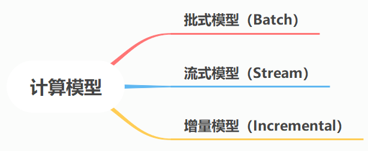

##### 批式模型（Batch）

批式模型就是使用MapReduce、Hive、Spark等典型的批计算引擎，**以小时任务或者天任务的形式来做数据计算**。

-   延迟：小时级延迟或者天级别延迟。这里的延迟不单单指的是定时任务的时间，在数据架构里，
    这里的延迟时间通常是定时任务间隔时间+一系列依赖任务的计算时间+数据平台最终可以展示结果的时间。数据量大、逻辑复杂的情况下，小时任务计算的数据通常真正延迟的时间是2-3小时。

-   数据完整度：数据较完整。以处理时间为例，小时级别的任务，通常计算的原始数据已经包含了小时内的所有数据，所以得到的数据相对较完整。但如果业务需求是事件时间，这里涉及到终端的一些延迟上报机制，在这里，批式计算任务就很难派上用场。

-   成本：成本很低。只有在做任务计算时，才会占用资源，如果不做任务计算，可以将这部分批式计算资源出让给在线业务使用。但从另一个角度来说成本是挺高的，如原始数据做了一些增删改查，数据晚到的情况，那么批式任务是要全量重新计算。

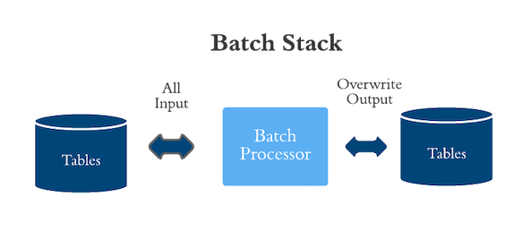

##### 流式模型（Stream）

流式模型，典型的就是使用Flink来进行实时的**数据计算**。

-   延迟：很短，甚至是实时。

-   数据完整度：较差。因为流式引擎不会等到所有数据到齐之后再开始计算，所以有一个
    watermark 的概念，当数据的时间小于watermark
    时，就会被丢弃，这样是无法对数据完整度有一个绝对的报障。在互联网场景中，流式模型主要用于活动时的数据大盘展示，对数据的完整度要求并不算很高。在大部分场景中，用户需要开发两个程序，一是流式数据生产流式结果，二是批式计算任务，用于次日修复实时结果。

-   成本：很高。因为流式任务是常驻的，并且对于多流Join的场景，通常要借助内存或者数据库来做state的存储，不管是序列化开销，还是和外部组件交互产生的额外IO，在大数据量下都是不容忽视的。

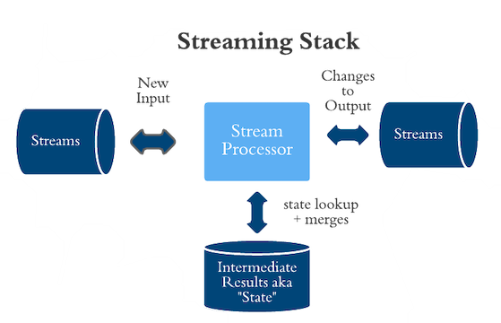

##### 增量模型（Incremental）

针对批式和流式的优缺点，Uber提出了增量模型（Incremental Mode），相对批式来讲，更加实时；相对流式而言，更加经济。增量模型，简单来讲，是以mini batch的形式来跑准实时任务。Hudi在增量模型中支持了两个最重要的特性：

-   Upsert：这个主要是解决批式模型中，数据不能插入、更新的问题，有了这个特性，可以往Hive中写入增量数据，而不是每次进行完全的覆盖。（Hudi自身维护了key-\>file的映射，所以当upsert时很容易找到key对应的文件）

-   Incremental Query：增量查询，减少计算的原始数据量。以Uber中司机和乘客的数据流Join为例，每次抓取两条数据流中的增量数据进行批式的Join即可，相比流式数据而言，成本要降低几个数量级。

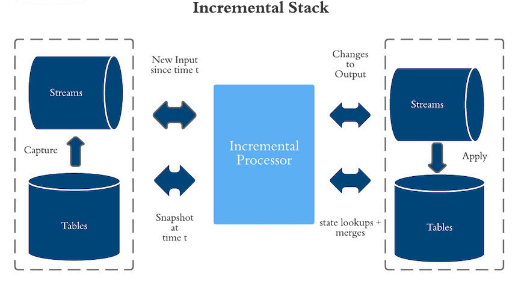

#### Hudi 支持表类型

Hudi提供两类型表：**写时复制（Copy on Write，COW）表**和**读时合并（Merge On Read，MOR）表**。

-   Copy On Write：仅使用列文件格式（例如parquet）存储数据。通过在写入过程中执行同步合并以更新版本并重写文件。用户的update会重写数据所在的文件，所以是一个写放大很高，但是读放大为0，适合写少读多的场景。

-   Merge On Read：使用列式（例如parquet）+ 基于行（例如avro）的文件格式组合来存储数据。更新记录到增量文件中，然后进行同步或异步压缩以生成列文件的新版本。整体的结构有点像LSM-Tree，用户的写入先写入到delta data中，这部分数据使用行存，这部分delta data可以手动 merge到存量文件中，整理为parquet的列存结构。

##### Copy on Write（COW）

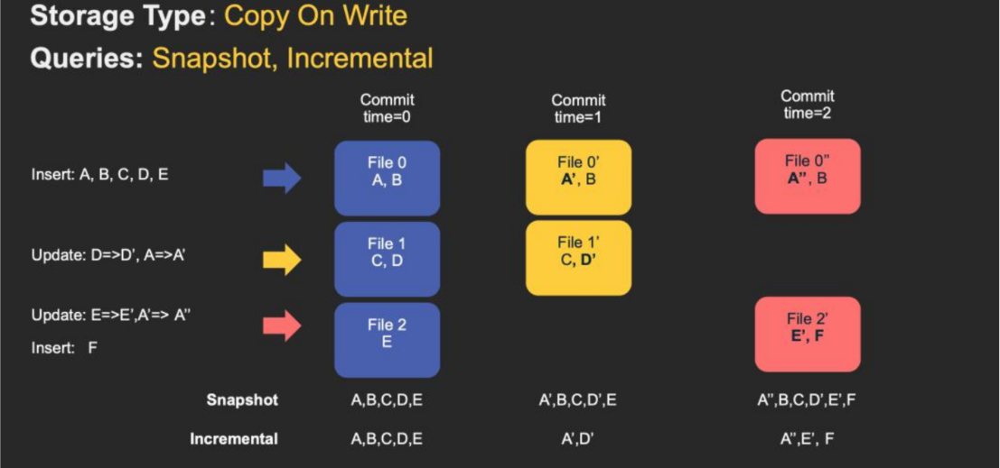

Copy On Write，简称COW。顾名思义，它是在**数据写入**的时候，复制一份原来的拷贝，在其基础上添加新数据。

-   更新update：在更新记录时，Hudi会先找到包含更新数据的文件，然后再使用更新值（最新的数据）重写该文件，包含其他记录的文件保持不变。当突然有大量写操作时会导致重写大量文件，从而导致极大的I/O开销。

-   读取read：在读取数据时，通过读取最新的数据文件来获取最新的更新，此存储类型适用于少量写入和大量读取的场景。

###### 如何工作

Copy On Write简称COW,在数据写入的时候，复制一份原来的拷贝，在其基础上添加新数据,生成一个新的持有base file （**\*.parquet，对应写入的instant time**）的File Slice，数据存储格式为parquet列式存储格式。用户在读取数据时，会扫描所有最新的File Slice下的base file。

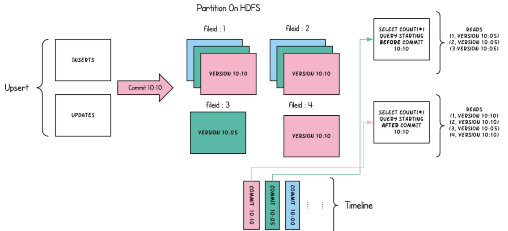

如上图，每一个颜色都包含了截至到其所在时间的所有数据。老的数据副本在超过一定的个数限制后，将被删除（**hoodie.cleaner.commits.retained 参数配置，保留几个历史版本，不包含最后一个版本，默认10个**）。这种类型的表，没有compact instant，因为写入时相当于已经compact了。

###### 总结

-   优点：读取时，只读取对应分区的一个数据文件即可，较为高效。

-   缺点：数据写入的时候，需要复制一个先前的副本再在其基础上生成新的数据文件，这个过程比较耗时。

##### Merge On Read（MOR）

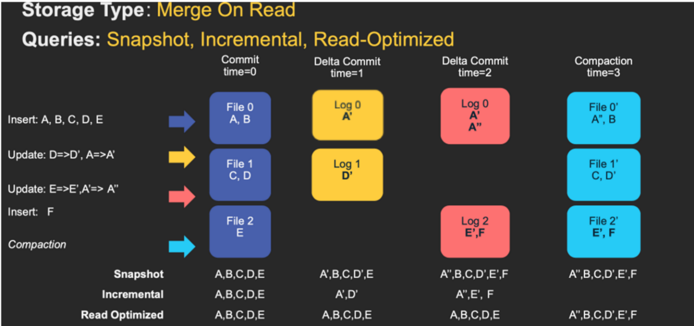

Merge On Read，简称MOR。是COW的升级版，它使用**列式（parquet）与行式（avro）文件混合的方式存储数据**。

Merge-On-Read表存在列式格式的Base文件，也存在行式格式的增量（Delta）文件，新到达的更新都会写到增量日志文件中（log文件），根据实际情况进行COMPACTION操作来将增量文件合并到Base文件上。

通过参数”**hoodie.compact.inline**”来开启是否一个事务完成后执行压缩操作，**默认不开启**。通过参数“**hoodie.compact.inline.max.delta.commits**”来设置提交多少次合并log文件到新的parquet文件，**默认是5次**。

这里注意，以上两个参数都是针对每个File Slice而言。我们同样可以控制“**hoodie.cleaner.commits.retained**”来保存有多少parquet文件，即控制FileSlice文件个数。

-   更新Update：在更新记录时，仅更新到增量文件（Avro）中，然后进行异步（或同步）的compaction，
    最后创建列式文件（parquet）的新版本。此存储类型适合频繁写的工作负载，因为新记录是以追加的模式写入增量文件中。

-   读取Read：在读取数据集时，需要先将delta log增量文件与旧文件进行合并，然后生成列式文件成功后，再进行查询。

###### 如何工作

下图演示了MOR的两种数据读写方式。

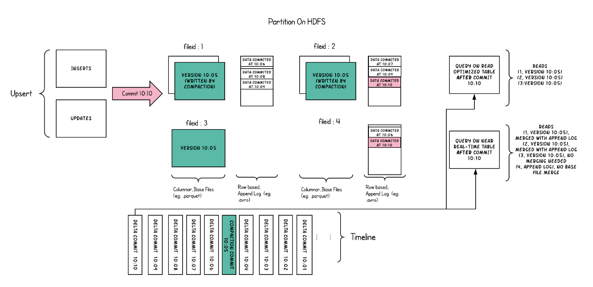

上图中，每个文件分组都对应一个增量日志文件（Delta Log File）。COMPACTION操作在后台定时执行。会把对应的增量日志文件合并到文件分组的Base文件中，生成新版本的Base文件。

对于查询10:10之后的数据的Read Optimized Query，只能查询到10:05及其之前的数据，看不到之后的数据，查询结果只包含版本为10:05、文件ID为1、2、3的文件；但是Snapshot Query是可以查询到10:05之后的数据的。

**Read Optimized Query与Snapshot Query是两种不同的查询类型，后文会解释到**。

###### 总结

-   优点：由于写入数据先写delta log，且delta log较小，所以写入成本较低。

-   缺点：需要定期合并整理compact，否则碎片文件较多。读取性能较差，因为需要将delta
    log和老数据文件合并。

##### COW vs MOR

对于写时复制（COW）和读时合并（MOR）writer来说，Hudi的WriteClient是相同的。

-   COW表，用户在snapshot读取的时候会扫描所有最新的FileSlice下的base file。

-   MOR表，在READ OPTIMIZED模式下，只会读最近的经过compaction的commit。

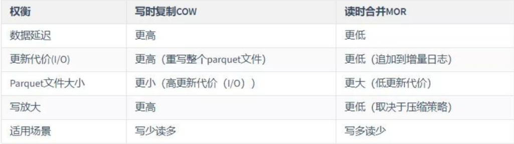

#### 查询类型（Query Type）

Hudi支持三种不同的查询表的方式：Snapshot Queries、Incremental Queries和Read Optimized Queries。

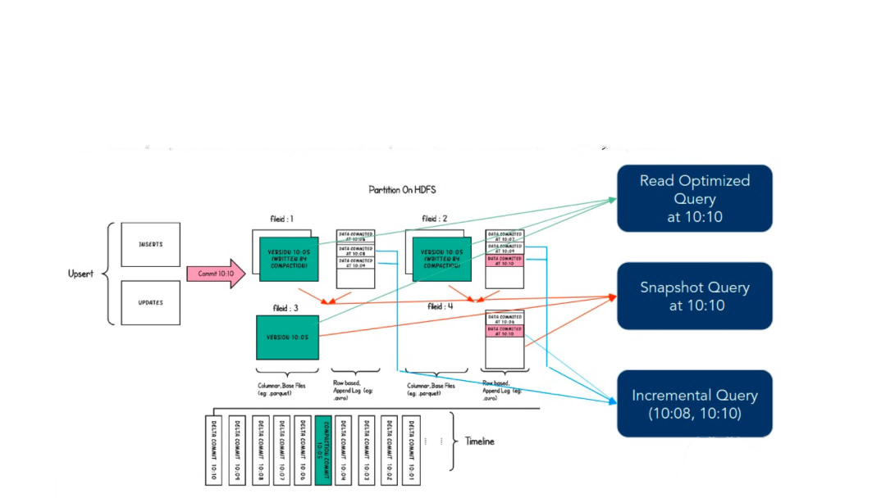

##### Snapshot Queries（快照查询）

-   查询某个增量提交操作中数据集的最新快照，先进行动态合并最新的基本文件(parquet)和增量文件(log)来提供近实时数据集（通常会存在几分钟的延迟）。即读取所有partiiton下每个FileGroup最新的FileSlice中的文件，Copy On Write表读parquet文件，Merge On Read表读parquet+log文件。

##### Incremental Queries（增量查询）

-   仅查询新写入数据集的文件，需要指定一个Commit/Compaction的即时时间（位于Timeline上的某个Instant）作为条件，来查询此条件之后的新数据。这有效的提供变更流来启用增量数据管道。

##### Read Optimized Queries（读优化查询）

-   直接查询基本文件（数据集的最新快照），其实就是列式文件（Parquet）。并保证与非Hudi列式数据集相比，具有相同的列式查询性能。

-   也可查看给定的commit/compact即时操作的表的最新快照。

-   读优化查询和快照查询相同仅访问基本文件，提供给定文件片自上次执行压缩操作以来的数据。通常查询数据的最新程度的保证取决于压缩策略。

#### 小结

-   Hudi 支持表类型：

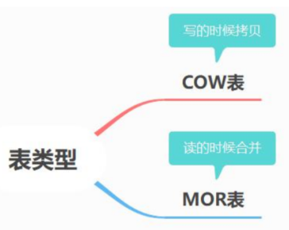

-   Hudi支持查询方式：

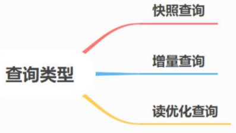

### 知识点09：【理解】数据写操作

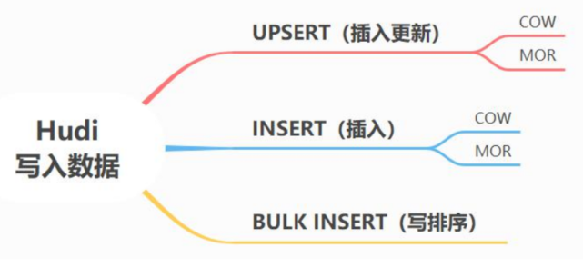

在Hudi数据湖框架中支持三种方式写入数据：**UPSERT（插入更新）、INSERT（插入）和BULK
INSERT（批插入）**。

#### UPSERT

这是默认操作。在该操作中，数据先通过index打标(INSERT/UPDATE)，即通过查找索引，将输入记录标记为插入或更新。再运行启发式算法以确定如何最好地将这些记录放到存储上。写流程如下图：

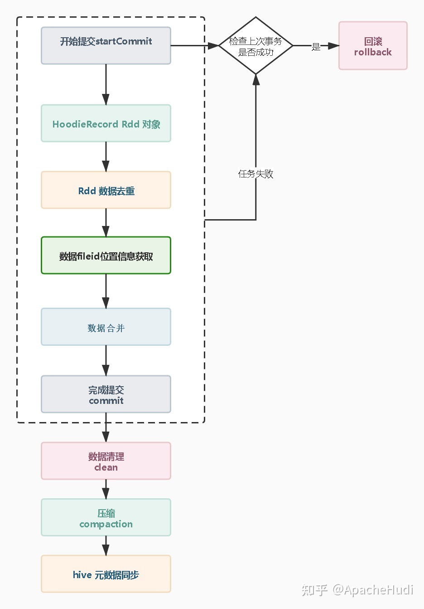

1.  开始提交：判断上次任务是否失败，如果失败会触发回滚操作。
    然后会根据当前时间生成一个事务开始的请求标识元数据。

2.  构造HoodieRecord Rdd对象：Hudi 会根据元数据信息构造HoodieRecord Rdd
    对象，方便后续数据去重和数据合并。

3.  数据去重：一批增量数据中可能会有重复的数据，Hudi会根据主键对数据进行去重避免重复数据写入Hudi
    表。

4.  数据fileId位置信息获取:在修改记录中可以根据索引获取当前记录所属文件的fileid，在数据合并时需要知道数据update操作向那个fileId文件写入新的快照文件。

5.  数据合并：Hudi 有两种模式cow和mor。在cow模式中会重写索引命中的fileId快照文件；在mor
    模式中根据fileId 追加到分区中的log 文件。

6.  完成提交：在元数据中生成xxxx.commit文件，只有生成commit
    元数据文件，查询引擎才能根据元数据查询到刚刚upsert 后的数据。

7.  compaction压缩：主要是mor模式中才会有，他会将mor模式中的xxx.log
    数据合并到xxx.parquet 快照文件中去。

8.  hive元数据同步：hive
    的元素数据同步这个步骤需要配置非必需操作，主要是对于hive和presto
    等查询引擎，需要依赖hive元数据才能进行查询，所以hive元数据同步就是构造外表提供查询。

#### INSERT

就使用启发式算法确定文件大小而言，此操作与插入更新（UPSERT）非常相似，但此操作完全跳过了索引查找步骤。
因此，对于日志重复数据删除等用例（结合下面提到的过滤重复项的选项），它可以比插入更新快得多。
插入也适用于这种用例，这种情况数据集可以允许重复项，但只需要Hudi的事务写/增量提取/存储管理功能。

#### BULK\_INSERT

Apache Hudi除了支持**insert**和**upsert**外，还支持bulk\_insert操作来将数据初始化至Hudi表中，该操作相比insert和upsert操作速度更快，效率更高。bulk\_insert不会查看已存在数据的开销并且不会进行小文件优化。

##### 三种模式

bulk\_insert按照以下原则提供了3种开箱即用的模式（**PARTITION\_SORT、GLOBAL\_SORT、NONE**）来满足不同的需求：

-   如果数据布局良好，排序将为我们提供良好的压缩和upsert性能。特别是记录键具有某种排序（时间戳等）特征，则排序将有助于在upsert期间裁剪大量文件，如果数据是按频繁查询的列排序的，那么查询将利用parquet谓词下推来裁剪数据，以确保更低的查询延迟。

-   写parquet文件是内存密集型操作。当将大量数据写入一个也被划分为1000个分区的表中时，如果不进行任何排序，写入程序可能必须保持1000个parquet写入器处于打开状态，同时会产生不可持续的内存压力，并最终导致崩溃。

-   在批量导入数据时，最好控制好少的文件个数，以避免以后写入和查询时的元数据开销。

##### 配置

可以通过**hoodie.bulkinsert.sort.mode**配置项来设置上述模式（NONE, GLOBAL\_SORT
, PARTITION\_SORT），默认值为**GLOBAL\_SORT**。

##### 模式介绍

###### GLOBAL\_SORT（全局排序）

-   upsert效率高：全局排序就是为了提高upsert的性能。

-   insert效率低：由于全局排序的过程，导致insert的性能降低。

###### PARTITION\_SORT（分区排序）

-   upsert效率居中：不是全局排序，而仅对spark分区内排序

-   insert效率居中：无论是什么排序过程，总会降低insert效率，但可以缓解内存压力。

###### NONE

-   upsert效率低：未排序的原始文件进行upsert索引查找期间大量读取bloom filter

-   insert效率高：虽然写入效率高，但会有内存风险。也会有大量小文件产生

###### 用户自定义Partitioner

如果上述模式都不能满足需求，用户可以自定义实现partitioner来满足业务需求。

###### 性能测试

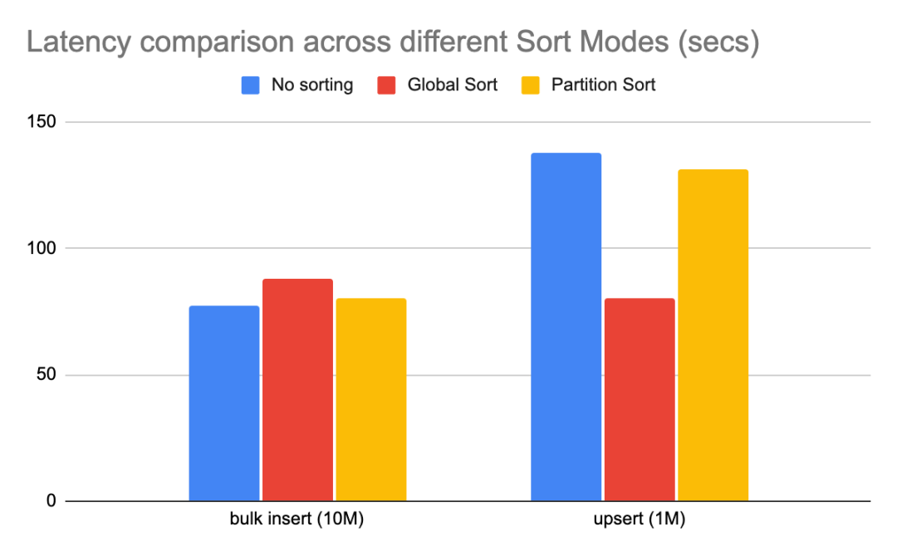

> **说明：**该基准测试使用不同的排序模式将1000万条记录批量插入hudi，然后upsert100W个条记录（原始数据集大小的10%）。 


显而易见，NONE模式对批量导入性能最佳，因为它不涉及任何排序。与NONE模式相比，GLOBAL\_SORT相比NONE模式开销约为15%。PARTITION\_SORT相比NONE模式开销约为4%，因为也涉及到对记录的排序操作。但是要注意的是后面的upsert性能。如前所述，与其他两种排序模式相比全局排序具有许多优势，GLOBAL\_SORT相比NONE upsert性能高40%。PARTITION\_SORT相比NONE模式有约5%的改进，这是由于大量小文件开销导致。

知识点10：【掌握】Flink写入数据到hudi的四种方式
-----------------------------

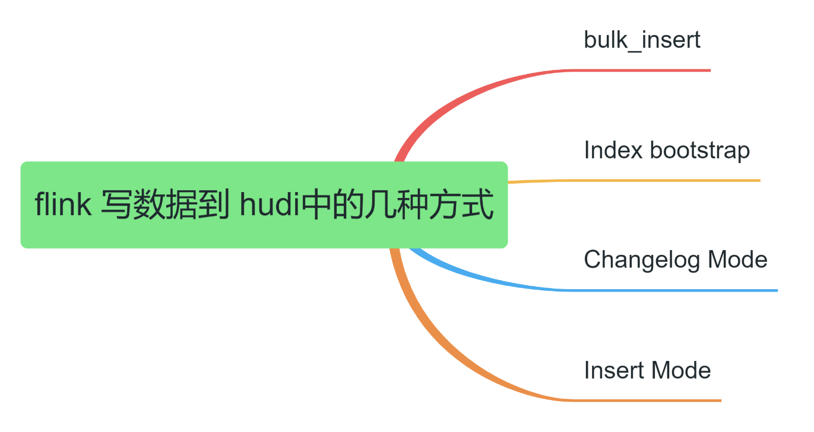

### bulk\_insert

用于快速导入快照数据到hudi

#### 基本特性

-   bulk\_insert可以减少数据序列化以及合并操作，于此同时，该数据写入方式会跳过数据去重，所以用户需要保证数据的唯一性。

-   bulk\_insert在批量写入模式中是更加有效率的。默认情况下，批量执行模式按照分区路径对输入记录进行排序，并将这些记录写入Hudi，该方式可以避免频繁切换文件句柄导致的写性能下降。

-   bulk\_insert的并行度有write.tasks参数指定，并行度会影响小文件的数量。理论上来说，bulk\_insert的并行度就是bucket的数量（特别是，当每个bucket写到最大文件大小时，它将转到新的文件句柄。最后，文件的数量将大于参数write.bucket.assign.tasks指定的数量
    ）

#### 可选配置参数

| 参数名称                                  | 是否必须 | 默认值 | 参数说明                                                                                     |
|-------------------------------------------|----------|--------|----------------------------------------------------------------------------------------------|
| write.operation                           | true     | upsert | 设置为 bulk\_insert 以开启bulk\_insert功能                                                   |
| write.tasks                               | false    | 4      | bulk\_insert 并行度, the number of files \>= write.bucket\_assign.tasks                      |
| write.bulk\_insert.shuffle\_by\_partition | false    | true   | 写入前是否根据分区字段进行数据重分布。启用此选项将减少小文件的数量，但可能存在数据倾斜的风险 |
| write.bulk\_insert.sort\_by\_partition    | false    | true   | 写入前是否根据分区字段对数据进行排序。启用此选项将在写任务写多个分区时减少小文件的数量       |
| write.sort.memory                         | false    | 128    | 排序算子的可用托管内存。默认为 128 MB                                                        |

#### Flink SQL实践

##### 准备工作

-   上传jar包：将flink-connector-jdbc\_2.12-1.14.5.jar上传至/export/server/flink/lib目录下

-   创建mysql源表

```sql
CREATE DATABASE IF NOT EXISTS test;

create table if not exists test.stu(
    id bigint not null primary key,
    name varchar(32),
    age int not null
)    charset = utf8;

insert into test.stu values
(1,'zhangsan',11),
(2,'lisi',13),
(3,'wangwu',17),
(4,'zhaoliu',19),
(5,'maoqi',23);
```

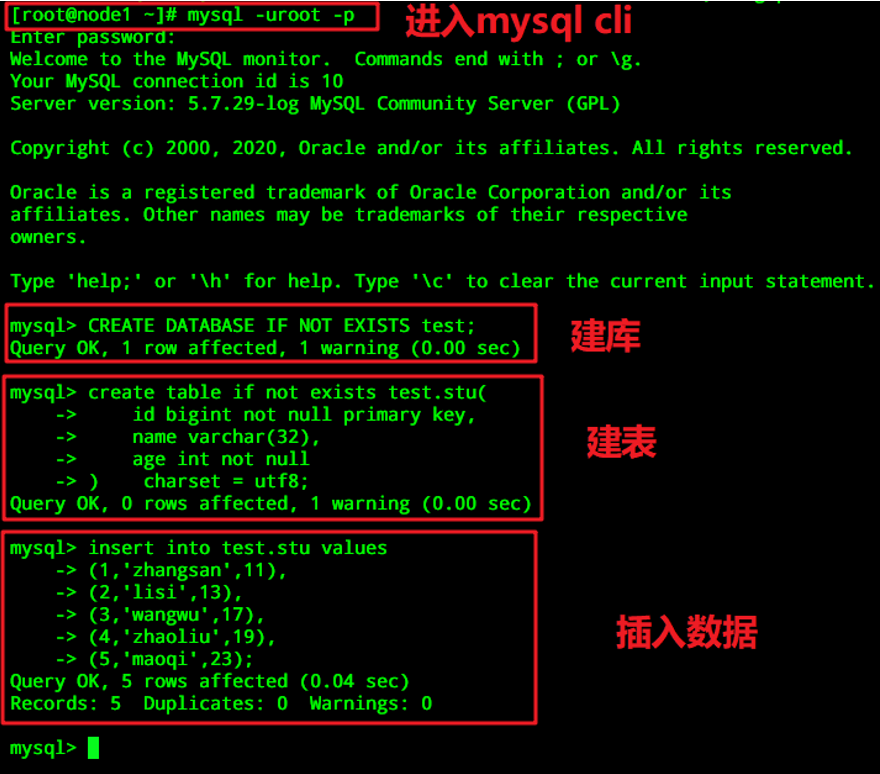

- 启动hdfs

```
/export/server/hadoop/sbin/start-dfs.sh
```

- 启动Flink服务

```shell
node1上启动Flink Standalone模式：
/export/server/flink/bin/start-cluster.sh
node1上启动Flink sql-cli：
/export/server/flink/bin/sql-client.sh
```

- 设置参数

```shell
set sql-client.execution.result-mode = tableau;
set execution.checkpointing.interval=30sec;
```

##### 操作

-   创建mysql映射表

```sql
CREATE TABLE IF NOT EXISTS stu(
    id bigint not null,
    name varchar(32),
    age int not null,
    PRIMARY KEY (id) NOT ENFORCED
) with (
    'connector' = 'jdbc',
    'url' = 'jdbc:mysql://node1:3306/test?serverTimezone=GMT%2B8',
    'username' = 'root',
    'password' = '123456',
    'table-name' = 'stu'
);
select * from stu;
```

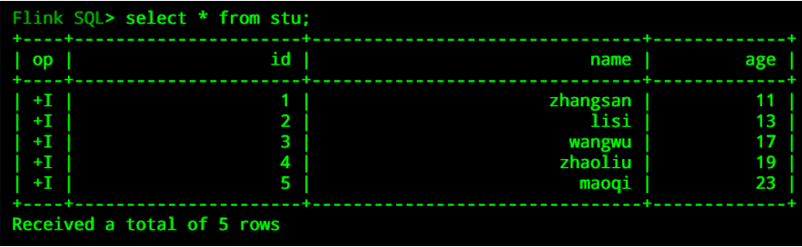
-   创建hudi映射表

```sql
create table stu_sink_hudi(
    id bigint not null,
    name string,
    age int not null,
    primary key (id) not enforced
)partitioned by (`age`)
with (
    'connector' = 'hudi',
    'path' = 'hdfs://node1:8020/test/stu_sink_hudi',
    'table.type' = 'MERGE_ON_READ',
    'write.option' = 'bulk_insert',
    'write.precombine.field' = 'age'
);
```


-   插入数据

```sql
insert into stu_sink_hudi select * from stu;
```

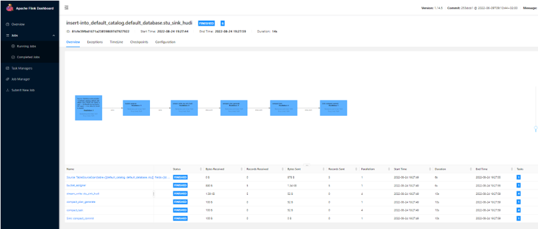

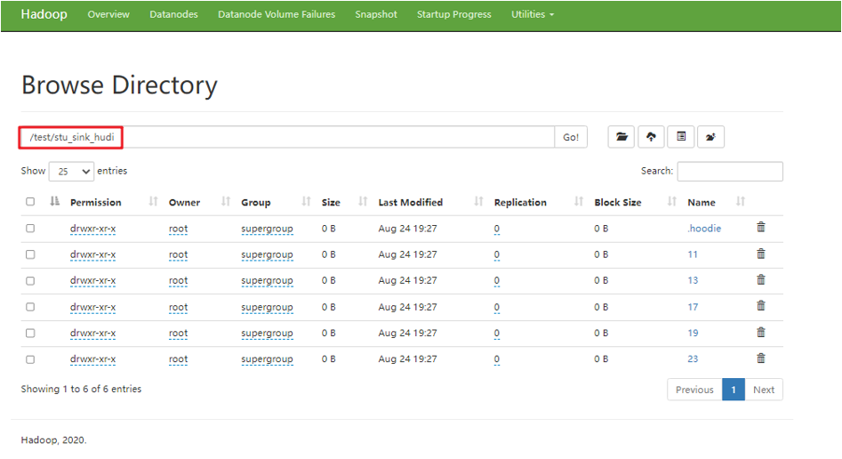

### Index bootstrap

#### 基本特性

该方式用于快照数据+增量数据的导入。如果快照数据已经通过bulk\_insert导入到hudi，那么用户就可以近实时插入增量数据并且通过index bootstrap功能来确保数据不会重复。

> 如果这个过程特别耗时，那么在写快照数据的时候可以多设置计算资源，然后在插入增量数据时减少计算资源。 
>


#### 可选配置参数

| 参数名称                | 是否必须 | 默认值 | 参数说明                                                                     |
|-------------------------|----------|--------|------------------------------------------------------------------------------|
| index.bootstrap.enabled | true     | false  | 当启用index bootstrap功能时，会将Hudi表中的剩余记录一次性加载到Flink状态中   |
| index.partition.regex   | false    | \*     | 优化参数，设置正则表达式来过滤分区。 默认情况下，所有分区都被加载到flink状态 |

#### 使用方法

-   CREATE TABLE创建一条与Hudi表对应的语句。 注意这个table.type配置必须正确。

-   设置index.bootstrap.enabled = true来启用index bootstrap功能

-   在flink-conf.yaml文件中设置Flink checkpoint的容错机制，设置配置项execution.checkpointing.tolerable-failed-checkpoints = n（取决于Flink checkpoint执行时间）

-   等待直到第一个checkpoint成功，表明index bootstrap完成。

-   在index bootstrap完成后，用户可以退出并保存savepoint(或直接使用外部 checkpoint)。

-   重启任务，并且设置index.bootstrap.enable 为 false

> - 索引引导是一个阻塞过程，因此在索引引导期间无法完成checkpoint。 
>
>
>
> -   index bootstrap由输入数据触发。用户需要确保每个分区中至少有一条记录。
>
> -   index bootstrap是并发执行的。用户可以在日志文件中通过finish loading the index under partition以及Load record form file观察index bootstrap的进度。
>
> -   第一个成功的checkpoint表明index bootstrap已完成。从checkpoint恢复时，不需要再次加载索引。
>

#### Flink SQL实践

前提条件：

-   已有50w条数据已写入kafka，使用bulk\_insert的方式将其导入hudi表。

-   再通过创建任务消费最新kafka数据，并开启index bootstrap特性。

##### 准备工作

创建Kafka话题并产生消息

- 启动zookeeper

```
zkServer.sh start
```

- 启动kafka集群

```
cd /export/server/kafka_2.12-2.4.1/
nohup bin/kafka-server-start.sh config/server.properties 2>&1 &
```

- 创建topic

```
bin/kafka-topics.sh --create \
--zookeeper node1:2181 \
--replication-factor 1 \
--partitions 1 \
--topic cdc_mysql_stu2_sink_test
```

- （如果删除topic）

```
bin/kafka-topics.sh --delete --zookeeper node1:2181 \
--topic cdc_mysql_stu2_sink_test
```

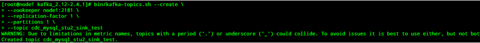

- 启动kafka生产者

```
bin/kafka-console-producer.sh --broker-list node1.itcast.cn:9092 --topic cdc_mysql_stu2_sink_test
```

- 往topic中插入一批测试数据

```
1,zhangsan,11
2,lisi,13
3,wangwu,17
4,zhaoliu,19
5,maoqi,23
```

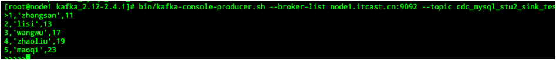

##### 操作

-   创建bulk\_insert任务

```sql
create table stu2_binlog_source_kafka(
    id bigint not null,
    name string,
    age int not null
) with (
    'connector' = 'kafka',
    'topic' = 'cdc_mysql_stu2_sink_test',
    'properties.bootstrap.servers' = 'node1:9092',
    'format' = 'csv',
    'scan.startup.mode' = 'earliest-offset',
    'properties.group.id' = 'testGroup'
);
create table stu2_binlog_sink_hudi(
    id bigint not null,
    name string,
    age int not null,
    primary key (id) not enforced
)partitioned by (`age`)
 with (
  'connector' = 'hudi',
  'path' = 'hdfs://node1:8020/test/stu2_binlog_sink_hudi',
  'table.type' = 'MERGE_ON_READ',
  'write.option' = 'bulk_insert',
  'write.precombine.field' = 'age'
  );
insert into stu2_binlog_sink_hudi select * from stu2_binlog_source_kafka;
```

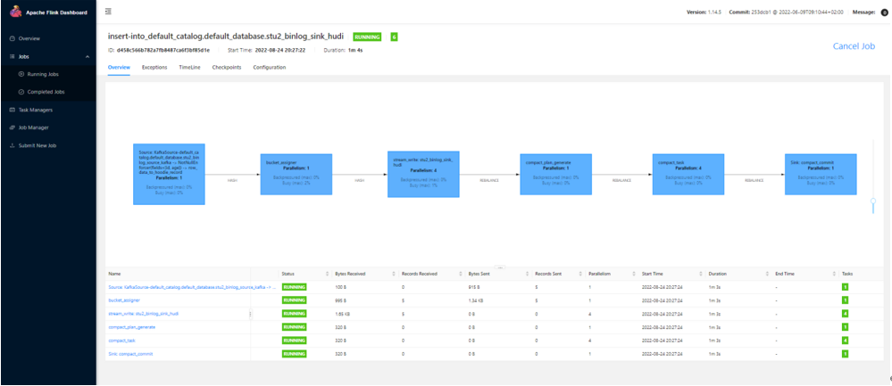
-   创建开启index bootstrap特性、离线压缩任务。

```sql
create table stu2_binlog_source_kafka_1(
    id bigint not null,
    name string,
    age int not null
) with (
    'connector' = 'kafka',
    'topic' = 'cdc_mysql_stu2_sink_test',
    'properties.bootstrap.servers' = 'node1:9092',
    'format' = 'csv',
    'scan.startup.mode' = 'earliest-offset',
    'properties.group.id' = 'testGroup'
);
create table stu2_binlog_sink_hudi_1(
    id bigint not null,
    name string,
    age int not null,
    primary key (id) not enforced
)partitioned by (`age`)
 with (
  'connector' = 'hudi',
  'path' = 'hdfs://node1:8020/test/stu2_binlog_sink_hudi',
  'table.type' = 'MERGE_ON_READ',
  'write.option' = 'upsert',
  'write.tasks' = '4',
  'write.precombine.field' = 'age',
  'compaction.async.enabled' = 'false',
  'index.bootstrap.enabled' = 'true'
  );
insert into stu2_binlog_sink_hudi_1 select * from stu2_binlog_source_kafka_1;
```

-   Kafka中添加消息

```
6,haoba,29
```

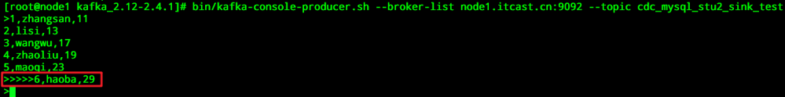

-   查看hdfs

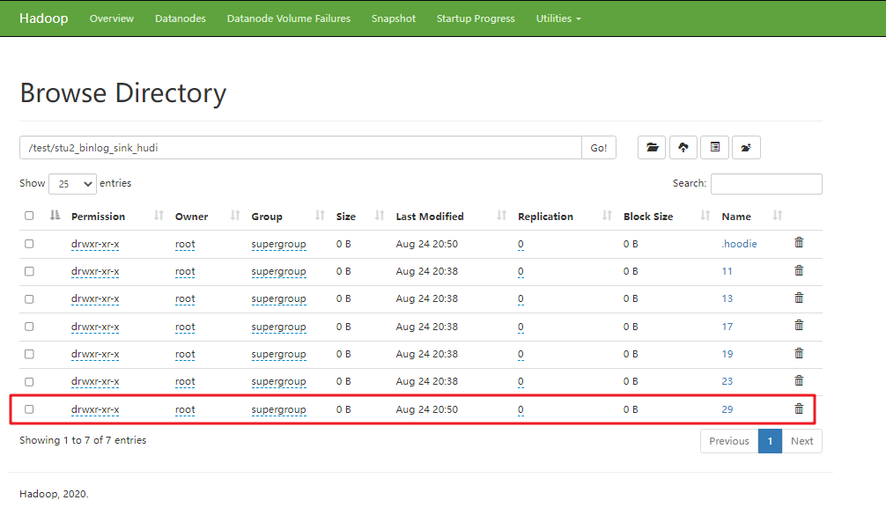

### Changelog Mode

#### 基本特性

Hudi可以保留消息的所有中间变化(I / -U / U / D)，然后通过flink的状态计算消费，从而拥有一个接近实时的数据仓库ETL管道(增量计算)。Hudi MOR表以行的形式存储消息，支持保留所有更改日志(格式级集成)。
所有的更新日志记录可以使用Flink流阅读器。

#### 可选配置参数

| 参数名称          | 是否必须 | 默认值 | 参数说明                                                     |
| ----------------- | -------- | ------ | ------------------------------------------------------------ |
| changelog.enabled | false    | false  | 它在默认情况下是关闭的，为了拥有upsert语义，只有合并的消息被确保保留，中间的更改可以被合并。 设置为true以支持使用所有更改 |

> - 不管格式是否存储了中间更改日志消息，批处理(快照)读取仍然合并所有中间更改。
> - 在设置changelog.enable为true时，更新日志记录的保留只是最大的努力:异步压缩任务将更新日志记录合并到一条记录中，因此如果流源不及时消费，则压缩后只能读取每个key的合并记录。解决方案是通过调整压缩策略，比如压缩选项:compress.delta\_commits和compression.delta\_seconds，为读取器保留一些缓冲时间。

### Insert Mode

#### 基本特性

默认情况下，Hudi对插入模式采用小文件策略:MOR将增量记录追加到日志文件中，COW合并基本parquet文件(增量数据集将被重复数据删除)。这种策略会导致性能下降。

如果要禁止文件合并行为，可将write.insert.deduplicate设置为false，则跳过重复数据删除。
每次刷新行为直接写入一个新的 parquet文件(MOR表也直接写入parquet文件)。

#### 可选配置参数

| 参数名称                 | 是否必须 | 默认值 | 参数说明                                                                                    |
|--------------------------|----------|--------|---------------------------------------------------------------------------------------------|
| write.insert.deduplicate | false    | true   | “插入模式”默认启用重复数据删除功能。 关闭此选项后，每次刷新行为直接写入一个新的 parquet文件 |

知识点11：【掌握】Hudi on Hive（hive元数据同步）
------------------------------

Hudi源表对应一份HDFS数据，可以通过Spark，Flink 组件或者Hudi客户端将Hudi表的数据映射为Hive外部表，基于该外部表，Hive可以方便的进行实时视图，读优化视图以及增量视图的查询。对于presto 等查询引擎，需要依赖hive元数据才能进行查询，所以hive元数据同步就是构造外表提供查询。

### Hive对Hudi的集成

这里以Hive3.1.2、Hudi 0.11.1为例，其他版本类似

-   添加jar包：将以下两个jar包放入到/export/server/hive/lib目录下（**只放node1**）

| **Jar包**                        | **地址**                                                            |
|----------------------------------|---------------------------------------------------------------------|
| hudi-hadoop-mr-bundle-0.11.1.jar | /export/software/hudi-0.11.1/packaging/hudi-hadoop-mr-bundle/target |
| hudi-hive-sync-bundle-0.11.1.jar | /export/software/hudi-0.11.1/packaging/hudi-hive-sync-bundle/target |

-   修改hive-site.xml配置文件，添加参数

vim /export/server/hive/conf/hive-site.xml

```
    <property>
        <name>hive.default.aux.jars.path</name>
        <value>file:///export/server/hive/lib/hudi-hadoop-mr-bundle-0.11.1.jar,file:///export/server/hive/lib/hudi-hive-sync-bundle-0.11.1.jar</value>
    </property>
    
    <property>
        <name>hive.aux.jars.path</name>
        <value>file:///export/server/hive/lib/hudi-hadoop-mr-bundle-0.11.1.jar,file:///export/server/hive/lib/hudi-hive-sync-bundle-0.11.1.jar</value>
    </property>
```

### 案例演示

见第7部分Mysql-Flinkcdc-Hudi案例

知识点12：【实现】Mysql-Flinkcdc-Hudi案例
-----------------------

### 放入jar包

-   将以下三个jar包放入到/export/server/flink/lib下(**如果有多台Flink机器都要放**)。

| **Jar包**                              | **地址**                                                            |
|----------------------------------------|---------------------------------------------------------------------|
| hudi-flink1.14-bundle\_2.12-0.11.1.jar | /export/software/hudi-0.11.1/packaging/hudi-hadoop-mr-bundle/target |
| hudi-hadoop-mr-bundle-0.11.1.jar       | /export/software/hudi-0.11.1/packaging/hudi-hadoop-mr-bundle/target |
| hudi-hive-sync-bundle-0.11.1.jar       | /export/software/hudi-0.11.1/packaging/hudi-hive-sync-bundle/target |

-   将flink-sql-connector-hive-3.1.2\_2.12-1.14.5.jar放入到/export/server/flink/lib下(**如果有多台Flink机器都要放**)。

### 开启服务

-   开启hdfs:

```shell
/export/server/hadoop/sbin/start-dfs.sh
```


-   开启hive:

```
nohup /export/server/hive/bin/hive --service metastore &
nohup /export/server/hive/bin/hive --service hiveserver2 &
```


-   开启flink standalone:

```
cd /export/server/flink
./bin/start-cluster.sh
```


-   开启flink sql客户端:

```
/export/server/flink/bin/sql-client.sh embedded
```


### flink sql客户端执行

-   设置tableau模式:

```
SET sql-client.execution.result-mode = tableau;
```


-   设置checkpoint:

```
set execution.checkpointing.interval=30sec;
```


-   创建mysql映射表：

```sql
CREATE TABLE if not exists mysql_bxg_oe_course_type (
      `id` INT,
      `type_code` STRING,
      `desc` STRING,
      `creator` STRING,
      `operator` STRING,
      `create_time` TIMESTAMP(3),
      `update_time` TIMESTAMP(3),
      `delete_flag` BOOLEAN,
      PRIMARY KEY (`id`) NOT ENFORCED
    ) WITH (
      'connector'= 'mysql-cdc',  -- 指定connector，这里填 mysql-cdc
      'hostname'= '192.168.88.161', -- MySql server 的主机名或者 IP 地址
      'port'= '3306',  -- MySQL 服务的端口号
      'username'= 'root',   --  连接 MySQL 数据库的用户名
      'password'='123456',  -- 连接 MySQL 数据库的密码
      'server-time-zone'= 'Asia/Shanghai',  -- 时区
      'debezium.snapshot.mode'='initial',  -- 启动模式，默认为initial
      'database-name'= 'bxg',  -- 需要监控的数据库名
      'table-name'= 'oe_course_type' -- 需要监控的表名
);
```


-   创建hudi映射表：

```sql
CREATE TABLE if not exists hudi_bxg_oe_course_type (
         `id` INT,
         `type_code` STRING,
         `desc` STRING,
         `creator` STRING,
         `operator` STRING,
         `create_time` TIMESTAMP(3),
         `update_time` TIMESTAMP(3),
         `delete_flag` BOOLEAN,
     `partition` STRING,
     PRIMARY KEY (`id`) NOT ENFORCED
    ) PARTITIONED BY (`partition`)
    with(
       'connector'='hudi',
      'path'= 'hdfs://192.168.88.161:8020/hudi/bxg_oe_course_type',  -- 数据存储目录
      'hoodie.datasource.write.recordkey.field'= 'id', -- 主键
      'write.precombine.field'= 'update_time',  -- 自动precombine的字段
      'write.tasks'= '1',
      'compaction.tasks'= '1',
      'write.rate.limit'= '2000', -- 限速
      'table.type'= 'MERGE_ON_READ', -- 默认COPY_ON_WRITE,可选MERGE_ON_READ
      'compaction.async.enabled'= 'true', -- 是否开启异步压缩
      'compaction.trigger.strategy'= 'num_commits', -- 按次数压缩
      'compaction.delta_commits'= '1', -- 默认为5
      'changelog.enabled'= 'true', -- 开启changelog变更
      'read.tasks' = '1',
      'read.streaming.enabled'= 'true', -- 开启流读
      'read.streaming.check-interval'= '3', -- 检查间隔，默认60s
      'hive_sync.enable'= 'true', -- 开启自动同步hive
      'hive_sync.mode'= 'hms', -- 自动同步hive模式，默认jdbc模式
      'hive_sync.metastore.uris'= 'thrift://192.168.88.161:9083', -- hive metastore地址
      'hive_sync.table'= 'bxg_oe_course_type', -- hive 新建表名
      'hive_sync.db'= 'bxg', -- hive 新建数据库名
      'hive_sync.username'= '', -- HMS 用户名
      'hive_sync.password'= '', -- HMS 密码
      'hive_sync.support_timestamp'= 'true'-- 兼容hive timestamp类型
    );
```


-   插入数据：

```sql
INSERT INTO hudi_bxg_oe_course_type SELECT  `id`,`type_code` ,`desc`,`creator` ,`operator`,`create_time` ,`update_time` ,`delete_flag`,DATE_FORMAT(`create_time`, 'yyyyMMdd') FROM mysql_bxg_oe_course_type;
```


### 查看结果

-   查看flink web页面: <http://192.168.88.161:8081/#/overview>

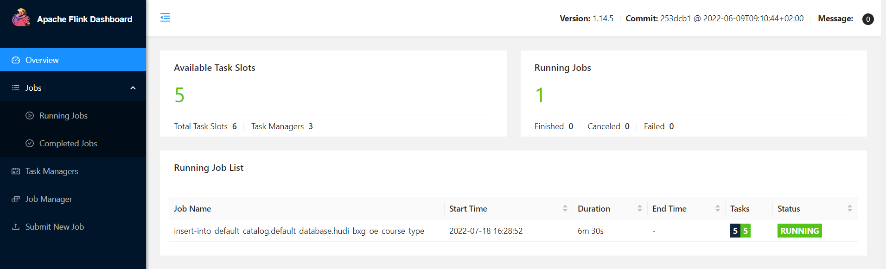

-   查看hdfs文件系统，hudi文件夹下生成名为bxg\_oe\_course\_type的文件夹。地址：<http://192.168.88.161:9870/explorer.html#/hudi>

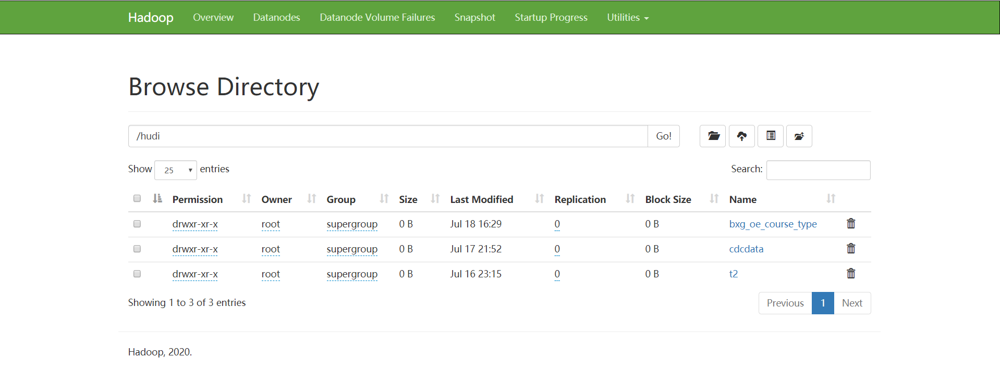

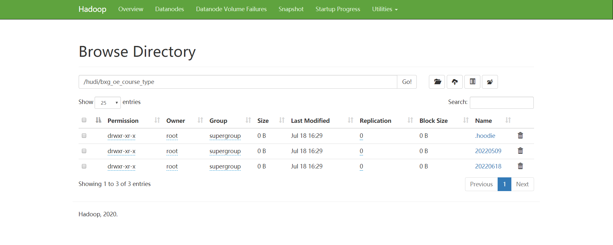

-   可以通过hive查看文件具体内容：

    -   Hive连接配置：

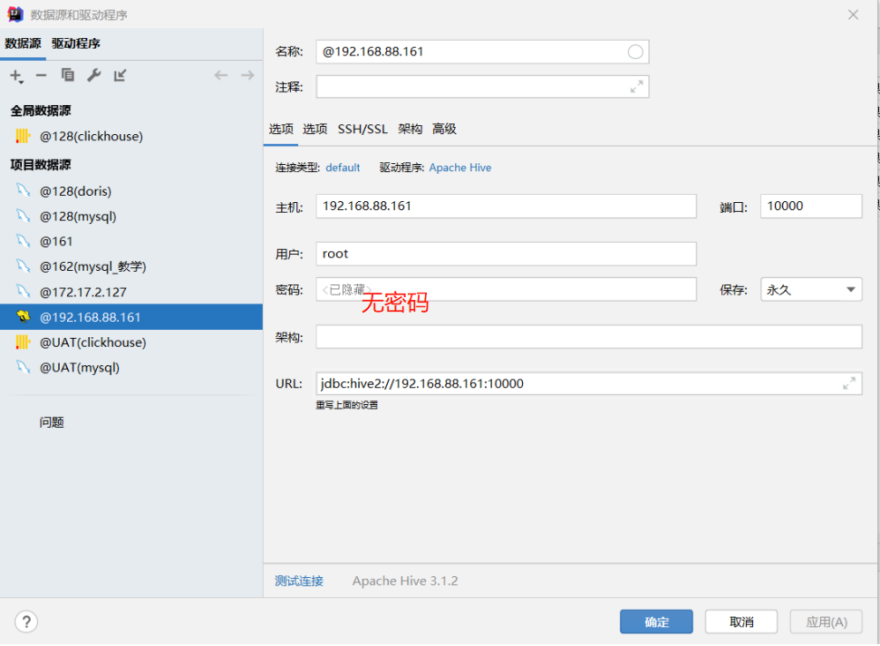

-   查看hive表，发现bxg数据库中多了bxg\_oe\_course\_type\_ro，bxg\_oe\_course\_type\_rt两张表。表中包括之前数据，另外增加几个与hudi有关的字段及数据，如下图。

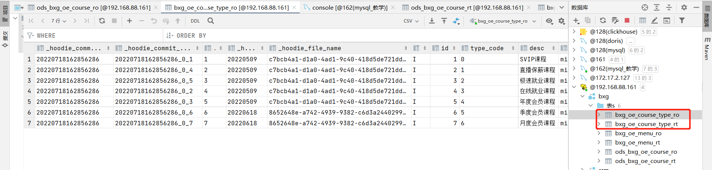

-   对于mor类型的Hudi源表,如果表名为hudimor，映射为两张Hive外部表即为hudimor\_ro（ro表）和hudimor\_rt（rt表）。ro表是历史数据（compact策略触发后能查询到的数据），rt表是实时数据。

-   rt表支持快照查询和增量查询，查询rt表将会查询表基本列数据和增量日志数据的合并视图，立马可以查询到修改后的数据。而ro表则只查询表中基本列数据并不会去查询增量日志里的数据。rt表采用HoodieParquetRealtimeInputFormat格式进行存储，ro表采用HoodieParquetInputFormat格式进行存储。

## 相关面试题

##### 1. 什么是数据湖？

- 数据湖（Data Lake）和数据库、数据仓库一样，都是数据存储的设计模式，现在企业的数据仓库都会通过**分层的方式**将数据存储在文件夹、文件中。
- 数据湖是一个**集中式**数据存储库，用来存储**大量的原始数据**，使用**平面架构**来存储数据。
- 定义：一个以原始格式（通常是对象块或文件）存储数据的系统或存储库，通常是所有企业数据的单一存储。
- 数据湖可以包括来自关系数据库的结构化数据（行和列）、半结构化数据（CSV、日志、XML、JSON）、非结构化数据（电子邮件、文档、pdf）和二进制数据（图像、音频、视频）。
- 数据湖越来越多的用于描述任何的大型数据池，数据都是以原始数据方式存储，知道需要查询应用数据的时候才会开始分析数据需求和应用架构。
- 数据湖中数据，用于报告、可视化、高级分析和机器学习等任务。

##### **2、数据仓库与数据湖有哪些区别？**

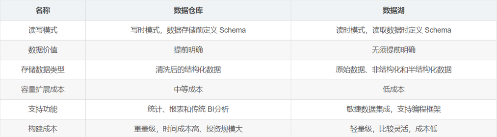

- 存储数据类型
  - 数据仓库是存储数据，进行建模，存储的是结构化数据；数据湖以其本源格式保存大量原始数据，包括结构化的、半结构化的和非结构化的数据，主要是由原始的、混乱的、非结构化的数据组成。在需要数据之前，没有定义数据结构和需求。
- 数据处理模式
  - 在我们可以加载到数据仓库中的数据，我们首先需要定义好它，这叫做写时模式（Schema-On-Write）。而对于数据湖，只需加载原始数据，然后，当准备使用数据时，就给它一个定义，这叫做读时模式（Schema-On-Read）。这是两种截然不同的数据处理方法。因为数据湖是在数据使用时再定义模型结构，因此提高了数据模型定义的灵活性，可满足更多不同上层业务的高效率分析诉求。

##### **3、hudi是什么，有哪些功能？**

Hudi（Hadoop Upserts Deletes and Incrementals缩写）：**用于管理分布式文件系统DFS上大型分析数据集存储**。一言以蔽之，Hudi是一种针**对分析型业务的、扫描优化的数据存储抽象**，它能够使DFS数据集在分钟级的时延内支持变更，也支持下游系统对这个数据集的增量处理。

功能：

- Hudi是在大数据存储上的一个数据集，**可以将Change Logs通过upsert的方式合并进Hudi**；
- Hudi对上可以暴露成一个**普通Hive**或**Spark表**，通过API或命令行可以获取到增量修改的信息，继续供下游消费； 
- Hudi保管**修改历史，可以做时间旅行或回退**；
- Hudi内部有**主键到文件级的索引**，默认是**记录到文件的布隆过滤器**；

##### 4. Hudi是分析型数据库吗？

- 典型的数据库有一些长时间运行的服务器，以便提供读写服务。Hudi的体系结构与之不同，它高度解耦读写，为对应扩容挑战可以独立扩展写入和查询/读取。因此，它可能并不总是像数据库一样。
- 尽管如此，Hudi的设计非常像数据库，并提供类似的功能（更新，更改捕获）和语义（事务性写入，快照隔离读取）。

##### 5. 什么是增量处理？

- 增量处理是由Vinoth Chandar在O'reilly博客中首次引入的，博客中阐述了大部分工作。用纯粹的技术术语来说，增量处理仅是指以流处理方式编写微型批处理程序。典型的批处理作业每隔几个小时就会消费所有输入并重新计算所有输出。典型的流处理作业会连续/每隔几秒钟消费一些新的输入并重新计算新的/更改以输出。尽管以批处理方式重新计算所有输出可能会更简单，但这很浪费并且耗费昂贵的资源。Hudi具有以流方式编写相同批处理管道的能力，每隔几分钟运行一次。
- 虽然可将其称为流处理，但我们更愿意称其为增量处理，以区别于使用Apache Flink，Apache Apex或Apache Kafka Streams构建的纯流处理管道。

##### 6. hudi支持哪些表类型？

写时复制（Copy on Write，COW）表和读时合并（Merge On Read，MOR）表

- Copy On Write：仅使用列文件格式（例如parquet）存储数据。通过在写入过程中执行同步合并以更新版本并重写文件。用户的update会重写数据所在的文件，所以是一个写放大很高，但是读放大为 0，适合写少读多的场景。
- Merge On Read：使用列式（例如parquet）+ 基于行（例如avro）的文件格式组合来存储数据。更新记录到增量文件中，然后进行同步或异步压缩以生成列文件的新版本。整体的结构有点像LSM-Tree，用户的写入先写入到delta data中，这部分数据使用行存，这部分delta data可以手动 merge 到存量文件中，整理为parquet的列存结构。

##### 7. 如何选择存储类型？

Hudi的主要目标是提供更新功能，该功能比重写整个表或分区要快几个数量级。如果满足以下条件，则选择写时复制（COW）存储：

- 寻找一种简单的替换现有的parquet表的方法，而无需实时数据。
- 当前的工作流是重写整个表/分区以处理更新，而每个分区中实际上只有几个文件发生更改。
- 想使操作更为简单（无需压缩等），并且摄取/写入性能仅受parquet文件大小以及受更新影响文件数量限制
- 工作流很简单，并且不会突然爆发大量更新或插入到较旧的分区。COW写入时付出了合并成本，因此，这些突然的更改可能会阻塞摄取，并干扰正常摄取延迟目标。

如果满足以下条件，则选择读时合并（MOR）存储：

- 希望数据尽快被摄取并尽可能快地可被查询。
- 工作负载可能会突然出现模式的峰值/变化（例如，对上游数据库中较旧事务的批量更新导致对DFS上旧分区的大量更新）。异步压缩（Compaction）有助于缓解由这种情况引起的写放大，而正常的提取则需跟上上游流的变化。

不管选择何种存储，Hudi都将提供：

- 快照隔离和原子写入批量记录
- 增量拉取
- 重复数据删除能力

##### 8. Hudi支持哪些查询类型？

hudi支持三种不同的查询表的方式：Snapshot Queries、Incremental Queries和Read Optimized Queries。

- Snapshot Queries（快照查询）
  - n  查询某个增量提交操作中数据集的最新快照，先进行动态合并最新的基本文件(parquet)和增量文件(log)来提供近实时数据集（通常会存在几分钟的延迟）。即读取所有partiiton下每个FileGroup最新的FileSlice中的文件，Copy On Write表读parquet文件，Merge On Read表读parquet+log文件。
- Incremental Queries（增量查询）
  - 仅查询新写入数据集的文件，需要指定一个Commit/Compaction的即时时间（位于Timeline上的某个Instant）作为条件，来查询此条件之后的新数据。这有效的提供变更流来启用增量数据管道。
- Read Optimized Queries（读优化查询）
  - 直接查询基本文件（数据集的最新快照），其实就是列式文件（Parquet）。并保证与非Hudi列式数据集相比，具有相同的列式查询性能。
  - 也可查看给定的commit/compact即时操作的表的最新快照。
  - 读优化查询和快照查询相同仅访问基本文件，提供给定文件片自上次执行压缩操作以来的数据。通常查询数据的最新程度的保证取决于压缩策略。

##### 9. Hudi索引是什么？

- Hudi通过索引机制将给定的hoodie键（**RecordKey**记录键**+PartitionPath**分区路径）一致地映射到文件id，从而提供高效的upsert。记录键和文件id之间的这种映射，一旦记录的第一个版本被写入文件，就永远不会改变。简而言之，映射文件组包含一组记录的所有版本。

- 对于Copy-On-Write表，可以实现快速upsert/delete操作，避免需要连接整个数据集以确定要重写哪些文件。对于Merge-On-Read表，这种设计允许Hudi绑定任何给定基本文件需要合并的记录数量。具体来说，给定的基本文件只需要针对作为该基本文件一部分的记录的更新进行合并。相反，没有索引组件的设计最终必须将所有基本文件与所有传入的更新/删除记录合并。

- 目前，hudi支持以下索引选项,可以使用hoodie.index.type选择这些选项。

  - Bloom Index（**默认**）：使用由记录键构建的Bloom过滤器，还可以选择使用记录键范围修改候选文件。

  - 简单索引：针对从存储表中提取的键执行传入更新/删除记录的精益连接。

  - HBase索引：管理外部 Apache HBase 表中的索引映射。

  - 自带实现：可以扩展此公共API以实现自定义索引。

    Bloom Index和简单索引都有全局选项：**hoodie.index.type=GLOBAL_BLOOM**和**hoodie.index.type=GLOBAL_SIMPLE**。HBase索引本质上是一个全局索引。

- 全局索引和非全局索引之间的区别：

  - 全局索引：**全局索引在表的所有分区中强制执行键的唯一性**，即保证表中对于给定的记录键只存在一条记录。全局索引提供了更强的保证，但更新/删除成本随着表的大小而增长，所以更适合小表。
  - 非全局索引：**仅在表的某一个分区内强制要求键保持唯一**，它依赖于写入器在更新/删除期间为给定的记录键提供相同的一致分区路径。但因为索引查找操作可以很好地随写入量而扩展，所以也可以提供更好的性能。

##### 10. 如何避免创建大量小文件

- Hudi的一项关键设计是避免创建小文件，并且始终写入适当大小的文件，其会在摄取/写入上花费更多时间以保持查询的高效。写入非常小的文件然后进行合并的方法只能解决小文件带来的系统可伸缩性问题，其无论如何都会因为小文件而降低查询速度。
- 执行插入更新/插入操作时，Hudi可以配置文件大小。（注意：bulk_insert操作不提供此功能，其设计为用来替代 `spark.write.parquet`。）
- 对于写时复制，可以配置基本/parquet文件的最大大小和软限制。小于限制的为小文件，Hudi将在写入时会尝试将足够的记录添加到一个小文件中，以使其达到配置的最大限制。例如，对于 `compactionSmallFileSize=100MB`和 `limitFileSize=120MB`，Hudi将选择所有小于100MB的文件，并尝试将其增加到120MB。
- 对于读时合并，几乎没有其他配置。可以配置最大日志大小和一个因子，该因子表示当数据从avro转化到parquet文件时大小减小量。
- HUDI将较小的文件组合并成较大的文件组，从而提升提升性能。