# 博学谷大数据平台_Doris

## **课程目标**

- 了解Doris组件核心特点以及应用场景
- 理解Doris组件原理、整体架构及数据分发
- 熟悉Doris基本使用方法
- 掌握Doris三种数据模型的使用
- 掌握Doris 4种主要的数据导入方式
- 理解Doris索引和Rollup
- 掌握Doris物化视图以及动态分区
- 熟悉Flink to Doris 案例

## **Doris概述**

Doris由百度大数据部研发，之前叫**百度Palo**，于2017年开源，2018年贡献到 Apache 社区后，更名为Doris。

### 知识点01： 【了解】**Doris**简介

- Apache Doris是一个现代化的基于MPP（Massively Parallel Processing 大规模并行处理）技术的分析型数据库产品。**简单来说，MPP是将任务并行的分散到多个服务器和节点上，在每个节点上计算完成后，将各自部分的结果汇总在一起得到最终的结果(与Hadoop相似)**。仅需亚秒级响应时间即可获得查询结果，有效地支持实时数据分析。

- Apache Doris可以满足多种数据分析需求，例如**固定历史报表，实时数据分析，交互式数据分析和探索式数据分析**等。令您的数据分析工作更加简单高效！


> MPP ( Massively Parallel Processing )，即大规模并行处理，在数据库非共享集群中，每个节点都有独立的磁盘存储系统和内存系统，业务数据根据数据库模型和应用特点划分到各个节点上，每台数据节点通过专用网络或者商业通用网络互相连接，彼此协同计算，作为整体提供数据库服务。非共享数据库集群有完全的可伸缩性、高可用、高性能、优秀的性价比、资源共享等优势。简单来说，MPP 是将任务并行的分散到多个服务器和节点上，在每个节点上计算完成后，将各自部分的结果汇总在一起得到最终的结果 ( 与 Hadoop 相似 )。

### 知识点02： 【理解】Doris核心特性

- 基于MPP（大规模并行处理）架构的分析型数据库
- 性能卓越，PB级别数据毫秒/秒级响应
- 支持标准SQL语言，兼容MySQL协议
- 向量化执行器
- 高效的聚合表技术
- 新型预聚合技术Rollup
- 高性能、高可用、高可靠
- 极简运维，弹性伸缩

### 知识点03： 【理解】Doris特点

+ 性能卓越

TPC-H、TPC-DS性能领先，性价比高，高并发查询，100台集群可达**10w QPS**，流式导入单节点**50MB/s**，小批量导入毫秒延迟

+ 简单易用

高度兼容MySql协议；支持在线表结构变更高度集成，不依赖于外部存储系统

+ 扩展性强

架构优雅，系统只有两个Frontend（FE）和Backend（BE）两个模块。同时，任一模块都可以支持横向拓展，单集群可以水平扩展至200台以上

+ 高可用性

多副本，元数据高可用

+ 生态丰富

提供丰富的数据同步方式

### 知识点04： 【了解】Doris发展历程


### 知识点05： 【理解】对比其他的数据分析框架

#### **OLTP 、OLAP与HTAP**

- **OLTP**

  OLTP（Online Transaction Processing 联机事务处理）的查询一般只会访问少量的记录，且大多时候都会利用索引。比如最常见的基于主键的 CRUD 操作。

- **OLAP**

  OLAP（OnLine Analytical Processing 联机分析处理）的查询一般需要 Scan 大量数据，大多时候只访问部分列，聚合的需求（Sum，Count，Max，Min 等）会多于明细的需求（查询原始的明细数据）。

- **HTAP**

  HTAP（Hybrid Transactional 混合事务/Analytical Processing 分析处理）基于创新的计算存储框架，HTAP 数据库能够在一份数据上同时支撑业务系统运行和 OLAP 场景，避免在传统架构中，在线与离线数据库之间大量的数据交互。此外，HTAP 基于分布式架构，支持弹性扩容，可按需扩展吞吐或存储，轻松应对高并发、海量数据场景。

  目前，实现 HTAP 的数据库不多，主要有 PingCAP 的 TiDB、阿里云的 HybridDB for MySQL、百度的 BaikalDB 等。其中，TiDB 是国内首家开源的 HTAP 分布式数据库。


#### OLAP分类

OLAP按存储器的数据存储格式分为MOLAP（Multi-dimensional OLAP） 、ROLAP（Relational OLAP）和 HOLAP（Hybrid OLAP）。

- **MOLAP**：通过预计算，提供稳定的切片数据，实现多次查询一次计算，减轻了查询时的计算压力，保证了查询的稳定性，是“**空间换时间**”的最佳路径。实现了基于Bitmap的去重算法，支持在不同维度下去重指标的实时统计，效率较高。
- **ROLAP**：基于实时的大规模并行计算，对集群的要求较高。MPP引擎的核心是通过将数据分散，以实现CPU、IO、内存资源的分布，来提升并行计算能力。在当前数据存储以磁盘为主的情况下，数据Scan需要的较大的磁盘IO，以及并行导致的高CPU，仍然是资源的短板。因此，高频的大规模汇总统计，并发能力将面临较大挑战，这取决于集群硬件方面的并行计算能力。传统去重算法需要大量计算资源，实时的大规模去重指标对CPU、内存都是一个巨大挑战。目前Doris最新版本已经支持Bitmap算法，配合预计算可以很好地解决去重应用场景。

#### **开源OLAP引擎对比**

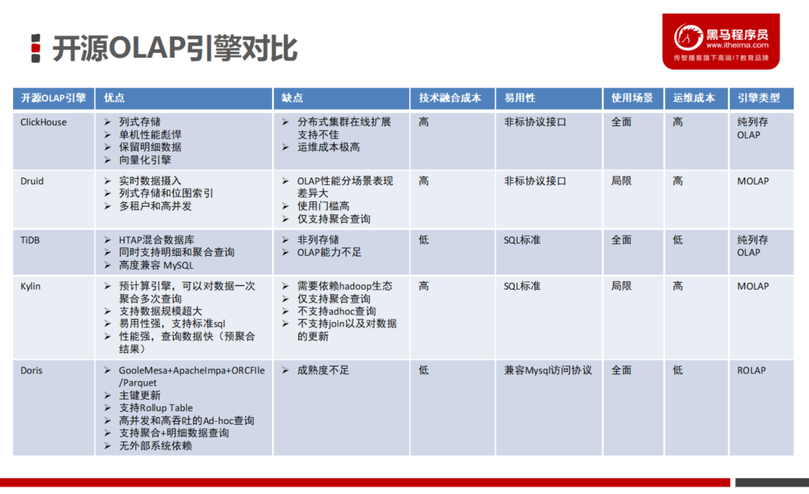

MOLAP模式的劣势（**以Kylin为例**）

- 应用层模型复杂，根据业务需要以及Kylin生产需要，还要做较多模型预处理。这样在不同的业务场景中，模型的利用率也比较低。

- 由于MOLAP不支持明细数据的查询，在“汇总+明细”的应用场景中，明细数据需要同步到DBMS引擎来响应交互，增加了生产的运维成本。

- 较多的预处理伴随着较高的生产成本。


ROLAP模式的优势

- 应用层模型设计简化，将数据固定在一个稳定的数据粒度即可。比如商家粒度的星形模型，同时复用率也比较高。

- App层的业务表达可以通过视图进行封装，减少了数据冗余，同时提高了应用的灵活性，降低了运维成本。

- 同时支持“**汇总+明细**”。

- 模型轻量标准化，极大的降低了生产成本。


Doris是一个**ROLAP引擎**, 可以满足以下需求

- 灵活多维分析

- 明细+聚合

- 主键更新


> 综上所述，在变化维、非预设维、细粒度统计的应用场景下，使用MPP引擎驱动的ROLAP模式，可以简化模型设计，减少预计算的代价，并通过强大的实时计算能力，可以支撑良好的实时交互体验。
>

**总结：**

- 数据压缩率Clickhouse好

- ClickHouse单表查询性能优势巨大

- Join查询两者各有优劣，数据量小情况下Clickhouse好，数据量大Doris好

- Doris对SQL支持情况要好


### **知识点06： 【了解】使用场景**和用户

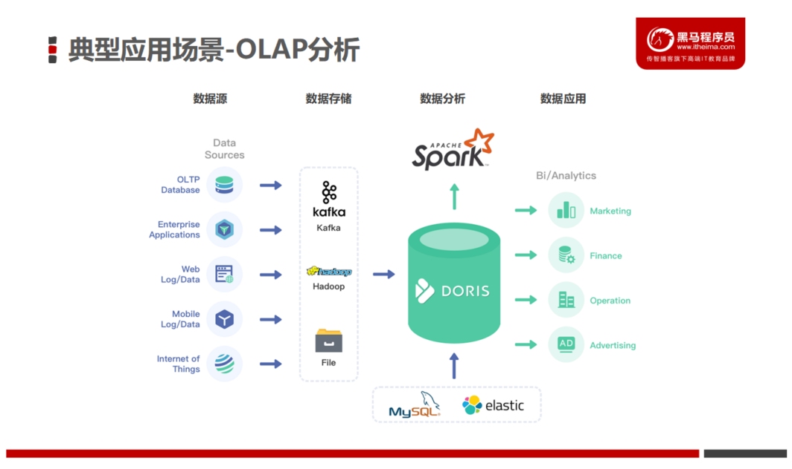

- 上图是整个Doris的具体使用场景，主要是它的接收数据源，以及它的一个整体的模块，还有最后它的一个可视化的呈现。后面会有一张更详细的图去介绍它整个的来源，以及最后可以输出的数据流向。

- 一般情况下，用户的原始数据，比如日志或者在事务型数据库中的数据，经过流式系统或离线处理后，导入到Doris中以供上层的报表工具或者数据分析师查询使用。


## Doris原理

### 知识点07： 【掌握】**名称解释**

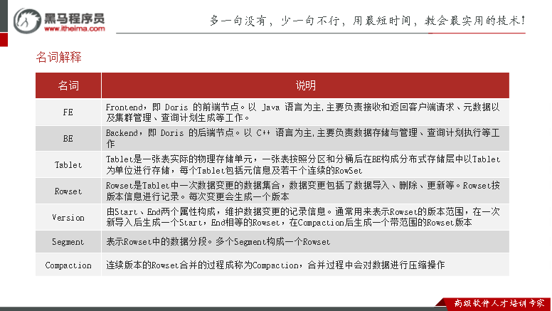

### 知识点08： 【理解】**整体架构**

Doris主要整合了**Google Mesa（数据模型），Apache Impala（MPP Query Engine)和Apache ORCFile (存储格式，编码和压缩)** 的技术。

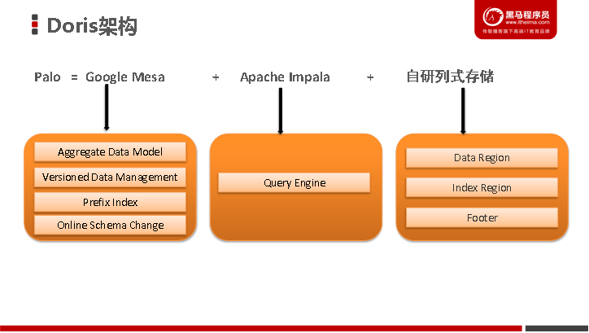

为什么要将这三种技术整合？

- Mesa可以满足我们许多存储的需求，但是Mesa本身不提供SQL查询引擎。

- Impala是一个非常好的MPP SQL查询引擎，但是缺少完美的分布式存储引擎。

- 自研列式存储：存储层对存储数据的管理通过storage_root_path路径进行配置，路径可以是多个。存储目录下一层按照分桶进行组织，分桶目录下存放具体的tablet，按照tablet_id命名子目录。


因此选择了这三种技术的组合。

Doris的系统架构如下，Doris主要分为FE和BE两个组件：

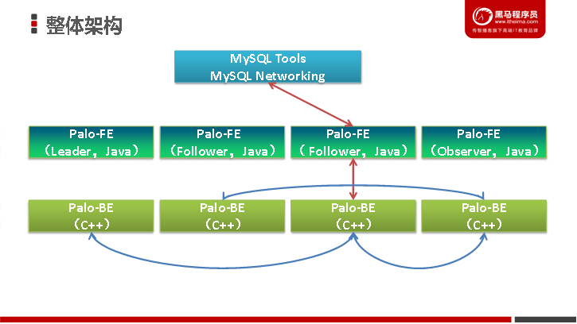

- Doris的架构很简洁，使用MySQL协议，用户可以使用任何MySQL ODBC/JDBC和MySQL客户端直接访问Doris，只设**FE(Frontend)、BE(Backend)**两种角色、两个进程，不依赖于外部组件，方便部署和运维。
  - FE：Frontend，即 Doris 的前端节点。主要负责接收和返回客户端请求、元数据以及集群管理、查询计划生成等工作
  - BE：Backend，即 Doris 的后端节点。主要负责数据存储与管理、查询计划执行等工作。
  - FE，BE都可线性扩展
- FE主要有两个角色，一个是follower，另一个是observer。多个follower组成选举组，会选出一个master，**master是follower的一个特例**，Master跟follower，主要是用来达到元数据的高可用，保证单节点宕机的情况下，元数据能够实时地在线恢复，而不影响整个服务。

- Observer节点仅从 leader 节点进行元数据同步，不参与选举。可以横向扩展以提供元数据的读服务的扩展性。

- 数据的可靠性由BE保证，BE会对整个数据存储多副本或者是三副本。副本数可根据需求动态调整。 


### 知识点09： 【掌握】**元数据结构**

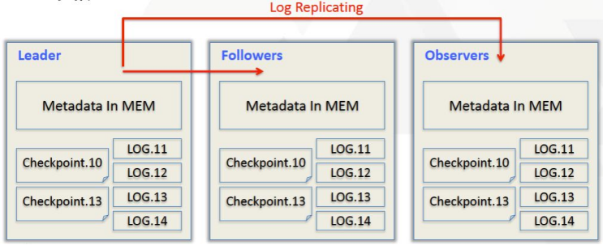

Doris采用 “Paxos协议以及Memory+ Checkpoint + Journal” 的机制来确保元数据的高性能及高可靠。元数据的每次更新，都会遵照以下几步：

1. 首先写入到磁盘的日志文件中

2. 然后再写到内存中

3. 最后定期checkpoint到本地磁盘上


相当于是一个纯内存的一个结构，也就是说所有的元数据都会缓存在内存之中，从而保证FE在宕机后能够快速恢复元数据，而且不丢失元数据。

Leader、follower和 observer它们三个构成一个可靠的服务，如果发生节点宕机的情况，一般是部署一个leader两个follower，目前来说基本上也是这么部署的。就是说三个节点去达到一个高可用服务。单机的节点故障的时候其实基本上三个就够了，因为FE节点毕竟它只存了一份元数据，它的压力不大，所以如果FE太多的时候它会去消耗机器资源，所以多数情况下三个就足够了，可以达到一个很高可用的元数据服务。

### 知识点10： 【理解】数据分发

 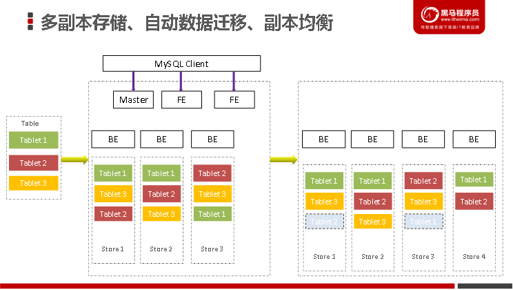

- 数据主要都是存储在BE里面，BE节点上物理数据的可靠性通过多副本来实现，默认是3副本，副本数可配置且可随时动态调整,满足不同可用性级别的业务需求。FE调度BE上副本的分布与补齐。

- 如果说用户对可用性要求不高，而对资源的消耗比较敏感的话，我们可以在建表的时候选择建两副本或者一副本。比如在百度云上我们给用户建表的时候，有些用户对它的整个资源消耗比较敏感，因为他要付费，所以他可能会建两副本。但是我们一般不太建议用户建一副本，因为一副本的情况下可能一旦机器出问题了，数据直接就丢了，很难再恢复。一般是默认建三副本，这样基本可以保证一台机器单机节点宕机的情况下不会影响整个服务的正常运作。


## **Doris实践**

Doris 采用 MySQL 协议进行通信，用户可通过 MySQL client 或者 MySQL JDBC连接到 Doris 集群。选择 MySQL client 版本时建议采用5.1 之后的版本，因为 5.1 之前不能支持长度超过 16 个字符的用户名。

### 知识点11： 【掌握】**资源规划**

| **node1**    | **node2**      | **node3**      |
| ------------ | -------------- | -------------- |
| FE（Leader） | FE（Follower） | FE（OBSERVER） |
| BE           | BE             | BE             |
| BROKER       | BROKER         | BROKER         |

**注意点：**

> 因测试环境资源有限，FE和BE节点部署在相同服务器，生产环境建议分开
>

### 知识点12： 【掌握】**相关命令**

#### 启动

| 启动FE     | node1   | /export/server/doris/fe/bin/start_fe.sh --daemon             |
| ---------- | ------- | ------------------------------------------------------------ |
|            | node23  | /export/server/doris/fe/bin/start_fe.sh --helper node1:9010 --daemon |
| 启动BE     | node123 | /export/server/doris/be/bin/start_be.sh --daemon             |
| 启动BROKER | node123 | /export/server/doris/apache_hdfs_broker/bin/start_broker.sh --daemon |

#### **进入Mysql**

`mysql -uroot -p -h node1 -P9030`

#### **查看状态（在mysql中执行）**

| 查看FE     | SHOW PROC '/frontends'\G; |
| ---------- | ------------------------- |
| 查看BE     | SHOW PROC '/backends'\G;  |
| 查看BROKER | SHOW PROC '/brokers';     |

### 知识点13： 【掌握】准备操作

#### **用户登入及密码修改**

Doris 内置 root 和 admin 用户，密码默认都为空。启动完 Doris 程序之后，可以通过 root 或 admin 用户连接到 Doris 集群。 

使用下面命令即可登录 Doris：

`mysql -h node1 -P9030 -uroot`

登陆后，可以通过以下命令修改 root 密码

**`SET** PASSWORD **FOR** 'root' **=** PASSWORD**(**'123456'**);`**

#### **创建新用户**

通过下面的命令创建一个普通用户

**`CREATE** **USER** 'test' **IDENTIFIED** **BY** 'test_passwd'**;`**

后续登录时就可以通过下列连接命令登录。

`mysql -h node1 -P9030 -utest -ptest_passwd`

**注意：**

> 新创建的普通用户默认没有任何权限。权限授予可以参考后面的权限授予。
>

#### **创建数据库并赋予权限**

+ 创建数据库

初始可以通过 root 或 admin 用户创建数据库：

**`CREATE** DATABASE test_db**;`**

**注意：**

> 所有命令都可以使用 'HELP command;' 查看到详细的语法帮助。如：HELP CREATE DATABASE;
>
> 如果不清楚命令的全名，可以使用 "help 命令某一字段" 进行模糊查询。如键入 'HELP CREATE'，可以匹配到 CREATE DATABASE, CREATE TABLE, CREATE USER 等命令。
>
> 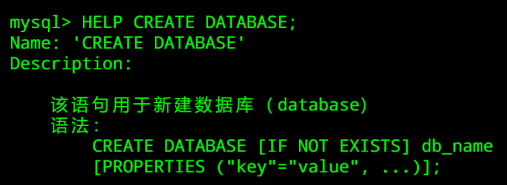
>

数据库创建完成之后，可以通过 SHOW DATABASES; 查看数据库信息。

| show databases;                                              |
| ------------------------------------------------------------ |
| 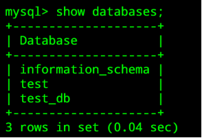 |

information_schema是为了兼容MySQL协议而存在，实际中信息可能不是很准确，所以关于具体数据库的信息建议通过直接查询相应数据库而获得。

+ 权限赋予

test_db 创建完成之后，可以通过 root/admin 账户将 test_db 读写权限授权给普通账户，如 test。授权之后采用 test 账户登录就可以操作 test_db 数据库了。

```sql
GRANT ALL ON test_db TO test;
```

### 知识点14： 【掌握】Doris 建表（Create Table）

#### **建表**语法

首先切换数据库:

`USE test_db;`

Doris 的建表是一个同步命令，命令返回成功，即表示建表成功。

```sql
CREATE TABLE test_table
(
    event_day DATE,
    siteid INT DEFAULT '10',
    citycode SMALLINT,
    username VARCHAR(32) DEFAULT '',
    pv BIGINT SUM DEFAULT '0'
)
AGGREGATE KEY(event_day, siteid, citycode, username)
PARTITION BY RANGE(event_day)
(
    PARTITION p201706 VALUES LESS THAN ('2017-07-01'),
    PARTITION p201707 VALUES LESS THAN ('2017-08-01'),
    PARTITION p201708 VALUES LESS THAN ('2017-09-01')
)
DISTRIBUTED BY HASH(siteid) BUCKETS 10
PROPERTIES("replication_num" = "1");
```

可以通过 **HELP CREATE TABLE;** 查看更多帮助。

`HELP CREATE TABLE;`

#### **字段类型**

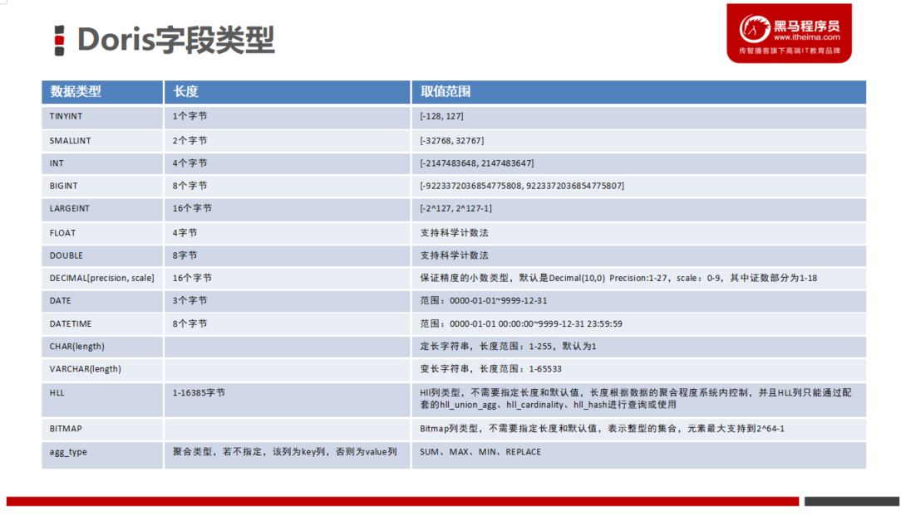

##### **TINYINT数据类型**

- 长度: 长度为1个字节的有符号整型。

- 范围: [-128, 127]

- 转换: Doris可以自动将该类型转换成更大的整型或者浮点类型。使用CAST()函数可以将其转换成CHAR。

- 举例:


| select cast**(100 as** char);                                |
| ------------------------------------------------------------ |
| 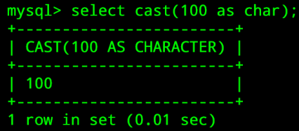 |

##### **SMALLINT数据类型**

- 长度: 长度为2个字节的有符号整型。

- 范围: [-32768, 32767]

- 转换: Doris可以自动将该类型转换成更大的整型或者浮点类型。使用CAST()函数可以将其转换成TINYINT，CHAR。

- 举例:


| select cast(10000 aschar);                                   |
| ------------------------------------------------------------ |
| 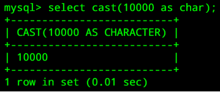 |
| select cast(10000 as tinyint);                               |
| 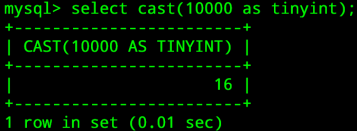 |

##### **INT数据类型**

- 长度: 长度为4个字节的有符号整型。

- 范围: [-2147483648, 2147483647]

- 转换: Doris可以自动将该类型转换成更大的整型或者浮点类型。使用CAST()函数可以将其转换成TINYINT，SMALLINT，CHAR

- 举例:


| select cast(111111111  as char);                             |
| ------------------------------------------------------------ |
| 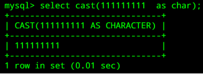 |

##### **BIGINT数据类型**

- 长度: 长度为8个字节的有符号整型。

- 范围: [-9223372036854775808, 9223372036854775807]

- 转换: Doris可以自动将该类型转换成更大的整型或者浮点类型。使用CAST()函数可以将其转换成TINYINT，SMALLINT，INT，CHAR

- 举例:


| **select** **cast**(**9223372036854775807 **as **char**);    |
| ------------------------------------------------------------ |
| 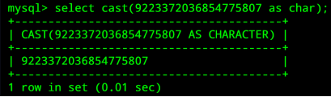 |

##### **LARGEINT数据类型**

- 长度: 长度为16个字节的有符号整型。

- 范围: [-2^127, 2^127-1]

- 转换: Doris可以自动将该类型转换成浮点类型。使用CAST()函数可以将其转换成TINYINT，SMALLINT，INT，BIGINT，CHAR

- 举例:


| **select** **cast**(**922337203685477582342342 **as **double**); |
| ------------------------------------------------------------ |
| 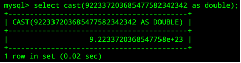 |

##### **FLOAT数据类型**

- 长度: 长度为4字节的浮点类型。

- 范围: -3.40E+38 ~ +3.40E+38。

- 转换: Doris会自动将FLOAT类型转换成DOUBLE类型。用户可以使用CAST()将其转换成TINYINT, SMALLINT, INT, BIGINT, STRING, TIMESTAMP。


##### **DOUBLE数据类型**

- 长度: 长度为8字节的浮点类型。

- 范围: -1.79E+308 ~ +1.79E+308。

- 转换: Doris不会自动将DOUBLE类型转换成其他类型。用户可以使用CAST()将其转换成TINYINT, SMALLINT, INT, BIGINT, STRING, TIMESTAMP。用户可以使用指数符号来描述DOUBLE 类型，或通过STRING转换获得。


##### **DECIMAL数据类型**

- 语法：DECIMAL[M, D]

- 保证精度的小数类型。M代表一共有多少个有效数字，D代表小数点后最多有多少数字。M的范围是[1,27]，D的范围是[1,9]，另外，M必须要大于等于D的取值。默认取值为decimal[10,0]。

- precision: 1 ~ 27

- scale: 0 ~ 9


##### **DATE数据类型**

+ 范围: [0000-01-01~9999-12-31]。默认的打印形式是’YYYY-MM-DD’。

##### **DATETIME数据类型**

+ 范围: [0000-01-01 00:00:00~9999-12-31 23:59:59]。默认的打印形式是’YYYY-MM-DD HH:MM:SS’。

##### **CHAR数据类型**

- 范围: char[(length)]，定长字符串，长度length范围1~255，默认为1。

- 转换：用户可以通过CAST函数将CHAR类型转换成TINYINT,，SMALLINT，INT，BIGINT，LARGEINT，DOUBLE，DATE或者DATETIME类型。

- 示例：


| **select** **cast(1234 **as **bigint**);                     |
| ------------------------------------------------------------ |
| 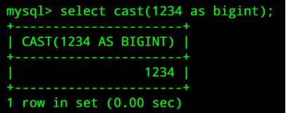 |

##### **VARCHAR数据类型**

- 范围: char(length)，变长字符串，长度length范围1~65535。

- 转换：用户可以通过CAST函数将CHAR类型转换成TINYINT,，SMALLINT，INT，BIGINT，LARGEINT，DOUBLE，DATE或者DATETIME类型。

- 示例：


| **select** **cast**(**'2011-01-01' **as **date**);           |
| ------------------------------------------------------------ |
| 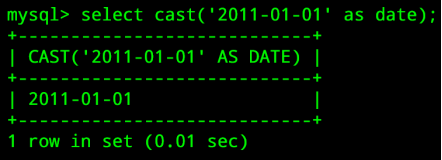 |
| **select** **cast**(**'2011-01-01' **as **datetime**);       |
| 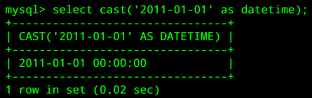 |
| **select** **cast**(**3423 **as **bigint**);                 |
| 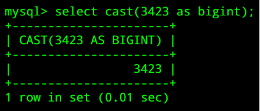 |

##### **HLL数据类型**

+ 范围：char(length),长度length范围1~16385。用户不需要指定长度和默认值、长度根据数据的聚合程度系统内控制，并且HLL列只能通过配套的hll_union_agg、hll_cardinality、hll_hash进行查询或使用

#### **数据划分**

##### **基本概念**

在 Doris 中，数据都以**表（Table）**的形式进行逻辑上的描述。

###### **Row & Column**

- 一张表包括行（Row）和列（Column）。Row 即用户的一行数据。Column 用于描述一行数据中不同的字段。

- Column 可以分为两大类：Key 和 Value。从业务角度看，Key 和 Value 可以分别对应维度列和指标列。注意：Key 列必须在所有 Value 列之前。

- 从聚合模型的角度来说，Key 列相同的行，会聚合成一行。其中 Value 列的聚合方式由用户在建表时指定。


###### **Tablet & Partition**

- 在 Doris 的存储引擎中，用户数据被水平划分为若干个数据分片（**Tablet**，也称作数据分桶）。每个 Tablet 包含若干数据行。各个 Tablet 之间的数据没有交集，并且在物理上是独立存储的。

- 多个 Tablet 在逻辑上归属于不同的分区（Partition）。一个 Tablet 只属于一个 Partition。而一个 Partition 包含若干个 Tablet。因为 Tablet 在物理上是独立存储的，所以可以视为 Partition 在物理上也是独立。Tablet 是数据移动、复制等操作的最小物理存储单元。

- 若干个 Partition 组成一个 Table。Partition 可以视为是逻辑上最小的管理单元。数据的导入与删除，都可以或仅能针对一个 Partition 进行。


##### **数据划分**

Doris 的建表是一个同步命令，SQL执行完成即返回结果，命令返回成功即表示建表成功。具体建表语法可以参考CREATE TABLE，也可以通过 HELP CREATE TABLE; 查看更多帮助。

下面以聚合模型为例，分别演示Partition分区的建表语句。

+ 建 Range Partition 分区表

```sql
CREATE TABLE IF NOT EXISTS example_db.expamle_tb1
(
    `user_id` LARGEINT NOT NULL COMMENT "用户id",
    `date` DATE NOT NULL COMMENT "数据灌入日期时间",
    `timestamp` DATETIME NOT NULL COMMENT "数据灌入的时间戳",
    `city` VARCHAR(20) COMMENT "用户所在城市",
    `age` SMALLINT COMMENT "用户年龄",
    `sex` TINYINT COMMENT "用户性别",
    `last_visit_date` DATETIME REPLACE DEFAULT "1970-01-01 00:00:00" 
	COMMENT "用户最后一次访问时间",
    `cost` BIGINT SUM DEFAULT "0" COMMENT "用户总消费",
    `max_dwell_time` INT MAX DEFAULT "0" COMMENT "用户最大停留时间",
    `min_dwell_time` INT MIN DEFAULT "99999" COMMENT "用户最小停留时间"
)
ENGINE=olap
AGGREGATE KEY(`user_id`, `date`, `timestamp`, `city`, `age`, `sex`)
PARTITION BY RANGE(`date`)
(
    PARTITION `p202001` VALUES LESS THAN ("2020-02-01"),
    PARTITION `p202002` VALUES LESS THAN ("2020-03-01"),
    PARTITION `p202003` VALUES LESS THAN ("2020-04-01")
)
DISTRIBUTED BY HASH(`user_id`) BUCKETS 16
PROPERTIES
(
    "replication_num" = "3"
);
show partitions from example_db.expamle_tb1;
```


+ 建 List Partition 分区表

```sql
CREATE TABLE IF NOT EXISTS example_db.expamle_list_tb2
(
    `user_id` LARGEINT NOT NULL COMMENT "用户id",
    `date` DATE NOT NULL COMMENT "数据灌入日期时间",
    `timestamp` DATETIME NOT NULL COMMENT "数据灌入的时间戳",
    `city` VARCHAR(20) NOT NULL COMMENT "用户所在城市",
    `age` SMALLINT COMMENT "用户年龄",
    `sex` TINYINT COMMENT "用户性别",
    `last_visit_date` DATETIME REPLACE DEFAULT "1970-01-01 00:00:00" 
	COMMENT "用户最后一次访问时间",
    `cost` BIGINT SUM DEFAULT "0" COMMENT "用户总消费",
    `max_dwell_time` INT MAX DEFAULT "0" COMMENT "用户最大停留时间",
    `min_dwell_time` INT MIN DEFAULT "99999" COMMENT "用户最小停留时间"
)
ENGINE=olap
AGGREGATE KEY(`user_id`, `date`, `timestamp`, `city`, `age`, `sex`)
PARTITION BY LIST(`city`)
(
    PARTITION `p_cn` VALUES IN ("Beijing", "Shanghai", "Hong Kong"),
    PARTITION `p_usa` VALUES IN ("New York", "San Francisco"),
    PARTITION `p_jp` VALUES IN ("Tokyo")
)
DISTRIBUTED BY HASH(`user_id`) BUCKETS 16
PROPERTIES
(
    "replication_num" = "3"
);
show partitions from example_db.expamle_list_tb2;
```

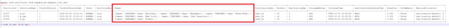

##### **列定义**

这里我们以 AGGREGATE KEY 数据模型为例进行说明。

列的基本类型，可以通过在 mysql-client 中执行 HELP CREATE TABLE; 查看。

AGGREGATE KEY 数据模型中，所有没有指定聚合方式（SUM、REPLACE、MAX、MIN）的列视为 Key 列。而其余则为 Value 列。

定义列时，可参照如下建议：

- Key 列必须在所有 Value 列之前。

- 尽量选择整型类型。因为整型类型的计算和查找效率远高于字符串。

- 对于不同长度的整型类型的选择原则，遵循 够用即可。

- 对于 VARCHAR 和 STRING 类型的长度，遵循够用即可。

- 所有列的总字节长度（包括 Key 和 Value）不能超过 100KB。


##### **分区和分桶**

Doris 支持两层的数据划分。第一层是 Partition，支持 Range 和 List 的划分方式。第二层是 Bucket（Tablet），仅支持 Hash 的划分方式。也可以仅使用一层分区。使用一层分区时，只支持 Bucket 划分。

###### **Partition**（分区）

- Partition 列可以指定一列或多列，分区列必须为 KEY 列。

- 不论分区列是什么类型，在写分区值时，都需要加**双引号**

- 分区数量理论上没有上限

- 当不使用 Partition 建表时，系统会自动生成一个和表名同名的，全值范围的 Partition。该Partition对用户不可见，并且不可删改。


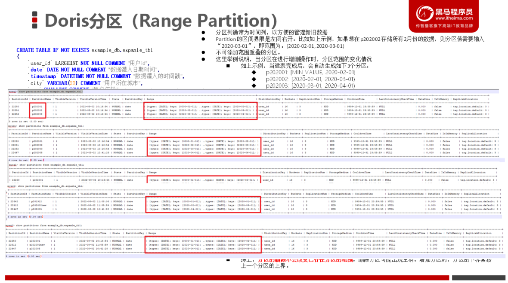

+ 查询分区

| show partitions from example_db.expamle_tb1;                 |
| ------------------------------------------------------------ |
| 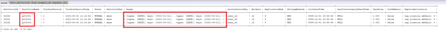 |

+ 增加分区

| 增加一个分区 p202005 VALUES LESS THAN (“2020-06-01”)         |
| ------------------------------------------------------------ |
| ALTER TABLE example_db.expamle_tb1 ADD PARTITION IF NOT EXISTS `p202005` VALUES LESS THAN ("2020-06-01"); |
| 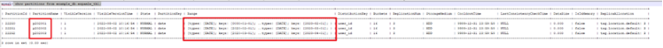 |

+ 删除分区

| 删除分区 p202003                                             |
| ------------------------------------------------------------ |
| ALTER TABLE example_db.expamle_tb1 DROP PARTITION IF EXISTS p202003; |
| 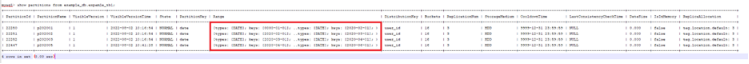 |
| 继续删除分区 p202002                                         |
| ALTER TABLE example_db.expamle_tb1 DROP PARTITION IF EXISTS p202002;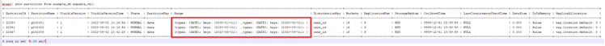 |
| 增加一个分区 p202002 new VALUES LESS THAN (“2020-03-01”)     |
| ALTER TABLE example_db.expamle_tb1 ADD PARTITION IF NOT EXISTS `p202002new` VALUES LESS THAN ("2020-03-01");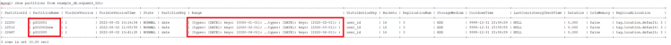 |
| 删除分区 p202001，并添加分区 p201912 VALUES LESS THAN (“2020-01-01”) |
| ALTER TABLE example_db.expamle_tb1 DROP PARTITION IF EXISTS p202001;ALTER TABLE example_db.expamle_tb1 ADD PARTITION IF NOT EXISTS `p201912` VALUES LESS THAN ("2020-01-01");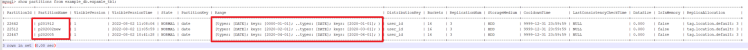 |

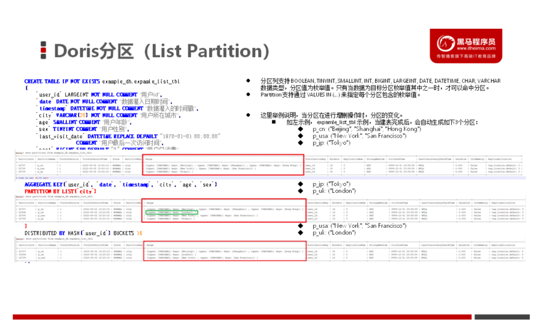

| show partitions from example_db.expamle_list_tb2;            |
| ------------------------------------------------------------ |
|  |
| 增加一个分区 p_uk VALUES IN ("London")                       |
| ALTER TABLE example_db.expamle_list_tb2 ADD PARTITION IF NOT EXISTS p_uk VALUES IN ("London"); |
| 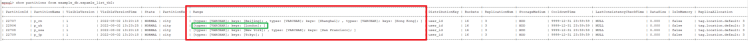 |
| 删除分区 p_jp                                                |
| ALTER TABLE example_db.expamle_list_tb2 DROP PARTITION IF EXISTS p_jp; |
| 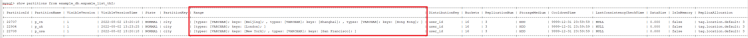 |

###### **Bucket**（分桶）

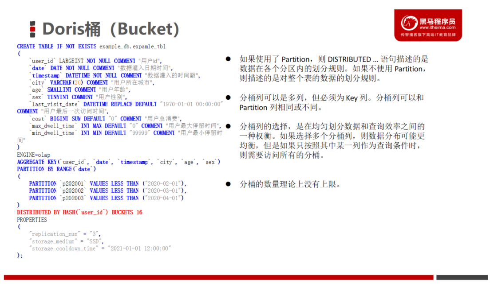

###### **关于 Partition 和 Bucket 的数量和数据量的建议**

- 一个表的 Tablet 总数量等于 (Partition num * Bucket num)。

- 一个表的 Tablet 数量，在不考虑扩容的情况下，推荐略多于整个集群的磁盘数量。

- 单个 Tablet 的数据量理论上没有上下界，但**建议在 1G - 10G 的范围内**。如果单个 Tablet 数据量过小，则数据的聚合效果不佳，且元数据管理压力大。如果数据量过大，则不利于副本的迁移、补齐，且会增加 Schema Change 或者 Rollup 操作失败重试的代价（这些操作失败重试的粒度是 Tablet）。

- 当 Tablet 的数据量原则和数量原则冲突时，建议优先考虑数据量原则。

- 在建表时，每个分区的 Bucket 数量统一指定。但是在动态增加分区时（ADD PARTITION），可以单独指定新分区的 Bucket 数量。可以利用这个功能方便的应对数据缩小或膨胀。

- 一个 Partition 的 Bucket 数量一旦指定，不可更改。所以在确定 Bucket 数量时，需要预先考虑集群扩容的情况。比如当前只有 3 台 host，每台 host 有 1 块盘。如果 Bucket 的数量只设置为 3 或更小，那么后期即使再增加机器，也不能提高并发度。

- 举一些例子：假设在有10台BE，每台BE一块磁盘的情况下。如果一个表总大小为 500MB，则可以考虑4-8个分片。5GB：8-16个。50GB：32个。500GB：建议分区，每个分区大小在 50GB 左右，每个分区16-32个分片。5TB：建议分区，每个分区大小在 50GB 左右，每个分区16-32个分片。


> 注：表的数据量可以通过 show data 命令查看，结果除以副本数，即表的数据量。
>

##### **演示单分区和复合分区**

**Doris 支持两层的数据划分。第一层是 Partition，支持 Range 和 List 的划分方式。第二层是 Bucket（Tablet），仅支持 Hash 的划分方式。**

**也可以仅使用一层分区，**即使用单分区。使用一层分区时，只支持**Bucket 划分。**

###### **单分区**

建立一个名字为 table1 的逻辑表。分桶列为 siteid，桶数为 10。

这个表的 schema 如下：

- siteid：类型是INT（4字节）, 默认值为10

- citycode：类型是SMALLINT（2字节）

- username：类型是VARCHAR, 最大长度为32, 默认值为空字符串

- pv：类型是BIGINT（8字节）, 默认值是0; 这是一个指标列, Doris内部会对指标列做聚合操作, 这个列的聚合方法是求和（SUM）


建表语句如下:

```sql
CREATE TABLE table1
(
    siteid INT DEFAULT '10',
    citycode SMALLINT,
    username VARCHAR(32) DEFAULT '',
    pv BIGINT SUM DEFAULT '0'
)
AGGREGATE KEY(siteid, citycode, username)
DISTRIBUTED BY HASH(siteid) BUCKETS 10
PROPERTIES("replication_num" = "1");
```

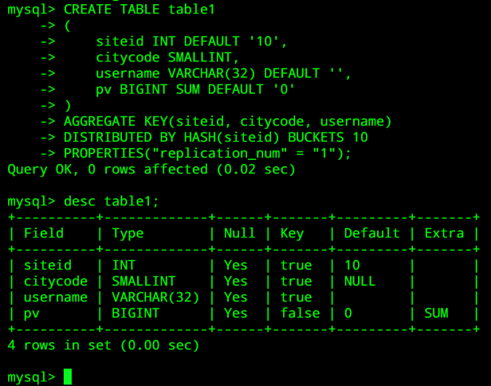

| 将 table1_data 导入 table1 中                                |
| ------------------------------------------------------------ |
| /export/data/doris/table1_data内容：10,101,jim,211,101,grace,212,102,tom,213,102,bush,314,103,helen,3 |
| cd /export/data/doriscurl --location-trusted -u root:123456 -H "label:table1_20220714" -H "column_separator:," -T table1_data http://node1:8030/api/test_db/table1/_stream_load |

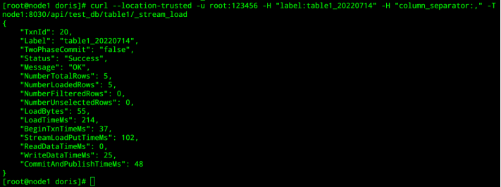

```sql
select * from table1;
```

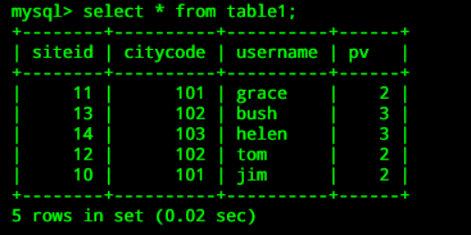

###### **复合分区**

建立一个名字为 table2 的逻辑表。

这个表的 schema 如下：

- event_day：类型是DATE，无默认值

- siteid：类型是INT（4字节）, 默认值为10

- citycode：类型是SMALLINT（2字节）

- username：类型是VARCHAR, 最大长度为32, 默认值为空字符串

- pv：类型是BIGINT（8字节）, 默认值是0; 这是一个指标列, Doris 内部会对指标列做聚合操作, 这个列的聚合方法是求和（SUM）


我们使用 event_day 列作为分区列，建立3个分区: p202006, p202007, p202008

- p202006：范围为 [最小值, 2020-07-01)

- p202007：范围为 [2020-07-01, 2020-08-01)

- p202008：范围为 [2020-08-01, 2020-09-01)


> 注意区间为左闭右开。
>

每个分区使用 siteid 进行哈希分桶，桶数为10

建表语句如下:

```sql
CREATE TABLE table2
(
    event_day DATE,
    siteid INT DEFAULT '10',
    citycode SMALLINT,
    username VARCHAR(32) DEFAULT '',
    pv BIGINT SUM DEFAULT '0'
)
AGGREGATE KEY(event_day, siteid, citycode, username)
PARTITION BY RANGE(event_day)
(
    PARTITION p202006 VALUES LESS THAN ('2020-07-01'),
    PARTITION p202007 VALUES LESS THAN ('2020-08-01'),
    PARTITION p202008 VALUES LESS THAN ('2020-09-01')
)
DISTRIBUTED BY HASH(siteid) BUCKETS 10
PROPERTIES("replication_num" = "1");
```

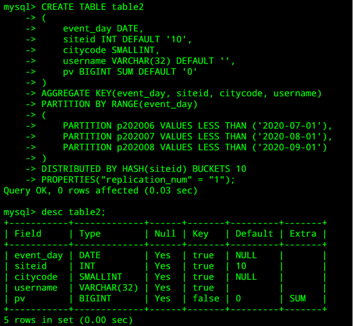

| 将 table2_data 导入 table2 中                                |
| ------------------------------------------------------------ |
| table2_data内容：2020-07-03\|11\|1\|jim\|22020-07-05\|12\|1\|grace\|22020-07-12\|13\|2\|tom\|22020-07-15\|14\|3\|bush\|32020-07-12\|15\|3\|helen\|3 |
| cd /export/data/doriscurl --location-trusted -u root:123456 -H "label:table2_20220715" -H "column_separator:\|" -T table2_data http://node1:8030/api/test_db/table2/_stream_load |

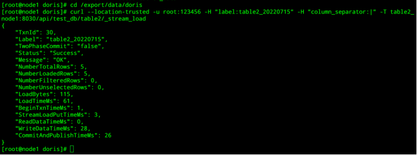

```sql
select * from table2;
```

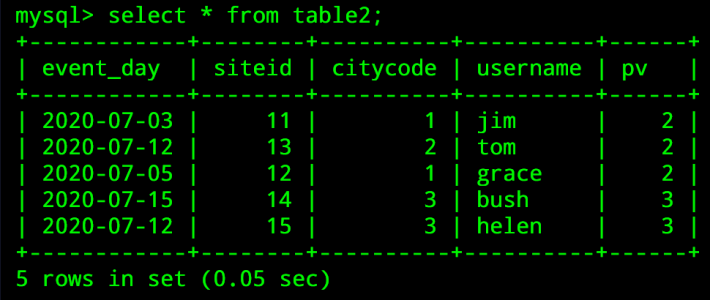

注意事项：

- 上述表通过设置 replication_num 建的都是单副本的表，Doris建议用户采用默认的 3 副本设置，以保证高可用。
- 可以对复合分区表动态的增删分区。详见 HELP ALTER TABLE 中 Partition 相关部分。
- 数据导入可以导入指定的 Partition。详见 HELP LOAD。
- 可以动态修改表的 Schema。
- 可以对 Table 增加上卷表（Rollup）以提高查询性能，这部分可以参见高级使用指南关于 Rollup 的描述。
- 表的列的Null属性默认为true，会对查询性能有一定的影响。

###### **推荐使用复合分区**的场景

- **有时间维度或类似带有有序值的维度**，可以以这类维度列作为分区列。分区粒度可以根据导入频次、分区数据量等进行评估。
- **历史数据删除需求**：如有删除历史数据的需求（比如仅保留最近N 天的数据）。使用复合分区，可以通过删除历史分区来达到目的。也可以通过在指定分区内发送 DELETE 语句进行数据删除。
- **解决数据倾斜问题**：每个分区可以单独指定分桶数量。如按天分区，当每天的数据量差异很大时，可以通过指定分区的分桶数，合理划分不同分区的数据,分桶列建议选择区分度大的列。

#### **PROPERTIES**

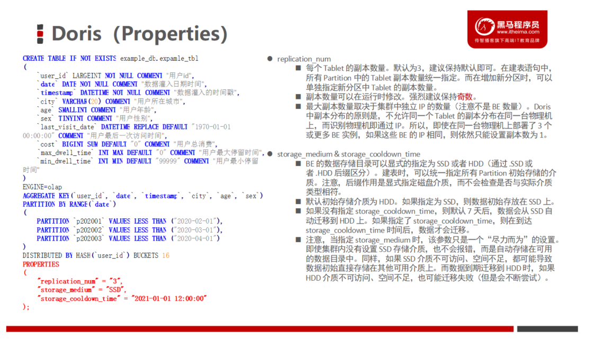

#### **ENGINE**

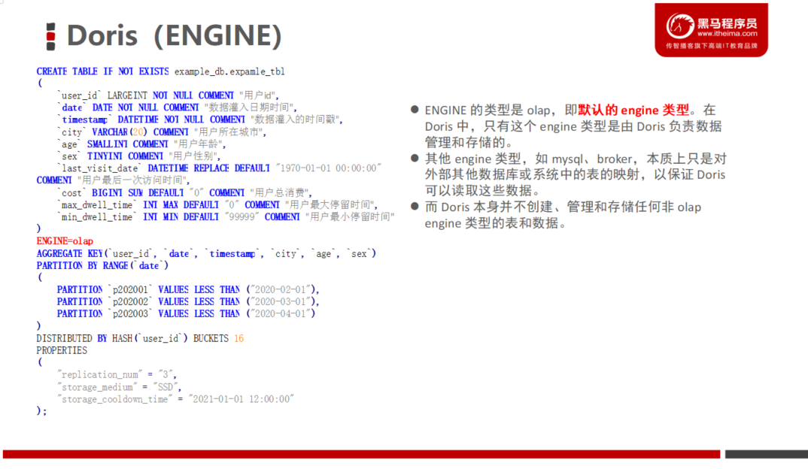

### 知识点15： 【掌握】**数据模型**

在 Doris 中，数据以表（Table）的形式进行逻辑上的描述。一张表包括**行（Row）**和**列（Column）**。Row即用户的一行数据。Column 用于描述一行数据中不同的字段。

Column可以分为两大类：Key（维度列）和Value（指标列）

Doris 的数据模型主要分为3类:

- Aggregate

- Unique

- Duplicate


#### **Aggregate模型（聚合模型）**

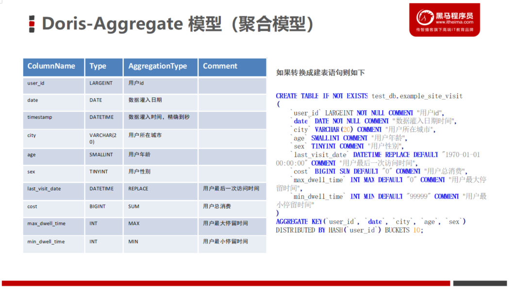

这是一个典型的用户信息和访问行为的事实表。 在一般星型模型中，用户信息和访问行为一般分别存放在维度表和事实表中。这里我们为了更加方便的解释 Doris 的数据模型，将两部分信息统一存放在一张表中。

表中的列按照是否设置了 AggregationType，分为 **Key (维度列)** 和 **Value（指标列）**。没有设置 AggregationType 的，如 user_id、date、age … 等称为 Key，而设置了 AggregationType 的称为 Value。

当我们导入数据时，对于 Key 列相同的行和聚合成一行，而 Value 列会按照设置的 AggregationType 进行聚合。 AggregationType 目前有以下四种聚合方式：

- SUM：求和，多行的 Value 进行累加。

- REPLACE：替代，下一批数据中的 Value 会替换之前导入过的行中的 Value。

- MAX：保留最大值。

- MIN：保留最小值。


#### Unique模型（唯一主键）

在某些多维分析场景下，用户更关注的是如何保证 Key 的唯一性，即如何获得 Primary Key 唯一性约束。因此，我们引入了 Unique 的数据模型。**该模型本质上是聚合模型的一个特例，也是一种简化的表结构表示方式。**

Unique Key 的模型主要面向留存分析或者订单分析的场景，他们需要一个 Unique Key 的约束去保证整个数据不丢不重。**然后 Duplicate Key 的模型，就是这个数据可能重复**，

#### Duplicate 模型（冗余模型）

Duplicate Key 的模型，就是说支持一个用户导入之后把这个数据全部放在数据库里面，我们不再做提前的聚合，也不单独保证唯一性，只做一个排序。因此，我们引入 Duplicate 数据模型来满足这类需求。

如：对于有些日志分析它不太在意数据多几条或者少几条，可能只关心排序，这个时候可能重复 Key 的模型会更加有效果。

#### 数据模型的总结

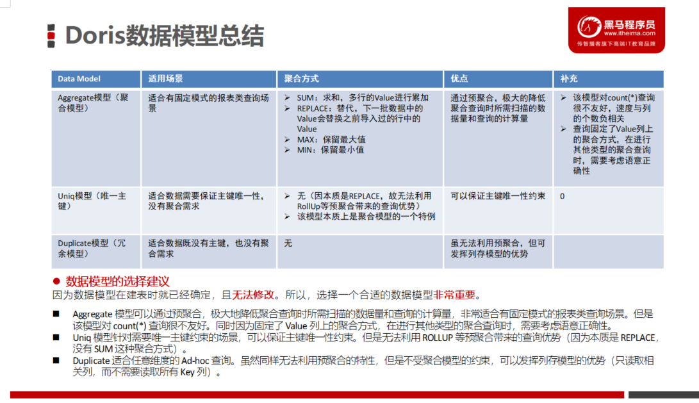

### **知识点16： 【实现】Flink** **to** **Doris** **演示**

Flink to Doris 需要Flink Doris Connector。Flink Doris Connector可以支持通过 Flink 操作（读取、插入、修改、删除） Doris 中存储的数据。可以将 Doris 表映射为 DataStream 或者 Table。

Flink Doris Connector代码库地址：<https://github.com/apache/doris-flink-connector>

**注意：**

> 修改和删除只支持在 Unique Key 模型上
>
> 目前的删除是支持 Flink CDC 的方式接入数据实现自动删除，如果是其他数据接入的方式删除需要自己实现。

#### **版本兼容**

| **Connector**   | **Flink** | **Doris** | **Java** | **Scala** |
| --------------- | --------- | --------- | -------- | --------- |
| 1.14_2.11-1.1.0 | 1.14.x    | 1.0+      | 8        | 2.11      |
| 1.14_2.12-1.1.0 | 1.14.x    | 1.0+      | 8        | 2.12      |

#### **准备工作**

| 上传到flink-doris-connector-1.14_2.12-1.0.3.jar到node1 /export/server/flink/lib目录下 |
| ------------------------------------------------------------ |
| （要先启动zk、hdfs、doris）启动flink standalone模式Node1： start-cluster.sh |

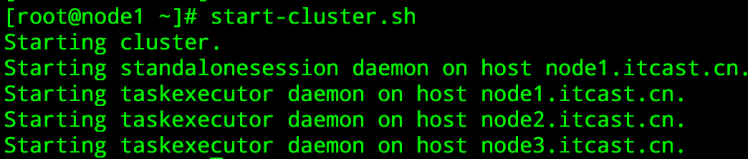

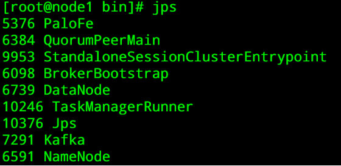

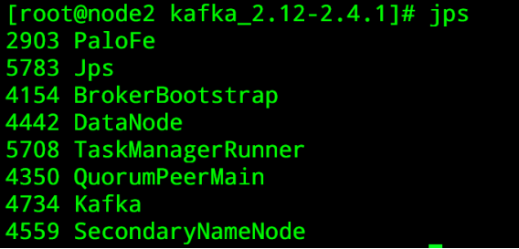

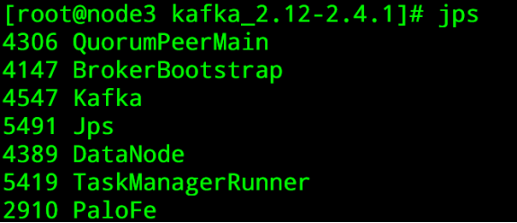

#### **F**link-sql使用示例

在doris中建表

```sql
CREATE TABLE if not exists test_db.demo
(
    id    int,
    name STRING,
    age   INT,
    price DECIMAL(5, 2),
    sale  DOUBLE
) UNIQUE KEY(`id`)
DISTRIBUTED BY HASH(`id`) BUCKETS 1
PROPERTIES (
"replication_allocation" = "tag.location.default: 1"
);
```

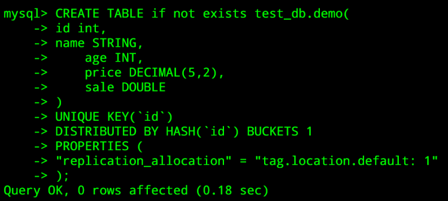

进入flink sql-client

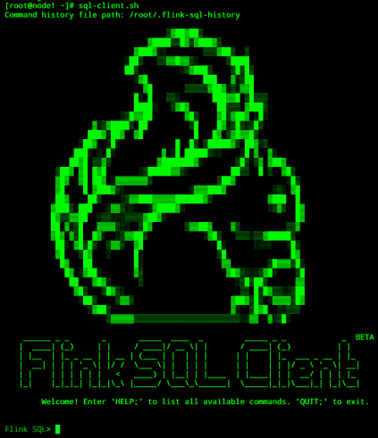

**SQL**

```sql
CREATE TABLE flink_doris_sink
(
    id    int,
    name STRING,
    age   INT,
    price DECIMAL(5, 2),
    sale  DOUBLE,
    PRIMARY KEY (`id`) NOT ENFORCED
)
WITH (
    'connector' = 'doris'
    ,'fenodes' = 'node1:8030'
    ,'password' = '123456'
    ,'username' = 'root'
    ,'table.identifier' = 'test_db.demo'
    ,'sink.properties.format' = 'json'
    ,'sink.enable-delete' = 'true'
    ,'sink.properties.strip_outer_array' = 'true'
    ,'sink.batch.size' = '2000'
    ,'sink.batch.interval' = '10s'
    ,'sink.properties.format' = 'json'
);
```

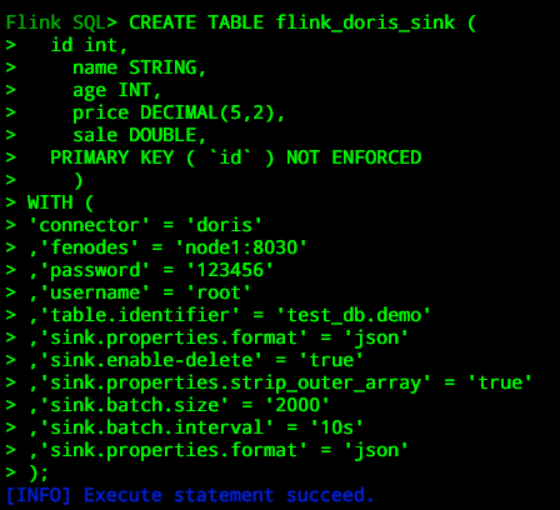

```sql
insert into flink_doris_sink values(1,'zhangsan',30,6.66,5);
insert into flink_doris_sink values(2,'lisi',18,18.88,66);
insert into flink_doris_sink values(3,'wangwu',25,188,1);
```

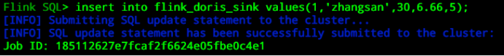

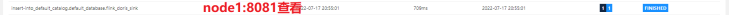

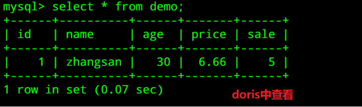

#### **F**link-CDC使用示例

在 node2中mysql建表

```sql
create database doris_testdb;
use doris_testdb;
CREATE TABLE if not exists doris_testdb.demo
(
    id    int,
    name  varchar(255),
    age   INT,
    price DECIMAL(5, 2),
    sale  DOUBLE,
    PRIMARY KEY (`id`)
)
    ENGINE = InnoDB
    DEFAULT CHARACTER SET = utf8
    COLLATE = utf8_general_ci;
```

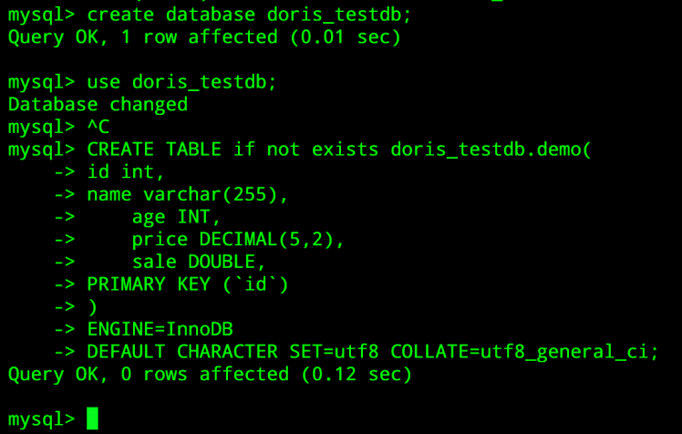

插入数据

```sql
insert into demo values(1,'zhangsan',30,6.66,5);
insert into demo values(2,'lisi',18,18.88,66);
insert into demo values(3,'wangwu',25,188,1);
```

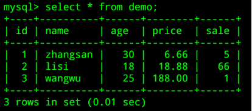

在doris中建表

```sql
CREATE TABLE if not exists test_db.demo2
(
    id    int,
    name STRING,
    age   INT,
    price DECIMAL(5, 2),
    sale  DOUBLE
) UNIQUE KEY(`id`)
DISTRIBUTED BY HASH(`id`) BUCKETS 1
PROPERTIES (
"replication_allocation" = "tag.location.default: 1"
);
```

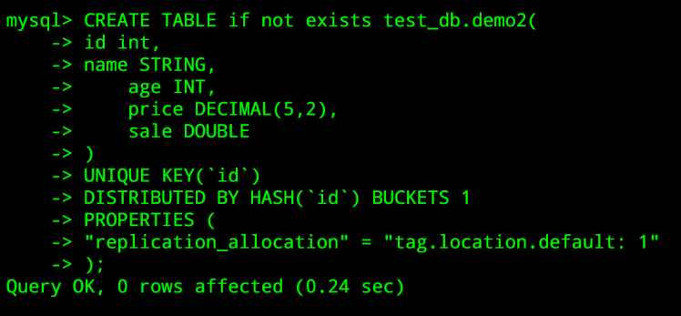

+ 进入flink sql-client

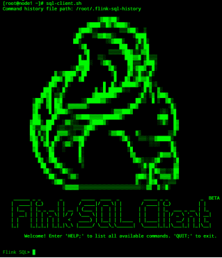

+ **创建mysql映射表**

```sql
CREATE TABLE flink_doris_source (
    id int,
    name STRING,
    age INT,
    price DECIMAL(5,2),
    sale DOUBLE,
    PRIMARY KEY ( `id` ) NOT ENFORCED
) WITH (
    'connector'= 'mysql-cdc',
    'hostname'= 'node2',
    'port'= '3306',
    'username'= 'root',
    'password'='123456',
    'server-time-zone'= 'Asia/Shanghai',
    'debezium.snapshot.mode'='initial',
    'database-name'= 'doris_testdb',
    'table-name'= 'demo'
);
```

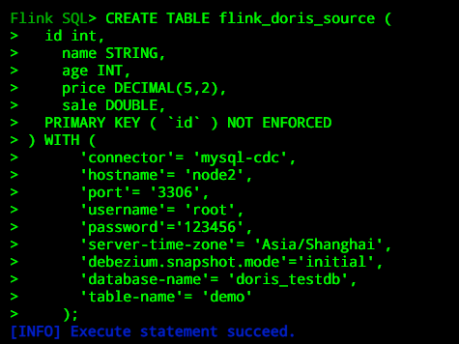

+ 查看表flink_doris_source

```sql
select * from flink_doris_source;
```

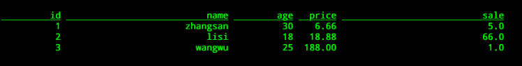

+ **创建doris映射表**

```sql
CREATE TABLE flink_doris_sink2 (
    id int,
    name STRING,
    age INT,
    price DECIMAL(5,2),
    sale DOUBLE,
    PRIMARY KEY ( `id` ) NOT ENFORCED
) WITH (
    'fenodes' = 'node1:8030'
    ,'table.identifier' = 'test_db.demo2'
    ,'sink.enable-delete' = 'true'
    ,'sink.properties.strip_outer_array' = 'true'
    ,'sink.batch.size' = '2000'
    ,'password' = '123456'
    ,'connector' = 'doris'
    ,'sink.batch.interval' = '10s'
    ,'sink.max-retries' = '5'
    ,'sink.properties.format' = 'json'
    ,'username' = 'root'
);
```

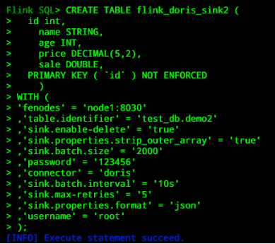

+ 插入数据

```sql
INSERT INTO flink_doris_sink2 select id,name,age,price,sale from flink_doris_source;
```

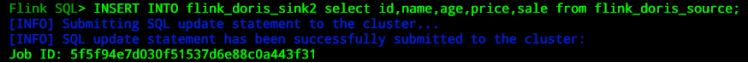

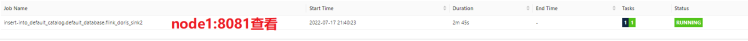

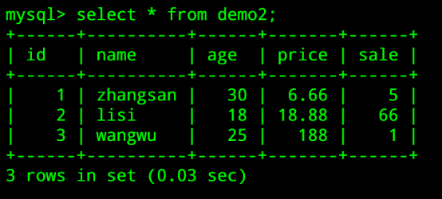

#### **配置**

+ 通用配置项

| **Key**                          | **Default Value**  | **Required** | **Comment**                                                  |
| -------------------------------- | ------------------ | ------------ | ------------------------------------------------------------ |
| fenodes                          | --                 | Y            | Doris FE http 地址                                           |
| table.identifier                 | --                 | Y            | Doris 表名，如：db.tbl                                       |
| username                         | --                 | Y            | 访问 Doris 的用户名                                          |
| password                         | --                 | Y            | 访问 Doris 的密码                                            |
| doris.request.retries            | 3                  | N            | 向 Doris 发送请求的重试次数                                  |
| doris.request.connect.timeout.ms | 30000              | N            | 向 Doris 发送请求的连接超时时间                              |
| doris.request.read.timeout.ms    | 30000              | N            | 向 Doris 发送请求的读取超时时间                              |
| doris.request.query.timeout.s    | 3600               | N            | 查询 Doris 的超时时间，默认值为1小时，-1表示无超时限制       |
| doris.request.tablet.size        | Integer. MAX_VALUE | N            | 一个 Partition 对应的 Doris Tablet 个数。 此数值设置越小，则会生成越多的 Partition。从而提升 Flink 侧的并行度，但同时会对 Doris 造成更大的压力。 |
| doris.batch.size                 | 1024               | N            | 一次从 BE 读取数据的最大行数。增大此数值可减少 Flink 与 Doris 之间建立连接的次数。 从而减轻网络延迟所带来的额外时间开销。 |
| doris.exec.mem.limit             | 2147483648         | N            | 单个查询的内存限制。默认为 2GB，单位为字节                   |
| doris.deserialize.arrow.async    | FALSE              | N            | 是否支持异步转换 Arrow 格式到 flink-doris-connector 迭代所需的 RowBatch |
| doris.deserialize.queue.size     | 64                 | N            | 异步转换 Arrow 格式的内部处理队列，当 doris.deserialize.arrow.async 为 true 时生效 |
| doris.read.field                 | --                 | N            | 读取 Doris 表的列名列表，多列之间使用逗号分隔                |
| doris.filter.query               | --                 | N            | 过滤读取数据的表达式，此表达式透传给 Doris。Doris 使用此表达式完成源端数据过滤。 |
| sink.label-prefix                | --                 | Y            | Stream load导入使用的label前缀。2pc场景下要求全局唯一 ，用来保证Flink的EOS语义。 |
| sink.properties.*                | --                 | N            | Stream Load 的导入参数。例如: 'sink.properties.column_separator' = ', ' 定义列分隔符，'sink.properties.escape_delimiters' = 'true' 特殊字符作为分隔符,'\x01'会被转换为二进制的0x01JSON格式导入'sink.properties.format' = 'json' 'sink.properties.read_json_by_line' = 'true' |
| sink.enable-delete               | TRUE               | N            | 是否启用删除。此选项需要 Doris 表开启批量删除功能(Doris0.15+版本默认开启)，只支持 Unique 模型。 |
| sink.enable-2pc                  | TRUE               | N            | 是否开启两阶段提交(2pc)，默认为true，保证Exactly-Once语义。关于两阶段提交可参考[这里](https://doris.apache.org/zh-CN/docs/data-operate/import/import-way/stream-load-manual.html)。 |
| sink.max-retries                 | 1                  | N            | 2pc场景下，commit阶段失败后的重试次数。                      |
| sink.buffer-size                 | 1048576(1MB)       | N            | 写数据缓存buffer大小，单位字节。不建议修改，默认配置即可。   |
| sink.buffer-count                | 3                  | N            | 写数据缓存buffer个数，不建议修改，默认配置即可。             |

#### **Doris 和 Flink 列类型映射关系**

| **Doris Type** | **Flink Type**       |
| -------------- | -------------------- |
| NULL_TYPE      | NULL                 |
| BOOLEAN        | BOOLEAN              |
| TINYINT        | TINYINT              |
| SMALLINT       | SMALLINT             |
| INT            | INT                  |
| BIGINT         | BIGINT               |
| FLOAT          | FLOAT                |
| DOUBLE         | DOUBLE               |
| DATE           | DATE                 |
| DATETIME       | TIMESTAMP            |
| DECIMAL        | DECIMAL              |
| CHAR           | STRING               |
| LARGEINT       | STRING               |
| VARCHAR        | STRING               |
| DECIMALV2      | DECIMAL              |
| TIME           | DOUBLE               |
| HLL            | Unsupported datatype |

##  相关面试题

**1、Doris是什么？**

- Apache Doris是一个现代化的MPP（大规模并行分析）分析型数据库产品。仅需亚秒级响应时间即可获得查询结果，有效地支持实时数据分析。Apache Doris的分布式架构非常简洁，易于运维，并且可以支持10PB以上的超大数据集。
- Apache Doris可以满足多种数据分析需求，例如固定历史报表，实时数据分析，交互式数据分析和探索式数据分析等。令数据分析工作更加简单高效。

**2、Doris核心特性有哪些？**

- 基于MPP（大规模并行处理）架构的分析型数据库
- 性能卓越，PB级别数据毫秒/秒级响应
- 支持标准SQL语言，兼容MySQL协议
- 向量化执行器
- 高效的聚合表技术
- 新型预聚合技术Rollup
- 高性能、高可用、高可靠
- 极简运维，弹性伸缩

**3、简单介绍一下OLTP、OLAP与HTAP？**

- OLTP（Online Transaction Processing 联机事务处理）的查询一般只会访问少量的记录，且大多时候都会利用索引。比如最常见的基于主键的 CRUD 操作。
- OLAP（OnLine Analytical Processing 联机分析处理）的查询一般需要 Scan 大量数据，大多时候只访问部分列，聚合的需求（Sum，Count，Max，Min 等）会多于明细的需求（查询原始的明细数据）。
- HTAP（Hybrid Transactional 混合事务/Analytical Processing 分析处理）基于创新的计算存储框架，HTAP 数据库能够在一份数据上同时支撑业务系统运行和 OLAP 场景，避免在传统架构中，在线与离线数据库之间大量的数据交互。此外，HTAP 基于分布式架构，支持弹性扩容，可按需扩展吞吐或存储，轻松应对高并发、海量数据场景。

**4、Doris的主要架构是什么？**

- Doris的主要架构分为FE（frontend）、BE（backend）两个角色、两个进程，不依赖于外部的组件，极易部署、运维，FE和BE都有很好的拓展性。
  - FE：存储和维护集群的元数据，负责接收和解析用户的查询请求，规划查询计化，调度查询结果。
    - FE主要分为三个角色：Leader、Follower、Observer
    - Leader和Follower主要是用来实现Doris集群的高可用，在Leader宕机之后，Follower节点能够迅速代替Leader的工作，能够实现实时恢复元数据，从而保证对Doris集群不造成任何影响。
    - Observer是用来拓展查询节点的，同时起到了元数据备份的作用，如果在感知到集群的查询有压力时，可以同通过添加Observer节点来达到提高集群查询的能力，注意：Observer只参与读取，不参与写入。
  - BE：负责数据的主要存储和计算，以及根据FE生成的物理执行计划，然后进行查询（分布式，多节点并行执行查询，统一汇总）。同时BE还会将数据存储为3副本或者多副本（可根据数据的权重以及集群的资源进行合理设置，可以动态调整）。
  - Broker：broker是一个无状态的进程。其中封装了文件系统的接口，能够为Doris提供访问外部数据源的能力（比如：HDFS、S3等）。通常在每一台节点上部署一个broker的示例即可。
  - MysqlClient：Doris是借助MysqlClient协议，所以MysqlClient可以直接访问Doris

**5、简述ROLLUP？**

+ Rollup 本质上可以理解为原始表(Base Table)的一个物化索引。建立 Rollup 时可只选取 Base Table 中的部分列作为 Schema。Schema 中的字段顺序也可与 Base Table 不同。

+ ROLLUP重要特点：
  + ROLLUP 是附属于 Base 表的，可以看做是 Base 表的一种辅助数据结构。用户可以在 Base 表的基础上，创建或删除 ROLLUP，但是不能在查询中显式的指定查询某 ROLLUP。是否命中 ROLLUP 完全由 Doris 系统自动决定。
  + ROLLUP 的数据是独立物理存储的。因此，创建的 ROLLUP 越多，占用的磁盘空间也就越大。同时对导入速度也会有影响，但是不会降低查询效率;
  + ROLLUP 的数据更新与 Base 表示完全同步的;
  + 查询能否命中 ROLLUP 的一个必要条件（非充分条件）是，查询所涉及的所有列（包括 select list 和 where 中的查询条件列等）都存在于该 ROLLUP 的列中。否则，查询只能命中 Base 表。

**6、简单介绍一下doris的join操作。**

- Join是数据库查询永远绕不开的话题，传统查询SQL技术总体可以分为简单操作（过滤操作-where、排序操作-limit等），聚合操作-groupBy等以及Join操作等。其中Join操作是其中最复杂、代价最大的操作类型。
- 传统数据库单机模式做Join的场景毕竟有限，也建议尽量减少使用Join。然而大数据领域就完全不同，Join是标配，OLAP业务根本无法离开表与表之间的关联，对Join的支持成熟度一定程度上决定了系统的性能，夸张点说，“得Join者得天下”。
- Doris会自动尝试进行 Broadcast Join，如果预估小表过大则会自动切换至 Shuffle Join。注意，如果此时显式指定了 Broadcast Join 也会自动切换至 Shuffle Join。

- hash join算法就来自于传统数据库，而shuffle和broadcast是大数据的皮，两者一结合就成了大数据的算法了

1. hash join: 适用于至少有一个是小表的场景（hash join基本都只扫描两表一次，可以认为O(a+b)，较之最极端的是笛卡尔积运算O(a*b)， 小表的原因是在构建Hash Table时，最好可以把数据全部加载到内存中，因为这样效率才最高）

   1. 两个表，取小表为Build Table, 大表为Probe Table
   2. 构建Hash Table：依次读取Build Table的数据，对于每一条数据根据Join Key进行hash，hash到对应的bucket中(类似于HashMap的原理)，最后会生成一张HashTable，HashTable会缓存在内存中，如果内存放不下会dump到磁盘中；
   3. 匹配：生成Hash Table后，在依次扫描Probe Table的数据，使用相同的hash函数(在spark中，实际上就是要使用相同的partitioner)在Hash Table中寻找hash(join key)相同的值，如果匹配成功就将两者join在一起。

2. broadcast join（将其中一张较小的表通过广播的方式，由driver发送到各个executor，大表正常被分成多个区，每个分区的数据和本地的广播变量进行join(相当于每个executor上都有一份小表的数据，并且这份数据是在内存中的，过来的分区中的数据和这份数据进行join)。broadcast适用于表很小，可以直接被广播的场景；）

   基表不能被广播，比如left outer join时，只能广播右表。

3. shuffle join（一旦小表比较大，此时就不适合使用broadcast hash join了。这种情况下，可以对两张表分别进行shuffle，将两张表相同key的数据分到一个分区中，然后分区和分区之间进行join。相当于将两张表都分成了若干小份，小份和小份之间进行hash join，充分利用集群资源。）

**7、Doris的分区分桶有哪些特点？**

+ Doris 支持两级分区存储, 第一层为 RANGE 分区(partition), 第二层为 HASH 分桶(bucket)

- RANGE分区用于将数据划分成不同区间, 逻辑上可以理解为将原始表划分成了多个子表。业务上，多数用户会选择采用按时间进行partition, 按时间进行partition有以下好处：
  - 可区分冷热数据 
  - 可用上Doris分级存储(SSD + SATA)的功能 
  - 按分区删除数据时，更加迅速
- 根据hash值将数据划分成不同的 bucket。
  - 建议采用区分度大的列做分桶, 避免出现数据倾斜
  - 为方便数据恢复, 建议单个 bucket 的 size 不要太大, 保持在 10GB 以内, 所以建表或增加 partition 时请合理考虑 bucket 数目, 其中不同 partition 可指定不同的 buckets 数。

**8、Doris是否支持修改列名？**

- 不支持修改列名。
- Doris支持修改数据库名、表名、分区名、物化视图（Rollup）名称，以及列的类型、注释、默认值等等。但遗憾的是，目前不支持修改列名。
- 因为一些历史原因，目前列名称是直接写入到数据文件中的。Doris在查询时，也是通过类名查找到对应的列的。所以修改列名不仅是简单的元数据修改，还会涉及到数据的重写，是一个非常重的操作。

**9、 Unique Key模型的表是否支持创建物化视图？**

- 不支持。
- Unique Key模型的表是一个对业务比较友好的表，因为其特有的按照主键去重的功能，能够很方便的同步数据频繁变更的业务数据库。因此，很多用户在将数据接入到Doris时，会首先考虑使用Unique Key模型。
- 但遗憾的是，Unique Key模型的表是无法建立物化视图的。原因在于，物化视图的本质，是通过预计算来将数据“预先算好”，这样在查询时直接返回已经计算好的数据，来加速查询。在物化视图中，“预计算”的数据通常是一些聚合指标，比如求和、求count。这时，如果数据发生变更，如udpate或delete，因为预计算的数据已经丢失了明细信息，因此无法同步的进行更新。比如一个求和值5，可能是 1+4，也可能是2+3。因为明细信息的丢失，我们无法区分这个求和值是如何计算出来的，因此也就无法满足更新的需求。

**10、为什么Unique Key 模型会出现查询结果不一致的情况？**

- 某些情况下，当用户使用相同的 SQL 查询一个 Unique Key 模型的表时，可能会出现多次查询结果不一致的现象。并且查询结果总在 2-3 种之间变化。

- 这可能是因为，在同一批导入数据中，出现了 key 相同但 value 不同的数据，这会导致，不同副本间，因数据覆盖的先后顺序不确定而产生的结果不一致的问题。

- 比如表定义为 k1, v1。一批次导入数据如下：

- ```go
  1, "abc"
  1, "def"
  ```

- 那么可能副本1 的结果是` 1, "abc"`，而副本2 的结果是 `1, "def"`。从而导致查询结果不一致。