# **博学谷大数据平台**_业务开发

## 知识点01： 【掌握】课程目标

-   熟悉各个看板业务
-   掌握各个看板0到1实现流程
-   理解建模分析过程
-   掌握ods层数据导入
-   掌握dwd层宽表设计及实现
-   熟悉Doris函数使用

# 数据流向Demo演示

## 知识点02： 【理解】相关表介绍及创建

源数据表在node1中Mysql的hudi_test库

创建hudi_test库

```sql
create database if not exists hudi_test;
use hudi_test;
```

### orders表

创建表

```sql
CREATE TABLE `orders` (
                          `id` int(11) NOT NULL,
                          `pid` int(11) NOT NULL,
                          `num` int(11) DEFAULT NULL,
                          PRIMARY KEY (`id`)
) ENGINE=InnoDB DEFAULT CHARSET=utf8;
```

插入数据

```sql
INSERT INTO `orders` VALUES (1,1,2),(2,1,13),(3,2,55);
```

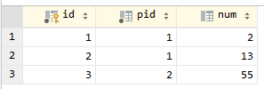

### product表

创建product表

```sql
CREATE TABLE `product` (
    `id` int(11) NOT NULL,
    `name` varchar(50) DEFAULT NULL,
    `price` decimal(10,4),
    PRIMARY KEY (`id`)
) ENGINE=InnoDB DEFAULT CHARSET=utf8;
```

插入数据

```sql
INSERT INTO `product` VALUES (1,'phone',5680),(2,'door',857),(3,'screen',3333);
```

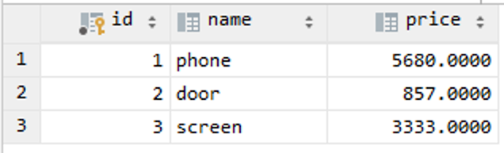

## 知识点03： 【掌握】数据流向介绍

### 架构

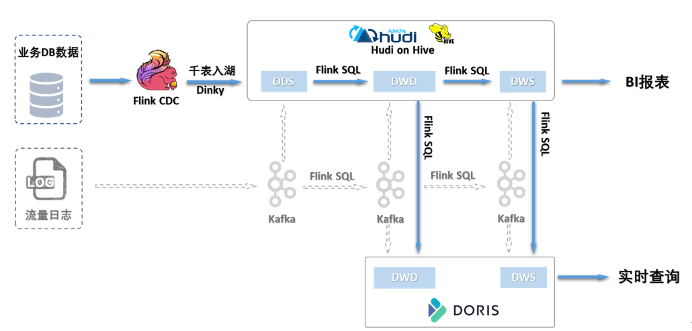

首先，可以从我们架构图看到，整个数流向是从mysql源表中通过flink cdc采集到hudi的ods层，然后通过flink sql进行实时处理，得到宽表插入hudi的dwd层以及doris的dwd层，再继续根据业务需求处理得到的结果表插入hudi的dws层，最后我们通过flink sql将hudi的dws层表插入到doris的dws层表做查询用。

### 数据提取流程

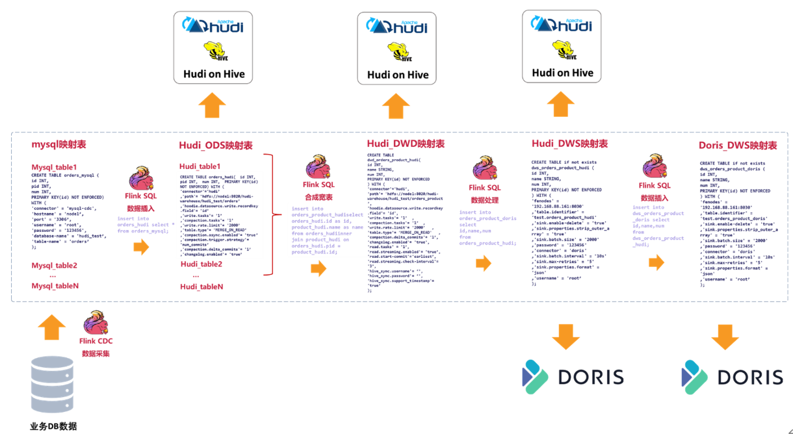

## 知识点04： 【掌握】命令启动

| Zookeeper（三台）       | /export/server/zookeeper/bin/zkServer.sh start               |
| ----------------------- | ------------------------------------------------------------ |
| hdfs（node1）           | start-dfs.sh                                                 |
| Flink standalone(node1) | /export/server/flink/bin/start-cluster.sh                    |
| Doris                   | （FE：node1）：/export/server/doris/fe/bin/start_fe.sh --daemon |
|                         | （FE：node2/3）：/export/server/doris/fe/bin/start_fe.sh --helper node1:9010 --daemon |
|                         | （BE：node123)：/export/server/doris/be/bin/start_be.sh --daemon |
| Hive（node1）           | nohup hive --service metastore 2\>&1 \> /tmp/hive-metastore.log & |
|                         | nohup hive --service hiveserver2 2\>&1 \> /tmp/hive-hiveserver2.log & |
| Flink sql-client(node1) | /export/server/flink/bin/sql-client.sh                       |
| 开启checkpoint          | set execution.checkpointing.interval=30sec;                  |

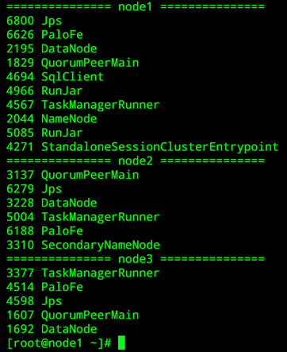

## 知识点05： 【实现】操作演示

### Mysql 映射表

#### 操作

**orders表**

```sql
CREATE TABLE orders_mysql (
  id INT,
  pid INT,
  num INT,
  PRIMARY KEY(id) NOT ENFORCED
) WITH (
    'connector' = 'mysql-cdc',
    'hostname' = 'node1',
    'port' = '3306',
    'username' = 'root',
    'password' = '123456',
    'database-name' = 'hudi_test',
    'table-name' = 'orders'
);
```

**produce表**

```sql
CREATE TABLE product_mysql (
   id INT,
   name STRING,
   price decimal(10,4),
   PRIMARY KEY(id) NOT ENFORCED
) WITH (
    'connector' = 'mysql-cdc',
    'hostname' = 'node1',
    'port' = '3306',
    'username' = 'root',
    'password' = '123456',
    'database-name' = 'hudi_test',
    'table-name' = 'product'
);
```

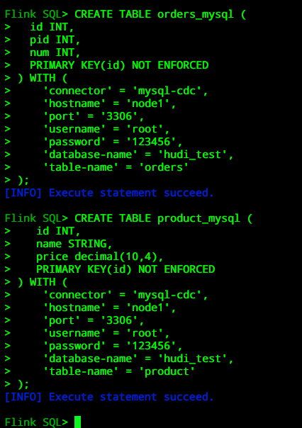

#### 结果展示

| 查看两个flink cdc映射表                                      |
| ------------------------------------------------------------ |
| select \* from orders_mysql;                                 |
| 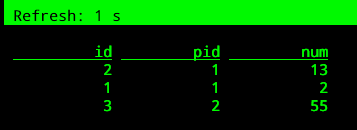 |
| select \* from product_mysql;                                |
| 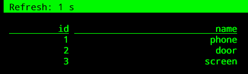 |

### Hudi_ODS层

#### 操作

orders_hudi表（映射表）

```sql
CREATE TABLE orders_hudi(
    id INT,
    pid INT,
    num INT,
    PRIMARY KEY(id) NOT ENFORCED
) WITH (
    'connector'='hudi'
    ,'path'= 'hdfs://node1:8020/hudi-warehouse/hudi_test/orders'
    ,'hoodie.datasource.write.recordkey.field'= 'id'
    ,'write.tasks'= '1'
    ,'compaction.tasks'= '1'
    ,'write.rate.limit'= '2000'
    ,'table.type'= 'MERGE_ON_READ'
    ,'compaction.async.enabled'= 'true'
    ,'compaction.trigger.strategy'= 'num_commits'
    ,'compaction.delta_commits'= '1'
    ,'changelog.enabled'= 'true'
    ,'read.tasks' = '1'
    ,'read.streaming.enabled'= 'true' 
    ,'read.start-commit'='earliest' 
    ,'read.streaming.check-interval'= '3' 
    ,'hive_sync.enable'= 'true' 
    ,'hive_sync.mode'= 'hms' 
    ,'hive_sync.metastore.uris'= 'thrift://node1:9083' 
    ,'hive_sync.table'= 'orders_hudi' 
    ,'hive_sync.db'= 'hudi_test' 
    ,'hive_sync.username'= '' 
    ,'hive_sync.password'= '' 
    ,'hive_sync.support_timestamp'= 'true' 
);
```

product_hudi表

```sql
CREATE TABLE product_hudi(
    id INT,
    name STRING,
    price decimal(10,4),
    PRIMARY KEY(id) NOT ENFORCED
) WITH (
    'connector'='hudi'
    ,'path'= 'hdfs://node1:8020/hudi-warehouse/hudi_test/product'
    ,'hoodie.datasource.write.recordkey.field'= 'id'
    ,'write.tasks'= '1'
    ,'compaction.tasks'= '1'
    ,'write.rate.limit'= '2000'
    ,'table.type'= 'MERGE_ON_READ'
    ,'compaction.async.enabled'= 'true'
    ,'compaction.trigger.strategy'= 'num_commits'
    ,'compaction.delta_commits'= '1'
    ,'changelog.enabled'= 'true'
    ,'read.tasks' = '1'
    ,'read.streaming.enabled'= 'true' -- 开启流读
    ,'read.start-commit'='earliest' --如果想消费所有数据，设置值为earliest
    ,'read.streaming.check-interval'= '3' -- 检查间隔，默认60s
    ,'hive_sync.enable'= 'true' -- 开启自动同步hive
    ,'hive_sync.mode'= 'hms' -- 自动同步hive模式，默认jdbc模式
    ,'hive_sync.metastore.uris'= 'thrift://node1:9083' -- hive metastore地址
    ,'hive_sync.table'= 'product_hudi' -- hive 新建表名
    ,'hive_sync.db'= 'hudi_test' -- hive 新建数据库名
    ,'hive_sync.username'= '' -- HMS 用户名
    ,'hive_sync.password'= '' -- HMS 密码
    ,'hive_sync.support_timestamp'= 'true'-- 兼容hive timestamp类型
);
```

插入数据

```sql
insert into orders_hudi select * from orders_mysql;
insert into product_hudi select * from product_mysql;
```

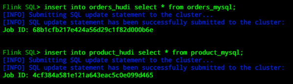

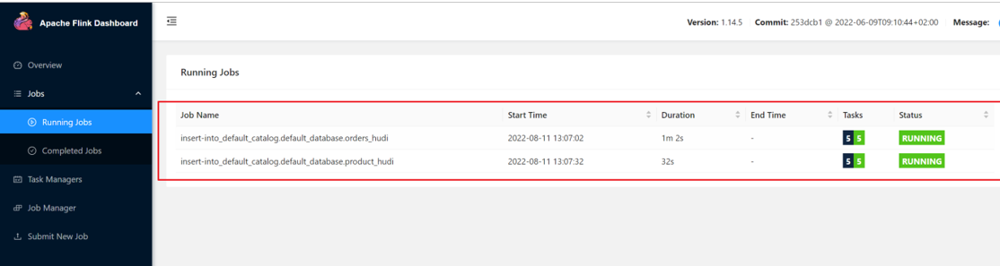

#### 结果展示

| 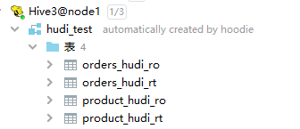 |
| ------------------------------------------------------------ |
| orders_hudi表                                                |
| 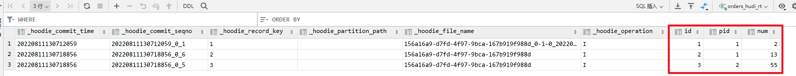 |
| product_hudi表                                               |
| 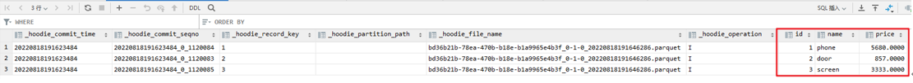 |
| 查看HDFS文件                                                 |
| 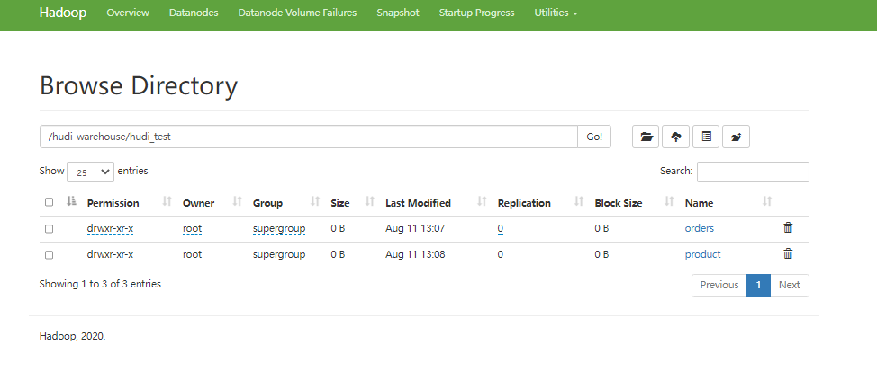 |

#### Hudi生成的hive表说明

在插入表后，我们可以看到，hudi自动创建了两张hive外部表：table_ro与table_rt。

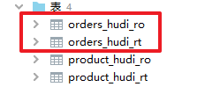

rt表支持快照+增量查询(近实时)，ro支持读优化查询（ReadOptimized）。我们可以查看建表语句。

| show create table hudi_test.orders_hudi_ro;                  |
| ------------------------------------------------------------ |
| 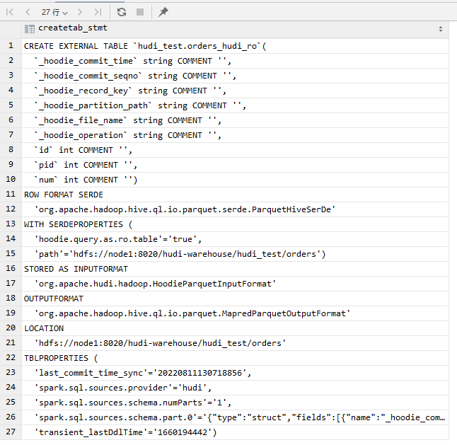 |
| show create table hudi_test.orders_hudi_rt;                  |
| 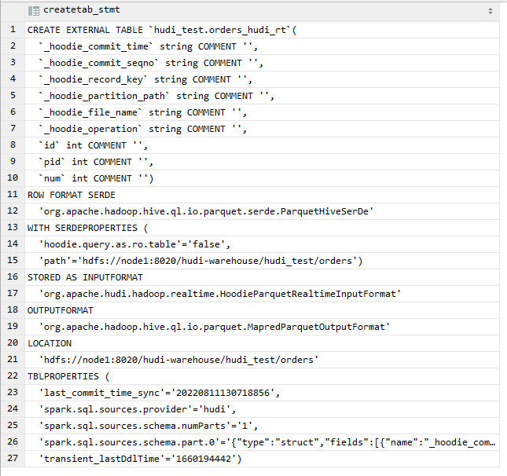 |

可以看到Hudi在两张表中都加入了6个Hudi的元数据字段，字段名以'_hoodie_'为前缀。rt和ro的读写类是不一样的。

|    | Input Format                                                     | Output Format                                                  |
|----|------------------------------------------------------------------|----------------------------------------------------------------|
| rt | org.apache.hudi.hadoop.realtime.HoodieParquetRealtimeInputFormat | org.apache.hadoop.hive.ql.io.parquet.MapredParquetOutputFormat |
| ro | org.apache.hudi.hadoop.HoodieParquetInputFormat                  | org.apache.hadoop.hive.ql.io.parquet.MapredParquetOutputFormat |

- rt表（HoodieParquetRealtimeInputFormat）读取parquet文件与增量log文件，读取时将两种数据进行合并，产生近实时的数据镜像。rt表实时性好，但读IO效率较差。

- ro表（HoodieParquetInputFormat）查询时只读取parquet文件。新数据只有经过compact合并生成新的parquet文件时才可以读到，数据存在一定的延时，但读IO效率更高，因为只读取parquet文件，不需要读增量log进行数据合并。


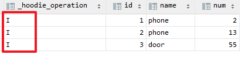

这里记录表数据的相关操作

- I：插入

- U：更新

- D：删除


### Hudi_DWD层

#### 操作

orders_product_hudi表（映射表）

```sql
CREATE TABLE dwd_orders_product_hudi (
    id INT,
    name STRING,
    num INT,
    price decimal(10,4),
    PRIMARY KEY(id) NOT ENFORCED
) WITH (
    'connector'='hudi'
    ,'path'= 'hdfs://node1:8020/hudi-warehouse/hudi_test/dwd_orders_product'
    ,'hoodie.datasource.write.recordkey.field'= 'id'
    ,'write.tasks'= '1'
    ,'compaction.tasks'= '1'
    ,'write.rate.limit'= '2000'
    ,'table.type'= 'MERGE_ON_READ'
    ,'compaction.async.enabled'= 'true'
    ,'compaction.trigger.strategy'= 'num_commits'
    ,'compaction.delta_commits'= '1'
    ,'changelog.enabled'= 'true',
    'read.tasks' = '1',
    'read.streaming.enabled'= 'true', -- 开启流读
    'read.start-commit'='earliest',--如果想消费所有数据，设置值为earliest
    'read.streaming.check-interval'= '3', -- 检查间隔，默认60s
    'hive_sync.enable'= 'true', -- 开启自动同步hive
    'hive_sync.mode'= 'hms', -- 自动同步hive模式，默认jdbc模式
    'hive_sync.metastore.uris'= 'thrift://node1:9083', -- hive metastore地址
    'hive_sync.table'= 'dwd_orders_product_hudi', -- hive 新建表名
    'hive_sync.db'= 'hudi_test', -- hive 新建数据库名
    'hive_sync.username'= '', -- HMS 用户名
    'hive_sync.password'= '', -- HMS 密码
    'hive_sync.support_timestamp'= 'true'-- 兼容hive timestamp类型
);
```

数据插入

```sql
insert into dwd_orders_product_hudi 
select
    orders_hudi.id as id,
    product_hudi.name as name,
    orders_hudi.num as num,
    product_hudi.price as price
from orders_hudi
inner join product_hudi on orders_hudi.pid = product_hudi.id;
```

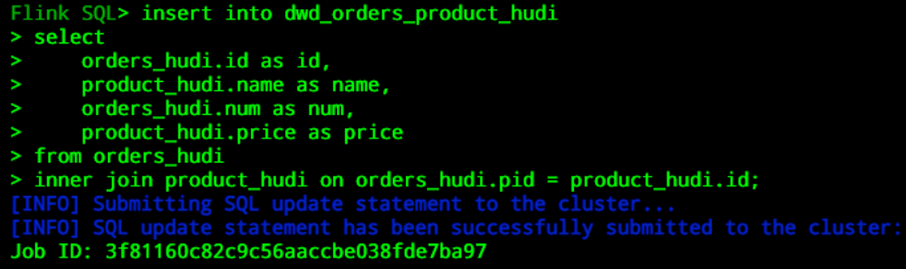

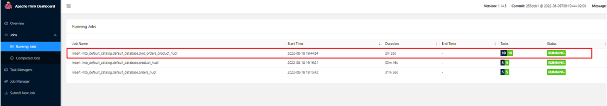

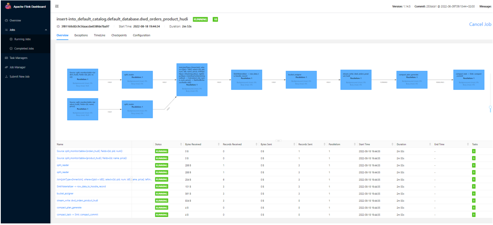

#### 结果展示

| 查看映射表orders_product_hudi                                |
| ------------------------------------------------------------ |
| select * from dwd_orders_product_hudi;                       |
| 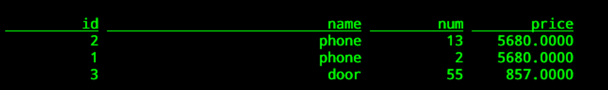 |
| 查看hive中相关表                                             |
| 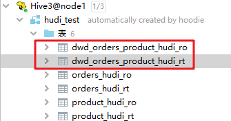 |
| 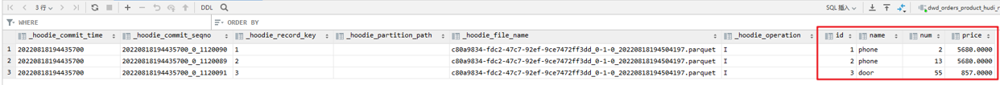 |

### Doris_DWD层

#### 操作

在doris中提前创建表结构

```sql
create database if not exists test;
create table if not exists test.dwd_orders_product_doris
(
    id  int, 
    name string not null,
num INT,
price decimal(10,4)
) Unique Key (`id`)
comment ''
DISTRIBUTED BY HASH(`id`) BUCKETS 10
PROPERTIES (
"replication_allocation" = "tag.location.default: 1"
);
```

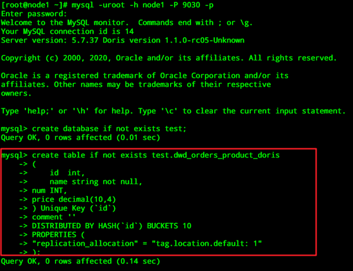

Flink sql-client中创建Doris_DWD映射表：orders_product_doris

```sql
CREATE TABLE if not exists dwd_orders_product_doris (
    id INT,
    name STRING,
    num INT,
    price decimal(10,4),
    PRIMARY KEY(id) NOT ENFORCED
) WITH (
    'fenodes' = '192.168.88.161:8030'
    ,'table.identifier' = 'test.dwd_orders_product_doris'
    ,'sink.enable-delete' = 'true'
    ,'sink.properties.strip_outer_array' = 'true'
    ,'sink.batch.size' = '2000'
    ,'password' = '123456'
    ,'connector' = 'doris'
    ,'sink.batch.interval' = '10s'
    ,'sink.max-retries' = '5'
    ,'sink.properties.format' = 'json'
    ,'username' = 'root'
);
```

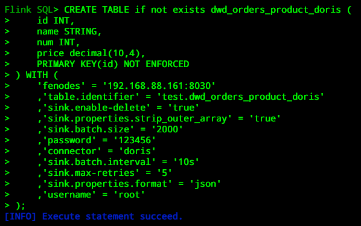

插入数据

```sql
insert into dwd_orders_product_doris
select
    id,
    name,
    num,
    price
from dwd_orders_product_hudi;
```

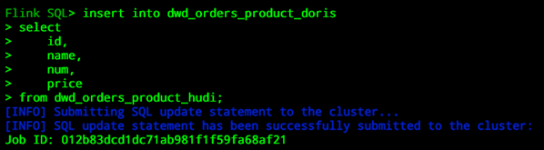

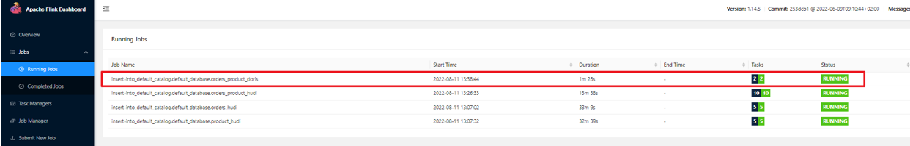

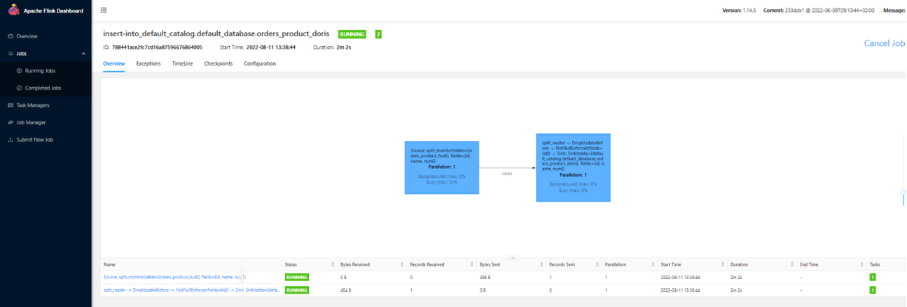

#### 结果展示

| 查看doris表orders_product_doris                              |
| ------------------------------------------------------------ |
| select * from dwd_orders_product_doris;                      |
| 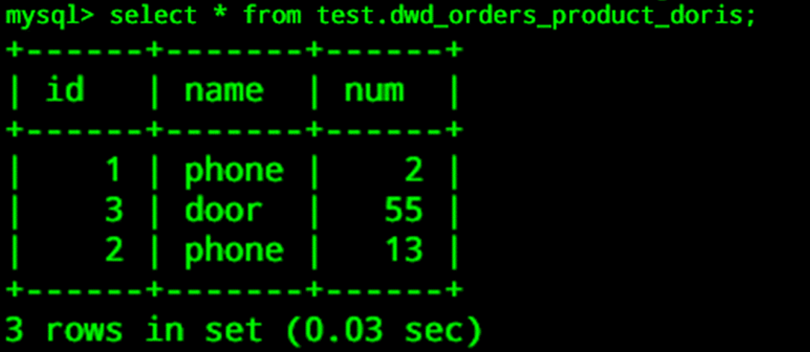 |

### Hudi_DWS层

按商品分组计算数量以及总额

#### 操作

dws_orders_product_hudi表（映射表）

```sql
CREATE TABLE dws_orders_product_hudi(
    name STRING,
    cnt BIGINT,
    price decimal(10,4),
    total_money decimal(10,4),
    PRIMARY KEY(name) NOT ENFORCED
) WITH (
    'connector'='hudi'
    ,'path'= 'hdfs://node1:8020/hudi-warehouse/hudi_test/dws_orders_product'
    ,'hoodie.datasource.write.recordkey.field'= 'id'
    ,'write.tasks'= '1'
    ,'compaction.tasks'= '1'
    ,'write.rate.limit'= '2000'
    ,'table.type'= 'MERGE_ON_READ'
    ,'compaction.async.enabled'= 'true'
    ,'compaction.trigger.strategy'= 'num_commits'
    ,'compaction.delta_commits'= '1'
    ,'changelog.enabled'= 'true',
    'read.tasks' = '1',
    'read.streaming.enabled'= 'true', -- 开启流读
    'read.start-commit'='earliest',--如果想消费所有数据，设置值为earliest
    'read.streaming.check-interval'= '3', -- 检查间隔，默认60s
    'hive_sync.enable'= 'true', -- 开启自动同步hive
    'hive_sync.mode'= 'hms', -- 自动同步hive模式，默认jdbc模式
    'hive_sync.metastore.uris'= 'thrift://node1:9083', -- hive metastore地址
    'hive_sync.table'= 'dws_orders_product_hudi', -- hive 新建表名
    'hive_sync.db'= 'hudi_test', -- hive 新建数据库名
    'hive_sync.username'= '', -- HMS 用户名
    'hive_sync.password'= '', -- HMS 密码
    'hive_sync.support_timestamp'= 'true'-- 兼容hive timestamp类型
);
```

数据插入

```sql
insert into dws_orders_product_hudi
select
    name,
    sum(num) as cnt,
    max(price) as price,
    sum(num)*max(price) as total_money
from dwd_orders_product_hudi
group by name;
```

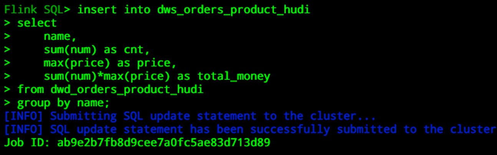

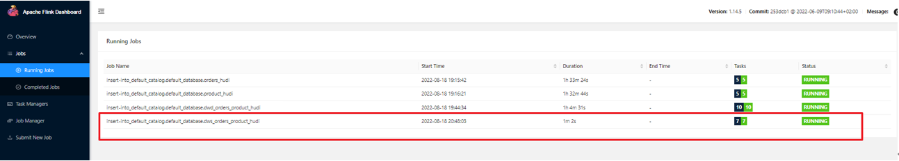

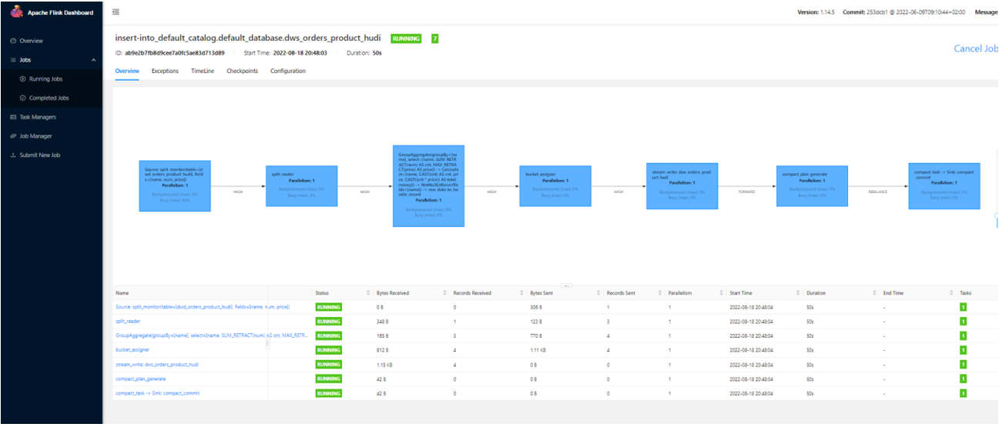

#### 结果展示

查看映射表dws_orders_product_hudi

```sql
select * from dws_orders_product_hudi;
```

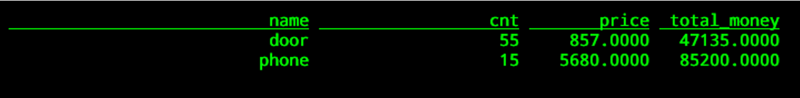

查看hive中相关表

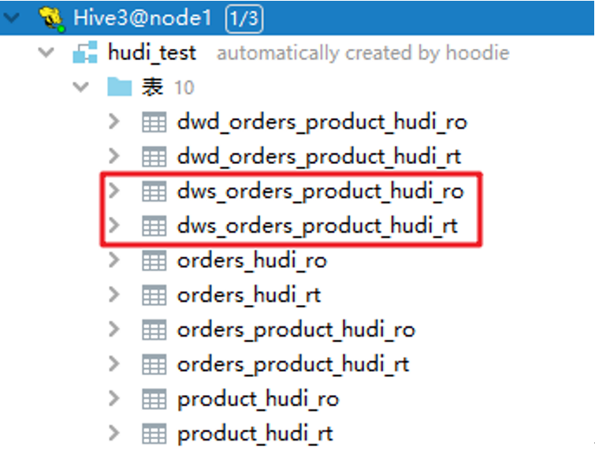

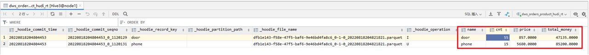

### Doris_DWS层

#### 操作

在doris中提前创建表结构

```sql
create database if not exists test;
create table if not exists test.dws_orders_product_doris(
	name VARCHAR(32),
    cnt BIGINT,
    price decimal(10,4),
    total_money decimal(10,4)
) Unique Key (`name`)
DISTRIBUTED BY HASH(`name`) BUCKETS 10
PROPERTIES (
"replication_allocation" = "tag.location.default: 1"
);
```

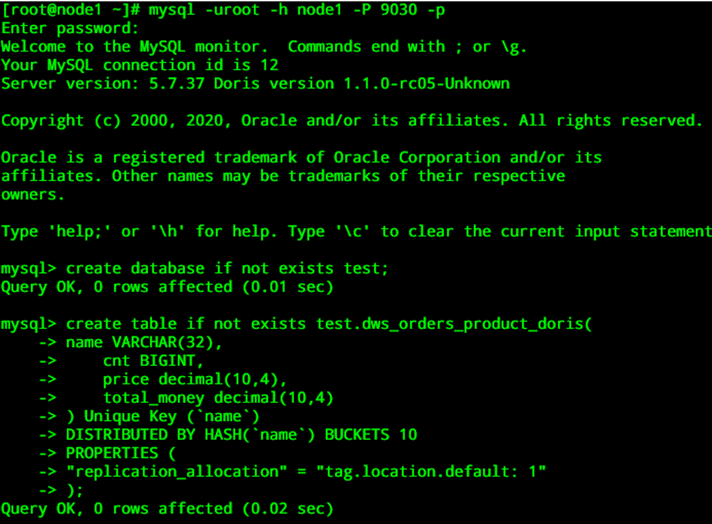

Flink sql-client中创建Doris_DWD映射表：dws_orders_product_doris

```
CREATE TABLE if not exists dws_orders_product_doris (
    name string,
    cnt BIGINT,
    price decimal(10,4),
    total_money decimal(10,4),
    PRIMARY KEY(name) NOT ENFORCED
) WITH (
    'fenodes' = '192.168.88.161:8030'
    ,'table.identifier' = 'test.dws_orders_product_doris'
    ,'sink.enable-delete' = 'true'
    ,'sink.properties.strip_outer_array' = 'true'
    ,'sink.batch.size' = '2000'
    ,'password' = '123456'
    ,'connector' = 'doris'
    ,'sink.batch.interval' = '10s'
    ,'sink.max-retries' = '5'
    ,'sink.properties.format' = 'json'
    ,'username' = 'root'
);
```

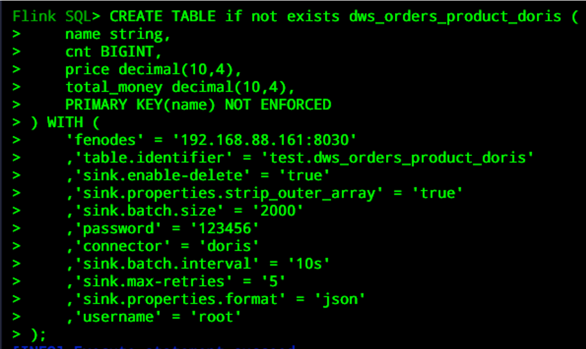

插入数据

```sql
insert into dws_orders_product_doris
select
    name,
    cnt, 
    price,
    total_money
from dws_orders_product_hudi;
```

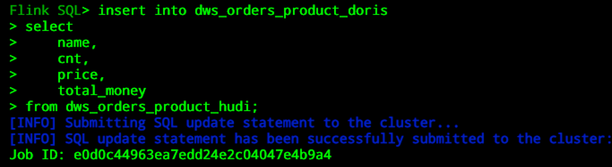

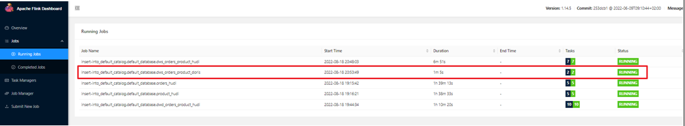

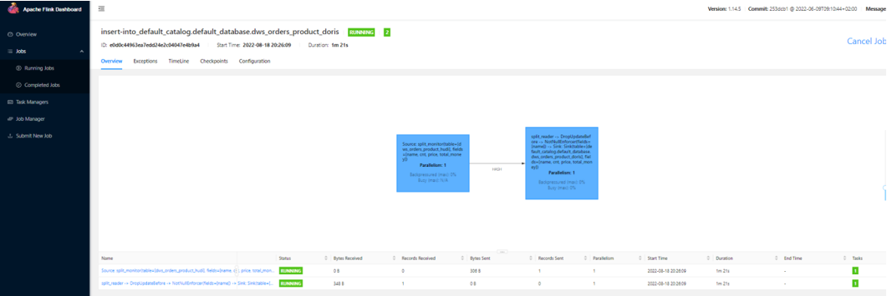

#### 结果展示

查看doris表dws_orders_product_doris

```sql
select * from test.dws_orders_product_doris;
```

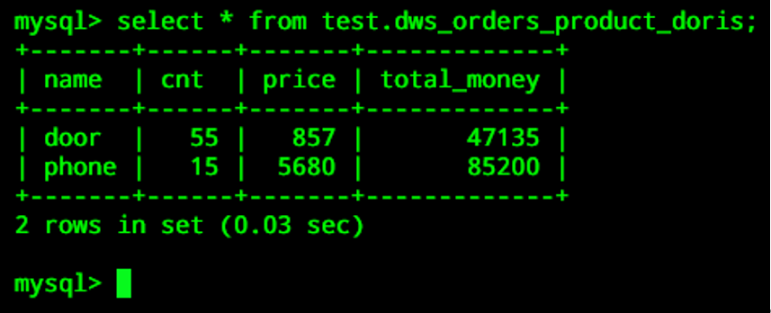

### 修改mysql源数据

| 数据展示                                                     |
| ------------------------------------------------------------ |
| 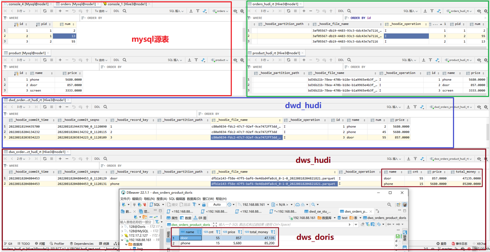 |
| 修改mysql中orders表数据(也可以直接在idea客户端修改)          |
| UPDATE hudi_test.orders SET num=45 WHERE id=2;               |
| 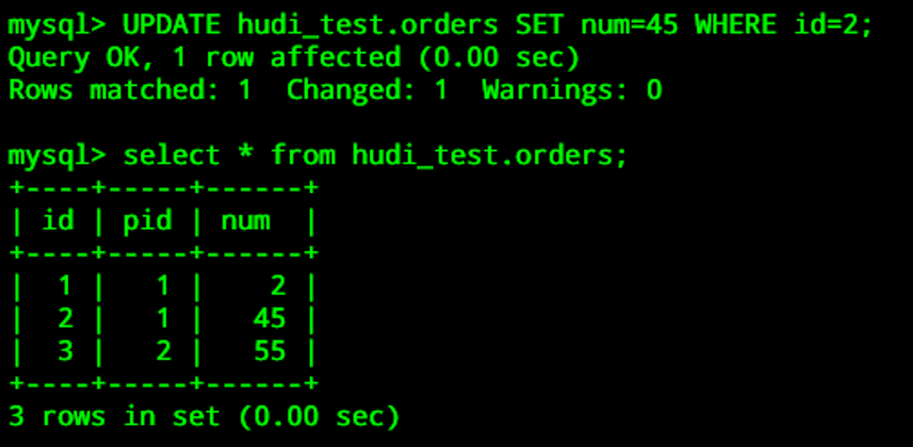 |
| 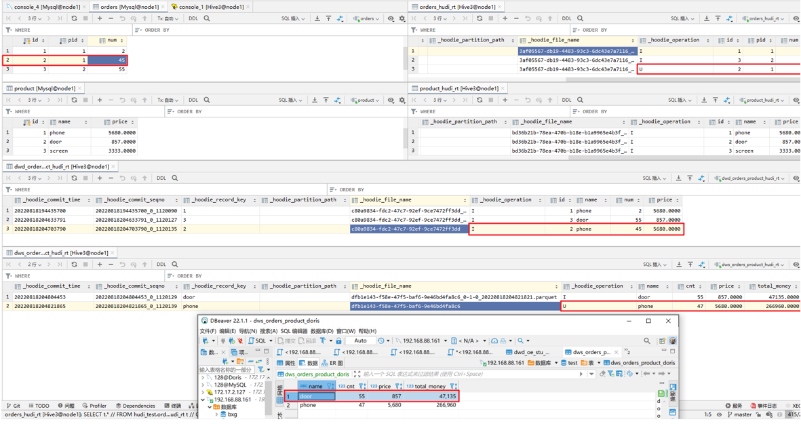 |
| orders表插入新数据                                           |
| Insert into orders values(4,2,66)                            |
| 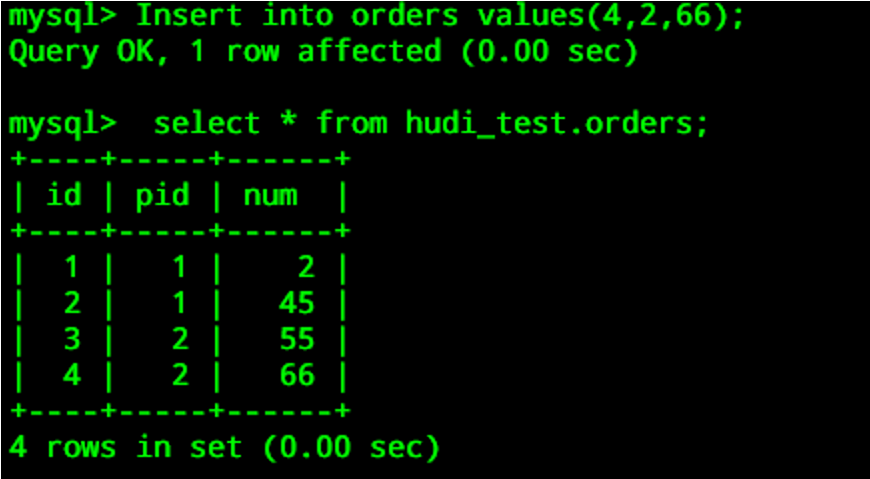 |
| 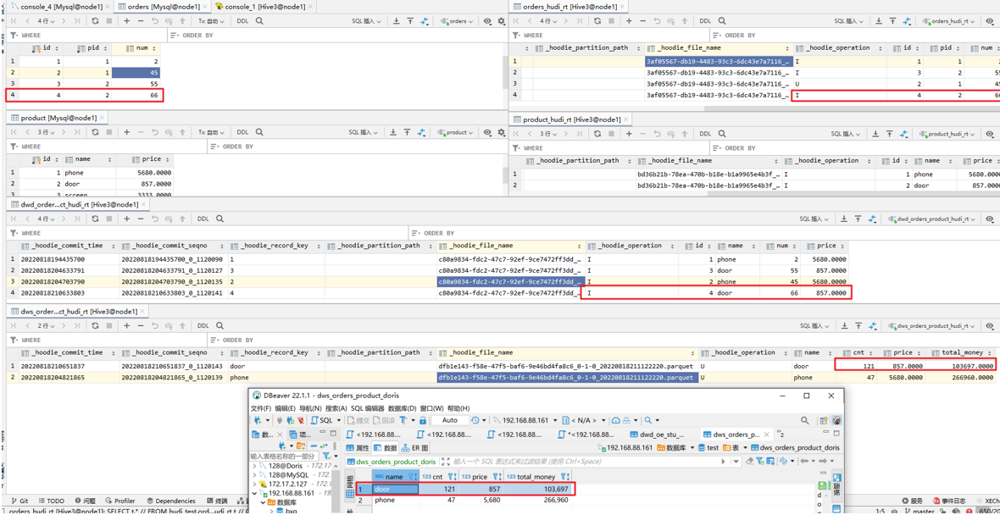 |
| orders表删除数据                                             |
| delete from orders where id = 3;                             |
| 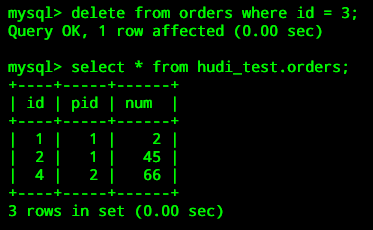 |
| 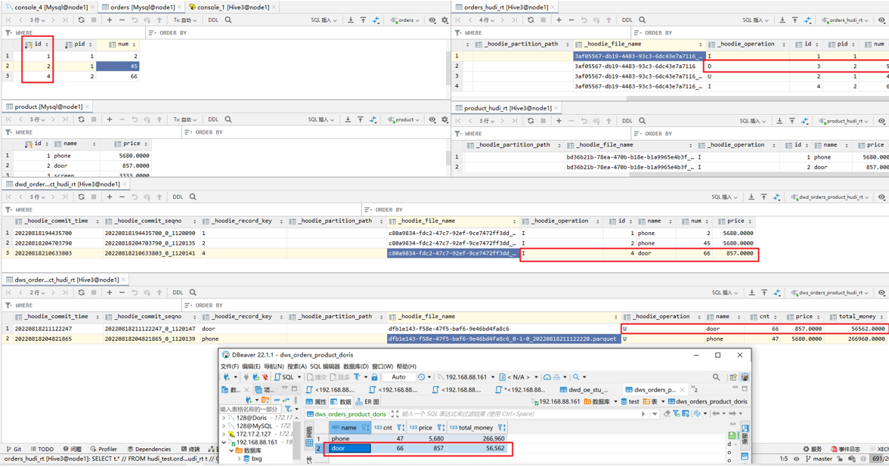 |

# 知识点06： 【掌握】新媒体短视频课程报名分析看板

## 看板相关指标

1.  《短视频掘金流量训练营2021.10.11》的营收分析
2.  《短视频掘金流量训练营-vip陪跑2021.10.11》的营收分析
3.  《短视频掘金流量训练营2021.10.25》的营收分析
4.  《短视频掘金流量训练营-vip陪跑2021.10.25》的营收分析
5.  《短视频掘金流量训练营2021.11.08》的营收分析
6.  《短视频掘金流量训练营-vip陪跑2021.11.08》的营收分析
7.  《短视频掘金流量训练营2021.11.22》的营收分析
8.  《短视频掘金流量训练营-vip陪跑2021.11.22》的营收分析
9.  《短视频掘金流量训练营2021.12.06》的营收分析
10. 《短视频掘金流量训练营-vip陪跑2021.12.06》的营收分析
11. 《短视频掘金流量训练营2021.12.20》的营收分析
12. 《短视频掘金流量训练营-vip陪跑2021.12.20》的营收分析
13. 《短视频掘金流量训练营2022.01.17》的营收分析
14. 《短视频掘金流量训练营-vip陪跑2021.01.17》的营收分析
15. 《短视频掘金流量训练营》的整体营收分析
16. 《短视频掘金流量训练营-vip陪跑》的整体营收分析

## 需求说明

### 专项课程营收分析

#### 课程说明

| 课程名称                               | 课程id |
|----------------------------------------|--------|
| 短视频掘金流量训练营2021.10.11         | 4221   |
| 短视频掘金流量训练营-vip陪跑2021.10.11 | 4223   |
| 短视频掘金流量训练营2021.10.25         | 4294   |
| 短视频掘金流量训练营-vip陪跑2021.10.25 | 4295   |
| 短视频掘金流量训练营2021.11.08         | 4326   |
| 短视频掘金流量训练营-vip陪跑2021.11.08 | 4327   |
| 短视频掘金流量训练营2021.11.22         | 4396   |
| 短视频掘金流量训练营-vip陪跑2021.11.22 | 4394   |
| 短视频掘金流量训练营2021.12.06         | 4420   |
| 短视频掘金流量训练营-vip陪跑2021.12.06 | 4421   |
| 短视频掘金流量训练营2021.12.20         | 4429   |
| 短视频掘金流量训练营-vip陪跑2021.12.20 | 4431   |
| 短视频掘金流量训练营2022.01.17         | 4452   |
| 短视频掘金流量训练营-vip陪跑2022.01.17 | 4453   |

#### 结果显示

设置查询项：课程id

**课程营收分析**

| 日期      | 全款量 | 全款金额 | 成交均价 | 课程状态 |
|-----------|--------|----------|----------|----------|
| 总计      |        |          |          |          |
| 2021/7/26 |        |          |          |          |
| 2021/7/25 |        |          |          |          |
| 2021/7/24 |        |          |          |          |
|           |        |          |          |          |
|           |        |          |          |          |
|           |        |          |          |          |
|           |        |          |          |          |
|           |        |          |          |          |

日期具体到天，如2021-7-26，从最近的日期开始倒序排列

-   课程状态：TABLE bxg.\`oe_stu_course\`中 \`status\` tinyint(4) NOT NULL COMMENT '学员课程状态：0试学、1生效、2待生效、-1停课、8退费',
-   总计中不含退费，每日销量中含退费

#### SQL参考

```sql
SELECT
    '合计' as '日期',
    count(1) "单数",
    sum(oo.paid_amount) / count(1) "均价",
    sum(oo.paid_amount) "总额",
    concat( (select concat("[", c.id, "] ", c.grade_name) from oe_course c where c.id={{ 课程ID }}), "")  '课程状态 (合计不含退费)'
FROM
    oe_stu_course osc
        JOIN oe_stu_course_order os ON osc.id = os.student_course_id
        JOIN oe_order oo ON oo.id = os.order_id
WHERE oo.payable_amount > 0
  AND oo.pay_status = 2
  AND oo.delete_flag = 0
  AND osc.delete_flag = 0
  AND osc.course_id IN (  {{ 课程ID }}  )
  AND osc.`status` != 8

union

SELECT
    date_format(oo.pay_time, '%y/%m/%d') "日期",
    count(1) "支付成功",
    sum(oo.paid_amount) / count(1) "均价",
    sum(oo.paid_amount) "总额",
    GROUP_CONCAT((case when osc.`status`=0 then '试学' when osc.`status`=1 then '生效'when osc.`status`=2 then '待生效' when osc.`status`=-1 then '停课'else '退费'end)) '课程状态'
FROM oe_stu_course osc
JOIN oe_stu_course_order os ON osc.id = os.student_course_id
JOIN oe_order oo ON oo.id = os.order_id
WHERE oo.payable_amount > 0
  AND oo.pay_status = 2
  AND oo.delete_flag = 0
  AND osc.delete_flag = 0
  -- AND osc.`status` IN (2)
  AND osc.course_id IN ({{ 课程ID }}) -- 课程ID
GROUP BY date_format(oo.pay_time, '%y/%m%d')
ORDER BY date_format(oo.pay_time, '%y/%m%d') DESC;
```

### 专项课程的整体营收分析

#### 课程说明

| 课程名称                     | 课程id                             |
|------------------------------|------------------------------------|
| 短视频掘金流量训练营         | 4420,4396,4326,4294,4221,4429,4452 |
| 短视频掘金流量训练营-vip陪跑 | 4421,4394,4327,4295,4223,4431,4453 |

#### 结果显示

**狂野系列整体营收分析**

| 课程id | 课程名称 | 全款量 | 全款金额 | 成交均价 |
|--------|----------|--------|----------|----------|
|        |          |        |          |          |
|        |          |        |          |          |
|        |          |        |          |          |
|        |          |        |          |          |

-   相关课程需要全部显示
-   需要去掉已退费订单

#### SQL参考

```sql
SELECT
    t.course_id AS `课程id`,
    t.course_name AS `课程名称`,
    t.paid_count AS `全款量`,
    t.paid_amount AS `全款额`,
    t.paid_amount /t.paid_count AS `成交均价`
FROM
    (SELECT
         cr.id AS `course_id`,
         cr.grade_name AS `course_name`,
         COUNT(CASE WHEN (oo.payable_amount > 0
                         AND oo.pay_status = 2
                         AND oo.delete_flag = 0
                         AND oo.refund_status !=-1
                         AND osc.delete_flag = 0)
                        THEN oo.id ELSE null END)  AS `paid_count`,
         SUM(CASE WHEN (oo.payable_amount > 0
                         AND oo.pay_status = 2
                         AND oo.delete_flag = 0
                         AND oo.refund_status !=-1
                         AND osc.delete_flag = 0)
                      THEN oo.paid_amount ELSE null END) AS  `paid_amount`
     FROM bxg.oe_stu_course_order os 
      LEFT JOIN bxg.oe_stu_course osc ON osc.id = os.student_course_id
      LEFT JOIN bxg.oe_order oo ON oo.id = os.order_id
      LEFT JOIN bxg.oe_course cr ON cr.id = osc.course_id
     WHERE cr.id in (  {{ 课程ID }}  )
     GROUP BY cr.id,cr.grade_name
     ORDER BY cr.id desc) t;
```

### 需求

#### 《短视频掘金流量训练营2021.10.11》的营收分析

- 说明：了解年度各月业绩营收情况，对比分析各年业绩表现和月度趋势，基本把握利润情况。

- 展示：柱状图、折线图

- 指标：成交量、成交额、成交均价

- 维度：时间

- 粒度：天

- 涉及库：bxg

- 涉及表：bxg.oe_stu_course、bxg.oe_stu_course_order、bxg.oe_order


#### 《短视频掘金流量训练营-vip陪跑2021.10.11》的营收分析

- 说明：了解年度各月业绩营收情况，对比分析各年业绩表现和月度趋势，基本把握利润情况。

- 展示：柱状图、折线图

- 指标：成交量、成交额、成交均价

- 维度：时间

- 粒度：天

- 涉及库：bxg

- 涉及表：bxg.oe_stu_course、bxg.oe_stu_course_order、bxg.oe_order


#### 《短视频掘金流量训练营2021.10.25》的营收分析

- 说明：了解年度各月业绩营收情况，对比分析各年业绩表现和月度趋势，基本把握利润情况。

- 展示：柱状图、折线图

- 指标：成交量、成交额、成交均价

- 维度：时间

- 粒度：天

- 涉及库：bxg

- 涉及表：bxg.oe_stu_course、bxg.oe_stu_course_order、bxg.oe_order


#### 《短视频掘金流量训练营-vip陪跑2021.10.25》的营收分析

- 说明：了解年度各月业绩营收情况，对比分析各年业绩表现和月度趋势，基本把握利润情况。

- 展示：柱状图、折线图

- 指标：成交量、成交额、成交均价

- 维度：时间

- 粒度：天

- 涉及库：bxg

- 涉及表：bxg.oe_stu_course、bxg.oe_stu_course_order、bxg.oe_order


#### 《短视频掘金流量训练营2021.11.08》的营收分析

- 说明：了解年度各月业绩营收情况，对比分析各年业绩表现和月度趋势，基本把握利润情况。

- 展示：柱状图、折线图

- 指标：成交量、成交额、成交均价

- 维度：时间

- 粒度：天

- 涉及库：bxg

- 涉及表：bxg.oe_stu_course、bxg.oe_stu_course_order、bxg.oe_order


#### 《短视频掘金流量训练营-vip陪跑2021.11.08》的营收分析

- 说明：了解年度各月业绩营收情况，对比分析各年业绩表现和月度趋势，基本把握利润情况。

- 展示：柱状图、折线图

- 指标：成交量、成交额、成交均价

- 维度：时间

- 粒度：天

- 涉及库：bxg

- 涉及表：bxg.oe_stu_course、bxg.oe_stu_course_order、bxg.oe_order


#### 《短视频掘金流量训练营2021.11.22》的营收分析

- 说明：了解年度各月业绩营收情况，对比分析各年业绩表现和月度趋势，基本把握利润情况。

- 展示：柱状图、折线图

- 指标：成交量、成交额、成交均价

- 维度：时间

- 粒度：天

- 涉及库：bxg

- 涉及表：bxg.oe_stu_course、bxg.oe_stu_course_order、bxg.oe_order


#### 《短视频掘金流量训练营-vip陪跑2021.11.22》的营收分析

- 说明：了解年度各月业绩营收情况，对比分析各年业绩表现和月度趋势，基本把握利润情况。

- 展示：柱状图、折线图

- 指标：成交量、成交额、成交均价

- 维度：时间

- 粒度：天

- 涉及库：bxg

- 涉及表：bxg.oe_stu_course、bxg.oe_stu_course_order、bxg.oe_order


#### 《短视频掘金流量训练营2021.12.06》的营收分析

- 说明：了解年度各月业绩营收情况，对比分析各年业绩表现和月度趋势，基本把握利润情况。

- 展示：柱状图、折线图

- 指标：成交量、成交额、成交均价

- 维度：时间

- 粒度：天

- 涉及库：bxg

- 涉及表：bxg.oe_stu_course、bxg.oe_stu_course_order、bxg.oe_order


#### 《短视频掘金流量训练营-vip陪跑2021.12.06》的营收分析

- 说明：了解年度各月业绩营收情况，对比分析各年业绩表现和月度趋势，基本把握利润情况。

- 展示：柱状图、折线图

- 指标：成交量、成交额、成交均价

- 维度：时间

- 粒度：天

- 涉及库：bxg

- 涉及表：bxg.oe_stu_course、bxg.oe_stu_course_order、bxg.oe_order


#### 《短视频掘金流量训练营2021.12.20》的营收分析

- 说明：了解年度各月业绩营收情况，对比分析各年业绩表现和月度趋势，基本把握利润情况。

- 展示：柱状图、折线图

- 指标：成交量、成交额、成交均价

- 维度：时间

- 粒度：天

- 涉及库：bxg

- 涉及表：bxg.oe_stu_course、bxg.oe_stu_course_order、bxg.oe_order


#### 《短视频掘金流量训练营-vip陪跑2021.12.20》的营收分析

- 说明：了解年度各月业绩营收情况，对比分析各年业绩表现和月度趋势，基本把握利润情况。

- 展示：柱状图、折线图

- 指标：成交量、成交额、成交均价

- 维度：时间

- 粒度：天

- 涉及库：bxg

- 涉及表：bxg.oe_stu_course、bxg.oe_stu_course_order、bxg.oe_order


#### 《短视频掘金流量训练营2022.01.17》的营收分析

- 说明：了解年度各月业绩营收情况，对比分析各年业绩表现和月度趋势，基本把握利润情况。

- 展示：柱状图、折线图

- 指标：成交量、成交额、成交均价

- 维度：时间

- 粒度：天

- 涉及库：bxg

- 涉及表：bxg.oe_stu_course、bxg.oe_stu_course_order、bxg.oe_order


#### 《短视频掘金流量训练营-vip陪跑2022.01.17》的营收分析

- 说明：了解年度各月业绩营收情况，对比分析各年业绩表现和月度趋势，基本把握利润情况。

- 展示：柱状图、折线图

- 指标：成交量、成交额、成交均价

- 维度：时间

- 粒度：天

- 涉及库：bxg

- 涉及表：bxg.oe_stu_course、bxg.oe_stu_course_order、bxg.oe_order


#### 《短视频掘金流量训练营》的整体营收分析

- 说明：了解年度各课程营收情况，对比分析各年业绩表现和课程趋势，基本把握利润情况。

- 展示：柱状图

- 指标：成交量、成交额、成交均价

- 维度：课程

- 粒度：课程

- 涉及库：bxg

- 涉及表：bxg.oe_course、bxg.oe_stu_course、bxg.oe_stu_course_order、bxg.oe_order


#### 《短视频掘流量训练营-vip陪跑》的整体营收分析

- 说明：了解年度各课程营收情况，对比分析各年业绩表现和课程趋势，基本把握利润情况。

- 展示：柱状图

- 指标：成交量、成交额、成交均价

- 维度：课程

- 粒度：课程

- 涉及库：bxg

- 涉及表：bxg.oe_course、bxg.oe_stu_course、bxg.oe_stu_course_order、bxg.oe_order


## 建模分析

### 提取指标维度

- 根据主题看板的需求，我们可以看出，主要是围绕成交量、成交额、成交均价展开的。整体营收额分析需求与各类课程营收额分析需求都可以合并为成交量、成交额、成交均价三个指标。而成交均价=成交额/成交量，由此我们可以推断出，指标主要有两个：成交量和成交额。故这里我们主要针对成交量与成交额进行分析。

- 需求1-14的维度为时间，时间维度粒度直接具体到天，而需求15-16维度为课程。所以维度主要包括时间与课程。


### 分层设计

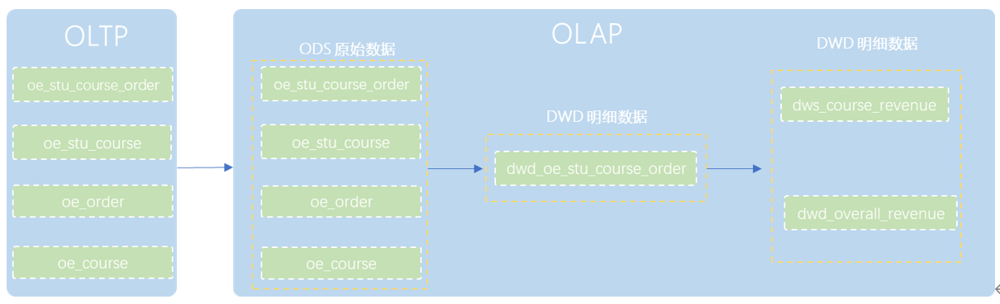

- ODS层：储存原始数据，不做改变
- DWD层：将ods层数据进行清洗转换，并将需求涉及的表合并，数据粒度保持不变
  - 数据清洗：空数据、不满足业务需求的数据处理。
  - 数据转换：数据格式和数据形式的转换，比如时间类型可以转换为同样的展现形式“yyyy-MM-dd HH:mm:ss”或者时间戳类型，金钱类型的数据可以统一转换为以元为单位或以分为单位的数值。
- DWS层：在DWD层的基础上，按照业务的要求进行数据处理（如聚合等）；

### ODS层实现

因为ODS层储存原始数据，故将数据从mysql抽取到hudi时不做改变。

#### 简单说明

整个看板涉及四张表（数据在node1上的mysql）：

| bxg.oe_stu_course_order、bxg.oe_stu_course、bxg.oe_order、 bxg.oe_course |
| ------------------------------------------------------------ |
| 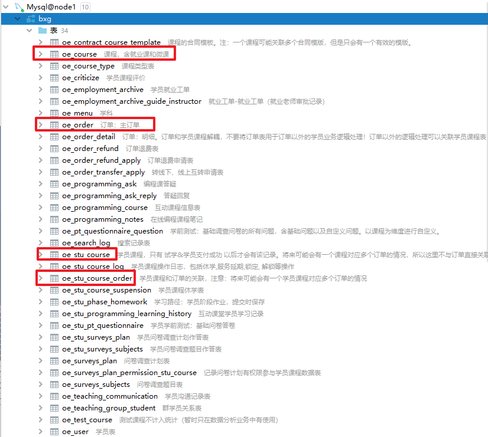 |

#### 表结构预览

以oe_course为例

| desc oe_course;                                              |
| :----------------------------------------------------------- |
| 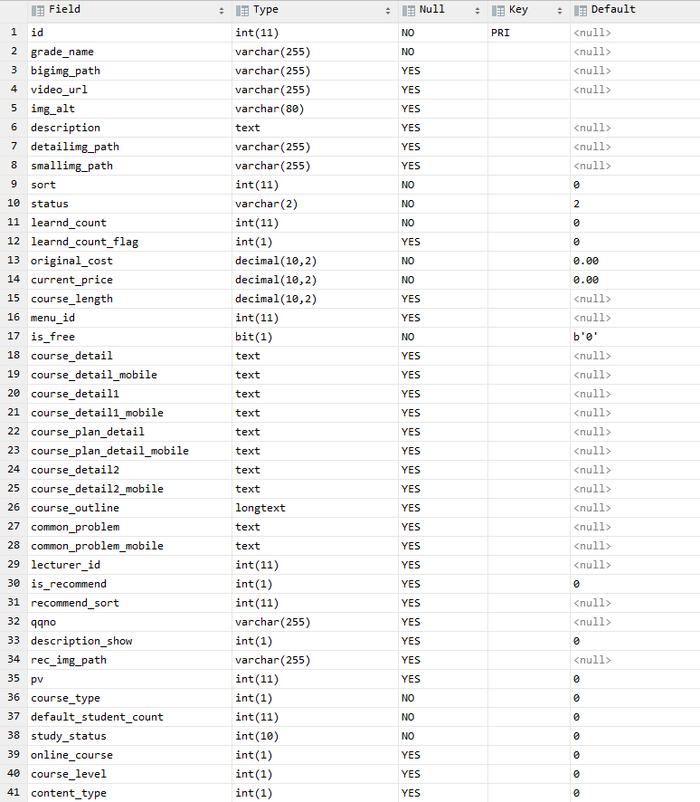 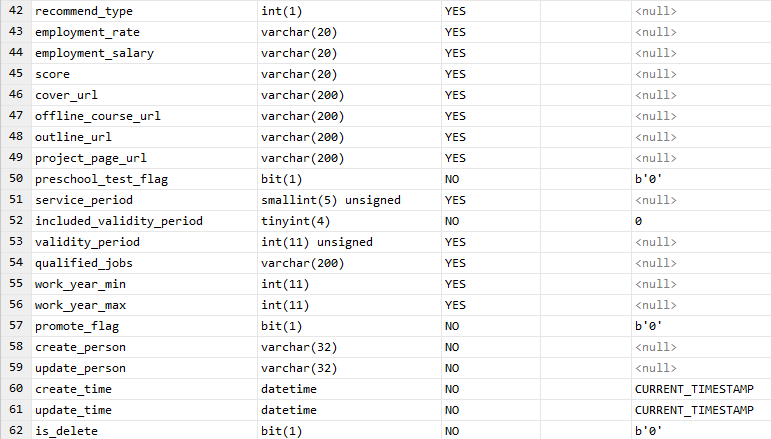 |

Mysql 与Flink SQL字段类型转换

| MySQL type                        | Flink SQL type                   |
|-----------------------------------|----------------------------------|
| TINYINT                           | TINYINT                          |
| SMALLINT,  TINYINT UNSIGNED       | SMALLINT                         |
| INT, MEDIUMINT, SMALLINT UNSIGNED | INT                              |
| BIGINT, INT UNSIGNED              | BIGINT                           |
| BIGINT UNSIGNED                   | DECIMAL(20,0)                    |
| FLOAT                             | FLOAT                            |
| DOUBLE, DOUBLE PRECISION          | DOUBLE                           |
| NUMERIC(p, s), DECIMAL(p, s)      | DECIMAL(p, s)                    |
| BOOLEAN, TINYINT(1)               | BOOLEAN                          |
| DATE                              | DATE                             |
| TIME [§]                          | DOUBLE                           |
| DATETIME [§]                      | TIMESTAMP [§] [WITHOUT TIMEZONE] |
| CHAR(n), VARCHAR(n), TEXT         | STRING                           |

> **注意：**MySQL中的TINYINT与SMALLINT在后续sink到hudi中后会自动转换为INT类型

+ Mysql中表结构

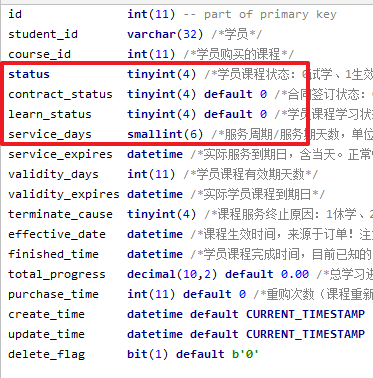

+ 我们在flinksql中查看Hive中查看hudi表结构

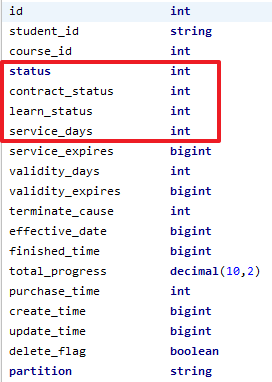

> 所以这里，我们在创建hudi表映射时，直接把mysql中TINYINT与SMALLINT类型转换为INT类型 
>

#### Flink SQL建表语句

##### Mysql 映射表

###### mysql_bxg_oe_stu_course_order

```sql
CREATE TABLE if not exists mysql_bxg_oe_stu_course_order (
    `id` INT,
    `student_course_id` INT,
    `order_id` STRING,
    `order_detail_id` STRING,
    `create_time` TIMESTAMP(3),
    `update_time` TIMESTAMP(3),
    `delete_flag` BOOLEAN,
    PRIMARY KEY (`id`) NOT ENFORCED
) WITH (
    'connector'= 'mysql-cdc',
    'hostname'= 'node1',
    'port'= '3306',
    'username'= 'root',
    'password'='123456',
    'server-time-zone'= 'Asia/Shanghai',
    'debezium.snapshot.mode'='initial',
    'database-name'= 'bxg',
    'table-name'= 'oe_stu_course_order'
);
```

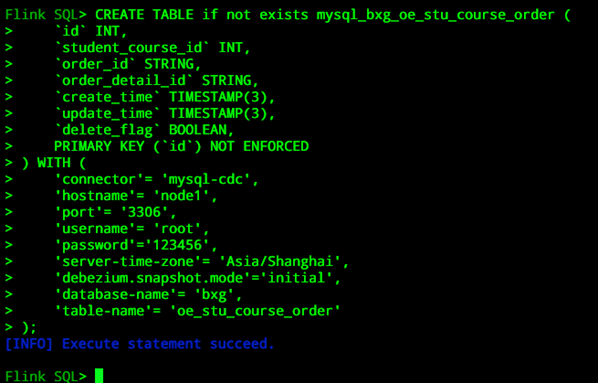

###### mysql_bxg_oe_stu_course

```sql
CREATE TABLE if not exists mysql_bxg_oe_stu_course (
    `id` INT,
    `student_id` STRING,
    `course_id` INT,
    `status` TINYINT,
    `contract_status` TINYINT,
    `learn_status` TINYINT,
    `service_days` SMALLINT,
    `service_expires` TIMESTAMP(3),
    `validity_days` INT,
    `validity_expires` TIMESTAMP(3),
    `terminate_cause` TINYINT,
    `effective_date` TIMESTAMP(3),
    `finished_time` TIMESTAMP(3),
    `total_progress` DECIMAL(10,2),
    `purchase_time` INT,
    `create_time` TIMESTAMP(3),
    `update_time` TIMESTAMP(3),
    `delete_flag` BOOLEAN,
    PRIMARY KEY (`id`) NOT ENFORCED
) WITH (
    'connector'= 'mysql-cdc',
    'hostname'= 'node1',
    'port'= '3306',
    'username'= 'root',
    'password'='123456',
    'server-time-zone'= 'Asia/Shanghai',
    'debezium.snapshot.mode'='initial',
    'database-name'= 'bxg',
    'table-name'= 'oe_stu_course'
);
```

###### mysql_bxg_oe_order

```sql
CREATE TABLE if not exists mysql_bxg_oe_order (
    `id` STRING,
    `channel` STRING,
    `student_id` STRING,
    `order_no` STRING,
    `total_amount` DECIMAL(10,2),
    `discount_amount` DECIMAL(10,2),
    `charge_against_amount` DECIMAL(10,2),
    `payable_amount` DECIMAL(10,2),
    `status` TINYINT,
    `pay_status` TINYINT,
    `pay_time` TIMESTAMP(3),
    `paid_amount` DECIMAL(10,2),
    `effective_date` TIMESTAMP(3),
    `terminal` TINYINT,
    `refund_status` TINYINT,
    `refund_amount` DECIMAL(10,2),
    `refund_time` TIMESTAMP(3),
    `create_time` TIMESTAMP(3),
    `update_time` TIMESTAMP(3),
    `delete_flag` BOOLEAN,
    PRIMARY KEY (id) NOT ENFORCED
) WITH (
    'connector' = 'mysql-cdc',
    'hostname' = 'node1',
    'port' = '3306',
    'username' = 'root',
    'password' = '123456',
    'server-time-zone'= 'Asia/Shanghai',
    'debezium.snapshot.mode'='initial',
    'database-name'= 'bxg',
    'table-name' = 'oe_order'
);
```

###### mysql_bxg_oe_course

```sql
CREATE TABLE if not exists mysql_bxg_oe_course (
    `id` INT,
    `grade_name` STRING,
    `bigimg_path` STRING,
    `video_url` STRING,
    `img_alt` STRING,
    `description` STRING,
    `detailimg_path` STRING,
    `smallimg_path` STRING,
    `sort` INT,
    `status` STRING,
    `learnd_count` INT,
    `learnd_count_flag` INT,
    `original_cost` DECIMAL(10,2),
    `current_price` DECIMAL(10,2),
    `course_length` DECIMAL(10,2),
    `menu_id` INT,
    `is_free` BOOLEAN,
    `course_detail` STRING,
    `course_detail_mobile` STRING,
    `course_detail1` STRING,
    `course_detail1_mobile` STRING,
    `course_plan_detail` STRING,
    `course_plan_detail_mobile` STRING,
    `course_detail2` STRING,
    `course_detail2_mobile` STRING,
    `course_outline` STRING,
    `common_problem` STRING,
    `common_problem_mobile` STRING,
    `lecturer_id` INT,
    `is_recommend` INT,
    `recommend_sort` INT,
    `qqno` STRING,
    `description_show` INT,
    `rec_img_path` STRING,
    `pv` INT,
    `course_type` INT,
    `default_student_count` INT,
    `study_status` INT,
    `online_course` INT,
    `course_level` INT,
    `content_type` INT,
    `recommend_type` INT,
    `employment_rate` STRING,
    `employment_salary` STRING,
    `score` STRING,
    `cover_url` STRING,
    `offline_course_url` STRING,
    `outline_url` STRING,
    `project_page_url` STRING,
    `preschool_test_flag` BOOLEAN,
    `service_period` INT,
    `included_validity_period` TINYINT,
    `validity_period` INT,
    `qualified_jobs` STRING,
    `work_year_min` INT,
    `work_year_max` INT,
    `promote_flag` BOOLEAN,
    `create_person` STRING,
    `update_person` STRING,
    `create_time` TIMESTAMP(3),
    `update_time` TIMESTAMP(3),
    `is_delete` BOOLEAN,
    PRIMARY KEY (`id`) NOT ENFORCED
) WITH (
    'connector'= 'mysql-cdc',
    'hostname'= 'node1',
    'port'= '3306',
    'username'= 'root',
    'password'='123456',
    'server-time-zone'= 'Asia/Shanghai',
    'debezium.snapshot.mode'='initial',
    'database-name'= 'bxg',
    'table-name'= 'oe_course'
);
```

##### Hudi映射表

###### hudi_bxg_ods_oe_stu_course_order

```sql
CREATE TABLE if not exists hudi_bxg_ods_oe_stu_course_order (
    `id` INT,
    `student_course_id` INT,
    `order_id` STRING,
    `order_detail_id` STRING,
    `create_time` TIMESTAMP(3),
    `update_time` TIMESTAMP(3),
    `delete_flag` BOOLEAN,
   PRIMARY KEY (id) NOT ENFORCED
) WITH(
    'connector'='hudi'
    ,'path'= 'hdfs://node1:8020/hudi/bxg/ods_oe_stu_course_order'
    ,'hoodie.datasource.write.recordkey.field'= 'id' 
    ,'write.tasks'= '1'
    ,'compaction.tasks'= '1'
    ,'write.rate.limit'= '2000' 
    ,'table.type'= 'MERGE_ON_READ' 
    ,'compaction.async.enabled'= 'true' 
    ,'compaction.trigger.strategy'= 'num_commits' 
    ,'compaction.delta_commits'= '1'
    ,'changelog.enabled'= 'true' 
    ,'read.tasks' = '1'
    ,'read.streaming.enabled'= 'true' 
    ,'read.start-commit'='earliest'
    ,'read.streaming.check-interval'= '3'
    ,'hive_sync.enable'= 'true' 
    ,'hive_sync.mode'= 'hms' 
    ,'hive_sync.metastore.uris'= 'thrift://node1:9083'
    ,'hive_sync.table'= 'ods_oe_stu_course_order'
    ,'hive_sync.db'= 'bxg' 
    ,'hive_sync.username'= '' 
    ,'hive_sync.password'= '' 
    ,'hive_sync.support_timestamp'= 'true' 
);
```

> ```sql
> 参数解释：    
> 
> ) WITH(
>  'connector'='hudi'
>  ,'path'= 'hdfs://192.168.88.161:8020/hudi/bxg/ods_oe_course '
>  ,'hoodie.datasource.write.recordkey.field'= 'id' -- 主键
>  ,'write.tasks'= '1'
>  ,'compaction.tasks'= '1'
>  ,'write.rate.limit'= '2000' -- 限速
>  ,'table.type'= 'MERGE_ON_READ'  -- 默认COPY_ON_WRITE,可选MERGE_ON_READ
>  ,'compaction.async.enabled'= 'true'  -- 是否开启异步压缩
>  ,'compaction.trigger.strategy'= 'num_commits'  -- 按次数压缩
>  ,'compaction.delta_commits'= '1'  -- 默认为5
>  ,'changelog.enabled'= 'true'  -- 开启changelog变更
>  ,'read.tasks' = '1'
>  ,'read.streaming.enabled'= 'true'  -- 开启流读
>  ,'read.start-commit'='earliest' --如果想消费所有数据，设置值为earliest
>  ,'read.streaming.check-interval'= '3'  -- 检查间隔，默认60s
>  ,'hive_sync.enable'= 'true'  -- 开启自动同步hive
>  ,'hive_sync.mode'= 'hms'  -- 自动同步hive模式，默认jdbc模式
>  ,'hive_sync.metastore.uris'= 'thrift://192.168.88.161:9083'  -- hive metastore地址
>  ,'hive_sync.table'= 'ods_oe_course '  -- hive 新建表名
>  ,'hive_sync.db'= 'bxg'  -- hive 新建数据库名
>  ,'hive_sync.username'= ''  -- HMS 用户名
>  ,'hive_sync.password'= ''  -- HMS 密码
>  ,'hive_sync.support_timestamp'= 'true'-- 兼容hive timestamp类型
> );
> ```

###### hudi_bxg_ods_oe_stu_course

```sql
CREATE TABLE if not exists hudi_bxg_ods_oe_stu_course (
    `id` INT,
    `student_id` STRING,
    `course_id` INT,
    `status` INT,
    `contract_status` INT,
    `learn_status` INT,
    `service_days` INT,
    `service_expires` TIMESTAMP(3),
    `validity_days` INT,
    `validity_expires` TIMESTAMP(3),
    `terminate_cause` INT,
    `effective_date` TIMESTAMP(3),
    `finished_time` TIMESTAMP(3),
    `total_progress` DECIMAL(10,2),
    `purchase_time` INT,
    `create_time` TIMESTAMP(3),
    `update_time` TIMESTAMP(3),
    `delete_flag` BOOLEAN,
   PRIMARY KEY (id) NOT ENFORCED
) WITH(
    'connector'='hudi'
    ,'path'= 'hdfs://node1:8020/hudi/bxg/ods_oe_stu_course'
    ,'hoodie.datasource.write.recordkey.field'= 'id' 
    ,'write.tasks'= '1'
    ,'compaction.tasks'= '1'
    ,'write.rate.limit'= '2000' 
    ,'table.type'= 'MERGE_ON_READ' 
    ,'compaction.async.enabled'= 'true' 
    ,'compaction.trigger.strategy'= 'num_commits' 
    ,'compaction.delta_commits'= '1'
    ,'changelog.enabled'= 'true' 
    ,'read.tasks' = '1'
    ,'read.streaming.enabled'= 'true' 
    ,'read.start-commit'='earliest'
    ,'read.streaming.check-interval'= '3'
    ,'hive_sync.enable'= 'true' 
    ,'hive_sync.mode'= 'hms' 
    ,'hive_sync.metastore.uris'= 'thrift://node1:9083'
    ,'hive_sync.table'= 'ods_oe_stu_course'
    ,'hive_sync.db'= 'bxg' 
    ,'hive_sync.username'= '' 
    ,'hive_sync.password'= '' 
    ,'hive_sync.support_timestamp'= 'true' 
);
```

###### hudi_bxg_ods_oe_order

```sql
CREATE TABLE if not exists hudi_bxg_ods_oe_order (
    `id` STRING,
    `channel` STRING,
    `student_id` STRING,
    `order_no` STRING,
    `total_amount` DECIMAL(10,2),
    `discount_amount` DECIMAL(10,2),
    `charge_against_amount` DECIMAL(10,2),
    `payable_amount` DECIMAL(10,2),
    `status` INT,
    `pay_status` INT,
    `pay_time` TIMESTAMP(3),
    `paid_amount` DECIMAL(10,2),
    `effective_date` TIMESTAMP(3),
    `terminal` INT,
    `refund_status` INT,
    `refund_amount` DECIMAL(10,2),
    `refund_time` TIMESTAMP(3),
    `create_time` TIMESTAMP(3),
    `update_time` TIMESTAMP(3),
    `delete_flag` BOOLEAN,
   PRIMARY KEY (id) NOT ENFORCED
)WITH(
    'connector'='hudi'
    ,'path'= 'hdfs://node1:8020/hudi/bxg/ods_oe_order'
    ,'hoodie.datasource.write.recordkey.field'= 'id' 
    ,'write.tasks'= '1'
    ,'compaction.tasks'= '1'
    ,'write.rate.limit'= '2000' 
    ,'table.type'= 'MERGE_ON_READ' 
    ,'compaction.async.enabled'= 'true' 
    ,'compaction.trigger.strategy'= 'num_commits' 
    ,'compaction.delta_commits'= '1'
    ,'changelog.enabled'= 'true' 
    ,'read.tasks' = '1'
    ,'read.streaming.enabled'= 'true' 
    ,'read.start-commit'='earliest'
    ,'read.streaming.check-interval'= '3'
    ,'hive_sync.enable'= 'true' 
    ,'hive_sync.mode'= 'hms' 
    ,'hive_sync.metastore.uris'= 'thrift://node1:9083'
    ,'hive_sync.table'= 'ods_oe_order'
    ,'hive_sync.db'= 'bxg' 
    ,'hive_sync.username'= '' 
    ,'hive_sync.password'= '' 
    ,'hive_sync.support_timestamp'= 'true' 
);
```

###### hudi_bxg_ods_oe_course

```sql
CREATE TABLE if not exists hudi_bxg_ods_oe_course(
    `id` INT,
    `grade_name` STRING,
    `bigimg_path` STRING,
    `video_url` STRING,
    `img_alt` STRING,
    `description` STRING,
    `detailimg_path` STRING,
    `smallimg_path` STRING,
    `sort` INT,
    `status` STRING,
    `learnd_count` INT,
    `learnd_count_flag` INT,
    `original_cost` DECIMAL(10,2),
    `current_price` DECIMAL(10,2),
    `course_length` DECIMAL(10,2),
    `menu_id` INT,
    `is_free` BOOLEAN,
    `course_detail` STRING,
    `course_detail_mobile` STRING,
    `course_detail1` STRING,
    `course_detail1_mobile` STRING,
    `course_plan_detail` STRING,
    `course_plan_detail_mobile` STRING,
    `course_detail2` STRING,
    `course_detail2_mobile` STRING,
    `course_outline` STRING,
    `common_problem` STRING,
    `common_problem_mobile` STRING,
    `lecturer_id` INT,
    `is_recommend` INT,
    `recommend_sort` INT,
    `qqno` STRING,
    `description_show` INT,
    `rec_img_path` STRING,
    `pv` INT,
    `course_type` INT,
    `default_student_count` INT,
    `study_status` INT,
    `online_course` INT,
    `course_level` INT,
    `content_type` INT,
    `recommend_type` INT,
    `employment_rate` STRING,
    `employment_salary` STRING,
    `score` STRING,
    `cover_url` STRING,
    `offline_course_url` STRING,
    `outline_url` STRING,
    `project_page_url` STRING,
    `preschool_test_flag` BOOLEAN,
    `service_period` INT,
    `included_validity_period` INT,
    `validity_period` INT,
    `qualified_jobs` STRING,
    `work_year_min` INT,
    `work_year_max` INT,
    `promote_flag` BOOLEAN,
    `create_person` STRING,
    `update_person` STRING,
    `create_time` TIMESTAMP(3),
    `update_time` TIMESTAMP(3),
    `is_delete` BOOLEAN,
   PRIMARY KEY (id) NOT ENFORCED
) WITH(
    'connector'='hudi'
    ,'path'= 'hdfs://node1:8020/hudi/bxg/ods_oe_course'
    ,'hoodie.datasource.write.recordkey.field'= 'id' 
    ,'write.tasks'= '1'
    ,'compaction.tasks'= '1'
    ,'write.rate.limit'= '2000' 
    ,'table.type'= 'MERGE_ON_READ' 
    ,'compaction.async.enabled'= 'true' 
    ,'compaction.trigger.strategy'= 'num_commits' 
    ,'compaction.delta_commits'= '1'
    ,'changelog.enabled'= 'true' 
    ,'read.tasks' = '1'
,'read.streaming.enabled'= 'true'
    ,'read.start-commit'='earliest' 
    ,'read.streaming.check-interval'= '3'
    ,'hive_sync.enable'= 'true' 
    ,'hive_sync.mode'= 'hms' 
    ,'hive_sync.metastore.uris'= 'thrift://node1:9083'
    ,'hive_sync.table'= 'ods_oe_course'
    ,'hive_sync.db'= 'bxg' 
    ,'hive_sync.username'= '' 
    ,'hive_sync.password'= '' 
    ,'hive_sync.support_timestamp'= 'true' 
);
```

##### 采用insert into load向hudi中插入数据

Flink sql-client中hudi映射表已经创建完毕

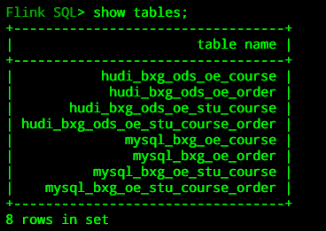

在插入数据之前需要先执行下面语句

```sql
set execution.checkpointing.interval=30sec; 
```

###### ods_oe_stu_course_order

```sql
INSERT INTO `hudi_bxg_ods_oe_stu_course_order` SELECT `id`, `student_course_id`, `order_id`, `order_detail_id`, `create_time`, `update_time`, `delete_flag`
FROM `mysql_bxg_oe_stu_course_order`;
```

进入flink web监控页面node1:8081

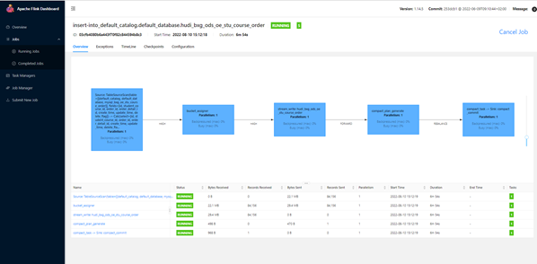

###### ods_oe_stu_course

```sql
INSERT INTO `hudi_bxg_ods_oe_stu_course` SELECT  id, student_id, course_id, status, contract_status, learn_status, service_days, service_expires, validity_days, validity_expires, terminate_cause, effective_date, finished_time, total_progress, purchase_time, create_time, update_time, delete_flag 
FROM `mysql_bxg_oe_stu_course`;
```

###### ods_oe_order

```sql
INSERT INTO `hudi_bxg_ods_oe_order` SELECT  `id`, `channel`, `student_id`, `order_no`, `total_amount`, `discount_amount`, `charge_against_amount`, `payable_amount`, `status`, `pay_status`, `pay_time`, `paid_amount`, `effective_date`, `terminal`, `refund_status`, `refund_amount`, `refund_time`, `create_time`, `update_time`, `delete_flag`
FROM `mysql_bxg_oe_order`;
```

###### ods_oe_course

```sql
INSERT INTO `hudi_bxg_ods_oe_course`
select  id, grade_name, bigimg_path, video_url, img_alt, description, detailimg_path, smallimg_path, sort, status, learnd_count, learnd_count_flag, original_cost, current_price, course_length, menu_id, is_free, course_detail, course_detail_mobile, course_detail1, course_detail1_mobile, course_plan_detail, course_plan_detail_mobile, course_detail2, course_detail2_mobile, course_outline, common_problem, common_problem_mobile, lecturer_id, is_recommend, recommend_sort, qqno, description_show, rec_img_path, pv, course_type, default_student_count, study_status, online_course, course_level, content_type, recommend_type, employment_rate, employment_salary, score, cover_url, offline_course_url, outline_url, project_page_url, preschool_test_flag, service_period, included_validity_period, validity_period, qualified_jobs, work_year_min, work_year_max, promote_flag, create_person, update_person, create_time, update_time
from `mysql_bxg_oe_course`;
```

#### 结果展示

##### Flink web页面

| node1:8081                                                   |
| ------------------------------------------------------------ |
| 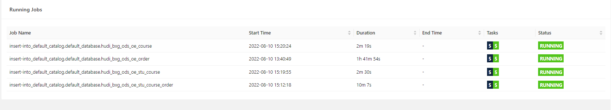 |

可以看到4个任务正常运行

##### 数据核对

-   查看hive表（我们hudi集成了hive，可以在hive中查询hudi表）

| node1:9870                                                   |
| ------------------------------------------------------------ |
| 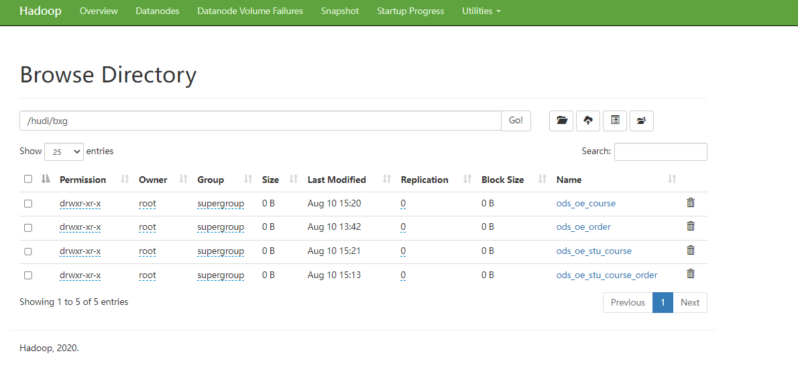 |
| 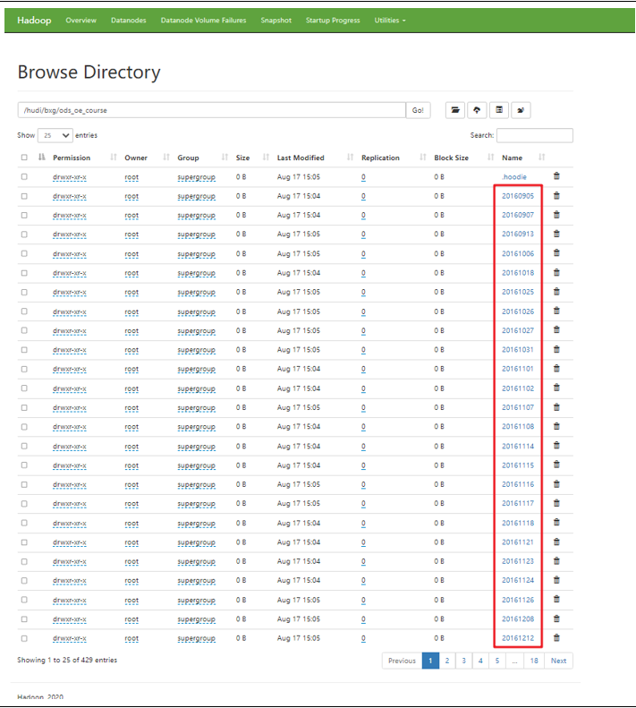 |
| 连接hive客户端查看                                           |
| 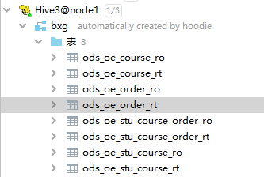 |
| hive中ods_oe_course表                                        |
| 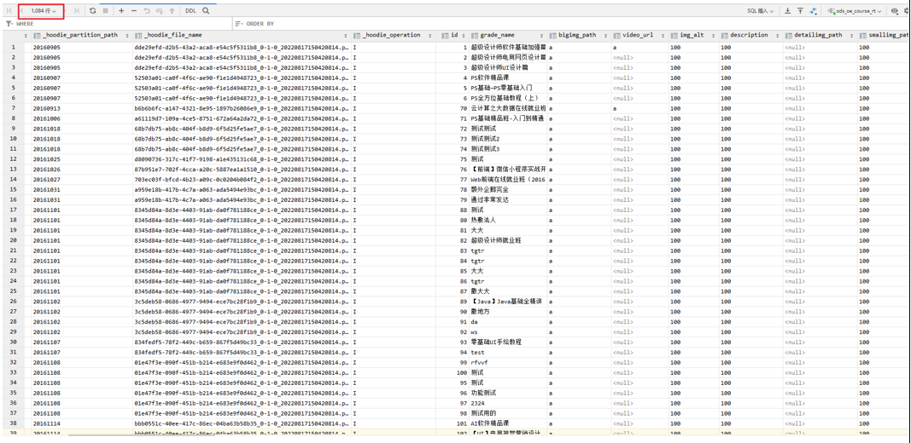 |
| Mysql中oe_course表                                           |
| 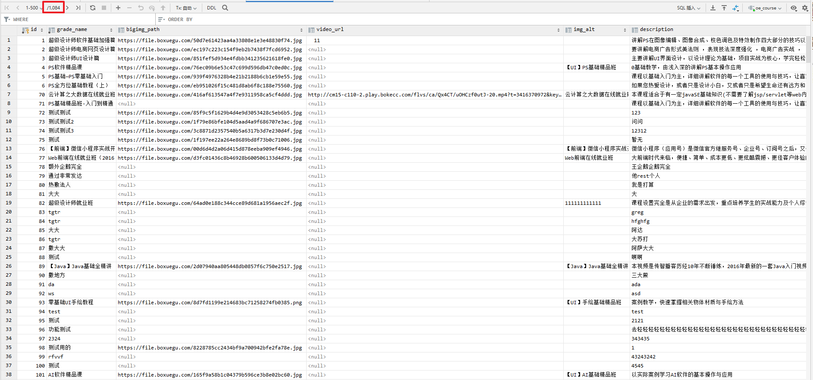 |

### DWD层实现

#### 宽表设计

##### 表关系

整个看板主要分为两个板块：一个是专项课程营收分析，按**课程维度**聚合的营收额（1-14）；一个是专项课程的整体营收分析，按**时间维度**聚合的营收额（15-16）。

-   **表关系如下：**

**专项课程营收分析**

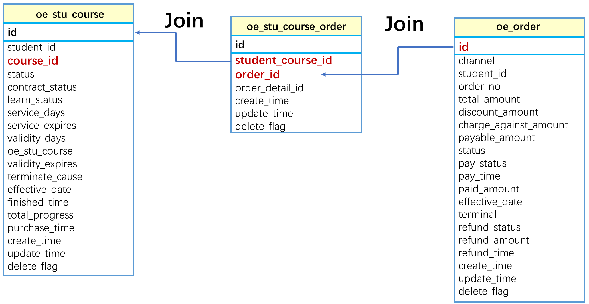

**专项课程的整体营收分析**

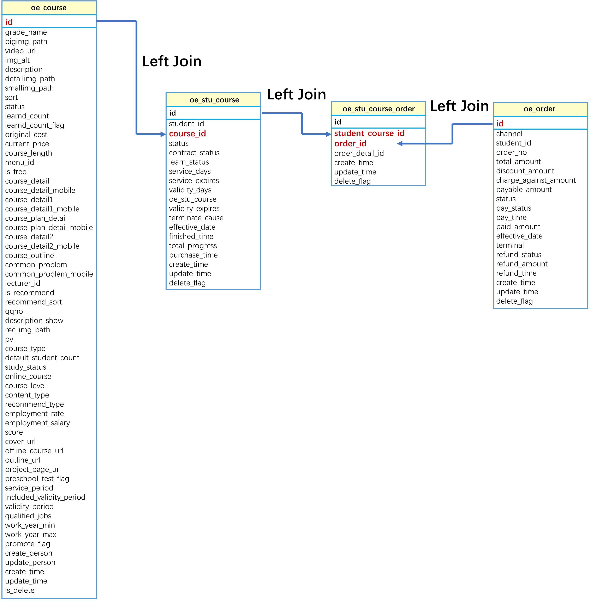

##### 分析

**那么如何能把这两个需求提取出合成一张宽表呢？**

###### Join方式

- 可以看到需求一是**oe_stu_course、oe_stu_course_order、oe_order三张表之间join，**而在需求二**oe_course、oe_stu_course、oe_stu_course_order、oe_order四张表中，是后三张表之间进行left join。**那么这两种join方式怎么转换呢？

- 可以知道的是left join是以左表为主表，主表全部显示，右表能关联上的显示，不能关联上的部分显示为null，而inner join关联是取两个表公共的部分。那么如果将left join中关联不上的部分去掉即可以得到inner join

- 综合看，我们应该选择left join模式，对于需求1，我们将未关联上的数据去除即可进行后续的聚合。


###### 主表选择

- 这里我们如果选择将表左关联，那么主表的选择就变得尤为关键。

- 举个例子：我们将oe_stu_course_order表与oe_stu_course表做如下关联


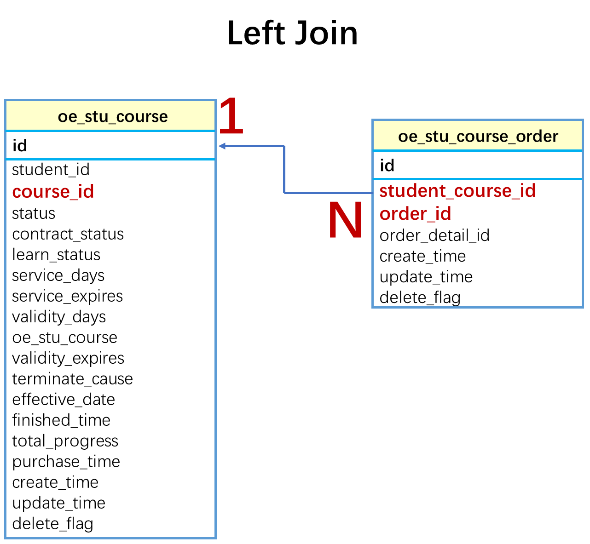

+ 首先，我们先看这两张表，是**oe_stu_course_order**表中的**student_course_id**字段左关联到**oe_stu_course**表中的**id**字段。**oe_stu_course**表中的**id**字段是主键，肯定是唯一的，而**oe_stu_course_order**表中存在一个**student_course_id**对应多个**order_id，**故**oe_stu_course_order**表中的**student_course_id**字段不唯一，这样就产生了**一对多**的情况。

```sql
SELECT COUNT(osc.id),
       COUNT(distinct osc.id)
from bxg.oe_stu_course osc
left join bxg.oe_stu_course_order osco on osco.student_course_id =osc.id;
```

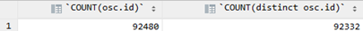

+ 我们采用下面sql查看一下具体是哪些id产生课一对多的情况。

```sql
SELECT t.id,
       osco.id
from (
         SELECT COUNT(osc.id) cnt,
                osc.id
         from bxg.oe_stu_course osc
         left join bxg.oe_stu_course_order osco on osco.student_course_id =osc.id
         group by osc.id
         having cnt >1
     ) t
left join bxg.oe_stu_course_order osco on osco.student_course_id =t.id;
```

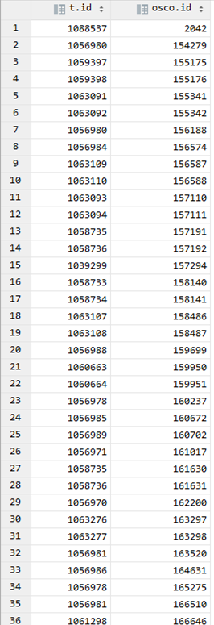

当这种情况存在时，我们在构建宽表时，要保证表之间的关系为多对一或者一对一。即在保证业务逻辑正确的前提下，要尽量选择维表的主键（id）去关联主表的非主键。

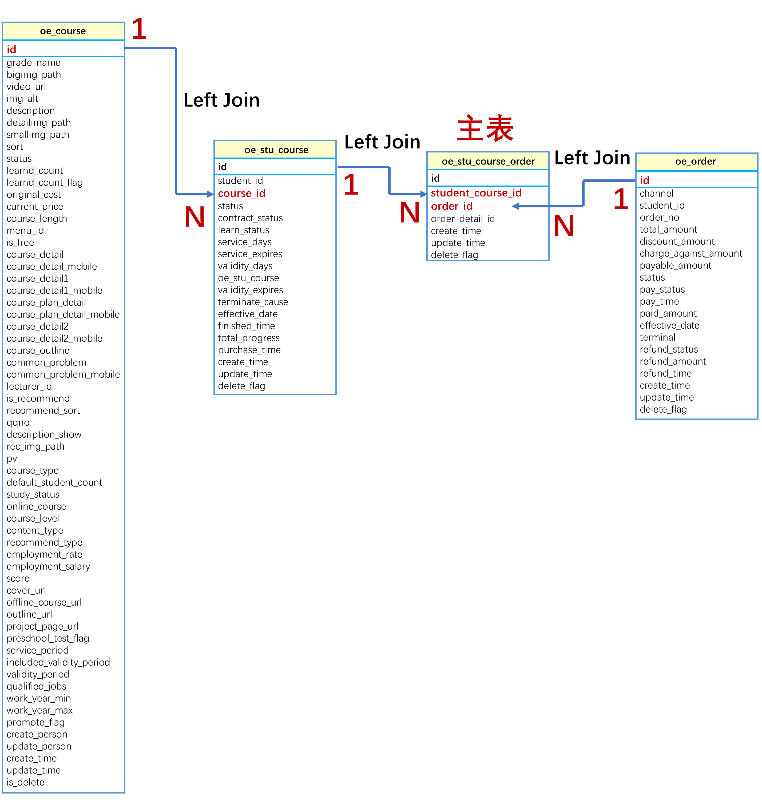

##### 表结构

-   **每张表涉及字段（不包含关联字段）**

ods_oe_stu_course_order（osco）： id, student_course_id, order_id

ods_oe_stu_course（osc）：course_id、status、delete_flag

ods_oe_order（oo）：payable_amount、pay_status、pay_time、paid_amount、refund_status、delete_flag

****ods_oe_course （oe）： grade_name

根据每张表涉及的字段，我们初步设计出宽表，如上图所示。（关联所涉及的字段不一定要显示，故不在统计内）这只是最基础的宽表，在后续不断梳理需求的过程中，我们也会对宽表进行调整。

在最初设计宽表的时候，不一定只是根据现有需求添加涉及字段，我们可以根据经验添加我们认为有用的字段，为后续可能出现的需求做准备。同时，维度方面也可以扩充，如现在时间维度是天，我们可以下钻到小时，也可以上卷到月，年等。

继续梳理需求，我们可以看到sql中有一部分是公共条件，这一部分我们可以提取出来打上标签。

```sql
WHERE
      oo.payable_amount > 0
  AND oo.pay_status = 2
  AND oo.delete_flag = 0
  AND osc.delete_flag = 0
```

这部分筛选出来应该是**“实际应付总金额大于0且支付状态pay_status完成”**的订单。那么我们可以添加一个**\`is_complete_order\`**字段 if(oo.\`payable_amount\`\>0 and \`oo\`.\`pay_status\`=2 and \`oo\`.\`delete_flag\` = 0 and \`osc\`.\`delete_flag\`=0,true,false)。调整DWD表结构如下：


最后一步，我们为了避免字段名歧义，我们调整一下字段名


#### 宽表实现

##### Hudi_DWD层

Hudi_dwd映射表

```sql
CREATE TABLE if not exists hudi_dwd_oe_stu_course_order (
     `id` int,
     `stu_course_id` int,
     `order_id` string,
     `course_id` int,
     `stu_course_status` int,
     `stu_course_status_des` string,
     `stu_course_delete_flag` BOOLEAN,
     `payable_amount` decimal(10,2),
     `pay_status` int,
     `pay_time` TIMESTAMP(3),
     `paid_amount` decimal(10,2),
     `refund_status` int,
     `order_delete_flag` boolean,
     `grade_name` string,
     `is_complete_order` boolean,
     PRIMARY KEY (`id`) NOT ENFORCED
) WITH(
    'connector'='hudi'
    ,'path'= 'hdfs://node1:8020/hudi/bxg/dwd_oe_stu_course_order'
    ,'hoodie.datasource.write.recordkey.field'= 'id' 
    ,'write.tasks'= '1'
    ,'compaction.tasks'= '1'
    ,'write.rate.limit'= '2000' 
    ,'table.type'= 'MERGE_ON_READ' 
    ,'compaction.async.enabled'= 'true' 
    ,'compaction.trigger.strategy'= 'num_commits' 
    ,'compaction.delta_commits'= '1'
    ,'changelog.enabled'= 'true' 
    ,'read.tasks' = '3'
    ,'read.streaming.enabled'= 'true' 
    ,'read.start-commit'='earliest'
    ,'read.streaming.check-interval'= '3'
    ,'hive_sync.enable'= 'true' 
    ,'hive_sync.mode'= 'hms' 
    ,'hive_sync.metastore.uris'= 'thrift://node1:9083'
    ,'hive_sync.table'= 'dwd_oe_stu_course_order'
    ,'hive_sync.db'= 'bxg' 
    ,'hive_sync.username'= '' 
    ,'hive_sync.password'= '' 
    ,'hive_sync.support_timestamp'= 'true' 
);
```

插入数据

```sql
insert into hudi_dwd_oe_stu_course_order
SELECT
    `osco`.`id`,
    `osco`.`student_course_id`,
    `osco`.`order_id`,
    `osc`.`course_id`,
    `osc`.`status` as `stu_course_status`,
     case `osc`.`status` when 0 then '试学' when 1 then '生效' when 2 then '待生效' when -1 then '停课' else '退费' end as `stu_course_status_des`,
    `osc`.`delete_flag` as `stu_course_delete_flag`,
    `oo`.`payable_amount`,
    `oo`.`pay_status`,
    `oo`.`pay_time`,
    `oo`.`paid_amount`,
    `oo`.`refund_status`,
    `oo`.`delete_flag` as `order_delete_flag`,
    `oc`.`grade_name`,
    if (oo.`payable_amount`>0 and `oo`.`pay_status`=2 and `oo`.`delete_flag` = false and `osc`.`delete_flag` = false, true, false) as is_complete_order
FROM hudi_bxg_ods_oe_stu_course_order AS osco
LEFT JOIN hudi_bxg_ods_oe_stu_course AS osc
ON osc.id = osco.student_course_id
LEFT JOIN hudi_bxg_ods_oe_order AS oo
ON oo.id = osco.order_id
LEFT JOIN hudi_bxg_ods_oe_course AS oc
ON oc.id = osc.course_id;
```

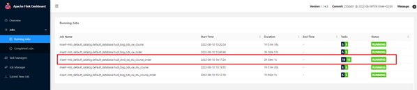

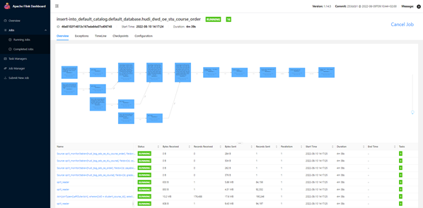

##### Doris_DWD层

###### Doris建表

将数据抽取到doris中需要提前在doris中建表（hudi不需要，hudi可以自动捕获表结构），所以这里我们只需要将hudi中dwd层表一对一在doris中建表即可。

建bxg库

```sql
CREATE DATABASE IF NOT EXISTS bxg;
```

建dwd_oe_stu_course_order表

```sql
CREATE TABLE IF NOT EXISTS bxg.dwd_oe_stu_course_order
(
   `id` int,
   `stu_course_id` int COMMENT '学员课程id',
   `order_id` string,
   `course_id` int COMMENT '学员购买的课程',
   `stu_course_status` int COMMENT '学员课程状态：0试学、1生效、2待生效、-1停课、8退费',
   `stu_course_status_des` string COMMENT '学员课程状态描述：0试学、1生效、2待生效、-1停课、8退费',
   `stu_course_delete_flag` BOOLEAN,
   `payable_amount` decimal(10,2) COMMENT '实际应付总金额=原价-优惠总额-冲抵金额',
   `pay_status` int  COMMENT '支付状态：0未支付、1部分支付、2支付完成',
   `pay_time` datetime COMMENT '最后支付完成时间',
   `paid_amount` decimal(10,2) COMMENT '当前已付总额',
   `refund_status` INT COMMENT '退费状态:0-未退费;-1-已退费;-2-退费中;-3-部分退费',
   `order_delete_flag` BOOLEAN COMMENT 'ods_bxg_oe_order表中订单是否删除',
   `grade_name` string COMMENT '课程名称',
   `is_complete_order` BOOLEAN COMMENT '实际应付总金额0且支付状态pay_status完成'
) Unique Key (`id`)
DISTRIBUTED BY HASH(`id`) BUCKETS 10
PROPERTIES (
"replication_allocation" = "tag.location.default: 1"
);
```

###### Doris_DWD映射表

doris_dwd映射表

```sql
CREATE TABLE if not exists doris_dwd_oe_stu_course_order (
     `id` int,
     `stu_course_id` int,
     `order_id` string,
     `course_id` int,
     `stu_course_status` int,
     `stu_course_status_des` string,
     `stu_course_delete_flag` BOOLEAN,
     `payable_amount` decimal(10,2),
     `pay_status` int,
     `pay_time` TIMESTAMP(3),
     `paid_amount` decimal(10,2),
     `refund_status` int,
     `order_delete_flag` boolean,
     `grade_name` string,
     `is_complete_order` boolean,
     PRIMARY KEY (`id`) NOT ENFORCED
) WITH (
    'fenodes' = 'node1:8030'
    ,'table.identifier' = 'bxg.dwd_oe_stu_course_order'
    ,'sink.enable-delete' = 'true'
    ,'sink.properties.strip_outer_array' = 'true'
    ,'sink.batch.size' = '2000'
    ,'password' = '123456'
    ,'connector' = 'doris'
    ,'sink.batch.interval' = '10s'
    ,'sink.max-retries' = '5'
    ,'sink.properties.format' = 'json'
    ,'username' = 'root'
);
```

将hudi_dwd层表数据插入doris_dwd层

```sql
INSERT INTO doris_dwd_oe_stu_course_order SELECT `id`,`stu_course_id`, `order_id`,`course_id`,`stu_course_status`,`stu_course_status_des`, `stu_course_delete_flag`,`payable_amount`,`pay_status`,`pay_time`,`paid_amount`,`refund_status`, `order_delete_flag`, `grade_name`, `is_complete_order`
FROM hudi_dwd_oe_stu_course_order;
```

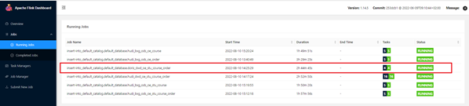

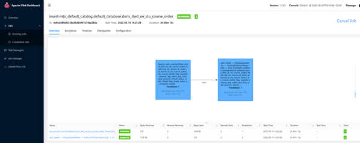

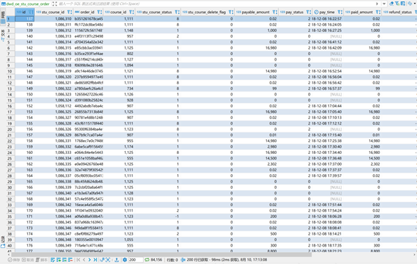

### DWS层实现

#### 1-14专项课程营收

##### 分析

我们基于doris的DWD层先写出需求的SQL如下：

```sql
SELECT
    '合计' AS `日期`,
    count(1) AS `全款量`,
    CASE WHEN count(1)!=0 THEN sum(paid_amount) ELSE 0 END  AS  `全款额`,
    CASE WHEN count(1)!=0 THEN sum(paid_amount) / if(count(1)<=0,1,count(1)) ELSE 0 END AS `成交均价`,
    CONCAT('【',cast(course_id as string),'】',grade_name)  as  `课程状态`
FROM bxg.dwd_oe_stu_course_order  
WHERE is_complete_order = 1
  AND stu_course_status != 8
  AND course_id = ({{course_id}})
GROUP BY course_id,grade_name
UNION 
SELECT
     date_format(pay_time, '%Y/%m/%d') AS `日期`,
     count(1) AS `全款量`,
     CASE WHEN count(1)!=0 THEN sum(paid_amount) ELSE 0 END AS `全款额`,
     CASE WHEN count(1)!=0 THEN sum(paid_amount) / if(count(1)=0,1,count(1)) ELSE 0 END AS `成交均价`,
     GROUP_CONCAT(stu_course_status_des) '课程状态'
FROM bxg.dwd_oe_stu_course_order
WHERE is_complete_order = 1
  AND course_id = ({{course_id}})
GROUP BY date_format(pay_time, '%Y/%m/%d');
```

这里面({{course_id}})是我们去需要去选择的课程id。在设计DWS层时，应该去掉这一筛选条件，聚合出所有课程的相关指标，然后根据dws表，我们在最后可视化界面去做筛选。

这个看板中({{course_id}})，可以为以下4221，4223，4294，4295，4326，4327，4396，4394，4420，4421，4429，4431，4452，4453十四个course_id。

测试，令course_id=958（未局限于本业务的课程）

```sql
select * from(
SELECT
    '合计' AS `日期`,
    count(1) AS `全款量`,
    CASE WHEN count(1)!=0 THEN sum(paid_amount) ELSE 0 END  AS  `全款额`,
    CASE WHEN count(1)!=0 THEN sum(paid_amount) / if(count(1)<=0,1,count(1)) ELSE 0 END AS `成交均价`,
    CONCAT('【',cast(course_id as string),'】',grade_name)  as  `课程状态`
FROM bxg.dwd_oe_stu_course_order  
WHERE is_complete_order = 1
  AND stu_course_status != 8
  AND course_id = 958
GROUP BY course_id,grade_name
UNION 
SELECT
     date_format(pay_time, '%Y/%m/%d') AS `日期`,
     count(1) AS `全款量`,
     CASE WHEN count(1)!=0 THEN sum(paid_amount) ELSE 0 END AS `全款额`,
     CASE WHEN count(1)!=0 THEN sum(paid_amount) / if(count(1)=0,1,count(1)) ELSE 0 END AS `成交均价`,
     GROUP_CONCAT(stu_course_status_des) '课程状态'
FROM bxg.dwd_oe_stu_course_order
WHERE is_complete_order = 1
  AND course_id = 958
GROUP BY date_format(pay_time, '%Y/%m/%d')
)t
order by `日期` DESC;
```

结果展示

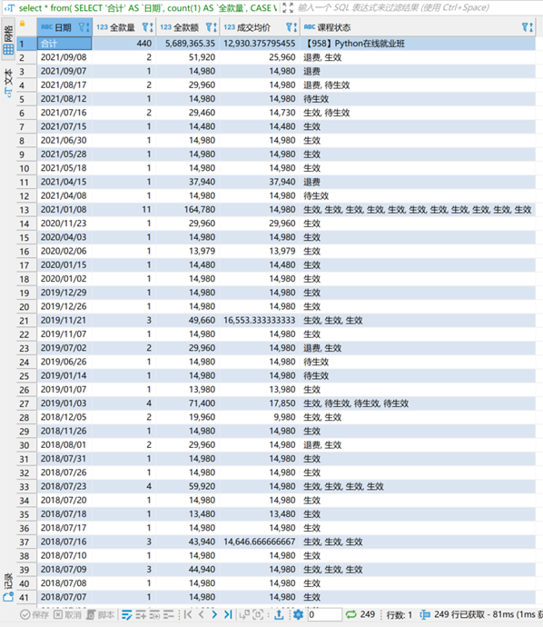

##### 实现

同样的，我们将课程维度提取出来，根据上面的逻辑写出我们flink sql

```sql
SELECT
    ifnull(course_id,-1) as course_id,
    '合计' AS `date`,
    count(1) AS `total_cnt`,
    CASE WHEN count(1) >0 THEN sum(paid_amount) ELSE 0 END  AS  `toatal_money`,
    CASE WHEN count(1) >0 THEN sum(paid_amount) / if(count(1)<=0,1,count(1)) ELSE 0 END AS `avg`,
    CONCAT('【',cast(course_id as string),'】',grade_name)  as  `stu_course_order_status`
FROM hudi_dwd_oe_stu_course_order
WHERE is_complete_order = true
  AND stu_course_status not in (8)
GROUP BY course_id,grade_name

union

select
    ifnull(course_id,-1) as course_id,
    ifnull(date_format(pay_time, 'yyyy/MM/dd'),'-1') as `date`,
    count(1) AS `total_cnt`,
    CASE WHEN count(1) > 0 THEN sum(paid_amount) ELSE 0 END AS `toatal_money`,
    CASE WHEN count(1) > 0 THEN sum(paid_amount) / if(count(1)=0,1,count(1)) ELSE 0 END AS `avg`,
    collect_concat(stu_course_status_des) as `stu_course_order_status`
from hudi_dwd_oe_stu_course_order
WHERE is_complete_order is true
group by course_id,date_format(pay_time, 'yyyy/MM/dd');
```

> **补充**collect_concat使用：
>
> 将我们编译好的自定义函数bxg-common-1.0-SNAPSHOT.jar包放置flink/lib目录下
>
> 在flink sql-cli中注册 create temporary function collect_concat as 'cn.itcast.bxg.common.functions.CollectConcat';
>
> eg:  
>
> select paid_amount, collect_concat (`total_amount`) from mysql_bxg_oe_order group by paid_amount;

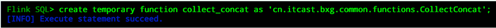

- 测试

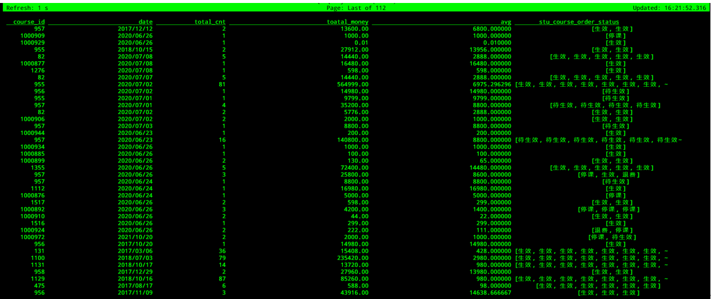

hudi_dws层

创建hudi_dws层映射表

```sql
CREATE TABLE if not exists hudi_dws_course_revenue(
    `course_id` int,
    `date` string,
    `total_cnt` bigint,
    `toatal_money` decimal(38,4),
    `avg` decimal(38,4),
    `stu_course_order_status` string,
    PRIMARY KEY (`course_id`,`date`) NOT ENFORCED
) WITH(
    'connector'='hudi'
    ,'path'= 'hdfs://node1:8020/hudi/bxg/dws_course_revenue'
    ,'hoodie.datasource.write.recordkey.field'= '`course_id`,`date`'
    ,'write.tasks'= '1'
    ,'compaction.tasks'= '1'
    ,'write.rate.limit'= '2000'
    ,'table.type'= 'MERGE_ON_READ'
    ,'compaction.async.enabled'= 'true'
    ,'compaction.trigger.strategy'= 'num_commits'
    ,'compaction.delta_commits'= '1'
    ,'changelog.enabled'= 'true'
    ,'read.tasks' = '3'
    ,'read.streaming.enabled'= 'true'
    ,'read.start-commit'='earliest'
    ,'read.streaming.check-interval'= '3'
    ,'hive_sync.enable'= 'true'
    ,'hive_sync.mode'= 'hms'
    ,'hive_sync.metastore.uris'= 'thrift://node1:9083'
    ,'hive_sync.table'= 'dws_course_revenue'
    ,'hive_sync.db'= 'bxg'
    ,'hive_sync.username'= ''
    ,'hive_sync.password'= ''
    ,'hive_sync.support_timestamp'= 'true'
);
```

- 插入数据

```sql
INSERT INTO hudi_dws_course_revenue
SELECT
    ifnull(course_id,-1) as course_id,
    '合计' AS `date`,
    count(1) AS `total_cnt`,
    CASE WHEN count(1) >0 THEN sum(paid_amount) ELSE 0 END  AS  `toatal_money`,
    CASE WHEN count(1) >0 THEN sum(paid_amount) / if(count(1)<=0,1,count(1)) ELSE 0 END AS `avg`,
    CONCAT('【',cast(course_id as string),'】',grade_name)  as  `stu_course_order_status`
FROM hudi_dwd_oe_stu_course_order
WHERE is_complete_order = true
  AND stu_course_status not in (8)
GROUP BY course_id,grade_name

union

select
    ifnull(course_id,-1) as course_id,
    ifnull(date_format(pay_time, 'yyyy/MM/dd'),'-1') as `date`,
    count(1) AS `total_cnt`,
    CASE WHEN count(1) > 0 THEN sum(paid_amount) ELSE 0 END AS `toatal_money`,
    CASE WHEN count(1) > 0 THEN sum(paid_amount) / if(count(1)=0,1,count(1)) ELSE 0 END AS `avg`,
    collect_concat(stu_course_status_des) as `stu_course_order_status`
from hudi_dwd_oe_stu_course_order
WHERE is_complete_order is true
group by course_id,date_format(pay_time, 'yyyy/MM/dd');
```

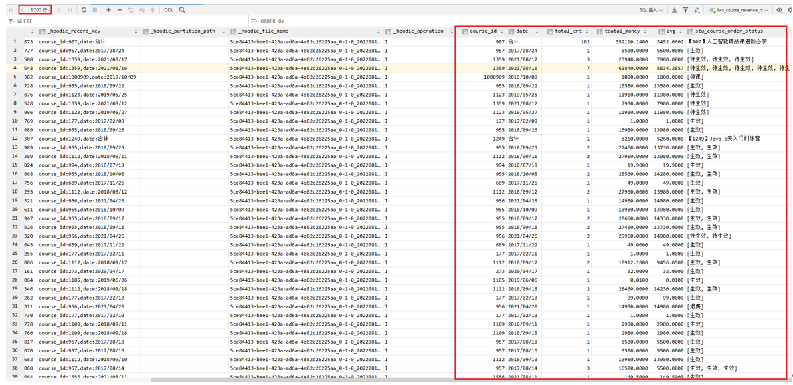

doris_dws层

生产环境中需要对表进行动态分区，区分冷热数据。为了展示所有历史数据，我们这里演示不做分区。

- 在doris中创建dws表

```sql
CREATE TABLE IF NOT EXISTS bxg.dws_course_revenue
(
    `course_id` int,
    `date` varchar(255),
    `total_cnt` bigint,
    `toatal_money` decimal(27,4),
    `avg` decimal(27,4),
    `stu_course_order_status` string
) Unique Key (`course_id`,`date`)
DISTRIBUTED BY HASH(`course_id`) BUCKETS 10
PROPERTIES (
"replication_allocation" = "tag.location.default: 1"
);
```

- 在flink sql-cli中创建doris_dws层映射

```sql
CREATE TABLE if not exists doris_dws_course_revenue(
    `course_id` int,
    `date` string,
    `total_cnt` bigint,
    `toatal_money` decimal(38,4),
    `avg` decimal(38,4),
    `stu_course_order_status` string,
    PRIMARY KEY (`course_id`,`date`) NOT ENFORCED
) WITH (
    'fenodes' = 'node1:8030'
    ,'table.identifier' = 'bxg.dws_course_revenue'
    ,'sink.enable-delete' = 'true'
    ,'sink.properties.strip_outer_array' = 'true'
    ,'sink.batch.size' = '2000'
    ,'password' = '123456'
    ,'connector' = 'doris'
    ,'sink.batch.interval' = '10s'
    ,'sink.max-retries' = '5'
    ,'sink.properties.format' = 'json'
    ,'username' = 'root'
);
```

- 插入数据

```sql
insert into doris_dws_course_revenue
select `course_id`, `date`, `total_cnt`, `toatal_money`, `avg`, `stu_course_order_status`
from hudi_dws_course_revenue;
```

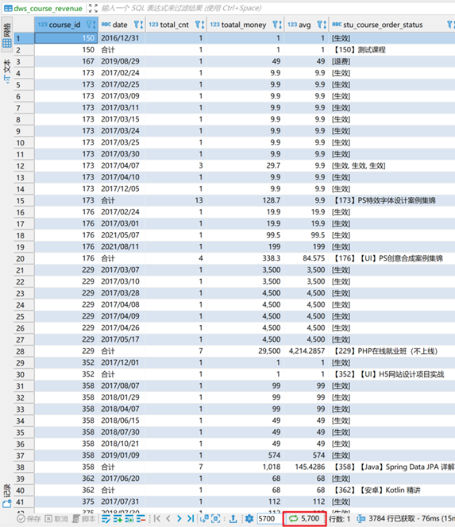

#### 15-16专项课程的整体营收分析

##### 分析

我们基于doris的DWD层先写出需求的SQL如下：

```sql
-- 按课程id和课程名称聚合
with statis AS (
     SELECT
         course_id,
         grade_name AS `course_name`,
         COUNT(CASE WHEN (is_complete_order = 1 AND refund_status !=-1)
                    THEN order_id 
                    ELSE null 
               END)  AS `paid_count`,
         SUM(CASE WHEN (is_complete_order = 1 AND refund_status !=-1)
                  THEN paid_amount 
                  ELSE null
             END) AS  `paid_amount`
     FROM bxg.dwd_oe_stu_course_order
     WHERE course_id in ({{COURSE_ID_ARRAY}})
     GROUP BY course_id,grade_name
 )
-- 计算成交均价
SELECT
    course_id AS `课程id`,
    course_name AS `课程名称`,
    paid_count AS `全款量`,
    paid_amount AS `全款额`,
    paid_amount/paid_count AS `成交均价`
FROM statis
ORDER BY `课程id` DESC;
```

测试，令COURSE_ID_ARRAY =958,1121,1129

```
with statis AS (
     SELECT
         course_id,
         grade_name AS `course_name`,
         COUNT(CASE WHEN (is_complete_order = 1 AND refund_status !=-1)
                    THEN order_id 
                    ELSE null 
               END)  AS `paid_count`,
         SUM(CASE WHEN (is_complete_order = 1 AND refund_status !=-1)
                  THEN paid_amount 
                  ELSE null
             END) AS  `paid_amount`
     FROM bxg.dwd_oe_stu_course_order
     WHERE course_id in (958,1121,1129)
     GROUP BY course_id,grade_name
 )
-- 计算成交均价
SELECT
    course_id AS `课程id`,
    course_name AS `课程名称`,
    paid_count AS `全款量`,
    paid_amount AS `全款额`,
    paid_amount/paid_count AS `成交均价`
FROM statis
ORDER BY `课程id` DESC;
```

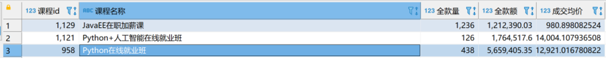

##### 实现

现在我们将课程维度提取出来，根据上面的逻辑写出我们flink sql

```sql
SELECT
    course_id,
    grade_name AS `course_name`,
    COUNT(CASE WHEN (is_complete_order is true AND refund_status not in (-1))
                   THEN order_id
               ELSE null
        END)  AS `paid_count`,
    SUM(CASE WHEN (is_complete_order is true AND refund_status not in (-1))
                 THEN paid_amount
             ELSE null
        END) AS  `paid_amount`
FROM hudi_dwd_oe_stu_course_order
GROUP BY course_id,grade_name;
```

- 测试

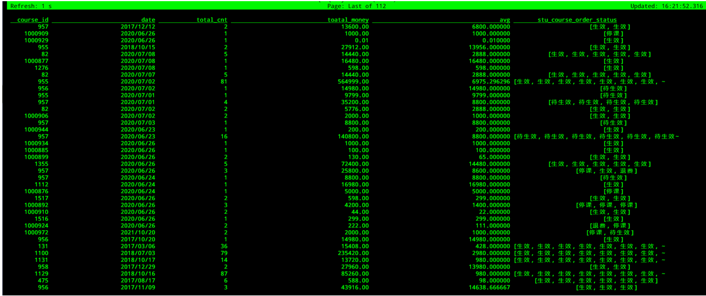

hudi_dws层

- 创建hudi_dws层映射表

```sql
CREATE TABLE if not exists hudi_dws_overall_revenue (
    `course_id` int,
    `course_name` string,
    `paid_count` bigint,
    `paid_amount` decimal(38,4),
    PRIMARY KEY (`course_id`) NOT ENFORCED
) WITH(
    'connector'='hudi'
    ,'path'= 'hdfs://node1:8020/hudi/bxg/dws_overall_revenue'
    ,'hoodie.datasource.write.recordkey.field'= '`course_id`'
    ,'write.tasks'= '1'
    ,'compaction.tasks'= '1'
    ,'write.rate.limit'= '2000'
    ,'table.type'= 'MERGE_ON_READ'
    ,'compaction.async.enabled'= 'true'
    ,'compaction.trigger.strategy'= 'num_commits'
    ,'compaction.delta_commits'= '1'
    ,'changelog.enabled'= 'true'
    ,'read.tasks' = '3'
    ,'read.streaming.enabled'= 'true'
    ,'read.start-commit'='earliest'
    ,'read.streaming.check-interval'= '3'
    ,'hive_sync.enable'= 'true'
    ,'hive_sync.mode'= 'hms'
    ,'hive_sync.metastore.uris'= 'thrift://node1:9083'
    ,'hive_sync.table'= 'dws_overall_revenue'
    ,'hive_sync.db'= 'bxg'
    ,'hive_sync.username'= ''
    ,'hive_sync.password'= ''
    ,'hive_sync.support_timestamp'= 'true'
);
```

- 插入数据

```sql
INSERT INTO hudi_dws_overall_revenue
SELECT
    ifnull(course_id,-1) as course_id,
    grade_name AS `course_name`,
    COUNT(CASE WHEN (is_complete_order is true AND refund_status not in (-1))
                   THEN order_id
               ELSE null
        END)  AS `paid_count`,
    SUM(CASE WHEN (is_complete_order is true AND refund_status not in (-1))
                 THEN paid_amount
             ELSE null
        END) AS  `paid_amount`
FROM hudi_dwd_oe_stu_course_order
GROUP BY course_id,grade_name;
```

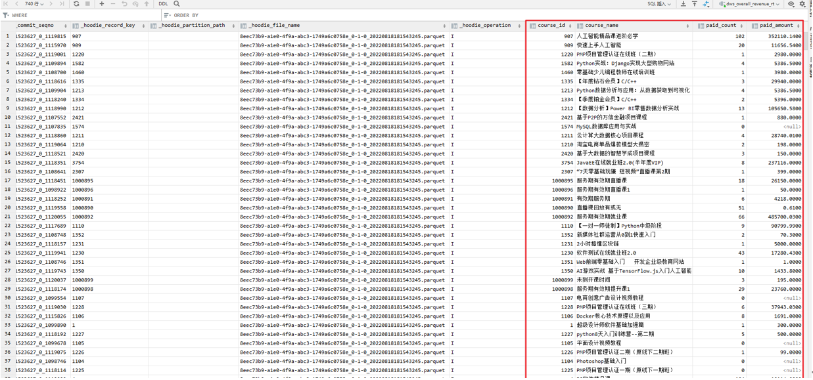

doris_dws层

- 在doris中创建dws表

```sql
CREATE TABLE IF NOT EXISTS bxg.dws_overall_revenue
(
    `course_id` int,
    `course_name` string,
    `paid_count` bigint,
    `paid_amount` decimal(27,4)
) Unique Key (`course_id`)
DISTRIBUTED BY HASH(`course_id`) BUCKETS 10
PROPERTIES (
"replication_allocation" = "tag.location.default: 1"
);
```

在flink sql-cli中创建doris_dws层映射

```sql
CREATE TABLE if not exists doris_dws_overall_revenue(
    `course_id` int,
    `course_name` string,
    `paid_count` bigint,
    `paid_amount` decimal(38,4),
    PRIMARY KEY (`course_id`) NOT ENFORCED
) WITH (
    'fenodes' = 'node1:8030'
    ,'table.identifier' = 'bxg.dws_overall_revenue'
    ,'sink.enable-delete' = 'true'
    ,'sink.properties.strip_outer_array' = 'true'
    ,'sink.batch.size' = '2000'
    ,'password' = '123456'
    ,'connector' = 'doris'
    ,'sink.batch.interval' = '10s'
    ,'sink.max-retries' = '5'
    ,'sink.properties.format' = 'json'
    ,'username' = 'root'
);
```

- 插入数据

```sql
insert into doris_dws_overall_revenue
select `course_id`, `course_name`,`paid_count`,`paid_amount`
from hudi_dws_overall_revenue;
```

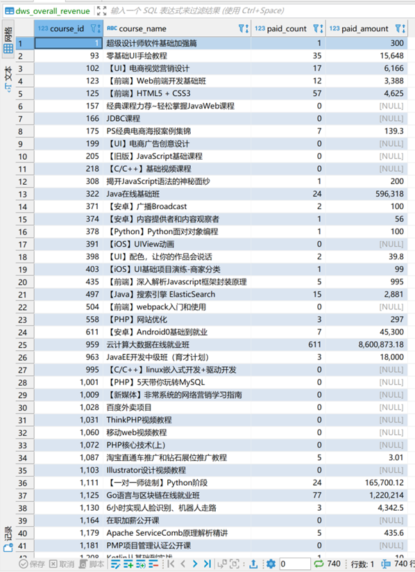

### 业务查询SQL

1）-14）专项课程营收分析

```sql
SELECT 
	`date` as `日期`,
	total_cnt as `全款量`,
	toatal_money as `全款额`,
	`avg` as `成交均价`,
	stu_course_order_status as `课程状态`
from dws_course_revenue
where course_id = ({{course_id}})
ORDER BY `日期` DESC;
```

测试，令({{course_id}})=958

```sql
SELECT 
	`date` as `日期`,
	total_cnt as `全款量`,
	toatal_money as `全款额`,
	`avg` as `成交均价`,
	stu_course_order_status as `课程状态`
	from bxg.dws_course_revenue
	where course_id = 958
ORDER BY `日期` DESC;
```

结果展示

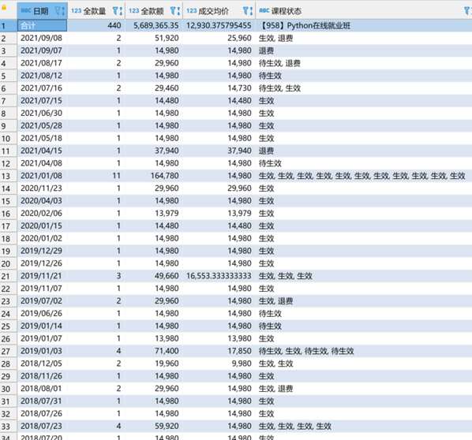

15）-16）专项课程的整体营收分析

```sql
SELECT
    course_id AS `课程id`,
    course_name AS `课程名称`,
    paid_count AS `全款量`,
    paid_amount AS `全款额`,
    paid_amount/paid_count AS `成交均价`
FROM bxg.dws_overall_revenue
where course_id in ({{course_array}})
ORDER BY `课程id` DESC;
```

测试，令COURSE_ID_ARRAY =958,1121,1129

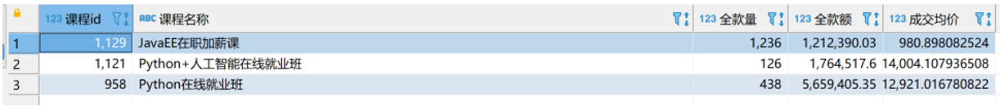

# 知识点07： 【掌握】营收业绩整体情况看板

## 看板相关指标

1.  年度营收额(全款)
2.  年度营收额(进班)
3.  博学谷全部课程营收额分析
4.  博学谷职业课营收额分析
5.  博学谷其他课营收额分析
6.  职业大课营收额分析-全款
7.  职业大课订单量分析-全款
8.  职业大课营收额分析-进班
9.  职业大课订单量分析-进班

## 看板需求

- 营收业绩整体情况看板，顾名思义，分析的数据主要是各类营收额以及订单量等。目的是了解年度各月业绩营收情况，对比分析各年业绩表现和月度趋势，基本把握利润情况。原始数据来源于业务系统的Mysql数据库。

- 用户关心的核心指标有：1、年度营收额（全款）/2、年度营收额（进班）/3、博学谷全部课程营收额分析/4、博学谷职业课营收额分析/5、博学谷其他课营收额分析/6、职业大课营收额分析-全款/7、职业大课订单量分析-全款/ 8、职业大课营收额分析-进班/9、职业大课订单量分析-进班。


| 大课       |                                                                 |
|------------|-----------------------------------------------------------------|
| 在线就业班 | 数据库中课程类型为0，课程名称包含“在线就业班”，且排除字段“SVIP” |
| SVIP班     | 数据库中的课程类型为0，且包含字段“SVIP”                         |
| 直播保薪班 | 课程ID：3264、3400、3912、4036                                  |
| 年度会员   | 数据库中课程类型为0，课程名称 like “【年度钻石会员】%”          |
| 半年度会员 | 数据库中课程类型为0，课程名称 like “【钻石会员】%”              |
| 架构师     | 课程ID：3224,3422,3792,3817,3867,3969                           |

### 需求

#### 年度营收额(全款)

- 说明：了解年度业绩营收情况，对比分析各年业绩表现，基本把握利润情况。

- 展示：柱状图、折线图

- 指标：营收额

- 维度：时间

- 粒度：年

- 涉及库：bxg

- 涉及表：bxg.oe_order、bxg.oe_stu_course_order、bxg.oe_stu_course、bxg.oe_course


#### 年度营收额(进班)

- 说明：了解年度业绩营收情况，对比分析各年业绩表现，基本把握利润情况

- 展示：柱状图、折线图

- 指标：营收额

- 维度：时间

- 粒度：年

- 涉及库：bxg

- 涉及表：bxg.oe_order、bxg.oe_stu_course_order、bxg.oe_stu_course


#### 博学谷全部课程营收额分析

- 说明：了解年度各月业绩营收情况，对比分析各年业绩表现和月度趋势，基本把握利润情况。

- 展示：柱状图、折线图

- 指标：营收额

- 维度：时间

- 粒度：月

- 涉及库：bxg

- 涉及表：bxg.oe_order、bxg.oe_stu_course_order、bxg.oe_stu_course、bxg.oe_course


#### 博学谷职业课营收额分析

- 说明：了解年度各月业绩营收情况，对比分析各年业绩表现和月度趋势，基本把握利润情况。

- 展示：柱状图、折线图

- 指标：营收额

- 维度：时间

- 粒度：月

- 涉及库：bxg

- 涉及表：bxg.oe_order、bxg.oe_stu_course_order、bxg.oe_stu_course、bxg.oe_course


#### 博学谷其他课营收额分析

- 说明：了解年度各月业绩营收情况，对比分析各年业绩表现和月度趋势，基本把握利润情况。

- 展示：柱状图、折线图

- 指标：营收额

- 维度：时间

- 粒度：月

- 涉及库：bxg

- 涉及表：bxg.oe_order、bxg.oe_stu_course_order、bxg.oe_stu_course、bxg.oe_course


#### 职业大课营收额分析-全款

- 说明：了解年度各月业绩营收情况，对比分析各年业绩表现和月度趋势，基本把握利润情况。

- 本年度当前的总计营收金额。指该年份当前的营收金额之和，不考虑之后是否退费。

- 展示：柱状图、折线图

- 指标：营收额

- 维度：时间

- 粒度：月

- 涉及库：bxg

- 涉及表：bxg.oe_order、bxg.oe_stu_course_order、bxg.oe_stu_course、bxg.oe_course


#### 职业大课订单量分析-全款

- 说明：了解年度各月业绩营收情况，对比分析各年业绩表现和月度趋势，基本把握利润情况。

- 本年度当前的总计成交的订单数量。指该年份当前所成交的订单数量之和，不考虑之后的退费情况，线上互转计算为一条订单。

- 展示：柱状图、折线图

- 指标：订单量

- 维度：时间

- 粒度：月

- 涉及库：bxg

- 涉及表：bxg.oe_order、bxg.oe_stu_course_order、bxg.oe_stu_course、bxg.oe_course


#### 职业大课营收额分析-进班

- 说明：了解年度各月业绩营收情况，对比分析各年业绩表现和月度趋势，基本把握利润情况。

- 指以进班为节点的成交金额，即课程生效的订单的实际总缴费金额。指课程生效时间落在统计时间范围内的的实际总缴费金额（不含预交报名费等部分付款，不考虑进班后的退费）。

- 展示：柱状图、折线图

- 指标：营收额

- 维度：时间

- 粒度：月

- 涉及库：bxg

- 涉及表：bxg.oe_order、bxg.oe_stu_course_order、bxg.oe_stu_course、bxg.oe_course


#### 职业大课订单量分析-进班

- 说明：了解年度各月业绩营收情况，对比分析各年业绩表现和月度趋势，基本把握利润情况。

- 指购买课程后课程生效的订单数量。指课程生效时间落在统计时间范围内的订单数量。

- 展示：柱状图、折线图

- 指标：订单量

- 维度：时间

- 粒度：月

- 涉及库：bxg

- 涉及表：bxg.oe_order、bxg.oe_stu_course_order、bxg.oe_stu_course、bxg.oe_course


### 需求说明

#### 年度总营收额

指该年份当前所有课程的营收金额之和。不包含只交报名费等部分付款的情况。不考虑之后是否退费。不包含N12分摊转移的数据（N12分摊转移**为线下学员毕业后博学谷赠送的课程**）。以首次订单为准，后续发生转班后的订单不重复计算，需要排除。需加上冲抵金额。

#### 全款量

指交齐学费时间落在统计时间范围内的订单数量，包含交齐学费和直接全款两种情况。不考虑之后是否退费。不包含N12分摊转移的数据。以首次订单为准，后续发生转班后的订单不重复计算，需要排除。

#### 全款金额

指交齐学费时间落在统计时间范围内的订单的实际总缴费金额，包含交齐学费和直接全款两种情况（不含预交报名费等部分付款，不考虑全款后是否退费）。不包含N12分摊转移的数据。以首次订单为准，后续发生转班后的订单不重复计算，需要排除。需加上冲抵金额。

#### 进班量

指课程生效时间（也就是服务期开始时间）落在统计时间范围内的订单数量。不考虑之后是否退费。不包含N12分摊转移的数据。以首次订单为准，后续发生转班后的订单不重复计算，需要排除。

#### 进班金额

指课程生效时间（也就是服务期开始时间）落在统计时间范围内的的实际总缴费金额（不含预交报名费等部分付款，不考虑进班后的退费）。不包含N12分摊转移的数据。以首次订单为准，后续发生转班后的订单不重复计算，需要排除。需加上冲抵金额。

#### 博学谷职业课

\-- BXG 职业课（就业班+会员制+SVIP+直播班+极速就业班）-- 不含转班

\-- 1、SVIP班：数据库中的课程类型为0，且包含字段“SVIP”

\-- 2、直播保薪班：课程ID：3264、3400、3912、4036、4293、4314、4511、4454

\-- 3、在线就业班：数据库中课程类型为0，课程名称包含“在线就业班”，且排除字段“SVIP”

\-- 4、年度会员：数据库中课程类型为0，课程名称 like “【年度钻石会员】%”

\-- 5、半年度会员：数据库中课程类型为0，课程名称 like “【钻石会员】%”

\-- 6、季度会员：数据库中课程类型为0和课程类型为1，课程名称 like “【季度铂金会员】%”

\-- 7、月度会员：数据库中课程类型为0和课程类型为1，课程名称 like “【月度黄金会员】%”

\-- 8、其他职业课：如360就业通、少儿编程培训师课程等不符合以上特点的其他职业课程

#### 博学谷其它课

\-- 其他课：课程类型不为0，且不包含直播保薪班（去除课程ID：3264、3400、3912、4036、4293、4314、4511、4454），且去除课程名称“【季度铂金会员】%”，且去除课程名称“【月度黄金会员】%”

\-- 3264是大数据直播1期班，已计入到就业班课，所有在这里去掉，

\-- 3400是狂野大数据

\-- 3912是狂野大数据（三期）

\-- 4036是狂野Testing

### 结果显示

#### 年度营收额(全款)

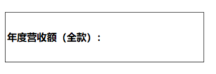

#### 年度营收额(进班)

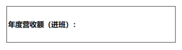

#### 博学谷全部课程营收额分析

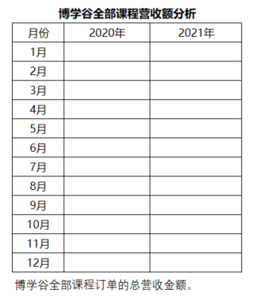

#### 博学谷职业课营收额分析

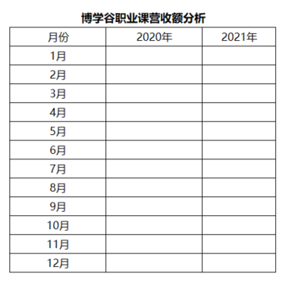

#### 博学谷其他课营收额分析

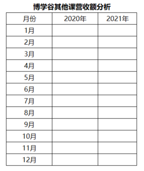

#### 职业大课订单量分析-全款

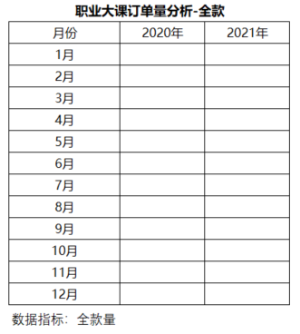

#### 职业大课营收额分析-全款

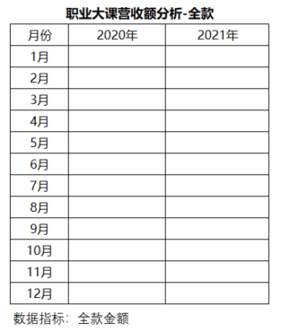

#### 职业大课营收额分析-进班

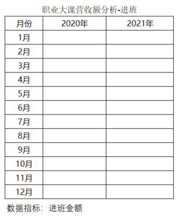

#### 职业大课订单量分析-进班

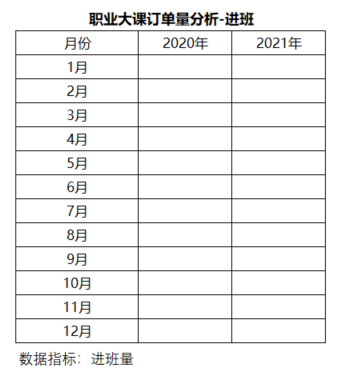

### SQL参考

#### 年度营收额（全款）

```sql
SELECT
        sum(oo.`payable_amount` + (CASE WHEN oo.`charge_against_amount` IS NOT null THEN oo.`charge_against_amount` ELSE 0 END))/ 10000
FROM
    bxg.`oe_order` oo
        LEFT JOIN bxg.`oe_order_detail`  ood ON ood.`order_id` = oo.`id`
        LEFT JOIN bxg.`oe_course`  oc ON oc.`id` = ood.`course_id`
WHERE
-- 支付状态：支付完成
        oo.`pay_status` = 2
-- 未删除订单
  AND oo.`delete_flag` = 0
-- 转班情况只取第一次的订单，转班后的订单不重复计算
  AND oo.`id` NOT IN (SELECT target_order_id FROM
    bxg.oe_order_transfer_apply t
                      WHERE t.biz_type = 1 AND t.status = 0
                        AND t.fee_transfer_type=0 AND t.delete_flag = 0)
-- 排除N12分摊转移
  AND oo.`terminal` != 7
-- 排除测试课
  AND oc.`id` NOT IN (555,1537)
-- 取当前年份
  AND year(oo.`pay_time`) = year(current_date());
```

#### 年度营收额（进班）

```sql
SELECT
        sum(oo.`payable_amount` + (CASE WHEN oo.`charge_against_amount` IS NOT null THEN oo.`charge_against_amount` ELSE 0 END)) / 10000
FROM
    bxg.oe_order oo
        LEFT JOIN bxg.oe_stu_course_order  co ON co.`order_id` = oo.`id`
        LEFT JOIN bxg.oe_stu_course  osc ON osc.`id` = co.`student_course_id`
WHERE
-- 支付状态：支付完成
        oo.`pay_status` = 2 AND
-- 未删除订单
        oo.`delete_flag` = 0 AND
-- 排除N12分摊转移
    oo.`terminal` != 7  AND
-- 转班情况只取第一次的订单，转班后的订单不重复计算
    oo.`id` NOT IN  (SELECT target_order_id FROM
bxg.oe_order_transfer_apply t
WHERE t.biz_type = 1 AND t.status = 0
AND t.fee_transfer_type=0 AND t.delete_flag = 0 ) AND
    osc.`delete_flag` = 0 AND
    osc.`status` = 1 AND
-- 排除测试课
    osc.`course_id` NOT IN (555,1537) AND
-- 进班条件
    (osc.`effective_date` BETWEEN date_sub(current_date(), interval dayofyear(current_date()) - 1 day ) AND date_add(date_sub(current_date(), interval dayofyear(current_date()) day),interval 1 year))
;
```

#### 博学谷全部课程营收额分析

```sql
SELECT
    b.`month` AS `月份`,
    max(CASE WHEN a.`year` = 2019 THEN a.`sm` ELSE null END) AS `2019年`,
    max(CASE WHEN a.`year` = 2020 THEN a.`sm` ELSE null END) AS `2020年`,
    max(CASE WHEN a.`year` = 2021 THEN a.`sm` ELSE null END) AS `2021年`,
    max(CASE WHEN a.`year` = 2022 THEN a.`sm` ELSE null END) AS `2022年`
FROM
    (
        SELECT
            c.`month`
        FROM
            (
                SELECT 1 AS `month`
                UNION ALL SELECT 2 AS `month`
                UNION ALL SELECT 3 AS `month`
                UNION ALL SELECT 4 AS `month`
                UNION ALL SELECT 5 AS `month`
                UNION ALL SELECT 6 AS `month`
                UNION ALL SELECT 7 AS `month`
                UNION ALL SELECT 8 AS `month`
                UNION ALL SELECT 9 AS `month`
                UNION ALL SELECT 10 AS `month`
                UNION ALL SELECT 11 AS `month`
                UNION ALL SELECT 12 AS `month`
            ) c
    ) b
        LEFT JOIN
    (
        SELECT
            year(oo.`pay_time`) AS `year`,
            month(oo.`pay_time`) AS `mon`,
            sum(oo.`payable_amount` + (CASE WHEN oo.`charge_against_amount` IS NOT null THEN oo.`charge_against_amount` ELSE 0 END))/10000  AS `sm`
        FROM
            bxg.oe_order oo
            LEFT JOIN bxg.oe_order_detail ood ON ood.`order_id` = oo.`id`
            LEFT JOIN bxg.oe_course oc ON oc.`id` = ood.`course_id`
        WHERE
        -- 支付状态：支付完成
            oo.`pay_status` = 2 AND
        -- 未删除订单
            oo.`delete_flag` = 0 AND
        -- 排除N12分摊转移
            oo.`terminal` != 7  AND
        -- 转班情况只取第一次的订单，转班后的订单不重复计算
            oo.`id` NOT IN (SELECT target_order_id FROM
            bxg.oe_order_transfer_apply t
            WHERE t.biz_type = 1 AND t.status = 0
          AND t.fee_transfer_type=0 AND t.delete_flag = 0) AND
        -- 排除测试课
            oc.`id` NOT IN (555,1537)
        GROUP BY `year`, `mon`
        HAVING sum(oo.`payable_amount`) > 0
    ) a ON a.`mon` = b.`month` GROUP BY b.`month` order by b.month;
```

#### 博学谷职业课营收额分析

```sql
SELECT
    b.`month` AS `月份`,
    max(CASE WHEN a.`year` = 2020 THEN a.`sm` ELSE null END) AS `2020年`,
    max(CASE WHEN a.`year` = 2021 THEN a.`sm` ELSE null END) AS `2021年`,
    max(CASE WHEN a.`year` = 2022 THEN a.`sm` ELSE null END) AS `2022年`
FROM
    (
        SELECT
            c.`month`
        FROM
            (
                SELECT 1 AS `month`
                UNION ALL SELECT 2 AS `month`
                UNION ALL SELECT 3 AS `month`
                UNION ALL SELECT 4 AS `month`
                UNION ALL SELECT 5 AS `month`
                UNION ALL SELECT 6 AS `month`
                UNION ALL SELECT 7 AS `month`
                UNION ALL SELECT 8 AS `month`
                UNION ALL SELECT 9 AS `month`
                UNION ALL SELECT 10 AS `month`
                UNION ALL SELECT 11 AS `month`
                UNION ALL SELECT 12 AS `month`
            ) c
    ) b
        LEFT JOIN
    (
        SELECT
            year(oo.`pay_time`)  AS `year`,
            month(oo.`pay_time`) AS `mon`,
            sum(oo.`payable_amount` + (CASE WHEN oo.`charge_against_amount` IS NOT null THEN oo.`charge_against_amount` ELSE 0 END)) / 10000 AS sm
        FROM
            bxg.oe_order oo
            LEFT JOIN bxg.oe_stu_course_order oso ON oo.`id` = oso.`order_id`
            LEFT JOIN bxg.oe_stu_course osc ON osc.`id` = oso.`student_course_id`
            LEFT JOIN bxg.oe_course  oc ON osc.`course_id` = oc.`id`
        WHERE
        -- 支付状态：支付完成
            oo.`pay_status` = 2
        -- 排除N12分摊转移
          AND oo.`terminal` != 7
        -- 职业课范围
          AND (
            oc.`course_type` = 0 OR
            oc.grade_name LIKE '【季度铂金会员】%' OR
            oc.grade_name LIKE '【月度黄金会员】%' OR
            oc.`id` in (3264, 3400, 3912, 4036, 4293, 4314,4511,4454)
            )
        -- 未删除订单
          AND oo.`delete_flag` = 0
        -- 排除测试课
          AND oc.`id` NOT IN (555,1537)
        -- 转班情况只取第一次的订单，转班后的订单不重复计算
          AND oo.`id` NOT IN (SELECT target_order_id FROM
            bxg.oe_order_transfer_apply t
            WHERE t.biz_type = 1 AND t.status = 0
          AND t.fee_transfer_type=0 AND t.delete_flag = 0)
        GROUP BY `year`, `mon`
        HAVING sum(oo.`payable_amount`) > 0
    ) a ON a.`mon` = b.`month` GROUP BY b.`month` order by b.`month`;
```

#### 博学谷其他课营收额分析

```sql
SELECT
    b.`month` AS `月份`,
    max(CASE WHEN a.`year` = 2020 THEN a.`sm` ELSE null END ) AS `2020年`,
    max(CASE WHEN a.`year` = 2021 THEN a.`sm` ELSE null END ) AS `2021年`,
    max(CASE WHEN a.`year` = 2022 THEN a.`sm` ELSE null END ) AS `2022年`
FROM
    (
        SELECT
            c.`month`
        FROM
            (
                SELECT 1 AS `month`
                UNION ALL SELECT 2 AS `month`
                UNION ALL SELECT 3 AS `month`
                UNION ALL SELECT 4 AS `month`
                UNION ALL SELECT 5 AS `month`
                UNION ALL SELECT 6 AS `month`
                UNION ALL SELECT 7 AS `month`
                UNION ALL SELECT 8 AS `month`
                UNION ALL SELECT 9 AS `month`
                UNION ALL SELECT 10 AS `month`
                UNION ALL SELECT 11 AS `month`
                UNION ALL SELECT 12 AS `month`
            ) c
    ) b
        LEFT JOIN
    (
        SELECT
            year(oo.`pay_time`) AS `year`,
            month(oo.`pay_time`) AS `mon`,
            SUM(oo.`payable_amount` + (CASE WHEN oo.`charge_against_amount` IS NOT null THEN oo.`charge_against_amount` ELSE 0 END)) / 10000 AS `sm`
        FROM
            bxg.oe_order oo
            LEFT JOIN bxg.oe_stu_course_order  oso ON oo.`id` = oso.`order_id`
            LEFT JOIN bxg.oe_stu_course  osc ON osc.`id` = oso.`student_course_id`
            LEFT JOIN bxg.oe_course  oc ON osc.`course_id` = oc.`id`
        WHERE
        -- 支付状态：支付完成
            oo.`pay_status` = 2
        -- 课程类型不为0
          AND oc.`course_type` <> 0
        -- 课程不包含直播保薪班
          AND osc.`course_id` NOT IN (3264, 3400, 3912, 4036, 4293, 4314,4511,4454)
        -- 未删除订单
          AND oo.`delete_flag` = 0
        -- 转班情况只取第一次的订单，转班后的订单不重复计算
          AND oo.`id` NOT IN (SELECT target_order_id FROM
            bxg.oe_order_transfer_apply t
            WHERE t.biz_type = 1 AND t.status = 0
          AND t.fee_transfer_type=0 AND t.delete_flag = 0)
        -- 排除N12分摊转移
          AND oo.`terminal` != 7
        -- 去除课程名称“【季度铂金会员】%”
          AND oc.`grade_name` NOT LIKE '%【季度铂金会员】%'
        -- 去除课程名称“【月度黄金会员】%”
          AND oc.`grade_name` NOT LIKE '%【月度黄金会员】%'
        -- 排除测试课
          AND oc.`id` NOT IN (555,1537)
        GROUP BY `year`, `mon`
        HAVING sum(oo.`payable_amount`) > 0
    ) a ON a.`mon` = b.`month`
GROUP BY b.`month`order by b.`month`;
```

#### 职业大课营收额分析-全款

```sql
select
    b.`month`                                           as  `月份` ,
    max(case when a.`year`= 2019 then a.sm else null end ) as  `2019年`,
    max(case when a.`year`= 2020 then a.sm else null end ) as  `2020年`,
    max(case when a.`year`= 2021 then a.sm else null end ) as  `2021年`,
    max(case when a.`year`= 2022 then a.sm else null end ) as  `2022年`
from
    (
        SELECT c.`month`
        FROM
            (
                SELECT 1 AS `month`
                UNION ALL SELECT 2 AS `month`
                UNION ALL SELECT 3 AS `month`
                UNION ALL SELECT 4 AS `month`
                UNION ALL SELECT 5 AS `month`
                UNION ALL SELECT 6 AS `month`
                UNION ALL SELECT 7 AS `month`
                UNION ALL SELECT 8 AS `month`
                UNION ALL SELECT 9 AS `month`
                UNION ALL SELECT 10 AS `month`
                UNION ALL SELECT 11 AS `month`
                UNION ALL SELECT 12 AS `month`
            ) c
    ) b
        LEFT JOIN
    (
        select
            year(pay_time)             as `year` ,
            month(pay_time)            as `mon` ,
            -- 实际应付总金额 + 冲抵金额
            sum(payable_amount + charge_against_amount) / 10000  as `sm`
        from
            bxg.oe_order oo
            LEFT JOIN  bxg.oe_stu_course_order  oso ON oo.id = oso.order_id
            LEFT JOIN  bxg.oe_stu_course  osc ON osc.id = oso.student_course_id
            LEFT JOIN bxg.oe_course  oc ON osc.course_id = oc.id
        WHERE
            1 = 1
          AND oo.pay_status = 2
          AND (
-- SVIP 班
            (oc.course_type = 0 AND oc.grade_name LIKE '%SVIP%') OR
        -- 直播保薪班
-- TODO 新建视图，方便区分混杂的课程类型
            (oc.id IN (3264,3400,3912,4036,4293,4314,4511,4454)) OR
-- 极速就业班
            (oc.id IN (4438,4533,4241,4520)) OR
-- 在线就业班
            (oc.course_type = 0 AND oc.grade_name LIKE '%在线就业班%' AND oc.grade_name NOT LIKE '%SVIP%') OR
-- 年度会员
            (oc.course_type = 0 AND oc.grade_name LIKE '【年度钻石会员】%')
            )
-- 去除转班
          AND oo.id not in (SELECT target_order_id FROM
            bxg.oe_order_transfer_apply t
            WHERE t.biz_type = 1 AND t.status = 0
          AND t.fee_transfer_type=0 AND t.delete_flag = 0)
          AND oo.delete_flag = 0
          AND osc.course_id not in (555,1537)
-- 去除 N12 分摊转移
          and oo.terminal != 7
        GROUP BY `year`,`mon` HAVING sum(payable_amount) > 0
    ) a on a.mon = b.`month` GROUP BY b.`month` order by b.`month`;
```

#### 职业大课订单量分析-全款

```sql
select
    b.`month`                                                 as  `月份` ,
    max(case when a.`year`= 2019 then a.cnt else null end ) as  `2019年`,
    max(case when a.`year`= 2020 then a.cnt else null end ) as  `2020年`,
    max(case when a.`year`= 2021 then a.cnt else null end ) as  `2021年`,
    max(case when a.`year`= 2022 then a.cnt else null end ) as  `2022年`
from
    (
        SELECT
            c.`month`
        FROM
            (
                SELECT 1 AS `month`
                UNION ALL SELECT 2 AS `month`
                UNION ALL SELECT 3 AS `month`
                UNION ALL SELECT 4 AS `month`
                UNION ALL SELECT 5 AS `month`
                UNION ALL SELECT 6 AS `month`
                UNION ALL SELECT 7 AS `month`
                UNION ALL SELECT 8 AS `month`
                UNION ALL SELECT 9 AS `month`
                UNION ALL SELECT 10 AS `month`
                UNION ALL SELECT 11 AS `month`
                UNION ALL SELECT 12 AS `month`
            ) c
    ) b
        LEFT JOIN
    (
        select
            year(pay_time)        as `year` ,
            month(pay_time)       as `mon` ,
            count(oo.id)          as `cnt`
        from
            bxg.oe_order oo
            LEFT JOIN bxg.oe_stu_course_order  oso ON oo.id = oso.order_id
            LEFT JOIN bxg.oe_stu_course  osc ON osc.id = oso.student_course_id
            LEFT JOIN bxg.oe_course  oc ON osc.course_id = oc.id
        WHERE
            1 = 1
          AND oo.pay_status = 2
          AND (
-- SVIP 班
            (oc.course_type = 0 AND oc.grade_name LIKE '%SVIP%') OR
        -- 直播保薪班
-- TODO 新建视图，方便区分混杂的课程类型
            (oc.id IN (3264,3400,3912,4036,4293,4314,4511,4454)) OR
-- 极速就业班
            (oc.id IN (4438,4533,4241,4520)) OR
-- 在线就业班
            (oc.course_type = 0 AND oc.grade_name LIKE '%在线就业班%' AND oc.grade_name NOT LIKE '%SVIP%') OR
-- 年度会员
            (oc.course_type = 0 AND oc.grade_name LIKE '【年度钻石会员】%')
            )
          AND osc.course_id not in (555,1537)
-- 去除进班
          AND oo.id not in (SELECT target_order_id FROM
            bxg.oe_order_transfer_apply t
            WHERE t.biz_type = 1 AND t.status = 0
          AND t.fee_transfer_type=0 AND t.delete_flag = 0)
          AND oo.delete_flag = 0
-- 去除 N12 分摊转移
          AND oo.terminal != 7
        GROUP BY `year`,`mon`
    ) a on a.mon = b.`month` GROUP BY b.`month` order by b.`month`;
```

#### 职业大课营收额分析-进班

```sql
select
    b.`month`                                                    as  `月份` ,
    max(case when a.`year`= 2020 then a.sm else null end )       as  `2020年`,
    max(case when a.`year`= 2021 then a.sm else null end )       as  `2021年`,
    max(case when a.`year`= 2022 then a.sm else null end )       as  `2022年`
from
    (
        SELECT c.`month` from  (
                SELECT 1 AS `month`
                UNION ALL SELECT 2 AS `month`
                UNION ALL SELECT 3 AS `month`
                UNION ALL SELECT 4 AS `month`
                UNION ALL SELECT 5 AS `month`
                UNION ALL SELECT 6 AS `month`
                UNION ALL SELECT 7 AS `month`
                UNION ALL SELECT 8 AS `month`
                UNION ALL SELECT 9 AS `month`
                UNION ALL SELECT 10 AS `month`
                UNION ALL SELECT 11 AS `month`
                UNION ALL SELECT 12 AS `month`
            ) c
    ) b
        LEFT JOIN
    (
        select
            year(osc.`effective_date`) as `year`,
            month(osc.`effective_date`) as `mon`,
            sum(oo.payable_amount + oo.charge_against_amount) / 10000  as `sm`
        from
            bxg.oe_order oo
            LEFT JOIN bxg.oe_stu_course_order  co ON co.order_id = oo.id
            LEFT JOIN bxg.oe_stu_course   osc ON osc.id = co.student_course_id
            LEFT JOIN bxg.oe_course  oc ON osc.course_id = oc.id
        where
            oo.delete_flag = 0 AND
            oo.pay_status = 2 AND
            osc.delete_flag = 0 AND
            osc.course_id not in (555,1537) AND
            (
-- SVIP 班
            (oc.course_type = 0 AND oc.grade_name LIKE '%SVIP%') OR
        -- 直播保薪班
-- TODO 新建视图，方便区分混杂的课程类型
            (oc.id IN (3264,3400,3912,4036,4293,4314,4511,4454)) OR
-- 极速就业班
            (oc.id IN (4438,4533,4241,4520)) OR
-- 在线就业班
            (oc.course_type = 0 AND oc.grade_name LIKE '%在线就业班%' AND oc.grade_name NOT LIKE '%SVIP%') OR
-- 年度会员
            (oc.course_type = 0 AND oc.grade_name LIKE '【年度钻石会员】%')
            )AND
        -- 去除转班
            oo.id not in (SELECT target_order_id FROM
            bxg.oe_order_transfer_apply t
            WHERE t.biz_type = 1 AND t.status = 0
          AND t.fee_transfer_type=0 AND t.delete_flag = 0) AND
        -- 去除 N12 分摊转移
            oo.terminal != 7
        GROUP BY `year`,`mon` HAVING sm > 0
    ) a on a.mon = b.`month` GROUP BY b.`month` order by b.`month`;
```

#### 职业大课订单量分析-进班

```sql
select
    b.`month`                                                     as  `月份` ,
    max(case when a.`year`= 2020 then a.cnt else null end )       as  `2020年`,
    max(case when a.`year`= 2021 then a.cnt else null end )       as  `2021年`,
    max(case when a.`year`= 2022 then a.cnt else null end )       as  `2022年`
from
    (
        SELECT
            c.`month`
        from
            (
                SELECT 1 AS `month`
                UNION ALL SELECT 2 AS `month`
                UNION ALL SELECT 3 AS `month`
                UNION ALL SELECT 4 AS `month`
                UNION ALL SELECT 5 AS `month`
                UNION ALL SELECT 6 AS `month`
                UNION ALL SELECT 7 AS `month`
                UNION ALL SELECT 8 AS `month`
                UNION ALL SELECT 9 AS `month`
                UNION ALL SELECT 10 AS `month`
                UNION ALL SELECT 11 AS `month`
                UNION ALL SELECT 12 AS `month`
            ) c
    ) b
        LEFT JOIN
    (
        select
            year(osc.`effective_date`) as `year`,
            month(osc.`effective_date`) as `mon`,
            count(oo.id) as `cnt`
        from
            bxg.oe_order oo
            LEFT JOIN bxg.oe_stu_course_order co ON co.order_id = oo.id
            LEFT JOIN bxg.oe_stu_course  osc ON osc.id = co.student_course_id
            LEFT JOIN bxg.oe_course  oc ON osc.course_id = oc.id
        where
            oo.delete_flag = 0 AND
            oo.pay_status = 2 AND
            osc.delete_flag = 0 AND
            osc.course_id not in (555,1537) AND
            (
-- SVIP 班
            (oc.course_type = 0 AND oc.grade_name LIKE '%SVIP%') OR
        -- 直播保薪班
-- TODO 新建视图，方便区分混杂的课程类型
            (oc.id IN (3264,3400,3912,4036,4293,4314,4511,4454)) OR
-- 极速就业班
            (oc.id IN (4438,4533,4241,4520)) OR
-- 在线就业班
            (oc.course_type = 0 AND oc.grade_name LIKE '%在线就业班%' AND oc.grade_name NOT LIKE '%SVIP%') OR
-- 年度会员
            (oc.course_type = 0 AND oc.grade_name LIKE '【年度钻石会员】%')
            ) AND
            oo.id not in (SELECT target_order_id FROM
            bxg.oe_order_transfer_apply t
            WHERE t.biz_type = 1 AND t.status = 0
          AND t.fee_transfer_type=0 AND t.delete_flag = 0)
        GROUP BY `year`,`mon`
    ) a on a.mon = b.`month` GROUP BY b.`month` order by b.`month`;
```

## 表分析

### 涉及到的表

1） bxg.oe_order（订单：主订单）

2） bxg.oe_stu_course_order（学员课程和订单的关联，注意：将来可能会有一个学员课程对应多个订单的情况）

3） bxg.oe_stu_course（学员课程，只有 试学&学员支付成功 以后才会有该记录。将来可能会有一个课程对应多个订单的情况，所以这里不与订单直接关联！）

4） bxg.oe_course（课程，含就业课和微课）

5） bxg.oe_order_transfer_apply（转线下、线上互转申请表）

### 表结构预览

示例：bxg.oe_order

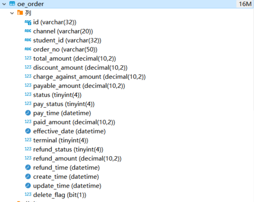

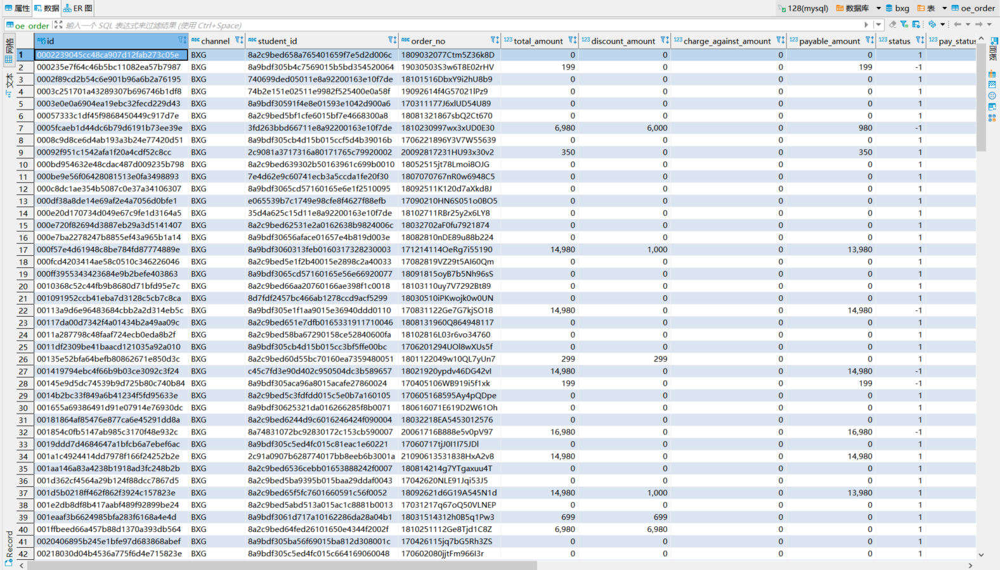

### 表关系

表之间的关联关系如下图

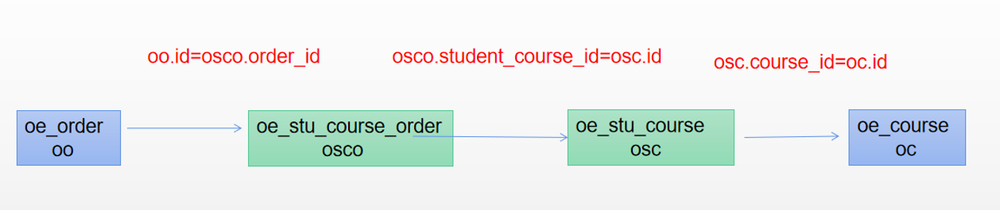

## 分层设计

### ODS层

通过flinkcdc将mysql数据（在node1上）同步到hudi的ODS层,同时会在hive中自动创建对应表。ODS层存储的是原始数据,没有进行更改。

### DWD层

将ods层数据进行清洗转换，并将需求涉及的表进行拉宽，数据粒度保持不变。

**拉宽时注意**，并不是所有关联到的表都进行拉宽，而且只拉宽一对一关系的表，对于有一对多关系的，则不拉宽。因为一对多关系会使主表的条数增多 。

### DWS层

在DWD层的基础上，按照业务的要求进行数据处理（如聚合、条件筛选等）。

## 实现

### Mysql-FlinkCDC

在Flinksql客户端创建mysql映射表

#### oe_course

（之前看板已创建）

```sql
CREATE TABLE if not exists mysql_bxg_oe_course (
    `id` INT,
    `grade_name` STRING,
    `bigimg_path` STRING,
    `video_url` STRING,
    `img_alt` STRING,
    `description` STRING,
    `detailimg_path` STRING,
    `smallimg_path` STRING,
    `sort` INT,
    `status` STRING,
    `learnd_count` INT,
    `learnd_count_flag` INT,
    `original_cost` DECIMAL(10,2),
    `current_price` DECIMAL(10,2),
    `course_length` DECIMAL(10,2),
    `menu_id` INT,
    `is_free` BOOLEAN,
    `course_detail` STRING,
    `course_detail_mobile` STRING,
    `course_detail1` STRING,
    `course_detail1_mobile` STRING,
    `course_plan_detail` STRING,
    `course_plan_detail_mobile` STRING,
    `course_detail2` STRING,
    `course_detail2_mobile` STRING,
    `course_outline` STRING,
    `common_problem` STRING,
    `common_problem_mobile` STRING,
    `lecturer_id` INT,
    `is_recommend` INT,
    `recommend_sort` INT,
    `qqno` STRING,
    `description_show` INT,
    `rec_img_path` STRING,
    `pv` INT,
    `course_type` INT,
    `default_student_count` INT,
    `study_status` INT,
    `online_course` INT,
    `course_level` INT,
    `content_type` INT,
    `recommend_type` INT,
    `employment_rate` STRING,
    `employment_salary` STRING,
    `score` STRING,
    `cover_url` STRING,
    `offline_course_url` STRING,
    `outline_url` STRING,
    `project_page_url` STRING,
    `preschool_test_flag` BOOLEAN,
    `service_period` INT,
    `included_validity_period` TINYINT,
    `validity_period` INT,
    `qualified_jobs` STRING,
    `work_year_min` INT,
    `work_year_max` INT,
    `promote_flag` BOOLEAN,
    `create_person` STRING,
    `update_person` STRING,
    `create_time` TIMESTAMP(3),
    `update_time` TIMESTAMP(3),
    `is_delete` BOOLEAN,
    PRIMARY KEY (`id`) NOT ENFORCED
) WITH (
    'connector'= 'mysql-cdc',
    'hostname'= 'node1',
    'port'= '3306',
    'username'= 'root',
    'password'='123456',
    'server-time-zone'= 'Asia/Shanghai',
    'debezium.snapshot.mode'='initial',
    'database-name'= 'bxg',
    'table-name'= 'oe_course'
);
```

#### oe_order

（之前看板已创建）

```sql
CREATE TABLE if not exists mysql_bxg_oe_order (
    `id` STRING,
    `channel` STRING,
    `student_id` STRING,
    `order_no` STRING,
    `total_amount` DECIMAL(10,2),
    `discount_amount` DECIMAL(10,2),
    `charge_against_amount` DECIMAL(10,2),
    `payable_amount` DECIMAL(10,2),
    `status` TINYINT,
    `pay_status` TINYINT,
    `pay_time` TIMESTAMP(3),
    `paid_amount` DECIMAL(10,2),
    `effective_date` TIMESTAMP(3),
    `terminal` TINYINT,
    `refund_status` TINYINT,
    `refund_amount` DECIMAL(10,2),
    `refund_time` TIMESTAMP(3),
    `create_time` TIMESTAMP(3),
    `update_time` TIMESTAMP(3),
    `delete_flag` BOOLEAN,
    PRIMARY KEY (id) NOT ENFORCED
) WITH (
    'connector' = 'mysql-cdc',
    'hostname' = 'node1',
    'port' = '3306',
    'username' = 'root',
    'password' = '123456',
    'server-time-zone'= 'Asia/Shanghai',
    'debezium.snapshot.mode'='initial',
    'database-name'= 'bxg',
    'table-name' = 'oe_order'
);
```

#### oe_order_transfer_apply

```sql
CREATE TABLE if not exists mysql_bxg_oe_order_transfer_apply (
  `id` INT,
  `order_id` STRING,
  `order_detail_id` STRING,
  `deposit_id` STRING,
  `cash_back_record_id` INT,
  `student_id` STRING,
  `course_id` INT,
  `stu_course_id` INT,
  `order_refund_id` INT,
  `original_stu_course_status` TINYINT,
  `original_order_refund_status` TINYINT,
  `biz_type` TINYINT,
  `oa_affair_id` STRING,
  `oa_summary_id` STRING,
  `oa_template_code` STRING,
  `oa_template_id` STRING,
  `oa_bill_no` STRING,
  `fee_transfer_type` TINYINT,
  `amount` DECIMAL(10,2),
  `status` TINYINT,
  `order_type` TINYINT,
  `target_order_id` STRING,
  `target_order_detail_id` STRING,
  `target_import_order_id` INT,
  `target_order_type` TINYINT,
  `creator` STRING,
  `creator_name` STRING,
  `create_time` TIMESTAMP(3),
  `update_time` TIMESTAMP(3),
  `delete_flag` BOOLEAN,
PRIMARY KEY (`id`) NOT ENFORCED
 ) WITH (
          'connector'= 'mysql-cdc',
          'hostname'= 'node1',
          'port'= '3306',
          'username'= 'root',
          'password'='123456',
          'server-time-zone'= 'Asia/Shanghai',
          'debezium.snapshot.mode'='initial',
          'database-name'= 'bxg',
          'table-name'= 'oe_order_transfer_apply'
          );
```

#### oe_stu_course

（之前看板已创建）

```sql
CREATE TABLE if not exists mysql_bxg_oe_stu_course (
    `id` INT,
    `student_id` STRING,
    `course_id` INT,
    `status` TINYINT,
    `contract_status` TINYINT,
    `learn_status` TINYINT,
    `service_days` SMALLINT,
    `service_expires` TIMESTAMP(3),
    `validity_days` INT,
    `validity_expires` TIMESTAMP(3),
    `terminate_cause` TINYINT,
    `effective_date` TIMESTAMP(3),
    `finished_time` TIMESTAMP(3),
    `total_progress` DECIMAL(10,2),
    `purchase_time` INT,
    `create_time` TIMESTAMP(3),
    `update_time` TIMESTAMP(3),
    `delete_flag` BOOLEAN,
    PRIMARY KEY (`id`) NOT ENFORCED
) WITH (
    'connector'= 'mysql-cdc',
    'hostname'= 'node1',
    'port'= '3306',
    'username'= 'root',
    'password'='123456',
    'server-time-zone'= 'Asia/Shanghai',
    'debezium.snapshot.mode'='initial',
    'database-name'= 'bxg',
    'table-name'= 'oe_stu_course'
);
```

#### oe_stu_course_order

（之前看板已创建）

```sql
CREATE TABLE if not exists mysql_bxg_oe_stu_course_order (
    `id` INT,
    `student_course_id` INT,
    `order_id` STRING,
    `order_detail_id` STRING,
    `create_time` TIMESTAMP(3),
    `update_time` TIMESTAMP(3),
    `delete_flag` BOOLEAN,
    PRIMARY KEY (`id`) NOT ENFORCED
) WITH (
    'connector'= 'mysql-cdc',
    'hostname'= 'node1',
    'port'= '3306',
    'username'= 'root',
    'password'='123456',
    'server-time-zone'= 'Asia/Shanghai',
    'debezium.snapshot.mode'='initial',
    'database-name'= 'bxg',
    'table-name'= 'oe_stu_course_order'
);
```

### ODS层

设置checkpoint:

```sql
set execution.checkpointing.interval=30sec; 
```

#### 创建hudi映射表

在flink客户端创建hudi映射表

##### oe_course

(之前看板已创建)

```sql
CREATE TABLE if not exists hudi_bxg_ods_oe_course(
    `id` INT,
    `grade_name` STRING,
    `bigimg_path` STRING,
    `video_url` STRING,
    `img_alt` STRING,
    `description` STRING,
    `detailimg_path` STRING,
    `smallimg_path` STRING,
    `sort` INT,
    `status` STRING,
    `learnd_count` INT,
    `learnd_count_flag` INT,
    `original_cost` DECIMAL(10,2),
    `current_price` DECIMAL(10,2),
    `course_length` DECIMAL(10,2),
    `menu_id` INT,
    `is_free` BOOLEAN,
    `course_detail` STRING,
    `course_detail_mobile` STRING,
    `course_detail1` STRING,
    `course_detail1_mobile` STRING,
    `course_plan_detail` STRING,
    `course_plan_detail_mobile` STRING,
    `course_detail2` STRING,
    `course_detail2_mobile` STRING,
    `course_outline` STRING,
    `common_problem` STRING,
    `common_problem_mobile` STRING,
    `lecturer_id` INT,
    `is_recommend` INT,
    `recommend_sort` INT,
    `qqno` STRING,
    `description_show` INT,
    `rec_img_path` STRING,
    `pv` INT,
    `course_type` INT,
    `default_student_count` INT,
    `study_status` INT,
    `online_course` INT,
    `course_level` INT,
    `content_type` INT,
    `recommend_type` INT,
    `employment_rate` STRING,
    `employment_salary` STRING,
    `score` STRING,
    `cover_url` STRING,
    `offline_course_url` STRING,
    `outline_url` STRING,
    `project_page_url` STRING,
    `preschool_test_flag` BOOLEAN,
    `service_period` INT,
    `included_validity_period` INT,
    `validity_period` INT,
    `qualified_jobs` STRING,
    `work_year_min` INT,
    `work_year_max` INT,
    `promote_flag` BOOLEAN,
    `create_person` STRING,
    `update_person` STRING,
    `create_time` TIMESTAMP(3),
    `update_time` TIMESTAMP(3),
    `is_delete` BOOLEAN,
   PRIMARY KEY (id) NOT ENFORCED
) WITH(    'connector'='hudi'
    ,'path'= 'hdfs://node1:8020/hudi/bxg/ods_oe_course'
    ,'hoodie.datasource.write.recordkey.field'= 'id' 
    ,'write.tasks'= '1'
    ,'compaction.tasks'= '1'
    ,'write.rate.limit'= '2000' 
    ,'table.type'= 'MERGE_ON_READ' 
    ,'compaction.async.enabled'= 'true' 
    ,'compaction.trigger.strategy'= 'num_commits' 
    ,'compaction.delta_commits'= '1'
    ,'changelog.enabled'= 'true' 
    ,'read.tasks' = '1'
,'read.streaming.enabled'= 'true'
    ,'read.start-commit'='earliest' 
    ,'read.streaming.check-interval'= '3'
    ,'hive_sync.enable'= 'true' 
    ,'hive_sync.mode'= 'hms' 
    ,'hive_sync.metastore.uris'= 'thrift://node1:9083'
    ,'hive_sync.table'= 'ods_oe_course'
    ,'hive_sync.db'= 'bxg' 
    ,'hive_sync.username'= '' 
    ,'hive_sync.password'= '' 
    ,'hive_sync.support_timestamp'= 'true' 
);
```

##### oe_order

(之前看板已创建)

```sql
CREATE TABLE if not exists hudi_bxg_ods_oe_order (
    `id` STRING,
    `channel` STRING,
    `student_id` STRING,
    `order_no` STRING,
    `total_amount` DECIMAL(10,2),
    `discount_amount` DECIMAL(10,2),
    `charge_against_amount` DECIMAL(10,2),
    `payable_amount` DECIMAL(10,2),
    `status` INT,
    `pay_status` INT,
    `pay_time` TIMESTAMP(3),
    `paid_amount` DECIMAL(10,2),
    `effective_date` TIMESTAMP(3),
    `terminal` INT,
    `refund_status` INT,
    `refund_amount` DECIMAL(10,2),
    `refund_time` TIMESTAMP(3),
    `create_time` TIMESTAMP(3),
    `update_time` TIMESTAMP(3),
    `delete_flag` BOOLEAN,
   PRIMARY KEY (id) NOT ENFORCED
) WITH(    'connector'='hudi'
    ,'path'= 'hdfs://node1:8020/hudi/bxg/ods_oe_order'
    ,'hoodie.datasource.write.recordkey.field'= 'id' 
    ,'write.tasks'= '1'
    ,'compaction.tasks'= '1'
    ,'write.rate.limit'= '2000' 
    ,'table.type'= 'MERGE_ON_READ' 
    ,'compaction.async.enabled'= 'true' 
    ,'compaction.trigger.strategy'= 'num_commits' 
    ,'compaction.delta_commits'= '1'
    ,'changelog.enabled'= 'true' 
    ,'read.tasks' = '1'
    ,'read.streaming.enabled'= 'true' 
    ,'read.start-commit'='earliest'
    ,'read.streaming.check-interval'= '3'
    ,'hive_sync.enable'= 'true' 
    ,'hive_sync.mode'= 'hms' 
    ,'hive_sync.metastore.uris'= 'thrift://node1:9083'
    ,'hive_sync.table'= 'ods_oe_order'
    ,'hive_sync.db'= 'bxg' 
    ,'hive_sync.username'= '' 
    ,'hive_sync.password'= '' 
    ,'hive_sync.support_timestamp'= 'true' 
);
```

##### oe_order_transfer_apply

```sql
CREATE TABLE IF NOT EXISTS `hudi_bxg_ods_oe_order_transfer_apply` (
   `id` INT,
  `order_id` STRING,
  `order_detail_id` STRING,
  `deposit_id` STRING,
  `cash_back_record_id` INT,
  `student_id` STRING,
  `course_id` INT,
  `stu_course_id` INT,
  `order_refund_id` INT,
  `original_stu_course_status` INT,
  `original_order_refund_status` INT,
  `biz_type` INT,
  `oa_affair_id` STRING,
  `oa_summary_id` STRING,
  `oa_template_code` STRING,
  `oa_template_id` STRING,
  `oa_bill_no` STRING,
  `fee_transfer_type` INT,
  `amount` DECIMAL(10,2),
  `status` INT,
  `order_type` INT,
  `target_order_id` STRING,
  `target_order_detail_id` STRING,
  `target_import_order_id` INT,
  `target_order_type` INT,
  `creator` STRING,
  `creator_name` STRING,
  `create_time` TIMESTAMP(3),
  `update_time` TIMESTAMP(3),
  `delete_flag` BOOLEAN, 
  PRIMARY KEY ( `id` ) NOT ENFORCED
) WITH(
     'connector'='hudi'
    ,'path'= 'hdfs://node1:8020/hudi/bxg/ods_oe_order_transfer_apply'
    ,'hoodie.datasource.write.recordkey.field'= 'id' 
    ,'write.tasks'= '1'
    ,'compaction.tasks'= '1'
    ,'write.rate.limit'= '2000' 
    ,'table.type'= 'MERGE_ON_READ' 
    ,'compaction.async.enabled'= 'true' 
    ,'compaction.trigger.strategy'= 'num_commits' 
    ,'compaction.delta_commits'= '1'
    ,'changelog.enabled'= 'true' 
    ,'read.tasks' = '1'
    ,'read.streaming.enabled'= 'true' 
    ,'read.start-commit'='earliest'
    ,'read.streaming.check-interval'= '3'
    ,'hive_sync.enable'= 'true' 
    ,'hive_sync.mode'= 'hms' 
    ,'hive_sync.metastore.uris'= 'thrift://node1:9083'
    ,'hive_sync.table'= 'ods_oe_order_transfer_apply'
    ,'hive_sync.db'= 'bxg' 
    ,'hive_sync.username'= '' 
    ,'hive_sync.password'= '' 
    ,'hive_sync.support_timestamp'= 'true' 
);
```

##### oe_stu_course

(之前看板已创建)

```sql
CREATE TABLE if not exists hudi_bxg_ods_oe_stu_course (
    `id` INT,
    `student_id` STRING,
    `course_id` INT,
    `status` INT,
    `contract_status` INT,
    `learn_status` INT,
    `service_days` INT,
    `service_expires` TIMESTAMP(3),
    `validity_days` INT,
    `validity_expires` TIMESTAMP(3),
    `terminate_cause` INT,
    `effective_date` TIMESTAMP(3),
    `finished_time` TIMESTAMP(3),
    `total_progress` DECIMAL(10,2),
    `purchase_time` INT,
    `create_time` TIMESTAMP(3),
    `update_time` TIMESTAMP(3),
    `delete_flag` BOOLEAN,
   PRIMARY KEY (id) NOT ENFORCED
) WITH(
    'connector'='hudi'
    ,'path'= 'hdfs://node1:8020/hudi/bxg/ods_oe_stu_course'
    ,'hoodie.datasource.write.recordkey.field'= 'id' 
    ,'write.tasks'= '1'
    ,'compaction.tasks'= '1'
    ,'write.rate.limit'= '2000' 
    ,'table.type'= 'MERGE_ON_READ' 
    ,'compaction.async.enabled'= 'true' 
    ,'compaction.trigger.strategy'= 'num_commits' 
    ,'compaction.delta_commits'= '1'
    ,'changelog.enabled'= 'true' 
    ,'read.tasks' = '1'
    ,'read.streaming.enabled'= 'true' 
    ,'read.start-commit'='earliest'
    ,'read.streaming.check-interval'= '3'
    ,'hive_sync.enable'= 'true' 
    ,'hive_sync.mode'= 'hms' 
    ,'hive_sync.metastore.uris'= 'thrift://node1:9083'
    ,'hive_sync.table'= 'ods_oe_stu_course'
    ,'hive_sync.db'= 'bxg' 
    ,'hive_sync.username'= '' 
    ,'hive_sync.password'= '' 
    ,'hive_sync.support_timestamp'= 'true' 
);
```

##### oe_stu_course_order

(之前看板已创建)

```sql
CREATE TABLE if not exists hudi_bxg_ods_oe_stu_course_order (
    `id` INT,
    `student_course_id` INT,
    `order_id` STRING,
    `order_detail_id` STRING,
    `create_time` TIMESTAMP(3),
    `update_time` TIMESTAMP(3),
    `delete_flag` BOOLEAN,
   PRIMARY KEY (id) NOT ENFORCED
) WITH(
    'connector'='hudi'
    ,'path'= 'hdfs://node1:8020/hudi/bxg/ods_oe_stu_course_order'
    ,'hoodie.datasource.write.recordkey.field'= 'id' 
    ,'write.tasks'= '1'
    ,'compaction.tasks'= '1'
    ,'write.rate.limit'= '2000' 
    ,'table.type'= 'MERGE_ON_READ' 
    ,'compaction.async.enabled'= 'true' 
    ,'compaction.trigger.strategy'= 'num_commits' 
    ,'compaction.delta_commits'= '1'
    ,'changelog.enabled'= 'true' 
    ,'read.tasks' = '1'
    ,'read.streaming.enabled'= 'true' 
    ,'read.start-commit'='earliest'
    ,'read.streaming.check-interval'= '3'
    ,'hive_sync.enable'= 'true' 
    ,'hive_sync.mode'= 'hms' 
    ,'hive_sync.metastore.uris'= 'thrift://node1:9083'
    ,'hive_sync.table'= 'ods_oe_stu_course_order'
    ,'hive_sync.db'= 'bxg' 
    ,'hive_sync.username'= '' 
    ,'hive_sync.password'= '' 
    ,'hive_sync.support_timestamp'= 'true' 
);

```

#### 插入数据

##### oe_course

```sql
INSERT INTO `hudi_bxg_ods_oe_course`
select  id, grade_name, bigimg_path, video_url, img_alt, description, detailimg_path, smallimg_path, sort, status, learnd_count, learnd_count_flag, original_cost, current_price, course_length, menu_id, is_free, course_detail, course_detail_mobile, course_detail1, course_detail1_mobile, course_plan_detail, course_plan_detail_mobile, course_detail2, course_detail2_mobile, course_outline, common_problem, common_problem_mobile, lecturer_id, is_recommend, recommend_sort, qqno, description_show, rec_img_path, pv, course_type, default_student_count, study_status, online_course, course_level, content_type, recommend_type, employment_rate, employment_salary, score, cover_url, offline_course_url, outline_url, project_page_url, preschool_test_flag, service_period, included_validity_period, validity_period, qualified_jobs, work_year_min, work_year_max, promote_flag, create_person, update_person, create_time, update_time, is_delete
from `mysql_bxg_oe_course`;
```

##### oe_order

```sql
INSERT INTO `hudi_bxg_ods_oe_order` 
SELECT  `id`, `channel`, `student_id`, `order_no`, `total_amount`, `discount_amount`, `charge_against_amount`, `payable_amount`, `status`, `pay_status`, `pay_time`, `paid_amount`, `effective_date`, `terminal`, `refund_status`, `refund_amount`, `refund_time`, `create_time`, `update_time`, `delete_flag` FROM `mysql_bxg_oe_order`;
```

##### oe_stu_course_order

```sql
INSERT INTO `hudi_bxg_ods_oe_stu_course_order` 
SELECT `id`, `student_course_id`, `order_id`, `order_detail_id`, `create_time`, `update_time`, `delete_flag` 
FROM `mysql_bxg_oe_stu_course_order`;
```

##### oe_order_transfer_apply

```sql
INSERT INTO `hudi_bxg_ods_oe_order_transfer_apply` 
SELECT `id`,`order_id` ,`order_detail_id`,`deposit_id`,`cash_back_record_id` ,`student_id` ,`course_id`,`stu_course_id` ,`order_refund_id` ,`original_stu_course_status` ,`original_order_refund_status` ,`biz_type`,`oa_affair_id`,`oa_summary_id` ,`oa_template_code` ,`oa_template_id`,`oa_bill_no`,`fee_transfer_type` ,`amount`,`status`,`order_type` ,`target_order_id`,`target_order_detail_id` ,`target_import_order_id`,`target_order_type` ,`creator` ,`creator_name`,`create_time`,`update_time`,`delete_flag`
FROM `mysql_bxg_oe_order_transfer_apply`;
```

##### oe_stu_course

```sql
INSERT INTO `hudi_bxg_ods_oe_stu_course` 
SELECT  id, student_id, course_id, status, contract_status, learn_status, service_days, service_expires, validity_days, validity_expires, terminate_cause, effective_date, finished_time, total_progress, purchase_time, create_time, update_time, delete_flag 
FROM `mysql_bxg_oe_stu_course`;
```

#### 查看结果

##### 查看Flink web界面

浏览器地址：[http://192.168.88.161:8081/\#/overview](http://192.168.88.161:8081/#/overview)

可以看到正在运行的作业

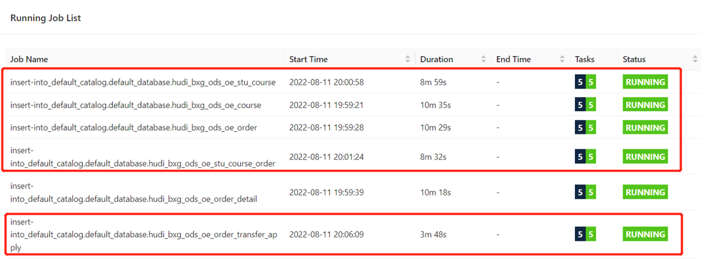

##### 查看文件

[http://192.168.88.161:9870/explorer.html\#/hudi/bxg](http://192.168.88.161:9870/explorer.html#/hudi/bxg)

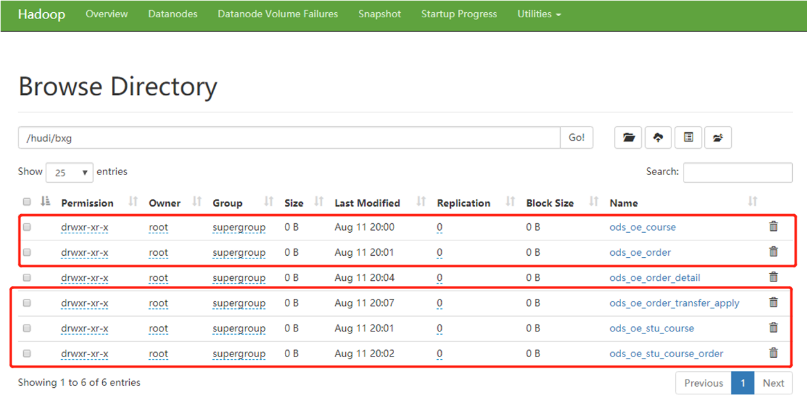

##### 查看表数据

在hive的数据库查看表数据

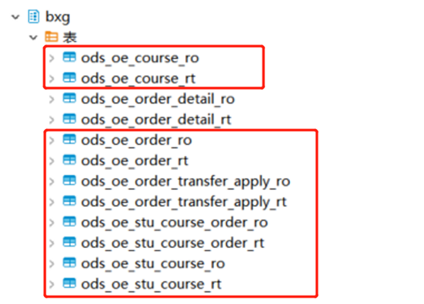

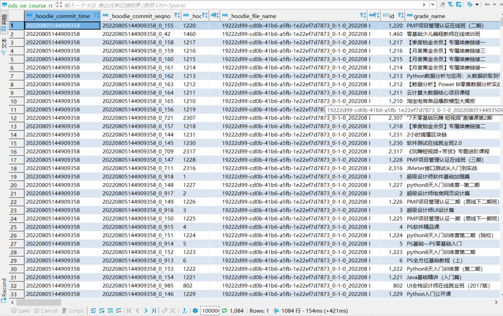

### DWD层

#### 宽表设计

##### 表关系

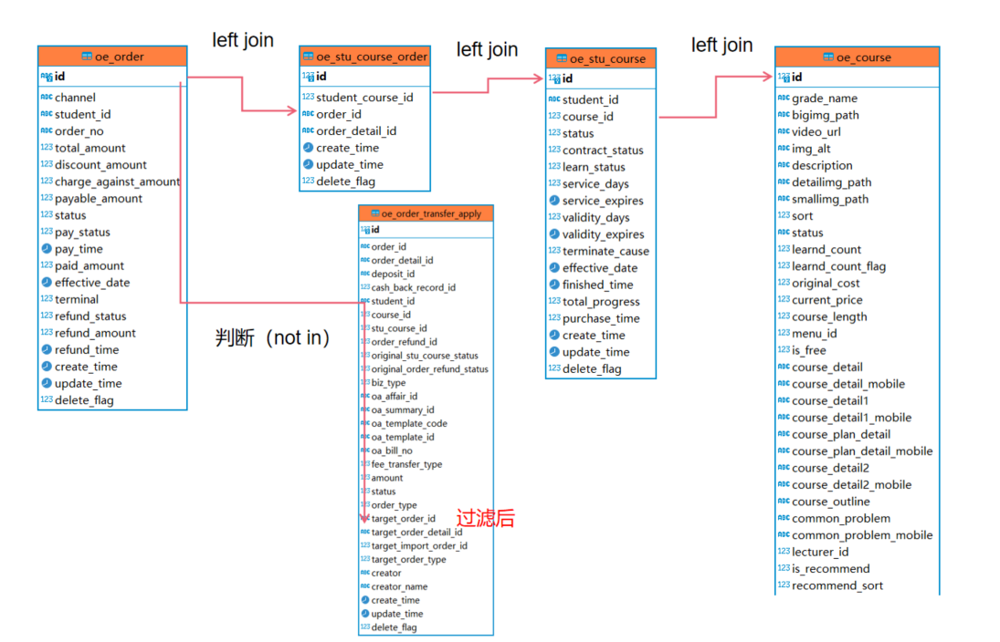

##### 分析

**如何拉宽呢**

对于以上指标，oe_stu_course、oe_course被关联的都是主键，所以oe_stu_course_order、oe_stu_course、oe_course之间不存在一对多关系，可以考虑将它们拉宽。另外注意到**新媒体短视频课程报名分析看板**中的宽表**dwd_oe_stu_course_order**已经包括这些表，所以可以直接使用。但是要注意有些字段之前是没有放到宽表中的，所以要增加一些字段：`osc`.`effective_date`，`oc`.`course_type`。**（增加字段时，要把之前存在的表先删掉，再进行创建）**

所有指标中都用了oe_order_transfer_apply来做判断，而且都是与oe_order表中的id建立联系，所以可以把这两张表拉宽。因为是判断：not in的关系。所以可以将oe_order关联oe_order_transfer_apply中的满足条件的target_order_id，如果关联不到（字段值为null），即满足not in。另外要注意，target_order_id可能存在重复值，这样关联时就会产生一对多关系，所以在创建视图时要用distinct进行去重。


#### 宽表实现

##### Hudi DWD层

###### dwd_oe_stu_course_order

（将之前同名表删掉）

创建hudi_dwd_oe_stu_course_order映射表

```sql
CREATE TABLE if not exists hudi_dwd_oe_stu_course_order (
     `id` int,
     `stu_course_id` int,
     `order_id` string,
     `course_id` int,
     `stu_course_status` int,
`stu_course_status_des` string,
     `stu_course_delete_flag` BOOLEAN,
`effective_date` TIMESTAMP(3),
`payable_amount` decimal(10,2),
`pay_status` int,
`pay_time` TIMESTAMP(3),
`paid_amount` decimal(10,2),
`refund_status` int,
`order_delete_flag` boolean,
`grade_name` string,
`course_type` INT,
`is_complete_order` boolean,
PRIMARY KEY (`id`) NOT ENFORCED
) WITH(
    'connector'='hudi'
    ,'path'= 'hdfs://node1:8020/hudi/bxg/dwd_oe_stu_course_order'
    ,'hoodie.datasource.write.recordkey.field'= 'id' 
    ,'write.tasks'= '1'
    ,'compaction.tasks'= '1'
    ,'write.rate.limit'= '2000' 
    ,'table.type'= 'MERGE_ON_READ' 
    ,'compaction.async.enabled'= 'true' 
    ,'compaction.trigger.strategy'= 'num_commits' 
    ,'compaction.delta_commits'= '1'
    ,'changelog.enabled'= 'true' 
    ,'read.tasks' = '1'
    ,'read.streaming.enabled'= 'true' 
    ,'read.start-commit'='earliest'
    ,'read.streaming.check-interval'= '3'
    ,'hive_sync.enable'= 'true' 
    ,'hive_sync.mode'= 'hms' 
    ,'hive_sync.metastore.uris'= 'thrift://node1:9083'
    ,'hive_sync.table'= 'dwd_oe_stu_course_order'
    ,'hive_sync.db'= 'bxg' 
    ,'hive_sync.username'= '' 
    ,'hive_sync.password'= '' 
    ,'hive_sync.support_timestamp'= 'true' 
);
```

插入数据

```sql
insert into hudi_dwd_oe_stu_course_order
SELECT
    `osco`.`id`,
    `osco`.`student_course_id`,
    `osco`.`order_id`,
    `osc`.`course_id`,
`osc`.`status` as `stu_course_status`,
case `osc`.`status` when 0 then '试学' when 1 then '生效' when 2 then '待生效' when -1 then '停课' else '退费' end as `stu_course_status_des`,
    `osc`.`delete_flag` as `stu_course_delete_flag`,
`osc`.`effective_date`,
    `oo`.`payable_amount`,
    `oo`.`pay_status`,
    `oo`.`pay_time`,
    `oo`.`paid_amount`,
    `oo`.`refund_status`,
    `oo`.`delete_flag` as `order_delete_flag`,
    `oc`.`grade_name`,
`oc`.`course_type`,
    if (oo.`payable_amount`>0 and `oo`.`pay_status`=2 and `oo`.`delete_flag` = false and `osc`.`delete_flag` = false, true, false) as is_complete_order
FROM hudi_bxg_ods_oe_stu_course_order AS osco
LEFT JOIN hudi_bxg_ods_oe_stu_course AS osc
ON osc.id = osco.student_course_id
LEFT JOIN hudi_bxg_ods_oe_order AS oo
ON oo.id = osco.order_id
LEFT JOIN hudi_bxg_ods_oe_course AS oc
ON oc.id = osc.course_id;
```

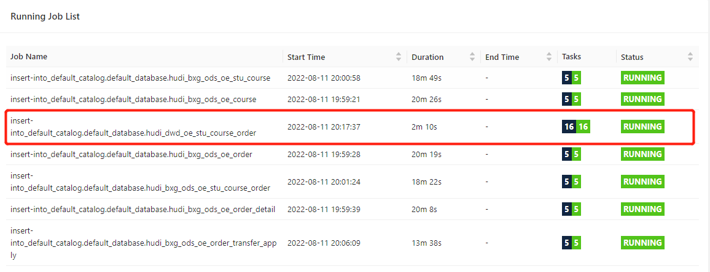

###### dwd_oe_order

```sql
-- 创建拉宽需要的视图（bxg_common_change_classes）
CREATE VIEW IF NOT EXISTS bxg_common_change_classes_v AS SELECT distinct(target_order_id) FROM hudi_bxg_ods_oe_order_transfer_apply t  WHERE t.biz_type = 1 AND t.status = 0 AND t.fee_transfer_type=0 AND t.delete_flag = false;
-- 创建hudi_dwd_oe_order映射表
CREATE TABLE if not exists hudi_dwd_oe_order (
    `id` STRING,
    `channel` STRING,
    `student_id` STRING,
    `order_no` STRING,
    `total_amount` DECIMAL(10,2),
    `discount_amount` DECIMAL(10,2),
    `charge_against_amount` DECIMAL(10,2),
    `payable_amount` DECIMAL(10,2),
    `status` INT,
    `pay_status` INT,
    `pay_time` TIMESTAMP(3),
    `paid_amount` DECIMAL(10,2),
    `effective_date` TIMESTAMP(3),
    `terminal` INT,
    `refund_status` INT,
    `refund_amount` DECIMAL(10,2),
    `refund_time` TIMESTAMP(3),
    `create_time` TIMESTAMP(3),
    `update_time` TIMESTAMP(3),
    `delete_flag` BOOLEAN,
    `is_target_order` BOOLEAN,
PRIMARY KEY (`id`) NOT ENFORCED
) WITH(
    'connector'='hudi'
    ,'path'= 'hdfs://node1:8020/hudi/bxg/dwd_oe_order'
    ,'hoodie.datasource.write.recordkey.field'= 'id' 
    ,'write.tasks'= '1'
    ,'compaction.tasks'= '1'
    ,'write.rate.limit'= '2000' 
    ,'table.type'= 'MERGE_ON_READ' 
    ,'compaction.async.enabled'= 'true' 
    ,'compaction.trigger.strategy'= 'num_commits' 
    ,'compaction.delta_commits'= '1'
    ,'changelog.enabled'= 'true' 
    ,'read.tasks' = '3'
    ,'read.streaming.enabled'= 'true' 
    ,'read.start-commit'='earliest'
    ,'read.streaming.check-interval'= '3'
    ,'hive_sync.enable'= 'true' 
    ,'hive_sync.mode'= 'hms' 
    ,'hive_sync.metastore.uris'= 'thrift://node1:9083'
    ,'hive_sync.table'= 'dwd_oe_order'
    ,'hive_sync.db'= 'bxg' 
    ,'hive_sync.username'= '' 
    ,'hive_sync.password'= '' 
    ,'hive_sync.support_timestamp'= 'true' 
);
-- 插入数据
insert into hudi_dwd_oe_order
SELECT
    `id`, `channel`, `student_id`, `order_no`, `total_amount`, `discount_amount`, `charge_against_amount`, `payable_amount`, `status`, `pay_status`, `pay_time`, `paid_amount`, `effective_date`, `terminal`, `refund_status`, `refund_amount`, `refund_time`, `create_time`,`update_time`, `delete_flag`,
if (`ccv`.`target_order_id` is not null, true, false) AS `is_target_order`
FROM hudi_bxg_ods_oe_order AS oo
LEFT JOIN `bxg_common_change_classes_v` AS `ccv`
    ON `oo`.`id`=`ccv`.`target_order_id`;
```

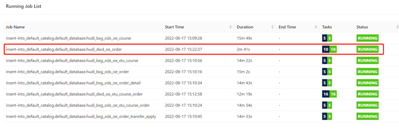

##### Doris DWD层

###### Doris建表

将数据抽取到doris中需要提前在doris中建表（hudi不需要，hudi可以自动捕获表结构）。

建dwd_oe_stu_course_order表（将之前同名表删掉）

```sql
CREATE TABLE IF NOT EXISTS bxg.dwd_oe_stu_course_order
(
   `id` int,
   `stu_course_id` int COMMENT '学员课程id',
   `order_id` string,
   `course_id` int COMMENT '学员购买的课程',
   `stu_course_status` int COMMENT '学员课程状态：0试学、1生效、2待生效、-1停课、8退费',
`stu_course_status_des` string COMMENT '学员课程状态描述：0试学、1生效、2待生效、-1停课、8退费',
   `stu_course_delete_flag` BOOLEAN,
`effective_date` datetime,
   `payable_amount` decimal(10,2) COMMENT '实际应付总金额=原价-优惠总额-冲抵金额',
   `pay_status` int  COMMENT '支付状态：0未支付、1部分支付、2支付完成',
   `pay_time` datetime COMMENT '最后支付完成时间',
   `paid_amount` decimal(10,2) COMMENT '当前已付总额',
   `refund_status` INT COMMENT '退费状态:0-未退费;-1-已退费;-2-退费中;-3-部分退费',
   `order_delete_flag` BOOLEAN COMMENT 'ods_bxg_oe_order表中订单是否删除',
   `grade_name` string COMMENT '课程名称',
`course_type`  int,
   `is_complete_order` BOOLEAN COMMENT '实际应付总金额0且支付状态pay_status完成'
) Unique Key (`id`)
DISTRIBUTED BY HASH(`id`) BUCKETS 10
PROPERTIES (
"replication_allocation" = "tag.location.default: 1"
);
```

建dwd_oe_order表

```sql
CREATE TABLE  if not exists bxg.`dwd_oe_order` (
    `id` varchar(32) NOT NULL,
    `channel` string NOT NULL COMMENT '订单渠道来源：BXG/博学谷，目前只有博学谷，将来可能会有黑马短训、酷丁鱼等',
    `student_id` string NOT NULL COMMENT '用户ID',
    `order_no` string NOT NULL COMMENT '订单号，生成规则：年（2位）-月（2位）-日（2位）-时（2位）-随机码（12位） eg.16110910aRdK45Y86qe3',
    `total_amount` decimal(10,2) NOT NULL DEFAULT '0.00' COMMENT '原价/总价',
    `discount_amount` decimal(10,2) NOT NULL DEFAULT '0.00' COMMENT '优惠总额，有可能是优惠券优惠、也有可能是满减优惠',
    `charge_against_amount` decimal(10,2) NOT NULL DEFAULT '0.00' COMMENT '冲抵金额，目前包含报名费',
    `payable_amount` decimal(10,2) NOT NULL DEFAULT '0.00' COMMENT '实际应付总金额=原价-优惠总额-冲抵金额',
    `status` int NOT NULL DEFAULT '0' COMMENT '订单状态：0未生效、1已生效、-1已关闭。和订单支付状态区分开，因为在某些情况下学员没有支付完成订单也已经开始生效。“-1已关闭”状态代表已退费和超时关闭两种含义。',
    `pay_status` int NOT NULL COMMENT '支付状态：0未支付、1部分支付、2支付完成',
    `pay_time` datetime DEFAULT NULL COMMENT '最后支付完成时间',
    `paid_amount` decimal(10,2) NOT NULL DEFAULT '0.00' COMMENT '当前已付总额',
    `effective_date` datetime DEFAULT NULL COMMENT '订单生效日期。从该日期开始计算服务期。',
    `terminal` int NOT NULL DEFAULT '0' COMMENT '下单订单终端：0/PC官网、1/后台导入-其他、2/App、3/移动官网、4微信内、5/后台导入-线下转线上、6/ios、7/补录-系统-N12分摊转移、8/小程序(在线编程)',
    `refund_status` int NOT NULL DEFAULT '0' COMMENT '退费状态:0-未退费;-1-已退费;-2-退费中;-3-部分退费',
    `refund_amount` decimal(10,2) NOT NULL DEFAULT '0.00' COMMENT '退费金额',
`refund_time` datetime DEFAULT NULL COMMENT '最后退费时间',
`create_time` datetime NOT NULL COMMENT '物理入库时间，如果是补录订单，该时间为补录订单的日期，而不是学员真实缴费的日期。',
    `update_time` datetime NOT NULL,
`delete_flag` boolean NOT NULL,
`is_target_order` boolean
    )  UNIQUE KEY(`id`)
    COMMENT '订单：主订单'
    DISTRIBUTED BY HASH(`id`) BUCKETS 10
    PROPERTIES (
        "replication_allocation" = "tag.location.default: 1"
               );
```

###### Doris映射表

建doris_dwd_oe_stu_course_order映射表

```sql
CREATE TABLE if not exists doris_dwd_oe_stu_course_order (
     `id` int,
     `stu_course_id` int,
     `order_id` string,
     `course_id` int,
     `stu_course_status` int,
`stu_course_status_des` string,
     `stu_course_delete_flag` BOOLEAN,
`effective_date` TIMESTAMP(3),
     `payable_amount` decimal(10,2),
     `pay_status` int,
     `pay_time` TIMESTAMP(3),
     `paid_amount` decimal(10,2),
     `refund_status` int,
     `order_delete_flag` boolean,
     `grade_name` string,
`course_type` INT,
     `is_complete_order` boolean,
     PRIMARY KEY (`id`) NOT ENFORCED
) WITH (
    'fenodes' = 'node1:8030'
    ,'table.identifier' = 'bxg.dwd_oe_stu_course_order'
    ,'sink.enable-delete' = 'true'
    ,'sink.properties.strip_outer_array' = 'true'
    ,'sink.batch.size' = '2000'
    ,'password' = '123456'
    ,'connector' = 'doris'
    ,'sink.batch.interval' = '10s'
    ,'sink.max-retries' = '5'
    ,'sink.properties.format' = 'json'
    ,'username' = 'root'
);
```

建doris_dwd_oe_order映射表

```sql
CREATE TABLE if not exists doris_dwd_oe_order (                                            
    `id` STRING,
    `channel` STRING,
    `student_id` STRING,
    `order_no` STRING,
    `total_amount` DECIMAL(10,2),
    `discount_amount` DECIMAL(10,2),
    `charge_against_amount` DECIMAL(10,2),
    `payable_amount` DECIMAL(10,2),
    `status` INT,
    `pay_status` INT,
    `pay_time` TIMESTAMP(3),
    `paid_amount` DECIMAL(10,2),
    `effective_date` TIMESTAMP(3),
    `terminal` INT,
    `refund_status` INT,
    `refund_amount` DECIMAL(10,2),
`refund_time` TIMESTAMP(3),
`create_time` TIMESTAMP(3),
    `update_time` TIMESTAMP(3),
`delete_flag` BOOLEAN,
`is_target_order` BOOLEAN,
    PRIMARY KEY (id) NOT ENFORCED
    ) WITH (
          'fenodes' = '192.168.88.161:8030'
          ,'table.identifier' = 'bxg.dwd_oe_order'
          ,'sink.enable-delete' = 'true'
          ,'sink.properties.strip_outer_array' = 'true'
          ,'sink.batch.size' = '2000'
          ,'password' = '123456'
          ,'connector' = 'doris'
          ,'sink.batch.interval' = '10s'
          ,'sink.max-retries' = '5'
          ,'sink.properties.format' = 'json'
          ,'username' = 'root'
          );
```

###### 插入数据

doris**_**dwd_oe_stu_course_order

```sql
INSERT INTO doris_dwd_oe_stu_course_order SELECT `id`,`stu_course_id`, `order_id`,`course_id`,`stu_course_status`,`stu_course_status_des`,`stu_course_delete_flag`, `effective_date`,`payable_amount`,`pay_status`,`pay_time`,`paid_amount`,`refund_status`, `order_delete_flag`, `grade_name`, `course_type`,`is_complete_order`
FROM hudi_dwd_oe_stu_course_order;
```

doris_dwd_oe_order

```sql
INSERT INTO `doris_dwd_oe_order` SELECT  `id`, `create_time`, `channel`, `student_id`, `order_no`, `total_amount`, `discount_amount`, `charge_against_amount`, `payable_amount`, `status`, `pay_status`, `pay_time`, `paid_amount`, `effective_date`, `terminal`, `refund_status`, `refund_amount`, `refund_time`, `update_time`, `delete_flag`
FROM hudi_bxg_ods_oe_order;
```

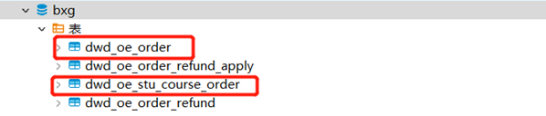

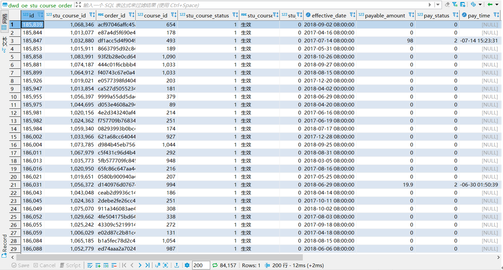

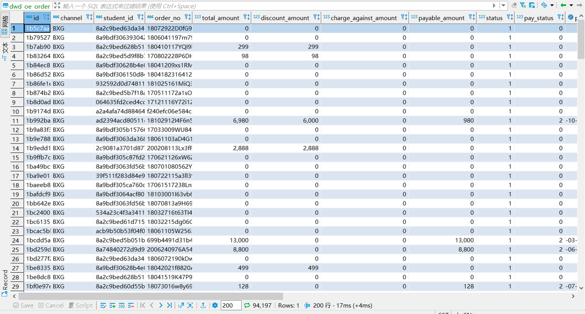

### DWS层

#### 分析

首先基于doris的DWD层先写出需求的SQL如下

##### DWD层查询SQL

创建指标查询过程中重复使用的月份视图

```sql
create view if not exists bxg.common_month_v (month) as
select month from (
    (select 1 as month) union all
    (select 2 as month) union all
    (select 3 as month) union all
    (select 4 as month) union all
    (select 5 as month) union all
    (select 6 as month) union all
    (select 7 as month) union all
    (select 8 as month) union all
    (select 9 as month) union all
    (select 10 as month) union all
    (select 11 as month) union all
    (select 12 as month)) t;
```

年度营收额（全款）

```sql
SELECT
        sum(oo.`payable_amount` + (CASE WHEN oo.`charge_against_amount` IS NOT null THEN oo.`charge_against_amount` ELSE 0 END))/ 10000
FROM
    bxg.`dwd_oe_order` oo
        LEFT JOIN  bxg.dwd_oe_stu_course_order  osco
            on  oo.`id` = osco.`order_id`
WHERE
-- 支付状态：支付完成
        oo.`pay_status` = 2
-- 未删除订单
  AND oo.`delete_flag` = 0
-- 转班情况只取第一次的订单，转班后的订单不重复计算
  AND oo.`is_target_order` = 0
-- 排除N12分摊转移
  AND oo.`terminal` != 7
-- 排除测试课
  AND osco.`course_id` NOT IN (555,1537)
-- 取当前年份
  AND year(oo.`pay_time`) = year(current_date());
```

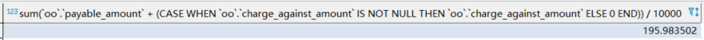

年度营收额（进班）

```sql
SELECT
        sum(oo.`payable_amount` + (CASE WHEN oo.`charge_against_amount` IS NOT null THEN oo.`charge_against_amount` ELSE 0 END)) / 10000
FROM
    bxg.dwd_oe_order oo
        LEFT JOIN  bxg.dwd_oe_stu_course_order  osco
                   on  oo.`id` = osco.`order_id`
WHERE
-- 支付状态：支付完成
        oo.`pay_status` = 2 AND
-- 未删除订单
        oo.`delete_flag` = 0 AND
-- 排除N12分摊转移
    oo.`terminal` != 7  AND
-- 转班情况只取第一次的订单，转班后的订单不重复计算
   oo.`is_target_order` = 0 AND
    osco.`stu_course_delete_flag` = 0 AND
    osco.`stu_course_status` = 1 AND
-- 排除测试课
    osco.`course_id` NOT IN (555,1537)
-- 进班条件
   AND (osco.`effective_date` BETWEEN date_sub(current_date(), interval dayofyear(current_date()) - 1 day ) AND date_add(date_sub(current_date(), interval dayofyear(current_date()) day),interval 1 year));
```

博学谷全部课程营收额分析

```sql
-- 营收-每月收入趋势-全部【注意：没有处理转班数据】
SELECT
    b.`month` AS `月份`,
    max(CASE WHEN a.`year` = 2019 THEN a.`sm` ELSE null END) AS `2019年`,
    max(CASE WHEN a.`year` = 2020 THEN a.`sm` ELSE null END) AS `2020年`,
    max(CASE WHEN a.`year` = 2021 THEN a.`sm` ELSE null END) AS `2021年`,
    max(CASE WHEN a.`year` = 2022 THEN a.`sm` ELSE null END) AS `2022年`
FROM
    (
        SELECT
            c.`month`
        FROM
            bxg.common_month_v c
    ) b
        LEFT JOIN
    (
        SELECT
            year(oo.`pay_time`) AS `year`,
            month(oo.`pay_time`) AS `mon`,
            sum(oo.`payable_amount` + (CASE WHEN oo.`charge_against_amount` IS NOT null THEN oo.`charge_against_amount` ELSE 0 END))/10000  AS `sm`
        FROM
            bxg.dwd_oe_order oo
                LEFT JOIN  bxg.dwd_oe_stu_course_order  osco
                           on  oo.`id` = osco.`order_id`
        WHERE
        -- 支付状态：支付完成
            oo.`pay_status` = 2 AND
        -- 未删除订单
            oo.`delete_flag` = 0 AND
        -- 排除N12分摊转移
            oo.`terminal` != 7  AND
        -- 转班情况只取第一次的订单，转班后的订单不重复计算
            oo.`is_target_order` = 0  AND
        -- 排除测试课
            osco.`course_id` NOT IN (555,1537)
        GROUP BY `year`, `mon`
        HAVING sum(oo.`payable_amount`) > 0
    ) a ON a.`mon` = b.`month` GROUP BY b.`month` order by b.month;
```

博学谷职业课营收额分析

```sql
SELECT
    b.`month` AS `月份`,
    max(CASE WHEN a.`year` = 2020 THEN a.`sm` ELSE null END) AS `2020年`,
    max(CASE WHEN a.`year` = 2021 THEN a.`sm` ELSE null END) AS `2021年`,
    max(CASE WHEN a.`year` = 2022 THEN a.`sm` ELSE null END) AS `2022年`
FROM
    (
        SELECT
            c.`month`
        FROM
            bxg.common_month_v c
    ) b
        LEFT JOIN
    (
        SELECT
            year(oo.`pay_time`)  AS `year`,
            month(oo.`pay_time`) AS `mon`,
            sum(oo.`payable_amount` + (CASE WHEN oo.`charge_against_amount` IS NOT null THEN oo.`charge_against_amount` ELSE 0 END)) / 10000 AS sm
        FROM
            bxg.dwd_oe_order oo
                LEFT JOIN  bxg.dwd_oe_stu_course_order  osco
                           on  oo.`id` = osco.`order_id`
        WHERE
        -- 支付状态：支付完成
            oo.`pay_status` = 2
        -- 排除N12分摊转移
          AND oo.`terminal` != 7
        -- 职业课范围
          AND (
            osco.`course_type` = 0 OR
            osco.grade_name LIKE '【季度铂金会员】%' OR
            osco.grade_name LIKE '【月度黄金会员】%' OR
            osco.`course_id` in (3264, 3400, 3912, 4036, 4293, 4314,4511,4454)
            )
        -- 未删除订单
          AND oo.`delete_flag` = 0
        -- 排除测试课
          AND osco.`course_id` NOT IN (555,1537)
        -- 转班情况只取第一次的订单，转班后的订单不重复计算
          AND oo.`is_target_order` = 0 
        GROUP BY `year`, `mon`
        HAVING sum(oo.`payable_amount`) > 0
    ) a ON a.`mon` = b.`month` GROUP BY b.`month` order by b.`month`;
```

博学谷其他课营收额分析

```sql
-- 营收-每月收入趋势-其他课(不含线下转入)
SELECT
    b.`month` AS `月份`,
    max(CASE WHEN a.`year` = 2020 THEN a.`sm` ELSE null END ) AS `2020年`,
    max(CASE WHEN a.`year` = 2021 THEN a.`sm` ELSE null END ) AS `2021年`,
    max(CASE WHEN a.`year` = 2022 THEN a.`sm` ELSE null END ) AS `2022年`
FROM
    (
        SELECT
            c.`month`
        FROM
            bxg.common_month_v c
    ) b
        LEFT JOIN
    (
        SELECT
            year(oo.`pay_time`) AS `year`,
            month(oo.`pay_time`) AS `mon`,
            SUM(oo.`payable_amount` + (CASE WHEN oo.`charge_against_amount` IS NOT null THEN oo.`charge_against_amount` ELSE 0 END)) / 10000 AS `sm`
        FROM
            bxg.dwd_oe_order oo
                LEFT JOIN  bxg.dwd_oe_stu_course_order  osco
                           on  oo.`id` = osco.`order_id`
        WHERE
        -- 支付状态：支付完成
            oo.`pay_status` = 2
        -- 课程类型不为0
          AND osco.`course_type` <> 0
        -- 课程不包含直播保薪班
          AND osco.`course_id` NOT IN (3264, 3400, 3912, 4036, 4293, 4314,4511,4454)
        -- 未删除订单
          AND oo.`delete_flag` = 0
        -- 转班情况只取第一次的订单，转班后的订单不重复计算
          AND oo.`is_target_order` = 0 
        -- 排除N12分摊转移
          AND oo.`terminal` != 7
        -- 去除课程名称“【季度铂金会员】%”
          AND osco.`grade_name` NOT LIKE '%【季度铂金会员】%'
        -- 去除课程名称“【月度黄金会员】%”
          AND osco.`grade_name` NOT LIKE '%【月度黄金会员】%'
        -- 排除测试课
          AND osco.`course_id` NOT IN (555,1537)
        GROUP BY `year`, `mon`
        HAVING sum(oo.`payable_amount`) > 0
    ) a ON a.`mon` = b.`month`
GROUP BY b.`month`order by b.`month`;
```

职业大课营收额分析-全款

```sql
select
    b.`month`                                           as  `月份` ,
    max(case when a.`year`= 2019 then a.sm else null end ) as  `2019年`,
    max(case when a.`year`= 2020 then a.sm else null end ) as  `2020年`,
    max(case when a.`year`= 2021 then a.sm else null end ) as  `2021年`,
    max(case when a.`year`= 2022 then a.sm else null end ) as  `2022年`
from
    (
        SELECT c.`month`
        FROM
            bxg.common_month_v c
    ) b
        LEFT JOIN
    (
        select
            year(oo.pay_time)             as `year` ,
            month(oo.pay_time)            as `mon` ,
            -- 实际应付总金额 + 冲抵金额
            sum(oo.payable_amount + oo.charge_against_amount) / 10000  as `sm`
        from
            bxg.dwd_oe_order oo
                LEFT JOIN  bxg.dwd_oe_stu_course_order  osco
                           on  oo.`id` = osco.`order_id`
        WHERE
            1 = 1
          AND oo.pay_status = 2
          AND (
-- SVIP 班
            (osco.course_type = 0 AND osco.grade_name LIKE '%SVIP%') OR
        -- 直播保薪班
-- TODO 新建视图，方便区分混杂的课程类型
            (osco.course_id IN (3264,3400,3912,4036,4293,4314,4511,4454)) OR
-- 极速就业班
            (osco.course_id IN (4438,4533,4241,4520)) OR
-- 在线就业班
            (osco.course_type = 0 AND osco.grade_name LIKE '%在线就业班%' AND osco.grade_name NOT LIKE '%SVIP%') OR
-- 年度会员
            (osco.course_type = 0 AND osco.grade_name LIKE '【年度钻石会员】%')
            )
-- 去除转班
          AND oo.`is_target_order` = 0 
          AND oo.delete_flag = 0
          AND osco.course_id not in (555,1537)
-- 去除 N12 分摊转移
          and oo.terminal != 7
        GROUP BY `year`,`mon` HAVING sum(oo.payable_amount) > 0
    ) a on a.mon = b.`month` GROUP BY b.`month` order by b.`month`;
```

职业大课订单量分析-全款

```sql
select
    b.`month`                                                 as  `月份` ,
    max(case when a.`year`= 2019 then a.cnt else null end ) as  `2019年`,
    max(case when a.`year`= 2020 then a.cnt else null end ) as  `2020年`,
    max(case when a.`year`= 2021 then a.cnt else null end ) as  `2021年`,
    max(case when a.`year`= 2022 then a.cnt else null end ) as  `2022年`
from
    (
        SELECT
            c.`month`
        FROM
            bxg.common_month_v c
    ) b
        LEFT JOIN
    (
        select
            year(oo.pay_time)        as `year` ,
            month(oo.pay_time)       as `mon` ,
            count(oo.id)          as `cnt`
        from
            bxg.dwd_oe_order oo
                LEFT JOIN  bxg.dwd_oe_stu_course_order  osco
                           on  oo.`id` = osco.`order_id`
        WHERE
            1 = 1
          AND oo.pay_status = 2
          AND (
-- SVIP 班
            (osco.course_type = 0 AND osco.grade_name LIKE '%SVIP%') OR
        -- 直播保薪班
-- TODO 新建视图，方便区分混杂的课程类型
            (osco.course_id IN (3264,3400,3912,4036,4293,4314,4511,4454)) OR
-- 极速就业班
            (osco.course_id IN (4438,4533,4241,4520)) OR
-- 在线就业班
            (osco.course_type = 0 AND osco.grade_name LIKE '%在线就业班%' AND osco.grade_name NOT LIKE '%SVIP%') OR
-- 年度会员
            (osco.course_type = 0 AND osco.grade_name LIKE '【年度钻石会员】%')
            )
          AND osco.course_id not in (555,1537)
-- 去除进班
          AND oo.`is_target_order` = 0 
          AND oo.delete_flag = 0
-- 去除 N12 分摊转移
          AND oo.terminal != 7
        GROUP BY `year`,`mon`
    ) a on a.mon = b.`month` GROUP BY b.`month` order by b.`month`;
```

职业大课营收额分析-进班

```sql
select
    b.`month`                                                    as  `月份` ,
    max(case when a.`year`= 2020 then a.sm else null end )       as  `2020年`,
    max(case when a.`year`= 2021 then a.sm else null end )       as  `2021年`,
    max(case when a.`year`= 2022 then a.sm else null end )       as  `2022年`
from
    (
        SELECT c.`month` from  bxg.common_month_v c
    ) b
        LEFT JOIN
    (
        select
            year(osco.`effective_date`) as `year`,
            month(osco.`effective_date`) as `mon`,
            sum(oo.payable_amount + oo.charge_against_amount) / 10000  as `sm`
        from
            bxg.dwd_oe_order oo
                LEFT JOIN  bxg.dwd_oe_stu_course_order  osco
                           on  oo.`id` = osco.`order_id`
        where
            oo.delete_flag = 0 AND
            oo.pay_status = 2 AND
            osco.stu_course_delete_flag = 0 AND
            osco.course_id not in (555,1537) AND
            (
-- SVIP 班
            (osco.course_type = 0 AND osco.grade_name LIKE '%SVIP%') OR
        -- 直播保薪班
-- TODO 新建视图，方便区分混杂的课程类型
            (osco.course_id IN (3264,3400,3912,4036,4293,4314,4511,4454)) OR
-- 极速就业班
            (osco.course_id IN (4438,4533,4241,4520)) OR
-- 在线就业班
            (osco.course_type = 0 AND osco.grade_name LIKE '%在线就业班%' AND osco.grade_name NOT LIKE '%SVIP%') OR
-- 年度会员
            (osco.course_type = 0 AND osco.grade_name LIKE '【年度钻石会员】%')
            )AND
        -- 去除转班
            oo.`is_target_order` = 0  AND
        -- 去除 N12 分摊转移
            oo.terminal != 7
        GROUP BY `year`,`mon` HAVING sm > 0
    ) a on a.mon = b.`month` GROUP BY b.`month` order by b.`month`;
```

职业大课订单量分析-进班

```sql
select
    b.`month`                                                     as  `月份` ,
    max(case when a.`year`= 2020 then a.cnt else null end )       as  `2020年`,
    max(case when a.`year`= 2021 then a.cnt else null end )       as  `2021年`,
    max(case when a.`year`= 2022 then a.cnt else null end )       as  `2022年`
from
    (
        SELECT
            c.`month`
        from
            bxg.common_month_v c
    ) b
        LEFT JOIN
    (
        select
            year(osco.`effective_date`) as `year`,
            month(osco.`effective_date`) as `mon`,
            count(oo.id) as `cnt`
        from
            bxg.dwd_oe_order oo
                LEFT JOIN  bxg.dwd_oe_stu_course_order  osco
                           on  oo.`id` = osco.`order_id`
        where
            oo.delete_flag = 0 AND
            oo.pay_status = 2 AND
            osco.stu_course_delete_flag = 0 AND
            osco.course_id not in (555,1537) AND
            (
-- SVIP 班
            (osco.course_type = 0 AND osco.grade_name LIKE '%SVIP%') OR
        -- 直播保薪班
-- TODO 新建视图，方便区分混杂的课程类型
            (osco.course_id IN (3264,3400,3912,4036,4293,4314,4511,4454)) OR
-- 极速就业班
            (osco.course_id IN (4438,4533,4241,4520)) OR
-- 在线就业班
            (osco.course_type = 0 AND osco.grade_name LIKE '%在线就业班%' AND osco.grade_name NOT LIKE '%SVIP%') OR
-- 年度会员
            (osco.course_type = 0 AND osco.grade_name LIKE '【年度钻石会员】%')
            ) AND
            oo.`is_target_order` = 0 
        GROUP BY `year`,`mon`
    ) a on a.mon = b.`month` GROUP BY b.`month` order by b.`month`;
```

##### 分析指标异同点

分析上述SQL语句,可以发现以下特点:

**数据来源都是两个表:**

```
bxg.`dwd_oe_order` oo
LEFT JOIN  bxg.dwd_oe_stu_course_order  osco
     on  oo.`id` = osco.`order_id`
```

计算的指标有：

sum(oo.payable_amount + oo.charge_against_amount) / 10000  as `sm`,

count(oo.id) as \`cnt\`

**维度有:** 

osco.course_id,

year(oo.pay_time),

month(oo.pay_time),

year(osco.effective_date),

month(osco.effective_date)

**各个指标的共性条件有:**

```
-- 支付状态：支付完成
        oo.`pay_status` = 2
-- 未删除订单
  AND oo.`delete_flag` = 0
-- 转班情况只取第一次的订单，转班后的订单不重复计算
  AND oo.`is_target_order` = 0
-- 排除N12分摊转移
  AND oo.`terminal` != 7
-- 排除测试课
  AND osco.`course_id` NOT IN (555,1537)
```

**各个指标的特殊条件涉及到的字段有:**

osco.course_id, 

year(oo.pay_time) , 

month(oo.pay_time) , 

year(osco.effective_date) , 

month(osco.effective_date) , 

osco.grade_name,

osco.course_type, 

osco.`stu_course_delete_flag`, 

osco.`stu_course_status`

##### 方案

根据以上特点,写出如下SQL(doris)

```
SELECT 
osco.course_id,
year(oo.pay_time) as  `year`,
month(oo.pay_time) as `mon`,
year(osco.effective_date) as eff_year,
month(osco.effective_date) as eff_mon,
osco.course_type,
osco.`stu_course_delete_flag`,
osco.`stu_course_status`,
osco.grade_name,
sum(oo.`payable_amount` + (CASE WHEN oo.`charge_against_amount` IS NOT null THEN oo.`charge_against_amount` ELSE 0 END))/ 10000  as `sm`,
count(oo.id)  as `cnt`
FROM
    bxg.`dwd_oe_order` oo
        LEFT JOIN  bxg.dwd_oe_stu_course_order  osco
            on  oo.`id` = osco.`order_id`
            WHERE 
-- 支付状态：支付完成
        oo.`pay_status` = 2
-- 未删除订单
  AND oo.`delete_flag` = 0
-- 转班情况只取第一次的订单，转班后的订单不重复计算
  AND oo.`is_target_order` = 0
-- 排除N12分摊转移
  AND oo.`terminal` != 7
-- 排除测试课
  AND osco.`course_id` NOT IN (555,1537) 
  GROUP BY `year`,`mon`,eff_year,eff_mon,
  osco.course_id,osco.grade_name,
osco.course_type,osco.`stu_course_delete_flag`,osco.`stu_course_status`;
```

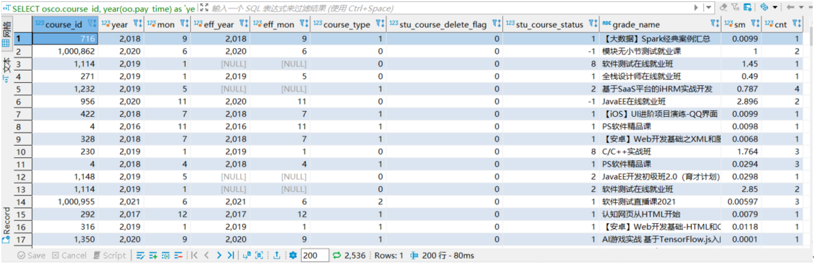

利用上面的SQL作为子查询的源表,写出DWD层指标语句。

以指标1年度营收额（全款）为例：

```sql
select sum(sm) from 
(SELECT 
osco.course_id,
year(oo.pay_time) as  `year`,
month(oo.pay_time) as `mon`,
year(osco.effective_date) as eff_year,
month(osco.effective_date) as eff_mon,
osco.course_type,
osco.`stu_course_delete_flag`,
osco.`stu_course_status`,
osco.grade_name,
sum(oo.`payable_amount` + (CASE WHEN oo.`charge_against_amount` IS NOT null THEN oo.`charge_against_amount` ELSE 0 END))/ 10000  as `sm`,
count(oo.id)  as `cnt`
FROM
    bxg.`dwd_oe_order` oo
        LEFT JOIN  bxg.dwd_oe_stu_course_order  osco
            on  oo.`id` = osco.`order_id`
            WHERE 
-- 支付状态：支付完成
        oo.`pay_status` = 2
-- 未删除订单
  AND oo.`delete_flag` = 0
-- 转班情况只取第一次的订单，转班后的订单不重复计算
  AND oo.`is_target_order` = 0
-- 排除N12分摊转移
  AND oo.`terminal` != 7
-- 排除测试课
  AND osco.`course_id` NOT IN (555,1537) 
  GROUP BY `year`,`mon`,eff_year,eff_mon,
  osco.course_id,osco.grade_name,
osco.course_type,osco.`stu_course_delete_flag`,osco.`stu_course_status`) dor
where  `year` = year(current_date());
```

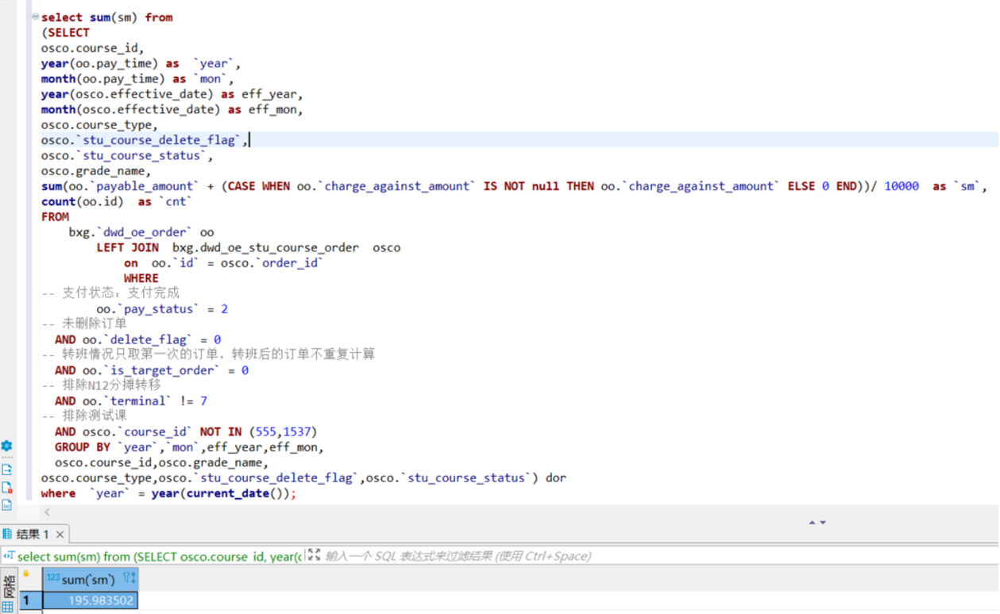

结果与mysql的查询结果一致。

之后可以将上述子查询源表的doris SQL改为Flink SQl, 在hudi中建立dws层的表，并下沉到doris。

#### 实现

##### hudi_dws层

创建hudi_dws层映射表

```sql
CREATE TABLE if not exists hudi_dws_overall_revenue_achievement(
course_id INT,
`year` BIGINT,
`mon` BIGINT,
eff_year BIGINT,
eff_mon BIGINT,
course_type int,
`stu_course_delete_flag` BOOLEAN,
`stu_course_status` INT,
 grade_name STRING,
`sm` decimal(38,6),
`cnt` BIGINT,
 PRIMARY KEY (course_id,`year`,`mon`,eff_year,eff_mon,course_type,stu_course_delete_flag,stu_course_status) NOT ENFORCED
) WITH(
    'connector'='hudi'
    ,'path'= 'hdfs://node1:8020/hudi/bxg/dws_overall_revenue_achievement'
    ,'hoodie.datasource.write.recordkey.field'= 'course_id,`year`,`mon`,eff_year,eff_mon,course_type,stu_course_delete_flag,stu_course_status'
    ,'write.tasks'= '1'
    ,'compaction.tasks'= '1'
    ,'write.rate.limit'= '2000'
    ,'table.type'= 'MERGE_ON_READ'
    ,'compaction.async.enabled'= 'true'
    ,'compaction.trigger.strategy'= 'num_commits'
    ,'compaction.delta_commits'= '1'
    ,'changelog.enabled'= 'true'
    ,'read.tasks' = '1'
    ,'read.streaming.enabled'= 'true'
    ,'read.start-commit'='earliest'
    ,'read.streaming.check-interval'= '3'
    ,'hive_sync.enable'= 'true'
    ,'hive_sync.mode'= 'hms'
    ,'hive_sync.metastore.uris'= 'thrift://node1:9083'
    ,'hive_sync.table'= 'dws_overall_revenue_achievement'
    ,'hive_sync.db'= 'bxg'
    ,'hive_sync.username'= ''
    ,'hive_sync.password'= ''
    ,'hive_sync.support_timestamp'= 'true'
);
```

插入数据

```sql
INSERT INTO hudi_dws_overall_revenue_achievement
SELECT
IFNULL(osco.course_id,-1) as course_id,
IFNULL(year(oo.pay_time),-1)   as  `year`,
IFNULL(month(oo.pay_time),-1) as `mon`,
IFNULL(year(osco.effective_date),-1) as eff_year,
IFNULL(month(osco.effective_date),-1) as eff_mon,
IFNULL(osco.course_type,-1) as course_type,
IFNULL(osco.`stu_course_delete_flag`,FALSE) as stu_course_delete_flag, 
IFNULL(osco.`stu_course_status`,-1) as stu_course_status,
osco.grade_name,
sum(oo.`payable_amount` + (CASE WHEN oo.`charge_against_amount` IS NOT null THEN oo.`charge_against_amount` ELSE 0 END))/ 10000  as `sm`,
count(oo.id)  as `cnt`
FROM
    `hudi_dwd_oe_order` oo
        LEFT JOIN  `hudi_dwd_oe_stu_course_order`  osco
            on  oo.`id` = osco.`order_id`
            WHERE 
-- 支付状态：支付完成
        oo.`pay_status` = 2
-- 未删除订单
  AND oo.`delete_flag` is FALSE 
-- 转班情况只取第一次的订单，转班后的订单不重复计算
  AND oo.`is_target_order` is FALSE 
-- 排除N12分摊转移
  AND oo.`terminal` not in (7)
-- 排除测试课
  AND osco.`course_id` NOT IN (555,1537) 
  GROUP BY year(oo.pay_time),month(oo.pay_time),year(osco.effective_date),month(osco.effective_date),
  osco.course_id,osco.grade_name,
osco.course_type,osco.`stu_course_delete_flag`,osco.`stu_course_status`;
```

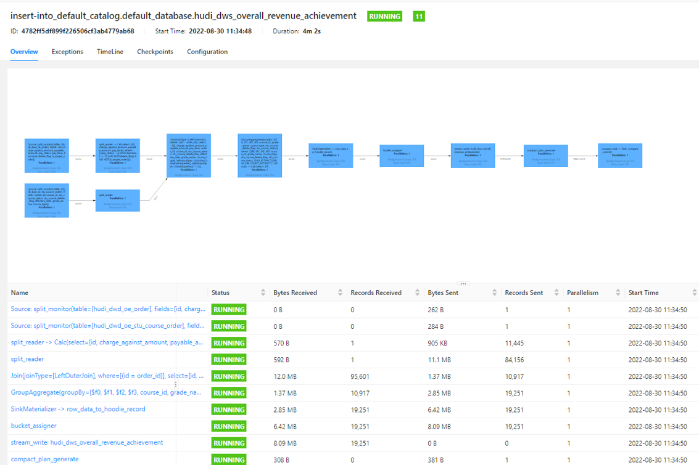

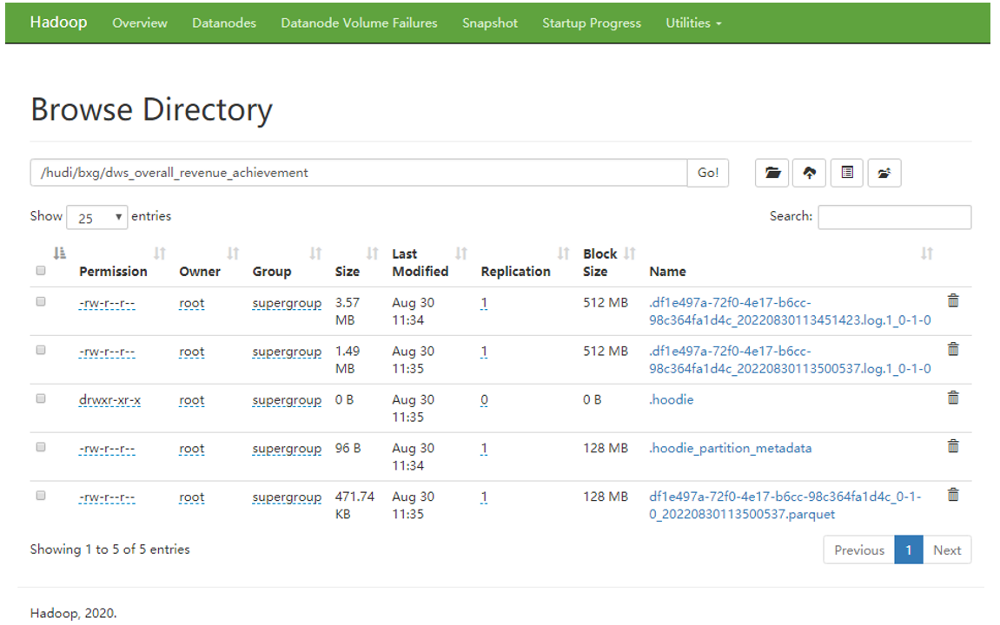

##### doris_dws层

在doris中创建dws表

```sql
CREATE TABLE IF NOT EXISTS bxg.dws_overall_revenue_achievement
(
course_id INT,
`year` BIGINT,
`mon` BIGINT,
eff_year BIGINT,
eff_mon BIGINT,
course_type int,
`stu_course_delete_flag` BOOLEAN,
`stu_course_status` INT,
grade_name string,
`sm` decimal(27,6),
`cnt` BIGINT
) Unique Key (course_id,`year`,`mon`,eff_year,eff_mon,course_type,stu_course_delete_flag,stu_course_status)
DISTRIBUTED BY HASH(`course_id`) BUCKETS 10
PROPERTIES (
"replication_allocation" = "tag.location.default: 1"
);
```

在flink sql-cli中创建doris_dws层映射

```sql
CREATE TABLE if not exists doris_dws_overall_revenue_achievement (
course_id INT,
`year` BIGINT,
`mon` BIGINT,
eff_year BIGINT,
eff_mon BIGINT,
course_type int,
`stu_course_delete_flag` BOOLEAN,
`stu_course_status` INT,
grade_name string,
`sm` decimal(27,6),
`cnt` BIGINT,
 PRIMARY KEY (course_id,`year`,`mon`,eff_year,eff_mon,course_type,stu_course_delete_flag,stu_course_status) NOT ENFORCED
) WITH (
    'fenodes' = 'node1:8030'
    ,'table.identifier' = 'bxg.dws_overall_revenue_achievement'
    ,'sink.enable-delete' = 'true'
    ,'sink.properties.strip_outer_array' = 'true'
    ,'sink.batch.size' = '2000'
    ,'password' = '123456'
    ,'connector' = 'doris'
    ,'sink.batch.interval' = '10s'
    ,'sink.max-retries' = '5'
    ,'sink.properties.format' = 'json'
    ,'username' = 'root'
);
```

插入数据

```sql
INSERT INTO `doris_dws_overall_revenue_achievement` SELECT 
course_id,`year`,`mon`,eff_year ,eff_mon ,
course_type,`stu_course_delete_flag`,
`stu_course_status`,grade_name,`sm`,`cnt`
FROM hudi_dws_overall_revenue_achievement;
```

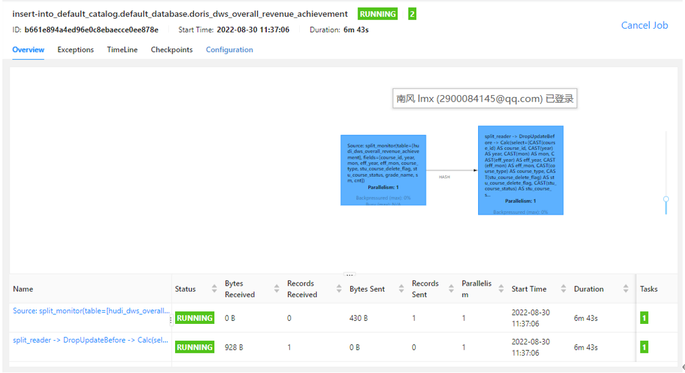

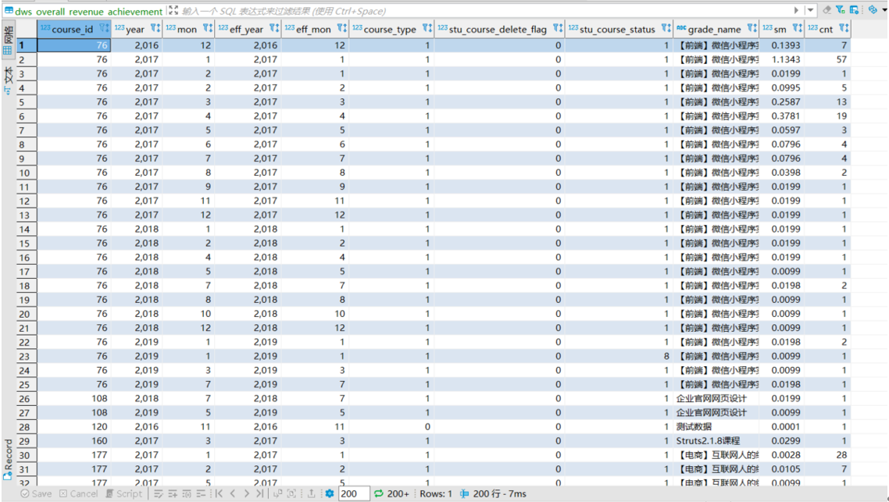

### 业务查询SQL

创建指标查询过程中重复使用的月份视图（之前已创建）

```sql
create view if not exists bxg.common_month_v (month) as
select month from (
    (select 1 as month) union all
    (select 2 as month) union all
    (select 3 as month) union all
    (select 4 as month) union all
    (select 5 as month) union all
    (select 6 as month) union all
    (select 7 as month) union all
    (select 8 as month) union all
    (select 9 as month) union all
    (select 10 as month) union all
    (select 11 as month) union all
    (select 12 as month)) t;
```

年度营收额（全款）

```sql
select sum(sm) from 
bxg.dws_overall_revenue_achievement 
where  `year` = year(current_date());
```

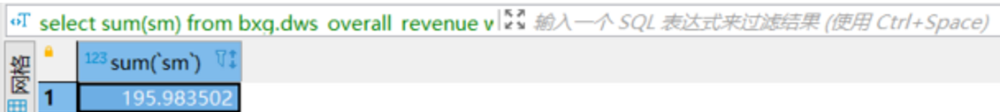

年度营收额（进班）

```sql
select sum(sm) from 
     bxg.dws_overall_revenue_achievement
where 
`stu_course_delete_flag` = 0 AND
    `stu_course_status` = 1 AND
    `eff_year`= year(current_date());
```

博学谷全部课程营收额分析

```sql
SELECT
    b.`month` AS `月份`,
    sum(CASE WHEN a.`year` = 2019 THEN a.`sm` ELSE null END) AS `2019年`,
    sum(CASE WHEN a.`year` = 2020 THEN a.`sm` ELSE null END) AS `2020年`,
    sum(CASE WHEN a.`year` = 2021 THEN a.`sm` ELSE null END) AS `2021年`,
    sum(CASE WHEN a.`year` = 2022 THEN a.`sm` ELSE null END) AS `2022年`
FROM
    (
        SELECT
            c.`month`
        FROM
            bxg.common_month_v c
    ) b
        LEFT JOIN
    (
         select  * from
             bxg.dws_overall_revenue_achievement 
         where sm > 0
    ) a ON a.`mon` = b.`month` GROUP BY b.`month` order by b.month;
```

博学谷职业课营收额分析

```sql
SELECT
    b.`month` AS `月份`,
    sum(CASE WHEN a.`year` = 2020 THEN a.`sm` ELSE null END) AS `2020年`,
    sum(CASE WHEN a.`year` = 2021 THEN a.`sm` ELSE null END) AS `2021年`,
    sum(CASE WHEN a.`year` = 2022 THEN a.`sm` ELSE null END) AS `2022年`
FROM
    (
        SELECT
            c.`month`
        FROM
            bxg.common_month_v c
    ) b
        LEFT JOIN
    (
        select * FROM 
            bxg.dws_overall_revenue_achievement 
        WHERE
        -- 职业课范围
           (
            `course_type` = 0 OR
            grade_name LIKE '【季度铂金会员】%' OR
            grade_name LIKE '【月度黄金会员】%' OR
            `course_id` in (3264, 3400, 3912, 4036, 4293, 4314,4511,4454)
            )
        AND sm > 0
    ) a ON a.`mon` = b.`month` GROUP BY b.`month` order by b.`month`;
```

博学谷其他课营收额分析

```sql
SELECT
    b.`month` AS `月份`,
    SUM (CASE WHEN a.`year` = 2020 THEN a.`sm` ELSE null END ) AS `2020年`,
    SUM (CASE WHEN a.`year` = 2021 THEN a.`sm` ELSE null END ) AS `2021年`,
    SUM (CASE WHEN a.`year` = 2022 THEN a.`sm` ELSE null END ) AS `2022年`
FROM
    (
        SELECT
            c.`month`
        FROM
            bxg.common_month_v c
    ) b
        LEFT JOIN
    (
        select * FROM 
    bxg.dws_overall_revenue_achievement 
        WHERE
        -- 课程类型不为0
           `course_type` <> 0
        -- 课程不包含直播保薪班
          AND `course_id` NOT IN (3264, 3400, 3912, 4036, 4293, 4314,4511,4454)
        -- 去除课程名称“【季度铂金会员】%”
          AND `grade_name` NOT LIKE '%【季度铂金会员】%'
        -- 去除课程名称“【月度黄金会员】%”
          AND `grade_name` NOT LIKE '%【月度黄金会员】%'
        -- 排除测试课
AND  sm > 0
    ) a ON a.`mon` = b.`month`
GROUP BY b.`month`order by b.`month`;
```

职业大课营收额分析-全款

```sql
select
    b.`month`                                           as  `月份` ,
    SUM(case when a.`year`= 2019 then a.sm else null end ) as  `2019年`,
    SUM(case when a.`year`= 2020 then a.sm else null end ) as  `2020年`,
    SUM(case when a.`year`= 2021 then a.sm else null end ) as  `2021年`,
    SUM(case when a.`year`= 2022 then a.sm else null end ) as  `2022年`
from
    (
        SELECT c.`month`
        FROM
            bxg.common_month_v c
    ) b
        LEFT JOIN
    (
        select * FROM 
        bxg.dws_overall_revenue_achievement 
        WHERE     
          (
-- SVIP 班
            (course_type = 0 AND grade_name LIKE '%SVIP%') OR
        -- 直播保薪班
-- TODO 新建视图，方便区分混杂的课程类型
            (course_id IN (3264,3400,3912,4036,4293,4314,4511,4454)) OR
-- 极速就业班
            (course_id IN (4438,4533,4241,4520)) OR
-- 在线就业班
            (course_type = 0 AND grade_name LIKE '%在线就业班%' AND grade_name NOT LIKE '%SVIP%') OR
-- 年度会员
            (course_type = 0 AND grade_name LIKE '【年度钻石会员】%')
            )
AND  sm > 0
    ) a on a.mon = b.`month` GROUP BY b.`month` order by b.`month`;
```

职业大课订单量分析-全款

```sql
select
    b.`month`                                                 as  `月份` ,
    sum(case when a.`year`= 2019 then a.cnt else null end ) as  `2019年`,
    sum(case when a.`year`= 2020 then a.cnt else null end ) as  `2020年`,
    sum(case when a.`year`= 2021 then a.cnt else null end ) as  `2021年`,
    sum(case when a.`year`= 2022 then a.cnt else null end ) as  `2022年`
from
    (
        SELECT
            c.`month`
        FROM
            bxg.common_month_v c
    ) b
        LEFT JOIN
    (
        select * from 
         bxg.dws_overall_revenue_achievement 
        WHERE     
           (
-- SVIP 班
            (course_type = 0 AND grade_name LIKE '%SVIP%') OR
        -- 直播保薪班
-- TODO 新建视图，方便区分混杂的课程类型
            (course_id IN (3264,3400,3912,4036,4293,4314,4511,4454)) OR
-- 极速就业班
            (course_id IN (4438,4533,4241,4520)) OR
-- 在线就业班
            (course_type = 0 AND grade_name LIKE '%在线就业班%' AND grade_name NOT LIKE '%SVIP%') OR
-- 年度会员
            (course_type = 0 AND grade_name LIKE '【年度钻石会员】%')
            )
    ) a on a.mon = b.`month` GROUP BY b.`month` order by b.`month`;
```

职业大课营收额分析-进班

```sql
select
    b.`month`                                                    as  `月份` ,
    sum(case when a.`eff_year`= 2020 then a.sm else null end )       as  `2020年`,
    sum(case when a.`eff_year`= 2021 then a.sm else null end )       as  `2021年`,
    sum(case when a.`eff_year`= 2022 then a.sm else null end )       as  `2022年`
from
    (
        SELECT c.`month` from  bxg.common_month_v c
    ) b
        LEFT JOIN
    (
        select * FROM 
            bxg.dws_overall_revenue_achievement 
        where
            stu_course_delete_flag = 0 AND
            (
-- SVIP 班
            (course_type = 0 AND grade_name LIKE '%SVIP%') OR
        -- 直播保薪班
-- TODO 新建视图，方便区分混杂的课程类型
            (course_id IN (3264,3400,3912,4036,4293,4314,4511,4454)) OR
-- 极速就业班
            (course_id IN (4438,4533,4241,4520)) OR
-- 在线就业班
            (course_type = 0 AND grade_name LIKE '%在线就业班%' AND grade_name NOT LIKE '%SVIP%') OR
-- 年度会员
            (course_type = 0 AND grade_name LIKE '【年度钻石会员】%')
            )
      AND sm > 0
    ) a on a.eff_mon = b.`month` GROUP BY b.`month` order by b.`month`;
```

职业大课订单量分析-进班

```sql
select
    b.`month`                                                     as  `月份` ,
    sum(case when a.`eff_year`= 2020 then a.cnt else null end )     as  `2020年`,
    sum(case when a.`eff_year`= 2021 then a.cnt else null end )     as  `2021年`,
    sum(case when a.`eff_year`= 2022 then a.cnt else null end )     as  `2022年`
from
    (
        SELECT
            c.`month`
        from
            bxg.common_month_v c
    ) b
        LEFT JOIN
    (
        select * FROM 
             bxg.dws_overall_revenue_achievement 
        where
            stu_course_delete_flag = 0 AND
            (
-- SVIP 班
            (course_type = 0 AND grade_name LIKE '%SVIP%') OR
        -- 直播保薪班
-- TODO 新建视图，方便区分混杂的课程类型
            (course_id IN (3264,3400,3912,4036,4293,4314,4511,4454)) OR
-- 极速就业班
            (course_id IN (4438,4533,4241,4520)) OR
-- 在线就业班
            (course_type = 0 AND grade_name LIKE '%在线就业班%' AND grade_name NOT LIKE '%SVIP%') OR
-- 年度会员
            (course_type = 0 AND grade_name LIKE '【年度钻石会员】%')
            ) 
    ) a on a.eff_mon = b.`month` GROUP BY b.`month` order by b.`month`;
```

# 知识点08： 【掌握】回车课堂关键环节分析看板

## 看板相关指标

1.  总注册用户数
2.  近90天注册用户数
3.  近90天报名用户数
4.  近90天学习用户数
5.  用户报名情况分析
6.  用户学习情况分析
7.  用户完课情况分析
8.  用户注册报名转化分析

## 需求说明

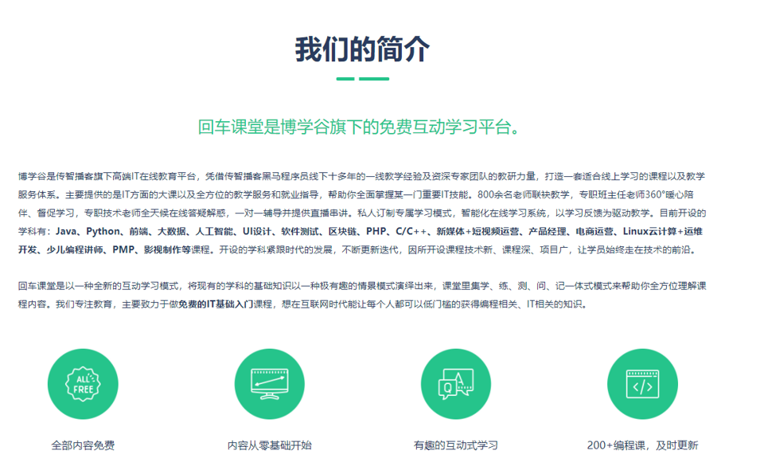

### 指标定义

| 分类主题       | 指标名称       | 指标定义说明                                                 | 统计规则/口径                             |
| -------------- | -------------- | ------------------------------------------------------------ | ----------------------------------------- |
| 注册           | 总注册用户数   | 回车课堂累计总注册用户数                                     | 截止统计指定时间为止的总注册用户数        |
|                | 新增注册人数   | 当日新增的回车课堂注册用户数                                 |                                           |
| 报名           | 报名人数       | 做过【报名回车课堂某课程】行为的用户数                       |                                           |
|                | 报名人次       | 【报名回车课堂某课程】行为发生的总次数                       |                                           |
|                | 报名占比       | 当日报名人数/总注册用户数                                    |                                           |
|                | 人均报名课程量 | 当月报名人次/总注册用户数                                    | 报名课程数量/报名人数 = 报名人次/报名人数 |
| 学习           | 学习人数       | 做过【进入回车课堂某课程的学习页面并至少新弹出一个气泡】行为的用户数 |                                           |
|                | 学习人次       | 【进入回车课堂某课程的学习页面并至少新弹出一个气泡】行为发生的总次数 |                                           |
| 学习用户量占比 |                | 学习用户量/总注册用户数                                      | 学习人数占比=学习人数/总注册用户数        |
| 完课           | 完课人数       | 做过【首次弹出回车课堂某课程的最后一个气泡】行为的用户数     |                                           |
|                | 完课人次       | 【首次弹出回车课堂某课程的最后一个气泡】行为发生的总次数     |                                           |
|                | 完课占比       | 当日完课人数/总注册用户数                                    |                                           |

### 需求

#### 总注册用户数

- 说明：回车课堂用户注册总量

- 展示：--

- 指标：回车课堂用户注册总量

- 维度：时间

- 粒度：年

- 涉及库：bxg

- 涉及表：bxg.oe_user


#### 近90天注册用户数

- 说明：近90天注册用户数

- 展示：折线图

- 指标：回车课堂用户注册用户数

- 维度：时间

- 粒度：天

- 涉及库：bxg

- 涉及表：bxg.oe_user


#### 近90天报名用户数

- 说明：近90天报名用户数

- 展示：折线图

- 指标：回车课堂用户报名用户数

- 维度：时间

- 粒度：天

- 涉及库：bxg

- 涉及表：bxg.oe_user、bxg.oe_stu_course、bxg.oe_programming_course


#### 近90天学习用户数

- 说明：近90天用户学习情况分析

- 展示：折线图

- 指标：回车课堂用户报名用户数

- 维度：时间

- 粒度：天

- 涉及库：bxg

- 涉及表：bxg. oe_user、bxg. oe_stu_course、bxg. oe_programming_course、bxg. oe_stu_programming_learning_history


#### 用户报名情况分析

- 说明：用户报名用户数

- 展示：柱状图

- 指标：回车课堂用户报名用户数

- 维度：时间

- 粒度：月

- 涉及库：bxg

- 涉及表：bxg. oe_user、bxg. oe_stu_course、bxg. oe_programming_course


#### 用户学习情况分析

- 说明：用户学习情况分析

- 展示：柱状图

- 指标：回车课堂用户报名用户数

- 维度：时间

- 粒度：月

- 涉及库：bxg

- 涉及表：bxg. oe_user、bxg. oe_stu_course、bxg. oe_programming_course、bxg. oe_stu_programming_learning_history


#### 用户完课情况分析

- 说明：用户完课情况分析

- 展示：柱状图

- 指标：用户完课情况数

- 维度：时间

- 粒度：月

- 涉及库：bxg

- 涉及表：bxg. oe_user、bxg. oe_stu_course、bxg. oe_programming_course


#### 用户注册报名转化分析

- 说明：用户注册报名转化分析

- 展示：柱状图

- 指标：注册用户数、用户报名数

- 维度：时间

- 粒度：月

- 涉及库：bxg

- 涉及表：bxg. oe_user、bxg. oe_stu_course、bxg. oe_programming_course


### 结果显示

设置查询项：年份

#### 总注册用户数

| 总注册用户数 |
| ------------ |
|              |

#### 近90天注册用户数

近90天注册用户数

| 日期     | 注册用户数 |
|----------|------------|
| 2021/9/9 |            |
| 2021/9/8 |            |
| ……       |            |
| 2021/8/9 |            |

**人数不受年份筛选的影响**。

#### 近90天报名用户数

近90天报名用户数

| 日期     | 报名用户数 |
|----------|------------|
| 2021/9/9 |            |
| 2021/9/8 |            |
| ……       |            |
| 2021/8/9 |            |

**人数不受年份筛选的影响**。

#### 近90天学习用户数

近90天学习用户数

| 日期     | 学习用户数 |
|----------|------------|
| 2021/9/9 |            |
| 2021/9/8 |            |
| ……       |            |
| 2021/8/9 |            |

**人数不受年份筛选的影响**。

#### 用户报名情况分析

用户报名情况分析

| 月份 | 报名人数 | 报名人次 | 人均报名课程量 |
|------|----------|----------|----------------|
| 1    |          |          |                |
| 2    |          |          |                |
| 3    |          |          |                |
| 4    |          |          |                |
| 5    |          |          |                |
| 6    |          |          |                |
| 7    |          |          |                |
| 8    |          |          |                |
| 9    |          |          |                |
| 10   |          |          |                |
| 11   |          |          |                |
| 12   |          |          |                |

**人均报名课程量=报名人次/报名人数**

#### 用户学习情况分析

用户学习情况分析

| 月份 | 学习人数 | 学习人次 | 学习用户占比 |
|------|----------|----------|--------------|
| 1    |          |          |              |
| 2    |          |          |              |
| 3    |          |          |              |
| 4    |          |          |              |
| 5    |          |          |              |
| 6    |          |          |              |
| 7    |          |          |              |
| 8    |          |          |              |
| 9    |          |          |              |
| 10   |          |          |              |
| 11   |          |          |              |
| 12   |          |          |              |

**学习用户占比=学习人数/总注册用户数**

#### 用户完课情况分析

用户完课情况分析

| 月份 | 完课人数 | 完课人次 | 完课用户占比 |
|------|----------|----------|--------------|
| 1    |          |          |              |
| 2    |          |          |              |
| 3    |          |          |              |
| 4    |          |          |              |
| 5    |          |          |              |
| 6    |          |          |              |
| 7    |          |          |              |
| 8    |          |          |              |
| 9    |          |          |              |
| 10   |          |          |              |
| 11   |          |          |              |
| 12   |          |          |              |

**完课用户占比=完课人数/总注册用户数**

#### 用户注册报名转化分析

用户注册报名转化分析

| 月份 | 注册用户数 | 报名人数 | 报名转化率 |
|------|------------|----------|------------|
| 1    |            |          |            |
| 2    |            |          |            |
| 3    |            |          |            |
| 4    |            |          |            |
| 5    |            |          |            |
| 6    |            |          |            |
| 7    |            |          |            |
| 8    |            |          |            |
| 9    |            |          |            |
| 10   |            |          |            |
| 11   |            |          |            |
| 12   |            |          |            |

**学习转化率=学习人数/注册用户数**

### SQL参考

设置查询项：年份

#### 总注册用户数

```sql
SELECT
    count(distinct u.id) AS `总注册用户数`
FROM bxg.oe_user u
WHERE u.is_delete=0 AND u.origin like 'interactive%' AND date_format(u.create_time, '%Y')={{year}};
```

#### 近90天注册用户数

```sql
WITH days AS (
    SELECT date_format(subdate(now(), interval num - 1 day), '%Y.%m.%d') as `day`
    FROM (
        -- 1-999序列
        SELECT row_number () over () AS num
          FROM
            (SELECT 0 AS num
            UNION SELECT 1 UNION SELECT 2 UNION SELECT 3
            UNION SELECT 4 UNION SELECT 5 UNION SELECT 6
            UNION SELECT 7 UNION SELECT 8 UNION SELECT 9) a,
            (SELECT 0 AS num
            UNION SELECT 1 UNION SELECT 2 UNION SELECT 3
            UNION SELECT 4 UNION SELECT 5 UNION SELECT 6
            UNION SELECT 7 UNION SELECT 8 UNION SELECT 9) b,
            (SELECT 0 AS num
            UNION SELECT 1 UNION SELECT 2 UNION SELECT 3
            UNION SELECT 4 UNION SELECT 5 UNION SELECT 6
            UNION SELECT 7 UNION SELECT 8 UNION SELECT 9) c
        )
WHERE num <= 90
ORDER BY day
    ),
    statis AS (
SELECT
    date_format(u.create_time, '%Y.%m.%d') as `day`,
    count (distinct u.id) as `count`
FROM bxg.oe_user AS u
WHERE u.is_delete=0 AND u.origin like 'interactive%'
GROUP BY `day`
    )

SELECT m.day                AS `日期`,
       ifnull(s.`count`, 0) AS `注册用户数`
FROM days AS m
LEFT JOIN statis AS s ON m.day = s.day
ORDER BY m.day;
```

#### 近90天报名用户数

```sql
WITH days AS (
    SELECT date_format(subdate(now(), interval num - 1 day), '%Y.%m.%d') as `day`
    FROM (
        -- 1-999序列
        SELECT row_number () over () AS num
          FROM
            (SELECT 0 AS num
            UNION SELECT 1 UNION SELECT 2 UNION SELECT 3
            UNION SELECT 4 UNION SELECT 5 UNION SELECT 6
            UNION SELECT 7 UNION SELECT 8 UNION SELECT 9) a,
            (SELECT 0 AS num
            UNION SELECT 1 UNION SELECT 2 UNION SELECT 3
            UNION SELECT 4 UNION SELECT 5 UNION SELECT 6
            UNION SELECT 7 UNION SELECT 8 UNION SELECT 9) b,
            (SELECT 0 AS num
            UNION SELECT 1 UNION SELECT 2 UNION SELECT 3
            UNION SELECT 4 UNION SELECT 5 UNION SELECT 6
            UNION SELECT 7 UNION SELECT 8 UNION SELECT 9) c
        )
    where num <= 90
    ORDER BY day
),
     statis AS (
         SELECT
             date_format(osc.effective_date, '%Y.%m.%d') AS `day`,
             count(distinct osc.id) AS `count`
         FROM bxg.oe_user AS u
         JOIN bxg.oe_stu_course AS osc ON osc.student_id=u.id
         JOIN bxg.oe_programming_course AS pc ON pc.id=osc.course_id
         WHERE osc.status !=0 and u.is_delete=0 and osc.delete_flag=0 and pc.is_deleted=0
         GROUP BY `day`
         ORDER BY `day`
     )

SELECT
    m.day AS `日期`,
    IFNULL(s.`count`,0) AS `报名用户数`
FROM days AS m
LEFT JOIN statis AS s  ON m.day=s.day
ORDER BY m.day;
```

#### 近90天学习用户数

```sql
WITH days AS (
    SELECT date_format(subdate(now(), interval num - 1 day), '%Y.%m.%d') as `day`
    FROM (
        -- 1-999序列
        SELECT row_number () over () AS num
          FROM
            (SELECT 0 AS num
            UNION SELECT 1 UNION SELECT 2 UNION SELECT 3
            UNION SELECT 4 UNION SELECT 5 UNION SELECT 6
            UNION SELECT 7 UNION SELECT 8 UNION SELECT 9) a,
            (SELECT 0 AS num
            UNION SELECT 1 UNION SELECT 2 UNION SELECT 3
            UNION SELECT 4 UNION SELECT 5 UNION SELECT 6
            UNION SELECT 7 UNION SELECT 8 UNION SELECT 9) b,
            (SELECT 0 AS num
            UNION SELECT 1 UNION SELECT 2 UNION SELECT 3
            UNION SELECT 4 UNION SELECT 5 UNION SELECT 6
            UNION SELECT 7 UNION SELECT 8 UNION SELECT 9) c
        )
    where num <= 90
    ORDER BY day
),

     statis AS (
         SELECT
             date_format(splh.learn_time, '%Y.%m.%d') AS `day`,
             count(distinct u.id) AS `count`
         FROM bxg.ods_oe_user u
         JOIN bxg.ods_oe_stu_course AS osc ON osc.student_id=u.id
         JOIN bxg.ods_oe_programming_course AS pc ON pc.id=osc.course_id
         JOIN bxg.ods_oe_stu_programming_learning_history AS splh ON splh.stu_course_id=osc.id
         WHERE osc.status !=0 and u.is_delete=0 and osc.delete_flag=0 and pc.is_deleted=0
         GROUP BY `day`
         ORDER BY `day`
     )

SELECT
    m.day AS `日期`,
    ifnull(s.`count`,0) AS `学习用户数`
FROM days AS m
         LEFT JOIN statis AS s  ON m.day=s.day
ORDER BY m.day;
```

#### 用户报名情况分析

```sql
WITH months AS (
    SELECT date_format(date(concat_ws('-',{{year}},month,'01')), '%Y.%m') AS month
    FROM (select '01' as month
             union select '02'
             union select '03'
             union select '04'
             union select '05'
             union select '06'
             union select '07'
             union select '08'
             union select '09'
             union select '10'
             union select '11'
             union select '12')
),
     -- 数据
     statis AS (
         SELECT
             date_format(osc.effective_date, '%Y.%m') AS `month`,
             count(distinct osc.id) applyCount,
             count(distinct osc.student_id) applyNum
         FROM bxg.oe_stu_course AS osc
         JOIN bxg.oe_programming_course AS pc ON pc.id=osc.course_id
         JOIN bxg.oe_user AS u on u.id=osc.student_id
         WHERE osc.delete_flag=0 and osc.status !=0 AND pc.is_deleted=0
         GROUP BY month
     )

-- 此处将以上结果集做结合最终呈现查询结果
SELECT
    m.month AS `月份`,
    CASE WHEN (date_format(now(), '%Y.%m') >= m.month and s.applyNum is null) THEN 0 ELSE s.applyNum END AS `报名人数`,
    CASE WHEN (date_format(now(), '%Y.%m') >= m.month and s.applyCount is null) THEN 0 ELSE s.applyCount END AS `报名人次`,
    CASE WHEN (date_format(now(), '%Y.%m') >= m.month and if(applyCount=0,0,s.applyCount/s.applyNum) is null) THEN 0 ELSE if(applyCount=0,0,s.applyCount/s.applyNum) END AS `人均报名课程量`
FROM months AS m
LEFT JOIN statis AS s  ON m.month=s.month
ORDER BY m.month;
```

#### 用户学习情况分析

```sql
WITH months AS (
    SELECT date_format(date(concat_ws('-',{{year}},month,'01')), '%Y.%m') AS month
    FROM (select '01' as month
             union select '02'
             union select '03'
             union select '04'
             union select '05'
             union select '06'
             union select '07'
             union select '08'
             union select '09'
             union select '10'
             union select '11'
             union select '12')
),

     -- 数据
     statis AS (
         SELECT
             date_format(splh.learn_time, '%Y.%m') AS `month`,
             count(distinct CASE WHEN (u.origin like 'interactive%') THEN u.id ELSE null END) registerNum,
             count(distinct CASE WHEN (osc.delete_flag=0 and osc.status !=0 AND pc.is_deleted=0 AND splh.stu_course_id is not null) THEN osc.id ELSE null END) applyCount,
             count(distinct CASE WHEN (osc.delete_flag=0 and osc.status !=0 AND pc.is_deleted=0 AND splh.stu_course_id is not null) THEN osc.student_id ELSE null END) applyNum
         FROM bxg.oe_user u
                  LEFT JOIN
              bxg.oe_stu_course AS osc on osc.student_id=u.id
                  LEFT JOIN
              bxg.oe_programming_course AS pc ON pc.id=osc.course_id
                  LEFT JOIN
              bxg.oe_stu_programming_learning_history AS splh ON splh.stu_course_id=osc.id
         WHERE u.is_delete=0 AND Year(splh.learn_time)={{year}}
         GROUP BY month
     )

-- 此处将以上结果集做结合最终呈现查询结果
SELECT
    m.month AS `月份`,
    CASE WHEN (date_format(now(), '%Y.%m') >= m.month and s.applyNum is null ) THEN 0 ELSE s.applyNum END AS `学习人数`,
    CASE WHEN (date_format(now(), '%Y.%m') >= m.month and s.applyCount is null) THEN 0 ELSE s.applyCount END AS `学习人次`,
    CASE WHEN (date_format(now(), '%Y.%m') >= m.month and if(registerNum=0,0,s.applyNum/s.registerNum) is null) THEN 0 ELSE if(registerNum=0,0,s.applyNum/s.registerNum) END AS `学习用户占比`
FROM months AS m
         LEFT JOIN statis AS s  ON m.month=s.month
ORDER BY m.month;
```

#### 用户完课情况分析

```sql
WITH months AS (
    SELECT date_format(date(concat_ws('-',{{year}},month,'01')), '%Y.%m') AS month
    FROM (select '01' as month
             union select '02'
             union select '03'
             union select '04'
             union select '05'
             union select '06'
             union select '07'
             union select '08'
             union select '09'
             union select '10'
             union select '11'
             union select '12')
),

     -- 数据
     statis AS (
         SELECT
             date_format(osc.finished_time, '%Y.%m') AS `month`,
             count(distinct CASE WHEN (u.origin like 'interactive%') THEN u.id ELSE null END) registerNum,
             count(distinct CASE WHEN (osc.delete_flag=0 and osc.status !=0 AND pc.is_deleted=0 AND osc.finished_time is not null) THEN osc.id ELSE null END) applyCount,
             count(distinct CASE WHEN (osc.delete_flag=0 and osc.status !=0 AND pc.is_deleted=0 AND osc.finished_time is not null) THEN osc.student_id ELSE null END) applyNum
         FROM bxg.oe_user u
                  LEFT JOIN bxg.oe_stu_course AS osc on osc.student_id=u.id
                  LEFT JOIN bxg.oe_programming_course AS pc ON pc.id=osc.course_id
         WHERE u.is_delete=0 AND Year(osc.finished_time)={{year}}
         GROUP BY month
     )

-- 此处将以上结果集做结合最终呈现查询结果
SELECT
    m.month AS `月份`,
    CASE WHEN (date_format(now(), '%Y.%m') >= m.month and s.applyNum is null ) THEN 0 ELSE s.applyNum END AS `完课人数`,
    CASE WHEN (date_format(now(), '%Y.%m') >= m.month and s.applyCount is null) THEN 0 ELSE s.applyCount END AS `完课人次`,
    CASE WHEN (date_format(now(), '%Y.%m') >= m.month and if(registerNum=0,0,s.applyNum/s.registerNum) is null) THEN 0 ELSE if(registerNum=0,0,s.applyNum/s.registerNum) END AS `完课用户占比`
FROM months AS m
         LEFT JOIN statis AS s  ON m.month=s.month
ORDER BY m.month;
```

#### 用户注册报名转化分析

```sql
WITH months AS (
    SELECT date_format(date(concat_ws('-',{{year}},month,'01')), '%Y.%m') AS month
    FROM (select '01' as month
             union select '02'
             union select '03'
             union select '04'
             union select '05'
             union select '06'
             union select '07'
             union select '08'
             union select '09'
             union select '10'
             union select '11'
             union select '12')
),

-- 数据
     statis AS (
         SELECT
             date_format(u.create_time, '%Y.%m') AS `month`,
             count(distinct u.id) registerNum,
             count(distinct CASE WHEN (osc.delete_flag=0 and osc.status !=0 AND pc.is_deleted=0) THEN osc.id ELSE null END) applyCount,
             count(distinct CASE WHEN (osc.delete_flag=0 and osc.status !=0 AND pc.is_deleted=0) THEN osc.student_id ELSE null END) applyNum
         FROM bxg.ods_oe_user u
         LEFT JOIN
              bxg.ods_oe_stu_course AS osc on osc.student_id=u.id
         LEFT JOIN
              bxg.ods_oe_programming_course AS pc ON pc.id=osc.course_id
         WHERE u.is_delete=0 AND u.origin like 'interactive%'
         GROUP BY month
     )

-- 此处将以上结果集做结合最终呈现查询结果
SELECT
    m.month AS `月份`,
    CASE WHEN (date_format(now(), '%Y.%m') >= m.month and s.registerNum is null ) THEN 0 ELSE s.registerNum END AS `注册用户数`,
    CASE WHEN (date_format(now(), '%Y.%m') >= m.month and s.applyNum is null) THEN 0 ELSE s.applyNum END AS `报名人数`,
    CASE WHEN (date_format(now(), '%Y.%m') >= m.month and if(registerNum=0,0,s.applyNum/s.registerNum) is null) THEN 0 ELSE if(registerNum=0,0,s.applyNum/s.registerNum) END AS `报名转化率`
FROM months AS m
         LEFT JOIN statis AS s  ON m.month=s.month
ORDER BY m.month;
```


## 建模分析

### 提取指标维度

根据主题看板的需求，我们可以看出，主要是围绕注册用户数、报名用户数、学习用户数以及完课用户数展开的。

维度都是时间维度，涵盖了年、月、日三种粒度。（但这里要注意的是，不同指标是根据不同的时间聚合的，如注册用户数是按oe_user表的create_time字段的天统计，而报名用户数是按oe_stu_course表的effective_date统计。虽然都是天的粒度，不能合并统计）。

### 分层设计

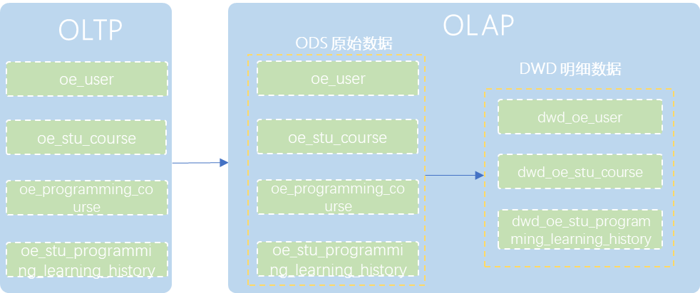

-   ODS层：储存原始数据，不做改变
-   DWD层：将ods层数据进行清洗转换，并将需求涉及的表合并，数据粒度保持不变
    -   数据清洗：空数据、不满足业务需求的数据处理。
    -   数据转换：数据格式和数据形式的转换，比如时间类型可以转换为同样的展现形式“yyyy-MM-dd HH:mm:ss”或者时间戳类型，金钱类型的数据可以统一转换为以元为单位或以分为单位的数值。
-   在DWD层的基础上，按照业务的要求进行统计分析；

    在我们这个看板中，首先我们根据业务需求发现，几个指标的维度虽然都是时间维度，但是在count计数时，粒度并不相同，且相同粒度的指标所转换的时间字段也不同，所以我们这里也不采用dws层。在doris中直接对dwd层做查询。

## 指标实现

### ODS层实现

因为ODS层储存原始数据，故将数据从mysql抽取到hudi时不做改变。

#### 简单说明

整个看板涉及四张表（数据在node1上的mysql）：

| bxg.oe_user、bxg.oe_stu_course、bxg.oe_programming_course、bxg.oe_stu_programming_learning_history |
| ------------------------------------------------------------ |
| 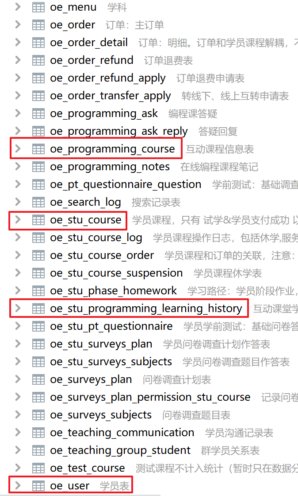 |

#### 表结构预览

以oe_user为例

| desc oe_user;                                                |
| ------------------------------------------------------------ |
| 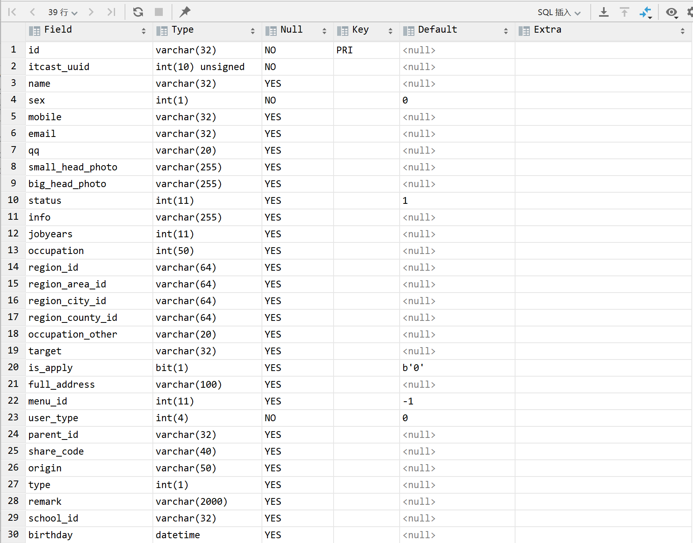 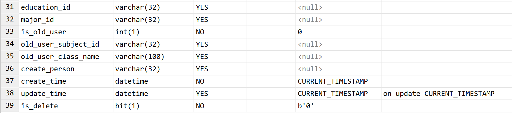 |

#### Flink SQL建表语句

##### Mysql 映射表

###### oe_user

```sql
CREATE TABLE if not exists mysql_bxg_oe_user (
     `id` STRING,
     `itcast_uuid` INT NULL,
     `name` STRING NULL,
     `sex` INT NULL,
     `mobile` STRING NULL,
     `email` STRING NULL,
     `qq` STRING NULL,
     `small_head_photo` STRING NULL,
     `big_head_photo` STRING NULL,
     `status` INT NULL,
     `info` STRING NULL,
     `jobyears` INT NULL,
     `occupation` INT NULL,
     `region_id` STRING NULL,
     `region_area_id` STRING NULL,
     `region_city_id` STRING NULL,
     `region_county_id` STRING NULL,
     `occupation_other` STRING NULL,
     `target` STRING NULL,
     `is_apply` BOOLEAN NULL,
     `full_address` STRING NULL,
     `menu_id` INT NULL,
     `user_type` INT NULL,
     `parent_id` STRING NULL,
     `share_code` STRING NULL,
     `origin` STRING NULL,
     `type` INT NULL,
     `remark` STRING NULL,
     `school_id` STRING NULL,
     `birthday` TIMESTAMP(3) NULL,
     `education_id` STRING NULL,
     `major_id` STRING NULL,
     `is_old_user` INT NULL,
     `old_user_subject_id` STRING NULL,
     `old_user_class_name` STRING NULL,
     `create_person` STRING NULL,
     `create_time` TIMESTAMP(3) NULL,
     `update_time` TIMESTAMP(3) NULL,
     `is_delete` BOOLEAN NULL,
     PRIMARY KEY (`id`) NOT ENFORCED
) WITH (
    'connector'= 'mysql-cdc',
    'hostname'= 'node1',
    'port'= '3306',
    'username'= 'root',
    'password'='123456',
    'server-time-zone'= 'Asia/Shanghai',
    'debezium.snapshot.mode'='initial',
    'database-name'= 'bxg',
    'table-name'= 'oe_user'
);
```

###### oe_stu_course

该表在 [01_新媒体短视频课程报名分析看板 4.1.3.1.2 oe_stu_course](#mysql_bxg_oe_stu_course)中已创建。（如中途未关闭flink sq-client客户端，此处便可不必重复创建）

```sql
CREATE TABLE if not exists mysql_bxg_oe_stu_course (
    `id` INT,
    `student_id` STRING,
    `course_id` INT,
    `status` TINYINT,
    `contract_status` TINYINT,
    `learn_status` TINYINT,
    `service_days` SMALLINT,
    `service_expires` TIMESTAMP(3),
    `validity_days` INT,
    `validity_expires` TIMESTAMP(3),
    `terminate_cause` TINYINT,
    `effective_date` TIMESTAMP(3),
    `finished_time` TIMESTAMP(3),
    `total_progress` DECIMAL(10,2),
    `purchase_time` INT,
    `create_time` TIMESTAMP(3),
    `update_time` TIMESTAMP(3),
    `delete_flag` BOOLEAN,
    PRIMARY KEY (`id`) NOT ENFORCED
) WITH (
    'connector'= 'mysql-cdc',
    'hostname'= 'node1',
    'port'= '3306',
    'username'= 'root',
    'password'='123456',
    'server-time-zone'= 'Asia/Shanghai',
    'debezium.snapshot.mode'='initial',
    'database-name'= 'bxg',
    'table-name'= 'oe_stu_course'
);
```

###### oe_programming_course

```sql
CREATE TABLE if not exists mysql_bxg_oe_programming_course (
    `id` INT,
    `menu_id` INT,
    `group_id` INT,
    `belonger_id` STRING,
    `learning_gains` STRING,
    `content_status` TINYINT,
    `pack_status` TINYINT,
    `source` TINYINT,
    `type` TINYINT,
    `difficulty_level` TINYINT,
    `unlock_flag` BOOLEAN,
    `detail_flag` BOOLEAN,
    `submitter` STRING,
    `submit_time` TIMESTAMP(3),
    `auditor` STRING,
    `audit_time` TIMESTAMP(3) ,
    `first_putaway_time` TIMESTAMP(3),
    `creator` STRING,
    `create_time` TIMESTAMP(3),
    `operator` STRING,
    `update_time` TIMESTAMP(3) ,
    `is_deleted` BOOLEAN,
    PRIMARY KEY (`id`) NOT ENFORCED
) WITH (
    'connector'= 'mysql-cdc',
    'hostname'= 'node1',
    'port'= '3306',
    'username'= 'root',
    'password'='123456',
    'server-time-zone'= 'Asia/Shanghai',
    'debezium.snapshot.mode'='initial',
    'database-name'= 'bxg',
    'table-name'= 'oe_programming_course'
);
```

###### oe_stu_programming_learning_history

```sql
CREATE TABLE if not exists mysql_bxg_oe_stu_programming_learning_history (
    `id` INT,
    `stu_course_id` INT,
    `student_id` STRING,
    `course_id` INT,
    `chapter_id` INT,
    `barrier_id` INT,
    `location` STRING,
    `learn_time` TIMESTAMP(3),
    `update_time` TIMESTAMP(3),
    PRIMARY KEY (`id`) NOT ENFORCED
) WITH (
    'connector'= 'mysql-cdc',
    'hostname'= 'node1',
    'port'= '3306',
    'username'= 'root',
    'password'='123456',
    'server-time-zone'= 'Asia/Shanghai',
    'debezium.snapshot.mode'='initial',
    'database-name'= 'bxg',
    'table-name'= 'oe_stu_programming_learning_history'
);
```

##### Hudi映射表

###### hudi_bxg_ods_oe_user

```sql
CREATE TABLE if not exists hudi_bxg_ods_oe_user (
     `id` STRING,
     `itcast_uuid` INT NULL,
     `name` STRING NULL,
     `sex` INT NULL,
     `mobile` STRING NULL,
     `email` STRING NULL,
     `qq` STRING NULL,
     `small_head_photo` STRING NULL,
     `big_head_photo` STRING NULL,
     `status` INT NULL,
     `info` STRING NULL,
     `jobyears` INT NULL,
     `occupation` INT NULL,
     `region_id` STRING NULL,
     `region_area_id` STRING NULL,
     `region_city_id` STRING NULL,
     `region_county_id` STRING NULL,
     `occupation_other` STRING NULL,
     `target` STRING NULL,
     `is_apply` BOOLEAN NULL,
     `full_address` STRING NULL,
     `menu_id` INT NULL,
     `user_type` INT NULL,
     `parent_id` STRING NULL,
     `share_code` STRING NULL,
     `origin` STRING NULL,
     `type` INT NULL,
     `remark` STRING NULL,
     `school_id` STRING NULL,
     `birthday` TIMESTAMP(3) NULL,
     `education_id` STRING NULL,
     `major_id` STRING NULL,
     `is_old_user` INT NULL,
     `old_user_subject_id` STRING NULL,
     `old_user_class_name` STRING NULL,
     `create_person` STRING NULL,
     `create_time` TIMESTAMP(3) NULL,
     `update_time` TIMESTAMP(3) NULL,
     `is_delete` BOOLEAN NULL,
   PRIMARY KEY (id) NOT ENFORCED
)WITH(
    'connector'='hudi'
    ,'path'= 'hdfs://192.168.88.161:8020/hudi/bxg/ods_oe_user'
    ,'hoodie.datasource.write.recordkey.field'= 'id'  
    ,'write.tasks'= '1'
    ,'compaction.tasks'= '1'
    ,'write.rate.limit'= '2000' 
    ,'table.type'= 'MERGE_ON_READ' 
    ,'compaction.async.enabled'= 'true' 
    ,'compaction.trigger.strategy'= 'num_commits' 
    ,'compaction.delta_commits'= '1'
    ,'changelog.enabled'= 'true' 
    ,'read.tasks' = '1'
    ,'read.streaming.enabled'= 'true'
    ,'read.start-commit'='earliest'  
    ,'read.streaming.check-interval'= '3'
    ,'hive_sync.enable'= 'true' 
    ,'hive_sync.mode'= 'hms' 
    ,'hive_sync.metastore.uris'= 'thrift://192.168.88.161:9083'
    ,'hive_sync.table'= 'ods_oe_user'
    ,'hive_sync.db'= 'bxg' 
    ,'hive_sync.username'= '' 
    ,'hive_sync.password'= '' 
    ,'hive_sync.support_timestamp'= 'true' 
);
```

###### hudi_bxg_ods_oe_stu_course

```sql
CREATE TABLE if not exists hudi_bxg_ods_oe_stu_course (
    `id` INT,
    `student_id` STRING,
    `course_id` INT,
    `status` INT,
    `contract_status` INT,
    `learn_status` INT,
    `service_days` SMALLINT,
    `service_expires` TIMESTAMP(3),
    `validity_days` INT,
    `validity_expires` TIMESTAMP(3),
    `terminate_cause` INT,
    `effective_date` TIMESTAMP(3),
    `finished_time` TIMESTAMP(3),
    `total_progress` DECIMAL(10,2),
    `purchase_time` INT,
    `create_time` TIMESTAMP(3),
    `update_time` TIMESTAMP(3),
    `delete_flag` BOOLEAN,
   PRIMARY KEY (id) NOT ENFORCED
) WITH(
    'connector'='hudi'
    ,'path'= 'hdfs://192.168.88.161:8020/hudi/bxg/ods_oe_stu_course'
    ,'hoodie.datasource.write.recordkey.field'= 'id'  
    ,'write.tasks'= '1'
    ,'compaction.tasks'= '1'
    ,'write.rate.limit'= '2000' 
    ,'table.type'= 'MERGE_ON_READ' 
    ,'compaction.async.enabled'= 'true' 
    ,'compaction.trigger.strategy'= 'num_commits' 
    ,'compaction.delta_commits'= '1'
    ,'changelog.enabled'= 'true' 
    ,'read.tasks' = '1'
    ,'read.streaming.enabled'= 'true' 
    ,'read.start-commit'='earliest'
    ,'read.streaming.check-interval'= '3'
    ,'hive_sync.enable'= 'true' 
    ,'hive_sync.mode'= 'hms' 
    ,'hive_sync.metastore.uris'= 'thrift://192.168.88.161:9083'
    ,'hive_sync.table'= 'ods_oe_stu_course'
    ,'hive_sync.db'= 'bxg' 
    ,'hive_sync.username'= '' 
    ,'hive_sync.password'= '' 
    ,'hive_sync.support_timestamp'= 'true' 
);
```

###### hudi_bxg_ods_oe_programming_course

```sql
CREATE TABLE if not exists hudi_bxg_ods_oe_programming_course (
    `id` INT,
    `menu_id` INT,
    `group_id` INT,
    `belonger_id` STRING,
    `learning_gains` STRING,
    `content_status` INT,
    `pack_status` INT,
    `source` INT,
    `type` INT,
    `difficulty_level` INT,
    `unlock_flag` BOOLEAN,
    `detail_flag` BOOLEAN,
    `submitter` STRING,
    `submit_time` TIMESTAMP(3),
    `auditor` STRING,
    `audit_time` TIMESTAMP(3) ,
    `first_putaway_time` TIMESTAMP(3),
    `creator` STRING,
    `create_time` TIMESTAMP(3),
    `operator` STRING,
    `update_time` TIMESTAMP(3) ,
    `is_deleted` BOOLEAN,
   PRIMARY KEY (id) NOT ENFORCED
) WITH(
    'connector'='hudi'
    ,'path'= 'hdfs://192.168.88.161:8020/hudi/bxg/ods_oe_programming_course '
    ,'hoodie.datasource.write.recordkey.field'= 'id'  
    ,'write.tasks'= '1'
    ,'compaction.tasks'= '1'
    ,'write.rate.limit'= '2000' 
    ,'table.type'= 'MERGE_ON_READ' 
    ,'compaction.async.enabled'= 'true' 
    ,'compaction.trigger.strategy'= 'num_commits' 
    ,'compaction.delta_commits'= '1'
    ,'changelog.enabled'= 'true' 
    ,'read.tasks' = '1'
    ,'read.streaming.enabled'= 'true' 
    ,'read.start-commit'='earliest'
    ,'read.streaming.check-interval'= '3'
    ,'hive_sync.enable'= 'true' 
    ,'hive_sync.mode'= 'hms' 
    ,'hive_sync.metastore.uris'= 'thrift://192.168.88.161:9083'
    ,'hive_sync.table'= 'ods_oe_programming_course'
    ,'hive_sync.db'= 'bxg' 
    ,'hive_sync.username'= '' 
    ,'hive_sync.password'= '' 
    ,'hive_sync.support_timestamp'= 'true' 
);

```

###### hudi_bxg_ods_oe_stu_programming_learning_history

```sql
CREATE TABLE if not exists hudi_bxg_ods_oe_stu_programming_learning_history (
    `id` INT,
    `stu_course_id` INT,
    `student_id` STRING,
    `course_id` INT,
    `chapter_id` INT,
    `barrier_id` INT,
    `location` STRING,
    `learn_time` TIMESTAMP(3),
    `update_time` TIMESTAMP(3),
   PRIMARY KEY (id) NOT ENFORCED
) WITH(
    'connector'='hudi'
    ,'path'='hdfs://192.168.88.161:8020/hudi/bxg/ods_oe_stu_programming_learning_history'
    ,'hoodie.datasource.write.recordkey.field'= 'id' 
    ,'write.tasks'= '1'
    ,'compaction.tasks'= '1'
    ,'write.rate.limit'= '2000' 
    ,'table.type'= 'MERGE_ON_READ' 
    ,'compaction.async.enabled'= 'true' 
    ,'compaction.trigger.strategy'= 'num_commits' 
    ,'compaction.delta_commits'= '1'
    ,'changelog.enabled'= 'true' 
    ,'read.tasks' = '1'
    ,'read.streaming.enabled'= 'true' 
    ,'read.start-commit'='earliest'
    ,'read.streaming.check-interval'= '3'
    ,'hive_sync.enable'= 'true' 
    ,'hive_sync.mode'= 'hms' 
    ,'hive_sync.metastore.uris'= 'thrift://192.168.88.161:9083'
    ,'hive_sync.table'= 'ods_oe_stu_programming_learning_history'
    ,'hive_sync.db'= 'bxg' 
    ,'hive_sync.username'= '' 
    ,'hive_sync.password'= '' 
    ,'hive_sync.support_timestamp'= 'true' 
);
```

##### 采用insert into load向hudi表中插入数据

Flink sql-client中映射表已经创建完毕

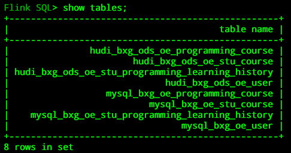

在插入数据之前需要先执行下面语句

set execution.checkpointing.interval=30sec; 

###### ods_oe_user

```sql
INSERT INTO `hudi_bxg_ods_oe_user`
select  id, itcast_uuid, name, sex, mobile, email, qq, small_head_photo, big_head_photo, status, info, jobyears, occupation, region_id, region_area_id, region_city_id, region_county_id, occupation_other, target, is_apply, full_address, menu_id, user_type, parent_id, share_code, origin, type, remark, school_id, birthday, education_id, major_id, is_old_user, old_user_subject_id, old_user_class_name, create_person, create_time, update_time, is_delete
from `mysql_bxg_oe_user`;
```

###### ods_oe_stu_course

```sql
INSERT INTO `hudi_bxg_ods_oe_stu_course` 
SELECT  id, student_id, course_id, status, contract_status, learn_status, service_days, service_expires, validity_days, validity_expires, terminate_cause, effective_date, finished_time, total_progress, purchase_time, create_time, update_time, delete_flag 
FROM `mysql_bxg_oe_stu_course`;
```

###### ods_oe_programming_course

```sql
INSERT INTO `hudi_bxg_ods_oe_programming_course` 
SELECT id, menu_id, group_id, belonger_id, learning_gains, content_status, pack_status, source, type, difficulty_level, unlock_flag, detail_flag, submitter, submit_time, auditor, audit_time, first_putaway_time, creator, create_time, operator, update_time, is_deleted
FROM `mysql_bxg_oe_programming_course`;
```

###### ods_oe_stu_programming_learning_history

```sql
INSERT INTO `hudi_bxg_ods_oe_stu_programming_learning_history` 
SELECT  id, stu_course_id, student_id, course_id, chapter_id, barrier_id, location, learn_time, update_time
FROM `mysql_bxg_oe_stu_programming_learning_history`;
```

#### 结果展示

##### Flink web页面

| node1:8081                                                   |
| ------------------------------------------------------------ |
| 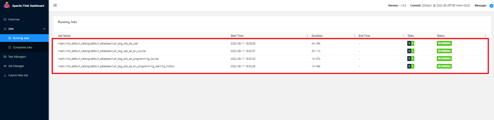 |

可以看到4个任务正常运行

##### 数据核对

-   查看Mysql中oe_user表

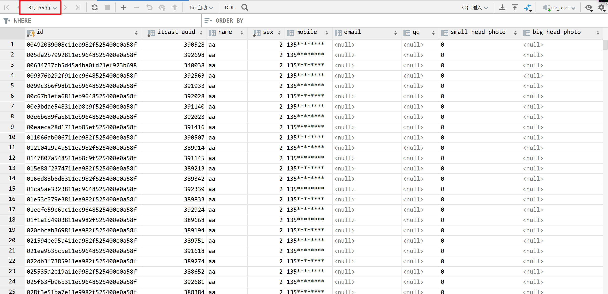 

-   查看hive表（我们hudi集成了hive，可以在hive中查询hudi表）

| node1:9870                                                   |
| ------------------------------------------------------------ |
| 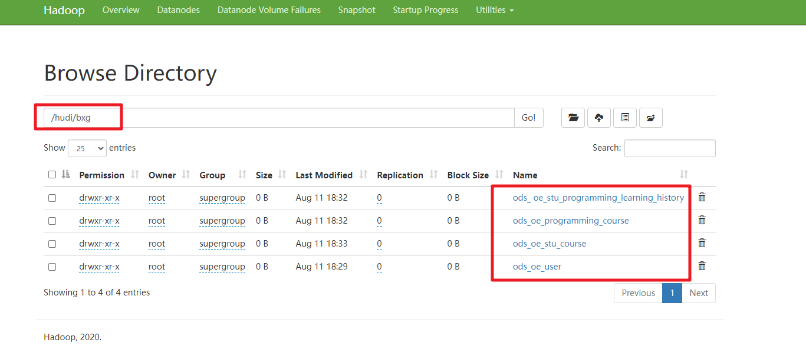 |
| 连接hive客户端查看                                           |
| 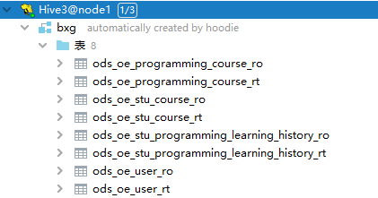 |
| 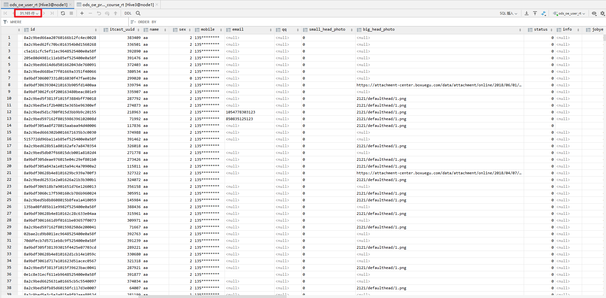 |

### DWD层实现

#### 宽表设计

##### 表关系

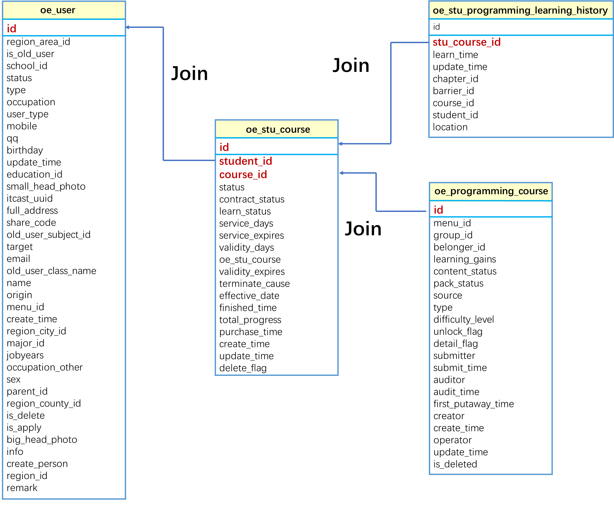

根据上图表结构显示，遵循多对一或一对一原则，我们最终将表oe_stu_course与表oe_programming_course进行左关联，表结构如下：

**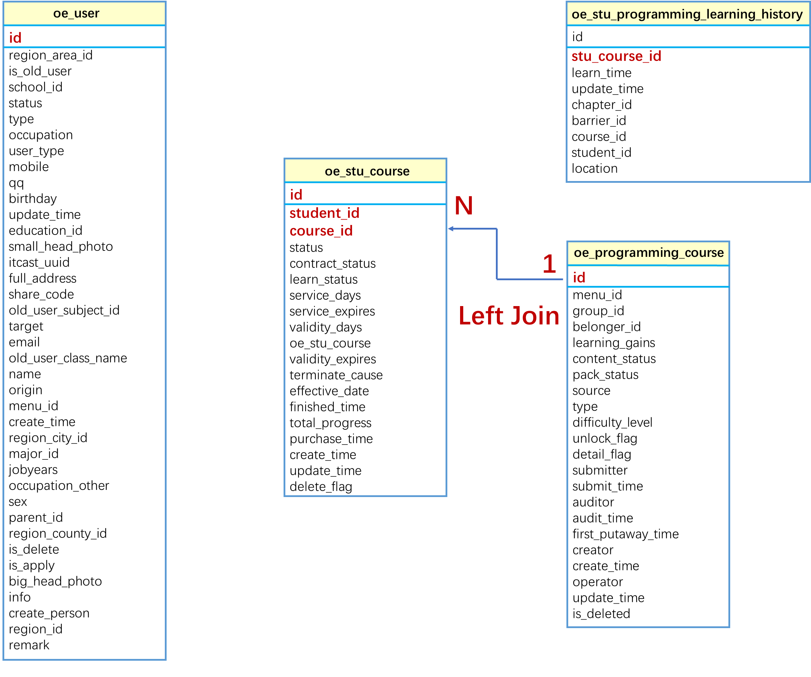**

##### 表结构

-   **每张表涉及字段**

ods_oe_user （u）：id、origin、create_time、is_delete

ods_oe_stu_course（osc）：id、student_id、course_id （与pc表的关联字段）、status、effective_date、finished_time 、delete_flag

ods_oe_programming_course（pc）：id（与osc表的关联字段）、is_deleted

ods_oe_stu_programming_learning_history（splh）：stu_course_id 、learn_time

根据每张表涉及的字段，我们初步设计出宽表，如下图所示。


#### 宽表实现

##### Hudi_DWD层

Hudi_dwd映射表

```sql
CREATE TABLE IF NOT EXISTS hudi_dwd_oe_stu_course
(
    id       int ,
    student_id  string,
    status   int,
    effective_date timestamp(3),
    finished_time timestamp(3) ,
    delete_flag boolean,
    programming_course_id int,
    programming_course_is_deleted boolean,
    PRIMARY KEY (`id`) NOT ENFORCED
) WITH(
    'connector'='hudi'
    ,'path'= 'hdfs://node1:8020/hudi/bxg/dwd_oe_stu_course'
    ,'hoodie.datasource.write.recordkey.field'= 'id' 
    ,'write.tasks'= '1'
    ,'compaction.tasks'= '1'
    ,'write.rate.limit'= '2000' 
    ,'table.type'= 'MERGE_ON_READ' 
    ,'compaction.async.enabled'= 'true' 
    ,'compaction.trigger.strategy'= 'num_commits' 
    ,'compaction.delta_commits'= '1'
    ,'changelog.enabled'= 'true' 
    ,'read.tasks' = '3'
    ,'read.streaming.enabled'= 'true' 
    ,'read.start-commit'='earliest'
    ,'read.streaming.check-interval'= '3'
    ,'hive_sync.enable'= 'true' 
    ,'hive_sync.mode'= 'hms' 
    ,'hive_sync.metastore.uris'= 'thrift://node1:9083'
    ,'hive_sync.table'= 'dwd_oe_stu_course'
    ,'hive_sync.db'= 'bxg' 
    ,'hive_sync.username'= '' 
    ,'hive_sync.password'= '' 
    ,'hive_sync.support_timestamp'= 'true' 
);
```

插入数据

```sql
INSERT INTO hudi_dwd_oe_stu_course 
SELECT
    osc.id,
    osc.student_id,
    osc.status, 
    osc.effective_date, 
    osc.finished_time, 
    osc.delete_flag,
    pc.id as programming_course_id,
    pc.is_deleted as programming_course_is_deleted
FROM hudi_bxg_ods_oe_stu_course AS osc 
LEFT JOIN hudi_bxg_ods_oe_programming_course AS pc ON pc.id=osc.course_id;
```

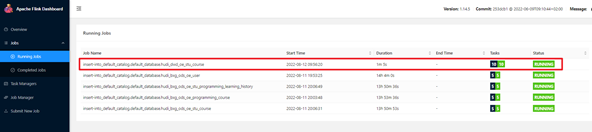

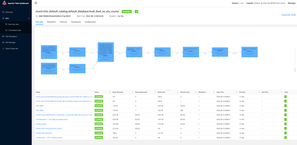

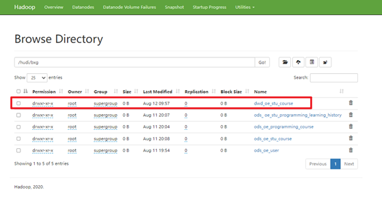

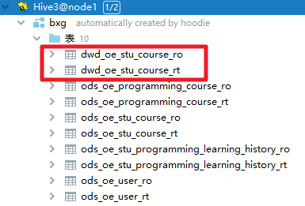

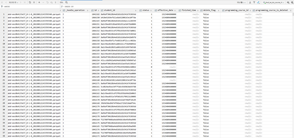

##### Doris_DWD层

###### Doris建表

```sql
CREATE TABLE IF NOT EXISTS bxg.dwd_oe_stu_course
(
    id       int ,
    student_id          string COMMENT '学员',
    status   int COMMENT '学员课程状态：0试学、1生效、2待生效、-1停课、8退费',
    effective_date datetime   COMMENT '课程生效时间，来源于订单！注意：试学课程没有该值！！！',
    finished_time datetime  COMMENT '学员课程完成时间，目前已知的以“结业报告”为准。未结束课程没有该值！',
    delete_flag boolean,
    programming_course_id int,
    programming_course_is_deleted boolean
) Unique Key (id)
DISTRIBUTED BY HASH(`id`) BUCKETS 10
PROPERTIES (
"replication_allocation" = "tag.location.default: 1"
);
CREATE TABLE IF NOT EXISTS bxg.dwd_oe_user
(
    id                  varchar(32)        not null,
    itcast_uuid         int           not null comment '传智播客教育集团所有IT系统全局唯一的用户ID，该ID来自于用户中心',
    name                string,
    sex                 int           not null comment '0未知、1男、2女',
    mobile              string,
    email               string,
    qq                  string        null     comment 'qq号',
    small_head_photo    string,
    big_head_photo      string,
    status              int           null     comment '-1禁用，0正常,1待激活',
    info                string        null     comment '个性签名',
    jobyears            int           null     comment '工作年限',
    occupation          int           null     comment '用户职业',
    region_id           string        null     comment '区域',
    region_area_id      string        null     comment '省',
    region_city_id      string        null     comment '市',
    region_county_id    string        null     comment '县/区',
    occupation_other    string        null     comment '职业,其他',
    target              string        null     comment '学习目标',
    is_apply            boolean       null     comment '用户报名状态   0:未报名 1:已报名',
    full_address        string        null     comment '详细地址',
    menu_id             int,
    user_type           int           not null comment '用户类型（0：非三方用户，1：qq用户，2：微信用户）',
    parent_id           string        null     comment '分享者id(上级用户)',
    share_code          string        null     comment '分享码',
    origin              string        null     comment '用户来源，online：在线-官网，dual：双元，bxg：院校，ask：问答精灵，orderInput：在线-补录，mweb：在线-H5，app：在线-App',
    type                int           null     comment '0普通，1学生，2老师',
    remark              string        null     comment '备注',
    school_id           string        null     comment '学校：外键，关联学校表中的id',
    birthday            datetime          null     comment '生日',
    education_id        string        null     comment '学历:关联到system_variate',
    major_id            string        null     comment '专业:关联到system_variate',
    is_old_user         int           not null comment '是否老学员，0否，1是',
    old_user_subject_id string,
    old_user_class_name string,
    create_person       string,
    create_time         datetime      not null,
    update_time         datetime      null     comment '变更时间',
    is_delete           boolean       not null
) Unique Key (`id`)
comment '学员表'
DISTRIBUTED BY HASH(`id`) BUCKETS 10
PROPERTIES (
"replication_allocation" = "tag.location.default: 1"
);
create table if not exists bxg.dwd_oe_stu_programming_learning_history
(
    id            int,
    stu_course_id int      not null comment '课程学员id',
    student_id string not null comment '学员id',
    course_id     int      not null comment '课程id',
    chapter_id    int      not null comment '章id',
    barrier_id    int      not null comment '关卡id',
    location string not null comment '学员闯关位置索引',
    learn_time    datetime not null comment '学习时间',
    update_time    datetime not null
) Unique Key (`id`)
comment '互动课堂学员学习记录'
DISTRIBUTED BY HASH(`id`) BUCKETS 10
PROPERTIES (
"replication_allocation" = "tag.location.default: 1"
);
```

###### Doris_DWD映射表

```sql
CREATE TABLE IF NOT EXISTS doris_dwd_oe_stu_course
(
    id       int ,
    student_id          string,
    status   int ,
    effective_date TIMESTAMP(3),
    finished_time TIMESTAMP(3),
    delete_flag boolean,
    programming_course_id int,
    programming_course_is_deleted boolean,
    PRIMARY KEY (id) NOT ENFORCED
) WITH (
    'fenodes' = '192.168.88.161:8030'
    ,'table.identifier' = 'bxg.dwd_oe_stu_course'
    ,'sink.enable-delete' = 'true'
    ,'sink.properties.strip_outer_array' = 'true'
    ,'sink.batch.size' = '2000'
    ,'password' = '123456'
    ,'connector' = 'doris'
    ,'sink.batch.interval' = '10s'
    ,'sink.max-retries' = '5'
    ,'sink.properties.format' = 'json'
    ,'username' = 'root'
);
CREATE TABLE if not exists doris_dwd_oe_user (
     `id` STRING,
     `itcast_uuid` INT NULL,
     `name` STRING NULL,
     `sex` INT NULL,
     `mobile` STRING NULL,
     `email` STRING NULL,
     `qq` STRING NULL,
     `small_head_photo` STRING NULL,
     `big_head_photo` STRING NULL,
     `status` INT NULL,
     `info` STRING NULL,
     `jobyears` INT NULL,
     `occupation` INT NULL,
     `region_id` STRING NULL,
     `region_area_id` STRING NULL,
     `region_city_id` STRING NULL,
     `region_county_id` STRING NULL,
     `occupation_other` STRING NULL,
     `target` STRING NULL,
     `is_apply` BOOLEAN NULL,
     `full_address` STRING NULL,
     `menu_id` INT NULL,
     `user_type` INT NULL,
     `parent_id` STRING NULL,
     `share_code` STRING NULL,
     `origin` STRING NULL,
     `type` INT NULL,
     `remark` STRING NULL,
     `school_id` STRING NULL,
     `birthday`  TIMESTAMP(3) NULL,
     `education_id` STRING NULL,
     `major_id` STRING NULL,
     `is_old_user` INT NULL,
     `old_user_subject_id` STRING NULL,
     `old_user_class_name` STRING NULL,
     `create_person` STRING NULL,
     `create_time` TIMESTAMP(3) NULL,
     `update_time` TIMESTAMP(3) NULL,
     `is_delete` BOOLEAN NULL,
     PRIMARY KEY (`id`) NOT ENFORCED
) WITH (
    'fenodes' = '192.168.88.161:8030'
    ,'table.identifier' = 'bxg.dwd_oe_user'
    ,'sink.enable-delete' = 'true'
    ,'sink.properties.strip_outer_array' = 'true'
    ,'sink.batch.size' = '2000'
    ,'password' = '123456'
    ,'connector' = 'doris'
    ,'sink.batch.interval' = '10s'
    ,'sink.max-retries' = '5'
    ,'sink.properties.format' = 'json'
    ,'username' = 'root'
);
CREATE TABLE if not exists doris_dwd_oe_stu_programming_learning_history (
    `id` INT,
    `stu_course_id` INT,
    `student_id` STRING,
    `course_id` INT,
    `chapter_id` INT,
    `barrier_id` INT,
    `location` STRING,
    `learn_time` TIMESTAMP(3),
    `update_time` TIMESTAMP(3),
    PRIMARY KEY (`id`) NOT ENFORCED
) WITH (
    'fenodes' = '192.168.88.161:8030'
    ,'table.identifier' = 'bxg.dwd_oe_stu_programming_learning_history'
    ,'sink.enable-delete' = 'true'
    ,'sink.properties.strip_outer_array' = 'true'
    ,'sink.batch.size' = '2000'
    ,'password' = '123456'
    ,'connector' = 'doris'
    ,'sink.batch.interval' = '10s'
    ,'sink.max-retries' = '5'
    ,'sink.properties.format' = 'json'
    ,'username' = 'root'
);
```

###### 插入数据

```sql
INSERT INTO doris_dwd_oe_stu_course 
SELECT id, student_id, status, effective_date, finished_time, delete_flag, programming_course_id, programming_course_is_deleted 
FROM hudi_dwd_oe_stu_course;

INSERT INTO `doris_dwd_oe_user`
SELECT  id, itcast_uuid, name, sex, mobile, email, qq, small_head_photo, big_head_photo, status, info, jobyears, occupation, region_id, region_area_id, region_city_id, region_county_id, occupation_other, target, is_apply, full_address, menu_id, user_type, parent_id, share_code, origin, type, remark, school_id, birthday, education_id, major_id, is_old_user, old_user_subject_id, old_user_class_name, create_person, create_time, update_time, is_delete
FROM `hudi_bxg_ods_oe_user`;

INSERT INTO `doris_dwd_oe_stu_programming_learning_history` 
SELECT  id, stu_course_id, student_id, course_id, chapter_id, barrier_id, location, learn_time, update_time
FROM `hudi_bxg_ods_oe_stu_programming_learning_history`;
```

##### 结果展示

| 查看任务运行状态：node1:8081                                 |
| ------------------------------------------------------------ |
| 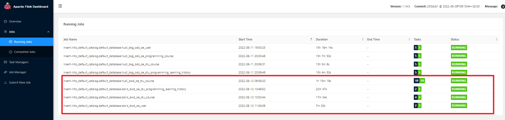 |
| 查看hdfs数据：node1:9870                                     |
| 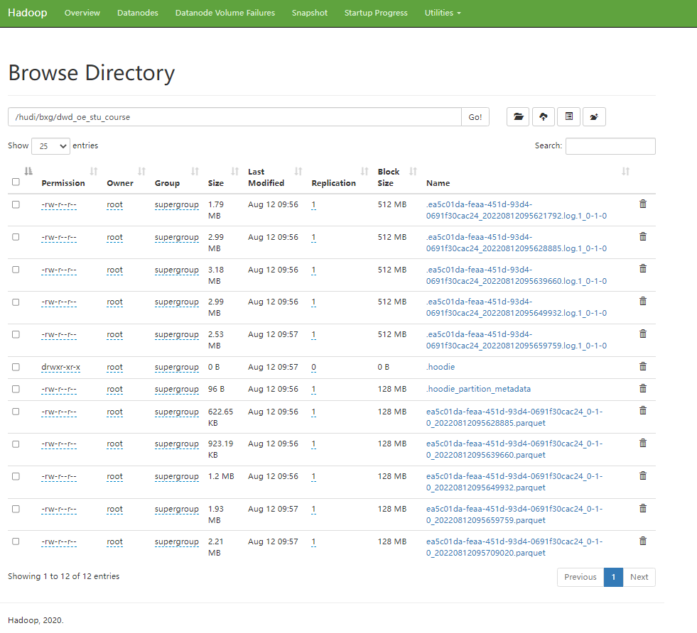 |
| 查看doris表                                                  |
| 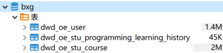 |
| 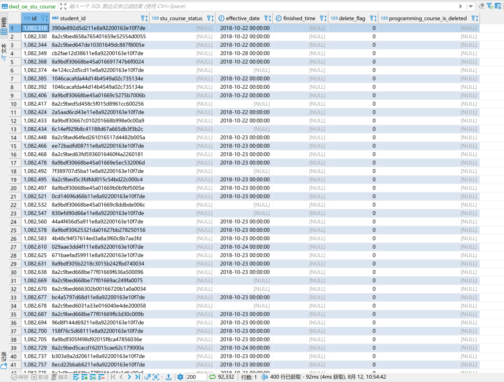 |

### DWS层实现

#### 需求sql

首先我们基于doris的DWD层先写出需求的SQL如下：

设置查询项：年份{{**year**}}

总注册用户数

```sql
SELECT count(distinct ou.id) AS `总注册用户数`
FROM bxg.dwd_oe_user ou
WHERE user_is_delete=0
  AND origin like 'interactive%'
  AND date_format(u.create_time, '%Y')={{year}};
```

测试：令{{**year**}} = '2019'

```sql
SELECT count(distinct ou.id) AS `总注册用户数`
FROM bxg.dwd_oe_user ou
WHERE is_delete=0
  AND origin like 'interactive%'
  AND date_format(ou.create_time, '%Y')='2019';
```

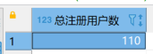

近90天注册用户数

```sql
-- Doris种创建序列表dim. common_sequence   (序列1-1000)
CREATE DATABASE dim;

CREATE TABLE dim.common_sequence (
num int
) Unique key (num) 
DISTRIBUTED BY HASH(`num`) BUCKETS 10
PROPERTIES (
"replication_allocation" = "tag.location.default: 1"
); 

INSERT into dim.common_sequence
SELECT  
	row_number() over () AS num
FROM
	 (SELECT 0 AS num
	  UNION SELECT 1 UNION SELECT 2 UNION SELECT 3
	  UNION SELECT 4 UNION SELECT 5 UNION SELECT 6
	  UNION SELECT 7 UNION SELECT 8 UNION SELECT 9) a,
	 (SELECT 0 AS num
	  UNION SELECT 1 UNION SELECT 2 UNION SELECT 3
	  UNION SELECT 4 UNION SELECT 5 UNION SELECT 6
	  UNION SELECT 7 UNION SELECT 8 UNION SELECT 9) b,
	 (SELECT 0 AS num
	  UNION SELECT 1 UNION SELECT 2 UNION SELECT 3
	  UNION SELECT 4 UNION SELECT 5 UNION SELECT 6
	  UNION SELECT 7 UNION SELECT 8 UNION SELECT 9) c;
-- 查询sql
WITH days AS (
    SELECT date_format(subdate(now(), interval num - 1 day), '%Y.%m.%d') as `day`
    FROM (select num from dim.common_sequence WHERE num <= 90) t
    ORDER BY day
),

     statis AS (
         SELECT
             date_format(create_time, '%Y.%m.%d') as `day`,
             count (distinct id) as `count`
         FROM bxg.dwd_oe_user
         WHERE is_delete=0 AND origin like 'interactive%'
         GROUP BY `day`
     )
SELECT m.day                AS `日期`,
       ifnull(s.`count`, 0) AS `注册用户数`
FROM days AS m
LEFT JOIN statis AS s ON m.day = s.day
ORDER BY m.day;
```

近90天报名用户数

```sql
WITH days AS (
    SELECT date_format(subdate(now(), interval num - 1 day), '%Y.%m.%d') as `day`
    FROM (select num from dim.common_sequence WHERE num <= 90) t
    ORDER BY day
),

     statis AS (
         SELECT
             date_format(osc.effective_date, '%Y.%m.%d') AS `day`,
             count(distinct osc.id) AS `count`
         FROM bxg.dwd_oe_user ou
         join bxg.dwd_oe_stu_course osc on osc.student_id=ou.id
         WHERE osc.programming_course_id is not NULL 
           AND osc.status !=0
           AND ou.is_delete=0
           AND osc.delete_flag=0
           AND programming_course_is_deleted=0
         GROUP BY `day`
         ORDER BY `day`
     )

SELECT
    m.day AS `日期`,
    IFNULL(s.`count`,0) AS `报名用户数`
FROM days AS m
LEFT JOIN statis AS s  ON m.day=s.day
ORDER BY m.day;
```

近90天学习用户数

```sql
WITH days AS (
    SELECT date_format(subdate(now(), interval num - 1 day), '%Y.%m.%d') as `day`
    FROM (select num from dim.common_sequence WHERE num <= 90) t
    ORDER BY day
),

     statis AS (
         SELECT
             date_format(splh.learn_time, '%Y.%m.%d') AS `day`,
             count(distinct ou.id) AS `count`
         FROM bxg.dwd_oe_user ou
         join bxg.dwd_oe_stu_course osc on osc.student_id=ou.id
         join bxg.dwd_oe_stu_programming_learning_history splh on splh.stu_course_id=osc.id
         WHERE osc.programming_course_id is not NULL
           AND osc.status !=0
           AND ou.is_delete=0
           AND osc.delete_flag=0
           AND osc.programming_course_is_deleted=0
         GROUP BY `day`
         ORDER BY `day`
     )

SELECT
    m.day AS `日期`,
    ifnull(s.`count`,0) AS `学习用户数`
FROM days AS m
LEFT JOIN statis AS s  ON m.day=s.day
ORDER BY m.day;
```

用户报名情况分析

```sql
WITH months AS (
    SELECT date_format(date(concat_ws('-',{{year}},month,'01')), '%Y.%m') AS month
    FROM (select num as month from dim.common_sequence where num<=12) t
),
     -- 数据
     statis AS (
         SELECT
             date_format(osc.effective_date, '%Y.%m') AS `month`,
             count(distinct osc.id) applyCount,
             count(distinct osc.student_id) applyNum
         FROM bxg.dwd_oe_user ou
         join bxg.dwd_oe_stu_course osc on osc.student_id=ou.id
         WHERE osc.programming_course_id is not NULL 
           AND osc.status !=0
           AND osc.delete_flag=0
           AND osc.programming_course_is_deleted=0
         GROUP BY month
     )

-- 此处将以上结果集做结合最终呈现查询结果
SELECT
    m.month AS `月份`,
    CASE WHEN (date_format(now(), '%Y.%m') >= m.month and s.applyNum is null) THEN 0 ELSE s.applyNum END AS `报名人数`,
    CASE WHEN (date_format(now(), '%Y.%m') >= m.month and s.applyCount is null) THEN 0 ELSE s.applyCount END AS `报名人次`,
    CASE WHEN (date_format(now(), '%Y.%m') >= m.month and if(applyCount=0,0,s.applyCount/s.applyNum) is null) THEN 0 ELSE if(applyCount=0,0,s.applyCount/s.applyNum) END AS `人均报名课程量`
FROM months AS m
LEFT JOIN statis AS s  ON m.month=s.month
ORDER BY m.month;
```

用户学习情况分析

```sql
WITH months AS (
    SELECT date_format(date(concat_ws('-',{{year}},month,'01')), '%Y.%m') AS month
    FROM (select num as month from dim.common_sequence where num<=12) t
),
     -- 数据
     statis AS (
         SELECT
             date_format(splh.learn_time, '%Y.%m') AS `month`,
             count(distinct CASE WHEN (ou.origin like 'interactive%') THEN ou.id ELSE null END) registerNum,
             count(distinct CASE WHEN (osc.delete_flag=0 and osc.status !=0 AND osc.programming_course_is_deleted=0 AND splh.stu_course_id is not null) THEN osc.id ELSE null END) applyCount,
             count(distinct CASE WHEN (osc.delete_flag=0 and osc.status !=0 AND osc.programming_course_is_deleted=0 AND splh.stu_course_id is not null) THEN osc.student_id ELSE null END) applyNum
         FROM bxg.dwd_oe_user ou
         LEFT JOIN bxg.dwd_oe_stu_course osc on osc.student_id=ou.id
         LEFT JOIN bxg.dwd_oe_stu_programming_learning_history splh on splh.stu_course_id=osc.id 
         WHERE ou.is_delete=0 AND Year(splh.learn_time)={{year}}
GROUP BY month
    )

-- 此处将以上结果集做结合最终呈现查询结果
SELECT
    m.month AS `月份`,
    CASE WHEN (date_format(now(), '%Y.%m') >= m.month and s.applyNum is null ) THEN 0 ELSE s.applyNum END AS `学习人数`,
    CASE WHEN (date_format(now(), '%Y.%m') >= m.month and s.applyCount is null) THEN 0 ELSE s.applyCount END AS `学习人次`,
    CASE WHEN (date_format(now(), '%Y.%m') >= m.month and if(registerNum=0,0,s.applyNum/s.registerNum) is null) THEN 0 ELSE if(registerNum=0,0,s.applyNum/s.registerNum) END AS `学习用户占比`
FROM months AS m
LEFT JOIN statis AS s  ON m.month=s.month
ORDER BY m.month;
```

用户完课情况分析

```sql
WITH months AS (
    SELECT date_format(date(concat_ws('-',{{year}},month,'01')), '%Y.%m') AS month
    FROM (select num as month from dim.common_sequence where num<=12) t
),

     -- 数据
     statis AS (
         SELECT
             date_format(osc.finished_time, '%Y.%m') AS `month`,
             count(distinct CASE WHEN (ou.origin like 'interactive%') THEN ou.id ELSE null END) registerNum,
             count(distinct CASE WHEN (osc.delete_flag=0 and osc.status !=0 AND osc.programming_course_is_deleted=0 AND osc.finished_time is not null) THEN osc.id ELSE null END) applyCount,
             count(distinct CASE WHEN (osc.delete_flag=0 and osc.status !=0 AND osc.programming_course_is_deleted=0 AND osc.finished_time is not null) THEN osc.student_id ELSE null END) applyNum
         FROM bxg.dwd_oe_user ou
         LEFT JOIN bxg.dwd_oe_stu_course osc on osc.student_id=ou.id
         WHERE ou.is_delete=0 AND Year(osc.finished_time)={{year}}
GROUP BY month
    )

-- 此处将以上结果集做结合最终呈现查询结果
SELECT
    m.month AS `月份`,
    CASE WHEN (date_format(now(), '%Y.%m') >= m.month and s.applyNum is null ) THEN 0 ELSE s.applyNum END AS `完课人数`,
    CASE WHEN (date_format(now(), '%Y.%m') >= m.month and s.applyCount is null) THEN 0 ELSE s.applyCount END AS `完课人次`,
    CASE WHEN (date_format(now(), '%Y.%m') >= m.month and if(registerNum=0,0,s.applyNum/s.registerNum) is null) THEN 0 ELSE if(registerNum=0,0,s.applyNum/s.registerNum) END AS `完课用户占比`
FROM months AS m
LEFT JOIN statis AS s  ON m.month=s.month
ORDER BY m.month;
```

用户注册报名转化分析

```sql
WITH months AS (
    SELECT date_format(date(concat_ws('-',{{year}},month,'01')), '%Y.%m') AS month
    FROM (select num as month from dim.common_sequence where num<=12) t
),

-- 数据
     statis AS (
         SELECT
             date_format(ou.create_time, '%Y.%m') AS `month`,
             count(distinct ou.id) registerNum,
             count(distinct CASE WHEN (osc.delete_flag=0 and osc.status !=0 AND osc.programming_course_is_deleted=0 ) THEN osc.id ELSE null END) applyCount,
             count(distinct CASE WHEN (osc.delete_flag=0 and osc.status !=0 AND osc.programming_course_is_deleted=0 ) THEN osc.student_id ELSE null END) applyNum
         FROM bxg.dwd_oe_user ou
         LEFT JOIN bxg.dwd_oe_stu_course osc on osc.student_id=ou.id
         WHERE ou.is_delete=0 AND ou.origin like 'interactive%'
         GROUP BY month
     )

-- 此处将以上结果集做结合最终呈现查询结果
SELECT
    m.month AS `月份`,
    CASE WHEN (date_format(now(), '%Y.%m') >= m.month and s.registerNum is null ) THEN 0 ELSE s.registerNum END AS `注册用户数`,
    CASE WHEN (date_format(now(), '%Y.%m') >= m.month and s.applyNum is null) THEN 0 ELSE s.applyNum END AS `报名人数`,
    CASE WHEN (date_format(now(), '%Y.%m') >= m.month and if(registerNum=0,0,s.applyNum/s.registerNum) is null) THEN 0 ELSE if(registerNum=0,0,s.applyNum/s.registerNum) END AS `报名转化率`
FROM months AS m
LEFT JOIN statis AS s  ON m.month=s.month
ORDER BY m.month;
```

#### 分析

根据上面业务逻辑，需求1-4表结构类似，我们可以将其聚合到一张表，需求5-8表结构类似，我们将其聚合到另一张表。

> **注意**：在我们的需求中，在时间维度上有粒度为年的，也粒度为月的。最终的数据要求在统计之前，要对计数字段进行去重，这也对我们的中间层进行了限制，不能简单的先按天去重count，然后再按年sum，因为不同天的可能存在重复，直接sum会导致结果不正确；

##### 需求1-4的dws表

我们根据需求，按时间维度聚合，根据上面的逻辑写出我们flink sql

总注册用户数

```sql
SELECT
    date_format(create_time, 'yyyy') as `create_time_year`,
    count(distinct id) AS `count`
FROM hudi_bxg_ods_oe_user
WHERE is_delete is false
  AND origin like 'interactive%'
group by date_format(create_time, 'yyyy');
```

近90天注册用户数

```sql
SELECT
    date_format(create_time, 'yyyy.MM.dd') as `create_time_day`,
    count (distinct id) as `count`
FROM hudi_bxg_ods_oe_user
WHERE is_delete is false
  AND origin like 'interactive%'
GROUP BY date_format(create_time, 'yyyy.MM.dd');
```

近90天报名用户数

```sql
SELECT
    date_format(osc.effective_date, 'yyyy.MM.dd') AS `effective_date_day`,
    count(distinct osc.id) AS `count`
FROM hudi_bxg_ods_oe_user ou
join hudi_dwd_oe_stu_course osc on osc.student_id=ou.id
WHERE osc.programming_course_id is not NULL
  AND osc.status not in (0)
  AND ou.is_delete is false
  AND osc.delete_flag is false
  AND programming_course_is_deleted is false
GROUP BY date_format(osc.effective_date, 'yyyy.MM.dd');
```

近90天学习用户数

```sql
SELECT
    date_format(splh.learn_time, 'yyyy.MM.dd') AS `learn_time_day`,
    count(distinct ou.id) AS `count`
FROM hudi_bxg_ods_oe_user ou
join hudi_dwd_oe_stu_course osc on osc.student_id=ou.id
join hudi_bxg_ods_oe_stu_programming_learning_history splh on splh.stu_course_id=osc.id
WHERE osc.programming_course_id is not NULL
  AND osc.status not in (0)
  AND ou.is_delete is false
  AND osc.delete_flag is false
  AND programming_course_is_deleted is false
GROUP BY date_format(splh.learn_time, 'yyyy.MM.dd');
```

**汇总**

上面四个需求都按时间维度计数，但是聚合的时间字段以及筛选条件不同。这里我们可以将四个需求计算好然后采用union的方式合到一起。具体sql如下：

```sql
SELECT
    date_format(create_time, 'yyyy') as `create_time_year`,
    '-1' as `create_time`,
    '-1' as `effective_date`,
    '-1' as `learn_time`,
    count(distinct id) AS `count`
FROM hudi_bxg_ods_oe_user
WHERE is_delete is false
  AND origin like 'interactive%'
group by date_format(create_time, 'yyyy')

union

SELECT
    '-1' as `create_time_year`,
    date_format(create_time, 'yyyy.MM.dd') as `create_time_day`,
    '-1' as `effective_date_day`,
    '-1' as `learn_time_day`,
    count (distinct id) as `count`
FROM hudi_bxg_ods_oe_user
WHERE is_delete is false
  AND origin like 'interactive%'
GROUP BY date_format(create_time, 'yyyy.MM.dd')

union

SELECT
    '-1' as `create_time_year`,
    '-1' as `create_time_day`,
    date_format(osc.effective_date, 'yyyy.MM.dd') AS `effective_date_day`,
    '-1' as `learn_time_day`,
    count(distinct osc.id) AS `count`
FROM hudi_bxg_ods_oe_user ou
join hudi_dwd_oe_stu_course osc on osc.student_id=ou.id
WHERE osc.programming_course_id is not NULL
  AND osc.status not in (0)
  AND ou.is_delete is false
  AND osc.delete_flag is false
  AND programming_course_is_deleted is false
GROUP BY date_format(osc.effective_date, 'yyyy.MM.dd')

union

SELECT
    '-1' as `create_time_year`,
    '-1' as `create_time_day`,
    '-1' as `effective_date_day`,
    date_format(splh.learn_time, 'yyyy.MM.dd') AS `learn_time_day`,
    count(distinct ou.id) AS `count`
FROM hudi_bxg_ods_oe_user ou
join hudi_dwd_oe_stu_course osc on osc.student_id=ou.id
join hudi_bxg_ods_oe_stu_programming_learning_history splh on splh.stu_course_id=osc.id
WHERE osc.programming_course_id is not NULL
  AND osc.status not in (0)
  AND ou.is_delete is false
  AND osc.delete_flag is false
  AND programming_course_is_deleted is false
GROUP BY date_format(splh.learn_time, 'yyyy.MM.dd');
```

##### 需求5-8的dws表

用户报名情况分析

```sql
SELECT
    date_format(osc.effective_date, 'yyyy.MM') AS `effective_date_month`,
    count(distinct osc.id) applyCount,
    count(distinct osc.student_id) applyNum
FROM hudi_bxg_ods_oe_user ou
         join hudi_dwd_oe_stu_course osc on osc.student_id=ou.id
WHERE osc.programming_course_id is not NULL
  AND osc.status not in (0)
  AND osc.delete_flag is false
  AND osc.programming_course_is_deleted is false
GROUP BY date_format(osc.effective_date, 'yyyy.MM')
```

用户学习情况分析

```sql
SELECT
    date_format(splh.learn_time, 'yyyy.MM') AS `learn_time_month`,
    count(distinct CASE WHEN (ou.origin like 'interactive%') THEN ou.id ELSE null END) registerNum,
    count(distinct CASE WHEN (osc.delete_flag is false and osc.status not in (0) AND osc.programming_course_is_deleted is false AND splh.stu_course_id is not null) THEN osc.id ELSE null END) applyCount,
    count(distinct CASE WHEN (osc.delete_flag is false and osc.status not in (0) AND osc.programming_course_is_deleted is false AND splh.stu_course_id is not null) THEN osc.student_id ELSE null END) applyNum
FROM hudi_bxg_ods_oe_user ou
LEFT JOIN hudi_dwd_oe_stu_course osc on osc.student_id=ou.id
LEFT JOIN hudi_bxg_ods_oe_stu_programming_learning_history splh on splh.stu_course_id=osc.id
WHERE ou.is_delete is false
GROUP BY date_format(splh.learn_time, 'yyyy.MM');
```

用户完课情况分析

```sql
SELECT
    date_format(osc.finished_time, 'yyyy.MM') AS `finished_time_month`,
    count(distinct CASE WHEN (ou.origin like 'interactive%') THEN ou.id ELSE null END) registerNum,
    count(distinct CASE WHEN (osc.delete_flag is false and osc.status not in (0) AND osc.programming_course_is_deleted is false AND osc.finished_time is not null) THEN osc.id ELSE null END) applyCount,
    count(distinct CASE WHEN (osc.delete_flag is false and osc.status not in (0) AND osc.programming_course_is_deleted is false AND osc.finished_time is not null) THEN osc.student_id ELSE null END) applyNum
FROM hudi_bxg_ods_oe_user ou
LEFT JOIN hudi_dwd_oe_stu_course osc on osc.student_id=ou.id
WHERE ou.is_delete is false
GROUP BY date_format(osc.finished_time, 'yyyy.MM');
```

用户注册报名转化分析

```sql
SELECT
    '-1' AS `effective_date_month`,
    '-1' AS `learn_time_month`,
    '-1' AS `finished_time_month`,
    date_format(ou.create_time, 'yyyy.MM') AS `create_time_month`,
    count(distinct ou.id) registerNum,
    count(distinct CASE WHEN (osc.delete_flag is false and osc.status not in (0) AND osc.programming_course_is_deleted is false ) THEN osc.id ELSE null END) applyCount,
    count(distinct CASE WHEN (osc.delete_flag is false and osc.status not in (0) AND osc.programming_course_is_deleted is false ) THEN osc.student_id ELSE null END) applyNum
FROM hudi_bxg_ods_oe_user ou
LEFT JOIN hudi_dwd_oe_stu_course osc on osc.student_id=ou.id
WHERE ou.is_delete is false AND ou.origin like 'interactive%'
GROUP BY date_format(ou.create_time, 'yyyy.MM');
```

汇总

```sql
SELECT
    date_format(osc.effective_date, 'yyyy.MM') AS `effective_date_month`,
    count(distinct osc.id) applyCount,
    count(distinct osc.student_id) applyNum
FROM hudi_bxg_ods_oe_user ou
join hudi_dwd_oe_stu_course osc on osc.student_id=ou.id
WHERE osc.programming_course_id is not NULL
  AND osc.status not in (0)
  AND osc.delete_flag is false
  AND osc.programming_course_is_deleted is false
GROUP BY date_format(osc.effective_date, 'yyyy.MM')

union

SELECT
    '-1' AS `effective_date_month`,
    date_format(splh.learn_time, 'yyyy.MM') AS `learn_time_month`,
    '-1' AS `finished_time_month`,
    '-1' AS `create_time_month`,
    count(distinct CASE WHEN (ou.origin like 'interactive%') THEN ou.id ELSE null END) registerNum,
    count(distinct CASE WHEN (osc.delete_flag is false and osc.status not in (0) AND osc.programming_course_is_deleted is false AND splh.stu_course_id is not null) THEN osc.id ELSE null END) applyCount,
    count(distinct CASE WHEN (osc.delete_flag is false and osc.status not in (0) AND osc.programming_course_is_deleted is false AND splh.stu_course_id is not null) THEN osc.student_id ELSE null END) applyNum
FROM hudi_bxg_ods_oe_user ou
LEFT JOIN hudi_dwd_oe_stu_course osc on osc.student_id=ou.id
LEFT JOIN hudi_bxg_ods_oe_stu_programming_learning_history splh on splh.stu_course_id=osc.id
WHERE ou.is_delete is false
GROUP BY date_format(splh.learn_time, 'yyyy.MM')

union

SELECT
    '-1' AS `effective_date_month`,
    '-1' AS `learn_time_month`,
    date_format(osc.finished_time, 'yyyy.MM') AS `finished_time_month`,
    '-1' AS `create_time_month`,
    count(distinct CASE WHEN (ou.origin like 'interactive%') THEN ou.id ELSE null END) registerNum,
    count(distinct CASE WHEN (osc.delete_flag is false and osc.status not in (0) AND osc.programming_course_is_deleted is false AND osc.finished_time is not null) THEN osc.id ELSE null END) applyCount,
    count(distinct CASE WHEN (osc.delete_flag is false and osc.status not in (0) AND osc.programming_course_is_deleted is false AND osc.finished_time is not null) THEN osc.student_id ELSE null END) applyNum
FROM hudi_bxg_ods_oe_user ou
LEFT JOIN hudi_dwd_oe_stu_course osc on osc.student_id=ou.id
WHERE ou.is_delete is false
GROUP BY date_format(osc.finished_time, 'yyyy.MM')

union

SELECT
    '-1' AS `effective_date_month`,
    '-1' AS `learn_time_month`,
    '-1' AS `finished_time_month`,
    date_format(ou.create_time, 'yyyy.MM') AS `create_time_month`,
    count(distinct ou.id) registerNum,
    count(distinct CASE WHEN (osc.delete_flag is false and osc.status not in (0) AND osc.programming_course_is_deleted is false ) THEN osc.id ELSE null END) applyCount,
    count(distinct CASE WHEN (osc.delete_flag is false and osc.status not in (0) AND osc.programming_course_is_deleted is false ) THEN osc.student_id ELSE null END) applyNum
FROM hudi_bxg_ods_oe_user ou
LEFT JOIN hudi_dwd_oe_stu_course osc on osc.student_id=ou.id
WHERE ou.is_delete is false AND ou.origin like 'interactive%'
GROUP BY date_format(ou.create_time, 'yyyy.MM');
```

#### 实现

##### hudi_dws层

创建hudi_dws层映射表

```sql
-- 需求1-4
CREATE TABLE if not exists hudi_dws_registerNum_applyNum_finishNum(
    `create_time_year` string,
    `create_time_day` string,
    `effective_date_day` string,
    `learn_time_day` string,
    `count` bigint,
    PRIMARY KEY (`create_time_year`, `create_time_day`, `effective_date_day`, `learn_time_day`) NOT ENFORCED
) WITH(
    'connector'='hudi'
    ,'path'= 'hdfs://node1:8020/hudi/bxg/dws_registerNum_applyNum_finishNum'
    ,'hoodie.datasource.write.recordkey.field'= '`create_time_year`, `create_time_day`, `effective_date_day`, `learn_time_day`'
    ,'write.tasks'= '1'
    ,'compaction.tasks'= '1'
    ,'write.rate.limit'= '2000'
    ,'table.type'= 'MERGE_ON_READ'
    ,'compaction.async.enabled'= 'true'
    ,'compaction.trigger.strategy'= 'num_commits'
    ,'compaction.delta_commits'= '1'
    ,'changelog.enabled'= 'true'
    ,'read.tasks' = '3'
    ,'read.streaming.enabled'= 'true'
    ,'read.start-commit'='earliest'
    ,'read.streaming.check-interval'= '3'
    ,'hive_sync.enable'= 'true'
    ,'hive_sync.mode'= 'hms'
    ,'hive_sync.metastore.uris'= 'thrift://node1:9083'
    ,'hive_sync.table'= 'dws_registerNum_applyNum_finishNum'
    ,'hive_sync.db'= 'bxg'
    ,'hive_sync.username'= ''
    ,'hive_sync.password'= ''
    ,'hive_sync.support_timestamp'= 'true'
);
-- 需求5-8
CREATE TABLE if not exists hudi_dws_registerSituation_applySituation_finishSituation (
    `effective_date_month` string,
    `learn_time_month` string,
    `finished_time_month` string,
    `create_time_month` string,
    `registerNum` bigint,
    `applyCount` bigint,
    `applyNum` bigint,
    PRIMARY KEY (`effective_date_month` , `learn_time_month`, `finished_time_month`, `create_time_month`) NOT ENFORCED
) WITH(
    'connector'='hudi'
    ,'path'= 'hdfs://node1:8020/hudi/bxg/dws_registerSituation_applySituation_finishSituation'
    ,'hoodie.datasource.write.recordkey.field'= '`effective_date_month`, `learn_time_month`, `finished_time_month`, `create_time_month`'
    ,'write.tasks'= '1'
    ,'compaction.tasks'= '1'
    ,'write.rate.limit'= '2000'
    ,'table.type'= 'MERGE_ON_READ'
    ,'compaction.async.enabled'= 'true'
    ,'compaction.trigger.strategy'= 'num_commits'
    ,'compaction.delta_commits'= '1'
    ,'changelog.enabled'= 'true'
    ,'read.tasks' = '3'
    ,'read.streaming.enabled'= 'true'
    ,'read.start-commit'='earliest'
    ,'read.streaming.check-interval'= '3'
    ,'hive_sync.enable'= 'true'
    ,'hive_sync.mode'= 'hms'
    ,'hive_sync.metastore.uris'= 'thrift://node1:9083'
    ,'hive_sync.table'= 'dws_registerSituation_applySituation_finishSituation'
    ,'hive_sync.db'= 'bxg'
    ,'hive_sync.username'= ''
    ,'hive_sync.password'= ''
    ,'hive_sync.support_timestamp'= 'true'
);
```

插入数据

需求1-4

```sql
INSERT INTO hudi_dws_registerNum_applyNum_finishNum
SELECT
    date_format(create_time, 'yyyy') as `create_time_year`,
    '-1' as `create_time_day`,
    '-1' as `effective_date_day`,
    '-1' as `learn_time_day`,
    count(distinct id) AS `count`
FROM hudi_bxg_ods_oe_user
WHERE is_delete is false
  AND origin like 'interactive%'
group by date_format(create_time, 'yyyy')

UNION

SELECT
    '-1' as `create_time_year`,
    date_format(create_time, 'yyyy.MM.dd') as `create_time_day`,
    '-1' as `effective_date_day`,
    '-1' as `learn_time_day`,
    count (distinct id) as `count`
FROM hudi_bxg_ods_oe_user
WHERE is_delete is false
  AND origin like 'interactive%'
GROUP BY date_format(create_time, 'yyyy.MM.dd')

UNION

SELECT
    '-1' as `create_time_year`,
    '-1' as `create_time_day`,
    date_format(osc.effective_date, 'yyyy.MM.dd') AS `effective_date_day`,
    '-1' as `learn_time_day`,
    count(distinct osc.id) AS `count`
FROM hudi_bxg_ods_oe_user ou
         join hudi_dwd_oe_stu_course osc on osc.student_id=ou.id
WHERE osc.programming_course_id is not NULL
  AND osc.status not in (0)
  AND ou.is_delete is false
  AND osc.delete_flag is false
  AND programming_course_is_deleted is false
GROUP BY date_format(osc.effective_date, 'yyyy.MM.dd')

UNION

SELECT
    '-1' as `create_time_year`,
    '-1' as `create_time_day`,
    '-1' as `effective_date_day`,
    date_format(splh.learn_time, 'yyyy.MM.dd') AS `learn_time_day`,
    count(distinct ou.id) AS `count`
FROM hudi_bxg_ods_oe_user ou
         join hudi_dwd_oe_stu_course osc on osc.student_id=ou.id
         join hudi_bxg_ods_oe_stu_programming_learning_history splh on splh.stu_course_id=osc.id
WHERE osc.programming_course_id is not NULL
  AND osc.status not in (0)
  AND ou.is_delete is false
  AND osc.delete_flag is false
  AND programming_course_is_deleted is false
GROUP BY date_format(splh.learn_time, 'yyyy.MM.dd');
```

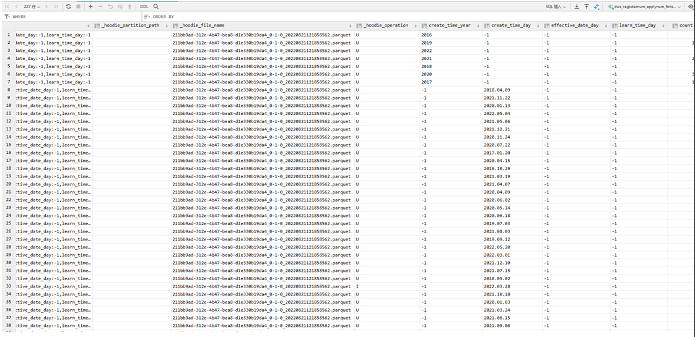

 需求5-8

```sql
INSERT INTO hudi_dws_registerSituation_applySituation_finishSituation
SELECT
    date_format(osc.effective_date, 'yyyy.MM') AS `effective_date_month`,
    '-1' AS `learn_time_month`,
    '-1' AS `finished_time_month`,
    '-1' AS `create_time_month`,
    -1 as registerNum,
    count(distinct osc.id) applyCount,
    count(distinct osc.student_id) applyNum
FROM hudi_bxg_ods_oe_user ou
         join hudi_dwd_oe_stu_course osc on osc.student_id=ou.id
WHERE osc.programming_course_id is not NULL
  AND osc.status not in (0)
  AND osc.delete_flag is false
  AND osc.programming_course_is_deleted is false
GROUP BY date_format(osc.effective_date, 'yyyy.MM')

UNION

SELECT
    '-1' AS `effective_date_month`,
    ifnull(date_format(splh.learn_time, 'yyyy.MM'),'null') AS `learn_time_month`,
    '-1' AS `finished_time_month`,
    '-1' AS `create_time_month`,
    count(distinct CASE WHEN (ou.origin like 'interactive%') THEN ou.id ELSE null END) registerNum,
    count(distinct CASE WHEN (osc.delete_flag is false and osc.status not in (0) AND osc.programming_course_is_deleted is false AND splh.stu_course_id is not null) THEN osc.id ELSE null END) applyCount,
    count(distinct CASE WHEN (osc.delete_flag is false and osc.status not in (0) AND osc.programming_course_is_deleted is false AND splh.stu_course_id is not null) THEN osc.student_id ELSE null END) applyNum
FROM hudi_bxg_ods_oe_user ou
         LEFT JOIN hudi_dwd_oe_stu_course osc on osc.student_id=ou.id
         LEFT JOIN hudi_bxg_ods_oe_stu_programming_learning_history splh on splh.stu_course_id=osc.id
WHERE ou.is_delete is false
GROUP BY date_format(splh.learn_time, 'yyyy.MM')

UNION

SELECT
    '-1' AS `effective_date_month`,
    '-1' AS `learn_time_month`,
    ifnull(date_format(osc.finished_time, 'yyyy.MM'),'null') AS `finished_time_month`,
    '-1' AS `create_time_month`,
    count(distinct CASE WHEN (ou.origin like 'interactive%') THEN ou.id ELSE null END) registerNum,
    count(distinct CASE WHEN (osc.delete_flag is false and osc.status not in (0) AND osc.programming_course_is_deleted is false AND osc.finished_time is not null) THEN osc.id ELSE null END) applyCount,
    count(distinct CASE WHEN (osc.delete_flag is false and osc.status not in (0) AND osc.programming_course_is_deleted is false AND osc.finished_time is not null) THEN osc.student_id ELSE null END) applyNum
FROM hudi_bxg_ods_oe_user ou
         LEFT JOIN hudi_dwd_oe_stu_course osc on osc.student_id=ou.id
WHERE ou.is_delete is false
GROUP BY date_format(osc.finished_time, 'yyyy.MM')

UNION

SELECT
    '-1' AS `effective_date_month`,
    '-1' AS `learn_time_month`,
    '-1' AS `finished_time_month`,
    date_format(ou.create_time, 'yyyy.MM') AS `create_time_month`,
    count(distinct ou.id) registerNum,
    count(distinct CASE WHEN (osc.delete_flag is false and osc.status not in (0) AND osc.programming_course_is_deleted is false ) THEN osc.id ELSE null END) applyCount,
    count(distinct CASE WHEN (osc.delete_flag is false and osc.status not in (0) AND osc.programming_course_is_deleted is false ) THEN osc.student_id ELSE null END) applyNum
FROM hudi_bxg_ods_oe_user ou
         LEFT JOIN hudi_dwd_oe_stu_course osc on osc.student_id=ou.id
WHERE ou.is_delete is false AND ou.origin like 'interactive%'
GROUP BY date_format(ou.create_time, 'yyyy.MM');
```

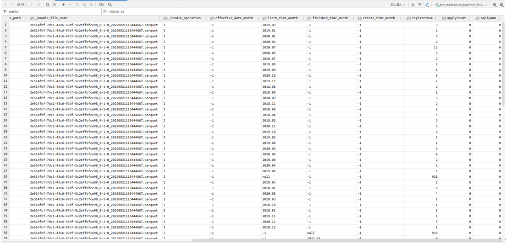

##### doris_dws层

生产环境中需要对表进行动态分区，区分冷热数据。为了展示所有历史数据，我们这里演示不做分区。

- 在doris中创建dws表

需求1-4

```sql
CREATE TABLE if not exists bxg.dws_registerNum_applyNum_finishNum(
    `create_time_year` varchar(255),
    `create_time_day` varchar(255),
    `effective_date_day` varchar(255),
    `learn_time_day` varchar(255),
    `count` bigint
) Unique Key (`create_time_year`, `create_time_day`, `effective_date_day`, `learn_time_day`)
DISTRIBUTED BY HASH(`create_time_year`, `create_time_day`, `effective_date_day`, `learn_time_day`) BUCKETS 5
PROPERTIES (
"replication_allocation" = "tag.location.default: 1"
);
```

需求5-8

```sql
CREATE TABLE if not exists bxg.dws_registerSituation_applySituation_finishSituation (
    `effective_date_month` varchar(255),
    `learn_time_month` varchar(255),
    `finished_time_month` varchar(255),
    `create_time_month` varchar(255),
    `registerNum` bigint,
    `applyCount` bigint,
    `applyNum` bigint
) Unique Key (`effective_date_month` , `learn_time_month`, `finished_time_month`, `create_time_month`)
DISTRIBUTED BY HASH(`effective_date_month` , `learn_time_month`, `finished_time_month`, `create_time_month`) BUCKETS 5
PROPERTIES (
"replication_allocation" = "tag.location.default: 1"
);
```

- 在flink sql-cli中创建doris_dws层映射

需求1-4

```sql
CREATE TABLE if not exists doris_dws_registerNum_applyNum_finishNum(
    `create_time_year` string,
    `create_time_day` string,
    `effective_date_day` string,
    `learn_time_day` string,
    `count` bigint,
    PRIMARY KEY (`create_time_year`, `create_time_day`, `effective_date_day`, `learn_time_day`) NOT ENFORCED
) WITH (
    'fenodes' = 'node1:8030'
    ,'table.identifier' = 'bxg.dws_registerNum_applyNum_finishNum'
    ,'sink.enable-delete' = 'true'
    ,'sink.properties.strip_outer_array' = 'true'
    ,'sink.batch.size' = '2000'
    ,'password' = '123456'
    ,'connector' = 'doris'
    ,'sink.batch.interval' = '10s'
    ,'sink.max-retries' = '5'
    ,'sink.properties.format' = 'json'
    ,'username' = 'root'
);
```

需求5-8

```sql
CREATE TABLE if not exists doris_dws_registerSituation_applySituation_finishSituation(
    `effective_date_month` string,
    `learn_time_month` string,
    `finished_time_month` string,
    `create_time_month` string,
    `registerNum` bigint,
    `applyCount` bigint,
    `applyNum` bigint,
    PRIMARY KEY (`effective_date_month` , `learn_time_month`, `finished_time_month`, `create_time_month`) NOT ENFORCED
) WITH (
    'fenodes' = 'node1:8030'
    ,'table.identifier' = 'bxg.dws_registerSituation_applySituation_finishSituation'
    ,'sink.enable-delete' = 'true'
    ,'sink.properties.strip_outer_array' = 'true'
    ,'sink.batch.size' = '2000'
    ,'password' = '123456'
    ,'connector' = 'doris'
    ,'sink.batch.interval' = '10s'
    ,'sink.max-retries' = '5'
    ,'sink.properties.format' = 'json'
    ,'username' = 'root'
);
```

- 插入数据

需求1-4

```sql
insert into doris_dws_registerNum_applyNum_finishNum
select  `create_time_year`, `create_time_day`, `effective_date_day`, `learn_time_day`, `count`
from hudi_dws_registerNum_applyNum_finishNum;
```

需求5-8

```
insert into doris_dws_registerSituation_applySituation_finishSituation
select `effective_date_month`, `learn_time_month`, `finished_time_month`,    `create_time_month`,`registerNum`, `applyCount`, `applyNum` 
from hudi_dws_registerSituation_applySituation_finishSituation;
```

### 业务查询SQL

#### 总注册用户数

```sql
SELECT `count`AS `总注册用户数`
FROM bxg.dws_registerNum_applyNum_finishNum
WHERE create_time_year NOT IN ('-1')
AND create_time_year = {{year}};

测试：令{{year}} = '2019' 

SELECT `count`AS `总注册用户数`
FROM bxg.dws_registerNum_applyNum_finishNum
WHERE create_time_year NOT IN ('-1')
AND create_time_year = '2019';
```


#### 近90天注册用户数

```sql
-- Doris种创建序列表dim. common_sequence   (序列1-1000)
CREATE DATABASE dim;

CREATE TABLE dim.common_sequence (
num int
) Unique key (num) 
DISTRIBUTED BY HASH(`num`) BUCKETS 10
PROPERTIES (
"replication_allocation" = "tag.location.default: 1"
); 

INSERT into dim.common_sequence
SELECT  
	row_number() over () AS num
FROM
	 (SELECT 0 AS num
	  UNION SELECT 1 UNION SELECT 2 UNION SELECT 3
	  UNION SELECT 4 UNION SELECT 5 UNION SELECT 6
	  UNION SELECT 7 UNION SELECT 8 UNION SELECT 9) a,
	 (SELECT 0 AS num
	  UNION SELECT 1 UNION SELECT 2 UNION SELECT 3
	  UNION SELECT 4 UNION SELECT 5 UNION SELECT 6
	  UNION SELECT 7 UNION SELECT 8 UNION SELECT 9) b,
	 (SELECT 0 AS num
	  UNION SELECT 1 UNION SELECT 2 UNION SELECT 3
	  UNION SELECT 4 UNION SELECT 5 UNION SELECT 6
	  UNION SELECT 7 UNION SELECT 8 UNION SELECT 9) c;

-- 查询sql
WITH days AS (
    SELECT date_format(subdate(now(), interval num - 1 day), '%Y.%m.%d') as `day`
    FROM (select num from dim.common_sequence WHERE num <= 90) t
)
SELECT m.day AS `日期`,
       ifnull(s.`count`, 0) AS `注册用户数`
FROM days AS m
LEFT JOIN bxg.dws_registerNum_applyNum_finishNum AS s ON (m.day = s.create_time_day AND create_time_day NOT IN ('-1'))
ORDER BY m.day;
```

#### 近90天报名用户数

```sql
WITH days AS (
    SELECT date_format(subdate(now(), interval num - 1 day), '%Y.%m.%d') as `day`
    FROM (select num from dim.common_sequence WHERE num <= 90) t
    ORDER BY day
)

SELECT
    m.day AS `日期`,
    IFNULL(s.`count`,0) AS `报名用户数`
FROM days AS m
LEFT JOIN bxg.dws_registerNum_applyNum_finishNum AS s  ON (m.day=s.effective_date_day AND effective_date_day NOT IN ('-1'))
ORDER BY m.day;
```

#### 近90天学习用户数

```sql
WITH days AS (
    SELECT date_format(subdate(now(), interval num - 1 day), '%Y.%m.%d') as `day`
    FROM (select num from dim.common_sequence WHERE num <= 90) t
)
SELECT
    m.day AS `日期`,
    ifnull(s.`count`,0) AS `学习用户数`
FROM days AS m
LEFT JOIN bxg.dws_registerNum_applyNum_finishNum AS s  ON (m.day=s.learn_time_day AND learn_time_day NOT IN ('-1'))
ORDER BY m.day;
```

#### 用户报名情况分析

```sql
WITH months AS (
    SELECT date_format(date(concat_ws('-',{{year}},month,'01')), '%Y.%m') AS month
    FROM (select num as month from dim.common_sequence where num<=12) t
)
SELECT
    m.month AS `月份`,
    CASE WHEN (date_format(now(), '%Y.%m') >= m.month and s.applyNum is null) THEN 0 ELSE s.applyNum END AS `报名人数`,
    CASE WHEN (date_format(now(), '%Y.%m') >= m.month and s.applyCount is null) THEN 0 ELSE s.applyCount END AS `报名人次`,
    CASE WHEN (date_format(now(), '%Y.%m') >= m.month and if(applyCount=0,0,s.applyCount/s.applyNum) is null) THEN 0 ELSE if(applyCount=0,0,s.applyCount/s.applyNum) END AS `人均报名课程量`
FROM months AS m
LEFT JOIN bxg.dws_registerSituation_applySituation_finishSituation AS s  ON (m.month=s.effective_date_month AND effective_date_month NOT IN ('-1'))
ORDER BY m.month;
```

#### 用户学习情况分析

```sql
WITH months AS (
    SELECT date_format(date(concat_ws('-',{{year}},month,'01')), '%Y.%m') AS month
    FROM (select num as month from dim.common_sequence where num<=12) t
)
SELECT
    m.month AS `月份`,
    CASE WHEN (date_format(now(), '%Y.%m') >= m.month and s.applyNum is null ) THEN 0 ELSE s.applyNum END AS `学习人数`,
    CASE WHEN (date_format(now(), '%Y.%m') >= m.month and s.applyCount is null) THEN 0 ELSE s.applyCount END AS `学习人次`,
    CASE WHEN (date_format(now(), '%Y.%m') >= m.month and if(registerNum=0,0,s.applyNum/s.registerNum) is null) THEN 0 ELSE if(registerNum=0,0,s.applyNum/s.registerNum) END AS `学习用户占比`
FROM months AS m
LEFT JOIN bxg.dws_registerSituation_applySituation_finishSituation AS s ON (m.month=s.learn_time_month AND learn_time_month NOT IN ('-1'))
ORDER BY m.month;
```

#### 用户完课情况分析

```sql
WITH months AS (
    SELECT date_format(date(concat_ws('-',{{year}},month,'01')), '%Y.%m') AS month
    FROM (select num as month from dim.common_sequence where num<=12) t
)
SELECT
    m.month AS `月份`,
    CASE WHEN (date_format(now(), '%Y.%m') >= m.month and s.applyNum is null ) THEN 0 ELSE s.applyNum END AS `完课人数`,
    CASE WHEN (date_format(now(), '%Y.%m') >= m.month and s.applyCount is null) THEN 0 ELSE s.applyCount END AS `完课人次`,
    CASE WHEN (date_format(now(), '%Y.%m') >= m.month and if(registerNum=0,0,s.applyNum/s.registerNum) is null) THEN 0 ELSE if(registerNum=0,0,s.applyNum/s.registerNum) END AS `完课用户占比`
FROM months AS m
LEFT JOIN bxg.dws_registerSituation_applySituation_finishSituation AS s  ON (m.month=s.finished_time_month AND finished_time_month NOT IN ('-1'))
ORDER BY m.month;
```

#### 用户注册报名转化分析

```sql
WITH months AS (
    SELECT date_format(date(concat_ws('-','2021',month,'01')), '%Y.%m') AS month
    FROM (select num as month from dim.common_sequence where num<=12) t
)
SELECT
    m.month AS `月份`,
    CASE WHEN (date_format(now(), '%Y.%m') >= m.month and s.registerNum is null ) THEN 0 ELSE s.registerNum END AS `注册用户数`,
    CASE WHEN (date_format(now(), '%Y.%m') >= m.month and s.applyNum is null) THEN 0 ELSE s.applyNum END AS `报名人数`,
    CASE WHEN (date_format(now(), '%Y.%m') >= m.month and if(registerNum=0,0,s.applyNum/s.registerNum) is null) THEN 0 ELSE if(registerNum=0,0,s.applyNum/s.registerNum) END AS `报名转化率`
FROM months AS m
LEFT JOIN bxg.dws_registerSituation_applySituation_finishSituation AS s  ON (m.month=s.create_time_month AND create_time_month NOT IN ('-1')) 
ORDER BY m.month;
```

# 知识点09： 【掌握】营收结构与订单分析看板

## 看板需求

### 需求

该看板主要包括两部分内容-营收结构分析、订单分析。营收结构分析旨在分析各课程品类对营收的贡献，以找到并发挥主力课程的优势。订单分析旨在把握课程的成交均价，以稳定整体课程价格。

原始数据来源于业务系统的Mysql数据库。

#### 2020-2022年各课程类型的全款订单量

- 说明：分析各课程品类对营收的贡献，以找到并发挥主力课程的优势。

- 展示：柱状图

- 指标：全款量

- 维度：时间、课程类型

- 粒度：月

- 涉及库：bxg

- 涉及表：bxg.oe_order、bxg.oe_stu_course_order、bxg.oe_stu_course、bxg.oe_course、bxg.oe_test_course、oe_order_transfer_apply


#### 2020-2022年各课程类型的全款金额

- 说明：分析各课程品类对营收的贡献，以找到并发挥主力课程的优势。

- 展示：柱状图

- 指标：全款金额

- 维度：时间、课程类型

- 粒度：月

- 涉及库：bxg

- 涉及表：bxg.oe_order、bxg.oe_stu_course_order、bxg.oe_stu_course、bxg.oe_course、bxg.oe_test_course、oe_order_transfer_apply


#### 2022年职业课各课程的全款订单量详情表

- 说明：分析各课程品类对营收的贡献，以找到并发挥主力课程的优势。

- 展示：柱状图

- 指标：全款量

- 维度：时间、课程

- 粒度：月

- 涉及库：bxg

- 涉及表：bxg.oe_order、bxg.oe_stu_course_order、bxg.oe_stu_course、bxg.oe_course、bxg.oe_test_course、oe_order_transfer_apply


#### 在线就业班成交均价分析

- 说明：把握课程的成交均价，以稳定整体课程价格。

- 展示：柱状图

- 指标：成交均价

- 维度：时间

- 粒度：月

- 涉及库：bxg

- 涉及表：bxg.oe_order、bxg.oe_stu_course_order、bxg.oe_stu_course、bxg.oe_course、bxg.oe_test_course、oe_order_transfer_apply


#### 年度会员成交均价分析

- 说明：把握课程的成交均价，以稳定整体课程价格。

- 展示：柱状图

- 指标：成交均价

- 维度：时间

- 粒度：月

- 涉及库：bxg

- 涉及表：bxg.oe_order、bxg.oe_stu_course_order、bxg.oe_stu_course、bxg.oe_course、bxg.oe_test_course、oe_order_transfer_apply


#### 2022年职业课各课程成交均价详情表

- 说明：把握课程的成交均价，以稳定整体课程价格。

- 展示：柱状图

- 指标：成交均价

- 维度：时间、课程

- 粒度：月

- 涉及库：bxg

- 涉及表：bxg.oe_order、bxg.oe_stu_course_order、bxg.oe_stu_course、bxg.oe_course、bxg.oe_test_course、oe_order_transfer_apply


### 需求说明

#### 全款量

指交齐学费时间落在统计时间范围内的订单数量，包含交齐学费和直接全款两种情况。不考虑之后是否退费。不包含N12分摊转移的数据（N12分摊转移**为线下学员毕业后博学谷赠送的课程**）。以首次订单为准，后续发生转班后的订单不重复计算，需要排除。

#### 全款金额

指交齐学费时间落在统计时间范围内的订单的实际总缴费金额，包含交齐学费和直接全款两种情况（不含预交报名费等部分付款，不考虑全款后是否退费）。不包含N12分摊转移的数据。以首次订单为准，后续发生转班后的订单不重复计算，需要排除。需加上冲抵金额。

#### 成交均价

指课程的实际平均成交价格。成交均价=实际总缴费金额 ÷ 成交订单量

#### 营收结构分析

全款订单量和全款金额均指支付完成时间（交齐学费或直接全款）落在统计月份的订单数量和金额。不管之后是否发生退费均要统计。不包含N12分摊转移的数据。对于转班的情况，以首次订单为准，只统计首次订单，后续发生转班后的订单不重复计算，需排除。在计算全款金额时，需统计学员所支付的全部金额，包含冲抵金额。

包含指标:2020-2022年各课程类型的全款订单量、2020-2022年各课程类型的全款金额、2022年职业课各课程的全款订单量详情表

#### 订单分析

分析各类课程的成交均价

包含指标:在线就业班成交均价分析、年度会员成交均价分析、2022年职业课各课程成交均价详情表

### 结果显示

#### 2020-2022年各课程类型的全款订单量

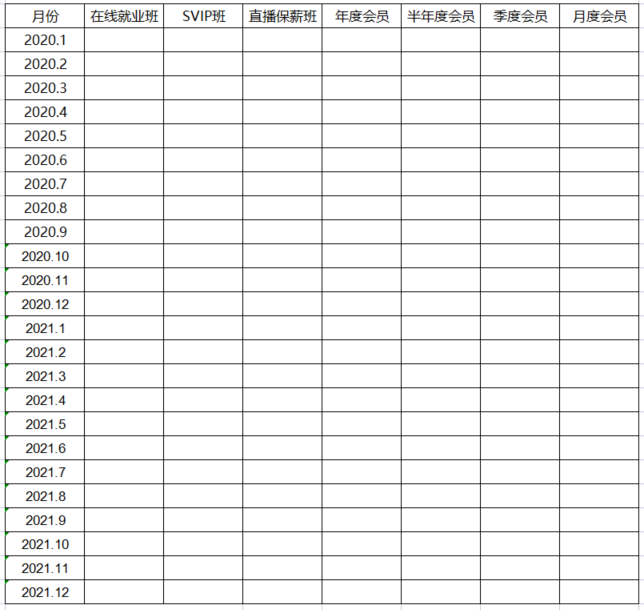

#### 2020-2022年各课程类型的全款金额

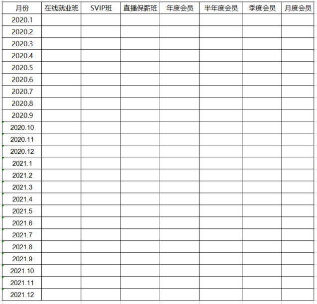

#### 2022年职业课各课程的全款订单量详情表

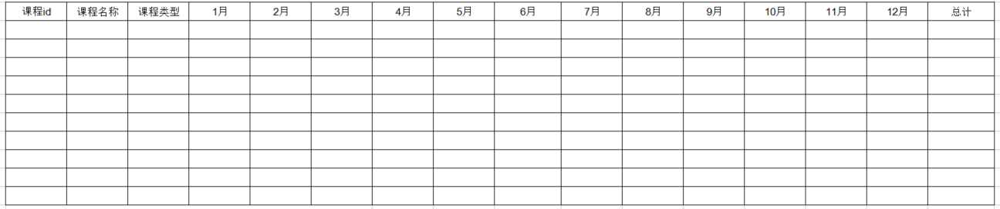

#### 在线就业班成交均价分析

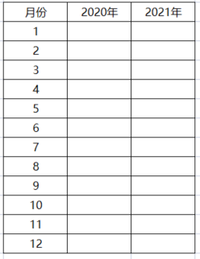

#### 年度会员成交均价分析

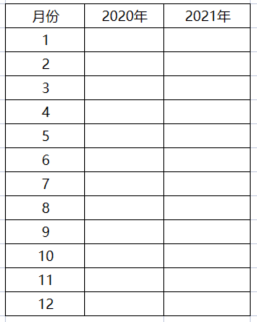

#### 2022年职业课各课程成交均价详情表

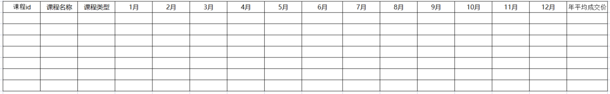

### SQL参考

#### 2020-2022年各课程类型的全款订单量

```sql
SELECT
    date_format(oo.`pay_time`, '%Y.%m') AS `月份`,
    COUNT(CASE WHEN (oc.`course_type` = 0 AND oc.`grade_name` LIKE '%在线就业班%' AND oc.`grade_name` NOT LIKE '%SVIP%') THEN oo.`id` ELSE NULL END) AS `在线就业班`,
    COUNT(CASE WHEN (oc.`course_type` = 0 AND oc.`grade_name` LIKE '%SVIP%') THEN oo.`id` ELSE NULL END) AS `SVIP班`,
    COUNT(CASE WHEN (oc.`id` in (3264, 3400, 3912, 4036, 4293, 4314, 4511, 4454)) THEN oo.`id` ELSE NULL END) AS `直播保薪班`,
    COUNT(CASE WHEN (oc.`course_type` = 0 AND oc.`grade_name` LIKE '【年度钻石会员】%') THEN oo.`id` ELSE NULL END) AS `年度会员`,
    COUNT(CASE WHEN (oc.`course_type` = 0 AND oc.`grade_name` LIKE '【钻石会员】%') THEN oo.`id` ELSE NULL END) AS `半年度会员`,
    COUNT(CASE WHEN ((oc.`course_type` = 0 OR oc.`course_type` = 1) AND oc.`grade_name` LIKE '【季度铂金会员】%') THEN oo.`id` ELSE NULL END) AS `季度会员`,
    COUNT(CASE WHEN ((oc.`course_type` = 0 OR oc.`course_type` = 1) AND oc.`grade_name` LIKE '【月度黄金会员】%') THEN oo.`id` ELSE NULL END) AS `月度会员`
FROM bxg.oe_order AS oo
         LEFT JOIN bxg.oe_stu_course_order AS oso ON oo.`id` = oso.`order_id`
         LEFT JOIN bxg.oe_stu_course AS osc ON osc.`id` = oso.`student_course_id`
         LEFT JOIN bxg.oe_course AS oc ON osc.`course_id` = oc.`id`
WHERE  1=1
-- 支付状态：支付完成
  AND  oo.`pay_status` = 2
-- 未删除订单
  AND  oo.`delete_flag` = 0
-- 去除 N12 分摊转移
  AND  oo.`terminal` != 7
  AND osc.`delete_flag` = 0
-- 去除转班
  AND  oo.`id` NOT IN (select `target_order_id` from `oe_order_transfer_apply` t
                       where t.`biz_type` = 1 and t.`status` = 0 and t.`fee_transfer_type`=0 and t.`delete_flag` = false)
-- 排除测试课
  AND  osc.`course_id` NOT IN (555,72)
-- 规定时间
  AND  year(oo.`pay_time`) >= 2020 AND year(oo.`pay_time`) <= 2022
GROUP BY `月份`
HAVING sum(oo.`payable_amount`) > 0
ORDER BY `月份`;
```

#### 2020-2022年各课程类型的全款金额

```sql
SELECT
    date_format(oo.`pay_time`, '%Y.%m') AS `月份`,
    SUM(CASE WHEN (oc.`course_type` = 0 AND oc.`grade_name` LIKE '%在线就业班%' AND oc.`grade_name` NOT LIKE '%SVIP%') THEN (oo.`payable_amount` + oo.`charge_against_amount`) ELSE 0 END) / 10000 AS `在线就业班`,
    SUM(CASE WHEN (oc.`course_type` = 0 AND oc.`grade_name` LIKE '%SVIP%') THEN (oo.`payable_amount` + oo.`charge_against_amount`) ELSE 0 END) / 10000 AS `SVIP班`,
    SUM(CASE WHEN (oc.`id` in (3264, 3400, 3912, 4036, 4293, 4314, 4511, 4454)) THEN (oo.`payable_amount` + oo.`charge_against_amount`) ELSE 0 END) / 10000 AS `直播保薪班`,
    SUM(CASE WHEN (oc.`course_type` = 0 AND oc.`grade_name` LIKE '【年度钻石会员】%') THEN (oo.`payable_amount` + oo.`charge_against_amount`) ELSE 0 END) / 10000 AS `年度会员`,
    SUM(CASE WHEN (oc.`course_type` = 0 AND oc.`grade_name` LIKE '【钻石会员】%') THEN (oo.`payable_amount` + oo.`charge_against_amount`) ELSE 0 END) / 10000 AS `半年度会员`,
    SUM(CASE WHEN ((oc.`course_type` = 0 OR oc.`course_type` = 1) AND oc.`grade_name` LIKE '【季度铂金会员】%') THEN (oo.`payable_amount` + oo.`charge_against_amount`) ELSE 0 END) / 10000 AS `季度会员`,
    SUM(CASE WHEN ((oc.`course_type` = 0 OR oc.`course_type` = 1) AND oc.`grade_name` LIKE '【月度黄金会员】%') THEN (oo.`payable_amount` + oo.`charge_against_amount`) ELSE 0 END) / 10000 AS `月度会员`
FROM
    bxg.oe_order oo
        LEFT JOIN bxg.oe_stu_course_order AS oso ON oo.`id` = oso.`order_id`
        LEFT JOIN bxg.oe_stu_course AS osc ON osc.`id` = oso.`student_course_id`
        LEFT JOIN bxg.oe_course AS oc ON osc.`course_id` = oc.`id`
WHERE 1=1
-- 支付状态：支付完成
  AND oo.`pay_status` = 2
-- 未删除订单
  AND oo.`delete_flag` = 0
  AND osc.`delete_flag` = 0
-- 去除 N12 分摊转移
  AND oo.terminal != 7
-- 去除转班
  AND oo.id not in (select `target_order_id` from `oe_order_transfer_apply` t
                    where t.`biz_type` = 1 and t.`status` = 0 and t.`fee_transfer_type`=0 and t.`delete_flag` = false)
-- 排除测试课
  AND  osc.`course_id` NOT IN (555,72)
-- 规定时间
  AND year(oo.`pay_time`) >= 2020 AND year(oo.`pay_time`) <= 2022
GROUP BY `月份`
HAVING SUM(oo.`payable_amount`) > 0
ORDER BY `月份`;
```

#### 2022年职业课各课程的全款订单量详情表

```sql
SELECT
    oc.`id` AS `课程id`,
    oc.`grade_name` AS `课程名称`,
    (CASE
         WHEN (oc.`course_type` = 0 AND oc.`grade_name` LIKE '%SVIP%') THEN 'SVIP班'
         WHEN (oc.`course_type` = 0 AND oc.`grade_name` LIKE '【年度钻石会员】%') THEN '年度会员'
         WHEN (oc.`course_type` = 0 AND oc.`grade_name` LIKE '【钻石会员】%') THEN '半年度会员'
         WHEN ((oc.`course_type` = 0 OR oc.`course_type` = 1) AND oc.`grade_name` LIKE '【季度铂金会员】%') THEN '季度会员'
         WHEN ((oc.`course_type` = 0 OR oc.`course_type` = 1) AND oc.`grade_name` LIKE '【月度黄金会员】%') THEN '月度会员'
         WHEN (oc.`id` in (3264,3400,3912,4036,4293,4314,4511,4454)) THEN '直播保薪班'
         WHEN (oc.`course_type` = 0 AND oc.`grade_name` NOT LIKE '%SVIP%' AND oc.`grade_name` LIKE '%在线就业班%') THEN '在线就业班'
         ELSE '其他职业课' END
        ) AS `课程类型`,
    COUNT(CASE WHEN month(oo.`pay_time`) = 1 THEN osc.`id` ELSE NULL END) AS `1月`,
    COUNT(CASE WHEN month(oo.`pay_time`) = 2 THEN osc.`id` ELSE NULL END) AS `2月`,
    COUNT(CASE WHEN month(oo.`pay_time`) = 3 THEN osc.id ELSE NULL END) AS `3月`,
    COUNT(CASE WHEN month(oo.`pay_time`) = 4 THEN osc.id ELSE NULL END) AS `4月`,
    COUNT(CASE WHEN month(oo.`pay_time`) = 5 THEN osc.id ELSE NULL END) AS `5月`,
    COUNT(CASE WHEN month(oo.`pay_time`) = 6 THEN osc.id ELSE NULL END) AS `6月`,
    COUNT(CASE WHEN month(oo.`pay_time`) = 7 THEN osc.id ELSE NULL END) AS `7月`,
    COUNT(CASE WHEN month(oo.`pay_time`) = 8 THEN osc.id ELSE NULL END) AS `8月`,
    COUNT(CASE WHEN month(oo.`pay_time`) = 9 THEN osc.id ELSE NULL END) AS `9月`,
    COUNT(CASE WHEN month(oo.`pay_time`) = 10 THEN osc.id ELSE NULL END) AS `10月`,
    COUNT(CASE WHEN month(oo.`pay_time`) = 11 THEN osc.id ELSE NULL END) AS `11月`,
    COUNT(CASE WHEN month(oo.`pay_time`) = 12 THEN osc.id ELSE NULL END) AS `12月`,
    COUNT(osc.`id`) AS `总计`
FROM
    bxg.oe_stu_course  AS osc
        LEFT JOIN bxg.oe_stu_course_order AS co ON co.`student_course_id` =  osc.`id`
        LEFT JOIN bxg.oe_order AS oo ON oo.`id` = co.`order_id`
        LEFT JOIN bxg.oe_course AS oc ON oc.`id` = osc.`course_id`
WHERE 1 = 1
-- 支付状态：支付完成
  AND oo.`pay_status` = 2
-- 订单未删除
  AND oo.`delete_flag` = 0
-- 标识未删除
  AND osc.`delete_flag` = 0
-- 过滤测试数据
  AND oc.`id` NOT IN  (555,72)
-- 职业课范围
  AND (
            oc.`course_type` = 0 OR
            oc.`grade_name` LIKE '【季度铂金会员】%' OR
            oc.`grade_name` LIKE '【月度黄金会员】%' OR
            oc.`id` in (3264, 3400, 3912, 4036)
    )
-- 排除N12分摊转移
  AND oo.`terminal` != 7
-- 转班情况只取第一次的订单，转班后的订单不重复计算
  AND oo.`id` NOT IN  (select `target_order_id` from `oe_order_transfer_apply` t
                       where t.`biz_type` = 1 and t.`status` = 0 and t.`fee_transfer_type`=0 and t.`delete_flag` = false)
  AND year(oo.`pay_time`) = '2022'
GROUP BY
    oc.`grade_name`, oc.`id`, oc.`course_type`
ORDER BY oc.`id`;
```

#### 在线就业班成交均价分析

```sql
SELECT
    b.`month`                                                AS `月份` ,
    MAX(CASE WHEN a.`year` = 2019 THEN a.`sm` ELSE NULL END) AS `2019年`,
    MAX(CASE WHEN a.`year` = 2020 THEN a.`sm` ELSE NULL END) AS `2020年`,
    MAX(CASE WHEN a.`year` = 2021 THEN a.`sm` ELSE NULL END) AS `2021年`,
    MAX(CASE WHEN a.`year` = 2022 THEN a.`sm` ELSE NULL END) AS `2022年`
FROM (select num  as month from (select num from (
                               (select 1 as  num) union all
                               (select 2 as  num) union all
                               (select 3 as  num) union all
                               (select 4 as  num) union all
                               (select 5 as  num) union all
                               (select 6 as  num) union all
                               (select 7 as  num) union all
                               (select 8 as  num) union all
                               (select 9 as  num) union all
                               (select 10 as num) union all
                               (select 11 as num) union all
                               (select 12 as num)) t ) t where num<=12) b
         LEFT JOIN
     (
         SELECT
             year(oo.`pay_time`) AS `year`,
             month(oo.`pay_time`) AS `mon`,
             round(SUM(oo.`payable_amount` + oo.`charge_against_amount`) / COUNT(1), 2) AS `sm`
         FROM
             bxg.oe_stu_course osc
                 LEFT JOIN bxg.oe_stu_course_order AS oso ON osc.`id` = oso.`student_course_id`
                 LEFT JOIN bxg.oe_order AS oo ON oo.`id` = oso.`order_id`
                 LEFT JOIN bxg.oe_course AS oc ON osc.`course_id` = oc.`id`
         WHERE 1 = 1
           -- 支付状态：支付完成
           AND  oo.`pay_status` = 2
           -- 未删除订单
           AND  oo.`delete_flag` = 0
           -- 排除N12分摊转移
           AND  oo.`terminal` != 7
           -- 去除转班
           AND  oo.id not in (select `target_order_id` from `oe_order_transfer_apply` t
                              where t.`biz_type` = 1 and t.`status` = 0 and t.`fee_transfer_type`=0 and t.`delete_flag` = false)
           -- 排除测试课
           AND  oc.`id` NOT IN  (555,72)
           -- 课程学员记录未删除
           AND  osc.`delete_flag` = 0
           -- 职业课范围
           AND  (oc.`course_type` = 0 AND oc.`grade_name` LIKE '%在线就业班%' AND oc.`grade_name` NOT LIKE '%SVIP%')
         GROUP BY `year`, `mon`
         HAVING COUNT(1) > 0
     ) a
     on a.`mon` = b.`month`
GROUP BY b.`month`
ORDER BY `月份`;
```

#### 年度会员成交均价分析

```sql
SELECT
    b.`month`                                            AS `月份` ,
    MAX(CASE WHEN a.`year` = 2019 THEN a.sm ELSE 0 END ) AS `2019年`,
    MAX(CASE WHEN a.`year` = 2020 THEN a.sm ELSE 0 END ) AS `2020年`,
    MAX(CASE WHEN a.`year` = 2021 THEN a.sm ELSE 0 END)  AS `2021年`,
    MAX(CASE WHEN a.`year` = 2022 THEN a.sm ELSE 0 END)  AS `2022年`
FROM (select num  as month from (select num from (
                         (select 1 as  num) union all
                         (select 2 as  num) union all
                         (select 3 as  num) union all
                         (select 4 as  num) union all
                         (select 5 as  num) union all
                         (select 6 as  num) union all
                         (select 7 as  num) union all
                         (select 8 as  num) union all
                         (select 9 as  num) union all
                         (select 10 as num) union all
                         (select 11 as num) union all
                         (select 12 as num)) t ) t where num<=12) b
         LEFT JOIN
     (
         SELECT
             year(oo.`pay_time`) AS `year`,
             month(oo.`pay_time`) AS `mon`,
             round(SUM(oo.`payable_amount` + oo.`charge_against_amount`) / COUNT(1), 2) AS `sm`
         FROM
             bxg.oe_stu_course osc
                 LEFT JOIN bxg.oe_stu_course_order AS oso ON osc.`id` = oso.`student_course_id`
                 LEFT JOIN bxg.oe_order AS oo ON oo.`id` = oso.`order_id`
                 LEFT JOIN bxg.oe_course AS oc ON osc.`course_id` = oc.`id`
         WHERE 1 = 1
           -- 支付状态：支付完成
           AND  oo.`pay_status` = 2
           -- 未删除订单
           AND  oo.`delete_flag` = 0
           -- 去除转班
           AND oo.id not in (select `target_order_id` from `oe_order_transfer_apply` t
                             where t.`biz_type` = 1 and t.`status` = 0 and t.`fee_transfer_type`=0 and t.`delete_flag` = false)
           -- 排除N12分摊转移
           AND oo.`terminal` != 7
           -- 排除测试课
           AND oc.`id` NOT IN  (555,72)
           -- 课程学员记录未删除
           AND osc.`delete_flag` = 0
           -- 职业课范围
           AND (oc.`course_type` = 0 AND oc.`grade_name` LIKE '%【年度%')
         GROUP BY `year`, `mon`
         HAVING COUNT(1) > 0
     ) a
     ON a.`mon` = b.`month`
GROUP BY b.`month`
ORDER BY `月份`;
```

#### 2022年职业课各课程成交均价详情表

```sql
SELECT
    oc.id AS `课程id`,
    oc.grade_name AS `课程名称`,
    (CASE
         WHEN (oc.`course_type` = 0 AND oc.`grade_name` LIKE '%SVIP%') THEN 'SVIP班'
         WHEN (oc.`course_type` = 0 AND oc.`grade_name` LIKE '【年度钻石会员】%') THEN '年度会员'
         WHEN (oc.`course_type` = 0 AND oc.`grade_name` LIKE '【钻石会员】%') THEN '半年度会员'
         WHEN ((oc.`course_type` = 0 OR oc.`course_type` = 1) AND oc.`grade_name` LIKE '【季度铂金会员】%') THEN '季度会员'
         WHEN ((oc.`course_type` = 0 OR oc.`course_type` = 1) AND oc.`grade_name` LIKE '【月度黄金会员】%') THEN '月度会员'
         WHEN (oc.`id` in (3264,3400,3912,4036,4293,4314,4511,4454)) THEN '直播保薪班'
         WHEN (oc.`course_type` = 0 AND oc.`grade_name` NOT LIKE '%SVIP%' AND oc.`grade_name` LIKE '%在线就业班%') THEN '在线就业班'
         ELSE '其他职业课' END
        ) AS `课程类型`,
    IFNULL(SUM(CASE WHEN month(oo.`pay_time`) = 1 THEN (oo.`payable_amount` + oo.`charge_against_amount`) ELSE 0 END)/ COUNT(CASE WHEN month(oo.`pay_time`) = 1 THEN osc.`id` ELSE null END),0) AS `1月`,
    IFNULL(SUM(CASE WHEN month(oo.`pay_time`) = 2 THEN (oo.`payable_amount` + oo.`charge_against_amount`) ELSE 0 END)/ COUNT(CASE WHEN month(oo.`pay_time`) = 2 THEN osc.`id` ELSE null END),0) AS `2月`,
    IFNULL(SUM(CASE WHEN month(oo.`pay_time`) = 3 THEN (oo.`payable_amount` + oo.`charge_against_amount`) ELSE 0 END)/ COUNT(CASE WHEN month(oo.`pay_time`) = 3 THEN osc.`id` ELSE null END),0) AS `3月`,
    IFNULL(SUM(CASE WHEN month(oo.`pay_time`) = 4 THEN (oo.`payable_amount` + oo.`charge_against_amount`) ELSE 0 END)/ COUNT(CASE WHEN month(oo.`pay_time`) = 4 THEN osc.`id` ELSE null END),0) AS `4月`,
    IFNULL(SUM(CASE WHEN month(oo.`pay_time`) = 5 THEN (oo.`payable_amount` + oo.`charge_against_amount`) ELSE 0 END)/ COUNT(CASE WHEN month(oo.`pay_time`) = 5 THEN osc.`id` ELSE null END),0) AS `5月`,
    IFNULL(SUM(CASE WHEN month(oo.`pay_time`) = 6 THEN (oo.`payable_amount` + oo.`charge_against_amount`) ELSE 0 END)/ COUNT(CASE WHEN month(oo.`pay_time`) = 6 THEN osc.`id` ELSE null END),0) AS `6月`,
    IFNULL(SUM(CASE WHEN month(oo.`pay_time`) = 7 THEN (oo.`payable_amount` + oo.`charge_against_amount`) ELSE 0 END)/ COUNT(CASE WHEN month(oo.`pay_time`) = 7 THEN osc.`id` ELSE null END),0) AS `7月`,
    IFNULL(SUM(CASE WHEN month(oo.`pay_time`) = 8 THEN (oo.`payable_amount` + oo.`charge_against_amount`) ELSE 0 END)/ COUNT(CASE WHEN month(oo.`pay_time`) = 8 THEN osc.`id` ELSE null END),0) AS `8月`,
    IFNULL(SUM(CASE WHEN month(oo.`pay_time`) = 9 THEN (oo.`payable_amount` + oo.`charge_against_amount`) ELSE 0 END)/ COUNT(CASE WHEN month(oo.`pay_time`) = 9 THEN osc.`id` ELSE null END),0) AS `9月`,
    IFNULL(SUM(CASE WHEN month(oo.`pay_time`) = 10 THEN (oo.`payable_amount` + oo.`charge_against_amount`) ELSE 0 END)/ COUNT(CASE WHEN month(oo.`pay_time`) = 10 THEN osc.`id` ELSE null END),0) AS `10月`,
    IFNULL(SUM(CASE WHEN month(oo.`pay_time`) = 11 THEN (oo.`payable_amount` + oo.`charge_against_amount`) ELSE 0 END)/ COUNT(CASE WHEN month(oo.`pay_time`) = 11 THEN osc.`id` ELSE null END),0) AS `11月`,
    IFNULL(SUM(CASE WHEN month(oo.`pay_time`) = 12 THEN (oo.`payable_amount` + oo.`charge_against_amount`) ELSE 0 END)/ COUNT(CASE WHEN month(oo.`pay_time`) = 12 THEN osc.`id` ELSE null END),0) AS `12月`,
    IFNULL(SUM(oo.`payable_amount` + oo.`charge_against_amount`) / COUNT(1),0) AS `年平均成交价`
FROM
    bxg.oe_stu_course osc
        LEFT JOIN bxg.oe_stu_course_order AS co ON co.`student_course_id` =  osc.`id`
        LEFT JOIN bxg.oe_order AS oo ON oo.`id` = co.`order_id`
        LEFT JOIN bxg.oe_course AS oc ON oc.`id` = osc.`course_id`
WHERE
-- 支付状态：支付完成
        oo.`pay_status` = 2 AND
-- 订单未删除
        oo.`delete_flag` = 0 AND
-- 标识未删除
        osc.`delete_flag` = 0 AND
-- 过滤测试数据
        oc.`id` NOT IN  (555,72) AND
-- 职业课范围
    (
                oc.`course_type` = 0 OR
                oc.`grade_name` LIKE '【季度铂金会员】%' OR
                oc.`grade_name` LIKE '【月度黄金会员】%' OR
                oc.`id` in (3264, 3400, 3912, 4036)
        ) AND
-- 排除N12分摊转移
        oo.`terminal` != 7  AND
-- 转班情况只取第一次的订单，转班后的订单不重复计算
        oo.`id` NOT IN  (select `target_order_id` from `oe_order_transfer_apply` t
                         where t.`biz_type` = 1 and t.`status` = 0 and t.`fee_transfer_type`=0 and t.`delete_flag` = false) AND
        year(oo.`pay_time`) = '2022'
GROUP BY
    oc.grade_name, oc.id, oc.course_type
ORDER BY oc.id;
```

## 看板相关指标

1.  2020-2022年各课程类型的全款订单量
2.  2020-2022年各课程类型的全款金额
3.  2022年职业课各课程的全款订单量详情表
4.  在线就业班成交均价分析
5.  年度会员成交均价分析
6.  2022年职业课各课程成交均价详情表

## 表分析

### 涉及到的表

bxg.oe_order、bxg.oe_stu_course_order、bxg.oe_stu_course、bxg.oe_course、bxg.oe_test_course、oe_order_transfer_apply

### 表结构预览

示例：bxg.oe_stu_course_order

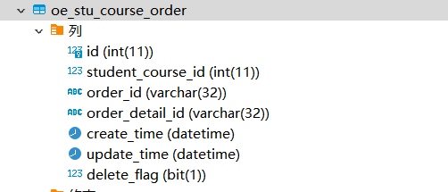

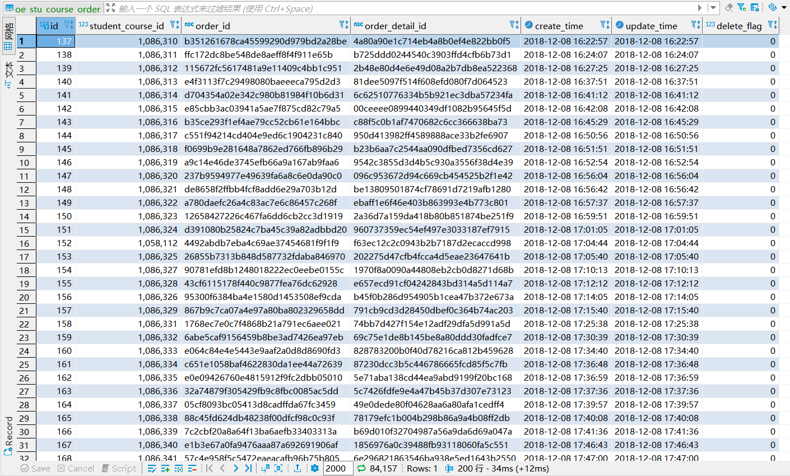

### 表关系

表之间的关联关系如下图

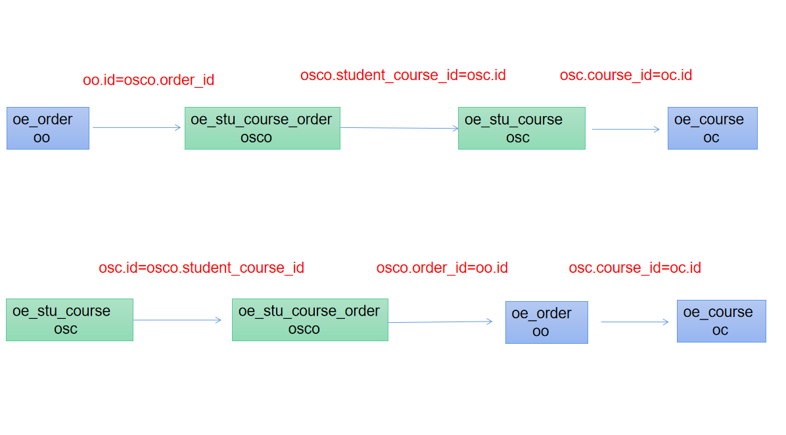

## 分层设计

与营收业绩整体情况看板相同

### ODS层

通过flinkcdc将mysql数据（在node1上）同步到hudi的ODS层,同时会在hive中自动创建对应表。ODS层存储的是原始数据,没有进行更改。

### DWD层

将ods层数据进行清洗转换，并将需求涉及的表进行拉宽，数据粒度保持不变。

**拉宽时注意**，并不是所有关联到的表都进行拉宽，而且只拉宽一对一关系的表，对于有一对多关系的，则不拉宽。因为一对多关系会使主表的条数增多 。

### DWS层

在DWD层的基础上，按照业务的要求进行数据处理（如聚合、条件筛选等）。

## 实现

### Mysql-FlinkCDC

在flinksql客户端创建mysql表的映射表（共5张表）,这些表在营收业绩整体情况看板中均已创建(如中途未关闭flink sq-client客户端，此处便可不必重复创建)

#### oe_course

（之前看板已创建）

```sql
CREATE TABLE if not exists mysql_bxg_oe_course (
    `id` INT,
    `grade_name` STRING,
    `bigimg_path` STRING,
    `video_url` STRING,
    `img_alt` STRING,
    `description` STRING,
    `detailimg_path` STRING,
    `smallimg_path` STRING,
    `sort` INT,
    `status` STRING,
    `learnd_count` INT,
    `learnd_count_flag` INT,
    `original_cost` DECIMAL(10,2),
    `current_price` DECIMAL(10,2),
    `course_length` DECIMAL(10,2),
    `menu_id` INT,
    `is_free` BOOLEAN,
    `course_detail` STRING,
    `course_detail_mobile` STRING,
    `course_detail1` STRING,
    `course_detail1_mobile` STRING,
    `course_plan_detail` STRING,
    `course_plan_detail_mobile` STRING,
    `course_detail2` STRING,
    `course_detail2_mobile` STRING,
    `course_outline` STRING,
    `common_problem` STRING,
    `common_problem_mobile` STRING,
    `lecturer_id` INT,
    `is_recommend` INT,
    `recommend_sort` INT,
    `qqno` STRING,
    `description_show` INT,
    `rec_img_path` STRING,
    `pv` INT,
    `course_type` INT,
    `default_student_count` INT,
    `study_status` INT,
    `online_course` INT,
    `course_level` INT,
    `content_type` INT,
    `recommend_type` INT,
    `employment_rate` STRING,
    `employment_salary` STRING,
    `score` STRING,
    `cover_url` STRING,
    `offline_course_url` STRING,
    `outline_url` STRING,
    `project_page_url` STRING,
    `preschool_test_flag` BOOLEAN,
    `service_period` INT,
    `included_validity_period` TINYINT,
    `validity_period` INT,
    `qualified_jobs` STRING,
    `work_year_min` INT,
    `work_year_max` INT,
    `promote_flag` BOOLEAN,
    `create_person` STRING,
    `update_person` STRING,
    `create_time` TIMESTAMP(3),
    `update_time` TIMESTAMP(3),
    `is_delete` BOOLEAN,
    PRIMARY KEY (`id`) NOT ENFORCED
) WITH (
    'connector'= 'mysql-cdc',
    'hostname'= 'node1',
    'port'= '3306',
    'username'= 'root',
    'password'='123456',
    'server-time-zone'= 'Asia/Shanghai',
    'debezium.snapshot.mode'='initial',
    'database-name'= 'bxg',
    'table-name'= 'oe_course'
);
```

#### oe_order

（之前看板已创建）

```sql
CREATE TABLE if not exists mysql_bxg_oe_order (
    `id` STRING,
    `channel` STRING,
    `student_id` STRING,
    `order_no` STRING,
    `total_amount` DECIMAL(10,2),
    `discount_amount` DECIMAL(10,2),
    `charge_against_amount` DECIMAL(10,2),
    `payable_amount` DECIMAL(10,2),
    `status` TINYINT,
    `pay_status` TINYINT,
    `pay_time` TIMESTAMP(3),
    `paid_amount` DECIMAL(10,2),
    `effective_date` TIMESTAMP(3),
    `terminal` TINYINT,
    `refund_status` TINYINT,
    `refund_amount` DECIMAL(10,2),
    `refund_time` TIMESTAMP(3),
    `create_time` TIMESTAMP(3),
    `update_time` TIMESTAMP(3),
    `delete_flag` BOOLEAN,
    PRIMARY KEY (id) NOT ENFORCED
) WITH (
    'connector' = 'mysql-cdc',
    'hostname' = 'node1',
    'port' = '3306',
    'username' = 'root',
    'password' = '123456',
    'server-time-zone'= 'Asia/Shanghai',
    'debezium.snapshot.mode'='initial',
    'database-name'= 'bxg',
    'table-name' = 'oe_order'
);
```

#### oe_order_transfer_apply

```sql
CREATE TABLE if not exists mysql_bxg_oe_order_transfer_apply (
  `id` INT,
  `order_id` STRING,
  `order_detail_id` STRING,
  `deposit_id` STRING,
  `cash_back_record_id` INT,
  `student_id` STRING,
  `course_id` INT,
  `stu_course_id` INT,
  `order_refund_id` INT,
  `original_stu_course_status` TINYINT,
  `original_order_refund_status` TINYINT,
  `biz_type` TINYINT,
  `oa_affair_id` STRING,
  `oa_summary_id` STRING,
  `oa_template_code` STRING,
  `oa_template_id` STRING,
  `oa_bill_no` STRING,
  `fee_transfer_type` TINYINT,
  `amount` DECIMAL(10,2),
  `status` TINYINT,
  `order_type` TINYINT,
  `target_order_id` STRING,
  `target_order_detail_id` STRING,
  `target_import_order_id` INT,
  `target_order_type` TINYINT,
  `creator` STRING,
  `creator_name` STRING,
  `create_time` TIMESTAMP(3),
  `update_time` TIMESTAMP(3),
  `delete_flag` BOOLEAN,
PRIMARY KEY (`id`) NOT ENFORCED
 ) WITH (
          'connector'= 'mysql-cdc',
          'hostname'= 'node1',
          'port'= '3306',
          'username'= 'root',
          'password'='123456',
          'server-time-zone'= 'Asia/Shanghai',
          'debezium.snapshot.mode'='initial',
          'database-name'= 'bxg',
          'table-name'= 'oe_order_transfer_apply'
          );
```

#### oe_stu_course

（之前看板已创建）

```sql
CREATE TABLE if not exists mysql_bxg_oe_stu_course (
    `id` INT,
    `student_id` STRING,
    `course_id` INT,
    `status` TINYINT,
    `contract_status` TINYINT,
    `learn_status` TINYINT,
    `service_days` SMALLINT,
    `service_expires` TIMESTAMP(3),
    `validity_days` INT,
    `validity_expires` TIMESTAMP(3),
    `terminate_cause` TINYINT,
    `effective_date` TIMESTAMP(3),
    `finished_time` TIMESTAMP(3),
    `total_progress` DECIMAL(10,2),
    `purchase_time` INT,
    `create_time` TIMESTAMP(3),
    `update_time` TIMESTAMP(3),
    `delete_flag` BOOLEAN,
    PRIMARY KEY (`id`) NOT ENFORCED
) WITH (
    'connector'= 'mysql-cdc',
    'hostname'= 'node1',
    'port'= '3306',
    'username'= 'root',
    'password'='123456',
    'server-time-zone'= 'Asia/Shanghai',
    'debezium.snapshot.mode'='initial',
    'database-name'= 'bxg',
    'table-name'= 'oe_stu_course'
);
```

#### oe_stu_course_order

（之前看板已创建）

```sql
CREATE TABLE if not exists mysql_bxg_oe_stu_course_order (
    `id` INT,
    `student_course_id` INT,
    `order_id` STRING,
    `order_detail_id` STRING,
    `create_time` TIMESTAMP(3),
    `update_time` TIMESTAMP(3),
    `delete_flag` BOOLEAN,
    PRIMARY KEY (`id`) NOT ENFORCED
) WITH (
    'connector'= 'mysql-cdc',
    'hostname'= 'node1',
    'port'= '3306',
    'username'= 'root',
    'password'='123456',
    'server-time-zone'= 'Asia/Shanghai',
    'debezium.snapshot.mode'='initial',
    'database-name'= 'bxg',
    'table-name'= 'oe_stu_course_order'
);
```

### ODS层

设置checkpoint:

set execution.checkpointing.interval=30sec; 

#### 创建hudi映射表

在flink客户端创建hudi映射表

##### oe_course

(之前看板已创建)

```sql
CREATE TABLE if not exists hudi_bxg_ods_oe_course(
    `id` INT,
    `grade_name` STRING,
    `bigimg_path` STRING,
    `video_url` STRING,
    `img_alt` STRING,
    `description` STRING,
    `detailimg_path` STRING,
    `smallimg_path` STRING,
    `sort` INT,
    `status` STRING,
    `learnd_count` INT,
    `learnd_count_flag` INT,
    `original_cost` DECIMAL(10,2),
    `current_price` DECIMAL(10,2),
    `course_length` DECIMAL(10,2),
    `menu_id` INT,
    `is_free` BOOLEAN,
    `course_detail` STRING,
    `course_detail_mobile` STRING,
    `course_detail1` STRING,
    `course_detail1_mobile` STRING,
    `course_plan_detail` STRING,
    `course_plan_detail_mobile` STRING,
    `course_detail2` STRING,
    `course_detail2_mobile` STRING,
    `course_outline` STRING,
    `common_problem` STRING,
    `common_problem_mobile` STRING,
    `lecturer_id` INT,
    `is_recommend` INT,
    `recommend_sort` INT,
    `qqno` STRING,
    `description_show` INT,
    `rec_img_path` STRING,
    `pv` INT,
    `course_type` INT,
    `default_student_count` INT,
    `study_status` INT,
    `online_course` INT,
    `course_level` INT,
    `content_type` INT,
    `recommend_type` INT,
    `employment_rate` STRING,
    `employment_salary` STRING,
    `score` STRING,
    `cover_url` STRING,
    `offline_course_url` STRING,
    `outline_url` STRING,
    `project_page_url` STRING,
    `preschool_test_flag` BOOLEAN,
    `service_period` INT,
    `included_validity_period` INT,
    `validity_period` INT,
    `qualified_jobs` STRING,
    `work_year_min` INT,
    `work_year_max` INT,
    `promote_flag` BOOLEAN,
    `create_person` STRING,
    `update_person` STRING,
    `create_time` TIMESTAMP(3),
    `update_time` TIMESTAMP(3),
    `is_delete` BOOLEAN,
   PRIMARY KEY (id) NOT ENFORCED
) WITH(
    'connector'='hudi'
    ,'path'= 'hdfs://node1:8020/hudi/bxg/ods_oe_course'
    ,'hoodie.datasource.write.recordkey.field'= 'id' 
    ,'write.tasks'= '1'
    ,'compaction.tasks'= '1'
    ,'write.rate.limit'= '2000' 
    ,'table.type'= 'MERGE_ON_READ' 
    ,'compaction.async.enabled'= 'true' 
    ,'compaction.trigger.strategy'= 'num_commits' 
    ,'compaction.delta_commits'= '1'
    ,'changelog.enabled'= 'true' 
    ,'read.tasks' = '1'
,'read.streaming.enabled'= 'true'
,'read.start-commit'='earliest' 
,'read.streaming.check-interval'= '3'
,'hive_sync.enable'= 'true' 
,'hive_sync.mode'= 'hms' 
,'hive_sync.metastore.uris'= 'thrift://node1:9083'
,'hive_sync.table'= 'ods_oe_course'
,'hive_sync.db'= 'bxg' 
,'hive_sync.username'= '' 
,'hive_sync.password'= '' 
    ,'hive_sync.support_timestamp'= 'true' 
);
```

##### oe_order

(之前看板已创建)

```sql
CREATE TABLE if not exists hudi_bxg_ods_oe_order (
    `id` STRING,
    `channel` STRING,
    `student_id` STRING,
    `order_no` STRING,
    `total_amount` DECIMAL(10,2),
    `discount_amount` DECIMAL(10,2),
    `charge_against_amount` DECIMAL(10,2),
    `payable_amount` DECIMAL(10,2),
    `status` INT,
    `pay_status` INT,
    `pay_time` TIMESTAMP(3),
    `paid_amount` DECIMAL(10,2),
    `effective_date` TIMESTAMP(3),
    `terminal` INT,
    `refund_status` INT,
    `refund_amount` DECIMAL(10,2),
    `refund_time` TIMESTAMP(3),
    `create_time` TIMESTAMP(3),
    `update_time` TIMESTAMP(3),
    `delete_flag` BOOLEAN,
   PRIMARY KEY (id) NOT ENFORCED
) WITH(
    'connector'='hudi'
    ,'path'= 'hdfs://node1:8020/hudi/bxg/ods_oe_order'
    ,'hoodie.datasource.write.recordkey.field'= 'id' 
    ,'write.tasks'= '1'
    ,'compaction.tasks'= '1'
    ,'write.rate.limit'= '2000' 
    ,'table.type'= 'MERGE_ON_READ' 
    ,'compaction.async.enabled'= 'true' 
    ,'compaction.trigger.strategy'= 'num_commits' 
    ,'compaction.delta_commits'= '1'
    ,'changelog.enabled'= 'true' 
    ,'read.tasks' = '1'
    ,'read.streaming.enabled'= 'true' 
    ,'read.start-commit'='earliest'
    ,'read.streaming.check-interval'= '3'
    ,'hive_sync.enable'= 'true' 
    ,'hive_sync.mode'= 'hms' 
    ,'hive_sync.metastore.uris'= 'thrift://node1:9083'
    ,'hive_sync.table'= 'ods_oe_order'
    ,'hive_sync.db'= 'bxg' 
    ,'hive_sync.username'= '' 
    ,'hive_sync.password'= '' 
    ,'hive_sync.support_timestamp'= 'true' 
);
```

##### oe_order_transfer_apply

```sql
CREATE TABLE IF NOT EXISTS `hudi_bxg_ods_oe_order_transfer_apply` (
    `id` INT,
    `order_id` STRING,
    `order_detail_id` STRING,
    `deposit_id` STRING,
    `cash_back_record_id` INT,
    `student_id` STRING,
    `course_id` INT,
    `stu_course_id` INT,
    `order_refund_id` INT,
    `original_stu_course_status` INT,
    `original_order_refund_status` INT,
    `biz_type` INT,
    `oa_affair_id` STRING,
    `oa_summary_id` STRING,
    `oa_template_code` STRING,
    `oa_template_id` STRING,
    `oa_bill_no` STRING,
    `fee_transfer_type` INT,
    `amount` DECIMAL(10,2),
    `status` INT,
    `order_type` INT,
    `target_order_id` STRING,
    `target_order_detail_id` STRING,
    `target_import_order_id` INT,
    `target_order_type` INT,
    `creator` STRING,
    `creator_name` STRING,
    `create_time` TIMESTAMP(3),
    `update_time` TIMESTAMP(3),
    `delete_flag` BOOLEAN,
    PRIMARY KEY ( `id` ) NOT ENFORCED
) WITH(
    'connector'='hudi'
    ,'path'= 'hdfs://node1:8020/hudi/bxg/ods_oe_order_transfer_apply'
    ,'hoodie.datasource.write.recordkey.field'= 'id' 
    ,'write.tasks'= '1'
    ,'compaction.tasks'= '1'
    ,'write.rate.limit'= '2000' 
    ,'table.type'= 'MERGE_ON_READ' 
    ,'compaction.async.enabled'= 'true' 
    ,'compaction.trigger.strategy'= 'num_commits' 
    ,'compaction.delta_commits'= '1'
    ,'changelog.enabled'= 'true' 
    ,'read.tasks' = '1'
    ,'read.streaming.enabled'= 'true' 
    ,'read.start-commit'='earliest'
    ,'read.streaming.check-interval'= '3'
    ,'hive_sync.enable'= 'true' 
    ,'hive_sync.mode'= 'hms' 
    ,'hive_sync.metastore.uris'= 'thrift://node1:9083'
    ,'hive_sync.table'= 'ods_oe_order_transfer_apply'
    ,'hive_sync.db'= 'bxg' 
    ,'hive_sync.username'= '' 
    ,'hive_sync.password'= '' 
    ,'hive_sync.support_timestamp'= 'true' 
);
```

##### oe_stu_course

(之前看板已创建)

```sql
CREATE TABLE if not exists hudi_bxg_ods_oe_stu_course (
    `id` INT,
    `student_id` STRING,
    `course_id` INT,
    `status` INT,
    `contract_status` INT,
    `learn_status` INT,
    `service_days` INT,
    `service_expires` TIMESTAMP(3),
    `validity_days` INT,
    `validity_expires` TIMESTAMP(3),
    `terminate_cause` INT,
    `effective_date` TIMESTAMP(3),
    `finished_time` TIMESTAMP(3),
    `total_progress` DECIMAL(10,2),
    `purchase_time` INT,
    `create_time` TIMESTAMP(3),
    `update_time` TIMESTAMP(3),
    `delete_flag` BOOLEAN,
   PRIMARY KEY (id) NOT ENFORCED
) WITH(
    'connector'='hudi'
    ,'path'= 'hdfs://node1:8020/hudi/bxg/ods_oe_stu_course'
    ,'hoodie.datasource.write.recordkey.field'= 'id' 
    ,'write.tasks'= '1'
    ,'compaction.tasks'= '1'
    ,'write.rate.limit'= '2000' 
    ,'table.type'= 'MERGE_ON_READ' 
    ,'compaction.async.enabled'= 'true' 
    ,'compaction.trigger.strategy'= 'num_commits' 
    ,'compaction.delta_commits'= '1'
    ,'changelog.enabled'= 'true' 
    ,'read.tasks' = '1'
    ,'read.streaming.enabled'= 'true' 
    ,'read.start-commit'='earliest'
    ,'read.streaming.check-interval'= '3'
    ,'hive_sync.enable'= 'true' 
    ,'hive_sync.mode'= 'hms' 
    ,'hive_sync.metastore.uris'= 'thrift://node1:9083'
    ,'hive_sync.table'= 'ods_oe_stu_course'
    ,'hive_sync.db'= 'bxg' 
    ,'hive_sync.username'= '' 
    ,'hive_sync.password'= '' 
    ,'hive_sync.support_timestamp'= 'true' 
);
```

##### oe_stu_course_order

(之前看板已创建)

```sql
CREATE TABLE if not exists hudi_bxg_ods_oe_stu_course_order (
    `id` INT,
    `student_course_id` INT,
    `order_id` STRING,
    `order_detail_id` STRING,
    `create_time` TIMESTAMP(3),
    `update_time` TIMESTAMP(3),
    `delete_flag` BOOLEAN,
   PRIMARY KEY (id) NOT ENFORCED
) WITH(
    'connector'='hudi'
    ,'path'= 'hdfs://node1:8020/hudi/bxg/ods_oe_stu_course_order'
    ,'hoodie.datasource.write.recordkey.field'= 'id' 
    ,'write.tasks'= '1'
    ,'compaction.tasks'= '1'
    ,'write.rate.limit'= '2000' 
    ,'table.type'= 'MERGE_ON_READ' 
    ,'compaction.async.enabled'= 'true' 
    ,'compaction.trigger.strategy'= 'num_commits' 
    ,'compaction.delta_commits'= '1'
    ,'changelog.enabled'= 'true' 
    ,'read.tasks' = '1'
    ,'read.streaming.enabled'= 'true' 
    ,'read.start-commit'='earliest'
    ,'read.streaming.check-interval'= '3'
    ,'hive_sync.enable'= 'true' 
    ,'hive_sync.mode'= 'hms' 
    ,'hive_sync.metastore.uris'= 'thrift://node1:9083'
    ,'hive_sync.table'= 'ods_oe_stu_course_order'
    ,'hive_sync.db'= 'bxg' 
    ,'hive_sync.username'= '' 
    ,'hive_sync.password'= '' 
    ,'hive_sync.support_timestamp'= 'true' 
);
```

#### 插入数据

##### oe_course

```sql
INSERT INTO `hudi_bxg_ods_oe_course`
select  id, grade_name, bigimg_path, video_url, img_alt, description, detailimg_path, smallimg_path, sort, status, learnd_count, learnd_count_flag, original_cost, current_price, course_length, menu_id, is_free, course_detail, course_detail_mobile, course_detail1, course_detail1_mobile, course_plan_detail, course_plan_detail_mobile, course_detail2, course_detail2_mobile, course_outline, common_problem, common_problem_mobile, lecturer_id, is_recommend, recommend_sort, qqno, description_show, rec_img_path, pv, course_type, default_student_count, study_status, online_course, course_level, content_type, recommend_type, employment_rate, employment_salary, score, cover_url, offline_course_url, outline_url, project_page_url, preschool_test_flag, service_period, included_validity_period, validity_period, qualified_jobs, work_year_min, work_year_max, promote_flag, create_person, update_person, create_time, update_time, is_delete from `mysql_bxg_oe_course`;
```

##### oe_order

```sql
INSERT INTO `hudi_bxg_ods_oe_order` 
SELECT  `id`, `channel`, `student_id`, `order_no`, `total_amount`, `discount_amount`, `charge_against_amount`, `payable_amount`, `status`, `pay_status`, `pay_time`, `paid_amount`, `effective_date`, `terminal`, `refund_status`, `refund_amount`, `refund_time`, `create_time`, `update_time`, `delete_flag` FROM `mysql_bxg_oe_order`;
```

##### oe_stu_course_order

```sql
INSERT INTO `hudi_bxg_ods_oe_stu_course_order` 
SELECT `id`, `student_course_id`, `order_id`, `order_detail_id`, `create_time`, `update_time`, `delete_flag`
FROM `mysql_bxg_oe_stu_course_order`;
```

##### oe_order_transfer_apply

```sql
INSERT INTO `hudi_bxg_ods_oe_order_transfer_apply` 
SELECT `id`,`order_id` ,`order_detail_id`,`deposit_id`,`cash_back_record_id` ,`student_id` ,`course_id`,`stu_course_id` ,`order_refund_id` ,`original_stu_course_status` ,`original_order_refund_status` ,`biz_type`,`oa_affair_id`,`oa_summary_id` ,`oa_template_code` ,`oa_template_id`,`oa_bill_no`,`fee_transfer_type` ,`amount`,`status`,`order_type` ,`target_order_id`,`target_order_detail_id` ,`target_import_order_id`,`target_order_type` ,`creator` ,`creator_name`,`create_time`,`update_time`,`delete_flag`  FROM `mysql_bxg_oe_order_transfer_apply`;
```

##### oe_stu_course

```sql
INSERT INTO `hudi_bxg_ods_oe_stu_course` 
SELECT  id, student_id, course_id, status, contract_status, learn_status, service_days, service_expires, validity_days, validity_expires, terminate_cause, effective_date, finished_time, total_progress, purchase_time, create_time, update_time, delete_flag FROM `mysql_bxg_oe_stu_course`;
```

#### 查看结果

##### 查看Flink web界面

浏览器地址：[http://192.168.88.161:8081/\#/overview](http://192.168.88.161:8081/#/overview)

可以看到正在运行的作业

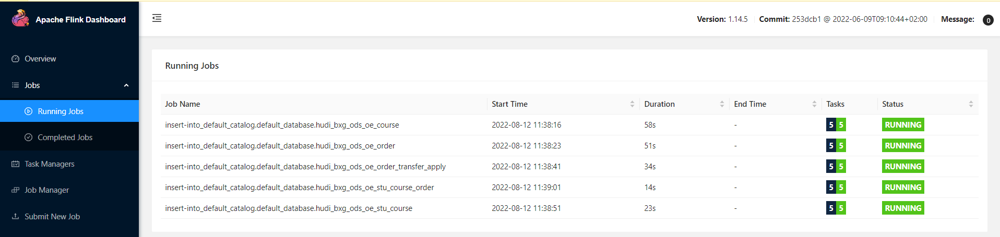

##### 查看文件

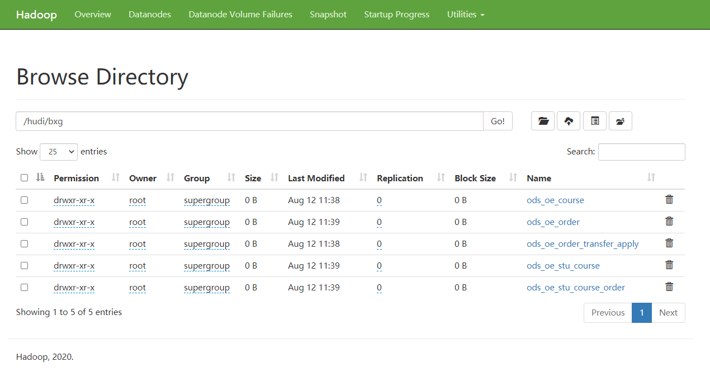

##### 查看表数据

在hive的数据库查看表数据

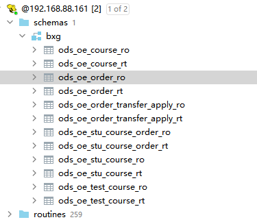

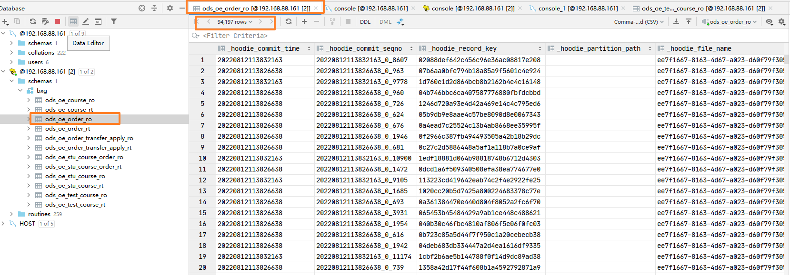

核对Mysql中的该表的数据条数,二者一致即同步完毕;

### DWD层

#### 宽表设计

##### 表关系

指标：2020-2022年各课程类型的全款订单量、2020-2022年各课程类型的全款金额

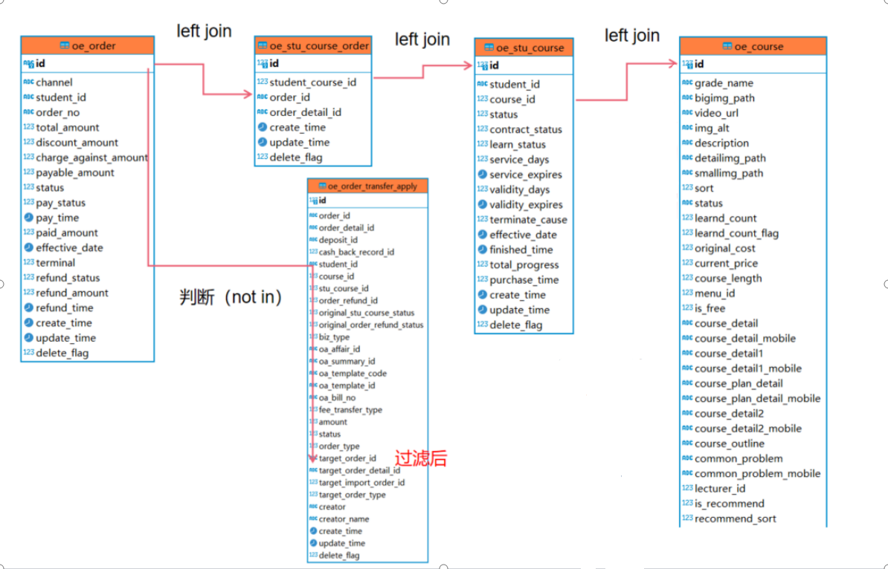

指标：2022年职业课各课程的全款订单量详情表、在线就业班成交均价分析、年度会员成交均价分析、2022年职业课各课程成交均价详情表

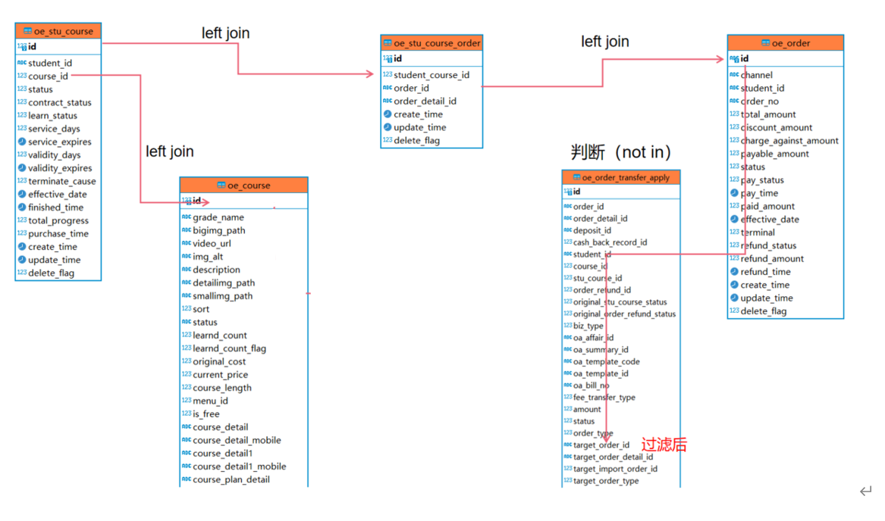

##### 分析

**指标：**2020-2022年各课程类型的全款订单量、2020-2022年各课程类型的全款金额

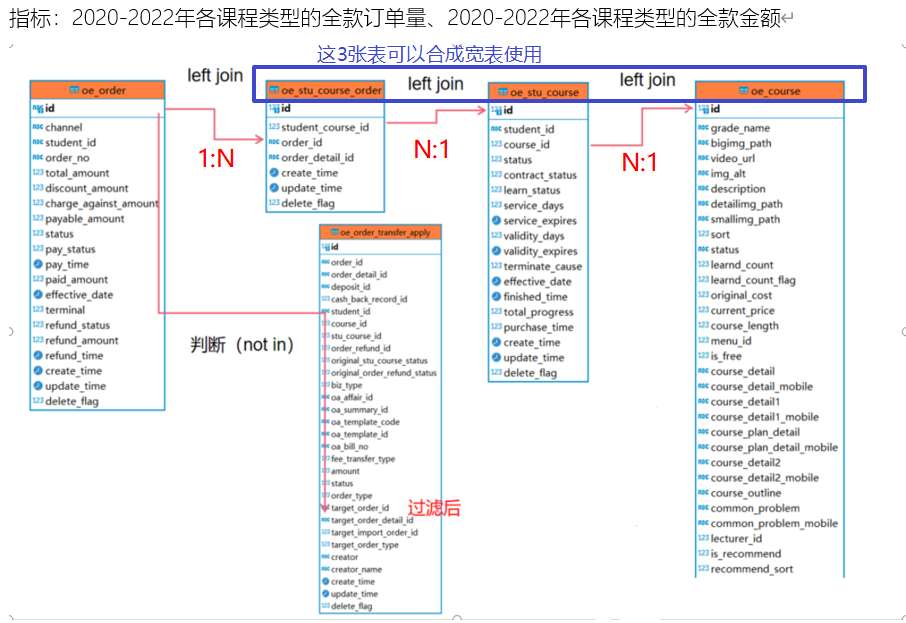

根据上图分析:

第一张宽表：深蓝框内,主从表关联字段对应N:1，以oe_stu_course_order为主表的关联的3张表可以作为第1张宽表使用，而相近宽表在《03_营收业绩情况看板》中已经制作,宽表为

hudi_dwd_oe_stu_course_order, 这里可以延续使用,使用时要注意宽表字段跟现有计算指标对应,本次使用时增加3个字段涉及ods层hudi_bxg_ods_oe_course表的id字段’oc_id’, hudi_bxg_ods_oe_order表的 `terminal`字段和`charge_against_amount`字段以及`bxg_common_change_classes_v`表中通过条件处理`is_target_order`字段。

第二张宽表：以oe_order为主表与oe_order_transfer_apply进行left join，对关联字段target_order_id去重，关联字段对应1:1关系，可以合成第二张宽表,实现与not in同样的效果。

**指标：**2022年职业课各课程的全款订单量详情表、在线就业班成交均价分析、年度会员成交均价分析、2022年职业课各课程成交均价详情表

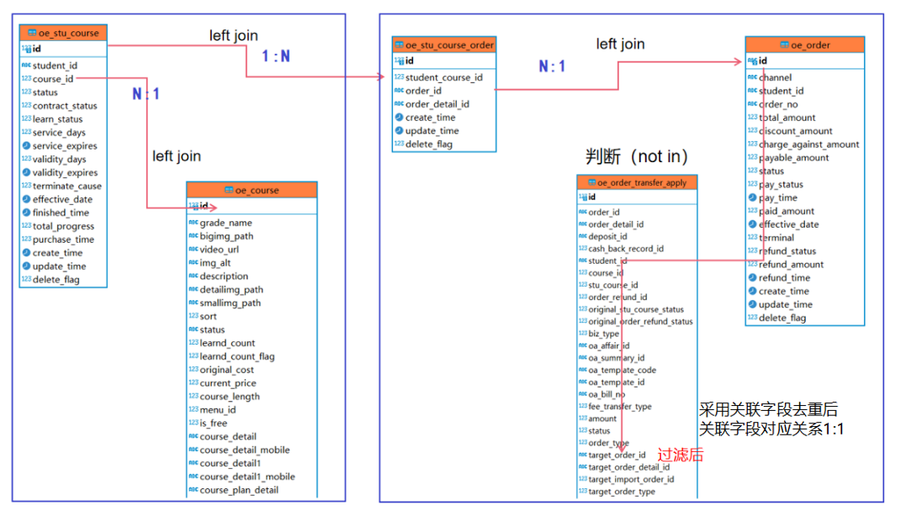

根据上图分析

第一张宽表：深蓝框内,主从表关联字段对应N:1或1:1关系, 以oe_stu_course为主表,与oe_course合成宽表,该表在《04_回车课堂关键环节分析看板》中已经创建,在原宽表基础上letf join oe_course表，合成新宽表hudi_dwd_oe_stu_course，该表在保留原有宽表信息基础关联其他表；
第二张宽表：以oe_stu_course_order为主表,与其他表进行关联,该表在《指标：2020-2022年各课程类型的全款订单量、2020-2022年各课程类型的全款金额》中已使用宽表hudi_dwd_oe_stu_course_order,只需原有基础上与oe_order_transfer_apply进行left join，对关联字段target_order_id去重，关联字段对应1:1关系，可以合成第二张宽表,实现与not in同样的效果。由于《指标：2020-2022年各课程类型的全款订单量、2020-2022年各课程类型的全款金额》中使用也使用该宽表，直接保留该最多字段宽表即可。

#### 宽表实现

##### Hudi DWD层

在bxg库下创建以下3张表

###### dwd_oe_stu_course_order

（将之前同名表删掉,后续保留最多字段的宽表使用即可）

```sql
-- 创建视图
CREATE VIEW IF NOT EXISTS bxg_common_change_classes_v AS SELECT distinct(target_order_id)  FROM `hudi_bxg_ods_oe_order_transfer_apply` t
 WHERE t.biz_type = 1 AND t.status = 0 AND t.fee_transfer_type=0 AND t.delete_flag = false;
-- 创建hudi_dwd_oe_stu_course_order映射表
CREATE TABLE if not exists hudi_dwd_oe_stu_course_order(
     `id` int,
     `stu_course_id` int,
     `order_id` string,
     `course_id` int,
     `stu_course_status`      int,
     `stu_course_delete_flag` BOOLEAN,
     `effective_date` TIMESTAMP(3),
     `payable_amount` decimal(10,2),
     `pay_status`  int,
     `pay_time`    TIMESTAMP(3),
     `paid_amount` decimal(10,2),
     `refund_status` int,
     `order_delete_flag` boolean,
     `terminal` int,
     `charge_against_amount` DECIMAL(10,2),
     `oc_id` int,
     `grade_name` string,
     `course_type` int,
     `is_complete_order` boolean,
     `is_target_order` boolean,
     PRIMARY KEY (`id`) NOT ENFORCED
) WITH(
    'connector'='hudi'
    ,'path'= 'hdfs://node1:8020/hudi/bxg/dwd_oe_stu_course_order'
    ,'hoodie.datasource.write.recordkey.field'= 'id' 
    ,'write.tasks'= '1'
    ,'compaction.tasks'= '1'
    ,'write.rate.limit'= '2000' 
    ,'table.type'= 'MERGE_ON_READ' 
    ,'compaction.async.enabled'= 'true' 
    ,'compaction.trigger.strategy'= 'num_commits' 
    ,'compaction.delta_commits'= '1'
    ,'changelog.enabled'= 'true' 
    ,'read.tasks' = '1'
    ,'read.streaming.enabled'= 'true' 
    ,'read.start-commit'='earliest'
    ,'read.streaming.check-interval'= '3'
    ,'hive_sync.enable'= 'true' 
    ,'hive_sync.mode'= 'hms' 
    ,'hive_sync.metastore.uris'= 'thrift://node1:9083'
    ,'hive_sync.table'= 'dwd_oe_stu_course_order'
    ,'hive_sync.db'= 'bxg' 
    ,'hive_sync.username'= '' 
    ,'hive_sync.password'= '' 
    ,'hive_sync.support_timestamp'= 'true' 
);

-- 插入数据
insert into hudi_dwd_oe_stu_course_order
SELECT
    `osco`.`id`,
    `osco`.`student_course_id`,
    `osco`.`order_id`,
    `osc`.`course_id`,
    `osc`.`status`        as `stu_course_status`,
    `osc`.`delete_flag`  as `stu_course_delete_flag`,
    `osc`.`effective_date`,
    `oo`.`payable_amount`,
    `oo`.`pay_status`,
    `oo`.`pay_time`,
    `oo`.`paid_amount`,
    `oo`.`refund_status`,
    `oo`.`delete_flag`   as `order_delete_flag`,
    `oo`.`terminal`,
    `oo`.`charge_against_amount`,
    `oc`.`id`             as `oc_id`,
    `oc`.`grade_name`,
    `oc`.`course_type`,
    if (oo.`payable_amount`>0 and `oo`.`pay_status`=2 and `oo`.`delete_flag` = false and `osc`.`delete_flag` = false, true, false) as is_complete_order,
if (`ccv`.`target_order_id` is not null, true, false) AS `is_target_order`
FROM hudi_bxg_ods_oe_stu_course_order AS osco
LEFT JOIN hudi_bxg_ods_oe_stu_course AS osc
ON osc.id = osco.student_course_id
LEFT JOIN hudi_bxg_ods_oe_order AS oo
ON oo.id = osco.order_id
LEFT JOIN hudi_bxg_ods_oe_course AS oc
ON oc.id = osc.course_id
LEFT JOIN `bxg_common_change_classes_v` AS `ccv`
ON `oo`.`id`=`ccv`.`target_order_id`;
```

查看Flink监控页面任务情况:

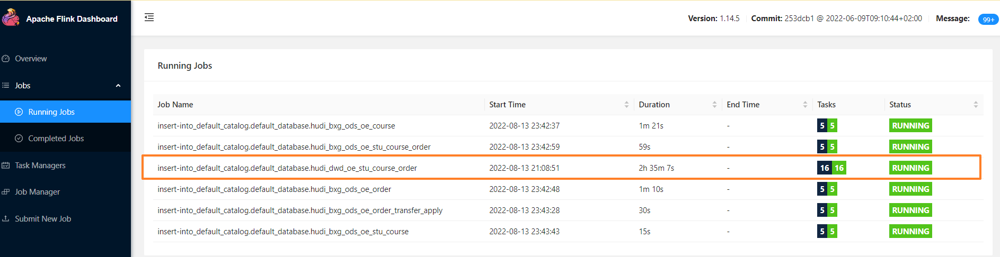

查看写入情况:

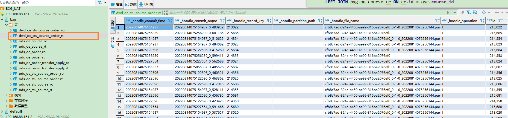

###### dwd_oe_order

```sql
-- 创建hudi_dwd_oe_order 映射表
CREATE TABLE if not exists hudi_dwd_oe_order(
`id`   STRING
,`channel`   STRING
,`student_id`   STRING
,`order_no`   STRING
,`total_amount`   DECIMAL(10,2)
,`discount_amount`   DECIMAL(10,2)
,`charge_against_amount`   DECIMAL(10,2)
,`payable_amount`   DECIMAL(10,2)
,`status`   INT
,`pay_status`   INT
,`pay_time`   TIMESTAMP(3)
,`paid_amount`   DECIMAL(10,2)
,`effective_date`   TIMESTAMP(3)
,`terminal`   INT
,`refund_status`   INT
,`refund_amount`   DECIMAL(10,2)
,`refund_time`   TIMESTAMP(3)
,`create_time`   TIMESTAMP(3)
,`update_time`   TIMESTAMP(3)
,`delete_flag`   BOOLEAN
,`is_target_order`  BOOLEAN
,PRIMARY KEY (`id`) NOT ENFORCED
) WITH(
    'connector'='hudi'
    ,'path'= 'hdfs://node1:8020/hudi/bxg/dwd_oe_order'
    ,'hoodie.datasource.write.recordkey.field'= 'id'
    ,'write.tasks'= '1'
    ,'compaction.tasks'= '1'
    ,'write.rate.limit'= '2000'
    ,'table.type'= 'MERGE_ON_READ'
    ,'compaction.async.enabled'= 'true'
    ,'compaction.trigger.strategy'= 'num_commits'
    ,'compaction.delta_commits'= '1'
    ,'changelog.enabled'= 'true'
    ,'read.tasks' = '1'
    ,'read.streaming.enabled'= 'true'
    ,'read.start-commit'='earliest'
    ,'read.streaming.check-interval'= '3'
    ,'hive_sync.enable'= 'true'
    ,'hive_sync.mode'= 'hms'
    ,'hive_sync.metastore.uris'= 'thrift://node1:9083'
    ,'hive_sync.table'= 'dwd_oe_order'
    ,'hive_sync.db'= 'bxg'
    ,'hive_sync.username'= ''
    ,'hive_sync.password'= ''
    ,'hive_sync.support_timestamp'= 'true'
);

-- 插入数据
INSERT INTO `hudi_dwd_oe_order`
SELECT  `id`,`channel`,`student_id`,`order_no`,`total_amount`,`discount_amount`,`charge_against_amount`, `payable_amount`,`status`, `pay_status`, `pay_time`, `paid_amount`,`effective_date`,`terminal`,`refund_status`,`refund_amount`,`refund_time`,`create_time`,`update_time`, `delete_flag`,
if (`ccv`.`target_order_id` is not null, true, false) AS `is_target_order`
FROM `mysql_bxg_oe_order` AS `oo`
LEFT JOIN `bxg_common_change_classes_v` AS `ccv`
ON `oo`.`id`=`ccv`.`target_order_id`;

```

查看Flink监控页面任务情况：

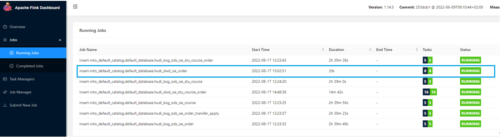

查看写入情况

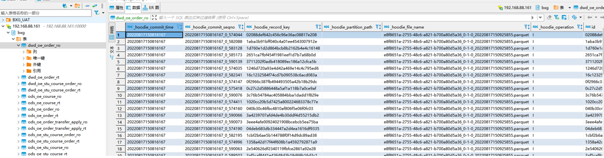

###### dwd_oe_stu_course

（将之前同名表删掉,后续保留最多字段的宽表使用即可）

创建hudi_dwd_oe_stu_course映射表

```sql
CREATE TABLE if not exists hudi_dwd_oe_stu_course(
 `id`                 INT
,`oc_id`              INT
,`grade_name`         STRING
,`course_type`        INT
,`student_id`  string
,`status`   int
,`effective_date` timestamp(3)
,`finished_time` timestamp(3) 
,`delete_flag` boolean
,`programming_course_id` int
,`programming_course_is_deleted` boolean
,PRIMARY KEY (`id`) NOT ENFORCED
) WITH(
    'connector'='hudi'
    ,'path'= 'hdfs://node1:8020/hudi/bxg/dwd_oe_stu_course'
    ,'hoodie.datasource.write.recordkey.field'= 'id'
    ,'write.tasks'= '1'
    ,'compaction.tasks'= '1'
    ,'write.rate.limit'= '2000'
    ,'table.type'= 'MERGE_ON_READ'
    ,'compaction.async.enabled'= 'true'
    ,'compaction.trigger.strategy'= 'num_commits'
    ,'compaction.delta_commits'= '1'
    ,'changelog.enabled'= 'true'
    ,'read.tasks' = '1'
    ,'read.streaming.enabled'= 'true'
    ,'read.start-commit'='earliest'
    ,'read.streaming.check-interval'= '3'
    ,'hive_sync.enable'= 'true'
    ,'hive_sync.mode'= 'hms'
    ,'hive_sync.metastore.uris'= 'thrift://node1:9083'
    ,'hive_sync.table'= 'dwd_oe_stu_course'
    ,'hive_sync.db'= 'bxg'
    ,'hive_sync.username'= ''
    ,'hive_sync.password'= ''
    ,'hive_sync.support_timestamp'= 'true'
);
```

插入数据(由于共用之前看板,之前宽表使用到的hudi_bxg_ods_oe_programming_course表若已创建则无需创建,若未创建需要先创建并插入数据)

```sql
CREATE TABLE if not exists mysql_bxg_oe_programming_course (
    `id` INT,
    `menu_id` INT,
    `group_id` INT,
    `belonger_id` STRING,
    `learning_gains` STRING,
    `content_status` TINYINT,
    `pack_status` TINYINT,
    `source` TINYINT,
    `type` TINYINT,
    `difficulty_level` TINYINT,
    `unlock_flag` BOOLEAN,
    `detail_flag` BOOLEAN,
    `submitter` STRING,
    `submit_time` TIMESTAMP(3),
    `auditor` STRING,
    `audit_time` TIMESTAMP(3) ,
    `first_putaway_time` TIMESTAMP(3),
    `creator` STRING,
    `create_time` TIMESTAMP(3),
    `operator` STRING,
    `update_time` TIMESTAMP(3) ,
    `is_deleted` BOOLEAN,
    PRIMARY KEY (`id`) NOT ENFORCED
) WITH (
    'connector'= 'mysql-cdc',
    'hostname'= 'node1',
    'port'= '3306',
    'username'= 'root',
    'password'='123456',
    'server-time-zone'= 'Asia/Shanghai',
    'debezium.snapshot.mode'='initial',
    'database-name'= 'bxg',
    'table-name'= 'oe_programming_course'
);
CREATE TABLE if not exists hudi_bxg_ods_oe_programming_course (
    `id` INT,
    `menu_id` INT,
    `group_id` INT,
    `belonger_id` STRING,
    `learning_gains` STRING,
    `content_status` INT,
    `pack_status` INT,
    `source` INT,
    `type` INT,
    `difficulty_level` INT,
    `unlock_flag` BOOLEAN,
    `detail_flag` BOOLEAN,
    `submitter` STRING,
    `submit_time` TIMESTAMP(3),
    `auditor` STRING,
    `audit_time` TIMESTAMP(3) ,
    `first_putaway_time` TIMESTAMP(3),
    `creator` STRING,
    `create_time` TIMESTAMP(3),
    `operator` STRING,
    `update_time` TIMESTAMP(3) ,
    `is_deleted` BOOLEAN,
   PRIMARY KEY (id) NOT ENFORCED
) WITH(
    'connector'='hudi'
    ,'path'= 'hdfs://192.168.88.161:8020/hudi/bxg/ods_oe_programming_course '
    ,'hoodie.datasource.write.recordkey.field'= 'id'  
    ,'write.tasks'= '1'
    ,'compaction.tasks'= '1'
    ,'write.rate.limit'= '2000' 
    ,'table.type'= 'MERGE_ON_READ' 
    ,'compaction.async.enabled'= 'true' 
    ,'compaction.trigger.strategy'= 'num_commits' 
    ,'compaction.delta_commits'= '1'
    ,'changelog.enabled'= 'true' 
    ,'read.tasks' = '1'
    ,'read.streaming.enabled'= 'true' 
    ,'read.start-commit'='earliest'
    ,'read.streaming.check-interval'= '3'
    ,'hive_sync.enable'= 'true' 
    ,'hive_sync.mode'= 'hms' 
    ,'hive_sync.metastore.uris'= 'thrift://192.168.88.161:9083'
    ,'hive_sync.table'= 'ods_oe_programming_course'
    ,'hive_sync.db'= 'bxg' 
    ,'hive_sync.username'= '' 
    ,'hive_sync.password'= '' 
    ,'hive_sync.support_timestamp'= 'true' 
);
INSERT INTO `hudi_bxg_ods_oe_programming_course` 
SELECT id, menu_id, group_id, belonger_id, learning_gains, content_status, pack_status, source, type, difficulty_level, unlock_flag, detail_flag, submitter, submit_time, auditor, audit_time, first_putaway_time, creator, create_time, operator, update_time, is_deleted
FROM `mysql_bxg_oe_programming_course`;

INSERT INTO hudi_dwd_oe_stu_course
SELECT
 osc.id                 as   id
,oc.id                  as   oc_id
,oc.grade_name
,oc.course_type
,osc.student_id
,osc.status 
,osc.effective_date 
,osc.finished_time 
,osc.delete_flag
,pc.id as programming_course_id
,pc.is_deleted as programming_course_is_deleted
FROM hudi_bxg_ods_oe_stu_course AS `osc`
LEFT JOIN hudi_bxg_ods_oe_programming_course AS `pc` ON pc.id=osc.course_id
LEFT JOIN hudi_bxg_ods_oe_course AS  `oc` ON oc.`id` = osc.`course_id`;

```

查看Flink监控页面任务情况:

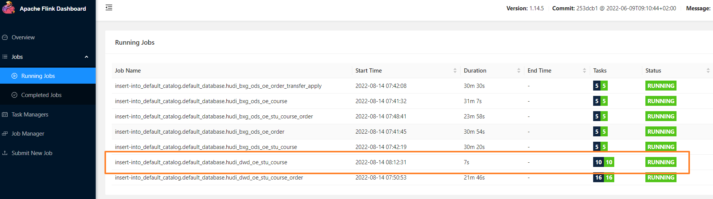

查看写入情况:

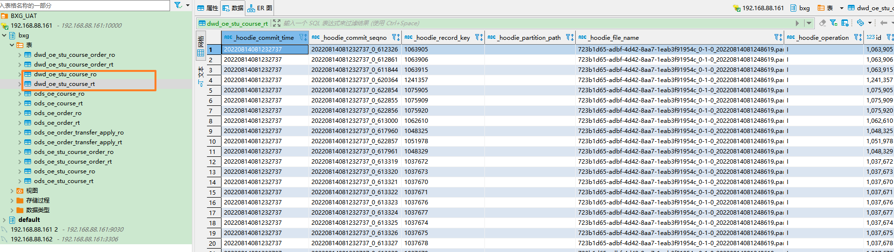

##### Doris DWD层

###### Doris建表

将数据抽取到doris中需要提前在doris中建表（hudi不需要，hudi可以自动捕获表结构）。

```sql
-- 建bxg库
CREATE DATABASE IF NOT EXISTS bxg;
-- 建dwd_oe_stu_course_order表（将之前同名表删掉,保留最多字段的即可）
CREATE TABLE IF NOT EXISTS bxg.dwd_oe_stu_course_order
(
 `id` int,
 `stu_course_id` int COMMENT '学员课程id',
 `order_id` string,
 `course_id` int COMMENT '学员购买的课程',
 `stu_course_status` int COMMENT '学员课程状态：0试学、1生效、2待生效、-1停课、8退费',
 `stu_course_delete_flag` BOOLEAN,
 `effective_date` datetime,
 `payable_amount` decimal(10,2) COMMENT '实际应付总金额=原价-优惠总额-冲抵金额',
 `pay_status` int  COMMENT '支付状态：0未支付、1部分支付、2支付完成',
 `pay_time` datetime COMMENT '最后支付完成时间',
 `paid_amount` decimal(10,2) COMMENT '当前已付总额',
 `refund_status` INT COMMENT '退费状态:0-未退费;-1-已退费;-2-退费中;-3-部分退费',
 `order_delete_flag` BOOLEAN COMMENT 'ods_bxg_oe_order表中订单是否删除',
`terminal` int,
`charge_against_amount` DECIMAL(10,2),
 `oc_id` int,
 `grade_name` string COMMENT '课程名称',
 `course_type`  int,
`is_complete_order` BOOLEAN COMMENT '实际应付总金额0且支付状态pay_status完成',
`is_target_order` boolean
)Unique Key (`id`)
DISTRIBUTED BY HASH(`id`) BUCKETS 10
PROPERTIES (
"replication_allocation" = "tag.location.default: 1"
);

-- 建dwd_oe_order表
CREATE TABLE  if not exists bxg.`dwd_oe_order` (
    `id` varchar(32) NOT NULL,
    `create_time` datetime NOT NULL COMMENT '物理入库时间，如果是补录订单，该时间为补录订单的日期，而不是学员真实缴费的日期。',
    `channel` string NOT NULL COMMENT '订单渠道来源：BXG/博学谷，目前只有博学谷，将来可能会有黑马短训、酷丁鱼等',
    `student_id` string NOT NULL COMMENT '用户ID',
    `order_no` string NOT NULL COMMENT '订单号，生成规则：年（2位）-月（2位）-日（2位）-时（2位）-随机码（12位） eg.16110910aRdK45Y86qe3',
    `total_amount` decimal(10,2) NOT NULL DEFAULT '0.00' COMMENT '原价/总价',
    `discount_amount` decimal(10,2) NOT NULL DEFAULT '0.00' COMMENT '优惠总额，有可能是优惠券优惠、也有可能是满减优惠',
    `charge_against_amount` decimal(10,2) NOT NULL DEFAULT '0.00' COMMENT '冲抵金额，目前包含报名费',
    `payable_amount` decimal(10,2) NOT NULL DEFAULT '0.00' COMMENT '实际应付总金额=原价-优惠总额-冲抵金额',
    `status` int NOT NULL DEFAULT '0' COMMENT '订单状态：0未生效、1已生效、-1已关闭。和订单支付状态区分开，因为在某些情况下学员没有支付完成订单也已经开始生效。“-1已关闭”状态代表已退费和超时关闭两种含义。',
    `pay_status` int NOT NULL COMMENT '支付状态：0未支付、1部分支付、2支付完成',
    `pay_time` datetime DEFAULT NULL COMMENT '最后支付完成时间',
    `paid_amount` decimal(10,2) NOT NULL DEFAULT '0.00' COMMENT '当前已付总额',
    `effective_date` datetime DEFAULT NULL COMMENT '订单生效日期。从该日期开始计算服务期。',
    `terminal` int NOT NULL DEFAULT '0' COMMENT '下单订单终端：0/PC官网、1/后台导入-其他、2/App、3/移动官网、4微信内、5/后台导入-线下转线上、6/ios、7/补录-系统-N12分摊转移、8/小程序(在线编程)',
    `refund_status` int NOT NULL DEFAULT '0' COMMENT '退费状态:0-未退费;-1-已退费;-2-退费中;-3-部分退费',
    `refund_amount` decimal(10,2) NOT NULL DEFAULT '0.00' COMMENT '退费金额',
    `refund_time` datetime DEFAULT NULL COMMENT '最后退费时间',
    `update_time` datetime NOT NULL,
`delete_flag` boolean NOT NULL,
`is_target_order` boolean  NOT NULL
    )  UNIQUE KEY(`id`)
    COMMENT '订单：主订单'
    DISTRIBUTED BY HASH(`id`) BUCKETS 10
    PROPERTIES (
        "replication_allocation" = "tag.location.default: 1"
               );

-- 建dwd_oe_stu_course表
CREATE TABLE IF NOT EXISTS bxg.dwd_oe_stu_course 
(
`id` int,
`oc_id`        int,
`grade_name` string COMMENT '课程名称',
`course_type`  int,
`student_id`          string COMMENT '学员',
`status`   int COMMENT '学员课程状态：0试学、1生效、2待生效、-1停课、8退费',
`effective_date` datetime   COMMENT '课程生效时间，来源于订单！注意：试学课程没有该值！！！',
`finished_time` datetime  COMMENT '学员课程完成时间，目前已知的以“结业报告”为准。未结束课程没有该值！',
`delete_flag` boolean,
`programming_course_id` int,
`programming_course_is_deleted` boolean
)
Unique Key (`id`)
DISTRIBUTED BY HASH(`id`) BUCKETS 10
PROPERTIES (
"replication_allocation" = "tag.location.default: 1"
);

```

查看doris建表结果:

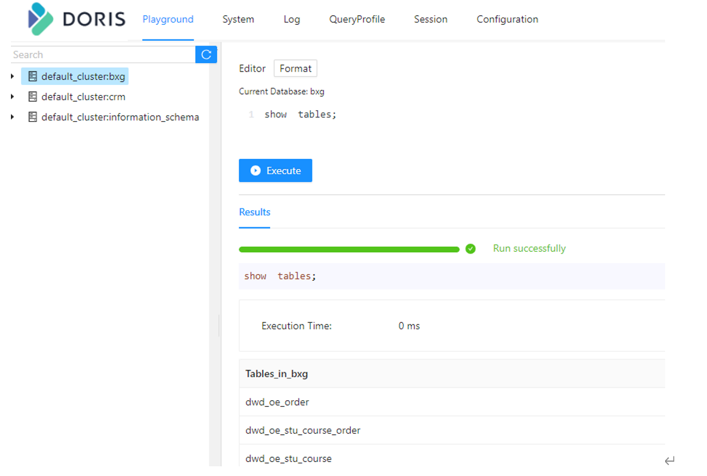

###### Doris映射表

```sql
-- 建doris_dwd_oe_stu_course_order映射表
CREATE TABLE if not exists doris_dwd_oe_stu_course_order (
     `id` int,
     `stu_course_id` int,
     `order_id` string,
     `course_id` int,
     `stu_course_status` int,
     `stu_course_delete_flag` BOOLEAN,
     `effective_date` TIMESTAMP(3),
     `payable_amount` decimal(10,2),
     `pay_status` int,
     `pay_time` TIMESTAMP(3),
     `paid_amount` decimal(10,2),
     `refund_status` int,
     `order_delete_flag` boolean,
     `terminal` int,
     `charge_against_amount` DECIMAL(10,2),
     `oc_id` int,
     `grade_name` string,
     `course_type` INT,
     `is_complete_order` boolean,
`is_target_order` Boolean,
     PRIMARY KEY (`id`) NOT ENFORCED
) WITH (
    'fenodes' = 'node1:8030'
    ,'table.identifier' = 'bxg.dwd_oe_stu_course_order'
    ,'sink.enable-delete' = 'true'
    ,'sink.properties.strip_outer_array' = 'true'
    ,'sink.batch.size' = '2000'
    ,'password' = '123456'
    ,'connector' = 'doris'
    ,'sink.batch.interval' = '10s'
    ,'sink.max-retries' = '5'
    ,'sink.properties.format' = 'json'
    ,'username' = 'root'
);

-- 建doris_dwd_oe_order映射表
CREATE TABLE if not exists doris_dwd_oe_order (
    `id` STRING,
    `channel` STRING,
    `student_id` STRING,
    `order_no` STRING,
    `total_amount` DECIMAL(10,2),
    `discount_amount` DECIMAL(10,2),
    `charge_against_amount` DECIMAL(10,2),
    `payable_amount` DECIMAL(10,2),
    `status` INT,
    `pay_status` INT,
    `pay_time` TIMESTAMP(3),
    `paid_amount` DECIMAL(10,2),
    `effective_date` TIMESTAMP(3),
    `terminal` INT,
    `refund_status` INT,
    `refund_amount` DECIMAL(10,2),
    `refund_time` TIMESTAMP(3),
    `create_time` TIMESTAMP(3),
    `update_time` TIMESTAMP(3),
    `delete_flag` BOOLEAN,
`is_target_order`  BOOLEAN,
    PRIMARY KEY (id, create_time) NOT ENFORCED
    ) WITH (
          'fenodes' = '192.168.88.161:8030'
          ,'table.identifier' = 'bxg.dwd_oe_order'
          ,'sink.enable-delete' = 'true'
          ,'sink.properties.strip_outer_array' = 'true'
          ,'sink.batch.size' = '2000'
          ,'password' = '123456'
          ,'connector' = 'doris'
          ,'sink.batch.interval' = '10s'
          ,'sink.max-retries' = '5'
          ,'sink.properties.format' = 'json'
          ,'username' = 'root'
          );

-- 建doris_dwd_oe_stu_course映射表
CREATE TABLE if not exists doris_dwd_oe_stu_course (
 `id` int
,`oc_id` int
,`grade_name` string
,`course_type` INT
,`student_id`  string
,`status`   int
,`effective_date` timestamp(3)
,`finished_time` timestamp(3)
,`delete_flag` boolean
,`programming_course_id` int
,`programming_course_is_deleted` boolean
, PRIMARY KEY (`id`) NOT ENFORCED
) WITH (
    'fenodes' = 'node1:8030'
    ,'table.identifier' = 'bxg.dwd_oe_stu_course'
    ,'sink.enable-delete' = 'true'
    ,'sink.properties.strip_outer_array' = 'true'
    ,'sink.batch.size' = '2000'
    ,'password' = '123456'
    ,'connector' = 'doris'
    ,'sink.batch.interval' = '10s'
    ,'sink.max-retries' = '5'
    ,'sink.properties.format' = 'json'
    ,'username' = 'root'
);

```

###### 插入数据

```sql
-- doris_dwd_oe_stu_course_order
INSERT INTO doris_dwd_oe_stu_course_order  SELECT `id`,`stu_course_id`,`order_id`,`course_id`,`stu_course_status`,`stu_course_delete_flag`,`effective_date`,`payable_amount`,`pay_status`,`pay_time`,`paid_amount`,`refund_status`, `order_delete_flag`, `terminal`,`charge_against_amount`,`oc_id`,`grade_name`, `course_type`,`is_complete_order`, `is_target_order`
FROM hudi_dwd_oe_stu_course_order;

-- doris_dwd_oe_order
INSERT INTO `doris_dwd_oe_order` SELECT  
`id`,`channel`, `student_id`, `order_no`, `total_amount`, `discount_amount`, `charge_against_amount`, `payable_amount`, `status`, `pay_status`, `pay_time`, `paid_amount`, `effective_date`, `terminal`, `refund_status`, `refund_amount`, `refund_time`, `create_time`,`update_time`, `delete_flag`,`is_target_order`
FROM hudi_dwd_oe_order;

-- dwd_oe_stu_course
INSERT INTO `doris_dwd_oe_stu_course`
SELECT `id`
,`oc_id`
,`grade_name`
,`course_type`
,`student_id`
,`status`
,`effective_date`
,`finished_time`
,`delete_flag`
,`programming_course_id`
,`programming_course_is_deleted`
FROM hudi_dwd_oe_stu_course;

```

### DWS层

#### 分析

首先基于doris的DWD层先写出需求的SQL如下

##### DWD层查询SQL

2020-2022年各课程类型的全款订单量

```sql
SELECT
    date_format(oo.`pay_time`, '%Y.%m') AS `月份`,
    COUNT(CASE WHEN (oso.`course_type` = 0 AND oso.`grade_name` LIKE '%在线就业班%' AND oso.`grade_name` NOT LIKE '%SVIP%') THEN oo.`id` ELSE NULL END) AS `在线就业班`,
    COUNT(CASE WHEN (oso.`course_type` = 0 AND oso.`grade_name` LIKE '%SVIP%') THEN oo.`id` ELSE NULL END) AS `SVIP班`,
    COUNT(CASE WHEN (oso.`oc_id` in (3264, 3400, 3912, 4036, 4293, 4314, 4511, 4454)) THEN oo.`id` ELSE NULL END) AS `直播保薪班`,
    COUNT(CASE WHEN (oso.`course_type` = 0 AND oso.`grade_name` LIKE '【年度钻石会员】%') THEN oo.`id` ELSE NULL END) AS `年度会员`,
    COUNT(CASE WHEN (oso.`course_type` = 0 AND oso.`grade_name` LIKE '【钻石会员】%') THEN oo.`id` ELSE NULL END) AS `半年度会员`,
    COUNT(CASE WHEN ((oso.`course_type` = 0 OR oso.`course_type` = 1) AND oso.`grade_name` LIKE '【季度铂金会员】%') THEN oo.`id` ELSE NULL END) AS `季度会员`,
    COUNT(CASE WHEN ((oso.`course_type` = 0 OR oso.`course_type` = 1) AND oso.`grade_name` LIKE '【月度黄金会员】%') THEN oo.`id` ELSE NULL END) AS `月度会员`
FROM bxg.dwd_oe_order AS oo
         LEFT JOIN bxg.dwd_oe_stu_course_order AS oso ON oo.`id` = oso.`order_id`
WHERE  1=1
-- 支付状态：支付完成
  AND  oo.`pay_status` = 2
-- 未删除订单
  AND  oo.`delete_flag` = 0
-- 去除 N12 分摊转移
  AND  oo.`terminal` != 7
-- 课程学员记录未删除
  AND oso.`stu_course_delete_flag` = 0
-- 去除转班
  AND  oo.`is_target_order`= 0
-- 排除测试课
  AND  oso.`course_id` NOT IN (555,72)
-- 规定时间
  AND  year(oo.`pay_time`) >= 2020 AND year(oo.`pay_time`) <= 2022
GROUP BY `月份`
HAVING sum(oo.`payable_amount`) > 0
ORDER BY `月份`;

```

2020-2022年各课程类型的全款金额

```sql
SELECT
    date_format(oo.`pay_time`, '%Y.%m') AS `月份`,
    SUM(CASE WHEN (oso.`course_type` = 0 AND oso.`grade_name` LIKE '%在线就业班%' AND oso.`grade_name` NOT LIKE '%SVIP%') THEN (oo.`payable_amount` + oo.`charge_against_amount`) ELSE 0 END) / 10000 AS `在线就业班`,
    SUM(CASE WHEN (oso.`course_type` = 0 AND oso.`grade_name` LIKE '%SVIP%') THEN (oo.`payable_amount` + oo.`charge_against_amount`) ELSE 0 END) / 10000 AS `SVIP班`,
    SUM(CASE WHEN (oso.`oc_id` in (3264, 3400, 3912, 4036, 4293, 4314, 4511, 4454)) THEN (oo.`payable_amount` + oo.`charge_against_amount`) ELSE 0 END) / 10000 AS `直播保薪班`,
    SUM(CASE WHEN (oso.`course_type` = 0 AND oso.`grade_name` LIKE '【年度钻石会员】%') THEN (oo.`payable_amount` + oo.`charge_against_amount`) ELSE 0 END) / 10000 AS `年度会员`,
    SUM(CASE WHEN (oso.`course_type` = 0 AND oso.`grade_name` LIKE '【钻石会员】%') THEN (oo.`payable_amount` + oo.`charge_against_amount`) ELSE 0 END) / 10000 AS `半年度会员`,
    SUM(CASE WHEN ((oso.`course_type` = 0 OR oso.`course_type` = 1) AND oso.`grade_name` LIKE '【季度铂金会员】%') THEN (oo.`payable_amount` + oo.`charge_against_amount`) ELSE 0 END) / 10000 AS `季度会员`,
    SUM(CASE WHEN ((oso.`course_type` = 0 OR oso.`course_type` = 1) AND oso.`grade_name` LIKE '【月度黄金会员】%') THEN (oo.`payable_amount` + oo.`charge_against_amount`) ELSE 0 END) / 10000 AS `月度会员`
FROM bxg.dwd_oe_order AS oo
         LEFT JOIN bxg.dwd_oe_stu_course_order AS oso ON oo.`id` = oso.`order_id`
WHERE 1=1
-- 支付状态：支付完成
  AND oo.`pay_status` = 2
-- 未删除订单
  AND oo.`delete_flag` = 0
-- 去除 N12 分摊转移
  AND oo.terminal != 7
-- 课程学员记录未删除
  AND oso.`stu_course_delete_flag` = 0
-- 去除转班
  AND  oo.`is_target_order`= 0
-- 排除测试课
  AND  oso.`course_id` NOT IN (555,72)
-- 规定时间
  AND year(oo.`pay_time`) >= 2020 AND year(oo.`pay_time`) <= 2022
GROUP BY `月份`
HAVING SUM(oo.`payable_amount`) > 0
ORDER BY `月份`;

```

2022年职业课各课程的全款订单量详情表

```sql
SELECT
    osc.`oc_id` AS `课程id`,
    osc.`grade_name` AS `课程名称`,
    (CASE
         WHEN (osc.`course_type` = 0 AND osc.`grade_name` LIKE '%SVIP%') THEN 'SVIP班'
         WHEN (osc.`course_type` = 0 AND osc.`grade_name` LIKE '【年度钻石会员】%') THEN '年度会员'
         WHEN (osc.`course_type` = 0 AND osc.`grade_name` LIKE '【钻石会员】%') THEN '半年度会员'
         WHEN ((osc.`course_type` = 0 OR osc.`course_type` = 1) AND osc.`grade_name` LIKE '【季度铂金会员】%') THEN '季度会员'
         WHEN ((osc.`course_type` = 0 OR osc.`course_type` = 1) AND osc.`grade_name` LIKE '【月度黄金会员】%') THEN '月度会员'
         WHEN (osc.`oc_id` in (3264,3400,3912,4036,4293,4314,4511,4454)) THEN '直播保薪班'
         WHEN (osc.`course_type` = 0 AND osc.`grade_name` NOT LIKE '%SVIP%' AND osc.`grade_name` LIKE '%在线就业班%') THEN '在线就业班'
         ELSE '其他职业课' END
        ) AS `课程类型`,
    COUNT(CASE WHEN month(co.`pay_time`) = 1 THEN osc.`id` ELSE NULL END) AS `1月`,
    COUNT(CASE WHEN month(co.`pay_time`) = 2 THEN osc.`id` ELSE NULL END) AS `2月`,
    COUNT(CASE WHEN month(co.`pay_time`) = 3 THEN osc.id ELSE NULL END) AS `3月`,
    COUNT(CASE WHEN month(co.`pay_time`) = 4 THEN osc.id ELSE NULL END) AS `4月`,
    COUNT(CASE WHEN month(co.`pay_time`) = 5 THEN osc.id ELSE NULL END) AS `5月`,
    COUNT(CASE WHEN month(co.`pay_time`) = 6 THEN osc.id ELSE NULL END) AS `6月`,
    COUNT(CASE WHEN month(co.`pay_time`) = 7 THEN osc.id ELSE NULL END) AS `7月`,
    COUNT(CASE WHEN month(co.`pay_time`) = 8 THEN osc.id ELSE NULL END) AS `8月`,
    COUNT(CASE WHEN month(co.`pay_time`) = 9 THEN osc.id ELSE NULL END) AS `9月`,
    COUNT(CASE WHEN month(co.`pay_time`) = 10 THEN osc.id ELSE NULL END) AS `10月`,
    COUNT(CASE WHEN month(co.`pay_time`) = 11 THEN osc.id ELSE NULL END) AS `11月`,
    COUNT(CASE WHEN month(co.`pay_time`) = 12 THEN osc.id ELSE NULL END) AS `12月`,
    COUNT(osc.`id`) AS `总计`
FROM
    bxg.dwd_oe_stu_course  AS osc
        LEFT JOIN bxg.dwd_oe_stu_course_order AS co ON co.`stu_course_id` =  osc.`id`
WHERE 1 = 1
-- 支付状态：支付完成
  AND co.`pay_status` = 2
-- 订单未删除
  AND co.`order_delete_flag` = 0
-- 标识未删除
  AND osc.`delete_flag` = 0
-- 排除N12分摊转移
  AND co.`terminal` != 7
-- 转班情况只取第一次的订单，转班后的订单不重复计算
  AND co.`is_target_order`= 0
-- 过滤测试数据
  AND osc.`oc_id` NOT IN  (555,72)
-- 职业课范围
  AND (
            osc.`course_type` = 0 OR
            osc.`grade_name` LIKE '【季度铂金会员】%' OR
            osc.`grade_name` LIKE '【月度黄金会员】%' OR
            osc.`oc_id` in (3264, 3400, 3912, 4036)
    )
  AND year(co.`pay_time`) = '2022'
GROUP BY
    osc.`grade_name`, osc.`oc_id`, osc.`course_type`
ORDER BY osc.`oc_id`;
```

在线就业班成交均价分析

```sql
SELECT
    b.`month`                                                AS `月份` ,
    MAX(CASE WHEN a.`year` = 2019 THEN a.`sm` ELSE NULL END) AS `2019年`,
    MAX(CASE WHEN a.`year` = 2020 THEN a.`sm` ELSE NULL END) AS `2020年`,
    MAX(CASE WHEN a.`year` = 2021 THEN a.`sm` ELSE NULL END) AS `2021年`,
    MAX(CASE WHEN a.`year` = 2022 THEN a.`sm` ELSE NULL END) AS `2022年`
FROM (select num  as month from (
        select num from (
           (select 1 as  num) union all
           (select 2 as  num) union all
           (select 3 as  num) union all
           (select 4 as  num) union all
           (select 5 as  num) union all
           (select 6 as  num) union all
           (select 7 as  num) union all
           (select 8 as  num) union all
           (select 9 as  num) union all
           (select 10 as num) union all
           (select 11 as num) union all
           (select 12 as num)) t ) t where num<=12) b
         LEFT JOIN
     (
         SELECT
             year(co.`pay_time`) AS `year`,
             month(co.`pay_time`) AS `mon`,
             round(SUM(co.`payable_amount` + co.`charge_against_amount`) / COUNT(1), 2) AS `sm`
      FROM
          bxg.dwd_oe_stu_course  AS osc
              LEFT JOIN bxg.dwd_oe_stu_course_order AS co ON co.`stu_course_id` =  osc.`id`

         WHERE 1 = 1
           -- 支付状态：支付完成
           AND  co.`pay_status` = 2
           -- 未删除订单
           AND  co.`order_delete_flag` = 0
           -- 课程学员记录未删除
           AND  osc.`delete_flag` = 0
           -- 排除N12分摊转移
           AND  co.`terminal` != 7
          -- 转班情况只取第一次的订单，转班后的订单不重复计算
           AND co.`is_target_order`= 0
           -- 排除测试课
           AND  osc.`oc_id` NOT IN  (555,72)
           -- 在线就业班范围
           AND  (osc.`course_type` = 0 AND osc.`grade_name` LIKE '%在线就业班%' AND osc.`grade_name` NOT LIKE '%SVIP%')
         GROUP BY `year`, `mon`
         HAVING COUNT(1) > 0
     ) a
     on a.`mon` = b.`month`
GROUP BY b.`month`
ORDER BY `月份`;

```

年度会员成交均价分析

```sql
SELECT
    b.`month`                                                AS `月份` ,
    MAX(CASE WHEN a.`year` = 2019 THEN a.`sm` ELSE 0 END) AS `2019年`,
    MAX(CASE WHEN a.`year` = 2020 THEN a.`sm` ELSE 0 END) AS `2020年`,
    MAX(CASE WHEN a.`year` = 2021 THEN a.`sm` ELSE 0 END) AS `2021年`,
    MAX(CASE WHEN a.`year` = 2022 THEN a.`sm` ELSE 0 END) AS `2022年`
FROM (select num  as month from (
        select num from (
           (select 1 as  num) union all
           (select 2 as  num) union all
           (select 3 as  num) union all
           (select 4 as  num) union all
           (select 5 as  num) union all
           (select 6 as  num) union all
           (select 7 as  num) union all
           (select 8 as  num) union all
           (select 9 as  num) union all
           (select 10 as num) union all
           (select 11 as num) union all
           (select 12 as num)) t ) t where num<=12) b
         LEFT JOIN
     (
         SELECT
             year(co.`pay_time`) AS `year`,
             month(co.`pay_time`) AS `mon`,
        round(SUM(co.`payable_amount` + co.`charge_against_amount`) / COUNT(1), 2) AS `sm`
      FROM
          bxg.dwd_oe_stu_course  AS osc
              LEFT JOIN bxg.dwd_oe_stu_course_order AS co ON co.`stu_course_id` =  osc.`id`

         WHERE 1 = 1
           -- 支付状态：支付完成
           AND  co.`pay_status` = 2
           -- 未删除订单
           AND  co.`order_delete_flag` = 0
           -- 课程学员记录未删除
           AND  osc.`delete_flag` = 0
           -- 排除N12分摊转移
           AND  co.`terminal` != 7
           -- 去除转班
           AND co.`is_target_order`= 0
           -- 排除测试课
           AND  osc.`oc_id` NOT IN  (555,72)
           -- 年度会员范围
           AND  (osc.`course_type` = 0 AND osc.`grade_name` LIKE '%【年度%')
         GROUP BY `year`, `mon`
         HAVING COUNT(1) > 0
     ) a
     on a.`mon` = b.`month`
GROUP BY b.`month`
ORDER BY `月份`;

```

2022年职业课各课程成交均价详情表

```sql
SELECT
    osc.oc_id AS `课程id`,
    osc.grade_name AS `课程名称`,
    (CASE
         WHEN (osc.`course_type` = 0 AND osc.`grade_name` LIKE '%SVIP%') THEN 'SVIP班'
         WHEN (osc.`course_type` = 0 AND osc.`grade_name` LIKE '【年度钻石会员】%') THEN '年度会员'
         WHEN (osc.`course_type` = 0 AND osc.`grade_name` LIKE '【钻石会员】%') THEN '半年度会员'
         WHEN ((osc.`course_type` = 0 OR osc.`course_type` = 1) AND osc.`grade_name` LIKE '【季度铂金会员】%') THEN '季度会员'
         WHEN ((osc.`course_type` = 0 OR osc.`course_type` = 1) AND osc.`grade_name` LIKE '【月度黄金会员】%') THEN '月度会员'
         WHEN (osc.`oc_id` in (3264,3400,3912,4036,4293,4314,4511,4454)) THEN '直播保薪班'
         WHEN (osc.`course_type` = 0 AND osc.`grade_name` NOT LIKE '%SVIP%' AND osc.`grade_name` LIKE '%在线就业班%') THEN '在线就业班'
         ELSE '其他职业课' END
        ) AS `课程类型`,
    IFNULL(SUM(CASE WHEN month(co.`pay_time`) = 1 THEN (co.`payable_amount` + co.`charge_against_amount`) ELSE 0 END)/ COUNT(CASE WHEN month(co.`pay_time`) = 1 THEN osc.`id` ELSE null END),0) AS `1月`,
    IFNULL(SUM(CASE WHEN month(co.`pay_time`) = 2 THEN (co.`payable_amount` + co.`charge_against_amount`) ELSE 0 END)/ COUNT(CASE WHEN month(co.`pay_time`) = 2 THEN osc.`id` ELSE null END),0) AS `2月`,
    IFNULL(SUM(CASE WHEN month(co.`pay_time`) = 3 THEN (co.`payable_amount` + co.`charge_against_amount`) ELSE 0 END)/ COUNT(CASE WHEN month(co.`pay_time`) = 3 THEN osc.`id` ELSE null END),0) AS `3月`,
    IFNULL(SUM(CASE WHEN month(co.`pay_time`) = 4 THEN (co.`payable_amount` + co.`charge_against_amount`) ELSE 0 END)/ COUNT(CASE WHEN month(co.`pay_time`) = 4 THEN osc.`id` ELSE null END),0) AS `4月`,
    IFNULL(SUM(CASE WHEN month(co.`pay_time`) = 5 THEN (co.`payable_amount` + co.`charge_against_amount`) ELSE 0 END)/ COUNT(CASE WHEN month(co.`pay_time`) = 5 THEN osc.`id` ELSE null END),0) AS `5月`,
    IFNULL(SUM(CASE WHEN month(co.`pay_time`) = 6 THEN (co.`payable_amount` + co.`charge_against_amount`) ELSE 0 END)/ COUNT(CASE WHEN month(co.`pay_time`) = 6 THEN osc.`id` ELSE null END),0) AS `6月`,
    IFNULL(SUM(CASE WHEN month(co.`pay_time`) = 7 THEN (co.`payable_amount` + co.`charge_against_amount`) ELSE 0 END)/ COUNT(CASE WHEN month(co.`pay_time`) = 7 THEN osc.`id` ELSE null END),0) AS `7月`,
    IFNULL(SUM(CASE WHEN month(co.`pay_time`) = 8 THEN (co.`payable_amount` + co.`charge_against_amount`) ELSE 0 END)/ COUNT(CASE WHEN month(co.`pay_time`) = 8 THEN osc.`id` ELSE null END),0) AS `8月`,
    IFNULL(SUM(CASE WHEN month(co.`pay_time`) = 9 THEN (co.`payable_amount` + co.`charge_against_amount`) ELSE 0 END)/ COUNT(CASE WHEN month(co.`pay_time`) = 9 THEN osc.`id` ELSE null END),0) AS `9月`,
    IFNULL(SUM(CASE WHEN month(co.`pay_time`) = 10 THEN (co.`payable_amount` + co.`charge_against_amount`) ELSE 0 END)/ COUNT(CASE WHEN month(co.`pay_time`) = 10 THEN osc.`id` ELSE null END),0) AS `10月`,
    IFNULL(SUM(CASE WHEN month(co.`pay_time`) = 11 THEN (co.`payable_amount` + co.`charge_against_amount`) ELSE 0 END)/ COUNT(CASE WHEN month(co.`pay_time`) = 11 THEN osc.`id` ELSE null END),0) AS `11月`,
    IFNULL(SUM(CASE WHEN month(co.`pay_time`) = 12 THEN (co.`payable_amount` + co.`charge_against_amount`) ELSE 0 END)/ COUNT(CASE WHEN month(co.`pay_time`) = 12 THEN osc.`id` ELSE null END),0) AS `12月`,
    IFNULL(SUM(co.`payable_amount` + co.`charge_against_amount`) / COUNT(1),0) AS `年平均成交价`
 FROM
          bxg.dwd_oe_stu_course  AS osc
              LEFT JOIN bxg.dwd_oe_stu_course_order AS co ON co.`stu_course_id` =  osc.`id`
WHERE 1=1

  -- 支付状态：支付完成
           AND  co.`pay_status` = 2
           -- 未删除订单
           AND  co.`order_delete_flag` = 0
           -- 课程学员记录未删除
           AND  osc.`delete_flag` = 0
           -- 排除N12分摊转移
           AND  co.`terminal` != 7
-- 转班情况只取第一次的订单，转班后的订单不重复计算
           AND co.`is_target_order`= 0
           -- 排除测试课
           AND  osc.`oc_id` NOT IN  (555,72)
         -- 职业课范围
           AND(
                osc.`course_type` = 0 OR
                osc.`grade_name` LIKE '【季度铂金会员】%' OR
                osc.`grade_name` LIKE '【月度黄金会员】%' OR
                osc.`oc_id` in (3264, 3400, 3912, 4036)
           )
          AND year(co.`pay_time`) = '2022'
GROUP BY
    osc.`grade_name`, osc.`oc_id`, osc.`course_type`
ORDER BY osc.`oc_id`;

```

##### 分析指标异同点

分析上述SQL语句,可以发现以下特点: 

- 2020-2022年各课程类型的全款订单量(第1个指标)和2020-2022年各课程类型的全款金额(第2个指标)两个指标

1)      共用宽表:

```sql
FROM bxg.dwd_oe_order AS oo
         LEFT JOIN bxg.dwd_oe_stu_course_order AS oso ON oo.`id` = oso.`order_id`
```

2） 共同的条件

```sql
WHERE 1=1
-- 支付状态：支付完成
  AND oo.`pay_status` = 2
-- 未删除订单
  AND oo.`delete_flag` = 0
-- 去除 N12 分摊转移
  AND oo.terminal != 7
-- 课程学员记录未删除
  AND oso.`stu_course_delete_flag` = 0
-- 去除转班
  AND  oo.`is_target_order`= 0
-- 排除测试课
  AND  oso.`course_id` NOT IN (555,72)
-- 规定时间
  AND year(oo.`pay_time`) >= 2020 AND year(oo.`pay_time`) <= 2022
GROUP BY `月份`
HAVING SUM(oo.`payable_amount`) > 0
ORDER BY `月份`;
```

3） 相同的维度

月份和各课程类型维度均相同

4） 不同的点

仅在聚合计算上不同

聚合字段分别为订单量oo.id和订单金额（oo.`payable_amount` + oo.`charge_against_amount`）

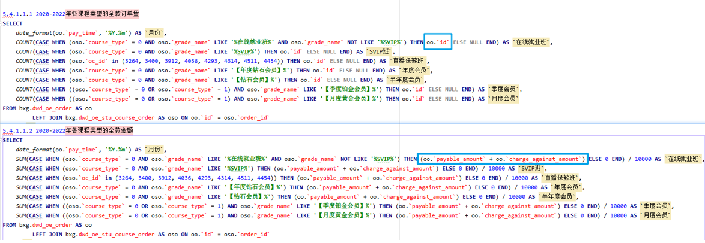

**方案:** 基于上面分析写出,写出如下SQL(doris)

Doris在创建表时使用中文字段会报错，因为对后续doris建表先将字段转换成英文格式

| 中文       | 英文                                  | 英文简写  |
| ---------- | ------------------------------------- | --------- |
| 订单量     | Order_quantity                        | Order     |
| 金额       | amount                                | amount    |
| 月份       | month                                 | month     |
| 在线就业班 | Online_employment_class               | Online    |
| SVIP班     | SVIP_class                            | SVIP      |
| 直播保薪班 | Live_broadcast_salary_guarantee_class | Live      |
| 年度会员   | Annual_member                         | Annual    |
| 半年度会员 | Semi_annual_member                    | Semi      |
| 季度会员   | Quarterly_membership                  | Quarterly |
| 月度会员   | Monthly_member                        | Monthly   |

```sql
SELECT
date_format(oo.`pay_time`, '%Y.%m') AS `month`,
COUNT(CASE WHEN (oso.`course_type` = 0 AND oso.`grade_name` LIKE '%在线就业班%' AND oso.`grade_name` NOT LIKE '%SVIP%') THEN oo.`id` ELSE NULL END) AS `Online_Order`,
COUNT(CASE WHEN (oso.`course_type` = 0 AND oso.`grade_name` LIKE '%SVIP%') THEN oo.`id` ELSE NULL END) AS `SVIP_Order`,
COUNT(CASE WHEN (oso.`oc_id` in (3264, 3400, 3912, 4036, 4293, 4314, 4511, 4454)) THEN oo.`id` ELSE NULL END) AS `Live_Order`,
COUNT(CASE WHEN (oso.`course_type` = 0 AND oso.`grade_name` LIKE '【年度钻石会员】%') THEN oo.`id` ELSE NULL END) AS `Annual_Order`,
COUNT(CASE WHEN (oso.`course_type` = 0 AND oso.`grade_name` LIKE '【钻石会员】%') THEN oo.`id` ELSE NULL END) AS `Semi_Order`,
COUNT(CASE WHEN ((oso.`course_type` = 0 OR oso.`course_type` = 1) AND oso.`grade_name` LIKE '【季度铂金会员】%') THEN oo.`id` ELSE NULL END) AS `Quarterly_Order`,
COUNT(CASE WHEN ((oso.`course_type` = 0 OR oso.`course_type` = 1) AND oso.`grade_name` LIKE '【月度黄金会员】%') THEN oo.`id` ELSE NULL END) AS `Monthly_Order`,
SUM(CASE WHEN (oso.`course_type` = 0 AND oso.`grade_name` LIKE '%在线就业班%' AND oso.`grade_name` NOT LIKE '%SVIP%') THEN (oo.`payable_amount` + oo.`charge_against_amount`) ELSE 0 END) / 10000 AS `Online_amount`,
SUM(CASE WHEN (oso.`course_type` = 0 AND oso.`grade_name` LIKE '%SVIP%') THEN (oo.`payable_amount` + oo.`charge_against_amount`) ELSE 0 END) / 10000 AS `SVIP_amount`,
SUM(CASE WHEN (oso.`oc_id` in (3264, 3400, 3912, 4036, 4293, 4314, 4511, 4454)) THEN (oo.`payable_amount` + oo.`charge_against_amount`) ELSE 0 END) / 10000 AS `Live_amount`,
SUM(CASE WHEN (oso.`course_type` = 0 AND oso.`grade_name` LIKE '【年度钻石会员】%') THEN (oo.`payable_amount` + oo.`charge_against_amount`) ELSE 0 END) / 10000 AS `Annual_amount`,
SUM(CASE WHEN (oso.`course_type` = 0 AND oso.`grade_name` LIKE '【钻石会员】%') THEN (oo.`payable_amount` + oo.`charge_against_amount`) ELSE 0 END) / 10000 AS `Semi_amount`,
SUM(CASE WHEN ((oso.`course_type` = 0 OR oso.`course_type` = 1) AND oso.`grade_name` LIKE '【季度铂金会员】%') THEN (oo.`payable_amount` + oo.`charge_against_amount`) ELSE 0 END) / 10000 AS `Quarterly_amount`,
SUM(CASE WHEN ((oso.`course_type` = 0 OR oso.`course_type` = 1) AND oso.`grade_name` LIKE '【月度黄金会员】%') THEN (oo.`payable_amount` + oo.`charge_against_amount`) ELSE 0 END) / 10000 AS `Monthly_amount`
FROM bxg.dwd_oe_order AS oo
LEFT JOIN bxg.dwd_oe_stu_course_order AS oso ON oo.`id` = oso.`order_id`
WHERE  1=1
-- 支付状态：支付完成
AND  oo.`pay_status` = 2
-- 未删除订单
AND  oo.`delete_flag` = 0
-- 去除 N12 分摊转移
AND  oo.`terminal` != 7
-- 标识未删除
AND oso.`stu_course_delete_flag` = 0
-- 去除转班
AND  oo.`is_target_order`= 0
-- 排除测试课
AND  oso.`course_id` NOT IN (555,72)
-- 规定时间
-- AND  year(oo.`pay_time`) >= 2020 AND year(oo.`pay_time`) <= 2022
GROUP BY `month`
HAVING sum(oo.`payable_amount`) > 0
ORDER BY `month`
;
```

查询结果：

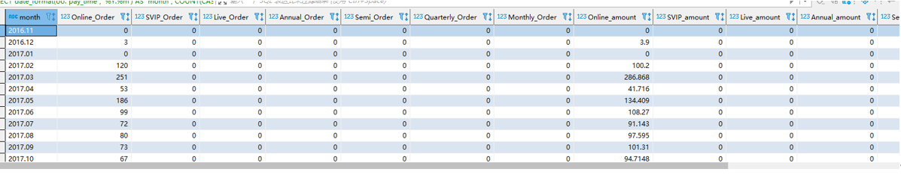

利用上面的SQL作为子查询的源表(表名t1_2代表第1个和第2个指标共用的dws层表),写出DWD层指标语句。

以2020-2022年各课程类型的全款订单量为例:

```sql
SELECT 
month  as `月份`
,Online_Order  as `在线就业班`
,SVIP_Order    as  `直播保薪班`
,Annual_Order  as  `年度会员`
,Semi_Order  as `半年度会员`
,Quarterly_Order as  `季度会员`
,Monthly_Order  as  `月度会员`
FROM 
(
SELECT
date_format(oo.`pay_time`, '%Y.%m') AS `month`,
COUNT(CASE WHEN (oso.`course_type` = 0 AND oso.`grade_name` LIKE '%在线就业班%' AND oso.`grade_name` NOT LIKE '%SVIP%') THEN oo.`id` ELSE NULL END) AS `Online_Order`,
COUNT(CASE WHEN (oso.`course_type` = 0 AND oso.`grade_name` LIKE '%SVIP%') THEN oo.`id` ELSE NULL END) AS `SVIP_Order`,
COUNT(CASE WHEN (oso.`oc_id` in (3264, 3400, 3912, 4036, 4293, 4314, 4511, 4454)) THEN oo.`id` ELSE NULL END) AS `Live_Order`,
COUNT(CASE WHEN (oso.`course_type` = 0 AND oso.`grade_name` LIKE '【年度钻石会员】%') THEN oo.`id` ELSE NULL END) AS `Annual_Order`,
COUNT(CASE WHEN (oso.`course_type` = 0 AND oso.`grade_name` LIKE '【钻石会员】%') THEN oo.`id` ELSE NULL END) AS `Semi_Order`,
COUNT(CASE WHEN ((oso.`course_type` = 0 OR oso.`course_type` = 1) AND oso.`grade_name` LIKE '【季度铂金会员】%') THEN oo.`id` ELSE NULL END) AS `Quarterly_Order`,
COUNT(CASE WHEN ((oso.`course_type` = 0 OR oso.`course_type` = 1) AND oso.`grade_name` LIKE '【月度黄金会员】%') THEN oo.`id` ELSE NULL END) AS `Monthly_Order`,
SUM(CASE WHEN (oso.`course_type` = 0 AND oso.`grade_name` LIKE '%在线就业班%' AND oso.`grade_name` NOT LIKE '%SVIP%') THEN (oo.`payable_amount` + oo.`charge_against_amount`) ELSE 0 END) / 10000 AS `Online_amount`,
SUM(CASE WHEN (oso.`course_type` = 0 AND oso.`grade_name` LIKE '%SVIP%') THEN (oo.`payable_amount` + oo.`charge_against_amount`) ELSE 0 END) / 10000 AS `SVIP_amount`,
SUM(CASE WHEN (oso.`oc_id` in (3264, 3400, 3912, 4036, 4293, 4314, 4511, 4454)) THEN (oo.`payable_amount` + oo.`charge_against_amount`) ELSE 0 END) / 10000 AS `Live_amount`,
SUM(CASE WHEN (oso.`course_type` = 0 AND oso.`grade_name` LIKE '【年度钻石会员】%') THEN (oo.`payable_amount` + oo.`charge_against_amount`) ELSE 0 END) / 10000 AS `Annual_amount`,
SUM(CASE WHEN (oso.`course_type` = 0 AND oso.`grade_name` LIKE '【钻石会员】%') THEN (oo.`payable_amount` + oo.`charge_against_amount`) ELSE 0 END) / 10000 AS `Semi_amount`,
SUM(CASE WHEN ((oso.`course_type` = 0 OR oso.`course_type` = 1) AND oso.`grade_name` LIKE '【季度铂金会员】%') THEN (oo.`payable_amount` + oo.`charge_against_amount`) ELSE 0 END) / 10000 AS `Quarterly_amount`,
SUM(CASE WHEN ((oso.`course_type` = 0 OR oso.`course_type` = 1) AND oso.`grade_name` LIKE '【月度黄金会员】%') THEN (oo.`payable_amount` + oo.`charge_against_amount`) ELSE 0 END) / 10000 AS `Monthly_amount`
FROM bxg.dwd_oe_order AS oo
LEFT JOIN bxg.dwd_oe_stu_course_order AS oso ON oo.`id` = oso.`order_id`
WHERE  1=1
-- 支付状态：支付完成
AND  oo.`pay_status` = 2
-- 未删除订单
AND  oo.`delete_flag` = 0
-- 去除 N12 分摊转移
AND  oo.`terminal` != 7
-- 标识未删除
AND oso.`stu_course_delete_flag` = 0
-- 去除转班
AND  oo.`is_target_order`= 0
-- 排除测试课
AND  oso.`course_id` NOT IN (555,72)
-- 规定时间
-- AND  year(oo.`pay_time`) >= 2020 AND year(oo.`pay_time`) <= 2022
GROUP BY `month`
HAVING sum(oo.`payable_amount`) > 0
ORDER BY `month`
)t1_2 
WHERE  `month` >= 2020.01 AND  `month`  <= 2022.12
ORDER BY `month`;

```

查询结果：

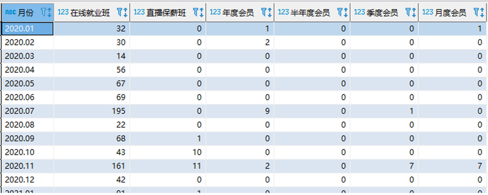

结果与mysql的查询结果一致。

之后可以将上述子查询源表的doris SQL改为Flink SQl, 在hudi中建立dws层的表’’dws_t1_2’’，并下沉到doris。

- 2022年职业课各课程的全款订单量详情表(第3个指标)与2022年职业课各课程成交均价详情表(第6个指标)

1)      共用宽表:

```sql
FROM
    bxg.dwd_oe_stu_course  AS osc
        LEFT JOIN bxg.dwd_oe_stu_course_order AS co ON co.`stu_course_id` =  osc.`id`
```

2） 共同的条件

```sql
WHERE 1=1
  -- 支付状态：支付完成
           AND  co.`pay_status` = 2
           -- 未删除订单
           AND  co.`order_delete_flag` = 0
           -- 课程学员记录未删除
           AND  osc.`delete_flag` = 0
           -- 排除N12分摊转移
           AND  co.`terminal` != 7
-- 转班情况只取第一次的订单，转班后的订单不重复计算
           AND co.`is_target_order`= 0
           -- 排除测试课
           AND  osc.`oc_id` NOT IN  (555,72)
         -- 职业课范围
           AND(
                osc.`course_type` = 0 OR
                osc.`grade_name` LIKE '【季度铂金会员】%' OR
                osc.`grade_name` LIKE '【月度黄金会员】%' OR
                osc.`oc_id` in (3264, 3400, 3912, 4036)
           )
          AND year(co.`pay_time`) = '2022'
GROUP BY
    osc.`grade_name`, osc.`oc_id`, osc.`course_type`
ORDER BY osc.`oc_id`;

```

1)      相同的维度

课程id、课程名称、课程类型和提取月份维度均相同

2)     不同点

仅在聚合计算上不同

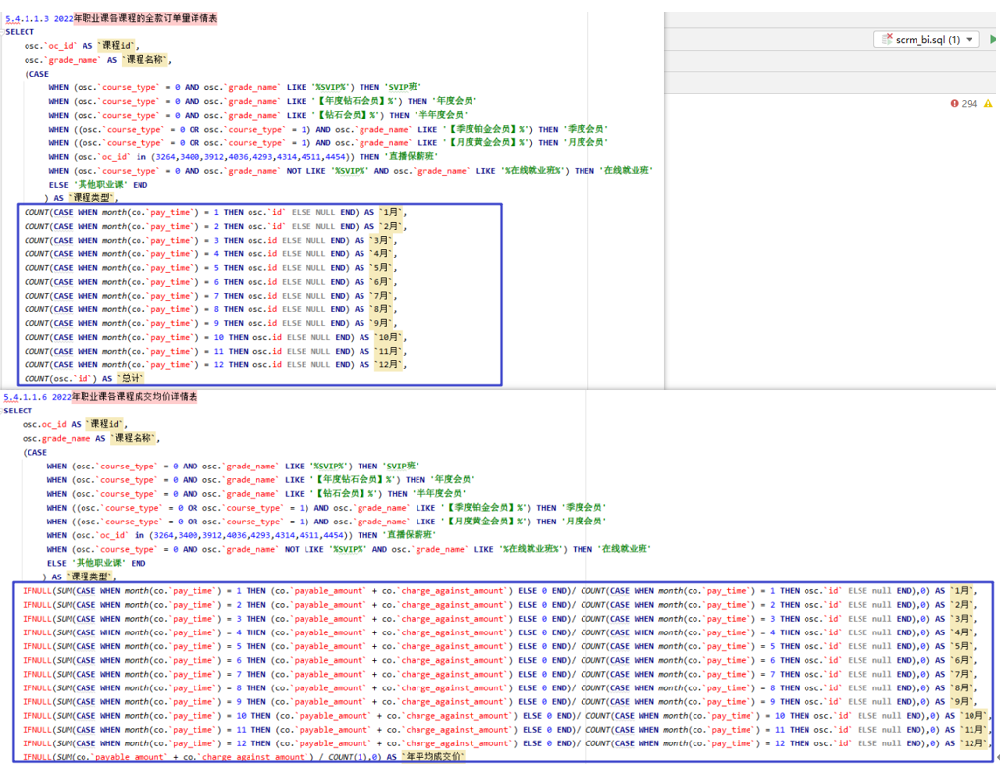

方案：基于上面分析写出,写出如下SQL(doris)

Doris在创建表时使用中文字段会报错，因为对后续doris建表先将字段转换成英文格式

| 中文         | 英文                               | 英文简写    |
| ------------ | ---------------------------------- | ----------- |
| 课程id       | Course   ID                        | C_ID        |
| 课程名称     | Course   Name                      | C_Name      |
| 课程类型     | Course   type                      | C_type      |
| 总计         | total                              | total       |
| 年平均成交价 | Annual   average transaction price | A_avg_price |

```sql
SELECT
    osc.oc_id AS `C_ID`,
    osc.grade_name AS `C_Name`,
    (CASE
         WHEN (osc.`course_type` = 0 AND osc.`grade_name` LIKE '%SVIP%') THEN 'SVIP班'
         WHEN (osc.`course_type` = 0 AND osc.`grade_name` LIKE '【年度钻石会员】%') THEN '年度会员'
         WHEN (osc.`course_type` = 0 AND osc.`grade_name` LIKE '【钻石会员】%') THEN '半年度会员'
         WHEN ((osc.`course_type` = 0 OR osc.`course_type` = 1) AND osc.`grade_name` LIKE '【季度铂金会员】%') THEN '季度会员'
         WHEN ((osc.`course_type` = 0 OR osc.`course_type` = 1) AND osc.`grade_name` LIKE '【月度黄金会员】%') THEN '月度会员'
         WHEN (osc.`oc_id` in (3264,3400,3912,4036,4293,4314,4511,4454)) THEN '直播保薪班'
         WHEN (osc.`course_type` = 0 AND osc.`grade_name` NOT LIKE '%SVIP%' AND osc.`grade_name` LIKE '%在线就业班%') THEN '在线就业班'
         ELSE '其他职业课' END
        ) AS `C_type`,
        COUNT(CASE WHEN month(co.`pay_time`) = 1 THEN osc.`id` ELSE NULL END) AS `p_1m`,
    COUNT(CASE WHEN month(co.`pay_time`) = 2 THEN osc.`id` ELSE NULL END)     AS `p_2m`,
    COUNT(CASE WHEN month(co.`pay_time`) = 3 THEN osc.id ELSE NULL END)       AS `p_3m`,
    COUNT(CASE WHEN month(co.`pay_time`) = 4 THEN osc.id ELSE NULL END)       AS `p_4m`,
    COUNT(CASE WHEN month(co.`pay_time`) = 5 THEN osc.id ELSE NULL END)       AS `p_5m`,
    COUNT(CASE WHEN month(co.`pay_time`) = 6 THEN osc.id ELSE NULL END)       AS `p_6m`,
    COUNT(CASE WHEN month(co.`pay_time`) = 7 THEN osc.id ELSE NULL END)       AS `p_7m`,
    COUNT(CASE WHEN month(co.`pay_time`) = 8 THEN osc.id ELSE NULL END)       AS `p_8m`,
    COUNT(CASE WHEN month(co.`pay_time`) = 9 THEN osc.id ELSE NULL END)       AS `p_9m`,
    COUNT(CASE WHEN month(co.`pay_time`) = 10 THEN osc.id ELSE NULL END)      AS `p_10m`,
    COUNT(CASE WHEN month(co.`pay_time`) = 11 THEN osc.id ELSE NULL END)      AS `p_11m`,
    COUNT(CASE WHEN month(co.`pay_time`) = 12 THEN osc.id ELSE NULL END)      AS `p_12m`,
    COUNT(osc.`id`) AS `total`,
    IFNULL(SUM(CASE WHEN month(co.`pay_time`) = 1 THEN (co.`payable_amount` + co.`charge_against_amount`) ELSE 0 END)/ COUNT(CASE WHEN month(co.`pay_time`) = 1 THEN osc.`id` ELSE null END),0)   AS `a_1m`,
    IFNULL(SUM(CASE WHEN month(co.`pay_time`) = 2 THEN (co.`payable_amount` + co.`charge_against_amount`) ELSE 0 END)/ COUNT(CASE WHEN month(co.`pay_time`) = 2 THEN osc.`id` ELSE null END),0)   AS `a_2m`,
    IFNULL(SUM(CASE WHEN month(co.`pay_time`) = 3 THEN (co.`payable_amount` + co.`charge_against_amount`) ELSE 0 END)/ COUNT(CASE WHEN month(co.`pay_time`) = 3 THEN osc.`id` ELSE null END),0)   AS `a_3m`,
    IFNULL(SUM(CASE WHEN month(co.`pay_time`) = 4 THEN (co.`payable_amount` + co.`charge_against_amount`) ELSE 0 END)/ COUNT(CASE WHEN month(co.`pay_time`) = 4 THEN osc.`id` ELSE null END),0)   AS `a_4m`,
    IFNULL(SUM(CASE WHEN month(co.`pay_time`) = 5 THEN (co.`payable_amount` + co.`charge_against_amount`) ELSE 0 END)/ COUNT(CASE WHEN month(co.`pay_time`) = 5 THEN osc.`id` ELSE null END),0)   AS `a_5m`,
    IFNULL(SUM(CASE WHEN month(co.`pay_time`) = 6 THEN (co.`payable_amount` + co.`charge_against_amount`) ELSE 0 END)/ COUNT(CASE WHEN month(co.`pay_time`) = 6 THEN osc.`id` ELSE null END),0)   AS `a_6m`,
    IFNULL(SUM(CASE WHEN month(co.`pay_time`) = 7 THEN (co.`payable_amount` + co.`charge_against_amount`) ELSE 0 END)/ COUNT(CASE WHEN month(co.`pay_time`) = 7 THEN osc.`id` ELSE null END),0)   AS `a_7m`,
    IFNULL(SUM(CASE WHEN month(co.`pay_time`) = 8 THEN (co.`payable_amount` + co.`charge_against_amount`) ELSE 0 END)/ COUNT(CASE WHEN month(co.`pay_time`) = 8 THEN osc.`id` ELSE null END),0)   AS `a_8m`,
    IFNULL(SUM(CASE WHEN month(co.`pay_time`) = 9 THEN (co.`payable_amount` + co.`charge_against_amount`) ELSE 0 END)/ COUNT(CASE WHEN month(co.`pay_time`) = 9 THEN osc.`id` ELSE null END),0)   AS `a_9m`,
    IFNULL(SUM(CASE WHEN month(co.`pay_time`) = 10 THEN (co.`payable_amount` + co.`charge_against_amount`) ELSE 0 END)/ COUNT(CASE WHEN month(co.`pay_time`) = 10 THEN osc.`id` ELSE null END),0) AS `a_10m`,
    IFNULL(SUM(CASE WHEN month(co.`pay_time`) = 11 THEN (co.`payable_amount` + co.`charge_against_amount`) ELSE 0 END)/ COUNT(CASE WHEN month(co.`pay_time`) = 11 THEN osc.`id` ELSE null END),0) AS `a_11m`,
    IFNULL(SUM(CASE WHEN month(co.`pay_time`) = 12 THEN (co.`payable_amount` + co.`charge_against_amount`) ELSE 0 END)/ COUNT(CASE WHEN month(co.`pay_time`) = 12 THEN osc.`id` ELSE null END),0) AS `a_12m`,
    IFNULL(SUM(co.`payable_amount` + co.`charge_against_amount`) / COUNT(1),0) AS `A_avg_price`
 FROM
          bxg.dwd_oe_stu_course  AS osc
              LEFT JOIN bxg.dwd_oe_stu_course_order AS co ON co.`stu_course_id` =  osc.`id`
WHERE 1=1
  -- 支付状态：支付完成
           AND  co.`pay_status` = 2
           -- 未删除订单
           AND  co.`order_delete_flag` = 0
           -- 课程学员记录未删除
           AND  osc.`delete_flag` = 0
           -- 排除N12分摊转移
           AND  co.`terminal` != 7
-- 转班情况只取第一次的订单，转班后的订单不重复计算
           AND co.`is_target_order`= 0
           -- 排除测试课
           AND  osc.`oc_id` NOT IN  (555,72)
         -- 职业课范围
           AND(
                osc.`course_type` = 0 OR
                osc.`grade_name` LIKE '【季度铂金会员】%' OR
                osc.`grade_name` LIKE '【月度黄金会员】%' OR
                osc.`oc_id` in (3264, 3400, 3912, 4036)
           )
          AND year(co.`pay_time`) =  year(current_date())
GROUP BY
    osc.`grade_name`, osc.`oc_id`, osc.`course_type`
ORDER BY osc.`oc_id`;

```

查询结果：

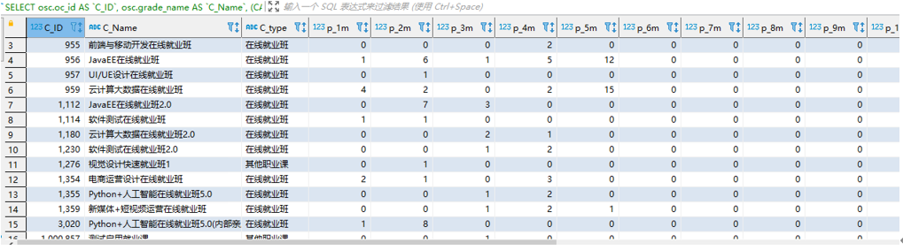

利用上面的SQL作为子查询的源表(表名t3_6 代表第3个和第6个指标共用的dws层表),写出DWD层指标语句。

以2022年职业课各课程的全款订单量详情表为例:

```sql
SELECT 
`C_ID`   AS  `课程id`,
`C_Name` AS  `课程名称`,
`C_type` AS  `课程类型`,
`p_1m`   AS  `1月`, 
`p_2m`   AS  `2月`, 
`p_3m`   AS  `3月`, 
`p_4m`   AS  `4月`, 
`p_5m`   AS  `5月`, 
`p_6m`   AS  `6月`, 
`p_7m`   AS  `7月`, 
`p_8m`   AS  `8月`, 
`p_9m`   AS  `9月`, 
`p_10m`  AS  `10月`, 
`p_11m`  AS  `11月`, 
`p_12m`  AS  `12月`, 
`total`  AS  `总计`
FROM
(
SELECT
    osc.oc_id AS `C_ID`,
    osc.grade_name AS `C_Name`,
    (CASE
         WHEN (osc.`course_type` = 0 AND osc.`grade_name` LIKE '%SVIP%') THEN 'SVIP班'
         WHEN (osc.`course_type` = 0 AND osc.`grade_name` LIKE '【年度钻石会员】%') THEN '年度会员'
         WHEN (osc.`course_type` = 0 AND osc.`grade_name` LIKE '【钻石会员】%') THEN '半年度会员'
         WHEN ((osc.`course_type` = 0 OR osc.`course_type` = 1) AND osc.`grade_name` LIKE '【季度铂金会员】%') THEN '季度会员'
         WHEN ((osc.`course_type` = 0 OR osc.`course_type` = 1) AND osc.`grade_name` LIKE '【月度黄金会员】%') THEN '月度会员'
         WHEN (osc.`oc_id` in (3264,3400,3912,4036,4293,4314,4511,4454)) THEN '直播保薪班'
         WHEN (osc.`course_type` = 0 AND osc.`grade_name` NOT LIKE '%SVIP%' AND osc.`grade_name` LIKE '%在线就业班%') THEN '在线就业班'
         ELSE '其他职业课' END
        ) AS `C_type`,
        COUNT(CASE WHEN month(co.`pay_time`) = 1 THEN osc.`id` ELSE NULL END) AS `p_1m`,
    COUNT(CASE WHEN month(co.`pay_time`) = 2 THEN osc.`id` ELSE NULL END)     AS `p_2m`,
    COUNT(CASE WHEN month(co.`pay_time`) = 3 THEN osc.id ELSE NULL END)       AS `p_3m`,
    COUNT(CASE WHEN month(co.`pay_time`) = 4 THEN osc.id ELSE NULL END)       AS `p_4m`,
    COUNT(CASE WHEN month(co.`pay_time`) = 5 THEN osc.id ELSE NULL END)       AS `p_5m`,
    COUNT(CASE WHEN month(co.`pay_time`) = 6 THEN osc.id ELSE NULL END)       AS `p_6m`,
    COUNT(CASE WHEN month(co.`pay_time`) = 7 THEN osc.id ELSE NULL END)       AS `p_7m`,
    COUNT(CASE WHEN month(co.`pay_time`) = 8 THEN osc.id ELSE NULL END)       AS `p_8m`,
    COUNT(CASE WHEN month(co.`pay_time`) = 9 THEN osc.id ELSE NULL END)       AS `p_9m`,
    COUNT(CASE WHEN month(co.`pay_time`) = 10 THEN osc.id ELSE NULL END)      AS `p_10m`,
    COUNT(CASE WHEN month(co.`pay_time`) = 11 THEN osc.id ELSE NULL END)      AS `p_11m`,
    COUNT(CASE WHEN month(co.`pay_time`) = 12 THEN osc.id ELSE NULL END)      AS `p_12m`,
    COUNT(osc.`id`) AS `total`,
    IFNULL(SUM(CASE WHEN month(co.`pay_time`) = 1 THEN (co.`payable_amount` + co.`charge_against_amount`) ELSE 0 END)/ COUNT(CASE WHEN month(co.`pay_time`) = 1 THEN osc.`id` ELSE null END),0)   AS `a_1m`,
    IFNULL(SUM(CASE WHEN month(co.`pay_time`) = 2 THEN (co.`payable_amount` + co.`charge_against_amount`) ELSE 0 END)/ COUNT(CASE WHEN month(co.`pay_time`) = 2 THEN osc.`id` ELSE null END),0)   AS `a_2m`,
    IFNULL(SUM(CASE WHEN month(co.`pay_time`) = 3 THEN (co.`payable_amount` + co.`charge_against_amount`) ELSE 0 END)/ COUNT(CASE WHEN month(co.`pay_time`) = 3 THEN osc.`id` ELSE null END),0)   AS `a_3m`,
    IFNULL(SUM(CASE WHEN month(co.`pay_time`) = 4 THEN (co.`payable_amount` + co.`charge_against_amount`) ELSE 0 END)/ COUNT(CASE WHEN month(co.`pay_time`) = 4 THEN osc.`id` ELSE null END),0)   AS `a_4m`,
    IFNULL(SUM(CASE WHEN month(co.`pay_time`) = 5 THEN (co.`payable_amount` + co.`charge_against_amount`) ELSE 0 END)/ COUNT(CASE WHEN month(co.`pay_time`) = 5 THEN osc.`id` ELSE null END),0)   AS `a_5m`,
    IFNULL(SUM(CASE WHEN month(co.`pay_time`) = 6 THEN (co.`payable_amount` + co.`charge_against_amount`) ELSE 0 END)/ COUNT(CASE WHEN month(co.`pay_time`) = 6 THEN osc.`id` ELSE null END),0)   AS `a_6m`,
    IFNULL(SUM(CASE WHEN month(co.`pay_time`) = 7 THEN (co.`payable_amount` + co.`charge_against_amount`) ELSE 0 END)/ COUNT(CASE WHEN month(co.`pay_time`) = 7 THEN osc.`id` ELSE null END),0)   AS `a_7m`,
    IFNULL(SUM(CASE WHEN month(co.`pay_time`) = 8 THEN (co.`payable_amount` + co.`charge_against_amount`) ELSE 0 END)/ COUNT(CASE WHEN month(co.`pay_time`) = 8 THEN osc.`id` ELSE null END),0)   AS `a_8m`,
    IFNULL(SUM(CASE WHEN month(co.`pay_time`) = 9 THEN (co.`payable_amount` + co.`charge_against_amount`) ELSE 0 END)/ COUNT(CASE WHEN month(co.`pay_time`) = 9 THEN osc.`id` ELSE null END),0)   AS `a_9m`,
    IFNULL(SUM(CASE WHEN month(co.`pay_time`) = 10 THEN (co.`payable_amount` + co.`charge_against_amount`) ELSE 0 END)/ COUNT(CASE WHEN month(co.`pay_time`) = 10 THEN osc.`id` ELSE null END),0) AS `a_10m`,
    IFNULL(SUM(CASE WHEN month(co.`pay_time`) = 11 THEN (co.`payable_amount` + co.`charge_against_amount`) ELSE 0 END)/ COUNT(CASE WHEN month(co.`pay_time`) = 11 THEN osc.`id` ELSE null END),0) AS `a_11m`,
    IFNULL(SUM(CASE WHEN month(co.`pay_time`) = 12 THEN (co.`payable_amount` + co.`charge_against_amount`) ELSE 0 END)/ COUNT(CASE WHEN month(co.`pay_time`) = 12 THEN osc.`id` ELSE null END),0) AS `a_12m`,
    IFNULL(SUM(co.`payable_amount` + co.`charge_against_amount`) / COUNT(1),0) AS `A_avg_price`
 FROM
          bxg.dwd_oe_stu_course  AS osc
              LEFT JOIN bxg.dwd_oe_stu_course_order AS co ON co.`stu_course_id` =  osc.`id`
WHERE 1=1
  -- 支付状态：支付完成
           AND  co.`pay_status` = 2
           -- 未删除订单
           AND  co.`order_delete_flag` = 0
           -- 课程学员记录未删除
           AND  osc.`delete_flag` = 0
           -- 排除N12分摊转移
           AND  co.`terminal` != 7
-- 转班情况只取第一次的订单，转班后的订单不重复计算
           AND co.`is_target_order`= 0
           -- 排除测试课
           AND  osc.`oc_id` NOT IN  (555,72)
         -- 职业课范围
           AND(
                osc.`course_type` = 0 OR
                osc.`grade_name` LIKE '【季度铂金会员】%' OR
                osc.`grade_name` LIKE '【月度黄金会员】%' OR
                osc.`oc_id` in (3264, 3400, 3912, 4036)
           )
          AND year(co.`pay_time`) =  year(current_date())
GROUP BY
    osc.`grade_name`, osc.`oc_id`, osc.`course_type`
) as t3_6
ORDER BY `C_ID` ;

```

查询结果：

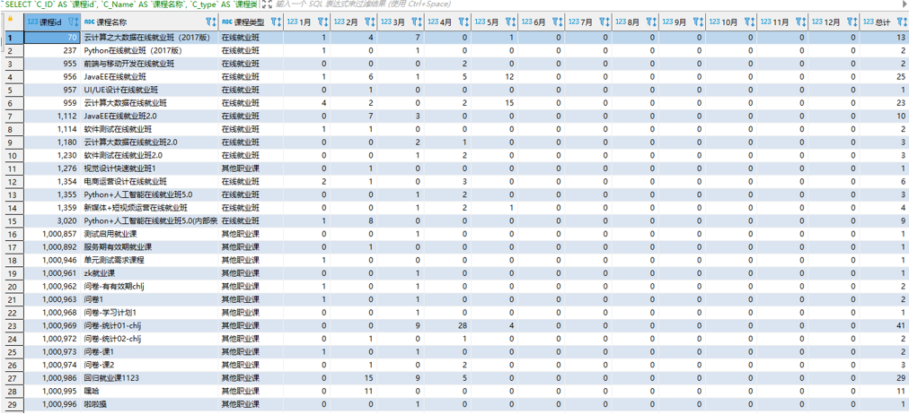

结果与mysql的查询结果一致。

之后可以将上述子查询源表的doris SQL改为Flink SQl, 在hudi中建立dws层的表’’dws_t3_6’’，并下沉到doris。

- 在线就业班成交均价分析(第4个指标)和年度会员成交均价分析(第5个指标)两个指标

1)      共用宽表:

```sql
bxg.dwd_oe_stu_course  AS osc
    LEFT JOIN bxg.dwd_oe_stu_course_order AS co ON co.`stu_course_id` =  osc.`id`
```

2） 共同的条件

```sql
WHERE 1 = 1
  -- 支付状态：支付完成
  AND  co.`pay_status` = 2
  -- 未删除订单
  AND  co.`order_delete_flag` = 0
  -- 课程学员记录未删除
  AND  osc.`delete_flag` = 0
  -- 排除N12分摊转移
  AND  co.`terminal` != 7
 -- 转班情况只取第一次的订单，转班后的订单不重复计算
 AND co.`is_target_order`= 0
  -- 排除测试课
  AND  osc.`oc_id` NOT IN  (555,72)
  -- 在线就业班范围
  AND  osc.`course_type` = 0  
GROUP BY `year`, `mon`
HAVING COUNT(1) > 0

```

3)      相同的维度

时间year、month等均相同

4)     不同的点

仅课程的筛选条件不同，具体见下图：

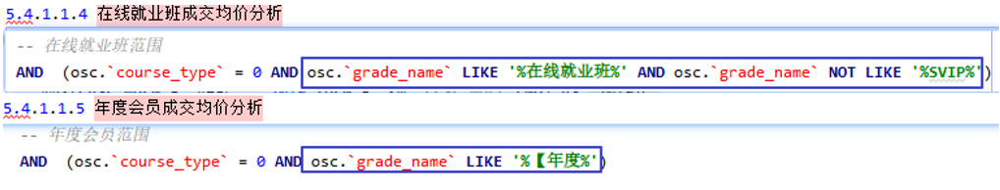

**方案：**基于上面分析写出,写出如下SQL(doris)

通过追加一列标签Tag(使用标记0和1标记,0为在线就业班,1为年度会员)

```sql
SELECT
     year(co.`pay_time`) AS `year`,
     month(co.`pay_time`) AS `mon`,
     round(SUM(co.`payable_amount` + co.`charge_against_amount`) / COUNT(1), 2) AS `sm`,
     0 as Tag
  FROM
      bxg.dwd_oe_stu_course  AS osc
          LEFT JOIN bxg.dwd_oe_stu_course_order AS co ON co.`stu_course_id` =  osc.`id`

 WHERE 1 = 1
   -- 支付状态：支付完成
   AND  co.`pay_status` = 2
   -- 未删除订单
   AND  co.`order_delete_flag` = 0
   -- 课程学员记录未删除
   AND  osc.`delete_flag` = 0
   -- 排除N12分摊转移
   AND  co.`terminal` != 7
  -- 转班情况只取第一次的订单，转班后的订单不重复计算
  AND co.`is_target_order`= 0
   -- 排除测试课
   AND  osc.`oc_id` NOT IN  (555,72)
   -- 在线就业班范围
   AND  (osc.`course_type` = 0 AND osc.`grade_name` LIKE '%在线就业班%' AND osc.`grade_name` NOT LIKE '%SVIP%')
 GROUP BY `year`, `mon`
 HAVING COUNT(1) > 0
 UNION 
 SELECT
    year(co.`pay_time`) AS `year`,
    month(co.`pay_time`) AS `mon`,
    round(SUM(co.`payable_amount` + co.`charge_against_amount`) / COUNT(1), 2) AS `sm`,
    1  as Tag
  FROM
      bxg.dwd_oe_stu_course  AS osc
          LEFT JOIN bxg.dwd_oe_stu_course_order AS co ON co.`stu_course_id` =  osc.`id`

 WHERE 1 = 1
   -- 支付状态：支付完成
   AND  co.`pay_status` = 2
   -- 未删除订单
   AND  co.`order_delete_flag` = 0
   -- 课程学员记录未删除
   AND  osc.`delete_flag` = 0
   -- 排除N12分摊转移
   AND  co.`terminal` != 7
   -- 去除转班
   AND co.`is_target_order`= 0
   -- 排除测试课
   AND  osc.`oc_id` NOT IN  (555,72)
   -- 年度会员范围
   AND  (osc.`course_type` = 0 AND osc.`grade_name` LIKE '%【年度%')
 GROUP BY `year`, `mon`
 HAVING COUNT(1) > 0

```

查询结果：

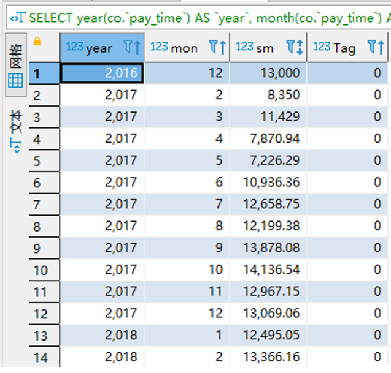

利用上面的SQL作为子查询的源表(表名t4_5代表第4个和第5个指标共用的dws层表),写出DWD层指标语句。

以在线就业班成交均价分析指标为例:

```sql
SELECT
    b.`month`                                                AS `月份` ,
    MAX(CASE WHEN a.`year` = 2019 THEN a.`sm` ELSE NULL END) AS `2019年`,
    MAX(CASE WHEN a.`year` = 2020 THEN a.`sm` ELSE NULL END) AS `2020年`,
    MAX(CASE WHEN a.`year` = 2021 THEN a.`sm` ELSE NULL END) AS `2021年`,
    MAX(CASE WHEN a.`year` = 2022 THEN a.`sm` ELSE NULL END) AS `2022年`
FROM (select num  as month from (
        select num from (
           (select 1 as  num) union all
           (select 2 as  num) union all
           (select 3 as  num) union all
           (select 4 as  num) union all
           (select 5 as  num) union all
           (select 6 as  num) union all
           (select 7 as  num) union all
           (select 8 as  num) union all
           (select 9 as  num) union all
           (select 10 as num) union all
           (select 11 as num) union all
           (select 12 as num)) t ) t where num<=12) b
         LEFT JOIN
     (
		 SELECT
		     year(co.`pay_time`) AS `year`,
		     month(co.`pay_time`) AS `mon`,
		     round(SUM(co.`payable_amount` + co.`charge_against_amount`) / COUNT(1), 2) AS `sm`,
		     0 as Tag
		  FROM
		      bxg.dwd_oe_stu_course  AS osc
		          LEFT JOIN bxg.dwd_oe_stu_course_order AS co ON co.`stu_course_id` =  osc.`id`
		 WHERE 1 = 1
		   -- 支付状态：支付完成
		   AND  co.`pay_status` = 2
		   -- 未删除订单
		   AND  co.`order_delete_flag` = 0
		   -- 课程学员记录未删除
		   AND  osc.`delete_flag` = 0
		   -- 排除N12分摊转移
		   AND  co.`terminal` != 7
		  -- 转班情况只取第一次的订单，转班后的订单不重复计算
		  AND co.`is_target_order`= 0
		   -- 排除测试课
		   AND  osc.`oc_id` NOT IN  (555,72)
		   -- 在线就业班范围
		   AND  (osc.`course_type` = 0 AND osc.`grade_name` LIKE '%在线就业班%' AND osc.`grade_name` NOT LIKE '%SVIP%')
		 GROUP BY `year`, `mon`
		 HAVING COUNT(1) > 0
) a   
     on a.`mon` = b.`month`
WHERE a.Tag = 0
GROUP BY b.`month`
ORDER BY `月份`;

```

查询结果：

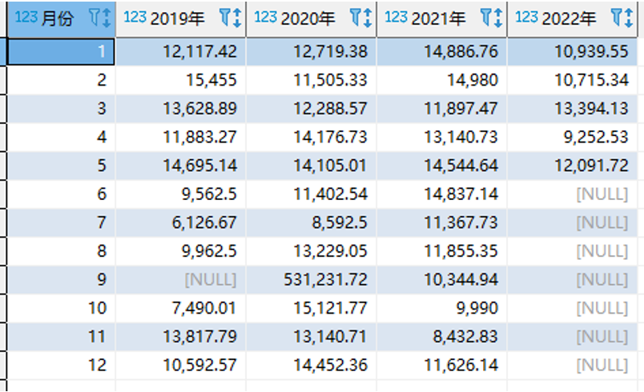

#### 实现

##### hudi_dws层

创建hudi_dws层映射表

```sql
-- 创建第1个指标和第2个指标共用的DWS层映射表hudi_dws_t1_2

CREATE TABLE if not exists hudi_dws_t1_2(
`month`             STRING
,`Online_Order`     BIGINT
,`SVIP_Order`       BIGINT
,`Live_Order`       BIGINT
,`Annual_Order`     BIGINT
,`Semi_Order`       BIGINT
,`Quarterly_Order`  BIGINT
,`Monthly_Order`    BIGINT
,`Online_amount`    DECIMAL(38, 6)
,`SVIP_amount`      DECIMAL(38, 6)
,`Live_amount`      DECIMAL(38, 6)
,`Annual_amount`    DECIMAL(38, 6)
,`Semi_amount`      DECIMAL(38, 6)
,`Quarterly_amount` DECIMAL(38, 6)
,`Monthly_amount`   DECIMAL(38, 6)
,PRIMARY KEY (`month`) NOT ENFORCED
)WITH(
    'connector'='hudi'
    ,'path'= 'hdfs://node1:8020/hudi/bxg/dws_t1_2'
    ,'hoodie.datasource.write.recordkey.field'= '`month`'
    ,'write.tasks'= '1'
    ,'compaction.tasks'= '1'
    ,'write.rate.limit'= '2000'
    ,'table.type'= 'MERGE_ON_READ'
    ,'compaction.async.enabled'= 'true'
    ,'compaction.trigger.strategy'= 'num_commits'
    ,'compaction.delta_commits'= '1'
    ,'changelog.enabled'= 'true'
    ,'read.tasks' = '1'
    ,'read.streaming.enabled'= 'true'
    ,'read.start-commit'='earliest'
    ,'read.streaming.check-interval'= '3'
    ,'hive_sync.enable'= 'true'
    ,'hive_sync.mode'= 'hms'
    ,'hive_sync.metastore.uris'= 'thrift://node1:9083'
    ,'hive_sync.table'= 'dws_t1_2'
    ,'hive_sync.db'= 'bxg'
    ,'hive_sync.username'= ''
    ,'hive_sync.password'= ''
    ,'hive_sync.support_timestamp'= 'true'
);
-- 创建第3个和第6个指标共用的DWS层映射表hudi_dws_t3_6

CREATE TABLE if not exists hudi_dws_t3_6(
 `C_ID`             INT
,`C_Name`           STRING
,`C_type`           STRING
,`p_1m`             BIGINT
,`p_2m`             BIGINT
,`p_3m`             BIGINT
,`p_4m`             BIGINT
,`p_5m`             BIGINT
,`p_6m`             BIGINT
,`p_7m`             BIGINT
,`p_8m`             BIGINT
,`p_9m`             BIGINT
,`p_10m`            BIGINT
,`p_11m`            BIGINT
,`p_12m`            BIGINT
,`total`            BIGINT
,`a_1m`             DECIMAL(38, 6)
,`a_2m`             DECIMAL(38, 6)
,`a_3m`             DECIMAL(38, 6)
,`a_4m`             DECIMAL(38, 6)
,`a_5m`             DECIMAL(38, 6)
,`a_6m`             DECIMAL(38, 6)
,`a_7m`             DECIMAL(38, 6)
,`a_8m`             DECIMAL(38, 6)
,`a_9m`             DECIMAL(38, 6)
,`a_10m`            DECIMAL(38, 6)
,`a_11m`            DECIMAL(38, 6)
,`a_12m`            DECIMAL(38, 6)
,`A_avg_price`     DECIMAL(38, 6)
,PRIMARY KEY (`C_ID`) NOT ENFORCED
)WITH(
    'connector'='hudi'
    ,'path'= 'hdfs://node1:8020/hudi/bxg/dws_t3_6'
    ,'hoodie.datasource.write.recordkey.field'= '`month`'
    ,'write.tasks'= '1'
    ,'compaction.tasks'= '1'
    ,'write.rate.limit'= '2000'
    ,'table.type'= 'MERGE_ON_READ'
    ,'compaction.async.enabled'= 'true'
    ,'compaction.trigger.strategy'= 'num_commits'
    ,'compaction.delta_commits'= '1'
    ,'changelog.enabled'= 'true'
    ,'read.tasks' = '1'
    ,'read.streaming.enabled'= 'true'
    ,'read.start-commit'='earliest'
    ,'read.streaming.check-interval'= '3'
    ,'hive_sync.enable'= 'true'
    ,'hive_sync.mode'= 'hms'
    ,'hive_sync.metastore.uris'= 'thrift://node1:9083'
    ,'hive_sync.table'= 'dws_t3_6'
    ,'hive_sync.db'= 'bxg'
    ,'hive_sync.username'= ''
    ,'hive_sync.password'= ''
    ,'hive_sync.support_timestamp'= 'true'
);
-- 创建第4个和第5个指标共用的DWS层映射表hudi_dws_t4_5

CREATE TABLE if not exists hudi_dws_t4_5(
`year`     BIGINT
,`mon`     BIGINT
,`sm`      DECIMAL(35, 2)
,`Tag`     INT
,PRIMARY KEY (`year`,`mon` ,`Tag`) NOT ENFORCED
)WITH(
    'connector'='hudi'
    ,'path'= 'hdfs://node1:8020/hudi/bxg/dws_t4_5'
    ,'hoodie.datasource.write.recordkey.field'= '`month`'
    ,'write.tasks'= '1'
    ,'compaction.tasks'= '1'
    ,'write.rate.limit'= '2000'
    ,'table.type'= 'MERGE_ON_READ'
    ,'compaction.async.enabled'= 'true'
    ,'compaction.trigger.strategy'= 'num_commits'
    ,'compaction.delta_commits'= '1'
    ,'changelog.enabled'= 'true'
    ,'read.tasks' = '1'
    ,'read.streaming.enabled'= 'true'
    ,'read.start-commit'='earliest'
    ,'read.streaming.check-interval'= '3'
    ,'hive_sync.enable'= 'true'
    ,'hive_sync.mode'= 'hms'
    ,'hive_sync.metastore.uris'= 'thrift://node1:9083'
    ,'hive_sync.table'= 'dws_t4_5'
    ,'hive_sync.db'= 'bxg'
    ,'hive_sync.username'= ''
    ,'hive_sync.password'= ''
    ,'hive_sync.support_timestamp'= 'true'
);
```

插入数据

```sql
-- hudi_dws_t1_2

INSERT INTO hudi_dws_t1_2
SELECT
date_format(oo.`pay_time`, 'yyyy.MM') AS `month`,
COUNT(CASE WHEN (oso.`course_type` = 0 AND oso.`grade_name` LIKE '%在线就业班%' AND oso.`grade_name` NOT LIKE '%SVIP%') THEN oo.`id` ELSE NULL END) AS `Online_Order`,
COUNT(CASE WHEN (oso.`course_type` = 0 AND oso.`grade_name` LIKE '%SVIP%') THEN oo.`id` ELSE NULL END) AS `SVIP_Order`,
COUNT(CASE WHEN (oso.`oc_id` in (3264, 3400, 3912, 4036, 4293, 4314, 4511, 4454)) THEN oo.`id` ELSE NULL END) AS `Live_Order`,
COUNT(CASE WHEN (oso.`course_type` = 0 AND oso.`grade_name` LIKE '【年度钻石会员】%') THEN oo.`id` ELSE NULL END) AS `Annual_Order`,
COUNT(CASE WHEN (oso.`course_type` = 0 AND oso.`grade_name` LIKE '【钻石会员】%') THEN oo.`id` ELSE NULL END) AS `Semi_Order`,
COUNT(CASE WHEN ((oso.`course_type` = 0 OR oso.`course_type` = 1) AND oso.`grade_name` LIKE '【季度铂金会员】%') THEN oo.`id` ELSE NULL END) AS `Quarterly_Order`,
COUNT(CASE WHEN ((oso.`course_type` = 0 OR oso.`course_type` = 1) AND oso.`grade_name` LIKE '【月度黄金会员】%') THEN oo.`id` ELSE NULL END) AS `Monthly_Order`,
SUM(CASE WHEN (oso.`course_type` = 0 AND oso.`grade_name` LIKE '%在线就业班%' AND oso.`grade_name` NOT LIKE '%SVIP%') THEN (oo.`payable_amount` + oo.`charge_against_amount`) ELSE 0 END) / 10000 AS `Online_amount`,
SUM(CASE WHEN (oso.`course_type` = 0 AND oso.`grade_name` LIKE '%SVIP%') THEN (oo.`payable_amount` + oo.`charge_against_amount`) ELSE 0 END) / 10000 AS `SVIP_amount`,
SUM(CASE WHEN (oso.`oc_id` in (3264, 3400, 3912, 4036, 4293, 4314, 4511, 4454)) THEN (oo.`payable_amount` + oo.`charge_against_amount`) ELSE 0 END) / 10000 AS `Live_amount`,
SUM(CASE WHEN (oso.`course_type` = 0 AND oso.`grade_name` LIKE '【年度钻石会员】%') THEN (oo.`payable_amount` + oo.`charge_against_amount`) ELSE 0 END) / 10000 AS `Annual_amount`,
SUM(CASE WHEN (oso.`course_type` = 0 AND oso.`grade_name` LIKE '【钻石会员】%') THEN (oo.`payable_amount` + oo.`charge_against_amount`) ELSE 0 END) / 10000 AS `Semi_amount`,
SUM(CASE WHEN ((oso.`course_type` = 0 OR oso.`course_type` = 1) AND oso.`grade_name` LIKE '【季度铂金会员】%') THEN (oo.`payable_amount` + oo.`charge_against_amount`) ELSE 0 END) / 10000 AS `Quarterly_amount`,
SUM(CASE WHEN ((oso.`course_type` = 0 OR oso.`course_type` = 1) AND oso.`grade_name` LIKE '【月度黄金会员】%') THEN (oo.`payable_amount` + oo.`charge_against_amount`) ELSE 0 END) / 10000 AS `Monthly_amount`
FROM  hudi_dwd_oe_order AS oo
LEFT JOIN  hudi_dwd_oe_stu_course_order AS oso ON oo.`id` = oso.`order_id`
WHERE  1=1
-- 支付状态：支付完成
AND  oo.`pay_status` = 2
-- 未删除订单
AND  oo.`delete_flag` is FALSE
-- 去除 N12 分摊转移
AND  oo.`terminal` not in (7)
-- 标识未删除
AND oso.`stu_course_delete_flag` is FALSE
-- 去除转班
AND  oo.`is_target_order` is FALSE
-- 排除测试课
AND  oso.`course_id` NOT IN (555,72)
-- 规定时间
-- AND  year(oo.`pay_time`) >= 2020 AND year(oo.`pay_time`) <= 2022
GROUP BY  date_format(oo.`pay_time`, 'yyyy.MM')
HAVING sum(oo.`payable_amount`) > 0
;
-- hudi_dws_t3_6

INSERT INTO hudi_dws_t3_6
SELECT
    osc.oc_id AS `C_ID`,
    osc.grade_name AS `C_Name`,
    (CASE
         WHEN (osc.`course_type` = 0 AND osc.`grade_name` LIKE '%SVIP%') THEN 'SVIP班'
         WHEN (osc.`course_type` = 0 AND osc.`grade_name` LIKE '【年度钻石会员】%') THEN '年度会员'
         WHEN (osc.`course_type` = 0 AND osc.`grade_name` LIKE '【钻石会员】%') THEN '半年度会员'
         WHEN ((osc.`course_type` = 0 OR osc.`course_type` = 1) AND osc.`grade_name` LIKE '【季度铂金会员】%') THEN '季度会员'
         WHEN ((osc.`course_type` = 0 OR osc.`course_type` = 1) AND osc.`grade_name` LIKE '【月度黄金会员】%') THEN '月度会员'
         WHEN (osc.`oc_id` in (3264,3400,3912,4036,4293,4314,4511,4454)) THEN '直播保薪班'
         WHEN (osc.`course_type` = 0 AND osc.`grade_name` NOT LIKE '%SVIP%' AND osc.`grade_name` LIKE '%在线就业班%') THEN '在线就业班'
         ELSE '其他职业课' END
        ) AS `C_type`,
    COUNT(CASE WHEN month(co.`pay_time`) = 1 THEN osc.`id` ELSE NULL END)     AS `p_1m` ,
    COUNT(CASE WHEN month(co.`pay_time`) = 2 THEN osc.`id` ELSE NULL END)     AS `p_2m` ,
    COUNT(CASE WHEN month(co.`pay_time`) = 3 THEN osc.id ELSE NULL END)       AS `p_3m` ,
    COUNT(CASE WHEN month(co.`pay_time`) = 4 THEN osc.id ELSE NULL END)       AS `p_4m` ,
    COUNT(CASE WHEN month(co.`pay_time`) = 5 THEN osc.id ELSE NULL END)       AS `p_5m` ,
    COUNT(CASE WHEN month(co.`pay_time`) = 6 THEN osc.id ELSE NULL END)       AS `p_6m` ,
    COUNT(CASE WHEN month(co.`pay_time`) = 7 THEN osc.id ELSE NULL END)       AS `p_7m` ,
    COUNT(CASE WHEN month(co.`pay_time`) = 8 THEN osc.id ELSE NULL END)       AS `p_8m` ,
    COUNT(CASE WHEN month(co.`pay_time`) = 9 THEN osc.id ELSE NULL END)       AS `p_9m` ,
    COUNT(CASE WHEN month(co.`pay_time`) = 10 THEN osc.id ELSE NULL END)      AS `p_10m`,
    COUNT(CASE WHEN month(co.`pay_time`) = 11 THEN osc.id ELSE NULL END)      AS `p_11m`,
    COUNT(CASE WHEN month(co.`pay_time`) = 12 THEN osc.id ELSE NULL END)      AS `p_12m`,
    COUNT(osc.`id`) AS `total`,
    IFNULL(SUM(CASE WHEN month(co.`pay_time`) = 1 THEN (co.`payable_amount` + co.`charge_against_amount`) ELSE 0 END)/ case WHEN (COUNT(CASE WHEN month(co.`pay_time`) = 1 THEN osc.`id` ELSE null END)) = 0 then 1 ELSE COUNT(CASE WHEN month(co.`pay_time`) = 1 THEN osc.`id` ELSE null END) end  ,0)   AS `p_1m` ,
    IFNULL(SUM(CASE WHEN month(co.`pay_time`) = 2 THEN (co.`payable_amount` + co.`charge_against_amount`) ELSE 0 END)/ case WHEN (COUNT(CASE WHEN month(co.`pay_time`) = 2 THEN osc.`id` ELSE null END)) = 0 then 1 ELSE COUNT(CASE WHEN month(co.`pay_time`) = 2 THEN osc.`id` ELSE null END) end  ,0)   AS `p_2m` ,
    IFNULL(SUM(CASE WHEN month(co.`pay_time`) = 3 THEN (co.`payable_amount` + co.`charge_against_amount`) ELSE 0 END)/ case WHEN (COUNT(CASE WHEN month(co.`pay_time`) = 3 THEN osc.`id` ELSE null END)) = 0 then 1 ELSE COUNT(CASE WHEN month(co.`pay_time`) = 3 THEN osc.`id` ELSE null END) end  ,0)   AS `p_3m` ,
    IFNULL(SUM(CASE WHEN month(co.`pay_time`) = 4 THEN (co.`payable_amount` + co.`charge_against_amount`) ELSE 0 END)/ case WHEN (COUNT(CASE WHEN month(co.`pay_time`) = 4 THEN osc.`id` ELSE null END)) = 0 then 1 ELSE COUNT(CASE WHEN month(co.`pay_time`) = 4 THEN osc.`id` ELSE null END) end  ,0)   AS `p_4m` ,
    IFNULL(SUM(CASE WHEN month(co.`pay_time`) = 5 THEN (co.`payable_amount` + co.`charge_against_amount`) ELSE 0 END)/ case WHEN (COUNT(CASE WHEN month(co.`pay_time`) = 5 THEN osc.`id` ELSE null END)) = 0 then 1 ELSE COUNT(CASE WHEN month(co.`pay_time`) = 5 THEN osc.`id` ELSE null END) end  ,0)   AS `p_5m` ,
    IFNULL(SUM(CASE WHEN month(co.`pay_time`) = 6 THEN (co.`payable_amount` + co.`charge_against_amount`) ELSE 0 END)/ case WHEN (COUNT(CASE WHEN month(co.`pay_time`) = 6 THEN osc.`id` ELSE null END)) = 0 then 1 ELSE COUNT(CASE WHEN month(co.`pay_time`) = 6 THEN osc.`id` ELSE null END) end  ,0)   AS `p_6m` ,
    IFNULL(SUM(CASE WHEN month(co.`pay_time`) = 7 THEN (co.`payable_amount` + co.`charge_against_amount`) ELSE 0 END)/ case WHEN (COUNT(CASE WHEN month(co.`pay_time`) = 7 THEN osc.`id` ELSE null END)) = 0 then 1 ELSE COUNT(CASE WHEN month(co.`pay_time`) = 7 THEN osc.`id` ELSE null END) end  ,0)   AS `p_7m` ,
    IFNULL(SUM(CASE WHEN month(co.`pay_time`) = 8 THEN (co.`payable_amount` + co.`charge_against_amount`) ELSE 0 END)/ case WHEN (COUNT(CASE WHEN month(co.`pay_time`) = 8 THEN osc.`id` ELSE null END)) = 0 then 1 ELSE COUNT(CASE WHEN month(co.`pay_time`) = 8 THEN osc.`id` ELSE null END) end  ,0)   AS `p_8m` ,
    IFNULL(SUM(CASE WHEN month(co.`pay_time`) = 9 THEN (co.`payable_amount` + co.`charge_against_amount`) ELSE 0 END)/ case WHEN (COUNT(CASE WHEN month(co.`pay_time`) = 9 THEN osc.`id` ELSE null END)) = 0 then 1 ELSE COUNT(CASE WHEN month(co.`pay_time`) = 9 THEN osc.`id` ELSE null END) end  ,0)   AS `p_9m` ,
    IFNULL(SUM(CASE WHEN month(co.`pay_time`) = 10 THEN (co.`payable_amount` + co.`charge_against_amount`) ELSE 0 END)/case WHEN ( COUNT(CASE WHEN month(co.`pay_time`) = 10 THEN osc.`id` ELSE null END)) = 0 then 1 ELSE COUNT(CASE WHEN month(co.`pay_time`) = 10 THEN osc.`id` ELSE null END) end  ,0) AS `p_10m`,
    IFNULL(SUM(CASE WHEN month(co.`pay_time`) = 11 THEN (co.`payable_amount` + co.`charge_against_amount`) ELSE 0 END)/case WHEN ( COUNT(CASE WHEN month(co.`pay_time`) = 11 THEN osc.`id` ELSE null END)) = 0 then 1 ELSE COUNT(CASE WHEN month(co.`pay_time`) = 11 THEN osc.`id` ELSE null END) end  ,0) AS `p_11m`,
    IFNULL(SUM(CASE WHEN month(co.`pay_time`) = 12 THEN (co.`payable_amount` + co.`charge_against_amount`) ELSE 0 END)/case WHEN ( COUNT(CASE WHEN month(co.`pay_time`) = 12 THEN osc.`id` ELSE null END)) = 0 then 1 ELSE COUNT(CASE WHEN month(co.`pay_time`) = 12 THEN osc.`id` ELSE null END) end  ,0) AS `p_12m`,
    IFNULL(SUM(co.`payable_amount` + co.`charge_against_amount`) / COUNT(1),0) AS `A_avg_price`
 FROM
          hudi_dwd_oe_stu_course  AS osc
              LEFT JOIN  hudi_dwd_oe_stu_course_order AS co ON co.`stu_course_id` =  osc.`id`
WHERE 1=1
  -- 支付状态：支付完成
           AND  co.`pay_status` = 2
           -- 未删除订单
           AND  co.`order_delete_flag` is FALSE
           -- 课程学员记录未删除
           AND  osc.`delete_flag` is FALSE
           -- 排除N12分摊转移
           AND  co.`terminal` not in (7)
-- 转班情况只取第一次的订单，转班后的订单不重复计算
           AND co.`is_target_order` is FALSE
           -- 排除测试课
           AND  osc.`oc_id` NOT IN  (555,72)
         -- 职业课范围
           AND(
                osc.`course_type` = 0  OR
                osc.`grade_name` LIKE '【季度铂金会员】%' OR
                osc.`grade_name` LIKE '【月度黄金会员】%' OR
                osc.`oc_id` in (3264, 3400, 3912, 4036)
           )
          AND year(co.`pay_time`) =  year(now())
GROUP BY
    osc.`grade_name`, osc.`oc_id`, osc.`course_type`
;
-- hudi_dws_t4_5

INSERT INTO hudi_dws_t4_5
SELECT
     IFNULL(year(co.`pay_time`),-1)  AS `year`,
     IFNULL(month(co.`pay_time`),-1) AS `mon`,
     round(SUM(co.`payable_amount` + co.`charge_against_amount`) / COUNT(1), 2) AS `sm`,
     0 as `Tag`
  FROM
      hudi_dwd_oe_stu_course  AS osc
          LEFT JOIN hudi_dwd_oe_stu_course_order AS co ON co.`stu_course_id` =  osc.`id`
 WHERE 1 = 1
   -- 支付状态：支付完成
   AND  co.`pay_status` = 2
   -- 未删除订单
   AND  co.`order_delete_flag` is FALSE
   -- 课程学员记录未删除
   AND  osc.`delete_flag` is FALSE
   -- 排除N12分摊转移
   AND  co.`terminal` not in (7)
  -- 转班情况只取第一次的订单，转班后的订单不重复计算
   AND co.`is_target_order` is FALSE
   -- 排除测试课
   AND  osc.`oc_id` NOT IN  (555,72)
   -- 在线就业班范围
   AND  (osc.`course_type` = 0 AND osc.`grade_name` LIKE '%在线就业班%' AND osc.`grade_name` NOT LIKE '%SVIP%')
 GROUP BY  year(co.`pay_time`), month(co.`pay_time`)
 HAVING COUNT(1) > 0
 UNION 
 SELECT
    year(co.`pay_time`) AS `year`,
    month(co.`pay_time`) AS `mon`,
    round(SUM(co.`payable_amount` + co.`charge_against_amount`) / COUNT(1), 2) AS `sm`,
    1  as Tag
  FROM
      hudi_dwd_oe_stu_course  AS osc
          LEFT JOIN hudi_dwd_oe_stu_course_order AS co ON co.`stu_course_id` =  osc.`id`
 WHERE 1 = 1
   -- 支付状态：支付完成
   AND  co.`pay_status` = 2
   -- 未删除订单
   AND  co.`order_delete_flag` is FALSE
   -- 课程学员记录未删除
   AND  osc.`delete_flag` is FALSE
   -- 排除N12分摊转移
   AND  co.`terminal` not in (7)
  -- 转班情况只取第一次的订单，转班后的订单不重复计算
  AND co.`is_target_order` is FALSE
   -- 排除测试课
   AND  osc.`oc_id` NOT IN  (555,72)
   -- 年度会员范围
   AND  (osc.`course_type` = 0 AND osc.`grade_name` LIKE '%【年度%')
 GROUP BY year(co.`pay_time`),month(co.`pay_time`)
 HAVING COUNT(1) > 0
;
```

查看flink任务运行结果:

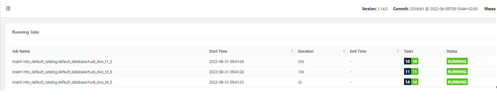

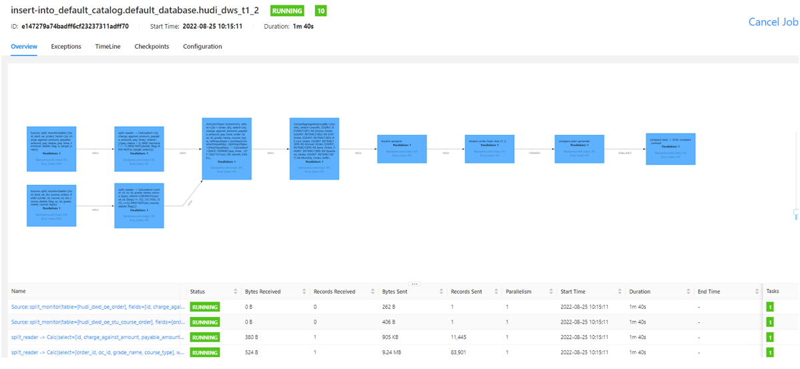

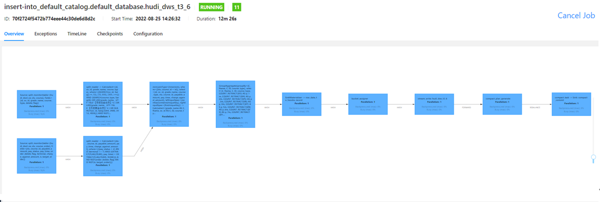

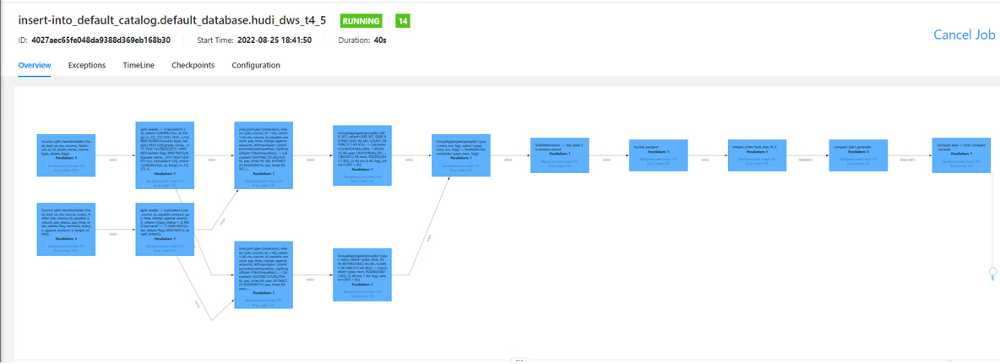

查看hudi中数据写入情况:

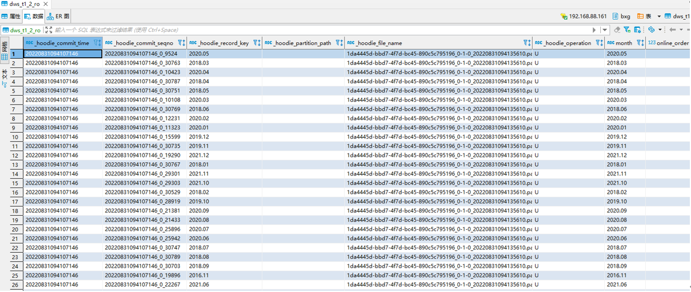

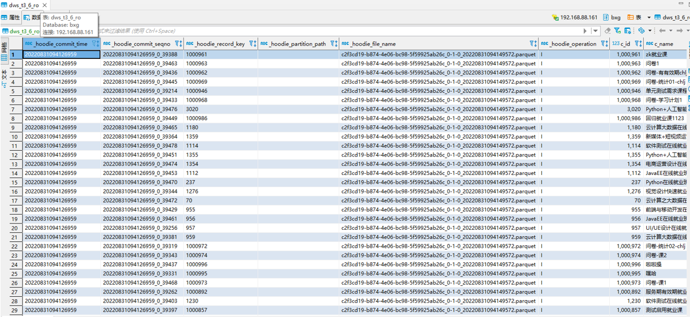

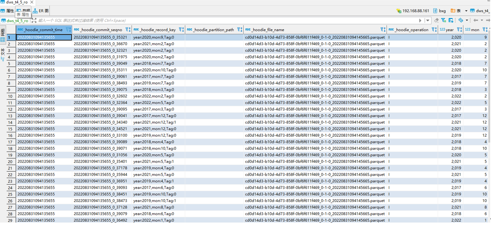

核对DWD层查询指标SQL数据与hudi中DWS层的数据,是否数据完整且一致,当前查询结果一致

##### doris_dws层

在doris中创建dws表

```sql
-- bxg.dws_t1_2
CREATE TABLE IF NOT EXISTS bxg.dws_t1_2
(
`month`             varchar(32) NOT NULL
,`Online_Order`     BIGINT
,`SVIP_Order`       BIGINT
,`Live_Order`       BIGINT
,`Annual_Order`     BIGINT
,`Semi_Order`       BIGINT
,`Quarterly_Order`  BIGINT
,`Monthly_Order`    BIGINT
,`Online_amount`    DECIMAL(27,6)
,`SVIP_amount`      DECIMAL(27,6)
,`Live_amount`      DECIMAL(27,6)
,`Annual_amount`    DECIMAL(27,6)
,`Semi_amount`      DECIMAL(27,6)
,`Quarterly_amount` DECIMAL(27,6)
,`Monthly_amount`   DECIMAL(27,6)
) Unique Key (`month` )
DISTRIBUTED BY HASH(`month`) BUCKETS 10
PROPERTIES (
"replication_allocation" = "tag.location.default: 1"
);
-- bxg.dws_t3_6
CREATE TABLE IF NOT EXISTS bxg.dws_t3_6
(
`C_ID`              INT NOT NULL
,`C_Name`           STRING
,`C_type`           STRING
,`p_1m`             BIGINT
,`p_2m`             BIGINT
,`p_3m`             BIGINT
,`p_4m`             BIGINT
,`p_5m`             BIGINT
,`p_6m`             BIGINT
,`p_7m`             BIGINT
,`p_8m`             BIGINT
,`p_9m`             BIGINT
,`p_10m`            BIGINT
,`p_11m`            BIGINT
,`p_12m`            BIGINT
,`total`            BIGINT
,`a_1m`            DECIMAL(27,6)
,`a_2m`            DECIMAL(27,6)
,`a_3m`            DECIMAL(27,6)
,`a_4m`            DECIMAL(27,6)
,`a_5m`            DECIMAL(27,6)
,`a_6m`            DECIMAL(27,6)
,`a_7m`            DECIMAL(27,6)
,`a_8m`            DECIMAL(27,6)
,`a_9m`            DECIMAL(27,6)
,`a_10m`           DECIMAL(27,6)
,`a_11m`           DECIMAL(27,6)
,`a_12m`           DECIMAL(27,6)
,`A_avg_price`    DECIMAL(27,6)
) Unique Key (`C_ID`)
DISTRIBUTED BY HASH(`C_ID`) BUCKETS 10
PROPERTIES (
"replication_allocation" = "tag.location.default: 1"
);
-- bxg.dws_t4_5
CREATE TABLE IF NOT EXISTS bxg.dws_t4_5
(
`year`     BIGINT NOT NULL
,`mon`     BIGINT
,`Tag`     INT
,`sm`      DECIMAL(27, 2)
) Unique Key (`year`,`mon`,`Tag`)
DISTRIBUTED BY HASH(`year`) BUCKETS 2
PROPERTIES (
"replication_allocation" = "tag.location.default: 1"
);

```

在flink sql-cli中创建doris_dws层映射

```sql
-- doris_dws_t1_2
CREATE TABLE if not exists doris_dws_t1_2(
`month`             STRING
,`Online_Order`     BIGINT
,`SVIP_Order`       BIGINT
,`Live_Order`       BIGINT
,`Annual_Order`     BIGINT
,`Semi_Order`       BIGINT
,`Quarterly_Order`  BIGINT
,`Monthly_Order`    BIGINT
,`Online_amount`    DECIMAL(38, 6)
,`SVIP_amount`      DECIMAL(38, 6)
,`Live_amount`      DECIMAL(38, 6)
,`Annual_amount`    DECIMAL(38, 6)
,`Semi_amount`      DECIMAL(38, 6)
,`Quarterly_amount` DECIMAL(38, 6)
,`Monthly_amount`   DECIMAL(38, 6)
,PRIMARY KEY (`month`) NOT ENFORCED
)WITH(
    'fenodes' = 'node1:8030'
    ,'table.identifier' = 'bxg.dws_t1_2'
    ,'sink.enable-delete' = 'true'
    ,'sink.properties.strip_outer_array' = 'true'
,'sink.batch.size' = '2000'
    ,'username' = 'root'
    ,'password' = '123456'
    ,'connector' = 'doris'
    ,'sink.batch.interval' = '10s'
    ,'sink.max-retries' = '5'
    ,'sink.properties.format' = 'json'
);
-- doris_dws_t3_6
CREATE TABLE if not exists doris_dws_t3_6(
 `C_ID`             INT
,`C_Name`           STRING
,`C_type`           STRING
,`p_1m`             BIGINT
,`p_2m`             BIGINT
,`p_3m`             BIGINT
,`p_4m`             BIGINT
,`p_5m`             BIGINT
,`p_6m`             BIGINT
,`p_7m`             BIGINT
,`p_8m`             BIGINT
,`p_9m`             BIGINT
,`p_10m`            BIGINT
,`p_11m`            BIGINT
,`p_12m`            BIGINT
,`total`            BIGINT
,`a_1m`             DECIMAL(38, 6)
,`a_2m`             DECIMAL(38, 6)
,`a_3m`             DECIMAL(38, 6)
,`a_4m`             DECIMAL(38, 6)
,`a_5m`             DECIMAL(38, 6)
,`a_6m`             DECIMAL(38, 6)
,`a_7m`             DECIMAL(38, 6)
,`a_8m`             DECIMAL(38, 6)
,`a_9m`             DECIMAL(38, 6)
,`a_10m`            DECIMAL(38, 6)
,`a_11m`            DECIMAL(38, 6)
,`a_12m`            DECIMAL(38, 6)
,`A_avg_price`         DECIMAL(38, 6)
,PRIMARY KEY (`C_ID`) NOT ENFORCED
)WITH(
    'fenodes' = 'node1:8030'
    ,'table.identifier' = 'bxg.dws_t3_6'
    ,'sink.enable-delete' = 'true'
    ,'sink.properties.strip_outer_array' = 'true'
,'sink.batch.size' = '2000'
    ,'username' = 'root'
    ,'password' = '123456'
    ,'connector' = 'doris'
    ,'sink.batch.interval' = '10s'
    ,'sink.max-retries' = '5'
    ,'sink.properties.format' = 'json'
);
-- doris_dws_t4_5
CREATE TABLE if not exists doris_dws_t4_5(
`year`     BIGINT
,`mon`     BIGINT
,`Tag`     INT
,`sm`      DECIMAL(35, 2)
)WITH(
    'fenodes' = 'node1:8030'
    ,'table.identifier' = 'bxg.dws_t4_5'
    ,'sink.enable-delete' = 'true'
    ,'sink.properties.strip_outer_array' = 'true'
,'sink.batch.size' = '2000'
    ,'username' = 'root'
    ,'password' = '123456'
    ,'connector' = 'doris'
    ,'sink.batch.interval' = '10s'
    ,'sink.max-retries' = '5'
    ,'sink.properties.format' = 'json'
);

```

插入数据

```sql
INSERT INTO doris_dws_t1_2 
SELECT 
`month`,`Online_Order`,`SVIP_Order`,`Live_Order`,`Annual_Order`,`Semi_Order`,`Quarterly_Order`,`Monthly_Order`,`Online_amount`,`SVIP_amount`,`Live_amount`,`Annual_amount`,`Semi_amount`,`Quarterly_amount`,`Monthly_amount`
FROM hudi_dws_t1_2;

INSERT INTO doris_dws_t3_6 
SELECT
`C_ID`,`C_Name`,`C_type`,`p_1m`,`p_2m`,`p_3m`,`p_4m`,`p_5m`,`p_6m`,`p_7m`,`p_8m`,`p_9m`,`p_10m`,`p_11m`,`p_12m`,`total`,`a_1m`,`a_2m`,`a_3m`,`a_4m`,`a_5m`,`a_6m`,`a_7m`,`a_8m`,`a_9m`,`a_10m`,`a_11m`,`a_12m`,`A_avg_price`
FROM hudi_dws_t3_6;

INSERT INTO  doris_dws_t4_5
SELECT
`year`,`mon`,`Tag`,`sm` 
FROM hudi_dws_t4_5;

```

查询flink作业执行情况：

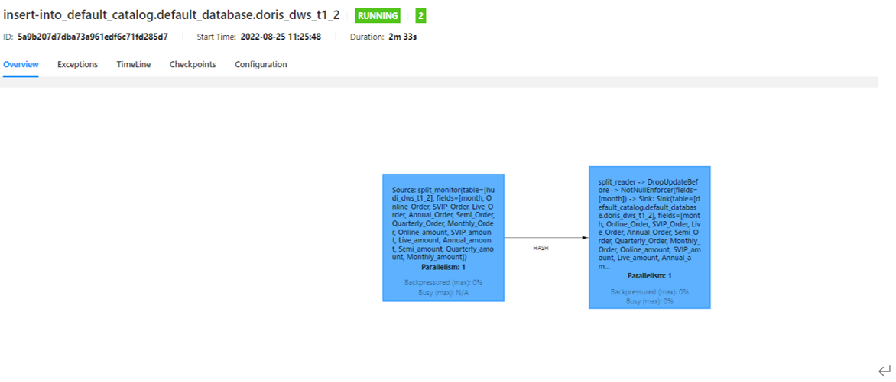

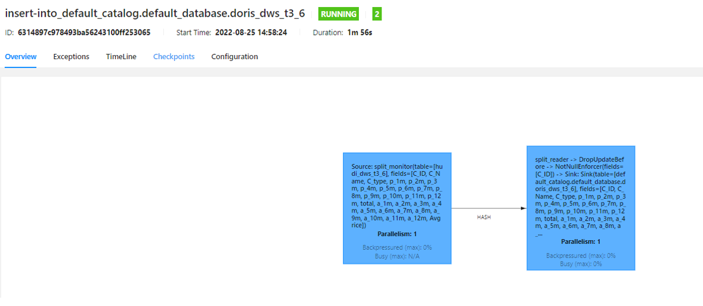

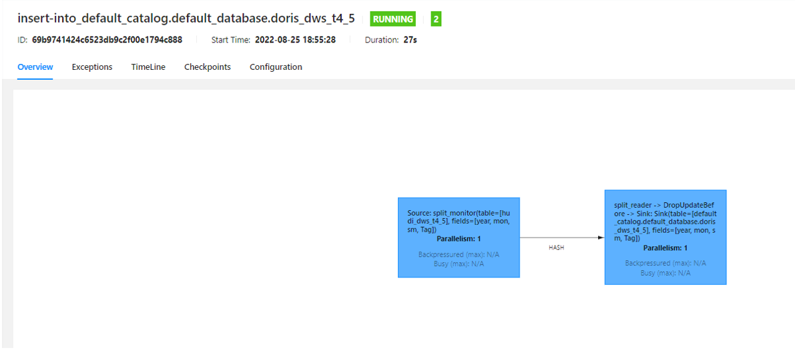

查看doris数据:

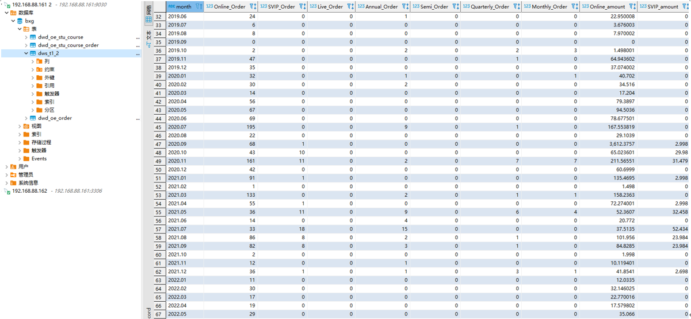

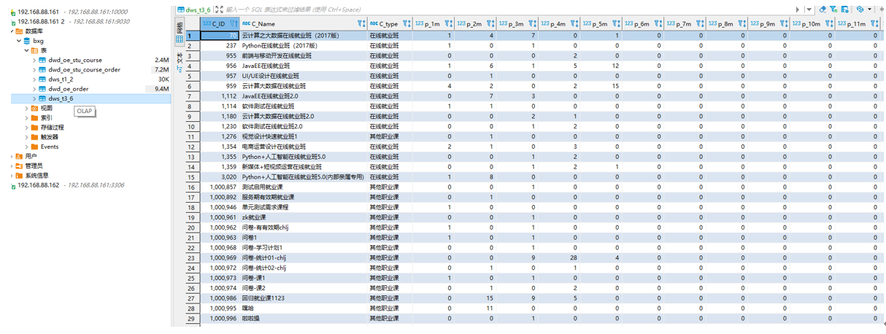

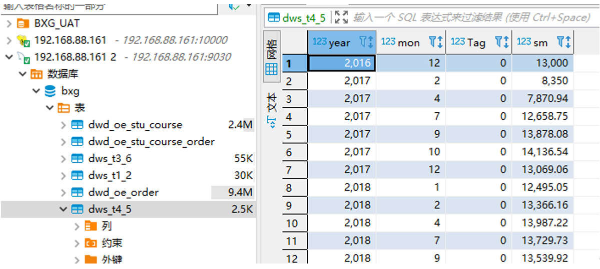

### 指标查询

**注意:将doris查询结果跟mysql参考sql查询结果核对**

2020-2022年各课程类型的全款订单量

```sql
SELECT
month  as `月份`
,Online_Order  as `在线就业班`
,SVIP_Order    as  `直播保薪班`
,Annual_Order  as  `年度会员`
,Semi_Order  as `半年度会员`
,Quarterly_Order as  `季度会员`
,Monthly_Order  as  `月度会员`
FROM
bxg.dws_t1_2
WHERE  `month` >= 2020.01 AND  `month`  <= 2022.12
ORDER BY `month`;

```

2020-2022年各课程类型的全款金额

```sql
SELECT
month  as `月份`
,Online_amount  as `在线就业班`
,SVIP_amount    as  `直播保薪班`
,Annual_amount  as  `年度会员`
,Semi_amount  as `半年度会员`
,Quarterly_amount as  `季度会员`
,Monthly_amount  as  `月度会员`
FROM
bxg.dws_t1_2
WHERE  `month` >= 2020.01 AND  `month`  <= 2022.12
ORDER BY `month`;

```

2022年职业课各课程的全款订单量详情表

```sql
SELECT 
`C_ID`   AS  `课程id`,
`C_Name` AS  `课程名称`,
`C_type` AS  `课程类型`,
`p_1m`   AS  `1月`, 
`p_2m`   AS  `2月`, 
`p_3m`   AS  `3月`, 
`p_4m`   AS  `4月`, 
`p_5m`   AS  `5月`, 
`p_6m`   AS  `6月`, 
`p_7m`   AS  `7月`, 
`p_8m`   AS  `8月`, 
`p_9m`   AS  `9月`, 
`p_10m`  AS  `10月`, 
`p_11m`  AS  `11月`, 
`p_12m`  AS  `12月`, 
`total`  AS  `总计`
FROM  bxg.dws_t3_6
ORDER BY `C_ID` ;

```

在线就业班成交均价分析

```sql
SELECT
    b.`month`                                                AS `月份` ,
    MAX(CASE WHEN a.`year` = 2019 THEN a.`sm` ELSE NULL END) AS `2019年`,
    MAX(CASE WHEN a.`year` = 2020 THEN a.`sm` ELSE NULL END) AS `2020年`,
    MAX(CASE WHEN a.`year` = 2021 THEN a.`sm` ELSE NULL END) AS `2021年`,
    MAX(CASE WHEN a.`year` = 2022 THEN a.`sm` ELSE NULL END) AS `2022年`
FROM (select num  as month from (
        select num from (
           (select 1 as  num) union all
           (select 2 as  num) union all
           (select 3 as  num) union all
           (select 4 as  num) union all
           (select 5 as  num) union all
           (select 6 as  num) union all
           (select 7 as  num) union all
           (select 8 as  num) union all
           (select 9 as  num) union all
           (select 10 as num) union all
           (select 11 as num) union all
           (select 12 as num)) t ) t where num<=12) b
         LEFT JOIN
    bxg.dws_t4_5  as a
     on a.`mon` = b.`month`
WHERE a.Tag =0
GROUP BY b.`month`
ORDER BY `月份`;

```

年度会员成交均价分析

```sql
SELECT
    b.`month`                                                AS `月份` ,
    MAX(CASE WHEN a.`year` = 2019 THEN a.`sm` ELSE NULL END) AS `2019年`,
    MAX(CASE WHEN a.`year` = 2020 THEN a.`sm` ELSE NULL END) AS `2020年`,
    MAX(CASE WHEN a.`year` = 2021 THEN a.`sm` ELSE NULL END) AS `2021年`,
    MAX(CASE WHEN a.`year` = 2022 THEN a.`sm` ELSE NULL END) AS `2022年`
FROM (select num  as month from (
        select num from (
           (select 1 as  num) union all
           (select 2 as  num) union all
           (select 3 as  num) union all
           (select 4 as  num) union all
           (select 5 as  num) union all
           (select 6 as  num) union all
           (select 7 as  num) union all
           (select 8 as  num) union all
           (select 9 as  num) union all
           (select 10 as num) union all
           (select 11 as num) union all
           (select 12 as num)) t ) t where num<=12) b
         LEFT JOIN
    bxg.dws_t4_5  as a
     on a.`mon` = b.`month`
WHERE a.Tag =1
GROUP BY b.`month`
ORDER BY `月份`;

```

2022年职业课各课程成交均价详情表

```sql
SELECT
`C_ID`   AS  `课程id`,
`C_Name` AS  `课程名称`,
`C_type` AS  `课程类型`,
`a_1m`   AS  `1月`,
`a_2m`   AS  `2月`,
`a_3m`   AS  `3月`,
`a_4m`   AS  `4月`,
`a_5m`   AS  `5月`,
`a_6m`   AS  `6月`,
`a_7m`   AS  `7月`,
`a_8m`   AS  `8月`,
`a_9m`   AS  `9月`,
`a_10m`  AS  `10月`,
`a_11m`  AS  `11月`,
`a_12m`  AS  `12月`,
`A_avg_price`  AS  `年平均成交价`
FROM  bxg.dws_t3_6
ORDER BY `C_ID` ;

```

# 知识点10： 【掌握】退费分析看板

## 看板相关指标

1.  博学谷全部课程退费量和退费金额分析
2.  全部课程不同退费类型的退费量分析
3.  全部课程不同退费类型的退费金额分析
4.  不同时期的全部课程问题退费量分析
5.  不同时期的全部课程问题退费金额分析
6.  进班后的职业课各类型的问题退费量分析
7.  进班后的职业课各类型的问题退费金额分析
8.  2021年全部课程进班后的问题退费量详情表
9.  2021年全部课程的转线下退费量详情表
10. 2021年全部课程的转线下退费金额详情表
11. 2021年全部课程的线上互转量详情表

## 看板需求

退费分析看板，分析的主要是不同课程、不同退费类型、不同时期的退费量和退费金额。目的是对退费情况做分析，以把控和减少退费率。原始数据来源于业务系统的Mysql数据库。

### 需求

#### 博学谷全部课程退费量和退费金额分析

- 说明：对退费情况做分析，以把控和减少退费率。

- 展示：柱状图、折线图

- 指标：退费量、退费金额

- 维度：时间、退费类型

- 粒度：月

- 涉及库：bxg

- 涉及表：bxg.oe_order_refund、bxg.oe_order


#### 全部课程不同退费类型的退费量分析

- 说明：对退费情况做分析，以把控和减少退费率。

- 展示：柱状图、折线图

- 指标：退费量

- 维度：时间、退费类型

- 粒度：月

- 涉及库：bxg

- 涉及表：bxg.oe_order_refund、bxg.oe_order


#### 全部课程不同退费类型的退费金额分析

- 说明：对退费情况做分析，以把控和减少退费率。

- 展示：柱状图、折线图

- 指标：退费金额

- 维度：时间

- 粒度：月

- 涉及库：bxg

- 涉及表：bxg.oe_order_refund、bxg.oe_order


#### 不同时期的全部课程问题退费量分析

- 说明：对退费情况做分析，以把控和减少退费率。

- 展示：柱状图、折线图

- 指标：退费量

- 维度：时间

- 粒度：月

- 涉及库：bxg

- 涉及表：bxg.oe_order_refund、bxg.oe_stu_course_order、bxg.oe_stu_course、bxg.oe_order、bxg.oe_order_refund_apply


#### 不同时期的全部课程问题退费金额分析

- 说明：对退费情况做分析，以把控和减少退费率。

- 展示：柱状图、折线图

- 指标：退费金额

- 维度：时间

- 粒度：月

- 涉及库：bxg

- 涉及表：bxg.oe_order_refund、bxg.oe_stu_course_order、bxg.oe_stu_course、bxg.oe_order、bxg.oe_order_refund_apply


#### 进班后的职业课各类型的问题退费量分析

- 说明：对退费情况做分析，以把控和减少退费率。

- 展示：柱状图、折线图

- 指标：退费量

- 维度：时间、课程类型

- 粒度：月

- 涉及库：bxg

- 涉及表：bxg.oe_order_refund、bxg.oe_stu_course_order、bxg.oe_stu_course、bxg.oe_order、bxg.oe_course


#### 进班后的职业课各类型的问题退费金额分析

- 说明：对退费情况做分析，以把控和减少退费率。

- 展示：柱状图、折线图

- 指标：退费金额

- 维度：时间、课程类型

- 粒度：月

- 涉及库：bxg

- 涉及表：bxg.oe_order_refund、bxg.oe_stu_course_order、bxg.oe_stu_course、bxg.oe_order、bxg.oe_course


#### 2021年全部课程进班后的问题退费量详情表

- 说明：对退费情况做分析，以把控和减少退费率。

- 展示：柱状图、折线图

- 指标：退费量

- 维度：时间、课程类型

- 粒度：月

- 涉及库：bxg

- 涉及表：bxg.oe_order_refund、bxg.oe_stu_course_order、bxg.oe_stu_course、bxg.oe_order、bxg.oe_course


#### 2021年全部课程的转线下退费量详情表

- 说明：对退费情况做分析，以把控和减少退费率。

- 展示：柱状图、折线图

- 指标：退费量

- 维度：时间

- 粒度：月

- 涉及库：bxg

- 涉及表：bxg.oe_order_refund、bxg.oe_stu_course_order、bxg.oe_stu_course、bxg.oe_order、bxg.oe_course


#### 2021年全部课程的转线下退费金额详情表

- 说明：对退费情况做分析，以把控和减少退费率。

- 展示：柱状图、折线图

- 指标：退费金额

- 维度：时间

- 粒度：月

- 涉及库：bxg

- 涉及表：bxg.oe_order_refund、bxg.oe_stu_course_order、bxg.oe_stu_course、bxg.oe_order、bxg.oe_course


#### 2021年全部课程的线上互转量详情表

- 说明：对退费情况做分析，以把控和减少退费率。

- 展示：柱状图、折线图

- 指标：互转量

- 维度：时间

- 粒度：月

- 涉及库：bxg

- 涉及表：bxg.oe_order_refund、bxg.oe_stu_course_order、bxg.oe_stu_course、bxg.oe_order、bxg.oe_course


### 需求说明

#### 退费量

指退费完成时间落在统计时间范围内的退费订单数量

#### 退费金额

指退费完成时间落在统计时间范围内的实际退费金额（包含多交学费退、课程退学退费、转线下退费几种情况，不含线上互转的情况）。

#### 线上互转量

课程A转移到课程B，计算为一次线上互转量。

课程A转移到课程B，又转移到课程C，计算为两次线上互转量。也就是，课程A对应的量记一次，课程B对应的量也记一次。

#### 全部课程的退费分析

都是全款后的退费分析，全款之前的不考虑。

包含指标：博学谷全部课程退费量和退费金额分析、全部课程不同退费类型的退费量分析、全部课程不同退费类型的退费金额分析。

#### 全部课程的问题退费分析

问题退费指，课程退学退费、全款后预交学费退费。全部课程，就是所有的课程。进班后七天内包含第七天。

包含指标：不同时期的全部课程问题退费量分析、不同时期的全部课程问题退费金额分析。

#### 进班后的问题退费分析

进班后问题退费指，课程退学退费。

包含指标：进班后的职业课各类型的问题退费量分析、进班后的职业课各类型的问题退费金额分析、2021年全部课程进班后的问题退费量详情表。

#### 转线下退费分析

即全款后转线下。转线下的三种退费类型都统计在内。

包含指标：2021年全部课程的转线下退费量详情表、2021年全部课程的转线下退费金额详情表。

#### 线上互转退费分析

全款后线上互转，线上互转的三种退费类型都统计在内。

包含指标：2021年全部课程的线上互转量详情表

### 结果显示

#### 博学谷全部课程退费量和退费金额分析

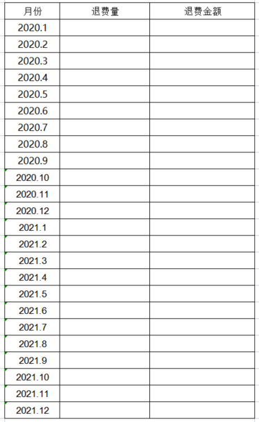

#### 全部课程不同退费类型的退费量分析

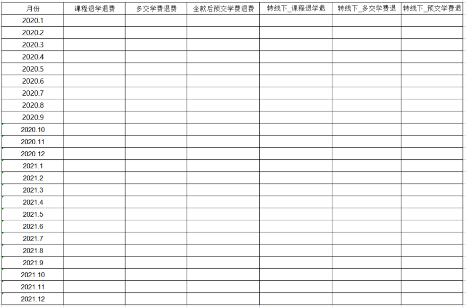

#### 全部课程不同退费类型的退费金额分析

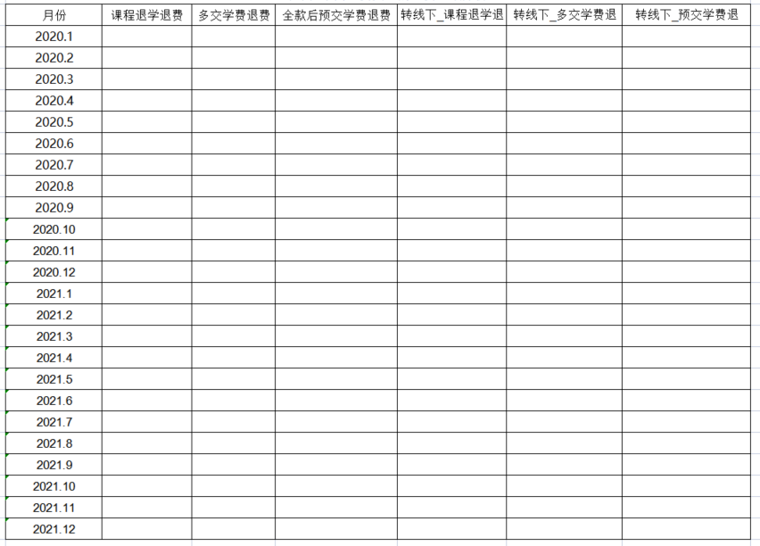

#### 不同时期的全部课程问题退费量分析

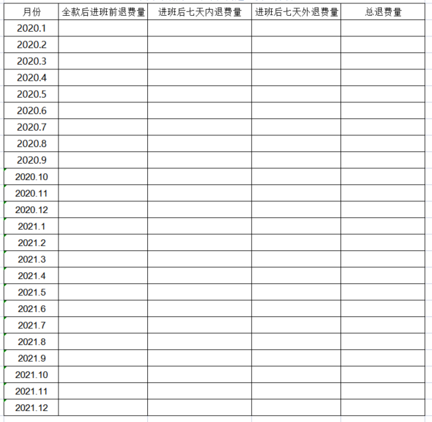

#### 不同时期的全部课程问题退费金额分析

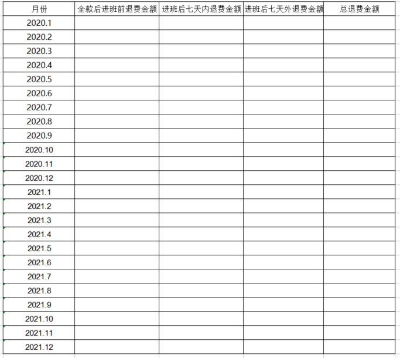

#### 进班后的职业课各类型的问题退费量分析

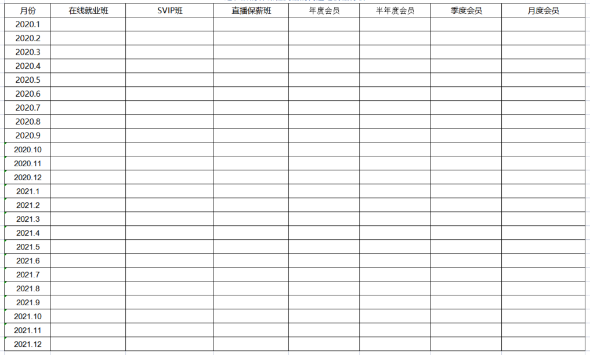

#### 进班后的职业课各类型的问题退费金额分析

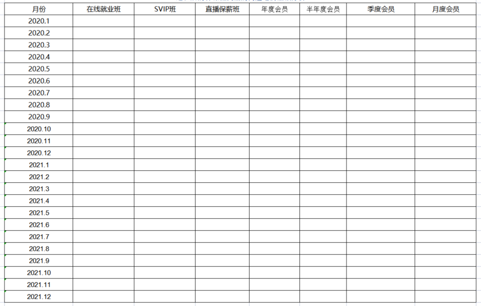

#### 2021年全部课程进班后的问题退费量详情表

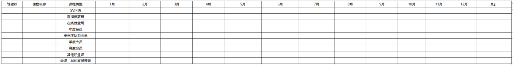

#### 2021年全部课程的转线下退费量详情表

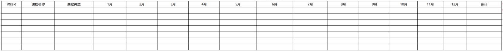

#### 2021年全部课程的转线下退费金额详情表

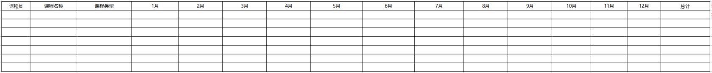

#### 2021年全部课程的线上互转量详情表

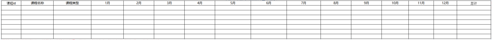

### SQL参考

#### 博学谷全部课程退费量和退费金额分析

```sql
SELECT
    date_format(orf.refund_time, '%Y.%m') AS `月份`,
    count(orf.id) AS `退费量`,
    sum(orf.amount)/10000 AS `退费金额`
FROM
    bxg.oe_order_refund  orf
        JOIN bxg.oe_order  oo ON  orf.order_id=oo.id
WHERE
        orf.delete_flag=0
  AND oo.refund_status=-1
  AND oo.delete_flag=0
  AND oo.pay_status=2
  -- 除去线上互转
  AND orf.refund_type NOT IN(30,31,32)
  AND (year(orf.refund_time)=year(now()) or year(orf.refund_time)=year(date_sub(now(),interval 1 year)) or year(orf.refund_time)=year(date_sub(now(),interval 2 year)))
GROUP BY date_format(orf.refund_time, '%Y.%m')
ORDER BY date_format(orf.refund_time, '%Y.%m') ASC;
```

#### 全部课程不同退费类型的退费量分析

```sql
SELECT
    date_format(orf.refund_time, '%Y.%m') AS `月份`,
    count(CASE WHEN orf.refund_type=10 THEN orf.id ELSE null END) AS `课程退学退费`,
    count(CASE WHEN orf.refund_type=11 THEN orf.id ELSE null END) AS `多交学费退费`,
    count(CASE WHEN orf.refund_type=12 THEN orf.id ELSE null END) AS `全款后预交学费退费`,
    count(CASE WHEN orf.refund_type=20 THEN orf.id ELSE null END) AS `转线下_课程退学退`,
    count(CASE WHEN orf.refund_type=21 THEN orf.id ELSE null END) AS `转线下_多交学费退`,
    count(CASE WHEN orf.refund_type=22 THEN orf.id ELSE null END) AS `转线下_预交学费退`
FROM
    bxg.oe_order_refund  orf
        JOIN  bxg.oe_order oo  ON  orf.order_id=oo.id
WHERE
        orf.delete_flag=0
  AND oo.refund_status=-1
  AND oo.delete_flag=0
  AND oo.pay_status=2
  -- 除去线上互转
  AND orf.refund_type NOT IN(30,31,32)
  AND (year(orf.refund_time)=year(NOW()) or year(orf.refund_time)=year(date_sub(now(),interval 1 year)) or year(orf.refund_time)=year(date_sub(now(),interval 2 year)))
GROUP BY date_format(orf.refund_time, '%Y.%m')
ORDER BY date_format(orf.refund_time, '%Y.%m') ASC;
```

#### 全部课程不同退费类型的退费金额分析

```sql
SELECT
    date_format(orf.refund_time, '%Y.%m') AS `月份`,
    sum(CASE WHEN orf.refund_type=10 THEN orf.amount ELSE 0 END)/10000 AS `课程退学退费`,
    sum(CASE WHEN orf.refund_type=11 THEN orf.amount ELSE 0 END)/10000 AS `多交学费退费`,
    sum(CASE WHEN orf.refund_type=12 THEN orf.amount ELSE 0 END)/10000 AS `全款后预交学费退费`,
    sum(CASE WHEN orf.refund_type=20 THEN orf.amount ELSE 0 END)/10000 AS `转线下_课程退学退`,
    sum(CASE WHEN orf.refund_type=21 THEN orf.amount ELSE 0 END)/10000 AS `转线下_多交学费退`,
    sum(CASE WHEN orf.refund_type=22 THEN orf.amount ELSE 0 END)/10000 AS `转线下_预交学费退`
FROM
    bxg.oe_order_refund  orf
        JOIN
    bxg.oe_order  oo ON orf.order_id=oo.id
WHERE
        orf.delete_flag=0
  AND oo.refund_status=-1
  AND oo.delete_flag=0
  AND oo.pay_status=2
  -- 除去线上互转
  AND orf.refund_type NOT IN(30,31,32)
  AND (year(orf.refund_time)=year(NOW()) or year(orf.refund_time)=year(date_sub(now(),interval 1 year)) or year(orf.refund_time)=year(date_sub(now(),interval 2 year)))
GROUP BY date_format(orf.refund_time, '%Y.%m')
ORDER BY date_format(orf.refund_time, '%Y.%m') ASC;
```

#### 不同时期的全部课程问题退费量分析

```sql
select
    `月份`,
    `全款后进班前退费量`,
    `进班后七天内退费量`,
    `进班后七天外退费量`,
    `全款后进班前退费量`+`进班后七天内退费量`+`进班后七天外退费量` AS `总退费量` from (
                                                           SELECT
                                                               date_format(ora.create_time, '%Y.%m') AS `月份`,
                                                               count(CASE WHEN oo.pay_status=2 AND orf.refund_type=12 THEN orf.id ELSE null END) AS `全款后进班前退费量`,
                                                               count(CASE WHEN oo.pay_status=2 AND sc.effective_date is not null AND orf.refund_type=10  AND abs(datediff(cast(sc.effective_date as datetime),cast(ora.create_time as datetime)))<=7 THEN orf.id ELSE null END) AS `进班后七天内退费量`,
                                                               count(CASE WHEN oo.pay_status=2 AND sc.effective_date is not null AND orf.refund_type=10  AND abs(datediff(cast(sc.effective_date as datetime),cast(ora.create_time as datetime)))>7 THEN orf.id ELSE null END) AS `进班后七天外退费量`
                                                           FROM
                                                               bxg.oe_order_refund orf
                                                                   LEFT JOIN   bxg.oe_stu_course_order sco ON  orf.order_id=sco.order_id AND orf.order_detail_id=sco.order_detail_id
                                                                   LEFT JOIN   bxg.oe_stu_course  sc  ON sc.id=sco.student_course_id
                                                                   LEFT JOIN   bxg.oe_order  oo  ON  oo.id=orf.order_id
                                                                   LEFT JOIN   bxg.oe_order_refund_apply  ora ON orf.order_id=ora.order_id and orf.order_detail_id = ora.order_detail_id
                                                           WHERE
                                                                   orf.delete_flag=0
                                                             AND sco.delete_flag=0
                                                             AND sc.delete_flag=0
                                                             AND oo.refund_status=-1
                                                             AND oo.delete_flag=0
                                                             AND sc.course_id not in (555,1537)
-- 申请状态已完成
                                                             AND ora.status=0
                                                             AND ora.delete_flag=0
                                                             AND (year(orf.refund_time)=year(NOW()) or year(orf.refund_time)=year(date_sub(now(),interval 1 year)) or year(orf.refund_time)=year(date_sub(now(),interval 2 year)))
                                                           GROUP BY date_format(ora.create_time, '%Y.%m')
                                                       ) tb1 order by `月份` asc;
```

#### 不同时期的全部课程问题退费金额分析

```sql
select `月份`,
         `全款后进班前退费金额`,
         `进班后七天内退费金额`,
         `进班后七天外退费金额`,
         `全款后进班前退费金额`+`进班后七天内退费金额`+`进班后七天外退费金额` AS `总退费金额` from (
                                                                                SELECT date_format(ora.create_time, '%Y.%m')                                                        AS `月份`,
                                                                                       sum(CASE WHEN oo.pay_status = 2 AND orf.refund_type = 12 THEN orf.amount ELSE 0 END) / 10000 AS `全款后进班前退费金额`,
                                                                                       sum(CASE
                                                                                               WHEN oo.pay_status = 2 AND sc.effective_date is not null AND orf.refund_type = 10 AND
                                                                                                    abs(datediff(cast(sc.effective_date as datetime), cast(ora.create_time as datetime))) <= 7
                                                                                                   THEN orf.amount
                                                                                               ELSE 0 END) / 10000                                                                  AS `进班后七天内退费金额`,
                                                                                       sum(CASE
                                                                                               WHEN oo.pay_status = 2 AND sc.effective_date is not null AND orf.refund_type = 10 AND
                                                                                                    abs(datediff(cast(sc.effective_date as datetime), cast(ora.create_time as datetime))) > 7
                                                                                                   THEN orf.amount
                                                                                               ELSE 0 END) / 10000                                                                  AS `进班后七天外退费金额`
                                                                                FROM bxg.oe_order_refund orf
                                                                                         LEFT JOIN bxg.oe_stu_course_order sco
                                                                                                   ON orf.order_id = sco.order_id AND orf.order_detail_id = sco.order_detail_id
                                                                                         LEFT JOIN bxg.oe_stu_course sc ON sc.id = sco.student_course_id
                                                                                         LEFT JOIN bxg.oe_order oo ON oo.id = orf.order_id
                                                                                         LEFT JOIN bxg.oe_order_refund_apply ora
                                                                                                   ON orf.order_id = ora.order_id and orf.order_detail_id = ora.order_detail_id
                                                                                WHERE orf.delete_flag = 0
                                                                                  AND sco.delete_flag = 0
                                                                                  AND sc.delete_flag = 0
                                                                                  AND sc.status = 8
                                                                                  AND oo.delete_flag = 0
                                                                                  AND sc.course_id not in (555,1537)
-- 申请状态已完成
                                                                                  AND ora.status = 0
                                                                                  AND ora.delete_flag = 0
                                                                                  AND (year(orf.refund_time) = year(NOW()) or year(orf.refund_time) = year(date_sub(now(), interval 1 year)) or
                                                                                       year(orf.refund_time) = year(date_sub(now(), interval 2 year)))
                                                                                GROUP BY date_format(ora.create_time, '%Y.%m')
                                                                            ) tb1  order by `月份` asc;
```

#### 进班后的职业课各类型的问题退费量分析

```sql
SELECT
    date_format(orf.refund_time, '%Y.%m') AS `月份`,
    count(CASE WHEN  (c.course_type=0 AND c.grade_name NOT LIKE '%SVIP%' AND c.grade_name LIKE '%在线就业班%' ) THEN orf.id ELSE null END) AS `在线就业班`,
    count(CASE WHEN  (c.course_type=0 AND c.grade_name LIKE '%SVIP%') THEN orf.id ELSE null END) AS `SVIP班`,
    count(CASE WHEN  (c.id =3264 or c.id=3400 or c.id=3912 or c.id=4036 or c.id =4293 or c.id =4314 or c.id =4511 or  c.id =4454 ) THEN orf.id ELSE null END) AS `直播保薪班`,
    count(CASE WHEN  (c.course_type=0 AND c.grade_name LIKE '%【年度钻石会员】%') THEN orf.id ELSE null END) AS `年度会员`,
    count(CASE WHEN  (c.course_type=0 AND c.grade_name LIKE '%【钻石会员】%') THEN orf.id ELSE null END) AS `半年度会员`,
    count(CASE WHEN  (c.grade_name LIKE '%【季度铂金会员】%') THEN orf.id ELSE null END) AS `季度会员`,
    count(CASE WHEN  (c.grade_name LIKE '%【月度黄金会员】%') THEN orf.id ELSE null END) AS `月度会员`
FROM
    bxg.oe_order_refund  orf
        LEFT JOIN bxg.oe_stu_course_order  sco ON orf.order_id=sco.order_id AND orf.order_detail_id=sco.order_detail_id
        LEFT JOIN  bxg.oe_stu_course  sc ON  sc.id=sco.student_course_id
        LEFT JOIN  bxg.oe_order oo  ON oo.id=orf.order_id
        LEFT JOIN  bxg.oe_course  c  ON  sc.course_id=c.id
WHERE
        orf.delete_flag=0
  AND sco.delete_flag=0
  AND sc.delete_flag=0
  AND sc.status=8
  AND oo.delete_flag=0
  AND oo.pay_status=2
  AND sc.course_id not in (555,1537)
  AND sc.effective_date is not null
  -- 课程退学退
  AND orf.refund_type=10
  AND (year(orf.refund_time)=year(NOW()) or year(orf.refund_time)=year(date_sub(now(),interval 1 year)) or year(orf.refund_time)=year(date_sub(now(),interval 2 year)))
GROUP BY date_format(orf.refund_time, '%Y.%m')
ORDER BY date_format(orf.refund_time, '%Y.%m') ASC;
```

#### 进班后的职业课各类型的问题退费金额分析

```sql
SELECT
    date_format(orf.refund_time, '%Y.%m') AS `月份`,
    sum(CASE WHEN  (c.course_type=0 AND c.grade_name NOT LIKE '%SVIP%' AND c.grade_name LIKE '%在线就业班%' ) THEN orf.amount ELSE 0 END)/10000 AS `在线就业班`,
    sum(CASE WHEN  (c.course_type=0 AND c.grade_name LIKE '%SVIP%') THEN orf.amount ELSE 0 END)/10000 AS `SVIP班`,
    sum(CASE WHEN  (c.id IN (c.id =3264 or c.id=3400 or c.id=3912 or c.id=4036 or c.id =4293 or c.id =4314 or c.id =4511 or  c.id =4454 )) THEN orf.amount ELSE 0 END)/10000 AS `直播保薪班`,
    sum(CASE WHEN  (c.course_type=0 AND c.grade_name LIKE '%【年度钻石会员】%') THEN orf.amount ELSE 0 END)/10000 AS `年度会员`,
    sum(CASE WHEN  (c.course_type=0 AND c.grade_name LIKE '%【钻石会员】%') THEN orf.amount ELSE 0 END)/10000 AS `半年度会员`,
    sum(CASE WHEN  (c.grade_name LIKE '%【季度铂金会员】%') THEN orf.amount ELSE 0 END)/10000 AS `季度会员`,
    sum(CASE WHEN  (c.grade_name LIKE '%【月度黄金会员】%') THEN orf.amount ELSE 0 END)/10000 AS `月度会员`
FROM
    bxg.oe_order_refund orf
        LEFT JOIN bxg.oe_stu_course_order  sco ON orf.order_id=sco.order_id AND orf.order_detail_id=sco.order_detail_id
        LEFT JOIN bxg.oe_stu_course sc  ON sc.id=sco.student_course_id
        LEFT JOIN  bxg.oe_order  oo  ON oo.id=orf.order_id
        LEFT JOIN bxg.oe_course  c  ON  sc.course_id=c.id
WHERE
        orf.delete_flag=0
  AND sco.delete_flag=0
  AND sc.delete_flag=0
  AND sc.status=8
  AND oo.delete_flag=0
  AND oo.pay_status=2
  AND sc.course_id not in (555,1537)
  AND sc.effective_date is not null
  -- 课程退学退
  AND orf.refund_type=10
  AND (year(orf.refund_time)=year(NOW()) or year(orf.refund_time)=year(date_sub(now(),interval 1 year)) or year(orf.refund_time)=year(date_sub(now(),interval 2 year)))
GROUP BY date_format(orf.refund_time, '%Y.%m')
ORDER BY date_format(orf.refund_time, '%Y.%m') ASC;
```

#### 2021年全部课程进班后的问题退费量详情表

```sql
SELECT
    tt.course_id AS `课程id`,
    tt.course_name AS `课程名称`,
    tt.course_type AS `课程类型`,
    tt.January AS `一月`,
    tt.February AS `二月`,
    tt.March AS `三月`,
    tt.April AS `四月`,
    tt.May AS `五月`,
    tt.June AS `六月`,
    tt.July AS `七月`,
    tt.August AS `八月`,
    tt.September AS `九月`,
    tt.October AS `十月`,
    tt.November AS `十一月`,
    tt.December AS `十二月`,
    tt.total AS `总计`
FROM (
         select
             `course_id`,
             `course_name`,
             `course_type`,
             `January`,
             `February`,
             `March`,
             `April`,
             `May`,
             `June`,
             `July`,
             `August`,
             `September`,
             `October`,
             `November`,
             `December`,
             (`January` + `February` + `March` + `April` + `May` + `June` + `July` + `August` + `September` +
              `October` + `November` + `December`) AS `total`
         from
             (SELECT c.id                                  AS `course_id`,
                     c.grade_name                          AS `course_name`,
                     (case
                          when (c.course_type = 0 AND c.grade_name LIKE '%SVIP%') then 'SVIP班'
                          when (c.course_type = 0 AND c.grade_name LIKE '【年度钻石会员】%') then '年度会员'
                          when (c.course_type = 0 AND c.grade_name LIKE '【钻石会员】%') then '半年度钻石会员'
                          when (c.grade_name LIKE '【季度铂金会员】%') then '季度会员'
                          when (c.grade_name LIKE '【月度黄金会员】%') then '月度会员'
                          when (c.id in (3264, 3400, 3912, 4036)) then '直播保薪班'
                          when (c.course_type = 0 AND (c.grade_name NOT LIKE '%SVIP%' AND c.grade_name LIKE '%在线就业班%'))
                              then '在线就业班'
                          when (c.course_type = 0 AND (c.grade_name NOT LIKE '%SVIP%' AND c.grade_name NOT LIKE '%在线就业班%'))
                              then '其他职业课'
                          else '微课、其他直播课等' end
                         )                                 AS `course_type`,
                     count(case
                               when (orf.refund_time >= '2021-01-01 00:00:00' AND orf.refund_time <= '2021-01-31 23:59:59')
                                   then orf.id
                               else null end)              AS `January`,
                     count(case
                               when (orf.refund_time >= '2021-02-01 00:00:00' AND orf.refund_time <= '2021-02-28 23:59:59')
                                   then orf.id
                               else null end)              AS `February`,
                     count(case
                               when (orf.refund_time >= '2021-03-01 00:00:00' AND orf.refund_time <= '2021-03-31 23:59:59')
                                   then orf.id
                               else null end)              AS `March`,
                     count(case
                               when (orf.refund_time >= '2021-04-01 00:00:00' AND orf.refund_time <= '2021-04-30 23:59:59')
                                   then orf.id
                               else null end)              AS `April`,
                     count(case
                               when (orf.refund_time >= '2021-05-01 00:00:00' AND orf.refund_time <= '2021-05-31 23:59:59')
                                   then orf.id
                               else null end)              AS `May`,
                     count(case
                               when (orf.refund_time >= '2021-06-01 00:00:00' AND orf.refund_time <= '2021-06-30 23:59:59')
                                   then orf.id
                               else null end)              AS `June`,
                     count(case
                               when (orf.refund_time >= '2021-07-01 00:00:00' AND orf.refund_time <= '2021-07-31 23:59:59')
                                   then orf.id
                               else null end)              AS `July`,
                     count(case
                               when (orf.refund_time >= '2021-08-01 00:00:00' AND orf.refund_time <= '2021-08-31 23:59:59')
                                   then orf.id
                               else null end)              AS `August`,
                     count(case
                               when (orf.refund_time >= '2021-09-01 00:00:00' AND orf.refund_time <= '2021-09-30 23:59:59')
                                   then orf.id
                               else null end)              AS `September`,
                     count(case
                               when (orf.refund_time >= '2021-10-01 00:00:00' AND orf.refund_time <= '2021-10-31 23:59:59')
                                   then orf.id
                               else null end)              AS `October`,
                     count(case
                               when (orf.refund_time >= '2021-11-01 00:00:00' AND orf.refund_time <= '2021-11-30 23:59:59')
                                   then orf.id
                               else null end)              AS `November`,
                     count(case
                               when (orf.refund_time >= '2021-12-01 00:00:00' AND orf.refund_time <= '2021-12-31 23:59:59')
                                   then orf.id
                               else null end)              AS `December`
              FROM bxg.oe_order_refund orf
                       LEFT JOIN bxg.oe_stu_course_order sco
                                 ON orf.order_id = sco.order_id AND orf.order_detail_id = sco.order_detail_id
                       LEFT JOIN bxg.oe_stu_course sc ON sc.id = sco.student_course_id
                       LEFT JOIN bxg.oe_order oo ON oo.id = orf.order_id
                       LEFT JOIN bxg.oe_course c ON sc.course_id = c.id
              WHERE orf.delete_flag = 0
                        AND sco.delete_flag = 0
                        AND sc.delete_flag = 0
                        AND sc.status = 8
                        AND oo.delete_flag = 0
                        AND oo.pay_status = 2
                        AND sc.course_id not in (555,1537)
                        AND sc.effective_date is not null
                        -- 课程退学退
                        AND orf.refund_type = 10
                        AND year(orf.refund_time) =  2021
         GROUP BY c.id, c.grade_name, c.course_type) tb1
    ) tt
WHERE tt.total>0
ORDER BY `total` DESC;
```

#### 2021年全部课程的转线下退费量详情表

```sql
SELECT
    tt.course_id AS `课程id`,
    tt.course_name AS `课程名称`,
    tt.course_type AS `课程类型`,
    tt.January AS `一月`,
    tt.February AS `二月`,
    tt.March AS `三月`,
    tt.April AS `四月`,
    tt.May AS `五月`,
    tt.June AS `六月`,
    tt.July AS `七月`,
    tt.August AS `八月`,
    tt.September AS `九月`,
    tt.October AS `十月`,
    tt.November AS `十一月`,
    tt.December AS `十二月`,
    tt.total AS `总计`
FROM (
         select
             `course_id`,
             `course_name`,
             `course_type`,
             `January`,
             `February`,
             `March`,
             `April`,
             `May`,
             `June`,
             `July`,
             `August`,
             `September`,
             `October`,
             `November`,
             `December`,
             (`January` + `February` + `March` + `April` + `May` + `June` + `July` + `August` + `September` +
              `October` + `November` + `December`) AS `total`
         from
             (SELECT
                  c.id AS `course_id`,
                  c.grade_name AS `course_name`,
                  (case
                       when (c.course_type = 0 AND c.grade_name LIKE '%SVIP%') then 'SVIP班'
                       when (c.course_type = 0 AND c.grade_name LIKE '【年度钻石会员】%') then '年度会员'
                       when (c.course_type = 0 AND c.grade_name LIKE '【钻石会员】%') then '半年度钻石会员'
                       when (c.grade_name LIKE '【季度铂金会员】%') then '季度会员'
                       when (c.grade_name LIKE '【月度黄金会员】%') then '月度会员'
                       when (c.id in (3264,3400,3912,4036)) then '直播保薪班'
                       when (c.course_type = 0 AND (c.grade_name NOT LIKE '%SVIP%' AND c.grade_name LIKE '%在线就业班%')) then '在线就业班'
                       when (c.course_type = 0 AND (c.grade_name NOT LIKE '%SVIP%' AND c.grade_name NOT LIKE '%在线就业班%')) then '其他职业课'
                       else '微课、其他直播课等' end
                      ) AS `course_type`,
                  count(case when (orf.refund_time >= '2021-01-01 00:00:00'   AND orf.refund_time <= '2021-01-31 23:59:59') then orf.id else null end) AS `January`,
                  count(case when (orf.refund_time >= '2021-02-01 00:00:00'   AND orf.refund_time <= '2021-02-28 23:59:59') then orf.id else null end) AS `February`,
                  count(case when (orf.refund_time >= '2021-03-01 00:00:00'   AND orf.refund_time <= '2021-03-31 23:59:59') then orf.id else null end) AS `March`,
                  count(case when (orf.refund_time >= '2021-04-01 00:00:00'   AND orf.refund_time <= '2021-04-30 23:59:59') then orf.id else null end) AS `April`,
                  count(case when (orf.refund_time >= '2021-05-01 00:00:00'   AND orf.refund_time <= '2021-05-31 23:59:59') then orf.id else null end) AS `May`,
                  count(case when (orf.refund_time >= '2021-06-01 00:00:00'   AND orf.refund_time <= '2021-06-30 23:59:59') then orf.id else null end) AS `June`,
                  count(case when (orf.refund_time >= '2021-07-01 00:00:00'   AND orf.refund_time <= '2021-07-31 23:59:59') then orf.id else null end) AS `July`,
                  count(case when (orf.refund_time >= '2021-08-01 00:00:00'   AND orf.refund_time <= '2021-08-31 23:59:59') then orf.id else null end) AS `August`,
                  count(case when (orf.refund_time >= '2021-09-01 00:00:00'   AND orf.refund_time <= '2021-09-30 23:59:59') then orf.id else null end) AS `September`,
                  count(case when (orf.refund_time >= '2021-10-01 00:00:00'   AND orf.refund_time <= '2021-10-31 23:59:59') then orf.id else null end) AS `October`,
                  count(case when (orf.refund_time >= '2021-11-01 00:00:00'   AND orf.refund_time <= '2021-11-30 23:59:59') then orf.id else null end) AS `November`,
                  count(case when (orf.refund_time >= '2021-12-01 00:00:00'   AND orf.refund_time <= '2021-12-31 23:59:59') then orf.id else null end) AS `December`
              FROM
                  bxg.oe_order_refund orf
                      LEFT JOIN
                  bxg.oe_stu_course_order sco ON orf.order_id=sco.order_id AND orf.order_detail_id=sco.order_detail_id
                      LEFT JOIN
                  bxg.oe_stu_course sc ON sc.id=sco.student_course_id
                      LEFT JOIN
                  bxg.oe_order oo ON oo.id=orf.order_id
                      LEFT JOIN
                  bxg.oe_course  c ON  sc.course_id=c.id
              WHERE
                          orf.delete_flag=0
                      AND sco.delete_flag=0
                      AND sc.delete_flag=0
                      AND sc.status=8
                      AND oo.delete_flag=0
                      AND oo.pay_status=2
                      AND sc.course_id not in (555,1537)
                      -- 转线下类型
                      AND orf.refund_type in(20,21,22)
                      AND year(orf.refund_time) = 2021
         GROUP BY c.id, c.grade_name,c.course_type
     ) tb1
    ) tt
WHERE tt.total>0  ORDER BY `total` DESC;
```

#### 2021年全部课程的转线下退费金额详情表

```sql
SELECT
    tt.course_id AS `课程id`,
    tt.course_name AS `课程名称`,
    tt.course_type AS `课程类型`,
    tt.January AS `一月`,
    tt.February AS `二月`,
    tt.March AS `三月`,
    tt.April AS `四月`,
    tt.May AS `五月`,
    tt.June AS `六月`,
    tt.July AS `七月`,
    tt.August AS `八月`,
    tt.September AS `九月`,
    tt.October AS `十月`,
    tt.November AS `十一月`,
    tt.December AS `十二月`,
    tt.total AS `总计`
FROM (
         select
             `course_id`,
             `course_name`,
             `course_type`,
             `January`,
             `February`,
             `March`,
             `April`,
             `May`,
             `June`,
             `July`,
             `August`,
             `September`,
             `October`,
             `November`,
             `December`,
             (`January` + `February` + `March` + `April` + `May` + `June` + `July` + `August` + `September` +
              `October` + `November` + `December`) AS `total`
         from
             (SELECT
                  c.id AS `course_id`,
                  c.grade_name AS `course_name`,
                  (case
                       when (c.course_type = 0 AND c.grade_name LIKE '%SVIP%') then 'SVIP班'
                       when (c.course_type = 0 AND c.grade_name LIKE '【年度钻石会员】%') then '年度会员'
                       when (c.course_type = 0 AND c.grade_name LIKE '【钻石会员】%') then '半年度钻石会员'
                       when (c.grade_name LIKE '【季度铂金会员】%') then '季度会员'
                       when (c.grade_name LIKE '【月度黄金会员】%') then '月度会员'
                       when (c.id in (3264,3400,3912,4036)) then '直播保薪班'
                       when (c.course_type = 0 AND (c.grade_name NOT LIKE '%SVIP%' AND c.grade_name LIKE '%在线就业班%')) then '在线就业班'
                       when (c.course_type = 0 AND (c.grade_name NOT LIKE '%SVIP%' AND c.grade_name NOT LIKE '%在线就业班%')) then '其他职业课'
                       else '微课、其他直播课等' end
                      ) AS `course_type`,
                  sum(case when (orf.refund_time >= '2021-01-01 00:00:00'   AND orf.refund_time <= '2021-01-31 23:59:59') then orf.amount else 0 end) AS `January`,
                  sum(case when (orf.refund_time >= '2021-02-01 00:00:00'   AND orf.refund_time <= '2021-02-28 23:59:59') then orf.amount else 0 end) AS `February`,
                  sum(case when (orf.refund_time >= '2021-03-01 00:00:00'   AND orf.refund_time <= '2021-03-31 23:59:59') then orf.amount else 0 end) AS `March`,
                  sum(case when (orf.refund_time >= '2021-04-01 00:00:00'   AND orf.refund_time <= '2021-04-30 23:59:59') then orf.amount else 0 end) AS `April`,
                  sum(case when (orf.refund_time >= '2021-05-01 00:00:00'   AND orf.refund_time <= '2021-05-31 23:59:59') then orf.amount else 0 end) AS `May`,
                  sum(case when (orf.refund_time >= '2021-06-01 00:00:00'   AND orf.refund_time <= '2021-06-30 23:59:59') then orf.amount else 0 end) AS `June`,
                  sum(case when (orf.refund_time >= '2021-07-01 00:00:00'   AND orf.refund_time <= '2021-07-31 23:59:59') then orf.amount else 0 end) AS `July`,
                  sum(case when (orf.refund_time >= '2021-08-01 00:00:00'   AND orf.refund_time <= '2021-08-31 23:59:59') then orf.amount else 0 end) AS `August`,
                  sum(case when (orf.refund_time >= '2021-09-01 00:00:00'   AND orf.refund_time <= '2021-09-30 23:59:59') then orf.amount else 0 end) AS `September`,
                  sum(case when (orf.refund_time >= '2021-10-01 00:00:00'   AND orf.refund_time <= '2021-10-31 23:59:59') then orf.amount else 0 end) AS `October`,
                  sum(case when (orf.refund_time >= '2021-11-01 00:00:00'   AND orf.refund_time <= '2021-11-30 23:59:59') then orf.amount else 0 end) AS `November`,
                  sum(case when (orf.refund_time >= '2021-12-01 00:00:00'   AND orf.refund_time <= '2021-12-31 23:59:59') then orf.amount else 0 end) AS `December`
              FROM
                  bxg.oe_order_refund orf
                      LEFT JOIN
                  bxg.oe_stu_course_order sco ON orf.order_id=sco.order_id AND orf.order_detail_id=sco.order_detail_id
                      LEFT JOIN
                  bxg.oe_stu_course  sc ON sc.id=sco.student_course_id
                      LEFT JOIN
                  bxg.oe_order  oo ON oo.id=orf.order_id
                      LEFT JOIN
                  bxg.oe_course  c ON sc.course_id=c.id
              WHERE
                          orf.delete_flag=0
                      AND sco.delete_flag=0
                      AND sc.delete_flag=0
                      AND sc.status=8
                      AND oo.delete_flag=0
                      AND oo.pay_status=2
                      AND sc.course_id not in (555,1537)
                      -- 转线下类型
                      AND orf.refund_type in(20,21,22)
                      AND year(orf.refund_time)= 2021
         GROUP BY c.id, c.grade_name,c.course_type) tb1
    ) tt
WHERE tt.total>0  ORDER BY  `total` DESC;
```

#### 2021年全部课程的线上互转量详情表

```sql
SELECT
    tt.course_id AS `课程id`,
    tt.course_name AS `课程名称`,
    tt.course_type AS `课程类型`,
    tt.January AS `1月`,
    tt.February AS `2月`,
    tt.March AS `3月`,
    tt.April AS `4月`,
    tt.May AS `5月`,
    tt.June AS `6月`,
    tt.July AS `7月`,
    tt.August AS `8月`,
    tt.September AS `9月`,
    tt.October AS `10月`,
    tt.November AS `11月`,
    tt.December AS `12月`,
    tt.total AS `总计`
FROM (
         select
             `course_id`,
             `course_name`,
             `course_type`,
             `January`,
             `February`,
             `March`,
             `April`,
             `May`,
             `June`,
             `July`,
             `August`,
             `September`,
             `October`,
             `November`,
             `December`,
             (`January` + `February` + `March` + `April` + `May` + `June` + `July` + `August` + `September` +
              `October` + `November` + `December`) AS `total`
         from
             (SELECT
                  c.id AS `course_id`,
                  c.grade_name AS `course_name`,
                  (case
                       when (c.course_type = 0 AND c.grade_name LIKE '%SVIP%') then 'SVIP班'
                       when (c.course_type = 0 AND c.grade_name LIKE '【年度钻石会员】%') then '年度会员'
                       when (c.course_type = 0 AND c.grade_name LIKE '【钻石会员】%') then '半年度钻石会员'
                       when (c.grade_name LIKE '【季度铂金会员】%') then '季度会员'
                       when (c.grade_name LIKE '【月度黄金会员】%') then '月度会员'
                       when (c.id in (3264,3400,3912,4036)) then '直播保薪班'
                       when (c.course_type = 0 AND (c.grade_name NOT LIKE '%SVIP%' AND c.grade_name LIKE '%在线就业班%')) then '在线就业班'
                       when (c.course_type = 0 AND (c.grade_name NOT LIKE '%SVIP%' AND c.grade_name NOT LIKE '%在线就业班%')) then '其他职业课'
                       else '微课、其他直播课等' end
                      ) AS `course_type`,
                  count(case when (orf.refund_time >= '2021-01-01 00:00:00'   AND orf.refund_time <= '2021-01-31 23:59:59') then orf.id else null end) AS `January`,
                  count(case when (orf.refund_time >= '2021-02-01 00:00:00'   AND orf.refund_time <= '2021-02-28 23:59:59') then orf.id else null end) AS `February`,
                  count(case when (orf.refund_time >= '2021-03-01 00:00:00'   AND orf.refund_time <= '2021-03-31 23:59:59') then orf.id else null end) AS `March`,
                  count(case when (orf.refund_time >= '2021-04-01 00:00:00'   AND orf.refund_time <= '2021-04-30 23:59:59') then orf.id else null end) AS `April`,
                  count(case when (orf.refund_time >= '2021-05-01 00:00:00'   AND orf.refund_time <= '2021-05-31 23:59:59') then orf.id else null end) AS `May`,
                  count(case when (orf.refund_time >= '2021-06-01 00:00:00'   AND orf.refund_time <= '2021-06-30 23:59:59') then orf.id else null end) AS `June`,
                  count(case when (orf.refund_time >= '2021-07-01 00:00:00'   AND orf.refund_time <= '2021-07-31 23:59:59') then orf.id else null end) AS `July`,
                  count(case when (orf.refund_time >= '2021-08-01 00:00:00'   AND orf.refund_time <= '2021-08-31 23:59:59') then orf.id else null end) AS `August`,
                  count(case when (orf.refund_time >= '2021-09-01 00:00:00'   AND orf.refund_time <= '2021-09-30 23:59:59') then orf.id else null end) AS `September`,
                  count(case when (orf.refund_time >= '2021-10-01 00:00:00'   AND orf.refund_time <= '2021-10-31 23:59:59') then orf.id else null end) AS `October`,
                  count(case when (orf.refund_time >= '2021-11-01 00:00:00'   AND orf.refund_time <= '2021-11-30 23:59:59') then orf.id else null end) AS `November`,
                  count(case when (orf.refund_time >= '2021-12-01 00:00:00'   AND orf.refund_time <= '2021-12-31 23:59:59') then orf.id else null end) AS `December`
              FROM
                  bxg.oe_order_refund orf
                      LEFT JOIN
                  bxg.oe_stu_course_order sco ON  orf.order_id=sco.order_id AND orf.order_detail_id=sco.order_detail_id
                      LEFT JOIN
                  bxg.oe_stu_course sc ON  sc.id=sco.student_course_id
                      LEFT JOIN  bxg.oe_order  oo ON  oo.id=orf.order_id
                      LEFT JOIN  bxg.oe_course c ON  sc.course_id=c.id
              WHERE
                          orf.delete_flag=0
                      AND sco.delete_flag=0
                      AND sc.delete_flag=0
                      AND sc.status=8
                      AND oo.delete_flag=0
                      AND oo.pay_status=2
                      AND sc.course_id not in (555,1537)
                      -- 线上互转类型
                      AND orf.refund_type in(30,31,32)
                      AND year(orf.refund_time) = 2021
         GROUP BY c.id, c.grade_name,c.course_type
     ) tb1
    ) tt
WHERE tt.total>0 ORDER BY  `total` DESC;
```

## 表分析

### 涉及到的表

bxg.oe_order_refund（订单退费表）、bxg.oe_stu_course_order（学生课程与订单关联表）、bxg.oe_stu_course（学生课程表）、bxg.oe_order（订单表）、bxg.oe_course（课程表）、bxg.oe_order_refund_apply（订单退费申请表）

### 表结构预览

示例：bxg.oe_order_refund

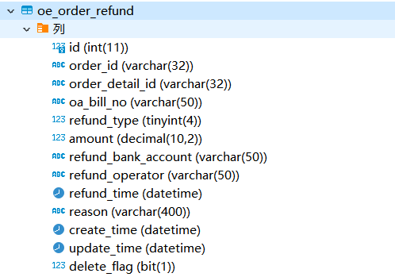

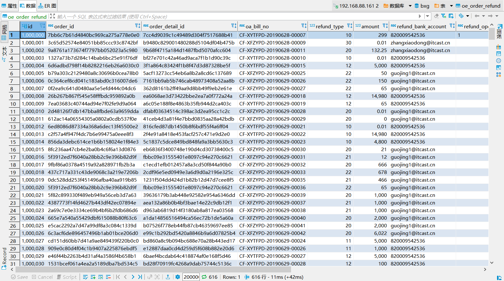

### 表关系

表之间的关联关系如下图

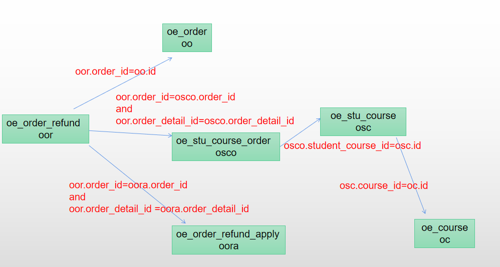

## 分层设计

与营收业绩整体情况看板相同

### ODS层

通过flinkcdc将mysql数据（在node1上）同步到hudi的ODS层,同时会在hive中自动创建对应表。ODS层存储的是原始数据,没有进行更改。

### DWD层

将ods层数据进行清洗转换，并将需求涉及的表进行拉宽，数据粒度保持不变。

**拉宽时注意**，并不是所有关联到的表都进行拉宽，而且只拉宽一对一关系的表，对于有一对多关系的，则不拉宽。因为一对多关系会使主表的条数增多 。

### DWS层

在DWD层的基础上，按照业务的要求进行数据处理（如聚合、条件筛选等）。

## 实现

### Mysql-FlinkCDC

在flinksql客户端创建mysql表的映射表（共6张表）

#### oe_order_refund

```sql
CREATE TABLE if not exists mysql_bxg_oe_order_refund (
    `id` INT,
    `order_id` STRING,
    `order_detail_id` STRING,
    `oa_bill_no` STRING ,
    `refund_type` TINYINT,
    `amount` DECIMAL(10,2),
    `refund_bank_account` STRING,
    `refund_operator` STRING,
    `refund_time` TIMESTAMP(3) ,
    `reason` STRING,
    `create_time` TIMESTAMP(3) ,
    `update_time` TIMESTAMP(3) ,
    `delete_flag` BOOLEAN,
    PRIMARY KEY (`id`) NOT ENFORCED
) WITH (
          'connector'= 'mysql-cdc',
          'hostname'= 'node1',
          'port'= '3306',
          'username'= 'root',
          'password'='123456',
          'server-time-zone'= 'Asia/Shanghai',
          'debezium.snapshot.mode'='initial',
          'database-name'= 'bxg',
          'table-name'= 'oe_order_refund'
          );
```

#### oe_order_refund_apply

```sql
CREATE TABLE if not exists mysql_bxg_oe_order_refund_apply (
   `id` INT,
   `student_id` STRING,
   `order_id` STRING,
   `order_detail_id` STRING,
   `oe_deposit_id` STRING,
   `cash_back_record_id` INT,
   `course_id` INT,
   `stu_course_id` INT,
   `original_stu_course_status` TINYINT,
   `original_order_refund_status` TINYINT,
   `order_refund_id` INT,
   `oa_affair_id` STRING,
   `oa_summary_id` STRING,
   `oa_template_code` STRING,
    `oa_template_id` STRING,
    `refund_amount` DECIMAL(10,2) ,
    `refund_type` TINYINT,
    `order_refund_type` TINYINT,
    `status` TINYINT,
    `creator` STRING,
    `creator_name` STRING,
    `create_time` TIMESTAMP(3) ,
    `update_time` TIMESTAMP(3),
    `delete_flag` BOOLEAN ,
    PRIMARY KEY (`id`) NOT ENFORCED
 ) WITH (
          'connector'= 'mysql-cdc',
          'hostname'= 'node1',
          'port'= '3306',
          'username'= 'root',
          'password'='123456',
          'server-time-zone'= 'Asia/Shanghai',
          'debezium.snapshot.mode'='initial',
          'database-name'= 'bxg',
          'table-name'= 'oe_order_refund_apply'
          );
```

#### oe_order

(之前看板已创建)

```sql
CREATE TABLE if not exists mysql_bxg_oe_order (
    `id` STRING,
    `channel` STRING,
    `student_id` STRING,
    `order_no` STRING,
    `total_amount` DECIMAL(10,2),
    `discount_amount` DECIMAL(10,2),
    `charge_against_amount` DECIMAL(10,2),
    `payable_amount` DECIMAL(10,2),
    `status` TINYINT,
    `pay_status` TINYINT,
    `pay_time` TIMESTAMP(3),
    `paid_amount` DECIMAL(10,2),
    `effective_date` TIMESTAMP(3),
    `terminal` TINYINT,
    `refund_status` TINYINT,
    `refund_amount` DECIMAL(10,2),
    `refund_time` TIMESTAMP(3),
    `create_time` TIMESTAMP(3),
    `update_time` TIMESTAMP(3),
    `delete_flag` BOOLEAN,
    PRIMARY KEY (id) NOT ENFORCED
) WITH (
    'connector' = 'mysql-cdc',
    'hostname' = 'node1',
    'port' = '3306',
    'username' = 'root',
    'password' = '123456',
    'server-time-zone'= 'Asia/Shanghai',
    'debezium.snapshot.mode'='initial',
    'database-name'= 'bxg',
    'table-name' = 'oe_order'
);
```

#### oe_stu_course

(之前看板已创建)

```sql
CREATE TABLE if not exists mysql_bxg_oe_stu_course (
    `id` INT,
    `student_id` STRING,
    `course_id` INT,
    `status` TINYINT,
    `contract_status` TINYINT,
    `learn_status` TINYINT,
    `service_days` SMALLINT,
    `service_expires` TIMESTAMP(3),
    `validity_days` INT,
    `validity_expires` TIMESTAMP(3),
    `terminate_cause` TINYINT,
    `effective_date` TIMESTAMP(3),
    `finished_time` TIMESTAMP(3),
    `total_progress` DECIMAL(10,2),
    `purchase_time` INT,
    `create_time` TIMESTAMP(3),
    `update_time` TIMESTAMP(3),
    `delete_flag` BOOLEAN,
    PRIMARY KEY (`id`) NOT ENFORCED
) WITH (
    'connector'= 'mysql-cdc',
    'hostname'= 'node1',
    'port'= '3306',
    'username'= 'root',
    'password'='123456',
    'server-time-zone'= 'Asia/Shanghai',
    'debezium.snapshot.mode'='initial',
    'database-name'= 'bxg',
    'table-name'= 'oe_stu_course'
);
```

#### oe_stu_course_order

(之前看板已创建)

```sql
CREATE TABLE if not exists mysql_bxg_oe_stu_course_order (
    `id` INT,
    `student_course_id` INT,
    `order_id` STRING,
    `order_detail_id` STRING,
    `create_time` TIMESTAMP(3),
    `update_time` TIMESTAMP(3),
    `delete_flag` BOOLEAN,
    PRIMARY KEY (`id`) NOT ENFORCED
) WITH (
    'connector'= 'mysql-cdc',
    'hostname'= 'node1',
    'port'= '3306',
    'username'= 'root',
    'password'='123456',
    'server-time-zone'= 'Asia/Shanghai',
    'debezium.snapshot.mode'='initial',
    'database-name'= 'bxg',
    'table-name'= 'oe_stu_course_order'
);
```

#### oe_course

(之前看板已创建)

```sql
CREATE TABLE if not exists mysql_bxg_oe_course (
    `id` INT,
    `grade_name` STRING,
    `bigimg_path` STRING,
    `video_url` STRING,
    `img_alt` STRING,
    `description` STRING,
    `detailimg_path` STRING,
    `smallimg_path` STRING,
    `sort` INT,
    `status` STRING,
    `learnd_count` INT,
    `learnd_count_flag` INT,
    `original_cost` DECIMAL(10,2),
    `current_price` DECIMAL(10,2),
    `course_length` DECIMAL(10,2),
    `menu_id` INT,
    `is_free` BOOLEAN,
    `course_detail` STRING,
    `course_detail_mobile` STRING,
    `course_detail1` STRING,
    `course_detail1_mobile` STRING,
    `course_plan_detail` STRING,
    `course_plan_detail_mobile` STRING,
    `course_detail2` STRING,
    `course_detail2_mobile` STRING,
    `course_outline` STRING,
    `common_problem` STRING,
    `common_problem_mobile` STRING,
    `lecturer_id` INT,
    `is_recommend` INT,
    `recommend_sort` INT,
    `qqno` STRING,
    `description_show` INT,
    `rec_img_path` STRING,
    `pv` INT,
    `course_type` INT,
    `default_student_count` INT,
    `study_status` INT,
    `online_course` INT,
    `course_level` INT,
    `content_type` INT,
    `recommend_type` INT,
    `employment_rate` STRING,
    `employment_salary` STRING,
    `score` STRING,
    `cover_url` STRING,
    `offline_course_url` STRING,
    `outline_url` STRING,
    `project_page_url` STRING,
    `preschool_test_flag` BOOLEAN,
    `service_period` INT,
    `included_validity_period` TINYINT,
    `validity_period` INT,
    `qualified_jobs` STRING,
    `work_year_min` INT,
    `work_year_max` INT,
    `promote_flag` BOOLEAN,
    `create_person` STRING,
    `update_person` STRING,
    `create_time` TIMESTAMP(3),
    `update_time` TIMESTAMP(3),
    `is_delete` BOOLEAN,
    PRIMARY KEY (`id`) NOT ENFORCED
) WITH (
    'connector'= 'mysql-cdc',
    'hostname'= 'node1',
    'port'= '3306',
    'username'= 'root',
    'password'='123456',
    'server-time-zone'= 'Asia/Shanghai',
    'debezium.snapshot.mode'='initial',
    'database-name'= 'bxg',
    'table-name'= 'oe_course'
);
```

### FlinkCDC-Hudi ODS层

设置checkpoint:

set execution.checkpointing.interval=30sec; 

#### 创建hudi映射表

在flink客户端创建hudi映射表

##### oe_order_refund

```sql
CREATE TABLE IF NOT EXISTS `hudi_bxg_ods_oe_order_refund` (
    `id` INT,
    `order_id` STRING,
    `order_detail_id` STRING,
    `oa_bill_no` STRING ,
    `refund_type` INT,
    `amount` DECIMAL(10,2),
    `refund_bank_account` STRING,
    `refund_operator` STRING,
    `refund_time` TIMESTAMP(3) ,
    `reason` STRING,
    `create_time` TIMESTAMP(3) ,
    `update_time` TIMESTAMP(3) ,
    `delete_flag` BOOLEAN,
PRIMARY KEY ( `id` ) NOT ENFORCED
) WITH(
    'connector'='hudi'
    ,'path'= 'hdfs://node1:8020/hudi/bxg/ods_oe_order_refund'
    ,'hoodie.datasource.write.recordkey.field'= 'id' 
    ,'write.tasks'= '1'
    ,'compaction.tasks'= '1'
    ,'write.rate.limit'= '2000' 
    ,'table.type'= 'MERGE_ON_READ' 
    ,'compaction.async.enabled'= 'true' 
    ,'compaction.trigger.strategy'= 'num_commits' 
    ,'compaction.delta_commits'= '1'
    ,'changelog.enabled'= 'true' 
    ,'read.tasks' = '1'
    ,'read.streaming.enabled'= 'true' 
    ,'read.start-commit'='earliest'
    ,'read.streaming.check-interval'= '3'
    ,'hive_sync.enable'= 'true' 
    ,'hive_sync.mode'= 'hms' 
    ,'hive_sync.metastore.uris'= 'thrift://node1:9083'
    ,'hive_sync.table'= 'ods_oe_order_refund'
    ,'hive_sync.db'= 'bxg' 
    ,'hive_sync.username'= '' 
    ,'hive_sync.password'= '' 
    ,'hive_sync.support_timestamp'= 'true' 
);
```

##### oe_order_refund_apply

```sql
CREATE TABLE IF NOT EXISTS `hudi_bxg_ods_oe_order_refund_apply` (
    `id` INT,
   `student_id` STRING,
   `order_id` STRING,
   `order_detail_id` STRING,
   `oe_deposit_id` STRING,
   `cash_back_record_id` INT,
   `course_id` INT,
   `stu_course_id` INT,
   `original_stu_course_status` INT,
   `original_order_refund_status` INT,
   `order_refund_id` INT,
   `oa_affair_id` STRING,
   `oa_summary_id` STRING,
   `oa_template_code` STRING,
    `oa_template_id` STRING,
    `refund_amount` DECIMAL(10,2) ,
    `refund_type` INT,
    `order_refund_type` INT,
    `status` INT,
    `creator` STRING,
    `creator_name` STRING,
    `create_time` TIMESTAMP(3) ,
    `update_time` TIMESTAMP(3),
    `delete_flag` BOOLEAN ,
     PRIMARY KEY ( `id` ) NOT ENFORCED
) WITH(
    'connector'='hudi'
    ,'path'= 'hdfs://node1:8020/hudi/bxg/ods_oe_order_refund_apply'
    ,'hoodie.datasource.write.recordkey.field'= 'id' 
    ,'write.tasks'= '1'
    ,'compaction.tasks'= '1'
    ,'write.rate.limit'= '2000' 
    ,'table.type'= 'MERGE_ON_READ' 
    ,'compaction.async.enabled'= 'true' 
    ,'compaction.trigger.strategy'= 'num_commits' 
    ,'compaction.delta_commits'= '1'
    ,'changelog.enabled'= 'true' 
    ,'read.tasks' = '1'
    ,'read.streaming.enabled'= 'true' 
    ,'read.start-commit'='earliest'
    ,'read.streaming.check-interval'= '3'
    ,'hive_sync.enable'= 'true' 
    ,'hive_sync.mode'= 'hms' 
    ,'hive_sync.metastore.uris'= 'thrift://node1:9083'
    ,'hive_sync.table'= 'ods_oe_order_refund_apply'
    ,'hive_sync.db'= 'bxg' 
    ,'hive_sync.username'= '' 
    ,'hive_sync.password'= '' 
    ,'hive_sync.support_timestamp'= 'true' 
);
```

##### oe_order

(之前看板已创建)

```sql
CREATE TABLE if not exists hudi_bxg_ods_oe_order (
    `id` STRING,
    `channel` STRING,
    `student_id` STRING,
    `order_no` STRING,
    `total_amount` DECIMAL(10,2),
    `discount_amount` DECIMAL(10,2),
    `charge_against_amount` DECIMAL(10,2),
    `payable_amount` DECIMAL(10,2),
    `status` INT,
    `pay_status` INT,
    `pay_time` TIMESTAMP(3),
    `paid_amount` DECIMAL(10,2),
    `effective_date` TIMESTAMP(3),
    `terminal` INT,
    `refund_status` INT,
    `refund_amount` DECIMAL(10,2),
    `refund_time` TIMESTAMP(3),
    `create_time` TIMESTAMP(3),
    `update_time` TIMESTAMP(3),
    `delete_flag` BOOLEAN,
   PRIMARY KEY (id) NOT ENFORCED
) WITH(
    'connector'='hudi'
    ,'path'= 'hdfs://node1:8020/hudi/bxg/ods_oe_order'
    ,'hoodie.datasource.write.recordkey.field'= 'id' 
    ,'write.tasks'= '1'
    ,'compaction.tasks'= '1'
    ,'write.rate.limit'= '2000' 
    ,'table.type'= 'MERGE_ON_READ' 
    ,'compaction.async.enabled'= 'true' 
    ,'compaction.trigger.strategy'= 'num_commits' 
    ,'compaction.delta_commits'= '1'
    ,'changelog.enabled'= 'true' 
    ,'read.tasks' = '1'
    ,'read.streaming.enabled'= 'true' 
    ,'read.start-commit'='earliest'
    ,'read.streaming.check-interval'= '3'
    ,'hive_sync.enable'= 'true' 
    ,'hive_sync.mode'= 'hms' 
    ,'hive_sync.metastore.uris'= 'thrift://node1:9083'
    ,'hive_sync.table'= 'ods_oe_order'
    ,'hive_sync.db'= 'bxg' 
    ,'hive_sync.username'= '' 
    ,'hive_sync.password'= '' 
    ,'hive_sync.support_timestamp'= 'true' 
);
```

##### oe_stu_course

(之前看板已创建)

```sql
CREATE TABLE if not exists hudi_bxg_ods_oe_stu_course (
    `id` INT,
    `student_id` STRING,
    `course_id` INT,
    `status` INT,
    `contract_status` INT,
    `learn_status` INT,
    `service_days` INT,
    `service_expires` TIMESTAMP(3),
    `validity_days` INT,
    `validity_expires` TIMESTAMP(3),
    `terminate_cause` INT,
    `effective_date` TIMESTAMP(3),
    `finished_time` TIMESTAMP(3),
    `total_progress` DECIMAL(10,2),
    `purchase_time` INT,
    `create_time` TIMESTAMP(3),
    `update_time` TIMESTAMP(3),
    `delete_flag` BOOLEAN,
   PRIMARY KEY (id) NOT ENFORCED
) WITH(
    'connector'='hudi'
    ,'path'= 'hdfs://node1:8020/hudi/bxg/ods_oe_stu_course'
    ,'hoodie.datasource.write.recordkey.field'= 'id' 
    ,'write.tasks'= '1'
    ,'compaction.tasks'= '1'
    ,'write.rate.limit'= '2000' 
    ,'table.type'= 'MERGE_ON_READ' 
    ,'compaction.async.enabled'= 'true' 
    ,'compaction.trigger.strategy'= 'num_commits' 
    ,'compaction.delta_commits'= '1'
    ,'changelog.enabled'= 'true' 
    ,'read.tasks' = '1'
    ,'read.streaming.enabled'= 'true' 
    ,'read.start-commit'='earliest'
    ,'read.streaming.check-interval'= '3'
    ,'hive_sync.enable'= 'true' 
    ,'hive_sync.mode'= 'hms' 
    ,'hive_sync.metastore.uris'= 'thrift://node1:9083'
    ,'hive_sync.table'= 'ods_oe_stu_course'
    ,'hive_sync.db'= 'bxg' 
    ,'hive_sync.username'= '' 
    ,'hive_sync.password'= '' 
    ,'hive_sync.support_timestamp'= 'true' 
);
```

##### oe_stu_course_order

(之前看板已创建)

```sql
CREATE TABLE if not exists hudi_bxg_ods_oe_stu_course_order (
    `id` INT,
    `student_course_id` INT,
    `order_id` STRING,
    `order_detail_id` STRING,
    `create_time` TIMESTAMP(3),
    `update_time` TIMESTAMP(3),
    `delete_flag` BOOLEAN,
   PRIMARY KEY (id) NOT ENFORCED
) 
WITH(
    'connector'='hudi'
    ,'path'= 'hdfs://node1:8020/hudi/bxg/ods_oe_stu_course_order'
    ,'hoodie.datasource.write.recordkey.field'= 'id' 
    ,'write.tasks'= '1'
    ,'compaction.tasks'= '1'
    ,'write.rate.limit'= '2000' 
    ,'table.type'= 'MERGE_ON_READ' 
    ,'compaction.async.enabled'= 'true' 
    ,'compaction.trigger.strategy'= 'num_commits' 
    ,'compaction.delta_commits'= '1'
    ,'changelog.enabled'= 'true' 
    ,'read.tasks' = '1'
    ,'read.streaming.enabled'= 'true' 
    ,'read.start-commit'='earliest'
    ,'read.streaming.check-interval'= '3'
    ,'hive_sync.enable'= 'true' 
    ,'hive_sync.mode'= 'hms' 
    ,'hive_sync.metastore.uris'= 'thrift://node1:9083'
    ,'hive_sync.table'= 'ods_oe_stu_course_order'
    ,'hive_sync.db'= 'bxg' 
    ,'hive_sync.username'= '' 
    ,'hive_sync.password'= '' 
    ,'hive_sync.support_timestamp'= 'true' 
);
```

##### oe_course

(之前看板已创建)

```sql
CREATE TABLE if not exists hudi_bxg_ods_oe_course(
    `id` INT,
    `grade_name` STRING,
    `bigimg_path` STRING,
    `video_url` STRING,
    `img_alt` STRING,
    `description` STRING,
    `detailimg_path` STRING,
    `smallimg_path` STRING,
    `sort` INT,
    `status` STRING,
    `learnd_count` INT,
    `learnd_count_flag` INT,
    `original_cost` DECIMAL(10,2),
    `current_price` DECIMAL(10,2),
    `course_length` DECIMAL(10,2),
    `menu_id` INT,
    `is_free` BOOLEAN,
    `course_detail` STRING,
    `course_detail_mobile` STRING,
    `course_detail1` STRING,
    `course_detail1_mobile` STRING,
    `course_plan_detail` STRING,
    `course_plan_detail_mobile` STRING,
    `course_detail2` STRING,
    `course_detail2_mobile` STRING,
    `course_outline` STRING,
    `common_problem` STRING,
    `common_problem_mobile` STRING,
    `lecturer_id` INT,
    `is_recommend` INT,
    `recommend_sort` INT,
    `qqno` STRING,
    `description_show` INT,
    `rec_img_path` STRING,
    `pv` INT,
    `course_type` INT,
    `default_student_count` INT,
    `study_status` INT,
    `online_course` INT,
    `course_level` INT,
    `content_type` INT,
    `recommend_type` INT,
    `employment_rate` STRING,
    `employment_salary` STRING,
    `score` STRING,
    `cover_url` STRING,
    `offline_course_url` STRING,
    `outline_url` STRING,
    `project_page_url` STRING,
    `preschool_test_flag` BOOLEAN,
    `service_period` INT,
    `included_validity_period` INT,
    `validity_period` INT,
    `qualified_jobs` STRING,
    `work_year_min` INT,
    `work_year_max` INT,
    `promote_flag` BOOLEAN,
    `create_person` STRING,
    `update_person` STRING,
    `create_time` TIMESTAMP(3),
    `update_time` TIMESTAMP(3),
    `is_delete` BOOLEAN,
   PRIMARY KEY (id) NOT ENFORCED
) WITH(
    'connector'='hudi'
    ,'path'= 'hdfs://node1:8020/hudi/bxg/ods_oe_course'
    ,'hoodie.datasource.write.recordkey.field'= 'id' 
    ,'write.tasks'= '1'
    ,'compaction.tasks'= '1'
    ,'write.rate.limit'= '2000' 
    ,'table.type'= 'MERGE_ON_READ' 
    ,'compaction.async.enabled'= 'true' 
    ,'compaction.trigger.strategy'= 'num_commits' 
    ,'compaction.delta_commits'= '1'
    ,'changelog.enabled'= 'true' 
    ,'read.tasks' = '1'
,'read.streaming.enabled'= 'true'
    ,'read.start-commit'='earliest' 
    ,'read.streaming.check-interval'= '3'
    ,'hive_sync.enable'= 'true' 
    ,'hive_sync.mode'= 'hms' 
    ,'hive_sync.metastore.uris'= 'thrift://node1:9083'
    ,'hive_sync.table'= 'ods_oe_course'
    ,'hive_sync.db'= 'bxg' 
    ,'hive_sync.username'= '' 
    ,'hive_sync.password'= '' 
    ,'hive_sync.support_timestamp'= 'true' 
);
```

#### 插入数据

##### oe_order_refund

```sql
INSERT INTO `hudi_bxg_ods_oe_order_refund` SELECT
`id`,`order_id`,`order_detail_id`,`oa_bill_no`,`refund_type`,                                    `amount`,`refund_bank_account`,`refund_operator`,`refund_time`,                                `reason`,`create_time`,`update_time`,`delete_flag`
FROM `mysql_bxg_oe_order_refund`;
```

##### oe_order_refund_apply

```sql
INSERT INTO `hudi_bxg_ods_oe_order_refund_apply` SELECT                                            `id`,`student_id`,`order_id`,`order_detail_id`,`oe_deposit_id`,`cash_back_record_id`,`course_id`,`stu_course_id`,`original_stu_course_status`,`original_order_refund_status`,`order_refund_id`,`oa_affair_id`,`oa_summary_id`,`oa_template_code`,`oa_template_id`,`refund_amount`,`refund_type`,`order_refund_type`,`status`,`creator`,`creator_name`,`create_time`,`update_time`,`delete_flag`
FROM `mysql_bxg_oe_order_refund_apply`;
```

##### oe_order

```sql
INSERT INTO `hudi_bxg_ods_oe_order` 
SELECT  `id`, `channel`, `student_id`, `order_no`, `total_amount`, `discount_amount`, `charge_against_amount`, `payable_amount`, `status`, `pay_status`, `pay_time`, `paid_amount`, `effective_date`, `terminal`, `refund_status`, `refund_amount`, `refund_time`, `create_time`, `update_time`, `delete_flag`
FROM `mysql_bxg_oe_order`;
```

##### oe_stu_course

```sql
INSERT INTO `hudi_bxg_ods_oe_stu_course` 
SELECT  id, student_id, course_id, status, contract_status, learn_status, service_days, service_expires, validity_days, validity_expires, terminate_cause, effective_date, finished_time, total_progress, purchase_time, create_time, update_time, delete_flag 
FROM `mysql_bxg_oe_stu_course`;
```

##### oe_stu_course_order

```sql
INSERT INTO `hudi_bxg_ods_oe_stu_course_order` 
SELECT `id`, `student_course_id`, `order_id`, `order_detail_id`, `create_time`, `update_time`, `delete_flag`
FROM `mysql_bxg_oe_stu_course_order`;
```

##### oe_course

```sql
INSERT INTO `hudi_bxg_ods_oe_course`
select  id, grade_name, bigimg_path, video_url, img_alt, description, detailimg_path, smallimg_path, sort, status, learnd_count, learnd_count_flag, original_cost, current_price, course_length, menu_id, is_free, course_detail, course_detail_mobile, course_detail1, course_detail1_mobile, course_plan_detail, course_plan_detail_mobile, course_detail2, course_detail2_mobile, course_outline, common_problem, common_problem_mobile, lecturer_id, is_recommend, recommend_sort, qqno, description_show, rec_img_path, pv, course_type, default_student_count, study_status, online_course, course_level, content_type, recommend_type, employment_rate, employment_salary, score, cover_url, offline_course_url, outline_url, project_page_url, preschool_test_flag, service_period, included_validity_period, validity_period, qualified_jobs, work_year_min, work_year_max, promote_flag, create_person, update_person, create_time, update_time, is_delete
from `mysql_bxg_oe_course`;
```

#### 查看结果

##### 查看Flink web界面

浏览器地址：[http://192.168.88.161:8081/\#/overview](http://192.168.88.161:8081/#/overview)

可以看到正在运行的作业

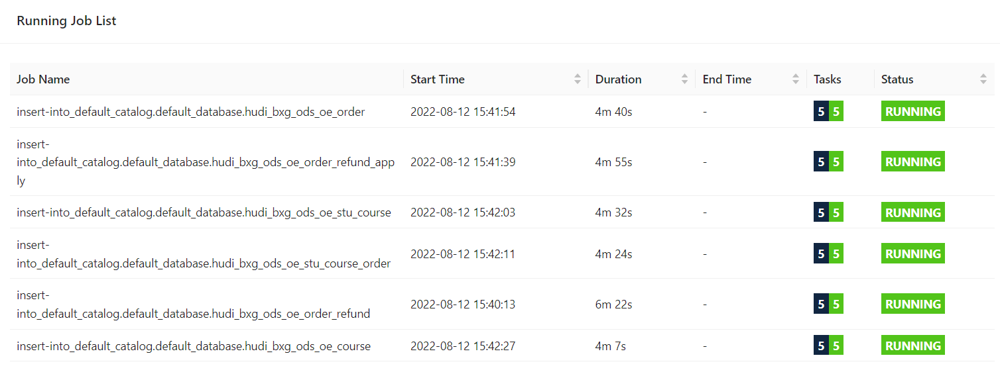

##### 查看文件

[http://192.168.88.161:9870/explorer.html\#/hudi/bxg](http://192.168.88.161:9870/explorer.html#/hudi/bxg)

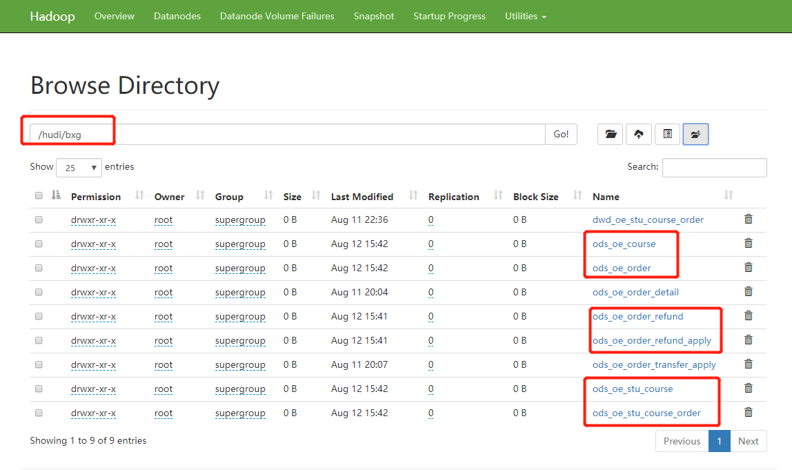

##### 查看表数据

在hive的数据库查看表数据

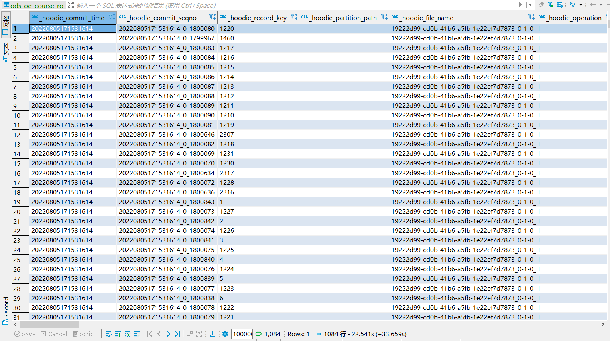

### DWD层

#### 宽表设计

##### 表关系

+ 指标1-3：博学谷全部课程退费量和退费金额分析、全部课程不同退费类型的退费量分析、全部课程不同退费类型的退费金额分析

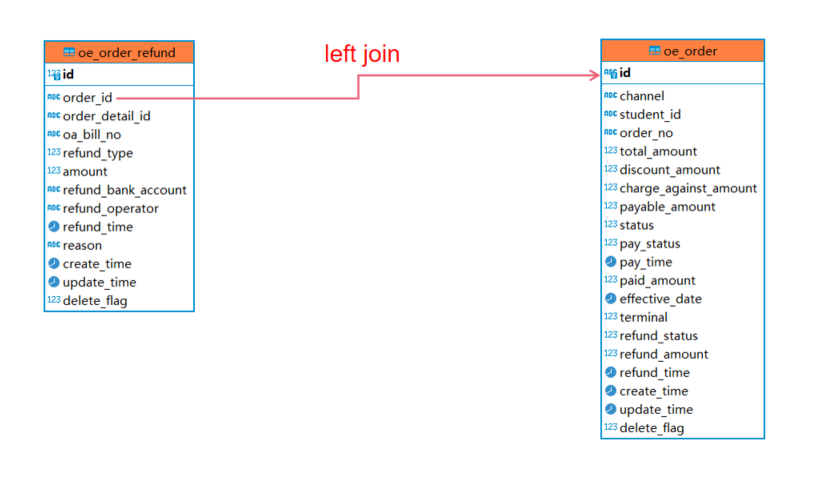

+ 指标4-5：不同时期的全部课程问题退费量分析、不同时期的全部课程问题退费金额分析

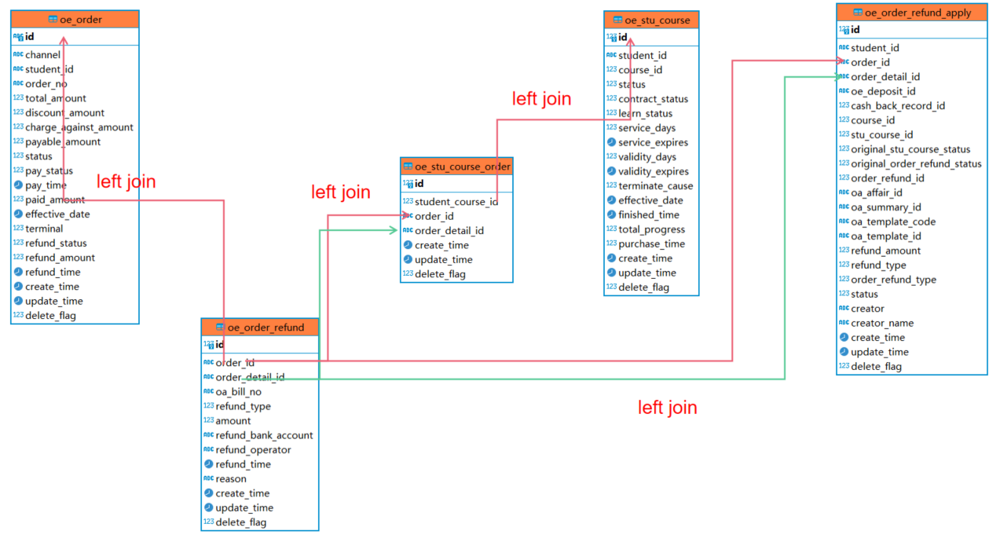

+ 指标6-11：进班后的职业课各类型的问题退费量分析、进班后的职业课各类型的问题退费金额分析

、2021年全部课程进班后的问题退费量详情表、2021年全部课程的转线下退费量详情表、2021年全部课程的转线下退费金额详情表、2021年全部课程的线上互转量详情表

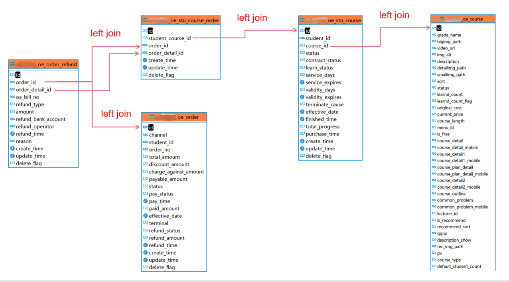

##### 分析

**如何拉宽呢？**

拉宽时不能将有一对多关系的表拉宽，根据上图关系，可考虑将oe_stu_course_order、oe_stu_course、oe_course进行拉宽，其它的表不需要在hudi拉宽，但是要下沉到doris中。

另外注意到营收业绩整体情况看板中的宽表dwd_oe_stu_course_order已经包括这些表，所以可以直接使用。但是要注意有些字段之前是没有放到宽表中的，所以要增加一些字段：`osco`.`order_detail_id`,`osco`.`delete_flag` as `stu_course_order_delete_flag`。

（增加字段时，要把之前存在的表先删掉，再进行创建）

另外,oe_order_refund左关联oe_order是N对1关系,可以以oe_order_refund为主表拉宽。


#### 宽表实现

##### Hudi DWD层

###### dwd_oe_stu_course_order

（将之前同名表删掉）

```sql
-- 创建视图（之前已创建）
CREATE TABLE IF NOT EXISTS `hudi_bxg_ods_oe_order_transfer_apply` (
    `id` INT,
    `order_id` STRING,
    `order_detail_id` STRING,
    `deposit_id` STRING,
    `cash_back_record_id` INT,
    `student_id` STRING,
    `course_id` INT,
    `stu_course_id` INT,
    `order_refund_id` INT,
    `original_stu_course_status` INT,
    `original_order_refund_status` INT,
    `biz_type` INT,
    `oa_affair_id` STRING,
    `oa_summary_id` STRING,
    `oa_template_code` STRING,
    `oa_template_id` STRING,
    `oa_bill_no` STRING,
    `fee_transfer_type` INT,
    `amount` DECIMAL(10,2),
    `status` INT,
    `order_type` INT,
    `target_order_id` STRING,
    `target_order_detail_id` STRING,
    `target_import_order_id` INT,
    `target_order_type` INT,
    `creator` STRING,
    `creator_name` STRING,
    `create_time` TIMESTAMP(3),
    `update_time` TIMESTAMP(3),
    `delete_flag` BOOLEAN,
    PRIMARY KEY ( `id` ) NOT ENFORCED
) 
WITH(
    'connector'='hudi'
    ,'path'= 'hdfs://node1:8020/hudi/bxg/ods_oe_order_transfer_apply'
    ,'hoodie.datasource.write.recordkey.field'= 'id' 
    ,'write.tasks'= '1'
    ,'compaction.tasks'= '1'
    ,'write.rate.limit'= '2000' 
    ,'table.type'= 'MERGE_ON_READ' 
    ,'compaction.async.enabled'= 'true' 
    ,'compaction.trigger.strategy'= 'num_commits' 
    ,'compaction.delta_commits'= '1'
    ,'changelog.enabled'= 'true' 
    ,'read.tasks' = '1'
    ,'read.streaming.enabled'= 'true' 
    ,'read.start-commit'='earliest'
    ,'read.streaming.check-interval'= '3'
    ,'hive_sync.enable'= 'true' 
    ,'hive_sync.mode'= 'hms' 
    ,'hive_sync.metastore.uris'= 'thrift://node1:9083'
    ,'hive_sync.table'= 'ods_oe_order_transfer_apply'
    ,'hive_sync.db'= 'bxg' 
    ,'hive_sync.username'= '' 
    ,'hive_sync.password'= '' 
    ,'hive_sync.support_timestamp'= 'true' 
);
CREATE VIEW IF NOT EXISTS bxg_common_change_classes_v AS SELECT distinct(target_order_id) FROM hudi_bxg_ods_oe_order_transfer_apply t  WHERE t.biz_type = 1 AND t.status = 0 AND t.fee_transfer_type=0 AND t.delete_flag = false;

-- 创建hudi_dwd_oe_stu_course_order映射表
CREATE TABLE if not exists hudi_dwd_oe_stu_course_order (
     `id` int,
     `stu_course_id` int,
     `order_id` string,
`order_detail_id`  string,
`stu_course_order_delete_flag` boolean,
     `course_id` int,
     `stu_course_status` int,
`stu_course_status_des` string,
      `stu_course_delete_flag` BOOLEAN,
`effective_date` TIMESTAMP(3),
     `payable_amount` decimal(10,2),
     `pay_status` int,
     `pay_time` TIMESTAMP(3),
     `paid_amount` decimal(10,2),
     `refund_status` int,
     `order_delete_flag` boolean,
`terminal` int,
`charge_against_amount` DECIMAL(10,2),
`oc_id` int,
     `grade_name` string,
`course_type` INT,
     `is_complete_order` boolean,
`is_target_order` boolean,
 PRIMARY KEY (`id`) NOT ENFORCED
) WITH(
    'connector'='hudi'
    ,'path'= 'hdfs://node1:8020/hudi/bxg/dwd_oe_stu_course_order'
    ,'hoodie.datasource.write.recordkey.field'= 'id' 
    ,'write.tasks'= '1'
    ,'compaction.tasks'= '1'
    ,'write.rate.limit'= '2000' 
    ,'table.type'= 'MERGE_ON_READ' 
    ,'compaction.async.enabled'= 'true' 
    ,'compaction.trigger.strategy'= 'num_commits' 
    ,'compaction.delta_commits'= '1'
    ,'changelog.enabled'= 'true' 
    ,'read.tasks' = '3'
    ,'read.streaming.enabled'= 'true' 
    ,'read.start-commit'='earliest'
    ,'read.streaming.check-interval'= '3'
    ,'hive_sync.enable'= 'true' 
    ,'hive_sync.mode'= 'hms' 
    ,'hive_sync.metastore.uris'= 'thrift://node1:9083'
    ,'hive_sync.table'= 'dwd_oe_stu_course_order'
    ,'hive_sync.db'= 'bxg' 
    ,'hive_sync.username'= '' 
    ,'hive_sync.password'= '' 
    ,'hive_sync.support_timestamp'= 'true' 
);

-- 插入数据
insert into hudi_dwd_oe_stu_course_order
SELECT
    `osco`.`id`,
    `osco`.`student_course_id`,
`osco`.`order_id`,
`osco`.`order_detail_id`,
`osco`.`delete_flag` as `stu_course_order_delete_flag`,
    `osc`.`course_id`,
`osc`.`status` as `stu_course_status`,
case `osc`.`status` when 0 then '试学' when 1 then '生效' when 2 then '待生效' when -1 then '停课' else '退费' end as `stu_course_status_des`,
    `osc`.`delete_flag` as `stu_course_delete_flag`,
`osc`.`effective_date`,
    `oo`.`payable_amount`,
    `oo`.`pay_status`,
    `oo`.`pay_time`,
    `oo`.`paid_amount`,
    `oo`.`refund_status`,
    `oo`.`delete_flag` as `order_delete_flag`,
`oo`.`terminal`,
`oo`.`charge_against_amount`,
`oc`.`id`             as `oc_id`,
    `oc`.`grade_name`,
`oc`.`course_type`,
    if (oo.`payable_amount`>0 and `oo`.`pay_status`=2 and `oo`.`delete_flag` = false and `osc`.`delete_flag` = false, true, false) as is_complete_order,
if (`ccv`.`target_order_id` is not null, true, false) AS `is_target_order`
FROM hudi_bxg_ods_oe_stu_course_order AS osco
LEFT JOIN hudi_bxg_ods_oe_stu_course AS osc
ON osc.id = osco.student_course_id
LEFT JOIN hudi_bxg_ods_oe_order AS oo
ON oo.id = osco.order_id
LEFT JOIN hudi_bxg_ods_oe_course AS oc
ON oc.id = osc.course_id
LEFT JOIN `bxg_common_change_classes_v` AS `ccv`
ON `oo`.`id`=`ccv`.`target_order_id`;

```


###### dwd_oe_order_refund

```sql
-- 创建hudi_dwd_oe_order_refund映射表
CREATE TABLE if not exists hudi_dwd_oe_order_refund
(
  `id` INT,
  `order_id` STRING,
  `order_detail_id` STRING,
  `oa_bill_no` STRING ,
  `refund_type` INT,
  `amount` DECIMAL(10,2),
  `refund_bank_account` STRING,
  `refund_operator` STRING,
  `refund_time` TIMESTAMP(3) ,
  `reason` STRING,
  `create_time` TIMESTAMP(3) ,
  `update_time` TIMESTAMP(3) ,
  `delete_flag` BOOLEAN,
  `order_pay_status`  INT,
  `order_refund_status` INT,
  `order_delete_flag` BOOLEAN,
  PRIMARY KEY (`id`) NOT ENFORCED
) WITH(
    'connector'='hudi'
    ,'path'= 'hdfs://node1:8020/hudi/bxg/dwd_oe_order_refund'
    ,'hoodie.datasource.write.recordkey.field'= 'id'
    ,'write.tasks'= '1'
    ,'compaction.tasks'= '1'
    ,'write.rate.limit'= '2000'
    ,'table.type'= 'MERGE_ON_READ'
    ,'compaction.async.enabled'= 'true'
    ,'compaction.trigger.strategy'= 'num_commits'
    ,'compaction.delta_commits'= '1'
    ,'changelog.enabled'= 'true'
    ,'read.tasks' = '3'
    ,'read.streaming.enabled'= 'true'
    ,'read.start-commit'='earliest'
    ,'read.streaming.check-interval'= '3'
    ,'hive_sync.enable'= 'true'
    ,'hive_sync.mode'= 'hms'
    ,'hive_sync.metastore.uris'= 'thrift://node1:9083'
    ,'hive_sync.table'= 'dwd_oe_order_refund'
    ,'hive_sync.db'= 'bxg'
    ,'hive_sync.username'= ''
    ,'hive_sync.password'= ''
    ,'hive_sync.support_timestamp'= 'true'
);
-- 插入数据
insert into hudi_dwd_oe_order_refund
SELECT
     orf.`id`, `order_id`,`order_detail_id`,`oa_bill_no`,`refund_type`,
   `amount`,`refund_bank_account`,`refund_operator`,orf.`refund_time`,
 `reason`,orf.`create_time`, orf.`update_time`, orf.`delete_flag`, oo.`pay_status` as `order_pay_status`,
    oo.`refund_status` as `order_refund_status`,oo.`delete_flag` as `order_delete_flag`
FROM hudi_bxg_ods_oe_order_refund AS orf
LEFT JOIN  hudi_bxg_ods_oe_order AS oo ON orf.order_id = oo.id; 

```

##### Doris DWD层

###### Doris建表

将数据抽取到doris中需要提前在doris中建表（hudi不需要，hudi可以自动捕获表结构）。

dwd_oe_stu_course_order

（将之前同名表删掉）

```sql
CREATE TABLE IF NOT EXISTS bxg.dwd_oe_stu_course_order
(
    `id` int,
    `stu_course_id` int COMMENT '学员课程id',
    `order_id` string,
    `order_detail_id`  string,
    `stu_course_order_delete_flag` boolean,
    `course_id` int COMMENT '学员购买的课程',
    `stu_course_status` int COMMENT '学员课程状态：0试学、1生效、2待生效、-1停课、8退费',
    `stu_course_status_des` string COMMENT '学员课程状态描述：0试学、1生效、2待生效、-1停课、8退费',
    `stu_course_delete_flag` BOOLEAN,
    `effective_date` datetime,
    `payable_amount` decimal(10,2) COMMENT '实际应付总金额=原价-优惠总额-冲抵金额',
    `pay_status` int  COMMENT '支付状态：0未支付、1部分支付、2支付完成',
    `pay_time` datetime COMMENT '最后支付完成时间',
    `paid_amount` decimal(10,2) COMMENT '当前已付总额',
    `refund_status` INT COMMENT '退费状态:0-未退费;-1-已退费;-2-退费中;-3-部分退费',
    `order_delete_flag` BOOLEAN COMMENT 'ods_bxg_oe_order表中订单是否删除',
    `terminal` int,
    `charge_against_amount` DECIMAL(10,2),
    `oc_id` int,
    `grade_name` string COMMENT '课程名称',
    `course_type`  int,
    `is_complete_order` BOOLEAN COMMENT '实际应付总金额0且支付状态pay_status完成',
    `is_target_order` boolean
) Unique Key (`id`)
DISTRIBUTED BY HASH(`id`) BUCKETS 10
PROPERTIES (
"replication_allocation" = "tag.location.default: 1"
);
```

dwd_oe_order_refund

```sql
CREATE TABLE  if not exists bxg.`dwd_oe_order_refund`
(
   `id` int NOT NULL,
   `order_id` string NOT NULL COMMENT '订单ID',
   `order_detail_id` string NOT NULL COMMENT '子订单ID',
   `oa_bill_no` string NOT NULL COMMENT 'OA单号',
   `refund_type` int NOT NULL COMMENT '退费类型：10-退费_课程退学退;11-退费_多交学费退;12退费_预交学费退;20-转线下_课程退学退;21-转线下_多交学费退;22转线下_预交学费退;30-线上互转_课程退学退;31-线上互转_多交学费退;32线上互转_预交学费退;',
   `amount` decimal(10,2) NOT NULL DEFAULT '0.00' COMMENT '退款金额',
   `refund_bank_account` string DEFAULT NULL COMMENT '退款银行账号',
   `refund_operator` string DEFAULT NULL COMMENT '退款人姓名',
   `refund_time` datetime NOT NULL COMMENT '退款时间',
   `reason` string NOT NULL COMMENT '退款原因',
   `create_time` datetime NOT NULL,
   `update_time` datetime NOT NULL,
   `delete_flag` boolean NOT NULL,
   `order_pay_status`  int,
   `order_refund_status` int,
   `order_delete_flag` boolean
) UNIQUE KEY(`id`)
    COMMENT '订单退费表'
    DISTRIBUTED BY HASH(`id`) BUCKETS 10
    PROPERTIES (
    "replication_allocation" = "tag.location.default: 1"
               );
```

dwd_oe_order_refund_apply

```sql
CREATE TABLE  if not exists bxg.`dwd_oe_order_refund_apply` 
(
  `id` int NOT NULL,
  `student_id` string NOT NULL,
  `order_id` string DEFAULT NULL COMMENT '主订单ID',
  `order_detail_id` string DEFAULT NULL COMMENT '子订单ID',
  `oe_deposit_id` string DEFAULT NULL COMMENT '报名费ID',
  `cash_back_record_id` int DEFAULT NULL COMMENT '返现记录',
  `course_id` int DEFAULT NULL COMMENT '课程ID',
  `stu_course_id` int DEFAULT NULL,
  `original_stu_course_status` int DEFAULT NULL COMMENT '原来的学员课程状态',
  `original_order_refund_status` int NOT NULL DEFAULT '0' COMMENT '订单的原来退费状态',
  `order_refund_id` int DEFAULT NULL COMMENT '退费表ID,退费成功后填入此字段',
  `oa_affair_id` string DEFAULT NULL COMMENT 'OA的affairId',
  `oa_summary_id` string NOT NULL COMMENT 'oa的summaryId',
  `oa_template_code` string DEFAULT NULL COMMENT 'oa的templateCode模板code',
  `oa_template_id` string DEFAULT NULL COMMENT 'oa的templateId模板id',
  `refund_amount` decimal(10,2) DEFAULT '0.00' COMMENT '退费金额',
  `refund_type` int NOT NULL DEFAULT '1' COMMENT '退费类型:0-课程退学退;1-多交学费退;2-预交学费退;',
  `order_refund_type` int NOT NULL DEFAULT '0' COMMENT '订单退费类型：0-订单退费;1-报名费订单退费',
  `status` int NOT NULL DEFAULT '0' COMMENT '状态:2-已发起;0-已完成;3-待打款;4-处理中;5-已撤回;6-已退回;15-已终止;',
  `creator` string NOT NULL COMMENT '创建人(邮箱)',
  `creator_name` string NOT NULL COMMENT '创建人姓名',
  `create_time` datetime NOT NULL ,
  `update_time` datetime NOT NULL ,
  `delete_flag` boolean NOT NULL
)UNIQUE KEY(`id`)
    COMMENT '订单退费申请表'
    DISTRIBUTED BY HASH(`id`) BUCKETS 10
    PROPERTIES (
    "replication_allocation" = "tag.location.default: 1"
               );
```

###### Doris映射表

doris_dwd_oe_stu_course_order

（将之前同名表删掉）

```sql
CREATE TABLE if not exists doris_dwd_oe_stu_course_order 
(
   `id` int,
   `stu_course_id` int,
   `order_id` string,
   `order_detail_id`  string,
   `stu_course_order_delete_flag` boolean,
   `course_id` int,
   `stu_course_status` int,
   `stu_course_status_des` string,
   `stu_course_delete_flag` BOOLEAN,
   `effective_date` TIMESTAMP(3),
   `payable_amount` decimal(10,2),
   `pay_status` int,
   `pay_time` TIMESTAMP(3),
   `paid_amount` decimal(10,2),
   `refund_status` int,
   `order_delete_flag` boolean,
   `terminal` int,
   `charge_against_amount` DECIMAL(10,2),
   `oc_id` int,
   `grade_name` string,
   `course_type` INT,
   `is_complete_order` boolean,
   `is_target_order` Boolean,
   PRIMARY KEY (`id`) NOT ENFORCED
) WITH (
    'fenodes' = 'node1:8030'
    ,'table.identifier' = 'bxg.dwd_oe_stu_course_order'
    ,'sink.enable-delete' = 'true'
    ,'sink.properties.strip_outer_array' = 'true'
    ,'sink.batch.size' = '2000'
    ,'password' = '123456'
    ,'connector' = 'doris'
    ,'sink.batch.interval' = '10s'
    ,'sink.max-retries' = '5'
    ,'sink.properties.format' = 'json'
    ,'username' = 'root'
);
```

doris_dwd_oe_order_refund

```sql
CREATE TABLE IF NOT EXISTS `doris_dwd_oe_order_refund` (
   `id` INT,
   `order_id` STRING,
   `order_detail_id` STRING,
   `oa_bill_no` STRING ,
   `refund_type` INT,
   `amount` DECIMAL(10,2),
   `refund_bank_account` STRING,
   `refund_operator` STRING,
   `refund_time` TIMESTAMP(3) ,
   `reason` STRING,
   `create_time` TIMESTAMP(3) ,
   `update_time` TIMESTAMP(3) ,
   `delete_flag` BOOLEAN,
   `order_pay_status`  INT,
   `order_refund_status` INT,
   `order_delete_flag` BOOLEAN,
   PRIMARY KEY ( `id` ) NOT ENFORCED
) WITH (
    'fenodes' = '192.168.88.161:8030'
    ,'table.identifier' = 'bxg.dwd_oe_order_refund'
    ,'sink.enable-delete' = 'true'
    ,'sink.properties.strip_outer_array' = 'true'
    ,'sink.batch.size' = '2000'
    ,'password' = '123456'
    ,'connector' = 'doris'
    ,'sink.batch.interval' = '10s'
    ,'sink.max-retries' = '5'
    ,'sink.properties.format' = 'json'
    ,'username' = 'root'
);
```

doris_dwd_oe_order_refund_apply

```sql
CREATE TABLE IF NOT EXISTS `doris_dwd_oe_order_refund_apply`
(
   `id` INT,
   `student_id` STRING,
   `order_id` STRING,
   `order_detail_id` STRING,
   `oe_deposit_id` STRING,
   `cash_back_record_id` INT,
   `course_id` INT,
   `stu_course_id` INT,
   `original_stu_course_status` INT,
   `original_order_refund_status` INT,
   `order_refund_id` INT,
   `oa_affair_id` STRING,
   `oa_summary_id` STRING,
   `oa_template_code` STRING,
   `oa_template_id` STRING,
   `refund_amount` DECIMAL(10,2) ,
   `refund_type` INT,
   `order_refund_type` INT,
   `status` INT,
   `creator` STRING,
   `creator_name` STRING,
   `create_time` TIMESTAMP(3) ,
   `update_time` TIMESTAMP(3),
   `delete_flag` BOOLEAN ,
   PRIMARY KEY ( `id` ) NOT ENFORCED
) WITH (
    'fenodes' = '192.168.88.161:8030'
    ,'table.identifier' = 'bxg.dwd_oe_order_refund_apply'
    ,'sink.enable-delete' = 'true'
    ,'sink.properties.strip_outer_array' = 'true'
    ,'sink.batch.size' = '2000'
    ,'password' = '123456'
    ,'connector' = 'doris'
    ,'sink.batch.interval' = '10s'
    ,'sink.max-retries' = '5'
    ,'sink.properties.format' = 'json'
    ,'username' = 'root'
);
```

###### 插入数据

doris_dwd_oe_stu_course_order

```sql
INSERT INTO doris_dwd_oe_stu_course_order SELECT `id`,`stu_course_id`, `order_id`,`order_detail_id`,`stu_course_order_delete_flag` ,`course_id`,`stu_course_status`,`stu_course_status_des`,`stu_course_delete_flag`, `effective_date`,`payable_amount`,`pay_status`,`pay_time`,`paid_amount`,`refund_status`,`order_delete_flag`, `terminal`,`charge_against_amount`,`oc_id`,`grade_name`, `course_type`,`is_complete_order`, `is_target_order`
FROM hudi_dwd_oe_stu_course_order;
```

doris_dwd_oe_order_refund

```sql
INSERT INTO `doris_dwd_oe_order_refund` SELECT
 `id`,`order_id`,`order_detail_id`,`oa_bill_no`,`refund_type`,
 `amount`,`refund_bank_account`,`refund_operator`,`refund_time`,
`reason`,`create_time`,`update_time`,`delete_flag`,`order_pay_status`,
 `order_refund_status`,`order_delete_flag`
FROM `hudi_dwd_oe_order_refund`;
```

doris_dwd_oe_order_refund_apply

```sql
INSERT INTO `doris_dwd_oe_order_refund_apply` SELECT
`id`,`student_id`,`order_id`,`order_detail_id`,`oe_deposit_id`,`cash_back_record_id`,`course_id`,
`stu_course_id`,`original_stu_course_status`,`original_order_refund_status`,`order_refund_id`,`oa_affair_id`,
`oa_summary_id`,`oa_template_code`,`oa_template_id`,`refund_amount`,`refund_type`,`order_refund_type`,`status`,
`creator`,`creator_name`,`create_time`,`update_time`,`delete_flag`
FROM `hudi_bxg_ods_oe_order_refund_apply`;
```

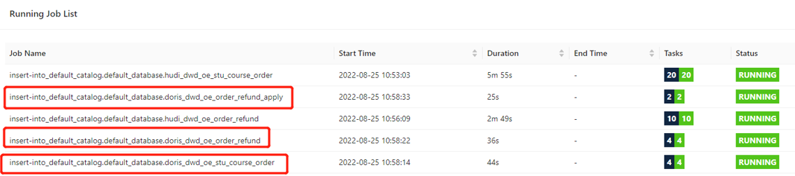

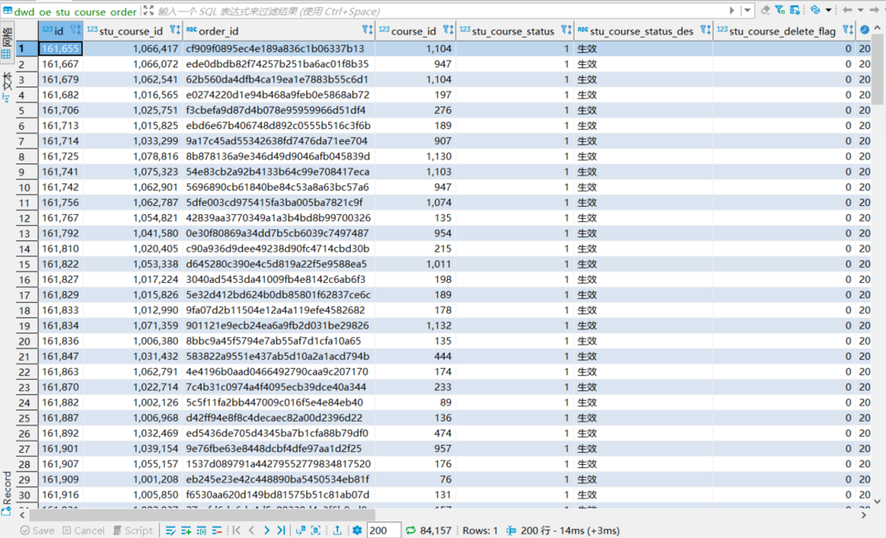

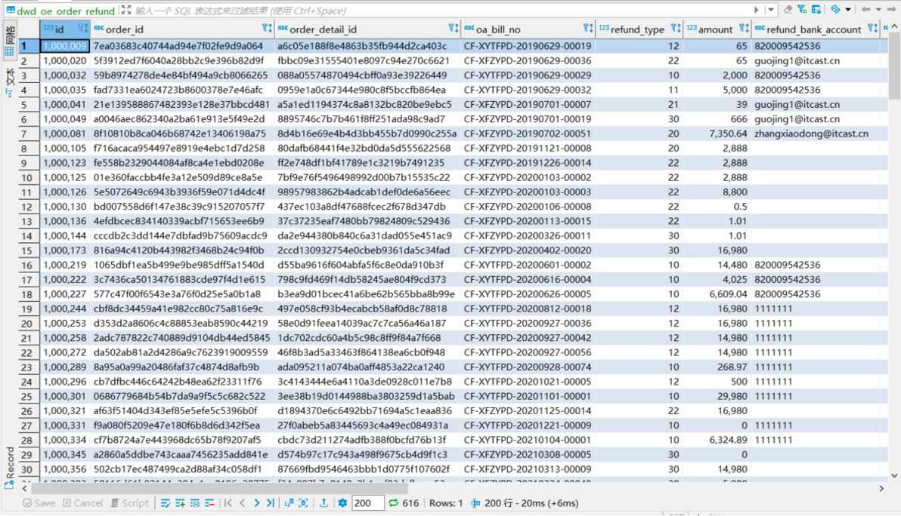

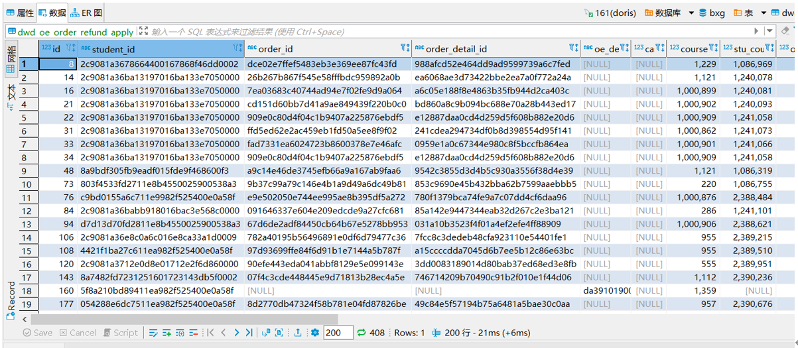

### DWS层

#### 分析

首先基于doris的DWD层先写出需求的SQL如下

##### DWD层查询SQL

博学谷全部课程退费量和退费金额分析

```sql
SELECT
    date_format(orf.refund_time, '%Y.%m') AS `月份`,
    count(orf.id) AS `退费量`,
    sum(orf.amount)/10000 AS `退费金额`
FROM
    bxg.dwd_oe_order_refund  orf
WHERE
        orf.delete_flag=0
  AND orf.order_refund_status=-1
  AND orf.order_delete_flag=0
  AND orf.order_pay_status=2
  -- 除去线上互转
  AND orf.refund_type NOT IN(30,31,32)
  AND (year(orf.refund_time)=year(now()) or year(orf.refund_time)=year(date_sub(now(),interval 1 year)) or year(orf.refund_time)=year(date_sub(now(),interval 2 year)))
GROUP BY date_format(orf.refund_time, '%Y.%m')
ORDER BY date_format(orf.refund_time, '%Y.%m') ASC;

```

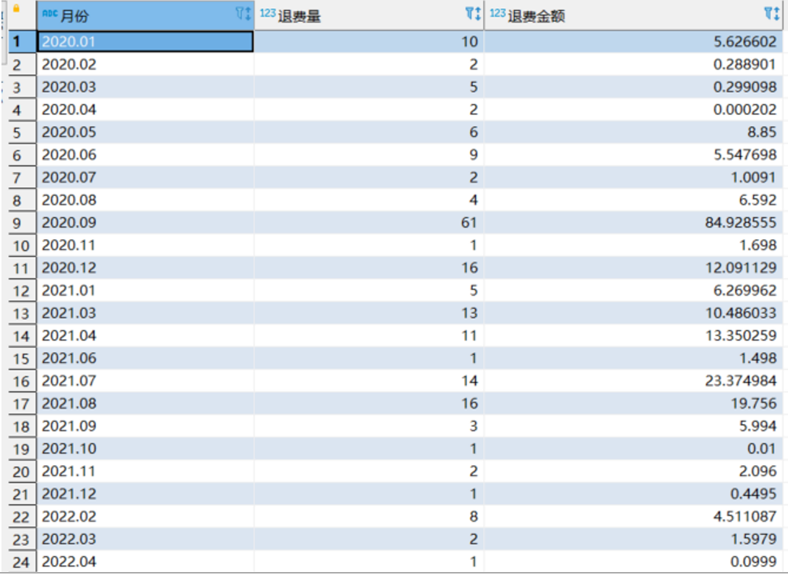

全部课程不同退费类型的退费量分析

```sql
SELECT
    date_format(orf.refund_time, '%Y.%m') AS `月份`,
    count(CASE WHEN orf.refund_type=10 THEN orf.id ELSE null END) AS `课程退学退费`,
    count(CASE WHEN orf.refund_type=11 THEN orf.id ELSE null END) AS `多交学费退费`,
    count(CASE WHEN orf.refund_type=12 THEN orf.id ELSE null END) AS `全款后预交学费退费`,
    count(CASE WHEN orf.refund_type=20 THEN orf.id ELSE null END) AS `转线下_课程退学退`,
    count(CASE WHEN orf.refund_type=21 THEN orf.id ELSE null END) AS `转线下_多交学费退`,
    count(CASE WHEN orf.refund_type=22 THEN orf.id ELSE null END) AS `转线下_预交学费退`
FROM
    bxg.dwd_oe_order_refund  orf
WHERE
        orf.delete_flag=0
  AND orf.order_refund_status=-1
  AND orf.order_delete_flag=0
  AND orf.order_pay_status=2
  -- 除去线上互转
  AND orf.refund_type NOT IN(30,31,32)
  AND (year(orf.refund_time)=year(NOW()) or year(orf.refund_time)=year(date_sub(now(),interval 1 year)) or year(orf.refund_time)=year(date_sub(now(),interval 2 year)))
GROUP BY date_format(orf.refund_time, '%Y.%m')
ORDER BY date_format(orf.refund_time, '%Y.%m') ASC;

```

全部课程不同退费类型的退费金额分析

```sql
SELECT
    date_format(orf.refund_time, '%Y.%m') AS `月份`,
    sum(CASE WHEN orf.refund_type=10 THEN orf.amount ELSE 0 END)/10000 AS `课程退学退费`,
    sum(CASE WHEN orf.refund_type=11 THEN orf.amount ELSE 0 END)/10000 AS `多交学费退费`,
    sum(CASE WHEN orf.refund_type=12 THEN orf.amount ELSE 0 END)/10000 AS `全款后预交学费退费`,
    sum(CASE WHEN orf.refund_type=20 THEN orf.amount ELSE 0 END)/10000 AS `转线下_课程退学退`,
    sum(CASE WHEN orf.refund_type=21 THEN orf.amount ELSE 0 END)/10000 AS `转线下_多交学费退`,
    sum(CASE WHEN orf.refund_type=22 THEN orf.amount ELSE 0 END)/10000 AS `转线下_预交学费退`
FROM
    bxg.dwd_oe_order_refund  orf
WHERE
       orf.delete_flag=0
  AND orf.order_refund_status=-1
  AND orf.order_delete_flag=0
  AND orf.order_pay_status=2
  -- 除去线上互转
  AND orf.refund_type NOT IN(30,31,32)
  AND (year(orf.refund_time)=year(NOW()) or year(orf.refund_time)=year(date_sub(now(),interval 1 year)) or year(orf.refund_time)=year(date_sub(now(),interval 2 year)))
GROUP BY date_format(orf.refund_time, '%Y.%m')
ORDER BY date_format(orf.refund_time, '%Y.%m') ASC;
```

不同时期的全部课程问题退费量分析

```sql
with tb1 as(
    SELECT
        date_format(ora.create_time, '%Y.%m') AS `月份`,
        count(CASE WHEN orf.order_pay_status=2 AND orf.refund_type=12 THEN orf.id ELSE null END) AS `全款后进班前退费量`,
        count(CASE WHEN orf.order_pay_status=2 AND osco.effective_date is not null AND orf.refund_type=10  AND abs(datediff(cast(osco.effective_date as datetime),cast(ora.create_time as datetime)))<=7 THEN orf.id ELSE null END) AS `进班后七天内退费量`,
        count(CASE WHEN orf.order_pay_status=2 AND osco.effective_date is not null AND orf.refund_type=10  AND abs(datediff(cast(osco.effective_date as datetime),cast(ora.create_time as datetime)))>7 THEN orf.id ELSE null END) AS `进班后七天外退费量`
    FROM
        bxg.dwd_oe_order_refund orf
            LEFT JOIN   bxg.dwd_oe_stu_course_order osco ON  orf.order_id=osco.order_id AND orf.order_detail_id=osco.order_detail_id
            LEFT JOIN   bxg.dwd_oe_order_refund_apply  ora ON orf.order_id=ora.order_id and orf.order_detail_id = ora.order_detail_id
    WHERE
            orf.delete_flag=0
      AND osco.stu_course_order_delete_flag=0
      AND osco.stu_course_delete_flag=0
      AND orf.order_refund_status=-1
      AND orf.order_delete_flag=0
      AND osco.course_id not in (555,1537)
-- 申请状态已完成
      AND ora.status=0
      AND ora.delete_flag=0
      AND (year(orf.refund_time)=year(NOW()) or year(orf.refund_time)=year(date_sub(now(),interval 1 year)) or year(orf.refund_time)=year(date_sub(now(),interval 2 year)))
    GROUP BY date_format(ora.create_time, '%Y.%m')
)
select
    `月份`,
    `全款后进班前退费量`,
    `进班后七天内退费量`,
    `进班后七天外退费量`,
    `全款后进班前退费量`+`进班后七天内退费量`+`进班后七天外退费量` AS `总退费量` from tb1 order by `月份` asc;
```

不同时期的全部课程问题退费金额分析

```sql
with tb1 as (
    SELECT date_format(ora.create_time, '%Y.%m')                                                        AS `月份`,
           sum(CASE WHEN orf.order_pay_status = 2 AND orf.refund_type = 12 THEN orf.amount ELSE 0 END) / 10000 AS `全款后进班前退费金额`,
           sum(CASE
                   WHEN orf.order_pay_status = 2 AND osco.effective_date is not null AND orf.refund_type = 10 AND
                        abs(datediff(cast(osco.effective_date as datetime), cast(ora.create_time as datetime))) <= 7
                       THEN orf.amount
                   ELSE 0 END) / 10000                                                                  AS `进班后七天内退费金额`,
           sum(CASE
                   WHEN orf.order_pay_status = 2 AND osco.effective_date is not null AND orf.refund_type = 10 AND
                        abs(datediff(cast(osco.effective_date as datetime), cast(ora.create_time as datetime))) > 7
                       THEN orf.amount
                   ELSE 0 END) / 10000                                                                  AS `进班后七天外退费金额`
    FROM bxg.dwd_oe_order_refund orf
             LEFT JOIN   bxg.dwd_oe_stu_course_order osco ON  orf.order_id=osco.order_id AND orf.order_detail_id=osco.order_detail_id
             LEFT JOIN bxg.dwd_oe_order_refund_apply ora
                       ON orf.order_id = ora.order_id and orf.order_detail_id = ora.order_detail_id
    WHERE orf.delete_flag = 0
      AND osco.stu_course_delete_flag = 0
      AND osco.stu_course_order_delete_flag = 0
      AND osco.stu_course_status = 8
      AND orf.order_delete_flag = 0
      AND osco.course_id not in (555,1537)
-- 申请状态已完成
      AND ora.status = 0
      AND ora.delete_flag = 0
      AND (year(orf.refund_time) = year(NOW()) or year(orf.refund_time) = year(date_sub(now(), interval 1 year)) or
        year(orf.refund_time) = year(date_sub(now(), interval 2 year)))
    GROUP BY date_format(ora.create_time, '%Y.%m')
) select `月份`,
         `全款后进班前退费金额`,
         `进班后七天内退费金额`,
         `进班后七天外退费金额`,
         `全款后进班前退费金额`+`进班后七天内退费金额`+`进班后七天外退费金额` AS `总退费金额` from tb1  order by `月份` asc;
```

进班后的职业课各类型的问题退费量分析

```sql
SELECT
    date_format(orf.refund_time, '%Y.%m') AS `月份`,
    count(CASE WHEN  (osco.course_type=0 AND osco.grade_name NOT LIKE '%SVIP%' AND osco.grade_name LIKE '%在线就业班%' ) THEN orf.id ELSE null END) AS `在线就业班`,
    count(CASE WHEN  (osco.course_type=0 AND osco.grade_name LIKE '%SVIP%') THEN orf.id ELSE null END) AS `SVIP班`,
    count(CASE WHEN  (osco.course_id =3264 or osco.course_id=3400 or osco.course_id=3912 or osco.course_id=4036 or osco.course_id =4293 or osco.course_id =4314 or osco.course_id =4511 or  osco.course_id =4454 ) THEN orf.id ELSE null END) AS `直播保薪班`,
    count(CASE WHEN  (osco.course_type=0 AND osco.grade_name LIKE '%【年度钻石会员】%') THEN orf.id ELSE null END) AS `年度会员`,
    count(CASE WHEN  (osco.course_type=0 AND osco.grade_name LIKE '%【钻石会员】%') THEN orf.id ELSE null END) AS `半年度会员`,
    count(CASE WHEN  (osco.grade_name LIKE '%【季度铂金会员】%') THEN orf.id ELSE null END) AS `季度会员`,
    count(CASE WHEN  (osco.grade_name LIKE '%【月度黄金会员】%') THEN orf.id ELSE null END) AS `月度会员`
FROM
    bxg.dwd_oe_order_refund  orf
        LEFT JOIN   bxg.dwd_oe_stu_course_order osco ON  orf.order_id=osco.order_id AND orf.order_detail_id=osco.order_detail_id
WHERE
        orf.delete_flag=0
  AND osco.stu_course_delete_flag = 0
  AND osco.stu_course_order_delete_flag = 0
  AND osco.stu_course_status=8
  AND orf.order_delete_flag=0
  AND orf.order_pay_status=2
  AND osco.course_id not in (555,1537)
  AND osco.effective_date is not null
  -- 课程退学退
  AND orf.refund_type=10
  AND (year(orf.refund_time)=year(NOW()) or year(orf.refund_time)=year(date_sub(now(),interval 1 year)) or year(orf.refund_time)=year(date_sub(now(),interval 2 year)))
GROUP BY date_format(orf.refund_time, '%Y.%m')
ORDER BY date_format(orf.refund_time, '%Y.%m') ASC;

```

进班后的职业课各类型的问题退费金额分析

```sql
SELECT
    date_format(orf.refund_time, '%Y.%m') AS `月份`,
    sum(CASE WHEN  (osco.course_type=0 AND osco.grade_name NOT LIKE '%SVIP%' AND osco.grade_name LIKE '%在线就业班%' ) THEN orf.amount ELSE 0 END)/10000 AS `在线就业班`,
    sum(CASE WHEN  (osco.course_type=0 AND osco.grade_name LIKE '%SVIP%') THEN orf.amount ELSE 0 END)/10000 AS `SVIP班`,
    sum(CASE WHEN  (osco.course_id IN (osco.course_id =3264 or osco.course_id=3400 or osco.course_id=3912 or osco.course_id=4036 or osco.course_id =4293 or osco.course_id =4314 or osco.course_id =4511 or  osco.course_id =4454 )) THEN orf.amount ELSE 0 END)/10000 AS `直播保薪班`,
    sum(CASE WHEN  (osco.course_type=0 AND osco.grade_name LIKE '%【年度钻石会员】%') THEN orf.amount ELSE 0 END)/10000 AS `年度会员`,
    sum(CASE WHEN  (osco.course_type=0 AND osco.grade_name LIKE '%【钻石会员】%') THEN orf.amount ELSE 0 END)/10000 AS `半年度会员`,
    sum(CASE WHEN  (osco.grade_name LIKE '%【季度铂金会员】%') THEN orf.amount ELSE 0 END)/10000 AS `季度会员`,
    sum(CASE WHEN  (osco.grade_name LIKE '%【月度黄金会员】%') THEN orf.amount ELSE 0 END)/10000 AS `月度会员`
FROM
    bxg.dwd_oe_order_refund orf
        LEFT JOIN   bxg.dwd_oe_stu_course_order osco ON  orf.order_id=osco.order_id AND orf.order_detail_id=osco.order_detail_id
        WHERE
        orf.delete_flag=0
  AND osco.stu_course_delete_flag = 0
  AND osco.stu_course_order_delete_flag = 0
  AND osco.stu_course_status=8
  AND orf.order_delete_flag=0
  AND orf.order_pay_status=2
  AND osco.course_id not in (555,1537)
  AND osco.effective_date is not null
  -- 课程退学退
  AND orf.refund_type=10
  AND (year(orf.refund_time)=year(NOW()) or year(orf.refund_time)=year(date_sub(now(),interval 1 year)) or year(orf.refund_time)=year(date_sub(now(),interval 2 year)))
GROUP BY date_format(orf.refund_time, '%Y.%m')
ORDER BY date_format(orf.refund_time, '%Y.%m') ASC;

```

2021年全部课程进班后的问题退费量详情表

```sql
with  tb2  as  (select 2021 as STATIS_YEAR)
SELECT
    tt.course_id AS `课程id`,
    tt.course_name AS `课程名称`,
    tt.course_type AS `课程类型`,
    tt.January AS `一月`,
    tt.February AS `二月`,
    tt.March AS `三月`,
    tt.April AS `四月`,
    tt.May AS `五月`,
    tt.June AS `六月`,
    tt.July AS `七月`,
    tt.August AS `八月`,
    tt.September AS `九月`,
    tt.October AS `十月`,
    tt.November AS `十一月`,
    tt.December AS `十二月`,
    tt.total AS `总计`
FROM (
         select
             `course_id`,
             `course_name`,
             `course_type`,
             `January`,
             `February`,
             `March`,
             `April`,
             `May`,
             `June`,
             `July`,
             `August`,
             `September`,
             `October`,
             `November`,
             `December`,
             (`January` + `February` + `March` + `April` + `May` + `June` + `July` + `August` + `September` +
              `October` + `November` + `December`) AS `total`
         from
             (SELECT osco.course_id                                  AS `course_id`,
                     osco.grade_name                          AS `course_name`,
                     (case
                          when (osco.course_type = 0 AND osco.grade_name LIKE '%SVIP%') then 'SVIP班'
                          when (osco.course_type = 0 AND osco.grade_name LIKE '【年度钻石会员】%') then '年度会员'
                          when (osco.course_type = 0 AND osco.grade_name LIKE '【钻石会员】%') then '半年度钻石会员'
                          when (osco.grade_name LIKE '【季度铂金会员】%') then '季度会员'
                          when (osco.grade_name LIKE '【月度黄金会员】%') then '月度会员'
                          when (osco.course_id in (3264, 3400, 3912, 4036)) then '直播保薪班'
                          when (osco.course_type = 0 AND (osco.grade_name NOT LIKE '%SVIP%' AND osco.grade_name LIKE '%在线就业班%'))
                              then '在线就业班'
                          when (osco.course_type = 0 AND (osco.grade_name NOT LIKE '%SVIP%' AND osco.grade_name NOT LIKE '%在线就业班%'))
                              then '其他职业课'
                          else '微课、其他直播课等' end
                         )                                 AS `course_type`,
                     count(case
                               when (orf.refund_time >= '2021-01-01 00:00:00' AND orf.refund_time <= '2021-01-31 23:59:59')
                                   then orf.id
                               else null end)              AS `January`,
                     count(case
                               when (orf.refund_time >= '2021-02-01 00:00:00' AND orf.refund_time <= '2021-02-28 23:59:59')
                                   then orf.id
                               else null end)              AS `February`,
                     count(case
                               when (orf.refund_time >= '2021-03-01 00:00:00' AND orf.refund_time <= '2021-03-31 23:59:59')
                                   then orf.id
                               else null end)              AS `March`,
                     count(case
                               when (orf.refund_time >= '2021-04-01 00:00:00' AND orf.refund_time <= '2021-04-30 23:59:59')
                                   then orf.id
                               else null end)              AS `April`,
                     count(case
                               when (orf.refund_time >= '2021-05-01 00:00:00' AND orf.refund_time <= '2021-05-31 23:59:59')
                                   then orf.id
                               else null end)              AS `May`,
                     count(case
                               when (orf.refund_time >= '2021-06-01 00:00:00' AND orf.refund_time <= '2021-06-30 23:59:59')
                                   then orf.id
                               else null end)              AS `June`,
                     count(case
                               when (orf.refund_time >= '2021-07-01 00:00:00' AND orf.refund_time <= '2021-07-31 23:59:59')
                                   then orf.id
                               else null end)              AS `July`,
                     count(case
                               when (orf.refund_time >= '2021-08-01 00:00:00' AND orf.refund_time <= '2021-08-31 23:59:59')
                                   then orf.id
                               else null end)              AS `August`,
                     count(case
                               when (orf.refund_time >= '2021-09-01 00:00:00' AND orf.refund_time <= '2021-09-30 23:59:59')
                                   then orf.id
                               else null end)              AS `September`,
                     count(case
                               when (orf.refund_time >= '2021-10-01 00:00:00' AND orf.refund_time <= '2021-10-31 23:59:59')
                                   then orf.id
                               else null end)              AS `October`,
                     count(case
                               when (orf.refund_time >= '2021-11-01 00:00:00' AND orf.refund_time <= '2021-11-30 23:59:59')
                                   then orf.id
                               else null end)              AS `November`,
                     count(case
                               when (orf.refund_time >= '2021-12-01 00:00:00' AND orf.refund_time <= '2021-12-31 23:59:59')
                                   then orf.id
                               else null end)              AS `December`
              FROM bxg.dwd_oe_order_refund orf
                       LEFT JOIN   bxg.dwd_oe_stu_course_order osco ON  orf.order_id=osco.order_id AND orf.order_detail_id=osco.order_detail_id
                        WHERE orf.delete_flag = 0
                        AND osco.stu_course_delete_flag = 0
                        AND osco.stu_course_order_delete_flag = 0
                        AND osco.stu_course_status = 8
                        AND orf.order_delete_flag = 0
                        AND orf.order_pay_status = 2
                        AND osco.course_id not in (555,1537)
                        AND osco.effective_date is not null
                        -- 课程退学退
                        AND orf.refund_type = 10
                        AND year(orf.refund_time) =  (select max(STATIS_YEAR) from tb2)
         GROUP BY osco.course_id, osco.grade_name, osco.course_type) tb1
    ) tt
WHERE tt.total>0
ORDER BY `total` DESC;
```

2021年全部课程的转线下退费量详情表

```sql
with tb2 as (select 2021 as STATIS_YEAR)
SELECT
    tt.course_id AS `课程id`,
    tt.course_name AS `课程名称`,
    tt.course_type AS `课程类型`,
    tt.January AS `一月`,
    tt.February AS `二月`,
    tt.March AS `三月`,
    tt.April AS `四月`,
    tt.May AS `五月`,
    tt.June AS `六月`,
    tt.July AS `七月`,
    tt.August AS `八月`,
    tt.September AS `九月`,
    tt.October AS `十月`,
    tt.November AS `十一月`,
    tt.December AS `十二月`,
    tt.total AS `总计`
FROM (
         select
             `course_id`,
             `course_name`,
             `course_type`,
             `January`,
             `February`,
             `March`,
             `April`,
             `May`,
             `June`,
             `July`,
             `August`,
             `September`,
             `October`,
             `November`,
             `December`,
             (`January` + `February` + `March` + `April` + `May` + `June` + `July` + `August` + `September` +
              `October` + `November` + `December`) AS `total`
         from
             (SELECT
                  osco.course_id AS `course_id`,
                  osco.grade_name AS `course_name`,
                  (case
                       when (osco.course_type = 0 AND osco.grade_name LIKE '%SVIP%') then 'SVIP班'
                       when (osco.course_type = 0 AND osco.grade_name LIKE '【年度钻石会员】%') then '年度会员'
                       when (osco.course_type = 0 AND osco.grade_name LIKE '【钻石会员】%') then '半年度钻石会员'
                       when (osco.grade_name LIKE '【季度铂金会员】%') then '季度会员'
                       when (osco.grade_name LIKE '【月度黄金会员】%') then '月度会员'
                       when (osco.course_id in (3264,3400,3912,4036)) then '直播保薪班'
                       when (osco.course_type = 0 AND (osco.grade_name NOT LIKE '%SVIP%' AND osco.grade_name LIKE '%在线就业班%')) then '在线就业班'
                       when (osco.course_type = 0 AND (osco.grade_name NOT LIKE '%SVIP%' AND osco.grade_name NOT LIKE '%在线就业班%')) then '其他职业课'
                       else '微课、其他直播课等' end
                      ) AS `course_type`,
                  count(case when (orf.refund_time >= '2021-01-01 00:00:00'   AND orf.refund_time <= '2021-01-31 23:59:59') then orf.id else null end) AS `January`,
                  count(case when (orf.refund_time >= '2021-02-01 00:00:00'   AND orf.refund_time <= '2021-02-28 23:59:59') then orf.id else null end) AS `February`,
                  count(case when (orf.refund_time >= '2021-03-01 00:00:00'   AND orf.refund_time <= '2021-03-31 23:59:59') then orf.id else null end) AS `March`,
                  count(case when (orf.refund_time >= '2021-04-01 00:00:00'   AND orf.refund_time <= '2021-04-30 23:59:59') then orf.id else null end) AS `April`,
                  count(case when (orf.refund_time >= '2021-05-01 00:00:00'   AND orf.refund_time <= '2021-05-31 23:59:59') then orf.id else null end) AS `May`,
                  count(case when (orf.refund_time >= '2021-06-01 00:00:00'   AND orf.refund_time <= '2021-06-30 23:59:59') then orf.id else null end) AS `June`,
                  count(case when (orf.refund_time >= '2021-07-01 00:00:00'   AND orf.refund_time <= '2021-07-31 23:59:59') then orf.id else null end) AS `July`,
                  count(case when (orf.refund_time >= '2021-08-01 00:00:00'   AND orf.refund_time <= '2021-08-31 23:59:59') then orf.id else null end) AS `August`,
                  count(case when (orf.refund_time >= '2021-09-01 00:00:00'   AND orf.refund_time <= '2021-09-30 23:59:59') then orf.id else null end) AS `September`,
                  count(case when (orf.refund_time >= '2021-10-01 00:00:00'   AND orf.refund_time <= '2021-10-31 23:59:59') then orf.id else null end) AS `October`,
                  count(case when (orf.refund_time >= '2021-11-01 00:00:00'   AND orf.refund_time <= '2021-11-30 23:59:59') then orf.id else null end) AS `November`,
                  count(case when (orf.refund_time >= '2021-12-01 00:00:00'   AND orf.refund_time <= '2021-12-31 23:59:59') then orf.id else null end) AS `December`
              FROM
                  bxg.dwd_oe_order_refund orf
                      LEFT JOIN   bxg.dwd_oe_stu_course_order osco ON  orf.order_id=osco.order_id AND orf.order_detail_id=osco.order_detail_id
               WHERE
                          orf.delete_flag=0
                      AND osco.stu_course_delete_flag = 0
                      AND osco.stu_course_order_delete_flag = 0
                      AND osco.stu_course_status=8
                      AND orf.order_delete_flag=0
                      AND orf.order_pay_status=2
                      AND osco.course_id not in (555,1537)
                      -- 转线下类型
                      AND orf.refund_type in(20,21,22)
                      AND year(orf.refund_time) = (select max(STATIS_YEAR) from tb2)
         GROUP BY osco.course_id, osco.grade_name,osco.course_type
     ) tb1
    ) tt
WHERE tt.total>0  ORDER BY `total` DESC;
```

2021年全部课程的转线下退费金额详情表

```sql
with tb2 as (select 2021 as STATIS_YEAR)
SELECT
    tt.course_id AS `课程id`,
    tt.course_name AS `课程名称`,
    tt.course_type AS `课程类型`,
    tt.January AS `一月`,
    tt.February AS `二月`,
    tt.March AS `三月`,
    tt.April AS `四月`,
    tt.May AS `五月`,
    tt.June AS `六月`,
    tt.July AS `七月`,
    tt.August AS `八月`,
    tt.September AS `九月`,
    tt.October AS `十月`,
    tt.November AS `十一月`,
    tt.December AS `十二月`,
    tt.total AS `总计`
FROM (
         select
             `course_id`,
             `course_name`,
             `course_type`,
             `January`,
             `February`,
             `March`,
             `April`,
             `May`,
             `June`,
             `July`,
             `August`,
             `September`,
             `October`,
             `November`,
             `December`,
             (`January` + `February` + `March` + `April` + `May` + `June` + `July` + `August` + `September` +
              `October` + `November` + `December`) AS `total`
         from
             (SELECT
                  osco.course_id AS `course_id`,
                  osco.grade_name AS `course_name`,
                  (case
                       when (osco.course_type = 0 AND osco.grade_name LIKE '%SVIP%') then 'SVIP班'
                       when (osco.course_type = 0 AND osco.grade_name LIKE '【年度钻石会员】%') then '年度会员'
                       when (osco.course_type = 0 AND osco.grade_name LIKE '【钻石会员】%') then '半年度钻石会员'
                       when (osco.grade_name LIKE '【季度铂金会员】%') then '季度会员'
                       when (osco.grade_name LIKE '【月度黄金会员】%') then '月度会员'
                       when (osco.course_id in (3264,3400,3912,4036)) then '直播保薪班'
                       when (osco.course_type = 0 AND (osco.grade_name NOT LIKE '%SVIP%' AND osco.grade_name LIKE '%在线就业班%')) then '在线就业班'
                       when (osco.course_type = 0 AND (osco.grade_name NOT LIKE '%SVIP%' AND osco.grade_name NOT LIKE '%在线就业班%')) then '其他职业课'
                       else '微课、其他直播课等' end
                      ) AS `course_type`,
                  sum(case when (orf.refund_time >= '2021-01-01 00:00:00'   AND orf.refund_time <= '2021-01-31 23:59:59') then orf.amount else 0 end) AS `January`,
                  sum(case when (orf.refund_time >= '2021-02-01 00:00:00'   AND orf.refund_time <= '2021-02-28 23:59:59') then orf.amount else 0 end) AS `February`,
                  sum(case when (orf.refund_time >= '2021-03-01 00:00:00'   AND orf.refund_time <= '2021-03-31 23:59:59') then orf.amount else 0 end) AS `March`,
                  sum(case when (orf.refund_time >= '2021-04-01 00:00:00'   AND orf.refund_time <= '2021-04-30 23:59:59') then orf.amount else 0 end) AS `April`,
                  sum(case when (orf.refund_time >= '2021-05-01 00:00:00'   AND orf.refund_time <= '2021-05-31 23:59:59') then orf.amount else 0 end) AS `May`,
                  sum(case when (orf.refund_time >= '2021-06-01 00:00:00'   AND orf.refund_time <= '2021-06-30 23:59:59') then orf.amount else 0 end) AS `June`,
                  sum(case when (orf.refund_time >= '2021-07-01 00:00:00'   AND orf.refund_time <= '2021-07-31 23:59:59') then orf.amount else 0 end) AS `July`,
                  sum(case when (orf.refund_time >= '2021-08-01 00:00:00'   AND orf.refund_time <= '2021-08-31 23:59:59') then orf.amount else 0 end) AS `August`,
                  sum(case when (orf.refund_time >= '2021-09-01 00:00:00'   AND orf.refund_time <= '2021-09-30 23:59:59') then orf.amount else 0 end) AS `September`,
                  sum(case when (orf.refund_time >= '2021-10-01 00:00:00'   AND orf.refund_time <= '2021-10-31 23:59:59') then orf.amount else 0 end) AS `October`,
                  sum(case when (orf.refund_time >= '2021-11-01 00:00:00'   AND orf.refund_time <= '2021-11-30 23:59:59') then orf.amount else 0 end) AS `November`,
                  sum(case when (orf.refund_time >= '2021-12-01 00:00:00'   AND orf.refund_time <= '2021-12-31 23:59:59') then orf.amount else 0 end) AS `December`
              FROM
                  bxg.dwd_oe_order_refund orf
                      LEFT JOIN   bxg.dwd_oe_stu_course_order osco ON  orf.order_id=osco.order_id AND orf.order_detail_id=osco.order_detail_id
              WHERE
                          orf.delete_flag=0
                      AND osco.stu_course_delete_flag = 0
                      AND osco.stu_course_order_delete_flag = 0
                      AND osco.stu_course_status=8
                      AND orf.order_delete_flag=0
                      AND orf.order_pay_status=2
                      AND osco.course_id not in (555,1537)
                      -- 转线下类型
                      AND orf.refund_type in(20,21,22)
                      AND year(orf.refund_time)=(select max(STATIS_YEAR) from tb2)
         GROUP BY osco.course_id, osco.grade_name,osco.course_type) tb1
    ) tt
WHERE tt.total>0  ORDER BY  `total` DESC;
```

2021年全部课程的线上互转量详情表

```sql
with tb2 as (select 2021 as STATIS_YEAR)
SELECT
    tt.course_id AS `课程id`,
    tt.course_name AS `课程名称`,
    tt.course_type AS `课程类型`,
    tt.January AS `1月`,
    tt.February AS `2月`,
    tt.March AS `3月`,
    tt.April AS `4月`,
    tt.May AS `5月`,
    tt.June AS `6月`,
    tt.July AS `7月`,
    tt.August AS `8月`,
    tt.September AS `9月`,
    tt.October AS `10月`,
    tt.November AS `11月`,
    tt.December AS `12月`,
    tt.total AS `总计`
FROM (
         select
             `course_id`,
             `course_name`,
             `course_type`,
             `January`,
             `February`,
             `March`,
             `April`,
             `May`,
             `June`,
             `July`,
             `August`,
             `September`,
             `October`,
             `November`,
             `December`,
             (`January` + `February` + `March` + `April` + `May` + `June` + `July` + `August` + `September` +
              `October` + `November` + `December`) AS `total`
         from
             (SELECT
                  osco.course_id AS `course_id`,
                  osco.grade_name AS `course_name`,
                  (case
                       when (osco.course_type = 0 AND osco.grade_name LIKE '%SVIP%') then 'SVIP班'
                       when (osco.course_type = 0 AND osco.grade_name LIKE '【年度钻石会员】%') then '年度会员'
                       when (osco.course_type = 0 AND osco.grade_name LIKE '【钻石会员】%') then '半年度钻石会员'
                       when (osco.grade_name LIKE '【季度铂金会员】%') then '季度会员'
                       when (osco.grade_name LIKE '【月度黄金会员】%') then '月度会员'
                       when (osco.course_id in (3264,3400,3912,4036)) then '直播保薪班'
                       when (osco.course_type = 0 AND (osco.grade_name NOT LIKE '%SVIP%' AND osco.grade_name LIKE '%在线就业班%')) then '在线就业班'
                       when (osco.course_type = 0 AND (osco.grade_name NOT LIKE '%SVIP%' AND osco.grade_name NOT LIKE '%在线就业班%')) then '其他职业课'
                       else '微课、其他直播课等' end
                      ) AS `course_type`,
                  count(case when (orf.refund_time >= '2021-01-01 00:00:00'   AND orf.refund_time <= '2021-01-31 23:59:59') then orf.id else null end) AS `January`,
                  count(case when (orf.refund_time >= '2021-02-01 00:00:00'   AND orf.refund_time <= '2021-02-28 23:59:59') then orf.id else null end) AS `February`,
                  count(case when (orf.refund_time >= '2021-03-01 00:00:00'   AND orf.refund_time <= '2021-03-31 23:59:59') then orf.id else null end) AS `March`,
                  count(case when (orf.refund_time >= '2021-04-01 00:00:00'   AND orf.refund_time <= '2021-04-30 23:59:59') then orf.id else null end) AS `April`,
                  count(case when (orf.refund_time >= '2021-05-01 00:00:00'   AND orf.refund_time <= '2021-05-31 23:59:59') then orf.id else null end) AS `May`,
                  count(case when (orf.refund_time >= '2021-06-01 00:00:00'   AND orf.refund_time <= '2021-06-30 23:59:59') then orf.id else null end) AS `June`,
                  count(case when (orf.refund_time >= '2021-07-01 00:00:00'   AND orf.refund_time <= '2021-07-31 23:59:59') then orf.id else null end) AS `July`,
                  count(case when (orf.refund_time >= '2021-08-01 00:00:00'   AND orf.refund_time <= '2021-08-31 23:59:59') then orf.id else null end) AS `August`,
                  count(case when (orf.refund_time >= '2021-09-01 00:00:00'   AND orf.refund_time <= '2021-09-30 23:59:59') then orf.id else null end) AS `September`,
                  count(case when (orf.refund_time >= '2021-10-01 00:00:00'   AND orf.refund_time <= '2021-10-31 23:59:59') then orf.id else null end) AS `October`,
                  count(case when (orf.refund_time >= '2021-11-01 00:00:00'   AND orf.refund_time <= '2021-11-30 23:59:59') then orf.id else null end) AS `November`,
                  count(case when (orf.refund_time >= '2021-12-01 00:00:00'   AND orf.refund_time <= '2021-12-31 23:59:59') then orf.id else null end) AS `December`
              FROM
                  bxg.dwd_oe_order_refund orf
                      LEFT JOIN   bxg.dwd_oe_stu_course_order osco ON  orf.order_id=osco.order_id AND orf.order_detail_id=osco.order_detail_id
               WHERE
                          orf.delete_flag=0
                      AND osco.stu_course_delete_flag = 0
                      AND osco.stu_course_order_delete_flag = 0
                      AND osco.stu_course_status=8
                      AND orf.order_delete_flag=0
                      AND orf.order_pay_status=2
                      AND osco.course_id not in (555,1537)
                      -- 线上互转类型
                      AND orf.refund_type in(30,31,32)
                      AND year(orf.refund_time) = (select max(STATIS_YEAR) from tb2)
         GROUP BY osco.course_id, osco.grade_name,osco.course_type
     ) tb1
    ) tt
WHERE tt.total>0 ORDER BY  `total` DESC;
```

##### 分析

**指标1-3**

指标1-3的涉及的表,where条件,维度都是相同的。提取计算的所有字段,写出如下SQL(doris)

```sql
SELECT
    date_format(orf.refund_time, '%Y.%m') AS `月份`,
    sum(orf.amount)/10000 AS `全部课程退费金额`,
    sum(CASE WHEN orf.refund_type=10 THEN orf.amount ELSE 0 END)/10000 AS `课程退学退费金额`,
    sum(CASE WHEN orf.refund_type=11 THEN orf.amount ELSE 0 END)/10000 AS `多交学费退费金额`,
    sum(CASE WHEN orf.refund_type=12 THEN orf.amount ELSE 0 END)/10000 AS `全款后预交学费退费金额`,
    sum(CASE WHEN orf.refund_type=20 THEN orf.amount ELSE 0 END)/10000 AS `转线下_课程退学退费金额`,
    sum(CASE WHEN orf.refund_type=21 THEN orf.amount ELSE 0 END)/10000 AS `转线下_多交学费退费金额`,
    sum(CASE WHEN orf.refund_type=22 THEN orf.amount ELSE 0 END)/10000 AS `转线下_预交学费退费金额`,
    count(orf.id) AS `全部课程退费量`,
    count(CASE WHEN orf.refund_type=10 THEN orf.id ELSE null END) AS `课程退学退费量`,
    count(CASE WHEN orf.refund_type=11 THEN orf.id ELSE null END) AS `多交学费退费量`,
    count(CASE WHEN orf.refund_type=12 THEN orf.id ELSE null END) AS `全款后预交学费退费量`,
    count(CASE WHEN orf.refund_type=20 THEN orf.id ELSE null END) AS `转线下_课程退学退费量`,
    count(CASE WHEN orf.refund_type=21 THEN orf.id ELSE null END) AS `转线下_多交学费退费量`,
    count(CASE WHEN orf.refund_type=22 THEN orf.id ELSE null END) AS `转线下_预交学费退费量`   
FROM
    bxg.dwd_oe_order_refund  orf
WHERE
      orf.delete_flag=0
  AND orf.order_refund_status=-1
  AND orf.order_delete_flag=0
  AND orf.order_pay_status=2
  -- 除去线上互转
  AND orf.refund_type NOT IN(30,31,32)
  AND (year(orf.refund_time)=year(NOW()) or year(orf.refund_time)=year(date_sub(now(),interval 1 year)) or year(orf.refund_time)=year(date_sub(now(),interval 2 year)))
GROUP BY date_format(orf.refund_time, '%Y.%m')
ORDER BY date_format(orf.refund_time, '%Y.%m') ASC;
```

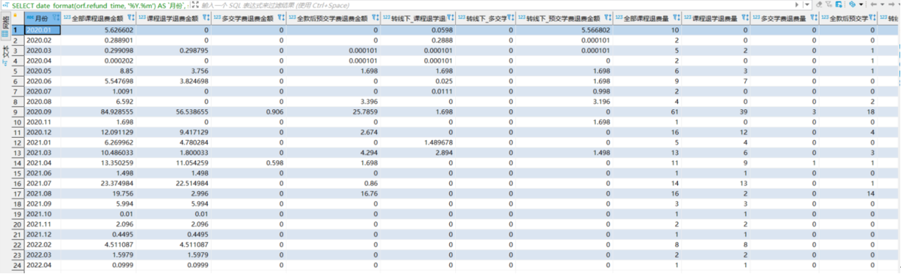

利用上面的SQL作为子查询的源表,写出DWD层指标语句。

以指标1为例:

```sql
SELECT
    `月份`,
    `全部课程退费量`,
    `全部课程退费金额`
FROM
	(SELECT
    date_format(orf.refund_time, '%Y.%m') AS `月份`,
    sum(orf.amount)/10000 AS `全部课程退费金额`,
    sum(CASE WHEN orf.refund_type=10 THEN orf.amount ELSE 0 END)/10000 AS `课程退学退费金额`,
    sum(CASE WHEN orf.refund_type=11 THEN orf.amount ELSE 0 END)/10000 AS `多交学费退费金额`,
    sum(CASE WHEN orf.refund_type=12 THEN orf.amount ELSE 0 END)/10000 AS `全款后预交学费退费金额`,
    sum(CASE WHEN orf.refund_type=20 THEN orf.amount ELSE 0 END)/10000 AS `转线下_课程退学退费金额`,
    sum(CASE WHEN orf.refund_type=21 THEN orf.amount ELSE 0 END)/10000 AS `转线下_多交学费退费金额`,
    sum(CASE WHEN orf.refund_type=22 THEN orf.amount ELSE 0 END)/10000 AS `转线下_预交学费退费金额`,
    count(orf.id) AS `全部课程退费量`,
    count(CASE WHEN orf.refund_type=10 THEN orf.id ELSE null END) AS `课程退学退费量`,
    count(CASE WHEN orf.refund_type=11 THEN orf.id ELSE null END) AS `多交学费退费量`,
    count(CASE WHEN orf.refund_type=12 THEN orf.id ELSE null END) AS `全款后预交学费退费量`,
    count(CASE WHEN orf.refund_type=20 THEN orf.id ELSE null END) AS `转线下_课程退学退费量`,
    count(CASE WHEN orf.refund_type=21 THEN orf.id ELSE null END) AS `转线下_多交学费退费量`,
    count(CASE WHEN orf.refund_type=22 THEN orf.id ELSE null END) AS `转线下_预交学费退费量`   
FROM
    bxg.dwd_oe_order_refund  orf
WHERE
      orf.delete_flag=0
  AND orf.order_refund_status=-1
  AND orf.order_delete_flag=0
  AND orf.order_pay_status=2
  -- 除去线上互转
  AND orf.refund_type NOT IN(30,31,32)
  AND (year(orf.refund_time)=year(NOW()) or year(orf.refund_time)=year(date_sub(now(),interval 1 year)) or year(orf.refund_time)=year(date_sub(now(),interval 2 year)))
GROUP BY date_format(orf.refund_time, '%Y.%m')
ORDER BY date_format(orf.refund_time, '%Y.%m') ASC
) all_courses_refund
ORDER BY `月份`;
```

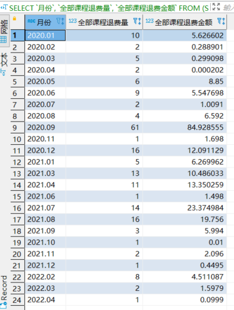

结果与mysql的查询结果一致。

之后可以将上述子查询源表的doris SQL改为Flink SQl, 在hudi中建立dws层的表，并下沉到doris。

**指标4-5**

指标4-5涉及的表相同，where条件有相同和不同的部分，需要将相同的提出来，把不同条件涉及到的字段（orf.order_refund_status,osco.stu_course_status）做成维度，放到group by中。提取出所有计算的字段，写出如下SQL(doris)

```sql
SELECT
        date_format(ora.create_time, '%Y.%m') AS `月份`,
        orf.order_refund_status,
        osco.stu_course_status,
        count(CASE WHEN orf.order_pay_status=2 AND orf.refund_type=12 THEN orf.id ELSE null END) AS `全款后进班前退费量`,
        count(CASE WHEN orf.order_pay_status=2 AND osco.effective_date is not null AND orf.refund_type=10  AND abs(datediff(cast(osco.effective_date as datetime),cast(ora.create_time as datetime)))<=7 THEN orf.id ELSE null END) AS `进班后七天内退费量`,
        count(CASE WHEN orf.order_pay_status=2 AND osco.effective_date is not null AND orf.refund_type=10  AND abs(datediff(cast(osco.effective_date as datetime),cast(ora.create_time as datetime)))>7 THEN orf.id ELSE null END) AS `进班后七天外退费量`,
        sum(CASE WHEN orf.order_pay_status = 2 AND orf.refund_type = 12 THEN orf.amount ELSE 0 END) / 10000 AS  `全款后进班前退费金额`,
        sum(CASE WHEN orf.order_pay_status = 2 AND osco.effective_date is not null AND orf.refund_type = 10 AND abs(datediff(cast(osco.effective_date as datetime), cast(ora.create_time as datetime))) <= 7 THEN orf.amount ELSE 0 END) / 10000  AS   `进班后七天内退费金额`,
       sum(CASE WHEN orf.order_pay_status = 2 AND osco.effective_date is not null AND orf.refund_type = 10 AND abs(datediff(cast(osco.effective_date as datetime), cast(ora.create_time as datetime))) > 7 THEN orf.amount ELSE 0 END) / 10000  AS   `进班后七天外退费金额`
    FROM
        bxg.dwd_oe_order_refund orf
            LEFT JOIN   bxg.dwd_oe_stu_course_order osco ON  orf.order_id=osco.order_id AND orf.order_detail_id=osco.order_detail_id
            LEFT JOIN   bxg.dwd_oe_order_refund_apply  ora ON orf.order_id=ora.order_id and orf.order_detail_id = ora.order_detail_id
    WHERE
            orf.delete_flag=0
      AND osco.stu_course_order_delete_flag=0
      AND osco.stu_course_delete_flag=0
      AND orf.order_delete_flag=0
      AND osco.course_id not in (555,1537)
-- 申请状态已完成
      AND ora.status=0
      AND ora.delete_flag=0
      AND (year(orf.refund_time)=year(NOW()) or year(orf.refund_time)=year(date_sub(now(),interval 1 year)) or year(orf.refund_time)=year(date_sub(now(),interval 2 year)))  
    GROUP BY date_format(ora.create_time, '%Y.%m'),orf.order_refund_status,osco.stu_course_status;

```

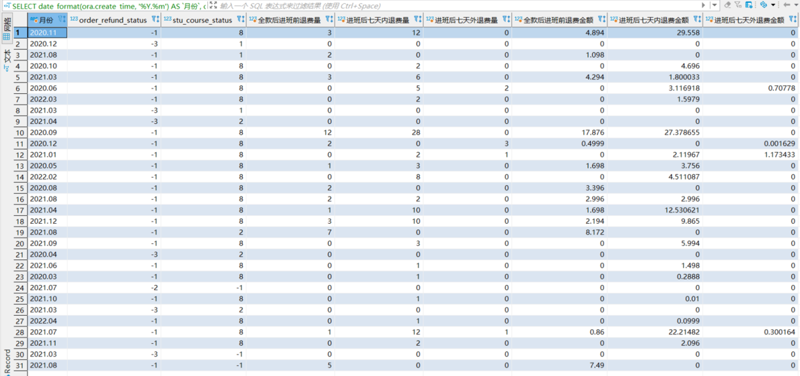

利用上面的SQL作为子查询的源表,写出DWD层指标语句。

以指标4为例:

```sql
SELECT 
  `月份`,
   SUM(`全款后进班前退费量`),
   SUM(`进班后七天内退费量`),
   SUM(`进班后七天外退费量`),
    SUM(`全款后进班前退费量`) + SUM(`进班后七天内退费量`) + SUM(`进班后七天外退费量`) AS `总退费量`
FROM 
(SELECT
        date_format(ora.create_time, '%Y.%m') AS `月份`,
        orf.order_refund_status,
        osco.stu_course_status,
        count(CASE WHEN orf.order_pay_status=2 AND orf.refund_type=12 THEN orf.id ELSE null END) AS `全款后进班前退费量`,
        count(CASE WHEN orf.order_pay_status=2 AND osco.effective_date is not null AND orf.refund_type=10  AND abs(datediff(cast(osco.effective_date as datetime),cast(ora.create_time as datetime)))<=7 THEN orf.id ELSE null END) AS `进班后七天内退费量`,
        count(CASE WHEN orf.order_pay_status=2 AND osco.effective_date is not null AND orf.refund_type=10  AND abs(datediff(cast(osco.effective_date as datetime),cast(ora.create_time as datetime)))>7 THEN orf.id ELSE null END) AS `进班后七天外退费量`,
        sum(CASE WHEN orf.order_pay_status = 2 AND orf.refund_type = 12 THEN orf.amount ELSE 0 END) / 10000 AS  `全款后进班前退费金额`,
        sum(CASE WHEN orf.order_pay_status = 2 AND osco.effective_date is not null AND orf.refund_type = 10 AND abs(datediff(cast(osco.effective_date as datetime), cast(ora.create_time as datetime))) <= 7 THEN orf.amount ELSE 0 END) / 10000  AS   `进班后七天内退费金额`,
       sum(CASE WHEN orf.order_pay_status = 2 AND osco.effective_date is not null AND orf.refund_type = 10 AND abs(datediff(cast(osco.effective_date as datetime), cast(ora.create_time as datetime))) > 7 THEN orf.amount ELSE 0 END) / 10000  AS   `进班后七天外退费金额`
    FROM
        bxg.dwd_oe_order_refund orf
            LEFT JOIN   bxg.dwd_oe_stu_course_order osco ON  orf.order_id=osco.order_id AND orf.order_detail_id=osco.order_detail_id
            LEFT JOIN   bxg.dwd_oe_order_refund_apply  ora ON orf.order_id=ora.order_id and orf.order_detail_id = ora.order_detail_id
    WHERE
            orf.delete_flag=0
      AND osco.stu_course_order_delete_flag=0
      AND osco.stu_course_delete_flag=0
      AND orf.order_delete_flag=0
      AND osco.course_id not in (555,1537)
-- 申请状态已完成
      AND ora.status=0
      AND ora.delete_flag=0
      AND (year(orf.refund_time)=year(NOW()) or year(orf.refund_time)=year(date_sub(now(),interval 1 year)) or year(orf.refund_time)=year(date_sub(now(),interval 2 year)))  
    GROUP BY date_format(ora.create_time, '%Y.%m'),orf.order_refund_status,osco.stu_course_status)  period_courses_refund
    WHERE order_refund_status=-1
GROUP BY `月份` ORDER BY `月份` ASC;

```

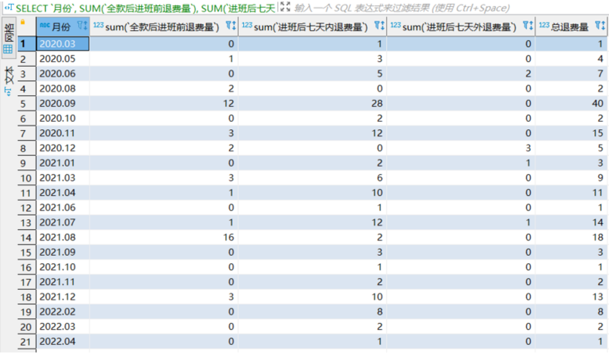

结果与mysql的查询结果一致。

之后可以将上述子查询源表的doris SQL改为Flink SQl, 在hudi中建立dws层的表，并下沉到doris。

**指标6-7**

指标6-7涉及的表相同，where条件相同，维度相同。提取所有计算的字段,写出如下SQL(doris)

```sql
SELECT
    date_format(orf.refund_time, '%Y.%m') AS `月份`,
    count(CASE WHEN  (osco.course_type=0 AND osco.grade_name NOT LIKE '%SVIP%' AND osco.grade_name LIKE '%在线就业班%' ) THEN orf.id ELSE null END) AS `在线就业班退费量`,
    count(CASE WHEN  (osco.course_type=0 AND osco.grade_name LIKE '%SVIP%') THEN orf.id ELSE null END) AS `SVIP班`,
    count(CASE WHEN  (osco.course_id =3264 or osco.course_id=3400 or osco.course_id=3912 or osco.course_id=4036 or osco.course_id =4293 or osco.course_id =4314 or osco.course_id =4511 or  osco.course_id =4454 ) THEN orf.id ELSE null END) AS `直播保薪班退费量`,
    count(CASE WHEN  (osco.course_type=0 AND osco.grade_name LIKE '%【年度钻石会员】%') THEN orf.id ELSE null END) AS `年度会员退费量`,
    count(CASE WHEN  (osco.course_type=0 AND osco.grade_name LIKE '%【钻石会员】%') THEN orf.id ELSE null END) AS `半年度会员退费量`,
    count(CASE WHEN  (osco.grade_name LIKE '%【季度铂金会员】%') THEN orf.id ELSE null END) AS `季度会员退费量`,
    count(CASE WHEN  (osco.grade_name LIKE '%【月度黄金会员】%') THEN orf.id ELSE null END) AS `月度会员退费量`,
    sum(CASE WHEN  (osco.course_type=0 AND osco.grade_name NOT LIKE '%SVIP%' AND osco.grade_name LIKE '%在线就业班%' ) THEN orf.amount ELSE 0 END)/10000 AS `在线就业班退费金额`,
    sum(CASE WHEN  (osco.course_type=0 AND osco.grade_name LIKE '%SVIP%') THEN orf.amount ELSE 0 END)/10000 AS `SVIP班退费金额`,
    sum(CASE WHEN  (osco.course_id IN (osco.course_id =3264 or osco.course_id=3400 or osco.course_id=3912 or osco.course_id=4036 or osco.course_id =4293 or osco.course_id =4314 or osco.course_id =4511 or  osco.course_id =4454 )) THEN orf.amount ELSE 0 END)/10000 AS `直播保薪班退费金额`,
    sum(CASE WHEN  (osco.course_type=0 AND osco.grade_name LIKE '%【年度钻石会员】%') THEN orf.amount ELSE 0 END)/10000 AS `年度会员退费金额`,
    sum(CASE WHEN  (osco.course_type=0 AND osco.grade_name LIKE '%【钻石会员】%') THEN orf.amount ELSE 0 END)/10000 AS `半年度会员退费金额`,
    sum(CASE WHEN  (osco.grade_name LIKE '%【季度铂金会员】%') THEN orf.amount ELSE 0 END)/10000 AS `季度会员退费金额`,
    sum(CASE WHEN  (osco.grade_name LIKE '%【月度黄金会员】%') THEN orf.amount ELSE 0 END)/10000 AS `月度会员退费金额`
FROM
    bxg.dwd_oe_order_refund  orf
        LEFT JOIN   bxg.dwd_oe_stu_course_order osco ON  orf.order_id=osco.order_id AND orf.order_detail_id=osco.order_detail_id
WHERE
        orf.delete_flag=0
  AND osco.stu_course_delete_flag = 0
  AND osco.stu_course_order_delete_flag = 0
  AND osco.stu_course_status=8
  AND orf.order_delete_flag=0
  AND orf.order_pay_status=2
  AND osco.course_id not in (555,1537)
  AND osco.effective_date is not null
  -- 课程退学退
  AND orf.refund_type=10
  AND (year(orf.refund_time)=year(NOW()) or year(orf.refund_time)=year(date_sub(now(),interval 1 year)) or year(orf.refund_time)=year(date_sub(now(),interval 2 year)))
GROUP BY date_format(orf.refund_time, '%Y.%m')
ORDER BY date_format(orf.refund_time, '%Y.%m') ASC;

```

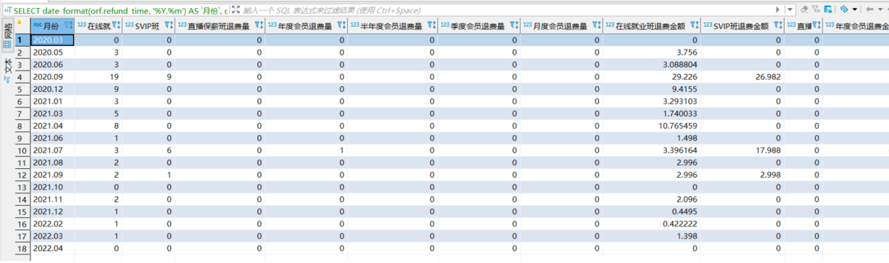

利用上面的SQL作为子查询的源表,写出DWD层指标语句。

以指标6为例:

```sql
SELECT 
 `月份`,
 `在线就业班退费量`,
 `SVIP班退费量`,
 `直播保薪班退费量`,
 `年度会员退费量`,
 `半年度会员退费量`,
 `季度会员退费量`,
`月度会员退费量`
FROM 
(SELECT
    date_format(orf.refund_time, '%Y.%m') AS `月份`,
    count(CASE WHEN  (osco.course_type=0 AND osco.grade_name NOT LIKE '%SVIP%' AND osco.grade_name LIKE '%在线就业班%' ) THEN orf.id ELSE null END) AS `在线就业班退费量`,
    count(CASE WHEN  (osco.course_type=0 AND osco.grade_name LIKE '%SVIP%') THEN orf.id ELSE null END) AS `SVIP班退费量`,
    count(CASE WHEN  (osco.course_id =3264 or osco.course_id=3400 or osco.course_id=3912 or osco.course_id=4036 or osco.course_id =4293 or osco.course_id =4314 or osco.course_id =4511 or  osco.course_id =4454 ) THEN orf.id ELSE null END) AS `直播保薪班退费量`,
    count(CASE WHEN  (osco.course_type=0 AND osco.grade_name LIKE '%【年度钻石会员】%') THEN orf.id ELSE null END) AS `年度会员退费量`,
    count(CASE WHEN  (osco.course_type=0 AND osco.grade_name LIKE '%【钻石会员】%') THEN orf.id ELSE null END) AS `半年度会员退费量`,
    count(CASE WHEN  (osco.grade_name LIKE '%【季度铂金会员】%') THEN orf.id ELSE null END) AS `季度会员退费量`,
    count(CASE WHEN  (osco.grade_name LIKE '%【月度黄金会员】%') THEN orf.id ELSE null END) AS `月度会员退费量`,
    sum(CASE WHEN  (osco.course_type=0 AND osco.grade_name NOT LIKE '%SVIP%' AND osco.grade_name LIKE '%在线就业班%' ) THEN orf.amount ELSE 0 END)/10000 AS `在线就业班退费金额`,
    sum(CASE WHEN  (osco.course_type=0 AND osco.grade_name LIKE '%SVIP%') THEN orf.amount ELSE 0 END)/10000 AS `SVIP班退费金额`,
    sum(CASE WHEN  (osco.course_id IN (osco.course_id =3264 or osco.course_id=3400 or osco.course_id=3912 or osco.course_id=4036 or osco.course_id =4293 or osco.course_id =4314 or osco.course_id =4511 or  osco.course_id =4454 )) THEN orf.amount ELSE 0 END)/10000 AS `直播保薪班退费金额`,
    sum(CASE WHEN  (osco.course_type=0 AND osco.grade_name LIKE '%【年度钻石会员】%') THEN orf.amount ELSE 0 END)/10000 AS `年度会员退费金额`,
    sum(CASE WHEN  (osco.course_type=0 AND osco.grade_name LIKE '%【钻石会员】%') THEN orf.amount ELSE 0 END)/10000 AS `半年度会员退费金额`,
    sum(CASE WHEN  (osco.grade_name LIKE '%【季度铂金会员】%') THEN orf.amount ELSE 0 END)/10000 AS `季度会员退费金额`,
    sum(CASE WHEN  (osco.grade_name LIKE '%【月度黄金会员】%') THEN orf.amount ELSE 0 END)/10000 AS `月度会员退费金额`
FROM
    bxg.dwd_oe_order_refund  orf
        LEFT JOIN   bxg.dwd_oe_stu_course_order osco ON  orf.order_id=osco.order_id AND orf.order_detail_id=osco.order_detail_id
WHERE
        orf.delete_flag=0
  AND osco.stu_course_delete_flag = 0
  AND osco.stu_course_order_delete_flag = 0
  AND osco.stu_course_status=8
  AND orf.order_delete_flag=0
  AND orf.order_pay_status=2
  AND osco.course_id not in (555,1537)
  AND osco.effective_date is not null
  -- 课程退学退
  AND orf.refund_type=10
  AND (year(orf.refund_time)=year(NOW()) or year(orf.refund_time)=year(date_sub(now(),interval 1 year)) or year(orf.refund_time)=year(date_sub(now(),interval 2 year)))
GROUP BY date_format(orf.refund_time, '%Y.%m')
)  entering_vocational_refund
ORDER BY `月份` ASC;
```

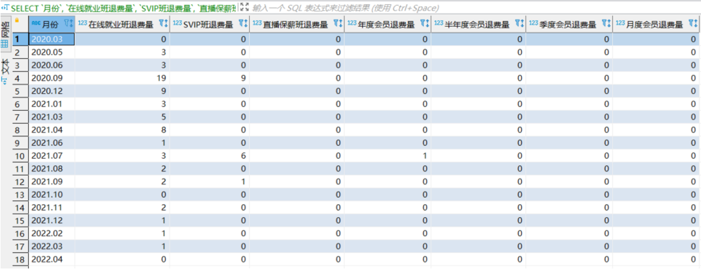

结果与mysql的查询结果一致。

之后可以将上述子查询源表的doris SQL改为Flink SQl, 在hudi中建立dws层的表，并下沉到doris。

**指标8-11**

指标8-11涉及的表相同，where条件有相同和不同的部分，需要将相同的提出来。把不同条件涉及到的字段（orf.refund_type,osco.effective_date,orf.refund_time）做成维度，放到group by中。提取出所有计算的字段，写出如下SQL(doris)

```sql
SELECT 
                  osco.course_id      AS `course_id`,
                  osco.grade_name      AS `course_name`,
                  orf.refund_type AS `refund_type`,
                  osco.effective_date AS `effective_date`,
                  orf.refund_time AS `refund_time`,
                  (case
                          when (osco.course_type = 0 AND osco.grade_name LIKE '%SVIP%') then 'SVIP班'
                          when (osco.course_type = 0 AND osco.grade_name LIKE '【年度钻石会员】%') then '年度会员'
                          when (osco.course_type = 0 AND osco.grade_name LIKE '【钻石会员】%') then '半年度钻石会员'
                          when (osco.grade_name LIKE '【季度铂金会员】%') then '季度会员'
                          when (osco.grade_name LIKE '【月度黄金会员】%') then '月度会员'
                          when (osco.course_id in (3264, 3400, 3912, 4036)) then '直播保薪班'
                          when (osco.course_type = 0 AND (osco.grade_name NOT LIKE '%SVIP%' AND osco.grade_name LIKE '%在线就业班%'))
                              then '在线就业班'
                          when (osco.course_type = 0 AND (osco.grade_name NOT LIKE '%SVIP%' AND osco.grade_name NOT LIKE '%在线就业班%'))
                              then '其他职业课'
                          else '微课、其他直播课等' end
                         )                                 AS `course_type`,
                  count(case when (orf.refund_time >= '2021-01-01 00:00:00'   AND orf.refund_time <= '2021-01-31 23:59:59') then orf.id else null end) AS `January_amount`,
                  count(case when (orf.refund_time >= '2021-02-01 00:00:00'   AND orf.refund_time <= '2021-02-28 23:59:59') then orf.id else null end) AS `February_amount`,
                  count(case when (orf.refund_time >= '2021-03-01 00:00:00'   AND orf.refund_time <= '2021-03-31 23:59:59') then orf.id else null end) AS `March_amount`,
                  count(case when (orf.refund_time >= '2021-04-01 00:00:00'   AND orf.refund_time <= '2021-04-30 23:59:59') then orf.id else null end) AS `April_amount`,
                  count(case when (orf.refund_time >= '2021-05-01 00:00:00'   AND orf.refund_time <= '2021-05-31 23:59:59') then orf.id else null end) AS `May_amount`,
                  count(case when (orf.refund_time >= '2021-06-01 00:00:00'   AND orf.refund_time <= '2021-06-30 23:59:59') then orf.id else null end) AS `June_amount`,
                  count(case when (orf.refund_time >= '2021-07-01 00:00:00'   AND orf.refund_time <= '2021-07-31 23:59:59') then orf.id else null end) AS `July_amount`,
                  count(case when (orf.refund_time >= '2021-08-01 00:00:00'   AND orf.refund_time <= '2021-08-31 23:59:59') then orf.id else null end) AS `August_amount`,
                  count(case when (orf.refund_time >= '2021-09-01 00:00:00'   AND orf.refund_time <= '2021-09-30 23:59:59') then orf.id else null end) AS `September_amount`,
                  count(case when (orf.refund_time >= '2021-10-01 00:00:00'   AND orf.refund_time <= '2021-10-31 23:59:59') then orf.id else null end) AS `October_amount`,
                  count(case when (orf.refund_time >= '2021-11-01 00:00:00'   AND orf.refund_time <= '2021-11-30 23:59:59') then orf.id else null end) AS `November_amount`,
                  count(case when (orf.refund_time >= '2021-12-01 00:00:00'   AND orf.refund_time <= '2021-12-31 23:59:59') then orf.id else null end) AS `December_amount`,
                  sum(case when (orf.refund_time >= '2021-01-01 00:00:00'   AND orf.refund_time <= '2021-01-31 23:59:59') then orf.amount else 0 end) AS `January_money`,
                  sum(case when (orf.refund_time >= '2021-02-01 00:00:00'   AND orf.refund_time <= '2021-02-28 23:59:59') then orf.amount else 0 end) AS `February_money`,
                  sum(case when (orf.refund_time >= '2021-03-01 00:00:00'   AND orf.refund_time <= '2021-03-31 23:59:59') then orf.amount else 0 end) AS `March_money`,
                  sum(case when (orf.refund_time >= '2021-04-01 00:00:00'   AND orf.refund_time <= '2021-04-30 23:59:59') then orf.amount else 0 end) AS `April_money`,
                  sum(case when (orf.refund_time >= '2021-05-01 00:00:00'   AND orf.refund_time <= '2021-05-31 23:59:59') then orf.amount else 0 end) AS `May_money`,
                  sum(case when (orf.refund_time >= '2021-06-01 00:00:00'   AND orf.refund_time <= '2021-06-30 23:59:59') then orf.amount else 0 end) AS `June_money`,
                  sum(case when (orf.refund_time >= '2021-07-01 00:00:00'   AND orf.refund_time <= '2021-07-31 23:59:59') then orf.amount else 0 end) AS `July_money`,
                  sum(case when (orf.refund_time >= '2021-08-01 00:00:00'   AND orf.refund_time <= '2021-08-31 23:59:59') then orf.amount else 0 end) AS `August_money`,
                  sum(case when (orf.refund_time >= '2021-09-01 00:00:00'   AND orf.refund_time <= '2021-09-30 23:59:59') then orf.amount else 0 end) AS `September_money`,
                  sum(case when (orf.refund_time >= '2021-10-01 00:00:00'   AND orf.refund_time <= '2021-10-31 23:59:59') then orf.amount else 0 end) AS `October_money`,
                  sum(case when (orf.refund_time >= '2021-11-01 00:00:00'   AND orf.refund_time <= '2021-11-30 23:59:59') then orf.amount else 0 end) AS `November_money`,
                  sum(case when (orf.refund_time >= '2021-12-01 00:00:00'   AND orf.refund_time <= '2021-12-31 23:59:59') then orf.amount else 0 end) AS `December_money`
              FROM bxg.dwd_oe_order_refund orf
                       LEFT JOIN   bxg.dwd_oe_stu_course_order osco ON  orf.order_id=osco.order_id AND orf.order_detail_id=osco.order_detail_id
              WHERE orf.delete_flag = 0 
                        AND osco.stu_course_delete_flag = 0
                        AND osco.stu_course_order_delete_flag =0
                        AND osco.stu_course_status = 8
                        AND orf.order_delete_flag = 0 
                        AND orf.order_pay_status = 2
                        AND osco.course_id not in (555,1537)
         GROUP BY osco.course_id, osco.grade_name, osco.course_type,orf.refund_type,osco.effective_date,orf.refund_time;

```

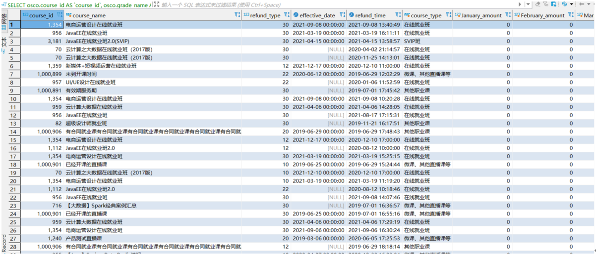

利用上面的SQL作为子查询的源表,写出DWD层指标语句。

以指标8为例:

```sql
SELECT 
             `course_id` AS `课程id`,
             `course_name` AS `课程名称`,
             `course_type` AS `课程类型`,
             SUM(`January_amount`) AS `一月`,
             SUM(`February_amount`) AS `二月`,
             SUM(`March_amount`) AS `三月`,
             SUM(`April_amount`) AS `四月`,
             SUM(`May_amount`) AS `五月`,
             SUM(`June_amount`) AS `六月`,
             SUM(`July_amount`) AS `七月`,
             SUM(`August_amount`) AS `八月`,
             SUM(`September_amount`) AS `九月`,
             SUM(`October_amount`) AS `十月`,
             SUM(`November_amount`) AS `十一月`,
             SUM(`December_amount`) AS `十二月`,
             SUM(`January_amount` + `February_amount` + `March_amount` + `April_amount` + `May_amount` + `June_amount` + `July_amount` + `August_amount` + `September_amount` +
              `October_amount` + `November_amount` + `December_amount`) AS `总计`
  FROM
 (SELECT 
                  osco.course_id      AS `course_id`,
                  osco.grade_name      AS `course_name`,
                  orf.refund_type AS `refund_type`,
                  osco.effective_date AS `effective_date`,
                  orf.refund_time AS `refund_time`,
                  (case
                          when (osco.course_type = 0 AND osco.grade_name LIKE '%SVIP%') then 'SVIP班'
                          when (osco.course_type = 0 AND osco.grade_name LIKE '【年度钻石会员】%') then '年度会员'
                          when (osco.course_type = 0 AND osco.grade_name LIKE '【钻石会员】%') then '半年度钻石会员'
                          when (osco.grade_name LIKE '【季度铂金会员】%') then '季度会员'
                          when (osco.grade_name LIKE '【月度黄金会员】%') then '月度会员'
                          when (osco.course_id in (3264, 3400, 3912, 4036)) then '直播保薪班'
                          when (osco.course_type = 0 AND (osco.grade_name NOT LIKE '%SVIP%' AND osco.grade_name LIKE '%在线就业班%'))
                              then '在线就业班'
                          when (osco.course_type = 0 AND (osco.grade_name NOT LIKE '%SVIP%' AND osco.grade_name NOT LIKE '%在线就业班%'))
                              then '其他职业课'
                          else '微课、其他直播课等' end
                         )                                 AS `course_type`,
                  count(case when (orf.refund_time >= '2021-01-01 00:00:00'   AND orf.refund_time <= '2021-01-31 23:59:59') then orf.id else null end) AS `January_amount`,
                  count(case when (orf.refund_time >= '2021-02-01 00:00:00'   AND orf.refund_time <= '2021-02-28 23:59:59') then orf.id else null end) AS `February_amount`,
                  count(case when (orf.refund_time >= '2021-03-01 00:00:00'   AND orf.refund_time <= '2021-03-31 23:59:59') then orf.id else null end) AS `March_amount`,
                  count(case when (orf.refund_time >= '2021-04-01 00:00:00'   AND orf.refund_time <= '2021-04-30 23:59:59') then orf.id else null end) AS `April_amount`,
                  count(case when (orf.refund_time >= '2021-05-01 00:00:00'   AND orf.refund_time <= '2021-05-31 23:59:59') then orf.id else null end) AS `May_amount`,
                  count(case when (orf.refund_time >= '2021-06-01 00:00:00'   AND orf.refund_time <= '2021-06-30 23:59:59') then orf.id else null end) AS `June_amount`,
                  count(case when (orf.refund_time >= '2021-07-01 00:00:00'   AND orf.refund_time <= '2021-07-31 23:59:59') then orf.id else null end) AS `July_amount`,
                  count(case when (orf.refund_time >= '2021-08-01 00:00:00'   AND orf.refund_time <= '2021-08-31 23:59:59') then orf.id else null end) AS `August_amount`,
                  count(case when (orf.refund_time >= '2021-09-01 00:00:00'   AND orf.refund_time <= '2021-09-30 23:59:59') then orf.id else null end) AS `September_amount`,
                  count(case when (orf.refund_time >= '2021-10-01 00:00:00'   AND orf.refund_time <= '2021-10-31 23:59:59') then orf.id else null end) AS `October_amount`,
                  count(case when (orf.refund_time >= '2021-11-01 00:00:00'   AND orf.refund_time <= '2021-11-30 23:59:59') then orf.id else null end) AS `November_amount`,
                  count(case when (orf.refund_time >= '2021-12-01 00:00:00'   AND orf.refund_time <= '2021-12-31 23:59:59') then orf.id else null end) AS `December_amount`,
                  sum(case when (orf.refund_time >= '2021-01-01 00:00:00'   AND orf.refund_time <= '2021-01-31 23:59:59') then orf.amount else 0 end) AS `January_money`,
                  sum(case when (orf.refund_time >= '2021-02-01 00:00:00'   AND orf.refund_time <= '2021-02-28 23:59:59') then orf.amount else 0 end) AS `February_money`,
                  sum(case when (orf.refund_time >= '2021-03-01 00:00:00'   AND orf.refund_time <= '2021-03-31 23:59:59') then orf.amount else 0 end) AS `March_money`,
                  sum(case when (orf.refund_time >= '2021-04-01 00:00:00'   AND orf.refund_time <= '2021-04-30 23:59:59') then orf.amount else 0 end) AS `April_money`,
                  sum(case when (orf.refund_time >= '2021-05-01 00:00:00'   AND orf.refund_time <= '2021-05-31 23:59:59') then orf.amount else 0 end) AS `May_money`,
                  sum(case when (orf.refund_time >= '2021-06-01 00:00:00'   AND orf.refund_time <= '2021-06-30 23:59:59') then orf.amount else 0 end) AS `June_money`,
                  sum(case when (orf.refund_time >= '2021-07-01 00:00:00'   AND orf.refund_time <= '2021-07-31 23:59:59') then orf.amount else 0 end) AS `July_money`,
                  sum(case when (orf.refund_time >= '2021-08-01 00:00:00'   AND orf.refund_time <= '2021-08-31 23:59:59') then orf.amount else 0 end) AS `August_money`,
                  sum(case when (orf.refund_time >= '2021-09-01 00:00:00'   AND orf.refund_time <= '2021-09-30 23:59:59') then orf.amount else 0 end) AS `September_money`,
                  sum(case when (orf.refund_time >= '2021-10-01 00:00:00'   AND orf.refund_time <= '2021-10-31 23:59:59') then orf.amount else 0 end) AS `October_money`,
                  sum(case when (orf.refund_time >= '2021-11-01 00:00:00'   AND orf.refund_time <= '2021-11-30 23:59:59') then orf.amount else 0 end) AS `November_money`,
                  sum(case when (orf.refund_time >= '2021-12-01 00:00:00'   AND orf.refund_time <= '2021-12-31 23:59:59') then orf.amount else 0 end) AS `December_money`
              FROM bxg.dwd_oe_order_refund orf
                       LEFT JOIN   bxg.dwd_oe_stu_course_order osco ON  orf.order_id=osco.order_id AND orf.order_detail_id=osco.order_detail_id
              WHERE orf.delete_flag = 0 
                        AND osco.stu_course_delete_flag = 0
                        AND osco.stu_course_order_delete_flag =0
                        AND osco.stu_course_status = 8
                        AND orf.order_delete_flag = 0 
                        AND orf.order_pay_status = 2
                        AND osco.course_id not in (555,1537)
         GROUP BY osco.course_id, osco.grade_name, osco.course_type,orf.refund_type,osco.effective_date,orf.refund_time) allcourses_types_refund
WHERE 
  year(refund_time) =  2021
  AND effective_date is not null
-- 课程退学退
  AND refund_type = 10
  GROUP BY course_id, course_name, course_type  
  HAVING `总计` >0
  ORDER BY `总计` DESC;

```

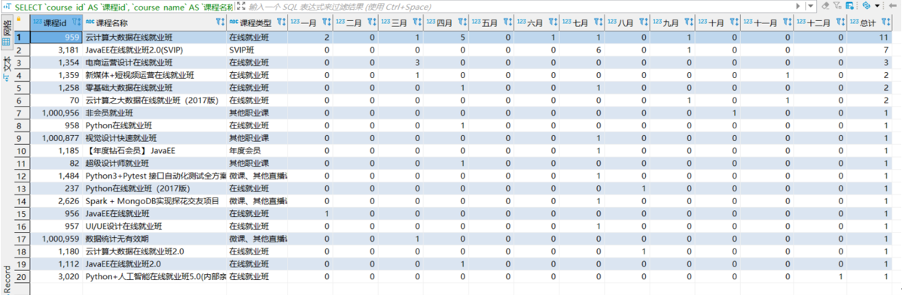

结果与mysql的查询结果一致。

之后可以将上述子查询源表的doris SQL改为Flink SQl, 在hudi中建立dws层的表，并下沉到doris。

#### 实现

注意：

- 子查询源表中的维度字段，要作为dws层表的主键，这样才不会被去重。
- doris建表时字段不可以是中文，所以将所有创建的dws层表的字段都改为英文。
- Doris中string类型的字段不可以做主键，需要改为varchar类型。
- Doris中的布尔类型即为tinyint，值用0和1表示。改为flink sql时，用true和false表示。

##### hudi_dws层

**指标1-3**

```sql
-- 创建hudi_dws层映射表
CREATE TABLE if not exists hudi_dws_all_courses_refund(
  `month` VARCHAR(32),
  `all_courses_refund_money` DECIMAL(38,6),
  `course_refund_money` DECIMAL(38,6),
  `overfee_refund_money` DECIMAL(38,6),
  `total_refund_money` DECIMAL(38,6),
  `offline_course_refund_money` DECIMAL(38,6),
  `offline_overfee_refund_money` DECIMAL(38,6),
  `offline_total_refund_money` DECIMAL(38,6),
  `all_courses_refund_amount` BIGINT,
  `course_refund_amount` BIGINT,
  `overfee_refund_amount` BIGINT,
  `total_refund_amount` BIGINT,
  `offline_course_refund_amount` BIGINT,
  `offline_overfee_refund_amount` BIGINT,
  `offline_total_refund_amount` BIGINT,
 PRIMARY KEY (`month`) NOT ENFORCED
) WITH(
    'connector'='hudi'
    ,'path'= 'hdfs://node1:8020/hudi/bxg/dws_all_courses_refund'
    ,'hoodie.datasource.write.recordkey.field'= 'month'
    ,'write.tasks'= '1'
    ,'compaction.tasks'= '1'
    ,'write.rate.limit'= '2000'
    ,'table.type'= 'MERGE_ON_READ'
    ,'compaction.async.enabled'= 'true'
    ,'compaction.trigger.strategy'= 'num_commits'
    ,'compaction.delta_commits'= '1'
    ,'changelog.enabled'= 'true'
    ,'read.tasks' = '1'
    ,'read.streaming.enabled'= 'true'
    ,'read.start-commit'='earliest'
    ,'read.streaming.check-interval'= '3'
    ,'hive_sync.enable'= 'true'
    ,'hive_sync.mode'= 'hms'
    ,'hive_sync.metastore.uris'= 'thrift://node1:9083'
    ,'hive_sync.table'= 'dws_all_courses_refund'
    ,'hive_sync.db'= 'bxg'
    ,'hive_sync.username'= ''
    ,'hive_sync.password'= ''
    ,'hive_sync.support_timestamp'= 'true'
);
-- 插入数据
INSERT INTO hudi_dws_all_courses_refund
SELECT IFNULL(concat(date_format(orf.refund_time,'YYYY'),'.',date_format(orf.refund_time,'MM')),'-1') AS `month`,
    sum(orf.amount)/10000 AS `all_courses_refund_money`,
    sum(CASE WHEN orf.refund_type=10 THEN orf.amount ELSE 0 END)/10000 AS `course_refund_money`,
    sum(CASE WHEN orf.refund_type=11 THEN orf.amount ELSE 0 END)/10000 AS `overfee_refund_money`,
    sum(CASE WHEN orf.refund_type=12 THEN orf.amount ELSE 0 END)/10000 AS `total_refund_money`,
    sum(CASE WHEN orf.refund_type=20 THEN orf.amount ELSE 0 END)/10000 AS `offline_course_refund_money`,
    sum(CASE WHEN orf.refund_type=21 THEN orf.amount ELSE 0 END)/10000 AS `offline_overfee_refund_money`,
    sum(CASE WHEN orf.refund_type=22 THEN orf.amount ELSE 0 END)/10000 AS `offline_total_refund_money`,
    count(orf.id) AS `all_courses_refund_amount`,
    count(CASE WHEN orf.refund_type=10 THEN orf.id ELSE null END) AS `course_refund_amount`,
    count(CASE WHEN orf.refund_type=11 THEN orf.id ELSE null END) AS `overfee_refund_amount`,
    count(CASE WHEN orf.refund_type=12 THEN orf.id ELSE null END) AS `total_refund_amount`,
    count(CASE WHEN orf.refund_type=20 THEN orf.id ELSE null END) AS `offline_course_refund_amount`,
    count(CASE WHEN orf.refund_type=21 THEN orf.id ELSE null END) AS `offline_overfee_refund_amount`,
    count(CASE WHEN orf.refund_type=22 THEN orf.id ELSE null END) AS `offline_total_refund_amount`   
FROM
    hudi_dwd_oe_order_refund  orf
WHERE
      orf.delete_flag is false
  AND orf.order_refund_status=-1
  AND orf.order_delete_flag is false
  AND orf.order_pay_status=2
  -- 除去线上互转
  AND orf.refund_type NOT IN(30,31,32)
   AND (year(orf.refund_time)=year(now()) or year(orf.refund_time)=year(now())-1 or year(orf.refund_time)=year(now())-2)
GROUP BY concat(date_format(orf.refund_time,'YYYY'),'.',date_format(orf.refund_time,'MM'));

```

**指标4-5**

```sql
-- 创建hudi_dws层映射表
CREATE TABLE if not exists hudi_dws_period_courses_refund(
  `month` VARCHAR(32),
   order_refund_status INT,
   stu_course_status INT,
   `total_b_enter_f_refund_amount` BIGINT,
   `enter_b_seven_in_refund_amount` BIGINT,
   `enter_b_seven_out_refund_amount` BIGINT,
   `total_b_enter_f_refund_money` DECIMAL(38,6),
   `enter_b_seven_in_refund_money` DECIMAL(38,6),
  `enter_b_seven_out_refund_amount_money` DECIMAL(38,6),
 PRIMARY KEY (`month`,order_refund_status,stu_course_status) NOT ENFORCED
) WITH(
    'connector'='hudi'
    ,'path'= 'hdfs://node1:8020/hudi/bxg/dws_period_courses_refund'
    ,'hoodie.datasource.write.recordkey.field'= 'month,order_refund_status,stu_course_status'
    ,'write.tasks'= '1'
    ,'compaction.tasks'= '1'
    ,'write.rate.limit'= '2000'
    ,'table.type'= 'MERGE_ON_READ'
    ,'compaction.async.enabled'= 'true'
    ,'compaction.trigger.strategy'= 'num_commits'
    ,'compaction.delta_commits'= '1'
    ,'changelog.enabled'= 'true'
    ,'read.tasks' = '1'
    ,'read.streaming.enabled'= 'true'
    ,'read.start-commit'='earliest'
    ,'read.streaming.check-interval'= '3'
    ,'hive_sync.enable'= 'true'
    ,'hive_sync.mode'= 'hms'
    ,'hive_sync.metastore.uris'= 'thrift://node1:9083'
    ,'hive_sync.table'= 'dws_period_courses_refund'
    ,'hive_sync.db'= 'bxg'
    ,'hive_sync.username'= ''
    ,'hive_sync.password'= ''
    ,'hive_sync.support_timestamp'= 'true'
);
-- 插入数据
INSERT INTO hudi_dws_period_courses_refund
SELECT   IFNULL(concat(date_format(ora.create_time,'YYYY'),'.',date_format(ora.create_time,'MM')),'-1') AS `month`,
        IFNULL(orf.order_refund_status,-1) AS order_refund_status,
        IFNULL(osco.stu_course_status,-1) AS stu_course_status,
        count(CASE WHEN orf.order_pay_status=2 AND orf.refund_type=12 THEN orf.id ELSE null END) AS `total_b_enter_f_refund_amount`,
        count(CASE WHEN orf.order_pay_status=2 AND osco.effective_date is not null AND orf.refund_type=10  AND abs(TIMESTAMPDIFF(DAY,cast(osco.effective_date as timestamp),cast(ora.create_time as timestamp)))<=7 THEN orf.id ELSE null END) AS `enter_b_seven_in_refund_amount`,
        count(CASE WHEN orf.order_pay_status=2 AND osco.effective_date is not null AND orf.refund_type=10  AND abs(TIMESTAMPDIFF(DAY,cast(osco.effective_date as timestamp),cast(ora.create_time as timestamp)))>7 THEN orf.id ELSE null END) AS `enter_b_seven_out_refund_amount`,
        sum(CASE WHEN orf.order_pay_status = 2 AND orf.refund_type = 12 THEN orf.amount ELSE 0 END) / 10000 AS  `total_b_enter_f_refund_money`,
        sum(CASE WHEN orf.order_pay_status = 2 AND osco.effective_date is not null AND orf.refund_type = 10 AND abs(TIMESTAMPDIFF(DAY,cast(osco.effective_date as timestamp), cast(ora.create_time as timestamp))) <= 7 THEN orf.amount ELSE 0 END) / 10000  AS   `enter_b_seven_in_refund_money`,
        sum(CASE WHEN orf.order_pay_status = 2 AND osco.effective_date is not null AND orf.refund_type = 10 AND abs(TIMESTAMPDIFF(DAY,cast(osco.effective_date as timestamp), cast(ora.create_time as timestamp))) > 7 THEN orf.amount ELSE 0 END) / 10000  AS   `enter_b_seven_out_refund_amount_money`
    FROM
        hudi_dwd_oe_order_refund orf
            LEFT JOIN   hudi_dwd_oe_stu_course_order osco ON  orf.order_id=osco.order_id AND orf.order_detail_id=osco.order_detail_id
            LEFT JOIN   hudi_bxg_ods_oe_order_refund_apply  ora ON orf.order_id=ora.order_id and orf.order_detail_id = ora.order_detail_id
    WHERE
            orf.delete_flag IS false
      AND osco.stu_course_order_delete_flag IS false
      AND osco.stu_course_delete_flag IS false
      AND orf.order_delete_flag IS false
      AND osco.course_id not in (555,1537)
-- 申请状态已完成
      AND ora.status=0
      AND ora.delete_flag IS false
      AND (year(orf.refund_time)=year(NOW()) or year(orf.refund_time)=year(now()) -1  or year(orf.refund_time)=year(now())- 2)  
    GROUP BY concat(date_format(ora.create_time,'YYYY'),'.',date_format(ora.create_time,'MM')),orf.order_refund_status,osco.stu_course_status;

```

**指标6-7**

```sql
-- 创建hudi_dws层映射表
CREATE TABLE if not exists hudi_dws_entering_vocational_refund(
  `month` VARCHAR(32),
  `online_employment_refund_amount` BIGINT,
  `SVIP_refund_amount` BIGINT,
  `live_guarantee_refund_amount` BIGINT,
  `year_member_refund_amount` BIGINT,
  `half_year_member_refund_amount` BIGINT,
  `season_member_refund_amount` BIGINT,
  `month_member_refund_amount` BIGINT,
   `online_employment_refund_money` DECIMAL(38,6),
  `SVIP_refund_money` DECIMAL(38,6),
  `live_guarantee_refund_money` DECIMAL(38,6),
  `year_member_refund_money` DECIMAL(38,6),
  `half_year_member_refund_money` DECIMAL(38,6),
  `season_member_refund_money` DECIMAL(38,6),
  `month_member_refund_money` DECIMAL(38,6),
 PRIMARY KEY (`month`) NOT ENFORCED
) WITH(
    'connector'='hudi'
    ,'path'= 'hdfs://node1:8020/hudi/bxg/dws_entering_vocational_refund'
    ,'hoodie.datasource.write.recordkey.field'= 'month'
    ,'write.tasks'= '1'
    ,'compaction.tasks'= '1'
    ,'write.rate.limit'= '2000'
    ,'table.type'= 'MERGE_ON_READ'
    ,'compaction.async.enabled'= 'true'
    ,'compaction.trigger.strategy'= 'num_commits'
    ,'compaction.delta_commits'= '1'
    ,'changelog.enabled'= 'true'
    ,'read.tasks' = '1'
    ,'read.streaming.enabled'= 'true'
    ,'read.start-commit'='earliest'
    ,'read.streaming.check-interval'= '3'
    ,'hive_sync.enable'= 'true'
    ,'hive_sync.mode'= 'hms'
    ,'hive_sync.metastore.uris'= 'thrift://node1:9083'
    ,'hive_sync.table'= 'dws_entering_vocational_refund'
    ,'hive_sync.db'= 'bxg'
    ,'hive_sync.username'= ''
    ,'hive_sync.password'= ''
    ,'hive_sync.support_timestamp'= 'true'
);
-- 插入数据
INSERT INTO hudi_dws_entering_vocational_refund
SELECT IFNULL(concat(date_format(orf.refund_time,'YYYY'),'.',date_format(orf.refund_time,'MM')),'-1') AS `month`,
    count(CASE WHEN  (osco.course_type=0 AND osco.grade_name NOT LIKE '%SVIP%' AND osco.grade_name LIKE '%在线就业班%' ) THEN orf.id ELSE null END) AS `online_employment_refund_amount`,
    count(CASE WHEN  (osco.course_type=0 AND osco.grade_name LIKE '%SVIP%') THEN orf.id ELSE null END) AS `SVIP_refund_amount`,
    count(CASE WHEN  (osco.course_id =3264 or osco.course_id=3400 or osco.course_id=3912 or osco.course_id=4036 or osco.course_id =4293 or osco.course_id =4314 or osco.course_id =4511 or  osco.course_id =4454 ) THEN orf.id ELSE null END) AS `live_guarantee_refund_amount`,
    count(CASE WHEN  (osco.course_type=0 AND osco.grade_name LIKE '%【年度钻石会员】%') THEN orf.id ELSE null END) AS `year_member_refund_amount`,
    count(CASE WHEN  (osco.course_type=0 AND osco.grade_name LIKE '%【钻石会员】%') THEN orf.id ELSE null END) AS `half_year_member_refund_amount`,
    count(CASE WHEN  (osco.grade_name LIKE '%【季度铂金会员】%') THEN orf.id ELSE null END) AS `season_member_refund_amount`,
    count(CASE WHEN  (osco.grade_name LIKE '%【月度黄金会员】%') THEN orf.id ELSE null END) AS `month_member_refund_amount`,
    sum(CASE WHEN  (osco.course_type=0 AND osco.grade_name NOT LIKE '%SVIP%' AND osco.grade_name LIKE '%在线就业班%' ) THEN orf.amount ELSE 0 END)/10000 AS `online_employment_refund_money`,
    sum(CASE WHEN  (osco.course_type=0 AND osco.grade_name LIKE '%SVIP%') THEN orf.amount ELSE 0 END)/10000 AS `SVIP_refund_money`,
    sum(CASE WHEN  (osco.course_id =3264 or osco.course_id=3400 or osco.course_id=3912 or osco.course_id=4036 or osco.course_id =4293 or osco.course_id =4314 or osco.course_id =4511 or  osco.course_id =4454) THEN orf.amount ELSE 0 END)/10000 AS `live_guarantee_refund_money`,
    sum(CASE WHEN  (osco.course_type=0 AND osco.grade_name LIKE '%【年度钻石会员】%') THEN orf.amount ELSE 0 END)/10000 AS `year_member_refund_money`,
    sum(CASE WHEN  (osco.course_type=0 AND osco.grade_name LIKE '%【钻石会员】%') THEN orf.amount ELSE 0 END)/10000 AS `half_year_member_refund_money`,
    sum(CASE WHEN  (osco.grade_name LIKE '%【季度铂金会员】%') THEN orf.amount ELSE 0 END)/10000 AS `season_member_refund_money`,
    sum(CASE WHEN  (osco.grade_name LIKE '%【月度黄金会员】%') THEN orf.amount ELSE 0 END)/10000 AS `month_member_refund_money`
FROM
    hudi_dwd_oe_order_refund  orf
        LEFT JOIN   hudi_dwd_oe_stu_course_order osco ON  orf.order_id=osco.order_id AND orf.order_detail_id=osco.order_detail_id
WHERE
        orf.delete_flag is FALSE 
  AND osco.stu_course_delete_flag is FALSE 
  AND osco.stu_course_order_delete_flag is FALSE 
  AND osco.stu_course_status=8
  AND orf.order_delete_flag is FALSE 
  AND orf.order_pay_status=2
  AND osco.course_id not in (555,1537)
  AND osco.effective_date is not null
  -- 课程退学退
  AND orf.refund_type=10
  AND (year(orf.refund_time)=year(NOW()) or year(orf.refund_time)=year(NOW()) - 1  or year(orf.refund_time)=year(NOW()) - 2)
GROUP BY concat(date_format(orf.refund_time,'YYYY'),'.',date_format(orf.refund_time,'MM'));

```

**指标8-11**

```sql
-- 创建hudi_dws层映射表
CREATE TABLE if not exists hudi_dws_allcourses_types_refund(
 `course_id` INT,
 `course_name` VARCHAR(512),
 `refund_type` INT,
 `effective_date` TIMESTAMP(3),
 `refund_time` TIMESTAMP(3),
 `course_type` VARCHAR(32),
`January_amount` BIGINT,
`February_amount` BIGINT,
`March_amount` BIGINT,
`April_amount` BIGINT,
`May_amount` BIGINT,
`June_amount` BIGINT,
`July_amount` BIGINT,
`August_amount` BIGINT,
`September_amount` BIGINT,
`October_amount` BIGINT,
`November_amount` BIGINT,
`December_amount` BIGINT,
`January_money` DECIMAL(38,6),
`February_money` DECIMAL(38,6),
`March_money` DECIMAL(38,6),
`April_money` DECIMAL(38,6),
`May_money` DECIMAL(38,6),
`June_money` DECIMAL(38,6),
`July_money` DECIMAL(38,6),
`August_money` DECIMAL(38,6),
`September_money` DECIMAL(38,6),
`October_money` DECIMAL(38,6),
`November_money` DECIMAL(38,6),
`December_money` DECIMAL(38,6),
 PRIMARY KEY (course_id, course_name,refund_type,effective_date,refund_time,course_type) NOT ENFORCED
) WITH(
    'connector'='hudi'
    ,'path'= 'hdfs://node1:8020/hudi/bxg/dws_allcourses_types_refund'
    ,'hoodie.datasource.write.recordkey.field'= 'course_id, course_name,refund_type,effective_date,refund_time,course_type'
    ,'write.tasks'= '1'
    ,'compaction.tasks'= '1'
    ,'write.rate.limit'= '2000'
    ,'table.type'= 'MERGE_ON_READ'
    ,'compaction.async.enabled'= 'true'
    ,'compaction.trigger.strategy'= 'num_commits'
    ,'compaction.delta_commits'= '1'
    ,'changelog.enabled'= 'true'
    ,'read.tasks' = '1'
    ,'read.streaming.enabled'= 'true'
    ,'read.start-commit'='earliest'
    ,'read.streaming.check-interval'= '3'
    ,'hive_sync.enable'= 'true'
    ,'hive_sync.mode'= 'hms'
    ,'hive_sync.metastore.uris'= 'thrift://node1:9083'
    ,'hive_sync.table'= 'dws_allcourses_types_refund'
    ,'hive_sync.db'= 'bxg'
    ,'hive_sync.username'= ''
    ,'hive_sync.password'= ''
    ,'hive_sync.support_timestamp'= 'true'
);
-- 插入数据
INSERT INTO hudi_dws_allcourses_types_refund
SELECT 
                  IFNULL(osco.course_id,-1)      AS `course_id`,
                  IFNULL(osco.grade_name,'-1')      AS `course_name`,
                  IFNULL(orf.refund_type,-1)  AS `refund_type`,
                  IFNULL(osco.effective_date,cast('1970-01-01 08:00:00.000' as timestamp)) AS `effective_date`,
                  IFNULL(orf.refund_time,cast('1970-01-01 08:00:00.000' as timestamp)) AS `refund_time`,
                  (case
                          when (osco.course_type = 0 AND osco.grade_name LIKE '%SVIP%') then 'SVIP班'
                          when (osco.course_type = 0 AND osco.grade_name LIKE '【年度钻石会员】%') then '年度会员'
                          when (osco.course_type = 0 AND osco.grade_name LIKE '【钻石会员】%') then '半年度钻石会员'
                          when (osco.grade_name LIKE '【季度铂金会员】%') then '季度会员'
                          when (osco.grade_name LIKE '【月度黄金会员】%') then '月度会员'
                          when (osco.course_id in (3264, 3400, 3912, 4036)) then '直播保薪班'
                          when (osco.course_type = 0 AND (osco.grade_name NOT LIKE '%SVIP%' AND osco.grade_name LIKE '%在线就业班%'))
                              then '在线就业班'
                          when (osco.course_type = 0 AND (osco.grade_name NOT LIKE '%SVIP%' AND osco.grade_name NOT LIKE '%在线就业班%'))
                              then '其他职业课'
                          else '微课、其他直播课等' end
                         )                                 AS `course_type`,
                  count(case when (orf.refund_time >= '2021-01-01 00:00:00'   AND orf.refund_time <= '2021-01-31 23:59:59') then orf.id else null end) AS `January_amount`,
                  count(case when (orf.refund_time >= '2021-02-01 00:00:00'   AND orf.refund_time <= '2021-02-28 23:59:59') then orf.id else null end) AS `February_amount`,
                  count(case when (orf.refund_time >= '2021-03-01 00:00:00'   AND orf.refund_time <= '2021-03-31 23:59:59') then orf.id else null end) AS `March_amount`,
                  count(case when (orf.refund_time >= '2021-04-01 00:00:00'   AND orf.refund_time <= '2021-04-30 23:59:59') then orf.id else null end) AS `April_amount`,
                  count(case when (orf.refund_time >= '2021-05-01 00:00:00'   AND orf.refund_time <= '2021-05-31 23:59:59') then orf.id else null end) AS `May_amount`,
                  count(case when (orf.refund_time >= '2021-06-01 00:00:00'   AND orf.refund_time <= '2021-06-30 23:59:59') then orf.id else null end) AS `June_amount`,
                  count(case when (orf.refund_time >= '2021-07-01 00:00:00'   AND orf.refund_time <= '2021-07-31 23:59:59') then orf.id else null end) AS `July_amount`,
                  count(case when (orf.refund_time >= '2021-08-01 00:00:00'   AND orf.refund_time <= '2021-08-31 23:59:59') then orf.id else null end) AS `August_amount`,
                  count(case when (orf.refund_time >= '2021-09-01 00:00:00'   AND orf.refund_time <= '2021-09-30 23:59:59') then orf.id else null end) AS `September_amount`,
                  count(case when (orf.refund_time >= '2021-10-01 00:00:00'   AND orf.refund_time <= '2021-10-31 23:59:59') then orf.id else null end) AS `October_amount`,
                  count(case when (orf.refund_time >= '2021-11-01 00:00:00'   AND orf.refund_time <= '2021-11-30 23:59:59') then orf.id else null end) AS `November_amount`,
                  count(case when (orf.refund_time >= '2021-12-01 00:00:00'   AND orf.refund_time <= '2021-12-31 23:59:59') then orf.id else null end) AS `December_amount`,
                  sum(case when (orf.refund_time >= '2021-01-01 00:00:00'   AND orf.refund_time <= '2021-01-31 23:59:59') then orf.amount else 0 end) AS `January_money`,
                  sum(case when (orf.refund_time >= '2021-02-01 00:00:00'   AND orf.refund_time <= '2021-02-28 23:59:59') then orf.amount else 0 end) AS `February_money`,
                  sum(case when (orf.refund_time >= '2021-03-01 00:00:00'   AND orf.refund_time <= '2021-03-31 23:59:59') then orf.amount else 0 end) AS `March_money`,
                  sum(case when (orf.refund_time >= '2021-04-01 00:00:00'   AND orf.refund_time <= '2021-04-30 23:59:59') then orf.amount else 0 end) AS `April_money`,
                  sum(case when (orf.refund_time >= '2021-05-01 00:00:00'   AND orf.refund_time <= '2021-05-31 23:59:59') then orf.amount else 0 end) AS `May_money`,
                  sum(case when (orf.refund_time >= '2021-06-01 00:00:00'   AND orf.refund_time <= '2021-06-30 23:59:59') then orf.amount else 0 end) AS `June_money`,
                  sum(case when (orf.refund_time >= '2021-07-01 00:00:00'   AND orf.refund_time <= '2021-07-31 23:59:59') then orf.amount else 0 end) AS `July_money`,
                  sum(case when (orf.refund_time >= '2021-08-01 00:00:00'   AND orf.refund_time <= '2021-08-31 23:59:59') then orf.amount else 0 end) AS `August_money`,
                  sum(case when (orf.refund_time >= '2021-09-01 00:00:00'   AND orf.refund_time <= '2021-09-30 23:59:59') then orf.amount else 0 end) AS `September_money`,
                  sum(case when (orf.refund_time >= '2021-10-01 00:00:00'   AND orf.refund_time <= '2021-10-31 23:59:59') then orf.amount else 0 end) AS `October_money`,
                  sum(case when (orf.refund_time >= '2021-11-01 00:00:00'   AND orf.refund_time <= '2021-11-30 23:59:59') then orf.amount else 0 end) AS `November_money`,
                  sum(case when (orf.refund_time >= '2021-12-01 00:00:00'   AND orf.refund_time <= '2021-12-31 23:59:59') then orf.amount else 0 end) AS `December_money`
              FROM hudi_dwd_oe_order_refund orf
                       LEFT JOIN   hudi_dwd_oe_stu_course_order osco ON  orf.order_id=osco.order_id AND orf.order_detail_id=osco.order_detail_id
              WHERE orf.delete_flag is FALSE 
                        AND osco.stu_course_delete_flag is FALSE 
                        AND osco.stu_course_order_delete_flag is FALSE 
                        AND osco.stu_course_status = 8
                        AND orf.order_delete_flag is FALSE 
                        AND orf.order_pay_status = 2
                        AND osco.course_id not in (555,1537)
         GROUP BY osco.course_id, osco.grade_name, osco.course_type,orf.refund_type,osco.effective_date,orf.refund_time;

```

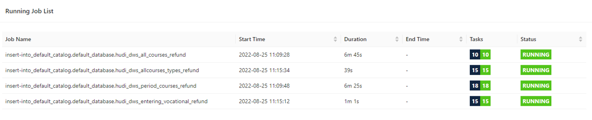

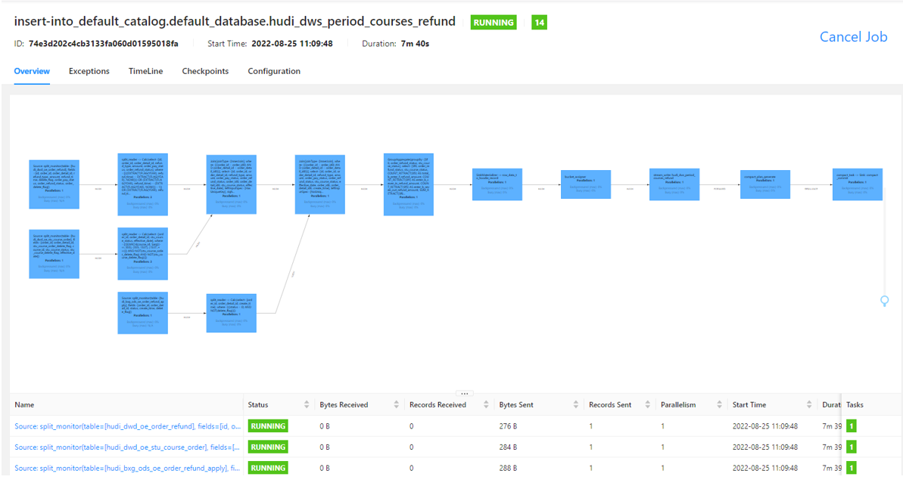

##### doris_dws层

**指标1-3**

```sql
-- 在doris中创建dws表
CREATE TABLE IF NOT EXISTS bxg.dws_all_courses_refund
(
  `month` VARCHAR(32),
  `all_courses_refund_money` DECIMAL(27,6),
  `course_refund_money` DECIMAL(27,6),
  `overfee_refund_money` DECIMAL(27,6),
  `total_refund_money` DECIMAL(27,6),
  `offline_course_refund_money` DECIMAL(27,6),
  `offline_overfee_refund_money` DECIMAL(27,6),
  `offline_total_refund_money` DECIMAL(27,6),
  `all_courses_refund_amount` BIGINT,
  `course_refund_amount` BIGINT,
  `overfee_refund_amount` BIGINT,
  `total_refund_amount` BIGINT,
  `offline_course_refund_amount` BIGINT,
  `offline_overfee_refund_amount` BIGINT,
  `offline_total_refund_amount` BIGINT
) Unique Key (`month`)
DISTRIBUTED BY HASH(`month`) BUCKETS 10
PROPERTIES (
"replication_allocation" = "tag.location.default: 1"
);
-- 在flink sql-cli中创建doris_dws层映射
CREATE TABLE if not exists doris_dws_all_courses_refund (
`month` VARCHAR(32),
  `all_courses_refund_money` DECIMAL(38,6),
  `course_refund_money` DECIMAL(38,6),
  `overfee_refund_money` DECIMAL(38,6),
  `total_refund_money` DECIMAL(38,6),
  `offline_course_refund_money` DECIMAL(38,6),
  `offline_overfee_refund_money` DECIMAL(38,6),
  `offline_total_refund_money` DECIMAL(38,6),
  `all_courses_refund_amount` BIGINT,
  `course_refund_amount` BIGINT,
  `overfee_refund_amount` BIGINT,
  `total_refund_amount` BIGINT,
  `offline_course_refund_amount` BIGINT,
  `offline_overfee_refund_amount` BIGINT,
  `offline_total_refund_amount` BIGINT,
 PRIMARY KEY (`month`) NOT ENFORCED
) WITH (
    'fenodes' = 'node1:8030'
    ,'table.identifier' = 'bxg.dws_all_courses_refund'
    ,'sink.enable-delete' = 'true'
    ,'sink.properties.strip_outer_array' = 'true'
    ,'sink.batch.size' = '2000'
    ,'password' = '123456'
    ,'connector' = 'doris'
    ,'sink.batch.interval' = '10s'
    ,'sink.max-retries' = '5'
    ,'sink.properties.format' = 'json'
    ,'username' = 'root'
);
-- 插入数据
INSERT INTO `doris_dws_all_courses_refund` SELECT 
`month`, `all_courses_refund_money`,`course_refund_money`,`overfee_refund_money`,`total_refund_money`,`offline_course_refund_money`,`offline_overfee_refund_money`,`offline_total_refund_money`,`all_courses_refund_amount`,`course_refund_amount` ,`overfee_refund_amount` ,`total_refund_amount`,
`offline_course_refund_amount`,`offline_overfee_refund_amount`,`offline_total_refund_amount`
FROM hudi_dws_all_courses_refund;

```

**指标4-5**

```sql
-- 在doris中创建dws表
CREATE TABLE IF NOT EXISTS bxg.dws_period_courses_refund
( 
   `month` VARCHAR(32),
   order_refund_status INT,
   stu_course_status INT,
   `total_b_enter_f_refund_amount` BIGINT,
   `enter_b_seven_in_refund_amount` BIGINT,
   `enter_b_seven_out_refund_amount` BIGINT,
   `total_b_enter_f_refund_money` DECIMAL(27,6),
   `enter_b_seven_in_refund_money` DECIMAL(27,6),
  `enter_b_seven_out_refund_amount_money` DECIMAL(27,6)
) Unique Key (`month`,order_refund_status,stu_course_status)
DISTRIBUTED BY HASH(`month`) BUCKETS 10
PROPERTIES (
"replication_allocation" = "tag.location.default: 1"
);
-- 在flink sql-cli中创建doris_dws层映射
CREATE TABLE if not exists doris_dws_period_courses_refund (
`month` VARCHAR(32),
   order_refund_status INT,
   stu_course_status INT,
   `total_b_enter_f_refund_amount` BIGINT,
   `enter_b_seven_in_refund_amount` BIGINT,
   `enter_b_seven_out_refund_amount` BIGINT,
   `total_b_enter_f_refund_money` DECIMAL(38,6),
   `enter_b_seven_in_refund_money` DECIMAL(38,6),
  `enter_b_seven_out_refund_amount_money` DECIMAL(38,6),
 PRIMARY KEY (`month`,order_refund_status,stu_course_status) NOT ENFORCED
) WITH (
    'fenodes' = 'node1:8030'
    ,'table.identifier' = 'bxg.dws_period_courses_refund'
    ,'sink.enable-delete' = 'true'
    ,'sink.properties.strip_outer_array' = 'true'
    ,'sink.batch.size' = '2000'
    ,'password' = '123456'
    ,'connector' = 'doris'
    ,'sink.batch.interval' = '10s'
    ,'sink.max-retries' = '5'
    ,'sink.properties.format' = 'json'
    ,'username' = 'root'
);
-- 插入数据
INSERT INTO `doris_dws_period_courses_refund` SELECT 
`month`,order_refund_status,stu_course_status,`total_b_enter_f_refund_amount`,`enter_b_seven_in_refund_amount`,`enter_b_seven_out_refund_amount`,`total_b_enter_f_refund_money`,
`enter_b_seven_in_refund_money`,`enter_b_seven_out_refund_amount_money`
FROM hudi_dws_period_courses_refund;

```

**指标6-7**

```sql
-- 在doris中创建dws表
CREATE TABLE IF NOT EXISTS bxg.dws_entering_vocational_refund
( 
   `month` VARCHAR(32),
  `online_employment_refund_amount` BIGINT,
  `SVIP_refund_amount` BIGINT,
  `live_guarantee_refund_amount` BIGINT,
  `year_member_refund_amount` BIGINT,
  `half_year_member_refund_amount` BIGINT,
  `season_member_refund_amount` BIGINT,
  `month_member_refund_amount` BIGINT,
   `online_employment_refund_money` DECIMAL(27,6),
  `SVIP_refund_money` DECIMAL(27,6),
  `live_guarantee_refund_money` DECIMAL(27,6),
  `year_member_refund_money` DECIMAL(27,6),
  `half_year_member_refund_money` DECIMAL(27,6),
  `season_member_refund_money` DECIMAL(27,6),
  `month_member_refund_money` DECIMAL(27,6)
) Unique Key (`month`)
DISTRIBUTED BY HASH(`month`) BUCKETS 10
PROPERTIES (
"replication_allocation" = "tag.location.default: 1"
);
-- 在flink sql-cli中创建doris_dws层映射
CREATE TABLE if not exists doris_dws_entering_vocational_refund (
   `month` VARCHAR(32),
  `online_employment_refund_amount` BIGINT,
  `SVIP_refund_amount` BIGINT,
  `live_guarantee_refund_amount` BIGINT,
  `year_member_refund_amount` BIGINT,
  `half_year_member_refund_amount` BIGINT,
  `season_member_refund_amount` BIGINT,
  `month_member_refund_amount` BIGINT,
   `online_employment_refund_money` DECIMAL(38,6),
  `SVIP_refund_money` DECIMAL(38,6),
  `live_guarantee_refund_money` DECIMAL(38,6),
  `year_member_refund_money` DECIMAL(38,6),
  `half_year_member_refund_money` DECIMAL(38,6),
  `season_member_refund_money` DECIMAL(38,6),
  `month_member_refund_money` DECIMAL(38,6),
 PRIMARY KEY (`month`) NOT ENFORCED
) WITH (
    'fenodes' = 'node1:8030'
    ,'table.identifier' = 'bxg.dws_entering_vocational_refund'
    ,'sink.enable-delete' = 'true'
    ,'sink.properties.strip_outer_array' = 'true'
    ,'sink.batch.size' = '2000'
    ,'password' = '123456'
    ,'connector' = 'doris'
    ,'sink.batch.interval' = '10s'
    ,'sink.max-retries' = '5'
    ,'sink.properties.format' = 'json'
    ,'username' = 'root'
);	
-- 插入数据
INSERT INTO `doris_dws_entering_vocational_refund` SELECT 
`month`,`online_employment_refund_amount`,`SVIP_refund_amount`,`live_guarantee_refund_amount`,`year_member_refund_amount` , `half_year_member_refund_amount`,
`season_member_refund_amount`,`month_member_refund_amount`,`online_employment_refund_money`,`SVIP_refund_money`,`live_guarantee_refund_money`,  `year_member_refund_money`,`half_year_member_refund_money`,`season_member_refund_money`,`month_member_refund_money`
FROM hudi_dws_entering_vocational_refund;

```

**指标8-11**

```sql
-- 在doris中创建dws表
CREATE TABLE IF NOT EXISTS bxg.dws_allcourses_types_refund
( 
 `course_id` INT,
 `course_name` VARCHAR(512),
 `refund_type` INT,
 `effective_date` datetime,
 `refund_time` datetime,
 `course_type` VARCHAR(32),
`January_amount` BIGINT,
`February_amount` BIGINT,
`March_amount` BIGINT,
`April_amount` BIGINT,
`May_amount` BIGINT,
`June_amount` BIGINT,
`July_amount` BIGINT,
`August_amount` BIGINT,
`September_amount` BIGINT,
`October_amount` BIGINT,
`November_amount` BIGINT,
`December_amount` BIGINT,
`January_money` DECIMAL(27,6),
`February_money` DECIMAL(27,6),
`March_money` DECIMAL(27,6),
`April_money` DECIMAL(27,6),
`May_money` DECIMAL(27,6),
`June_money` DECIMAL(27,6),
`July_money` DECIMAL(27,6),
`August_money` DECIMAL(27,6),
`September_money` DECIMAL(27,6),
`October_money` DECIMAL(27,6),
`November_money` DECIMAL(27,6),
`December_money` DECIMAL(27,6)
) Unique Key (course_id, course_name,refund_type,effective_date,refund_time,course_type)
DISTRIBUTED BY HASH(course_id) BUCKETS 10
PROPERTIES (
"replication_allocation" = "tag.location.default: 1"
);
-- 在flink sql-cli中创建doris_dws层映射
CREATE TABLE if not exists doris_dws_allcourses_types_refund(
 `course_id` INT,
 `course_name` VARCHAR(512),
 `refund_type` INT,
 `effective_date` TIMESTAMP(3),
 `refund_time` TIMESTAMP(3),
 `course_type` VARCHAR(32),
`January_amount` BIGINT,
`February_amount` BIGINT,
`March_amount` BIGINT,
`April_amount` BIGINT,
`May_amount` BIGINT,
`June_amount` BIGINT,
`July_amount` BIGINT,
`August_amount` BIGINT,
`September_amount` BIGINT,
`October_amount` BIGINT,
`November_amount` BIGINT,
`December_amount` BIGINT,
`January_money` DECIMAL(38,6),
`February_money` DECIMAL(38,6),
`March_money` DECIMAL(38,6),
`April_money` DECIMAL(38,6),
`May_money` DECIMAL(38,6),
`June_money` DECIMAL(38,6),
`July_money` DECIMAL(38,6),
`August_money` DECIMAL(38,6),
`September_money` DECIMAL(38,6),
`October_money` DECIMAL(38,6),
`November_money` DECIMAL(38,6),
`December_money` DECIMAL(38,6),
 PRIMARY KEY (course_id, course_name,refund_type,effective_date,refund_time,course_type) NOT ENFORCED
) WITH (
    'fenodes' = 'node1:8030'
    ,'table.identifier' = 'bxg.dws_allcourses_types_refund'
    ,'sink.enable-delete' = 'true'
    ,'sink.properties.strip_outer_array' = 'true'
    ,'sink.batch.size' = '2000'
    ,'password' = '123456'
    ,'connector' = 'doris'
    ,'sink.batch.interval' = '10s'
    ,'sink.max-retries' = '5'
    ,'sink.properties.format' = 'json'
    ,'username' = 'root'
);
-- 插入数据
INSERT INTO `doris_dws_allcourses_types_refund` SELECT 
`course_id`,`course_name`,`refund_type`,`effective_date`,`refund_time`,
`course_type`,`January_amount`,`February_amount`,`March_amount`,`April_amount`,
`May_amount`,`June_amount`,`July_amount`,
`August_amount`,`September_amount`,`October_amount`,`November_amount`,`December_amount`,`January_money`,`February_money`,`March_money`,`April_money`,`May_money`,`June_money`,`July_money`,`August_money`,`September_money`,`October_money`,
`November_money`,`December_money`
FROM hudi_dws_allcourses_types_refund;
```

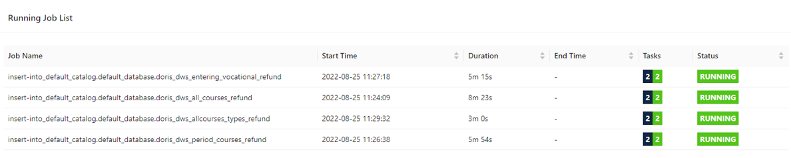

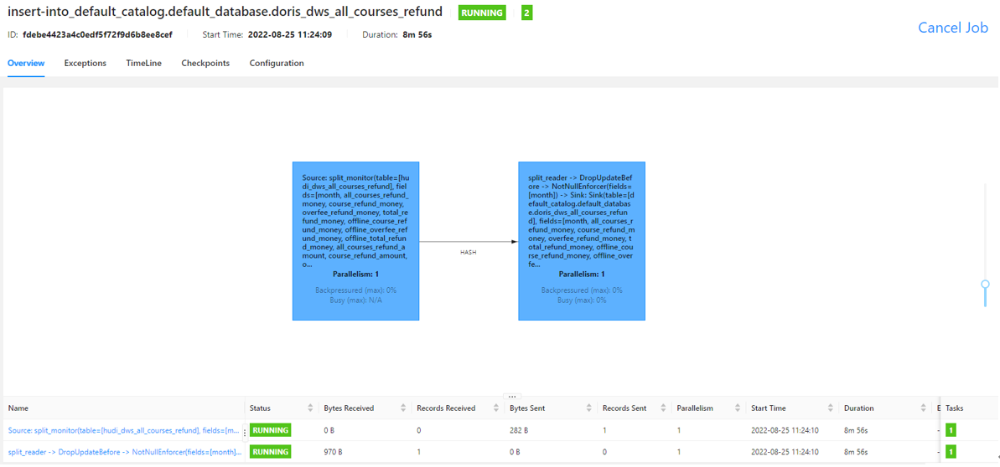

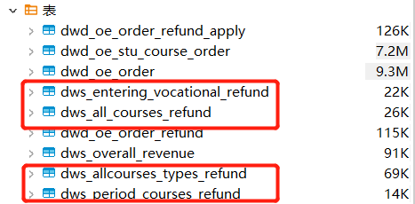

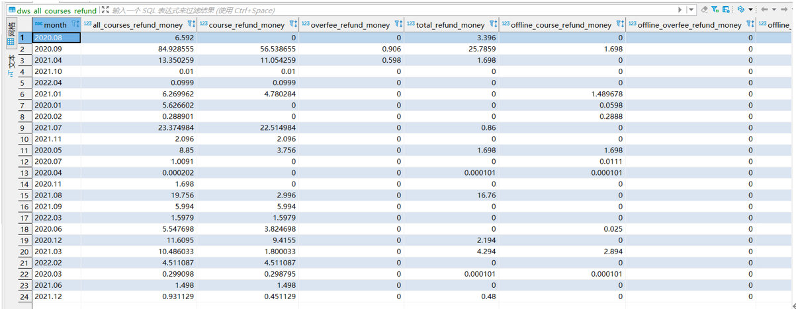

### 业务查询SQL

#### 博学谷全部课程退费量和退费金额分析

```sql
SELECT
    `month` AS  `月份`,
    `all_courses_refund_amount` AS `全部课程退费量`,
    `all_courses_refund_money`  AS `全部课程退费金额`
FROM
bxg.dws_all_courses_refund
ORDER BY `月份`;
```

#### 全部课程不同退费类型的退费量分析

```sql
SELECT
    `month` AS `月份`,
    `course_refund_amount` AS `课程退学退费量`,
    `overfee_refund_amount` AS `多交学费退费量`,
    `total_refund_amount` AS `全款后预交学费退费量`,
    `offline_course_refund_amount` AS `转线下_课程退学退费量`,
    `offline_overfee_refund_amount` AS `转线下_多交学费退费量`,
    `offline_total_refund_amount` AS `转线下_预交学费退费量` 
FROM
    bxg.dws_all_courses_refund
   ORDER BY `月份`;  
```

#### 全部课程不同退费类型的退费金额分析

```sql
SELECT
    `month` AS `月份`,
    `course_refund_money` AS `课程退学退费金额`,
    `overfee_refund_money` AS `多交学费退费金额`,
    `total_refund_money` AS `全款后预交学费退费金额`,
    `offline_course_refund_money` AS `转线下_课程退学退费金额`,
    `offline_overfee_refund_money` AS `转线下_多交学费退费金额`,
    `offline_total_refund_money` AS `转线下_预交学费退费金额`
FROM
   bxg.dws_all_courses_refund
  ORDER BY `月份`;
```

#### 不同时期的全部课程问题退费量分析

```sql
SELECT 
  `month` AS `月份`,
   SUM(`total_b_enter_f_refund_amount`) AS `全款后进班前退费量`,
   SUM(`enter_b_seven_in_refund_amount`) AS `进班后七天内退费量`,
   SUM(`enter_b_seven_out_refund_amount`) AS `进班后七天外退费量`,
   SUM(`total_b_enter_f_refund_amount`) + SUM(`enter_b_seven_in_refund_amount`) + SUM(`enter_b_seven_out_refund_amount`) AS `总退费量`
FROM 
bxg.dws_period_courses_refund 
WHERE order_refund_status=-1
GROUP BY `month` ORDER BY `month` ASC;
```

#### 不同时期的全部课程问题退费金额分析

```sql
SELECT 
  `month` AS `月份`,
   SUM(`total_b_enter_f_refund_money`) AS `全款后进班前退费金额`,
   SUM(`enter_b_seven_in_refund_money`) AS `进班后七天内退费金额`,
   SUM(`enter_b_seven_out_refund_amount_money`) AS `进班后七天外退费金额`,
   SUM(`total_b_enter_f_refund_money`) + SUM(`enter_b_seven_in_refund_money`) + SUM(`enter_b_seven_out_refund_amount_money`) AS `总退费金额`
FROM 
bxg.dws_period_courses_refund 
WHERE stu_course_status = 8
GROUP BY `month` ORDER BY `month` ASC;
```

#### 进班后的职业课各类型的问题退费量分析

```sql
SELECT  
  `month` AS `月份`,
  `online_employment_refund_amount` AS `在线就业班退费量`,
  `SVIP_refund_amount` AS `SVIP班退费量`,
  `live_guarantee_refund_amount` AS `直播保薪班退费量`,
  `year_member_refund_amount` AS `年度会员退费量`,
  `half_year_member_refund_amount` AS `半年度会员退费量`,
  `season_member_refund_amount` AS `季度会员退费量`,
  `month_member_refund_amount` AS `月度会员退费量`
FROM bxg.dws_entering_vocational_refund
ORDER BY `month` ASC;
```

#### 进班后的职业课各类型的问题退费金额分析

```sql
SELECT 
   `month` AS `月份`,
   `online_employment_refund_money` AS `在线就业班退费金额`,
  `SVIP_refund_money` AS `SVIP班退费金额`,
  `live_guarantee_refund_money` AS `直播保薪班退费金额`,
  `year_member_refund_money` AS `年度会员退费金额` ,
  `half_year_member_refund_money` AS `半年度会员退费金额`,
  `season_member_refund_money` AS `季度会员退费金额`,
  `month_member_refund_money` AS `月度会员退费金额`
FROM 
bxg.dws_entering_vocational_refund
ORDER BY `month` ASC;
```

#### 2021年全部课程进班后的问题退费量详情表

```sql
SELECT 
             `course_id` AS `课程id`,
             `course_name` AS `课程名称`,
             `course_type` AS `课程类型`,
             SUM(`January_amount`) AS `一月`,
             SUM(`February_amount`) AS `二月`,
             SUM(`March_amount`) AS `三月`,
             SUM(`April_amount`) AS `四月`,
             SUM(`May_amount`) AS `五月`,
             SUM(`June_amount`) AS `六月`,
             SUM(`July_amount`) AS `七月`,
             SUM(`August_amount`) AS `八月`,
             SUM(`September_amount`) AS `九月`,
             SUM(`October_amount`) AS `十月`,
             SUM(`November_amount`) AS `十一月`,
             SUM(`December_amount`) AS `十二月`,
             SUM(`January_amount` + `February_amount` + `March_amount` + `April_amount` + `May_amount` + `June_amount` + `July_amount` + `August_amount` + `September_amount` +
              `October_amount` + `November_amount` + `December_amount`) AS `总计`
  FROM
       bxg.dws_allcourses_types_refund
  WHERE 
  year(refund_time) =  2021
  AND effective_date is not null
-- 课程退学退
  AND refund_type = 10
  GROUP BY course_id, course_name, course_type  
  HAVING `总计` >0
  ORDER BY `总计` DESC;
```

#### 2021年全部课程的转线下退费量详情表

```sql
SELECT
             `course_id` AS `课程id`,
             `course_name` AS `课程名称`,
             `course_type` AS `课程类型`,
             SUM(`January_amount`) AS `一月`,
             SUM(`February_amount`) AS `二月`,
             SUM(`March_amount`) AS `三月`,
             SUM(`April_amount`) AS `四月`,
             SUM(`May_amount`) AS `五月`,
             SUM(`June_amount`) AS `六月`,
             SUM(`July_amount`) AS `七月`,
             SUM(`August_amount`) AS `八月`,
             SUM(`September_amount`) AS `九月`,
             SUM(`October_amount`) AS `十月`,
             SUM(`November_amount`) AS `十一月`,
             SUM(`December_amount`) AS `十二月`,
             SUM(`January_amount` + `February_amount` + `March_amount` + `April_amount` + `May_amount` + `June_amount` + `July_amount` + `August_amount` + `September_amount` +
              `October_amount` + `November_amount` + `December_amount`) AS `总计`
  FROM
             bxg.dws_allcourses_types_refund
  WHERE 
-- 课程退学退
   refund_type in(20,21,22)
   AND year(refund_time) = 2021
  GROUP BY course_id, course_name, course_type
  HAVING `总计`>0  ORDER BY `总计` DESC;
```

#### 2021年全部课程的转线下退费金额详情表

```sql
SELECT 
             `course_id` AS `课程id`,
             `course_name` AS `课程名称`,
             `course_type` AS `课程类型`,
             SUM(`January_money`) AS `一月`,
             SUM(`February_money`) AS `二月`,
             SUM(`March_money`) AS `三月`,
             SUM(`April_money`) AS `四月`,
             SUM(`May_money`) AS `五月`,
             SUM(`June_money`) AS `六月`,
             SUM(`July_money`) AS `七月`,
             SUM(`August_money`) AS `八月`,
             SUM(`September_money`) AS `九月`,
             SUM(`October_money`) AS `十月`,
             SUM(`November_money`) AS `十一月`,
             SUM(`December_money`) AS `十二月`,
             SUM(`January_money` + `February_money` + `March_money` + `April_money` + `May_money` + `June_money` + `July_money` + `August_money` + `September_money` +
             `October_money` + `November_money` + `December_money`) AS `总计`
  FROM
             bxg.dws_allcourses_types_refund
  WHERE 
-- 课程退学退
   refund_type in(20,21,22)
   AND year(refund_time) = 2021
  GROUP BY course_id, course_name, course_type
  HAVING `总计`>0  ORDER BY `总计` DESC;
```

#### 2021年全部课程的线上互转量详情表

```sql
SELECT 
             `course_id` AS `课程id`,
             `course_name` AS `课程名称`,
             `course_type` AS `课程类型`,
             SUM(`January_amount`) AS `一月`,
             SUM(`February_amount`) AS `二月`,
             SUM(`March_amount`) AS `三月`,
             SUM(`April_amount`) AS `四月`,
             SUM(`May_amount`) AS `五月`,
             SUM(`June_amount`) AS `六月`,
             SUM(`July_amount`) AS `七月`,
             SUM(`August_amount`) AS `八月`,
             SUM(`September_amount`) AS `九月`,
             SUM(`October_amount`) AS `十月`,
             SUM(`November_amount`) AS `十一月`,
             SUM(`December_amount`) AS `十二月`,
             SUM(`January_amount` + `February_amount` + `March_amount` + `April_amount` + `May_amount` + `June_amount` + `July_amount` + `August_amount` + `September_amount` +
              `October_amount` + `November_amount` + `December_amount`) AS `总计`
  FROM
          bxg.dws_allcourses_types_refund
  WHERE 
-- 课程退学退
   refund_type in(30,31,32)
   AND year(refund_time) = 2021
  GROUP BY course_id, course_name, course_type
  HAVING `总计`>0  ORDER BY `总计` DESC;
```

# 相关面试题

1、你们项目中的数据流向是怎样的？

架构图如下

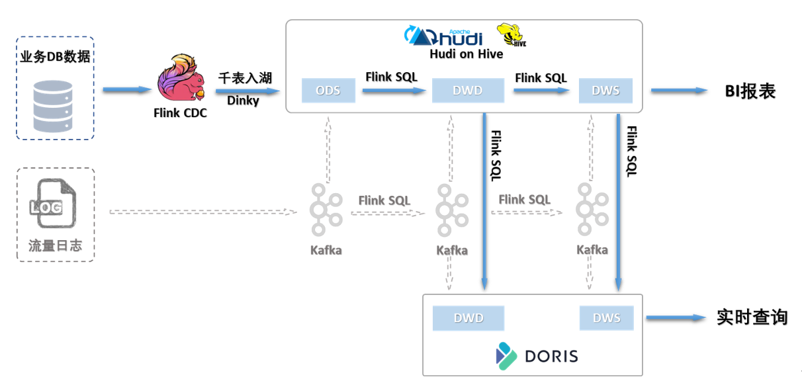

从架构图中可以看到，整个数据流向是从mysql源表中通过flink cdc采集到hudi的ods层，然后通过flink sql进行实时处理，得到宽表插入hudi的dwd层以及doris的dwd层，再继续根据业务需求处理得到的结果表插入hudi的dws层，最后我们通过flink sql将hudi的dws层表插入到doris的dws层表做查询用。

2、简单介绍一下数据提取流程及方法。

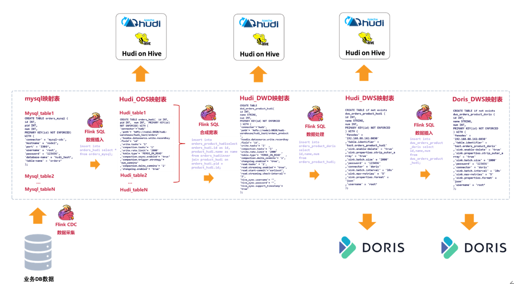

- 首先通过Flink CDC将数据从业务数据库中同步到hudi的ods层。此过程中要在flink sql客户端分别创建每张表的mysql映射表和hudiODS映射表，然后通过insert into语句实时插入数据。
- 然后建立hudiDWD层的映射表，通过拉宽语句将ODS层的数据拉宽到DWD层，形成宽表。接着在doris创建DWD层表，然后在flinksql客户端建立对应的映射表，通过insert into语句将hudiDWD层数据实时同步到dorisDWD层。
- 然后建立hudiDWS层的映射表，通过flinksql语句将DWD层表进行条件筛选、轻度聚合等操作。最后在doris创建DWS层表，然后在flinksql客户端建立对应的映射表，通过insert into语句将hudiDWS层数据实时同步到dorisDWS层，在doris的DWS层进行指标查询。

3、可以看到hudi在hive中创建了两张表：table_ro和table_rt，可以说说它们的区别吗？

rt表支持快照+增量查询(近实时)，ro支持读优化查询（ReadOptimized）。

rt表（HoodieParquetRealtimeInputFormat）读取parquet文件与增量log文件，读取时将两种数据进行合并，产生近实时的数据镜像。rt表实时性好，但读IO效率较差。

ro表（HoodieParquetInputFormat）查询时只读取parquet文件。新数据只有经过compact合并生成新的parquet文件时才可以读到，数据存在一定的延时，但读IO效率更高，因为只读取parquet文件，不需要读增量log进行数据合并。

4、你负责哪个看板，计算了哪些指标？

（挑选一两个看板，结合自身情况简单叙述即可。）

5、构建数据仓库的步骤？

- 确定主题

  - 即 确定数据分析或前端展现的主题。主题要体现出某一方面的 各分析角度(维度)和统计数值型数据(量度)之间的关系，确定主题时要综合考虑。

- 确定量度

  - 确定主题后，需要考虑分析的技术指标。它们一般为 数据值型数**据**，其中有些度量值不可以汇总；有些可以汇总起来，以便为分析者提供有用的信息。
  - 量度是要统计的指标，必须事先选择恰当，基于不同的量度可以进行 复杂关键性指标(KPI)的设计和计算。

- 确定事实数据粒度

  - 确定量度之后，需要考虑该量度的 汇总情况和不同维度下量度的聚合情况**。**

  - > **例如：**在业务系统中数据最小记录到秒，而在将来分析需求中，时间只要精确到天就可以了。

  - 在ETL处理过程中，按天来汇总数据,此时数据仓库中量度的粒度就是”天”。如果不能确认将来的分析需求中是否要精确的秒，那么，我们要遵循 ”最小粒度原则”。

  - 在数据仓库中的事实表中 保留每一秒的数据，从而在后续建立多维分析模型(CUBE)的时候,会对数据提前进行汇总， 保障产生分析结果的效率。

- 确定维度

  - 维度是 分析的各个角度。

  - > **例如:**我们希望按照时间，或者按照地区，或者按照产品进行分析。那么这里的时间，地区，产品就是相应的维度。

  - 基于不同的维度，可以 看到各个量度汇总的情况，也可以基于所有的维度进行交叉分析。

  - 维度的层次(Hierarchy)和级别(Level)。

  - > **例如:**在时间维度上，按照”度-季度-月”形成了一个层次，其中”年” ,”季度” ,”月”成为了这个层次的3个级别。我们可以将“产品大类-产品子类-产品”划为一个层次，其中包含“产品大类”、“产品子类”、“产品”三个级别。

  - 我们可以将3个级别 设置成一张数据表中的3个字段,比如时间维度；我们也可以使用三张表，分别保存产品大类，产品子类，产品三部分数据,比如产品维度。

  - 建立维度表时要充分使用代理键。代理键是数据值型的ID号码(每张表的第一个字段)，它唯一标识了第一维度成员。

  - 在聚合时，数值型字段的匹配和比较，join效率高。同时代理键在缓慢变化维中，起到了 对新数据与历史数据的标识作用。

- 创建事实表

  - 在确定好事实数据和维度后，将考虑加载事实表。 业务系统的的一笔笔生产、交易记录就是将要建立的事实表的原始数据。
  - 我们的做法是 将原始表与维度表进行关联，生成事实表。关联时有为空的数据时(数据源脏)，需要使用外连接，连接后将各维度的代理键取出放于事实表中，事实表除了各维度代理键外，还有各度量数据， 不应该存在描述性信息。
  - 事实表中的记录条数据都比较多，要为其设置复合主键各蛇引，以实现数据的完整性和基于数据仓库的查询性能优化。

