博学谷大数据平台\_线上部署
==========================

课程目标
--------

● 了解dinky特点和由来，理解dinky基本概念和系统架构

● 了解dinky的主要功能，掌握dinky的基本用法

● 掌握使用dinky进行整库同步的方法

● 将项目中涉及的所有表使用dinky进行部署

Dinky 简介
----------

### 知识点01：【理解】基本介绍

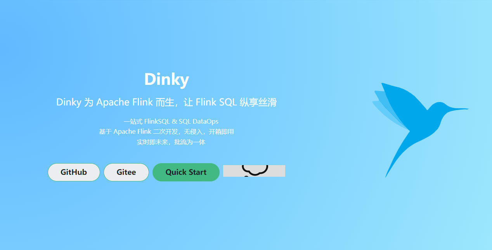

- **实时**即未来，Dinky为Apache Flink而生，让Flink SQL更加丝滑。它是一个交互式的FlinkSQL Studio，可以在线开发、补全、校验、执行、预览FlinkSQL，支持Flink官方所有语法及其增强语法，并且可以同时对多Flink集群实例进行提交、停止、SavePoint等运维操作。
- 需要注意的是，Dinky更专注于FlinkSQL的应用，而不是DataStream。在开发过程中不会看到任何一句 java、scala或者python。所以，它的目标是基于100% FlinkSQL来实现批流一体的实时计算平台。
- 站在巨人肩膀上开发与创新，Dinky在未来批流一体的发展趋势下潜力无限。


官方网址：<http://www.dlink.top/>

### 知识点02：【了解】Dinky由来

Dinky（原Dlink）：

- 1.Dinky英译为“小巧而精致的”，最直观的表明了它的特征：**轻量级**但又具备**复杂的大数据开发能力**。
- 2.Dinky为“Data Integrate No Knotty”
  的首字母组合，英译“数据整合不难”，寓意“易于建设批流一体平台及应用”。
- 3.从Dlink改名为Dinky过渡平滑，更加形象的阐明了开源项目的目标，始终指引参与者们“不忘初心，方得始终”。

### 知识点03：【了解】Dinky特点

一个开箱即用、易扩展，以**Apache Flink**为基础，连接**OLAP**和**数据湖**等众多框架的一站式实时计算平台，致力于流批一体和湖仓一体的建设与实践。

- 其主要特点如下：
  可视化交互式FlinkSQL和SQL的**数据开发平台**：自动提示补全、语法高亮、调试执行、语法校验、语句美化、全局变量等。
- 支持全面的多版本的FlinkSQL作业提交方式：Local、Standalone、Yarn Session、Yarn Per-Job、Yarn Application、Kubernetes Session、Kubernetes Application。
- 支持Apache Flink所有的Connector、UDF、CDC等。

- 支持FlinkSQL语法增强：兼容Apache Flink
  SQL、表值聚合函数、全局变量、**CDC多源合并**、执行环境、语句合并、共享会话等。

- 支持易扩展的SQL作业提交方式：ClickHouse、Doris、Hive、Mysql、Oracle、Phoenix、PostgreSql、SqlServer等。

- 支持实时调试预览Table和ChangeLog数据及图形展示。

- 支持语法逻辑检查、作业执行计划、字段级血缘分析等。

- 支持Flink元数据、数据源元数据查询及管理。

- 支持实时任务运维：作业上线下线、作业信息、集群信息、作业快照、异常信息、作业日志、数据地图、即席查询、历史版本、报警记录等。

- 支持易扩展的实时作业报警及报警组：钉钉、微信企业号等。

- 支持完全托管的SavePoint启动机制：最近一次、最早一次、指定一次等。

- 支持多种资源管理：集群实例、集群配置、Jar、数据源、报警组、报警实例、文档、用户、系统配置等。


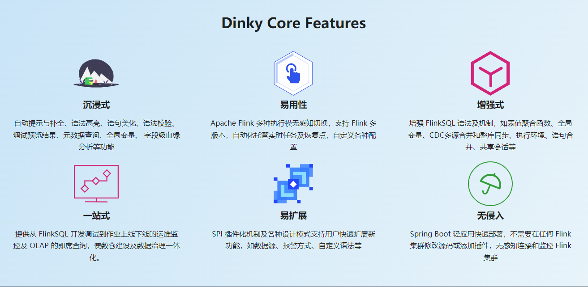

Dinky 概念和架构
----------------

### 知识点04：【了解】系统架构

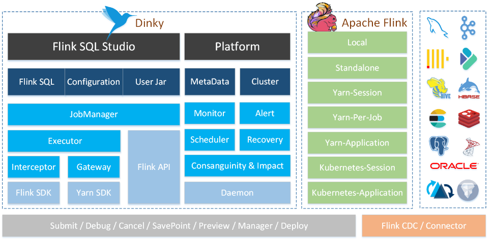

### 知识点05：【理解】基本概念

● **JobManager**

JobManager作为Dinky的作业管理的**统一入口**，负责Flink的各种作业执行方式及其他功能的调度。

● **Executor**

Executor是Dinky定制的FlinkSQL**执行器**，来模拟真实的Flink执行环境，负责FlinkSQL的Catalog管理、UDF管理、片段管理、配置管理、语句集管理、语法校验、逻辑验证、计划优化、生成JobGraph、本地执行、远程提交、SELECT及SHOW预览等核心功能。

● **Interceptor**

Interceptor是Dinky的Flink**执行拦截器**，负责对其进行片段解析、UDF注册、SET和AGGTABLE等增强语法解析。

● Gateway

Gateway并非是开源项目flink-sql-gateway，而是Dinky自己定制的Gateway，负责进行基于Yarn环境的任务提交与管理，主要有Yarn-Per-Job和Yarn-Application的FlinkSQL提交、停止、SavePoint以及配置测试，而User Jar目前只开放了Yarn-Application的提交。

● **Flink SDK**

Dinky主要通过调用flink-client和flink-table模块进行二次开发。

● Yarn SDK

Dinky通过调用flink-yarn模块进行二次开发。

● Flink API

Dinky也支持通过调用JobManager的RestAPI对任务进行管理等操作，系统配置可以控制开启和停用。

● Local

Dinky自身的Flink环境，通过plugins下的Flink依赖进行构建，主要用于语法校验和逻辑检查、生成 JobPlan和JobGraph、字段血缘分析等功能。注意：目前请不要用该模式执行或提交流作业，将会无法关闭，需要重启进程才可。

● **Standalone**

Dinky通过已注册的**Flink Standalone集群实例**可以对远程集群进行FlinkSQL的提交、Catalog的交互式管理以及对SELECT和SHOW等语句的执行结果预览。

● Yarn-Session

Dinky通过已注册的Flink Yarn Session集群实例可以对远程集群进行FlinkSQL的提交、Catalog的交互式管理以及对SELECT和SHOW等语句的执行结果预览。

● Yarn-Per-Job

Dinky通过已注册的集群配置来获取对应的YarnClient 实例，然后将Local模式解析生成的
JobGraph与Configuration提交至Yarn来创建Flink Per-Job应用。

● Yarn-Application

Dinky通过已注册的集群配置来获取对应的YarnClient实例。对于User
Jar，将Jar相关配置与 Configuration提交至Yarn来创建Flink-Application应用；对于Flink
SQL，Dinky则将作业ID及数据库连接配置作为Main入参和dlink-app.jar以及Configuration提交至Yarn来创建Flink-Application应用。

Dinky的快速体验使用
-------------------

### 环境部署

详见附录项目部署文档

### 知识点06：【实现】启动

● 启动zookeeper(三台都要):

```
/export/server/zookeeper/bin/zkServer.sh start
```


● 启动hdfs(第一台):

```
/export/server/hadoop/sbin/start-dfs.sh
```


● 开启hive(第一台):

```
nohup /export/server/hive/bin/hive --service metastore &
nohup /export/server/hive/bin/hive --service hiveserver2 &
```


● 开启flink standalone(第一台):

```
cd /export/server/flink
./bin/start-cluster.sh
```


● 启动doris:

```
启动fe(第一台):
cd /export/server/doris/fe
bin/start_fe.sh --daemon
启动be(三台都要):
cd /export/server/doris/be
bin/start_be.sh --daemon
```


● 启动dinky(第一台):

```
cd /export/server/dlink
$sh auto.sh restart
```


● Jps查看进程,三台分别如下图

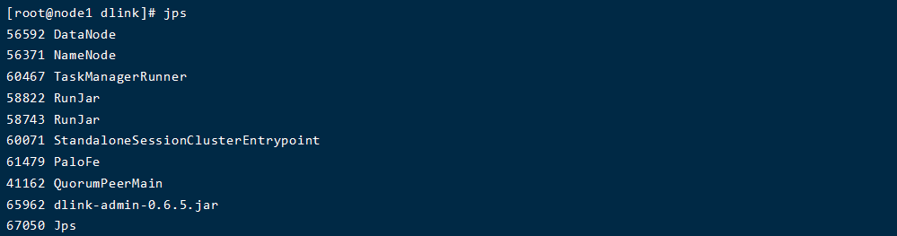

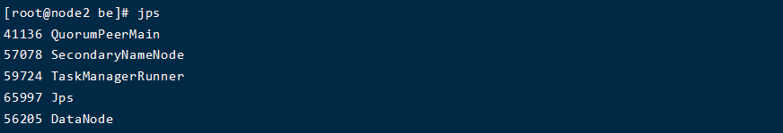

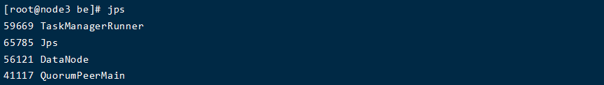

### 知识点07：【实现】配置webUI参数

#### 登录UI界面

<http://192.168.88.161:12000/#/user/login>

管理员账户:admin

管理员密码:admin

#### 创建集群实例

● 登录Dinky，选择注册中心\>\>集群管理\>\>集群实例管理或集群配置管理，点击新建Flink集群。

按照下图进行配置。

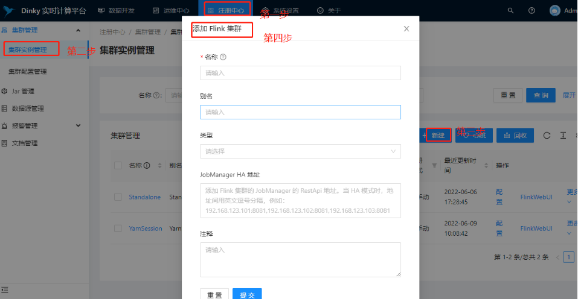

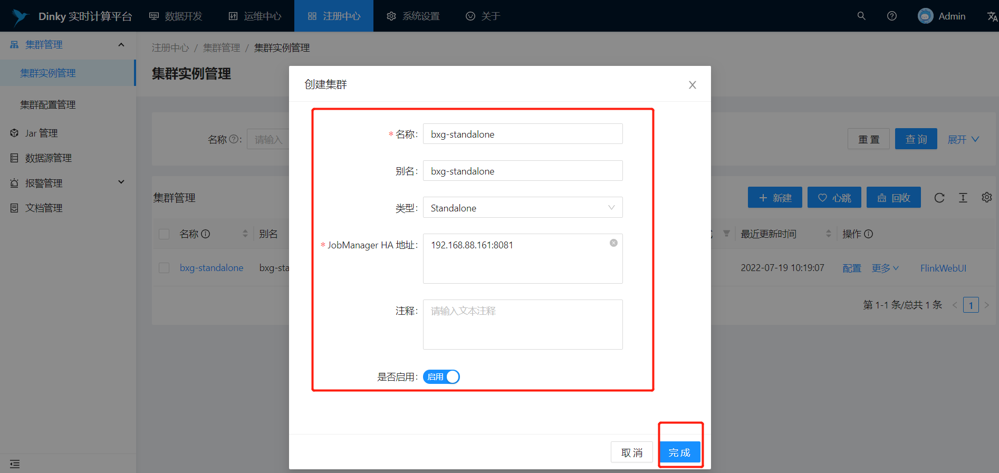

● 集群实例创建完成后，会显示在列表。

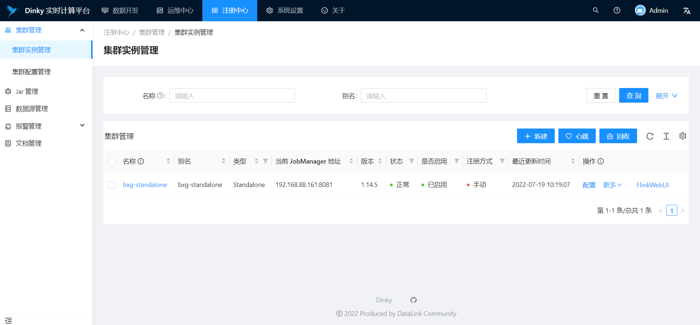

#### 创建目录

● 在数据开发页面,点击最左侧目录,点击创建目录,完成bxg目录创建,并在bxg下创建test目录。

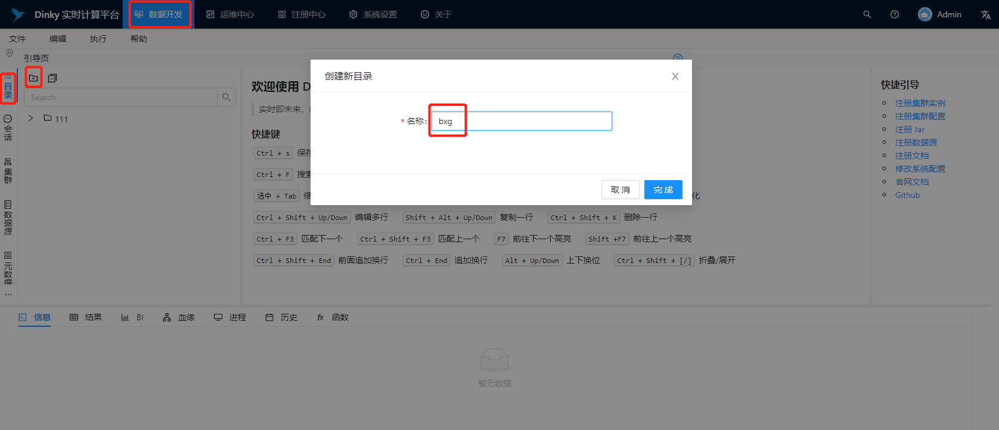

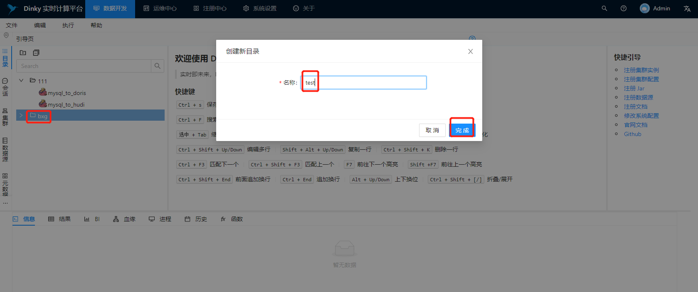

### 知识点08：【实现】sql\_mysql-to-Hudi案例

这里将mysql中的表通过dinky同步到hudi，以bxg.oe\_course为例。

#### 创建sql\_mysql\_bxg\_oe\_course-to-hudi作业

-   在test目录下,右键弹出对话框,点击创建作业,输入作业类型FlinkSQL,名称,别名即可完成作业创建。

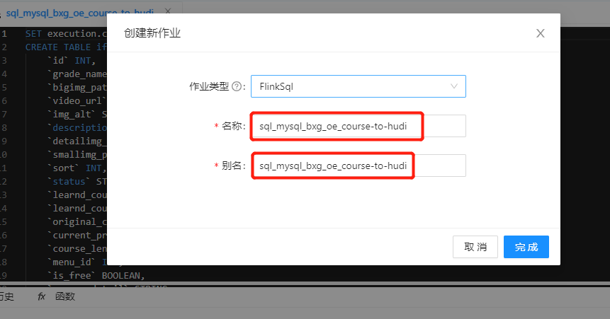

-   创建完成后，即可在此作业下写SQL及配置作业参数(执行前保证对应的hdfs目录下没有数据，而且hive中没有对应的表，因为会自动创建)。如下:

```sql
SET execution.checkpointing.interval=30sec;
CREATE TABLE if not exists mysql_bxg_oe_course (
    `id` INT,
    `grade_name` STRING,
    `bigimg_path` STRING,
    `video_url` STRING,
    `img_alt` STRING,
    `description` STRING,
    `detailimg_path` STRING,
    `smallimg_path` STRING,
    `sort` INT,
    `status` STRING,
    `learnd_count` INT,
    `learnd_count_flag` INT,
    `original_cost` DECIMAL(10,2),
    `current_price` DECIMAL(10,2),
    `course_length` DECIMAL(10,2),
    `menu_id` INT,
    `is_free` BOOLEAN,
    `course_detail` STRING,
    `course_detail_mobile` STRING,
    `course_detail1` STRING,
    `course_detail1_mobile` STRING,
    `course_plan_detail` STRING,
    `course_plan_detail_mobile` STRING,
    `course_detail2` STRING,
    `course_detail2_mobile` STRING,
    `course_outline` STRING,
    `common_problem` STRING,
    `common_problem_mobile` STRING,
    `lecturer_id` INT,
    `is_recommend` INT,
    `recommend_sort` INT,
    `qqno` STRING,
    `description_show` INT,
    `rec_img_path` STRING,
    `pv` INT,
    `course_type` INT,
    `default_student_count` INT,
    `study_status` INT,
    `online_course` INT,
    `course_level` INT,
    `content_type` INT,
    `recommend_type` INT,
    `employment_rate` STRING,
    `employment_salary` STRING,
    `score` STRING,
    `cover_url` STRING,
    `offline_course_url` STRING,
    `outline_url` STRING,
    `project_page_url` STRING,
    `preschool_test_flag` BOOLEAN,
    `service_period` INT,
    `included_validity_period` TINYINT,
    `validity_period` INT,
    `qualified_jobs` STRING,
    `work_year_min` INT,
    `work_year_max` INT,
    `promote_flag` BOOLEAN,
    `create_person` STRING,
    `update_person` STRING,
    `create_time` TIMESTAMP(3),
    `update_time` TIMESTAMP(3),
    `is_delete` BOOLEAN,
    PRIMARY KEY (`id`) NOT ENFORCED
) WITH (
    'connector'= 'mysql-cdc',
    'hostname'= 'node1',
    'port'= '3306',
    'username'= 'root',
    'password'='123456',
    'server-time-zone'= 'Asia/Shanghai',
    'debezium.snapshot.mode'='initial',
    'database-name'= 'bxg',
    'table-name'= 'oe_course'
);
CREATE TABLE if not exists hudi_bxg_ods_oe_course(
    `id` INT,
    `grade_name` STRING,
    `bigimg_path` STRING,
    `video_url` STRING,
    `img_alt` STRING,
    `description` STRING,
    `detailimg_path` STRING,
    `smallimg_path` STRING,
    `sort` INT,
    `status` STRING,
    `learnd_count` INT,
    `learnd_count_flag` INT,
    `original_cost` DECIMAL(10,2),
    `current_price` DECIMAL(10,2),
    `course_length` DECIMAL(10,2),
    `menu_id` INT,
    `is_free` BOOLEAN,
    `course_detail` STRING,
    `course_detail_mobile` STRING,
    `course_detail1` STRING,
    `course_detail1_mobile` STRING,
    `course_plan_detail` STRING,
    `course_plan_detail_mobile` STRING,
    `course_detail2` STRING,
    `course_detail2_mobile` STRING,
    `course_outline` STRING,
    `common_problem` STRING,
    `common_problem_mobile` STRING,
    `lecturer_id` INT,
    `is_recommend` INT,
    `recommend_sort` INT,
    `qqno` STRING,
    `description_show` INT,
    `rec_img_path` STRING,
    `pv` INT,
    `course_type` INT,
    `default_student_count` INT,
    `study_status` INT,
    `online_course` INT,
    `course_level` INT,
    `content_type` INT,
    `recommend_type` INT,
    `employment_rate` STRING,
    `employment_salary` STRING,
    `score` STRING,
    `cover_url` STRING,
    `offline_course_url` STRING,
    `outline_url` STRING,
    `project_page_url` STRING,
    `preschool_test_flag` BOOLEAN,
    `service_period` INT,
    `included_validity_period` INT,
    `validity_period` INT,
    `qualified_jobs` STRING,
    `work_year_min` INT,
    `work_year_max` INT,
    `promote_flag` BOOLEAN,
    `create_person` STRING,
    `update_person` STRING,
    `create_time` TIMESTAMP(3),
    `update_time` TIMESTAMP(3),
    `is_delete` BOOLEAN,
   PRIMARY KEY (id) NOT ENFORCED
) WITH(
    'connector'='hudi'
    ,'path'= 'hdfs://node1:8020/hudi/bxg/ods_oe_course'
    ,'hoodie.datasource.write.recordkey.field'= 'id' 
    ,'write.tasks'= '1'
    ,'compaction.tasks'= '1'
    ,'write.rate.limit'= '2000' 
    ,'table.type'= 'MERGE_ON_READ' 
    ,'compaction.async.enabled'= 'true' 
    ,'compaction.trigger.strategy'= 'num_commits' 
    ,'compaction.delta_commits'= '1'
    ,'changelog.enabled'= 'true' 
    ,'read.tasks' = '1'
,'read.streaming.enabled'= 'true'
    ,'read.start-commit'='earliest' 
    ,'read.streaming.check-interval'= '3'
    ,'hive_sync.enable'= 'true' 
    ,'hive_sync.mode'= 'hms' 
    ,'hive_sync.metastore.uris'= 'thrift://node1:9083'
    ,'hive_sync.table'= 'ods_oe_course'
    ,'hive_sync.db'= 'bxg' 
    ,'hive_sync.username'= '' 
    ,'hive_sync.password'= '' 
    ,'hive_sync.support_timestamp'= 'true' 
);
INSERT INTO `hudi_bxg_ods_oe_course`
select  id, grade_name, bigimg_path, video_url, img_alt, description, detailimg_path, smallimg_path, sort, status, learnd_count, learnd_count_flag, original_cost, current_price, course_length, menu_id, is_free, course_detail, course_detail_mobile, course_detail1, course_detail1_mobile, course_plan_detail, course_plan_detail_mobile, course_detail2, course_detail2_mobile, course_outline, common_problem, common_problem_mobile, lecturer_id, is_recommend, recommend_sort, qqno, description_show, rec_img_path, pv, course_type, default_student_count, study_status, online_course, course_level, content_type, recommend_type, employment_rate, employment_salary, score, cover_url, offline_course_url, outline_url, project_page_url, preschool_test_flag, service_period, included_validity_period, validity_period, qualified_jobs, work_year_min, work_year_max, promote_flag, create_person, update_person, create_time, update_time, is_delete
from `mysql_bxg_oe_course`;
```


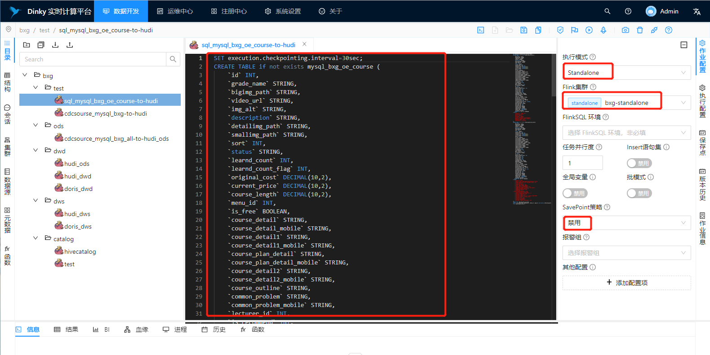

-   提交任务相关的按钮说明如下。

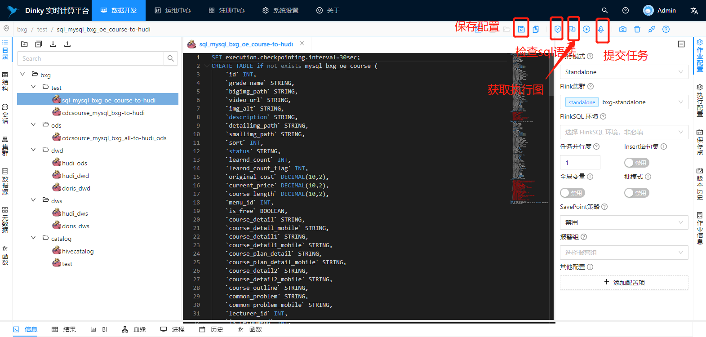

-   点击保存配置，点击检查sql语法：

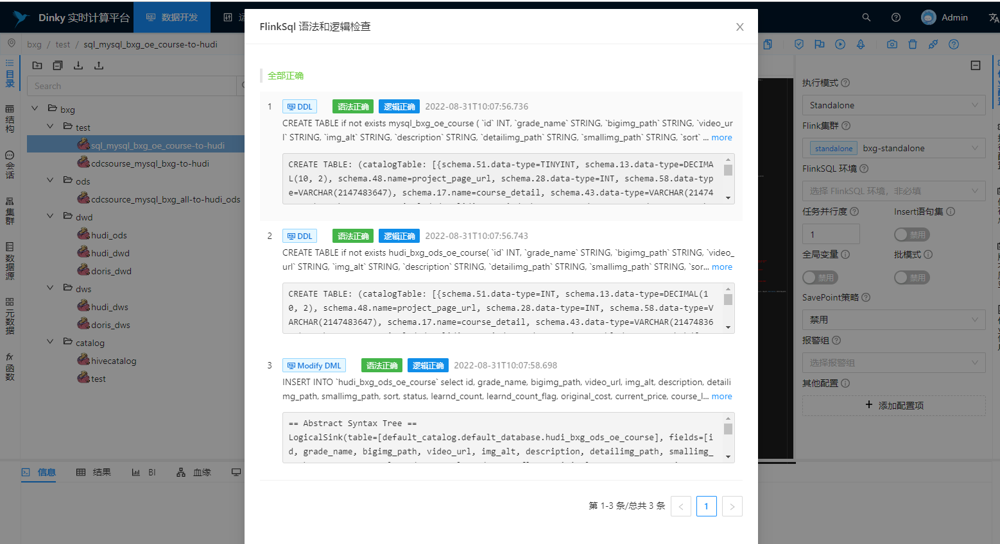

-   点击获取执行图：

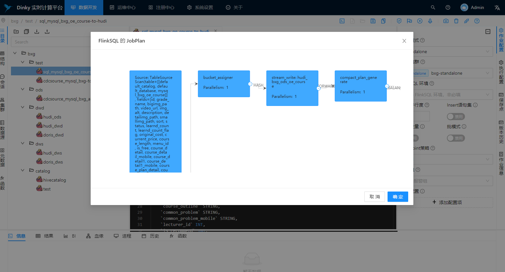

-   点击提交任务：

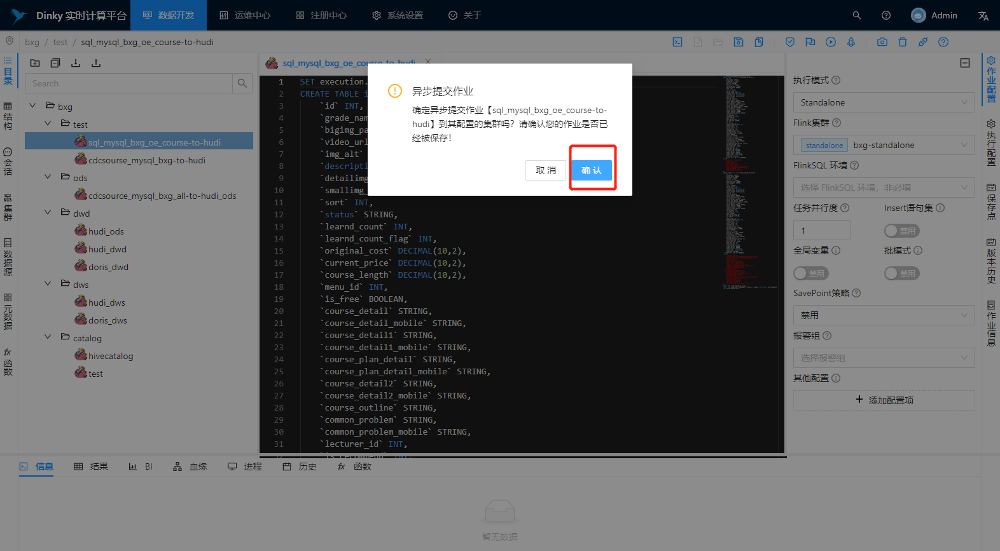

#### 查看任务

-   可以在运维中心看到正在运行的任务

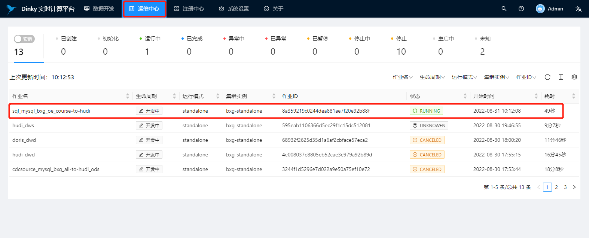

-   点进去，可以看到详细信息，如下图

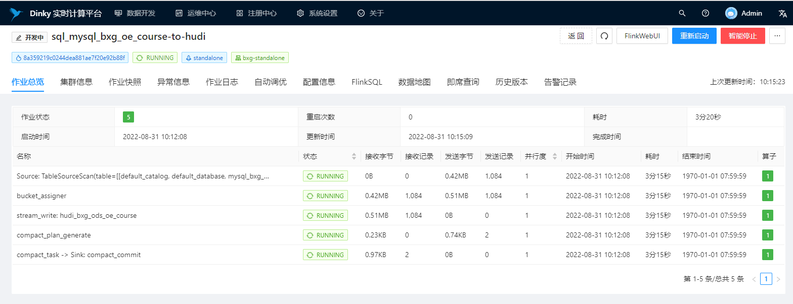

-   也可以在flink 8081界面看到正在运行的任务：*http://192.168.88.161:8081/\#/overview*

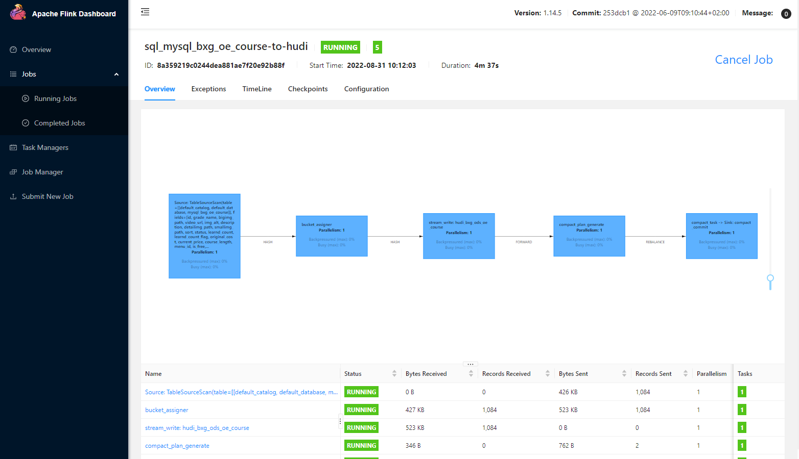

#### 查看结果

-   查看hdfs的对应目录,发现生成与表名对应的文件夹，文件夹下已有相关文件数据:

地址：*http://192.168.88.161:9870/explorer.html\#/hudi/bxg/ods\_oe\_course*

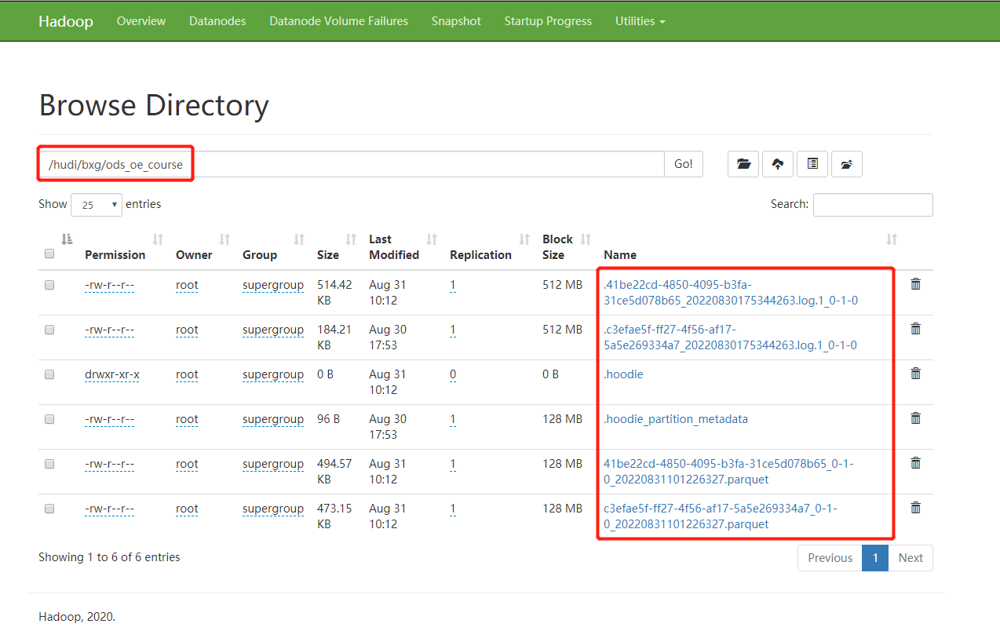

-   查看hive的bxg数据库，已经生成ods\_oe\_course\_ro和ods\_oe\_course\_rt两张表:

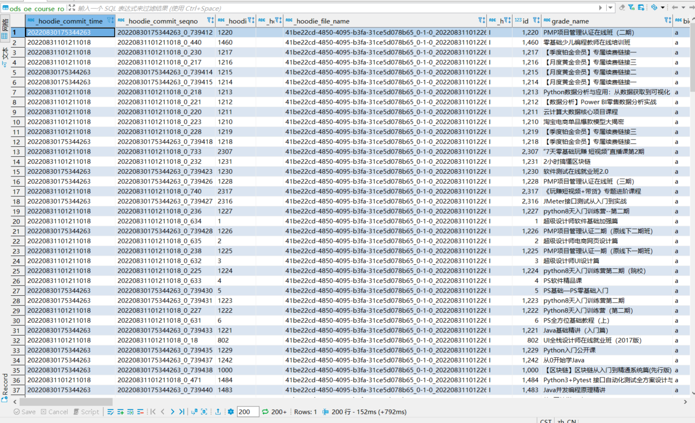

#### 停止任务

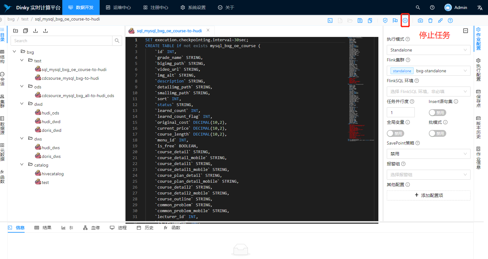

Dinky 概览
----------

### 知识点09：【理解】概述

● Dinky作为Apache Flink的FlinkSQL的**实时计算平台**，具有以下核心特点。

■ 支持Flink原生语法、连接器、UDF等：几乎零成本将Flink作业迁移至Dinky。

■
增强FlinkSQL语法：表值聚合函数、全局变量、CDC多源合并、执行环境、语句合并、共享会话等。

■ 支持Flink多版本：支持作为多版本FlinkSQL Server的能力以及OpenApi。

■ 支持外部数据源的DB SQL操作：如ClickHouse、Doris、Hive、Mysql、Oracle、Phoenix、PostgreSql、SqlServer等。

■
支持实时任务运维：作业上线下线、作业信息、集群信息、作业快照、异常信息、作业日志、数据地图、即席查询、历史版本、报警记录等。

### 知识点10：【掌握】管理控制台介绍

Dinky实时计算平台开发模块包括**数据开发、运维中心、注册中心**和**系统设置**四大模块。

#### 数据开发

数据开发包括作业管理、作业配置和运维管理等。

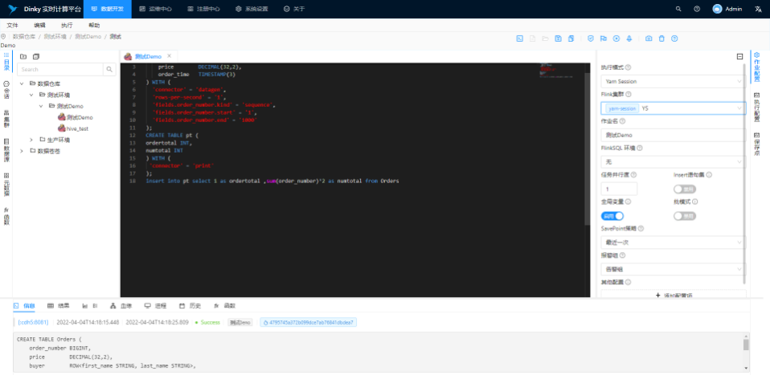

#### 运维中心

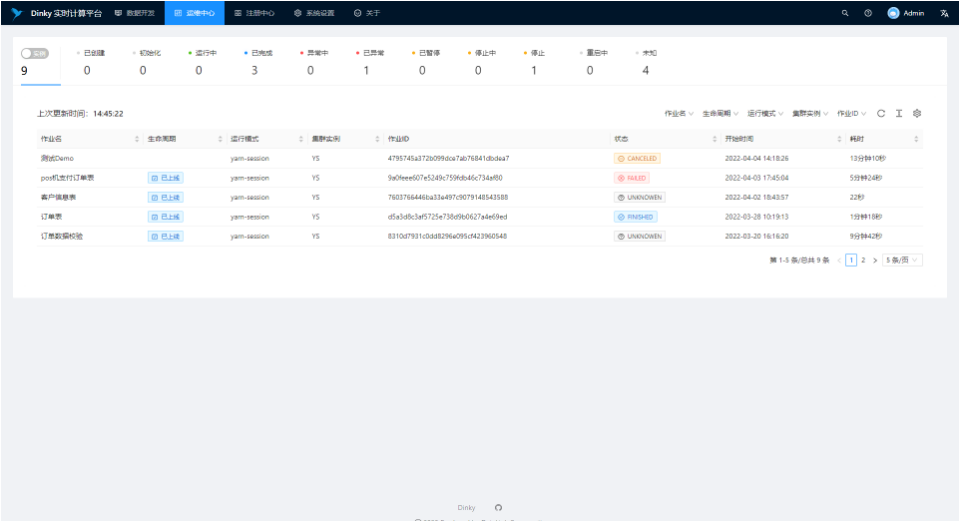

#### 注册中心

注册中心包括集群管理、Jar管理、数据源管理、报警管理和文档管理。

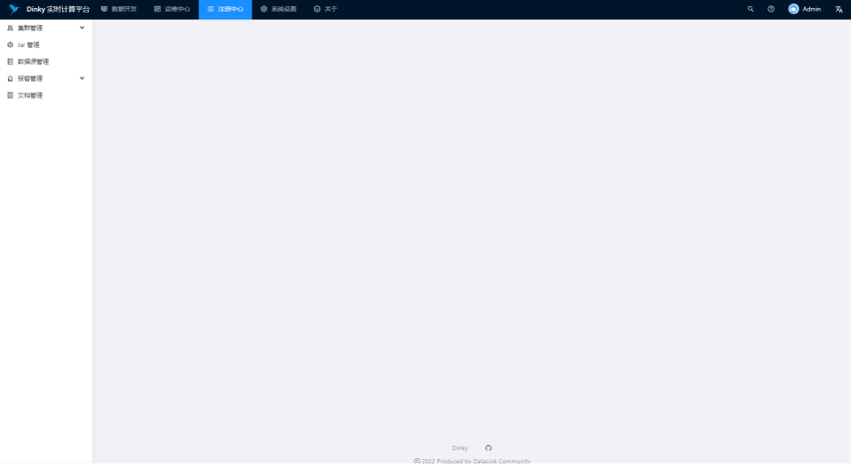

#### 系统设置

系统设置包括用户管理和Flink设置。

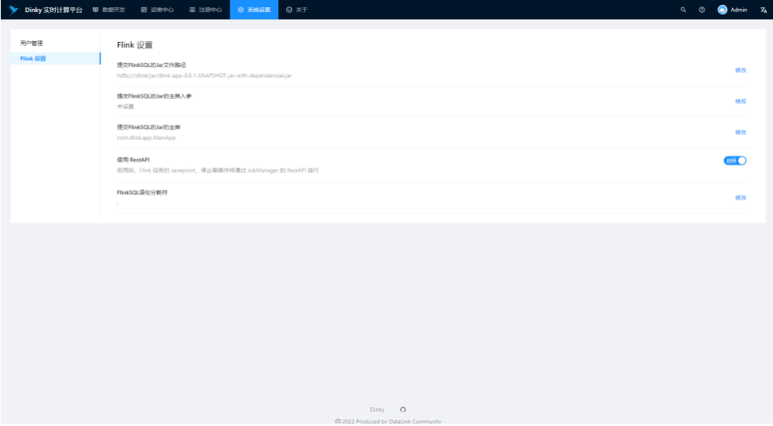

CDCSOURCE整库同步
-----------------

### 知识点11：【了解】设计背景

● 目前通过FlinkCDC进行会存在诸多问题，如需要定义大量的DDL和编写大量的INSERT INTO，更为严重的是会占用大量的数据库连接，对Mysql和网络造成压力。

● Dinky定义了CDCSOURCE整库同步的语法，该语法和CDAS作用相似，可以直接自动**构建一个整库入仓入湖的实时任务**，并且对source进行了合并，不会产生额外的Mysql及网络压力，支持对任意sink的同步，如kafka、doris、hudi、jdbc等等。

### 知识点12：【理解】原理

#### source合并

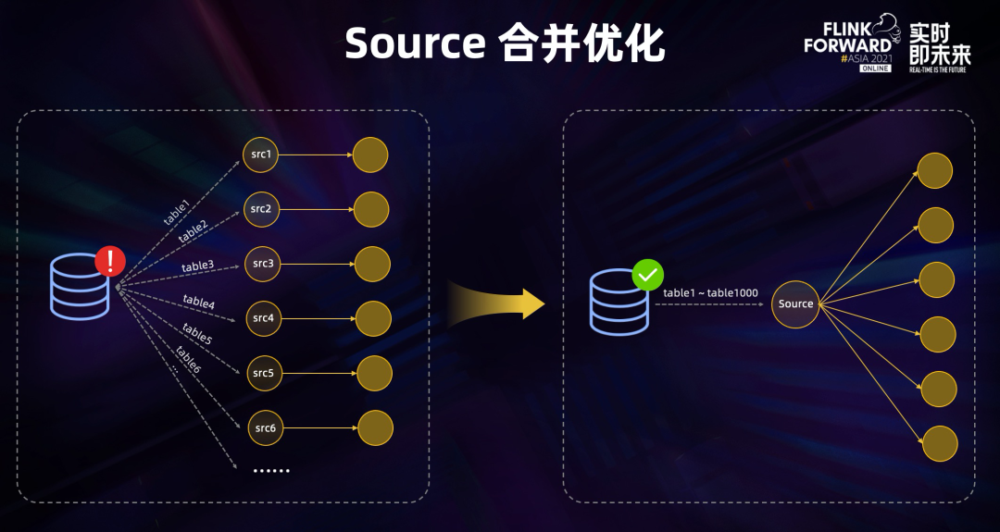

面对建立的数据库连接过多，Binlog重复读取会造成源库的巨大压力，Dinky采用了**source合并**的优化，尝试合并同一作业中的source，如果都是读的同一数据源，则会被合并成一个source节点。

Dinky采用的是只构建一个source，然后根据schema、database、table进行分流处理，分别sink到对应的表。

#### 元数据映射

Dinky是通过自身的数据源中心的**元数据功能**捕获源库的元数据信息，并同步构建sink阶段
datastream或tableAPI所使用的FlinkDDL。（Dinky的元数据存放在mysql中dlink数据库，这里也可以通过添加数据源来查看）

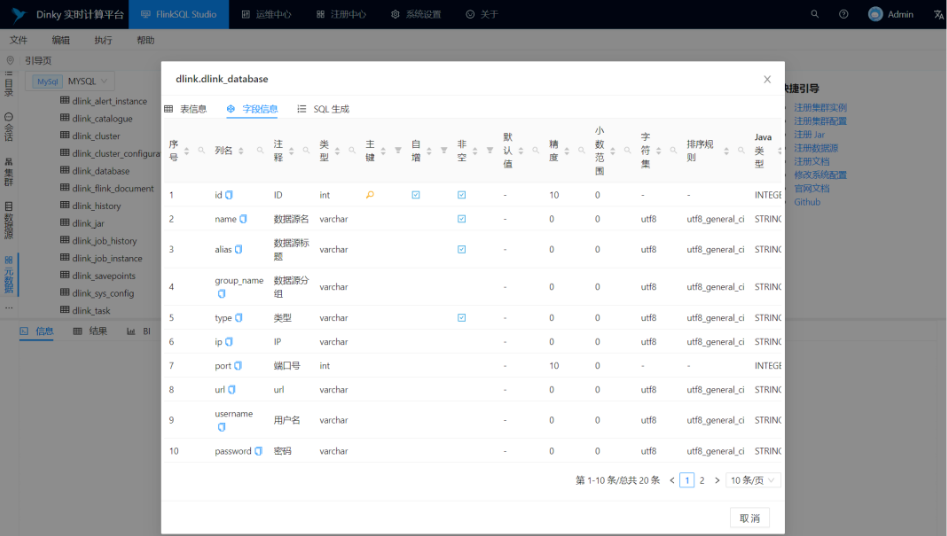

#### 多种sink方式

Dinky提供了各式各样的sink方式，通过修改语句参数可以实现不同的sink方式。Dinky支持通过
DataStream来扩展新的sink，也可以使用FlinkSQL无需修改代码直接扩展新的sink。

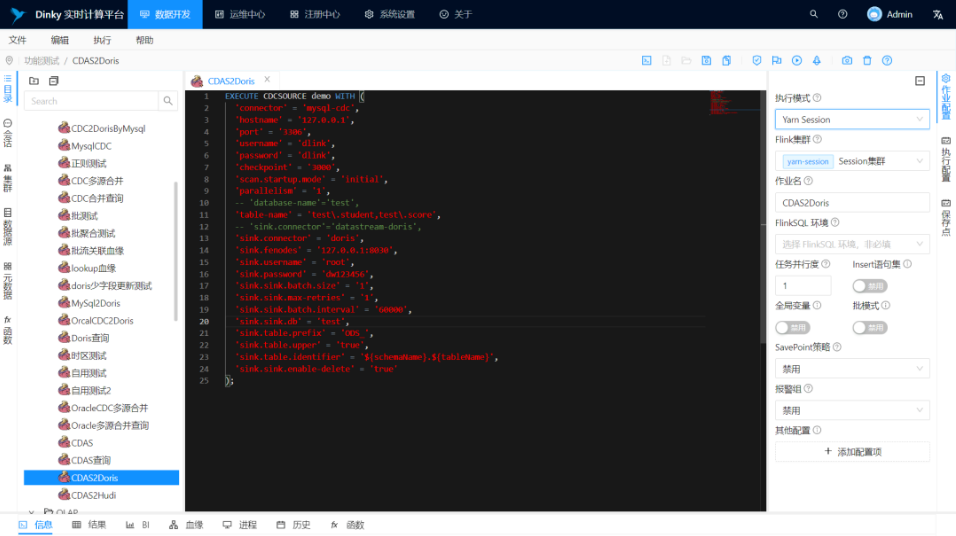

### 知识点13：【掌握】EXECUTE CDCSOURCE 基本使用

CDCSOURCE语句用于将上游指定数据库的所有表的数据采用一个任务同步到下游系统。整库同步默认支持Standalone、Yarn
Session、Yarn Per job、K8s Session。

#### 语法结构

```sql
EXECUTE CDCSOURCE jobname 
  WITH ( key1=val1, key2=val2, ...)
```


#### With 参数

**WITH**参数通常用于指定CDCSOURCE所需参数，语法为'key1'='value1', 'key2' =
'value2'的键值对。

配置项如下：

| 配置项            | 是否必须 | 默认值        | 说明                                                                                                                                            |
|-------------------|----------|---------------|-------------------------------------------------------------------------------------------------------------------------------------------------|
| connector         | 是       | 无            | 指定要使用的连接器，当前支持mysql-cdc及oracle-cdc                                                                                               |
| hostname          | 是       | 无            | 数据库服务器的IP地址或主机名                                                                                                                    |
| port              | 是       | 无            | 数据库服务器的端口号                                                                                                                            |
| username          | 是       | 无            | 连接到数据库服务器时要使用的数据库的用户名                                                                                                      |
| password          | 是       | 无            | 连接到数据库服务器时要使用的数据库的密码                                                                                                        |
| scan.startup.mode | 否       | latest-offset | 消费者的可选启动模式，有“initial”和“latest-offset”                                                                                              |
| database-name     | 否       | 无            | 如果table-name="test\\.student,test\\.score",此参数可选。                                                                                       |
| table-name        | 否       | 无            | 支持正则,示例:"test\\.student,test\\.score"                                                                                                     |
| source.\*         | 否       | 无            | 指定个性化的CDC配置，如source.server-time-zone即为 server-time-zone配置参数。                                                                   |
| checkpoint        | 否       | 无            | 单位ms                                                                                                                                          |
| parallelism       | 否       | 无            | 任务并行度                                                                                                                                      |
| sink.connector    | 是       | 无            | 指定sink的类型，如datastream-kafka、datastream-doris、datastream-hudi、kafka、doris、hudi、jdbc等等，以 datastream-开头的为DataStream的实现方式 |
| sink.sink.db      | 否       | 无            | 目标数据源的库名，不指定时默认使用源数据源的库名                                                                                                |
| sink.table.prefix | 否       | 无            | 目标表的表名前缀，如ODS即为所有的表名前拼接ODS                                                                                                  |
| sink.table.suffix | 否       | 无            | 目标表的表名后缀                                                                                                                                |
| sink.table.upper  | 否       | 无            | 目标表的表名全大写                                                                                                                              |
| sink.table.lower  | 否       | 无            | 目标表的表名全小写                                                                                                                              |
| sink.\*           | 否       | 无            | 目标数据源的配置信息，同FlinkSQL，使用\${schemaName}和 \${tableName} 可注入经过处理的源表名                                                     |

#### 说明

● 一个FlinkSQL任务只能写一个CDCSOURCE。

● 配置项中的英文逗号前不能加空格，需要紧随右单引号。

● 禁用全局变量、语句集、批模式。

● 目前不支持Application模式，后续支持。

### 知识点14：【理解】开发指南

#### Flinksql常用术语

| **词汇术语**    | **说明**                                                                                                                                                                 |
|-----------------|--------------------------------------------------------------------------------------------------------------------------------------------------------------------------|
| Source 端       | 为 FlinkSQL 持续提供输入数据                                                                                                                                             |
| Sink 端         | 为 FlinkSQL 处理结果输出的目的地                                                                                                                                         |
| Schema          | 表示一个表的结构信息，例如各个列名、列类型等                                                                                                                             |
| 时间模式        | FlinkSQL 处理数据时获取的时间戳，目前支持 Event Time、Processing Time 两种模式                                                                                           |
| Event Time      | Event Time 时间模式下，时间戳由输入数据的字段提供，可以用 WATERMARK FOR 语句                                                                                             |
|                 | 指定该字段并启用 Event Time 时间模式                                                                                                                                     |
| Watermark       | 表示一个特定的时间点，在该时间点之前的所有数据已经得到妥善处理。                                                                                                         |
|                 | Watermark 由系统自动生成,你可以通过WATERMARK FOR columnName AS \<watermark\_strategy\_expression\>定义。                                                                 |
| Processing Time | Processing Time 时间模式下，时间戳由系统自动生成并添加到数据源中（以PROCTIME命名，SELECT \*时不可见，使用时必须显式指定）。它以每条数据被系统处理的时间作为时间戳        |
| 计算列          | 计算列是一个使用 column\_name AS computed\_column\_expression 语法生成的虚拟列。它由使用同一表中其他列的非查询表达式生成，并且不会在表中进行物理存储.                    |
| 时间窗口        | 目前系统支持 TUMBLE、HOP、Session、CUMULATE三种时间窗口,具体详见*时间窗口*                                                                                               |
| SQL Hints       | SQL hints 是和 SQL 语句一起使用来改变执行计划的,常用在动态表的查询中，详见*SQL hints*                                                                                    |

#### SET语句

SET语句可以调整作业的关键运行参数，目前大多数参数都可以在sql作业中进行配置

##### 语法

SET语句中字符串类型的配置项和参数值可以不用引号或者必须用半角单引号括起来。

```sql
SET key = value;
#或者
SET `key` = `value`;
```


##### 注意

● SET语句行尾需加上分号

● SET命令不支持注释，不要在其后增加 -- 注释信息

● SET优先级\> 作业配置 \> 集群管理配置 \> Flink配置文件

##### 常见flink参数配置

| 参数                            | 参考值 | 描述                                                      |
|---------------------------------|--------|-----------------------------------------------------------|
| JobManager.memory.process.size  | 1536MB | JobManager的总进程内存大小                                |
| JobManager.heap.size            | 1024MB | JobManager的JVM堆大小                                     |
| Taskmanager.memory.process.size | 5120MB | Taskmanager的总进程内存大小                               |
| TaskManager.heap.size           | 2048MB | TaskManager的JVM堆大小                                    |
| TaskManager.numberofTaskSlots   | 4      | 单个TaskManager可以运行的并行运算符或用户功能实例的数量。 |
| parallelism.default             | 1      | 作业的默认并行度                                          |

### 知识点15：【实现】cdcsource\_mysql-to-Hudi案例

-   这里将mysql中的表通过dinky的CDCSOURCE整库同步到hudi，这里以两张表bxg.oe\_stu\_course,bxg.oe\_stu\_course\_order为例。

#### 创建cdcsource\_mysql\_bxg\_demo-to-hudi作业

-   在test目录下,右键弹出对话框,点击创建作业,输入作业类型FlinkSQL,名称,别名即可完成作业创建。

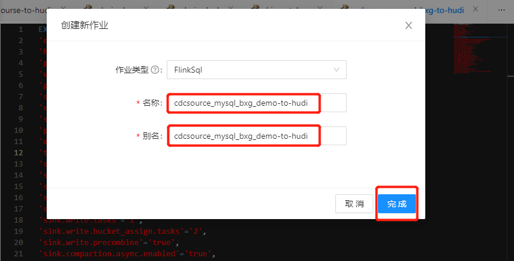

-   创建完成后，即可在此作业下写SQL及配置作业参数(执行前保证对应的hdfs目录下没有数据，而且hive中没有对应的表，因为会自动创建)。如下:

```sql
EXECUTE CDCSOURCE jobname WITH (
'connector' = 'mysql-cdc',
'hostname' = '192.168.88.161',
'port' = '3306',
'username' = 'root',
'password' = '123456',
'source.server-time-zone' = 'UTC',
'checkpoint'='90000',
'scan.startup.mode'='initial',
'parallelism'='2',
'database-name'='bxg',
'table-name'='bxg\.oe_stu_course,bxg\.oe_stu_course_order',
'sink.connector'='hudi',
'sink.path'='hdfs://192.168.88.161:8020/hudi/bxg/${tableName}',
'sink.hoodie.datasource.write.recordkey.field'='id',
'sink.hoodie.parquet.max.file.size'='268435456',
'sink.write.precombine.field'='update_time',
'sink.write.tasks'='1',
'sink.write.bucket_assign.tasks'='2',
'sink.write.precombine'='true',
'sink.compaction.async.enabled'='true',
'sink.write.task.max.size'='1024',
'sink.write.rate.limit'='3000',
'sink.write.operation'='upsert',
'sink.table.type'='MERGE_ON_READ',
'sink.compaction.tasks'='1',
'sink.compaction.delta_seconds'='20',
'sink.compaction.async.enabled'='true',
'sink.read.streaming.skip_compaction'='true',
'sink.compaction.delta_commits'='20',
'sink.compaction.trigger.strategy'='num_or_time',
'sink.compaction.max_memory'='500',
'sink.changelog.enabled'='true',
'sink.read.streaming.enabled'='true',
'sink.read.streaming.check.interval'='3',
'sink.hive_sync.enable'='true',
'sink.hive_sync.mode'='hms',
'sink.hive_sync.db'='bxg',
'sink.hive_sync.table'='${tableName}',
'sink.table.prefix'='ods_',
'sink.hive_sync.metastore.uris'='thrift://192.168.88.161:9083',
'sink.hive_sync.username'=''
);
```


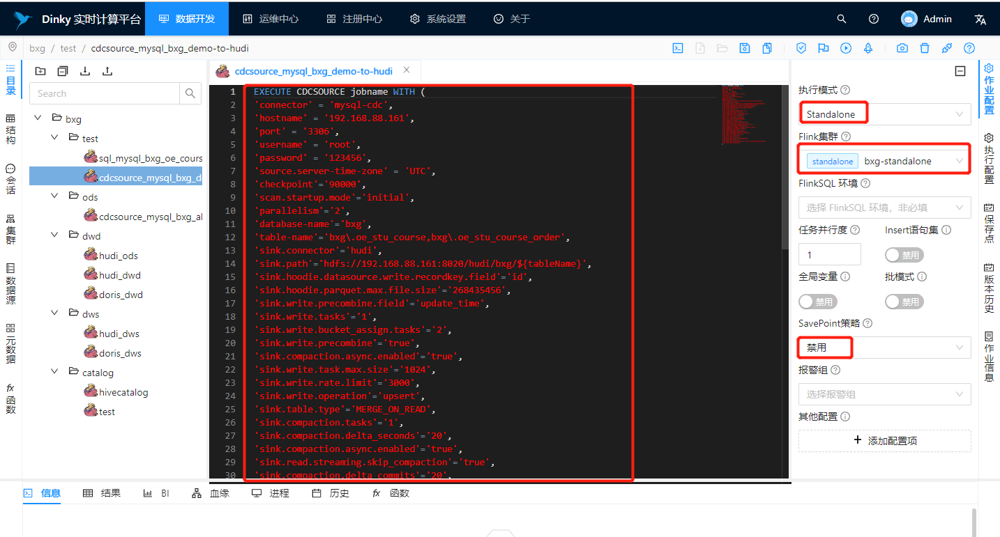

-   参数解释：

```sql
EXECUTE CDCSOURCE jobname WITH (
'connector' = 'mysql-cdc',   -- 指定要使用的连接器
'hostname' = '192.168.88.161',  -- 数据库服务器的ip地址
'port' = '3306',  -- 数据库服务器的端口号
'username' = 'root',  -- 数据库用户名
'password' = '123456',  -- 数据库密码
'source.server-time-zone' = 'UTC',   -- 时区
'checkpoint'='90000',  -- 单位 ms
'scan.startup.mode'='initial',  -- flinkcdc启动模式
'parallelism'='2',  -- 并行度
'database-name'='bxg',  -- 数据库名
'table-name'='bxg\.oe_stu_course,bxg\.oe_stu_course_order',  -- 表名
'sink.connector'='hudi',  -- 下沉到hudi
'sink.path'='hdfs://192.168.88.161:8020/hudi/bxg/${tableName}',  -- 下沉的路径
'sink.hoodie.datasource.write.recordkey.field'='id',  -- recordkey为id
'sink.hoodie.parquet.max.file.size'='268435456',  -- parquet文件最大大小
'sink.write.precombine.field'='update_time',  -- 合并的字段
'sink.write.tasks'='1',  -- 写任务的并行度
'sink.write.bucket_assign.tasks'='2',  -- bucket分配任务的并行度
'sink.write.precombine'='true',  -- 开启插入前删除重复项
'sink.compaction.async.enabled'='true', -- 开启压缩
'sink.write.task.max.size'='1024',  -- 写任务的最大大小
'sink.write.rate.limit'='3000',  
'sink.write.operation'='upsert', -- 是否为写操作执行 upsert、insert 或 bulkinsert。
'sink.table.type'='MERGE_ON_READ',  -- 表类型
'sink.compaction.tasks'='1', -- 实际压缩任务的并行度
'sink.compaction.delta_seconds'='20',  -- 触发压缩所需的最大增量秒时间
'sink.compaction.async.enabled'='true',
'sink.read.streaming.skip_compaction'='true',  -- 是否跳过压缩瞬间进行流式读取
'sink.compaction.delta_commits'='20',  -- 触发压缩所需的最大增量提交
'sink.compaction.trigger.strategy'='num_or_time',
'sink.compaction.max_memory'='500',  -- 用于压缩可溢出映射的最大内存（MB）
'sink.changelog.enabled'='true',  -- 是否保留所有中间更改
'sink.read.streaming.enabled'='true',  -- 开启流读
'sink.read.streaming.check.interval'='3',  -- 流读检查的时间间隔
'sink.hive_sync.enable'='true',  -- 将hive元异步同步到hms
'sink.hive_sync.mode'='hms',  -- hive操作选择的模式
'sink.hive_sync.db'='bxg',  -- 注册到hive的数据库名
'sink.hive_sync.table'='${tableName}', -- 注册到hive的表名
'sink.table.prefix'='ods_',  -- 表添加前缀
'sink.hive_sync.metastore.uris'='thrift://192.168.88.161:9083',  -- 用于hive同步的uris 
'sink.hive_sync.username'=''   -- hive同步的用户名
);
```


-   保存配置，点击执行将任务提交到集群。

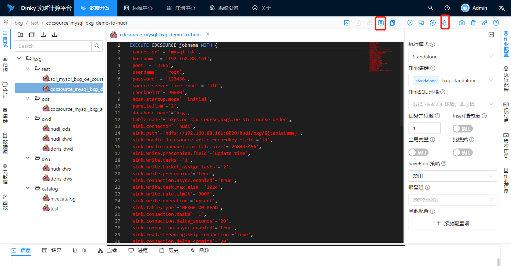

#### 查看任务

-   可以在运维中心看到正在运行的任务

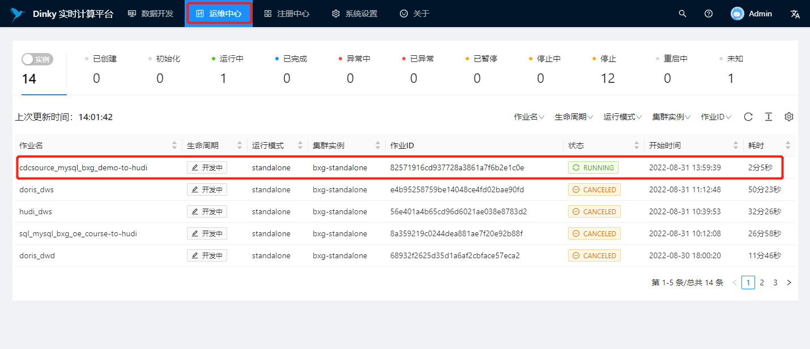

-   点进去，可以看到详细信息，如下图

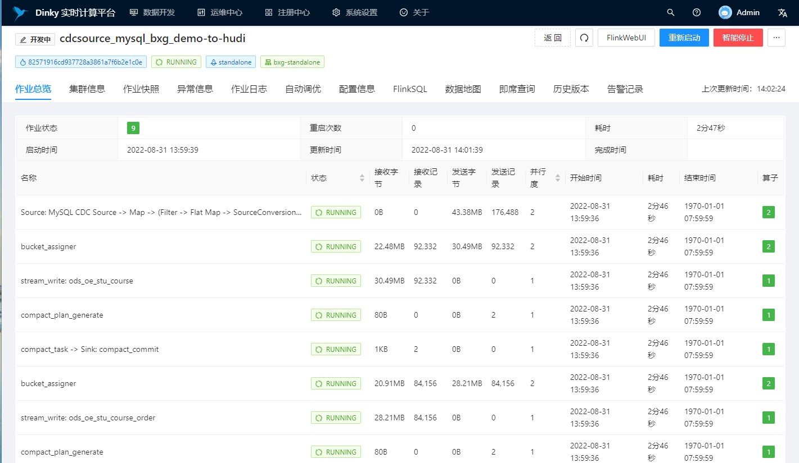

-   也可以在flink 8081界面看到正在运行的任务：*http://192.168.88.161:8081/\#/overview*

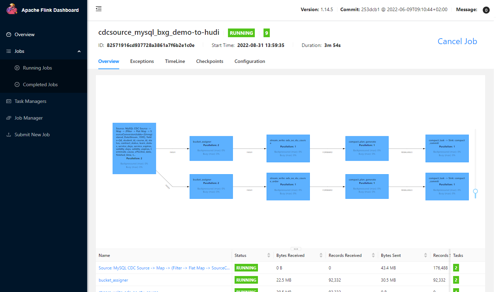

#### 查看结果

-   查看hdfs的对应目录,发现生成与表名对应的文件夹，文件夹下已有相关文件数据:

地址：*http://192.168.88.161:9870/explorer.html\#/hudi/bxg*

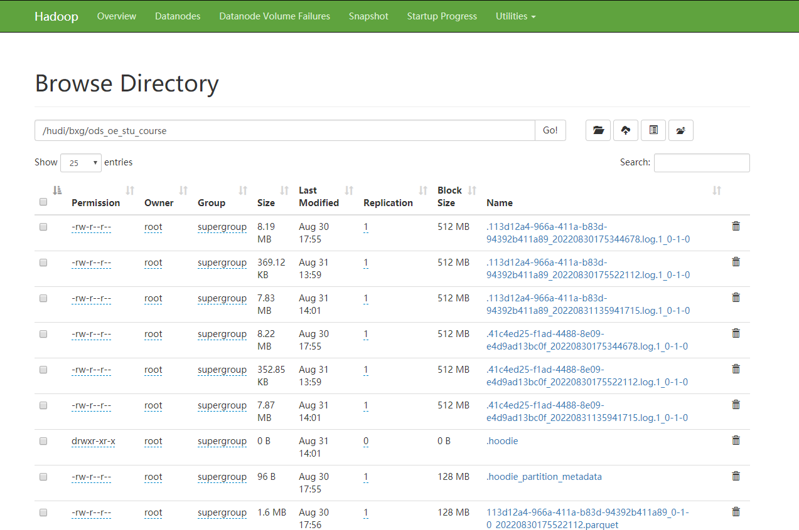

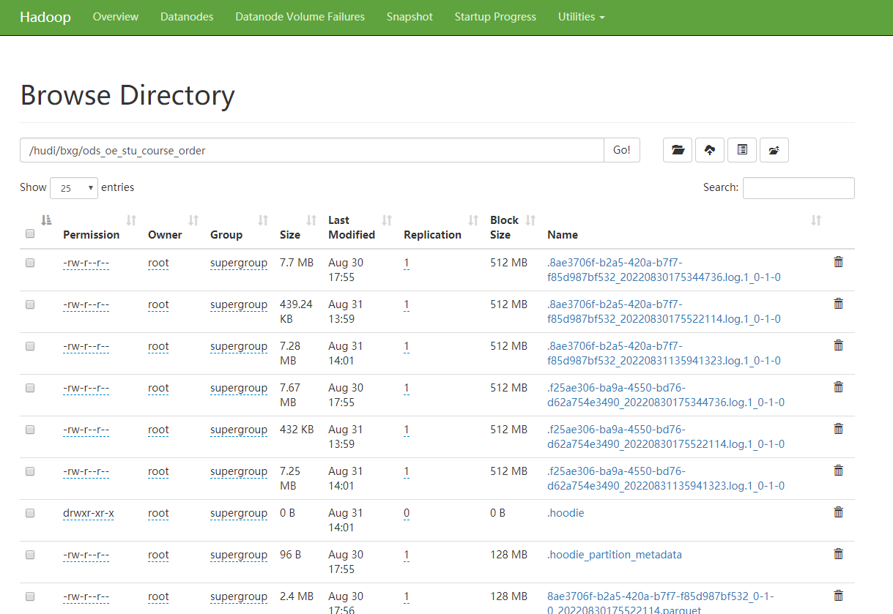

-   查看hive的bxg数据库

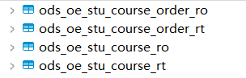

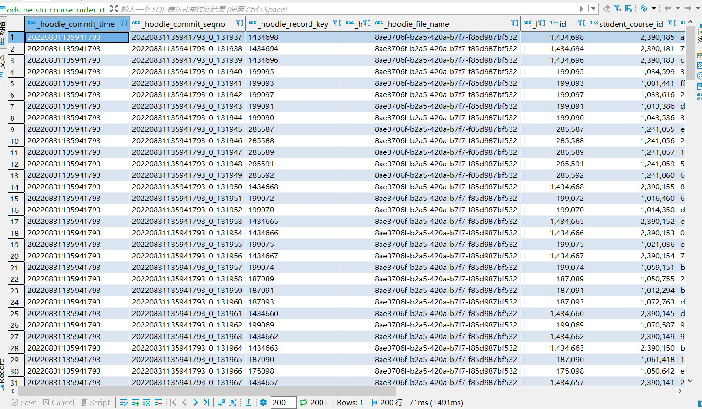

#### 停止任务

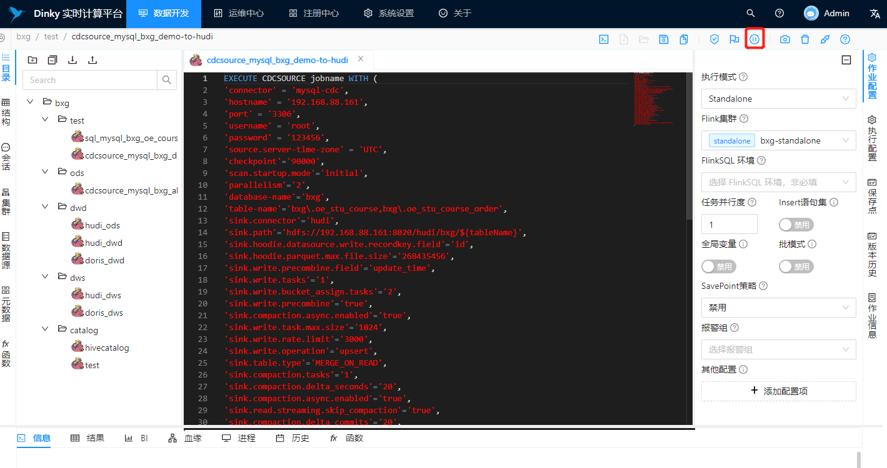

线上部署
--------

### 知识点16：【实现】准备工作

#### 清空数据

-   将hdfs上的/hudi/bxg下的文件夹全部删除，也可以直接将bxg文件夹删除。

-   将hive中的bxg数据库删除。

#### 创建目录

-   在bxg目录下,分别创建ods、dwd、dws、catalog目录

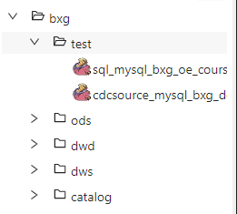

#### 创建hivecatalog

-   Hive Catalog的主要作用是使用Hive MetaStore去管理Flink的元数据。Hive Catalog可以将元数据进行持久化，这样后续的操作就可以反复使用这些表的元数据，而不用每次使用时都要重新注册。如果不去持久化catalog，那么在每个session中取处理数据，都要去重复地创建元数据对象。

-   在catalog目录下，创建hivecatalog作业。注意作业类型选 FlinkSqlEnv。（FlinkSqlEnv支持将 FlinkSQL 封装为执行环境，供 FlinkSQL
    任务使用。在执行 FlinkSQL 时，会先执行 FlinkSqlEnv 内的语句）

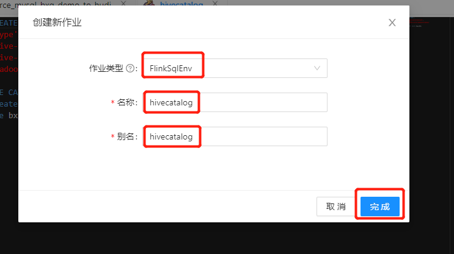

```sql
CREATE CATALOG myhive WITH (
'type'='hive',
'hive-conf-dir'='/export/server/hive/conf',
'hive-version'='3.1.2',
'hadoop-conf-dir'='/export/server/hadoop/etc/hadoop/'
);
USE CATALOG myhive;
create database if NOT  exists bxg_meta;
use bxg_meta;
```


-   写入代码，点击启用后，保存当前配置。（使用hive的myhive catalog，flink中表的元数据存放在hive的bxg\_meta数据库）

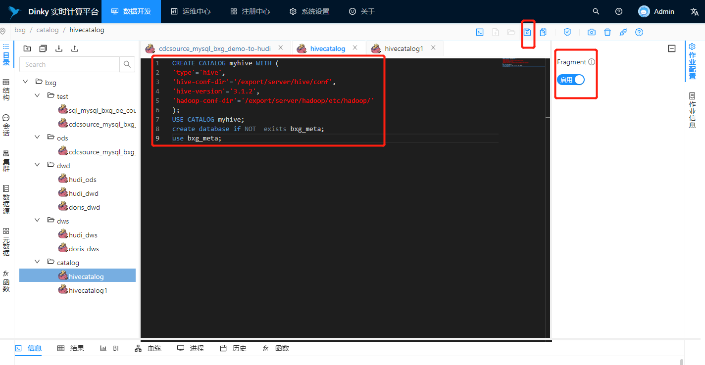

### 知识点17：【实现】ODS层

本层采用CDCSOURCE，一个任务部署ods层的所有表。

#### cdcsource\_mysql\_bxg\_all-to-hudi\_ods 作业

##### 创建作业

-   创建 cdcsource\_mysql\_bxg\_all-to-hudi\_ods 作业，代码和配置如下（注意FlinkSQL环境选择hivecatalog）：

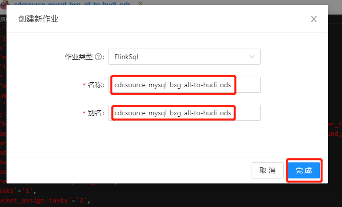

```sql
EXECUTE CDCSOURCE jobname WITH (
'connector' = 'mysql-cdc',
'hostname' = '192.168.88.161',
'port' = '3306',
'username' = 'root',
'password' = '123456',
'source.server-time-zone' = 'UTC',
'checkpoint'='90000',
'scan.startup.mode'='initial',
'parallelism'='2',
'database-name'='bxg',
'table-name'='bxg\.oe_course,bxg\.oe_stu_course,bxg\.oe_stu_course_order,bxg\.oe_order,bxg\.oe_order_transfer_apply,
bxg\.oe_user,bxg\.oe_programming_course,bxg\.oe_stu_programming_learning_history,bxg\.oe_order_refund,bxg\.oe_order_refund_apply',
'sink.connector'='hudi',
'sink.path'='hdfs://192.168.88.161:8020/hudi/bxg/${tableName}',
'sink.hoodie.datasource.write.recordkey.field'='id',
'sink.hoodie.parquet.max.file.size'='268435456',
'sink.write.precombine.field'='update_time',
'sink.write.tasks'='1',
'sink.write.bucket_assign.tasks'='2',
'sink.write.precombine'='true',
'sink.compaction.async.enabled'='true',
'sink.write.task.max.size'='1024',
'sink.write.rate.limit'='3000',
'sink.write.operation'='upsert',
'sink.table.type'='MERGE_ON_READ',
'sink.compaction.tasks'='1',
'sink.compaction.delta_seconds'='20',
'sink.compaction.async.enabled'='true',
'sink.read.streaming.skip_compaction'='true',
'sink.compaction.delta_commits'='20',
'sink.compaction.trigger.strategy'='num_or_time',
'sink.compaction.max_memory'='500',
'sink.changelog.enabled'='true',
'sink.read.streaming.enabled'='true',
'sink.read.streaming.check.interval'='3',
'sink.hive_sync.enable'='true',
'sink.hive_sync.mode'='hms',
'sink.hive_sync.db'='bxg',
'sink.hive_sync.table'='${tableName}',
'sink.table.prefix'='ods_',
'sink.hive_sync.metastore.uris'='thrift://192.168.88.161:9083',
'sink.hive_sync.username'=''
)
```


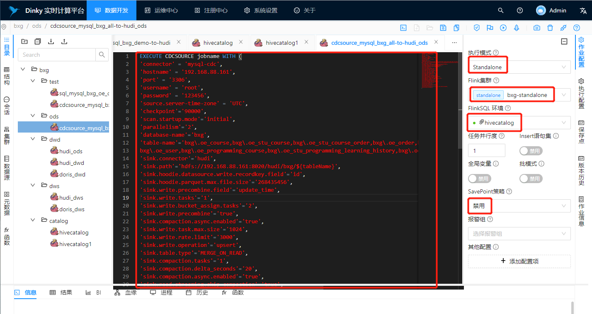

-   保存配置，提交任务。

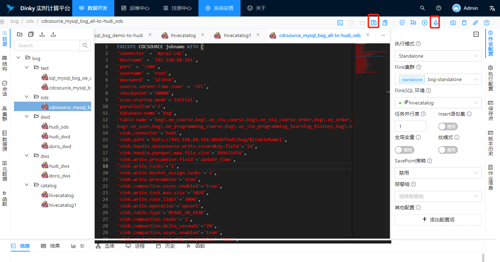

##### 查看任务

-   在运维中心查看任务:

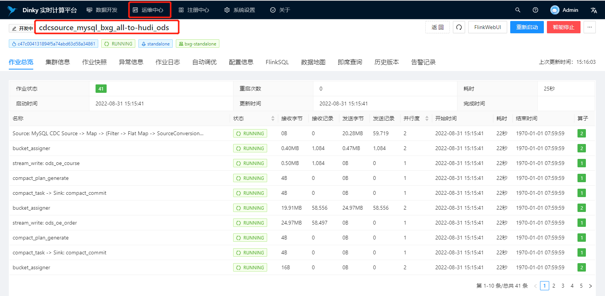

-   在flink web界面查看任务：

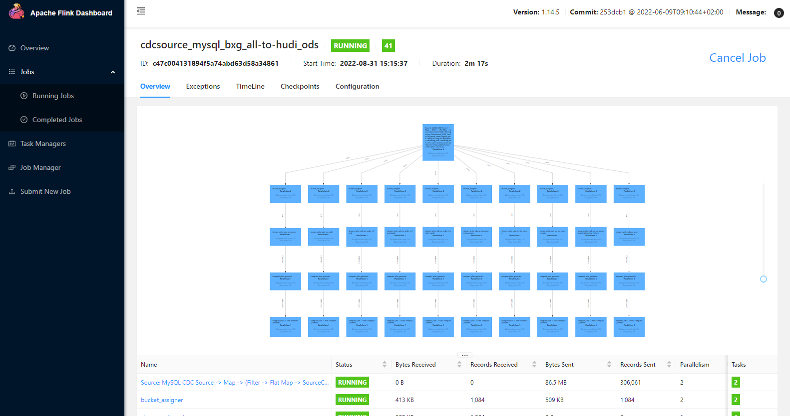

##### 查看结果

-   hdfs的/hudi/bxg下，已经生成ods的10张表：

<http://192.168.88.161:9870/explorer.html#/hudi/bxg>

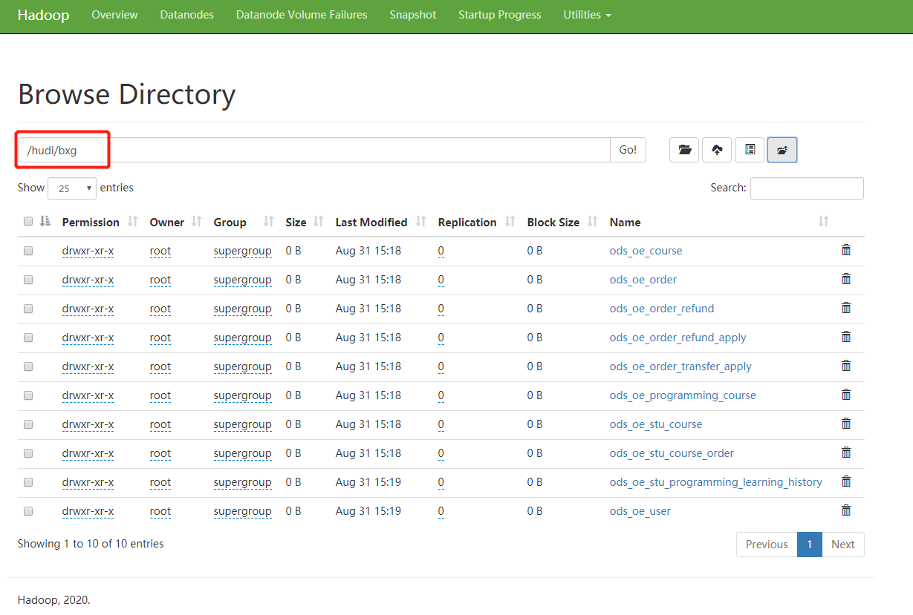

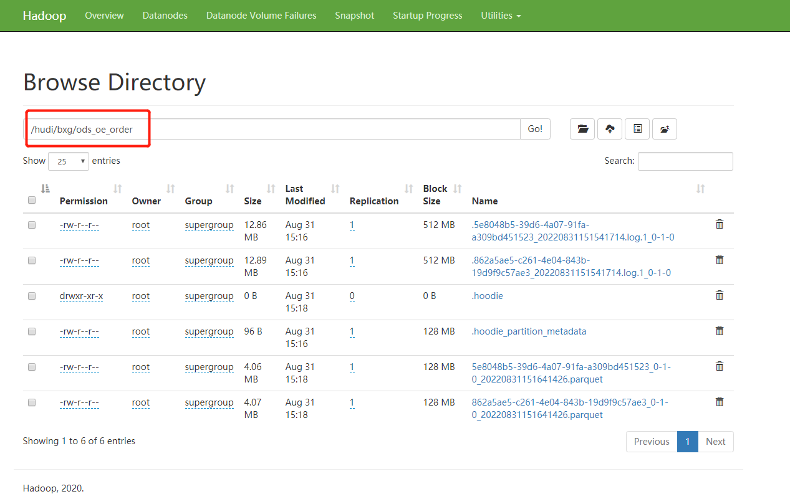

-   查看hive的bxg数据库，生成对应的20张表：

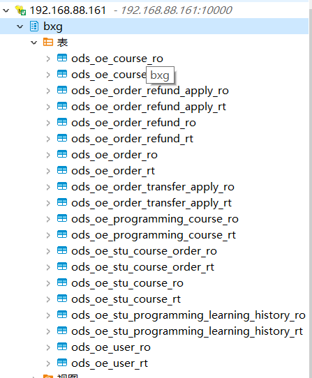

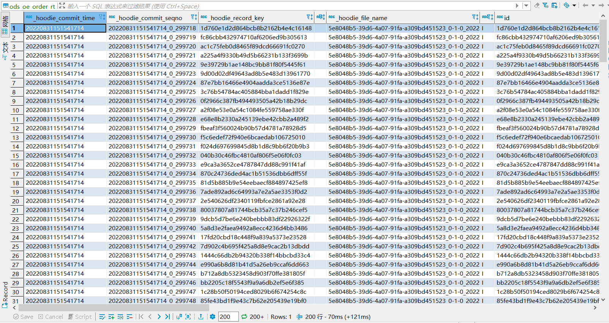

-   查看hive的bxg\_meta数据库

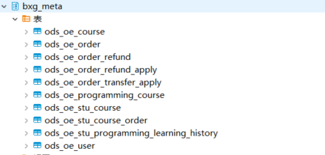

-   这些是整库同步过程创建的hudi\_ods层映射表，持久化到了bxg\_meta数据库.后续可以直接使用这些映射表,但是为了保持与看板中一致,我们后续又另外创建了以hudi开头的ods层映射表.

-   实际生产中,所有作业都是同时开启的.这里考虑到虚拟机的资源有限,后续在执行其它作业时可以将前面的作业停掉.

### 知识点18：【实现】DWD层

-   后续的部署cdcsource不再支持(因为它支持的是从业务数据库mysql通过flinkcdc到数据库或数据湖的过程),故使用flink sql语句进行部署.

#### sql\_hudi\_ods 作业

##### 创建作业

-   在dwd目录下创建sql\_hudi\_ods作业,代码和配置如下:

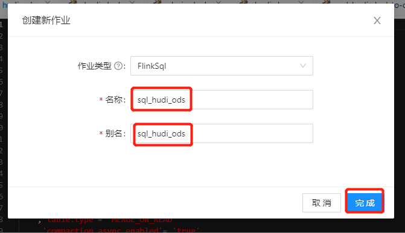

```sql
SET execution.checkpointing.interval=30sec;
CREATE TABLE if not exists hudi_bxg_ods_oe_stu_course_order (
    `id` INT,
    `student_course_id` INT,
    `order_id` STRING,
    `order_detail_id` STRING,
    `create_time` TIMESTAMP(3),
    `update_time` TIMESTAMP(3),
    `delete_flag` BOOLEAN,
   PRIMARY KEY (id) NOT ENFORCED
) WITH(
    'connector'='hudi'
    ,'path'= 'hdfs://node1:8020/hudi/bxg/ods_oe_stu_course_order'
    ,'hoodie.datasource.write.recordkey.field'= 'id' 
    ,'write.tasks'= '1'
    ,'compaction.tasks'= '1'
    ,'write.rate.limit'= '2000' 
    ,'table.type'= 'MERGE_ON_READ' 
    ,'compaction.async.enabled'= 'true' 
    ,'compaction.trigger.strategy'= 'num_commits' 
    ,'compaction.delta_commits'= '1'
    ,'changelog.enabled'= 'true' 
    ,'read.tasks' = '1'
    ,'read.streaming.enabled'= 'true' 
    ,'read.start-commit'='earliest'
    ,'read.streaming.check-interval'= '3'
    ,'hive_sync.enable'= 'true' 
    ,'hive_sync.mode'= 'hms' 
    ,'hive_sync.metastore.uris'= 'thrift://node1:9083'
    ,'hive_sync.table'= 'ods_oe_stu_course_order'
    ,'hive_sync.db'= 'bxg' 
    ,'hive_sync.username'= '' 
    ,'hive_sync.password'= '' 
    ,'hive_sync.support_timestamp'= 'true' 
);
CREATE TABLE if not exists hudi_bxg_ods_oe_stu_course (
    `id` INT,
    `student_id` STRING,
    `course_id` INT,
    `status` INT,
    `contract_status` INT,
    `learn_status` INT,
    `service_days` INT,
    `service_expires` TIMESTAMP(3),
    `validity_days` INT,
    `validity_expires` TIMESTAMP(3),
    `terminate_cause` INT,
    `effective_date` TIMESTAMP(3),
    `finished_time` TIMESTAMP(3),
    `total_progress` DECIMAL(10,2),
    `purchase_time` INT,
    `create_time` TIMESTAMP(3),
    `update_time` TIMESTAMP(3),
    `delete_flag` BOOLEAN,
   PRIMARY KEY (id) NOT ENFORCED
) WITH(
    'connector'='hudi'
    ,'path'= 'hdfs://node1:8020/hudi/bxg/ods_oe_stu_course'
    ,'hoodie.datasource.write.recordkey.field'= 'id' 
    ,'write.tasks'= '1'
    ,'compaction.tasks'= '1'
    ,'write.rate.limit'= '2000' 
    ,'table.type'= 'MERGE_ON_READ' 
    ,'compaction.async.enabled'= 'true' 
    ,'compaction.trigger.strategy'= 'num_commits' 
    ,'compaction.delta_commits'= '1'
    ,'changelog.enabled'= 'true' 
    ,'read.tasks' = '1'
    ,'read.streaming.enabled'= 'true' 
    ,'read.start-commit'='earliest'
    ,'read.streaming.check-interval'= '3'
    ,'hive_sync.enable'= 'true' 
    ,'hive_sync.mode'= 'hms' 
    ,'hive_sync.metastore.uris'= 'thrift://node1:9083'
    ,'hive_sync.table'= 'ods_oe_stu_course'
    ,'hive_sync.db'= 'bxg' 
    ,'hive_sync.username'= '' 
    ,'hive_sync.password'= '' 
    ,'hive_sync.support_timestamp'= 'true' 
);
CREATE TABLE if not exists hudi_bxg_ods_oe_order (
    `id` STRING,
    `channel` STRING,
    `student_id` STRING,
    `order_no` STRING,
    `total_amount` DECIMAL(10,2),
    `discount_amount` DECIMAL(10,2),
    `charge_against_amount` DECIMAL(10,2),
    `payable_amount` DECIMAL(10,2),
    `status` INT,
    `pay_status` INT,
    `pay_time` TIMESTAMP(3),
    `paid_amount` DECIMAL(10,2),
    `effective_date` TIMESTAMP(3),
    `terminal` INT,
    `refund_status` INT,
    `refund_amount` DECIMAL(10,2),
    `refund_time` TIMESTAMP(3),
    `create_time` TIMESTAMP(3),
    `update_time` TIMESTAMP(3),
    `delete_flag` BOOLEAN,
   PRIMARY KEY (id) NOT ENFORCED
)WITH(
    'connector'='hudi'
    ,'path'= 'hdfs://node1:8020/hudi/bxg/ods_oe_order'
    ,'hoodie.datasource.write.recordkey.field'= 'id' 
    ,'write.tasks'= '1'
    ,'compaction.tasks'= '1'
    ,'write.rate.limit'= '2000' 
    ,'table.type'= 'MERGE_ON_READ' 
    ,'compaction.async.enabled'= 'true' 
    ,'compaction.trigger.strategy'= 'num_commits' 
    ,'compaction.delta_commits'= '1'
    ,'changelog.enabled'= 'true' 
    ,'read.tasks' = '1'
    ,'read.streaming.enabled'= 'true' 
    ,'read.start-commit'='earliest'
    ,'read.streaming.check-interval'= '3'
    ,'hive_sync.enable'= 'true' 
    ,'hive_sync.mode'= 'hms' 
    ,'hive_sync.metastore.uris'= 'thrift://node1:9083'
    ,'hive_sync.table'= 'ods_oe_order'
    ,'hive_sync.db'= 'bxg' 
    ,'hive_sync.username'= '' 
    ,'hive_sync.password'= '' 
    ,'hive_sync.support_timestamp'= 'true' 
);
CREATE TABLE if not exists hudi_bxg_ods_oe_course(
    `id` INT,
    `grade_name` STRING,
    `bigimg_path` STRING,
    `video_url` STRING,
    `img_alt` STRING,
    `description` STRING,
    `detailimg_path` STRING,
    `smallimg_path` STRING,
    `sort` INT,
    `status` STRING,
    `learnd_count` INT,
    `learnd_count_flag` INT,
    `original_cost` DECIMAL(10,2),
    `current_price` DECIMAL(10,2),
    `course_length` DECIMAL(10,2),
    `menu_id` INT,
    `is_free` BOOLEAN,
    `course_detail` STRING,
    `course_detail_mobile` STRING,
    `course_detail1` STRING,
    `course_detail1_mobile` STRING,
    `course_plan_detail` STRING,
    `course_plan_detail_mobile` STRING,
    `course_detail2` STRING,
    `course_detail2_mobile` STRING,
    `course_outline` STRING,
    `common_problem` STRING,
    `common_problem_mobile` STRING,
    `lecturer_id` INT,
    `is_recommend` INT,
    `recommend_sort` INT,
    `qqno` STRING,
    `description_show` INT,
    `rec_img_path` STRING,
    `pv` INT,
    `course_type` INT,
    `default_student_count` INT,
    `study_status` INT,
    `online_course` INT,
    `course_level` INT,
    `content_type` INT,
    `recommend_type` INT,
    `employment_rate` STRING,
    `employment_salary` STRING,
    `score` STRING,
    `cover_url` STRING,
    `offline_course_url` STRING,
    `outline_url` STRING,
    `project_page_url` STRING,
    `preschool_test_flag` BOOLEAN,
    `service_period` INT,
    `included_validity_period` INT,
    `validity_period` INT,
    `qualified_jobs` STRING,
    `work_year_min` INT,
    `work_year_max` INT,
    `promote_flag` BOOLEAN,
    `create_person` STRING,
    `update_person` STRING,
    `create_time` TIMESTAMP(3),
    `update_time` TIMESTAMP(3),
    `is_delete` BOOLEAN,
   PRIMARY KEY (id) NOT ENFORCED
) WITH(
    'connector'='hudi'
    ,'path'= 'hdfs://node1:8020/hudi/bxg/ods_oe_course'
    ,'hoodie.datasource.write.recordkey.field'= 'id' 
    ,'write.tasks'= '1'
    ,'compaction.tasks'= '1'
    ,'write.rate.limit'= '2000' 
    ,'table.type'= 'MERGE_ON_READ' 
    ,'compaction.async.enabled'= 'true' 
    ,'compaction.trigger.strategy'= 'num_commits' 
    ,'compaction.delta_commits'= '1'
    ,'changelog.enabled'= 'true' 
    ,'read.tasks' = '1'
,'read.streaming.enabled'= 'true'
    ,'read.start-commit'='earliest' 
    ,'read.streaming.check-interval'= '3'
    ,'hive_sync.enable'= 'true' 
    ,'hive_sync.mode'= 'hms' 
    ,'hive_sync.metastore.uris'= 'thrift://node1:9083'
    ,'hive_sync.table'= 'ods_oe_course'
    ,'hive_sync.db'= 'bxg' 
    ,'hive_sync.username'= '' 
    ,'hive_sync.password'= '' 
    ,'hive_sync.support_timestamp'= 'true' 
);
CREATE TABLE IF NOT EXISTS `hudi_bxg_ods_oe_order_transfer_apply` (
   `id` INT,
  `order_id` STRING,
  `order_detail_id` STRING,
  `deposit_id` STRING,
  `cash_back_record_id` INT,
  `student_id` STRING,
  `course_id` INT,
  `stu_course_id` INT,
  `order_refund_id` INT,
  `original_stu_course_status` INT,
  `original_order_refund_status` INT,
  `biz_type` INT,
  `oa_affair_id` STRING,
  `oa_summary_id` STRING,
  `oa_template_code` STRING,
  `oa_template_id` STRING,
  `oa_bill_no` STRING,
  `fee_transfer_type` INT,
  `amount` DECIMAL(10,2),
  `status` INT,
  `order_type` INT,
  `target_order_id` STRING,
  `target_order_detail_id` STRING,
  `target_import_order_id` INT,
  `target_order_type` INT,
  `creator` STRING,
  `creator_name` STRING,
  `create_time` TIMESTAMP(3),
  `update_time` TIMESTAMP(3),
  `delete_flag` BOOLEAN, 
  PRIMARY KEY ( `id` ) NOT ENFORCED
) WITH(
     'connector'='hudi'
    ,'path'= 'hdfs://node1:8020/hudi/bxg/ods_oe_order_transfer_apply'
    ,'hoodie.datasource.write.recordkey.field'= 'id' 
    ,'write.tasks'= '1'
    ,'compaction.tasks'= '1'
    ,'write.rate.limit'= '2000' 
    ,'table.type'= 'MERGE_ON_READ' 
    ,'compaction.async.enabled'= 'true' 
    ,'compaction.trigger.strategy'= 'num_commits' 
    ,'compaction.delta_commits'= '1'
    ,'changelog.enabled'= 'true' 
    ,'read.tasks' = '1'
    ,'read.streaming.enabled'= 'true' 
    ,'read.start-commit'='earliest'
    ,'read.streaming.check-interval'= '3'
    ,'hive_sync.enable'= 'true' 
    ,'hive_sync.mode'= 'hms' 
    ,'hive_sync.metastore.uris'= 'thrift://node1:9083'
    ,'hive_sync.table'= 'ods_oe_order_transfer_apply'
    ,'hive_sync.db'= 'bxg' 
    ,'hive_sync.username'= '' 
    ,'hive_sync.password'= '' 
    ,'hive_sync.support_timestamp'= 'true' 
);
CREATE TABLE if not exists hudi_bxg_ods_oe_user (
     `id` STRING,
     `itcast_uuid` INT NULL,
     `name` STRING NULL,
     `sex` INT NULL,
     `mobile` STRING NULL,
     `email` STRING NULL,
     `qq` STRING NULL,
     `small_head_photo` STRING NULL,
     `big_head_photo` STRING NULL,
     `status` INT NULL,
     `info` STRING NULL,
     `jobyears` INT NULL,
     `occupation` INT NULL,
     `region_id` STRING NULL,
     `region_area_id` STRING NULL,
     `region_city_id` STRING NULL,
     `region_county_id` STRING NULL,
     `occupation_other` STRING NULL,
     `target` STRING NULL,
     `is_apply` BOOLEAN NULL,
     `full_address` STRING NULL,
     `menu_id` INT NULL,
     `user_type` INT NULL,
     `parent_id` STRING NULL,
     `share_code` STRING NULL,
     `origin` STRING NULL,
     `type` INT NULL,
     `remark` STRING NULL,
     `school_id` STRING NULL,
     `birthday` TIMESTAMP(3) NULL,
     `education_id` STRING NULL,
     `major_id` STRING NULL,
     `is_old_user` INT NULL,
     `old_user_subject_id` STRING NULL,
     `old_user_class_name` STRING NULL,
     `create_person` STRING NULL,
     `create_time` TIMESTAMP(3) NULL,
     `update_time` TIMESTAMP(3) NULL,
     `is_delete` BOOLEAN NULL,
   PRIMARY KEY (id) NOT ENFORCED
)WITH(
    'connector'='hudi'
    ,'path'= 'hdfs://192.168.88.161:8020/hudi/bxg/ods_oe_user'
    ,'hoodie.datasource.write.recordkey.field'= 'id'  
    ,'write.tasks'= '1'
    ,'compaction.tasks'= '1'
    ,'write.rate.limit'= '2000' 
    ,'table.type'= 'MERGE_ON_READ' 
    ,'compaction.async.enabled'= 'true' 
    ,'compaction.trigger.strategy'= 'num_commits' 
    ,'compaction.delta_commits'= '1'
    ,'changelog.enabled'= 'true' 
    ,'read.tasks' = '1'
    ,'read.streaming.enabled'= 'true'
    ,'read.start-commit'='earliest'  
    ,'read.streaming.check-interval'= '3'
    ,'hive_sync.enable'= 'true' 
    ,'hive_sync.mode'= 'hms' 
    ,'hive_sync.metastore.uris'= 'thrift://192.168.88.161:9083'
    ,'hive_sync.table'= 'ods_oe_user'
    ,'hive_sync.db'= 'bxg' 
    ,'hive_sync.username'= '' 
    ,'hive_sync.password'= '' 
    ,'hive_sync.support_timestamp'= 'true' 
);
CREATE TABLE if not exists hudi_bxg_ods_oe_programming_course (
    `id` INT,
    `menu_id` INT,
    `group_id` INT,
    `belonger_id` STRING,
    `learning_gains` STRING,
    `content_status` INT,
    `pack_status` INT,
    `source` INT,
    `type` INT,
    `difficulty_level` INT,
    `unlock_flag` BOOLEAN,
    `detail_flag` BOOLEAN,
    `submitter` STRING,
    `submit_time` TIMESTAMP(3),
    `auditor` STRING,
    `audit_time` TIMESTAMP(3) ,
    `first_putaway_time` TIMESTAMP(3),
    `creator` STRING,
    `create_time` TIMESTAMP(3),
    `operator` STRING,
    `update_time` TIMESTAMP(3) ,
    `is_deleted` BOOLEAN,
   PRIMARY KEY (id) NOT ENFORCED
) WITH(
    'connector'='hudi'
    ,'path'= 'hdfs://192.168.88.161:8020/hudi/bxg/ods_oe_programming_course '
    ,'hoodie.datasource.write.recordkey.field'= 'id'  
    ,'write.tasks'= '1'
    ,'compaction.tasks'= '1'
    ,'write.rate.limit'= '2000' 
    ,'table.type'= 'MERGE_ON_READ' 
    ,'compaction.async.enabled'= 'true' 
    ,'compaction.trigger.strategy'= 'num_commits' 
    ,'compaction.delta_commits'= '1'
    ,'changelog.enabled'= 'true' 
    ,'read.tasks' = '1'
    ,'read.streaming.enabled'= 'true' 
    ,'read.start-commit'='earliest'
    ,'read.streaming.check-interval'= '3'
    ,'hive_sync.enable'= 'true' 
    ,'hive_sync.mode'= 'hms' 
    ,'hive_sync.metastore.uris'= 'thrift://192.168.88.161:9083'
    ,'hive_sync.table'= 'ods_oe_programming_course'
    ,'hive_sync.db'= 'bxg' 
    ,'hive_sync.username'= '' 
    ,'hive_sync.password'= '' 
    ,'hive_sync.support_timestamp'= 'true' 
);
CREATE TABLE if not exists hudi_bxg_ods_oe_stu_programming_learning_history (
    `id` INT,
    `stu_course_id` INT,
    `student_id` STRING,
    `course_id` INT,
    `chapter_id` INT,
    `barrier_id` INT,
    `location` STRING,
    `learn_time` TIMESTAMP(3),
    `update_time` TIMESTAMP(3),
   PRIMARY KEY (id) NOT ENFORCED
) WITH(
    'connector'='hudi'
    ,'path'= 'hdfs://192.168.88.161:8020/hudi/bxg/ods_oe_stu_programming_learning_history'
    ,'hoodie.datasource.write.recordkey.field'= 'id' 
    ,'write.tasks'= '1'
    ,'compaction.tasks'= '1'
    ,'write.rate.limit'= '2000' 
    ,'table.type'= 'MERGE_ON_READ' 
    ,'compaction.async.enabled'= 'true' 
    ,'compaction.trigger.strategy'= 'num_commits' 
    ,'compaction.delta_commits'= '1'
    ,'changelog.enabled'= 'true' 
    ,'read.tasks' = '1'
    ,'read.streaming.enabled'= 'true' 
    ,'read.start-commit'='earliest'
    ,'read.streaming.check-interval'= '3'
    ,'hive_sync.enable'= 'true' 
    ,'hive_sync.mode'= 'hms' 
    ,'hive_sync.metastore.uris'= 'thrift://192.168.88.161:9083'
    ,'hive_sync.table'= 'ods_oe_stu_programming_learning_history'
    ,'hive_sync.db'= 'bxg' 
    ,'hive_sync.username'= '' 
    ,'hive_sync.password'= '' 
    ,'hive_sync.support_timestamp'= 'true' 
);
CREATE TABLE IF NOT EXISTS `hudi_bxg_ods_oe_order_refund` (
    `id` INT,
    `order_id` STRING,
    `order_detail_id` STRING,
    `oa_bill_no` STRING ,
    `refund_type` INT,
    `amount` DECIMAL(10,2),
    `refund_bank_account` STRING,
    `refund_operator` STRING,
    `refund_time` TIMESTAMP(3) ,
    `reason` STRING,
    `create_time` TIMESTAMP(3) ,
    `update_time` TIMESTAMP(3) ,
    `delete_flag` BOOLEAN,
PRIMARY KEY ( `id` ) NOT ENFORCED
) WITH(
    'connector'='hudi'
    ,'path'= 'hdfs://node1:8020/hudi/bxg/ods_oe_order_refund'
    ,'hoodie.datasource.write.recordkey.field'= 'id' 
    ,'write.tasks'= '1'
    ,'compaction.tasks'= '1'
    ,'write.rate.limit'= '2000' 
    ,'table.type'= 'MERGE_ON_READ' 
    ,'compaction.async.enabled'= 'true' 
    ,'compaction.trigger.strategy'= 'num_commits' 
    ,'compaction.delta_commits'= '1'
    ,'changelog.enabled'= 'true' 
    ,'read.tasks' = '1'
    ,'read.streaming.enabled'= 'true' 
    ,'read.start-commit'='earliest'
    ,'read.streaming.check-interval'= '3'
    ,'hive_sync.enable'= 'true' 
    ,'hive_sync.mode'= 'hms' 
    ,'hive_sync.metastore.uris'= 'thrift://node1:9083'
    ,'hive_sync.table'= 'ods_oe_order_refund'
    ,'hive_sync.db'= 'bxg' 
    ,'hive_sync.username'= '' 
    ,'hive_sync.password'= '' 
    ,'hive_sync.support_timestamp'= 'true' 
);
CREATE TABLE IF NOT EXISTS `hudi_bxg_ods_oe_order_refund_apply` (
    `id` INT,
   `student_id` STRING,
   `order_id` STRING,
   `order_detail_id` STRING,
   `oe_deposit_id` STRING,
   `cash_back_record_id` INT,
   `course_id` INT,
   `stu_course_id` INT,
   `original_stu_course_status` INT,
   `original_order_refund_status` INT,
   `order_refund_id` INT,
   `oa_affair_id` STRING,
   `oa_summary_id` STRING,
   `oa_template_code` STRING,
    `oa_template_id` STRING,
    `refund_amount` DECIMAL(10,2) ,
    `refund_type` INT,
    `order_refund_type` INT,
    `status` INT,
    `creator` STRING,
    `creator_name` STRING,
    `create_time` TIMESTAMP(3) ,
    `update_time` TIMESTAMP(3),
    `delete_flag` BOOLEAN ,
     PRIMARY KEY ( `id` ) NOT ENFORCED
) WITH(
    'connector'='hudi'
    ,'path'= 'hdfs://node1:8020/hudi/bxg/ods_oe_order_refund_apply'
    ,'hoodie.datasource.write.recordkey.field'= 'id' 
    ,'write.tasks'= '1'
    ,'compaction.tasks'= '1'
    ,'write.rate.limit'= '2000' 
    ,'table.type'= 'MERGE_ON_READ' 
    ,'compaction.async.enabled'= 'true' 
    ,'compaction.trigger.strategy'= 'num_commits' 
    ,'compaction.delta_commits'= '1'
    ,'changelog.enabled'= 'true' 
    ,'read.tasks' = '1'
    ,'read.streaming.enabled'= 'true' 
    ,'read.start-commit'='earliest'
    ,'read.streaming.check-interval'= '3'
    ,'hive_sync.enable'= 'true' 
    ,'hive_sync.mode'= 'hms' 
    ,'hive_sync.metastore.uris'= 'thrift://node1:9083'
    ,'hive_sync.table'= 'ods_oe_order_refund_apply'
    ,'hive_sync.db'= 'bxg' 
    ,'hive_sync.username'= '' 
    ,'hive_sync.password'= '' 
    ,'hive_sync.support_timestamp'= 'true' 
);
```


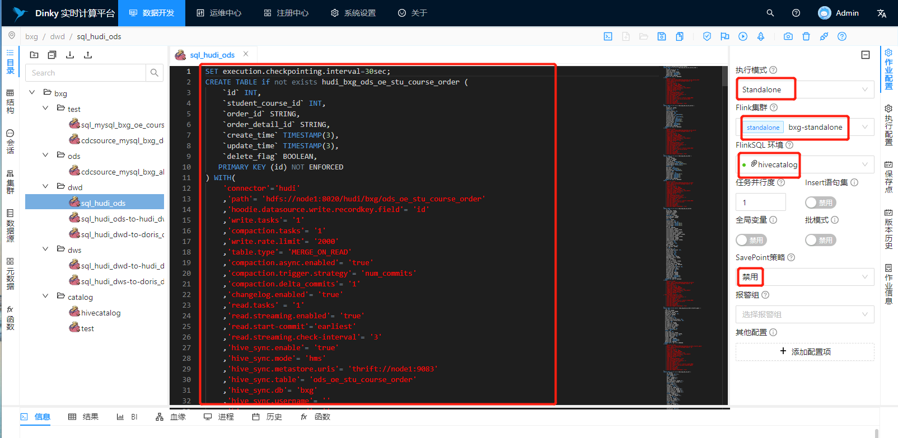

-   保存配置,提交任务.
    (注意:本作业中只有建表语句,没有insert语句,因此不会在flink创建任务.这里保存配置之后,点击执行sql即可)

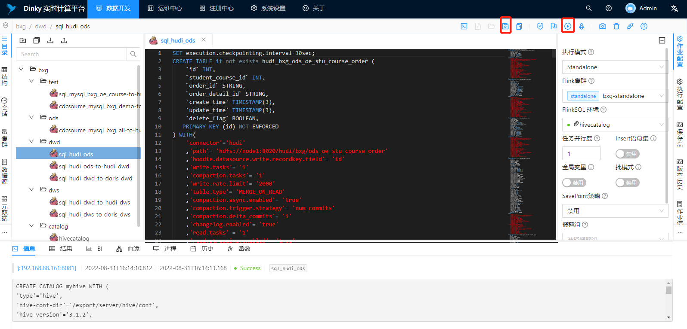

##### 查看结果

-   hivecatalog将hudi\_ods的映射表持久化,可以在hive的bxg\_meta数据库看到元数据:

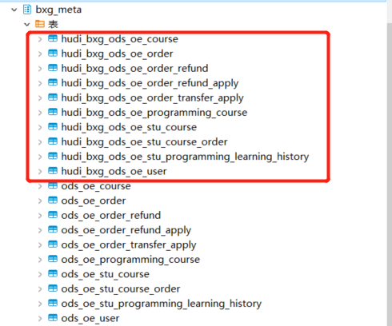

-   因为是元数据,所以这里无法查看数据.可以在dinky的作业中使用catalog后通过select查看.

#### sql\_hudi\_ods-to-hudi\_dwd 作业

##### 创建作业

-   在dwd目录下创建sql\_hudi\_ods-to-hudi\_dwd作业,代码和配置如下:

(**注意:作业配置中要开启insert语句集,作用是将作业中的多个insert语句合成一个jobgraph再进行提交.如果不开启,则只会执行第一个insert语句**)

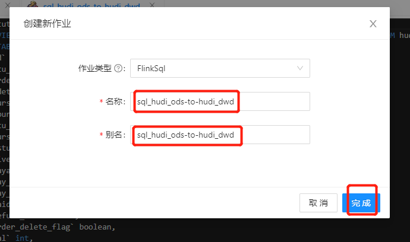

```sql
SET execution.checkpointing.interval=30sec;
CREATE VIEW IF NOT EXISTS bxg_common_change_classes_v AS SELECT distinct(target_order_id) FROM hudi_bxg_ods_oe_order_transfer_apply t  WHERE t.biz_type = 1 AND t.status = 0 AND t.fee_transfer_type=0 AND t.delete_flag = false;
CREATE TABLE if not exists hudi_dwd_oe_stu_course_order (
     `id` int,
     `stu_course_id` int,
     `order_id` string,
`order_detail_id`  string,
`stu_course_order_delete_flag` boolean,
     `course_id` int,
     `stu_course_status` int,
`stu_course_status_des` string,
      `stu_course_delete_flag` BOOLEAN,
`effective_date` TIMESTAMP(3),
     `payable_amount` decimal(10,2),
     `pay_status` int,
     `pay_time` TIMESTAMP(3),
     `paid_amount` decimal(10,2),
     `refund_status` int,
     `order_delete_flag` boolean,
`terminal` int,
`charge_against_amount` DECIMAL(10,2),
`oc_id` int,
     `grade_name` string,
`course_type` INT,
     `is_complete_order` boolean,
`is_target_order` boolean,
 PRIMARY KEY (`id`) NOT ENFORCED
) WITH(
    'connector'='hudi'
    ,'path'= 'hdfs://node1:8020/hudi/bxg/dwd_oe_stu_course_order'
    ,'hoodie.datasource.write.recordkey.field'= 'id' 
    ,'write.tasks'= '1'
    ,'compaction.tasks'= '1'
    ,'write.rate.limit'= '2000' 
    ,'table.type'= 'MERGE_ON_READ' 
    ,'compaction.async.enabled'= 'true' 
    ,'compaction.trigger.strategy'= 'num_commits' 
    ,'compaction.delta_commits'= '1'
    ,'changelog.enabled'= 'true' 
    ,'read.tasks' = '3'
    ,'read.streaming.enabled'= 'true' 
    ,'read.start-commit'='earliest'
    ,'read.streaming.check-interval'= '3'
    ,'hive_sync.enable'= 'true' 
    ,'hive_sync.mode'= 'hms' 
    ,'hive_sync.metastore.uris'= 'thrift://node1:9083'
    ,'hive_sync.table'= 'dwd_oe_stu_course_order'
    ,'hive_sync.db'= 'bxg' 
    ,'hive_sync.username'= '' 
    ,'hive_sync.password'= '' 
    ,'hive_sync.support_timestamp'= 'true' 
);
insert into hudi_dwd_oe_stu_course_order
SELECT
    `osco`.`id`,
    `osco`.`student_course_id`,
`osco`.`order_id`,
`osco`.`order_detail_id`,
`osco`.`delete_flag` as `stu_course_order_delete_flag`,
    `osc`.`course_id`,
`osc`.`status` as `stu_course_status`,
case `osc`.`status` when 0 then '试学' when 1 then '生效' when 2 then '待生效' when -1 then '停课' else '退费' end as `stu_course_status_des`,
    `osc`.`delete_flag` as `stu_course_delete_flag`,
`osc`.`effective_date`,
    `oo`.`payable_amount`,
    `oo`.`pay_status`,
    `oo`.`pay_time`,
    `oo`.`paid_amount`,
    `oo`.`refund_status`,
    `oo`.`delete_flag` as `order_delete_flag`,
`oo`.`terminal`,
`oo`.`charge_against_amount`,
`oc`.`id`             as `oc_id`,
    `oc`.`grade_name`,
`oc`.`course_type`,
    if (oo.`payable_amount`>0 and `oo`.`pay_status`=2 and `oo`.`delete_flag` = false and `osc`.`delete_flag` = false, true, false) as is_complete_order,
if (`ccv`.`target_order_id` is not null, true, false) AS `is_target_order`
FROM hudi_bxg_ods_oe_stu_course_order AS osco
LEFT JOIN hudi_bxg_ods_oe_stu_course AS osc
ON osc.id = osco.student_course_id
LEFT JOIN hudi_bxg_ods_oe_order AS oo
ON oo.id = osco.order_id
LEFT JOIN hudi_bxg_ods_oe_course AS oc
ON oc.id = osc.course_id
LEFT JOIN `bxg_common_change_classes_v` AS `ccv`
ON `oo`.`id`=`ccv`.`target_order_id`;
CREATE TABLE if not exists hudi_dwd_oe_order (
    `id` STRING,
    `channel` STRING,
    `student_id` STRING,
    `order_no` STRING,
    `total_amount` DECIMAL(10,2),
    `discount_amount` DECIMAL(10,2),
    `charge_against_amount` DECIMAL(10,2),
    `payable_amount` DECIMAL(10,2),
    `status` INT,
    `pay_status` INT,
    `pay_time` TIMESTAMP(3),
    `paid_amount` DECIMAL(10,2),
    `effective_date` TIMESTAMP(3),
    `terminal` INT,
    `refund_status` INT,
    `refund_amount` DECIMAL(10,2),
    `refund_time` TIMESTAMP(3),
    `create_time` TIMESTAMP(3),
    `update_time` TIMESTAMP(3),
    `delete_flag` BOOLEAN,
    `is_target_order` BOOLEAN,
PRIMARY KEY (`id`) NOT ENFORCED
) WITH(
    'connector'='hudi'
    ,'path'= 'hdfs://node1:8020/hudi/bxg/dwd_oe_order'
    ,'hoodie.datasource.write.recordkey.field'= 'id' 
    ,'write.tasks'= '1'
    ,'compaction.tasks'= '1'
    ,'write.rate.limit'= '2000' 
    ,'table.type'= 'MERGE_ON_READ' 
    ,'compaction.async.enabled'= 'true' 
    ,'compaction.trigger.strategy'= 'num_commits' 
    ,'compaction.delta_commits'= '1'
    ,'changelog.enabled'= 'true' 
    ,'read.tasks' = '1'
    ,'read.streaming.enabled'= 'true' 
    ,'read.start-commit'='earliest'
    ,'read.streaming.check-interval'= '3'
    ,'hive_sync.enable'= 'true' 
    ,'hive_sync.mode'= 'hms' 
    ,'hive_sync.metastore.uris'= 'thrift://node1:9083'
    ,'hive_sync.table'= 'dwd_oe_order'
    ,'hive_sync.db'= 'bxg' 
    ,'hive_sync.username'= '' 
    ,'hive_sync.password'= '' 
    ,'hive_sync.support_timestamp'= 'true' 
);
insert into hudi_dwd_oe_order
SELECT
    `id`, `channel`, `student_id`, `order_no`, `total_amount`, `discount_amount`, `charge_against_amount`, `payable_amount`, `status`, `pay_status`, `pay_time`, `paid_amount`, `effective_date`, `terminal`, `refund_status`, `refund_amount`, `refund_time`, `create_time`,`update_time`, `delete_flag`,
if (`ccv`.`target_order_id` is not null, true, false) AS `is_target_order`
FROM hudi_bxg_ods_oe_order AS oo
LEFT JOIN `bxg_common_change_classes_v` AS `ccv`
    ON `oo`.`id`=`ccv`.`target_order_id`;

CREATE TABLE if not exists hudi_dwd_oe_stu_course(
 `id`                 INT
,`oc_id`              INT
,`grade_name`         STRING
,`course_type`        INT
,`student_id`  string
,`status`   int
,`effective_date` timestamp(3)
,`finished_time` timestamp(3) 
,`delete_flag` boolean
,`programming_course_id` int
,`programming_course_is_deleted` boolean
,PRIMARY KEY (`id`) NOT ENFORCED
) WITH(
    'connector'='hudi'
    ,'path'= 'hdfs://node1:8020/hudi/bxg/dwd_oe_stu_course'
    ,'hoodie.datasource.write.recordkey.field'= 'id'
    ,'write.tasks'= '1'
    ,'compaction.tasks'= '1'
    ,'write.rate.limit'= '2000'
    ,'table.type'= 'MERGE_ON_READ'
    ,'compaction.async.enabled'= 'true'
    ,'compaction.trigger.strategy'= 'num_commits'
    ,'compaction.delta_commits'= '1'
    ,'changelog.enabled'= 'true'
    ,'read.tasks' = '1'
    ,'read.streaming.enabled'= 'true'
    ,'read.start-commit'='earliest'
    ,'read.streaming.check-interval'= '3'
    ,'hive_sync.enable'= 'true'
    ,'hive_sync.mode'= 'hms'
    ,'hive_sync.metastore.uris'= 'thrift://node1:9083'
    ,'hive_sync.table'= 'dwd_oe_stu_course'
    ,'hive_sync.db'= 'bxg'
    ,'hive_sync.username'= ''
    ,'hive_sync.password'= ''
    ,'hive_sync.support_timestamp'= 'true'
);
INSERT INTO hudi_dwd_oe_stu_course
SELECT
 osc.id                 as   id
,oc.id                  as   oc_id
,oc.grade_name
,oc.course_type
,osc.student_id
,osc.status 
,osc.effective_date 
,osc.finished_time 
,osc.delete_flag
,pc.id as programming_course_id
,pc.is_deleted as programming_course_is_deleted
FROM hudi_bxg_ods_oe_stu_course AS `osc`
LEFT JOIN hudi_bxg_ods_oe_programming_course AS `pc` ON pc.id=osc.course_id
LEFT JOIN hudi_bxg_ods_oe_course AS  `oc` ON oc.`id` = osc.`course_id`;


CREATE TABLE if not exists hudi_dwd_oe_order_refund
(
  `id` INT,
  `order_id` STRING,
  `order_detail_id` STRING,
  `oa_bill_no` STRING ,
  `refund_type` INT,
  `amount` DECIMAL(10,2),
  `refund_bank_account` STRING,
  `refund_operator` STRING,
  `refund_time` TIMESTAMP(3) ,
  `reason` STRING,
  `create_time` TIMESTAMP(3) ,
  `update_time` TIMESTAMP(3) ,
  `delete_flag` BOOLEAN,
  `order_pay_status`  INT,
  `order_refund_status` INT,
  `order_delete_flag` BOOLEAN,
  PRIMARY KEY (`id`) NOT ENFORCED
) WITH(
    'connector'='hudi'
    ,'path'= 'hdfs://node1:8020/hudi/bxg/dwd_oe_order_refund'
    ,'hoodie.datasource.write.recordkey.field'= 'id'
    ,'write.tasks'= '1'
    ,'compaction.tasks'= '1'
    ,'write.rate.limit'= '2000'
    ,'table.type'= 'MERGE_ON_READ'
    ,'compaction.async.enabled'= 'true'
    ,'compaction.trigger.strategy'= 'num_commits'
    ,'compaction.delta_commits'= '1'
    ,'changelog.enabled'= 'true'
    ,'read.tasks' = '3'
    ,'read.streaming.enabled'= 'true'
    ,'read.start-commit'='earliest'
    ,'read.streaming.check-interval'= '3'
    ,'hive_sync.enable'= 'true'
    ,'hive_sync.mode'= 'hms'
    ,'hive_sync.metastore.uris'= 'thrift://node1:9083'
    ,'hive_sync.table'= 'dwd_oe_order_refund'
    ,'hive_sync.db'= 'bxg'
    ,'hive_sync.username'= ''
    ,'hive_sync.password'= ''
    ,'hive_sync.support_timestamp'= 'true'
);
insert into hudi_dwd_oe_order_refund
SELECT
     orf.`id`, `order_id`,`order_detail_id`,`oa_bill_no`,`refund_type`,
   `amount`,`refund_bank_account`,`refund_operator`,orf.`refund_time`,
 `reason`,orf.`create_time`, orf.`update_time`, orf.`delete_flag`, oo.`pay_status` as `order_pay_status`,
    oo.`refund_status` as `order_refund_status`,oo.`delete_flag` as `order_delete_flag`
FROM hudi_bxg_ods_oe_order_refund AS orf
LEFT JOIN  hudi_bxg_ods_oe_order AS oo ON orf.order_id = oo.id; 
```


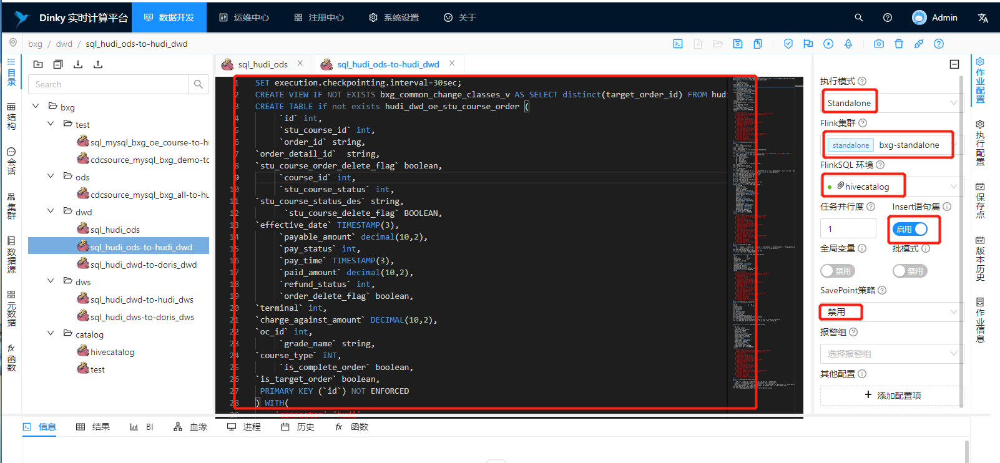

-   保存配置,提交任务

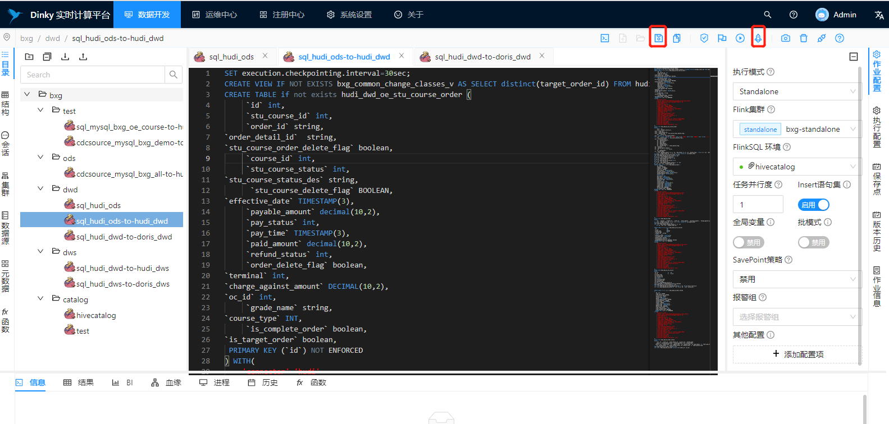

##### 查看任务

-   在运维中心查看任务:

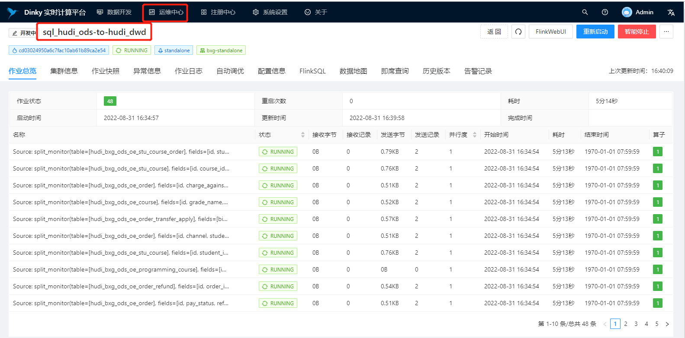

-   在flink web界面查看任务：

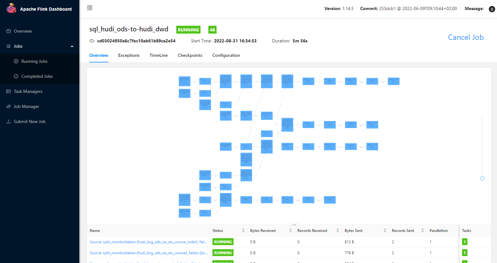

##### 查看结果

-   查看hdfs:

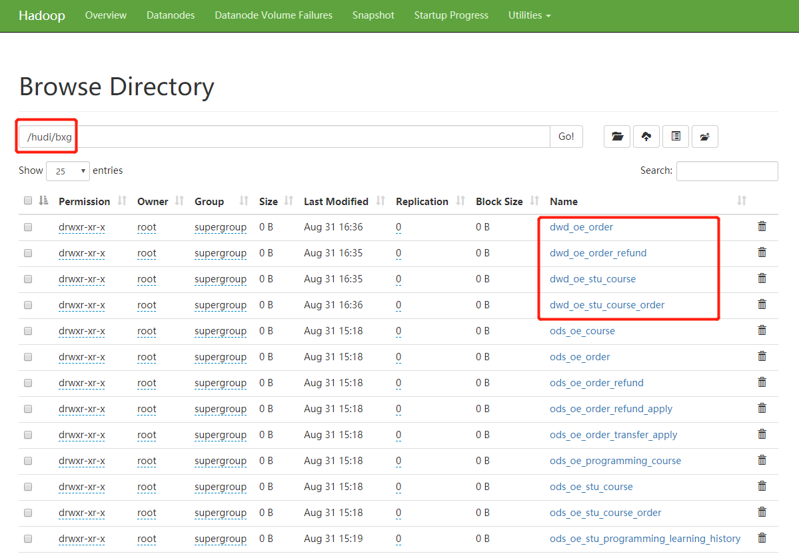

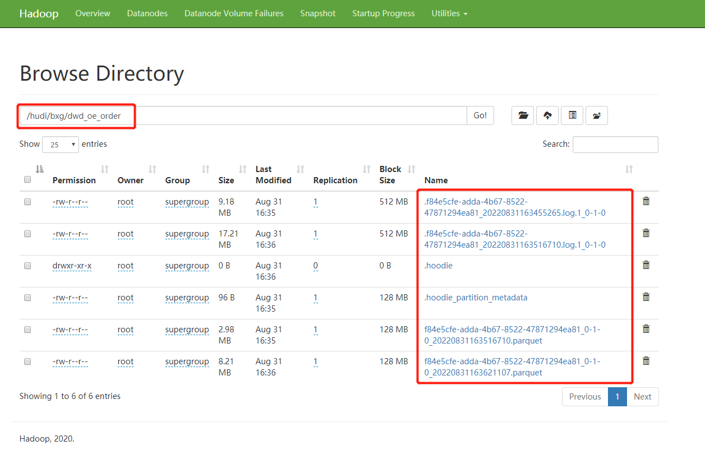

-   查看hive的bxg数据库:

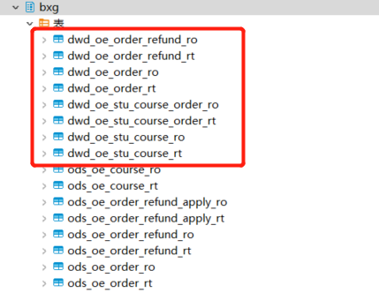

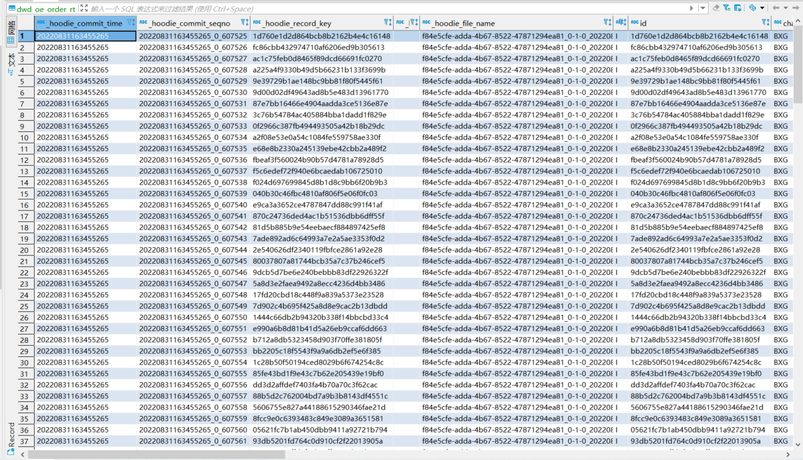

-   查看hive的bxg\_meta数据库:

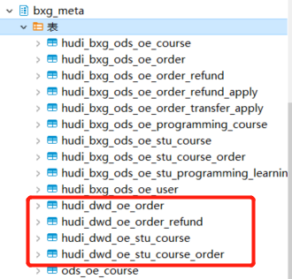

#### sql\_hudi\_dwd-to-doris\_dwd 作业

##### doris建表

-   这里是下沉到doris,所以要事先在doris进行建表.建表语句如下:

```sql
DROP database if exists bxg;
CREATE database if not exists bxg;
CREATE TABLE IF NOT EXISTS bxg.dwd_oe_stu_course_order
(
    `id` int,
    `stu_course_id` int COMMENT '学员课程id',
    `order_id` string,
    `order_detail_id`  string,
    `stu_course_order_delete_flag` boolean,
    `course_id` int COMMENT '学员购买的课程',
    `stu_course_status` int COMMENT '学员课程状态：0试学、1生效、2待生效、-1停课、8退费',
    `stu_course_status_des` string COMMENT '学员课程状态描述：0试学、1生效、2待生效、-1停课、8退费',
    `stu_course_delete_flag` BOOLEAN,
    `effective_date` datetime,
    `payable_amount` decimal(10,2) COMMENT '实际应付总金额=原价-优惠总额-冲抵金额',
    `pay_status` int  COMMENT '支付状态：0未支付、1部分支付、2支付完成',
    `pay_time` datetime COMMENT '最后支付完成时间',
    `paid_amount` decimal(10,2) COMMENT '当前已付总额',
    `refund_status` INT COMMENT '退费状态:0-未退费;-1-已退费;-2-退费中;-3-部分退费',
    `order_delete_flag` BOOLEAN COMMENT 'ods_bxg_oe_order表中订单是否删除',
    `terminal` int,
    `charge_against_amount` DECIMAL(10,2),
    `oc_id` int,
    `grade_name` string COMMENT '课程名称',
    `course_type`  int,
    `is_complete_order` BOOLEAN COMMENT '实际应付总金额0且支付状态pay_status完成',
    `is_target_order` boolean
) Unique Key (`id`)
DISTRIBUTED BY HASH(`id`) BUCKETS 10
PROPERTIES (
"replication_allocation" = "tag.location.default: 1"
);
CREATE TABLE  if not exists bxg.`dwd_oe_order` (
    `id` varchar(32) NOT NULL,
    `create_time` datetime NOT NULL COMMENT '物理入库时间，如果是补录订单，该时间为补录订单的日期，而不是学员真实缴费的日期。',
    `channel` string NOT NULL COMMENT '订单渠道来源：BXG/博学谷，目前只有博学谷，将来可能会有黑马短训、酷丁鱼等',
    `student_id` string NOT NULL COMMENT '用户ID',
    `order_no` string NOT NULL COMMENT '订单号，生成规则：年（2位）-月（2位）-日（2位）-时（2位）-随机码（12位） eg.16110910aRdK45Y86qe3',
    `total_amount` decimal(10,2) NOT NULL DEFAULT '0.00' COMMENT '原价/总价',
    `discount_amount` decimal(10,2) NOT NULL DEFAULT '0.00' COMMENT '优惠总额，有可能是优惠券优惠、也有可能是满减优惠',
    `charge_against_amount` decimal(10,2) NOT NULL DEFAULT '0.00' COMMENT '冲抵金额，目前包含报名费',
    `payable_amount` decimal(10,2) NOT NULL DEFAULT '0.00' COMMENT '实际应付总金额=原价-优惠总额-冲抵金额',
    `status` int NOT NULL DEFAULT '0' COMMENT '订单状态：0未生效、1已生效、-1已关闭。和订单支付状态区分开，因为在某些情况下学员没有支付完成订单也已经开始生效。“-1已关闭”状态代表已退费和超时关闭两种含义。',
    `pay_status` int NOT NULL COMMENT '支付状态：0未支付、1部分支付、2支付完成',
    `pay_time` datetime DEFAULT NULL COMMENT '最后支付完成时间',
    `paid_amount` decimal(10,2) NOT NULL DEFAULT '0.00' COMMENT '当前已付总额',
    `effective_date` datetime DEFAULT NULL COMMENT '订单生效日期。从该日期开始计算服务期。',
    `terminal` int NOT NULL DEFAULT '0' COMMENT '下单订单终端：0/PC官网、1/后台导入-其他、2/App、3/移动官网、4微信内、5/后台导入-线下转线上、6/ios、7/补录-系统-N12分摊转移、8/小程序(在线编程)',
    `refund_status` int NOT NULL DEFAULT '0' COMMENT '退费状态:0-未退费;-1-已退费;-2-退费中;-3-部分退费',
    `refund_amount` decimal(10,2) NOT NULL DEFAULT '0.00' COMMENT '退费金额',
    `refund_time` datetime DEFAULT NULL COMMENT '最后退费时间',
    `update_time` datetime NOT NULL,
`delete_flag` boolean NOT NULL,
`is_target_order` boolean  NOT NULL
    )  UNIQUE KEY(`id`)
    COMMENT '订单：主订单'
    DISTRIBUTED BY HASH(`id`) BUCKETS 10
    PROPERTIES (
        "replication_allocation" = "tag.location.default: 1"
               );
CREATE TABLE IF NOT EXISTS bxg.dwd_oe_stu_course 
(
`id` int,
`oc_id`        int,
`grade_name` string COMMENT '课程名称',
`course_type`  int,
`student_id`          string COMMENT '学员',
`status`   int COMMENT '学员课程状态：0试学、1生效、2待生效、-1停课、8退费',
`effective_date` datetime   COMMENT '课程生效时间，来源于订单！注意：试学课程没有该值！！！',
`finished_time` datetime  COMMENT '学员课程完成时间，目前已知的以“结业报告”为准。未结束课程没有该值！',
`delete_flag` boolean,
`programming_course_id` int,
`programming_course_is_deleted` boolean
)
Unique Key (`id`)
DISTRIBUTED BY HASH(`id`) BUCKETS 10
PROPERTIES (
"replication_allocation" = "tag.location.default: 1"
);
CREATE TABLE  if not exists bxg.`dwd_oe_order_refund`
(
   `id` int NOT NULL,
   `order_id` string NOT NULL COMMENT '订单ID',
   `order_detail_id` string NOT NULL COMMENT '子订单ID',
   `oa_bill_no` string NOT NULL COMMENT 'OA单号',
   `refund_type` int NOT NULL COMMENT '退费类型：10-退费_课程退学退;11-退费_多交学费退;12退费_预交学费退;20-转线下_课程退学退;21-转线下_多交学费退;22转线下_预交学费退;30-线上互转_课程退学退;31-线上互转_多交学费退;32线上互转_预交学费退;',
   `amount` decimal(10,2) NOT NULL DEFAULT '0.00' COMMENT '退款金额',
   `refund_bank_account` string DEFAULT NULL COMMENT '退款银行账号',
   `refund_operator` string DEFAULT NULL COMMENT '退款人姓名',
   `refund_time` datetime NOT NULL COMMENT '退款时间',
   `reason` string NOT NULL COMMENT '退款原因',
   `create_time` datetime NOT NULL,
   `update_time` datetime NOT NULL,
   `delete_flag` boolean NOT NULL,
   `order_pay_status`  int,
   `order_refund_status` int,
   `order_delete_flag` boolean
) UNIQUE KEY(`id`)
    COMMENT '订单退费表'
    DISTRIBUTED BY HASH(`id`) BUCKETS 10
    PROPERTIES (
    "replication_allocation" = "tag.location.default: 1"
               );
CREATE TABLE  if not exists bxg.`dwd_oe_order_refund_apply` 
(
  `id` int NOT NULL,
  `student_id` string NOT NULL,
  `order_id` string DEFAULT NULL COMMENT '主订单ID',
  `order_detail_id` string DEFAULT NULL COMMENT '子订单ID',
  `oe_deposit_id` string DEFAULT NULL COMMENT '报名费ID',
  `cash_back_record_id` int DEFAULT NULL COMMENT '返现记录',
  `course_id` int DEFAULT NULL COMMENT '课程ID',
  `stu_course_id` int DEFAULT NULL,
  `original_stu_course_status` int DEFAULT NULL COMMENT '原来的学员课程状态',
  `original_order_refund_status` int NOT NULL DEFAULT '0' COMMENT '订单的原来退费状态',
  `order_refund_id` int DEFAULT NULL COMMENT '退费表ID,退费成功后填入此字段',
  `oa_affair_id` string DEFAULT NULL COMMENT 'OA的affairId',
  `oa_summary_id` string NOT NULL COMMENT 'oa的summaryId',
  `oa_template_code` string DEFAULT NULL COMMENT 'oa的templateCode模板code',
  `oa_template_id` string DEFAULT NULL COMMENT 'oa的templateId模板id',
  `refund_amount` decimal(10,2) DEFAULT '0.00' COMMENT '退费金额',
  `refund_type` int NOT NULL DEFAULT '1' COMMENT '退费类型:0-课程退学退;1-多交学费退;2-预交学费退;',
  `order_refund_type` int NOT NULL DEFAULT '0' COMMENT '订单退费类型：0-订单退费;1-报名费订单退费',
  `status` int NOT NULL DEFAULT '0' COMMENT '状态:2-已发起;0-已完成;3-待打款;4-处理中;5-已撤回;6-已退回;15-已终止;',
  `creator` string NOT NULL COMMENT '创建人(邮箱)',
  `creator_name` string NOT NULL COMMENT '创建人姓名',
  `create_time` datetime NOT NULL ,
  `update_time` datetime NOT NULL ,
  `delete_flag` boolean NOT NULL
)UNIQUE KEY(`id`)
    COMMENT '订单退费申请表'
    DISTRIBUTED BY HASH(`id`) BUCKETS 10
    PROPERTIES (
    "replication_allocation" = "tag.location.default: 1"
               );              
CREATE TABLE IF NOT EXISTS bxg.dwd_oe_user
(
    id                  varchar(32)        not null,
    itcast_uuid         int           not null comment '传智播客教育集团所有IT系统全局唯一的用户ID，该ID来自于用户中心',
    name                string,
    sex                 int           not null comment '0未知、1男、2女',
    mobile              string,
    email               string,
    qq                  string        null     comment 'qq号',
    small_head_photo    string,
    big_head_photo      string,
    status              int           null     comment '-1禁用，0正常,1待激活',
    info                string        null     comment '个性签名',
    jobyears            int           null     comment '工作年限',
    occupation          int           null     comment '用户职业',
    region_id           string        null     comment '区域',
    region_area_id      string        null     comment '省',
    region_city_id      string        null     comment '市',
    region_county_id    string        null     comment '县/区',
    occupation_other    string        null     comment '职业,其他',
    target              string        null     comment '学习目标',
    is_apply            boolean       null     comment '用户报名状态   0:未报名 1:已报名',
    full_address        string        null     comment '详细地址',
    menu_id             int,
    user_type           int           not null comment '用户类型（0：非三方用户，1：qq用户，2：微信用户）',
    parent_id           string        null     comment '分享者id(上级用户)',
    share_code          string        null     comment '分享码',
    origin              string        null     comment '用户来源，online：在线-官网，dual：双元，bxg：院校，ask：问答精灵，orderInput：在线-补录，mweb：在线-H5，app：在线-App',
    type                int           null     comment '0普通，1学生，2老师',
    remark              string        null     comment '备注',
    school_id           string        null     comment '学校：外键，关联学校表中的id',
    birthday            datetime          null     comment '生日',
    education_id        string        null     comment '学历:关联到system_variate',
    major_id            string        null     comment '专业:关联到system_variate',
    is_old_user         int           not null comment '是否老学员，0否，1是',
    old_user_subject_id string,
    old_user_class_name string,
    create_person       string,
    create_time         datetime      not null,
    update_time         datetime      null     comment '变更时间',
    is_delete           boolean       not null
) Unique Key (`id`)
comment '学员表'
DISTRIBUTED BY HASH(`id`) BUCKETS 10
PROPERTIES (
"replication_allocation" = "tag.location.default: 1"
);
create table if not exists bxg.dwd_oe_stu_programming_learning_history
(
    id            int,
    stu_course_id int      not null comment '课程学员id',
    student_id string not null comment '学员id',
    course_id     int      not null comment '课程id',
    chapter_id    int      not null comment '章id',
    barrier_id    int      not null comment '关卡id',
    location string not null comment '学员闯关位置索引',
    learn_time    datetime not null comment '学习时间',
    update_time    datetime not null
) Unique Key (`id`)
comment '互动课堂学员学习记录'
DISTRIBUTED BY HASH(`id`) BUCKETS 10
PROPERTIES (
"replication_allocation" = "tag.location.default: 1"
);

-- 创建视图和维表
create view if not exists bxg.common_month_v (month) as
select month from (
    (select 1 as month) union all
    (select 2 as month) union all
    (select 3 as month) union all
    (select 4 as month) union all
    (select 5 as month) union all
    (select 6 as month) union all
    (select 7 as month) union all
    (select 8 as month) union all
    (select 9 as month) union all
    (select 10 as month) union all
    (select 11 as month) union all
    (select 12 as month)) t;
   
DROP database if exists dim;   
CREATE database if not exists dim;
CREATE TABLE if not exists dim.common_sequence (
num int
) Unique key (num) 
DISTRIBUTED BY HASH(`num`) BUCKETS 10
PROPERTIES (
"replication_allocation" = "tag.location.default: 1"
); 
INSERT into dim.common_sequence
SELECT  
	row_number() over () AS num
FROM
	 (SELECT 0 AS num
	  UNION SELECT 1 UNION SELECT 2 UNION SELECT 3
	  UNION SELECT 4 UNION SELECT 5 UNION SELECT 6
	  UNION SELECT 7 UNION SELECT 8 UNION SELECT 9) a,
	 (SELECT 0 AS num
	  UNION SELECT 1 UNION SELECT 2 UNION SELECT 3
	  UNION SELECT 4 UNION SELECT 5 UNION SELECT 6
	  UNION SELECT 7 UNION SELECT 8 UNION SELECT 9) b,
	 (SELECT 0 AS num
	  UNION SELECT 1 UNION SELECT 2 UNION SELECT 3
	  UNION SELECT 4 UNION SELECT 5 UNION SELECT 6
	  UNION SELECT 7 UNION SELECT 8 UNION SELECT 9) c;
```


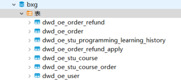

##### 创建作业

-   在dwd目录下创建 sql\_hudi\_dwd-to-doris\_dwd 作业,代码和配置如下:

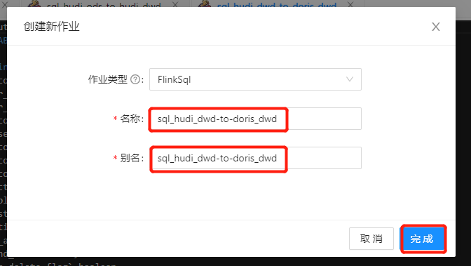

```sql
SET execution.checkpointing.interval=30sec;
CREATE TABLE if not exists doris_dwd_oe_stu_course_order 
(
   `id` int,
   `stu_course_id` int,
   `order_id` string,
   `order_detail_id`  string,
   `stu_course_order_delete_flag` boolean,
   `course_id` int,
   `stu_course_status` int,
   `stu_course_status_des` string,
   `stu_course_delete_flag` BOOLEAN,
   `effective_date` TIMESTAMP(3),
   `payable_amount` decimal(10,2),
   `pay_status` int,
   `pay_time` TIMESTAMP(3),
   `paid_amount` decimal(10,2),
   `refund_status` int,
   `order_delete_flag` boolean,
   `terminal` int,
   `charge_against_amount` DECIMAL(10,2),
   `oc_id` int,
   `grade_name` string,
   `course_type` INT,
   `is_complete_order` boolean,
   `is_target_order` Boolean,
   PRIMARY KEY (`id`) NOT ENFORCED
) WITH (
    'fenodes' = 'node1:8030'
    ,'table.identifier' = 'bxg.dwd_oe_stu_course_order'
    ,'sink.enable-delete' = 'true'
    ,'sink.properties.strip_outer_array' = 'true'
    ,'sink.batch.size' = '2000'
    ,'password' = '123456'
    ,'connector' = 'doris'
    ,'sink.batch.interval' = '10s'
    ,'sink.max-retries' = '5'
    ,'sink.properties.format' = 'json'
    ,'username' = 'root'
);
INSERT INTO doris_dwd_oe_stu_course_order SELECT `id`,`stu_course_id`, `order_id`,`order_detail_id`,`stu_course_order_delete_flag` ,`course_id`,`stu_course_status`,`stu_course_status_des`,`stu_course_delete_flag`, `effective_date`,`payable_amount`,`pay_status`,`pay_time`,`paid_amount`,`refund_status`,`order_delete_flag`, `terminal`,`charge_against_amount`,`oc_id`,`grade_name`, `course_type`,`is_complete_order`, `is_target_order`
FROM hudi_dwd_oe_stu_course_order;

CREATE TABLE if not exists doris_dwd_oe_order (
                                                `id` STRING,
    `channel` STRING,
    `student_id` STRING,
    `order_no` STRING,
    `total_amount` DECIMAL(10,2),
    `discount_amount` DECIMAL(10,2),
    `charge_against_amount` DECIMAL(10,2),
    `payable_amount` DECIMAL(10,2),
    `status` INT,
    `pay_status` INT,
    `pay_time` TIMESTAMP(3),
    `paid_amount` DECIMAL(10,2),
    `effective_date` TIMESTAMP(3),
    `terminal` INT,
    `refund_status` INT,
    `refund_amount` DECIMAL(10,2),
`refund_time` TIMESTAMP(3),
`create_time` TIMESTAMP(3),
    `update_time` TIMESTAMP(3),
`delete_flag` BOOLEAN,
`is_target_order` BOOLEAN,
    PRIMARY KEY (id) NOT ENFORCED
    ) WITH (
          'fenodes' = '192.168.88.161:8030'
          ,'table.identifier' = 'bxg.dwd_oe_order'
          ,'sink.enable-delete' = 'true'
          ,'sink.properties.strip_outer_array' = 'true'
          ,'sink.batch.size' = '2000'
          ,'password' = '123456'
          ,'connector' = 'doris'
          ,'sink.batch.interval' = '10s'
          ,'sink.max-retries' = '5'
          ,'sink.properties.format' = 'json'
          ,'username' = 'root'
          );
INSERT INTO `doris_dwd_oe_order` SELECT  `id`, `channel`, `student_id`, `order_no`, `total_amount`, `discount_amount`, `charge_against_amount`, `payable_amount`, `status`, `pay_status`, `pay_time`, `paid_amount`, `effective_date`, `terminal`, `refund_status`, `refund_amount`, `refund_time`,`create_time`,`update_time`, `delete_flag` , `is_target_order`
FROM hudi_dwd_oe_order;

CREATE TABLE if not exists doris_dwd_oe_stu_course (
 `id` int
,`oc_id` int
,`grade_name` string
,`course_type` INT
,`student_id`  string
,`status`   int
,`effective_date` timestamp(3)
,`finished_time` timestamp(3)
,`delete_flag` boolean
,`programming_course_id` int
,`programming_course_is_deleted` boolean
, PRIMARY KEY (`id`) NOT ENFORCED
) WITH (
    'fenodes' = 'node1:8030'
    ,'table.identifier' = 'bxg.dwd_oe_stu_course'
    ,'sink.enable-delete' = 'true'
    ,'sink.properties.strip_outer_array' = 'true'
    ,'sink.batch.size' = '2000'
    ,'password' = '123456'
    ,'connector' = 'doris'
    ,'sink.batch.interval' = '10s'
    ,'sink.max-retries' = '5'
    ,'sink.properties.format' = 'json'
    ,'username' = 'root'
);
INSERT INTO `doris_dwd_oe_stu_course`
SELECT `id`
,`oc_id`
,`grade_name`
,`course_type`
,`student_id`
,`status`
,`effective_date`
,`finished_time`
,`delete_flag`
,`programming_course_id`
,`programming_course_is_deleted`
FROM hudi_dwd_oe_stu_course;

CREATE TABLE IF NOT EXISTS `doris_dwd_oe_order_refund` (
   `id` INT,
   `order_id` STRING,
   `order_detail_id` STRING,
   `oa_bill_no` STRING ,
   `refund_type` INT,
   `amount` DECIMAL(10,2),
   `refund_bank_account` STRING,
   `refund_operator` STRING,
   `refund_time` TIMESTAMP(3) ,
   `reason` STRING,
   `create_time` TIMESTAMP(3) ,
   `update_time` TIMESTAMP(3) ,
   `delete_flag` BOOLEAN,
   `order_pay_status`  INT,
   `order_refund_status` INT,
   `order_delete_flag` BOOLEAN,
   PRIMARY KEY ( `id` ) NOT ENFORCED
) WITH (
    'fenodes' = '192.168.88.161:8030'
    ,'table.identifier' = 'bxg.dwd_oe_order_refund'
    ,'sink.enable-delete' = 'true'
    ,'sink.properties.strip_outer_array' = 'true'
    ,'sink.batch.size' = '2000'
    ,'password' = '123456'
    ,'connector' = 'doris'
    ,'sink.batch.interval' = '10s'
    ,'sink.max-retries' = '5'
    ,'sink.properties.format' = 'json'
    ,'username' = 'root'
);
INSERT INTO `doris_dwd_oe_order_refund` SELECT
 `id`,`order_id`,`order_detail_id`,`oa_bill_no`,`refund_type`,
 `amount`,`refund_bank_account`,`refund_operator`,`refund_time`,
`reason`,`create_time`,`update_time`,`delete_flag`,`order_pay_status`,
 `order_refund_status`,`order_delete_flag`
FROM `hudi_dwd_oe_order_refund`;


CREATE TABLE IF NOT EXISTS `doris_dwd_oe_order_refund_apply`
(
   `id` INT,
   `student_id` STRING,
   `order_id` STRING,
   `order_detail_id` STRING,
   `oe_deposit_id` STRING,
   `cash_back_record_id` INT,
   `course_id` INT,
   `stu_course_id` INT,
   `original_stu_course_status` INT,
   `original_order_refund_status` INT,
   `order_refund_id` INT,
   `oa_affair_id` STRING,
   `oa_summary_id` STRING,
   `oa_template_code` STRING,
   `oa_template_id` STRING,
   `refund_amount` DECIMAL(10,2) ,
   `refund_type` INT,
   `order_refund_type` INT,
   `status` INT,
   `creator` STRING,
   `creator_name` STRING,
   `create_time` TIMESTAMP(3) ,
   `update_time` TIMESTAMP(3),
   `delete_flag` BOOLEAN ,
   PRIMARY KEY ( `id` ) NOT ENFORCED
) WITH (
    'fenodes' = '192.168.88.161:8030'
    ,'table.identifier' = 'bxg.dwd_oe_order_refund_apply'
    ,'sink.enable-delete' = 'true'
    ,'sink.properties.strip_outer_array' = 'true'
    ,'sink.batch.size' = '2000'
    ,'password' = '123456'
    ,'connector' = 'doris'
    ,'sink.batch.interval' = '10s'
    ,'sink.max-retries' = '5'
    ,'sink.properties.format' = 'json'
    ,'username' = 'root'
);
INSERT INTO `doris_dwd_oe_order_refund_apply` SELECT
`id`,`student_id`,`order_id`,`order_detail_id`,`oe_deposit_id`,`cash_back_record_id`,`course_id`,
`stu_course_id`,`original_stu_course_status`,`original_order_refund_status`,`order_refund_id`,`oa_affair_id`,
`oa_summary_id`,`oa_template_code`,`oa_template_id`,`refund_amount`,`refund_type`,`order_refund_type`,`status`,
`creator`,`creator_name`,`create_time`,`update_time`,`delete_flag`
FROM `hudi_bxg_ods_oe_order_refund_apply`;

CREATE TABLE if not exists doris_dwd_oe_user (
     `id` STRING,
     `itcast_uuid` INT NULL,
     `name` STRING NULL,
     `sex` INT NULL,
     `mobile` STRING NULL,
     `email` STRING NULL,
     `qq` STRING NULL,
     `small_head_photo` STRING NULL,
     `big_head_photo` STRING NULL,
     `status` INT NULL,
     `info` STRING NULL,
     `jobyears` INT NULL,
     `occupation` INT NULL,
     `region_id` STRING NULL,
     `region_area_id` STRING NULL,
     `region_city_id` STRING NULL,
     `region_county_id` STRING NULL,
     `occupation_other` STRING NULL,
     `target` STRING NULL,
     `is_apply` BOOLEAN NULL,
     `full_address` STRING NULL,
     `menu_id` INT NULL,
     `user_type` INT NULL,
     `parent_id` STRING NULL,
     `share_code` STRING NULL,
     `origin` STRING NULL,
     `type` INT NULL,
     `remark` STRING NULL,
     `school_id` STRING NULL,
     `birthday`  TIMESTAMP(3) NULL,
     `education_id` STRING NULL,
     `major_id` STRING NULL,
     `is_old_user` INT NULL,
     `old_user_subject_id` STRING NULL,
     `old_user_class_name` STRING NULL,
     `create_person` STRING NULL,
     `create_time` TIMESTAMP(3) NULL,
     `update_time` TIMESTAMP(3) NULL,
     `is_delete` BOOLEAN NULL,
     PRIMARY KEY (`id`) NOT ENFORCED
) WITH (
    'fenodes' = '192.168.88.161:8030'
    ,'table.identifier' = 'bxg.dwd_oe_user'
    ,'sink.enable-delete' = 'true'
    ,'sink.properties.strip_outer_array' = 'true'
    ,'sink.batch.size' = '2000'
    ,'password' = '123456'
    ,'connector' = 'doris'
    ,'sink.batch.interval' = '10s'
    ,'sink.max-retries' = '5'
    ,'sink.properties.format' = 'json'
    ,'username' = 'root'
);
INSERT INTO `doris_dwd_oe_user`
SELECT  id, itcast_uuid, name, sex, mobile, email, qq, small_head_photo, big_head_photo, status, info, jobyears, occupation, region_id, region_area_id, region_city_id, region_county_id, occupation_other, target, is_apply, full_address, menu_id, user_type, parent_id, share_code, origin, type, remark, school_id, birthday, education_id, major_id, is_old_user, old_user_subject_id, old_user_class_name, create_person, create_time, update_time, is_delete
FROM `hudi_bxg_ods_oe_user`;

CREATE TABLE if not exists doris_dwd_oe_stu_programming_learning_history (
    `id` INT,
    `stu_course_id` INT,
    `student_id` STRING,
    `course_id` INT,
    `chapter_id` INT,
    `barrier_id` INT,
    `location` STRING,
    `learn_time` TIMESTAMP(3),
    `update_time` TIMESTAMP(3),
    PRIMARY KEY (`id`) NOT ENFORCED
) WITH (
    'fenodes' = '192.168.88.161:8030'
    ,'table.identifier' = 'bxg.dwd_oe_stu_programming_learning_history'
    ,'sink.enable-delete' = 'true'
    ,'sink.properties.strip_outer_array' = 'true'
    ,'sink.batch.size' = '2000'
    ,'password' = '123456'
    ,'connector' = 'doris'
    ,'sink.batch.interval' = '10s'
    ,'sink.max-retries' = '5'
    ,'sink.properties.format' = 'json'
    ,'username' = 'root'
);
INSERT INTO `doris_dwd_oe_stu_programming_learning_history` 
SELECT  id, stu_course_id, student_id, course_id, chapter_id, barrier_id, location, learn_time, update_time
FROM `hudi_bxg_ods_oe_stu_programming_learning_history`;
```


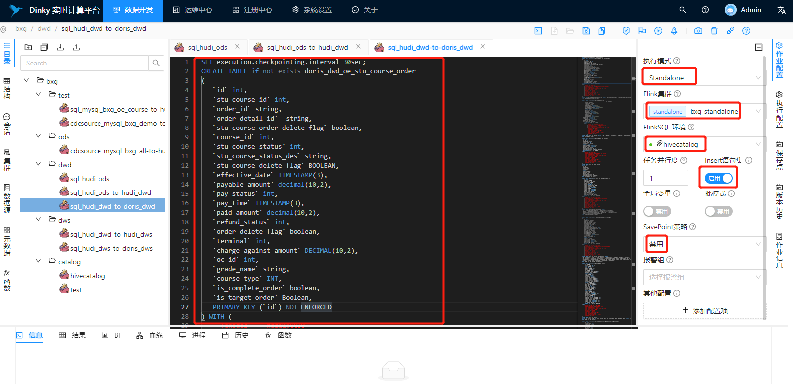

-   保存配置,提交任务.

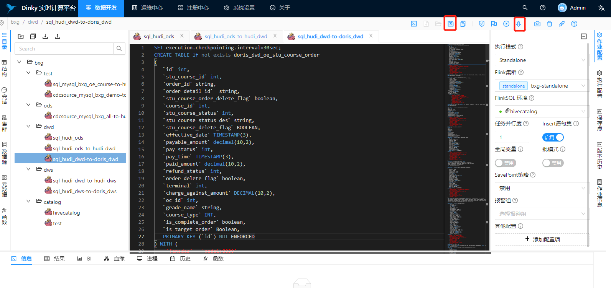

##### 查看任务

-   在运维中心查看任务:

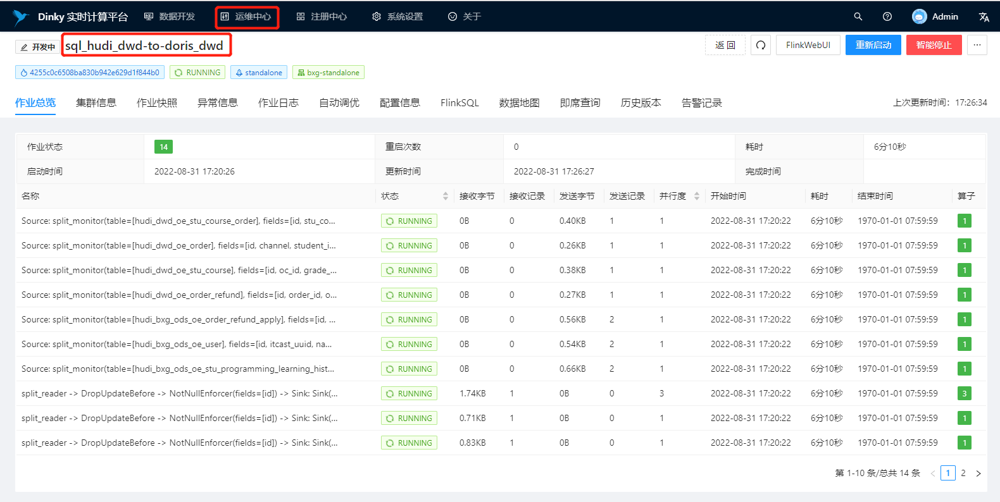

-   在flink web界面查看任务：

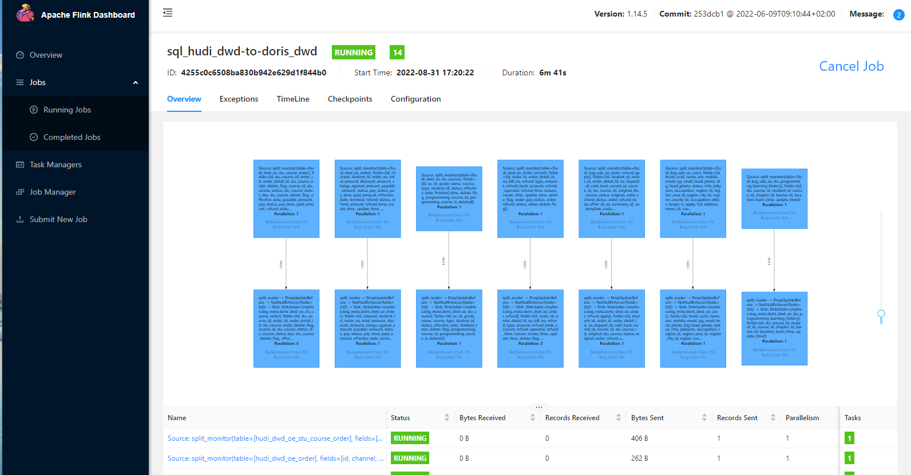

##### 查看结果

-   查看doris,表中已经存在数据.

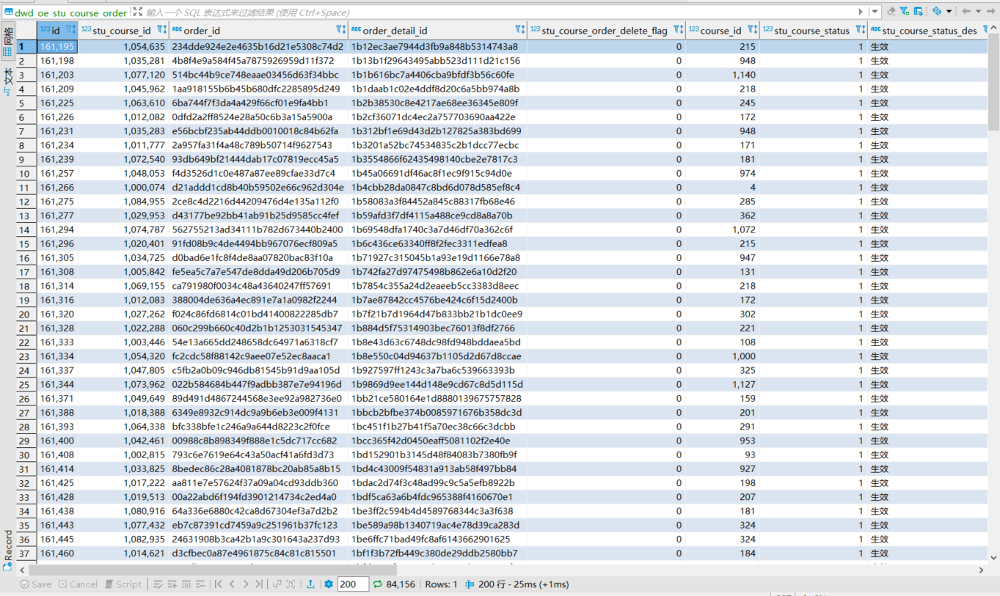

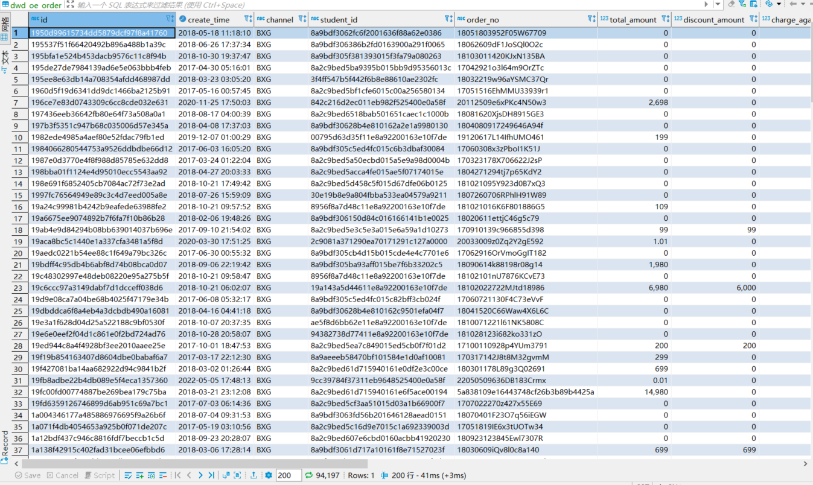

-   查看hive的bxg\_meta数据库:

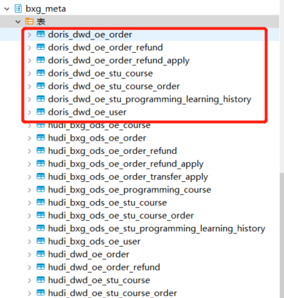

### 知识点19：【实现】DWS层

#### sql\_hudi\_dwd-to-hudi\_dws 作业

##### 创建作业

-   在dws目录下创建 sql\_hudi\_dwd-to-hudi\_dws 作业,代码和配置如下:

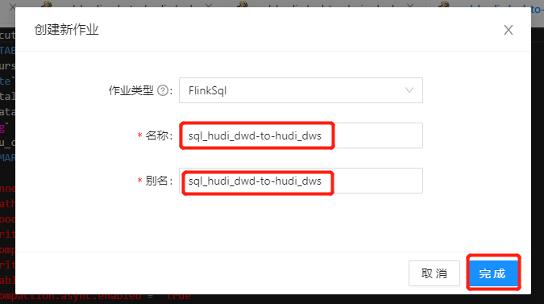

```sql
SET execution.checkpointing.interval=30sec;
CREATE TABLE if not exists hudi_dws_course_revenue(
    `course_id` int,
    `date` string,
    `total_cnt` bigint,
    `toatal_money` decimal(38,4),
    `avg` decimal(38,4),
    `stu_course_order_status` string,
    PRIMARY KEY (`course_id`,`date`) NOT ENFORCED
) WITH(
    'connector'='hudi'
    ,'path'= 'hdfs://node1:8020/hudi/bxg/dws_course_revenue'
    ,'hoodie.datasource.write.recordkey.field'= '`course_id`,`date`'
    ,'write.tasks'= '1'
    ,'compaction.tasks'= '1'
    ,'write.rate.limit'= '2000'
    ,'table.type'= 'MERGE_ON_READ'
    ,'compaction.async.enabled'= 'true'
    ,'compaction.trigger.strategy'= 'num_commits'
    ,'compaction.delta_commits'= '1'
    ,'changelog.enabled'= 'true'
    ,'read.tasks' = '3'
    ,'read.streaming.enabled'= 'true'
    ,'read.start-commit'='earliest'
    ,'read.streaming.check-interval'= '3'
    ,'hive_sync.enable'= 'true'
    ,'hive_sync.mode'= 'hms'
    ,'hive_sync.metastore.uris'= 'thrift://node1:9083'
    ,'hive_sync.table'= 'dws_course_revenue'
    ,'hive_sync.db'= 'bxg'
    ,'hive_sync.username'= ''
    ,'hive_sync.password'= ''
    ,'hive_sync.support_timestamp'= 'true'
);
create temporary function collect_concat as 'cn.itcast.bxg.common.functions.CollectConcat';
INSERT INTO hudi_dws_course_revenue
SELECT
    ifnull(course_id,-1) as course_id,
    '合计' AS `date`,
    count(1) AS `total_cnt`,
    CASE WHEN count(1) >0 THEN sum(paid_amount) ELSE 0 END  AS  `toatal_money`,
    CASE WHEN count(1) >0 THEN sum(paid_amount) / if(count(1)<=0,1,count(1)) ELSE 0 END AS `avg`,
    CONCAT('【',cast(course_id as string),'】',grade_name)  as  `stu_course_order_status`
FROM hudi_dwd_oe_stu_course_order
WHERE is_complete_order = true
  AND stu_course_status not in (8)
GROUP BY course_id,grade_name

union

select
    ifnull(course_id,-1) as course_id,
    ifnull(date_format(pay_time, 'yyyy/MM/dd'),'-1') as `date`,
    count(1) AS `total_cnt`,
    CASE WHEN count(1) > 0 THEN sum(paid_amount) ELSE 0 END AS `toatal_money`,
    CASE WHEN count(1) > 0 THEN sum(paid_amount) / if(count(1)=0,1,count(1)) ELSE 0 END AS `avg`,
    collect_concat(stu_course_status_des) as `stu_course_order_status`
from hudi_dwd_oe_stu_course_order
WHERE is_complete_order is true
group by course_id,date_format(pay_time, 'yyyy/MM/dd');

CREATE TABLE if not exists hudi_dws_overall_revenue (
    `course_id` int,
    `course_name` string,
    `paid_count` bigint,
    `paid_amount` decimal(38,4),
    PRIMARY KEY (`course_id`) NOT ENFORCED
) WITH(
    'connector'='hudi'
    ,'path'= 'hdfs://node1:8020/hudi/bxg/dws_overall_revenue'
    ,'hoodie.datasource.write.recordkey.field'= '`course_id`'
    ,'write.tasks'= '1'
    ,'compaction.tasks'= '1'
    ,'write.rate.limit'= '2000'
    ,'table.type'= 'MERGE_ON_READ'
    ,'compaction.async.enabled'= 'true'
    ,'compaction.trigger.strategy'= 'num_commits'
    ,'compaction.delta_commits'= '1'
    ,'changelog.enabled'= 'true'
    ,'read.tasks' = '3'
    ,'read.streaming.enabled'= 'true'
    ,'read.start-commit'='earliest'
    ,'read.streaming.check-interval'= '3'
    ,'hive_sync.enable'= 'true'
    ,'hive_sync.mode'= 'hms'
    ,'hive_sync.metastore.uris'= 'thrift://node1:9083'
    ,'hive_sync.table'= 'dws_overall_revenue'
    ,'hive_sync.db'= 'bxg'
    ,'hive_sync.username'= ''
    ,'hive_sync.password'= ''
    ,'hive_sync.support_timestamp'= 'true'
);
INSERT INTO hudi_dws_overall_revenue
SELECT
    ifnull(course_id,-1) as course_id,
    grade_name AS `course_name`,
    COUNT(CASE WHEN (is_complete_order is true AND refund_status not in (-1))
                   THEN order_id
               ELSE null
        END)  AS `paid_count`,
    SUM(CASE WHEN (is_complete_order is true AND refund_status not in (-1))
                 THEN paid_amount
             ELSE null
        END) AS  `paid_amount`
FROM hudi_dwd_oe_stu_course_order
GROUP BY course_id,grade_name;

CREATE TABLE if not exists hudi_dws_overall_revenue_achievement(
course_id INT,
`year` BIGINT,
`mon` BIGINT,
eff_year BIGINT,
eff_mon BIGINT,
course_type int,
`stu_course_delete_flag` BOOLEAN,
`stu_course_status` INT,
 grade_name STRING,
`sm` decimal(38,6),
`cnt` BIGINT,
 PRIMARY KEY (course_id,`year`,`mon`,eff_year,eff_mon,course_type,stu_course_delete_flag,stu_course_status) NOT ENFORCED
) WITH(
    'connector'='hudi'
    ,'path'= 'hdfs://node1:8020/hudi/bxg/dws_overall_revenue_achievement'
    ,'hoodie.datasource.write.recordkey.field'= 'course_id,`year`,`mon`,eff_year,eff_mon,course_type,stu_course_delete_flag,stu_course_status'
    ,'write.tasks'= '1'
    ,'compaction.tasks'= '1'
    ,'write.rate.limit'= '2000'
    ,'table.type'= 'MERGE_ON_READ'
    ,'compaction.async.enabled'= 'true'
    ,'compaction.trigger.strategy'= 'num_commits'
    ,'compaction.delta_commits'= '1'
    ,'changelog.enabled'= 'true'
    ,'read.tasks' = '1'
    ,'read.streaming.enabled'= 'true'
    ,'read.start-commit'='earliest'
    ,'read.streaming.check-interval'= '3'
    ,'hive_sync.enable'= 'true'
    ,'hive_sync.mode'= 'hms'
    ,'hive_sync.metastore.uris'= 'thrift://node1:9083'
    ,'hive_sync.table'= 'dws_overall_revenue_achievement'
    ,'hive_sync.db'= 'bxg'
    ,'hive_sync.username'= ''
    ,'hive_sync.password'= ''
    ,'hive_sync.support_timestamp'= 'true'
);
INSERT INTO hudi_dws_overall_revenue_achievement
SELECT
IFNULL(osco.course_id,-1) as course_id,
IFNULL(year(oo.pay_time),-1)   as  `year`,
IFNULL(month(oo.pay_time),-1) as `mon`,
IFNULL(year(osco.effective_date),-1) as eff_year,
IFNULL(month(osco.effective_date),-1) as eff_mon,
IFNULL(osco.course_type,-1) as course_type,
IFNULL(osco.`stu_course_delete_flag`,FALSE) as stu_course_delete_flag, 
IFNULL(osco.`stu_course_status`,-1) as stu_course_status,
osco.grade_name,
sum(oo.`payable_amount` + (CASE WHEN oo.`charge_against_amount` IS NOT null THEN oo.`charge_against_amount` ELSE 0 END))/ 10000  as `sm`,
count(oo.id)  as `cnt`
FROM
    `hudi_dwd_oe_order` oo
        LEFT JOIN  `hudi_dwd_oe_stu_course_order`  osco
            on  oo.`id` = osco.`order_id`
            WHERE 
-- 支付状态：支付完成
        oo.`pay_status` = 2
-- 未删除订单
  AND oo.`delete_flag` is FALSE 
-- 转班情况只取第一次的订单，转班后的订单不重复计算
  AND oo.`is_target_order` is FALSE 
-- 排除N12分摊转移
  AND oo.`terminal` not in (7)
-- 排除测试课
  AND osco.`course_id` NOT IN (555,1537) 
  GROUP BY year(oo.pay_time),month(oo.pay_time),year(osco.effective_date),month(osco.effective_date),
  osco.course_id,osco.grade_name,
osco.course_type,osco.`stu_course_delete_flag`,osco.`stu_course_status`;


CREATE TABLE if not exists hudi_dws_registerNum_applyNum_finishNum(
    `create_time_year` string,
    `create_time_day` string,
    `effective_date_day` string,
    `learn_time_day` string,
    `count` bigint,
    PRIMARY KEY (`create_time_year`, `create_time_day`, `effective_date_day`, `learn_time_day`) NOT ENFORCED
) WITH(
    'connector'='hudi'
    ,'path'= 'hdfs://node1:8020/hudi/bxg/dws_registerNum_applyNum_finishNum'
    ,'hoodie.datasource.write.recordkey.field'= '`create_time_year`, `create_time_day`, `effective_date_day`, `learn_time_day`'
    ,'write.tasks'= '1'
    ,'compaction.tasks'= '1'
    ,'write.rate.limit'= '2000'
    ,'table.type'= 'MERGE_ON_READ'
    ,'compaction.async.enabled'= 'true'
    ,'compaction.trigger.strategy'= 'num_commits'
    ,'compaction.delta_commits'= '1'
    ,'changelog.enabled'= 'true'
    ,'read.tasks' = '3'
    ,'read.streaming.enabled'= 'true'
    ,'read.start-commit'='earliest'
    ,'read.streaming.check-interval'= '3'
    ,'hive_sync.enable'= 'true'
    ,'hive_sync.mode'= 'hms'
    ,'hive_sync.metastore.uris'= 'thrift://node1:9083'
    ,'hive_sync.table'= 'dws_registerNum_applyNum_finishNum'
    ,'hive_sync.db'= 'bxg'
    ,'hive_sync.username'= ''
    ,'hive_sync.password'= ''
    ,'hive_sync.support_timestamp'= 'true'
);
INSERT INTO hudi_dws_registerNum_applyNum_finishNum
SELECT
    date_format(create_time, 'yyyy') as `create_time_year`,
    '-1' as `create_time_day`,
    '-1' as `effective_date_day`,
    '-1' as `learn_time_day`,
    count(distinct id) AS `count`
FROM hudi_bxg_ods_oe_user
WHERE is_delete is false
  AND origin like 'interactive%'
group by date_format(create_time, 'yyyy')

UNION

SELECT
    '-1' as `create_time_year`,
    date_format(create_time, 'yyyy.MM.dd') as `create_time_day`,
    '-1' as `effective_date_day`,
    '-1' as `learn_time_day`,
    count (distinct id) as `count`
FROM hudi_bxg_ods_oe_user
WHERE is_delete is false
  AND origin like 'interactive%'
GROUP BY date_format(create_time, 'yyyy.MM.dd')

UNION

SELECT
    '-1' as `create_time_year`,
    '-1' as `create_time_day`,
    date_format(osc.effective_date, 'yyyy.MM.dd') AS `effective_date_day`,
    '-1' as `learn_time_day`,
    count(distinct osc.id) AS `count`
FROM hudi_bxg_ods_oe_user ou
join hudi_dwd_oe_stu_course osc on osc.student_id=ou.id
WHERE osc.programming_course_id is not NULL
  AND osc.status not in (0)
  AND ou.is_delete is false
  AND osc.delete_flag is false
  AND programming_course_is_deleted is false
GROUP BY date_format(osc.effective_date, 'yyyy.MM.dd')

UNION

SELECT
    '-1' as `create_time_year`,
    '-1' as `create_time_day`,
    '-1' as `effective_date_day`,
    date_format(splh.learn_time, 'yyyy.MM.dd') AS `learn_time_day`,
    count(distinct ou.id) AS `count`
FROM hudi_bxg_ods_oe_user ou
join hudi_dwd_oe_stu_course osc on osc.student_id=ou.id
join hudi_bxg_ods_oe_stu_programming_learning_history splh on splh.stu_course_id=osc.id
WHERE osc.programming_course_id is not NULL
  AND osc.status not in (0)
  AND ou.is_delete is false
  AND osc.delete_flag is false
  AND programming_course_is_deleted is false
GROUP BY date_format(splh.learn_time, 'yyyy.MM.dd');


CREATE TABLE if not exists hudi_dws_registerSituation_applySituation_finishSituation (
    `effective_date_month` string,
    `learn_time_month` string,
    `finished_time_month` string,
    `create_time_month` string,
    `registerNum` bigint,
    `applyCount` bigint,
    `applyNum` bigint,
    PRIMARY KEY (`effective_date_month` , `learn_time_month`, `finished_time_month`, `create_time_month`) NOT ENFORCED
) WITH(
    'connector'='hudi'
    ,'path'= 'hdfs://node1:8020/hudi/bxg/dws_registerSituation_applySituation_finishSituation'
    ,'hoodie.datasource.write.recordkey.field'= '`effective_date_month`, `learn_time_month`, `finished_time_month`, `create_time_month`'
    ,'write.tasks'= '1'
    ,'compaction.tasks'= '1'
    ,'write.rate.limit'= '2000'
    ,'table.type'= 'MERGE_ON_READ'
    ,'compaction.async.enabled'= 'true'
    ,'compaction.trigger.strategy'= 'num_commits'
    ,'compaction.delta_commits'= '1'
    ,'changelog.enabled'= 'true'
    ,'read.tasks' = '3'
    ,'read.streaming.enabled'= 'true'
    ,'read.start-commit'='earliest'
    ,'read.streaming.check-interval'= '3'
    ,'hive_sync.enable'= 'true'
    ,'hive_sync.mode'= 'hms'
    ,'hive_sync.metastore.uris'= 'thrift://node1:9083'
    ,'hive_sync.table'= 'dws_registerSituation_applySituation_finishSituation'
    ,'hive_sync.db'= 'bxg'
    ,'hive_sync.username'= ''
    ,'hive_sync.password'= ''
    ,'hive_sync.support_timestamp'= 'true'
);
INSERT INTO hudi_dws_registerSituation_applySituation_finishSituation
SELECT
    date_format(osc.effective_date, 'yyyy.MM') AS `effective_date_month`,
    '-1' AS `learn_time_month`,
    '-1' AS `finished_time_month`,
    '-1' AS `create_time_month`,
    -1 as registerNum,
    count(distinct osc.id) applyCount,
    count(distinct osc.student_id) applyNum
FROM hudi_bxg_ods_oe_user ou
join hudi_dwd_oe_stu_course osc on osc.student_id=ou.id
WHERE osc.programming_course_id is not NULL
  AND osc.status not in (0)
  AND osc.delete_flag is false
  AND osc.programming_course_is_deleted is false
GROUP BY date_format(osc.effective_date, 'yyyy.MM')

UNION

SELECT
    '-1' AS `effective_date_month`,
    ifnull(date_format(splh.learn_time, 'yyyy.MM'),'null') AS `learn_time_month`,
    '-1' AS `finished_time_month`,
    '-1' AS `create_time_month`,
    count(distinct CASE WHEN (ou.origin like 'interactive%') THEN ou.id ELSE null END) registerNum,
    count(distinct CASE WHEN (osc.delete_flag is false and osc.status not in (0) AND osc.programming_course_is_deleted is false AND splh.stu_course_id is not null) THEN osc.id ELSE null END) applyCount,
    count(distinct CASE WHEN (osc.delete_flag is false and osc.status not in (0) AND osc.programming_course_is_deleted is false AND splh.stu_course_id is not null) THEN osc.student_id ELSE null END) applyNum
FROM hudi_bxg_ods_oe_user ou
LEFT JOIN hudi_dwd_oe_stu_course osc on osc.student_id=ou.id
LEFT JOIN hudi_bxg_ods_oe_stu_programming_learning_history splh on splh.stu_course_id=osc.id
WHERE ou.is_delete is false
GROUP BY date_format(splh.learn_time, 'yyyy.MM')

UNION

SELECT
    '-1' AS `effective_date_month`,
    '-1' AS `learn_time_month`,
    ifnull(date_format(osc.finished_time, 'yyyy.MM'),'null') AS `finished_time_month`,
    '-1' AS `create_time_month`,
    count(distinct CASE WHEN (ou.origin like 'interactive%') THEN ou.id ELSE null END) registerNum,
    count(distinct CASE WHEN (osc.delete_flag is false and osc.status not in (0) AND osc.programming_course_is_deleted is false AND osc.finished_time is not null) THEN osc.id ELSE null END) applyCount,
    count(distinct CASE WHEN (osc.delete_flag is false and osc.status not in (0) AND osc.programming_course_is_deleted is false AND osc.finished_time is not null) THEN osc.student_id ELSE null END) applyNum
FROM hudi_bxg_ods_oe_user ou
LEFT JOIN hudi_dwd_oe_stu_course osc on osc.student_id=ou.id
WHERE ou.is_delete is false
GROUP BY date_format(osc.finished_time, 'yyyy.MM')

UNION

SELECT
    '-1' AS `effective_date_month`,
    '-1' AS `learn_time_month`,
    '-1' AS `finished_time_month`,
    date_format(ou.create_time, 'yyyy.MM') AS `create_time_month`,
    count(distinct ou.id) registerNum,
    count(distinct CASE WHEN (osc.delete_flag is false and osc.status not in (0) AND osc.programming_course_is_deleted is false ) THEN osc.id ELSE null END) applyCount,
    count(distinct CASE WHEN (osc.delete_flag is false and osc.status not in (0) AND osc.programming_course_is_deleted is false ) THEN osc.student_id ELSE null END) applyNum
FROM hudi_bxg_ods_oe_user ou
LEFT JOIN hudi_dwd_oe_stu_course osc on osc.student_id=ou.id
WHERE ou.is_delete is false AND ou.origin like 'interactive%'
GROUP BY date_format(ou.create_time, 'yyyy.MM');


CREATE TABLE if not exists hudi_dws_t1_2(
`month`             STRING
,`Online_Order`     BIGINT
,`SVIP_Order`       BIGINT
,`Live_Order`       BIGINT
,`Annual_Order`     BIGINT
,`Semi_Order`       BIGINT
,`Quarterly_Order`  BIGINT
,`Monthly_Order`    BIGINT
,`Online_amount`    DECIMAL(38, 6)
,`SVIP_amount`      DECIMAL(38, 6)
,`Live_amount`      DECIMAL(38, 6)
,`Annual_amount`    DECIMAL(38, 6)
,`Semi_amount`      DECIMAL(38, 6)
,`Quarterly_amount` DECIMAL(38, 6)
,`Monthly_amount`   DECIMAL(38, 6)
,PRIMARY KEY (`month`) NOT ENFORCED
)WITH(
    'connector'='hudi'
    ,'path'= 'hdfs://node1:8020/hudi/bxg/dws_t1_2'
    ,'hoodie.datasource.write.recordkey.field'= '`month`'
    ,'write.tasks'= '1'
    ,'compaction.tasks'= '1'
    ,'write.rate.limit'= '2000'
    ,'table.type'= 'MERGE_ON_READ'
    ,'compaction.async.enabled'= 'true'
    ,'compaction.trigger.strategy'= 'num_commits'
    ,'compaction.delta_commits'= '1'
    ,'changelog.enabled'= 'true'
    ,'read.tasks' = '1'
    ,'read.streaming.enabled'= 'true'
    ,'read.start-commit'='earliest'
    ,'read.streaming.check-interval'= '3'
    ,'hive_sync.enable'= 'true'
    ,'hive_sync.mode'= 'hms'
    ,'hive_sync.metastore.uris'= 'thrift://node1:9083'
    ,'hive_sync.table'= 'dws_t1_2'
    ,'hive_sync.db'= 'bxg'
    ,'hive_sync.username'= ''
    ,'hive_sync.password'= ''
    ,'hive_sync.support_timestamp'= 'true'
);
INSERT INTO hudi_dws_t1_2
SELECT
date_format(oo.`pay_time`, 'yyyy.MM') AS `month`,
COUNT(CASE WHEN (oso.`course_type` = 0 AND oso.`grade_name` LIKE '%在线就业班%' AND oso.`grade_name` NOT LIKE '%SVIP%') THEN oo.`id` ELSE NULL END) AS `Online_Order`,
COUNT(CASE WHEN (oso.`course_type` = 0 AND oso.`grade_name` LIKE '%SVIP%') THEN oo.`id` ELSE NULL END) AS `SVIP_Order`,
COUNT(CASE WHEN (oso.`oc_id` in (3264, 3400, 3912, 4036, 4293, 4314, 4511, 4454)) THEN oo.`id` ELSE NULL END) AS `Live_Order`,
COUNT(CASE WHEN (oso.`course_type` = 0 AND oso.`grade_name` LIKE '【年度钻石会员】%') THEN oo.`id` ELSE NULL END) AS `Annual_Order`,
COUNT(CASE WHEN (oso.`course_type` = 0 AND oso.`grade_name` LIKE '【钻石会员】%') THEN oo.`id` ELSE NULL END) AS `Semi_Order`,
COUNT(CASE WHEN ((oso.`course_type` = 0 OR oso.`course_type` = 1) AND oso.`grade_name` LIKE '【季度铂金会员】%') THEN oo.`id` ELSE NULL END) AS `Quarterly_Order`,
COUNT(CASE WHEN ((oso.`course_type` = 0 OR oso.`course_type` = 1) AND oso.`grade_name` LIKE '【月度黄金会员】%') THEN oo.`id` ELSE NULL END) AS `Monthly_Order`,
SUM(CASE WHEN (oso.`course_type` = 0 AND oso.`grade_name` LIKE '%在线就业班%' AND oso.`grade_name` NOT LIKE '%SVIP%') THEN (oo.`payable_amount` + oo.`charge_against_amount`) ELSE 0 END) / 10000 AS `Online_amount`,
SUM(CASE WHEN (oso.`course_type` = 0 AND oso.`grade_name` LIKE '%SVIP%') THEN (oo.`payable_amount` + oo.`charge_against_amount`) ELSE 0 END) / 10000 AS `SVIP_amount`,
SUM(CASE WHEN (oso.`oc_id` in (3264, 3400, 3912, 4036, 4293, 4314, 4511, 4454)) THEN (oo.`payable_amount` + oo.`charge_against_amount`) ELSE 0 END) / 10000 AS `Live_amount`,
SUM(CASE WHEN (oso.`course_type` = 0 AND oso.`grade_name` LIKE '【年度钻石会员】%') THEN (oo.`payable_amount` + oo.`charge_against_amount`) ELSE 0 END) / 10000 AS `Annual_amount`,
SUM(CASE WHEN (oso.`course_type` = 0 AND oso.`grade_name` LIKE '【钻石会员】%') THEN (oo.`payable_amount` + oo.`charge_against_amount`) ELSE 0 END) / 10000 AS `Semi_amount`,
SUM(CASE WHEN ((oso.`course_type` = 0 OR oso.`course_type` = 1) AND oso.`grade_name` LIKE '【季度铂金会员】%') THEN (oo.`payable_amount` + oo.`charge_against_amount`) ELSE 0 END) / 10000 AS `Quarterly_amount`,
SUM(CASE WHEN ((oso.`course_type` = 0 OR oso.`course_type` = 1) AND oso.`grade_name` LIKE '【月度黄金会员】%') THEN (oo.`payable_amount` + oo.`charge_against_amount`) ELSE 0 END) / 10000 AS `Monthly_amount`
FROM  hudi_dwd_oe_order AS oo
LEFT JOIN  hudi_dwd_oe_stu_course_order AS oso ON oo.`id` = oso.`order_id`
WHERE  1=1
-- 支付状态：支付完成
AND  oo.`pay_status` = 2
-- 未删除订单
AND  oo.`delete_flag` is FALSE
-- 去除 N12 分摊转移
AND  oo.`terminal` not in (7)
-- 标识未删除
AND oso.`stu_course_delete_flag` is FALSE
-- 去除转班
AND  oo.`is_target_order` is FALSE
-- 排除测试课
AND  oso.`course_id` NOT IN (555,72)
-- 规定时间
-- AND  year(oo.`pay_time`) >= 2020 AND year(oo.`pay_time`) <= 2022
GROUP BY  date_format(oo.`pay_time`, 'yyyy.MM')
HAVING sum(oo.`payable_amount`) > 0
;

CREATE TABLE if not exists hudi_dws_t3_6(
 `C_ID`             INT
,`C_Name`           STRING
,`C_type`           STRING
,`p_1m`             BIGINT
,`p_2m`             BIGINT
,`p_3m`             BIGINT
,`p_4m`             BIGINT
,`p_5m`             BIGINT
,`p_6m`             BIGINT
,`p_7m`             BIGINT
,`p_8m`             BIGINT
,`p_9m`             BIGINT
,`p_10m`            BIGINT
,`p_11m`            BIGINT
,`p_12m`            BIGINT
,`total`            BIGINT
,`a_1m`             DECIMAL(38, 6)
,`a_2m`             DECIMAL(38, 6)
,`a_3m`             DECIMAL(38, 6)
,`a_4m`             DECIMAL(38, 6)
,`a_5m`             DECIMAL(38, 6)
,`a_6m`             DECIMAL(38, 6)
,`a_7m`             DECIMAL(38, 6)
,`a_8m`             DECIMAL(38, 6)
,`a_9m`             DECIMAL(38, 6)
,`a_10m`            DECIMAL(38, 6)
,`a_11m`            DECIMAL(38, 6)
,`a_12m`            DECIMAL(38, 6)
,`A_avg_price`     DECIMAL(38, 6)
,PRIMARY KEY (`C_ID`) NOT ENFORCED
)WITH(
    'connector'='hudi'
    ,'path'= 'hdfs://node1:8020/hudi/bxg/dws_t3_6'
    ,'hoodie.datasource.write.recordkey.field'= '`month`'
    ,'write.tasks'= '1'
    ,'compaction.tasks'= '1'
    ,'write.rate.limit'= '2000'
    ,'table.type'= 'MERGE_ON_READ'
    ,'compaction.async.enabled'= 'true'
    ,'compaction.trigger.strategy'= 'num_commits'
    ,'compaction.delta_commits'= '1'
    ,'changelog.enabled'= 'true'
    ,'read.tasks' = '1'
    ,'read.streaming.enabled'= 'true'
    ,'read.start-commit'='earliest'
    ,'read.streaming.check-interval'= '3'
    ,'hive_sync.enable'= 'true'
    ,'hive_sync.mode'= 'hms'
    ,'hive_sync.metastore.uris'= 'thrift://node1:9083'
    ,'hive_sync.table'= 'dws_t3_6'
    ,'hive_sync.db'= 'bxg'
    ,'hive_sync.username'= ''
    ,'hive_sync.password'= ''
    ,'hive_sync.support_timestamp'= 'true'
);
INSERT INTO hudi_dws_t3_6
SELECT
    osc.oc_id AS `C_ID`,
    osc.grade_name AS `C_Name`,
    (CASE
         WHEN (osc.`course_type` = 0 AND osc.`grade_name` LIKE '%SVIP%') THEN 'SVIP班'
         WHEN (osc.`course_type` = 0 AND osc.`grade_name` LIKE '【年度钻石会员】%') THEN '年度会员'
         WHEN (osc.`course_type` = 0 AND osc.`grade_name` LIKE '【钻石会员】%') THEN '半年度会员'
         WHEN ((osc.`course_type` = 0 OR osc.`course_type` = 1) AND osc.`grade_name` LIKE '【季度铂金会员】%') THEN '季度会员'
         WHEN ((osc.`course_type` = 0 OR osc.`course_type` = 1) AND osc.`grade_name` LIKE '【月度黄金会员】%') THEN '月度会员'
         WHEN (osc.`oc_id` in (3264,3400,3912,4036,4293,4314,4511,4454)) THEN '直播保薪班'
         WHEN (osc.`course_type` = 0 AND osc.`grade_name` NOT LIKE '%SVIP%' AND osc.`grade_name` LIKE '%在线就业班%') THEN '在线就业班'
         ELSE '其他职业课' END
        ) AS `C_type`,
    COUNT(CASE WHEN month(co.`pay_time`) = 1 THEN osc.`id` ELSE NULL END)     AS `p_1m` ,
    COUNT(CASE WHEN month(co.`pay_time`) = 2 THEN osc.`id` ELSE NULL END)     AS `p_2m` ,
    COUNT(CASE WHEN month(co.`pay_time`) = 3 THEN osc.id ELSE NULL END)       AS `p_3m` ,
    COUNT(CASE WHEN month(co.`pay_time`) = 4 THEN osc.id ELSE NULL END)       AS `p_4m` ,
    COUNT(CASE WHEN month(co.`pay_time`) = 5 THEN osc.id ELSE NULL END)       AS `p_5m` ,
    COUNT(CASE WHEN month(co.`pay_time`) = 6 THEN osc.id ELSE NULL END)       AS `p_6m` ,
    COUNT(CASE WHEN month(co.`pay_time`) = 7 THEN osc.id ELSE NULL END)       AS `p_7m` ,
    COUNT(CASE WHEN month(co.`pay_time`) = 8 THEN osc.id ELSE NULL END)       AS `p_8m` ,
    COUNT(CASE WHEN month(co.`pay_time`) = 9 THEN osc.id ELSE NULL END)       AS `p_9m` ,
    COUNT(CASE WHEN month(co.`pay_time`) = 10 THEN osc.id ELSE NULL END)      AS `p_10m`,
    COUNT(CASE WHEN month(co.`pay_time`) = 11 THEN osc.id ELSE NULL END)      AS `p_11m`,
    COUNT(CASE WHEN month(co.`pay_time`) = 12 THEN osc.id ELSE NULL END)      AS `p_12m`,
    COUNT(osc.`id`) AS `total`,
    IFNULL(SUM(CASE WHEN month(co.`pay_time`) = 1 THEN (co.`payable_amount` + co.`charge_against_amount`) ELSE 0 END)/ case WHEN (COUNT(CASE WHEN month(co.`pay_time`) = 1 THEN osc.`id` ELSE null END)) = 0 then 1 ELSE COUNT(CASE WHEN month(co.`pay_time`) = 1 THEN osc.`id` ELSE null END) end  ,0)   AS `p_1m` ,
    IFNULL(SUM(CASE WHEN month(co.`pay_time`) = 2 THEN (co.`payable_amount` + co.`charge_against_amount`) ELSE 0 END)/ case WHEN (COUNT(CASE WHEN month(co.`pay_time`) = 2 THEN osc.`id` ELSE null END)) = 0 then 1 ELSE COUNT(CASE WHEN month(co.`pay_time`) = 2 THEN osc.`id` ELSE null END) end  ,0)   AS `p_2m` ,
    IFNULL(SUM(CASE WHEN month(co.`pay_time`) = 3 THEN (co.`payable_amount` + co.`charge_against_amount`) ELSE 0 END)/ case WHEN (COUNT(CASE WHEN month(co.`pay_time`) = 3 THEN osc.`id` ELSE null END)) = 0 then 1 ELSE COUNT(CASE WHEN month(co.`pay_time`) = 3 THEN osc.`id` ELSE null END) end  ,0)   AS `p_3m` ,
    IFNULL(SUM(CASE WHEN month(co.`pay_time`) = 4 THEN (co.`payable_amount` + co.`charge_against_amount`) ELSE 0 END)/ case WHEN (COUNT(CASE WHEN month(co.`pay_time`) = 4 THEN osc.`id` ELSE null END)) = 0 then 1 ELSE COUNT(CASE WHEN month(co.`pay_time`) = 4 THEN osc.`id` ELSE null END) end  ,0)   AS `p_4m` ,
    IFNULL(SUM(CASE WHEN month(co.`pay_time`) = 5 THEN (co.`payable_amount` + co.`charge_against_amount`) ELSE 0 END)/ case WHEN (COUNT(CASE WHEN month(co.`pay_time`) = 5 THEN osc.`id` ELSE null END)) = 0 then 1 ELSE COUNT(CASE WHEN month(co.`pay_time`) = 5 THEN osc.`id` ELSE null END) end  ,0)   AS `p_5m` ,
    IFNULL(SUM(CASE WHEN month(co.`pay_time`) = 6 THEN (co.`payable_amount` + co.`charge_against_amount`) ELSE 0 END)/ case WHEN (COUNT(CASE WHEN month(co.`pay_time`) = 6 THEN osc.`id` ELSE null END)) = 0 then 1 ELSE COUNT(CASE WHEN month(co.`pay_time`) = 6 THEN osc.`id` ELSE null END) end  ,0)   AS `p_6m` ,
    IFNULL(SUM(CASE WHEN month(co.`pay_time`) = 7 THEN (co.`payable_amount` + co.`charge_against_amount`) ELSE 0 END)/ case WHEN (COUNT(CASE WHEN month(co.`pay_time`) = 7 THEN osc.`id` ELSE null END)) = 0 then 1 ELSE COUNT(CASE WHEN month(co.`pay_time`) = 7 THEN osc.`id` ELSE null END) end  ,0)   AS `p_7m` ,
    IFNULL(SUM(CASE WHEN month(co.`pay_time`) = 8 THEN (co.`payable_amount` + co.`charge_against_amount`) ELSE 0 END)/ case WHEN (COUNT(CASE WHEN month(co.`pay_time`) = 8 THEN osc.`id` ELSE null END)) = 0 then 1 ELSE COUNT(CASE WHEN month(co.`pay_time`) = 8 THEN osc.`id` ELSE null END) end  ,0)   AS `p_8m` ,
    IFNULL(SUM(CASE WHEN month(co.`pay_time`) = 9 THEN (co.`payable_amount` + co.`charge_against_amount`) ELSE 0 END)/ case WHEN (COUNT(CASE WHEN month(co.`pay_time`) = 9 THEN osc.`id` ELSE null END)) = 0 then 1 ELSE COUNT(CASE WHEN month(co.`pay_time`) = 9 THEN osc.`id` ELSE null END) end  ,0)   AS `p_9m` ,
    IFNULL(SUM(CASE WHEN month(co.`pay_time`) = 10 THEN (co.`payable_amount` + co.`charge_against_amount`) ELSE 0 END)/case WHEN ( COUNT(CASE WHEN month(co.`pay_time`) = 10 THEN osc.`id` ELSE null END)) = 0 then 1 ELSE COUNT(CASE WHEN month(co.`pay_time`) = 10 THEN osc.`id` ELSE null END) end  ,0) AS `p_10m`,
    IFNULL(SUM(CASE WHEN month(co.`pay_time`) = 11 THEN (co.`payable_amount` + co.`charge_against_amount`) ELSE 0 END)/case WHEN ( COUNT(CASE WHEN month(co.`pay_time`) = 11 THEN osc.`id` ELSE null END)) = 0 then 1 ELSE COUNT(CASE WHEN month(co.`pay_time`) = 11 THEN osc.`id` ELSE null END) end  ,0) AS `p_11m`,
    IFNULL(SUM(CASE WHEN month(co.`pay_time`) = 12 THEN (co.`payable_amount` + co.`charge_against_amount`) ELSE 0 END)/case WHEN ( COUNT(CASE WHEN month(co.`pay_time`) = 12 THEN osc.`id` ELSE null END)) = 0 then 1 ELSE COUNT(CASE WHEN month(co.`pay_time`) = 12 THEN osc.`id` ELSE null END) end  ,0) AS `p_12m`,
    IFNULL(SUM(co.`payable_amount` + co.`charge_against_amount`) / COUNT(1),0) AS `A_avg_price`
 FROM
          hudi_dwd_oe_stu_course  AS osc
              LEFT JOIN  hudi_dwd_oe_stu_course_order AS co ON co.`stu_course_id` =  osc.`id`
WHERE 1=1
  -- 支付状态：支付完成
           AND  co.`pay_status` = 2
           -- 未删除订单
           AND  co.`order_delete_flag` is FALSE
           -- 课程学员记录未删除
           AND  osc.`delete_flag` is FALSE
           -- 排除N12分摊转移
           AND  co.`terminal` not in (7)
-- 转班情况只取第一次的订单，转班后的订单不重复计算
           AND co.`is_target_order` is FALSE
           -- 排除测试课
           AND  osc.`oc_id` NOT IN  (555,72)
         -- 职业课范围
           AND(
                osc.`course_type` = 0  OR
                osc.`grade_name` LIKE '【季度铂金会员】%' OR
                osc.`grade_name` LIKE '【月度黄金会员】%' OR
                osc.`oc_id` in (3264, 3400, 3912, 4036)
           )
          AND year(co.`pay_time`) =  year(now())
GROUP BY
    osc.`grade_name`, osc.`oc_id`, osc.`course_type`
;

CREATE TABLE if not exists hudi_dws_t4_5(
`year`     BIGINT
,`mon`     BIGINT
,`sm`      DECIMAL(35, 2)
,`Tag`     INT
,PRIMARY KEY (`year`,`mon` ,`Tag`) NOT ENFORCED
)WITH(
    'connector'='hudi'
    ,'path'= 'hdfs://node1:8020/hudi/bxg/dws_t4_5'
    ,'hoodie.datasource.write.recordkey.field'= '`month`'
    ,'write.tasks'= '1'
    ,'compaction.tasks'= '1'
    ,'write.rate.limit'= '2000'
    ,'table.type'= 'MERGE_ON_READ'
    ,'compaction.async.enabled'= 'true'
    ,'compaction.trigger.strategy'= 'num_commits'
    ,'compaction.delta_commits'= '1'
    ,'changelog.enabled'= 'true'
    ,'read.tasks' = '1'
    ,'read.streaming.enabled'= 'true'
    ,'read.start-commit'='earliest'
    ,'read.streaming.check-interval'= '3'
    ,'hive_sync.enable'= 'true'
    ,'hive_sync.mode'= 'hms'
    ,'hive_sync.metastore.uris'= 'thrift://node1:9083'
    ,'hive_sync.table'= 'dws_t4_5'
    ,'hive_sync.db'= 'bxg'
    ,'hive_sync.username'= ''
    ,'hive_sync.password'= ''
    ,'hive_sync.support_timestamp'= 'true'
);
INSERT INTO hudi_dws_t4_5
SELECT
     IFNULL(year(co.`pay_time`),-1)  AS `year`,
     IFNULL(month(co.`pay_time`),-1) AS `mon`,
     round(SUM(co.`payable_amount` + co.`charge_against_amount`) / COUNT(1), 2) AS `sm`,
     0 as `Tag`
  FROM
      hudi_dwd_oe_stu_course  AS osc
          LEFT JOIN hudi_dwd_oe_stu_course_order AS co ON co.`stu_course_id` =  osc.`id`
 WHERE 1 = 1
   -- 支付状态：支付完成
   AND  co.`pay_status` = 2
   -- 未删除订单
   AND  co.`order_delete_flag` is FALSE
   -- 课程学员记录未删除
   AND  osc.`delete_flag` is FALSE
   -- 排除N12分摊转移
   AND  co.`terminal` not in (7)
  -- 转班情况只取第一次的订单，转班后的订单不重复计算
   AND co.`is_target_order` is FALSE
   -- 排除测试课
   AND  osc.`oc_id` NOT IN  (555,72)
   -- 在线就业班范围
   AND  (osc.`course_type` = 0 AND osc.`grade_name` LIKE '%在线就业班%' AND osc.`grade_name` NOT LIKE '%SVIP%')
 GROUP BY  year(co.`pay_time`), month(co.`pay_time`)
 HAVING COUNT(1) > 0
 UNION 
 SELECT
    year(co.`pay_time`) AS `year`,
    month(co.`pay_time`) AS `mon`,
    round(SUM(co.`payable_amount` + co.`charge_against_amount`) / COUNT(1), 2) AS `sm`,
    1  as Tag
  FROM
      hudi_dwd_oe_stu_course  AS osc
          LEFT JOIN hudi_dwd_oe_stu_course_order AS co ON co.`stu_course_id` =  osc.`id`
 WHERE 1 = 1
   -- 支付状态：支付完成
   AND  co.`pay_status` = 2
   -- 未删除订单
   AND  co.`order_delete_flag` is FALSE
   -- 课程学员记录未删除
   AND  osc.`delete_flag` is FALSE
   -- 排除N12分摊转移
   AND  co.`terminal` not in (7)
  -- 转班情况只取第一次的订单，转班后的订单不重复计算
  AND co.`is_target_order` is FALSE
   -- 排除测试课
   AND  osc.`oc_id` NOT IN  (555,72)
   -- 年度会员范围
   AND  (osc.`course_type` = 0 AND osc.`grade_name` LIKE '%【年度%')
 GROUP BY year(co.`pay_time`),month(co.`pay_time`)
 HAVING COUNT(1) > 0
;

CREATE TABLE if not exists hudi_dws_all_courses_refund(
  `month` VARCHAR(32),
  `all_courses_refund_money` DECIMAL(38,6),
  `course_refund_money` DECIMAL(38,6),
  `overfee_refund_money` DECIMAL(38,6),
  `total_refund_money` DECIMAL(38,6),
  `offline_course_refund_money` DECIMAL(38,6),
  `offline_overfee_refund_money` DECIMAL(38,6),
  `offline_total_refund_money` DECIMAL(38,6),
  `all_courses_refund_amount` BIGINT,
  `course_refund_amount` BIGINT,
  `overfee_refund_amount` BIGINT,
  `total_refund_amount` BIGINT,
  `offline_course_refund_amount` BIGINT,
  `offline_overfee_refund_amount` BIGINT,
  `offline_total_refund_amount` BIGINT,
 PRIMARY KEY (`month`) NOT ENFORCED
) WITH(
    'connector'='hudi'
    ,'path'= 'hdfs://node1:8020/hudi/bxg/dws_all_courses_refund'
    ,'hoodie.datasource.write.recordkey.field'= 'month'
    ,'write.tasks'= '1'
    ,'compaction.tasks'= '1'
    ,'write.rate.limit'= '2000'
    ,'table.type'= 'MERGE_ON_READ'
    ,'compaction.async.enabled'= 'true'
    ,'compaction.trigger.strategy'= 'num_commits'
    ,'compaction.delta_commits'= '1'
    ,'changelog.enabled'= 'true'
    ,'read.tasks' = '1'
    ,'read.streaming.enabled'= 'true'
    ,'read.start-commit'='earliest'
    ,'read.streaming.check-interval'= '3'
    ,'hive_sync.enable'= 'true'
    ,'hive_sync.mode'= 'hms'
    ,'hive_sync.metastore.uris'= 'thrift://node1:9083'
    ,'hive_sync.table'= 'dws_all_courses_refund'
    ,'hive_sync.db'= 'bxg'
    ,'hive_sync.username'= ''
    ,'hive_sync.password'= ''
    ,'hive_sync.support_timestamp'= 'true'
);
INSERT INTO hudi_dws_all_courses_refund
SELECT IFNULL(concat(date_format(orf.refund_time,'YYYY'),'.',date_format(orf.refund_time,'MM')),'-1') AS `month`,
    sum(orf.amount)/10000 AS `all_courses_refund_money`,
    sum(CASE WHEN orf.refund_type=10 THEN orf.amount ELSE 0 END)/10000 AS `course_refund_money`,
    sum(CASE WHEN orf.refund_type=11 THEN orf.amount ELSE 0 END)/10000 AS `overfee_refund_money`,
    sum(CASE WHEN orf.refund_type=12 THEN orf.amount ELSE 0 END)/10000 AS `total_refund_money`,
    sum(CASE WHEN orf.refund_type=20 THEN orf.amount ELSE 0 END)/10000 AS `offline_course_refund_money`,
    sum(CASE WHEN orf.refund_type=21 THEN orf.amount ELSE 0 END)/10000 AS `offline_overfee_refund_money`,
    sum(CASE WHEN orf.refund_type=22 THEN orf.amount ELSE 0 END)/10000 AS `offline_total_refund_money`,
    count(orf.id) AS `all_courses_refund_amount`,
    count(CASE WHEN orf.refund_type=10 THEN orf.id ELSE null END) AS `course_refund_amount`,
    count(CASE WHEN orf.refund_type=11 THEN orf.id ELSE null END) AS `overfee_refund_amount`,
    count(CASE WHEN orf.refund_type=12 THEN orf.id ELSE null END) AS `total_refund_amount`,
    count(CASE WHEN orf.refund_type=20 THEN orf.id ELSE null END) AS `offline_course_refund_amount`,
    count(CASE WHEN orf.refund_type=21 THEN orf.id ELSE null END) AS `offline_overfee_refund_amount`,
    count(CASE WHEN orf.refund_type=22 THEN orf.id ELSE null END) AS `offline_total_refund_amount`   
FROM
    hudi_dwd_oe_order_refund  orf
WHERE
      orf.delete_flag is false
  AND orf.order_refund_status=-1
  AND orf.order_delete_flag is false
  AND orf.order_pay_status=2
  -- 除去线上互转
  AND orf.refund_type NOT IN(30,31,32)
   AND (year(orf.refund_time)=year(now()) or year(orf.refund_time)=year(now())-1 or year(orf.refund_time)=year(now())-2)
GROUP BY concat(date_format(orf.refund_time,'YYYY'),'.',date_format(orf.refund_time,'MM'));

CREATE TABLE if not exists hudi_dws_period_courses_refund(
  `month` VARCHAR(32),
   order_refund_status INT,
   stu_course_status INT,
   `total_b_enter_f_refund_amount` BIGINT,
   `enter_b_seven_in_refund_amount` BIGINT,
   `enter_b_seven_out_refund_amount` BIGINT,
   `total_b_enter_f_refund_money` DECIMAL(38,6),
   `enter_b_seven_in_refund_money` DECIMAL(38,6),
  `enter_b_seven_out_refund_amount_money` DECIMAL(38,6),
 PRIMARY KEY (`month`,order_refund_status,stu_course_status) NOT ENFORCED
) WITH(
    'connector'='hudi'
    ,'path'= 'hdfs://node1:8020/hudi/bxg/dws_period_courses_refund'
    ,'hoodie.datasource.write.recordkey.field'= 'month,order_refund_status,stu_course_status'
    ,'write.tasks'= '1'
    ,'compaction.tasks'= '1'
    ,'write.rate.limit'= '2000'
    ,'table.type'= 'MERGE_ON_READ'
    ,'compaction.async.enabled'= 'true'
    ,'compaction.trigger.strategy'= 'num_commits'
    ,'compaction.delta_commits'= '1'
    ,'changelog.enabled'= 'true'
    ,'read.tasks' = '1'
    ,'read.streaming.enabled'= 'true'
    ,'read.start-commit'='earliest'
    ,'read.streaming.check-interval'= '3'
    ,'hive_sync.enable'= 'true'
    ,'hive_sync.mode'= 'hms'
    ,'hive_sync.metastore.uris'= 'thrift://node1:9083'
    ,'hive_sync.table'= 'dws_period_courses_refund'
    ,'hive_sync.db'= 'bxg'
    ,'hive_sync.username'= ''
    ,'hive_sync.password'= ''
    ,'hive_sync.support_timestamp'= 'true'
);
INSERT INTO hudi_dws_period_courses_refund
SELECT   IFNULL(concat(date_format(ora.create_time,'YYYY'),'.',date_format(ora.create_time,'MM')),'-1') AS `month`,
        IFNULL(orf.order_refund_status,-1) AS order_refund_status,
        IFNULL(osco.stu_course_status,-1) AS stu_course_status,
        count(CASE WHEN orf.order_pay_status=2 AND orf.refund_type=12 THEN orf.id ELSE null END) AS `total_b_enter_f_refund_amount`,
        count(CASE WHEN orf.order_pay_status=2 AND osco.effective_date is not null AND orf.refund_type=10  AND abs(TIMESTAMPDIFF(DAY,cast(osco.effective_date as timestamp),cast(ora.create_time as timestamp)))<=7 THEN orf.id ELSE null END) AS `enter_b_seven_in_refund_amount`,
        count(CASE WHEN orf.order_pay_status=2 AND osco.effective_date is not null AND orf.refund_type=10  AND abs(TIMESTAMPDIFF(DAY,cast(osco.effective_date as timestamp),cast(ora.create_time as timestamp)))>7 THEN orf.id ELSE null END) AS `enter_b_seven_out_refund_amount`,
        sum(CASE WHEN orf.order_pay_status = 2 AND orf.refund_type = 12 THEN orf.amount ELSE 0 END) / 10000 AS  `total_b_enter_f_refund_money`,
        sum(CASE WHEN orf.order_pay_status = 2 AND osco.effective_date is not null AND orf.refund_type = 10 AND abs(TIMESTAMPDIFF(DAY,cast(osco.effective_date as timestamp), cast(ora.create_time as timestamp))) <= 7 THEN orf.amount ELSE 0 END) / 10000  AS   `enter_b_seven_in_refund_money`,
        sum(CASE WHEN orf.order_pay_status = 2 AND osco.effective_date is not null AND orf.refund_type = 10 AND abs(TIMESTAMPDIFF(DAY,cast(osco.effective_date as timestamp), cast(ora.create_time as timestamp))) > 7 THEN orf.amount ELSE 0 END) / 10000  AS   `enter_b_seven_out_refund_amount_money`
    FROM
        hudi_dwd_oe_order_refund orf
            LEFT JOIN   hudi_dwd_oe_stu_course_order osco ON  orf.order_id=osco.order_id AND orf.order_detail_id=osco.order_detail_id
            LEFT JOIN   hudi_bxg_ods_oe_order_refund_apply  ora ON orf.order_id=ora.order_id and orf.order_detail_id = ora.order_detail_id
    WHERE
            orf.delete_flag IS false
      AND osco.stu_course_order_delete_flag IS false
      AND osco.stu_course_delete_flag IS false
      AND orf.order_delete_flag IS false
      AND osco.course_id not in (555,1537)
-- 申请状态已完成
      AND ora.status=0
      AND ora.delete_flag IS false
      AND (year(orf.refund_time)=year(NOW()) or year(orf.refund_time)=year(now()) -1  or year(orf.refund_time)=year(now())- 2)  
    GROUP BY concat(date_format(ora.create_time,'YYYY'),'.',date_format(ora.create_time,'MM')),orf.order_refund_status,osco.stu_course_status;

CREATE TABLE if not exists hudi_dws_entering_vocational_refund(
  `month` VARCHAR(32),
  `online_employment_refund_amount` BIGINT,
  `SVIP_refund_amount` BIGINT,
  `live_guarantee_refund_amount` BIGINT,
  `year_member_refund_amount` BIGINT,
  `half_year_member_refund_amount` BIGINT,
  `season_member_refund_amount` BIGINT,
  `month_member_refund_amount` BIGINT,
   `online_employment_refund_money` DECIMAL(38,6),
  `SVIP_refund_money` DECIMAL(38,6),
  `live_guarantee_refund_money` DECIMAL(38,6),
  `year_member_refund_money` DECIMAL(38,6),
  `half_year_member_refund_money` DECIMAL(38,6),
  `season_member_refund_money` DECIMAL(38,6),
  `month_member_refund_money` DECIMAL(38,6),
 PRIMARY KEY (`month`) NOT ENFORCED
) WITH(
    'connector'='hudi'
    ,'path'= 'hdfs://node1:8020/hudi/bxg/dws_entering_vocational_refund'
    ,'hoodie.datasource.write.recordkey.field'= 'month'
    ,'write.tasks'= '1'
    ,'compaction.tasks'= '1'
    ,'write.rate.limit'= '2000'
    ,'table.type'= 'MERGE_ON_READ'
    ,'compaction.async.enabled'= 'true'
    ,'compaction.trigger.strategy'= 'num_commits'
    ,'compaction.delta_commits'= '1'
    ,'changelog.enabled'= 'true'
    ,'read.tasks' = '1'
    ,'read.streaming.enabled'= 'true'
    ,'read.start-commit'='earliest'
    ,'read.streaming.check-interval'= '3'
    ,'hive_sync.enable'= 'true'
    ,'hive_sync.mode'= 'hms'
    ,'hive_sync.metastore.uris'= 'thrift://node1:9083'
    ,'hive_sync.table'= 'dws_entering_vocational_refund'
    ,'hive_sync.db'= 'bxg'
    ,'hive_sync.username'= ''
    ,'hive_sync.password'= ''
    ,'hive_sync.support_timestamp'= 'true'
);
INSERT INTO hudi_dws_entering_vocational_refund
SELECT IFNULL(concat(date_format(orf.refund_time,'YYYY'),'.',date_format(orf.refund_time,'MM')),'-1') AS `month`,
    count(CASE WHEN  (osco.course_type=0 AND osco.grade_name NOT LIKE '%SVIP%' AND osco.grade_name LIKE '%在线就业班%' ) THEN orf.id ELSE null END) AS `online_employment_refund_amount`,
    count(CASE WHEN  (osco.course_type=0 AND osco.grade_name LIKE '%SVIP%') THEN orf.id ELSE null END) AS `SVIP_refund_amount`,
    count(CASE WHEN  (osco.course_id =3264 or osco.course_id=3400 or osco.course_id=3912 or osco.course_id=4036 or osco.course_id =4293 or osco.course_id =4314 or osco.course_id =4511 or  osco.course_id =4454 ) THEN orf.id ELSE null END) AS `live_guarantee_refund_amount`,
    count(CASE WHEN  (osco.course_type=0 AND osco.grade_name LIKE '%【年度钻石会员】%') THEN orf.id ELSE null END) AS `year_member_refund_amount`,
    count(CASE WHEN  (osco.course_type=0 AND osco.grade_name LIKE '%【钻石会员】%') THEN orf.id ELSE null END) AS `half_year_member_refund_amount`,
    count(CASE WHEN  (osco.grade_name LIKE '%【季度铂金会员】%') THEN orf.id ELSE null END) AS `season_member_refund_amount`,
    count(CASE WHEN  (osco.grade_name LIKE '%【月度黄金会员】%') THEN orf.id ELSE null END) AS `month_member_refund_amount`,
    sum(CASE WHEN  (osco.course_type=0 AND osco.grade_name NOT LIKE '%SVIP%' AND osco.grade_name LIKE '%在线就业班%' ) THEN orf.amount ELSE 0 END)/10000 AS `online_employment_refund_money`,
    sum(CASE WHEN  (osco.course_type=0 AND osco.grade_name LIKE '%SVIP%') THEN orf.amount ELSE 0 END)/10000 AS `SVIP_refund_money`,
    sum(CASE WHEN  (osco.course_id =3264 or osco.course_id=3400 or osco.course_id=3912 or osco.course_id=4036 or osco.course_id =4293 or osco.course_id =4314 or osco.course_id =4511 or  osco.course_id =4454) THEN orf.amount ELSE 0 END)/10000 AS `live_guarantee_refund_money`,
    sum(CASE WHEN  (osco.course_type=0 AND osco.grade_name LIKE '%【年度钻石会员】%') THEN orf.amount ELSE 0 END)/10000 AS `year_member_refund_money`,
    sum(CASE WHEN  (osco.course_type=0 AND osco.grade_name LIKE '%【钻石会员】%') THEN orf.amount ELSE 0 END)/10000 AS `half_year_member_refund_money`,
    sum(CASE WHEN  (osco.grade_name LIKE '%【季度铂金会员】%') THEN orf.amount ELSE 0 END)/10000 AS `season_member_refund_money`,
    sum(CASE WHEN  (osco.grade_name LIKE '%【月度黄金会员】%') THEN orf.amount ELSE 0 END)/10000 AS `month_member_refund_money`
FROM
    hudi_dwd_oe_order_refund  orf
        LEFT JOIN   hudi_dwd_oe_stu_course_order osco ON  orf.order_id=osco.order_id AND orf.order_detail_id=osco.order_detail_id
WHERE
        orf.delete_flag is FALSE 
  AND osco.stu_course_delete_flag is FALSE 
  AND osco.stu_course_order_delete_flag is FALSE 
  AND osco.stu_course_status=8
  AND orf.order_delete_flag is FALSE 
  AND orf.order_pay_status=2
  AND osco.course_id not in (555,1537)
  AND osco.effective_date is not null
  -- 课程退学退
  AND orf.refund_type=10
  AND (year(orf.refund_time)=year(NOW()) or year(orf.refund_time)=year(NOW()) - 1  or year(orf.refund_time)=year(NOW()) - 2)
GROUP BY concat(date_format(orf.refund_time,'YYYY'),'.',date_format(orf.refund_time,'MM'));

CREATE TABLE if not exists hudi_dws_allcourses_types_refund(
 `course_id` INT,
 `course_name` VARCHAR(512),
 `refund_type` INT,
 `effective_date` TIMESTAMP(3),
 `refund_time` TIMESTAMP(3),
 `course_type` VARCHAR(32),
`January_amount` BIGINT,
`February_amount` BIGINT,
`March_amount` BIGINT,
`April_amount` BIGINT,
`May_amount` BIGINT,
`June_amount` BIGINT,
`July_amount` BIGINT,
`August_amount` BIGINT,
`September_amount` BIGINT,
`October_amount` BIGINT,
`November_amount` BIGINT,
`December_amount` BIGINT,
`January_money` DECIMAL(38,6),
`February_money` DECIMAL(38,6),
`March_money` DECIMAL(38,6),
`April_money` DECIMAL(38,6),
`May_money` DECIMAL(38,6),
`June_money` DECIMAL(38,6),
`July_money` DECIMAL(38,6),
`August_money` DECIMAL(38,6),
`September_money` DECIMAL(38,6),
`October_money` DECIMAL(38,6),
`November_money` DECIMAL(38,6),
`December_money` DECIMAL(38,6),
 PRIMARY KEY (course_id, course_name,refund_type,effective_date,refund_time,course_type) NOT ENFORCED
) WITH(
    'connector'='hudi'
    ,'path'= 'hdfs://node1:8020/hudi/bxg/dws_allcourses_types_refund'
    ,'hoodie.datasource.write.recordkey.field'= 'course_id, course_name,refund_type,effective_date,refund_time,course_type'
    ,'write.tasks'= '1'
    ,'compaction.tasks'= '1'
    ,'write.rate.limit'= '2000'
    ,'table.type'= 'MERGE_ON_READ'
    ,'compaction.async.enabled'= 'true'
    ,'compaction.trigger.strategy'= 'num_commits'
    ,'compaction.delta_commits'= '1'
    ,'changelog.enabled'= 'true'
    ,'read.tasks' = '1'
    ,'read.streaming.enabled'= 'true'
    ,'read.start-commit'='earliest'
    ,'read.streaming.check-interval'= '3'
    ,'hive_sync.enable'= 'true'
    ,'hive_sync.mode'= 'hms'
    ,'hive_sync.metastore.uris'= 'thrift://node1:9083'
    ,'hive_sync.table'= 'dws_allcourses_types_refund'
    ,'hive_sync.db'= 'bxg'
    ,'hive_sync.username'= ''
    ,'hive_sync.password'= ''
    ,'hive_sync.support_timestamp'= 'true'
);
INSERT INTO hudi_dws_allcourses_types_refund
SELECT 
                  IFNULL(osco.course_id,-1)      AS `course_id`,
                  IFNULL(osco.grade_name,'-1')      AS `course_name`,
                  IFNULL(orf.refund_type,-1)  AS `refund_type`,
                  IFNULL(osco.effective_date,cast('1970-01-01 08:00:00.000' as timestamp)) AS `effective_date`,
                  IFNULL(orf.refund_time,cast('1970-01-01 08:00:00.000' as timestamp)) AS `refund_time`,
                  (case
                          when (osco.course_type = 0 AND osco.grade_name LIKE '%SVIP%') then 'SVIP班'
                          when (osco.course_type = 0 AND osco.grade_name LIKE '【年度钻石会员】%') then '年度会员'
                          when (osco.course_type = 0 AND osco.grade_name LIKE '【钻石会员】%') then '半年度钻石会员'
                          when (osco.grade_name LIKE '【季度铂金会员】%') then '季度会员'
                          when (osco.grade_name LIKE '【月度黄金会员】%') then '月度会员'
                          when (osco.course_id in (3264, 3400, 3912, 4036)) then '直播保薪班'
                          when (osco.course_type = 0 AND (osco.grade_name NOT LIKE '%SVIP%' AND osco.grade_name LIKE '%在线就业班%'))
                              then '在线就业班'
                          when (osco.course_type = 0 AND (osco.grade_name NOT LIKE '%SVIP%' AND osco.grade_name NOT LIKE '%在线就业班%'))
                              then '其他职业课'
                          else '微课、其他直播课等' end
                         )                                 AS `course_type`,
                  count(case when (orf.refund_time >= '2021-01-01 00:00:00'   AND orf.refund_time <= '2021-01-31 23:59:59') then orf.id else null end) AS `January_amount`,
                  count(case when (orf.refund_time >= '2021-02-01 00:00:00'   AND orf.refund_time <= '2021-02-28 23:59:59') then orf.id else null end) AS `February_amount`,
                  count(case when (orf.refund_time >= '2021-03-01 00:00:00'   AND orf.refund_time <= '2021-03-31 23:59:59') then orf.id else null end) AS `March_amount`,
                  count(case when (orf.refund_time >= '2021-04-01 00:00:00'   AND orf.refund_time <= '2021-04-30 23:59:59') then orf.id else null end) AS `April_amount`,
                  count(case when (orf.refund_time >= '2021-05-01 00:00:00'   AND orf.refund_time <= '2021-05-31 23:59:59') then orf.id else null end) AS `May_amount`,
                  count(case when (orf.refund_time >= '2021-06-01 00:00:00'   AND orf.refund_time <= '2021-06-30 23:59:59') then orf.id else null end) AS `June_amount`,
                  count(case when (orf.refund_time >= '2021-07-01 00:00:00'   AND orf.refund_time <= '2021-07-31 23:59:59') then orf.id else null end) AS `July_amount`,
                  count(case when (orf.refund_time >= '2021-08-01 00:00:00'   AND orf.refund_time <= '2021-08-31 23:59:59') then orf.id else null end) AS `August_amount`,
                  count(case when (orf.refund_time >= '2021-09-01 00:00:00'   AND orf.refund_time <= '2021-09-30 23:59:59') then orf.id else null end) AS `September_amount`,
                  count(case when (orf.refund_time >= '2021-10-01 00:00:00'   AND orf.refund_time <= '2021-10-31 23:59:59') then orf.id else null end) AS `October_amount`,
                  count(case when (orf.refund_time >= '2021-11-01 00:00:00'   AND orf.refund_time <= '2021-11-30 23:59:59') then orf.id else null end) AS `November_amount`,
                  count(case when (orf.refund_time >= '2021-12-01 00:00:00'   AND orf.refund_time <= '2021-12-31 23:59:59') then orf.id else null end) AS `December_amount`,
                  sum(case when (orf.refund_time >= '2021-01-01 00:00:00'   AND orf.refund_time <= '2021-01-31 23:59:59') then orf.amount else 0 end) AS `January_money`,
                  sum(case when (orf.refund_time >= '2021-02-01 00:00:00'   AND orf.refund_time <= '2021-02-28 23:59:59') then orf.amount else 0 end) AS `February_money`,
                  sum(case when (orf.refund_time >= '2021-03-01 00:00:00'   AND orf.refund_time <= '2021-03-31 23:59:59') then orf.amount else 0 end) AS `March_money`,
                  sum(case when (orf.refund_time >= '2021-04-01 00:00:00'   AND orf.refund_time <= '2021-04-30 23:59:59') then orf.amount else 0 end) AS `April_money`,
                  sum(case when (orf.refund_time >= '2021-05-01 00:00:00'   AND orf.refund_time <= '2021-05-31 23:59:59') then orf.amount else 0 end) AS `May_money`,
                  sum(case when (orf.refund_time >= '2021-06-01 00:00:00'   AND orf.refund_time <= '2021-06-30 23:59:59') then orf.amount else 0 end) AS `June_money`,
                  sum(case when (orf.refund_time >= '2021-07-01 00:00:00'   AND orf.refund_time <= '2021-07-31 23:59:59') then orf.amount else 0 end) AS `July_money`,
                  sum(case when (orf.refund_time >= '2021-08-01 00:00:00'   AND orf.refund_time <= '2021-08-31 23:59:59') then orf.amount else 0 end) AS `August_money`,
                  sum(case when (orf.refund_time >= '2021-09-01 00:00:00'   AND orf.refund_time <= '2021-09-30 23:59:59') then orf.amount else 0 end) AS `September_money`,
                  sum(case when (orf.refund_time >= '2021-10-01 00:00:00'   AND orf.refund_time <= '2021-10-31 23:59:59') then orf.amount else 0 end) AS `October_money`,
                  sum(case when (orf.refund_time >= '2021-11-01 00:00:00'   AND orf.refund_time <= '2021-11-30 23:59:59') then orf.amount else 0 end) AS `November_money`,
                  sum(case when (orf.refund_time >= '2021-12-01 00:00:00'   AND orf.refund_time <= '2021-12-31 23:59:59') then orf.amount else 0 end) AS `December_money`
              FROM hudi_dwd_oe_order_refund orf
                       LEFT JOIN   hudi_dwd_oe_stu_course_order osco ON  orf.order_id=osco.order_id AND orf.order_detail_id=osco.order_detail_id
              WHERE orf.delete_flag is FALSE 
                        AND osco.stu_course_delete_flag is FALSE 
                        AND osco.stu_course_order_delete_flag is FALSE 
                        AND osco.stu_course_status = 8
                        AND orf.order_delete_flag is FALSE 
                        AND orf.order_pay_status = 2
                        AND osco.course_id not in (555,1537)
         GROUP BY osco.course_id, osco.grade_name, osco.course_type,orf.refund_type,osco.effective_date,orf.refund_time;
```


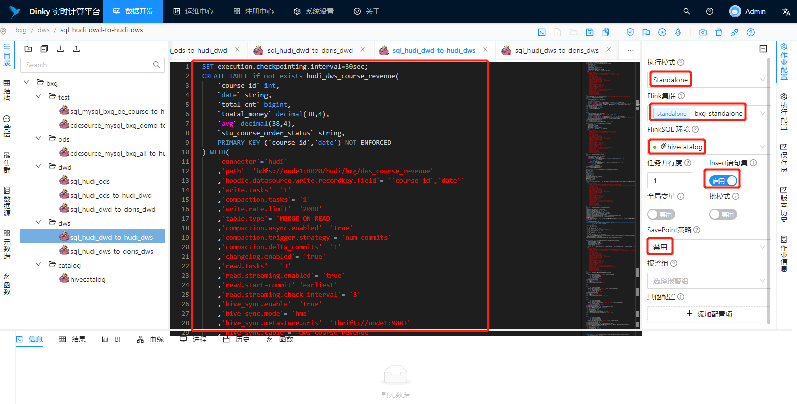

-   保存配置,提交任务

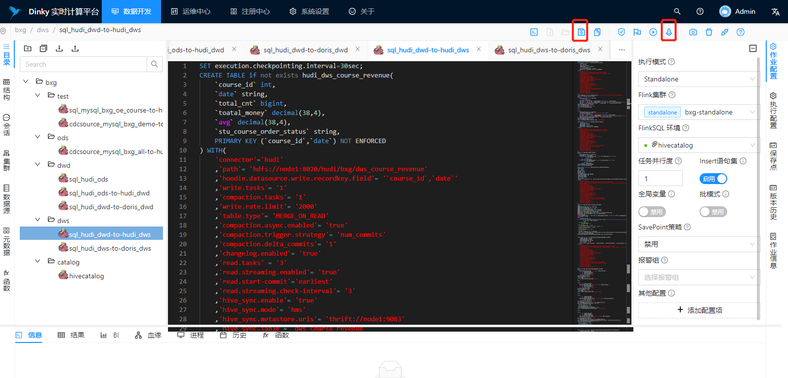

##### 查看任务

-   在运维中心查看任务:

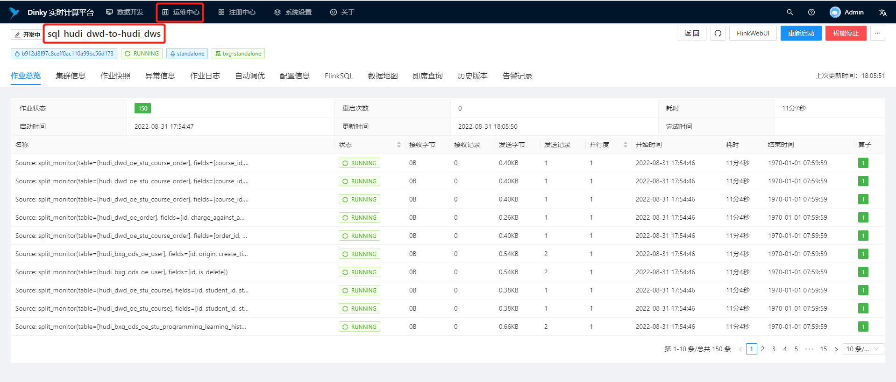

-   在flink web界面查看任务：

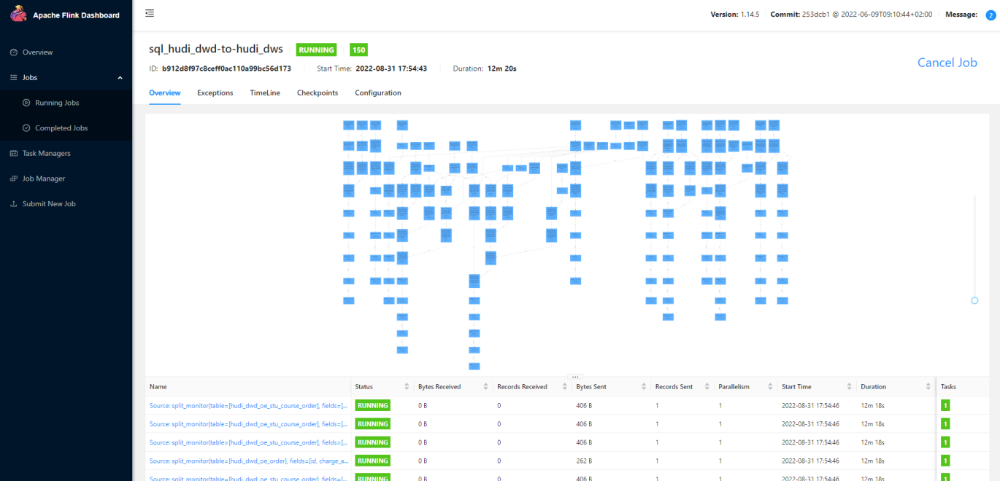

##### 查看结果

-   查看hdfs:

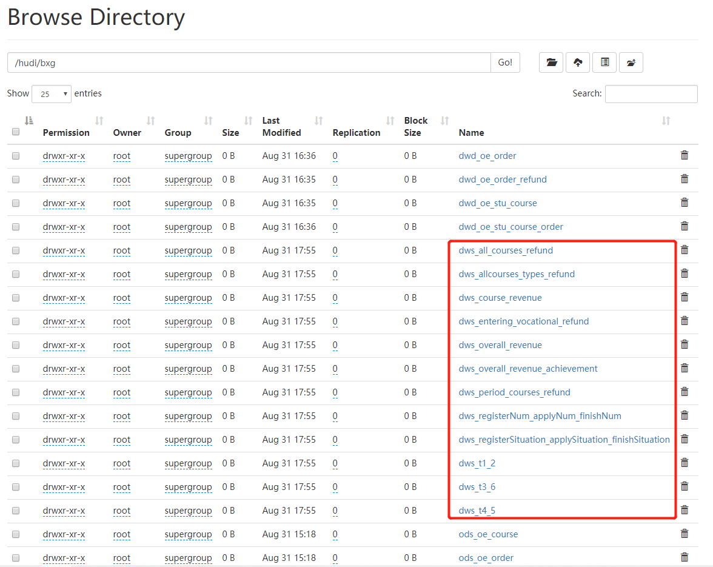

-   查看hive的bxg数据库:

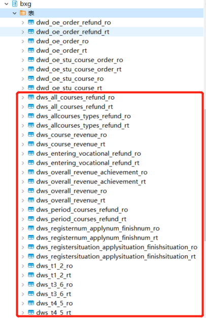

-   查看hive的bxg\_meta数据库:

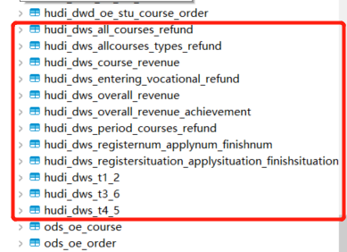

#### sql\_hudi\_dws-to-doris\_dws 作业

##### doris建表

-   这里是下沉到doris,所以要事先在doris进行建表.建表语句如下:

```sql
CREATE TABLE IF NOT EXISTS bxg.dws_course_revenue
(
    `course_id` int,
    `date` varchar(255),
    `total_cnt` bigint,
    `toatal_money` decimal(27,4),
    `avg` decimal(27,4),
    `stu_course_order_status` string
) Unique Key (`course_id`,`date`)
DISTRIBUTED BY HASH(`course_id`) BUCKETS 10
PROPERTIES (
"replication_allocation" = "tag.location.default: 1"
);
CREATE TABLE IF NOT EXISTS bxg.dws_overall_revenue
(
    `course_id` int,
    `course_name` string,
    `paid_count` bigint,
    `paid_amount` decimal(27,4)
) Unique Key (`course_id`)
DISTRIBUTED BY HASH(`course_id`) BUCKETS 10
PROPERTIES (
"replication_allocation" = "tag.location.default: 1"
);

CREATE TABLE IF NOT EXISTS bxg.dws_overall_revenue_achievement
(
course_id INT,
`year` BIGINT,
`mon` BIGINT,
eff_year BIGINT,
eff_mon BIGINT,
course_type int,
`stu_course_delete_flag` BOOLEAN,
`stu_course_status` INT,
grade_name string,
`sm` decimal(27,6),
`cnt` BIGINT
) Unique Key (course_id,`year`,`mon`,eff_year,eff_mon,course_type,stu_course_delete_flag,stu_course_status)
DISTRIBUTED BY HASH(`course_id`) BUCKETS 10
PROPERTIES (
"replication_allocation" = "tag.location.default: 1"
);

CREATE TABLE if not exists bxg.dws_registerNum_applyNum_finishNum(
    `create_time_year` varchar(255),
    `create_time_day` varchar(255),
    `effective_date_day` varchar(255),
    `learn_time_day` varchar(255),
    `count` bigint
) Unique Key (`create_time_year`, `create_time_day`, `effective_date_day`, `learn_time_day`)
DISTRIBUTED BY HASH(`create_time_year`, `create_time_day`, `effective_date_day`, `learn_time_day`) BUCKETS 5
PROPERTIES (
"replication_allocation" = "tag.location.default: 1"
);
CREATE TABLE if not exists bxg.dws_registerSituation_applySituation_finishSituation (
    `effective_date_month` varchar(255),
    `learn_time_month` varchar(255),
    `finished_time_month` varchar(255),
    `create_time_month` varchar(255),
    `registerNum` bigint,
    `applyCount` bigint,
    `applyNum` bigint
) Unique Key (`effective_date_month` , `learn_time_month`, `finished_time_month`, `create_time_month`)
DISTRIBUTED BY HASH(`effective_date_month` , `learn_time_month`, `finished_time_month`, `create_time_month`) BUCKETS 5
PROPERTIES (
"replication_allocation" = "tag.location.default: 1"
);

CREATE TABLE IF NOT EXISTS bxg.dws_t1_2
(
`month`             varchar(32) NOT NULL
,`Online_Order`     BIGINT
,`SVIP_Order`       BIGINT
,`Live_Order`       BIGINT
,`Annual_Order`     BIGINT
,`Semi_Order`       BIGINT
,`Quarterly_Order`  BIGINT
,`Monthly_Order`    BIGINT
,`Online_amount`    DECIMAL(27,6)
,`SVIP_amount`      DECIMAL(27,6)
,`Live_amount`      DECIMAL(27,6)
,`Annual_amount`    DECIMAL(27,6)
,`Semi_amount`      DECIMAL(27,6)
,`Quarterly_amount` DECIMAL(27,6)
,`Monthly_amount`   DECIMAL(27,6)
) Unique Key (`month` )
DISTRIBUTED BY HASH(`month`) BUCKETS 10
PROPERTIES (
"replication_allocation" = "tag.location.default: 1"
);
CREATE TABLE IF NOT EXISTS bxg.dws_t3_6
(
`C_ID`              INT NOT NULL
,`C_Name`           STRING
,`C_type`           STRING
,`p_1m`             BIGINT
,`p_2m`             BIGINT
,`p_3m`             BIGINT
,`p_4m`             BIGINT
,`p_5m`             BIGINT
,`p_6m`             BIGINT
,`p_7m`             BIGINT
,`p_8m`             BIGINT
,`p_9m`             BIGINT
,`p_10m`            BIGINT
,`p_11m`            BIGINT
,`p_12m`            BIGINT
,`total`            BIGINT
,`a_1m`            DECIMAL(27,6)
,`a_2m`            DECIMAL(27,6)
,`a_3m`            DECIMAL(27,6)
,`a_4m`            DECIMAL(27,6)
,`a_5m`            DECIMAL(27,6)
,`a_6m`            DECIMAL(27,6)
,`a_7m`            DECIMAL(27,6)
,`a_8m`            DECIMAL(27,6)
,`a_9m`            DECIMAL(27,6)
,`a_10m`           DECIMAL(27,6)
,`a_11m`           DECIMAL(27,6)
,`a_12m`           DECIMAL(27,6)
,`A_avg_price`    DECIMAL(27,6)
) Unique Key (`C_ID`)
DISTRIBUTED BY HASH(`C_ID`) BUCKETS 10
PROPERTIES (
"replication_allocation" = "tag.location.default: 1"
);
CREATE TABLE IF NOT EXISTS bxg.dws_t4_5
(
`year`     BIGINT NOT NULL
,`mon`     BIGINT
,`Tag`     INT
,`sm`      DECIMAL(27, 2)
) Unique Key (`year`,`mon`,`Tag`)
DISTRIBUTED BY HASH(`year`) BUCKETS 2
PROPERTIES (
"replication_allocation" = "tag.location.default: 1"
);

CREATE TABLE IF NOT EXISTS bxg.dws_all_courses_refund
(
  `month` VARCHAR(32),
  `all_courses_refund_money` DECIMAL(27,6),
  `course_refund_money` DECIMAL(27,6),
  `overfee_refund_money` DECIMAL(27,6),
  `total_refund_money` DECIMAL(27,6),
  `offline_course_refund_money` DECIMAL(27,6),
  `offline_overfee_refund_money` DECIMAL(27,6),
  `offline_total_refund_money` DECIMAL(27,6),
  `all_courses_refund_amount` BIGINT,
  `course_refund_amount` BIGINT,
  `overfee_refund_amount` BIGINT,
  `total_refund_amount` BIGINT,
  `offline_course_refund_amount` BIGINT,
  `offline_overfee_refund_amount` BIGINT,
  `offline_total_refund_amount` BIGINT
) Unique Key (`month`)
DISTRIBUTED BY HASH(`month`) BUCKETS 10
PROPERTIES (
"replication_allocation" = "tag.location.default: 1"
);
CREATE TABLE IF NOT EXISTS bxg.dws_period_courses_refund
( 
   `month` VARCHAR(32),
   order_refund_status INT,
   stu_course_status INT,
   `total_b_enter_f_refund_amount` BIGINT,
   `enter_b_seven_in_refund_amount` BIGINT,
   `enter_b_seven_out_refund_amount` BIGINT,
   `total_b_enter_f_refund_money` DECIMAL(27,6),
   `enter_b_seven_in_refund_money` DECIMAL(27,6),
  `enter_b_seven_out_refund_amount_money` DECIMAL(27,6)
) Unique Key (`month`,order_refund_status,stu_course_status)
DISTRIBUTED BY HASH(`month`) BUCKETS 10
PROPERTIES (
"replication_allocation" = "tag.location.default: 1"
);
CREATE TABLE IF NOT EXISTS bxg.dws_entering_vocational_refund
( 
   `month` VARCHAR(32),
  `online_employment_refund_amount` BIGINT,
  `SVIP_refund_amount` BIGINT,
  `live_guarantee_refund_amount` BIGINT,
  `year_member_refund_amount` BIGINT,
  `half_year_member_refund_amount` BIGINT,
  `season_member_refund_amount` BIGINT,
  `month_member_refund_amount` BIGINT,
   `online_employment_refund_money` DECIMAL(27,6),
  `SVIP_refund_money` DECIMAL(27,6),
  `live_guarantee_refund_money` DECIMAL(27,6),
  `year_member_refund_money` DECIMAL(27,6),
  `half_year_member_refund_money` DECIMAL(27,6),
  `season_member_refund_money` DECIMAL(27,6),
  `month_member_refund_money` DECIMAL(27,6)
) Unique Key (`month`)
DISTRIBUTED BY HASH(`month`) BUCKETS 10
PROPERTIES (
"replication_allocation" = "tag.location.default: 1"
);
CREATE TABLE IF NOT EXISTS bxg.dws_allcourses_types_refund
( 
 `course_id` INT,
 `course_name` VARCHAR(512),
 `refund_type` INT,
 `effective_date` datetime,
 `refund_time` datetime,
 `course_type` VARCHAR(32),
`January_amount` BIGINT,
`February_amount` BIGINT,
`March_amount` BIGINT,
`April_amount` BIGINT,
`May_amount` BIGINT,
`June_amount` BIGINT,
`July_amount` BIGINT,
`August_amount` BIGINT,
`September_amount` BIGINT,
`October_amount` BIGINT,
`November_amount` BIGINT,
`December_amount` BIGINT,
`January_money` DECIMAL(27,6),
`February_money` DECIMAL(27,6),
`March_money` DECIMAL(27,6),
`April_money` DECIMAL(27,6),
`May_money` DECIMAL(27,6),
`June_money` DECIMAL(27,6),
`July_money` DECIMAL(27,6),
`August_money` DECIMAL(27,6),
`September_money` DECIMAL(27,6),
`October_money` DECIMAL(27,6),
`November_money` DECIMAL(27,6),
`December_money` DECIMAL(27,6)
) Unique Key (course_id, course_name,refund_type,effective_date,refund_time,course_type)
DISTRIBUTED BY HASH(course_id) BUCKETS 10
PROPERTIES (
"replication_allocation" = "tag.location.default: 1"
);
```


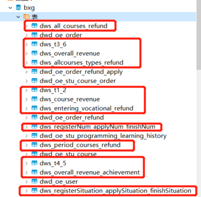

##### 创建作业

-   在dws目录下创建 sql\_hudi\_dws-to-doris\_dws 作业,代码和配置如下:

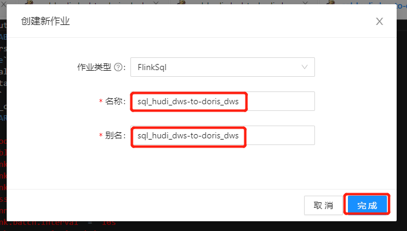

```sql
SET execution.checkpointing.interval=30sec;
CREATE TABLE if not exists doris_dws_course_revenue(
    `course_id` int,
    `date` string,
    `total_cnt` bigint,
    `toatal_money` decimal(38,4),
    `avg` decimal(38,4),
    `stu_course_order_status` string,
    PRIMARY KEY (`course_id`,`date`) NOT ENFORCED
) WITH (
    'fenodes' = 'node1:8030'
    ,'table.identifier' = 'bxg.dws_course_revenue'
    ,'sink.enable-delete' = 'true'
    ,'sink.properties.strip_outer_array' = 'true'
    ,'sink.batch.size' = '2000'
    ,'password' = '123456'
    ,'connector' = 'doris'
    ,'sink.batch.interval' = '10s'
    ,'sink.max-retries' = '5'
    ,'sink.properties.format' = 'json'
    ,'username' = 'root'
);
insert into doris_dws_course_revenue
select `course_id`, `date`, `total_cnt`, `toatal_money`, `avg`, `stu_course_order_status`
from hudi_dws_course_revenue;

CREATE TABLE if not exists doris_dws_overall_revenue(
    `course_id` int,
    `course_name` string,
    `paid_count` bigint,
    `paid_amount` decimal(38,4),
    PRIMARY KEY (`course_id`) NOT ENFORCED
) WITH (
    'fenodes' = 'node1:8030'
    ,'table.identifier' = 'bxg.dws_overall_revenue'
    ,'sink.enable-delete' = 'true'
    ,'sink.properties.strip_outer_array' = 'true'
    ,'sink.batch.size' = '2000'
    ,'password' = '123456'
    ,'connector' = 'doris'
    ,'sink.batch.interval' = '10s'
    ,'sink.max-retries' = '5'
    ,'sink.properties.format' = 'json'
    ,'username' = 'root'
);
insert into doris_dws_overall_revenue
select `course_id`, `course_name`,`paid_count`,`paid_amount`
from hudi_dws_overall_revenue;

CREATE TABLE if not exists doris_dws_overall_revenue_achievement (
course_id INT,
`year` BIGINT,
`mon` BIGINT,
eff_year BIGINT,
eff_mon BIGINT,
course_type int,
`stu_course_delete_flag` BOOLEAN,
`stu_course_status` INT,
grade_name string,
`sm` decimal(27,6),
`cnt` BIGINT,
 PRIMARY KEY (course_id,`year`,`mon`,eff_year,eff_mon,course_type,stu_course_delete_flag,stu_course_status) NOT ENFORCED
) WITH (
    'fenodes' = 'node1:8030'
    ,'table.identifier' = 'bxg.dws_overall_revenue_achievement'
    ,'sink.enable-delete' = 'true'
    ,'sink.properties.strip_outer_array' = 'true'
    ,'sink.batch.size' = '2000'
    ,'password' = '123456'
    ,'connector' = 'doris'
    ,'sink.batch.interval' = '10s'
    ,'sink.max-retries' = '5'
    ,'sink.properties.format' = 'json'
    ,'username' = 'root'
);
INSERT INTO `doris_dws_overall_revenue_achievement` SELECT 
course_id,`year`,`mon`,eff_year ,eff_mon ,
course_type,`stu_course_delete_flag`,
`stu_course_status`,grade_name,`sm`,`cnt`
FROM hudi_dws_overall_revenue_achievement;

CREATE TABLE if not exists doris_dws_registerNum_applyNum_finishNum(
    `create_time_year` string,
    `create_time_day` string,
    `effective_date_day` string,
    `learn_time_day` string,
    `count` bigint,
    PRIMARY KEY (`create_time_year`, `create_time_day`, `effective_date_day`, `learn_time_day`) NOT ENFORCED
) WITH (
    'fenodes' = 'node1:8030'
    ,'table.identifier' = 'bxg.dws_registerNum_applyNum_finishNum'
    ,'sink.enable-delete' = 'true'
    ,'sink.properties.strip_outer_array' = 'true'
    ,'sink.batch.size' = '2000'
    ,'password' = '123456'
    ,'connector' = 'doris'
    ,'sink.batch.interval' = '10s'
    ,'sink.max-retries' = '5'
    ,'sink.properties.format' = 'json'
    ,'username' = 'root'
);
insert into doris_dws_registerNum_applyNum_finishNum
select  `create_time_year`, `create_time_day`, `effective_date_day`, `learn_time_day`, `count`
from hudi_dws_registerNum_applyNum_finishNum;

CREATE TABLE if not exists doris_dws_registerSituation_applySituation_finishSituation(
    `effective_date_month` string,
    `learn_time_month` string,
    `finished_time_month` string,
    `create_time_month` string,
    `registerNum` bigint,
    `applyCount` bigint,
    `applyNum` bigint,
    PRIMARY KEY (`effective_date_month` , `learn_time_month`, `finished_time_month`, `create_time_month`) NOT ENFORCED
) WITH (
    'fenodes' = 'node1:8030'
    ,'table.identifier' = 'bxg.dws_registerSituation_applySituation_finishSituation'
    ,'sink.enable-delete' = 'true'
    ,'sink.properties.strip_outer_array' = 'true'
    ,'sink.batch.size' = '2000'
    ,'password' = '123456'
    ,'connector' = 'doris'
    ,'sink.batch.interval' = '10s'
    ,'sink.max-retries' = '5'
    ,'sink.properties.format' = 'json'
    ,'username' = 'root'
);
insert into doris_dws_registerSituation_applySituation_finishSituation
select `effective_date_month`, `learn_time_month`, `finished_time_month`,    `create_time_month`,`registerNum`, `applyCount`, `applyNum` 
from hudi_dws_registerSituation_applySituation_finishSituation;

CREATE TABLE if not exists doris_dws_t1_2(
`month`             STRING
,`Online_Order`     BIGINT
,`SVIP_Order`       BIGINT
,`Live_Order`       BIGINT
,`Annual_Order`     BIGINT
,`Semi_Order`       BIGINT
,`Quarterly_Order`  BIGINT
,`Monthly_Order`    BIGINT
,`Online_amount`    DECIMAL(38, 6)
,`SVIP_amount`      DECIMAL(38, 6)
,`Live_amount`      DECIMAL(38, 6)
,`Annual_amount`    DECIMAL(38, 6)
,`Semi_amount`      DECIMAL(38, 6)
,`Quarterly_amount` DECIMAL(38, 6)
,`Monthly_amount`   DECIMAL(38, 6)
,PRIMARY KEY (`month`) NOT ENFORCED
)WITH(
    'fenodes' = 'node1:8030'
    ,'table.identifier' = 'bxg.dws_t1_2'
    ,'sink.enable-delete' = 'true'
    ,'sink.properties.strip_outer_array' = 'true'
,'sink.batch.size' = '2000'
    ,'username' = 'root'
    ,'password' = '123456'
    ,'connector' = 'doris'
    ,'sink.batch.interval' = '10s'
    ,'sink.max-retries' = '5'
    ,'sink.properties.format' = 'json'
);
INSERT INTO doris_dws_t1_2 
SELECT 
`month`,`Online_Order`,`SVIP_Order`,`Live_Order`,`Annual_Order`,`Semi_Order`,`Quarterly_Order`,`Monthly_Order`,`Online_amount`,`SVIP_amount`,`Live_amount`,`Annual_amount`,`Semi_amount`,`Quarterly_amount`,`Monthly_amount`
FROM hudi_dws_t1_2;

CREATE TABLE if not exists doris_dws_t3_6(
 `C_ID`             INT
,`C_Name`           STRING
,`C_type`           STRING
,`p_1m`             BIGINT
,`p_2m`             BIGINT
,`p_3m`             BIGINT
,`p_4m`             BIGINT
,`p_5m`             BIGINT
,`p_6m`             BIGINT
,`p_7m`             BIGINT
,`p_8m`             BIGINT
,`p_9m`             BIGINT
,`p_10m`            BIGINT
,`p_11m`            BIGINT
,`p_12m`            BIGINT
,`total`            BIGINT
,`a_1m`             DECIMAL(38, 6)
,`a_2m`             DECIMAL(38, 6)
,`a_3m`             DECIMAL(38, 6)
,`a_4m`             DECIMAL(38, 6)
,`a_5m`             DECIMAL(38, 6)
,`a_6m`             DECIMAL(38, 6)
,`a_7m`             DECIMAL(38, 6)
,`a_8m`             DECIMAL(38, 6)
,`a_9m`             DECIMAL(38, 6)
,`a_10m`            DECIMAL(38, 6)
,`a_11m`            DECIMAL(38, 6)
,`a_12m`            DECIMAL(38, 6)
,`A_avg_price`         DECIMAL(38, 6)
,PRIMARY KEY (`C_ID`) NOT ENFORCED
)WITH(
    'fenodes' = 'node1:8030'
    ,'table.identifier' = 'bxg.dws_t3_6'
    ,'sink.enable-delete' = 'true'
    ,'sink.properties.strip_outer_array' = 'true'
,'sink.batch.size' = '2000'
    ,'username' = 'root'
    ,'password' = '123456'
    ,'connector' = 'doris'
    ,'sink.batch.interval' = '10s'
    ,'sink.max-retries' = '5'
    ,'sink.properties.format' = 'json'
);
INSERT INTO doris_dws_t3_6 
SELECT
`C_ID`,`C_Name`,`C_type`,`p_1m`,`p_2m`,`p_3m`,`p_4m`,`p_5m`,`p_6m`,`p_7m`,`p_8m`,`p_9m`,`p_10m`,`p_11m`,`p_12m`,`total`,`a_1m`,`a_2m`,`a_3m`,`a_4m`,`a_5m`,`a_6m`,`a_7m`,`a_8m`,`a_9m`,`a_10m`,`a_11m`,`a_12m`,`A_avg_price`
FROM hudi_dws_t3_6;

CREATE TABLE if not exists doris_dws_t4_5(
`year`     BIGINT
,`mon`     BIGINT
,`Tag`     INT
,`sm`      DECIMAL(35, 2)
)WITH(
    'fenodes' = 'node1:8030'
    ,'table.identifier' = 'bxg.dws_t4_5'
    ,'sink.enable-delete' = 'true'
    ,'sink.properties.strip_outer_array' = 'true'
,'sink.batch.size' = '2000'
    ,'username' = 'root'
    ,'password' = '123456'
    ,'connector' = 'doris'
    ,'sink.batch.interval' = '10s'
    ,'sink.max-retries' = '5'
    ,'sink.properties.format' = 'json'
);
INSERT INTO  doris_dws_t4_5
SELECT
`year`,`mon`,`Tag`,`sm` 
FROM hudi_dws_t4_5;

CREATE TABLE if not exists doris_dws_all_courses_refund (
`month` VARCHAR(32),
  `all_courses_refund_money` DECIMAL(38,6),
  `course_refund_money` DECIMAL(38,6),
  `overfee_refund_money` DECIMAL(38,6),
  `total_refund_money` DECIMAL(38,6),
  `offline_course_refund_money` DECIMAL(38,6),
  `offline_overfee_refund_money` DECIMAL(38,6),
  `offline_total_refund_money` DECIMAL(38,6),
  `all_courses_refund_amount` BIGINT,
  `course_refund_amount` BIGINT,
  `overfee_refund_amount` BIGINT,
  `total_refund_amount` BIGINT,
  `offline_course_refund_amount` BIGINT,
  `offline_overfee_refund_amount` BIGINT,
  `offline_total_refund_amount` BIGINT,
 PRIMARY KEY (`month`) NOT ENFORCED
) WITH (
    'fenodes' = 'node1:8030'
    ,'table.identifier' = 'bxg.dws_all_courses_refund'
    ,'sink.enable-delete' = 'true'
    ,'sink.properties.strip_outer_array' = 'true'
    ,'sink.batch.size' = '2000'
    ,'password' = '123456'
    ,'connector' = 'doris'
    ,'sink.batch.interval' = '10s'
    ,'sink.max-retries' = '5'
    ,'sink.properties.format' = 'json'
    ,'username' = 'root'
);
INSERT INTO `doris_dws_all_courses_refund` SELECT 
`month`, `all_courses_refund_money`,`course_refund_money`,`overfee_refund_money`,`total_refund_money`,`offline_course_refund_money`,`offline_overfee_refund_money`,`offline_total_refund_money`,`all_courses_refund_amount`,`course_refund_amount` ,`overfee_refund_amount` ,`total_refund_amount`,
`offline_course_refund_amount`,`offline_overfee_refund_amount`,`offline_total_refund_amount`
FROM hudi_dws_all_courses_refund;

CREATE TABLE if not exists doris_dws_period_courses_refund (
`month` VARCHAR(32),
   order_refund_status INT,
   stu_course_status INT,
   `total_b_enter_f_refund_amount` BIGINT,
   `enter_b_seven_in_refund_amount` BIGINT,
   `enter_b_seven_out_refund_amount` BIGINT,
   `total_b_enter_f_refund_money` DECIMAL(38,6),
   `enter_b_seven_in_refund_money` DECIMAL(38,6),
  `enter_b_seven_out_refund_amount_money` DECIMAL(38,6),
 PRIMARY KEY (`month`,order_refund_status,stu_course_status) NOT ENFORCED
) WITH (
    'fenodes' = 'node1:8030'
    ,'table.identifier' = 'bxg.dws_period_courses_refund'
    ,'sink.enable-delete' = 'true'
    ,'sink.properties.strip_outer_array' = 'true'
    ,'sink.batch.size' = '2000'
    ,'password' = '123456'
    ,'connector' = 'doris'
    ,'sink.batch.interval' = '10s'
    ,'sink.max-retries' = '5'
    ,'sink.properties.format' = 'json'
    ,'username' = 'root'
);
INSERT INTO `doris_dws_period_courses_refund` SELECT 
`month`,order_refund_status,stu_course_status,`total_b_enter_f_refund_amount`,`enter_b_seven_in_refund_amount`,`enter_b_seven_out_refund_amount`,`total_b_enter_f_refund_money`,
`enter_b_seven_in_refund_money`,`enter_b_seven_out_refund_amount_money`
FROM hudi_dws_period_courses_refund;

CREATE TABLE if not exists doris_dws_entering_vocational_refund (
   `month` VARCHAR(32),
  `online_employment_refund_amount` BIGINT,
  `SVIP_refund_amount` BIGINT,
  `live_guarantee_refund_amount` BIGINT,
  `year_member_refund_amount` BIGINT,
  `half_year_member_refund_amount` BIGINT,
  `season_member_refund_amount` BIGINT,
  `month_member_refund_amount` BIGINT,
   `online_employment_refund_money` DECIMAL(38,6),
  `SVIP_refund_money` DECIMAL(38,6),
  `live_guarantee_refund_money` DECIMAL(38,6),
  `year_member_refund_money` DECIMAL(38,6),
  `half_year_member_refund_money` DECIMAL(38,6),
  `season_member_refund_money` DECIMAL(38,6),
  `month_member_refund_money` DECIMAL(38,6),
 PRIMARY KEY (`month`) NOT ENFORCED
) WITH (
    'fenodes' = 'node1:8030'
    ,'table.identifier' = 'bxg.dws_entering_vocational_refund'
    ,'sink.enable-delete' = 'true'
    ,'sink.properties.strip_outer_array' = 'true'
    ,'sink.batch.size' = '2000'
    ,'password' = '123456'
    ,'connector' = 'doris'
    ,'sink.batch.interval' = '10s'
    ,'sink.max-retries' = '5'
    ,'sink.properties.format' = 'json'
    ,'username' = 'root'
);
INSERT INTO `doris_dws_entering_vocational_refund` SELECT 
`month`,`online_employment_refund_amount`,`SVIP_refund_amount`,`live_guarantee_refund_amount`,`year_member_refund_amount` , `half_year_member_refund_amount`,
`season_member_refund_amount`,`month_member_refund_amount`,`online_employment_refund_money`,`SVIP_refund_money`,`live_guarantee_refund_money`,  `year_member_refund_money`,`half_year_member_refund_money`,`season_member_refund_money`,`month_member_refund_money`
FROM hudi_dws_entering_vocational_refund;

CREATE TABLE if not exists doris_dws_allcourses_types_refund(
 `course_id` INT,
 `course_name` VARCHAR(512),
 `refund_type` INT,
 `effective_date` TIMESTAMP(3),
 `refund_time` TIMESTAMP(3),
 `course_type` VARCHAR(32),
`January_amount` BIGINT,
`February_amount` BIGINT,
`March_amount` BIGINT,
`April_amount` BIGINT,
`May_amount` BIGINT,
`June_amount` BIGINT,
`July_amount` BIGINT,
`August_amount` BIGINT,
`September_amount` BIGINT,
`October_amount` BIGINT,
`November_amount` BIGINT,
`December_amount` BIGINT,
`January_money` DECIMAL(38,6),
`February_money` DECIMAL(38,6),
`March_money` DECIMAL(38,6),
`April_money` DECIMAL(38,6),
`May_money` DECIMAL(38,6),
`June_money` DECIMAL(38,6),
`July_money` DECIMAL(38,6),
`August_money` DECIMAL(38,6),
`September_money` DECIMAL(38,6),
`October_money` DECIMAL(38,6),
`November_money` DECIMAL(38,6),
`December_money` DECIMAL(38,6),
 PRIMARY KEY (course_id, course_name,refund_type,effective_date,refund_time,course_type) NOT ENFORCED
) WITH (
    'fenodes' = 'node1:8030'
    ,'table.identifier' = 'bxg.dws_allcourses_types_refund'
    ,'sink.enable-delete' = 'true'
    ,'sink.properties.strip_outer_array' = 'true'
    ,'sink.batch.size' = '2000'
    ,'password' = '123456'
    ,'connector' = 'doris'
    ,'sink.batch.interval' = '10s'
    ,'sink.max-retries' = '5'
    ,'sink.properties.format' = 'json'
    ,'username' = 'root'
);
INSERT INTO `doris_dws_allcourses_types_refund` SELECT 
`course_id`,`course_name`,`refund_type`,`effective_date`,`refund_time`,
`course_type`,`January_amount`,`February_amount`,`March_amount`,`April_amount`,
`May_amount`,`June_amount`,`July_amount`,
`August_amount`,`September_amount`,`October_amount`,`November_amount`,`December_amount`,`January_money`,`February_money`,`March_money`,`April_money`,`May_money`,`June_money`,`July_money`,`August_money`,`September_money`,`October_money`,
`November_money`,`December_money`
FROM hudi_dws_allcourses_types_refund;
```


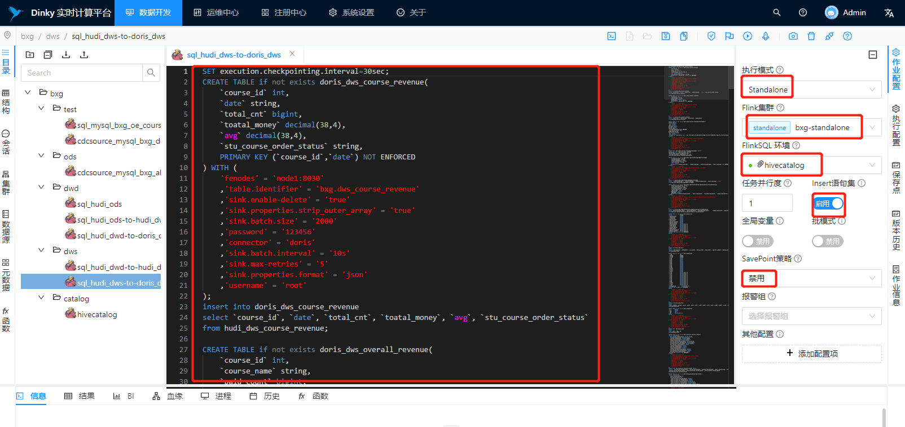

-   保存配置,提交任务

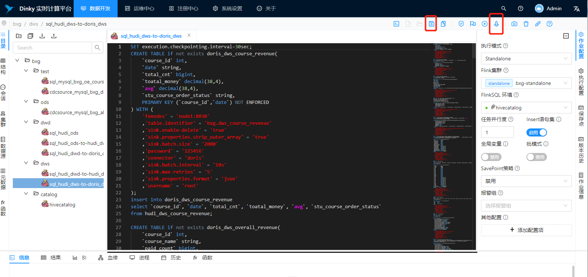

##### 查看任务

-   在运维中心查看任务:

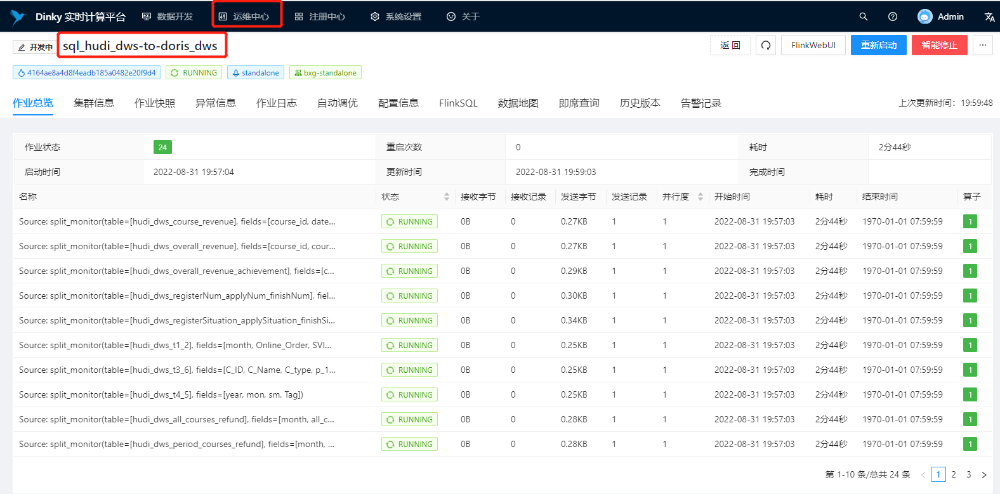

-   在flink web界面查看任务：

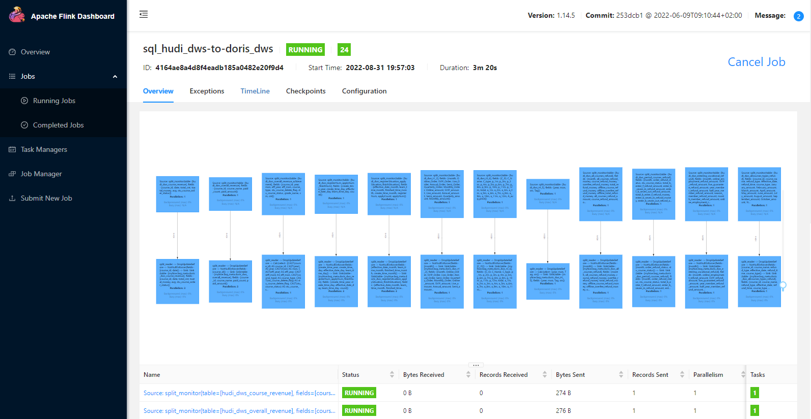

##### 查看结果

-   查看doris,表中已经存在数据.

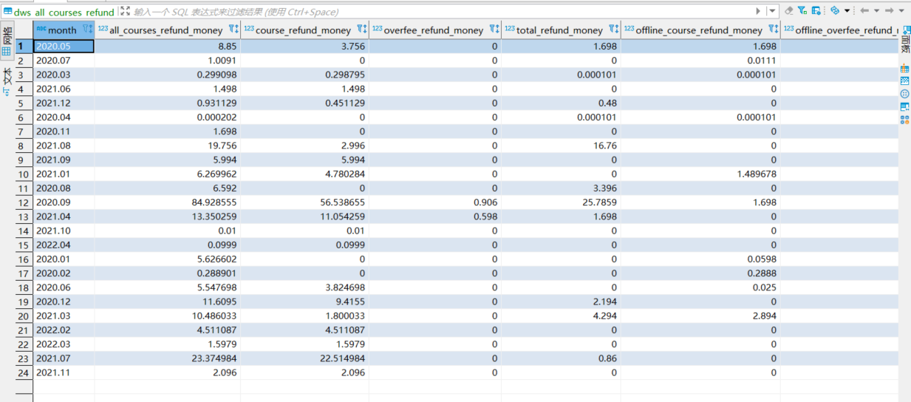

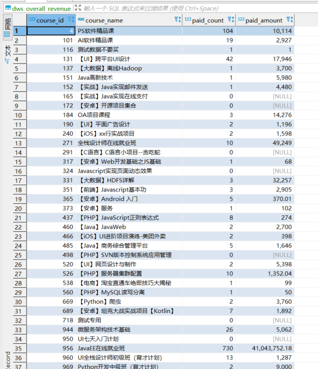

-   查看hive的bxg\_meta数据库:

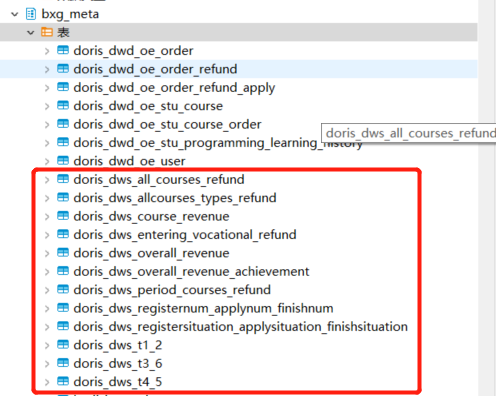
