# 博学谷大数据平台_性能优化

## 课程目标

-   掌握资源配置调优
-   了解反压产生的原因及问题的定位
-   掌握常见的数据倾斜解决方案
-   了解kafkaSource的调优
-   掌握Flink SQL的调优

## 资源配置调优

Flink 性能调优的第一步，就是为任务分配合适的资源，在一定范围内，增加资源的分配与性能的提升是成正比的，实现了最优的资源配置后，在此基础上再考虑进行后面论述的性能调优策略。

提交方式主要是 **yarn-per-job**，资源的分配在使用脚本提交 Flink 任务时进行指定。

标准的 Flink 任务提交脚本（Generic CLI 模式），从 **1.11** 开始，增加了通用客户端模式，参数使用**-D \<property=value\>**指定。

```shell
bin/flink run \
 -m yarn-cluster  \
 -p 5 \ 指定并行度
 -Dyarn.application.queue=test \ 指定 yarn 队列
 -Djobmanager.memory.process.size=1024mb \ 指定 JM 的总进程大小
 -Dtaskmanager.memory.process.size=1024mb \ 指定每个 TM 的总进程大小
 -Dtaskmanager.numberOfTaskSlots=2 \ 指定每个 TM 的 slot 数
 -pyarch venv.zip  \
 -pyexec venv.zip/venv/bin/python3.8  \
 -py examples/python/datastream/word_count.py
```

参数列表：https://nightlies.apache.org/flink/flink-docs-release-1.14/zh/docs/deployment/config/

### 知识点01： 【理解】内存设置

生产资源配置：

```shell
bin/flink run \
 -m yarn-cluster  \
 -p 5 \ 指定并行度
 -Dyarn.application.queue=test \ 指定 yarn 队列
 -Djobmanager.memory.process.size=1024mb \ 指定 JM 的总进程大小
 -Dtaskmanager.memory.process.size=1024mb \ 指定每个 TM 的总进程大小
 -Dtaskmanager.numberOfTaskSlots=2 \ 与容器核数 1core：1slot 或 1core：2slot
 -pyarch venv.zip  \
 -pyexec venv.zip/venv/bin/python3.8  \
 -py examples/python/datastream/word_count.py
```

Flink 是实时流处理，关键在于资源情况能不能抗住高峰时期每秒的数据量，通常用QPS/TPS 来描述数据情况。

### 知识点02： 【理解】并行度设置

#### 最优并行度计算

开发完成后，先进行压测。任务并行度给 10 以下，测试单个并行度的处理上限。然后**总 QPS/单并行度的处理能力 = 并行度**。不能只从 QPS 去得出并行度，因为有些字段少、逻辑简单的任务，单并行度一秒处理几万条数据。而有些数据字段多，处理逻辑复杂，单并行度一秒只能处理 1000 条数据。最好根据高峰期的 QPS 压测，并行度\*1.2 倍，富余一些资源。

#### Source端并行

**数据源端是 Kafka，Source 的并行度设置为 Kafka 对应 Topic 的分区数**。

如果已经等于 Kafka 的分区数，消费速度仍跟不上数据生产速度，考虑下Kafka要扩大分区，同时调大并行度等于分区数。

Flink 的一个并行度可以处理一至多个分区的数据，如果并行度多于 Kafka 的分区数，那么就会造成有的并行度空闲，浪费资源。

#### Transform

-   Keyby 之前的算子

一般不会做太重的操作，都是比如 map、filter、flatmap 等处理较快的算子，并行度

可以和 source 保持一致。

-   Keyby 之后的算子

如果并发较大，建议设置并行度为 2 的整数次幂，例如：128、256、512；

小并发任务的并行度不一定需要设置成 2 的整数次幂；

大并发任务如果没有 KeyBy，并行度也无需设置为 2 的整数次幂；

#### Sink端并行

Sink端是数据流向下游的地方，**可以根据Sink端的数据量及下游的服务抗压能力进行评估**。

**如果Sink端是 Kafka，可以设为Kafka对应Topic的分区数**。

Sink 端的数据量小，比较常见的就是监控告警的场景，并行度可以设置的小一些。

Source 端的数据量是最小的，拿到 Source 端流过来的数据后做了细粒度的拆分，数据量不断的增加，到 Sink 端的数据量就非常大。那么在 Sink 到下游的存储中间件的时候就需要提高并行度。

另外 Sink 端要与下游的服务进行交互，并行度还得根据下游的服务抗压能力来设置，如果在 Flink Sink 这端的数据量过大的话，且 Sink 处并行度也设置的很大，但下游的服务完全撑不住这么大的并发写入，可能会造成下游服务直接被写挂，所以最终还是要在 Sink处的并行度做一定的权衡。

### 知识点03： 【理解】RocksDB

RocksDB是基于LSM Tree实现的（类似 HBase），写数据都是先缓存到内存中，所以 RocksDB 的写请求效率比较高。RocksDB 使用内存结合磁盘的方式来存储数据，每次获取数据时，先从内存中 blockcache 中查找，如果内存中没有再去磁盘中查询。优化后差不多单并行度 TPS 5000 record/s，性能瓶颈主要在于 RocksDB 对磁盘的读请求，所以当处理性能不够时，仅需要横向扩展并行度即可提高整个 Job 的吞吐量。以下几个调优参数：

-   设置本地 RocksDB 多目录

在 flink-conf.yaml 中配置：

```shell
state.backend.rocksdb.localdir:
/export/data1/flink/rocksdb,/export/data2/flink/rocksdb,/export/data3/flink/rocksdb
```

> **注意**：不要配置单块磁盘的多个目录，务必将目录配置到多块**不同的磁盘**上，让多块磁盘来分担压力。当设置多个 RocksDB 本地磁盘目录时，**Flink 会随机选择要使用的目录**，所以就可能存在三个并行度共用同一目录的情况。如果服务器磁盘数较多，一般不会出现该情况，但是如果任务重启后吞吐量较低，可以检查是否发生了多个并行度共用同一块磁盘的情况。

如：当一个 TaskManager 包含 3 个 slot 时，那么单个服务器上的三个并行度都对磁盘造成频繁读写，从而导致三个并行度的之间相互争抢同一个磁盘 io，这样务必导致三个并行度的吞吐量都会下降。设置多目录实现三个并行度使用不同的硬盘从而减少资源竞争。

如下所示是测试过程中磁盘的 IO 使用率，可以看出三个大状态算子的并行度分别对应了三块磁盘，这三块磁盘的 IO 平均使用率都保持在 45% 左右，IO 最高使用率几乎都是 100%，而其他磁盘的 IO 平均使用率相对低很多。由此可见使用 RocksDB 做为状态后端且有大状态的频繁读取时， 对磁盘 IO 性能消耗确实比较大。

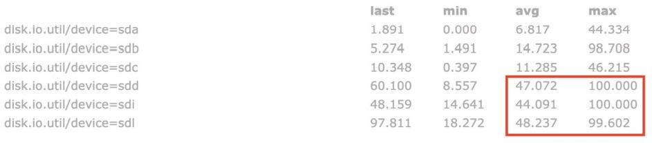

如下图所示，其中两个并行度共用了 sdb 磁盘，一个并行度使用 sdj 磁盘。可以看到sdb 磁盘的 IO 使用率已经达到了 91.6%，就会导致 sdb 磁盘对应的两个并行度吞吐量大大降低，从而使得整个 Flink 任务吞吐量降低。如果每个服务器上有一两块 SSD，**强烈建议将 RocksDB 的本地磁盘目录配置到 SSD 的目录下，从 HDD 改为 SSD 对于性能的提升可能比配置 10 个优化参数更有效**。

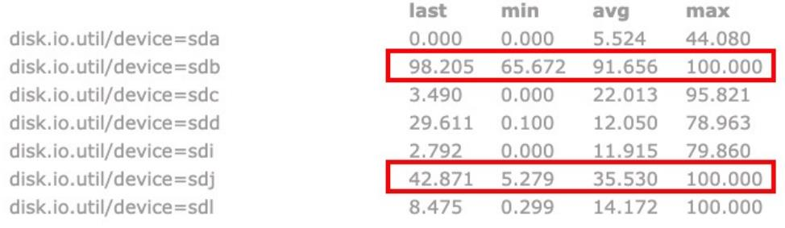

-   state.backend.incremental：开启增量检查点，默认 false，改为 true。
-   state.backend.rocksdb.predefined-options：**SPINNING_DISK_OPTIMIZED_HIGH_MEM** 设置为机械硬盘+内存模式，有条件上SSD，指定为 FLASH_SSD_OPTIMIZED
-   state.backend.rocksdb.block.cache-size: 整个RocksDB共享一个blockcache，读数据时内存的 cache 大小，该参数越大读数据时缓存命中率越高，默认大小为 8 MB，建议设置到 64 \~ 256 MB。
-   state.backend.rocksdb.thread.num: 用于后台 flush 和合并 sst 文件的线程数，默认为 1，建议调大，机械硬盘用户可以改为 4 等更大的值。
-   state.backend.rocksdb.writebuffer.size: RocksDB 中，每个 State 使用一个Column Family，每个 Column Family 使用独占的 write buffer，建议调大，例如：32M
-   state.backend.rocksdb.writebuffer.count: 每 个 Column Family对应的writebuffer 数目，默认值是 2，对于机械磁盘来说，如果内存⾜够大，可以调大到5左右
-   state.backend.rocksdb.writebuffer.number-to-merge: 将数据从 writebuffer中 flush 到磁盘时，需要合并的 writebuffer 数量，默认值为 1，可以调成 3。
-   state.backend.local-recovery: 设置本地恢复，当 Flink 任务失败时，可以基于本地的状态信息进行恢复任务，可能不需要从 hdfs 拉取数据

### 知识点04： 【掌握】Checkpoint

一般我们的 Checkpoint 时间间隔可以设置为**分钟**级别，例如 1 分钟、3 分钟，对于状态很大的任务每次 Checkpoint 访问 HDFS 比较耗时，可以设置为 5~10 分钟一次Checkpoint，并且调大两次 Checkpoint 之间的暂停间隔，例如设置两次 Checkpoint 之间至少暂停 4 或 8 分钟。

如果 Checkpoint 语义配置为 EXACTLY_ONCE，那么在 Checkpoint 过程中还会存在 barrier 对齐的过程，可以通过 Flink Web UI 的 Checkpoint 选项卡来查看Checkpoint 过程中各阶段的耗时情况，从而确定到底是哪个阶段导致 Checkpoint 时间过长然后针对性的解决问题。

RocksDB 相关参数在 1.3 中已说明，可以在 flink-conf.yaml 指定，也可以在 Job 的代码中调用 API 单独指定，这里不再列出。

```shell
#注释以下配置
#设置checkpoint周期时间
execution.checkpointing.interval: 5000
#设置有且仅有一次模式 目前支持 EXACTLY_ONCE、AT_LEAST_ONCE        
execution.checkpointing.mode: EXACTLY_ONCE
#设置checkpoint的存储方式
state.backend: filesystem
#设置checkpoint的存储位置
state.checkpoints.dir: hdfs://node1:8020/checkpoints
#设置savepoint的存储位置
state.savepoints.dir: hdfs://node1:8020/checkpoints
#设置checkpoint的超时时间 即一次checkpoint必须在该时间内完成 不然就丢弃
execution.checkpointing.timeout: 600000
#设置两次checkpoint之间的最小时间间隔
execution.checkpointing.min-pause: 500
#设置并发checkpoint的数目
execution.checkpointing.max-concurrent-checkpoints: 1
#开启checkpoints的外部持久化这里设置了清除job时保留checkpoint，默认值时保留一个 假如要保留3个
state.checkpoints.num-retained: 3
#默认情况下，checkpoint不是持久化的，只用于从故障中恢复作业。当程序被取消时，它们会被删除。但是你可以配置checkpoint被周期性持久化到外部，类似于savepoints。这些外部的checkpoints将它们的元数据输出到外#部持久化存储并且当作业失败时不会自动清除。这样，如果你的工作失败了，你就会有一个checkpoint来恢复。
#ExternalizedCheckpointCleanup模式配置当你取消作业时外部checkpoint会产生什么行为:
#RETAIN_ON_CANCELLATION: 当作业被取消时，保留外部的checkpoint。注意，在此情况下，您必须手动清理checkpoint状态。
#DELETE_ON_CANCELLATION: 当作业被取消时，删除外部化的checkpoint。只有当作业失败时，检查点状态才可用。
execution.checkpointing.externalized-checkpoint-retention: ETAIN_ON_CANCELLATION
```

### 知识点05： 【理解】压测方式

压测的方式很简单，先在kafka 中积压数据，之后开启 Flink任务，出现反压，就是处理瓶颈。相当于水库先积水，一下子泄洪。数据可以是自己造的模拟数据，也可以是生产中的部分数据。

## 反压处理

反压（BackPressure）通常产生于这样的场景：短时间的负载高峰导致系统接收数据的速率远高于它处理数据的速率。许多日常问题都会导致反压，例如，垃圾回收停顿可能会导致流入的数据快速堆积，或遇到大促、秒杀活动导致流量陡增。反压如果不能得到正确的处理，可能会导致资源耗尽甚至系统崩溃。

反压机制是指系统能够自己检测到被阻塞的 Operator，然后自适应地降低源头或上游数据的发送速率，从而维持整个系统的稳定。Flink 任务一般运行在多个节点上，数据从上游算子发送到下游算子需要网络传输，若系统在反压时想要降低数据源头或上游算子数据的发送速率，那么肯定也需要网络传输。所以下面先来了解一下 Flink 的网络流控（Flink 对网络数据流量的控制）机制。

### 知识点06： 【理解】反压现象

Flink 的反压太过于天然了，导致无法简单地通过监控 BufferPool 的使用情况来判断反压状态。Flink 通过对运行中的任务进行采样来确定其反压，如果一个 Task 因为反压导致处理速度降低了，那么它肯定会卡在向 LocalBufferPool 申请内存块上。那么该 Task 的stack trace 应该是这样：

```java
java.lang.Object.wait(Native Method)
o.a.f.[...].LocalBufferPool.requestBuffer(LocalBufferPool.java:163)
o.a.f.[...].LocalBufferPool.requestBufferBlocking(LocalBufferPool.java:133) [...]
```

监控对正常的任务运行有一定影响，因此只有当 Web 页面切换到 Job 的BackPressure 页面时，JobManager 才会对该 Job 触发反压监控。默认情况下，JobManager 会触发 100 次 stack trace 采样，每次间隔 50ms 来确定反压。Web 界面看到的比率表示在内部方法调用中有多少stack trace 被卡在LocalBufferPool.requestBufferBlocking()，例如: 0.01 表示在 100 个采样中只有 1 个被卡在 LocalBufferPool.requestBufferBlocking()。采样得到的比例与反压状态的对应关系如下：

-   OK: 0 \<= 比例 \<= 0.10
-   LOW: 0.10 \< 比例 \<= 0.5
-   HIGH: 0.5 \< 比例 \<= 1

Task 的状态为 OK 表示没有反压，HIGH 表示这个 Task 被反压。

#### 利用 Flink Web UI定位产生反压的位置

在 Flink Web UI中有BackPressure的页面，通过该页面可以查看任务中 subtask的反压状态，如下两图所示，分别展示了状态是 OK 和 HIGH 的场景。

**排查的时候，先把 operator chain 禁用，方便定位**。

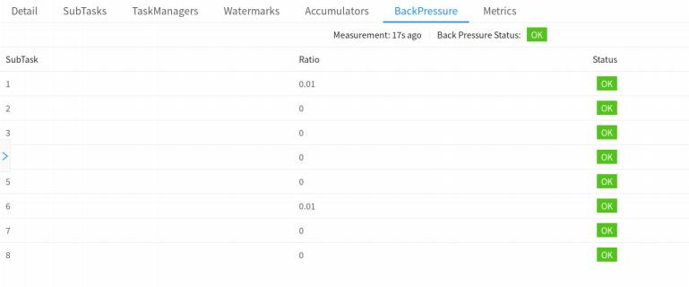

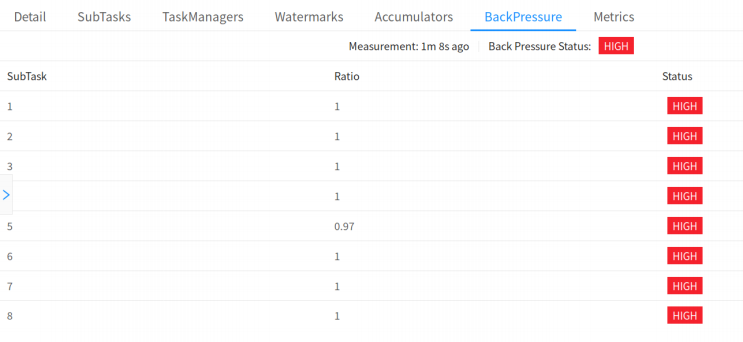

#### 利用 Metrics定位反压位置

当某个Task吞吐量下降时，基于**Credit** 的反压机制，上游不会给该Task发送数据，所以该 Task 不会频繁卡在向 Buffer Pool 去申请 Buffer。反压监控实现原理就是监控Task 是否卡在申请 buffer 这一步，**所以遇到瓶颈的 Task 对应的反压⻚⾯必然会显示OK，即表示没有受到反压**。

如果该Task吞吐量下降，造成该Task上游的Task出现反压时，必然会存在：**该Task 对应的 InputChannel 变满，已经申请不到可用的 Buffer 空间**。如果该 Task 的InputChannel 还能申请到可用 Buffer，那么上游就可以给该 Task 发送数据，上游 Task也就不会被反压了，所以说遇到瓶颈且导致上游 Task 受到反压的 Task 对应的InputChannel 必然是满的（**这⾥不考虑⽹络遇到瓶颈的情况**）。从这个思路出发，可以对该 Task 的 InputChannel 的使用情况进行监控，如果 InputChannel 使用率 100%，那么 该 Task 就是 我们要 找的 反压 源。 Flink 1.9 及以 上版 本 inPoolUsage 表 示inputFloatingBuffersUsage 和 inputExclusiveBuffersUsage 的总和。

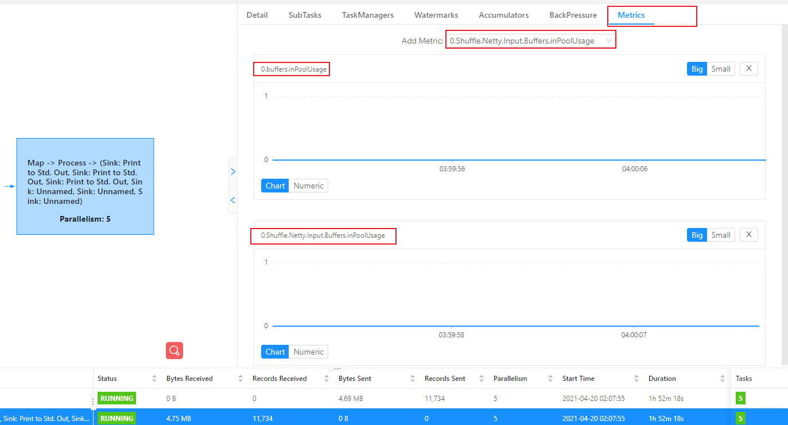

反压时，**可以看到遇到瓶颈的该Task的inPoolUage为1**。

### 知识点07： 【理解】反压的原因及处理

先检查基本原因，然后再深入研究更复杂的原因，最后找出导致瓶颈的原因。下面列出从最基本到比较复杂的一些反压潜在原因。

> **注意**：反压可能是暂时的，可能是由于负载高峰、CheckPoint 或作业重启引起的数据积压而导致反压。如果反压是暂时的，应该忽略它。另外，请记住，断断续续的反压会影响我们分析和解决问题。

#### 系统资源

检查涉及服务器基本资源的使用情况，如 CPU、网络或磁盘 I/O，目前 Flink 任务使用最主要的还是内存和 CPU 资源，本地磁盘、依赖的外部存储资源以及网卡资源一般都不会是瓶颈。如果某些资源被充分利用或大量使用，可以借助分析工具，分析性能瓶颈（JVM Profiler+ FlameGraph 生成火焰图）。

如何生成火焰图：https://zhuanlan.zhihu.com/p/267680267

如何读懂火焰图：https://zhuanlan.zhihu.com/p/29952444

-   针对特定的资源调优Flink
-   通过增加并行度或增加集群中的服务器数量来横向扩展
-   减少瓶颈算子上游的并行度，从而减少瓶颈算子接收的数据量（不建议，可能造成整个Job 数据延迟增大）

#### 垃圾收集（GC）

长时间GC暂停会导致性能问题。可以通过打印调试GC日志（通过-XX:+PrintGCDetails）或使用某些内存或 GC 分析器（GCViewer 工具）来验证是否处于这种情况。

在 Flink 提交脚本中,设置 JVM 参数，打印GC日志：

```shell
bin/flink run \
  -m yarn-cluster  \
  -p 5 \ 指定并行度
  -Dyarn.application.queue=test \ 指定 yarn 队列
  -Djobmanager.memory.process.size=1024mb \ 指定 JM 的总进程大小
  -Dtaskmanager.memory.process.size=1024mb \ 指定每个 TM 的总进程大小
  -Dtaskmanager.numberOfTaskSlots=2 \ 与容器核数 1core：1slot 或 1core：2slot
  -Denv.java.opts="-XX:+PrintGCDetails -XX:+PrintGCDateStamps" \
  -pyarch venv.zip  \
  -pyexec venv.zip/venv/bin/python3.8  \
  -py examples/python/datastream/word_count.py
```

-   下载 GC 日志的方式：

因为是 on yarn 模式，运行的节点一个一个找比较麻烦。可以打开 WebUI，选择JobManager 或者 TaskManager，点击 Stdout，即可看到 GC 日志，点击下载按钮即可

将 GC 日志通过 HTTP 的方式下载下来。

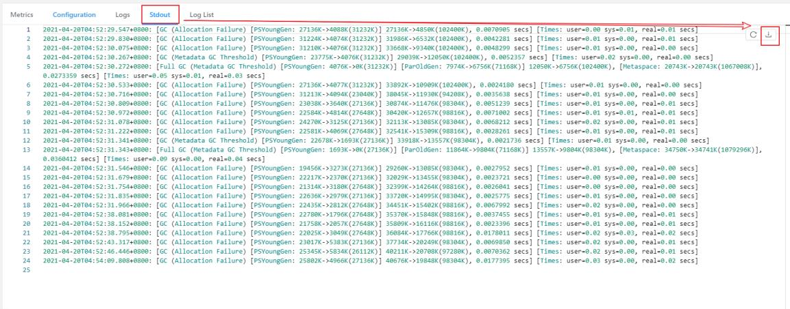

-   分析 GC 日志：

通过 GC 日志分析出单个 Flink Taskmanager 堆总大小、年轻代、老年代分配的内存空间、Full GC 后老年代剩余大小等，相关指标定义可以去 Github 具体查看。

GCViewer 地址：https://github.com/chewiebug/GCViewer

> 扩展：最重要的指标是 Full GC 后，老年代剩余大小这个指标，按照《Java 性能优化权威指南》这本书 Java 堆大小计算法则，设 Full GC 后老年代剩余大小空间为 M，那么堆的大小建议 3 ~ 4 倍
> M，新生代为 1 ~ 1.5 倍 M，老年代应为 2 ~ 3 倍 M。

#### CPU/ 线程瓶颈

有时，一个或几个线程导致 CPU 瓶颈，而整个机器的 CPU 使用率仍然相对较低，则可能无法看到 CPU 瓶颈。例如，48 核的服务器上，单个 CPU 瓶颈的线程仅占用 2％的CPU 使用率，就算单个线程发生了 CPU 瓶颈，我们也看不出来。可以考虑使用 2.2.1 提到的分析工具，它们可以显示每个线程的 CPU 使用情况来识别热线程。

#### 线程竞争

与上⾯的 CPU/线程瓶颈问题类似，subtask 可能会因为共享资源上高负载线程的竞争而成为瓶颈。同样，可以考虑使用 2.2.1 提到的分析工具，考虑在用户代码中查找同步开销、锁竞争，尽管避免在用户代码中添加同步。

#### 负载不平衡

如果瓶颈是由数据倾斜引起的，可以尝试通过将数据分区的 key 进行加盐或通过实现本地预聚合来减轻数据倾斜的影响。（**关于数据倾斜的详细解决方案，会在下一章节详细讨论**）

#### 外部依赖

如果发现我们的 Source 端数据读取性能比较低或者 Sink 端写入性能较差，需要检查第三方组件是否遇到瓶颈。例如，Kafka 集群是否需要扩容，Kafka 连接器是否并行度较低，HBase 的 rowkey 是否遇到热点问题。关于第三方组件的性能问题，需要结合具体的组件来分析。

## 数据倾斜

### 知识点08： 【掌握】判断是否存在数据倾斜

相同 Task 的多个 Subtask 中，个别 Subtask 接收到的数据量明显大于其他 Subtask 接收到的数据量，通过 Flink Web UI 可以精确地看到每个 Subtask 处理了多少数据，即可判断出 Flink 任务是否存在数据倾斜。通常，数据倾斜也会引起反压。

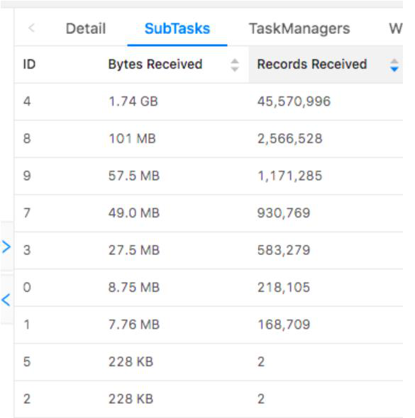

### 知识点09： 【掌握】数据倾斜的解决

#### keyBy 之前发生数据倾斜

如果 keyBy 之前就存在数据倾斜，上游算子的某些实例可能处理的数据较多，某些实例可能处理的数据较少，产生该情况可能是因为数据源的**数据本身就不均匀**，例如由于某些原因 Kafka 的 topic 中某些 partition 的数据量较大，某些 partition 的数据量较少。

对于不存在 keyBy 的 Flink 任务也会出现该情况。

这种情况，需要让 Flink 任务强制进行 shuffle。使用 shuffle、rebalance 或 rescale算子即可将数据均匀分配，从而解决数据倾斜的问题。

#### keyBy 后的聚合操作存在数据倾斜

使用 LocalKeyBy 的思想：在 keyBy 上游算子数据发送之前，首先在上游算子的本地，对数据进行聚合后再发送到下游，使下游接收到的数据量大大减少，从而使得 keyBy 之后的聚合操作不再是任务的瓶颈。类似 MapReduce 中 Combiner 的思想，**但是这要求聚合操作必须是多条数据或者一批数据才能聚合，单条数据没有办法通过聚合来减少数据量**。

从 Flink LocalKeyBy 实现原理来讲，必然会存在一个积攒批次的过程，在上游算子中必须攒够一定的数据量，对这些数据聚合后再发送到下游。

> 注意：Flink 是实时流处理，如果 keyby 之后的聚合操作存在数据倾斜，且没有开窗口的情况下，简单的认为使用两阶段聚合，是不能解决问题的。因为这个时候 Flink 是来一条处理一条，且向下游发送一条结果，对于原来 keyby 的维度（第二阶段聚合）来讲，数据量并没有减少，且结果重复计算（非 FlinkSQL，未使用回撤流）
>

如下图所示：

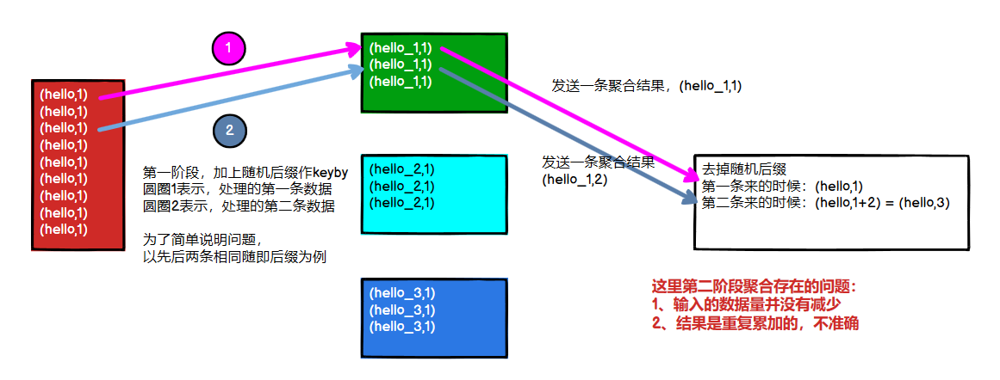

#### keyBy 后的窗口聚合操作存在数据倾斜

因为使用了窗口，变成了有界数据的处理（3.2.2 已分析过），窗口默认是触发时才会输出一条结果发往下游，所以可以使用**两阶段聚合**的方式：

**实现思路：**

-   第一阶段聚合：key 拼接随机数前缀或后缀，进行 keyby、开窗、聚合

注意：聚合完不再是 WindowedStream，要获取 WindowEnd 作为窗口标记作为第二阶段分组依据，避免不同窗口的结果聚合到一起）

-   第二阶段聚合：去掉随机数前缀或后缀，按照原来的 key 及 windowEnd 作 keyby、聚合

## KafkaSource调优

### 知识点10： 【理解】动态发现分区

当 FlinkKafkaConsumer 初始化时，每个 subtask 会订阅一批 partition，但是当Flink 任务运行过程中，如果被订阅的 topic 创建了新的 partition，FlinkKafkaConsumer如何实现动态发现新创建的 partition 并消费呢？

在使用 FlinkKafkaConsumer 时，可以开启 partition 的动态发现。通过 Properties指定参数开启（单位是毫秒）：

```sql
CREATE TABLE KafkaTable (
  `event_time` TIMESTAMP(3) METADATA FROM 'value.source.timestamp' VIRTUAL,  -- from Debezium format  `origin_table` STRING METADATA FROM 'value.source.table' VIRTUAL, -- from Debezium format  `partition_id` BIGINT METADATA FROM 'partition' VIRTUAL,  -- from Kafka connector  `offset` BIGINT METADATA VIRTUAL,  -- from Kafka connector  `user_id` BIGINT,
  `item_id` BIGINT,
  `behavior` STRING) WITH (
  'connector' = 'kafka',
  'topic' = 'user_behavior',
  'properties.bootstrap.servers' = 'localhost:9092',
  'properties.group.id' = 'testGroup',
‘scan.topic-partition-discovery.interval’=’5000’,
  'scan.startup.mode' = 'earliest-offset',
  'value.format' = 'debezium-json');
```

该参数表示间隔多久检测一次是否有新创建的 partition。默认值是 Long 的最小值，表示不开启，大于 0 表示开启。开启时会启动一个线程根据传入的 interval 定期获取 Kafka最新的元数据，新 partition 对应的那一个 subtask 会自动发现并从 earliest 位置开始消费，新创建的 partition 对其他 subtask 并不会产生影响。

### 知识点11： 【理解】从Kafka数据源生成watermark

Kafka 单分区内有序，多分区间无序。在这种情况下，可以使用 Flink 中可识别 Kafka分区的 watermark 生成机制。使用此特性，将在 Kafka 消费端内部针对每个 Kafka 分区生成 watermark，并且不同分区 watermark 的合并方式与在数据流 shuffle 时的合并方式相同。

在单分区内有序的情况下，使用时间戳单调递增按分区生成的 watermark 将生成完美的全局watermark。直接用 Kafka 记录自身的时间戳：

```sql
CREATE TABLE KafkaTable (
  `user_id` BIGINT,
  `item_id` BIGINT,
  `behavior` STRING,
`ts` TIMESTAMP(3) METADATA FROM 'value.source.timestamp' VIRTUAL
WATERMARK FOR ts AS ts - INTERVAL '0' SECOND
) WITH (
  'connector' = 'kafka',
  ...
)
```

### 知识点12： 【理解】设置空闲等待

如果数据源中的某一个分区/分片在一段时间内未发送事件数据，则意味着WatermarkGenerator 也不会获得任何新数据去生成 watermark。我们称这类数据源为空闲输入或空闲源。在这种情况下，当某些其他分区仍然发送事件数据的时候就会出现问题。

**比如 Kafka 的 Topic 中，由于某些原因，造成个别 Partition 一直没有新的数据。由于下游算子 watermark 的计算方式是取所有不同的上游并行数据源 watermark的最小值，则其 watermark 将不会发生变化，导致窗口、定时器等不会被触发**。

为了解决这个问题，你可以使用 WatermarkStrategy 来检测空闲输入并将其标记为空闲状态。

```shell
# 默认值：0 ms
# 值类型：Duration
# 流批任务：流任务
# 用处：如果此参数设置为 60 s，当 Source 算子在 60 s 内未收到任何元素时，这个 Source 将被标记为临时空闲，此时下游任务就不依赖此 Source 的 Watermark 来推进整体的 Watermark 了。
# 默认值为 0 时，代表未启用检测源空闲。
table.exec.source.idle-timeout: 0 ms
```

### 知识点13： 【理解】Kafka的offset

FlinkKafkaConsumer 可以调用以下 API，注意与”**auto.offset.reset**”区分开：

-   ‘scan.startup.mode’:’group-offsets’：**默认消费策略**，默认读取上次保存的 offset 信息，如果是应用 第一次启动，读取不到上次的offset信息，则会根据这个参数auto.offset.reset 的值来进行消费数据。**建议使用这个**。
-   ‘scan.startup.mode’:’earliest-offset’：从最早的数据开始进行消费，**忽略存储的 offset 信息**
-   ‘scan.startup.mode’:’latest-offset’：从最新的数据进行消费，**忽略存储的 offset 信息**
-   ‘scan.startup.mode’:’specific-offsets’：**从指定位置进行消费**,如果使用了 specific-offsets，必须使用另外一个配置项 scan.startup.specific-offsets 来为每个 partition 指定起始偏移量， 例如，选项值 partition:0,offset:42;partition:1,offset:300 表示 partition 0 从偏移量 42 开始，partition 1 从偏移量 300 开始。
-   ‘scan.startup.mode’:’timestamp’：**从 topic 中指定的时间点开始消费**，指定时间点之前的数据忽略，如果使用了 timestamp，必须使用另外一个配置项 scan.startup.timestamp-millis 来指定一个从格林尼治标准时间 1970 年 1 月 1 日 00:00:00.000 开始计算的毫秒单位时间戳作为起始时间。
-   当 checkpoint 机制开启的时候，KafkaConsumer 会定期把 kafka 的 offset 信息还有其他 operator 的状态信息一块保存起来。当 job 失败重启的时候，Flink 会从最近一次的 checkpoint 中进行恢复数据，重新从保存的 offset 消费 kafka 中的数据（**也就是说，上面几种策略，只有第一次启动的时候起作用**）。
-   为了能够使用支持容错的 kafka Consumer，需要开启 checkpoint

## FlinkSQL 调优

FlinkSQL 官网配置参数：

<https://ci.apache.org/projects/flink/flink-docs-release-1.14/dev/table/config.html>

### 知识点14： 【掌握】Group Aggregate

主要介绍 Flink SQL 中的聚合算子的优化，在某些场景下应用这些优化后，性能提升会非常大。本小节主要包含以下四种优化：

-   （**常用**）MiniBatch 聚合：unbounded group agg 中，可以使用 minibatch 聚合来做到微批计算、访问状态、输出结果，避免每来一条数据就计算、访问状态、输出一次结果，从而减少访问 state 的时长（**尤其是 Rocksdb**）提升性能。
-   （**常用**）两阶段聚合：类似 MapReduce 中的 Combiner 的效果，可以先在 shuffle 数据之前先进行一次聚合，减少 shuffle 数据量
-   （**不常用**）split 分桶：在 count distinct、sum distinct 的去重的场景中，如果出现数据倾斜，任务性能会非常差，所以如果先按照 distinct key 进行分桶，将数据打散到各个 TM 进行计算，然后将分桶的结果再进行聚合，性能就会提升很大
-   （**常用**）去重 filter 子句：在 count distinct 中使用 filter 子句于 Hive SQL 中的 count(distinct if(xxx, user_id, null)) 子句，但是 state 中同一个 key 会按照 bit 位会进行复用，这对状态大小优化非常有用

上面简单介绍了聚合场景的四种优化，下面详细介绍一下其最终效果以及实现原理。

#### MiniBatch 聚合

**问题场景**：默认情况下，unbounded agg 算子是逐条处理输入的记录，其处理流程如下：

-   从状态中读取 accumulator；
-   累加/撤回的数据记录至 accumulator；
-   将 accumulator 写回状态；
-   下一条记录将再次从流程 1 开始处理。

但是上述处理流程的问题在于会增加 StateBackend 的访问性能开销（尤其是对于 RocksDB StateBackend）。

**MiniBatch 聚合如何解决上述问题**：其核心思想是将一组输入的数据缓存在聚合算子内部的缓冲区中。当输入的数据被触发处理时，每个 key 只需要访问一次状态后端，这样可以大大减少访问状态的时间开销从而获得更好的吞吐量。但是，其会增加一些数据产出的延迟，因为它会缓冲一些数据再去处理。因此如果你要做这个优化，需要提前做一下吞吐量和延迟之间的权衡，但是大多数情况下，buffer 数据的延迟都是可以被接受的。所以非常建议在 unbounded agg 场景下使用这项优化。

下图说明了 MiniBatch 聚合如何减少状态访问的。

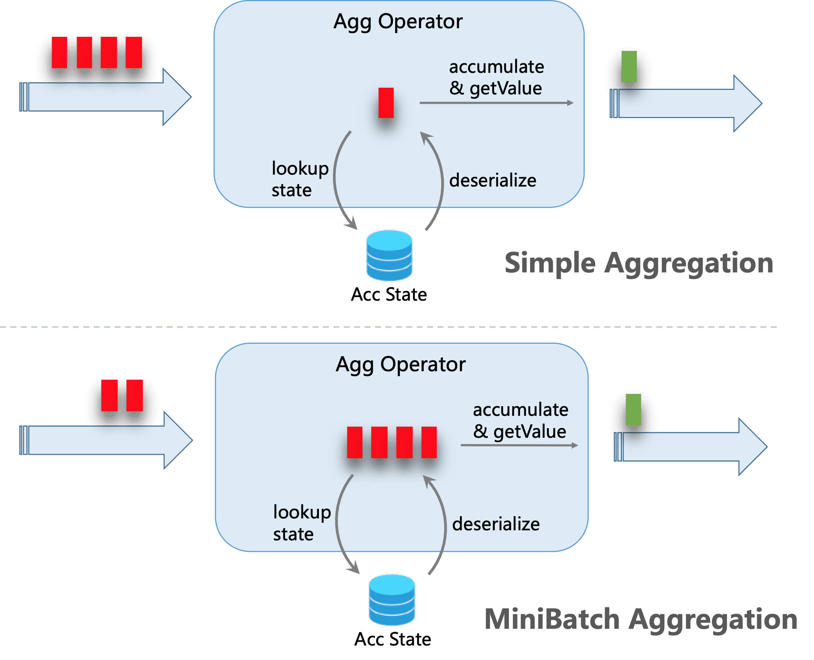

上图展示了加 MiniBatch 和没加 MiniBatch 之前的执行区别。

**启用 MiniBatch 聚合的参数：**

```shell
# 默认值：false
# 值类型：Boolean
# 流批任务：流任务支持
# 用处：MiniBatch 优化是一种专门针对 unbounded 流任务的优化（即非窗口类应用），其机制是在 `允许的延迟时间间隔内` 以及 `达到最大缓冲记录数` 时触发以减少 `状态访问` 的优化，从而节约处理时间。下面两个参数一个代表 `允许的延迟时间间隔`，另一个代表 `达到最大缓冲记录数`。
table.exec.mini-batch.enabled: false

# 默认值：0 ms
# 值类型：Duration
# 流批任务：流任务支持
# 用处：此参数设置为多少就代表 MiniBatch 机制最大允许的延迟时间。注意这个参数要配合 `table.exec.mini-batch.enabled` 为 true 时使用，而且必须大于 0 ms
table.exec.mini-batch.allow-latency: 0 ms

# 默认值：-1
# 值类型：Long
# 流批任务：流任务支持
# 用处：此参数设置为多少就代表 MiniBatch 机制最大缓冲记录数。注意这个参数要配合 `table.exec.mini-batch.enabled` 为 true 时使用，而且必须大于 0
table.exec.mini-batch.size: -1
```

-   注意事项：

> 1. table.exec.mini-batch.allow-latency 和 table.exec.mini-batch.size 两者只要其中一项满足条件就会执行 batch 访问状态操作。
> 2. 上述 MiniBatch 配置不会对 Window TVF 生效，因为！！！Window TVF 默认就会启用小批量优化，Window TVF 会将 buffer 的输入记录记录在托管内存中，而不是 JVM 堆中，因此 Window TVF 不会有 GC 过高或者 OOM 的问题。

#### 两阶段聚合

**问题场景**：在聚合数据处理场景中，很可能会由于热点数据导致数据倾斜，如下 SQL 所示，当 color = RED 为 50000w 条，而 color = BLUE 为 5 条，就产生了数据倾斜，而器数据处理的算子产生性能瓶颈。

```sql
SELECT color, sum(id)
FROM T
GROUP BY color
```

**两阶段聚合如何解决上述问题：**其核心思想类似于 MapReduce 中的 Combiner + Reduce，先将聚合操作在本地做一次 local 聚合，这样 shuffle 到下游的数据就会变少。

还是上面的 SQL 案例，如果在 50000w 条的 color = RED 的数据 shuffle 之前，在本地将 color = RED 的数据聚合成为 1 条结果，那么 shuffle 给下游的数据量就被极大地减少了。

下图说明了两阶段聚合是如何处理热点数据的：

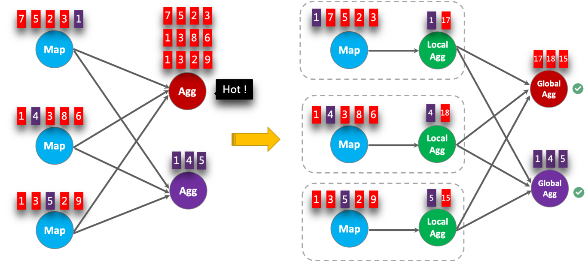

**启用两阶段聚合的参数：**

```shell
# 默认值：false
# 值类型：Boolean
# 流批任务：流任务支持
# 用处：MiniBatch 优化是一种专门针对 unbounded 流任务的优化（即非窗口类应用），其机制是在 `允许的延迟时间间隔内` 以及 `达到最大缓冲记录数` 时触发以减少 `状态访问` 的优化，从而节约处理时间。下面两个参数一个代表 `允许的延迟时间间隔`，另一个代表 `达到最大缓冲记录数`。
table.exec.mini-batch.enabled: false

# 默认值：0 ms
# 值类型：Duration
# 流批任务：流任务支持
# 用处：此参数设置为多少就代表 MiniBatch 机制最大允许的延迟时间。注意这个参数要配合 `table.exec.mini-batch.enabled` 为 true 时使用，而且必须大于 0 ms
table.exec.mini-batch.allow-latency: 0 ms

# 默认值：-1
# 值类型：Long
# 流批任务：流任务支持
# 用处：此参数设置为多少就代表 MiniBatch 机制最大缓冲记录数。注意这个参数要配合 `table.exec.mini-batch.enabled` 为 true 时使用，而且必须大于 0
table.exec.mini-batch.size: -1

#  默认值：AUTO
#  值类型：String
#  流批任务：流、批任务都支持
#  用处：聚合阶段的策略。和 MapReduce 的 Combiner 功能类似，可以在数据 shuffle 前做一些提前的聚合，可以选择以下三种方式
#  TWO_PHASE：强制使用具有 localAggregate 和 globalAggregate 的两阶段聚合。请注意，如果聚合函数不支持优化为两个阶段，Flink 仍将使用单阶段聚合。
#  两阶段优化在计算 count，sum 时很有用，但是在计算 count distinct 时需要注意，key 的稀疏程度，如果 key 不稀疏，那么很可能两阶段优化的效果会适得其反
#  ONE_PHASE：强制使用只有 CompleteGlobalAggregate 的一个阶段聚合。
#  AUTO：聚合阶段没有特殊的执行器。选择 TWO_PHASE 或者 ONE_PHASE 取决于优化器的成本。
#  
#  注意！！！：此优化在窗口聚合中会自动生效，但是在 unbounded agg 中需要与 minibatch 参数相结合使用才会生效
table.optimizer.agg-phase-strategy: TWO_PHASE
```

-   注意事项：

> 1. 此优化在窗口聚合中会自动生效，大家在使用 Window TVF 时可以看到 localagg + globalagg 两部分
> 2. 但是在 unbounded agg 中需要与 MiniBatch 参数相结合使用才会生效。

#### split 分桶

**问题场景**：使用两阶段聚合虽然能够很好的处理 count，sum 等常规聚合算子，但是在 count distinct，sum distinct 等算子的两阶段聚合效果在大多数场景下都不太满足预期。

因为 100w 条数据的 count 聚合能够在 local 算子聚合为 1 条数据，但是 count distinct 聚合 100w 条在 local 聚合之后的结果和可能是 90w 条，那么依然会有数据倾斜，如下 SQL 案例所示：

```sql
SELECT color, COUNT(DISTINCT user_id)
FROM T
GROUP BY color
```

**split 分桶如何解决上述问题**：其核心思想在于按照 distinct 的 key，即 user_id，先做数据的分桶，将数据打散，分散到 Flink 的多个 TM 上进行计算，然后再将数据合桶计算。打开 split 分桶之后的效果就等同于以下 SQL：

```sql
SELECT color, SUM(cnt)
FROM (
    SELECT color, COUNT(DISTINCT user_id) as cnt
    FROM T
    GROUP BY color, MOD(HASH_CODE(user_id), 1024)
)
GROUP BY color
```

下图说明了 split 分桶的处理流程：

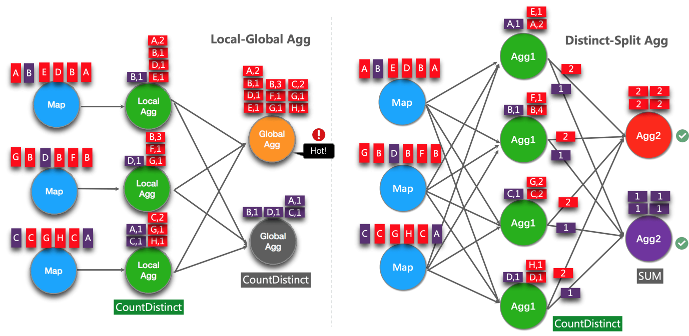

**启用 split 分桶的参数：**

```shell
#  默认值：false
#  值类型：Boolean
#  流批任务：流任务
#  用处：避免 group by 计算 count distinct\sum distinct 数据时的 group by 的 key 较少导致的数据倾斜，比如 group by 中一个 key 的 distinct 要去重 500w 数据，而另一个 key 只需要去重 3 个 key，那么就需要先需要按照 distinct 的 key 进行分桶。将此参数设置为 true 之后，下面的 table.optimizer.distinct-agg.split.bucket-num 可以用于决定分桶数是多少
#  后文会介绍具体的案例
table.optimizer.distinct-agg.split.enabled: false
```

-   注意事项：

> 1. 如果有多个 distinct key，则多个 distinct key 都会被作为分桶 key。比如 count(distinct a)，sum(distinct b) 这种多个 distinct key 也支持。
> 2. 自己写的 UDAF 不支持！
> 3. 其实此种优化很少使用，因为大家直接自己按照分桶的写法自己就可以写了，而且最后生成的算子图和自己写的 SQL 的语法也能对应的上

#### 去重 filter 子句

**问题场景**：在一些场景下，用户可能需要从不同维度计算 UV，例如 Android 的 UV、iPhone 的 UV、Web 的 UV 和总 UV。许多用户会选择 CASE WHEN 支持此功能，如下 SQL 所示：

```sql
SELECT
 day,
 COUNT(DISTINCT user_id) AS total_uv,
 COUNT(DISTINCT CASE WHEN flag IN ('android', 'iphone') THEN user_id ELSE NULL END) AS app_uv,
 COUNT(DISTINCT CASE WHEN flag IN ('wap', 'other') THEN user_id ELSE NULL END) AS web_uv
FROM T
GROUP BY day
```

但是如果你想实现类似的效果，Flink SQL 提供了更好性能的写法，就是本小节的 filter 子句。

**Filter 子句重写上述场景：**

```sql
SELECT
 day,
 COUNT(DISTINCT user_id) AS total_uv,
 COUNT(DISTINCT user_id) FILTER (WHERE flag IN ('android', 'iphone')) AS app_uv,
 COUNT(DISTINCT user_id) FILTER (WHERE flag IN ('web', 'other')) AS web_uv
FROM T
GROUP BY day
```

Filter 子句的优化点在于，Flink 会识别出三个去重的 key 都是 user_id，因此会把三个去重的 key 存在一个共享的状态中。而不是上文 case when 中的三个状态中。其具体实现区别在于：

-   case when：total_uv、app_uv、web_uv 在去重时，state 是存在三个 MapState 中的，MapState key 为 user_id，value 为默认值，判断是否重复直接按照 key 是在 MapState 中的出现过进行判断。如果总 uv 为 1 亿，’android’, ‘iphone’ uv 为 5kw，’wap’, ‘other’ uv 为 5kw，则 3 个 state 要存储总共 2 亿条数据
-   filter：total_uv、app_uv、web_uv 在去重时，state 是存在一个 MapState 中的，MapState key 为 user_id，value 为 long，其中 long 的第一个 bit 位标识在计算总 uv 时此 user_id 是否来光顾哦，第二个标识 ‘android’, ‘iphone’，第三个标识 ‘wap’, ‘other’，因此在上述 case when 相同的数据量的情况下，总共只需要存储 1 亿条数据，state 容量减小了几乎 50%

或者下面的场景也可以使用 filter 子句进行替换。

**优化前：**

```sql
select
    day
    , app_typp
    , count(distinct user_id) as uv
from source_table
group by
    day
    , app_type
```

如果能够确定 app_type 是可以枚举的，比如为 android、iphone、web 三种，则可以使用 filter 子句做性能优化：

```sql
select
    day
    , count(distinct user_id) filter (where app_type = 'android') as android_uv
    , count(distinct user_id) filter (where app_type = 'iphone') as iphone_uv
    , count(distinct user_id) filter (where app_type = 'web') as web_uv
from source_table
group by
    day
```

经过上述优化之后，state 大小的优化效果也会是成倍提升的。

### 知识点15： 【理解】TopN 优化

#### 使用最优算法

当 TopN 的输出是非更新流（例如 Source），TopN只有一种算法 AppendRank。当TopN的输出是更新流时（例如经过了 AGG/JOIN 计算），TopN有2种算法，性能从高到低分别是：UpdateFastRank和RetractRank。算法名字会显示在拓扑图的节点名字上。

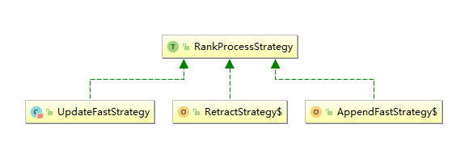

> 注意：apache社区版的Flink1.12 目前还没有UnaryUpdateRank，阿里云实时计算版Flink才有
>

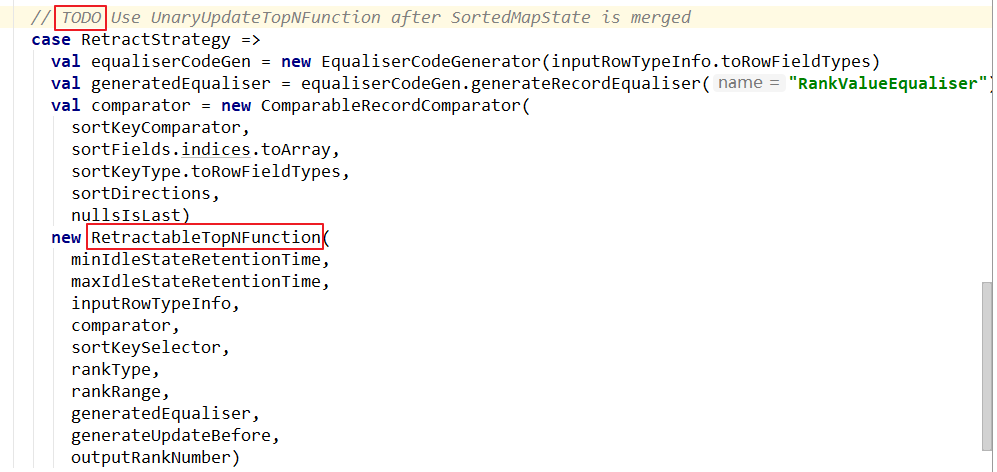

-   UpdateFastRank ：最优算法

需要具备 2 个条件：

-   输入流有 PK（Primary Key）信息，例如 Group BY AVG。
    -   排序字段的更新是单调的，且单调方向与排序方向相反。例如，ORDER BY COUNT/COUNT_DISTINCT/SUM（正数）DESC。
    -   如果要获取到优化 Plan，则您需要在使用 ORDER BY SUM DESC 时，添加 SUM 为正数的过滤条件。
-   AppendFast：结果只追加，不更新
-   RetractRank：普通算法，性能差
    -   不建议在生产环境使用该算法。请检查输入流是否存在 PK 信息，如果存在，则可进行UpdateFastRank 优化。

#### 无排名优化 （ 解决数据膨胀问题）

-   TopN 语法：

```sql
SELECT *
FROM (
SELECT *,
ROW_NUMBER() OVER ([PARTITION BY col1[, col2..]]
ORDER BY col1 [asc|desc][, col2 [asc|desc]...]) AS rownum
FROM table_name)
WHERE rownum <= N [AND conditions]
```

-   数据膨胀问题：

根据 TopN 的语法，rownum 字段会作为结果表的主键字段之一写入结果表。但是这可能导致数据膨胀的问题。例如，收到一条原排名 9 的更新数据，更新后排名上升到 1，则从 1 到 9 的数据排名都发生变化了，需要将这些数据作为更新都写入结果表。这样就产生了数据膨胀，导致结果表因为收到了太多的数据而降低更新速度。

-   使用方式

TopN 的输出结果无需要显示 rownum 值，仅需在最终前端显式时进行 1 次排序，极大地减少输入结果表的数据量。只需要在外层查询中将 rownum 字段裁剪掉即可

```sql
// 最外层的字段，不写 rownum
SELECT col1, col2, col3
FROM (
SELECT col1, col2, col3
ROW_NUMBER() OVER ([PARTITION BY col1[, col2..]]
ORDER BY col1 [asc|desc][, col2 [asc|desc]...]) AS rownum
FROM table_name)
WHERE rownum <= N [AND conditions]
```

在无 rownum 的场景中，对于结果表主键的定义需要特别小心。如果定义有误，会直接导致 TopN 结果的不正确。 无 rownum 场景中，主键应为 TopN 上游 GROUP BY 节点的 KEY 列表。

#### 增加TopN的Cache大小

TopN 为了提升性能有一个 State Cache 层，Cache 层能提升对 State 的访问效率。

TopN 的 Cache 命中率的计算公式为。

```matlab
cache_hit = cache_size*parallelism/top_n/partition_key_num
```

例如，Top100配置缓存10000条，并发50，当PatitionBy的key维度较大时，例如10 万级别时，Cache 命中率只有 10000\*50/100/100000=5%，命中率会很低，导致大量的请求都会击中 State（磁盘），性能会大幅下降。因此当 PartitionKey 维度特别大时，可以适当加大TopN的CacheS ize，相对应的也建议适当加大TopN节点的Heap Memory。

-   使用方式

```shell
# 设置参数：
# 默 认 10000 条 ， 调 整 TopN cahce 到 20 万 ， 那 么 理 论 命 中 率 能 达
table.exec.rank.topn-cache-size:200000
```

> 注意：目前源码中标记为实验项，官网中未列出该参数

#### PartitionBy 的字段中要有时间类字段

例如每天的排名，要带上 Day 字段。否则 TopN 的结果到最后会由于 State ttl 有错乱。

#### 优化后的 SQL 示例

```sql
insert into print_test 
	SELECT 
		 cate_id, 
		 seller_id, 
		 stat_date, 
		 pay_ord_amt  --不输出 rownum 字段，能减小结果表的输出量（无排名优化） 
	FROM ( 
		 SELECT 
		 *, 
		 ROW_NUMBER () OVER ( 
		 PARTITION BY cate_id, 
		 stat_date  --注意要有时间字段，否则 state 过期会导致数据错乱（分区字段优化） 
		 ORDER 
		 BY pay_ord_amt DESC  --根据上游 sum 结果排序。排序字段的更新是单调的，且单调方向与排序方向相反（走最优算法） 
	 ) as rownum   
	 FROM ( 
		 SELECT 
		 cate_id, 
		 seller_id, 
		 stat_date,  
		 --重点。声明 Sum 的参数都是正数，所以 Sum 的结果是单调递增的，因此 TopN能使用优化算法，只获取前 100 个数据（走最优算法） 
		  sum (total_fee) filter ( 
		 where 
		 total_fee >= 0 
	 ) as pay_ord_amt 
	 FROM 
	 	random_test 
	 WHERE 
	 	total_fee >= 0 
	 GROUP 
		 BY cate_name, 
		 seller_id, 
		 stat_date 
	 ) a 
	 WHERE rownum <= 100 
 ); 
```

### 知识点16： 【掌握】高效去重方案

由于 SQL 上没有直接支持去重的语法，还要灵活的保留第一条或保留最后一条。因此我们使用了 SQL 的 ROW_NUMBER OVER WINDOW 功能来实现去重语法。去重本质上是一种特殊的 TopN。

#### 保留首行的去重策略（Deduplicate Keep FirstRow）

保留 KEY 下第一条出现的数据，之后出现该 KEY 下的数据会被丢弃掉。因为 STATE 中只存储了 KEY 数据，所以性能较优，示例如下：

```sql
SELECT * 
FROM ( 
	 SELECT *, 
	 ROW_NUMBER() OVER (PARTITION BY b ORDER BY proctime) as rowNum 
	 FROM T 
) 
WHERE rowNum = 1; 
```

以上示例是将 T 表按照 b 字段进行去重，并按照系统时间保留第一条数据。Proctime在这里是源表 T 中的一个具有 Processing Time 属性的字段。如果按照系统时间去重，也可以将 Proctime 字段简化 PROCTIME()函数调用，可以省略 Proctime 字段的声明。

#### 保留末行的去重策略（Deduplicate Keep LastRow）

保留 KEY 下最后一条出现的数据。保留末行的去重策略性能略优于 LAST_VALUE 函数

示例如下：

```sql
SELECT * 
FROM ( 
 SELECT *, 
 ROW_NUMBER() OVER (PARTITION BY b, d ORDER BY rowtime DESC) as 
rowNum 
 FROM T 
) 
WHERE rowNum = 1; 
```

以上示例是将 T 表按照 b 和 d 字段进行去重，并按照业务时间保留最后一条数据。

Rowtime 在这里是源表 T 中的一个具有 Event Time 属性的字段。

## 相关面试题

1、如何进行flink资源配置调优？

Flink 性能调优的第一步，就是为任务分配合适的资源，在一定范围内，增加资源的分配与性能的提升是成正比的，实现了最优的资源配置后，在此基础上再考虑进行性能调优策略。
提交方式主要是 yarn-per-job，资源的分配在使用脚本提交 Flink 任务时进行指定。
标准的 Flink 任务提交脚本（Generic CLI 模式），从 1.11 开始，增加了通用客户端模式，参数使用-D <property=value>指定。

```shell
`bin/flink run \  -m yarn-cluster  \  -p 5 \ 指定并行度  -Dyarn.application.queue=test \ 指定 yarn 队列  -Djobmanager.memory.process.size=1024mb \ 指定 JM 的总进程大小  -Dtaskmanager.memory.process.size=1024mb \ 指定每个 TM 的总进程大小  -Dtaskmanager.numberOfTaskSlots=2 \ 指定每个 TM 的 slot 数  -pyarch venv.zip  \  -pyexec venv.zip/venv/bin/python3.8  \  -py examples/python/datastream/word_count.py`
```

2、checkpoint如何配置？

一般我们的 Checkpoint 时间间隔可以设置为**分钟**级别，例如 1 分钟、3 分钟，对于状态很大的任务每次 Checkpoint 访问 HDFS 比较耗时，可以设置为 5~10 分钟一次Checkpoint，并且调大两次 Checkpoint 之间的暂停间隔，例如设置两次 Checkpoint 之间至少暂停 4 或 8 分钟。

如果 Checkpoint 语义配置为 EXACTLY_ONCE，那么在 Checkpoint 过程中还会存在 barrier 对齐的过程，可以通过 Flink Web UI 的 Checkpoint 选项卡来查看Checkpoint 过程中各阶段的耗时情况，从而确定到底是哪个阶段导致 Checkpoint 时间过长然后针对性的解决问题。

```shell
#注释以下配置
#设置checkpoint周期时间
execution.checkpointing.interval: 5000
#设置有且仅有一次模式 目前支持 EXACTLY_ONCE、AT_LEAST_ONCE        
execution.checkpointing.mode: EXACTLY_ONCE
#设置checkpoint的存储方式
state.backend: filesystem
#设置checkpoint的存储位置
state.checkpoints.dir: hdfs://node1:8020/checkpoints
#设置savepoint的存储位置
state.savepoints.dir: hdfs://node1:8020/checkpoints
#设置checkpoint的超时时间 即一次checkpoint必须在该时间内完成 不然就丢弃
execution.checkpointing.timeout: 600000
#设置两次checkpoint之间的最小时间间隔
execution.checkpointing.min-pause: 500
#设置并发checkpoint的数目
execution.checkpointing.max-concurrent-checkpoints: 1
#开启checkpoints的外部持久化这里设置了清除job时保留checkpoint，默认值时保留一个 假如要保留3个
state.checkpoints.num-retained: 3
#默认情况下，checkpoint不是持久化的，只用于从故障中恢复作业。当程序被取消时，它们会被删除。但是你可以配置checkpoint被周期性持久化到外部，类似于savepoints。这些外部的checkpoints将它们的元数据输出到外#部持久化存储并且当作业失败时不会自动清除。这样，如果你的工作失败了，你就会有一个checkpoint来恢复。
#ExternalizedCheckpointCleanup模式配置当你取消作业时外部checkpoint会产生什么行为:
#RETAIN_ON_CANCELLATION: 当作业被取消时，保留外部的checkpoint。注意，在此情况下，您必须手动清理checkpoint状态。
#DELETE_ON_CANCELLATION: 当作业被取消时，删除外部化的checkpoint。只有当作业失败时，检查点状态才可用。
execution.checkpointing.externalized-checkpoint-retention: RETAIN_ON_CANCELLATION
```

3、怎样进行压测？

压测的方式很简单，先在kafka 中积压数据，之后开启 Flink任务，出现反压，就是处理瓶颈。相当于水库先积水，一下子泄洪。数据可以是自己造的模拟数据，也可以是生产中的部分数据。

反压通常产生于这样的场景：短时间的负载高峰导致系统接收数据的速率远高于它处理数据的速率。许多日常问题都会导致反压，例如，垃圾回收停顿可能会导致流入的数据快速堆积，或遇到大促、秒杀活动导致流量陡增。反压如果不能得到正确的处理，可能会导致资源耗尽甚至系统崩溃。

4、如何判断是否出现数据倾斜？

相同 Task 的多个 Subtask 中，个别Subtask 接收到的数据量明显大于其他 Subtask 接收到的数据量，通过 Flink Web UI 可以精确地看到每个 Subtask 处理了多少数据，即可判断出 Flink 任务是否存在数据倾斜。通常，数据倾斜也会引起反压。 

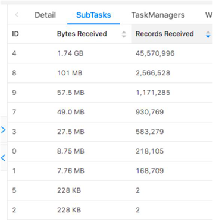

5、Flink SQL中的聚合算子优化有哪些？

（**常用**）MiniBatch 聚合：unbounded group agg 中，可以使用 minibatch 聚合来做到微批计算、访问状态、输出结果，避免每来一条数据就计算、访问状态、输出一次结果，从而减少访问 state 的时长（**尤其是 Rocksdb**）提升性能。

（**常用**）两阶段聚合：类似 MapReduce 中的 Combiner 的效果，可以先在 shuffle 数据之前先进行一次聚合，减少 shuffle 数据量。

（**不常用**）split 分桶：在 count distinct、sum distinct 的去重的场景中，如果出现数据倾斜，任务性能会非常差，所以如果先按照 distinct key 进行分桶，将数据打散到各个 TM 进行计算，然后将分桶的结果再进行聚合，性能就会提升很大。

（**常用**）去重 filter 子句：在 count distinct 中使用 filter 子句于 Hive SQL 中的 count(distinct if(xxx, user_id, null)) 子句，但是 state 中同一个 key 会按照 bit 位会进行复用，这对状态大小优化非常有用。

