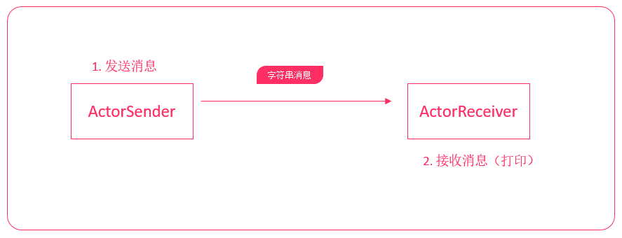

# scala高级用法


**课程目标**

* 掌握样例类、模式匹配、偏函数、正则表达式的使用
* 理解协变、逆变、非变和上下界
* 掌握Actor并发编程模型


## 样例类

样例类是一种特殊类，它可以用来快速定义一个用于**保存数据**的类（类似于Java POJO类），而且它会自动生成apply方法，允许我们快速地创建样例类实例对象。后面，在并发编程和spark、flink这些框架也都会经常使用它。


### 定义样例类

---

语法结构：

```scala
case class 样例类名(成员变量名1:类型1, 成员变量名2:类型2, 成员变量名3:类型3)
```


示例1：

```scala
// 定义一个样例类
// 样例类有两个成员name、age
case class CasePerson(name:String, age:Int)

// 使用var指定成员变量是可变的
case class CaseStudent(var name:String, var age:Int)

object CaseClassDemo {
  def main(args: Array[String]): Unit = {
    // 1. 使用new创建实例
    val zhagnsan = new CasePerson("张三", 20)
    println(zhagnsan)

    // 2. 使用类名直接创建实例
    val lisi = CasePerson("李四", 21)
    println(lisi)

    // 3. 样例类默认的成员变量都是val的，除非手动指定变量为var类型
    //lisi.age = 22  // 编译错误！age默认为val类型

    val xiaohong = CaseStudent("小红", 23)
    xiaohong.age = 24
    println(xiaohong)
  }
}
```


### 样例类方法

---

**toString方法**

toString返回：样例类名称(成员变量1, 成员变量2, 成员变量3....)

```scala
case class CasePerson(name:String, age:Int)

object CaseClassDemo {
  def main(args: Array[String]): Unit = {
    val lisi = CasePerson("李四", 21)
    println(lisi.toString)
    // 输出：CasePerson(李四,21)
  }
}
```


**equals方法**

样例类自动实现了equals方法，可以直接使用==比较两个样例类是否相等，即所有的成员变量是否相等

```scala
val lisi1 = CasePerson("李四", 21)
val lisi2 = CasePerson("李四", 21)
println(lisi1 == lisi2)
// 输出：true
```


**hashCode方法**

样例类自动实现了hashCode方法，如果所有成员变量的值相同，则hash值相同，只要有一个不一样，则hash值不一样。

```scala
val lisi1 = CasePerson("李四", 21)
val lisi2 = CasePerson("李四", 22)

println(lisi1.hashCode())
println(lisi2.hashCode())
```


**copy方法**

样例类实现了copy方法，可以快速创建一个相同的实例对象，可以使用带名参数指定给成员进行重新赋值。

```scala
val lisi1 = CasePerson("李四", 21)

val wangwu = lisi1.copy(name="王五")
println(wangwu)
```


### 样例对象

---

使用case object可以创建样例对象。样例对象是单例的，而且它**没有主构造器**。样例对象是可序列化的。格式：

```scala
case object 样例对象名
```

它主要用在两个地方：

1. 定义枚举
2. 作为没有任何参数的消息传递（后面Akka编程会讲到）


示例：定义枚举

```scala
trait Sex /*定义一个性别特质*/
case object Male extends Sex		// 定义一个样例对象并实现了Sex特质
case object Female extends Sex		

case class Person(name:String, sex:Sex)

object CaseClassDemo {
  def main(args: Array[String]): Unit = {
    val zhangsan = Person("张三", Male)

    println(zhangsan)
  }
}
```


示例：定义消息

```scala
case class StartSpeakingMessage(textToSpeak: String)
// 消息如果没有任何参数，就可以定义为样例对象
case object StopSpeakingMessage
case object PauseSpeakingMessage
case object ResumeSpeakingMessage
```


> 1. 样例类可以使用**类名(参数1, 参数2...)**快速创建实例对象
> 2. 定义样例类成员变量时，可以指定var类型，表示可变。默认是不可变的
> 3. 样例类自动生成了toString、equals、hashCode、copy方法
> 4. 样例对象没有主构造器，可以使用样例对象来创建枚举、或者标识一类没有任何数据的消息


## 模式匹配

scala中有一个非常强大的模式匹配机制，可以应用在很多场景：

* switch语句
* 类型查询
* 以及快速获取数据


### 简单匹配

---

在Java中，有switch关键字，可以简化if条件判断语句。在scala中，可以使用match表达式替代。

语法结构：

```scala
变量 match {
    case "常量1" => 表达式1
    case "常量2" => 表达式2
    case "常量3" => 表达式3
    case _ => 表达式4		// 默认匹配
}
```


示例1：

```scala
println("请输出一个词：")
// StdIn.readLine表示从控制台读取一行文本
val name = StdIn.readLine()

val result = name match {
    case "hadoop" => s"$name：大数据分布式存储和计算框架"
    case "zookeeper" => s"$name：大数据分布式协调服务框架"
    case "spark" => s"$name：大数据分布式内存计算框架..."
    case _ => s"未匹配到$name"
}

println(result)
```


> match表达式是有返回值的，可以将match表达式对其他的变量进行赋值


### 守卫

---

在Java中，只能简单地添加多个case标签，例如：要匹配0-7，就需要写出来8个case语句。例如：

```java
int a = 0;
switch(a) {
    case 0: a += 1;
    case 1: a += 1;
    case 2: a += 1;
    case 3: a += 1;
    case 4: a += 2;
    case 5: a += 2;
    case 6: a += 2;
    case 7: a += 2;
    default: a = 0;
}
```

在scala中，可以使用守卫来简化上述代码——也就是在**case语句中添加if条件判断**。


示例：

```scala
println("请输入一个数字:")
var a = StdIn.readInt()

a match {
    case a1 if a >= 0 && a <= 3 => a += 1
    case a2 if a > 3 && a < 8 => a += 2
    case _ => a = 0
}

println(a)
```


### 匹配类型

---

match表达式还可以进行类型匹配。

语法格式如下：

```scala
变量 match {
    case 类型1变量名: 类型1 => 表达式1
    case 类型2变量名: 类型2 => 表达式2
    case 类型3变量名: 类型3 => 表达式3
    ...
    case _ => 表达式4
}
```


示例：

```scala
    // stripMargin表示删除前面的竖线，这样看起来会显得比较整齐
    val prompt =
      """
        |0：字符串类型
        |1：整形
        |2：浮点型
        |3：Person对象类型
        |
        |请选择:
      """.stripMargin
    
    println(prompt)

    val select = StdIn.readInt()

    val selectedValue = select match {
      case 0 => "hello"
      case 1 => 1
      case 2 => 2.0
      case _ => new Person("张三")
    }


    selectedValue match {
      case x: Int => println("Int " + x)
      case y: Double => println("Double " + y)
      case z: String => println("String " + z)
      case _ => throw new Exception("not match exception")
    }
```


### 匹配集合

---

**匹配数组**

示例：

```scala
val arr = Array(1, 3, 5)
arr match {
    case Array(1, x, y) => println(x + " " + y)
    case Array(0) => println("only 0")
    case Array(0, _*) => println("0 ...")
    case _ => println("something else")
}
```


**匹配列表**

示例：

```scala
val lst = List(3, -1)
lst match {
    case 0 :: Nil => println("only 0")
    case x :: y :: Nil => println(s"x: $x y: $y")
    case 0 :: tail => println("0 ...")
    case _ => println("something else")
}
```


**匹配元组**

示例：

```scala
val tup = (1, 3, 7)
tup match {
    case (1, x, y) => println(s"1, $x , $y")
    case (_, z, 5) => println(z)
    case  _ => println("else")
}
```


### 变量声明中的模式匹配

---

在定义变量的时候，可以使用模式匹配快速获取数据。


示例：获取数组中的元素

```scala
val arr = Range(0, 10).toArray

arr.foreach(println(_))

// 使用模式匹配，获取第二个、第三个、第四个元素的值
val Array(_, x, y, z, _*) = arr

println(s"x=$x, y=$y, z=$z, ")
```


示例：获取List中的数据

```scala
val list = Range(0, 10).toList

// 匹配列表的第一个、第二个元素的值
val x::y::tail = list

println(s"x=$x, y=$y")
```


### 匹配样例类

---

scala可以使用模式匹配来匹配样例类，从而可以快速获取样例类中的成员数据。后续，我们在开发Akka案例时，还会用到。


示例：

```scala
// 定义样例类
case class SubmitTask(id: String, name: String)
case class HeartBeat(time: Long)
case object CheckTimeOutTask

val msg1 = SubmitTask("001", "task-001")
val msg2 = HeartBeat(1000)
val msg3 = CheckTimeOutTask

val list = List(msg1, msg2, msg3)

list(2) match {
    case SubmitTask(id, name) => println(s"id=$id, name=$name")
    case HeartBeat(time) => println(s"time=$time")
    case CheckTimeOutTask => println("检查超时")
}
```


示例：可以使用@符号分隔case语句，用来获取用于匹配的整个示例对象

```scala
list(0) match {
    // obj表示获取用于匹配的样例对象，而id,name表示获取样例中的元素
    case  obj @ SubmitTask(id, name) => println(s"id=$id, name=$name");println(s"样例类:$obj")
    case HeartBeat(time) => println(s"time=$time")
    case CheckTimeOutTask => println("检查超时")
}
```


## Option类型

scala中，Option类型来表示可选值。这种类型的数据有两种形式：

* Some(x)：表示实际的值

	

* None：表示没有值

	

使用Option类型，可以用来有效避免空引用(null)异常。也就是说，将来我们返回某些数据时，可以返回一个Option类型来替代。


示例：

```scala
  /**
    * 定义除法操作
    * @param a 参数1
    * @param b 参数2
    * @return Option包装Double类型
    */
  def dvi(a:Double, b:Double):Option[Double] = {
    if(b != 0) {
      Some(a / b)
    }
    else {
      None
    }
  }

  def main(args: Array[String]): Unit = {
    val result1 = dvi(1.0, 5)

    result1 match {
      case Some(x) => println(x)
      case None => println("除零异常")
    }
  }
```


**getOrElse方法**

使用getOrElse方法，当Option对应的实例是None时，可以指定一个默认值，从而避免空指针异常


示例：

```scala
val result1 = dvi(1.0, 1)

println(result1.getOrElse("除零错误"))
```


> 1. scala鼓励使用Option类型来封装数据，可以有效减少，在代码中判断某个值是否为null
> 2. 可以使用getOrElse方法来针对None返回一个默认值


## 偏函数

被包在花括号内没有match的一组case语句是一个偏函数，它是PartialFunction[A, B]的一个实例，A代表输入参数类型，B代表返回结果类型。可以理解为：偏函数是一个参数和一个返回值的函数。


示例：

```scala
// func1是一个输入参数为Int类型，返回值为String类型的偏函数
val func1: PartialFunction[Int, String] = {
    case 1 => "一"
    case 2 => "二"
    case 3 => "三"
    case _ => "其他"
}

println(func1(2))
```


示例：获取List中能够整除2的数字

```scala
val list = List(1,2,3,4,5,6,7)

val list2 = list.filter{
    case x if x % 2 == 0 => true
    case _ => false
}
println(list2)
```


## 正则表达式

在scala中，可以很方便地使用正则表达式来匹配数据。

scala中提供了Regex类来定义正则表达式，要构造一个RegEx对象，直接使用String类的r方法即可。

建议使用三个双引号来表示正则表达式，不然就得对正则中的反斜杠来进行转义。

```scala
val regEx = """正则表达式""".r
```


示例：检测是否匹配正则表达式

```scala
val emailRE = """.+@(.+)\..+""".r

val emailList = List("38123845@qq.com", "a1da88123f@gmail.com", "zhansan@163.com", "123afadff.com")

// 检查邮箱是否匹配正则
val size = emailRE.findAllMatchIn(emailList(0)).size
// 如果匹配size为1，否则size为0
println(size)

```


示例：找出列表中的所有不合法的邮箱

```scala
// 找出列表中不合法的邮箱格式
println("不合法的邮箱为：")
emailList.filter{
    eml => emailRE.findAllIn(eml).size < 1
}.foreach {
    println(_)
}

println("------")
```


示例：使用正则表达式进行模式匹配，获取正则中匹配的分组

```scala
// 找到所有邮箱运营公司
println("邮箱的运营公司为")
emailList.foreach {
    case email @ emailRE(company) => println(s"$email => ${company}")
    case _ => println("未知")
}
```


## 异常处理

来看看下面一段代码。

```scala
  def main(args: Array[String]): Unit = {
   val i = 10 / 0
    
    println("你好！")
  }

Exception in thread "main" java.lang.ArithmeticException: / by zero
	at ForDemo$.main(ForDemo.scala:3)
	at ForDemo.main(ForDemo.scala)
```

执行程序，可以看到scala抛出了异常，而且没有打印出来"你好"。说明程序出现错误后就终止了。

那怎么解决该问题呢？


### 捕获异常

------

在scala中，可以使用异常处理来解决这个问题。以下为scala中try...catch异常处理的语法格式：

```scala
try {
    // 代码
}
catch {
    case ex:异常类型1 => // 代码
    case ex:异常类型2 => // 代码
}
finally {
    // 代码
}
```

- try中的代码是我们编写的业务处理代码
- 在catch中表示当出现某个异常时，需要执行的代码
- 在finally中，是不管是否出现异常都会执行的代码


示例：

```scala
try {
    val i = 10 / 0

    println("你好！")
} catch {
    case ex: Exception => println(ex.getMessage)
} finally {
    println("我始终都会执行!")
}
```


### 抛出异常

------

我们也可以在一个方法中，抛出异常。语法格式和Java类似，使用throw new Exception...


示例：

```scala
  def main(args: Array[String]): Unit = {
    throw new Exception("这是一个异常")
  }

Exception in thread "main" java.lang.Exception: 这是一个异常
	at ForDemo$.main(ForDemo.scala:3)
	at ForDemo.main(ForDemo.scala)
```


我们可以看到，scala不需要再main方法上声明要抛出的异常，它已经解决了再Java中被认为是设计失败的检查型异常。下面是Java代码


```java
    public static void main(String[] args) throws Exception {
        throw new Exception("这是一个异常");
    }

```


scala异常处理语法要比Java简洁、易用。


> 1. scala中也是使用try...catch...finally处理异常
>
> 2. 所有异常处理都是在catch语句中，每一个异常处理写成
>
> 	```scala
> 	case ex1:异常类型1 => 异常处理代码
> 	case ex2:异常类型1 => 异常处理代码
> 	case ex3:异常类型1 => 异常处理代码
> 	```
>
> 3. 抛出异常使用throw
>
> 4. scala中方法抛出异常不需要像Java一样编写异常声明
> 


## 提取器(Extractor)


我们之前已经使用过scala中非常强大的模式匹配功能了，通过模式匹配，我们可以快速匹配样例类中的成员变量。例如：

```scala
// 定义样例类
case class SubmitTask(id: String, name: String)
case class HeartBeat(time: Long)
case object CheckTimeOutTask

val msg1 = SubmitTask("001", "task-001")
val msg2 = HeartBeat(1000)
val msg3 = CheckTimeOutTask

val list = List(msg1, msg2, msg3)

list(2) match {
    // 可以使用模式匹配快速匹配到到SubmitTask样例类中的id和name
    case SubmitTask(id, name) => println(s"id=$id, name=$name")
    case HeartBeat(time) => println(s"time=$time")
    case CheckTimeOutTask => println("检查超时")
}
```

那是不是所有的类都可以进行这样的模式匹配呢？答案是`不可以`的。要支持模式匹配，必须要实现一个**提取器**。


### 定义提取器

---

之前我们学习过了，实现一个类的伴生对象中的apply方法，可以用类名来快速构建一个对象。伴生对象中，还有一个unapply方法。与apply相反，unapply是将该类的对象，拆解为一个个的元素。


要实现一个类的提取器，只需要在该类的伴生对象中实现一个unapply方法即可。


示例：实现一个类的解构器，并使用match表达式进行模式匹配，提取类中的字段。

```scala
class Student {
  var name:String = _   // 姓名
  var age:Int = _       // 年龄
  
  // 实现一个辅助构造器
  def this(name:String, age:Int) = {
    this()
    
    this.name = name
    this.age = age
  }
}

object Student {
  def apply(name:String, age:Int): Student = new Student(name, age)

  // 实现一个解构器
  def unapply(arg: Student): Option[(String, Int)] = Some((arg.name, arg.age))
}

object extractor_DEMO {
  def main(args: Array[String]): Unit = {
    val zhangsan = Student("张三", 20)

    zhangsan match {
      case Student(name, age) => println(s"姓名：$name 年龄：$age")
      case _ => println("未匹配")
    }
  }
}
```


> 样例类自动实现了apply、unapply方法（可以使用scalap反编译一个样例类的字节码）


## 泛型

scala和Java一样，类和特质、方法都可以支持泛型。我们在学习集合的时候，一般都会涉及到泛型。

```scala
scala> val list1:List[String] = List("1", "2", "3")
list1: List[String] = List(1, 2, 3)

scala> val list1:List[String] = List("1", "2", "3")
list1: List[String] = List(1, 2, 3)
```

在scala中，使用方括号来定义类型参数。


### 定义一个泛型方法

---

需求：用一个方法来获取任意类型数组的中间的元素


1. 不考虑泛型直接实现（基于Array[Int]实现）
2. 加入泛型支持


不考虑泛型的实现

```scala
  def getMiddle(arr:Array[Int]) = arr(arr.length / 2)

  def main(args: Array[String]): Unit = {
    val arr1 = Array(1,2,3,4,5)

    println(getMiddle(arr1))
  }
```


加入泛型支持

```scala
  def getMiddle[A](arr:Array[A]) = arr(arr.length / 2)

  def main(args: Array[String]): Unit = {
    val arr1 = Array(1,2,3,4,5)
    val arr2 = Array("a", "b", "c", "d", "f")

    println(getMiddle[Int](arr1))
    println(getMiddle[String](arr2))

    // 简写方式
    println(getMiddle(arr1))
    println(getMiddle(arr2))
  }
```


### 定义一个泛型类
---
我们接下来要实现一个Pair类（一对数据）来讲解scala泛型相关的知识点。

Pair类包含两个值，而且两个值的类型不固定。


```scala
// 类名后面的方括号，就表示这个类可以使用两个类型、分别是T和S
// 这个名字可以任意取
class Pair[T, S](val first: T, val second: S) 

case class Person(var name:String, val age:Int)

object Pair {
  def main(args: Array[String]): Unit = {
    val p1 = new Pair[String, Int]("张三", 10)
    val p2 = new Pair[String, String]("张三", "1988-02-19")
    val p3 = new Pair[Person, Person](Person("张三", 20), Person("李四", 30))
  }
}
```


> 1. 要定义一个泛型类，直接在类名后面加上方括号，指定要使用的类型参数。上述的T、S都是类型参数，就代表一个类型
> 2. 指定了类对应的类型参数后，就可以使用这些类型参数来定义变量了


### 上下界

---

现在，有一个需求，在Pair类中，我们只想用来保存Person类型的对象，因为我们要添加一个方法，让好友之间能够聊天。例如：

```scala
def chat(msg:String) = println(s"${first.name}对${second.name}说: $msg")
```

但因为，Pair类中根本不知道first有name这个字段，上述代码会报编译错误。

而且，添加了这个方法，就表示Pair类，现在只能支持Person类或者Person的子类的泛型。所以，我们需要给Pair的泛型参数，添加一个上界。


使用`<: 类型名`表示给类型添加一个**上界**，表示泛型参数必须要从上界继承。

```scala
// 类名后面的方括号，就表示这个类可以使用两个类型、分别是T和S
// 这个名字可以任意取
class Pair[T <: Person, S <:Person](val first: T, val second: S) {
  def chat(msg:String) = println(s"${first.name}对${second.name}说: $msg")
}

class Person(var name:String, val age:Int)

object Pair {
  def main(args: Array[String]): Unit = {

    val p3 = new Pair(new Person("张三", 20), new Person("李四", 30))
    p3.chat("你好啊！")
  }
}
```


接着再提一个需求，Person类有几个子类，分别是Policeman、Superman。


要控制Person只能和Person、Policeman聊天，但是不能和Superman聊天。此时，还需要给泛型添加一个下界。

```scala
// 类名后面的方括号，就表示这个类可以使用两个类型、分别是T和S
// 这个名字可以任意取
class Pair[T <: Person, S >: Policeman <:Person](val first: T, val second: S) {
  def chat(msg:String) = println(s"${first.name}对${second.name}说: $msg")
}

class Person(var name:String, val age:Int)
class Policeman(name:String, age:Int) extends Person(name, age)
class Superman(name:String) extends Policeman(name, -1)

object Pair {
  def main(args: Array[String]): Unit = {
	// 编译错误：第二个参数必须是Person的子类（包括本身）、Policeman的父类（包括本身）
    val p3 = new Pair(new Person("张三", 20), new Superman("李四"))
    p3.chat("你好啊！")
  }
}
```


> U >: T	表示U必须是类型T的父类或本身
>
> S <: T	表示S必须是类型T的子类或本身


### 协变、逆变、非变

---

来一个类型转换的问题：

```scala
class Pair[T]

object Pair {
  def main(args: Array[String]): Unit = {
    val p1 = Pair("hello")
    // 编译报错，无法将p1转换为p2
    val p2:Pair[AnyRef] = p1

    println(p2)
  }
}
```


**非变**

class Pair[T]{}，这种情况就是非变（默认），类型B是A的子类型，Pair[A]和Pair[B]没有任何从属关系，这种情况和Java是一样的。


**协变**

class Pair[+T]，这种情况是协变。类型B是A的子类型，Pair[B]可以认为是Pair[A]的子类型。这种情况，参数化类型的方向和类型的方向是一致的。


**逆变**

class Pair[-T]，这种情况是逆变。类型B是A的子类型，Pair[A]反过来可以认为是Pair[B]的子类型。这种情况，参数化类型的方向和类型的方向是相反的。


示例：

```scala
class Super
class Sub extends Super

//非变
class Temp1[A](title: String)
//协变
class Temp2[+A](title: String)
//逆变
class Temp3[-A](title: String)

object Covariance_demo {
  def main(args: Array[String]): Unit = {
    val a = new Sub()
    // 没有问题，Sub是Super的子类
    val b:Super = a

    // 非变
    val t1:Temp1[Sub] = new Temp1[Sub]("测试")
    // 报错！默认不允许转换
    // val t2:Temp1[Super] = t1

    // 协变
    val t3:Temp2[Sub] = new Temp2[Sub]("测试")
    val t4:Temp2[Super] = t3
    
    // 非变
    val t5:Temp3[Super] = new Temp3[Super]("测试")
    val t6:Temp3[Sub] = t5
  }
}
```


## Actor介绍


### Java并发编程的问题

---

在Java并发编程中，每个对象都有一个逻辑监视器（monitor），可以用来控制对象的多线程访问。我们添加sychronized关键字来标记，需要进行同步加锁访问。这样，通过加锁的机制来确保同一时间只有一个线程访问共享数据。但这种方式存在资源争夺、以及死锁问题，程序越大问题越麻烦。


**线程死锁**


### Actor并发编程模型

---

Actor并发编程模型，是scala提供给程序员的一种与Java并发编程完全不一样的并发编程模型，是一种基于事件模型的并发机制。Actor并发编程模型是一种不共享数据，依赖消息传递的一种并发编程模式，有效避免资源争夺、死锁等情况。


### Java并发编程对比Actor并发编程

---


| Java内置线程模型                                  | scala Actor模型                      |
| ------------------------------------------------- | ------------------------------------ |
| "共享数据-锁"模型 (share data and lock)           | share nothing                        |
| 每个object有一个monitor，监视线程对共享数据的访问 | 不共享数据，Actor之间通过Message通讯 |
| 加锁代码使用synchronized标识                      |                                      |
| 死锁问题                                          |                                      |
| 每个线程内部是顺序执行的                          | 每个Actor内部是顺序执行的            |


> 注：scala在2.11.x版本中加入了Akka并发编程框架，老版本已经废弃。Actor的编程模型和Akka很像，我们这里学习Actor的目的是为学习Akka做准备。


## Actor编程案例


### 创建Actor

---

创建Actor的方式和Java中创建线程很类似。下面是具体的步骤：


1. 定义class或object继承Actor特质
2. 重写act方法
3. 调用Actor的start方法执行Actor


示例1：创建两个Actor，一个Actor打印1-10，另一个Actor打印11-20

```scala
// 继承Actor特质
object Actor1 extends Actor {
  // 实现act方法
  override def act(): Unit =
    (1 to 10).foreach{
      num =>
        println(s"线程1: $num")
    }
}

object Actor2 extends Actor {
  override def act(): Unit =
    (11 to 20).foreach{
      num =>
        println(s"线程2: $num")
    }
}


object ActorDemo {
  def main(args: Array[String]): Unit = {
    // 调用start启动Actor
    Actor1.start()
    Actor2.start()
  }
}

```


上述代码，分别调用了单例对象的start方法（object本质也是一个class，看成是都包含静态成员的类），会在JVM中开启两个线程来执行act中的代码。


**Actor的执行顺序**

1. 调用start()方法启动Actor
2. 自动执行**act**()方法
3. 向Actor发送消息
4. act方法执行完成后，程序会调用**exit()**方法


> 1. Actor是并行执行的
> 2. act方法执行完后，Actor程序就退出了


### 发送消息/接收消息

---

我们之前介绍Actor的时候，说过Actor是基于事件（消息）的并发编程模型，那么Actor是如何发送消息和接收消息的呢？


我们可以使用三种方式来发送消息：

| **！** | **发送异步消息，没有返回值**          |
| ------ | ------------------------------------- |
| **!?** | **发送同步消息，等待返回值**          |
| **!!** | **发送异步消息，返回值是Future[Any]** |

例如：

要给actor1发送一个异步字符串消息，使用以下代码：

```scala
actor1 ! "你好!"
```


示例：创建两个Actor，Actor1发送一个异步字符串消息给Actor2，Actor2接收到该消息后，打印出来。




```scala
object ActorSender extends Actor {
  override def act(): Unit = {
      // 发送字符串消息给Actor2
      val msg =  "你好，ActorSender"
      println(s"ActorSender: 发送消息$msg")
      
      ActorReceiver ! msg
  }
}

object ActorReceiver extends Actor {
  override def act(): Unit =
    receive {
      case msg: String => println(s"接收Actor: 接收到$msg")
    }

}

object ActorMsgDemo {
  def main(args: Array[String]): Unit = {
    ActorSender.start()
    ActorReceiver.start()
  }
}
```


> 1. 使用!、!?、!!来发送消息
>
> 2. actor中使用receive方法来接收消息，需要给receive方法传入一个偏函数
>
> 	```scala
> 	{
> 	    case 变量名1:消息类型1 => 业务处理1,
> 	    case 变量名2:消息类型2 => 业务处理2,
> 	    ...
> 	}
> 	```
>
> 3. receive方法只接收一次消息，接收完后结束Actor


### 持续接收消息

---

上一个案例，ActorReceiver调用receive来接收消息，但接收一次后，Actor就退出了。

```scala
object ActorSender extends Actor {
  override def act(): Unit = {
    // 发送字符串消息给Actor2
    val msg =  "你好，ActorSender"
    println(s"ActorSender: 发送消息$msg")
    
    ActorReceiver ! msg
    // 再次发送一条消息，ActorReceiver无法接收到
    ActorReceiver ! "你叫什么名字？"
  }
}

object ActorReceiver extends Actor {
  override def act(): Unit =
    receive {
      case msg: String => println(s"接收Actor: 接收到$msg")
    }

}

object ActorMsgDemo {
  def main(args: Array[String]): Unit = {
    ActorSender.start()
    ActorReceiver.start()
  }
}
```

上述代码，ActorReceiver无法接收到ActorSender发送的第二条消息。


我们希望ActorReceiver能够接收多条消息，怎么实现呢？

——我们只需要使用一个while(true)循环，不停地调用receive来接收消息就可以啦。


```scala
object ActorSender extends Actor {
  override def act(): Unit = {
    // 发送字符串消息给Actor2
    val msg =  "你好，ActorSender"
    println(s"ActorSender: 发送消息$msg")

    ActorReceiver ! msg
    // 再次发送一条消息，ActorReceiver无法接收到
    ActorReceiver ! "你叫什么名字？"
  }
}

object ActorReceiver extends Actor {
  override def act(): Unit =
    // 使用while循环不停地接收消息
    while(true) {
      receive {
        case msg: String => println(s"接收Actor: 接收到$msg")
      }
    }

}

object ActorMsgDemo {
  def main(args: Array[String]): Unit = {
    ActorSender.start()
    ActorReceiver.start()
  }
}

```


### 共享线程

---

上述代码，使用while循环来不断接收消息。但如果当前Actor没有接收到消息，线程就会处于阻塞状态。考虑如果有很多的Actor，就有可能会导致很多线程都是处于阻塞状态。这样当有新的消息来时，需要重新创建线程来处理。这样会导致频繁的线程创建、销毁和切换，从而影响运行效率。


在scala中，可以使用loop + react来复用线程。比while + receive更高效

示例：使用loop + react重写上述案例

```scala
loop {
    react{
        case msg:String => println(s"接收Actor: 接收到$msg")
    }
}
```


### 发送和接收自定义消息

---

我们前面发送的消息是字符串类型，Actor中也支持发送自定义消息，常见的如：使用样例类封装消息，然后进行发送处理。


案例：


每一种消息使用样例类来封装，每一个消息有一个id:Int、msgString成员


示例：

```scala
object MessageActor extends Actor {
  override def act(): Unit =
    loop {
      react{
        // 接收同步消息
        case SyncMessage(id, msg) =>
          println(s"接收到SyncMessage消息：id=${id}, msg=${msg}")
          // 使用sender来获取发送方Actor的引用
          sender ! ReplyMessage(2, "回复消息")
        case ASyncWithoutMessage(id, msg) =>
          println(s"接收到ASyncWithoutMessage消息：id=${id}, msg=${msg}")
        case ASyncWithMessage(id, msg) =>
          println(s"接收到ASyncMessage消息：id=${id}, msg=${msg}")
          // 3秒后再回复消息
          TimeUnit.SECONDS.sleep(3)
          sender ! ReplyMessage(5, "回复消息")
        case _ => println("未知消息")

      }
    }
}

object MainActor {
  def main(args: Array[String]): Unit = {
    MessageActor.start()

    // 发送同步消息
    println("发送同步消息")
    println("-----")

    val replyMessage = MessageActor !? SyncMessage(1, "同步消息")

    println(replyMessage)
    println("-----")

    // 发送异步无返回消息
    println("发送异步无返回消息")
    MessageActor ! ASyncWithoutMessage(3, "异步无返回消息")

    // 睡眠两秒，等待Actor接收到并打印异步消息，方便观察测试
    TimeUnit.SECONDS.sleep(2)
    println("-----")


    // 发送异步有返回消息
    println("发送异步有返回消息")
    val future: Future[Any] = MessageActor !! ASyncWithMessage(4, "异步有返回消息")

    // 这个Future表示对返回消息的封装，因为发的异步消息，所以不确定在将来哪个时间会返回消息
    // 使用循环，不断调用isSet来检查是否已经接收到消息
    while(!future.isSet) {
    }

    val asyncReplyMessage = future.apply()
    println(s"接收到ReplyMessage: $asyncReplyMessage")
  }
}

```


> 1. 在编写Actor程序时，一般使用样例类来封装消息
> 2. 在Actor的act方法中，可以使用sender来获取发送方Actor的引用
> 3. Future表示发送有返回的异步消息的封装，虽然获取到了Future的返回值，但Future中不一定有值，因为可能在将来的某一时刻才会返回消息
> 4. 使用Future的isSet()可以检查是否已经收到返回消息，使用apply()方法可以获取返回的消息。
> 5. 使用TimeUnit.SECONDS.sleep来让Actor对应的线程睡眠阻塞


### 基于Actor实现WordCount案例

---

接下来，我们要使用Actor并发编程模型实现多文件的单词统计。


实现步骤：

1. MainActor获取要进行单词统计的文件
2. 根据文件数量创建对应的WordCountActor
3. 将文件名封装为消息发送给WordCountActor
4. WordCountActor接收消息，并统计单个文件的单词计数
5. 将单词计数结果回复给MainActor
6. MainActor等待所有的WordCountActor都已经成功返回消息，然后进行结果合并


代码：

```scala
case class WordCountTask(fileName:String)
case class WordCountResultMessage(wcResult:Map[String,Int])

class WordCountActor extends Actor {
  override def act(): Unit = {
    loop {
      react {
        // 接收任务，获取文件名
        case WordCountTask(fileName) =>
          val actorId = this.toString.split("@")(1)
          println(s"${actorId}接收到任务: $fileName")
          // 读取文件
          val lineArr: Array[String] = Source.fromFile(fileName).mkString.split("\r\n")
          val wordArr: Array[String] = lineArr.flatMap(_.split(" "))
          val wordnumArr: Array[(String, Int)] = wordArr.map(_->1)
          val groupedWordNumMap: Map[String, Array[(String, Int)]] = wordnumArr.groupBy(_._1)
          val result: Map[String, Int] = groupedWordNumMap.mapValues(_.foldLeft(0)(_ + _._2))

          println(s"${actorId}返回结果：${result.toList.sorted}")
          sender ! WordCountResultMessage(result)
      }
    }
  }
}

object WordCountDemo {
  def main(args: Array[String]): Unit = {
    val dir = "./data/textfiles"
    val files = List(s"$dir/1.txt", s"$dir/2.txt", s"$dir/3.txt")

    // 启动若干个WordCountActor
    val wordCountActors: List[(String, WordCountActor)] = files.map {
      file =>
        val wordCountActor = new WordCountActor()
        wordCountActor.start()
        (file, wordCountActor)
    }

    // 发送文件名给每一个启动的Actor
    val futureList: List[Future[Any]] = wordCountActors.map {
      fileAndActor =>
        // 发送WordCountTask给Actor
        fileAndActor._2 !! WordCountTask(fileAndActor._1)
    }

    // 等待所有结果读已经返回
    while(futureList.count(!_.isSet) != 0) {}

    // 获取所有结果
    val wordCountResults: List[(String, Int)] = futureList.flatMap(_.apply().asInstanceOf[WordCountResultMessage].wcResult.toList)
    // 按照单词进行分组
    val groupWordCountResults: Map[String, List[(String, Int)]] = wordCountResults.groupBy(_._1)
    val finalResult: Map[String, Int] = groupWordCountResults.mapValues(_.foldLeft(0)(_ + _._2))

    println("-" * 10)
    println("合并后结果为：")
    println(finalResult.toList.sorted)
  }
}
```

