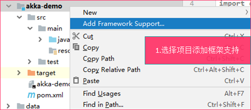
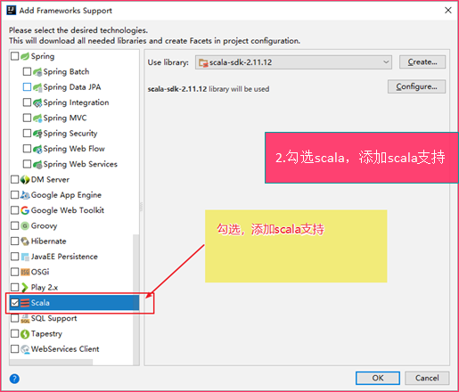
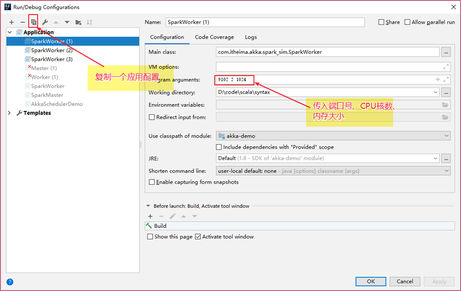

# 高阶函数与Akka框架


**课程目标**

* 理解高阶函数的概念（作为值的函数、匿名函数、闭包、柯里化）
* 掌握隐式转换和隐式参数
* 掌握Akka并发编程框架


## 高阶函数

Scala 混合了面向对象和函数式的特性，在函数式编程语言中，函数是“头等公民”，它和Int、String、Class等其他类型处于同等的地位，可以像其他任何数据类型一样被传递和操作。


高阶函数包含：作为值的函数、匿名函数、闭包、柯里化等等。


### 作为值的函数

---

在scala中，函数就像和数字、字符串一样，可以将函数传递给一个方法。我们可以对算法进行封装，然后将具体的动作传递给算法，这种特性很有用。


我们之前学习过List的map方法，它就可以接收一个函数，完成List的转换。


示例：将一个小数列表中的每个元素转换为对应个数的小星星

List(1, 2, 3...) => *, *\*, *\* 

代码：

```scala
val list = List(1, 2, 3, 4)

// 字符串*方法，表示生成指定数量的字符串
val func_num2star = (num:Int) => "*" * num

print(list.map(func_num2star))
```


### 匿名函数

---

上面的代码，给(num:Int) => "*" * num函数赋值给了一个变量，但是这种写法有一些啰嗦。在scala中，可以不需要给函数赋值给变量，没有赋值给变量的函数就是**匿名函数**


示例：优化上述代码

```scala
val list = List(1, 2, 3, 4)

list.map(num => "*" * num).foreach(println)
// 因为此处num变量只使用了一次，而且只是进行简单的计算，所以可以省略参数列表，使用_替代参数
list.map("*" * _).foreach(println)
```


### 柯里化

---

柯里化（Currying）是指将原先接受多个参数的函数多个一个参数的多参数列表的过程。


**柯里化过程解析**


**使用柯里化，让传递匿名函数作为参数的语法更为简洁**


示例：编写一个泛型方法，用来完成两个值类型的计算（具体的计算封装到函数中）

```scala
object CurryingDemo2 {

  // 实现对两个数进行计算的方法
  def calc[A <: AnyVal](x:A, y:A, func_calc:(A, A)=>A) = {
    func_calc(x, y)
  }

  // 柯里化：实现对两个数进行计算
  def calc_carried[A <: AnyVal](x:A, y:A)(func_calc:(A, A)=>A) = {
    func_calc(x, y)
  }

  def main(args: Array[String]): Unit = {
    // 这种写法是不能被简化的，必须要写出函数的定义
    println(calc(10, 10, (x:Int, y:Int)=> x + y))
    println(calc(10.1, 10.2, (x:Double, y:Double)=> x*y))
    
    // 柯里化之后可以快乐地使用下划线了
    println(calc_carried(10, 10)(_ + _))
    println(calc_carried(10.1, 10.2)(_ * _))
    println(calc_carried(100.2, 10)(_ - _))
  }
}
```


### 闭包

---

闭包其实就是一个函数，只不过这个函数的返回值依赖于声明在函数外部的变量。

可以简单认为，就是可以访问不在当前作用域范围的一个函数。


示例：定义一个闭包

```scala
object ClosureDemo {

  def add(x:Int) = {
    val y = 10

    // add返回一个函数，该函数引用了add方法的一个局部变量
    val funcAdd = () => x + y
    funcAdd
  }

  def main(args: Array[String]): Unit = {

    // 调用add方法时，任然可以引用到y的值
    // funcAdd函数就是一个闭包
    println(add(10)())
  }
}
```


## 隐式转换和隐式参数

隐式转换和隐式参数是scala非常有特色的功能，也是Java等其他编程语言没有的功能。我们可以很方便地利用隐式转换来丰富现有类的功能。


### 隐式转换

---

来看一个案例，

```scala
object SuperIntDemo {
  def main(args: Array[String]): Unit = {
    val a:Int = 1
	// 使用中缀调用to方法
    println(a to 10)
  }
}
```

通过查看Int的源代码，你会惊奇地发现，Int类型根本没有to方法。这难道是让人怀疑人生的大bug吗？

——这其实就是隐式转换的强（gui）大（yi）之处。它在背后偷偷摸摸地帮我们了某种类型转换。


所谓**隐式转换**，是指以implicit关键字声明的带有**单个参数**的方法。它是**自动被调用**的，自动将某种类型转换为另外一种类型。


> 隐式转换的使用步骤：
>
> 1. 在object中定义隐式转换方法（使用implicit）
> 2. 在需要用到隐式转换的地方，引入隐式转换（使用import）
> 3. 自动调用隐式转化后的方法


示例：使用隐式转换，让File具备有reada

```scala
class RichFile(val f:File) {
  // 将文件中内容读取成字符串
  def read() = Source.fromFile(f).mkString
}

object MyPredef {
  // 定义隐式转换方法
  implicit def file2RichFile(f:File) = new RichFile(f)
}

object ImplicitConvertDemo {

  def main(args: Array[String]): Unit = {
    val f = new File("./data/textfiles/1.txt")
    
    // 导入隐式准换
    import MyPredef.file2RichFile
    // 调用的其实是RichFile的read方法
    println(f.read())
  }
}
```


### 自动导入隐式转换方法

---

前面，我们手动使用了import来导入隐式转换。是否可以不手动import呢？

在scala中，如果在当前作用域中有隐式转换方法，会自动导入隐式转换。


示例：将隐式转换方法定义在main所在的object中

```scala
class RichFile(val f:File) {
  // 将文件中内容读取成字符串
  def read() = Source.fromFile(f).mkString
}

object ImplicitConvertDemo {
  // 定义隐式转换方法
  implicit def file2RichFile(f:File) = new RichFile(f)

  def main(args: Array[String]): Unit = {
    val f = new File("./data/textfiles/1.txt")

    // 调用的其实是RichFile的read方法
    println(f.read())
  }
}
```


### 隐式转换的时机

---

什么时候会自动执行隐式转换呢？


1. 当对象调用中不存在的方法时，编译器会自动将对象进行隐式转换
2. 当方法中的参数类型与目标类型不一致时


示例：

```scala

object ImplicitConvertDemo {
  // 定义隐式转换方法
  implicit def file2RichFile(f:File) = new RichFile(f)

  def main(args: Array[String]): Unit = {
    val f = new File("./data/textfiles/1.txt")

    // test1接收的参数类型为Rich，此时也自动进行了隐式转换
    test1(f)
  }

  def test1(r:RichFile) = println(r.read())
}
```


### 隐式参数

---

函数或方法可以带有一个标记为implicit的参数列表。这种情况，编译器会查找缺省值，提供给该方法。


定义隐式参数：

1. 在方法后面添加一个参数列表，参数使用implicit修饰
2. 在object中定义implicit修饰的隐式值
3. 调用方法，可以不传入implicit修饰的参数列表，编译器会自动查找缺省值


示例：

```scala
// 定义一个分隔符类
case class Delimiters(left:String, right:String)

object MyPredef1 {
  implicit val quoteDelimiters = Delimiters("<<<", ">>>")
}

object ImplicitParamDemo {

  // 使用分隔符将想要引用的字符串括起来
  def quote(what:String)(implicit delims:Delimiters) = delims.left + what + delims.right

  def main(args: Array[String]): Unit = {
    println(quote("hello, world")(Delimiters("<<", ">>")))

    // 手动导入
    import MyPredef1._
    println(quote("hello, world"))
  }
}
```


> 1. 和隐式转换一样，可以使用import手动导入隐式参数
>
> 2. 如果在当前作用域定义了隐式值，会自动进行导入


## Akka RPC框架入门


### Akka简介

---

Akka是一个用于构建高并发、分布式和可扩展的基于事件驱动的应用的工具包。Akka是使用scala开发的库，同时可以使用scala和Java语言来开发基于Akka的应用程序。


### Akka特性

---

* 提供基于异步非阻塞、高性能的事件驱动编程模型
* 内置容错机制，允许Actor在出错时进行恢复或者重置操作
* 超级轻量级的事件处理（每GB堆内存几百万Actor）
* 使用Akka可以在单机上构建高并发程序，也可以在网络中构建分布式程序。


### Akka Actor并发编程模型

---

以下图片说明了Akka Actor的并发编程模型的基本流程：

1. 学生创建一个ActorSystem
2. 通过ActorSystem来创建一个ActorRef（老师的引用），并将消息发送给ActorRef
3. ActorRef将消息发送给Message Dispatcher（消息分发器）
4. Message Dispatcher将消息按照顺序保存到目标Actor的MailBox中
5. Message Dispatcher将MailBox放到一个线程中
6. MailBox按照顺序取出消息，最终将它递给TeacherActor接受的方法中


### 入门案例

---

案例：基于Akka创建两个Actor，Actor之间可以互相发送消息。


实现步骤：

1. IDEA创建Maven项目
2. 选择Maven项目，添加scala支持
3. 导入Akka Maven依赖
4. 创建两个Actor
5. 创建、发送消息
6. 启动测试


具体实现：

1. 创建Maven项目，添加scala支持

	

	

2. 打开pom.xml文件，导入akka Maven依赖和插件

	```xml
	    <properties>
	        <maven.compiler.source>1.8</maven.compiler.source>
	        <maven.compiler.target>1.8</maven.compiler.target>
	        <encoding>UTF-8</encoding>
	        <scala.version>2.11.8</scala.version>
	        <scala.compat.version>2.11</scala.compat.version>
	    </properties>
	
	    <dependencies>
	        <dependency>
	            <groupId>org.scala-lang</groupId>
	            <artifactId>scala-library</artifactId>
	            <version>${scala.version}</version>
	        </dependency>
	
	        <dependency>
	            <groupId>com.typesafe.akka</groupId>
	            <artifactId>akka-actor_2.11</artifactId>
	            <version>2.3.14</version>
	        </dependency>
	
	        <dependency>
	            <groupId>com.typesafe.akka</groupId>
	            <artifactId>akka-remote_2.11</artifactId>
	            <version>2.3.14</version>
	        </dependency>
	
	    </dependencies>
	
	    <build>
	        <sourceDirectory>src/main/scala</sourceDirectory>
	        <testSourceDirectory>src/test/scala</testSourceDirectory>
	        <plugins>
	            <plugin>
	                <groupId>net.alchim31.maven</groupId>
	                <artifactId>scala-maven-plugin</artifactId>
	                <version>3.2.2</version>
	                <executions>
	                    <execution>
	                        <goals>
	                            <goal>compile</goal>
	                            <goal>testCompile</goal>
	                        </goals>
	                        <configuration>
	                            <args>
	                                <arg>-dependencyfile</arg>
	                                <arg>${project.build.directory}/.scala_dependencies</arg>
	                            </args>
	                        </configuration>
	                    </execution>
	                </executions>
	            </plugin>
	
	            <plugin>
	                <groupId>org.apache.maven.plugins</groupId>
	                <artifactId>maven-shade-plugin</artifactId>
	                <version>2.4.3</version>
	                <executions>
	                    <execution>
	                        <phase>package</phase>
	                        <goals>
	                            <goal>shade</goal>
	                        </goals>
	                        <configuration>
	                            <filters>
	                                <filter>
	                                    <artifact>*:*</artifact>
	                                    <excludes>
	                                        <exclude>META-INF/*.SF</exclude>
	                                        <exclude>META-INF/*.DSA</exclude>
	                                        <exclude>META-INF/*.RSA</exclude>
	                                    </excludes>
	                                </filter>
	                            </filters>
	                            <transformers>
	                                <transformer implementation="org.apache.maven.plugins.shade.resource.AppendingTransformer">
	                                    <resource>reference.conf</resource>
	                                </transformer>
	                                <transformer implementation="org.apache.maven.plugins.shade.resource.ManifestResourceTransformer">
	                                    <mainClass></mainClass>
	                                </transformer>
	                            </transformers>
	                        </configuration>
	                    </execution>
	                </executions>
	            </plugin>
	        </plugins>
	    </build>
	```

3. 创建两个Actor

	* SenderActor：用来发送消息
	* ReceiveActor：用来接收，回复消息

4. 创建、发送消息

	* 使用样例类封装消息
	* SubmitTaskMessage——提交任务消息
	* SuccessSubmitTaskMessage——任务提交成功消息
	* 使用类似于之前学习的Actor方式，使用`!`发送异步消息

5. 启动测试


### Akka编程重要API

---


**实现Akka Actor类**

1. 继承Actor（**注意：要导入akka.actor包下的Actor**）
2. 实现receive方法，receive方法中**直接处理消息**即可，不需要添加loop和react方法调用。Akka会自动调用receive来接收消息
3. 【可选】还可以实现preStart()方法，该方法在Actor对象构建后执行，在Actor声明周期中仅执行一次


**ActorSystem**

在Akka中，ActorSystem是一个重量级的结构，它需要分配多个线程，所以在实际应用中，ActorSystem通常是一个单例对象，可以使用这个ActorSystem创建很多Actor。它负责创建和监督actor。


**加载Akka Actor**

1. 要创建Akka的Actor，必须要先获取创建一个ActorSystem。需要给ActorSystem指定一个名称，并可以去加载一些配置项（后面会使用到）
2. 调用ActorSystem.actorOf(Props(Actor对象), "Actor名字")来加载Actor


**获取ActorRef**

1. 在actor中，可以使用context上下文对象的actorSelection方法来获取ActorRef
2. 获取到ActorRef就可以发送消息了


**Actor中获取ActorSystem**

直接使用context.system就可以获取到管理该Actor的ActorSystem的引用


**Actor Path**

每一个Actor都有一个Path，就像使用Spring MVC编写一个Controller/Handler一样，这个路径可以被外部引用。路径的格式如下：

| Actor类型 | 路径                                         | 示例                                         |
| --------- | -------------------------------------------- | -------------------------------------------- |
| 本地Actor | akka://actorSystem名称/user/Actor名称        | akka://SimpleAkkaDemo/user/senderActor       |
| 远程Actor | akka.tcp://my-sys@ip地址:port/user/Actor名称 | akka.tcp://192.168.10.17:5678/user/service-b |


### Akka定时任务scheduler

---

如果我们想要在Actor定时的执行一些任务，该如何处理呢？

Akka中，提供一个**scheduler**对象来实现定时调度功能。使用ActorSystem.scheduler.schedule方法，可以启动一个定时任务。schedule方法针对scala提供两种使用形式：


**第一种：直接指定Actor发送消息方式**

```scala
def schedule(
    initialDelay: FiniteDuration,		// 延迟多久后启动定时任务
    interval: FiniteDuration,			// 每隔多久执行一次
    receiver: ActorRef,					// 给哪个Actor发送消息
    message: Any)						// 要发送的消息类型
(implicit executor: ExecutionContext)	// 隐式参数：需要手动导入隐式转换
```


**第二种：传入用户函数自定义实现方式**

```scala
def schedule(
    initialDelay: FiniteDuration,			// 延迟多久后启动定时任务
    interval: FiniteDuration				// 每隔多久执行一次
)(f: ⇒ Unit)								// 定期要执行的函数，可以将逻辑写在这里
(implicit executor: ExecutionContext)		// 隐式参数：需要手动导入隐式转换
```


示例1：

```scala
object SechdulerActor extends Actor {
  override def receive: Receive = {
    case "timer" => println("收到消息...")
  }
}

object AkkaSchedulerDemo {
  def main(args: Array[String]): Unit = {
    val actorSystem = ActorSystem("SimpleAkkaDemo", ConfigFactory.load())

    val senderActor: ActorRef = actorSystem.actorOf(Props(SechdulerActor), "sechdulerActor")

    import actorSystem.dispatcher

    actorSystem.scheduler.schedule(
      FiniteDuration(0, TimeUnit.SECONDS),
      FiniteDuration(1, TimeUnit.SECONDS),
      senderActor,
      "timer"
    )
  }
}
```


示例2：

```scala
object SechdulerActor extends Actor {
  override def receive: Receive = {
    case "timer" => println("收到消息...")
  }
}

object AkkaSchedulerDemo {
  def main(args: Array[String]): Unit = {
    val actorSystem = ActorSystem("SimpleAkkaDemo", ConfigFactory.load())

    val senderActor: ActorRef = actorSystem.actorOf(Props(SechdulerActor), "sechdulerActor")

    import actorSystem.dispatcher
    import scala.concurrent.duration._

    actorSystem.scheduler.schedule(0 seconds, 1 seconds) {
      senderActor ! "timer"
    }
  }
}
```


> 1. 要导入java.util.concurrent包下的TimeUnit
> 2. 手动import actorSystem.dispatcher隐式参数
> 3. FiniteDuration(0, TimeUnit.SECONDS)可以使用 0 millis代替，但要提前导入import scala.concurrent.duration._隐式转换


## 实现两个进程之间的通信


### 案例介绍

---

需求：基于Akka实现在两个**进程**间发送、接收消息。Worker启动后去连接Master，并发送消息，Master接收到消息后，再回复Worker消息。


### Master实现

---


实现步骤：

1. 创建两个object，分别对应两个ActorSystem
2. 分别创建两个Actor（MasterActor）
3. 发送、接收消息
4. 启动测试


为了支持**远程通信**，在创建ActorSystem时，需要指定如下配置：

```scala
    //准备配置文件信息
    val configStr=
      s"""
        |akka.actor.provider = "akka.remote.RemoteActorRefProvider"
        |akka.remote.netty.tcp.hostname = "IP地址"
        |akka.remote.netty.tcp.port = "端口号"
      """.stripMargin

    // 配置config对象 利用ConfigFactory解析配置文件，获取配置信息
    val config=ConfigFactory.parseString(configStr)
	// 创建ActorSystem
	val masterActorSystem = ActorSystem("masterActorSystem",config)
```


示例代码：

Master

```scala
object WorkerActor extends Actor {

  val logger = Logger.getLogger("WorkerActor")

  override def receive: Receive = {
    case "setup" =>
      logger.info("Worker启动成功")
      val masterActorRef = context.actorSelection("akka.tcp://masterActorSystem@127.0.0.1:8888/user/masterActor")
      masterActorRef ! "connect"
    case "success" =>
      logger.info("连接Master成功")
    case _ => Unit
  }
}

object Worker {
  def main(args: Array[String]): Unit = {
    //准备配置文件信息
    val configStr=
      s"""
         |akka.actor.provider = "akka.remote.RemoteActorRefProvider"
         |akka.remote.netty.tcp.hostname = "127.0.0.1"
         |akka.remote.netty.tcp.port = "9999"
      """.stripMargin

    // 配置config对象 利用ConfigFactory解析配置文件，获取配置信息
    val config=ConfigFactory.parseString(configStr)
    // 创建ActorSystem
    val masterActorSystem = ActorSystem("workerActorSystem",config)

    val workerActor = masterActorSystem.actorOf(Props(WorkerActor), "workerActor")
    workerActor ! "setup"
  }
}
```


> 1. Logger是JRE中自带的日志系统API，可以使用Logger.getLogger("Logger名字")来获取一个日志器，获取Logger后，可以使用info来输出日志
> 2. String的stripMargin方法，可以将字符串前面的`|`自动删除


### Worker实现

---


```scala
object WorkerActor extends Actor {

  val logger = Logger.getLogger("WorkerActor")

  override def receive: Receive = {
    case "setup" =>
      logger.info("Worker启动成功")
      val masterActorRef = context.actorSelection("akka.tcp://masterActorSystem@127.0.0.1:8888/user/masterActor")
      masterActorRef ! "connect"
    case "success" =>
      logger.info("连接Master成功")
    case _ => Unit
  }
}

object Worker {
  def main(args: Array[String]): Unit = {
    //准备配置文件信息
    val configStr=
      s"""
         |akka.actor.provider = "akka.remote.RemoteActorRefProvider"
         |akka.remote.netty.tcp.hostname = "127.0.0.1"
         |akka.remote.netty.tcp.port = "9999"
      """.stripMargin

    // 配置config对象 利用ConfigFactory解析配置文件，获取配置信息
    val config=ConfigFactory.parseString(configStr)
    // 创建ActorSystem
    val masterActorSystem = ActorSystem("workerActorSystem",config)

    val workerActor = masterActorSystem.actorOf(Props(WorkerActor), "workerActor")
    workerActor ! "setup"
  }
}

```


## 简易版spark通信框架案例


案例介绍：


本案例分为三个阶段来实现：

1. Worker注册阶段

	* Worker进程向Master注册（将自己的ID、CPU核数、内存大小(M)发送给Master）

2. Worker定时发送心跳阶段

	Worker定期向Master发送心跳消息

3. Master定时心跳检测阶段

	Master定期检查Worker心跳，将一些超时的Worker移除，并对Worker按照内存进行倒序排序

4. 多个Worker测试阶段

	抽取Worker参数，通过命令行参数接收Worker参数（绑定端口号、CPU、内存）


### Worker注册阶段实现

---


1. 创建Master/Worker ActorSystem，以及MasterActor、WorkerActor
2. 创建RegiterMessage、RegisterSucessMessage消息样例类
3. Worker向Master发送注册消息，Master保存Worker信息，并给Worker回复注册成功消息


创建UserMessage.scala保存用户消息

```scala
/**
  * 注册消息
  * @param workerId
  * @param cores CPU核数
  * @param memory 内存（单位：M）
  */
case class RegisterMessage(workerId:String, cores:String, memory:String)

/**
  * 注册成功消息
  */
case object RegisterSuccessMessage
```


创建UserEntity.scala保存实体类

```scala
case class WorkerInfo(workerId:String, cores:String, memory:String)
```


创建SparkMaster.scala构建MasterActorSystem和MasterActor

```scala
object MasterActor extends Actor {

  val logger = Logger.getLogger("MasterActor")
  val workerMap = scala.collection.mutable.Map[String, WorkerInfo]()      // 用于保存Worker信息

  override def preStart(): Unit = {
    logger.info("Master启动成功")
  }

  override def receive: Receive = {
    case RegisterMessage(workerId, cores, memroy) =>
      logger.info(s"新的worker: workerId=$workerId, CPU核数=${cores}，内存=${memroy}")
      // 将新的worker保存到Map结构中
      workerMap += (workerId -> WorkerInfo(workerId, cores, memroy))

      // 回复注册成功消息
      sender ! RegisterSuccessMessage
    case _ => Unit
  }
}

object SparkMaster {
  def main(args: Array[String]): Unit = {
    //准备配置文件信息
    val configStr=
      s"""
         |akka.actor.provider = "akka.remote.RemoteActorRefProvider"
         |akka.remote.netty.tcp.hostname = "127.0.0.1"
         |akka.remote.netty.tcp.port = "8888"
      """.stripMargin

    // 配置config对象 利用ConfigFactory解析配置文件，获取配置信息
    val config=ConfigFactory.parseString(configStr)
    // 创建ActorSystem
    val masterActorSystem = ActorSystem("masterActorSystem",config)

    val masterActorRef = masterActorSystem.actorOf(Props(MasterActor), "masterActor")
  }
}
```


创建SparkWorker.scala用来构建WorkerActorSystem和WorkerActor

```scala
object WorkerActor extends Actor {

  val logger = Logger.getLogger("WorkerActor")

  override def preStart(): Unit = {
    val masterActorRef = context.actorSelection("akka.tcp://masterActorSystem@127.0.0.1:8888/user/masterActor")

    // 给Master发送注册消息
    masterActorRef ! RegisterMessage(UUID.randomUUID().toString, "4", "1024")
  }

  override def receive: Receive = {
    case RegisterSuccessMessage =>
      logger.info("注册成功!")
    case _ => Unit
  }
}

object SparkWorker {
  def main(args: Array[String]): Unit = {
    //准备配置文件信息
    val configStr=
      s"""
         |akka.actor.provider = "akka.remote.RemoteActorRefProvider"
         |akka.remote.netty.tcp.hostname = "127.0.0.1"
         |akka.remote.netty.tcp.port = "9101"
      """.stripMargin

    // 配置config对象 利用ConfigFactory解析配置文件，获取配置信息
    val config=ConfigFactory.parseString(configStr)
    // 创建ActorSystem
    val workerActorSystem = ActorSystem("workerActorSystem",config)

    val workerActorRef = workerActorSystem.actorOf(Props(WorkerActor))
  }
}

```


### Worker定时发送心跳阶段

---

Worker什么时候给Master发送心跳呢？是启动就给Master发送心跳，还是在接收到Master返回注册成功消息后再发送呢？

应该是接收到Master返回注册成功后，再发送心跳消息。

Master收到Worker发送的心跳消息后，需要更新对应Worker的最后心跳时间。


示例代码：

添加心跳消息到UserMessage.scala中

```scala
case class HeartBeat(workerId:String)
```


SparkWorker.scala增加定时发送心跳消息逻辑：

```scala
  override def receive: Receive = {
    case RegisterSuccessMessage =>
      logger.info("注册成功!")
      logger.info("发送心跳消息...")

      import scala.concurrent.duration._
      import context.dispatcher

      // 10秒发送一次心跳给Master
      context.system.scheduler.schedule(0 seconds, 3 seconds) {
        masterActorRef ! HeartBeat(workerId)
      }
    case _ => Unit
  }
```


WorkInfo样例类添加最后更新时间字段

```scala
case class WorkerInfo(workerId:String, cores:String, memory:String, var lastUpdateTime:Date)
```


SparkMaster.scala增加接收心跳消息逻辑：

```scala
  override def receive: Receive = {
    case RegisterMessage(workerId, cores, memroy) =>
      logger.info(s"新的worker: workerId=$workerId, CPU核数=${cores}，内存=${memroy}")
      // 将新的worker保存到Map结构中
      workerMap += (workerId -> WorkerInfo(workerId, cores, memroy))

      // 回复注册成功消息
      sender ! RegisterSuccessMessage
    case HeartBeat(workerId) =>
      logger.info(s"接收到Worker:${workerId}心跳消息...")
    case _ => Unit
  }
```


### Master定时心跳检测阶段

---

如果某个worker已经意外终止了，Master需要将该worker从当前的Worker集合中移除。Master中，还是可以通过Akka的定时任务，来实现心跳超时检查。


Master什么时候开始定期执行心跳超时检查呢？

——Master一启动就可以进行心跳超时检查了。


SparkMaster.scala定期移除超时心跳消息：

```scala
override def preStart(): Unit = {
    logger.info("Master启动成功")
    logger.info("启动心跳超时检查...")

    import scala.concurrent.duration._
    import context.dispatcher

    context.system.scheduler.schedule(0 seconds, 3 seconds) {
      // 过滤出来超时的worker
      val timeoutWorkerId: List[String] = workerMap.toList.filter {
        workInfo =>
          val now = new Date
          val interval = now.getTime - workInfo._2.lastHearBeatTime.getTime

          if (interval > 10 * 1000) true else false
      }.map(_._1)

      if(timeoutWorkerId.size > 0) {
        timeoutWorkerId.foreach{
          workerId =>
            logger.warning(s"移除超时worker: $workerId...")
        }
        // 移除全部超时Worker
        workerMap --= timeoutWorkerId

        // 获取、并按照内存倒序排序后的Worker列表
        val sortedWorkInfo = workerMap.toList.sortWith {
          (idAndInfo1, idAndInfo2) =>
            idAndInfo2._2.memory > idAndInfo1._2.memory
        }.map(_._2)

        println(sortedWorkInfo)
      }
    }
```


### 多个Worker测试阶段

---

为了启动多个worker，需要将端口号、CPU核数、内存通过命令行参数传递给Worker的main方法，然后进行初始化。


SparkWorker.scala代码

此处将`object改为class`，因为这样更容易接受两个参数：cores、memory

```scala
class WorkerActor(cores:String, memory:String) extends Actor {
  val workerId = UUID.randomUUID().toString
  val logger = Logger.getLogger("WorkerActor")
  var masterActorRef:ActorSelection = _

  override def preStart(): Unit = {
    masterActorRef = context.actorSelection("akka.tcp://masterActorSystem@127.0.0.1:8888/user/masterActor")

    // 给Master发送注册消息
    masterActorRef ! RegisterMessage(workerId, cores, memory)
    logger.info(s"CPU核数: $cores, 内存大小：$memory(MB)")
  }

  override def receive: Receive = {
    case RegisterSuccessMessage =>
      logger.info("注册成功!")
      logger.info("发送心跳消息...")

      import scala.concurrent.duration._
      import context.dispatcher

      // 10秒发送一次心跳给Master
      context.system.scheduler.schedule(0 seconds, 3 seconds) {
        masterActorRef ! HeartBeat(workerId)
      }
    case _ => Unit
  }
}

object SparkWorker {
  def main(args: Array[String]): Unit = {

    //准备配置文件信息
    val configStr=
      s"""
         |akka.actor.provider = "akka.remote.RemoteActorRefProvider"
         |akka.remote.netty.tcp.hostname = "127.0.0.1"
         |akka.remote.netty.tcp.port = "${args(0)}"
      """.stripMargin

    // 配置config对象 利用ConfigFactory解析配置文件，获取配置信息
    val config=ConfigFactory.parseString(configStr)
    // 创建ActorSystem
    val workerActorSystem = ActorSystem("workerActorSystem",config)

    val workerActorRef = workerActorSystem.actorOf(Props(new WorkerActor(args(1), args(2))))
  }
}

```


UserEntity.scala，重写WorkerInfo的toString方法

```scala
case class WorkerInfo(workerId:String, cores:String, memory:String, var lastHearBeatTime:Date) {
  override def toString: String = s"内存: $memory - CPU核数: $cores"
}

```


分别启动若干个worker，并传入命令行参数。参考以下方式：

