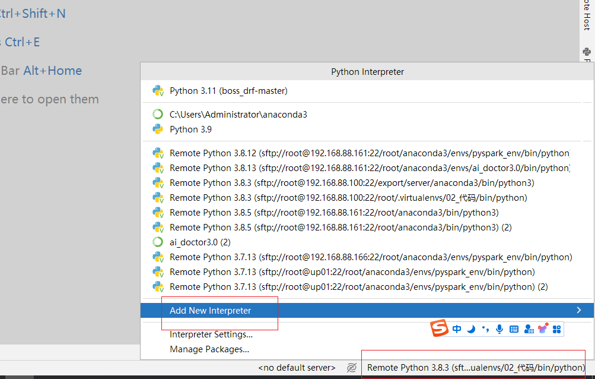
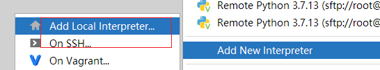
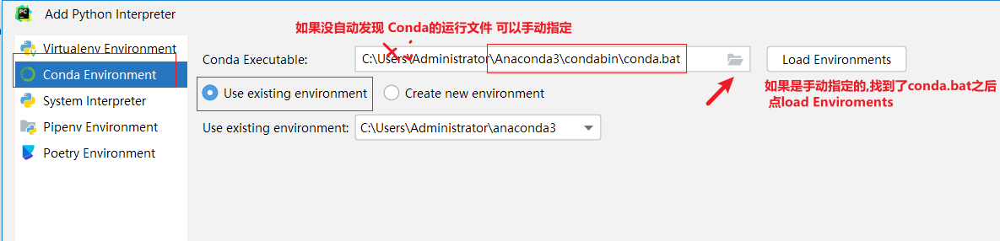
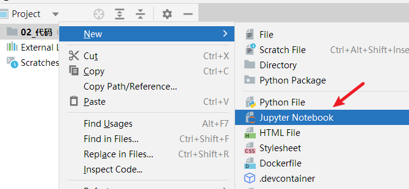
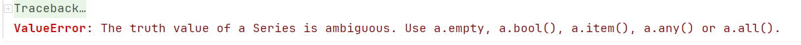

## 0 内容简介

Pandas

- 环境搭建起来 Anaconda
- Series
- DataFrame
- 增加 删除 修改 查询数据
- 修改表结构 常用的方法
- 日期时间类型, 分组聚合, 表连接
- 数据可视化
  - 直方图 折线图 柱状图 散点图 饼图 箱线图 热力图..

业务

- 常见指标
- 数据分析工作基本技能
  - 取数, 做报表
  - 专题/专项分析
    - 数据分析的思维  分群, 下钻, 漏斗...
    - 数据分析模型  规则模型
  - 指标异常波动分析
  - 报告能力
  - AB测试 (中 大公司)


## 1 常用数据分析三方库

Pandas

- 底层调用Numpy  Numpy是一个高效的科学计算库 , 基本的数据结构是 ndarray (N维数组)
  - Pandas 给numpy的Ndarray 添加行列名字, 具体的计算还是调用Numpy来实现的
- 重要对象
  - Series  一列数据
  - DataFrame 二维表格

MatPlotLib (静态绘图  jpg, png svg)

- Python 数据可视化的三方库
- Pandas的数据可视化功能就是调用的MatPlotLib
- Seaborn 基于MatPlotLib 

基于JS 的绘图库 (html 页面上展示)

- pyecharts


## 2 Jupyter notebook

Anaconda的安装

- 安装好之后, 可能会遇见的问题 

  bad file descriptor

- pip uninstall pyzmq

- `pip install pyzmq -i https://pypi.tuna.tsinghua.edu.cn/simple/`

Anaconda 是 python的发型版 是数据科学用到的三方库的集合

- 安装好了之后, 默认会有一个base的虚拟环境 在base 环境里装了数据科学相关的三方库
- 集成了conda这个包管理器,  在anaconda的环境下, 也可以通过conda install XXXX 来安装三方库 
- conda 也可以管理虚拟环境
  - 为什么要有虚拟环境
    - Python库 如果版本更新了, 一些老的方法可能会被删除
    - 举例 Pandas 升级到了2.X版本, 我想用2.x版本的新功能, 项目是在1.5.3 环境下开发的

Pycharm下运行notebook

项目创建好之后, 修改解释器



添加本地解释器



选择conda解释器



设置好解释器之后, 可以直接右键单击项目,新建文件



Jupyter notebook 常用快捷键

- 命令模式和编辑模式之间的切换  ESC
- 命令模式下  
  - dd 删除cell   
  - b 在当前cell下面添加一个cell   
  - a 在当前cell上面添加一个cell 
  - ctr + 回车  / shift+ 回车 运行一个cell
  - m 切换到markdown 模式  y 切换到代码模式

## 3 Series的创建

### 3.1 通过Numpy的Ndarray 创建一个Series

```python
n1 = np.array([1,2,3])
type(n1)
# 创建一个Series对象
s =pd.Series(n1)
type(s)

# 我们在创建Series的时候, 如果不指定索引, Pandas也会自动帮助我们添加一个索引
# 默认加的索引是从0开始的整数  RangeIndex
s.index
```

### 3.2 通过列表创建Series

```python
s1 = pd.Series(n1,index=['a','b','c'])
s1.index

s3 = pd.Series(['香蕉','apple',2],index=[1,2,3])
#%%
s3.index
#%%
data_dict = {'Age':18,'Name':'Tom','Job':'大数据工程师'}
s4 = pd.Series(data_dict)
#%%
s4.values
```

>index 索引
>
>values 值

## 4 Series的属性和方法

### 4.1 常用属性

index : 索引

values: 值

shape: 形状  返回一个元组 (行数,)

size: 返回整数 有多少个值

dtypes/dtype  数据类型


### 4.2 常用方法

访问前5条数据/后五条数据

```python
s.head()
s.tail()
```

Series转换成列表和DataFrame

```python
s1.tolist()
s1.to_list()
# s对象转换成df对象
s1.to_frame()
```

s对象最大值、最小值、平均值、求和值

```python
# s对象最大值、最小值、平均值、求和值
s1.max()
s1.min()
s1.mean()
s1.sum()
```

describe()方法, 一次性返回多个统计量

- count()  计数
- mean()  求平均
- std()   求标准差    标准差反应数据的离散程度
  - 方差 =  ∑(每一个值 - 平均值)²/总数   
  - 标准差 = 方差开根号
- min()
- quantile()
  - 计算分位数
  - 1/4 分位数 把数据从小到大排序, 排在25% 那个位置的数就是25%分位数
  - 中位数: 把数据从小到大排序, 排在正中间的那个数就是中位数
  - 3/4 分位数  把数据从小到大排序, 排在75% 那个位置的数就是75%分位数
- max()

去重/排序/返回唯一值

- drop_duplicates()
  - inplace 默认值 False 不会在原来的数据上修改, 而是在一个副本上修改, 并把修改之后的副本返回
  - inplace = True 直接修改原始的数据 方法不会有返回值
- sort_values() 值排序   ascending = True 升序(默认值)  False降序
- sort_index()  索引排序 
- unique() / nunique()
  - 返回ndarray 由唯一值组成
  - nunique 返回唯一值数量

### 4.3 布尔值列表筛选部分数据

想通过某个条件在Series选出满足条件的部分数据, 可以使用布尔索引(布尔值列表/布尔值的Sereis)

```python
df = pd.read_csv('C:/Develop/深圳42/data/scientists.csv')
```

>从数据中筛选出年龄大于平均值的科学家的名字

```python
df['Name'][df['Age']>df['Age'].mean()]
```

>df['Age']>df['Age'].mean() 会返回由True和False组成的布尔值的Series
>
>把它通过[] 丢进来, 可以做数据的过滤
>
>- True对应数据行会被保留, False对应的数据行会被删除
>
>这里也可以传一个和Series**长度一致**的boolean的list


多个条件的连接  职业是化学家, 并且 年龄大于平均年龄

```python
df['Name'][(df['Age']>df['Age'].mean()) & (df['Occupation']=='Chemist')]
```

>两个boolean 值组成的series  做 与 或者 或 的运算需要用& |  符号 不能用 and or 
>
>&  | 是按位运算, 会把两个series中每一行做对应的 与 或计算   
>
>and  or  只能是  做 一个True /False 和另一个  True /False 的计算 ,如果遇见了下面的报错, 要知道是什么原因
>
>

### 4.4 Series 的运算

Series 和 一个数值/字符串 进行计算

- 每一个元素都会跟这个 数值/字符串 进行计算
- 这一点和Python的列表不一样, Python的列表想要实现相同的效果必须需要遍历

两个Series之间进行计算

- 按照 index (行索引) 进行对齐
- 两个Series index相同的行会在一起进行计算 
- 不同的会返回NaN (空值)

## 5 DataFrame的创建

### 通过字典创建

```python
dict_data = {'id':[1,2,3],'name':['张三','李四','Apple'],'age':[21,22,23]}
df = pd.DataFrame(dict_data,columns=['id','age','name'],index=['a','b','c'])
df
```

### 通过列表[元组] 列表[列表] 方式创建

```python
list_data =[
    (1,'张三',21),
    (2,'李四',22),
    (3,'王五',23)
            ]
df = pd.DataFrame(list_data,columns=['id','age','name'])
df
```

## 6 DataFrame的属性和方法

### 6.1 常用属性

df.index

df.columns  # 列名 列索引

df.values  # 值  返回的类型 ndarray

df.shape # (行数,列数)    df.shape[0]

### 6.2 常用方法

加载数据之后的了解,认识数据的常规套路

df.head()  # 看一眼数据长什么样

df.info()  #  数据类型, 有没有空值

df.describe() # 看数据的分布情况,  和业务常识是否一致


df.sort_values( by = 列名)  # 按照某一列排序


### 6.3 布尔索引. 条件取值

和Series的布尔值列表取值用法完全一致

### 6.4  两个DF之间进行计算

DF和 某个具体的值(字符串, 数字 )进行计算

- 每个元素都会跟这个值之间进行计算

两个Df之间进行计算 和Series算法一样

- 使用行名字进行对齐