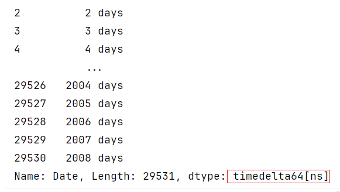
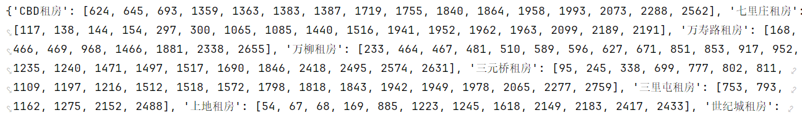

## 内容回顾

数据读取保存

- pd.read_xxx
- df.to_XXX
- index 是否保存

查询

- query
- loc/iloc属性   loc名称  iloc序号
- series.isin([])

增加删除修改

- df['新列名']=新值/[]

- df.insert()

- df.drop()

  - axis =0  /1
  - inplace

- df.drop_duplicates(subset=,keep=,inplace)

- df.replace()

- loc/iloc 定位到数据直接修改

- apply 

  - 先自己定义一个方法, 这个方法不是由我们来调用, 而是要交给apply方法 由这个方法来调用, 传给它的是函数对象

    def func(s)

    ​	return s

  - s.apply()  传入的是每一个值

  - df.apply( axis)  传入给自定义函数的是Series对象

index 和 columns 的修改

- set_index()
- reset_index()
- 直接替换, 但是不能直接单独修改某一个索引, 单独修改某一个索引需要使用方法rename()

## 1 排序和统计函数

nlargest/nsmallest

sort_values 多字段排序

```python
df.sort_values(['价格','面积'],ascending=[False,True])
# 多字段排序, by可以通过列表,传入多个字段,   
# ascending 也可以传入列表 分别指定每个字段的升序/降序的情况 升序降序列表长度需要和排序字段长度一致
```

corr() 计算相关性

```python
df.corr(numeric_only=True)
#  相关系数  判断两列数据是否同增同减   [-1,1]
#  如果一个变量增大的时候, 另一个变量也跟一起增大 正相关  最大 1
#  如果一个变量增大的时候, 另一个变量减小 负相关         最小 -1
#  相关系数的绝对值 >0.7 强相关  0.3~0.7 具有相关性   0.3以下 弱相关  0附近 不相关
```

## 2 缺失值处理

### 2.1 认识缺失值

```python
from numpy import NaN,NAN,nan
```

>NaN和任何一个值都不相等 包括自己
>
>不能通过 == 方式找到缺失值
>
>NaN 是float 类型

加载包含缺失值的数据

```python
df = pd.read_csv('C:/Develop/深圳42/data/city_day.csv',keep_default_na=False)
# 是否用默认的方式来加载空值, 默认加载成NaN 改成False 就会加载成空串
pd.read_csv('C:/Develop/深圳42/data/city_day.csv',na_values='0.0')
# na_values 可以指定某些特殊的值, 在加载数据的时候当作空值来对待
```

缺失值的识别

- df.isnull()  缺失返回True 否则返回False
- df.notnull() 和isnull 相反

```python
df.isnull().sum() # 可以计算每一列缺失值的数量
df.isnull().sum()/df.shape[0] # 可以计算每一列缺失值的占比
```

### 2.2 缺失值处理- 删除

```python
df2 = df.sample(10,random_state=5)
# sample 从数据中随机采样 n条数据, 这里传了10 取出10条, random_state 随机数种子, 如果这个值设置的是一样的, 运行多少次结果都相同, 这么做的目的是为了方便复现结果
df2.dropna()
#%%
df2.isnull().sum(1) # 计算每一行缺失值数量
#%%
df2.dropna(subset=['PM2.5','CO']) # 通过 subset 指定 去掉缺失值的时候只考虑 'PM2.5','CO'
df2.dropna(subset=['PM2.5','CO'],how='any') # how = any 有缺失就删除 可选all 都缺失才删除
df2.dropna(thresh=12)
# 设置阈值, 设置了每一行/列 非空元素的下限, 当每一行/列 非空值小于这个阈值时就会被删除
```

什么时候删除缺失值

- 关键信息缺失 , 举例:用户ID 缺少, 订单ID
- 某一列数据, 缺失值占比过高(50%), 也可以考虑删除
- 有些时候, 数据的作用比较大的,暂时缺失值比较高, 可以考虑先观察这一列数, 可以通过运营手段, 降低缺失率

### 2.3 缺失值处理- 填充

#### 非时序数据

- 统计量来填充, 均值, 中位数 众数(类别型 可以用出现次数最多的)  业务的默认值

```python
df2['PM2.5'].fillna(df2['PM2.5'].mean())
#%%
df2.fillna({'PM2.5':df2['PM2.5'].mean(),'PM10':df2['PM10'].mean()})
```

#### 时序数据

- 温度, 天气, 用电量, 个人存款金额, 个人贷款金额
- 用前一个非空值, 和后一个非空值来进行填充
- 也可以考虑线性插值 

```python
s1 = df['Xylene'][54:64] # 筛选部分数据
s1.fillna(method='bfill')
# bfill 用后面的非空值进行填充  ffill 用空值前面的非空值进行填充
s1.interpolate(method='linear')
# 线性插值 和空值相邻的两个非空值连线, 空值就从线上取值, 等差数列
```

## 3 Pandas数据类型

字符串 → Object 

数值型 → int64 float64

类别型 → category  后面介绍

日期时间 → datetime  timedelta

### 3.1 数值类型和字符串类型之间的转换

as_type 可以做类型的转换, 对类型没有限制

pd.to_numeric() 把一列数据转换成数值类型

```python
import pandas as pd
df = pd.read_csv('C:/Develop/深圳42/data/city_day.csv')
df.head()
#把数值型转换成字符串
df['NO'] = df['NO'].astype(object)
# 把它在转换回来,  都可以成功转换
df['NO'] = df['NO'].astype(float)
#
df2 = df.head().copy()
# 构造数据, 把部分数据改成字符串
df2.loc[::2,'NO'] = 'missing'
df2.info()
# 此时不能成功转换,  errors='ignore' 两个参数 ignore忽略, raise 抛异常
df2['NO'].astype(float,errors='ignore')
#%%
# 转换成数值型
pd.to_numeric(df2['NO'], errors='coerce')
# 有些时候, 应该整列都是数值的列, 由于采集/传输的原因, 导致有几值是字符串, 这会导致整列变成字符串类型, 后续计算会十分麻烦, 需要把这一列转换成数值类型
# 如果直接使用astype 要么报错, 要么不处理,此时可以使用 pd.to_numeric  可以指定errors参数为coerce 不能转换成数值的字符串会被处理成NaN
```

### 3.2 日期时间类型

加载数据的时候, 如果发现了有年月日时分秒这样的数据, 需要查看一下数据类型, 如果需要从年月日时分秒这样的数据中提取出日期时间相关信息, 需要转换成datetime类型

- 加载的时候直接某一列为日期时间类型

```python
df = pd.read_csv('C:/Develop/深圳42/data/city_day.csv',parse_dates=['Date'])
```

>parse_dates

- 通过pd.to_datetime进行转换

```python
df['Date'] = pd.to_datetime(df['Date'])
```

- 数据如果是来自数据库, xlsx excel文件, 有可能不需要特殊处理, 直接就是日期时间类型,  如果是从CSV文件读取出来, 默认读出来的日期时间的数据都是object

跟日期时间相关的三种类型

- datetime64

```python
df['Date'] = pd.to_datetime(df['Date'])
```

>年月日 这样的列,转换之后得到的就是datetime64[ns] 这种类型
>
>从日期时间类型中, 提取出相关的不同时间维度, df['Date'].dt.XXX
>
>- year, month月 day日....

- timestamp 时间戳

```python
df['Date'].max()
```

>Timestamp('2020-07-01 00:00:00')

- Timedelta64

```python
df['Date']-df['Date'].min()
```

>

### 3.3 日期时间索引

DatetimeIndex 和 TimedeltaIndex 是两种日期时间索引

把datetime64类型的一列数据, 设置为索引以后, 就是DatetimeIndex , 我们对索引排序,排序以后就可以按日期时间维度进行选取子集,做数据切片

```python
df.set_index('Date', inplace=True) # 设置为日期时间索引
#%%
df.sort_index(inplace=True) # 对索引进行排序
#%%
df.loc['2018'] # 筛选2018年的数据
# 
df.loc['2018-06-05']# 筛选2018年6月5日的数据
df.loc['2018-06-05':'2018-06-15']
```


把Timedelta64类型的一列数据, 设置为索引以后, 就是TimedeltaIndex对索引排序,排序以后就可以按时间差值的维度进行选取子集,做数据切片

```python
df['time_delta']=df['Date']-df['Date'].min()
#%%
df.set_index('time_delta', inplace=True)
#%%
df.loc['10 days']
df.loc['20 days':'30 days']
```

## 4 分组聚合

### 4.1 分组聚合的API使用

```python
df.groupby('区域').mean() # 区域字段分组,只对数值列计算平均值
```

>在高版本 比如2.0 这种写法会有错, 可以传入numeric_only = True

```python
df.groupby('区域')['价格'].mean()   # 区域字段分组,对价格计算平均值
```

>df.groupby(分组字段)[聚合字段].聚合函数()
>
>如果对一个字段按一种方式进行聚合, 这种写法就可以了

```python
df.groupby('区域')[['面积','价格']].agg(['mean','median'])
```

>如果需要对多个字段进行聚合, 需要[] 传入列表
>
>同时计算多个聚合函数需要调用agg方法 ,传入列表

```python
df.groupby('区域').agg({'面积':'mean','价格':'median'})
```

>不同字段不同方式进行聚合, agg里面传入字典, key聚合字段,value 聚合函数

多字段分组/多字段聚合

groupby(['字段1','字段2]) 

- 返回复合索引 MultiIndex

对一个字段做多种不同的聚合计算, 返回的结果column是MutiIndex

- 复合索引 列表里套元组, 取数的时候, 可以传元组中的第1个元素, 也可以直接传入元组[()] 

groupby分组聚合之后, 结果默认会把分组字段作为结果的索引, 如果不想把分组字段作为结果的索引

- df.groupby('区域',as_index = False)
- 对结果reset_index()

### 4.2 分组聚合的代码说明

```python
df.groupby('区域')['价格'].mean()
```

>上面的代码可以拆分成三句
>
>```python
>df_groupby = df.groupby('区域') # 得到的是一个dataframegroupby对象
>```
>
>df_groupby.groups 返回一个字段 {'区域不同的取值':[这个值对应的行索引]}
>
>
>
>df_groupby.get_group('CBD租房') 获取CBD租房 对应的DataFrame数据
>
>```python
>s_groupby = df_groupby['价格'] # 得到的是一个seriesgroupby对象
>```
>
>从dataframegroupby对象的每一组中, 获取了['价格列'], 组层了seriesgroupby对象
>
>```python
>s_groupby.mean()
>```
>
>每一组, 对价格的数据求一下平均, 有多少组算多少次, 把结果汇总起来

### 4.3  自定义聚合函数

当常规的聚合函数不能满足业务需求的时候, 需要自己来写聚合的逻辑, 就是自定义聚合函数

- 举例子, 按照区域进行分组, 计算不同区域的平均房租  计算价格均值的时候, 需要过滤掉价格低于3000的

```python
def func(s):
    print(s)
    print(type(s))    
    print('=====================')
    # 每一组选出价格>3000的 对这部分求平均
    result = s[s<12000].mean()
    return result
## 自定义聚合函数
df.groupby(['区域'])['价格'].agg(func)
```

>自定义聚合函数, 一定要有返回值, 返回的是一个值, 不能是多个值
>
>分组聚合, 每组应该只有一个聚合结果

### 5 数据的分箱(分桶)

有很多场景, 我们需要把连续型取值的数据列, 变成类别型

- 年龄这一列 → 年龄段( 未成年, 青年, 中年, 老年)
- 收入这一列 →  收入档次 (低收入,中收入, 高收入, 超高收入)

类似上面提到的场景, 就可以使用pd.cut() 对数据进行分箱处理

```python
pd.cut(df['价格'],bins=3)
```

>bins = 3 分成3组(3箱)
>
>此时划分策略, 每一组(每一箱) 上边界 和下边界之间的差值, 尽可能相等 (等距分箱)

```python
pd.cut(df['价格'],bins=[0,4500,8500,210000],labels=['低','中','高'])
```

>第一个参数 df['价格'] 要被分箱/分组的数据列(Series)
>
>bins 传入一个列表, 列表里的值, 从小到大, 定义了每一箱的边界
>
>- 做开右闭合   ,需要注意, 最左边的下限要小于数据中的最小值, 否则会漏掉, 漏掉的数据会变成NaN
>
>labels 如果不传, 分箱之后, 每一箱的取值会用这一箱的边界(下限,上限] 来替代, 我们传入一个列表,可以自己定义分箱之后每一箱的取值
