## 内容回顾

计算函数 排序/相关

- corr()
- sort_values() 多字段排序  ascending = []

缺失值处理

- NaN
- df.isnull().sum()
- pd.read_XXX(keep_default_na, na_values = )
- df.fillna(method = ffill /bfill)    df.interpolate
- df.dropna(subset =[])

数据类型

- datetime
  - 日期时间列, 整列数据获取时间相关的属性, s.dt.
    - datetime64
    - timedelta64
  - 时间点
    - TimeStamp
  - 日期时间索引
    - DatetimeIndex
    - TimedeltaIndex
    - 利用日期时间索引进行切片之前一定先排序
- category
  - pd.cut()可以得到一个category类型, 和字符串之间的差异, 会指定顺序, 排序的时候会按照顺序排序

分组分箱

- 分组
  - df.groupby('分组字段')['聚合字段'].聚合函数()
  - df.groupby('分组字段').agg({})

- 分箱
  - pd.cut()

## 1 数据的合并和变形

### 1.1 df.append (了解)

在2.0的版本 已经被删除了

```python
df1.append(df2) 
# df1后面追加一些新的行, df1和df2的数据, 
# 如果列名相同就能够追加到一起, 如果列名不同, 拼接不上的部分用NaN填充
```

### 1.2 pd.concat 

多张表, 通过行名/列名字 作为拼接的条件

pd.concat([df1,df2,....], axis = , join='')

- axis 控制按行拼接 还是按列拼接
  - axis = 0   使用列名(coloumns)对齐, 列名相同的拼到一起, 竖向拼接
  - axis = 1  使用行名(index)对齐, 行名相同的拼到一起, 横向拼接
- join 
  - 默认 outer  所有的数据都会保留, 拼接不起来的部分缺少的数据用NaN填充
  - 可选 inner   只会保留能拼接起来的部分, 行名/列名不同的删除

```python
pd.concat([df1, df2], axis=1,ignore_index = True) 
```

>ignore_index 拼接之后忽略之前的索引重新给从0开始的索引

### 1.3 merge 连接 类似于SQL的join

```python
# 写法1
df1.merge(df2, on='列名', how='固定值')
# 写法2
pd.merge(df1, df2, on='列名', how='固定值')
```

- merge函数有2种常用参数，参数说明如下

  - 参数`on='列名'`，表示基于哪一列的列值进行合并操作
  - 参数`how='固定值'`，表示合并后如何处理行索引，固定参数具体如下：
    - `how='left'` 对应SQL中的left join，保留左侧表df1中的所有数据
    - `how='right'` 对应SQL中的right join，保留右侧表df2中的所有数据
    - `how='inner'` 对应SQL中的inner，只保留左右两侧df1和df2都有的数据
    - `how='outer'` 对应SQL中的join，保留左右两侧侧表df1和df2中的所有数据

- merge横向连接多个关联数据集具体使用

  ```python
  df3 = pd.merge(df1, df2, how='left', on='x1')
  df4 = pd.merge(df1, df2, how='right', on='x1')
  df5 = pd.merge(df1, df2, how='inner', on='x1')
  df6 = pd.merge(df1, df2, how='outer', on='x1')
  ```

```python
df1.merge(df2, left_on='x1', right_on='x4', how='inner',suffixes=('_left', '_right'))
```

>如果要关联的两张表使用的列名不一样, 通过left_on 和 right_on 来指定
>left_on 左表出哪一列用于关联
>right_on  右表出哪一列用于关联
>
>suffixes 后缀， 当关联结果中，出现了同名的字段， 用于区分哪个字段来自于哪一张表， 默认是(' _ x', '_ y')

### 1.4 join (了解)

默认写法

```python
df1.join(df3,rsuffix='_right',lsuffix='_left',how='outer')
```

>横向左右拼接, 使用df1 和 df3的index 进行对齐
>
>作用和 pd.concat([df1,df3],axis = 1) 完全相同 可以通过pd.concat进行替换

还可以传一个参数on

```python
df1.join(df2,on='x1' ,rsuffix='_right',lsuffix='_left')
```

>df1 x1这一列, 和df2的索引(index) 进行对齐
>
>rsuffix 关联结果中 右表后缀  lsuffix 左表的后缀
>
>当关联结果中，出现了同名的字段， 用于区分哪个字段来自于哪一张表
>
>这种关联方式, 可以通过把df2的索引变成一列(reset_index) 再走merge来实现

## 2  变形

### 2.1 转置

df.T

### 2.2 透视表

每个城市线下门店各种品类商品总销售额

```python
uniqlo_df = pd.read_csv('C:/Develop/深圳42/data/uniqlo.csv')
# 每个城市线下门店各种品类商品总销售额
uniqlo_df_offline = uniqlo_df[uniqlo_df['销售渠道']=='线下']
# 分组聚合的写法
uniqlo_df_offline.groupby(['城市','产品名称'])['销售金额'].sum().reset_index()
# 数据透视表
uniqlo_df_offline.pivot_table(index='城市',columns='产品名称',values='销售金额',aggfunc='sum')
```

>透视表和分组聚合作用是一样的, 只不过展示的形式有差异
>
>index columns 指定是是分组字段
>
>- index 在结果中以行索引形式展示的字段名称
>- columns    在结果中以列名的形式展示的字段名称
>
>values 指定的是聚合字段
>
>aggfunc 指定的是聚合方法

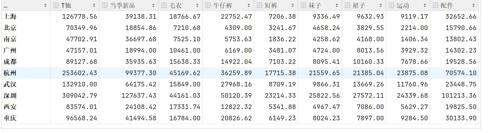

>index columns  values  aggfunc 都可以传入列表
>
>- 不建议传入太多的字段, 结果过于复杂不方便处理结果

## 3 MatPlotLib数据可视化

### 3.1 MatPlotLib API 套路 &为什么要可视化

```python 
x = [-3, 5, 7] #准备数据的x轴坐标
y = [10, 2, 5] #准备数据的y轴坐标
# 创建绘图区域
plt.figure(figsize=(10,6))
# 画图
plt.plot(x,y)
# 对图形的美化, 坐标轴, 标题 ..
plt.xlabel('x_axis', size=18)
plt.ylabel('y_axis',size=12)
plt.title('line plot')
# 显示
plt.show()
```

面向对象的API  效果跟上面是一样的

```python
x = [-3, 5, 7] #准备数据的x轴坐标
y = [10, 2, 5] #准备数据的y轴坐标
# 创建绘图区域
fig,ax = plt.subplots(figsize=(10,6))
# 画图
ax.plot(x,y)
ax.set_xlabel('x_axis', size=18)
ax.set_ylabel('y_axis',size=12)
ax.set_title('line plot')
# 显示
plt.show()
```

通过图片理解数据中的规律效率更高
使用合适的图表, 更容易发现数据中的规律

什么时候画图

- 报告, 文档, 图更容易用来支持观点
- 在理解不熟悉的业务时, 通过画图可以快速的发现一些规律

数据可视化优势举例 anscombe数据集

```python
anscombe = pd.read_csv('C:/Develop/深圳42/data/anscombe.csv')
```

anscombe 一共四份, 通过describe()方法, 发现经常查看的几个统计量, 大小差不多, 似乎数据的分布是差不多的

```python
dataset_1 = anscombe[anscombe['dataset']=='I']
dataset_2 = anscombe[anscombe['dataset']=='II']
dataset_3 = anscombe[anscombe['dataset']=='III']
dataset_4 = anscombe[anscombe['dataset']=='IV']
```

画图发现规律

```python
plt.rcParams['font.sans-serif'] = ['SimHei'] # 中文显示问题
fig = plt.figure(figsize=(16,8))
axes1 = fig.add_subplot(221) # 2行 2列 第一个框
axes2 = fig.add_subplot(222) # 2行 2列 第二个框
axes3 = fig.add_subplot(223)
axes4 = fig.add_subplot(224)
axes1.plot(dataset_1['x'],dataset_1['y'],'o') # plot 绘制折线图, 'o' 点不连起来
axes2.plot(dataset_2['x'],dataset_2['y'],'o')
axes3.plot(dataset_3['x'],dataset_3['y'],'o')
axes4.plot(dataset_4['x'],dataset_4['y'],'o')
fig.suptitle('可视化必要性')
plt.show()
```

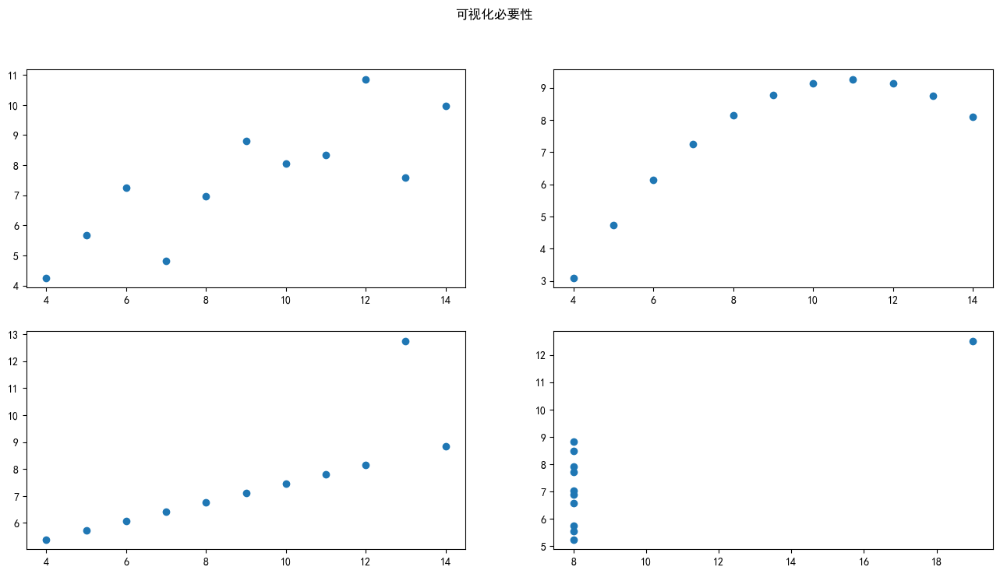

### 3.2 单变量可视化 

变量是连续型的, 单变量看分布,需要绘制**直方图** **hist**

```python
plt.figure(figsize=(10,6))
plt.hist(tips_df['total_bill'],bins=10)
```

>bins 把tips_df['total_bill']数据分成了10组 下面就是分组的边界
>
>array([ 3.07 ,  7.844, 12.618, 17.392, 22.166, 26.94 , 31.714, 36.488,41.262, 46.036, 50.81 ])
>
>统计每一组中数据的条目数:  
>
>array([ 7., 42., 68., 51., 31., 19., 12.,  7.,  3.,  4.]),
>
>每个柱子的高度就是每组数据条目的数量
>
>通过直方图可以了解到在不同组中哪一组数据多哪一组数据少, 就是数据的分布情况\

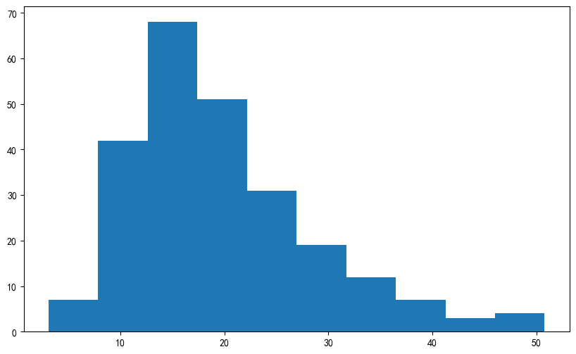

### 3.3 双变量可视化 散点图

变量是连续型的, 两个连续型的变量, 想看他们之间的关系, 需要绘制**散点图** **scatter**

```python
plt.figure(figsize=(10,8))
plt.scatter(tips_df['total_bill'],tips_df['tip'])
plt.title('账单和小费关系图')
plt.show()
```

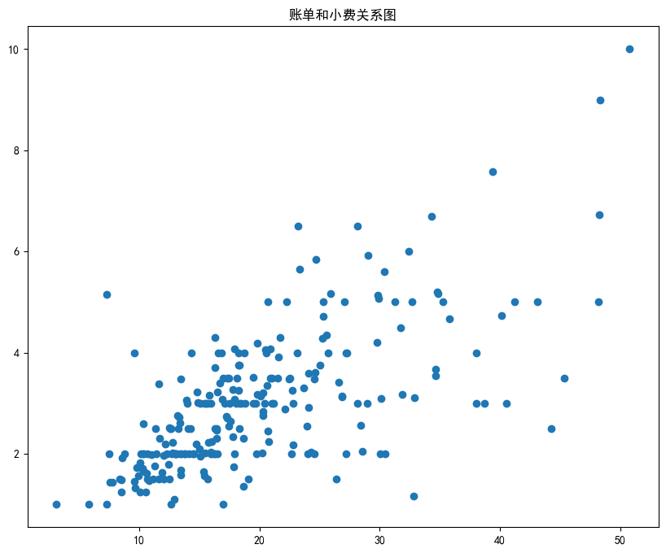

从图中可以发现, 随着账单金额的增加, 小费呈增加的趋势

可以通过计算相关系数进行验证

```python
tips_df.corr()
```

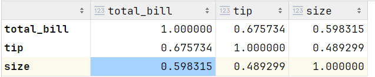

## 4 pandas绘图

### 4.1 pandas绘图的API说明

pandas的绘图功能实际上调用了MatPlotLib

df['列名'].plot.XXX()  df['列名'].plot(kind='XXX')

df.plot.XXX()     df.plot(kind='XXX')   

- XXX 图形的种类 line折线  hist 直方  scatter 散点  bar 柱状图   pie饼图

- 画图的时候, 默认是使用index作为X轴的坐标, 也可以指定, x,y

```python
city_df = pd.read_csv('C:/Develop/深圳42/data/city_day.csv')
# 获取数据前30条
temp_df = city_df.head(30)
# 日期作为index 用日期作为X轴的数据
temp_df.set_index('Date',inplace=True)
# 对SO2 绘制折线图, 看SO2 随时间的波动
temp_df['SO2'].plot(figsize=(20,10),grid=True)
```

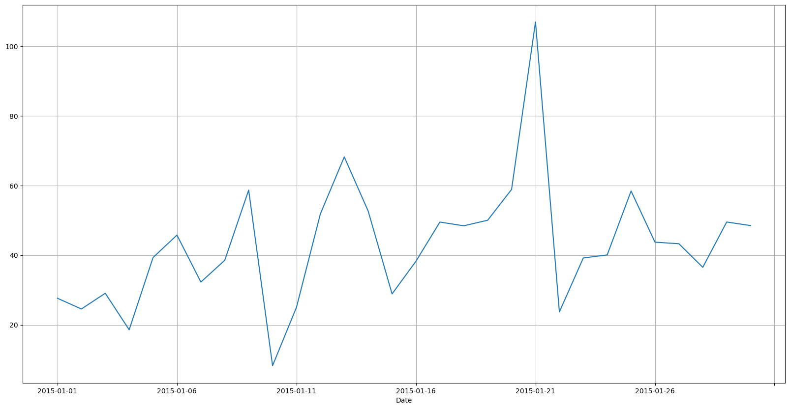

```python
import matplotlib.pyplot as plt
# 筛选两列数据, 这两列数据都会被画到图里
temp_df[['SO2','O3']].plot(kind='line',figsize=(20,10),grid=True)
plt.show()
```

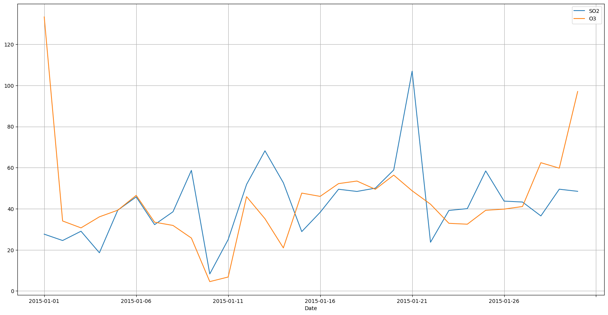

折线图的使用场景

- 某个变量随时间的波动情况

### 4.2 Pandas 绘图 柱状图

不同的类别在一起进行比较

```python
tips_df.groupby('sex')['tip'].mean().plot.bar()
```

>对比男性女性 给小费的水平 (性别分组对小费求平均)

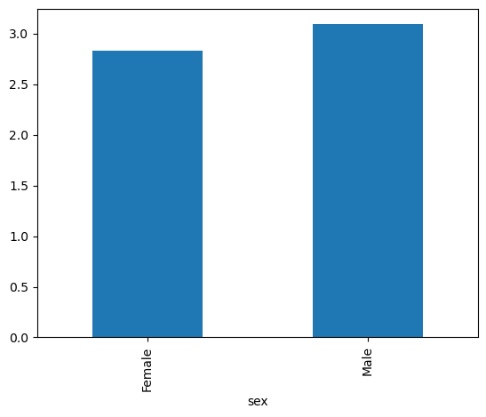

```python
tips_df.groupby('day')['total_bill'].mean().plot.bar()
```

>统计消费者在周几更愿意花钱 (每周不同日期的平均消费情况)

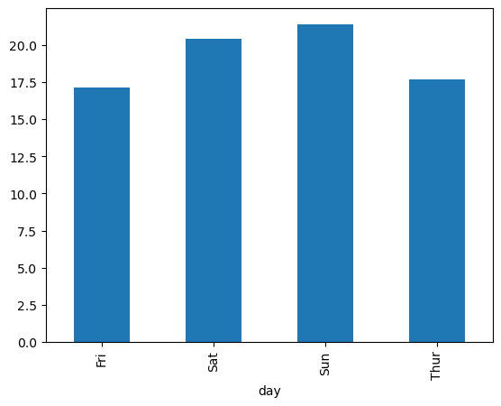

```python
tips_df.pivot_table(index='day',columns='sex',values='total_bill',aggfunc='mean').plot.bar()
```

>对比男性女性在每周中不同天, 花钱的情况

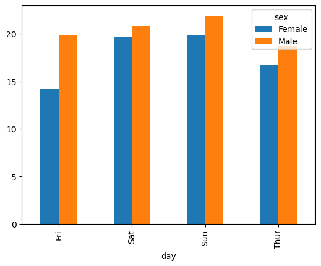

从上面的例子中可以看出, pandas绘制柱状图

- 索引(index)决定了有几组柱子
- column 数量决定了每组柱子里有几个不同的柱子(进行比较)
- 值决定了柱子的高度

```python
tips_df.pivot_table(index='day',columns='sex',values='total_bill',aggfunc='mean')
```

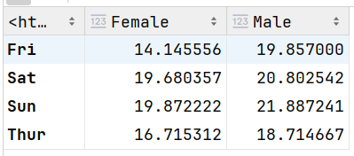

柱状图的其它画法  barh 横向柱状图  stacked = True 堆叠柱状图(每组柱子不同类别会堆在一起)

```python
tips_df.pivot_table(index='time',columns='sex',values='total_bill',aggfunc='count').plot.barh(stacked=True)
```

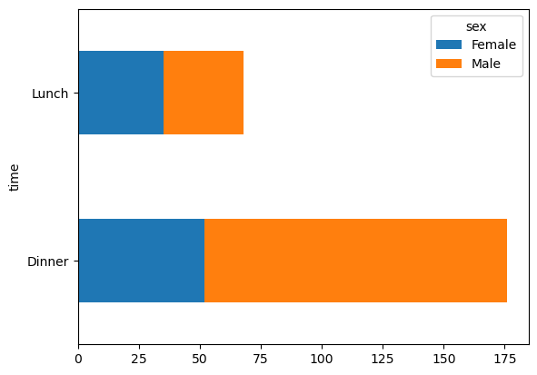

### 4.3 饼图

整体和部分之间的占比关系

```python
tips_df.groupby(['day'])['total_bill'].sum().plot.pie(autopct='%1.2f%%',figsize=(20,10))
# 假设 消费数据就是一家餐馆一周的营业数据, 统计每天的销售额占比情况,这个时候就可以绘制饼图
# 每天的销售额加到一起构成了这一周总销售额
```

>autopct='%1.2f%%'  加上这个参数会在饼的每一部分加上百分比的数字

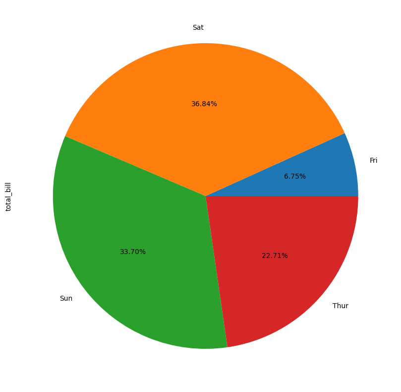

### 4.4 散点图和气泡图

散点图添加一个参数 s  控制点的半径大小, 这样就可以多表示一个维度的数据, 加上了这个参数的散点图也可以叫做**气泡图**

```python
tips_df.plot.scatter(x='total_bill',y='tip',figsize=(10,8),s=tips_df['size']*30)
plt.show()
```

>这里使用用参数人数 * 30 作为气泡的半径大小
>
>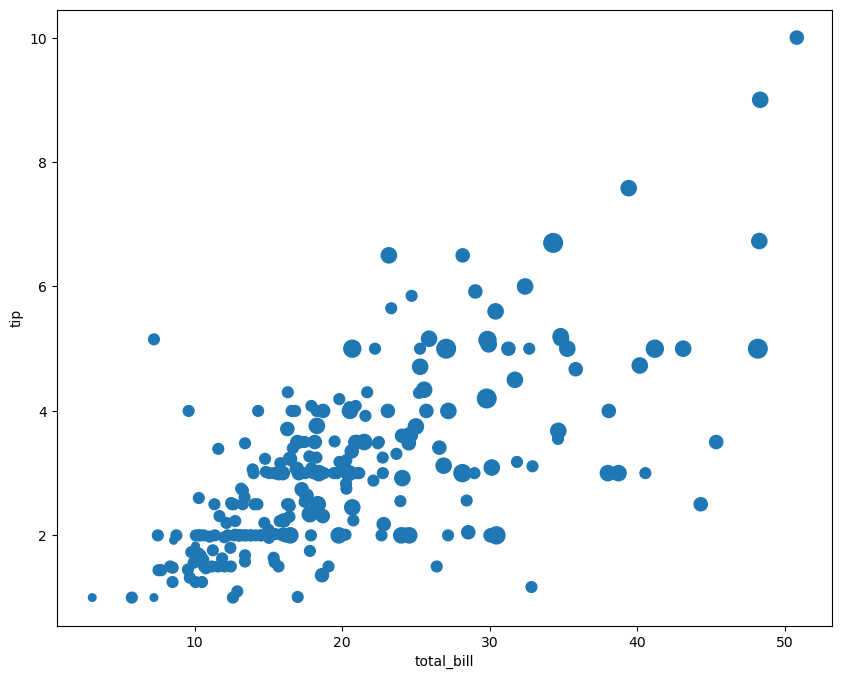

### 4.5 箱线图

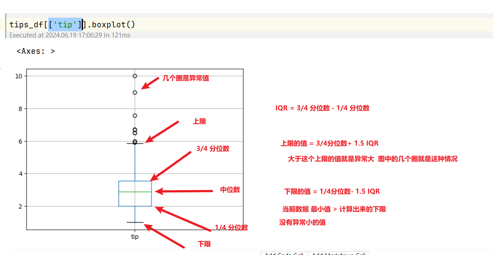

### 4.6 蜂巢图

作用类似于散点图, 可以看两个连续性变量的关系, 通过蜂巢图可以表示出数据的分布情况, 颜色较深的区域分布的数据量比较大, 颜色浅的区域分布的数据量比较小

```python
movie_df = pd.read_csv('C:/Develop/深圳42/data/movie.csv')
# 加载电影数据
movie_df.plot.scatter(x='gross',y='imdb_score',figsize=(10,8))
# 绘图查看评分和收入之间是否有关系
```

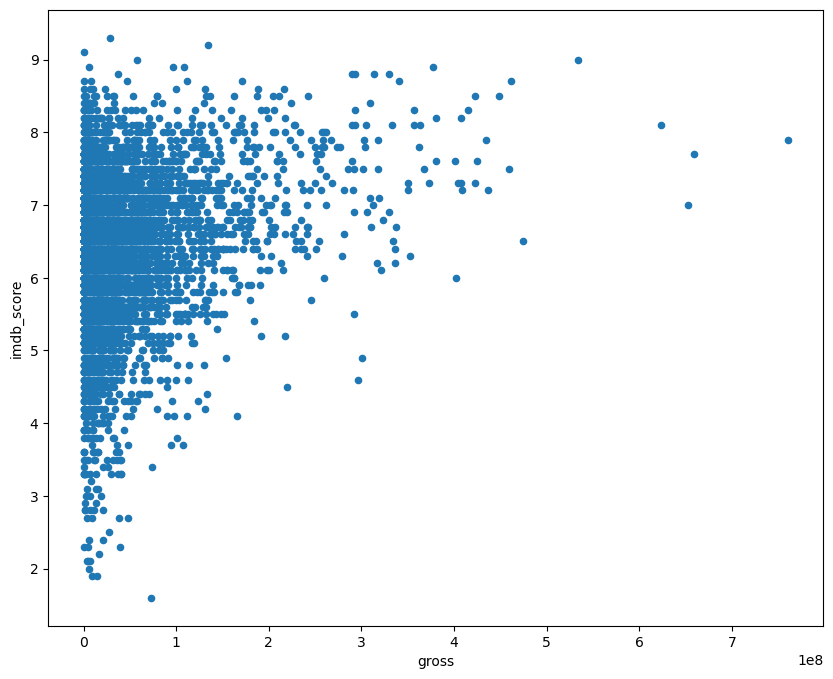

在6~8分, 收入在1一个亿一下, 的区域, 分布了很多数据, 只通过散点图, 无法反应数据量的分布情况, 此时可以再绘制一个蜂巢图

```python
movie_df.plot.hexbin(x='gross',y='imdb_score',figsize=(10,8),gridsize=15)
```

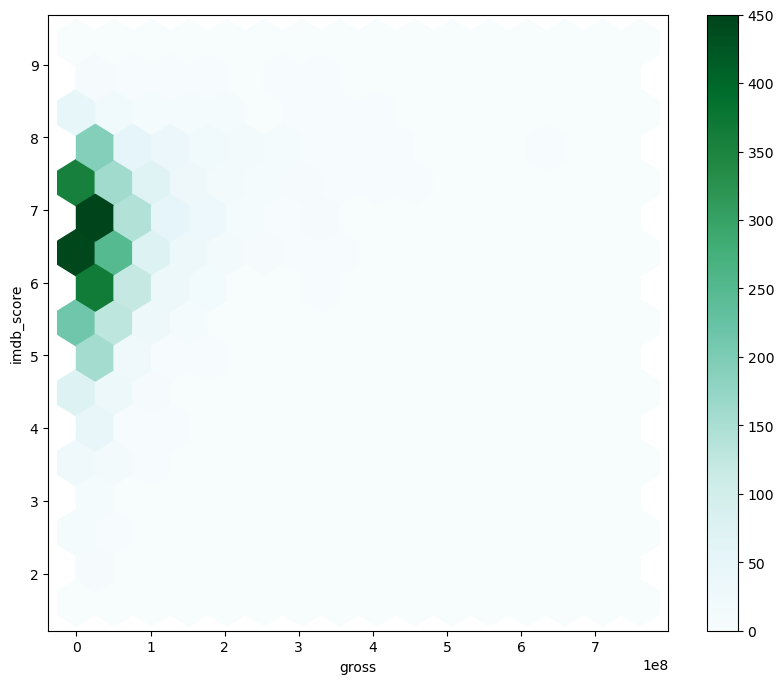

>从上图中, 看出, 颜色比较深的部分数据量比较大,  主要集中在 6到7分, 收入在6千万以下

df.plot.XXX()

- line 折线  (多列 多条线)
- hist 直方  (一列)
- scatter 散点图 (x,y)
- bar 柱状图 (多列, 多个柱子)
- pie 饼图  (一列)
- boxplot 箱型图 箱线图  (相对也会少一些)
- hexbin 蜂巢图 (了解)