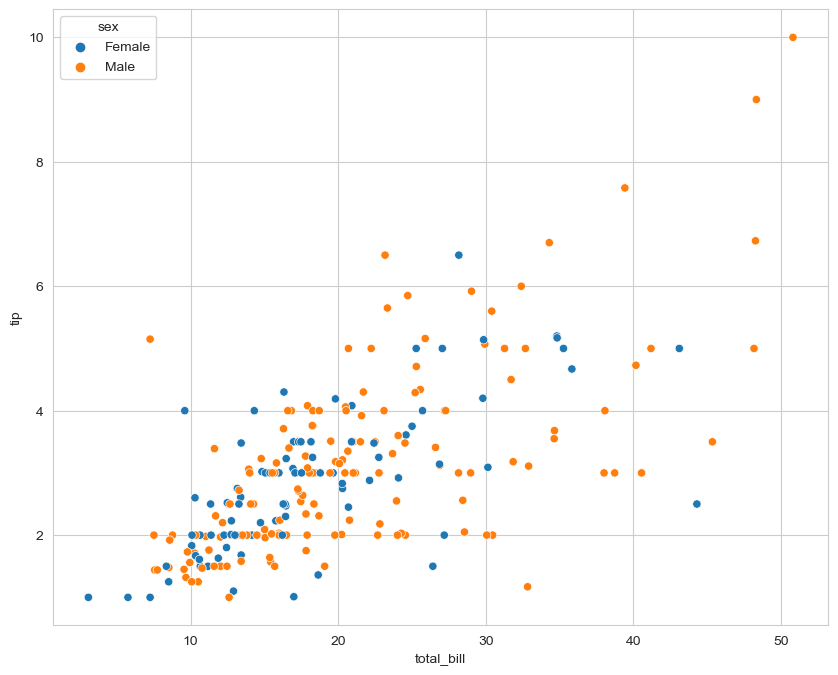
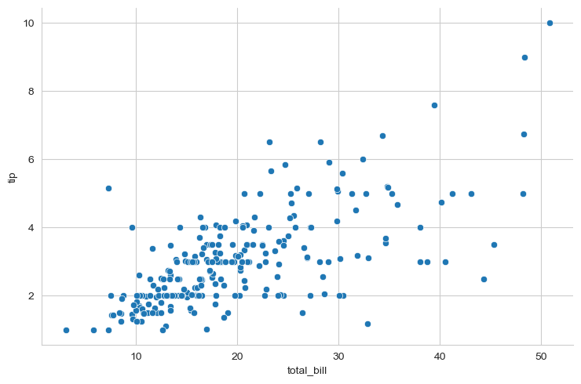
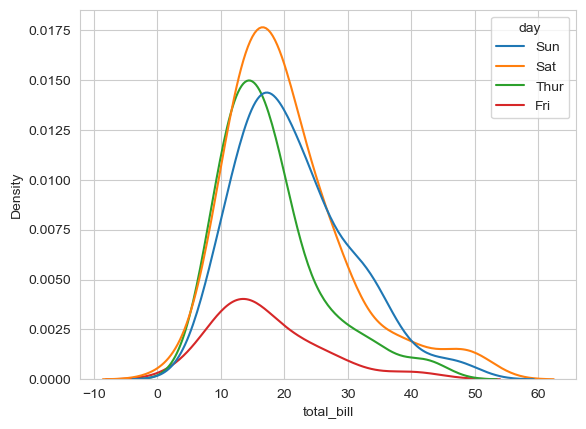
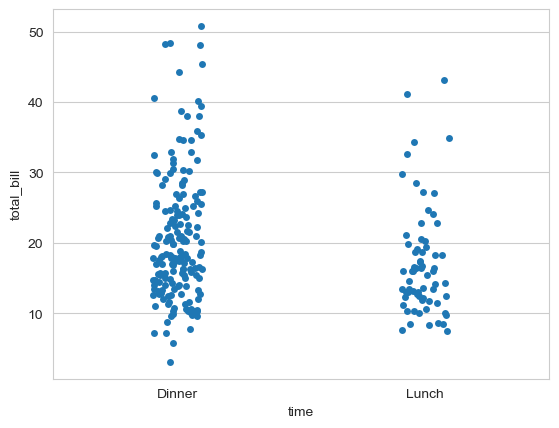
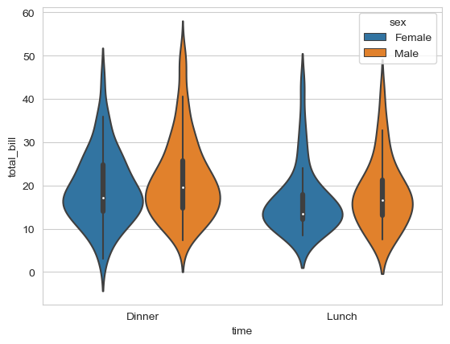
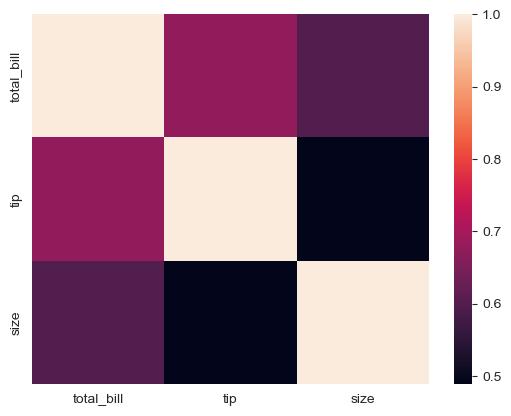

## 内容回顾

数据拼接

- concat
  - 上下(列名相同), 左右 (索引index 相同)
  - 通过axis 控制
- merge
  - 类似于SQL的join
  - 两张表merge 一个表出一列数据, 这两列数据中值相等的行就可以连接到一起
  - how ='left' 'right' 'inner' 'outer'
  - 连接的字段通过on来指定 (两个表用于连接的字段名字不同  left_on  right_on)
  - suffix 后缀
- append (过时了) join (功能可以替代) 
  - append 可以使用concat来替代
  - join 不传on的参数也可以使用concat axis = 1来替代
  - join 传on的参数 坐标的一列和右表的index 相等, 就可以连起来
    - 右表的index  通过reset_index 重置索引, 变成数据中的一列, 就可以使用merge的方式进行连接

数据可视化

- 为什么, 好处
- 什么时候可视化
- 常用图形
  - 直方图  单变量 连续型看分布      hist
  - 折线图  指标随时间的波动情况   line
  - 柱状图  多个类别之间进行比较    bar
  - 散点图  两个连续型变量看关系     scatter
  - 饼图   部分占整体的比例  (每一部分占比的对比)   pie

- MatPlotLib 和 Pandas绘图
  - import matplotlib.pyplot as plt
  - 准备数据
  - plt.figure(figsize = )
  - plt.XXX(x,y)
  - plt.show()

- pandas
  - s.plot.XXX()
  - df.plot.XXX()
  - index 会作为X轴坐标 , 每一列的值会作为Y
  - 散点图 x,y的参数传入列名

## 1 Seaborn 绘图

### 1.1 API 套路说明 

```
import pandas as pd
import matplotlib.pyplot as plt
import seaborn as sns

tips_df = pd.read_csv('C:/Develop/深圳42/data/tips.csv')
#%%
tips_df.head()
#%%
plt.figure(figsize=(10,8))
sns.scatterplot(x='total_bill', y='tip', data=tips_df,hue='sex')
plt.show()

#%%
plt.figure(figsize=(10,8))
sns.regplot(data=tips_df, x='total_bill', y='tip',fit_reg=True)
#%%
sns.relplot(data=tips_df, x='total_bill', y='tip',kind='scatter',height=5,aspect=1.5)
# height 高度
# aspect 宽度和高度的比例
```

>sns.XXXplot   seaborn 方法的起名的套路  XXXX指的就是不同的图形的名字
>
>通用的参数:
>
>- data = 传入dataframe 就是要用来画图的数据对应的df对象
>
>- x, y  df中的列名  用数据中的哪一列作为x值, y值
>
>- hue 传入一个类别型的变量, seaborn 会通过颜色来区分不同类别的数据, 画在同一个图中
>
>调整seaborn 图片的大小
>
>- plt.figure(figsize=(10,8))
>- 通过height=5,aspect=1.5 两个参数
>- 如何判断用哪种方式来调整  下面的图 外面有一个框把坐标系框在里面 这类图, 调整大小 ,通过plt.figure
>
>
>
>- 外面没有框把坐标系上面没有封口, 这一类图都是通过 height=5,aspect=1.5 两个参数
>
>  - height指定图片的高度
>  - aspect指定宽度和高度的比例
>
>  

### 1.2 常用图形

直方图

```python
sns.histplot(data=tips_df,x='total_bill',hue='day')
```


kde图

- 作用跟直方图类似, 只不过绘制的是概率密度, 同一列数据的多个类别(超过两个) 的数据分布情况进行对比,用kde图更容易读图

```python
sns.kdeplot(data=tips_df,x='total_bill',hue='day')
```



分类散点图

```python
sns.stripplot(data=tips_df,x='time',y='total_bill')
```



**柱状图**

barplot()

- 先对数据做分组聚合, 然后再画图

```python
sns.barplot(data=tips_df,x='day',y='total_bill',estimator='mean',hue='sex')
# 对x 进行分组, 对y 进行聚合, 聚合的方法通过estimator来指定, 默认是mean 求平均
# errorbar 误差棒 当数据是抽样的数据, 这个errorbar显示了当前的统计量的置信区间 (可信区间)  因为抽样本身就会带来误差, errorbar的长短跟数据样本数量多少有关, 数据越多errorbar越短, 数据越少errorbar越长
# 如果这里使用的是全部的数据, 不是采样的, 可以设置 errorbar = None 关闭这个误差棒的显示
# estimator  通过这个参数来控制 聚合函数使用哪一个
```

countplot() 计数柱状图

```python
sns.countplot(data=tips_df,x='day',hue='sex')
```

>这里只有x 没有y  对x 分组计数,相当于下面代码的效果
>
>```
>tips_df['day'].value_counts().plot.bar()
>```

提琴图

- 和箱线图类似, 比箱线图多表示出数据的分布情况

```python
sns.violinplot(data=tips_df,y='total_bill',x='time',hue='sex')
```



热力图

- 通过不同的颜色表示数据的大小, 典型应用场景对数据的相关性进行可视化

```python
sns.heatmap(tips_df.corr(numeric_only=True))
```




## 2 业务数据分析

### 2.1 数据分析基本技能 

取数 SQL Pandas Excel  BI工具能力 FineBI/FineReport   Tableau   PowerBI 微软

专题分析

- 数据分析的指标
- 数据分析的思维
- 数据分析常用的模型 规则模型

报告能力

- 数据分析报告

AB测试

- 中大厂会用到
- 小厂

描述性数据分析 → 诊断分析 → 预测 → 方案(处方)

- 描述分析 数据指标 通过这套指标可以知道公司运营的情况
-  诊断分析 使用数据指标, 发现运营的问题

### 2.2 主要业务指标

活跃/留存/转化

- DAU MAU
  -  流量指标, 代表了应用健康程度
- 次日留存 七日留存
  - 用来考核渠道
  - 好的渠道留存会高, 差的渠道留存低
- 购买转化, 广告点击转化, 转发率
  - 购买人数/访问人数
  - 点击人数/曝光数量
  - 转发人数/页面访问人数

销售

- GMV(只要下单就算, 没付款,退货,取消的都算进来) NMV(订单付款并确认收货的, 去掉退货,取消的订单)
- 客单价 
  - 游戏行业 ARPPU
- 转化率   购买人数/访问人数

商品

- SPK  SKU 
- 动销率
- 复购率
- 连带率  (不止买了一件商品的订单/ 所有订单数量)

流量付费

CPM 千次展示收费 CPC 按点击收费

电商黄金公式

销售额= 访问人数*转化率*客单价

### 2.3 数据分析模型

阿里AIPL  京东AAAA  抖音AAAAA

- 思路类似, 从用户生命周期的角度, 给用户划分成不同的群体
- 将用户从 新用户 → 忠实用户  这个生命周期演变的过程 划分成不同的阶段, 每个阶段对应不同的用户群体

- 体现了分群思想 , 分群精准营销/精细化运营的重要手段 
- 对于数据分析的同学, 在这个运营环节中起到的作用
  - 给用户贴标签
  - 计算各种指标, 出不同的报表, 来衡量运营的水平

## 3 Python自动化报表

数据如果是从Excel里来的, Excel从各种系统导出来的, ERP, OA, CRM, 进销存

用Python来处理不同Excel表格里来的数据是一个重要的应用场景

- 如果数据就是一两张表, 操作是临时的操作, 通过Excel来解决就可以了
- 如果数据涉及到多张表(几十,上百), 或者操作需要经常进行

团队数据挖掘团队, 后面的业务做机器学习或者深度学习建模, 我们做数据处理的业务, 我们写的代码作为整个过程的一个环节, 这样的场景, 整个的环节都是Python技术栈, 这个时候, 用pandas做数据处理也是很常见的


如果数据是Hadoop Hive保存, 或者 数据是保存在Mysql, 直接使用SQL的技术栈来解决问题


### 3.1 业务说明

数据保存在多张Excel表中, 每张表的处理逻辑相同, 最终的结果放到一起, 这样的场景十分适合用Pandas做数据处理, 使用Pandas好处

- 效率提高
- 降低出错的概率


处理的思路, 多张Excel表中, 每张表的处理逻辑相同,先把一张表处理的逻辑梳理清楚, 再循环做其它的表

加载一张表的数据

```python
import pandas as pd
import os
name = '睡袋&睡袋.xlsx'
data_dir = 'C:/Develop/深圳42/data/report/'
df = pd.read_excel(data_dir+name,parse_dates=[0])
```

一张表的处理逻辑

```python
df['销售额'] = df['访客数']*df['转化率']*df['客单价']
# 筛选2023年的数据
df['年份'] = df['日期'].dt.year
df_2023 = df[df['年份']==2023]
# 统计每个品牌的23年的总销售额
result_df = df_2023.groupby(['品牌'],as_index=False)['销售额'].sum()
```

把一张表的逻辑推广到多张表(通过for 循环来实现)

```python
final_df = pd.DataFrame()
for file_name in os.listdir(data_dir):
    # 遍历文件名字的列表, 拿到每一个文件名, 打开每一个excel文件
    df = pd.read_excel(data_dir+file_name,parse_dates=[0])
    # 新建一列, 销售额
    df['销售额'] = df['访客数']*df['转化率']*df['客单价']
    # 筛选2023年的数据
    df['年份'] = df['日期'].dt.year
    df_2023 = df[df['年份']==2023]
    # 统计每个品牌的23年的总销售额
    result_df = df_2023.groupby(['品牌'],as_index=False)['销售额'].sum()
    result_df['类目'] = file_name.replace('.xlsx','')
    # 把当前的结果和上一轮的结果拼接到一起 (这里要想清楚拼接的方法)
    final_df = pd.concat([final_df,result_df])    
```

>os.listdir(data_dir) 列出目录下所有的文件 返回一个列表
>
>注意结果的拼接

开发的过程, 梳理思路可以再Notebook里进行, 最后把写好的逻辑, 保存到.py文件, 后续再有相同的需求, 可以直接运行.py文件

```python
python XXXX.py
```

### 3.2 漏斗分析

漏斗分析使用场景: 业务流程相对规范、周期较长、环节较多

漏斗分析计算指标: 各阶段的转化率

- 电商购买路径漏斗, 除了各阶段转化率以外 , 还会计算一个总的转化 打开→支付的转化  (其它环节一般不计算到支付的转换, 都是相邻的阶段计算转化率)


漏斗分析模型能够实现以下价值

- 企业可以监控用户在各个层级的转化情况
- 不同属性的用户群体漏斗比较，从差异角度窥视优化思路。


当前的业务

- 找到近一年（2023年）投放效果还不错的品牌, 要用到的指标
  - 品牌搜索人数
  - 搜索→点击转化
  - 点击→支付的转化


代码实现

```python
# 查看一张表的数据
name = '2023-03.xlsx'
# 读取数据
df = pd.read_excel(data_dir+name)
# 从表的文件名中提取年份
df['年份'] = name[:4]
df
```

循环遍历所有文件进行处理

```python
# 所有的Excel表格所在的目录
data_dir = 'C:/Develop/深圳42/data/ad_data/'
# 创建空白的DataFrame 用于保存结果
final_df = pd.DataFrame()
# 遍历目录
for name in os.listdir(data_dir):
    # 获取每一个月份的数据
    df = pd.read_excel(data_dir+name)
    # 从文件名字中获取年份 
    df['年份'] = name[:4]  # name = '2023-03.xlsx'
    # 拼接 没读取一个月份的数据, 拼接到一起
    final_df = pd.concat([final_df,df])
# 筛选2023年的数据
final_2023 = final_df[final_df['年份']=='2023']
# 使用品牌进行分组 对12个月的 '品牌搜索人数', '点击人数', '支付人数' 进行求和, 保存结果
final= final_2023.groupby(['品牌'])[['品牌搜索人数', '点击人数', '支付人数']].sum().reset_index()
#%%
# 计算这12个月每个品牌整体的转化率
final['搜索-点击转化率'] = final['点击人数']/final['品牌搜索人数']
final['点击-支付转化率'] = final['支付人数']/final['点击人数']
#%%
# 设置dataframe 显示的时候保留两位有效数字
pd.set_option('display.float_format', lambda x: '%.2f' % x)
# 从计算好的数据中, 使用品牌搜索人数进行排序, 挑选流量最大的前15个品牌进行可视化
display_data = final.sort_values(by='品牌搜索人数',ascending=False).head(15)
```

