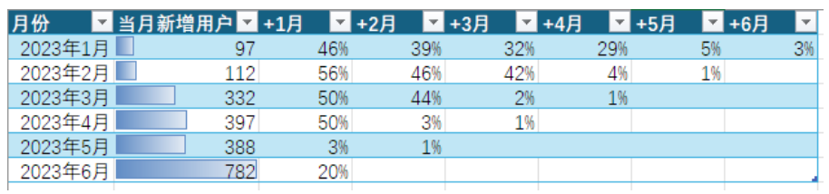
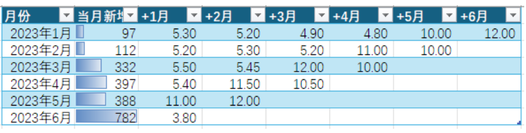
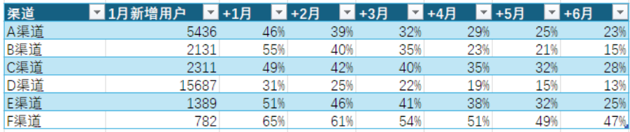
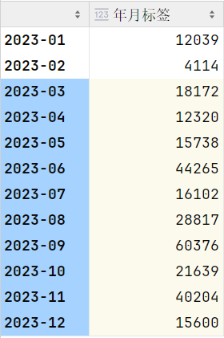
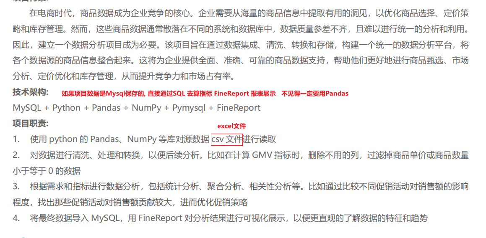
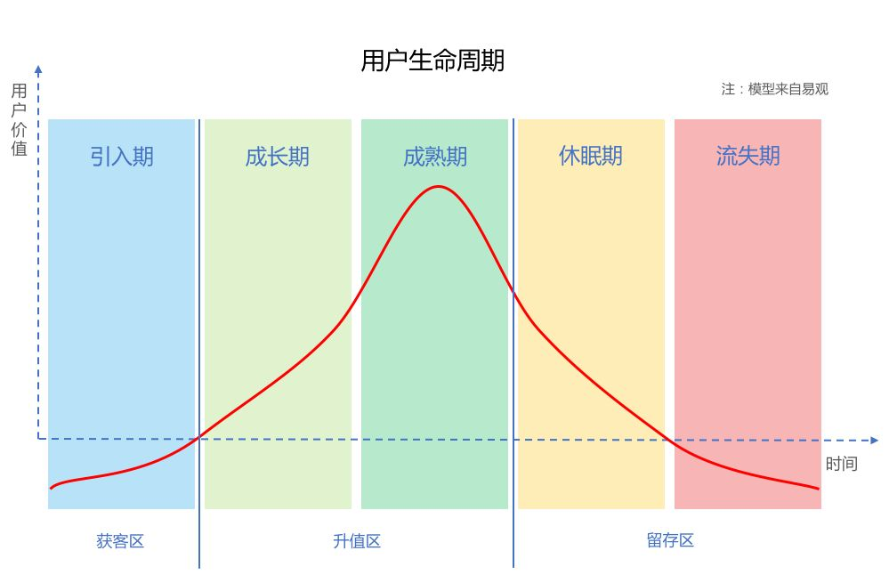
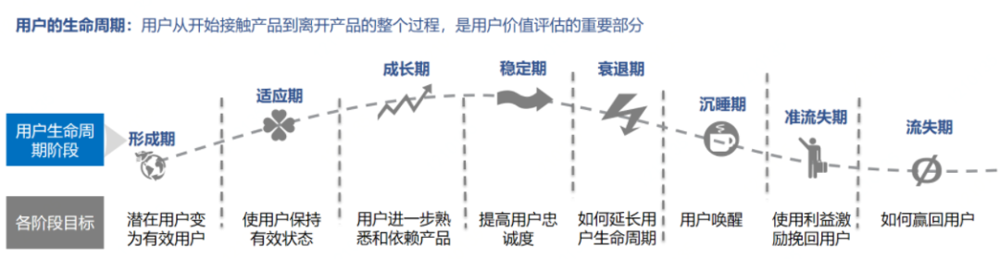
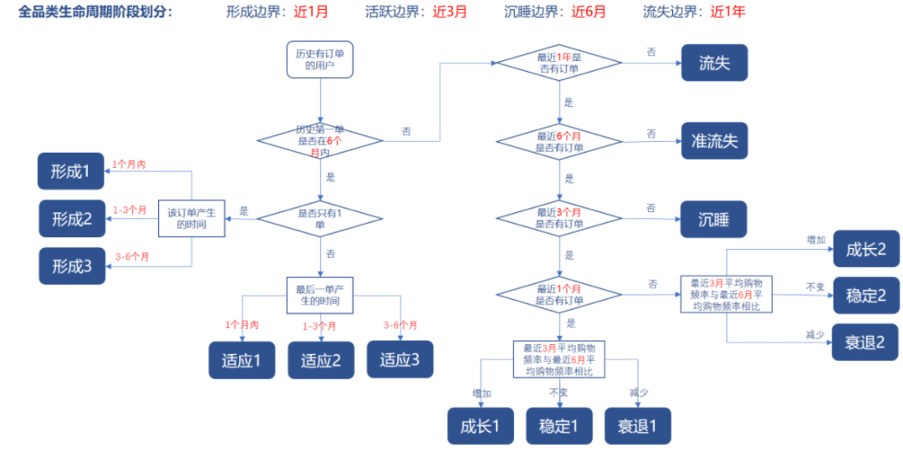

## 内容回顾

TGI 偏好分析

- TGI 目标群体指数  目标群体在某个问题上的平均水平/整体平均水平 *100
- 找合适产品投放(首次上市推广)的城市

评论文本分析

- 非结构化数据(文本数据)的处理
  - 英文 跨境电商 亚马逊 shoppy 虾皮
    - 分词 → 词形还原 → 去停用词 → 统计词频 → 画词云图 (pyecharts)
    - nltk
  - 中文
    - 分词 →去停用词 →  统计词频 → 画词云图 (pyecharts)
    - jieba
  - 评论分类(好评/差评) 或者 差评进一步划分(物流/质量/客服) 见扩展资料 机器学习模型

- 结构化数据的处理
  - 评论的数量, 评论的时间
  - 画图分析
    - 评论数量随时间的变化
    - 好评 中评 差评的比例

## 同期群分析

### 1.1 同期群分析概念

将用户按初始行为的发生时间划分为不同的群组，进而分析相似群组的行为如何随时间变化

使用场景:  对比不同月份用户的留存(复购)的情况



上表的百分比为留存率，留存率=某月复购用户数/对应期新增用户数量

同期群分析除了对比复购的情况, 指标也可以调整, 比如比较不同月份新增用户的客单价的变化情况



还可以用来比较不同渠道的质量



推广渠道

- 线上
  - 微信, 微博, 抖音, 头条, 百度... 线上广告
  - 点广告跳转下载, 跳转小程序
- 线下
  - 公交站, 地铁站, 公交车 实体广告
  - 地推团队, 带着广告和礼物 扫码下载送礼物
- 下载的链接都会带着不同的id  download.XXX.net/XXXX.apk?id=1e76827567615
- 评估渠道质量
  - 量 (每月新增用户数量)
  - 留存率(同期群)
  - 价格


### 1.2 案例代码

通过销售数据计算每个月的新用户在后面月份的复购情况

**加载数据**

```python
import pandas as pd
df = pd.read_excel('C:/Develop/深圳42/data/group_anlysis.xlsx')
df.info()
df.head()
df.describe()
```

**提取年月信息**

```python
df['年月标签'] = df['付款时间'].str[:7] # 字符串截取, 获取年月字符串数据
df['年月标签'].value_counts().sort_index()
```




- 每个月要知道当前月份的新增用户  如果我们有用户注册的表, 知道了用户的注册时间, 直接可以计算了
- 在这里我们把用户的首次购买作为 新增的标志
- 计算当前月份的新增用户, 在后面的月份是否有购买  有购买算复购 

**以2023年2月数据为例, 先算出一个月的数据来, 再for循环计算其它月份的**

```python
from pandas import DataFrame
month='2023-02'
sample:DataFrame=df.loc[df['年月标签']==month]

sample.shape
#%%
# 从2月的销售流水中去重得到所有2月的用户ID的唯一值
sample_unique = sample.drop_duplicates(subset=['用户ID'])
#%%
# 获取1月的数据
history_df = df.loc[df['年月标签']=='2023-01'] 
# 判断2月的用户是否在1月的用户数据中, 如果在数据中说明是1月的留存(复购)用户, 如果不在1月的用户数据中, 说明是2月的新增用户
sample_unique['用户ID'].isin(history_df['用户ID'])
#%%
# ~ 取反的符号  True →False  False →True
# 对在1月出现的ID范围内的数据取反 得到的就是不在这个范围的, 就是2月的新用户
sample_unique_new = sample_unique.loc[~(sample_unique['用户ID'].isin(history_df['用户ID']))]
#%%
# 二月的新增用户
sample_unique_new
#%%
month_list = df['年月标签'].unique().tolist()[2:]
result_list = []
for month in month_list:
    # 取出一个月的数据 
    next_month_df = df.loc[df['年月标签']==month]
    # 新增用户的ID 出现在后面月份的数据中, 说明是复购用户
    retention_users_df = sample_unique_new.loc[sample_unique_new['用户ID'].isin(next_month_df['用户ID'])]
    # 把复购用户数量保存在列表中
    result_list.append([month+'留存情况',retention_users_df.shape[0]])
#%%
result_list
#%%
result_list.insert(0,['2023年2月新增用户:',sample_unique_new.shape[0]])
#%%
result_list
```

>zip方法说明 : zip拉锁的意思, 可以把两个列表拉到一起,  返回一个新的zip对象, 转换成列表以后, 列表的每一个元素是一个元组
>
>
>
>```python
>list1 = [1,2,3,4,5]
>list2= [6,7,8,9,10]
>list(zip(list1,list2))
>```
>
>>[(1, 6), (2, 7), (3, 8), (4, 9), (5, 10)]
>
>```python
>list1 = [5,6,7,8,9,10,11]
>list2 = [1,2,3,4,5,6,7,8,9,10,11]
>list(zip(list1,list2))
>```
>
>[(5, 1), (6, 2), (7, 3), (8, 4), (9, 5), (10, 6), (11, 7)]
>
>```python
>for j,cnt in zip(list1,list2):
>    print(j,cnt)
>```
>
>5 1
>6 2
>7 3
>8 4
>9 5
>10 6
>11 7

**遍历所有的月份计算每个月的新增用户和复购情况**

```python
month_list = df['年月标签'].unique().tolist() # 获取所有月份的列表
final_df = pd.DataFrame() # 准备一个空白的df 用来保存最终的结果
for i in range(len(month_list)-1): # 一共计算11个月
    # 准备一个空白的列表, 用来保存当前月份计算的结果
    count_list = [0]*len(month_list)
    # 外层循环的目的是为了找到每个月的新增用户
    # 先筛选当前月份的数据
    target_month_df = df.loc[df['年月标签']==month_list[i]]
    target_month_df.drop_duplicates(subset=['用户ID'],inplace = True)
    # 如果是第一个月, 不需要判断了,所有的用户都是新用户
    if i==0:
        new_users_df = target_month_df.copy()
    else:
        # 如果不是1月, 2月以后得数据, 需要先获取前面的所有月份的数据  month_list[:i]
        history_df = df.loc[df['年月标签'].isin(month_list[:i])]
        # 判断当前的用户是否在前面的月份出现过, 如果没有出现过 就留下来, 是当前月份的新用户
        new_users_df = target_month_df.loc[(target_month_df['用户ID'].isin(history_df['用户ID']))==False]
    
    # 把新用户的数量保存到列表的第一个元素中
    count_list[0]=new_users_df.shape[0]
    #print(count_list)
    # 内层循环, 用来计算新用户在后面月份的复购情况
    for j,cnt in zip(range(i+1,len(month_list)),range(1,len(month_list))):
        # j 用来循环后面的月份, 从i+1开始, i指向2月份, j就是3月份
        # cnt 用来记录结果的 不管是哪个月份都是从1开始, 第0个元素记录的是新增用户
        next_month_df = df.loc[df['年月标签']==month_list[j]]
        # new_users_df['用户ID'].isin(next_month_df['用户ID']) 是True/False组成的列表 sum求和 计算的是True的数量
        retention_count =(new_users_df['用户ID'].isin(next_month_df['用户ID'])).sum()
        # 保存结果到列表
        count_list[cnt] = retention_count
    # 如果不是第一个月, 需要和历史的月份进行判断, 如果在历史月份中出现过,就不是新用户
    # 要统计的是在前面的月份中,没有出现过的用户ID
    result=pd.DataFrame({month_list[i]:count_list}).T
    final_df = pd.concat([final_df,result])
final_df.columns = ['当月新增','+1月','+2月','+3月','+4月','+5月','+6月','+7月','+8月','+9月','+10月','+11月']
```


## 数据分析报告

报告的种类

- 周期性: 周报, 月报, 日报
  - 月报,周报 打好了框架之后,修改内容就可以了
  - 先展示大盘的指标(比较重要的大家都比较关心的指标), 在分项展开
  - 电商 GMV画折线图 买了多少件, 多少用户消费了, 客单价, 进店的用户数, 转化率 , 动销率, 复购率 , 退货率, 好评率

- 专题分析
  - 针对提升用户留存做专题
  - 针对618大促做的专题
  - 总分 先做总结, 然后再展开
- 图文结合, 结论都要有数据的支持, 文字内容不要过多, 展示的图片以 直线图, 直方图, 柱状图, 饼图,散点图为主
  - 复杂的图形, 结合听众决定, 如果都是做数据的, 图形选择的范围可以宽一些
  - 听众并不都是专业人员, 就使用基本图形就可以了


## 数据分析工作内容

一 提数能力, 响应临时的数据需求

- 如果有数仓团队, 数据团队比较完整, 数分提数, 计算临时需求是基于数仓同学的开发结果
- 如果没有数仓团队, 数据团队规模比较小, 数据来源可能是各种系统, 进销存系统, CRM系统(客户关系管理)
- 主要技能 SQL, Pandas, Excel

二 报告能力

- 日报, 周报, 月报
- 专题分析报告

三 专题分析能力

- 使用不同的分析方法
  - 漏斗分析
  - 多维度拆解(下钻)  分组聚合
  - 当数据有波动的时候, 把时间维度拉长, 是不是周期性波动
  - 对比分析
  - TGI 目标群体指数
  - 同期群  留存 (渠道质量评估的重要指标)
- 使用不同的运营模型
  - RFM
  - AIPL
  - AAAA
  - AAAAA
  - AARRR
  - 用户生命周期
- 使用运营模型的时候, 数据分析的同学发挥的作用
  - 用户贴标签, 用标签来区分群体
  - 计算相关的指标, 形成报表, 用来考核模型使用的情况
- 用户生命周期模型
  - 导入期
  - 成长期
  - 成熟期
  - 沉睡期
  - 流失期

四 指标波动的监控, 原因的分析

- 周期性
- 多维度拆解

五 AB测试

- 中大厂 每天都在做很多AB测试
- 小厂  关键的迭代可能会用, 或者不具备AB测试的能力

## 数据分析简历说明




写在简历上的一定都能说出来

- 说不出来的不要写
- 代码的细节不要出现在简历里

技术栈的问题

- 不一定非得跟Pandas沾边
- Pandas  处理Excel, 数据是从不同系统里导出来的
  - 进销存, CRM等等系统
  - 有不同的电商平台, 抖音, 淘宝, 天猫, 京东, 拼多多, 需要把所有的数据合到一起
  - 数据团队偏机器学习的, 后面是做数据挖掘, 模型训练的
- 数据是Mysql  Hadoop hive里存的 直接用SQL来计算, FineBI  FineReport进行展示


漏斗分析

- 举例说明如何用的
- 监控各阶段转化率, 当转化率波动出现问题的时候, 及时的定位问题, 发现原因及时修改


专题分析(618大促专题)

个人职责

- 活动前 制定目标
  - GMV/ 流量/ 转化/ 拉新(新增用户) / 投放预算 (CPC)
- 活动中
  - 对关键指标进行监控, 如果有异常的波动及时发现并分析原因
- 活动后
  - 对活动进行总结, 复盘出具分析报告
  - 活动是否达到了目标, 哪里做的好, 哪里做的不好


数据分析简历 项目的内容可以写

大促专题分析

- 计算了关键的指标, 流量指标, 销售额的指标

- 漏斗分析
  - 打开 → 购买流程
  - 计算各阶段的转化率
  - 打开→搜索, 搜索→详情, 详情→加购, 加购→下单, 下单→支付

RFM模型

- 用户打标签
  - 分几个群体
- 指定相关的指标, 对模型的落地情况进行监控
  - 不同群体人群数量波动情况
  - 关键群体的消费数据

## 用户生命周期标签

用户标签数据——用户生命周期类标签，如何计算

结合用户生命周期的专题分析可以有很多种

- 流失用户的召回
  - 当前的流失率, 回流率  
  - 对采用不同召回策略用户的数据进行监控
  - 回收数据进行对比
- 形成期用户的促活

### 1 什么是生命周期标签

首先，什么是生命周期模型呢？

其实本质上，就是用户的一种分层、分类的方法论。是按照用户在产品中的阶段进行的划分，反映了用户从接触产品到离开产品的整个过程。从技术层面，可以理解成一个用户标签，标签值有新用户、成长期用户、流失用户等。


用户生命周期的概念，在用户增长系统中会用的比较多，后面会针对用户生命周期的应用、落地进行详细分享。这里进行概要的阐述。

通常来讲，用户的生命周期分为如下图的五个阶段：



- 引入期：用户刚刚开始使用产品或者服务，初步建立起品牌的认知
- 成长期：用户对产品服务开始逐渐信任，使用频次、深度不断加强
- 成熟期：用户对平台的服务非常熟悉，可以无障碍地完成各种内容，使用的频次深度趋于稳定
- 休眠期：用户逐步丧失对平台的兴趣，使用频率、热度越来越低
- 流失期：用户完全不再使用该产品

生命周期模型能做啥呢？针对不同阶段的用户，可以进行精细化的运营、精准施策。

那如何判断一个用户是属于什么阶段呢？这个其实就是标签的计算逻辑了。

### 2 如何计算生命周期标签

核心问题来了，如何计算生命周期标签呢？

计算的方式有千千万，但总体上来讲，基本分了两类：一类是通过逻辑规则进行判断生命周期的阶段，一类是通过算法来进行判断。

（1）通过逻辑规则，判断生命周期阶段

先来一个示例图，这是一个用户生命周期的划分（和上面的例子比，更加细分了一下，但逻辑是一致的）：



这里最主要的几个数据，包括：用户首单时间、有效订单量及发生时间、最近一单时间、购物频率的数据，就可以计算出比较系统的用户的生命周期。

这里设置了四个时间边界参数，分别是：形成边界、活跃边界、沉睡边界、流失边界。这四个是判断时间的主要参数。可以按照不同的业务特点进行灵活设置。

具体的计算逻辑上，可参考下面的逻辑全景图：




首先，找出全部历史有订单的用户，判断历史第一单是否在6个月以内；

- 接下来，判断用户是否只下了1单，如果是的话，根据这单产生的时间，把用户划分为三个不同的形成阶段；
- 如果用户下了两单及以上，根据用户最后一个订单的产生时间，把用户划分为三个不同的适应阶段；

如果用户第一单在6个月以前，那么判断用户的最后一单的产生时间。

- 如果在1年以前，那么用户处于流失阶段；
- 如果在6个月到1年之间，那么用户处于准流失阶段；
- 如果在3个月到6个月之间，那么用户处于沉睡阶段。

最后根据用户近3个月与近6个月的购物频率对比，

- 如果频率增加，那么用户处于成长阶段；
- 频率不变，用户处于稳定阶段；
- 频率减少，用户处于衰退阶段。

根据最后一单的产生时间

- 如果在1个月内，那么用户的对应阶段分别为成长1、稳定1、衰退1；
- 如果在1-3个月内，那么用户对应的阶段分别为成长2、稳定2、衰退2。

（2）通过算法，判断生命周期阶段

在算法层面，其实给用户计算生命周期，本质上就是进行用户分类的过程。

关于如何进行用户分类，算法就比较多了，比如可以使用朴素贝叶斯、SVN等。


条件取数

df.loc[]/df.iloc[]

df[df['字段']==]

df.query('')

分组聚合

- df.groupby().agg()
- df.groupby(分组字段)[聚合字段].聚合函数()
- df.pivot_table(index,columns,values,aggfunc)

表连接

df.merge()

pd.concat()

分箱,分组

pd.cut()

df['字段'].apply(func)

基本数据处理

- 去重  drop_duplicates()
- 排序  sort_values()  sort_index()
- 去缺失值  dropna() fillna()
- 统计函数 min() max() mean() sum() count() median()中位数    quantile() 分位数 std()标准差

加载数据的时候, 固定的套路

df = pd.read_XXX()

df.info()

df.head()

df.describe()

画图

- 柱状图
- 折线图
- 直方图→ KDE图
- 散点图→气泡图 →蜂巢图
- 饼图
- 热力图  相关性展示
- 箱线图→ 提琴图
  - IQR= 3/4分位数-1/4分位数
