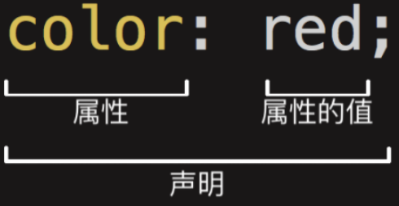
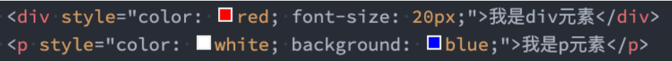
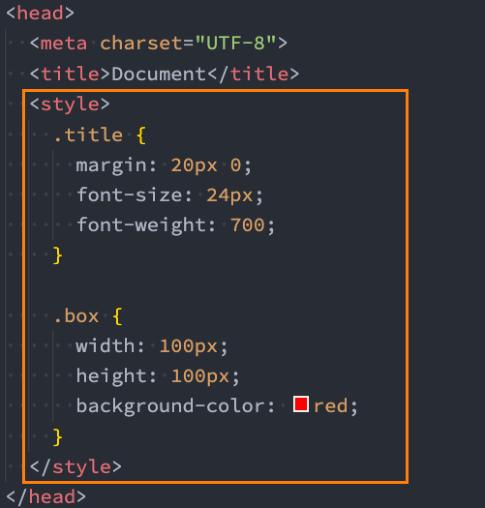
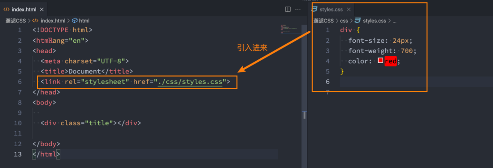
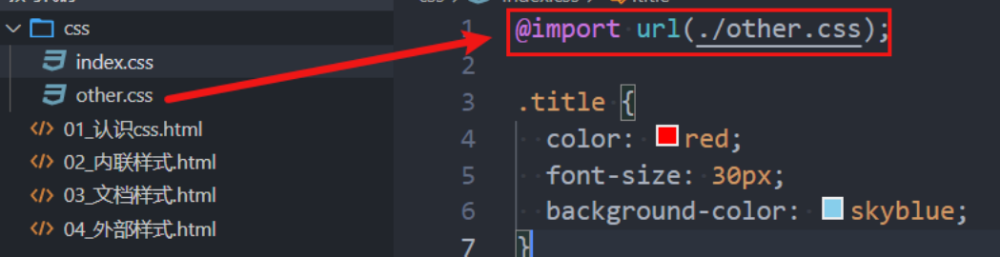
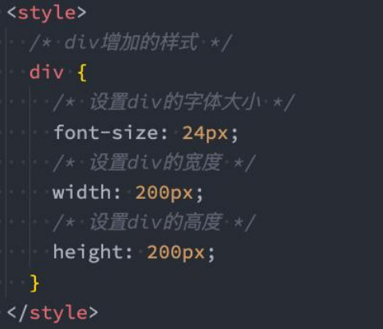
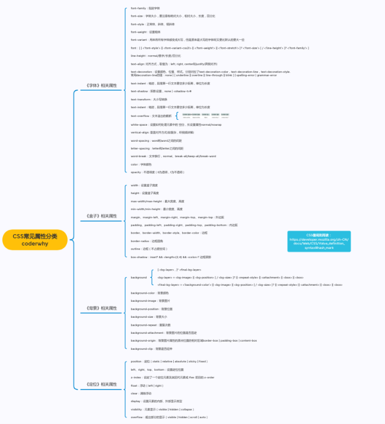
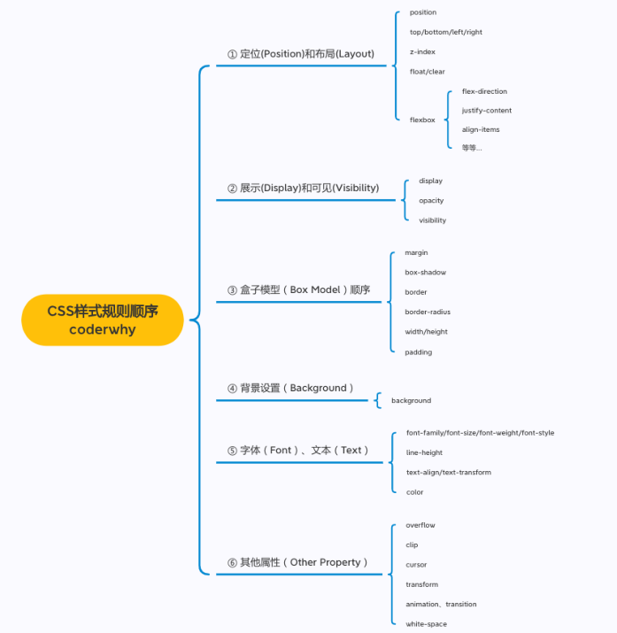
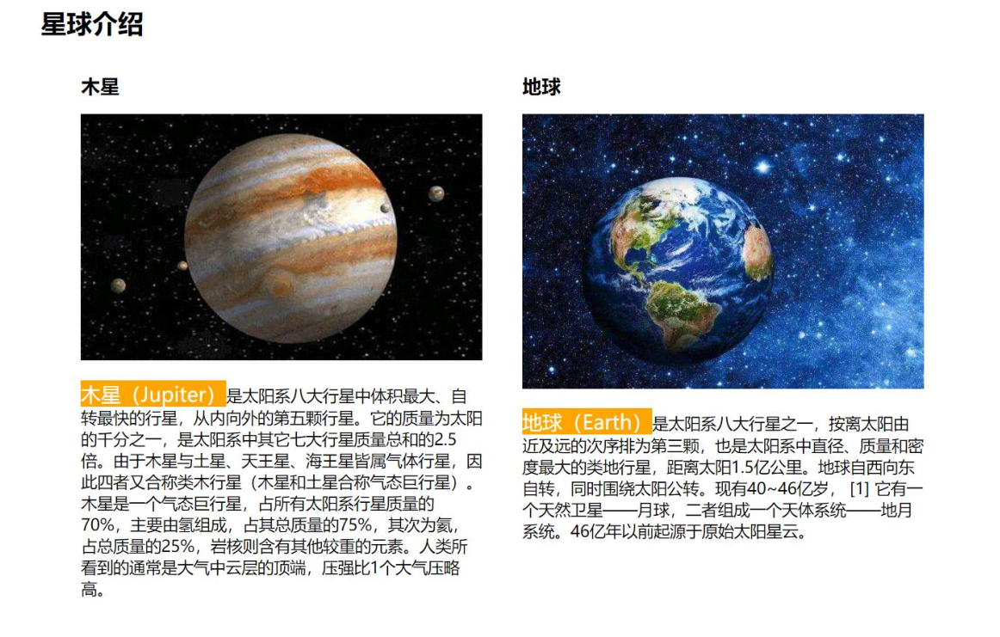

# 1.认识CSS

## 1.1 认识CSS

```
CSS表示层叠样式表（Cascading Style Sheet，简称：CSS，又称为又称串样式列表、级联样式表、串接样式表、阶层式样式表）
是为网页添加样式的代码

CSS是一种语言吗？(知道即可)
 MDN解释：CSS 也不是真正的编程语言，甚至不是标记语言。它是一门样式表语言；
 维基百科解释：是一种计算机语言，但是不算是一种编程语言；
```

## 1.2 CSS的历史

```
早期的网页都是通过HTML来编写的，但是我们希望HTML页面可以更加丰富:
 这个时候就增加了很多具备特殊样式的元素：比如i、strong、del等等；
 后来也有不同的浏览器实现各自的样式语言，但是没有统一的规划；
 1994年，哈肯·维姆·莱和伯特·波斯合作设计CSS，在1996年的时候发布了CSS1；
 直到1997年初，W3C组织才专门成立了CSS的工作组，1998年5月发布了CSS2；
 在2006~2009非常流行 “DIV+CSS”布局的方式来替代所有的html标签；
 从CSS3开始，所有的CSS分成了不同的模块（modules），每一个“modules”都有于CSS2中额外增加的功能，以及向后
兼容。
 直到2011年6月7日，CSS 3 Color Module终于发布为W3C Recommendation。

总结：CSS的出现是为了美化HTML的，并且让结构（HTML）与样式（CSS）分离；
 美化方式一：为HTML添加各种各样的样式，比如颜色、字体、大小、下划线等等；
 美化方式二：对HTML进行布局，按照某种结构显示（CSS进行布局 – 浮动、flex、grid）；
```

# 2.编写CSS样式

## 2.1 CSS如何编写呢？

```
CSS这么重要，那么它的语法规则是怎么样的呢？
```



```
声明（Declaration）一个单独的CSS规则，如 color: red; 用来指定添加的CSS样式。
 属性名（Property name）：要添加的css规则的名称；
 属性值（Property value）：要添加的css规则的值；

但是有个问题：我们会编写了，要编写到什么位置呢？
```

## 2.2 如何将CSS样式应用到元素上

```
◼ CSS提供了3种方法，可以将CSS样式应用到元素上：
 内联样式（inline style）
 内部样式表（internal style sheet）、文档样式表（document style sheet）、内嵌样式表（embed style sheet）
 外部样式表（external style sheet）

疑问：三种方式，学好哪一个呢？
 每一个都很重要，目前开发中不同的场景都会用到


```

### 内联样式（inline style）

```
内联样式（inline style），也有人翻译成行内样式。
 内联样式表存在于HTML元素的style属性之中
```



**CSS样式之间用分号 ; 隔开，建议每条CSS样式后面都加上分号 ;**

```
◼ 很多资料不推荐这种写法：
 1.在原生的HTML编写过程中确实这种写法是不推荐的
 2.在Vue的template中某些动态的样式是会使用内联样式的；
◼ 所以，内联样式的写法依然需要掌握。
```

### 内部样式表（internal style sheet）

```
内部样式表（internal style sheet）
 将CSS放在HTML文件<head>元素里的<style>元素之中
```



在Vue的开发过程中，每个组件也会有一个style元素，和内部样式表非常的相似（原理并不相同）；

### 外部样式表（external style sheet）

```
外部样式表（external style sheet） 是将css编写一个独立的文件中，并且通过<link>元素引入进来；
◼ 使用外部样式表主要分成两个步骤：
 第一步：将css样式在一个独立的css文件中编写（后缀名为.css）；
 第二步：通过<link>元素引入进来；
```



link元素的作用，后续单独讲解

### @import

```
可以在style元素或者CSS文件中使用@import导入其他的CSS文件
```



# 3.CSS注释

## 3.1 CSS的注释

```
CSS代码也可以添加注释来方便阅读：
 CSS的注释和HTML的注释是不一样的；
 /* 注释内容 */
```



# 4.常见的CSS属性

## 4.1 常见的CSS元素



## 4.2 必须掌握的CSS属性

```
必须掌握的CSS属性
 在开发中90+%的时间写的都是这些属性；
◼ 赶紧开始？
◼ 不要小看这几个CSS属性，里面涉及到的概念是非常多的；
◼ 你必须了解CSS的很多特性，才能真正理解里面的每个属
性；
◼ 并且在遇到一些问题的时候知道如何去调试
```



## 4.3 CSS属性的官方文档

```
◼ CSS官方文档地址
 https://www.w3.org/TR/?tag=css
◼ CSS推荐文档地址：
 https://developer.mozilla.org/zh-
CN/docs/Web/CSS/Reference#%E5%85%B3%E9%94%AE%E5%AD%97%E7%B4%A2%E5%BC%95
◼ 由于浏览器版本、CSS版本等问题，查询某些CSS是否可用：
 可以到https://caniuse.com/查询CSS属性的可用性；
 这个网站在后续的browserlist工具中我们再详细说明；
```

## 4.4 目前需要掌握的CSS属性

```
要想深刻理解所有常用CSS属性，最好先学会以下几个最基础最常用的CSS属性
 font-size：文字大小
 color：前景色（文字颜色）
 background-color：背景色
 width ：宽度
 height：高度

CSS属性 - background-color
background-color决定背景色

CSS属性 - color
◼ color属性用来设置文本内容的前景色
 包括文字、装饰线、边框、外轮廓等的颜色
```


# 5.案例练习

