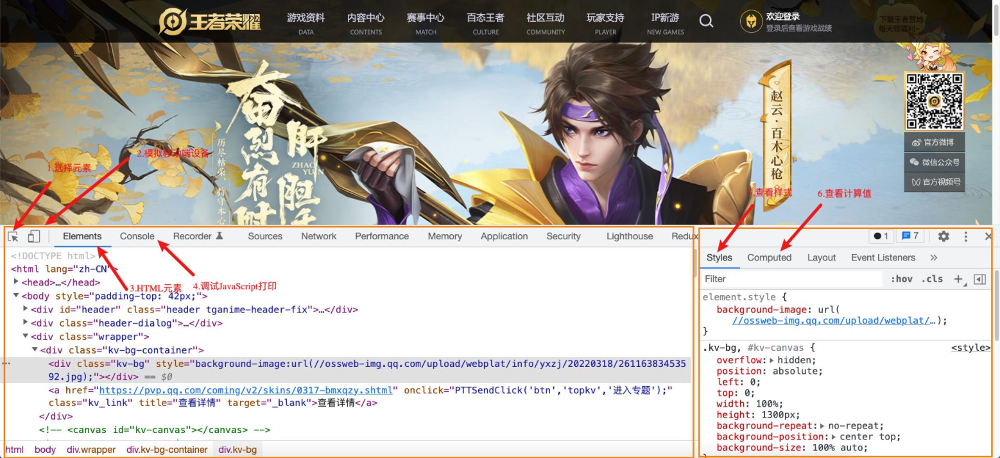
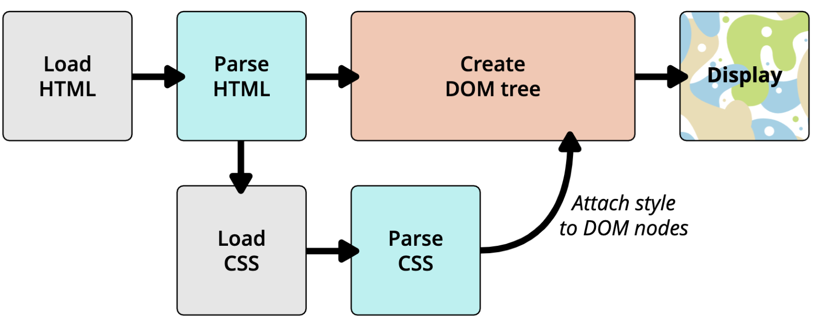

# 1.link元素

## 1.1 link元素

```
◼ link元素是外部资源链接元素，规范了文档与外部资源的关系
 link元素通常是在head元素中
◼ 最常用的链接是样式表（CSS）；
 此外也可以被用来创建站点图标（比如 “favicon” 图标）

◼ link元素常见的属性：
 href：此属性指定被链接资源的URL。 URL 可以是绝对的，也可以是相对的。
 rel：指定链接类型，常见的链接类型：https://developer.mozilla.org/zh-CN/docs/Web/HTML/Link_types
 icon：站点图标；
 stylesheet：CSS样式；
```

# 2.计算机进制

## 2.1 认识进制

```
◼ 进制的概念：
 维基百科：进位制是一种记数方式，亦称进位计数法或位值计数法。
 通俗理解：当数字达到某个值时，进一位(比如从1位变成2位)。
◼ 按照进制的概念，来理解一下十进制：
 当数字到9的时候，用一位已经表示不了了，那么就进一位变成2位。
 在东北没有什么是一顿烧烤不能解决的，如果有，那就两顿。
◼ 按照上面的来理解，二进制、八进制、十六进制：
 二进制：当数字到1的时候，用一位已经表示不了了，那么就进一位。
 八进制：当数字到7的时候，用一位已经表示不了了，那么就进一位。
 十六进制：等等，用一位如何表示十六个数字呢？a(10)、b(11)、c(12) 、 d(13) 、 e(14) 、 f(15)
◼ OK，下面我们简单学习一下计算机中的二进制、八进制、十六进制
```

## 2.2 人类的十进制

```
◼ 学习编程语言，需要了解进制的概念：
 我们平时使用的数字都是十进制的，当我写下一个数字的时候，你会默认当做十进制来使用。
 从发明数字的开始，人类就使用十进制，原因可能是人类正好十根手指。
 如果人类有八根手指，现在用的可能是八进制

◼ 所以说，十进制就是放之四海而皆准的常理吗？
◼ 并不见得，计算机就认为二进制、八进制、十六进制更符合自己的思维

常识就是人到十八岁为止所累积的各种偏见。
Common sense is the collection of prejudices
acquired by age eighteen.
阿尔伯特·爱因斯坦（Albert Einstein）
```

## 2.3 计算机中的进制

```
◼ 为什么计算机更喜欢二进制呢?
 前面我们已经介绍过了为什么计算机更喜欢二进制了；
 和其底层的原理有关系；
◼ 如何表示二进制、八进制、十六进制?
 二进制（0b开头, binary）：其中的数字由0、1组成，可以回顾之前学习过的机器语言。
 八进制（0o开头, Octonary）：其中的数字由0~7组成。
 十六进制（0x开头, hexadecimal）：其中的数字由0~9和字母a-f组成（大小写都可以）

◼ 十进制 or 二进制:
 虽然计算机更喜欢二进制, 但是编程中我们还是以十进制为主.
 因为高级编程语言的目的就是更加接近自然语言, 让我们人类更容易理解.
```


# 3.CSS表示颜色

## 3.1 CSS颜色的表示方法

```
◼ 在CSS中，颜色，有以下几种表示方法：
◼ 颜色关键字（color keywords）：
 是不区分大小写的标识符，它表示一个具体的颜色；
 可以表示哪些颜色呢？
 https://developer.mozilla.org/zh-CN/docs/Web/CSS/color_value#%E8%AF%AD%E6%B3%95
◼ RGB颜色：
 RGB是一种色彩空间，通过R（red，红色）、G（green，绿色）、B（blue，蓝色）三原色来组成了不同的颜色；
✓ 也就是通过调整这三个颜色不同的比例，可以组合成其他的颜色；
 RGB各个原色的取值范围是 0~255；
```

## 3.2 RGB的表示方法

```
◼ RGB颜色可以通过以#为前缀的十六进制字符和函数（rgb()、rgba()）标记表示。
◼ 方式一：十六进制符号：#RRGGBB[AA]
 R（红）、G（绿）、B （蓝）和A （alpha）是十六进制字符（0–9、A–F）；A是可选的。
✓ 比如，#ff0000等价于#ff0000ff；
◼ 方式二：十六进制符号：#RGB[A]
 R（红）、G（绿）、B （蓝）和A （alpha）是十六进制字符（0–9、A–F）；
 三位数符号（#RGB）是六位数形式（#RRGGBB）的减缩版。
✓ 比如，#f09和#ff0099表示同一颜色。
 四位数符号（#RGBA）是八位数形式（#RRGGBBAA）的减缩版。
✓ 比如，#0f38和#00ff3388表示相同颜色

◼ 方式三：函数符： rgb[a](R, G, B[, A])
 R（红）、G（绿）、B （蓝）可以是<number>（数字），或者<percentage>（百分比），255相当于100%。
 A（alpha）可以是0到1之间的数字，或者百分比，数字1相当于100%（完全不明）。
```

# 4.Chrome调试工具

## 4.1 Chrome浏览器开发者工具

```
◼ 打开Chrome调试工具：
 方式一：右键 – 检查
 方式二：快捷键 – F12

◼ 其他技巧：
 快捷键：ctrl+ 可以调整页面或者调试工具的字体大小；
 可以通过删除某些元素来查看网页结构;
 可以通过增删css来调试网页样式;
```



# 5.浏览器渲染流程

## 5.1 浏览器渲染的流程

