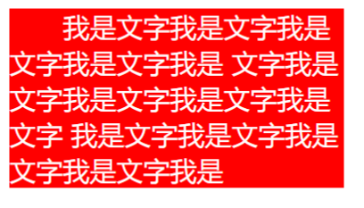

# 1.text-decoration

## 1.1 CSS属性 – text-decoration(常用)

```
◼ text-decoration用于设置文字的装饰线
 decoration是装饰/装饰品的意思;

◼ text-decoration有如下常见取值:
 none：无任何装饰线
✓ 可以去除a元素默认的下划线
 underline：下划线
 overline：上划线
 line-through：中划线（删除线）

◼ a元素有下划线的本质是被添加了text-decoration属性
```

# 2.text-transform

## 2.1 text-transform(一般)

```
◼ text-transform用于设置文字的大小写转换

 Transform单词是使变形/变换(形变);
◼ text-transform有几个常见的值:
 capitalize：(使…首字母大写, 资本化的意思)将每个单词的首字符变为大写
 uppercase：(大写字母)将每个单词的所有字符变为大写
 lowercase：(小写字母)将每个单词的所有字符变为小写
 none：没有任何影响

◼ 实际开发中用JavaScript代码转化的更多.
```

# 3.text-indent

## 3.1 text-indent(一般)

```
◼ text-indent用于设置第一行内容的缩进
◼ text-indent: 2em; 刚好是缩进2个文字
```



# 4.text-align(重要)

## 4.1 text-align(重要)

```
◼ text-align: 直接翻译过来设置文本的对齐方式;

◼ MDN: 定义行内内容（例如文字）如何相对它的块父元素对齐;
◼ 常用的值
 left：左对齐
 right：右对齐
 center：正中间显示
 justify：两端对齐
```

# 5.word/letter-spacing

## 5.1 letter-spacing、word-spacing(一般)

```
◼ letter-spacing、word-spacing分别用于设置字母、单词之间的间距
 默认是0，可以设置为负数
```

