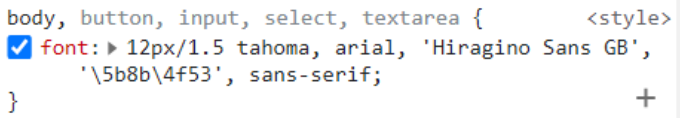
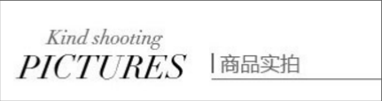
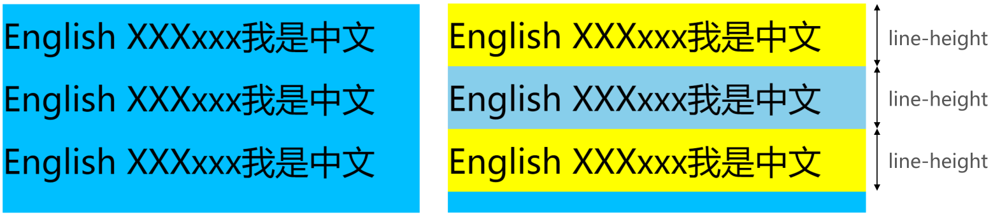
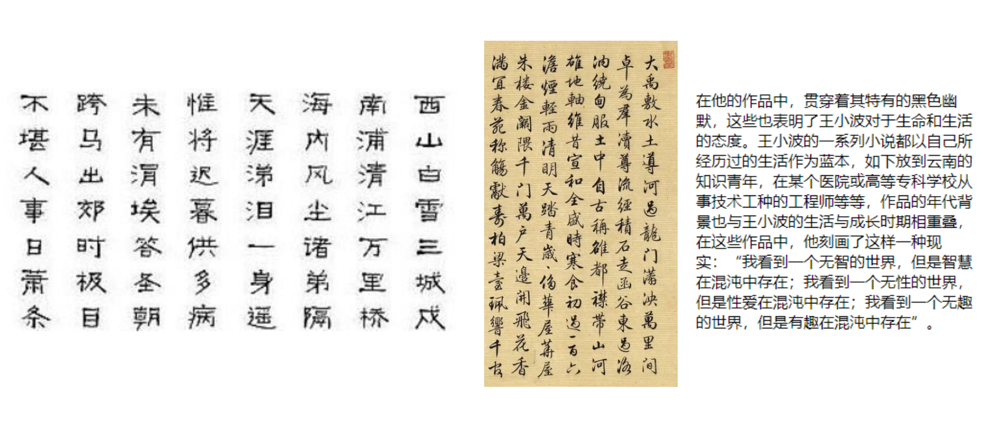
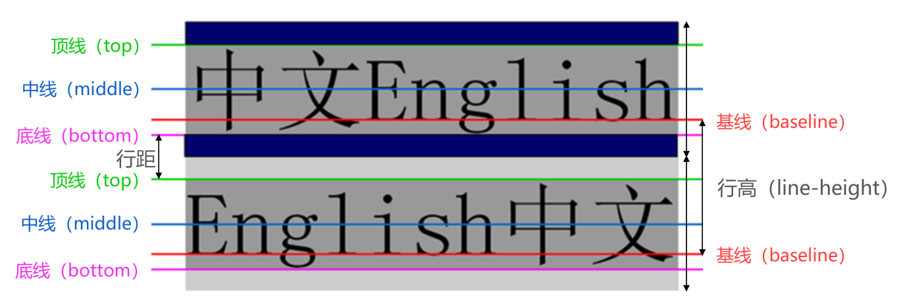
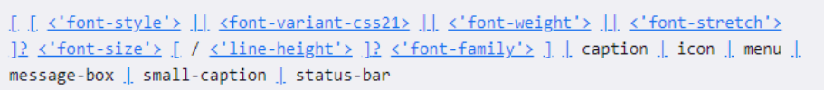

# 1.font-size

## 1.1 font-size(重要)

```
◼ font-size决定文字的大小
◼ 常用的设置
 具体数值+单位
✓ 比如100px
✓ 也可以使用em单位(不推荐)：1em代表100%，2em代表200%，0.5em代表50%
 百分比
✓ 基于父元素的font-size计算，比如50%表示等于父元素font-size的一半
```

# 2.font-family

## 2.1 font-family (重要, 不过一般仅设置一次)

```
◼ font-family用于设置文字的字体名称
 可以设置1个或者多个字体名称;
 浏览器会选择列表中第一个该计算机上有安装的字体;
 或者是通过 @font-face 指定的可以直接下载的字体。
```

淘宝使用的字体:



# 3.font-weight

## 3.1 font-weight(重要)

```
◼ font-weight用于设置文字的粗细（重量）
◼ 常见的取值:
◼ 100 | 200 | 300 | 400 | 500 | 600 | 700 | 800 | 900 ：每一个数字表示一个重量
◼ normal：等于400
◼ bold：等于700

◼ strong、b、h1~h6等标签的font-weight默认就是bold
```

## 3.2 font-style(一般)

````
◼ font-style用于设置文字的常规、斜体显示
◼ normal：常规显示
◼ italic(斜体)：用字体的斜体显示(通常会有专门的字体)
◼ oblique(倾斜)：文本倾斜显示(仅仅是让文字倾斜)

◼ em、i、cite、address、var、dfn等元素的font-style默认就是italic
````



## 3.3 font-variant(了解)

````
◼ font-variant可以影响小写字母的显示形式
 variant是变形的意思;
◼ 可以设置的值如下
 normal：常规显示
 small-caps：将小写字母替换为缩小过的大写字母
````

# 4.line-height

## 4.1 line-height(常用)

```
◼ line-height用于设置文本的行高
◼ 行高可以先简单理解为一行文字所占据的高度
```



## 4.2 为什么文本需要行高?



## 4.3 line-height定义

```
◼ 行高的严格定义是：两行文字基线（baseline）之间的间距
◼ 基线（baseline）：与小写字母x最底部对齐的线
```



```
◼ 注意区分height和line-height的区别
 height：元素的整体高度
 line-height：元素中每一行文字所占据的高度
◼ 应用实例：假设div中只有一行文字，如何让这行文字在div内部垂直居中
 让line-height等同于height
```


# 5.font缩写属性

## 5.1 font

```
◼ font是一个缩写属性
 font 属性可以用来作为 font-style, font-variant, font-weight, font-size, line-height 和 font-family 属性的简写;
 font-style font-variant font-weight font-size/line-height font-family
◼ 规则:
 font-style、font-variant、font-weight可以随意调换顺序，也可以省略
 /line-height可以省略，如果不省略，必须跟在font-size后面
 font-size、font-family不可以调换顺序，不可以省略
```

