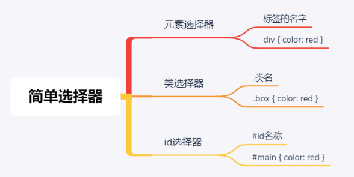
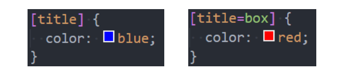
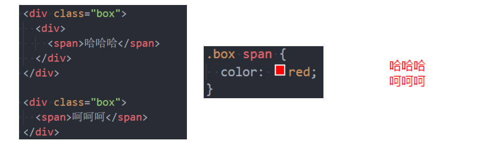
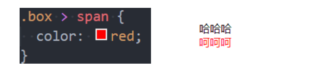
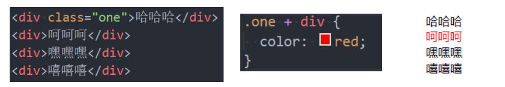
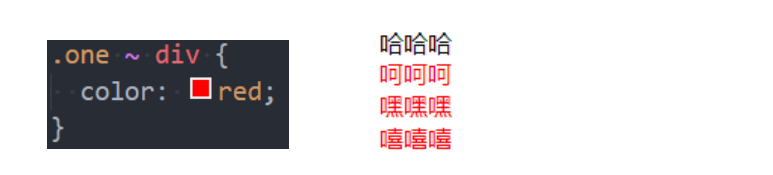
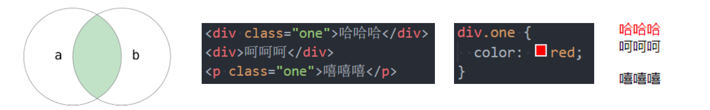
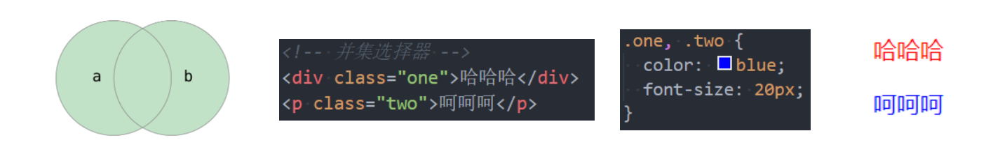
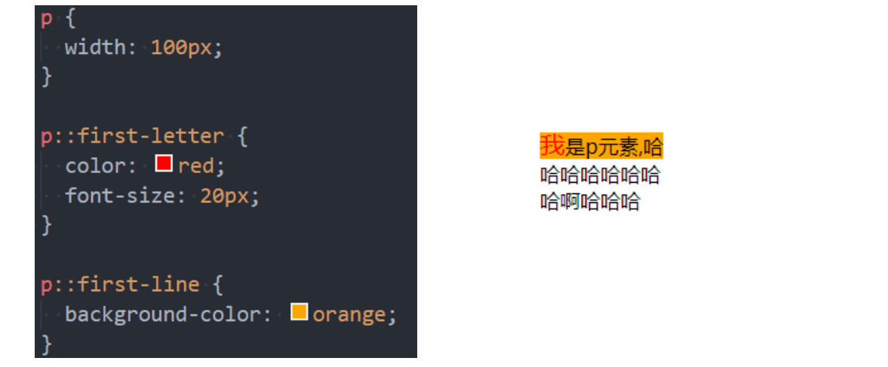
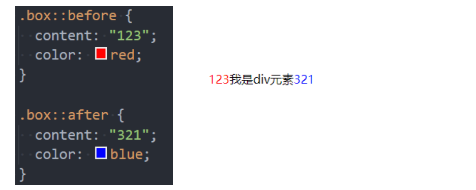

# 1.属性选择器

## 1.1 CSS选择器（selector）

`````
◼ 开发中经常需要找到特定的网页元素进行设置样式
 思考：如何找到特定的那个元素？
◼ 什么是CSS选择器
 按照一定的规则选出符合条件的元素，为之添加CSS样式
◼ 选择器的种类繁多，大概可以这么归类
 通用选择器（universal selector）
 元素选择器（type selectors）
 类选择器（class selectors）
 id选择器（id selectors）
 属性选择器（attribute selectors）
 组合（combinators）
 伪类（pseudo-classes）
 伪元素（pseudo-elements）
`````

## 1.2 通用选择器

```
◼ 通用选择器（universal selector）
 所有的元素都会被选中;
◼ 一般用来给所有元素作一些通用性的设置
 比如内边距、外边距;
 比如重置一些内容;
◼ 效率比较低，尽量不要使用;
```

## 1.3 简单选择器

```
◼ 简单选择器是开发中用的最多的选择器:
 元素选择器（type selectors）, 使用元素的名称;
 类选择器（class selectors）, 使用 .类名 ;
 id选择器（id selectors）, 使用 #id;
```



## 1.4 id注意事项

```
◼ 一个HTML文档里面的id值是唯一的，不能重复
 id值如果由多个单词组成，单词之间可以用中划线-、下划线_连接，也可以使用驼峰标识
 最好不要用标签名作为id值
◼ 中划线又叫连字符（hyphen）
```

## 1.5 属性选择器(attribute selectors)

```
◼ 拥有某一个属性 [att]
◼ 属性等于某个值 [att=val]

◼ 其他了解的(不用记)
 [attr*=val]: 属性值包含某一个值val;
 [attr^=val]: 属性值以val开头;
 [attr$=val]: 属性值以val结尾;
 [attr|=val]: 属性值等于val或者以val开头后面紧跟连接符-;
 [attr~=val]: 属性值包含val, 如果有其他值必须以空格和val分割;
```



# 2.后代选择器

## 2.1 后代选择器（descendant combinator）

```
◼ 后代选择器一: 所有的后代(直接/间接的后代)
 选择器之间以空格分割
```



```
◼ 后代选择器二: 直接子代选择器(必须是直接自带)
 选择器之间以 > 分割;
```



# 3.兄弟选择器

## 3.1 兄弟选择器(sibling combinator)

```
◼ 兄弟选择器一:相邻兄弟选择器
 使用符号 + 连接
```



```
◼ 兄弟选择器二: 普遍兄弟选择器 ~
 使用符号 ~ 连接
```



# 4.选择器组

## 4.1 选择器组 – 交集选择器

```
◼ 交集选择器: 需要同时符合两个选择器条件(两个选择器紧密连接)
 在开发中通常为了精准的选择某一个元素;
```



```
◼ 并集选择器: 符合一个选择器条件即可(两个选择器以,号分割)
 在开发中通常为了给多个元素设置相同的样式;
```



# 5.伪类选择器

## 5.1 认识伪类

```
◼ 什么是伪类呢?
 Pseudo-classes: 翻译过来是伪类;
 伪类是选择器的一种，它用于选择处于特定状态的元素;
◼ 比如我们经常会实现的: 当手指放在一个元素上时, 显示另外一个颜色;
```

## 5.2 伪类(pseudo-classes)

```
◼ 常见的伪类有
◼ 1.动态伪类（dynamic pseudo-classes）
 :link、:visited、:hover、:active、:focus
◼ 2.目标伪类（target pseudo-classes）
 :target
◼ 3.语言伪类（language pseudo-classes）
 :lang( )
◼ 4.元素状态伪类（UI element states pseudo-classes）
 :enabled、:disabled、:checked

◼ 5.结构伪类（structural pseudo-classes）(后续学习)
 :nth-child( )、:nth-last-child( )、:nth-of-type( )、:nth-last-
of-type( )
 :first-child、:last-child、:first-of-type、:last-of-type
 :root、:only-child、:only-of-type、:empty
◼ 6.否定伪类（negation pseudo-classes）(后续学习)
 :not()
◼ 所有的伪类: https://developer.mozilla.org/zh-
CN/docs/Web/CSS/Pseudo-classes
```

## 5.3 动态伪类（dynamic pseudo-classes)

```
◼ 使用举例
 a:link 未访问的链接
 a:visited 已访问的链接
 a:hover 鼠标挪动到链接上(重要)
 a:active 激活的链接（鼠标在链接上长按住未松开）

◼ 使用注意
 :hover必须放在:link和:visited后面才能完全生效
 :active必须放在:hover后面才能完全生效
 所以建议的编写顺序是 :link、:visited、:hover、:active

◼ 除了a元素，:hover、:active也能用在其他元素上
```

## 5.4 动态伪类 - :focus

```
◼ :focus指当前拥有输入焦点的元素（能接收键盘输入）
 文本输入框一聚焦后，背景就会变红色
◼ 因为链接a元素可以被键盘的Tab键选中聚焦，所以:focus也适用于a元素

◼ 动态伪类编写顺序建议为
 :link、:visited、:focus、:hover、:active

◼ 直接给a元素设置样式，相当于给a元素的所有动态伪类都设置了
 相当于a:link、a:visited、a:hover、a:active、a:focus的color都是red
```

# 6.伪元素

## 6.1 伪元素（pseudo-elements）

```
◼ 常用的伪元素有
 :first-line、::first-line
 :first-letter、::first-letter
 :before、::before
 :after、::after

◼ 为了区分伪元素和伪类，建议伪元素使用2个冒号，比如::first-line
```

## 6.2 伪元素 - ::first-line - ::first-letter(了解)

```
◼ ::first-line可以针对首行文本设置属性
◼ ::first-letter可以针对首字母设置属性
```



## 6.3 伪元素 - ::before和::after(常用)

```
◼ ::before和::after用来在一个元素的内容之前或之后插入其他内容（可以是文字、图片)
 常通过 content 属性来为一个元素添加修饰性的内容。
```

