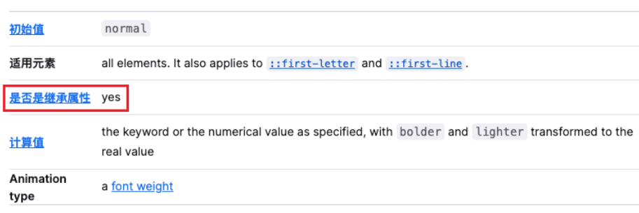
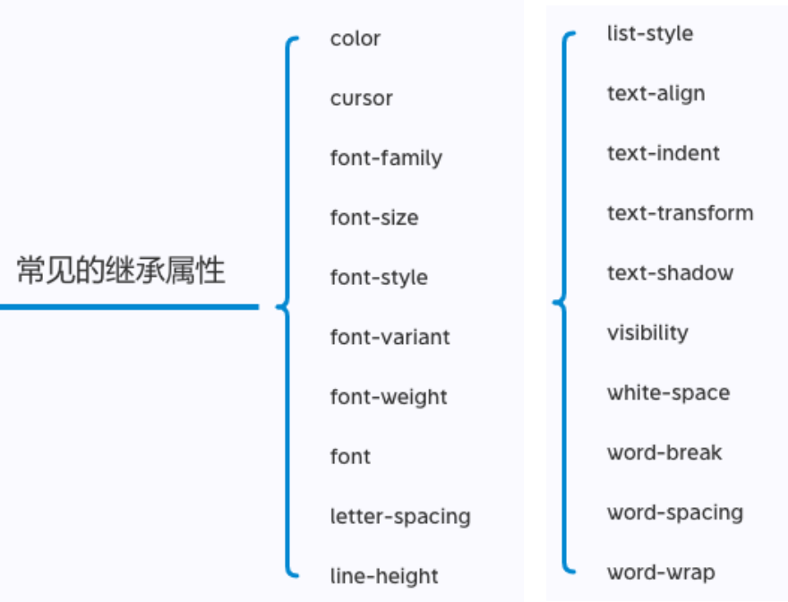
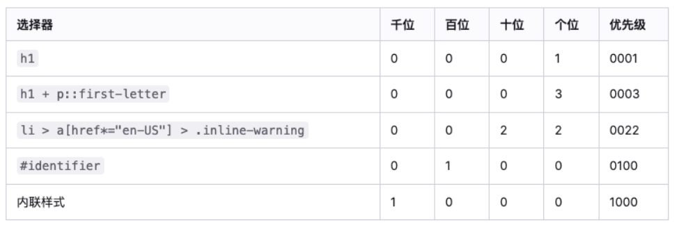
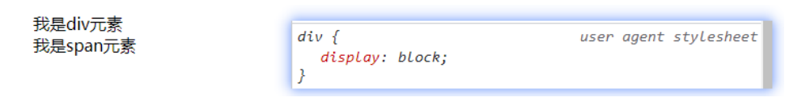
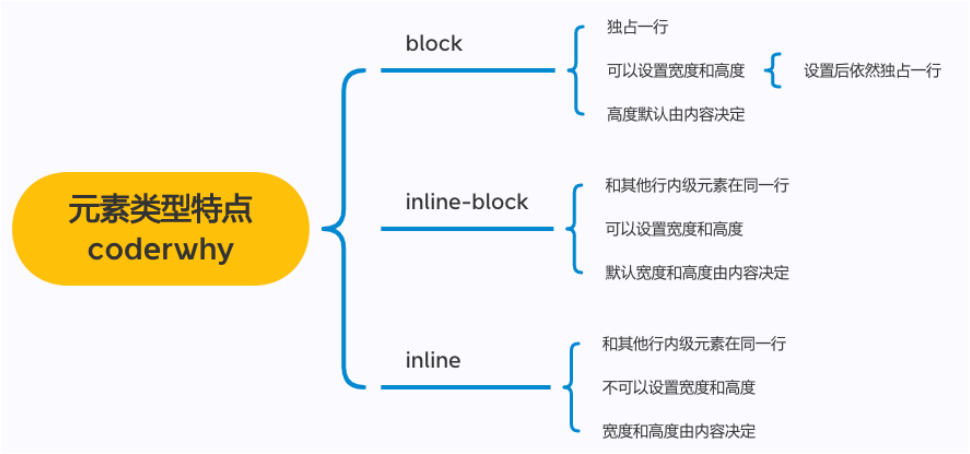

# 1.CSS属性的继承

## 1.1 CSS的属性继承

```
◼ CSS的某些属性具有继承性(Inherited):
 如果一个属性具备继承性, 那么在该元素上设置后, 它的后代元素都可以继承这个属性;
 当然, 如果后代元素自己有设置该属性, 那么优先使用后代元素自己的属性(不管继承过来的属性权重多高);
◼ 如何知道一个属性是否具有继承性呢?
 常见的font-size/font-family/font-weight/line-height/color/text-align都具有继承性;
 这些不用刻意去记, 用的多自然就记住了;
◼ 另外要多学会查阅文档, 文档中每个属性都有标明其继承性的:
```



注意(了解):
继承过来的是计算值, 而不是设置值

## 1.2 常见的继承属性有哪些呢?(不用记)



# 2.CSS属性的层叠

## 2.1 CSS属性的层叠

```
◼ CSS的翻译是层叠样式表, 什么是层叠呢?
 对于一个元素来说, 相同一个属性我们可以通过不同的选择器给它进行多次设置;
 那么属性会被一层层覆盖上去;
 但是最终只有一个会生效;
◼ 那么多个样式属性覆盖上去, 哪一个会生效呢?
 判断一: 选择器的权重, 权重大的生效, 根据权重可以判断出优先级;
 判断二: 先后顺序, 权重相同时, 后面设置的生效;
◼ 那么如何知道元素的权重呢?
```

## 2.2 选择器的权重

```
◼ 按照经验，为了方便比较CSS属性的优先级，可以给CSS属性所处的环境定义一个权值（权重）
 !important：10000
 内联样式：1000
 id选择器：100
 类选择器、属性选择器、伪类：10
 元素选择器、伪元素：1
 通配符：0
```



# 3.CSS属性的类型

## 3.1  HTML元素的类型

```
◼ 在前面我们会经常提到div是块级元素会独占一行, span是行内级元素会在同一行显示.
 到底什么是块级元素, 什么是行内级元素呢?
◼ HTML定义元素类型的思路:
 HTML元素有很多, 比如h元素/p元素/div元素/span元素/img元素/a元素等等;
 当我们把这个元素放到页面上时, 这个元素到底占据页面中一行多大的空间呢?
✓ 为什么我们这里只说一行呢? 因为垂直方向的高度通常是内容决定的;
 比如一个h1元素的标题, 我们必然是希望它独占一行的, 其他的内容不应该和我的标题放在一起;
 比如一个p元素的段落, 必然也应该独占一行, 其他的内容不应该和我的段落放在一起;
 而类似于img/span/a元素, 通常是对内容的某一个细节的特殊描述, 没有必要独占一行;

◼ 所以, 为了区分哪些元素需要独占一行, 哪些元素不需要独占一行, HTML将元素区分(本质是通过CSS的)成了两类:
 块级元素（block-level elements）: 独占父元素的一行
 行内级元素（inline-level elements）:多个行内级元素可以在父元素的同一行中显示
```

## 3.2 通过CSS修改元素类型

```
◼ 前面我们说过, 事实上元素没有本质的区别:
 div是块级元素, span是行内级元素;
 div之所以是块级元素仅仅是因为浏览器默认设置了display属性而已;
```



```
◼ 那么我们是否可以通过display来改变元素的特性呢?
◼ 当然可以!
```

# 4.display属性

## 4.1 CSS属性 - display

```
◼ CSS中有个display属性，能修改元素的显示类型，有4个常用值
 block：让元素显示为块级元素
 inline：让元素显示为行内级元素
 inline-block：让元素同时具备行内级、块级元素的特征
 none：隐藏元素

◼ 事实上display还有其他的值, 比如flex, 后续会专门学习;
```

## 4.2 display值的特性(非常重要)

````
◼ block元素:
 独占父元素的一行
 可以随意设置宽高
 高度默认由内容决定
◼ inline-block元素:
 跟其他行内级元素在同一行显示
 可以随意设置宽高
 可以这样理解
✓ 对外来说，它是一个行内级元素
✓ 对内来说，它是一个块级元素
◼ inline:
 跟其他行内级元素在同一行显示;
 不可以随意设置宽高;
 宽高都由内容决定
````



## 4.3 编写HTML时的注意事项

```
◼ 块级元素、inline-block元素
 一般情况下，可以包含其他任何元素（比如块级元素、行内级元素、inline-block元素）
 特殊情况，p元素不能包含其他块级元素
◼ 行内级元素（比如a、span、strong等）
 一般情况下，只能包含行内级元素
```

# 5.元素的隐藏

## 5.1 元素隐藏方法

```
◼ 方法一: display设置为none
 元素不显示出来, 并且也不占据位置, 不占据任何空间(和不存在一样);

◼ 方法二: visibility设置为hidden
 设置为hidden, 虽然元素不可见, 但是会占据元素应该占据的空间;
 默认为visible, 元素是可见的;

◼ 方法三: rgba设置颜色, 将a的值设置为0
 rgba的a设置的是alpha值, 可以设置透明度, 不影响子元素;

◼ 方法四: opacity设置透明度, 设置为0
 设置整个元素的透明度, 会影响所有的子元素;
```

# 6.overflow属性

## 6.1 CSS属性 - overflow

```
◼ overflow用于控制内容溢出时的行为
 visible：溢出的内容照样可见
 hidden：溢出的内容直接裁剪
 scroll：溢出的内容被裁剪，但可以通过滚动机制查看
 会一直显示滚动条区域，滚动条区域占用的空间属于width、height
 auto：自动根据内容是否溢出来决定是否提供滚动机制
```

## 6.2 CSS样式不生效技巧

```
◼ 为何有时候编写的CSS属性不好使，有可能是因为
 选择器的优先级太低
 选择器没选中对应的元素
 CSS属性的使用形式不对
✓ 元素不支持此CSS属性，比如span默认是不支持width和height的
✓ 浏览器不支持此CSS属性，比如旧版本的浏览器不支持一些css module3的某些属性
✓ 被同类型的CSS属性覆盖，比如font覆盖font-size

◼ 建议
 充分利用浏览器的开发者工具进行调试（增加、修改样式）、查错
```

