# 1.认识盒子模型

## 1.1 认识盒子

生活中, 我们经常会看到各种各样的盒子:

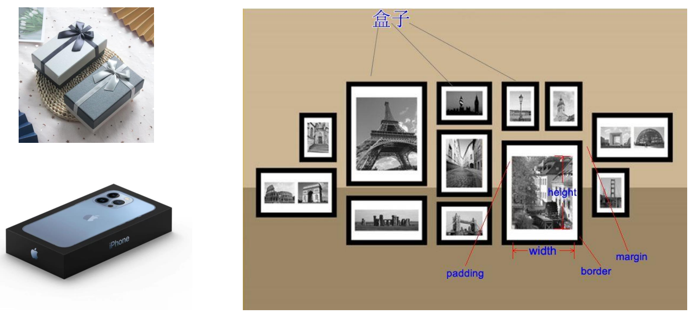

事实上, 我们可以把HTML每一个元素看出一个个的盒子:

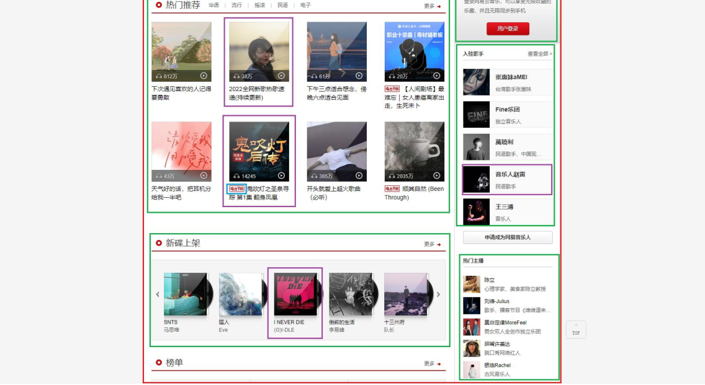

## 1.2 盒子模型(Box Model)

```
◼ HTML中的每一个元素都可以看做是一个盒子，如右下图所示，可以具备这4个属性
◼ 内容（content）
	 元素的内容width/height
◼ 内边距（padding）
	 元素和内容之间的间距
◼ 边框（border）
	 元素自己的边框
◼ 外边距（margin）
	 元素和其他元素之间的间距
```

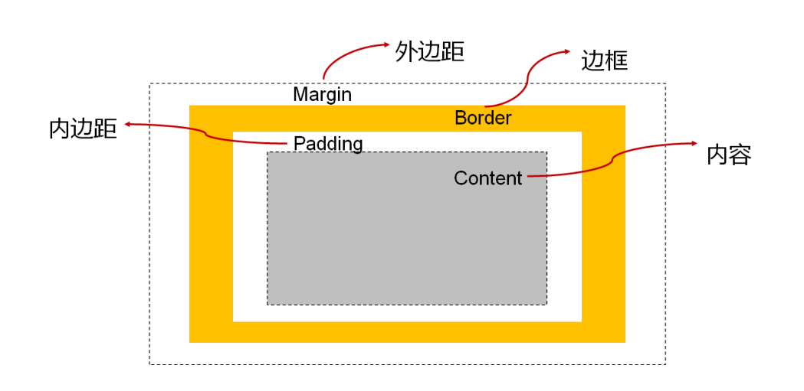

## 1.3 盒子模型的四边

因为盒子有四边, 所以margin/padding/border都包括top/right/bottom/left四个边:


## 1.4 在浏览器的开发工具中

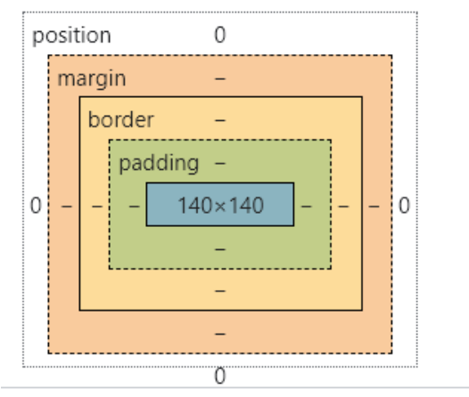

# 2.内容width/height

## 2.1 内容 – 宽度和高度

```
◼ 设置内容是通过宽度和高度设置的:
	 宽度设置: width
	 高度设置: height
◼ 注意: 对于行内级非替换元素来说, 设置宽高是无效的!
◼ 另外我们还可以设置如下属性:
	 min-width：最小宽度，无论内容多少，宽度都大于或等于min-width
	 max-width：最大宽度，无论内容多少，宽度都小于或等于max-width
	 移动端适配时, 可以设置最大宽度和最小宽度;
◼ 下面两个属性不常用:
	 min-height：最小高度，无论内容多少，高度都大于或等于min-height
	 max-height：最大高度，无论内容多少，高度都小于或等于max-height
```

# 3.内边距padding

## 3.1 内边距 - padding

```
◼ padding属性用于设置盒子的内边距, 通常用于设置边框和内容之间的间距;
◼ padding包括四个方向, 所以有如下的取值:
 padding-top：上内边距
 padding-right：右内边距
 padding-bottom：下内边距
 padding-left：左内边距

◼ padding单独编写是一个缩写属性：
 padding-top、padding-right、padding-bottom、padding-left的简写属性
 padding缩写属性是从零点钟方向开始, 沿着顺时针转动的, 也就是上右下左;
◼ padding并非必须是四个值, 也可以有其他值;
```

padding的其他值

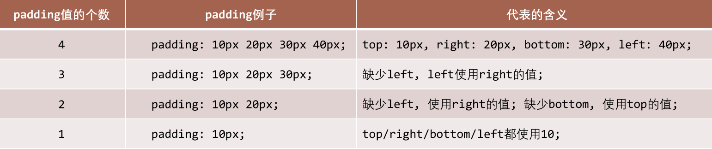

# 4.边框/圆角border

## 4.1 边框 - border

```
border用于设置盒子的边框:
```


```
◼ 边框相对于content/padding/margin来说特殊一些:
	 边框具备宽度width;
	 边框具备样式style;
	 边框具备颜色color;
```

设置边框的方式

```
◼ 边框宽度
	 border-top-width、border-right-width、border-bottom-width、border-left-width
	 border-width是上面4个属性的简写属性
◼ 边框颜色
	 border-top-color、border-right-color、border-bottom-color、border-left-color
	 border-color是上面4个属性的简写属性
◼ 边框样式
	 border-top-style、border-right-style、border-bottom-style、border-left-style
	 border-style是上面4个属性的简写属性
```

边框的样式设置值

```
◼ 边框的样式有很多, 我们可以了解如下的几个:
	 groove：凹槽, 沟槽, 边框看上去好象是雕刻在画布之内
	 ridge：山脊, 和grove相反，边框看上去好象是从画布中凸出来
```

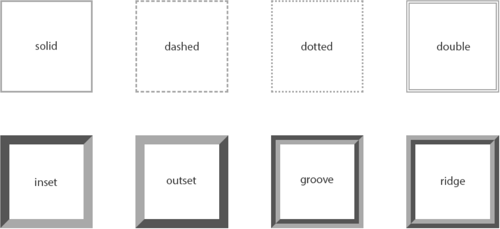

```
同时设置的方式

◼ 如果我们相对某一边同时设置 宽度 样式 颜色, 可以进行如下设置:
 border-top
 border-right
 border-bottom
 border-left
 border：统一设置4个方向的边框
◼ 边框颜色、宽度、样式的编写顺序任意
```

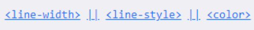

## 4.2 圆角 – border-radius

```
◼ border-radius用于设置盒子的圆角
```


```
◼ border-radius常见的值:
	 数值: 通常用来设置小的圆角, 比如6px;
	 百分比: 通常用来设置一定的弧度或者圆形;
	
border-radius补充
◼ border-radius事实上是一个缩写属性:
	 将这四个属性 border-top-left-radius、border-top-right-radius、border-bottom-right-radius，和 border-bottom-
left-radius 简写为一个属性。
	 开发中比较少见一个个圆角设置;
◼ 如果一个元素是正方形, 设置border-radius大于或等于50%时，就会变成一个圆.
```

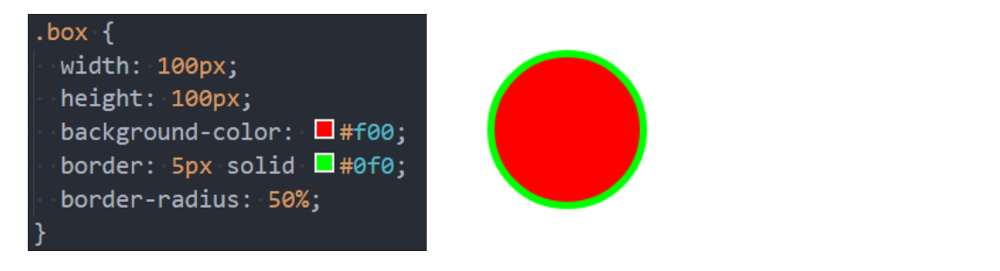

# 5.外边距margin

## 5.1 外边距 - margin

```
◼ margin属性用于设置盒子的外边距, 通常用于元素和元素之间的间距;
◼ margin包括四个方向, 所以有如下的取值:
	 margin-top：上内边距
	 margin-right：右内边距
	 margin-bottom：下内边距
	 margin-left：左内边距
◼ margin单独编写是一个缩写属性：
	 margin-top、margin-right、margin-bottom、margin-left的简写属性
	 margin缩写属性是从零点钟方向开始, 沿着顺时针转动的, 也就是上右下左;
	
◼ margin也并非必须是四个值, 也可以有其他值;
margin的其他值
```

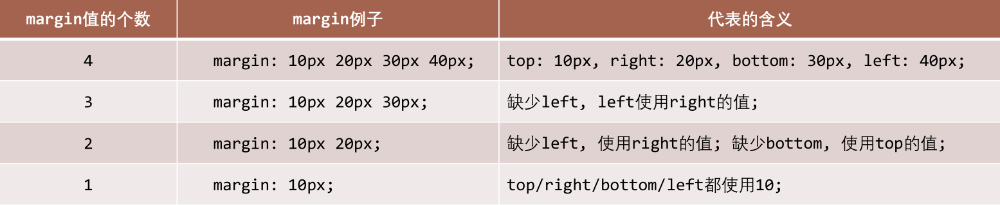

上下margin的传递

```
◼ margin-top传递
 如果块级元素的顶部线和父元素的顶部线重叠，那么这个块级元素的margin-top值会传递给父元素
◼ margin-bottom传递
 如果块级元素的底部线和父元素的底部线重写，并且父元素的高度是auto，那么这个块级元素的margin-bottom值会传递给父元素
◼ 如何防止出现传递问题？
 给父元素设置padding-top\padding-bottom
 给父元素设置border
 触发BFC: 设置overflow为auto
◼ 建议
 margin一般是用来设置兄弟元素之间的间距
 padding一般是用来设置父子元素之间的间距
```

上下margin的折叠

```
◼ 垂直方向上相邻的2个margin（margin-top、margin-bottom）有可能会合并为1个margin，这种现象叫做collapse（折叠）
◼ 水平方向上的margin（margin-left、margin-right）永远不会collapse
◼ 折叠后最终值的计算规则
 两个值进行比较，取较大的值
◼ 如何防止margin collapse？
 只设置其中一个元素的margin
```

## 5.2 上下margin折叠的情况

```
◼ 两个兄弟块级元素之间上下margin的折叠
◼ 父子块级元素之间margin的折叠
```

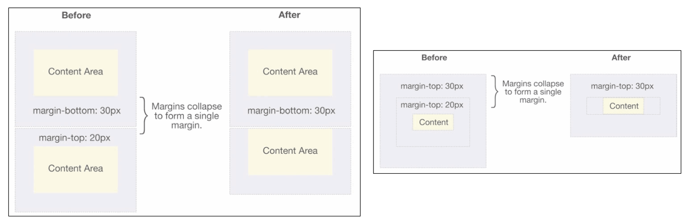

## 5.3 外轮廓 - outline

```
◼ outline表示元素的外轮廓
 不占用空间
 默认显示在border的外面
◼ outline相关属性有
 outline-width: 外轮廓的宽度
 outline-style：取值跟border的样式一样，比如solid、dotted等
 outline-color: 外轮廓的颜色
 outline：outline-width、outline-style、outline-color的简写属性，跟border用法类似
◼ 应用实例
 去除a元素、input元素的focus轮廓效果
```


# 6.盒子和文字阴影

## 6.1 盒子阴影 – box-shadow

```
◼ box-shadow属性可以设置一个或者多个阴影
 每个阴影用<shadow>表示
 多个阴影之间用逗号,隔开，从前到后叠加
◼ <shadow>的常见格式如下
```

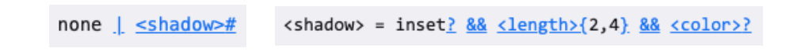

```
 第1个<length>：offset-x, 水平方向的偏移，正数往右偏移
 第2个<length>：offset-y, 垂直方向的偏移，正数往下偏移
 第3个<length>：blur-radius, 模糊半径
 第4个<length>：spread-radius, 延伸半径
 <color>：阴影的颜色，如果没有设置，就跟随color属性的颜色
 inset：外框阴影变成内框阴影
```

## 6.2 盒子阴影 – 在线查看

```
◼ 我们可以通过一个网站测试盒子的阴影:
 https://html-css-js.com/css/generator/box-shadow/
```

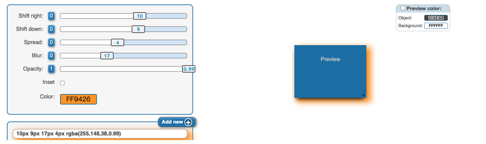

## 6.3 文字阴影 - text-shadow

```
◼ text-shadow用法类似于box-shadow，用于给文字添加阴影效果
◼ <shadow>的常见格式如下
```

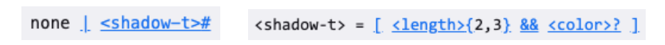

```
 相当于box-shadow, 它没有spread-radius的值;
◼ 我们可以通过一个网站测试文字的阴影:
 https://html-css-js.com/css/generator/box-shadow/
```

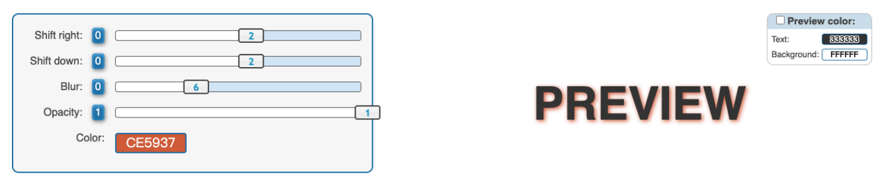

行内非替换元素的注意事项

```
◼ 以下属性对行内级非替换元素不起作用
 width、height、margin-top、margin-bottom
◼ 以下属性对行内级非替换元素的效果比较特殊
 padding-top、padding-bottom、上下方向的border
```

综合案例练习


# 7.box-sizing

## 7.1 CSS属性 - box-sizing

```
◼ box-sizing用来设置盒子模型中宽高的行为
◼ content-box
 padding、border都布置在width、height外边
◼ border-box
 padding、border都布置在width、height里边
```

## 7.2 box-sizing: content-box

```
◼ 元素的实际占用宽度 = border + padding + width
◼ 元素的实际占用高度 = border + padding + height
```


## 7.3 box-sizing: border-box

```
◼ 元素的实际占用宽度 = width
◼ 元素的实际占用高度 = height
```

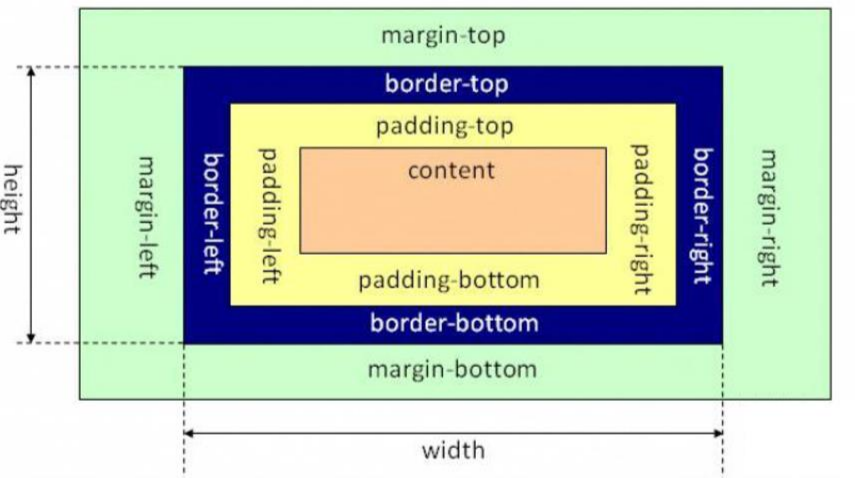

## 7.4 IE盒子模型

W3C标准盒子模型

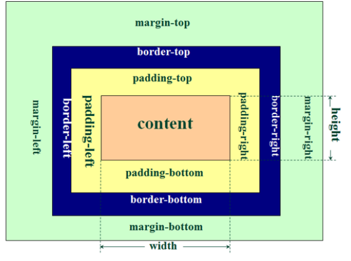

IE盒子模型（IE8以下浏览器）

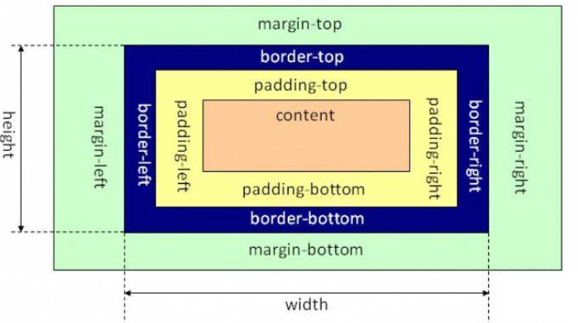

## 7.5 元素的水平居中方案

```
◼ 在一些需求中，需要元素在父元素中水平居中显示（父元素一般都是块级元素、inline-block）

◼ 行内级元素(包括inline-block元素)
 水平居中：在父元素中设置text-align: center

◼ 块级元素
 水平居中：margin: 0 auto
```

