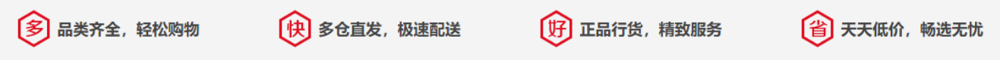
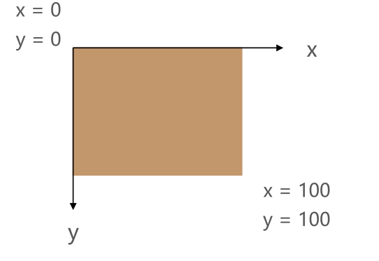
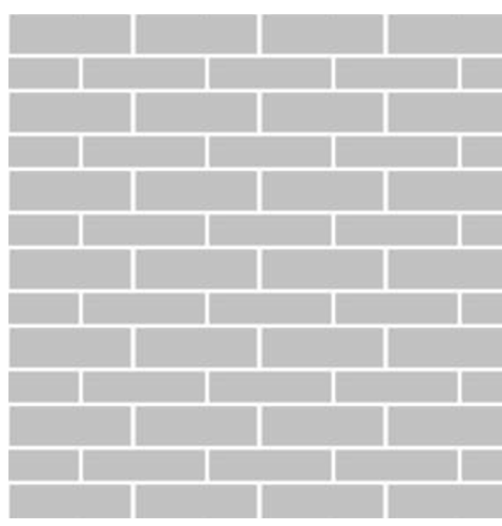
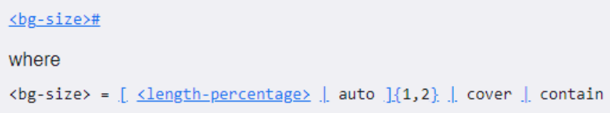
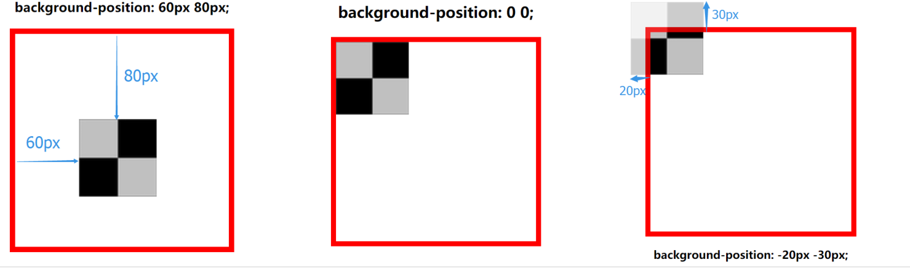
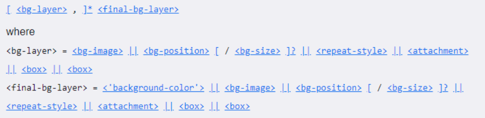
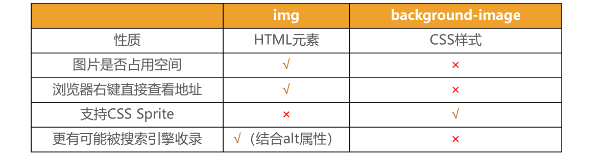

# 1.background-image

## 1.1 认识网页的背景

```
◼ 在开发中, 为了让网页更加美观, 我们经常会设置各种各样的背景:
 我们前面已经学习了如何设置背景颜色, 这里我们要学习设置背景的更多知识;
```




## 1.2 background-image

```
◼ background-image用于设置元素的背景图片
 会盖在(不是覆盖)background-color的上面
◼ 如果设置了多张图片
 设置的第一张图片将显示在最上面，其他图片按顺序层叠在下面

◼ 注意：如果设置了背景图片后，元素没有具体的宽高，背景图片是不会显示出来的
```


# 2.background-repeat

## 2.1 background-repeat

```
◼ background-repeat用于设置背景图片是否要平铺
◼ 常见的设值有
 repeat：平铺
 no-repeat：不平铺
 repeat-x：只在水平方向平铺
 repeat-y：只在垂直平方向平铺
background-repeat
x
y
x = 0
y = 0
```





# 3.background-size

## 3.1 background-size

```
◼ background-size用于设置背景图片的大小
 auto：默认值, 以背景图本身大小显示
 cover：缩放背景图，以完全覆盖铺满元素,可能背景图片部分看不见
 contain：缩放背景图，宽度或者高度铺满元素，但是图片保持宽高比
 <percentage>：百分比，相对于背景区（background positioning area）
 length：具体的大小，比如100px
```



# 4.background-position

## 4.1 background-position

```
◼ background-position用于设置背景图片在水平、垂直方向上的具体位置
 可以设置具体的数值 比如 20px 30px;
 水平方向还可以设值：left、center、right
 垂直方向还可以设值：top、center、bottom
 如果只设置了1个方向，另一个方向默认是center
```



# 5.background-attachment

## 5.1 background-attachment

```
◼ background-attachment决定背景图像的位置是在视口内固定，或者随着包含它的区块滚动。
◼ 可以设置以下3个值
 scroll：此关键属性值表示背景相对于元素本身固定， 而不是随着它的内容滚动
 local：此关键属性值表示背景相对于元素的内容固定。如果一个元素拥有滚动机制，背景将会随着元素的内容滚动.
 fixed：此关键属性值表示背景相对于视口固定。即使一个元素拥有滚动机制，背景也不会随着元素的内容滚动。
```


# 6.background

## 6.1 background

```
◼ background是一系列背景相关属性的简写属性
◼ 常用格式是
```



```
◼ background-size可以省略，如果不省略，/background-size必须紧跟在background-position的后面
◼ 其他属性也都可以省略，而且顺序任意
```

## 6.2 background-image和img对比

````
◼ 利用background-image和img都能够实现显示图片的需求，在开发中该如何选择？
````



```
◼ 总结
 img，作为网页内容的重要组成部分，比如广告图片、LOGO图片、文章配图、产品图片
 background-image，可有可无。有，能让网页更加美观。无，也不影响用户获取完整的网页内容信息
```

