# 1.列表元素

## 1.1 认识列表元素

```
◼ 在开发一个网页的过程中, 很多数据都是以列表的形式存在的
```

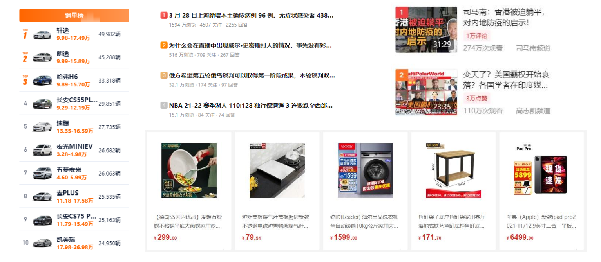

## 1.2 列表的实现方式

```
◼ 事实上现在很多的列表功能采用了不同的方案来实现:
 方案一: 使用div元素来实现(比如汽车之家, 知乎上的很多列表)
 方案二: 使用列表元素, 使用元素语义化的方式实现;

◼ 事实上现在很多的网站对于列表元素没有很强烈的偏好, 更加不拘一格, 按照自己的风格来布局:
 原因是列表元素默认的CSS样式, 让它用起来不是非常方便;
 比如列表元素往往有很多的限制, ul/ol中只能存放li, li再存放其他元素, 默认样式等;
 虽然我们可以通过重置来解决, 但是我们更喜欢自由的div;

HTML提供了3组常用的用来展示列表的元素
 有序列表：ol、li
 无序列表：ul、li
 定义列表：dl、dt、dd
```

# 2.常见列表

## 2.1 有序列表 – ol – li

```
◼ ol（ordered list）
 有序列表，直接子元素只能是li

◼ li（list item）
 列表中的每一项
```

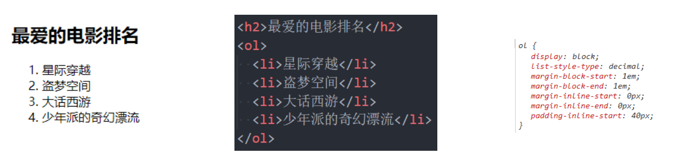

## 2.2 无序列表 – ul - li

```
◼ ul（unordered list）
 无序列表，直接子元素只能是li
◼ li（list item）
 列表中的每一项
```

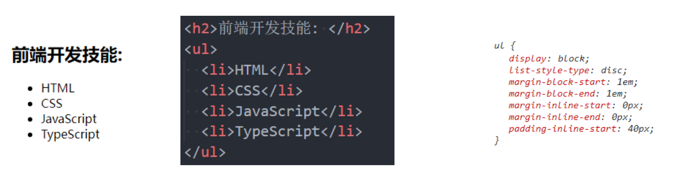

## 2.3 定义列表 – dl – dt - dd

```
◼ dl（definition list）
 定义列表，直接子元素只能是dt、dd
◼ dt（definition term）
 term是项的意思, 列表中每一项的项目名
◼ dd（definition description）
 列表中每一项的具体描述，是对 dt 的描述、解释、补充
 一个dt后面一般紧跟着1个或者多个dd
```

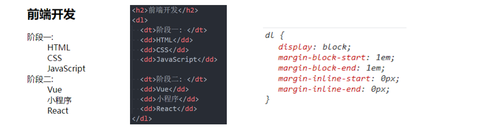

## 2.4 列表的练习

```
所有案例的思路 :
1.  先完成结构
2.  重置样式 (body/a/ul)
3.  先整体 ,  后局部
*  顺序 :  按照从外往里 .  从上往下
4.  去除重复的代码 (css)
*  将重复的逻辑放到一个单独的 class 中 (.icon)
*  不同的代码抽到不同的 class(.new .hot)
慢慢来反而是快!
```

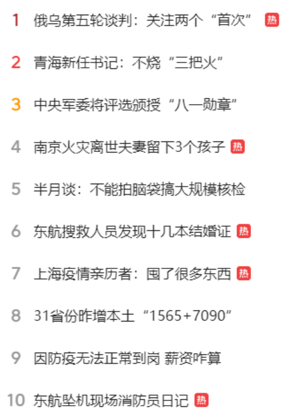

# 3.表格元素

## 3.1 认识表格元素

```
在网页中, 对于某些内容的展示使用表格元素更为合适和方便
```


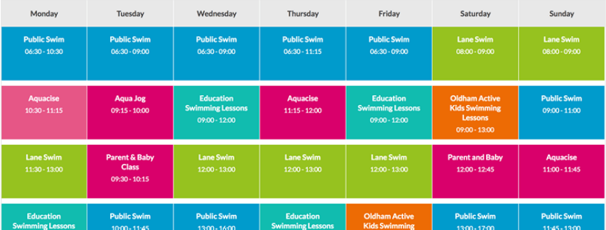

## 3.2 表格常见的元素

```
◼ 编写表格最常见的是下面的元素:
◼ table
 表格
◼ tr(table row)
 表格中的行
◼ td(table data)
 行中的单元格
◼ 另外表格有很多相关的属性可以设置表格的样式, 但是已经不推荐使用了
```

## 3.3 表格的练习

```
通过表格元素和CSS完成下面的表格:
```

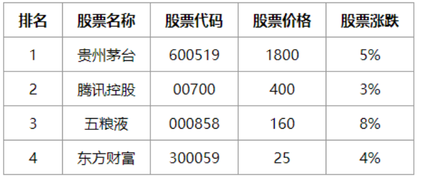

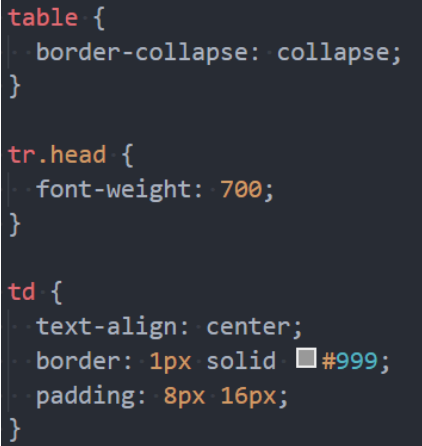

```
这里我们需要用到一个非常重要的属性:
 border-collapse CSS 属性是用来决定表格的边框是分开的还是合并的。
 table { border-collapse: collapse; }
 合并单元格的边框
```

## 3.4 表格的其他元素

```
◼ thead
 表格的表头
◼ tbody
 表格的主体
◼ tfoot
 表格的页脚
◼ caption
 表格的标题
◼ th
 表格的表头单元格
```

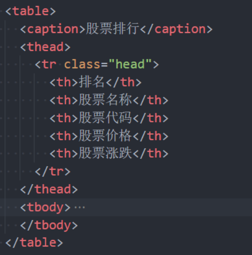

# 4.表格合并

## 4.1 单元格合并

```
◼ 在某些特殊的情况下, 每个单元格占据的大小可能并不是固定的
 一个单元格可能会跨多行或者多列来使用;
◼ 比如下面的表格
```

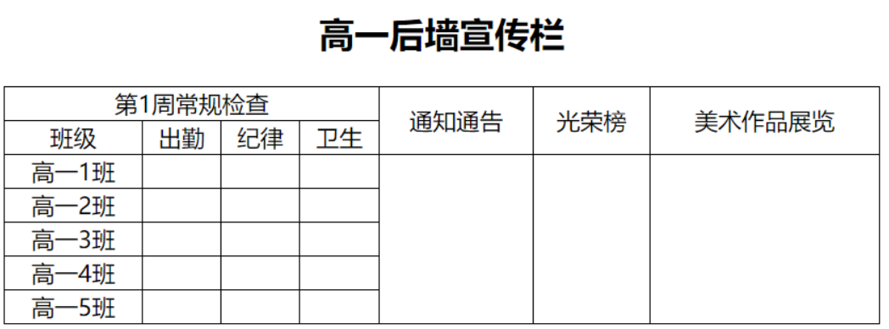

## 4.2 如何使用单元格合并呢?

```
◼ 单元格合并分成两种情况:
 跨列合并: 使用colspan
✓ 在最左边的单元格写上colspan属性, 并且省略掉合并的td;
 跨行合并: 使用rowspan
✓ 在最上面的单元格协商rowspan属性, 并且省略掉后面tr中的td;
```


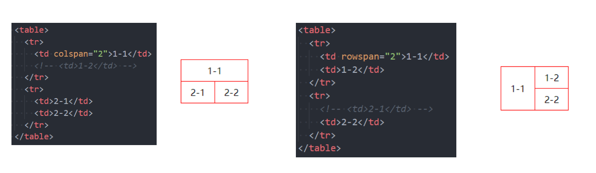

## 4.3 单元格合并练习

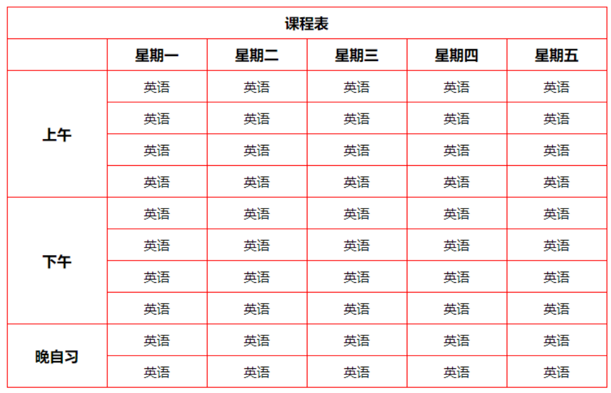

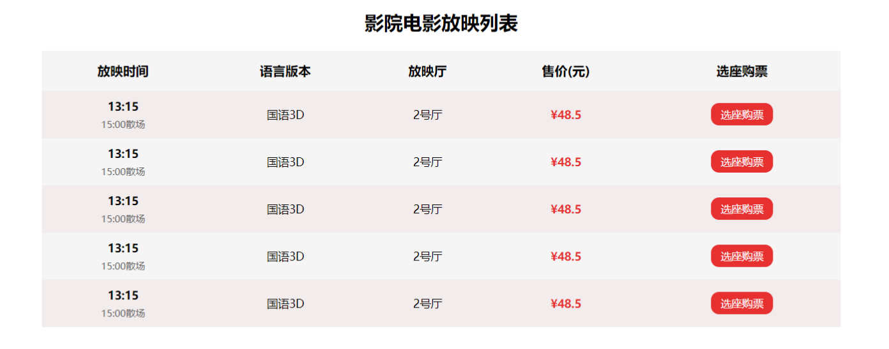

# 5.表单元素

## 5.1 认识表单

```
HTML表单元素是和用户交互的重要方式之一, 在很多网站都需要使用表单:
```


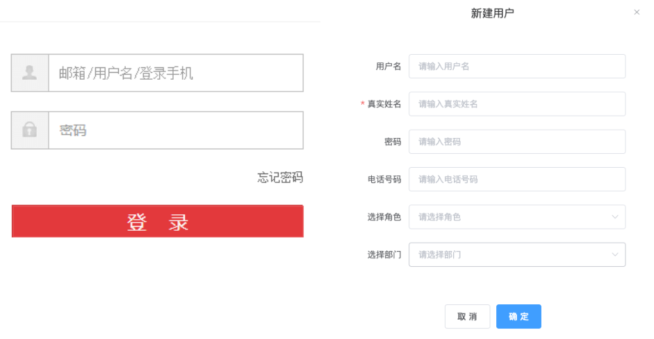

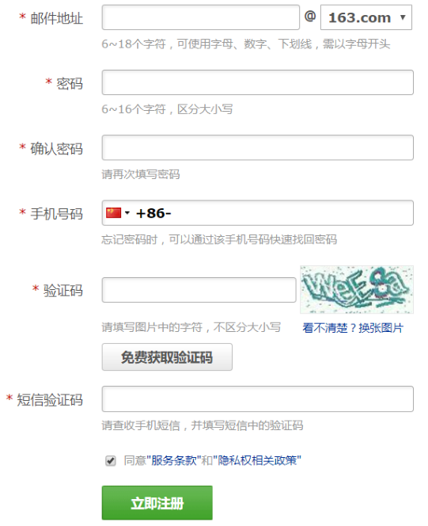

## 5.2 常见的表单元素

```
◼ form
 表单, 一般情况下，其他表单相关元素都是它的后代元素
◼ input
 单行文本输入框、单选框、复选框、按钮等元素
◼ textarea
 多行文本框
◼ select、option
 下拉选择框
◼ button
 按钮
◼ label
 表单元素的标题
```

## 5.3 input元素的使用

```
◼ 表单元素使用最多的是input元素
◼ input元素有如下常见的属性:
◼ type：input的类型
 text：文本输入框（明文输入）
 password：文本输入框（密文输入）
 radio：单选框
 checkbox：复选框
 button：按钮
 reset：重置
 submit：提交表单数据给服务器
 file：文件上传

◼ readonly：只读
◼ disabled：禁用
◼ checked：默认被选中
 只有当type为radio或checkbox时可用
◼ autofocus：当页面加载时，自动聚焦
◼ name：名字
 在提交数据给服务器时，可用于区分数据类型
◼ value：取值
◼ type类型的其他取值和input的其他属性, 查看文档:
 https://developer.mozilla.org/zh-
CN/docs/Web/HTML/Element/Input
```

## 5.4 布尔属性（boolean attributes）

```
◼ 常见的布尔属性有disabled、checked、readonly、multiple、autofocus、selected
◼ 布尔属性可以没有属性值，写上属性名就代表使用这个属性
 如果要给布尔属性设值，值就是属性名本身
```


## 5.5 表单按钮

```
◼ 表单可以实现按钮效果:
 普通按钮（type=button）：使用value属性设置按钮文字
 重置按钮（type=reset）：重置它所属form的所有表单元素（包括input、textarea、select）
 提交按钮（type=submit）：提交它所属form的表单数据给服务器（包括input、textarea、select）
```

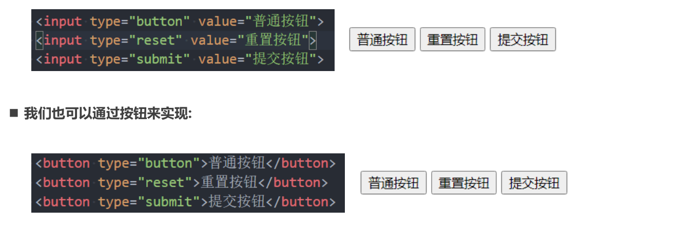

## 5.6 input和label的关系

```
◼ label元素一般跟input配合使用，用来表示input的标题
◼ labe可以跟某个input绑定，点击label就可以激活对应的input变成选中
```

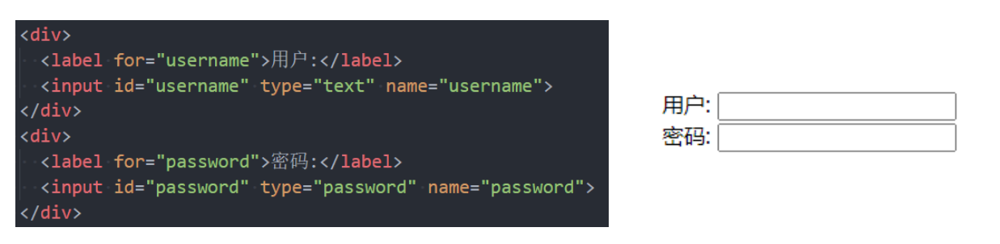

## 5.7 radio的使用

```
◼ 我们可以将type类型设置为radio变成单选框:
 name值相同的radio才具备单选功能
```

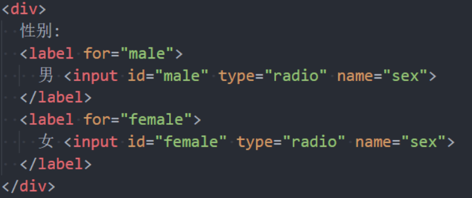

## 5.8 checkbox的使用

```
◼ 我们可以将type类型设置为checkbox变成多选框:
 属于同一种类型的checkbox，name值要保持一致
```

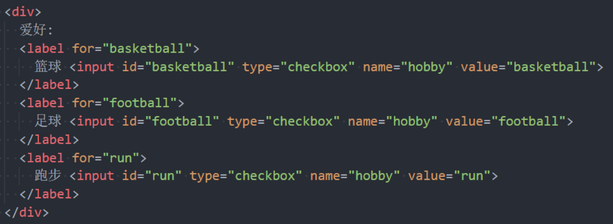

## 5.9 textarea的使用

```
◼ textarea的常用属性:
 cols：列数
 rows：行数
◼ 缩放的CSS设置
 禁止缩放：resize: none;
 水平缩放：resize: horizontal;
 垂直缩放：resize: vertical;
 水平垂直缩放：resize: both;
```

## 5.10 select和option的使用

```
◼ option是select的子元素，一个option代表一个选项
◼ select常用属性
 multiple：可以多选
 size：显示多少项
◼ option常用属性
 selected：默认被选中
```

# 6.表单常见属性

## 6.1 form常见的属性

```
◼ form通常作为表单元素的父元素:
 form可以将整个表单作为一个整体来进行操作;
 比如对整个表单进行重置;
 比如对整个表单的数据进行提交;
◼ form常见的属性如下:
◼ action
 用于提交表单数据的请求URL
◼ method
 请求方法（get和post），默认是get
◼ target
 在什么地方打开URL（参考a元素的target）
```

## 6.2 请求方式的对比

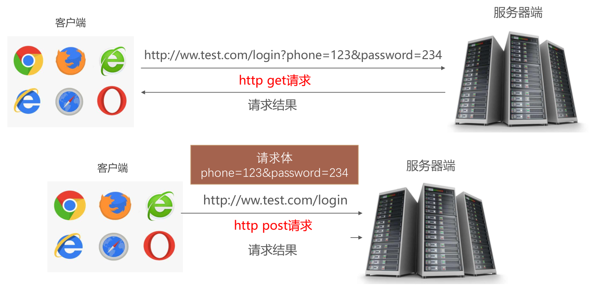


