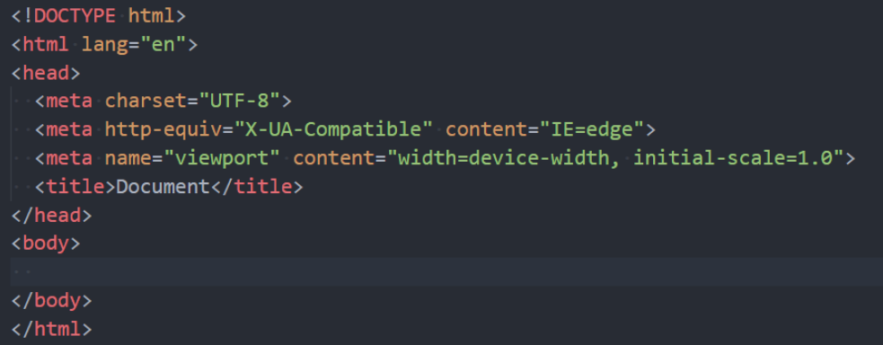
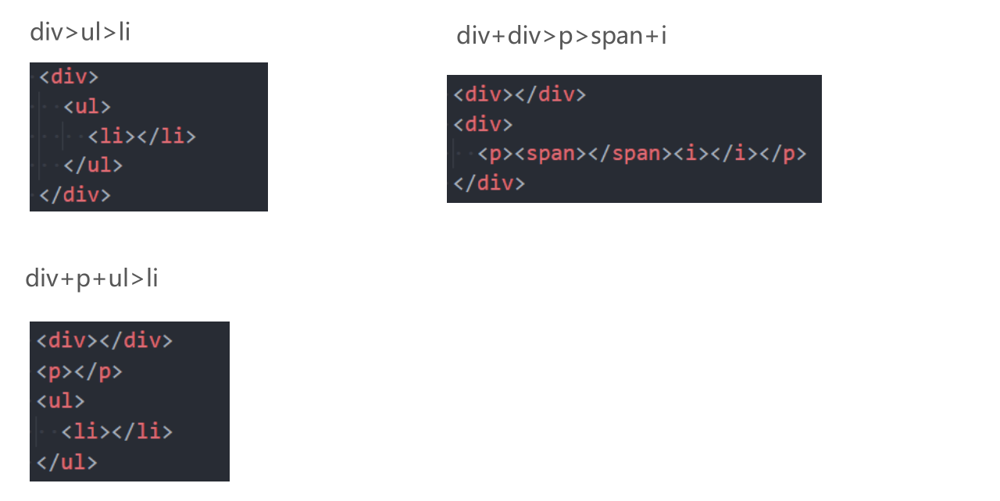
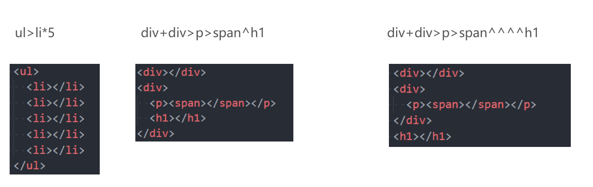
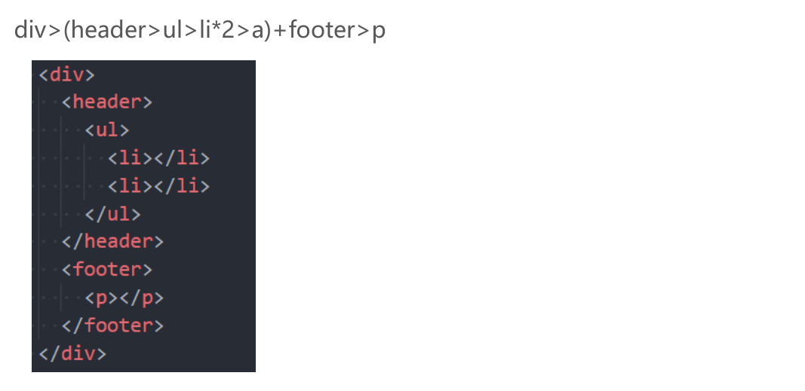
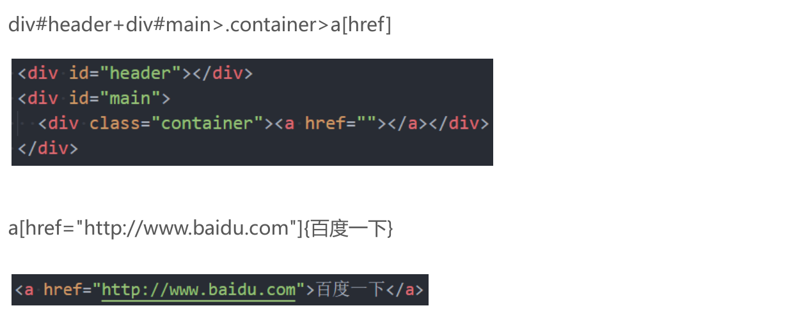
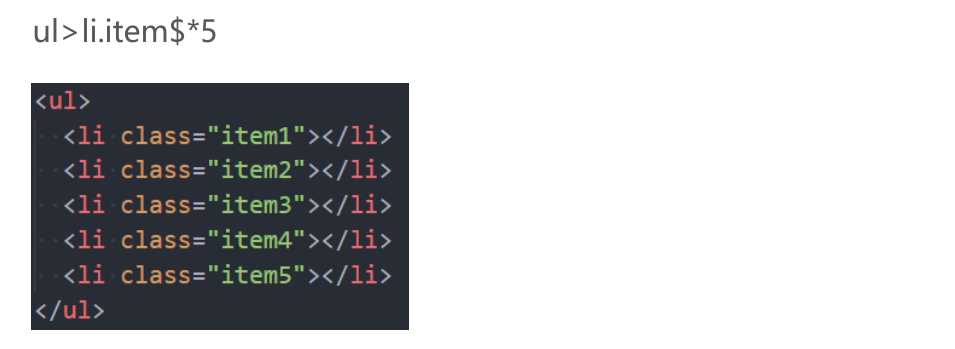
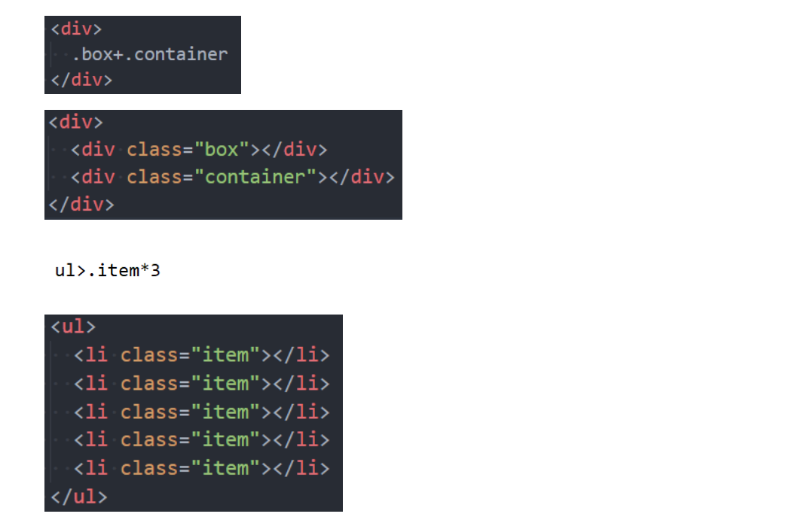
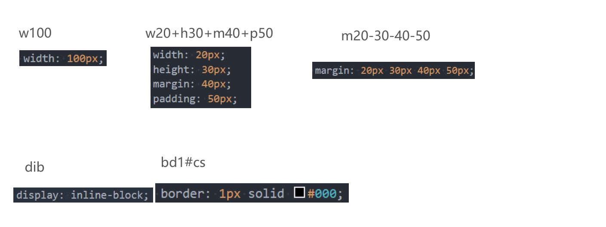

# 1.认识Emmet

## 1.1 认识emmet语法

```
Emmet (前身为 Zen Coding) 是一个能大幅度提高前端开发效率的一个工具.
 在前端开发的过程中，一大部分的工作是写 HTML、CSS 代码, 如果手动来编写效果会非常低.
 VsCode内置了Emmet语法,在后缀为.html/.css中输入缩写后按Tab/Enter键即会自动生成相应代码

!和html:5可以快速生成完整结构的html5代码
```



# 2.常见Emmet语法

## 2.1 >（子代）和+（兄弟）



## 2.2 *（多个）和^（上一级）



## 2.3 ()（分组）



## 2.4 属性(id属性、class属性、普通属性) {}（内容）



## 2.5 $（数字）



## 2.6 隐式标签



## 2.7 CSS Emmet



# 3.常见的结构伪类

## 3.1 结构伪类 - :nth-child

```
◼ :nth-child(1)
 是父元素中的第1个子元素
◼ :nth-child(2n)
 n代表任意正整数和0
 是父元素中的第偶数个子元素（第2、4、6、8......个）
 跟:nth-child(even)同义
◼ :nth-child(2n + 1)
 n代表任意正整数和0
 是父元素中的第奇数个子元素（第1、3、5、7......个）
 跟:nth-child(odd)同义
◼ nth-child(-n + 2)
 代表前2个子元素
```

## 3.2 结构伪类 - :nth-last-child( )

````
◼ :nth-last-child()的语法跟:nth-child()类似，不同点是:nth-last-child()从最后一个子元素开始往前计数
 :nth-last-child(1)，代表倒数第一个子元素
 :nth-last-child(-n + 2)，代表最后2个子元素
◼ :nth-of-type()用法跟:nth-child()类似
 不同点是:nth-of-type()计数时只计算同种类型的元素
◼ :nth-last-of-type()用法跟:nth-of-type()类似
 不同点是:nth-last-of-type()从最后一个这种类型的子元素开始往前计数
````

## 3.3 结构伪类 - :nth-of-type( )、:nth-last-of-type( )

```
◼ 其他常见的伪类(了解):
 :first-child，等同于:nth-child(1)
 :last-child，等同于:nth-last-child(1)
 :first-of-type，等同于:nth-of-type(1)
 :last-of-type，等同于:nth-last-of-type(1)
 :only-child，是父元素中唯一的子元素
 :only-of-type，是父元素中唯一的这种类型的子元素
◼ 下面的伪类偶尔会使用:
 :root，根元素，就是HTML元素
 :empty代表里面完全空白的元素
```

# 4.否定伪类的使用

## 4.1 否定伪类（negation pseudo-class）

```
◼ :not()的格式是:not(x)
 x是一个简单选择器
 元素选择器、通用选择器、属性选择器、类选择器、id选择器、伪类（除否定伪类）
◼ :not(x)表示除x以外的元素
```

