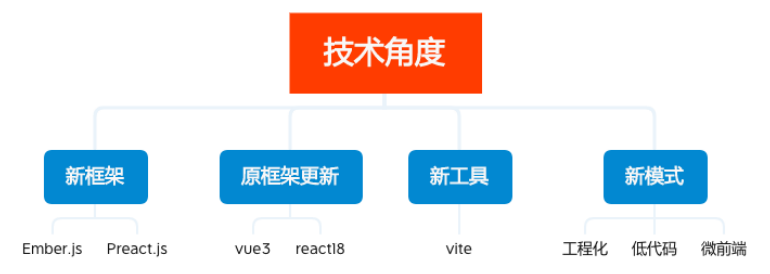
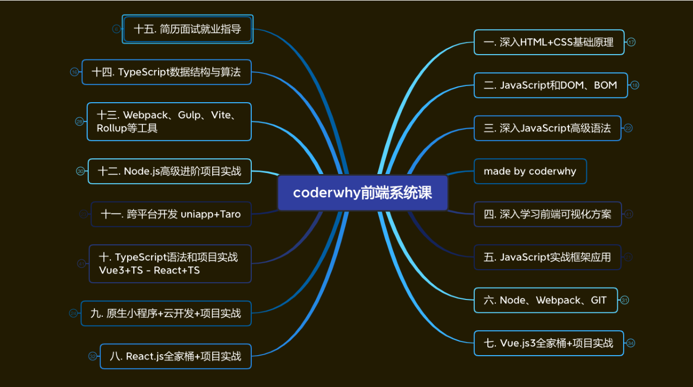

# 1.自我介绍、课前提醒

## 1.1 课前提醒

**课前提醒**

```
相互尊重、共同进步；
每个同学的学习经历、知识存储不同，我们的课程是针对于所有想要学习前端，学好前端的同学准备的；
```

 **所有的内容都是从零开始的：**

```
比如包括什么是软件开发？什么是应用程序？什么是前端工程师？
比如一个网页从你开始编写的那一刻到用户浏览器上可以显示，它到底经历了什么样的一段旅程；
比如什么是HTML、什么是CSS，这些东西给到浏览器，浏览器到底是如何给你显示的；
```

**课程里面我会着重强调和补充一些东西：**

```
比如开发规范、代码规范、封装思想；
比如额外补充很多其他知识：网络协议、操作系统、编译原理、数据结构；
```

**保持“空杯心态”，才能持续不断的进步。**

**软件的专业定义**

```
专业的软件定义：一系列按照特定顺序组织的计算机数据和指令，是电脑的非有型部分。
软件开发是什么呢？就是告诉计算机一系列的指令，这些指令也称之为 程序。
开发软件的这部分人就称之为 软件开发工程师，也称之为程序员。
```

# 2.软件开发和程序员

# 3.前端开发整体概览

前端开发工程师

```
开发系统中各个环节的不同部分都属于软件开发：
这些开发者我们称之为软件开发工程师；
开发者、程序员、码农、IT民工等等；
coder、programmer、developer；

按照职能的不同也可以划分两类：
后端（Back-end）开发，称之为后端开发工程师；
前端（Front-end）开发，称之为前端开发工程师；

前端开发工程师：
主要负责的：Web（网站、后台管理系统、手机H5）、小程序端；
也可以做：移动端（Uniapp、React Native）、桌面端（Electron）、服务器开发（Node.js）；
```

前端行业发展怎么样？

```
为什么要聊这个话题呢？
时代的一粒灰，落在个人头上，就是一座山；
如何行业已经停滞，甚至是倒退，没有需求，那么你如何努力也改变不了现状；

技术角度：
新框架（Ember.js、Preact.js）、框架更新迭代（vue3、react18）、新工具（Vite）、新模式（工程化、低代码、微
前端） 层出不穷；
```



# 4.前端技术发展路线

技术发展线路（一）

```
初级程序员（薪资6k-10k，1~2年）
写一些简单的业务，负责项目某些模块的开发、维护；
遇到很多问题不知道如何处理，需要查询资料或者交流后可以解决；
代码通常写的杂乱无章，能用就行！

中级程序员（薪资10k-20k，2~4年）
可以独立负责中小型项目，负责公司项目核心业务的开发、维护；
遇到大多数问题可以自行查到解决方案，有一定的自学能力，通过官网文档可以自学；
代码质量较高，遵守代码规范，并且会对组内其他人的代码有要求；

高级程序员（薪资20k-50k，4~6年）
独立负责中大型项目，可以为公司项目搭建架构，创建内部的脚手架，公司内部的UI框架；
可以读懂框架源码，并且从一些开源框架中借鉴优秀的设计、架构、思想；
公司的核心员工，具备可替代性，成为公司技术不可或缺的一部分；
```

技术发展线路（二）

```
系统架构师（50k~）
可以对大型项目进行系统架构，不再局限于某个领域（前端、后端?）或者某项技术（JavaScript、Java、C++?）；
对技术领域 现有技术方案进行评估，对不同的场景给出对应的解决方案；
确定项目最终方案，并且对整个项目进行“核心架构”（包括完成 核心架构 实现的能力）；
保证项目的各个环节有序进行，包括项目的高性能、高可用、可扩展能力；

资深技术专家（50k~）
专注于某一个特定领域
比如前端包括不限于对框架源码、node、js引擎进行定制化需求、优化；
比如后端包括不仅限于JVM、线程池、SQL调试、优化；
比如可以主导公司项目某些特定领域技术的落地，类似流媒体、即时通信技术等；
某些人在行业内有一定的影响力，是某一块技术领域的Top人物；
```



# 5.学前答疑、学习建议

**学前疑惑解答**

````
英文水平：熟悉简单的英文，会使用翻译软件（常用但是不熟悉的单词经常回顾一些）
智商：认真、努力、专注（大多数人还不到拼天赋的程度）
学历要求：软件行业是一个相对公平的行业；
如果你想要公平，就来参加体育比赛，如果你想要绝对的公平，就不要来参加体育比赛；
计算机专业：不一定要计算机专业，会使用计算机就行
````

**学习方法、学习建议**

```
如何学习新的知识？
《JavaScript高级程序设计》的作者Nicholas C.Zakas，也是ESLint的作者；
在他的博客有说到：想要全面的掌握JavaScript，关键在于弄清楚它的历史、局限性和本质；
我个人非常认同这个观点，并且我认为不仅仅局限于JavaScript，而是对任何技术都是适用的。
```

**学习技术也是为了解决问题的**。

那么知识点这么多，能全部掌握吗？
将知识进行分类：


每个小视频标注：

```
（掌握）必须完全掌握
（理解）理解过程原理
（了解）知道有这么回事
```

**课程讲授的方式**

```
课程的一些设计思路：
1. 整体课程会按照大纲的顺序来讲，某些部分我会进行一些顺序的调整；
2. 相比于过去网络上的资料、课程，会删除目前已经不再使用的技术（现代开发根本用不上的东西）。
3. 核心重点的东西必须掌握，包括我额外补充的内容，我会在课堂上反复强调。
```

**不积跬步无以至千里**

```
每天比前一天的自己进步一点点
我为什么如此出色? – 乔丹
我会努力争取每一天都能取得一点进步，我需
要回顾昨天，感觉今天比昨天好就足够。一天
一点进步，那一辈子该有多少的飞跃呀!
```

