# 1.电脑配置、推荐软件

## 1.1 电脑配置 – 显示隐藏文件和扩展名

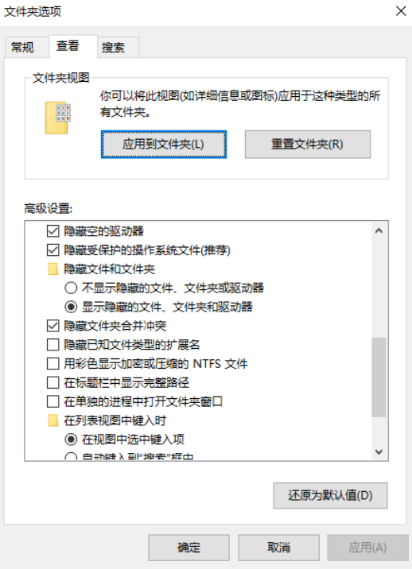

## 1.2 推荐安装的软件

`Chrome浏览器：开发必备浏览器`
https://www.google.cn/chrome/index.html
`VSCode编辑器：开发推荐编辑器（编写代码）`
https://code.visualstudio.com/
`Xmind Zen思维导图：思维导图笔记`
https://www.xmind.cn/
`Typora：markdown笔记软件`

# 2.网站和网页的关系

## 2.1 认识网页和网站

 **什么是网页？**

```
网页的专业术语叫做 Web Page；
打开浏览器查看到的页面，是网络中的一“页”；
网页的内容可以非常丰富：包括文字、链接、图片、音乐、视频等等
```

**网站是什么呢？**

```
网站是由多个网页组成的；
通常一个网站由N个网页组成（N >= 1）；
```

# 3.网页的显示过程

## 3.1 网页的显示过程 – 用户角度

1.用户在浏览器输入一个网站；
2.浏览器会找到对应的服务器地址，请求静态资源（可以存放在世界上任何一个地方）；
3.服务器返回静态资源给浏览器；
4.浏览器对静态资源进行解析和展示；

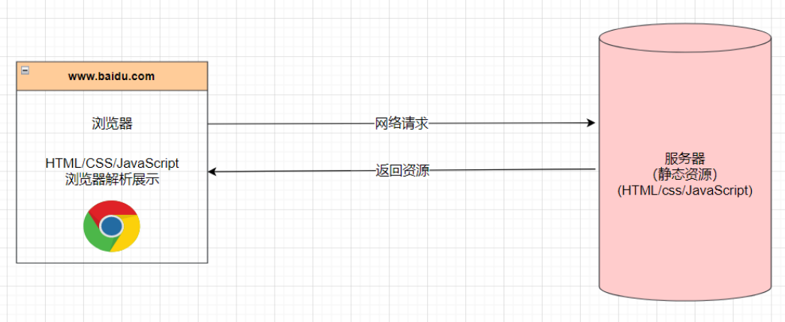

## 3.2 网页的显示过程 – 前端工程师

1.开发项目（HTML/CSS/JavaScript/Vue/React）
2.打包、部署项目到服务器里面

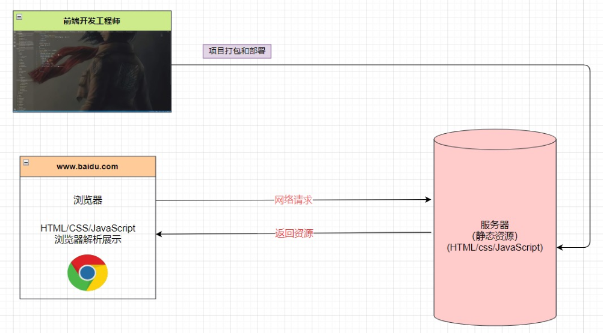

## 3.3 服务器是什么？

我们日常生活接触到的基本都属于客户端、前端的内容：
比如浏览器、微信、QQ、小程序；
我们知道自己的手机并不可能存放哪些多的数据和资源：
比如你用《网易云听音乐》，音乐数据大部分都是存在“服务器”中的；

那么服务到底是什么呢？
服务器本质上也是一台类似于你电脑一样的主机；
但是这个主机有几个特点：
二十四小时不关机的（稳定运行）；
没有显示器的；
一般装的是Linux操作系统（比如centos）；
那么我以后到公司是不是就看得见服务器了呢？
目前公司大部分用的是云服务器（比如阿里云、腾讯云、华为云）；

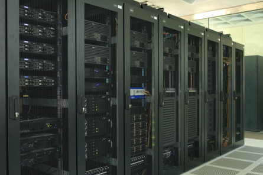

## 3.4 世界上第一个网页

上世纪90年代，Berners-Lee上线了世界上第一个网站：
http://info.cern.ch/hypertext/WWW/TheProject.html

虽然目前我们会认为这个网页简单到不值一提，但是在当时它的发明是“天才之作”。

**现代的网页已经非常复杂**


# 4.网页的组成部分

## 4.1 网页的组成

那么网页是由什么开发出来的呢？
阶段一：HTML元素；
阶段二：HTML元素 + CSS样式；
阶段三：HTML元素 + CSS样式 + JavaScript语言；

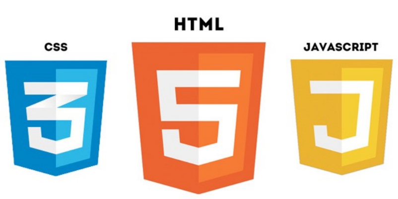

`HTML`
网页的内容结构

`CSS`
网页的视觉体验

`JavaScript`
网页的交互处理

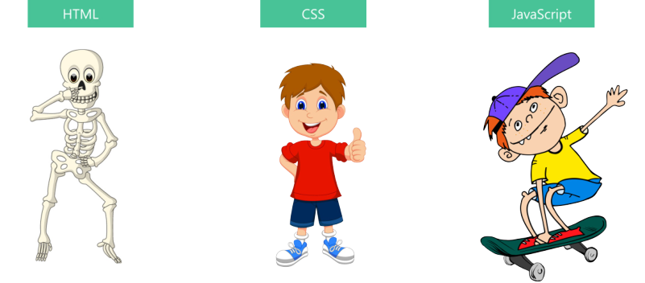

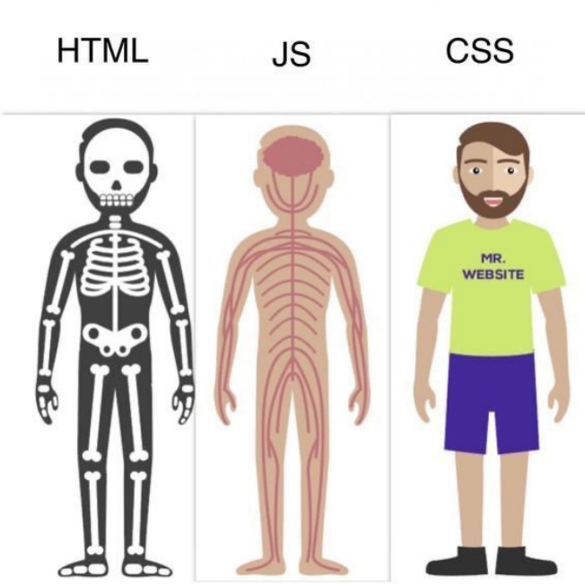

## 4.2 网页源代码的角度

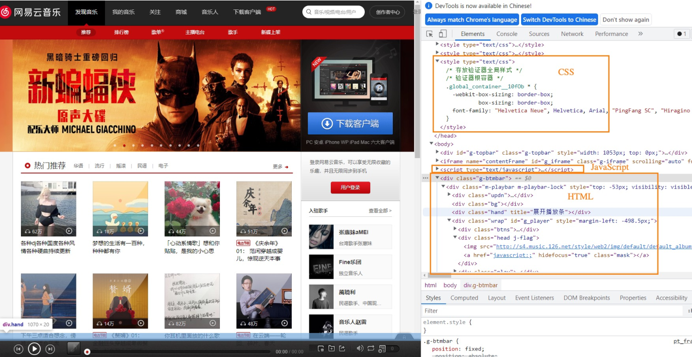

## 4.3 网页开发的角度

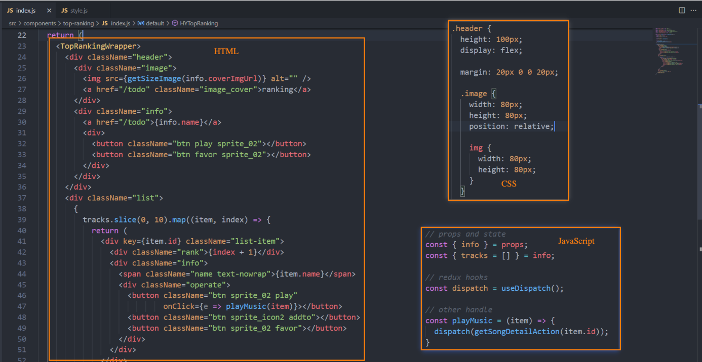

# 5.浏览器和浏览器内核

## 5.1 浏览器的作用

我们已经明确知道了网页的组成部分：HTML + CSS + JavaScript。
那么这些看起来枯燥的代码，是如何被渲染成多彩的网页呢？
我们知道是通过浏览器来完成；

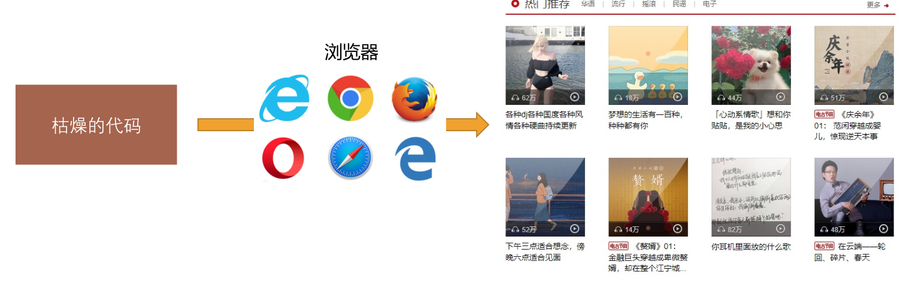

浏览器最核心的部分其实是 “浏览器内核”；

## 5.2 浏览器的渲染引擎

浏览器最核心的部分是渲染引擎（Rendering Engine），一般也称为“浏览器内核”
负责解析网页语法，并渲染（显示）网页

常见的浏览器有很多：

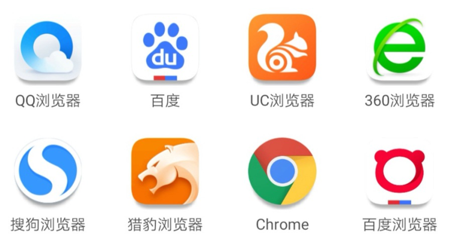

 课堂上必须安装的浏览器：Chrome浏览器（所有讲解也会基于这个浏览器）

不同浏览器的内核

常见的浏览器内核有
Trident （ 三叉戟）：IE、360安全浏览器、搜狗高速浏览器、百度浏览器、UC浏览器；
Gecko（ 壁虎） ：Mozilla Firefox；
Presto（急板乐曲）-> Blink （眨眼）：Opera
Webkit ：Safari、360极速浏览器、搜狗高速浏览器、移动端浏览器（Android、iOS）
Webkit -> Blink ：Google Chrome


不同的浏览器内核有不同的解析、渲染规则，所以同一网页在不同内核的浏览器中的渲染效果也可能不同。