# 1.第一个网页

## 1.1 开发第一个网页 – 记事本

**新建一个.txt的文件**
在其中添加一些文字，比如Hello World
保存文件
修改文件的扩展名为.html文件
使用浏览器打开页面

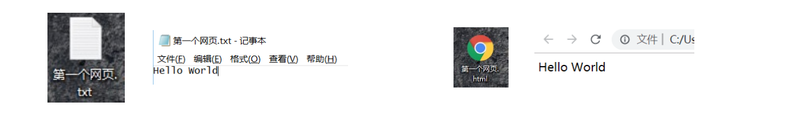

**这个网页有什么缺点？**
只能显示一段普通的文本；
浏览器不知道是否要对这段文本加粗、放大、段落之间的间距；

## 1.2 案例 – 显示一条新闻

如果我们现在有一条新闻需要显示，那么可以通过某些“元素”来告知浏览器这部分内容如何显示

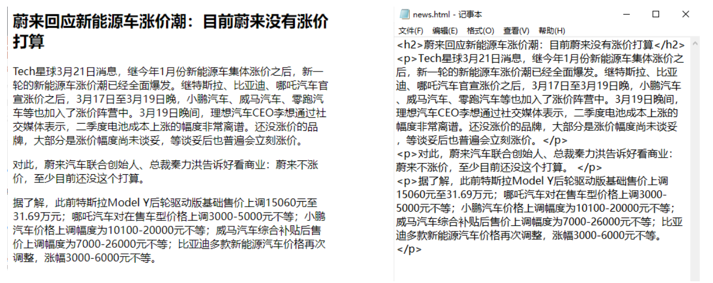

 而我们编写的<h2></h2>，

就是HTML元素；

# 2.认识HTML

## 2.1 认识HTML

 超文本标记语言（英语：HyperText Markup Language，简称：HTML）是一种用于创建网页的标准标记语言。
HTML元素是构建网站的基石；

什么是标记语言（markup language ）？

由无数个标记（标签、tag)组成；
是对某些内容进行特殊的标记，以供其他解释器识别处理；
比如使用<h2></h2>标记的文本会被识别为“标题”进行加粗、文字放大显示；
由标签和内容组成的称为元素（element）

什么是超文本（ HyperText ）呢？

表示不仅仅可以插入普通的文本（Text），还可以插入图片、音频、视频等内容；
还可以表示超链接（HyperLink），从一个网页跳转到另一个网页；

## 2.2 HTML文件的特点 – 扩展名（后缀名）

**HTML文件的拓展名是.htm\.html**
因历史遗留问题，Win95\Win98系统的文件拓展名不能超过3字符，所以使用.htm
现在统一使用 .html

**HTML文件的特点 – 结构**

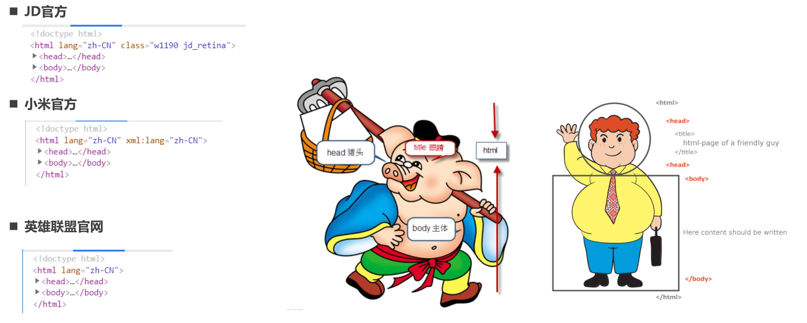

改进自己的网页

修改自己的网页代码，让自己的网页也具备正确的结构：

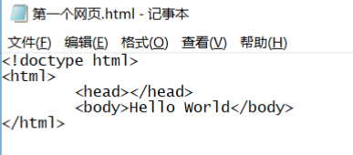

 运行效果是一样的，但是我们现在的网站也有正确的结构了

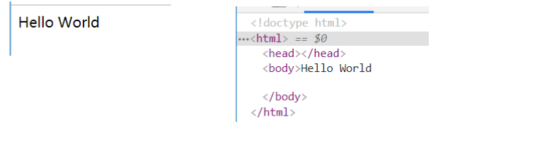

# 3.开发工具

## 3.1 开发工具

 **记事本可以开发一个网页吗？答案：可以。但是有很多的缺点：**
创建和管理文件不方便；
没有颜色标识/没有智能提示/无法调试程序；

**专业的前端开发工具**
 WebStorm、Sublime Text、Visual Studio Code、Atom、HBuilder、IntelliJ IDEA、Dreamweaver
智能提示、高亮识别、语法检测、集成环境、开发效率高

**上课推荐开发工具：**
Webstorm
优点：集成开发工具，包罗万象
缺点：重（占用系统资源多），收费
VSCode（上课使用）
优点：轻（相当于一个编辑器），免费
缺点：需要安装一些插件来辅助开发

## 3.2 VSCode工具安装

 VSCode编辑器下载-安装：https://code.visualstudio.com/
安装插件（增加功能）：右侧图标最后一项，Extensions，查找需要的插件（联网）
中文插件：Chinese
颜色主题：atom one dark
文件夹图标：VSCode Great Icons
在浏览器中打开网页：open in browser、Live Sever
自动重命名标签：auto rename tag
VSCode的配置：
Auto Save 自动保存
Font Size 修改代码字体大小
Word Wrap 代码自动换行
Render Whitespace 空格的渲染方式(个人推荐)
Tab Size 代码缩进
推荐2个空格（公司开发项目基本都是2个空格）

# 4.HTML元素（重点）

## 4.1 认识元素

我们会发现HTML本质上是由一系列的元素（Element）构成的；
 什么是元素（Element）呢？
元素是网页的一部分；
一个元素可以包含一个数据项，或是一块文本，或是一张照片，亦或是什么也不包含；

那么HTML有哪些元素呢？
https://developer.mozilla.org/zh-CN/docs/Web/HTML/Element
我们会发现元素非常非常的多，这么多能记得住吗？
常用的，用的多自然就记住了；
常用的，知道在哪里查找即可；

## 4.2 元素的组成

剖析一个HTML元素的组成：

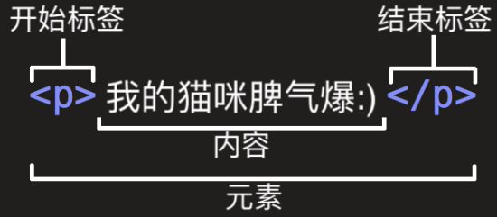

这个元素的主要部分有：
1. 开始标签（Opening tag）：包含元素的名称（本例为 p），被左、右尖括号所包围。表示元素从这里开始或者开始起作用 ——
在本例中即段落由此开始。
2. 结束标签（Closing tag）：与开始标签相似，只是其在元素名之前包含了一个斜杠。这表示着元素的结尾 —— 在本例中即段落
在此结束。初学者常常会犯忘记包含结束标签的错误，这可能会产生一些奇怪的结果。
3. 内容（Content）：元素的内容，本例中就是所输入的文本本身。
4. 元素（Element）：开始标签、结束标签与内容相结合，便是一个完整的元素。

## 4.3 元素的属性

 元素也可以拥有属性（Attribute）：

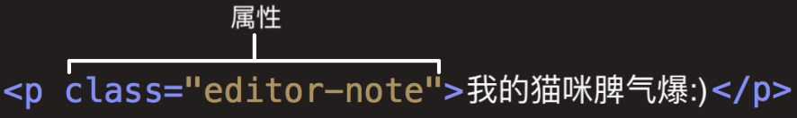

属性包含元素的额外信息，这些信息不会出现在实际的内容中。
一个属性必须包含如下内容：

1. 一个空格，在属性和元素名称之间。(如果已经有一个或多个属性，就与前一个属性之间有一个空格。)
2. 属性名称，后面跟着一个等于号。
3. 一个属性值，由一对引号“ ”引起来。

**创建一个超链接元素a：**

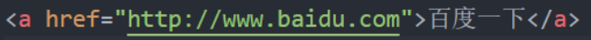

## 4.4 属性的分类

有些属性是公共的，每一个元素都可以设置
比如class、id、title属性
有些属性是元素特有的，不是每一个元素都可以设置
比如meta元素的charset属性、img元素的alt属性等

## 4.5 单标签元素 – 双标签元素

双标签元素：我们会发现前面大部分看到的元素都是双标签的；
html、body、head、h2、p、a元素；
单标签元素：也有一些元素是只有一个标签；
br、img、hr、meta、input；

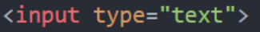

注意事项：
HTML元素不区分大小写，但是推荐小写

## 4.6 元素的结构总结

元素的结构回顾：

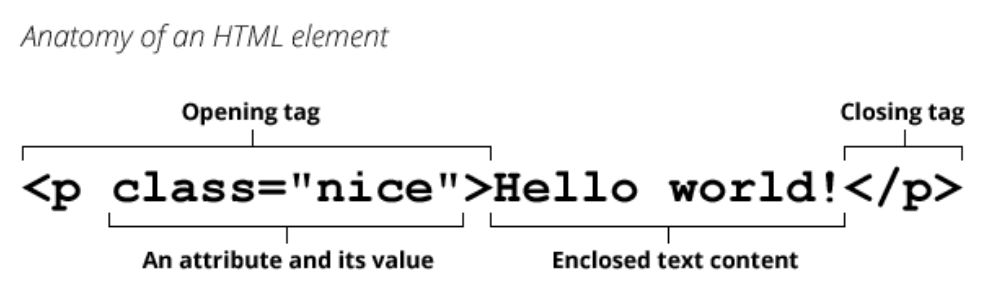

元素的嵌套关系

 某些元素的内容除了可以是文本之外，还可以去其他元素，这样就形成了元素的嵌套。

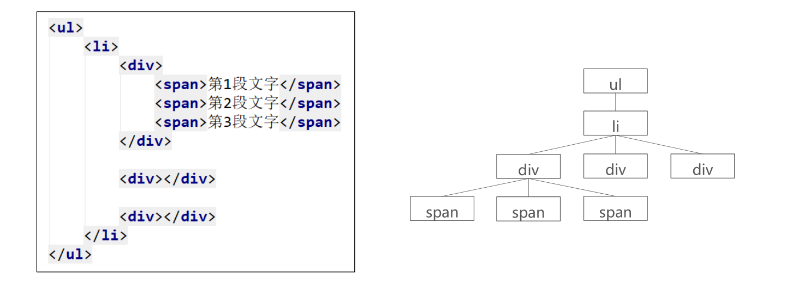

# 5.注释编写

## 5.1 为什么需要注释？

**程序员才懂的冷笑话:**

 在我写这段代码的时候, 只有我和上帝知道这段代码是什么意思.
 一段时间之后, 只有上帝知道是什么意思了.

**为什么会出现这样的情况呢?**
随着学习的深入, 你的一个程序不再是几行代码就可以搞定的了.
可能我们需要写出有上千行, 甚至上万行的程序.
某些代码完成某个功能后, 你写的时候思路很清晰, 但是过段时间会出现忘记为什
么这样写的情况, 这很正常.

**和同时协同开发**
在实际工作中, 一个项目通常是多人协作完成的. 可能是几个或者十几个等等.
这个时候, 你可能需要使用别人写出的代码功能, 别人也可能使用你的代码功能.
如果你的代码自己都看不懂了, 更何况你的同事呢?

## 5.2 HTML的注释

什么是注释？
简单来说，注释就是一段代码说明
<!-- 注释内容 -->
注释是只给开发者看的，浏览器并不会把注释显示给用户看
注释的意义:
帮助我们自己理清代码的思路, 方便以后进行查阅.
与别人合作开发时, 添加注释, 可以减少沟通成本.(同事之间分模块开发)
开发自己的框架时, 加入适当的注释, 方便别人使用和学习.(开源精神)
可以临时注释掉一段代码, 方便调试.

**注释快捷键：ctrl + /**

