# 1.HTML结构分析

## 1.1 完整的HTML结构

一个完整的HTML结构包括哪几部分呢？
文档声明
html元素
✓ head元素
✓ body元素

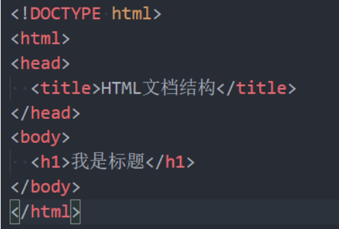

## 1.2 文档声明

HTML最上方的一段文本我们称之为 文档类型声明，用于声明文档类型
<!DOCTYPE html>
HTML文档声明，告诉浏览器当前页面是HTML5页面；
让浏览器用HTML5的标准去解析识别内容；
必须放在HTML文档的最前面，不能省略，省略了会出现兼容性问题

HTML5的文档声明比HTML 4.01、XHTML 1.0简洁非常多(了解即可)

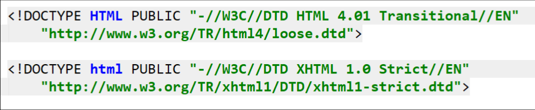

## 1.3 html元素

<html> 元素 表示一个 HTML 文档的根（顶级元素），所以它也被称为根元素。
所有其他元素必须是此元素的后代。

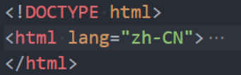

W3C标准建议为html元素增加一个lang属性，作用是
帮助语音合成工具确定要使用的发音;
帮助翻译工具确定要使用的翻译规则;

比如常用的规则：

lang=“en”表示这个HTML文档的语言是英文；
lang=“zh-CN”表示这个HTML文档的语言是中文；

## 1.4 head元素

HTML head 元素 规定文档相关的配置信息（也称之为元数据），包括文档的标题，引用的文档样式和脚本等。
什么是元数据（meta data），是描述数据的数据；
这里我们可以理解成对整个页面的配置：

常见的设置有哪些呢？一般会至少包含如下2个设置。
网页的标题：title元素

网页的编码：meta元素
可以用于设置网页的字符编码，让浏览器更精准地显示每一个文字，不设置或者设置错误会导致乱码；
一般都使用utf-8编码，涵盖了世界上几乎所有的文字；

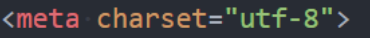

## 1.5 body元素

body元素里面的内容将是你在浏览器窗口中看到的东西，也就是网页的具体内容和结构。
之后学习的大部分HTML元素都是在body中编写呈现的；

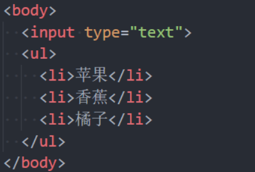

# 2.h1~h6、p元素

## 2.1 HTML元素

HTML元素本身很多，但是常用的元素就是那么几个。
https://developer.mozilla.org/zh-CN/docs/Web/HTML/Element
我们只需要记住常用的，不常用的学会查看文档即可；
常用的元素（暂时掌握下面几个就够了，90%时间都在写这几个）：
p元素、h元素；
img元素、a元素、iframe元素；
div元素、span元素；
下阶段学习的元素：
ul、ol、li元素；
button元素、input元素；
table、thead、tbody、thead、th、tr、td；
HTML5新增元素（后续学习）

## 2.2 案例分析 – 使用什么元素

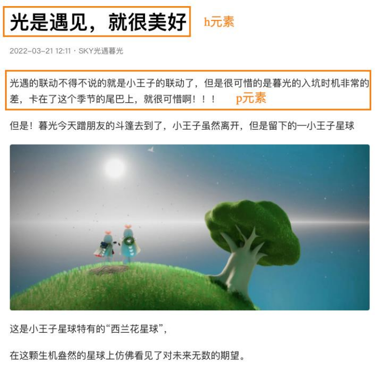

## 2.3 常见元素 – h元素

在一个页面中通常会有一些比较重要的文字作为标题，这个时候我们可以使用h元素。
`<h1>–<h6> 标题 (Heading) 元素呈现了六个不同的级别的标题`
Heading是头部的意思，通常会用来做标题
`<h1> 级别最高，而 <h6> 级别最低。`

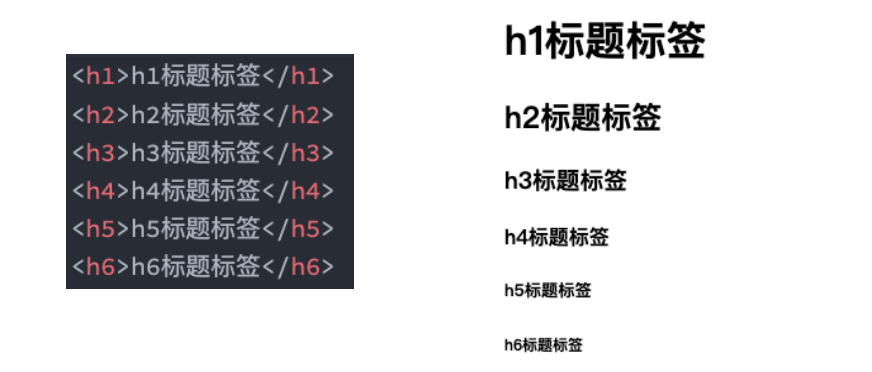

◼ 注意：h元素通常和SEO优化有关系（什么是SEO，后续再介绍）

## 2.4 常见元素 – p元素

如果我们想表示一个段落，这个时候可以使用p元素。
`HTML 
元素（或者说 HTML 段落元素）表示文本的一个段落。`
`p元素是paragraph单词的缩写，是段落、分段的意思；`
`p元素多个段落之间会有一定的间距；`

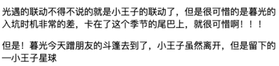

**案例练习**

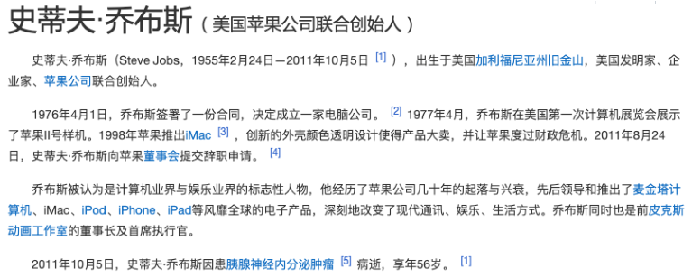

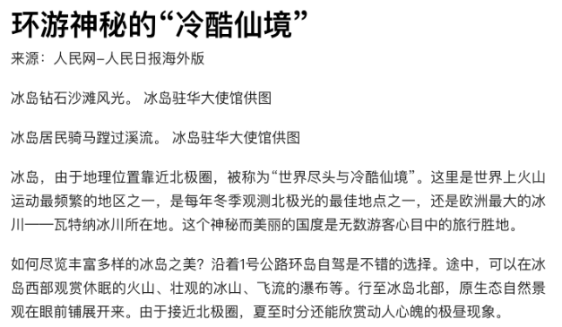

# 3.img，a，iframe元素

## 3.1 常见元素 - img元素

我们应该如何告诉浏览器来显示一张图片呢？使用img元素。
`HTML  元素将一份图像嵌入文档。`
`img是image单词的所以，是图像、图像的意思；`
事实上img是一个可替换元素（ replaced element ）；

img有两个常见的属性：
src属性：source单词的缩写，表示源
是必须的，它包含了你想嵌入的图片的文件路径。
alt属性：不是强制性的，有两个作用
作用一：当图片加载不成功（错误的地址或者图片资源不存在），那么会显示这段文本；
作用二：屏幕阅读器会将这些描述读给需要使用阅读器的使用者听，让他们知道图像的含义

某些其他属性目前已经不再使用
比如width、height、border

## 3.2 img元素 - 图片的路径

设置img的src时，需要给图片设置路径：
网络图片：一个URL地址（后续会专门讲URL）；
网络图片的设置非常简单，给一个地址即可；
本地图片：本地电脑上的图片，后续会和html一起部署到服务；

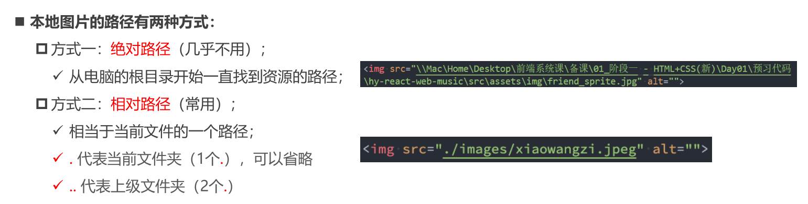

`对于网页来说，不管什么操作系统（Windows、Mac、Linux），路径分隔符都是 /，而不是 \`

## 3.3 img元素 - 图片的格式

` img元素支持的图片格式非常多：`

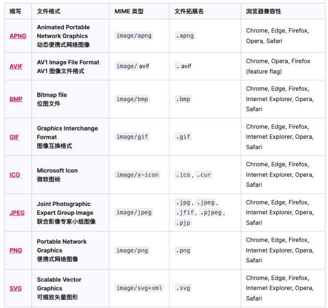

## 3.4 常见元素 – a元素

在网页中我们经常需要跳转到另外一个链接，这个时候我们使用a元素；
HTML <a> 元素（或称锚（anchor）元素）：
定义超链接，用于打开新的URL；
a元素有两个常见的属性：
href：Hypertext Reference的简称
指定要打开的URL地址；
也可以是一个本地地址；
target：该属性指定在何处显示链接的资源。

 _self：默认值，在当前窗口打开URL；
 _blank：在一个新的窗口中打开URL；
其他不常用, 后面iframe可以讲一下；

**案例练习**

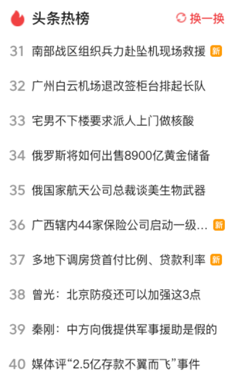

## 3.5 a元素 - 锚点链接

锚点链接可以实现：跳转到网页中的具体位置
锚点链接有两个重要步骤：
在要跳到的元素上定义一个id属性；
定义a元素，并且a元素的href指向对应的id；

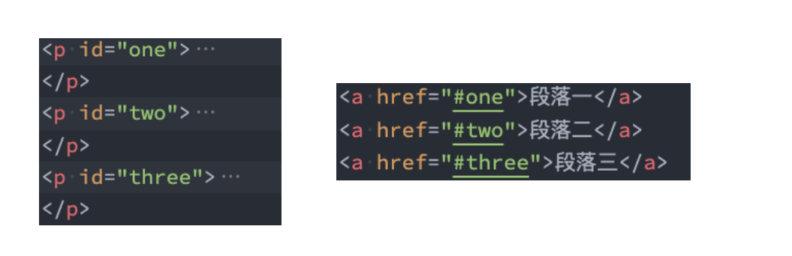

## 3.6 a元素 - 图片链接

在很多网站我们会发现图片也是可以点击进行跳转的

img元素跟a元素一起使用，可以实现图片链接；

 实现思路：
a元素中不存放文字，而是存放一个img元素；
也就是img元素是a元素的内容；

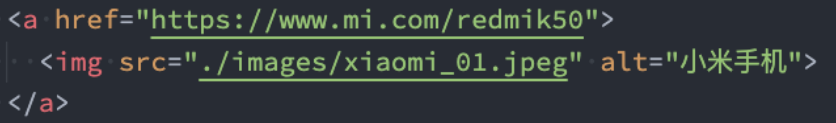

## 3.7 a元素 – 其他URL地址

`a元素一定是用来跳转到新网页的么？`
https://github.com/coderwhy/HYMiniMall/archive/master.zip
 mailto:12345@qq.com

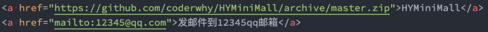

## 3.8 iframe元素

利用iframe元素可以实现：在一个HTML文档中嵌入其他HTML文档
frameborder属性
用于规定是否显示边框
1：显示
0：不显示
a元素target的其他值:
_parent：在父窗口中打开URL
_top：在顶层窗口中打开URL

# 4.div，span元素

## 4.1 div元素、span元素的历史

在HTML中有两个特殊的元素div元素、span元素：
div元素：division，分开、分配的意思；
span元素：跨域、涵盖的意思；
这两个元素有什么作用呢？无所用、无所不用。
产生的历史：
网页的发展早期是没有css，这个时候我们必须通过语义化元素来告知浏览器一段文字如何显示；
后来出现了css，结构和样式需要分离，这个时候html只需要负责结构即可；
比如h1元素可以是一段普通的文本+CSS修饰样式；
这个时候就出现了div、span来编写HTML结构所有的结构，样式都交给css来处理；
所以，理论上来说：
我们的页面可以没有div、span；
我们的页面也可以全部都是div、span；

## 4.2 div元素、span元素的区别

这个时候有一个问题：我出现一个不就可以了吗？
div元素和span元素都是“纯粹的” 容器，也可以把他们理解成“盒子”，它们都是用来包裹内容的；
div元素：多个div元素包裹的内容会在不同的行显示；
一般作为其他元素的父容器，把其他元素包住，代表一个整体
用于把网页分割为多个独立的部分
span元素：多个span元素包裹的内容会在同一行显示；
默认情况下，跟普通文本几乎没差别
用于区分特殊文本和普通文本，比如用来显示一些关键字

# 5.不常用元素

## 5.1 不常用元素

strong元素：内容加粗、强调；
通常加粗会使用css样式来完成；
开发中很偶尔会使用一下；
i元素：内容倾斜；
通常斜体会使用css样式来完成；
开发中偶尔会用它来做字体图标（因为看起来像是icon的缩写）；
code元素：用于显示代码
偶尔会使用用来显示等宽字体；
br元素：换行元素
开发中已经不使用；
更多元素详解，查看MDN文档：
https://developer.mozilla.org/zh-CN/docs/Web/HTML/Element

# 6.HTML全局属性

## 6.1 HTML全局属性

我们发现某些属性只能设置在特定的元素中：
比如img元素的src、a元素的href；
也有一些属性是所有HTML都可以设置和拥有的，这样的属性我们称之为 “全局属性（Global Attributes）”
全局属性有很多：https://developer.mozilla.org/zh-CN/docs/Web/HTML/Global_attributes
常见的全局属性如下：
id：定义唯一标识符（ID），该标识符在整个文档中必须是唯一的。其目的是在链接（使用片段标识符），脚本或样
式（使用 CSS）时标识元素。
class：一个以空格分隔的元素的类名（classes ）列表，它允许 CSS 和 Javascript 通过类选择器或者DOM方法来选
择和访问特定的元素；
style：给元素添加内联样式；
title：包含表示与其所属元素相关信息的文本。 这些信息通常可以作为提示呈现给用户，但不是必须的。